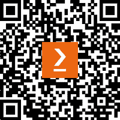

# 前言

《AWS 安全食谱》第二版讨论了安全顾问在确保其基础设施安全时所面临的最常见问题的实际解决方案。本书探讨了各种 AWS 服务和功能，这些服务和功能有助于实现安全模型和概念，例如**机密性、完整性和可用性**（**CIA**）三元组，**认证、授权和账务**（**AAA**）三元组，以及不可否认性。本书首先帮助您熟悉 AWS 的基本安全功能，如**身份与访问管理**（**IAM**）、账户别名和计费警报，然后深入探讨访问管理、密钥管理、数据安全、网络安全、Web 安全、监控、合规性、先进的身份管理以及其他安全服务和实践。在全书中，您将遇到诸如 IAM、AWS Organizations、IAM 身份中心、**密钥管理服务**（**KMS**）、CloudHSM、S3、**虚拟私有云**（**VPC**）、CloudWatch、CloudTrail、Config、GuardDuty、Macie、Inspector、安全中心、Cognito、资源访问管理器、Systems Manager 参数存储、Secrets Manager、Trusted Advisor 和 AWS Artifact 等 AWS 安全服务。每一章都侧重于重要的安全领域，并逐步推进到云安全最佳实践，并集成额外的安全服务。到本书结束时，您将精通与确保 AWS 部署相关的所有技术，并为 AWS 认证安全专家认证做好准备。

# 本书的适用对象

如果您是 IT 安全专业人员、云安全架构师或云应用开发人员，负责安全相关的角色，并希望使用 AWS 基础设施进行安全的应用部署，那么本书适合您。本书也将对有意参加 AWS 认证安全专家认证的人有帮助。

# 本书内容

*第一章*，*设置 AWS 账户和组织*，介绍了 AWS 安全性的重要功能，从设置 IAM 服务、账户别名和计费警报开始。它还涵盖了使用 AWS Organizations 进行多账户管理，并通过 IAM 身份中心进行用户管理，实现集中式身份创建和访问管理。完成本章内容后，您将为本书中讨论的企业级 AWS 安全管理概念做好准备。

*第二章*，*使用 IAM 策略和角色进行访问管理*，展示了在 AWS 中进行安全访问管理的重要性，用于控制谁能访问资源以及他们可以执行的操作，确保环境安全合规。本章涵盖了 IAM 策略、IAM 角色和各种策略类型，提供了详细的创建和管理策略、设置权限边界以及实施跨账户和跨服务访问的方法。这些知识对于建立跨 AWS 基础设施的强大和可扩展的安全姿态至关重要。

*第三章*，*使用 KMS 和 CloudHSM 进行密钥管理*，讲解了如何通过加密将明文转换为不可读的密文，以保护信息免受未经授权的访问，解密则反转此过程。使用 AWS `KMS` 和 CloudHSM，本章涵盖了创建、管理和保护加密密钥，支持对称和非对称加密。包括密钥创建、密钥轮换、权限管理和跨账户密钥共享的方法，以确保 AWS 中数据的强大保护。

*第四章*，*使用策略和技术在 S3 上保护数据*，专注于保护 Amazon S3，AWS 的对象存储服务，使用独特的键值系统存储数据。基于 *第二章* 的 IAM 策略，我们将探讨使用 **访问控制列表**（**ACLs**）、存储桶策略、预签名 URL、加密、版本控制和复制来保护 S3 数据。包括创建存储桶策略、使用 ACLs、生成预签名 URL、通过版本控制保护文件以及加密 S3 数据的方法。

*第五章*，*网络与 EC2 安全与 VPC*，涵盖了 Amazon VPC，这是 AWS 云中创建私有隔离网络的关键组件。用户可以完全控制其虚拟网络，允许自定义 IP 范围、子网、路由表和网关。本章包括设置 VPC 资源、创建子网、启动 EC2 实例、配置安全组和 NACLs、通过网关端点连接到 S3、使用 VPC 流日志以及设置 NAT 网关的方法。

*第六章*，*使用证书、CDN 和防火墙进行 Web 安全*，强调通过证书、**内容交付网络**（**CDNs**）和防火墙实现 Web 安全。涵盖了使用 X.509 证书进行 TLS 加密、利用负载均衡器进行有效的流量分发和 TLS 终止，以及利用 CDN 提升加载速度和安全性。此外，探讨了 AWS 内部防火墙的集成，以定义和执行网络安全边界。这些组件的实际实施提供了构建安全、可扩展 Web 基础设施的知识。

*第七章*，*通过 CloudWatch、CloudTrail 和 Config 进行监控*，探讨了通过 Amazon CloudWatch、AWS CloudTrail 和 AWS Config 进行安全监控和审计的作用。CloudWatch 负责日志记录、监控和警报；CloudTrail 记录 AWS API 调用；AWS Config 根据规则评估配置。本章还介绍了使用 **简单通知服务**（**SNS**）进行通知，并提供了设置这些服务和查询日志的实际操作示例。

*第八章*，*遵守 GuardDuty、Macie、Inspector 和 Analyzer*，详细介绍了定期合规检查和通知对于维护账户安全的重要性。本章介绍了 AWS 服务，如 Amazon GuardDuty、Amazon Macie 和 Amazon Inspector，这些服务利用机器学习和先进算法进行合规性监控。内容涵盖了设置和使用这些服务的实际步骤，以及 AWS 安全中心和 IAM 分析器，以进行全面的安全管理。

*第九章*，*高级身份与目录管理*，建立在前几章关于 IAM 的基础之上。它探讨了使用 Amazon Cognito 和 AWS 目录服务进行高级用户身份和目录管理。内容涵盖了 Cognito 的用户池用于用户注册和认证、身份池用于 AWS 服务访问，以及目录解决方案，如 AWS Simple AD 和与 Microsoft Entra ID 的集成。本章提供了实际的操作示例，但部分内容可能需要额外的 Microsoft 产品和 AWS 服务的知识。

*第十章*，*AWS 安全的附加服务与实践*，探讨了额外的 AWS 安全服务和实践，以进一步保障您的 AWS 基础设施安全。它介绍了 AWS 资源访问管理器、系统管理器参数存储、Secrets Manager、Trusted Advisor 和 AWS Artifact，以及 `Amazon Machine Images`（**AMIs**）和 AWS Marketplace 安全产品的使用。每项服务都有实际操作示例，并附有进一步学习资源以供更深层次的探索。

# 为了最大化地利用本书

要练习本书中的示例，您需要一个有效的 AWS 账户。您应该已经具备一些关于 AWS 服务的基础知识，如 IAM、S3、EC2 和 VPC。此外，了解云计算、计算机网络和 IT 安全的基本知识，可以帮助您更快地掌握本书内容。

**如果您使用的是本书的数字版本，我们建议您自己输入代码，或者通过 GitHub 仓库访问代码（链接将在下一节提供）。这样做将帮助您避免与复制和粘贴代码相关的潜在错误。**

## 下载示例代码文件

你可以从 GitHub 下载本书的示例代码文件，链接为 [`github.com/PacktPublishing/AWS-Security-Cookbook-Second-Edition`](https://github.com/PacktPublishing/AWS-Security-Cookbook-Second-Edition)。如果代码有更新，它将在 GitHub 仓库中更新。

我们还提供了其他来自我们丰富书籍和视频目录的代码包，访问 [`github.com/PacktPublishing/`](https://github.com/PacktPublishing/) 了解更多信息。

# 实践中的代码

本书的 *实践中的代码* 视频可以在 [`bit.ly/2OQfDum`](http://bit.ly/2OQfDum) 观看。

# 使用的约定

本书中使用了多种文本约定。

**文本中的代码**：表示文本中的代码单词、数据库表名、文件夹名、文件名、文件扩展名、路径名、虚拟网址、用户输入和 Twitter 句柄。以下是一个示例：“创建一个存储桶策略，允许我们的`awsseccb_user1` 用户访问，并将其保存为`bucket-policy-allow-list.json`：”

代码块的设置如下：

```
 "Principal": {
  "AWS": [
    "arn:aws:iam::873506153865:root",
    "arn:aws:iam::671100771477:root"
  ]
}
```

任何命令行输入或输出如下所示：

```
 aws sts assume-role --role-arn ROLE_ARN --role-session-name SESSION_NAME --profile AWSSecCBUser1S --external-id awssecb-cust-0819
```

**粗体**：表示新术语、重要单词或屏幕上看到的单词。例如，菜单或对话框中的单词会像这样出现在文本中。以下是一个示例：“对于**NAT 网关（$）**，选择**1 个可用区**，对于**VPC 端点**，选择**S3 网关**，对于**DNS 选项**，选择**启用 DNS 主机名**和**启用 DNS 解析**。”

提示或重要注意事项

以这种方式显示。

# 各部分

本书中有几个经常出现的标题（*准备工作*、*如何做...*、*它是如何工作的...*、*更多内容...* 和 *另见*）。

为了清晰地说明如何完成一个食谱，请按如下方式使用这些部分：

## 准备工作

本节告诉你在食谱中可以期待什么，并描述如何设置任何软件或完成食谱所需的初步设置。

## 如何操作…

本节包含按照食谱所需的步骤。

## 它是如何工作的…

本节通常包含对前一节内容的详细解释。

## 更多内容…

本节包含与食谱相关的附加信息，旨在帮助你更深入理解该食谱。

## 另见

本节提供了有用的链接，指向与食谱相关的其他有用信息。

# 联系我们

我们欢迎读者的反馈。

**一般反馈**：如果你对本书的任何部分有疑问，请通过电子邮件联系我们，邮件地址为 customercare@packtpub.com，并在邮件主题中提及书名。

**勘误**：虽然我们已尽最大努力确保内容的准确性，但错误仍然可能发生。如果你在本书中发现错误，我们将非常感激你向我们报告此问题。请访问 [www.packtpub.com/support/errata](http://www.packtpub.com/support/errata)，选择你的书籍，点击“勘误提交表格”链接并输入详细信息。

**盗版**：如果您在互联网上发现任何我们作品的非法复制品，请提供该材料的所在地址或网站名称，我们将不胜感激。请通过版权@packtpub.com 与我们联系，并附上链接。

**如果您有兴趣成为作者**：如果您在某个领域拥有专业知识并且有意编写或参与书籍创作，请访问[authors.packtpub.com](http://authors.packtpub.com)。

# 分享您的想法

阅读完*AWS Security Cookbook*后，我们很想听听您的想法！请[点击这里直接访问亚马逊的书籍评价页面](https://packt.link/r/1835081894)并分享您的反馈。

您的评价对我们以及技术社区非常重要，能够帮助我们确保提供卓越的优质内容。

# 下载本书的免费 PDF 副本

感谢您购买本书！

您喜欢随时随地阅读，但又无法随身携带纸质书籍吗？

您的电子书购买是否无法在您选择的设备上使用？

不用担心，现在购买每本 Packt 书籍，您将免费获得该书的无 DRM 版本 PDF。

随时随地、在任何设备上阅读。可以直接从您最喜欢的技术书籍中搜索、复制并粘贴代码到您的应用程序中。

福利不仅仅这些，您还可以获得独家折扣、新闻通讯以及每日发送到您邮箱的精彩免费内容。

按照以下简单步骤即可获得福利：

1.  扫描二维码或访问以下链接



[`packt.link/free-ebook/9781835081891`](https://packt.link/free-ebook/9781835081891)

1.  提交您的购买凭证

1.  就是这样！我们将直接通过电子邮件发送您的免费 PDF 以及其他福利。
