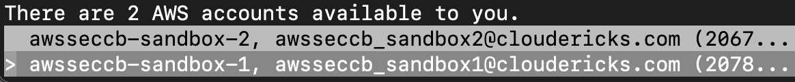
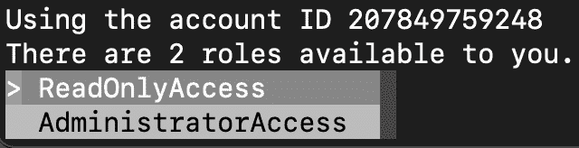

# 第一章：设置 AWS 账户和组织

应用程序或平台的安全性通常由保密性、完整性、可用性、身份验证、授权、审计和不可否认性等特性来定义。这些特性被分为 **保密性、完整性和可用性**（**CIA**）三元组和 **身份验证、授权和审计**（**AAA**）三元组。对这些安全特性有深入的理解将有助于我们更好地理解和实施本书中详细介绍的 AWS 安全概念。

在本章中，我们将首先了解如何为新的 AWS 账户设置 **身份与访问管理**（**IAM**）服务，并设置 **账户别名** 和 **账单警报**。然后，我们将学习如何设置 **AWS 组织** 服务，该服务允许我们通过一个 **管理账户** 创建和管理多个 AWS 账户。我们还将了解用户管理和使用 **AWS IAM 身份中心**（前身为 AWS SSO）的 **单点登录**（**SSO**），该服务集中管理 AWS 账户和应用程序中的身份创建与访问管理，适用于各种规模和类型的组织。

本章内容略长于本书其他章节，因为它为后续章节奠定了基础。我们可以跳过本章中关于设置 AWS 组织和 IAM 身份中心的第二和第三个食谱，并在其他章节中独立执行大部分食谱。但如果我们的目标是在企业环境中工作，那么在继续阅读本书的其他部分之前，最好完成本章中的所有食谱。

本章包括以下食谱：

+   设置 IAM、账户别名和账单警报

+   使用 AWS 组织进行多账户管理

+   用户管理和使用 IAM 身份中心进行 SSO

# 技术要求

在深入本章的食谱之前，我们需要确保具备以下知识和要求：

+   **AWS 账户**：建议为本章使用一个新的 AWS 账户。我们可以在 [`aws.amazon.com`](https://aws.amazon.com) 上注册一个免费层账户。

+   **权限**：我们需要以根用户身份操作，或者拥有管理员权限，才能配置 IAM、AWS 组织和 IAM 身份中心。

+   **熟悉 AWS**：对 AWS 管理控制台以及 IAM 和 S3 等 AWS 服务有一定了解将对我们有帮助。

+   **互联网连接**：由于 AWS 是基于云的，因此稳定的互联网连接对于访问和管理 AWS 服务至关重要。

+   **AWS 命令行接口**（**CLI**）：要执行 AWS CLI 命令，我们需要 AWS CLI V2。两种推荐的使用 AWS CLI V2 的方法是通过 AWS IAM 身份中心在本地或虚拟机上进行设置，或使用`AWS CloudShell`。我们将在*使用 IAM 身份中心进行用户管理和 SSO*教程中学习如何使用 IAM 身份中心设置 AWS CLI V2。

重要提示

我们还可以使用传统的访问密钥来配置 AWS CLI。然而，IAM 身份中心和 CloudShell 都使用基于会话的短期凭证，从而减少了与传统长期访问密钥相关的风险。AWS CloudShell 提供了浏览器集成的 shell，直接嵌入 AWS 管理控制台，便于随时进行操作，无需本地设置。然而，CloudShell 可能并非在所有区域都可用。

本书的代码文件可在 [`github.com/PacktPublishing/AWS-Security-Cookbook-Second-Edition`](https://github.com/PacktPublishing/AWS-Security-Cookbook-Second-Edition) 获取。本章的代码文件可在 [`github.com/PacktPublishing/AWS-Security-Cookbook-Second-Edition/tree/main/Chapter01`](https://github.com/PacktPublishing/AWS-Security-Cookbook-Second-Edition/tree/main/Chapter01) 获取。

# 设置 IAM、账户别名和计费警报

IAM 是 AWS 中用于管理访问 AWS 资源的主要服务。设置 AWS 账户后，建议进行一些基本的 IAM 配置，以增强账户的安全性，例如使用**多重身份验证（MFA）**保护**根账户**。MFA 是一种安全机制，要求用户提供两个或更多的验证因素才能访问资源，如用户名和密码，以及发送到手机的验证码。IAM 提供了一个检查清单来指导这些初步活动。

虽然不在 AWS 检查清单中，但建议在新账户中设置账户别名并创建计费警报。账户别名是我们可以为 AWS 账户创建的一个唯一标识符，用来代替账户登录 URL 中默认的 12 位账户 ID。创建账户别名通过提供个性化和易记的登录 URL 来提升用户体验，增加安全性，因为它能够隐藏实际的账户号码，同时通过将我们组织的名称纳入 AWS 登录流程中，增强品牌一致性。

在新 AWS 账户中设置计费警报的一个主要优势是能够有效监控和管理成本。当账户支出超过预设的阈值时，它会提醒我们，从而帮助防止意外费用并保持预算控制。

## 准备工作

我们需要一个新创建的 AWS 账户来完成本教程中的所有步骤。如果账户不是新的，我们可以按照本教程进行验证，检查配置是否正确，并配置缺失的内容。

要在此方案中使用虚拟 MFA 设备设置 MFA，我们需要在手机上安装认证器应用，`Google Authenticator` 是一个流行的认证器应用，我们可以使用。我们也可以使用`YubiKey Universal 2nd Factor` (`U2F`) **安全密钥**，任何**U2F 兼容设备**，或**硬件 MFA 设备**。U2F 是一种认证标准，旨在仅通过安全密钥访问在线服务，无需任何驱动程序或客户端软件。

## 如何操作...

首先，我们将为新的 AWS 账户设置 IAM。然后，我们将设置一个账户别名以改善用户体验，并设置账单警报以防止非计划的使用和账单。

### 为 AWS 账户设置 IAM

我们可以按照以下步骤为新的 AWS 账户设置 IAM：

1.  使用根用户邮箱凭证登录 AWS 账户，并从 IAM 仪表板内执行以下步骤。对于一个新的 AWS 账户，IAM 仪表板应该如下所示：


图 1.1 – 新账户的 IAM 仪表板

1.  点击**添加 MFA**，位于**安全建议**下。

1.  如果没有被重定向到**分配 MFA**标签，请手动转到**分配 MFA**标签。

1.  输入一个有意义的 MFA 设备名称，帮助我们识别该设备，然后选择**认证器应用**，如以下图所示。如果我们设置了不同的选项，如*准备工作*部分所讨论的那样，我们可以在此处选择该选项，而不是**认证器应用**选项。


图 1.2 – 选择 MFA 设备

1.  向下滚动并点击**下一步**。AWS 现在将提供一个二维码。

重要说明

我们可以将二维码图像保存在安全的地方，以便在不访问当前认证器应用设置的情况下重新配置认证器应用，例如，如果当前的手机停止工作。或者，我们也可以在发生此类事件时联系 AWS 支持，他们可以帮助我们重置认证器应用的配置。

1.  使用安装在手机上的认证器应用（例如 Google Authenticator）扫描二维码，并输入两个成功的令牌密钥以激活它。

    启用 MFA 后，我们需要提供来自此应用的令牌，以及用户名和密码，才能登录 AWS 控制台。

1.  返回 IAM 仪表板，确保我们在*图 1.1*中看到的安全建议中的所有勾选项现在都是绿色的。


图 1.3 – IAM 仪表板上的安全建议

一旦所有安全建议都变为绿色，表示符合要求，AWS 可能不会再显示这些建议。

接下来，我们将设置账户别名和账单警报。即使这些内容不在安全建议中，也建议在新 AWS 账户上进行此操作。

### 设置账户别名

我们可以在 IAM 仪表板中按如下方式配置账户别名：

1.  在 IAM 页面中，在**账户别名**下，点击**创建**以打开**创建别名**弹出页面。


图 1.4 – AWS 账户详情

1.  在**创建别名**弹出页面中，在**首选别名**下输入一个独特且有意义的别名，并点击**创建别名**。

    这将为我们的账户创建一个账户别名。账户别名将替换**此账户中 IAM 用户的登录 URL**中的账户 ID，如*图 1.4*所示，并使我们的 IAM 用户更容易记住登录 URL。请注意，IAM 用户仍然可以使用默认登录 URL 和我们在*图 1.4*中看到的账户 ID 进行登录。

现在，我们也来创建一个计费警报。

### 创建计费警报

在本节中，我们将设置一个计费警报，以便在超出设定的限制时通知我们：

1.  登录到 AWS 管理控制台，点击屏幕右上角账户名称旁边的下拉菜单，选择**计费和成本管理**。


图 1.5 – 账户下拉菜单

1.  在**计费和成本管理主页**页面，点击左侧边栏中的**计费偏好设置**。

1.  点击**编辑**，在**警报偏好设置**窗格中。

1.  在**警报偏好设置**页面，勾选**接收 CloudWatch 计费警报**复选框。如果你正在使用免费的层级账户，你还可以勾选**接收 AWS 免费层警报**，并在**接收警报的附加电子邮件地址 - 可选**文本框中提供一个附加的电子邮件地址来接收警报。点击**更新**以保存你的偏好设置。

1.  进入 CloudWatch 服务仪表板，将区域设置为**美国东部（北弗吉尼亚）**，在左侧展开**警报**，点击**所有警报**。在本书写作时，AWS 仅允许我们在将区域设置为**美国东部（北弗吉尼亚）**时创建计费警报。我们将在本书后面的章节中进一步了解 CloudWatch 服务。

1.  点击**创建警报**，在**创建警报**页面，点击**选择指标**。

1.  在**浏览**标签中，点击**计费**，然后点击**总估计费用**。

1.  选择`EstimatedCharges`指标的复选框，如下图所示，然后点击**选择指标**。


图 1.6 – 配置指标

1.  保持**指标名称**为`EstimatedCharges`，**货币**为**美元（USD）**。对于**统计**，选择**最大值**，对于**周期**，选择**6 小时**。

1.  在**条件**下，选择**阈值类型**为**静态**，在**每当 EstimatedCharges 为...**中选择**大于**，并在**比...大**中定义触发报警的值。还可以展开**其他配置**。在**报警的数据点**中，指定**1中的1**，并在**缺失数据处理**中选择**将缺失数据视为缺失**。


图 1.7 – 配置指标的条件 - 条件

1.  点击**下一步**进入**通知**页面。在**通知**页面中，选择**报警**，然后选择**创建新主题**，为主题提供一个名称和一个接收通知的电子邮件地址，如下图所示，然后点击**创建主题**。


图 1.8 – 配置指标的通知 - 通知

我们创建了一个新的**简单通知服务**（**SNS**）主题来发送电子邮件。我们也可以选择一个现有的 SNS 主题，而不是创建一个新的。

1.  点击**下一步**，在**名称和描述**下，输入报警的名称。

1.  点击**下一步**进入**预览和创建**页面。点击**创建报警**。报警应该已经成功创建。

请注意，Amazon SNS 在订阅主题确认之前不会向端点发送消息。

## 它是如何工作的…

IAM 是 AWS 服务，帮助我们管理和验证 AWS 内用户的身份（认证）并验证其对 AWS 服务的权限（授权）。IAM 是一个全球服务，与区域无关。IAM 有四个核心概念：

+   **用户**：可以在 IAM 中创建用户并赋予其访问 AWS 资源所需的权限。

+   **组**：用户可以被添加到组中，然后可以将权限授予组，而不是单独的用户。这是推荐的最佳实践。

+   **策略**：策略是 JSON 文档，用于定义用户或组的权限。

+   **角色**：角色通常用于赋予用户临时权限访问 AWS 服务。例如，我们可以将具有 S3 权限的角色附加到 EC2 服务。角色也用于角色切换，正如我们在*第二章*中看到的那样。

根用户账户是我们使用主电子邮件登录的账户。它对我们账户中的所有内容都有访问权限。IAM 仪表板提供了一组检查项，以确保我们的根账户安全。IAM 检查表中的第一项检查我们是否为根账户启用了 MFA。MFA 将强制执行额外的身份验证层，除了用户名和密码，还需要使用虚拟或硬件 MFA 设备的令牌。

清单中的第二项检查我们是否有可用于程序访问的根账户活动访问密钥。最佳实践是使用根账户创建其他账户并进行必要的配置，然后使用这些账户进行日常活动。正如我们在本章的进一步食谱中将看到的，我们可以结合使用 IAM 身份中心和 AWS Organizations 服务，以便更好地管理组织中 AWS 账户的用户身份。

尽管账户别名和账单报警不在 IAM 安全推荐清单中，我们仍然设置了它们。正如在食谱介绍中所看到的，创建 AWS 账户别名可以提升用户体验、增加安全性，并确保品牌一致性。账单报警将在我们超过设定的限制时触发警报，并提醒我们。这是一个良好的做法，能够避免意外使用和未计划的开销。

## 还有更多...

让我们快速回顾一些与 IAM 和安全相关的重要概念：

+   **身份验证**是通过用户名和密码，或访问密钥与秘密访问密钥等凭证来验证用户身份的过程。AWS 中用于身份验证的主要访问凭证有两种：

    +   **访问密钥 ID 和秘密访问密钥**：这些用于程序化访问，并与 AWS API、CLI、SDK 及任何开发工具一起使用。

    +   **用户名和密码**：这些用于管理控制台访问。

+   **授权**是检查用户是否具有执行某项操作的权限的过程，通常通过策略来定义。我们将在*第二章*中详细了解 IAM 策略。

+   **机密性**确保从源发送的数据在传输过程中不被其他人读取。这可以通过加密技术来实现。

+   **数据完整性**确保数据来自正确的人，并且在传输过程中未被篡改。这可以通过加密技术来实现。

+   **可用性**确保在需要时服务可以正常使用。

+   **会计**帮助我们在发生安全事件时识别责任方。

+   **不可否认性**防止用户否认某项活动。加密技术在这里也能帮助我们。

+   **AWS 共享责任模型**定义了 AWS 和其客户在 AWS 云中保护解决方案的责任。AWS 负责云的安全性，包括保护支撑所有 AWS 云服务的基础设施。这包括硬件、软件、网络和设施，确保 AWS 云服务的正常运行。另一方面，客户负责云中的安全性。这项责任包括管理在云中部署的工作负载、使用的客户操作系统，以及网络、主机、IAM 和存储资源的配置，以便进行数据管理和业务沟通。还包括根据所使用的云抽象（例如基础设施即服务）定期更新和修补云资源上的软件。

+   第三方审计人员定期评估 AWS IAM 是否符合一系列标准，包括**服务组织控制**（**SOC**）、**支付卡行业数据安全标准**（**PCI DSS**）、**联邦风险与授权管理程序**（**FedRAMP**）和**国际标准化组织**（**ISO**）等标准。

### 更多关于 IAM 用户和用户组的信息

在本教程中，我们没有创建 IAM 用户或用户组，因为现在推荐使用 IAM 身份中心用户，而不是 IAM 用户。但是，如果需要，我们可以从 IAM 仪表板的左侧边栏创建用户和用户组。

IAM 用户的主要问题在于它们与长期凭证（如访问密钥）关联，如果没有正确管理，这可能会带来安全风险。以下是根据 AWS 提供的常见 AWS 访问密钥使用场景，以及更安全的替代方案推荐：

| 替代方案 | 使用案例 | 推荐 |
| --- | --- | --- |
| `CLI` | 通过 AWS CLI 访问 AWS 账户。 | 在这种情况下，按照以下步骤操作： |

+   使用`AWS CloudShell`，这是一种集成在浏览器中的命令行界面（CLI），用于执行命令。

+   选择 AWS CLI V2 并通过**IAM 身份中心**中的用户设置身份验证；我们将在后续详细探讨 IAM 身份中心。

| **本地代码** | 从本地开发环境访问 AWS 账户。 | 使用配备 AWS 工具包的**集成开发环境**（**IDE**），它通过 IAM 身份中心促进身份验证。 |
| --- | --- | --- |
| **在 AWS 计算服务** 上运行的应用 | 在 AWS 计算服务（如 Amazon EC2、Amazon ECS 或 AWS Lambda）上管理应用代码。 | 为计算资源（如 EC2 实例或 Lambda 函数）分配 IAM 角色，确保为访问自动提供临时凭证。 |
| **第三方服务** | 用于启用管理或与 AWS 资源交互的第三方应用程序或服务。 | 作为标准，选择通过 IAM 角色使用临时安全凭证，避免创建长期凭证（如访问密钥）。避免生成 AWS 账户根用户的访问密钥。 |
| **在 AWS 外运行的应用程序** | 管理 AWS 计算服务上的应用程序代码，如 Amazon EC2、Amazon ECS 或 AWS Lambda。 | 尽管在这种用例中使用访问密钥是可以接受的，但请确保执行以下操作： |

+   避免将访问密钥以明文形式存储在代码库中或直接嵌入代码中。

+   停用或删除冗余的访问密钥。

+   实施最小权限原则。

+   定期轮换访问密钥。


表 1.1 – AWS 访问密钥的使用案例（按 AWS 分类）

上述建议旨在减少安全漏洞的潜在风险。

## 另请参见

+   我们可以在[`www.cloudericks.com/blog/getting-started-with-aws-iam`](https://www.cloudericks.com/blog/getting-started-with-aws-iam)了解更多关于 IAM 及其安全工具和功能的信息，例如 IAM 分析器、IAM 访问顾问和 IAM 凭证报告。

+   我们在本配方中了解了账单警报。我们可以通过[`www.cloudericks.com/blog/getting-started-with-aws-budgets`](https://www.cloudericks.com/blog/getting-started-with-aws-budgets)了解 AWS Budgets 并理解它与账单警报的区别。

+   我们在本配方中简要介绍了 Amazon SNS。要了解更多关于 SNS 的信息，可以参考[`www.cloudericks.com/blog/getting-started-with-amazon-sns-service`](https://www.cloudericks.com/blog/getting-started-with-amazon-sns-service)。

+   本书不涉及超出安全领域的 AWS 基础知识。我们可以在[`www.cloudericks.com/blog/getting-started-with-aws-cloud`](https://www.cloudericks.com/blog/getting-started-with-aws-cloud)了解云计算和 AWS 基础知识。

+   在[`aws.amazon.com/compliance/shared-responsibility-model`](https://aws.amazon.com/compliance/shared-responsibility-model)阅读更多关于 AWS 共享责任模型的信息。

+   在[`docs.aws.amazon.com/IAM/latest/UserGuide/iam-compliance-validation.html`](https://docs.aws.amazon.com/IAM/latest/UserGuide/iam-compliance-validation.html)阅读更多关于 AWS IAM 的合规性验证。

# 使用 AWS Organizations 进行多账户管理

组织通常有多个基于使用情况（如生产、开发、测试等）分类的 AWS 账户。AWS Organizations 服务帮助我们集中管理所有 AWS 账户，其**组织单元**（**OU**）功能帮助我们将 AWS 账户按使用情况分层管理。在本教程中，我们将学习如何创建 AWS 组织和 OU，并将 AWS 账户添加到 OU 中。我们将在 AWS 管理控制台中创建 AWS 组织，但将从管理控制台和 CLI 中同时创建 OU 并添加账户。

## 准备工作

我们需要一个不属于任何 AWS 组织的有效 AWS 账户，才能完成本教程中的所有步骤。

对于我们使用 CLI 命令的部分，我们需要配置 AWS CLI V2，具体方法可参考*技术* *要求*部分。

## 如何操作...

我们将首先创建一个 AWS 组织，然后在该 AWS 组织中创建 OU 和 AWS 账户。

### 从管理控制台创建一个 AWS 组织

首先，让我们按如下方式创建一个 AWS 组织：

1.  以根用户或具有管理员权限的用户身份登录 AWS 管理控制台，并转到`AWS Organizations`服务控制台。

1.  点击**创建组织**。它将创建一个组织，并将我们引导到**AWS 账户**页面，该页面应该如下所示：


图 1.9 – AWS Organizations 中的账户

如果我们检查同一页面上的左侧边栏，我们可以看到**组织 ID**，如下图所示：


图 1.10 – AWS Organizations 侧边栏

接下来，我们将在根 OU 下创建一个 OU。

### 从管理控制台创建 OU 和账户

要在根 OU 下创建一个 OU，我们可以按照以下步骤进行：

1.  在`AWS Organizations`服务控制台页面，转到**AWS 账户**页面。

1.  选择`Root` OU，然后在**操作**菜单中，选择**创建新组织单元**。


图 1.11 – 创建新的组织单元

1.  在下一个屏幕上，输入`Sandbox`作为**组织单元名称**，然后点击**创建组织单元**。

我们现在可以创建一个 AWS 账户并将其移动到`Sandbox` OU，如下所示：

1.  在`AWS Organizations`服务控制台页面，转到**AWS 账户**页面。

1.  点击**添加 AWS 账户**。

1.  选择**创建 AWS 账户**，并为**AWS 账户名称**提供`awsseccb-sandbox-1`值。对于**账户所有者的电子邮件地址**，提供一个你可以访问的电子邮件地址。为**IAM 角色名称**提供`OrganizationAccountAccessRole`值。


图 1.12 – 向组织中添加账户

1.  向下滚动并点击**创建AWS 账户**。

    我们应该立即看到一个显示**AWS 正在创建 1 个账户**的屏幕。账户创建可能需要一些时间。

1.  一旦账户创建完成，在组织中的**AWS 账户**页面中，选择新创建的账户。从**操作**下拉菜单中选择**移动**。


图 1.13 – 选择账户并在 OU 之间移动

1.  在**目标**部分选择所需的 OU，然后点击**移动AWS 账户**。


图 1.14 – 选择目标 OU 以移动账户

新创建的账户现在应该属于所选的 OU。

### 从 CLI 创建 OU 和账户

在本节中，我们将通过 CLI 创建一个 OU 和账户。请记住，在执行 CLI 命令时，要用相关步骤中的 ID 替换我的 ID。命令也会与代码文件一起提供。此外，如果我们从 AWS CloudShell 执行命令，则无需指定 CLI 配置文件。让我们开始吧：

1.  使用`create-organizational-unit`子命令，在根 OU 下创建名为`Workloads`的 OU，使用我们的根 OU 的 ID：

    ```
    aws organizations create-organizational-unit --parent-id r-bim7 --name Workloads --profile awssecadmin
    ```

    这应该会给我们一个类似于以下内容的响应：


图 1.15 – create-organizational-unit 子命令的响应

1.  我们可以使用`create-account`子命令创建一个 AWS 账户：

    ```
    aws organizations create-account --email awsseccb_sandbox2@cloudericks.com --account-name awsseccb-sandbox-2 --profile awssecadmin
    ```

    这应该会给我们一个类似于以下内容的响应：


图 1.16 – create-account 子命令的响应

1.  我们可以使用`describe-create-account-status`子命令检查请求的状态，通过提供上一步收到的请求 ID：

    ```
    aws organizations describe-create-account-status --create-account-request-id car-6582b2c63be845ebaa474c9268cea8c1 --profile awssecadmin
    ```

    如果请求成功，我们应该会得到以下响应：


图 1.17 – describe-create-account-status 的响应

1.  我们可以通过提供在上一步中收到的账户 ID，使用`list-parents`子命令来验证账户是否在根 OU 下创建，并获取根 OU 的 ID：

    ```
    aws organizations list-parents --child-id 206722961012 --profile awssecadmin
    ```

    这应该会给我们一个类似于以下内容的响应：


图 1.18 – list-parents 子命令的响应

1.  使用`move-account`子命令，将我们的新账户从根 OU 移动到之前通过 CLI 创建的新的 OU，提供上一步的账户 ID、根 ID 和 OU ID：

    ```
    aws organizations move-account --account-id 206722961012 --source-parent-id r-bim7 --destination-parent-id ou-bim7-0s1nqy2w --profile awssecadmin
    ```

    该命令不会返回任何内容。

1.  使用`list-parents`子命令检查我们账户的父级，如*S* *tep 4* 中所做的那样。我们应该会得到一个响应，其中新 OU 作为父级：


图 1.19 – list-parents 子命令的响应

1.  我们可以使用 `list-children` 子命令列出根 OU 下的所有 OU，并将子类型设置为 `ORGANIZATIONAL_UNIT`：

    ```
    aws organizations list-children --parent-id r-bim7 --child-type ORGANIZATIONAL_UNIT --profile awssecadmin
    ```

    如果我们总共有两个 OU，假设我们在前面的示例中创建了一个，这应该会给我们类似以下的响应：


图 1.20 – list-children 子命令的响应

要获取 OU 的详细信息及其名称，我们可以使用 `describe-organizational-unit` 子命令，传入名为 `organizational-unit-id` 的单一参数，并传入其 ID。

## 工作原理...

从管理控制台中，我们创建了一个 AWS 组织，在其下创建了 OU，并将账户添加到这些 OU 下。默认情况下，会创建一个名为 `Root` 的 OU。用于创建组织的账户称为管理账户（以前称为 **主账户**），并且是在根 OU 下创建的。

我们只能从一个未加入任何组织的 AWS 账户启动创建新组织的操作。我们不能将另一个 AWS 账户后期变更为管理账户，因此，创建组织的账户需要谨慎选择。我们可以将账户移动到任何 OU，包括根 OU。我们也可以在一个 OU 内创建子 OU。

AWS Organizations 的委托管理员功能允许指定的 AWS 服务（如 AWS IAM 身份中心）将组织中的成员账户指定为管理员，以便在所有账户中管理该服务。这使得不同的团队可以使用单独的账户来管理 AWS 服务，这些账户是根据他们的角色和责任量身定制的。目前支持此功能的服务包括 AWS IAM 身份中心、AWS Config、AWS 防火墙管理器、Amazon GuardDuty、AWS IAM 访问分析器、Amazon Macie、AWS Security Hub、Amazon Detective、AWS 审计管理器、Amazon Inspector 和 AWS 系统管理器。

从 CLI 中，我们使用 `create-account` 子命令创建了一个 AWS 账户。此命令会立即返回请求 ID，并异步执行。我们可以使用 `describe-create-account-status` 子命令，通过提供请求 ID 来检查请求的状态。要检查账户是否已创建，我们可以查看 **AWS CloudTrail 日志** 中的 `CreateAccountResult` 事件。

`create-account` 子命令还接受其他参数，即 `role-name` 和 `iam-user-access-to-billing`。`role-name` 参数用于指定将在新成员账户中自动预配置的 IAM 角色名称。此角色为成员账户提供管理员权限，并信任管理账户。这意味着管理账户中的用户可以承担该角色，前提是管理账户的管理员允许这样做。默认值是 `OrganizationAccountAccessRole`。如果我们登录到子账户并检查 `OrganizationAccountAccessRole` 角色，我们会看到它附加了 `Administrator Access` 策略。如果我们检查 `Trust relationships` 部分，我们会看到我们的管理账户已被添加为受信任实体。现在，管理账户的管理员可以切换角色到子账户并获得管理员访问权限。对于非管理员用户来说，要承担子账户中的 `OrganizationAccountAccessRole` 角色并切换角色登录到子账户，用户应该被授予该角色的 `AssumeRole` 权限。

必须将 `iam-user-access-to-billing` 参数设置为 `ALLOW`，以便 IAM 用户访问账户账单信息。如果设置为 `DENY`，只有根用户才能访问账户账单信息。默认值是 `ALLOW`。我们还创建了一个 OU，并将账户移至该 OU。在示例中，我们使用了 `list-children` 子命令与 `ORGANIZATIONAL_UNIT` 子类型来列出根下的所有 OU。我们还可以将 `child-type` 设置为 `ACCOUNT` 来列出所有账户。

## 还有更多内容...

让我们快速浏览一下关于 AWS Organizations 服务的一些重要细节：

+   AWS Organizations 服务在所有区域均支持；然而，终端节点位于美国东部（弗吉尼亚北部）用于商业组织，AWS GovCloud（美国西部）用于 AWS GovCloud（美国）组织。

+   AWS Organizations 服务是一个全球性服务。我们不需要选择或指定任何区域来创建组织实体。

+   使用 AWS Organizations 不会产生额外费用。

+   我们可以在一个 AWS Organization 中管理的账户数量是有变化的。我们可以请求 AWS 支持来增加这个限制。

+   一个账户一次只能属于一个组织，而且在一个组织内，一个账户一次只能属于一个 OU。

+   我们可以将 OU 和账户嵌套最多五层（包括根）。

+   我们可以使用**服务控制策略**（**SCPs**）来限制 AWS 服务操作，仅对根账户、IAM 用户和组织中账户的 IAM 角色有效。

+   SCPs 只能拒绝访问；不能允许访问。

+   当 **权限边界**（IAM 特性）和 SCP 同时存在时，只有在权限边界、SCP 和基于身份的策略都允许该操作时，操作才会被允许。

+   当前可以与 AWS Organizations 集成的受支持服务包括 AWS 账户管理、AWS **应用迁移服务** (`MGN`)、AWS Artifact、AWS 审计管理器、AWS Backup、AWS CloudFormation Stacksets、AWS CloudTrail、Amazon CloudWatch Events、AWS Compute Optimizer、AWS Config、AWS Control Tower、Amazon Detective、Amazon DevOps Guru、AWS Directory Service、AWS Firewall Manager、Amazon GuardDuty、AWS Health、AWS IAM、IAM 访问分析器、Amazon Inspector、AWS License Manager、Amazon Macie、AWS Marketplace、AWS Network Manager、AWS 资源访问管理器、AWS 安全中心、Amazon S3 Storage Lens、Amazon Security Lake、AWS Service Catalog、服务配额、AWS IAM 身份中心（AWS SSO 的继任者）、AWS Systems Manager、标签策略、AWS Trusted Advisor、AWS Well-Architected Tool、**Amazon VPC IP 地址管理器** (`IPAM`) 和 Amazon VPC 可达性分析器。我们可以从受支持服务的仪表板启用集成。有关更新的服务列表，请参阅本指南的 *另见* 部分。

让我们了解一些有用的 AWS CLI 子命令，用于 AWS Organizations：

+   `create-gov-cloud-account` 可用于在 AWS GovCloud (US) 区域创建账户，前提是我们有相关权限。

+   `invite-account-to-organization` 向另一个账户发送邀请，邀请其加入我们的组织。

+   `remove-account-from-organization` 将账户从组织中移除。

+   `create-organization` 用于创建一个 AWS 组织，而 `delete-organization` 用于删除一个 AWS 组织。

+   `leave-organization` 将账户从其父组织中移除。

+   `create-organizational-unit` 用于创建一个组织单元（OU），而 `delete-organizational-unit` 用于删除一个组织单元（OU）。要删除一个 OU，必须先移除所有账户和子 OU。

+   `update-organizational-unit` 用于重命名一个组织单元（OU）。

+   `describe-account` 用于检索该账户的信息，应该从主账户调用。`describe-organization` 用于检索组织的信息。`describe-organizational-unit` 用于检索一个组织单元（OU）的信息。

+   `list-accounts` 列出组织中的所有账户。`list-accounts-for-parent` 列出给定目标根或 OU 的子账户。`list-create-account-status` 列出与给定状态匹配的账户创建请求。`list-roots` 列出当前组织中定义的根。

+   `tag-resource` 和 `untag-resource` 可用于管理标签。

### 与 AWS 交互的不同方式

我们可以通过多种方式与 AWS 进行交互，包括 AWS 管理控制台、AWS CLI、AWS **软件开发工具包** (`SDKs`)、AWS CloudFormation、外部工具如 HashiCorp 的 Terraform、直接的 AWS API 调用、AWS PowerShell 工具、AWS **云开发工具包** (`CDK`) 和 AWS **无服务器应用模型** (`SAM`)。根据具体任务和所需的自动化水平，每种方法都有其独特的优势。

对于本书中的食谱范围，我们将主要集中于 AWS 管理控制台和 CLI。管理控制台通常用于一次性配置和操作，提供直观和可视化的方式来管理 AWS 资源。另一方面，CLI 特别适合处理重复性任务，支持自动化和脚本化。掌握 CLI 不仅能简化我们的 AWS 操作并打下坚实的基础，还能帮助我们理解其他交互方式的细微差别，如 AWS SDK、CloudFormation、Terraform 等。

## 另请参阅

+   我们可以通过访问[`www.cloudericks.com/blog/getting-started-with-aws-organizations`](https://www.cloudericks.com/blog/getting-started-with-aws-organizations)了解更多关于 AWS Organizations 的信息，包括最佳实践和配额。

+   要了解我们可以使用的所有 AWS CLI 命令，请参考 AWS CLI 文档中的 Organizations 部分，网址为[`docs.aws.amazon.com/cli/latest/reference/organizations/index.htm`](https://docs.aws.amazon.com/cli/latest/reference/organizations/index.htm)。

+   可以与 AWS Organizations 集成的服务可以在[`docs.aws.amazon.com/organizations/latest/userguide/orgs_integrate_services_list.html`](https://docs.aws.amazon.com/organizations/latest/userguide/orgs_integrate_services_list.html)找到。

+   本书中我们使用了 AWS CLI。然而，如果你想了解更多关于 CloudShell 的内容，可以访问[`www.cloudericks.com/blog/getting-started-with-aws-cloudshell`](https://www.cloudericks.com/blog/getting-started-with-aws-cloudshell)。

+   我们可以通过访问[`www.cloudericks.com/blog/getting-started-with-aws-control-tower`](https://www.cloudericks.com/blog/getting-started-with-aws-control-tower)了解如何使用 AWS Control Tower，而不是直接使用 AWS Organizations。

# 用户管理和 SSO 与 IAM 身份中心

在本食谱中，我们将首先启用 IAM 身份中心服务（之前称为 AWS SSO），并学习如何在 IAM 身份中心中创建用户和组。接着，我们将创建权限集，并将一个组与该权限集一起分配给一个 AWS 账户。最后，我们将看到如何通过 AWS 访问门户使用 SSO 登录 AWS 管理控制台和 AWS CLI。

SSO 是一种用户认证过程，允许用户使用一套登录凭证访问多个应用程序或系统。这意味着在登录一次后，用户可以访问其他 AWS 账户和应用，而无需为每个系统重新登录。这简化了用户体验，并通过减少用户需要记住和维护的密码数量，从而增强了安全性。

## 准备工作

我们需要一个启用了 AWS Organizations 的 AWS 账户。要设置 AWS Organizations，我们可以按照本章中的*多账户管理与 AWS Organizations*食谱进行操作。

要使用 CLI 和 IAM 身份中心，我们需要按照本章的*技术要求*部分安装并配置 AWS CLI V2。

## 如何执行...

首先，我们将启用 IAM 身份中心。然后，我们将创建一个组和一个用户，并将该用户添加到该组。之后，我们将创建权限集，并使用该权限集为组分配 AWS 账户的访问权限。

### 启用 IAM 身份中心并创建用户和组

要启用 IAM 身份中心并创建一个组和用户，我们可以按照以下步骤进行：

1.  登录到 AWS 管理控制台并转到**IAM 身份中心**。

    如果我们还没有启用 IAM 身份中心，我们应该看到如下图所示的屏幕：


图 1.21 – IAM 身份中心仪表板

1.  如*图 1.21*所示，从 IAM 身份中心仪表板点击**启用**。

    我们现在应该被带到**IAM 身份中心**仪表板。


图 1.22 – IAM 身份中心的推荐设置步骤

1.  如*图 1.22*所示，点击**选择您的身份来源**下的**步骤 1**。

1.  将**身份源**的值保持为**身份中心目录**。

1.  对于**访问控制的属性**，点击**启用**。

1.  从左侧边栏点击**组**，然后点击**创建组**，如下图所示：


图 1.23 – IAM 身份中心侧边栏和组页面

1.  在**创建组**页面的**组详情**部分，输入`awsseccbadmins`作为**组名称**，并在**描述**下设置**AWS 安全食谱管理员组**。

1.  向下滚动，保持**添加用户到组**部分为空，不添加任何用户，点击**创建组**。

1.  从 IAM 身份中心仪表板的左侧边栏点击**用户**，然后点击**添加用户**。

1.  在**基本信息**部分，指定`awsseccbadmin1`作为**用户名**，在**密码**下选择**向该用户发送带有密码设置说明的电子邮件**。我们也可以生成一次性密码并与用户共享。


图 1.24 – IAM 身份中心中的指定用户详情页面

1.  填写**基本信息**部分中的其他字段，即**电子邮件地址**、**确认电子邮件地址**、**名字**、**姓氏**和**显示名称**。

1.  保持其他部分不变，即**联系方法**、**工作相关信息**、**地址**、**偏好设置**和**附加属性**，然后点击页面右下角的**下一步**。

1.  在**将用户添加到组**页面中，选择我们在本节中创建的`awsseccbadmins`组，然后点击**下一步**。

1.  在**审查并添加用户**页面上，审查详细信息并点击**添加用户**。现在我们应该能看到新用户已添加到**用户**页面。

1.  新添加的用户需要检查电子邮件，并按照指示接受邀请并完成密码设置。


图 1.25 – IAM 身份中心中新用户的邀请邮件

完成指令后，我们应该已经登录到 AWS 访问门户，在那里可以看到分配给我们的应用程序。目前，由于我们还没有分配任何应用程序，我们应该会看到**您没有任何应用程序**的消息。

接下来，我们将创建一个权限集。

### 创建具有 AWS 托管策略的权限集

按照指示创建一个权限集，我们可以在下一节分配 AWS 账户访问权限时使用：

1.  点击左侧边栏中的**权限集**，如*图 1* *23*所示，在**权限集**页面上点击**创建****权限集**。

1.  选择**预定义权限集**作为**权限集类型**，对于**选择 AWS 托管策略**，选择`AdministratorAccess`。


图 1.26 – 在 IAM 身份中心中选择权限集类型

1.  向下滚动并点击**下一步**。

1.  在**指定权限集详细信息**页面上，将**权限集名称**的值保持为`AdministratorAccess`，**会话时长**保持为**1 小时**，添加一个有意义的描述，其他字段保持空白，然后点击**下一步**。

1.  在**审查和创建**页面上，审查所有内容后点击**创建**。

    新的权限集现在应该出现在**权限集**页面上。

接下来，我们将为 AWS 账户分配`awsseccbadmins`小组。

### 提供 AWS 账户的访问权限

我们可以按照以下步骤为小组提供一个或多个 AWS 账户的访问权限：

1.  点击左侧边栏中的**AWS 账户**选项，如*图 1* *23*所示，进入**AWS账户**页面。

1.  选择我们希望授予访问权限的所有 AWS 账户，并点击**分配用户或组**。我已选择`aws-sec-cookbook-1`账户。


图 1.27 – IAM 身份中心中的 AWS 账户页面

1.  在**选择用户和组**页面的**组**标签页中，选择我们在本节中创建的`awsseccbadmins`组，然后点击**下一步**进入**分配权限集**页面。

1.  在**分配权限集**页面上，为我们的小组选择要分配给所选 AWS 账户的权限集。点击**下一步**进入**审查和提交****分配**页面。


图 1.28 – IAM Identity Center 中的权限集选择

1.  在**审阅和提交任务**页面上，审阅所有内容并点击**提交**。

1.  使用 AWS Identity Center 的**AWS 访问门户 URL**登录 AWS 访问门户。我们可以从我们的 Identity Center 仪表板中获取 URL。当用户被创建时，邀请邮件中也会包含该 URL。

    您需要点击**AWS 账户（1）**以查看新分配的 AWS 账户，然后点击账户以获取登录到**管理控制台**或**命令行或编程访问**的选项，利用临时凭证。


图 1.29 – AWS 访问门户

1.  点击**管理控制台**以登录分配给我们的 AWS 账户。点击用户名旁边的下拉菜单以验证账户详情。

我们可以按照相同步骤为用户（而不是组）提供对一个或多个 AWS 账户的访问权限。然而，最好的做法是为组分配权限，并根据需要添加或删除用户到这些组中。

### 使用 IAM Identity Center 为 AWS CLI 配置 SSO

在前一节中，我们看到如何使用 IAM Identity Center 从 AWS 访问门户登录到 AWS 管理控制台。在本节中，我们将学习如何配置 AWS CLI V2 与 IAM Identity Center：

1.  作为 IAM Identity Center 用户登录到 AWS 访问门户。我们应该看到一个类似*图 1* *.29*的屏幕。

1.  从 AWS 访问门户中点击**命令行或编程访问**，而不是像在*提供对 AWS 账户的访问*子节的*步骤 7*中所做的那样进入管理控制台。

    我们应该看到一个弹出窗口，列出了不同选项以及使用 CLI 的必要步骤。


图 1.30 – 使用 IAM Identity Center 时使用 AWS CLI 的工作步骤

1.  假设我们已经安装了 AWS CLI V2，打开命令提示符（或终端），运行`aws configure sso`命令，并按照*图 1* *.30*中显示的说明进行操作。提供**SSO 起始 URL**和**SSO 区域**，以及可选的 SSO 会话名称，如下图所示：


图 1.31 – 配置 AWS CLI V2 的 SSO

一旦我们为**SSO 会话名称**、**SSO 起始 URL**、**SSO 区域**和**SSO 注册范围**提供了值，浏览器将打开进行授权。请注意，我提供了自定义的**SSO 起始 URL**而不是默认的一个，如*图 1* *.30*所示；两者都可以使用。授权完成后，命令提示符将恢复。

1.  运行`aws s3 ls`命令并附上配置文件名称进行验证，如*图 1* *.31*所示。

我们只需要为 AWS 账户和角色组合配置一次 SSO，如下面的*工作原理...*部分所述。配置完成后，我们可以使用该配置文件通过`aws sso login`和`aws sso logout`命令登录和退出，如下所示。

### 在 AWS CLI 中使用 IAM Identity Center 进行 SSO 登录和退出

我们可以使用配置的 AWS CLI V2 配置文件登录和退出 AWS 账户，方法如下：

1.  使用`aws sso login`命令登录，提供我们已经配置的 CLI 配置文件名称（如我们在*图 1* *.31*中看到的）。执行`aws sso login`命令，提供相同的配置文件名称，如下所示：


图 1.32 – 使用 SSO 从 CLI 登录 AWS 账户

`aws sso login`命令将打开一个浏览器进行授权，类似于`aws sso login`命令。授权完成后，命令提示符将恢复。

重要提示

如果我们有多个配置文件或者没有使用默认配置文件，即使在 SSO 登录后，执行 AWS CLI 命令时也需要指定配置文件。此外，如果我们尝试使用我们没有访问权限的配置文件，当调用`GetRoleCredentials`操作时，将会收到一个错误，指出发生了错误（**ForbiddenException**）：**无法访问**。

1.  使用`aws sso logout`命令退出登录，并执行`aws sso logout`命令，提供与之前相同的配置文件名称。


图 1.33 – 使用 SSO 从 CLI 退出 AWS 账户

## 工作原理...

AWS IAM Identity Center 是 AWS SSO 的后继者，帮助我们在多个 AWS 账户和应用程序之间安全地集中管理访问权限。IAM Identity Center 是处理 AWS 上身份验证和授权的建议方法。适用于各种规模的组织。

从 AWS IAM Identity Center 仪表板，我们可以配置对 AWS 组织内的 AWS 账户、诸如 Microsoft 365、salesforce 等多个云应用程序、EC2 Windows 实例以及其他**启用 SAML 2.0 的应用程序**的访问权限。配置完成后，我们只需登录到 AWS 访问门户，然后通过 SSO 登录到所有配置的 AWS 账户和应用程序，无需提供任何其他额外凭据。

**身份提供者（IdP）**是存储和验证用户身份的服务。我们可以利用 IdP 在不提供额外凭据的情况下登录多个应用程序使用 SSO。我们在本文中使用了 IAM Identity Center 的内置 IdP。但是，除了内置 IdP，我们还可以使用许多支持的 IdP，如 Microsoft Entra ID（以前是 Active Directory 或 Azure AD）、Okta、Ping Identity、Jump Cloud 和 Google Workspace。

在本食谱中，在启用 IAM 身份中心时，我们还启用了 **访问控制的属性**。我们可以根据用户身份源中的现有属性将用户分配给 AWS 中的工作负载，从而控制对资源的访问，实现 **基于属性的访问控制** (`ABAC`) 。ABAC 是一种基于与用户、资源或环境相关的属性（特征或属性）来调节访问的方法。与 **基于角色的访问控制** (`RBAC`) 不同，RBAC 根据用户在组织中的角色授予访问权限，而 ABAC 使用各种属性，如用户位置、访问时间，甚至访问资源的敏感性。这允许更灵活、情境感知和政策驱动的访问控制，从而实现更精细和动态的权限管理。

我们可以使用权限集为不同的 AWS 账户和应用程序分配不同的权限级别给用户或组。例如，我们可以为开发者账户授予完全访问权限，为生产账户授予只读访问权限。我们可以选择预定义权限集选项，像本食谱中一样选择可用的 AWS 管理策略之一，或者我们可以创建自定义权限集。

以下来自 IAM 身份中心的截图列出了在选择预定义权限集选项时当前可用的策略。


图 1.34 – 预定义权限集的策略

使用自定义权限集选项时，我们可以选择 AWS 管理的策略、客户管理的策略和内联策略，甚至可以选择设置权限边界。我们将在 *第二章* 的 *在 IAM 身份中心中创建客户管理策略* 食谱中看到自定义权限集。

在本食谱中，我们的用户为一个 AWS 账户分配了一个权限集。如果我们有多个权限集并且可以访问多个 AWS 账户，我们可以从 AWS 访问门户选择 AWS 账户和权限集进行登录，如下图所示：


图 1.35 – 带有多个 AWS 账户和权限的 AWS 访问门户

即使在为 CLI 配置 AWS SSO 时，我们也会被要求选择 AWS 账户和权限集。首先，我们将被要求选择 AWS 账户，如下所示：



图 1.36 – AWS CLI 账户选择

在选择账户后，如果在选定的 AWS 账户中有多个角色可供选择，我们将被提供选择角色（基于权限集）的选项。



图 1.37 – AWS CLI 角色选择

## 还有更多……

我们只能通过组织的管理账户或注册为 IAM 身份中心委托管理员的成员账户来管理 IAM 身份中心。否则，我们将看到类似以下的错误消息：


图 1.38 – 非委托管理员的成员账户错误消息

我们可以通过以下步骤将成员账户设置为委托管理员：

1.  登录到我们组织的管理账户的 AWS 管理控制台，并进入**IAM 身份中心**仪表板。

1.  在 IAM 身份中心的左侧边栏点击**设置**。

1.  转到**管理**标签页。

1.  找到**委托管理员**部分并点击**注册账户**。这将显示我们 AWS 组织的组织结构。

1.  在**组织结构**部分，选择我们希望设置为委托管理员的成员账户，然后点击**注册账户**。

我们应该看到一条消息，提示成员账户已成功注册为 IAM 身份中心的委托管理员。授予成员账户管理员权限可能需要一些时间。

我们可以自定义默认的 AWS 访问门户 URL（例如，[`d-90679fa661.awsapps.com/start/`](https://d-90679fa661.awsapps.com/start/)），使用自定义子域名（例如，[`awsseccb.awsapps.com/start`](https://awsseccb.awsapps.com/start)），以便让用户更容易记住。要自定义 URL，我们可以在 IAM 身份中心仪表板右侧的**设置概述**部分点击**自定义**按钮，如*图 1* *图 22*所示，并配置自定义子域名。自定义完成后，我们将无法再次更改它。

## 另见

+   我们可以在[`www.cloudericks.com/blog/demystifying-aws-iam-identity-center-formerly-aws-sso`](https://www.cloudericks.com/blog/demystifying-aws-iam-identity-center-formerly-aws-sso)了解更多关于 IAM 身份中心的信息。

+   我们可以在[`www.cloudericks.com/blog/getting-started-with-aws-cli`](https://www.cloudericks.com/blog/getting-started-with-aws-cli)了解更多关于 AWS CLI 的信息。
