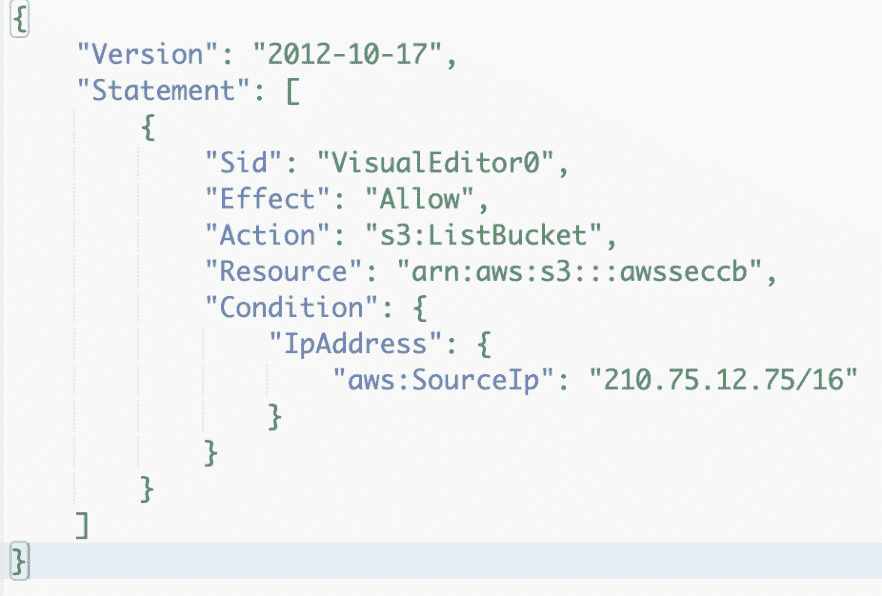
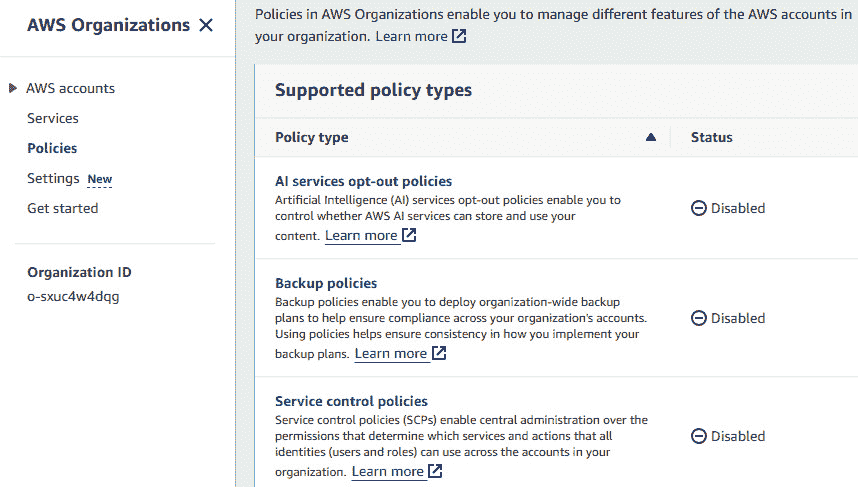

# 第二章：使用 IAM 策略和角色进行访问管理

安全访问管理对有效管理谁可以访问我们的 AWS 资源以及他们可以执行哪些操作至关重要。这些知识确保我们的 AWS 环境保持安全且合规，允许我们精确控制权限，并最小化未经授权访问的风险。它使我们能够实施强大的安全防御体系，保护我们的数据和资源，同时还为我们提供了一种可扩展和高效的方式，来管理用户和服务在 AWS 基础设施中的访问权限。在本章中，我们将学习如何使用 **IAM 策略** 和 **IAM 角色** 来进行 AWS 云中的安全访问管理。

AWS 支持多种策略类型，例如 **基于身份的策略**、**基于资源的策略**、**会话策略**、**权限边界**、**服务控制策略** (`SCPs`) 和 **访问控制列表** (`ACLs`)。虽然我们将通过详细的示例学习大多数策略类型，但 ACLs 仅会进行理论讨论，因为不再推荐使用 ACLs。接下来，我们将学习 IAM 角色以及如何使用它们来实现跨账户访问，这是实施身份账户架构所必需的，并且如何使用角色进行跨服务访问，以便让一个 AWS 服务安全地访问另一个服务。我们将在本书的后续章节中继续探索 IAM 策略和角色。

本章将覆盖以下内容：

+   创建客户管理的 IAM 策略

+   在 IAM 策略中使用策略变量

+   在 IAM 身份中心创建客户管理的策略

+   为 IAM 实体设置 IAM 权限边界

+   使用 SCPs 在 AWS Organizations 中集中治理

+   IAM 跨账户角色切换和身份账户架构

+   通过 EC2 实例上的 IAM 角色实现跨服务访问

# 技术要求

在深入本章的内容之前，我们需要确保以下要求已满足：

+   我们需要一个有效的 AWS 账户来完成本章中的大部分示例。我们可以使用一个属于 AWS 组织的账户或一个独立账户来完成大部分示例。我将使用我们在 *第一章* 的 *AWS Organizations 的多账户管理* 示例中创建的 `awsseccb-sandbox-1` AWS 组织 **成员账户**。不过，除非特别说明，否则我不会使用 AWS Organizations 的功能，这意味着你也可以使用独立账户来跟随这些步骤。请注意，某些示例可能有不同的 AWS 账户要求，这些要求会在相关示例中说明。

+   对于管理操作，我们需要一个具有对我们正在使用的 AWS 账户的`AdministratorAccess`权限的用户。这可以是 IAM Identity Center 用户或 IAM 用户。我将使用我们在*第一章*的*使用 IAM Identity Center 进行用户管理和 SSO*配方中创建的`awsseccbadmin1` IAM Identity Center 用户。但是，除非另有说明，我不会使用任何 IAM Identity Center 功能，这意味着如果用户在我们正在处理的账户中具有所需的权限，您也可以跟随这些步骤使用 IAM 用户。如果您使用 IAM 用户，您可以按照*第一章*的*设置 IAM、账户别名和账单提醒*配方创建用户。请注意，某些配方可能有特定的用户要求，这些要求将在这些配方中进行说明。

+   要在本地机器或虚拟机上执行 AWS**命令行界面**（**CLI**）命令，我们需要安装 AWS CLI v2。使用 IAM 用户的 IAM 访问密钥配置 AWS CLI，或者从 IAM Identity Center 获取 IAM Identity Center 用户的临时凭证。*第一章*详细介绍了如何使用 IAM 和 IAM Identity Center 设置 CLI。除非另有说明，我们可以使用 IAM 或 IAM Identity Center 管理用户，尽管 AWS 建议使用 IAM Identity Center。此外，通过 AWS 控制台提供的`AWS CloudShell`为执行本章讨论的大多数 CLI 命令提供了方便的方法。使用 IAM 和 IAM Identity Center 时，我们需要为每个用户每个账户创建一个配置文件。因此，最好将账户名称作为配置文件名称的一部分。例如，对于`awsseccb-sandbox-1`沙箱账户的管理员用户，我们可以设置一个 CLI `Sandbox1Admin1`配置文件：`awsseccbadmin1`。对于 IAM Identity Center，我们需要为每个用户每个账户每个权限集分配创建一个配置文件，因此还可以在名称中包含分配详情。

+   对于某些配方，我们需要一个亚马逊**简单存储服务**（**S3**）存储桶来测试策略。因此，建议您对亚马逊 S3 服务有基本的了解。除非另有说明，我们可以使用以下配置创建 S3 存储桶：对于**存储桶名称**，请提供一个唯一的名称，因为每个存储桶在 AWS 账户中都需要一个唯一的名称。对于**对象所有权**，选择**禁用 ACL（推荐）**。对于**此存储桶的阻止公共访问设置**，选择**阻止所有公共访问**。对于**存储桶版本控制**，选择**禁用**。对于**默认加密**，选择**使用 Amazon S3 管理的服务端加密（SSE-S3）**。在高级设置下的**对象锁**中，选择**禁用**。

本书的代码文件可以在[`github.com/PacktPublishing/AWS-Security-Cookbook-Second-Edition`](https://github.com/PacktPublishing/AWS-Security-Cookbook-Second-Edition)获取。本章的代码文件可以在[`github.com/PacktPublishing/AWS-Security-Cookbook-Second-Edition/tree/main/Chapter02`](https://github.com/PacktPublishing/AWS-Security-Cookbook-Second-Edition/tree/main/Chapter02)获取。

# 创建客户管理的 IAM 策略

在这个配方中，我们将创建一个客户管理的基于身份的 IAM 策略来管理对 S3 桶的访问。我们将授予列出所有 S3 桶的权限，并进一步使用`Condition`策略元素，根据请求者的 IP 地址限制该权限。我们将使用 AWS 管理控制台来完成此配方，但你也可以通过使用提供的 JSON 代码，按照本章接下来的配方*在 IAM 策略中使用策略变量*，通过 AWS CLI 完成。

IAM 策略可以与 IAM 和 IAM 身份中心一起使用。在本配方中，我们将使用与 IAM 实体的 IAM 策略。在本章中的配方*在 IAM 身份中心中创建客户管理的策略*中，我们将学习如何使用相同的策略与 IAM 身份中心实体一起使用。

## 准备就绪

为了成功完成这个配方，我们需要以下内容：

+   一个有效的 AWS 账户，`awsseccb-sandbox-1`，以及一个具有对该账户的`AdministratorAccess`权限的用户，`awsseccbadmin1`，参照本章的*技术要求*部分。

+   为了测试这个配方，我们需要一个名为`awsseccb_iam_user1`的 IAM 用户，具有最小权限或没有权限，并且需要一个 S3 桶，参照本章的*技术要求*部分。

## 如何操作...

我们将首先使用`awsseccbadmin1`管理员用户创建 IAM 策略，然后将其附加到`awsseccb_iam_user1` IAM 用户上。

### 从 AWS 管理控制台创建客户管理的 IAM 策略

我们可以通过以下方式使用 AWS 管理控制台中的 IAM 创建策略：

1.  以`awsseccb-sandbox-1`的`awsseccbadmin1`用户身份登录，并具有`AdministratorAccess`权限，进入`IAM`仪表板。

1.  从左侧边栏点击**策略**。

1.  点击**创建策略**。这将为我们提供一个可视化编辑器，如下图所示。


图 2.1 – 为策略指定权限

如果我们已经创建了 JSON 格式的策略，我们可以点击`JSON`标签，直接输入并保存。在这种情况下，我们可以跳过*步骤 4*到*步骤 6*。

1.  在**选择服务**部分，点击`S3`。此时我们应该看到如下界面：


图 2.2 – 配置 S3 资源的权限

1.  在**访问级别**标题下，展开`List`并选择`ListAllMyBuckets`，如下面的图所示：


图 2.3 – 选择访问级别权限

重要提示

在资源部分，由于`ListAllMyBuckets`操作并不特定于任何特定资源，因此将选择通配符（*****）来表示所有资源。如果选择了如`ListBucket`等特定于某个桶的操作，并且我们希望将其限制为单个桶，则需要选择**特定**，点击**添加 ARN**，并输入我们目标桶的**Amazon 资源名称**（**ARN**），格式为`arn:aws:s3:::<bucket_name>`。ARN 是 AWS 用来在其云服务中指定资源的唯一标识符。

1.  在**请求条件**部分，选择**来自 IP 的请求**，提供我们的 IP 地址，并点击**添加 IP**。我们还可以按照以下图示的格式指定**无类域间路由**（**CIDR**）格式的 IP 地址范围。


图 2.4 – 配置请求条件

可选地，我们可以点击**+ 添加另一个条件**来根据需要添加更多条件。

1.  点击**下一步**进入**审查并创建**页面。

1.  在**政策名称**字段中输入`MyS3ListAllBucketsPolicy`，在**描述 - 可选**字段中输入`MyS3ListAllBucketsPolicy`（或任何我们想要的名称和描述）。

1.  向下滚动以查看政策详细信息并点击**创建政策**。

1.  进入策略并验证从`JSON`标签生成的策略 JSON：


图 2.5 – 生成的政策 JSON

请确保 IP 地址是你自己的，而不是从示例代码中复制的。

我们可以按照*通过 AWS 管理控制台将 IAM 策略附加到 IAM 组*小节，将我们创建的策略分配给 IAM 组。如果我们使用 IAM 身份中心，我们可以按照本章中的*在 IAM 身份中心创建客户管理策略*配方将策略与 IAM 身份中心组关联。

### 通过 AWS 管理控制台将 IAM 策略附加到 IAM 组

最佳实践是通过组向用户添加权限。因此，创建一个名为`awsseccbusers`的组，并将我们的`awsseccb_iam_user1`用户添加到该组。我们可以通过以下方式将权限分配给 IAM 组：

1.  使用`awsseccb-sandbox-1`账户中的`awsseccbadmin1`管理员用户登录控制台并进入`IAM`仪表板。

1.  在`IAM`仪表板的左侧边栏中点击**用户组**。

1.  点击`awsseccbusers`组以进入该组页面。

1.  进入**权限**标签页，从**添加权限**下拉菜单中点击**附加策略**。


图 2.6 – 配置组的权限

1.  在**添加权限**页面，选择`MyS3ListAllBucketsPolicy`策略，向下滚动并点击**添加权限**。

    现在，我们应该能够在**权限**标签下看到已添加到组中的新策略。

重要提示

我们也可以从`IAM`仪表板的**策略**标签中将策略附加到组或用户。

1.  现在我们可以通过以下方式验证更改：

    1.  使用我们在*设置 IAM、帐户别名和计费提醒*食谱中所学的 IAM 用户登录 URL，作为`awsseccb_iam_user1`用户登录到 AWS 管理控制台，*第一章*。

    1.  进入`S3`服务。

    1.  点击左侧边栏中的**桶**。

    我们应该能够看到所有的桶：


图 2.7 – 列出 Amazon S3 中的桶

我们只授予了`ListAllMyBuckets`权限，因此我们会在**访问**栏下看到**权限不足**。

在本节中，我们学习了如何将 IAM 策略分配给 IAM 组。然而，建议使用 IAM Identity Center 来使用 IAM 策略，我们将在接下来的食谱中探讨。

## 它是如何工作的...

在本食谱中，我们创建了一个客户管理型 IAM 策略。如同我们在章节介绍中所见，IAM 策略有多种类型。我们在本食谱中探讨了基于身份的策略。基于身份的策略定义了针对 IAM 实体（如用户、组或角色）的权限。基于身份的策略可以是管理型策略或内联策略。管理型策略是可以通过将它们与多个 IAM 实体关联来重用的策略，而内联策略是直接附加到 IAM 实体的策略。

管理型策略可以进一步分为 AWS 管理型策略和客户管理型策略。AWS 管理型策略由 AWS 创建和维护，虽然我们可以查看和使用它们，但不能编辑它们。客户管理型策略是当 AWS 管理型策略不足时，我们为满足需求而创建的策略。尽管我们可以直接将管理型策略分配给用户，但建议始终将它们分配给一个组，然后将用户添加到该组中。内联策略直接附加到 IAM 实体上，无法重用。

### 了解 IAM 策略结构

**IAM 策略**是 JSON 文档，遵循 AWS 中大多数策略类型的结构，除了 ACL（访问控制列表），它是基于 XML 的，以及**虚拟私有云**（**VPC**）终端节点。以下是一个 IAM 策略的示例：



图 2.8 – 一个 IAM 策略示例

以下是 IAM 策略文档的主要元素：

+   `Version`元素表示策略语言版本。在*图 2.8*中，我们使用的是*2012-10-17*版本的策略语言，这是最新版本。

+   可选的`Id`元素指定了策略的标识符，主要用于区分策略的不同版本或实例。下面是一个示例：`"Id": "S3ReadOnlyPolicyID1"`。

+   `Statement`元素包含了主要的策略信息，包括权限、资源和条件。声明作为数组被添加到`Statement`元素中。

一个 IAM 策略的`Statement`元素可以包含以下子元素：

+   可选的`Sid`元素表示声明 ID。这可以用来提供策略的描述。

+   `Effect`元素指定是否允许或拒绝对资源的访问。支持的值有`Allow`和`Deny`。

+   `Action`元素指定该声明应用的权限或权限（例如，**s3:ListAllMyBuckets**）。我们还可以指定`*`来表示任何操作。

+   可选的`NotAction`元素是`Action`元素的反义，指定策略允许或拒绝除列出操作以外的所有操作。`Action`和`NotAction`元素可以包含在同一个 IAM 策略中，但不能在同一个策略的单个声明中使用。策略中的每个声明应当指定`Action`或`NotAction`之一。

+   `Resource`元素指定声明应用到的资源 ARN（例如，S3 桶）。对于 S3 桶，ARN 应遵循以下格式：`arn:aws:s3:::<bucket_name>/<key_name>`。若要指定多个值，请用逗号分隔它们。我们可以指定`*`来表示任何资源。在此示例中，我们使用了`ListAllMyBuckets`策略，并将`Resource`设置为`*`，因为`ListAllMyBuckets`策略不是特定于某个资源的策略。我们希望使用像`ListBucket`这样的资源特定策略，并将其限制在某个桶中，如*图 2* * .8*所示。

+   可选的`NotResource`元素是`Resource`的反义，指定所有资源，除了列出的资源，这些资源适用相应的操作。单个声明将包含`Resource`或`NotResource`，但不能同时包含两者。不过，它们可以作为两个不同声明的一部分包含在同一个 IAM 策略中。

+   `Principal`元素用于标识 AWS 用户、账户、服务或其他实体，这些实体被授予或拒绝访问某个资源的权限。它主要用于基于资源的策略中，指定哪些实体可以访问特定的 AWS 资源。基于身份的策略不使用`Principal`元素，因为这些策略是直接附加到用户、组或角色上的，因此不需要包含`Principal`元素。权限边界也不包含`Principal`元素；相反，它们作为限制 IAM 实体（包括用户和角色，但不包括组）可以拥有的权限的上限。服务控制策略（SCP）也不包含`Principal`元素。以下是一个`Principal`元素的示例：`"Principal": {"AWS": "arn:aws:iam::Account-ID-without-hyphens:user/Rick"}`。

+   可选的`NotPrincipal`元素是`Principal`元素的反义词，指定除列出的主体之外，哪些主体被策略允许或拒绝。与`Principal`元素类似，我们不能在服务控制策略（SCP）或权限边界中使用它。我们可以在单个策略声明中使用`Principal`和`NotPrincipal`中的一个，但不能同时使用它们。然而，它们可以在同一个整体策略中的不同声明中使用。

+   可选的`Condition`元素允许我们在条件下执行策略，如我们在*图 2*.8*中看到的那样。我们使用布尔运算符将条件与请求中的值进行匹配。例如，在这个示例中，我们使用了`IpAddress`条件与`aws:SourceIp`参数结合，只在请求来自指定的 IP 地址时允许执行操作。我们还可以使用 CIDR 表示法指定一个 IP 地址范围。CIDR 是一种分配和路由 IP 地址的方法，不依赖传统的基于类的系统。以下是一些所有支持 IAM 访问控制的 AWS 服务所支持的预定义条件键：`aws:CurrentTime`、`aws:CurrentTime`、`aws:CurrentTime`、`aws:CurrentTime`、`aws:CurrentTime`、`aws:CurrentTime`、`aws:CurrentTime`、`aws:SecureTransport` 和 `aws:UserAgent`。

## 还有更多……

让我们来了解一些与 AWS 策略相关的核心概念，包括 AWS 策略类型和策略评估逻辑。

### AWS 策略类型

以下是 AWS 中一些重要策略类型的列表，包含示例和使用场景：

+   **基于身份的策略**：

    +   **示例**：附加到用户、组或角色的 IAM 策略。

    +   **使用场景**：它们允许开发人员对特定的 S3 存储桶进行只读访问。

+   **基于资源的策略**：

    +   **示例**：S3 存储桶策略和 IAM 角色信任策略。

    +   **使用场景**：它们授予另一个 AWS 账户中的用户对指定存储桶的读写访问权限。

+   **会话策略**：

    +   **示例**：限制临时假设角色时的权限策略。

    +   **用例**：它们为开发人员提供了临时的增强权限用于故障排除，同时通过限制只读访问来确保安全。

+   **权限边界**：

    +   **示例**：它们为 IAM 用户或角色设置了最大权限限制。

    +   **用例**：它们防止 IAM 用户将自身权限提升到定义的边界之外，以确保安全性和合规性。

    以下元素在权限边界中不支持：`Principal`、`NotPrincipal`和`NotResource`。

    权限边界作为限制任何附加策略可以授予的最大权限的机制，确保了权限分配的安全性和控制层次。权限边界不授予访问权限。本质上，如果基于身份的策略允许某些操作，除非这些操作也在权限边界的范围内，否则无法执行。如果基于身份的策略尝试授予超出权限边界允许的权限，则这些超额权限将受到限制。换句话说，有效权限是基于身份的策略和权限边界的交集。

+   `SCPs`：

    +   **示例**：一个限制在 AWS 组织中所有账户删除 IAM 角色的策略。

    +   **用例**：它们通过确保某些 IAM 实体和策略不被修改或删除来增强安全性。

    以下元素在 SCP 中不支持：`Principal`、`NotPrincipal`和`NotResource`。

    AWS 组织中的 SCP 功能与权限边界类似，充当限制组织内 AWS 账户中 IAM 实体最大权限的护栏。SCP 不授予权限，而是限制权限，与 IAM 权限策略协同工作。有效权限是 IAM 策略和 SCP 的允许项的交集，任何在其中一个中显式的**拒绝**都会覆盖允许的权限。因此，IAM 实体只能执行 IAM 策略和 SCP 都允许的操作。

+   `ACLs`：

    +   **示例**：它们指定了另一个 AWS 账户中的哪些主体可以访问特定的 S3 桶。

    +   **用例**：它们通过授予特定权限以访问存储在 S3 桶中的数据，实现 AWS 账户之间的安全数据共享。

每种策略类型都是 AWS 环境中的重要工具，促进了访问控制和安全性的复杂生态系统，确保了最佳的操作效率和安全性。本章讨论了基于身份的策略，在本书的后续章节中我们将讨论更多这些策略的变体以及其他类型的策略。接下来，我们将查看 IAM 策略评估逻辑的概述。

### IAM 策略评估逻辑

**AWS IAM 策略评估逻辑**决定了一个请求是否被允许或拒绝，依据的是附加在发起请求的 IAM 主体（用户或角色）上的策略，以及适用的任何权限边界或基于资源的策略。

当没有 SCP 和权限边界时，会考虑所有权限的并集进行评估。以下是评估过程中涉及的简要步骤：

+   评估逻辑会检查是否存在任何适用于请求的显式 **拒绝** 语句。如果存在至少一个显式 **拒绝**，请求将被拒绝，无论是否有 **允许** 语句。

+   如果没有显式的 **拒绝** 语句，逻辑会检查是否存在任何显式的 **允许** 语句。如果至少有一个 **允许**，请求将被允许，前提是没有显式的 **拒绝** 语句。

+   如果没有适用于请求的显式 **允许** 或 **拒绝** 语句，默认情况下请求会被拒绝，因为 IAM 是一个默认 **拒绝**、显式 **允许** 系统。

如果我们使用 SCP 或权限边界，则会考虑其他策略与 SCP 或权限边界的交集进行评估。这是因为 SCP 和权限边界设置了你可以拥有的最大权限。因此，如果 SCP 或权限边界授予了 S3 访问权限，而身份策略授予了 EC2 权限，那么我们的有效权限将是零。为了更好地理解 SCP，可以参考 *第一章* 中关于 SCP 的讨论。

接下来，我们将探讨一些与 IAM 策略相关的额外概念。

### 关于 IAM 策略的附加说明

让我们快速浏览一些与 AWS 策略相关的额外概念：

+   **AWS 管理型 - 职能类型**是 **AWS 管理型** 类型的一个子集，旨在与常见的 IT 职能对齐。目前的职能列表包括管理员、计费、数据库管理员、数据科学家、开发者高级用户、网络管理员、只读访问、安全审计员、支持用户、系统管理员和仅查看用户。

+   **AWS 策略生成器** 可以生成以下几种策略类型：**简单队列服务**（**SQS**）队列策略、S3 存储桶策略、VPC 端点策略、IAM 策略和 **简单通知服务**（**SNS**）主题策略。它目前可以通过 [`awspolicygen.s3.amazonaws.com/policygen.html`](https://awspolicygen.s3.amazonaws.com/policygen.html) 访问。

+   如果在同一策略中为同一操作和资源设置了 **允许** 和 **拒绝** 效果，**拒绝** 将始终覆盖 **允许**。

+   IAM 策略不能用于授予匿名用户权限，这与 `S3 ACL` 和 **存储桶策略** 不同。

+   IAM 策略不能应用于 root 用户，只能应用于 IAM 用户。

要真正掌握并充分利用 AWS IAM，理解 AWS 策略的细节至关重要。通过全面了解策略管理和策略评估逻辑，我们可以尝试在安全性和操作效率之间找到平衡。有关最新的策略类型、评估规则和最佳实践，请始终参考官方 AWS 文档。

## 另见

我们可以继续在这里学习 AWS 策略和权限：[`www.cloudericks.com/blog/demystifying-aws-policies-and-permissions`](https://www.cloudericks.com/blog/demystifying-aws-policies-and-permissions)。

# 在 IAM 策略中使用策略变量

**IAM 策略变量**是一组预定义的占位符，我们可以在 IAM 策略文档中使用，它们将在运行时被实际值替换。它们有助于创建更动态和灵活的策略。在此示例中，我们将创建一个 S3 桶，并在其中创建与 IAM 用户名匹配的文件夹。借助`${aws:username}`策略变量，我们将允许 IAM 用户仅列出与其用户名匹配的文件夹内容。我们将使用 AWS CLI 来完成此示例，但您也可以通过在 AWS 管理控制台中使用前述示例提供的 JSON 代码来完成。

## 准备工作

为了成功完成此示例，我们需要以下内容：

+   一个正常工作的`awsseccb-sandbox-1` AWS 账户，一个具有`AdministratorAccess`权限的用户，`awsseccbadmin1`，以及相应的`Sandbox1Admin1` CLI 配置文件，按照本章的*技术要求*部分进行操作。

+   为了测试此示例，我们需要两个 IAM 用户，`awsseccb_iam_user1` 和 `awsseccb_iam_user2`，它们在沙箱账户中具有最小或没有权限，并且相应的 CLI 配置文件分别命名为 `Sandbox1User1` 和 `Sandbox1User2`。按照最佳实践，创建一个名为`awsseccb_iam_users`的用户组，并将这些用户添加到该组中。

+   一个符合本章*技术要求*部分的 S3 桶。在 S3 桶中创建文件夹，文件夹名称为我们为测试此示例而创建的 IAM 用户名，即`awsseccb_iam_user1` 和 `awsseccb_iam_user2`。

## 如何操作…

在本节中，我们将使用 AWS CLI 创建一个 IAM 策略，然后将其附加到一个用户组上。我们还将探索在此示例中使用策略变量的方法。让我们开始吧：

1.  创建一个名为`s3-list-user-folder-policy.json`的文件，并使用以下 JSON 策略，但请将我的桶名称替换为您的桶名称：

    ```
     {
      "Version": "2012-10-17",
      "Statement": [
        {
          "Effect": "Allow",
          "Action": "s3:ListBucket",
          "Resource": "arn:aws:s3:::cloudericks-demo",
          "Condition": {
            "StringLike": {
              "s3:prefix": "${aws:username}/*"
            }
          }
        }
      ]
    }
    ```

重要提示

策略 JSON 文件以及所有 CLI 命令都包含在代码文件中。

1.  使用`create-policy`子命令创建策略：

    ```
    aws iam create-policy --policy-name S3ListMyFolderPolicy --policy-document file://s3-list-user-folder-policy.json --profile Sandbox1Admin1
    ```

    这应该返回策略的详细信息及其 ARN：


图 2.9 – 创建策略命令响应

1.  使用`attach-group-policy`子命令将策略附加到该组，使用前一个命令中的策略 ARN：

    ```
    aws iam attach-group-policy --group-name awsseccb_iam_users --policy-arn arn:aws:iam::207849759248:policy/S3ListMyFolderPolicy --profile Sandbox1Admin1
    ```

1.  通过运行 `aws s3 ls` 命令，并使用 `AwsSecCbUser` 配置文件针对 `awsseccb_iam_user1` 用户以及 `awsseccb_users` 组中的 `awsseccb_iam_user1` 桶名称和文件夹名称，验证更改：

    ```
    aws s3 ls cloudericks-demo/awsseccb_iam_user1/ --profile Sandbox1User1
    ```

    这应该会返回一个成功的响应，列出 `awsseccb_iam_user1` 文件夹中的所有对象。


图 2.10 – 列出 S3 文件夹

1.  通过运行 `aws s3 ls` 命令，并使用 `Sandbox1User2` 配置文件针对 `awsseccb_iam_user2` 用户以及 `awsseccb_iam_user1` 桶名称和文件夹名称，验证更改：

    ```
    aws s3 ls cloudericks-demo/awsseccb_iam_user1/ --profile Sandbox1User2
    ```

    这应该会返回一个 `AccessDenied` 响应，因为 `awsseccb_iam_user2` 无法列出 `awsseccb_iam_user1` 文件夹。


图 2.11 – 列出其他用户的 S3 文件夹

如果我们尝试使用 `Sandbox1User2` 配置文件列出 `awsseccb_iam_user2` 文件夹的内容，并且该配置文件属于 `awsseccb_iam_user2` IAM 用户，我们应该获得一个成功的响应，列出 `awsseccb_iam_user1` 文件夹中的所有对象。

## 它的工作原理...

在这个示例中，我们创建了一个包含 `${aws:username}` 策略变量的 IAM 策略，限制 IAM 用户只能列出 S3 存储桶内某个文件夹的内容，前提是该用户的用户名与文件夹名称匹配。`${aws:username}` 策略变量代表发出请求的 IAM 用户名。这意味着，如果我们将此策略分配给名为 `awsseccb_iam_user1` 的用户，那么在策略评估期间，IAM 策略中的 `${aws:username}` 策略变量将在运行时被替换为 `${aws:username}`，该用户将仅获得访问此文件夹的权限。

## 还有更多内容

AWS 支持一组预定义的策略变量，可以在 IAM 策略中使用。以下是常用的 IAM 策略变量列表：

+   `${aws:username}` : 此变量会被发出请求的 IAM 用户名替换。

+   `${aws:userid}` : 此变量表示发出请求的 IAM 用户或角色的唯一标识符。

+   `${aws:CurrentTime}` : 当前的日期和时间（UTC 格式），格式为 YYYY-MM-DDTHH:MM:SSZ。

+   `${aws:EpochTime}` : 当前的日期和时间（UTC 格式），表示自 1970 年 1 月 1 日以来的秒数（Unix 纪元时间）。

+   `${aws:principaltype}` : 发出请求的主体类型（用户、账户、角色、联合用户等）。

+   `${aws:SecureTransport}` : 一个布尔值，指示请求是否通过 SSL 发送。

+   `${aws:SourceIp}` : 请求者的 IP 地址。此变量对于限制对某些 IP 范围的访问非常有用。

+   `${aws:UserAgent}` : 请求者客户端应用程序的用户代理字符串。

+   `${aws:Requester}` : 请求者的 AWS 账户 ID。在跨账户场景中非常有用。

+   `${aws:sourceVpc}`、`${aws:sourceVpce}` 和 `${aws:sourceVpcIpv4CidrBlock}` 是用于根据请求的源 VPC、VPC 终端节点或 IPv4 CIDR 块控制访问的变量。

+   `${aws:TagKeys}` 和 `${aws:RequestTag/tag-key}` 用于匹配请求中的标签。

+   `${aws:MultiFactorAuthPresent}`：一个布尔值，表示请求是否使用了 **多因素认证**（**MFA**）。

+   `${s3:x-amz-acl}`、`${s3:x-amz-acl}`、`${s3:x-amz-copy-source}` 等是 S3 特定的服务变量，允许策略匹配与 S3 请求相关的各种条件。

+   `${s3:prefix}` 和 `${s3:max-keys}` 是用于根据 S3 请求参数控制访问的特定变量。

这个列表并不详尽，因为 AWS 会持续发展，可能会引入新的变量或为 IAM 之外的不同服务提供特定的变量。要获得最当前和最全面的列表，最好参考官方 AWS 文档。

## 另见

我们可以在这里阅读更多关于 AWS 策略变量的内容：[`www.cloudericks.com/blog/understanding-aws-policy-variables-with-practical-examples`](https://www.cloudericks.com/blog/understanding-aws-policy-variables-with-practical-examples)。

# 在 IAM 身份中心创建客户管理的策略

要在 IAM 身份中心创建客户管理的策略，我们需要首先创建一个 **自定义权限集**，然后将用户或组分配到一个或多个 AWS 账户，并为其指定该权限集。在 *第一章* 的 *用户管理与 IAM 身份中心的 SSO* 食谱中，我们使用 AWS 管理的策略创建了一个权限集。在本食谱中，我们将创建一个基于本章 *创建客户管理的 IAM 策略* 食谱中创建的客户管理 IAM 策略的自定义权限集，然后，我们将使用组将用户分配到具有该权限集的 AWS 账户。

## 准备工作

我们需要以下内容才能成功完成此食谱：

+   设置了 IAM 身份中心实例的 AWS 账户。如果我们使用 AWS Organizations，如我们在 *第一章* 中看到的，这将是 **管理账户**。我们也可以使用 AWS 组织中的 **委派管理员** 账户来完成此操作。我们在 *第一章* 中学习了 **委派管理员** 账户。我们可以使用在 *第一章* 中设置的 `aws-sec-cookbook-1` 管理账户。或者，您可以按照独立的 AWS 账户进行操作，该账户没有 AWS Organizations，但设置了 IAM 身份中心实例，在这种情况下，只需使用该账户，我在本食谱中提到的 `aws-sec-cookbook-1`。

重要提示

作为良好的实践，我们可以通过使用委派管理员进行管理更改，限制对管理账户的访问，正如我们在*第一章*中*用户管理和 SSO 与 IAM 身份中心*食谱的*更多内容…*部分所述。这对于大型组织尤其建议，旨在限制具有管理账户访问权限的人数。

+   我们需要一个具有`AdministratorAccess`权限的用户来执行本食谱的操作，计划使用的是`aws-sec-cookbook-1`账户。在这里，我将使用在*第一章*中创建的`awsseccbadmin1`用户。

+   我们可以使用没有分配到我们账户`aws-sec-cookbook-1`的`awsseccbuser1`用户来测试食谱。我们还可以将`awsseccbadmin1`用户分配到另一个 AWS 账户，比如`awsseccb-sandbox-1`，该用户尚未与此权限集在该账户中有任何分配，并测试该分配。

+   我们需要在所有要进行分配的账户中，按照本章*从 AWS 管理控制台创建客户托管 IAM 策略*部分的*创建客户托管 IAM 策略*食谱，创建一个名为`MyS3ListAllBucketsPolicy`的客户托管 IAM 策略。由于我们计划在当前`aws-sec-cookbook-1`账户中进行分配，因此我们需要在`aws-sec-cookbook-1`账户内创建此策略。要在`awsseccb-sandbox2`账户中进行分配，我们需要在`awsseccb-sandbox2`账户内创建此策略。如果你正在按照本书中的食谱操作，我们已经在`awsseccb-sandbox-1`账户中创建了此策略，因此，如果我们计划将策略分配给该账户，则不需要再次创建该策略。策略的 JSON 文件包含在代码文件中，名为`s3-list-all-my-buckets-policy.json`。

+   一个遵循本章*技术要求*部分的 S3 存储桶。

+   要执行 CLI 命令，我们需要为`awsseccbadmin1`用户配置一个使用 IAM 身份中心的 CLI 配置文件，名为`AWSSecCBAdmin1`。在将客户托管策略分配给相同账户的`awsseccbuser1`用户后，我们还需要为该用户配置一个名为`AwsSecCbUser1`的 CLI 配置文件。需要注意的是，CLI 配置文件必须按账户和分配的每个用户分别配置，最佳实践是将账户名作为配置文件的一部分。因此，如果你想将`awsseccbadmin1`的权限分配给另一个账户，比如`awsseccb-sandbox-1`，我们可以创建一个名为`Sandbox1Admin1`的配置文件。

## 如何执行...

最初，我们将从管理控制台创建一个权限集并用于分配。之后，我们将使用 AWS CLI 复制该过程。

### 通过 AWS 管理控制台的客户托管 IAM 策略

我们将首先创建一个使用现有 IAM 策略的权限集，然后将其分配到 AWS 账户中。让我们开始吧：

1.  使用`awsseccbadmin1`用户登录到`aws-sec-cookbook-1`并进入**IAM 身份中心**仪表盘。

1.  使用位于屏幕右上角的区域下拉菜单，将区域更改为`us-east-1`，因为我们在*第一章*的*用户管理和 SSO 与 IAM 身份中心*教程中已将 IAM 身份中心的区域配置为`us-east-1`。如果你选择了不同的区域，请选择该区域。

重要提示

AWS Organizations 服务仅允许在任意时刻在一个 AWS 区域中使用 IAM 身份中心。如果我们希望在设置完一个区域后将 IAM 身份中心迁移到另一个区域，我们需要先删除最初选择区域中的现有配置，然后在新区域重新设置它。

1.  从左侧边栏点击**权限集**。

1.  在**权限集**页面中，点击**创建权限集**。

1.  在**权限集类型**页面中，选择**自定义权限集**并点击**下一步**。

1.  在**指定策略和权限边界**页面中，展开**客户管理策略**，然后点击**附加策略**。

1.  输入策略名称为`MyS3ListAllBucketsPolicy`。如果你使用了不同的名称，请在此处提供该名称。


图 2.12 – 选择客户管理的 IAM 策略

1.  向下滚动并点击**下一步**。

1.  在**指定权限集详细信息**页面中，将**权限集名称**设置为`MyListAllBucketsPermission`，**描述**设置为**我的 S3 列出所有桶权限**，将**会话时长**设置为**1 小时**，将页面中的其他字段留空，然后点击页面右下角的**下一步**。

1.  在**审核并创建**页面中，检查所有内容后点击**创建**。新的权限集应该会出现在**权限集**页面上。

1.  将`awsseccbuser1`用户（或包含此用户的组）分配到我们的`aws-sec-cookbook-1` AWS 账户。选择我们在本教程中早些时候创建的`MyListAllBucketsPermission`权限集。关于分配权限集的详细步骤，我们可以参考*第一章*中的*用户管理和 SSO 与 IAM 身份中心*教程。

1.  为了验证分配，使用 AWS 身份中心的 AWS 访问门户 URL 以`awsseccbuser1`身份登录。我们可以从**身份中心**仪表盘中获取该 URL。该 URL 也包含在用户创建时发送到用户邮箱的邀请邮件中。登录访问门户后，我们现在应该能够看到`aws-sec-cookbook-1`账户（或任何其他分配给我们的账户）。

1.  从访问门户登录到`aws-sec-cookbook-1`账户，进入`AmazonS3`服务。

1.  从左侧边栏点击`Buckets`。我们应该能看到该账户下所有可用的桶。

我们现在将创建一个权限集并使用 CLI 将其分配到 AWS 账户。但是，在继续之前，我们应该先移除本节中做的分配，因为我们将使用 AWS CLI 进行相同的分配。

### 通过 AWS CLI 使用客户管理的 IAM 策略

在本节中，我们将首先创建一个权限集，然后使用该权限集将包含我们用户的组分配到 AWS 账户。让我们开始吧：

1.  为`aws-sec-cookbook-1`账户中的`awsseccbadmin1`用户配置 CLI，使用`AwsSecCbAdmin`配置文件名，并按照*第一章*中的*用户管理和 SSO 与 IAM 身份中心*的食谱登录。

重要提示

正如我们在*第一章*中学到的，我们可以使用`aws configure sso`命令，该命令主要用于通过 IAM 身份中心初步设置配置文件，提供`sso_start_url`和`sso_region`的值。此配置通常是一次性活动，除非我们需要更改或更新配置文件的设置。之后，每次我们想开始一个会话时，可以使用`aws configure sso`命令，使用`aws configure sso`命令注销会话。

1.  使用`create-permission-set`命令创建权限集：

    ```
    aws sso-admin create-permission-set \
        --instance-arn <Your-SSO-Instance-ARN> \
        --name MyS3ListAllBucketsPermissionCLI \
        --description "S3 List All Buckets Permission" \
        --session-duration "PT1H" \
        --profile AwsSecCbAdmin
    ```

    我们可以从 AWS 管理控制台中 IAM 身份中心的**设置**页面获取`<Your-SSO-Instance-ARN>`的值。

    如果权限集创建成功，我们应该收到类似以下的新权限集 ARN 的响应：


图 2.13 – create-permission-set 子命令的请求与响应

1.  使用`attach-customer-managed-policy-reference-to-permission-set`子命令将我们的客户管理策略附加到权限集：

    ```
    aws sso-admin attach-customer-managed-policy-reference-to-permission-set \
        --instance-arn <Your-SSO-Instance-ARN> \
        --permission-set-arn <Your-permission-set-ARN> \
        --customer-managed-policy-reference Name=MyS3ListAllBucketsPolicy \
        --profile AwsSecCbAdmin
    ```

    对于`<Your-permission-set-ARN>`，我们需要使用从前一个命令中获得的权限集 ARN。此命令不会返回任何响应。

1.  使用`create-account-assignment`子命令将权限集分配给我们的 AWS 账户和组：

    ```
    aws sso-admin create-account-assignment \
        --instance-arn <Your-SSO-Instance-ID> \
        --permission-set-arn <Your-Permission-Set-ARN> \
        --target-id <Target-Account-ID> \
        --target-type AWS_ACCOUNT \
        --principal-id <Your-Group-ID> \
        --principal-type GROUP
    ```

    `<Target-Account-ID>`是我们要分配权限的账户 ID，`<Your-Group-ID>`是组的 ID（而非名称），这两者都可以在 AWS 管理控制台的 IAM 身份中心中找到。此命令应该立即返回`Status`为`IN_PROGRESS`的响应：


图 2.14 – create-account-assignment 子命令的响应

1.  使用`list-account-assignments`子命令验证分配：

    ```
    aws sso-admin list-account-assignments \
        --instance-arn <Your-SSO-Instance-ARN> \
        --account-id <Assigned-Account-ID> \
        --permission-set-arn <Your-Permission-Set-ARN> \
        --profile AwsSecCbAdmin
    ```

    这应该给我们一个包含分配详细信息的响应：


图 2.15 – list-account-assignments 子命令的响应

1.  为`awsseccbuser1`用户配置名为`AwsSecCbUser1`的 CLI 配置文件，并按照*第一章*中的*用户管理与 SSO 结合 IAM 身份中心*食谱使用该配置文件登录。

1.  接下来，通过运行`aws s3ls`命令验证访问：

    ```
    aws s3 ls --profile AwsSecCbUser1
    ```

    这应该列出`awsseccb_user1`有权限查看的所有 S3 桶，符合`MyS3ListAllBucketsPolicy`的要求：


图 2.16 – 登录成功后列出所有桶

我们从 AWS 组织的管理账户完成了该食谱。我们也可以从指定为委托管理员的成员账户中进行操作。

## 它是如何工作的...

在这个食谱中，我们学习了如何基于我们已经在*创建客户托管 IAM 策略*食谱中创建的客户托管策略来创建权限集。在*第一章*中，我们深入研究了 AWS IAM 身份中心服务，并探索了基于 AWS 托管策略创建权限集的过程。

我们将`Region`设置为`us-east-1`，这是我们在创建 IAM 身份中心时配置的相同区域。AWS Organizations 服务允许在任何给定时间仅在一个 AWS 区域内使用 IAM 身份中心。如果我们希望在设置后将 IAM 身份中心迁移到其他区域，则需要首先删除最初选择的区域中的现有配置。

在 AWS 管理控制台中，我们在创建权限集时通过指定策略名称将客户托管策略附加到权限集。在命令行中，这是一项两步过程。首先，我们创建了权限集，然后将客户托管策略附加到权限集中。一个具有相同名称的策略需要在分配该权限集的成员账户中可用。可以从管理账户或指定为 IAM 身份中心委托管理员的成员账户创建权限集。客户托管策略必须位于接收权限集的成员账户中，而不是管理或管理员账户中。

在食谱的命令行部分，我们使用了两个与 IAM 身份中心相关的 AWS CLI v2 命令命名空间：`sso-admin`和`sso`。我们首先使用`aws configure sso`命令配置了一个 CLI 配置文件，其中包含`sso_start_url`和`sso_region`等值。除非需要更改或更新配置文件的设置，否则此配置通常是一次性活动。之后，我们使用了`aws configure sso`命令，每次想要登录时都可以使用该命令。

`sso-admin`命名空间中的命令帮助管理员管理 IAM 身份中心设置，如将用户组分配到具有特定权限集的 AWS 账户，或列出 IAM 身份中心实例。另一方面，`sso`命名空间中的命令旨在提供最终用户体验，如登录和退出启用了 IAM 身份中心的 AWS 账户。`sso`命名空间的命令通过 IAM 身份中心进行身份验证，使用临时 AWS 凭证，无需再次输入用户名和密码，从而通过消除管理多个凭证的需要，提高访问 AWS 服务的安全性。

## 还有更多...

尽管 AWS SSO 服务在 AWS 管理控制台中已经更名为 AWS IAM 身份中心，但 CLI 命名空间如`sso-admin`和`aws sso`保持不变，以确保向后兼容。

## 另请参见

+   我们可以在[`awscli.amazonaws.com/v2/documentation/api/latest/reference/sso-admin/index.html`](https://awscli.amazonaws.com/v2/documentation/api/latest/reference/sso-admin/index.html)找到有关`sso-admin`命名空间及其命令的更多详细信息。

+   我们可以在[`awscli.amazonaws.com/v2/documentation/api/latest/reference/sso/index.html`](https://awscli.amazonaws.com/v2/documentation/api/latest/reference/sso/index.html)找到有关`sso`命名空间及其命令的更多详细信息。

# 为 IAM 实体设置 IAM 权限边界

本教程展示了如何使用**权限边界**为 IAM 实体（如 IAM 用户或 IAM 角色）设置最大权限限制。最初，我们将为一个用户赋予 S3 的完全访问权限。随后，我们会应用一个权限边界，将该用户的 S3 权限限制为仅具有只读访问权限。与 SCPs 类似，权限边界并不授予权限；它们只是定义了约束。换句话说，如果没有基于身份、基于资源或会话策略的配合，在权限边界或 SCP 允许的范围内的操作将无法执行。

## 准备工作

为了成功完成本教程，我们需要以下内容：

+   一个有效的 AWS 账户，`awsseccb-sandbox-1`，以及具有该账户`AdministratorAccess`权限的用户，`awsseccbadmin1`，按照本章节中的*技术要求*部分。

+   一个 IAM 用户，`awsseccb_iam_user1`，该用户对账户`awsseccb-sandbox-1`具有`AmazonS3FullAccess`权限。

+   了解如何创建一个 Amazon S3 桶。

## 如何操作...

我们可以按如下方式创建一个权限集：

1.  以`awsseccbadmin1`身份登录到`awsseccb-sandbox-1`的 AWS 管理控制台，然后进入`IAM`仪表板。

1.  在左侧边栏点击**用户**，然后点击本教程中将要使用的用户名称，在我们的例子中是`awsseccb_iam_user1`。

1.  向下滚动到**权限边界**部分，点击**设置权限边界**。


图 2.17 – 设置权限边界

1.  搜索`AmazonS3ReadOnlyAccess`，选择它，然后点击`Set boundary`。

1.  使用`awsseccb_iam_user1`用户登录到我们的 AWS 管理控制台，进入 S3 服务仪表板，并尝试以默认配置创建一个存储桶。即使用户具有`AmazonS3FullPermission`，我们仍然会收到类似下面的错误信息。


图 2.18 – 创建存储桶失败

1.  使用`awsseccbadmin1`用户登录到账户，进入`awsseccb_iam_user1`的`Permissions boundary`部分，并点击`Remove boundary`，如下面的图所示。在确认对话框弹出时，点击`Remove boundary`。


图 2.19 – 移除权限边界

1.  使用`awsseccb_iam_user1`用户登录到我们的 AWS 管理控制台，进入 S3 服务仪表板，并尝试以默认配置创建一个存储桶。现在我们应该能够成功创建存储桶。

1.  使用`awsseccbadmin1`用户登录到管理控制台，进入`IAM`仪表板，并移除所有现有权限，无论是直接分配的还是继承的。对于从组继承的权限，可以通过在`Groups`选项卡下的`User groups membership`部分中将用户从所有组中移除来实现。从`Users`窗格中，点击`awsseccb_iam_user1`用户的名称，并进入`Groups`选项卡。直接分配的权限可以从`Permissions`选项卡中移除。确认在`Permissions`选项卡中没有附加任何权限策略。

1.  进入`Permissions boundary`部分，点击`Set permissions boundary`，搜索`AmazonS3FullAccess`，选择它，然后点击`Set boundary`。

1.  使用`awsseccb_iam_user1`用户登录到我们的 AWS 管理控制台，进入 S3 服务仪表板，并尝试以默认配置创建一个存储桶。我们应该会收到类似于*步骤 5*中的错误信息。这表明即使我们在权限集内允许了权限，如果没有身份基础、资源基础或会话策略的支持，在权限边界内允许的操作也无法执行。

在继续后续操作之前，您可以移除权限边界。

## 工作原理...

在 AWS IAM 中，权限边界作为一种控制机制，用于设置用户或组可以拥有的最大权限，无论是否附加了任何直接的策略。通过将权限边界附加到用户，我们定义了其权限的上限。在所述场景中，演示用户最初继承了完全的 S3 访问权限。然而，当将权限边界策略，如`AmazonS3ReadOnlyAccess`，应用到该用户时，它将限制其 S3 权限为只读访问。当权限边界、SCP 和基于身份的策略同时应用时，只有当所有三个组件都明确允许该操作时，操作才会被授权。在仅存在 SCP 和权限边界的情况下，如果没有任何基于身份或基于资源的策略授权该操作，默认结果是拒绝。

## 还有更多...

在仅存在 SCP 和权限边界的情况下，如果没有任何基于身份或基于资源的策略授权该操作，默认结果是拒绝。

## 另见

我们可以在[`www.cloudericks.com/blog/getting-started-with-permissions-boundaries-in-aws`](https://www.cloudericks.com/blog/getting-started-with-permissions-boundaries-in-aws) 阅读有关 IAM 实体权限边界的更多信息。

# 使用 SCP 在 AWS Organizations 中集中治理

AWS 中的`SCPs`允许我们在整个 AWS 组织、**组织单元**（**OUs**）或甚至单个账户中管理权限。SCPs 通过允许管理员高效地在多个 AWS 账户中实施一致的合规性和安全策略，满足了集中治理的关键需求。通过使用 SCP，组织可以提升其安全态势，更有效地管理风险，并确保通过集中化的策略管理框架遵守内部政策和外部监管要求。在本教程中，我们将使用 SCP 限制在特定区域内创建 Amazon S3 存储桶。

## 准备工作

我们需要一个已启用 AWS Organizations 服务的有效 AWS 账户。我将使用我们在*第一章*中创建的`aws-sec-cookbook-1`账户。

## 如何操作...

我们可以按如下方式探索 SCP：

1.  登录到 AWS 管理控制台并导航到`AWS Organizations`服务。

1.  在左侧边栏中点击**策略**。



图 2.20 – 策略仪表板

1.  点击**服务控制策略**。如果我们是第一次使用 SCP，请点击**启用服务控制策略**。在**服务控制策略**窗格中，我们可以看到一个名为`FullAWSAccess`的策略已经存在。

1.  在**服务控制策略**窗格中，点击**创建策略**。

1.  在**策略名称**字段中输入`SandboxS3BucketCreate`，并可选地在**策略描述 - **可选**字段中输入`SandboxS3BucketCreate`。

1.  将给定的策略粘贴到策略部分，然后向下滚动并点击**创建策略**。该策略允许在除`us-east-1`以外的任何区域创建 S3 存储桶。

    ```
     {
      "Version": "2012-10-17",
      "Statement": [
        {
          "Sid": "Statement1",
          "Effect": "Deny",
          "Action": [
            "s3:CreateBucket"
          ],
          "Resource": [
            "*"
          ],
          "Condition": {
            "StringEquals": {
              "aws:RequestedRegion": "us-east-1"
            }
          }
        }
      ]
    }
    ```

1.  在**服务控制策略**面板中，选择我们创建的策略，点击**操作**下拉菜单，然后点击**附加策略**。

1.  选择我们要附加策略的组织单位（OU）或账户，然后点击**附加策略**。我选择了在*第一章*中创建的`awsseccb-sandbox-1`账户。我们可以根据需要选择多个 OU 和账户。

1.  登录到我们附加策略的账户，举例来说是`awsseccb-sandbox-1`，作为一个具有`AdministratorAccess`权限的用户，并尝试在`us-east-1`区域创建一个 S3 存储桶。我们应该会收到一条错误信息，表示我们没有所需的权限。


图 2.21 – 权限不足错误

1.  在另一个区域创建一个 S3 存储桶，例如`us-east-2`，应该会成功。

1.  要分离策略，我们可以登录到管理账户，导航到我们创建的服务控制策略，进入**目标**选项卡，选择账户，然后点击**分离**。


图 2.22 – 用于从账户中分离策略的目标选项卡

1.  一旦您分离了策略，返回到我们的测试账户，举例来说是`awsseccb-sandbox-1`，并尝试在`us-east-1`区域创建一个 S3 存储桶。这一次我们应该能够创建存储桶。

## 它是如何工作的…

我们使用了一个 SCP，通过在 SCP 中定义一个`Deny`语句来限制在特定区域创建 S3 存储桶，目标是创建 S3 存储桶的操作（**s3:CreateBucket**），并将其与一个检查请求区域是否是要限制的区域（例如，**us-east-1**）的条件相关联。这种方法确保了对 S3 存储桶部署的集中控制和治理，使组织能够执行区域合规标准，增强安全态势，并优化其 AWS 环境中的资源利用。

默认情况下，SCPs 是禁用的，但我们可以启用它们。如果启用 SCPs，它们需要明确允许允许的服务和操作。当我们启用 SCPs 时，AWS 会将一个名为`FullAWSAccess`的 SCP 附加到该组织内的所有账户和组织单位（OU）。这个 SCP 允许所有操作和服务。我们可以随后创建额外的 SCPs 来拒绝某些服务或操作，且`Deny`始终优先。这是默认策略。在此策略下，当 AWS 引入新服务或操作时，我们无需做任何操作，因为它们已经被`FullAWSAccess` SCP 允许。

我们也可以用另一个只允许特定服务和功能的 SCP 替换 `FullAWSAccess` SCP。如果这样做，我们必须显式地将 AWS 后续引入的任何新服务或操作添加到该 SCP 中。然而，如果我们遵循前面提到的策略，即保留 `FullAWSAccess` SCP，并添加另一个包含服务和操作拒绝列表的 SCP，当 AWS 引入新服务或操作时，我们无需做任何操作。

如果启用了 SCP，每个账户、根 OU 和其他 OU 都需要至少附加一个 SCP。因此，如果我们需要用另一个 SCP 替换 `FullAWSAccess` SCP，首先需要创建并附加另一个 SCP，然后再卸载 `FullAWSAccess` SCP。

## 还有更多内容...

SCPs 类似于 IAM 中的权限边界，定义了实体可能拥有的最大权限，但本身并不授予权限。因此，当权限边界、SCP 和基于身份的策略同时应用时，只有在所有三个组件都显式允许的情况下，某个操作才会被授权。此外，在只有 SCP 和权限边界而没有任何基于身份或资源的策略授权操作的情况下，默认结果是拒绝。这强调了权限必须显式授予的原则，缺乏明确的权限时，访问将不被允许。我们在本章前面已经讨论过策略类型。

## 另请参阅

我们可以在这里阅读更多关于服务控制策略的示例：[`www.cloudericks.com/blog/understanding-aws-scps-and-the-deny-list-and-allow-list-strategies`](https://www.cloudericks.com/blog/understanding-aws-scps-and-the-deny-list-and-allow-list-strategies)。

# IAM 跨账户角色切换和身份账户架构

许多组织使用多个 AWS 账户来分别管理不同的操作环境，如开发、测试和生产。具有不同岗位职责的用户可能需要在这些环境中具有不同的访问权限。然而，管理多个 IAM 用户，每个用户在各个 AWS 账户中拥有不同的访问凭证，可能是复杂且耗时的任务。

AWS IAM 中的角色授予一组特定的权限，类似于用户账户。与用户不同，我们不会直接登录角色；相反，我们可以切换到自己账户中的角色或其他 AWS 账户中的角色。这会用角色的权限替代我们原有的权限。根据角色切换的方式，通常采用两种主要策略来简化跨多个 AWS 账户的用户访问管理，避免每个账户都需要单独的 IAM 用户和访问凭证。

第一种角色切换方式是通过 SSO（单点登录），用户通过中央访问门户进行身份验证，并获得对多个账户的访问权限，每个账户具有不同的角色和权限。在这种模式下，角色切换是自动进行的。第二种角色切换方式则利用身份账户架构，用户登录到身份账户或中央账户，并使用 AWS 的角色切换功能访问多个账户的资源，每个账户分配了特定的角色和权限。

在 AWS 将 AWS SSO 更名为 IAM 身份中心后，AWS 推荐使用 IAM 身份中心服务作为最佳实践，而不是直接使用 IAM。因此，今天管理多个账户时，首选的方法是使用带有 IAM 身份中心的 SSO。然而，许多，特别是小型组织，不希望维护 AWS Organizations 服务的开销，仍然广泛使用角色切换功能。我们可以将角色切换功能与 IAM 身份中心结合使用，这种兼容性促进了从传统的使用 IAM 用户和身份账户架构的方式到使用 IAM 身份中心的平滑过渡。

在本食谱中，我们将学习实施第二种方法，即使用身份账户架构，利用角色切换功能将角色从源账户切换到目标账户。使用 IAM 身份中心（以前称为 AWS SSO）的第一种方法已在《第一章》的食谱中以及本章早期的食谱中进行了探讨。

重要提示

角色切换可以由 IAM 用户、IAM 身份中心中的用户、SAML 联邦角色甚至 Web 身份联邦角色执行。但是，AWS 账户的根用户不能进行角色切换。

在 AWS Organizations 中，所有成员账户会自动创建一个带有信任策略的全访问角色。该角色可以帮助管理账户切换角色到 AWS Organizations 中创建的任何成员账户。因此，计划在 AWS Organizations 中在管理账户和成员账户之间切换角色的管理员可以跳过本食谱中的设置部分，直接进入角色切换的部分，利用在 AWS Organizations 设置过程中配置的角色，正如在《第一章》中《使用 AWS Organizations 管理多个账户》食谱中所展示的那样。

## 准备工作

为了成功完成本食谱，我们需要以下内容：

+   两个 AWS 账户，一个作为源账户，另一个作为目标账户。这些可以是独立账户，也可以是 AWS 组织中的账户。我们可以使用在*第一章*中的**多账户管理与 AWS 组织**示例中创建的两个成员账户，即 `awsseccb-sandbox-1` 作为源账户，`awsseccb-sandbox-2` 作为目标账户。

+   在源账户和目标账户中都需要一个具有管理员权限的用户来创建角色和策略。使用 IAM 身份中心，我们可以创建一个单一用户，`awsseccbadmin1`，并授予其两个账户的**管理员访问**权限。如果选择传统的 IAM，则必须在每个账户中单独创建一个具有该权限的用户。

+   在源账户（例如我们的 **awsseccb-sandbox-1**）中，创建一个名为 `awsseccb_iam_user1` 的 IAM 用户，该用户没有权限或具有 `IAMUserChangePassword` 权限（如果您选择了**用户必须在下次登录时创建新密码 - 推荐**选项）。我们也可以使用 IAM 身份中心。然而，在这里使用 IAM 身份中心可能显得有些多余，因为我们可以使用 IAM 身份中心的访问门户登录多个 AWS 账户，而无需使用账户切换功能。不过，我们仍然可以这样做，为了更好地理解这些概念，您也可以尝试该选项。

+   一个符合本章*技术要求*部分的 S3 存储桶。

+   要执行与 AWS CLI 相关的步骤，我们需要为 `awsseccbadmin1` 管理员用户设置两个 AWS CLI 配置文件。首先，`AWSSecCBAdmin1D` 用于目标账户，其次，`AWSSecCBAdmin1S` 用于源账户。此外，我们还需要一个名为 `AWSSecCBUser1S` 的配置文件，用于源账户中的 `awsseccbuser1` 用户。使用常规 IAM 时，每个用户每个账户都需要 AWS CLI 配置文件。使用 IAM 身份中心时，每个用户每个角色（**PermissionSet**）每个账户都需要一个 AWS CLI 配置文件。

## 如何操作...

要切换角色，目标账户必须具有可分配的角色和信任策略，使得源账户可以承担该角色。此外，源账户还需要一个授权该切换的策略。我们将首先通过 AWS 管理控制台配置目标账户和源账户。我们也可以使用 AWS CLI 实现这一点。

### 通过 AWS 管理控制台设置目标账户

在目标账户中，我们需要一个角色以及一个信任策略，允许源账户承担此角色。我们将创建一个带有现有权限策略的角色，并为信任关系指定源账户的账户 ID。让我们开始：

1.  以管理员用户 `awsseccbadmin1` 登录目标账户的 AWS 管理控制台，例如 `awsseccb-sandbox-2`。

1.  进入`IAM`仪表板。

1.  在左侧边栏点击**角色**。

1.  点击**创建角色**。

1.  在 `Select trusted entity` 页面中，在 `Trusted entity type` 下，选择 `AWS account`，如下面的图所示。


图 2.23 – 为角色选择受信任的实体类型

1.  向下滚动，选择 `Another AWS Account`，输入源账户的 12 位数字 `Account ID`（在我的案例中，将是 `awsseccb-sandbox-1` 账户的 ID），然后点击页面右下角的 `Next`。


图 2.24 – 配置源账户的账户 ID

1.  在 `Add permissions` 页面中，搜索 `S3`，选择 `AmazonS3ReadOnlyAccess`，然后点击页面右下角的 `Next`。

1.  在 `Name, review, and create` 页面中，在 `Role name` 字段中输入 `SA-S3ReadOnly`，在 `Description` 字段中输入 `Amazon S3 Read Only Access Role`。我给这个角色加上了 `SA` 前缀，用以表示这是一个切换账户角色。

1.  审核角色详细信息后，点击页面右下角的 `Create role`。

1.  一旦看到成功消息 `Role SA-S3ReadOnly created`，点击 `View role`，记下角色的 ARN，然后选择 `Link to switch rolesin console`。

接下来，我们将在源账户中创建一个 IAM 策略，以授予源账户中的用户假设新创建的角色的权限。

### 通过 AWS 管理控制台设置源账户

当源账户中的管理员切换角色时，只需在目标账户中创建带有信任策略的角色即可。不需要在源账户中创建或附加策略，因为管理员已拥有 `sts:AssumeRole` 权限。因此，如果我们是源账户中的管理员，可以跳过本食谱中源账户的设置部分。

我们可以按照以下步骤在源账户中创建所需的 IAM 策略：

1.  登录到源账户的 AWS 管理控制台（在我的案例中是 **awsseccb-sandbox-1**），以 `awsseccbadmin1` 管理员身份，进入 `IAM` 仪表盘。

1.  从左侧边栏点击 `Policies`。

1.  点击 `Create policy`。

1.  点击 `JSON` 标签，然后在 `policy editor` 中粘贴以下策略 JSON。记得将 `arn:aws:iam::DESTINATION_ACCOUNT_ID:role/ROLE_NAME` 替换为我们在前一部分中记下的角色 ARN。或者，我们可以直接将 `DESTINATION_ACCOUNT_ID` 替换为目标账户的 ID，将 `ROLE_NAME` 替换为我们在前一部分中创建的角色名称：

    ```
    {
        "Version": "2012-10-17",
        "Statement": {
          "Effect": "Allow",
          "Action": "sts:AssumeRole",
          "Resource": "arn:aws:iam::DESTINATION_ACCOUNT_ID:role/ROLE_NAME"
        }
    }
    ```

1.  点击页面右下角的 `Next`。

1.  在 `Review and create` 页面中，在 `Policy name` 字段中输入 `AR_Sandbox2_S3ReadOnly`，在 `Description` 字段中输入 `AssumeRole policy for S3ReadOnlyAccess in awsseccb-sandbox-2`。

1.  审查详细信息并点击页面右下角的**创建策略**。我们应该会看到一个**Policy AR_Sandbox2_S3ReadOnly已创建**的消息。

1.  将此策略附加到源账户中的`awsseccbusers`组，该组包含`awsseccbuser1`用户。在 IAM 中，我们可以直接将策略附加到源账户中的组。而在 IAM 身份中心中，我们必须首先创建一个包含此策略的权限集，并在分配源账户时将其分配给该组，如在*第一章*中所示。

接下来，我们将从源账户切换到目标账户。

### 通过 AWS 管理控制台切换角色

为了从源账户切换到目标账户，请按照以下步骤操作：

1.  使用分配了切换角色权限的用户（如**awsseccb_iam_user1**）登录源账户的 AWS 管理控制台，假设该账户为`awsseccb-sandbox-1`。如果通过 AWS IAM 身份中心访问门户进行登录，确保选择带有`AssumeRole`策略的源账户角色。

1.  点击用户名旁边的下拉菜单，然后点击**切换角色**，如下图所示：


图 2.25 – 带有切换角色按钮的用户菜单

这里，我正在第二次切换角色，以显示**角色历史**的详细信息。在第一次尝试时，你将不会看到**角色历史**的详细信息。

1.  在**切换角色**屏幕中，针对**账户**，输入目标账户的账户号码，针对**IAM 角色名称**，输入`SA-S3ReadOnly`。


图 2.26 – 切换角色屏幕

一旦我们以所需的用户身份（此处为**awsseccb_iam_user1**）或所需的源账户身份（此处为**awsseccb-sandbox-1**）登录，也可以通过粘贴在*步骤 10*中的角色切换链接来切换角色，该链接位于*通过 AWS 管理控制台设置目标账户*一节中。

1.  点击**切换角色**。

1.  这时，我们应该已经成功登录到新账户。我们可以通过任务栏中账户名称旁边的下拉菜单来验证这一点：


图 2.27 – 切换角色后用户菜单

1.  转到`S3`服务，验证我们是否能够看到所有的存储桶及其详细信息。

1.  我们可以通过点击**切换回**按钮返回到父账户，如*图 2.27*所示。

接下来，我们将看到如何通过命令行创建一个角色。

### 通过 AWS CLI 设置目标账户

使用 AWS CLI，首先，我们需要在目标账户中创建一个嵌入信任策略的角色，然后将权限策略与此角色关联。我们将使用`AWSSecCBAdmin1D` CLI 配置文件来运行 CLI 命令，该配置文件为目标账户（在我这里是 **awsseccb-sandbox-2**）中的 `awsseccbadmin1` 用户配置了 `AdministratorAccess` 权限。让我们开始吧：

1.  首先，我们需要创建一个 **信任策略**，允许目标账户信任源账户，并将文件保存为 `trust-policy.json`：

    ```
    {
        "Version": "2012-10-17",
        "Statement": [
          {
            "Effect": "Allow",
            "Principal": {
              "AWS": "arn:aws:iam::<SOURCE_ACCOUNT_ID>:root"
            },
            "Action": "sts:AssumeRole"
          }
        ]
      }
    ```

    将 `<SOURCE_ACCOUNT_ID>` 替换为您源账户的 12 位账户 ID。

1.  使用上一步中创建的信任关系文件创建角色：

    ```
    aws iam create-role \
        --role-name SA-S3ReadOnlyRoleCLI \
        --assume-role-policy-document file://trust-policy.json \
        --profile AWSSecCBAdmin1D
    ```

    如果成功，命令将返回包含新创建角色的详细信息，包括 `RoleId` 和角色的 `ARN`。

1.  将 `AmazonS3ReadOnlyAccess` 权限策略附加到新创建的角色：

    ```
    aws iam attach-role-policy \
        --role-name SA-S3ReadOnlyRoleCLI \
        --policy-arn arn:aws:iam::aws:policy/AmazonS3ReadOnlyAccess \
        --profile AWSSecCBAdmin1D
    ```

    该命令没有输出。

接下来，我们需要在源账户中创建一个授权角色切换的策略。

### 使用 AWS CLI 设置源账户

我们将使用 `AWSSecCBAdmin1S` CLI 配置文件来运行命令，该配置文件为源账户（在我这里是 **awsseccb-sandbox-1**）中的 `awsseccbadmin1` 用户配置了 `AdministratorAccess` 权限。让我们开始吧：

1.  创建一个策略，允许源账户身份在目标账户中假设角色，并将文件保存为 `assume-role-policy-cli.json`：

    ```
    {
        "Version": "2012-10-17",
        "Statement": {
          "Effect": "Allow",
          "Action": "sts:AssumeRole",
          "Resource": "arn:aws:iam::DESTINATION_ACCOUNT_ID:role/SA-S3ReadOnlyRoleCLI"
        }
    }
    ```

    将 `DESTINATION_ACCOUNT_ID` 替换为目标账户的 12 位账户 ID。

1.  创建一个策略，允许使用我们在 *步骤 1* 中创建的 `assume-role-policy-cli.json` 文件假设目标账户中的 `S3ReadOnlyRoleCLI` 角色：

    ```
    aws iam create-policy \
        --policy-name AR_Sandbox2_S3ReadOnly_CLI \
        --policy-document file://assume-role-policy-cli.json \
        --profile AWSSecCBAdmin1S
    ```

1.  将该策略附加到源账户中的 `awsseccbusers` 组，该组包含 `awsseccbuser1` 用户。使用 IAM 时，我们可以直接将策略附加到源账户中的组；使用 IAM 身份中心时，我们必须先创建一个包含该策略的权限集，并在将其分配给源账户的组时进行分配，就像我们在 *第一章* 中看到的那样。

接下来，我们将从源账户切换角色到目标账户。

### 通过 CLI 切换角色

我们需要使用 `AWSSecCBUser1S` CLI 配置文件来运行命令，该配置文件为源账户中的 `awsseccbuser1` 用户配置了 `sts:AssumeRole` 权限。让我们开始吧：

1.  在 `.aws/config` 文件中为该角色建立一个新的配置文件。在 Unix 或 Linux 系统中，该文件位于用户的主目录下。对于 Windows 用户，可以在 `C:\Users\USERNAME\.aws\config` 找到该文件。确保将 `USERNAME` 替换为您的实际 Windows 用户名：

    ```
    [profile switchrole]
    role_arn = arn:aws:iam::DESTINATION_ACCOUNT_ID:role/SA-S3ReadOnlyRoleCLI
    source_profile = AWSSecCBUser1S
    ```

    我们需要将角色的 ARN 替换为我们在目标账户中创建的角色的 ARN。无论是进行跨账户角色假设，还是在同一账户内进行角色假设，我们都需要遵循这一步骤。

1.  使用这个新用户配置文件运行`aws s3 ls`命令，如下所示：

    ```
    aws s3 ls –profile switchrole
    ```

    这应该会返回目标账户中桶的名称，表示成功的响应。

重要说明

要获取角色的凭证，AWS CLI 会内部使用`sts:AssumeRole`来利用与`source_profile`关联的凭证假设该角色，在我们的案例中，`source_profile`是`AWSSecCBUser1S`。因此，与`source_profile`关联的身份应该具备`sts:AssumeRole`权限，以便假设`role_arn`中提到的角色。

1.  我们还可以通过运行`aws sts assume-role`命令来验证角色切换的变化：

    ```
    aws sts assume-role \
        --role-arn ROLE_ARN \
        --role-session-name SESSION_NAME \
        --profile AWSSecCBUser1S
    ```

    如果`aws sts assume-role`命令成功执行，应该会返回`AccessKeyId`，`SecretAccessKey`和`SessionToken`。我们可以通过 API，包括 CLI，使用从`aws sts assume-role`命令返回的凭证。

## 工作原理...

在这个示例中，我们配置了两个账户，一个是源账户，一个是目标账户，目的是能够从源账户切换角色并登录到目标账户，前提是目标账户中有一个角色。这个功能用于身份账户架构，在这种架构中，所有 IAM 用户都在单一 AWS 账户中进行管理，通常被称为*身份账户*，并且可以切换角色以访问多个账户中的资源，从而避免为每个账户单独提供登录凭证。

要在账户之间切换角色，我们要切换到的账户必须为此目的设置一个角色。目标账户中的角色应该包括一个信任策略，允许源账户假设此角色，源账户必须拥有包含`sts:AssumeRole`权限的策略，以允许该角色的假设。总之，要在两个 AWS 账户之间切换角色——我们称之为源账户和目标账户——需要以下配置：

+   首先，目标账户中必须存在一个可以由源账户中的身份（用户或服务）假设的角色。

+   其次，源账户中的身份必须被授予`sts:AssumeRole`权限。此权限应在其策略中指定要假设的角色的 ARN。此步骤对于单一账户内或两个不同账户之间的角色切换都是必需的。

+   对于**跨账户角色切换**，如本示例中所见，目标账户还必须附加一个信任策略到角色上，允许源账户假设该角色。

目标账户中附加到角色的信任策略是基于资源的策略示例，而授权角色切换的源账户中的策略则是基于身份的策略示例。隐式地，配方中使用了会话策略。附加到目标账户中角色的 IAM 策略充当会话策略。当角色被假定时，无论是在同一账户内还是跨账户，AWS **安全令牌服务**（**STS**）会为会话生成临时安全凭证。这些凭证包括会话策略，定义了临时会话中可用的权限。

一旦假定角色，授予的权限将完全由会话策略决定。此外，任何与假定角色的 IAM 身份关联的权限将暂时放弃，从而确保临时会话严格在所假定角色的权限范围内操作，减少未经授权访问的风险。此外，显式使用`aws sts assume-role`命令可以获取临时安全凭证。成功后，该命令会提供`AccessKeyId`、`SecretAccessKey`和`SessionToken`。这些凭证可以通过 API 使用，包括 AWS CLI，从而根据假定角色的会话策略定义的权限，控制对 AWS 资源的访问。

当我们在 AWS Organizations 中设置新账户时，AWS 会自动在新成员账户中创建一个 IAM 角色。此角色旨在允许管理账户中的管理员假定该角色并访问成员账户。这个角色通常被命名为`OrganizationAccountAccessRole`，但在 AWS 组织中创建账户时，我们可以将其更改为其他名称，正如我们在*第一章*中所看到的。如果我们使用的是不属于 AWS Organizations 的账户，则需要手动创建这些角色。

如果我们使用 AWS IAM 身份中心与 AWS Organizations 配合使用，我们可以通过访问门户轻松登录到不同的 AWS 账户，而实现我们在本配方中讨论的身份账户架构以切换角色并登录到不同 AWS 账户就变得多余了。然而，角色在多种用例中仍然有用，包括跨服务访问，正如我们将在下一个配方中看到的那样。

## 还有更多……

让我们快速探讨在切换角色时如何使用**外部 ID**功能以增强安全性。

**混淆代理**问题是一种安全漏洞，发生在一个具有受限访问权限的程序无意中授予未经授权的访问权限给其资源。当一个受信任实体将权限委托给一个较少受信任的实体时，问题就会出现，该较少受信任的实体代表受信任的实体行事，但方式不当，可能导致安全漏洞。在我们的配方中，源账户尝试在目标账户中扮演角色时，由于源账户较少受信任，可能导致对目标账户敏感资源的未经授权访问，因此该漏洞非常相关。这种风险源于通过角色假设机制委托权限，在这种情况下需要适当的控制措施以防止滥用和未经授权的访问。

现在，让我们看看如何通过使用外部 ID 进行跨账户角色切换来解决混淆代理问题。外部 ID 作为一个唯一的密钥，用于在两个 AWS 账户之间建立信任关系，通常用于 AWS 账户希望授权第三方账户访问其资源的场景。具体来说，在涉及跨账户 IAM 角色的场景中，如我们在此配方中看到的，资源拥有账户（信任账户）指定外部 ID。第三方（被信任账户）必须使用该外部 ID 来扮演指定的角色。通过要求角色假设和请求者使用匹配的外部 ID，系统确保只有经过验证的授权实体（通过外部 ID 和适当的权限验证）才能访问资源，从而避免这种安全漏洞。

在设置目标账户时，*图 2* *.24* 中的 **要求外部 ID（当第三方将假设此角色时的最佳实践）** 选项未被选中。为了使用外部 ID，我们可以选择此选项，并添加我们选择的外部 ID 值。一旦配置了外部 ID，在切换角色时需要提供外部 ID，如下所示的命令，否则将拒绝访问：

```
 aws sts assume-role --role-arn ROLE_ARN --role-session-name SESSION_NAME --profile AWSSecCBUser1S --external-id awssecb-cust-0819
```

## 另见

+   阅读更多关于使用 `external-id` 的内容，访问 [`www.cloudericks.com/blog/mitigating-confused-deputy-problem-external-ids-secure-cross-account-access-aws`](https://www.cloudericks.com/blog/mitigating-confused-deputy-problem-external-ids-secure-cross-account-access-aws)。

+   阅读更多关于 AWS 中身份账户架构的内容，访问 [`www.cloudericks.com/blog/implementing-identity-account-architecture-within-aws`](https://www.cloudericks.com/blog/implementing-identity-account-architecture-within-aws)。

# 通过 IAM 角色在 EC2 实例上进行跨服务访问

在本配方中，我们将创建一个 IAM 角色，允许 EC2 实例访问 S3 API，并将其附加到 EC2 实例上。IAM 角色为 AWS 服务或用户提供临时权限，以访问另一个 AWS 服务。这避免了将访问密钥和秘密访问密钥等凭证硬编码到 EC2 实例中的需要。

## 准备工作

完成本配方中的步骤，我们需要以下内容：

+   一个有效的 AWS 账户，`awsseccb-sandbox-1`，以及该账户的拥有`AdministratorAccess`权限的用户，`awsseccbadmin1`，根据本章节的*技术要求*部分。

+   具备 IAM、EC2 和 S3 服务的基本知识。

## 如何操作...

我们可以为 EC2 实例创建一个具有访问 S3 API 权限的 IAM 角色，方法如下：

1.  进入`IAM`仪表盘。

1.  点击左侧边栏中的**角色**。

1.  点击**创建角色**。

1.  在**可信实体类型**下，选择**AWS 服务**，在**服务或用例**下，选择`EC2`作为将使用此角色的服务，然后点击**下一步**。


图 2.28 – 选择可信实体

1.  选择`AmazonS3FullAccess`并点击**下一步**。


图 2.29 – 权限策略

1.  输入角色名称（例如，**MyS3AccessRole**）。

1.  可选地添加标签并点击**创建角色**。

    我们可以按如下方式将角色与 EC2 实例关联：

    1.  进入`EC2`仪表盘。

    1.  点击左侧边栏中的**实例**。

    1.  选择我们的实例，点击**操作**，点击**安全**，然后点击**修改IAM 角色**：


图 2.30 – 将 IAM 角色附加到实例

1.  选择我们的新 IAM 角色并点击**更新 IAM 角色**。我们应该会看到成功信息。

1.  通过 SSH 连接到我们的实例，并运行以下命令：

```
 aws s3 ls
```

1.  您将获得以下输出：


图 2.31 – 列出 S3 桶

当我们从实例运行此命令时，我们应该能够看到我们账户中的所有桶，因为我们更新了角色。

## 它是如何工作的...

在本配方中，我们已授予 EC2 实例 S3 访问权限，使其能够从实例内执行受支持的 S3 操作，无论是通过 CLI 还是代码，而无需直接嵌入凭证。如果在 EC2 机器中嵌入 AWS 凭证，则如果机器遭到破坏，凭证可能会被泄露。

当为 EC2 实例创建 IAM 角色时，如本配方所示，AWS 会自动生成一个 EC2 实例配置文件。这个配置文件作为数字徽章，明确标示了实例可使用的服务。实质上，它包含了 IAM 角色，为我们的 EC2 实例提供了与特定 AWS 服务（如 S3）进行安全高效交互所需的权限。每当 EC2 实例执行需要这些权限的任务（例如与 S3 交互）时，它就“假设”这个角色。

## 还有更多...

IAM 角色有助于促进 AWS 环境中的安全跨服务访问。这些角色可以跨各种 AWS 服务使用，以向实体（如 Lambda 函数、ECS 任务，甚至是 AWS 组织中的用户或组）授予临时权限。通过定义精细的权限，IAM 角色能够实现不同服务之间的无缝集成与协作，同时遵循最小权限原则。

例如，IAM 角色可以分配给 Lambda 函数，以访问特定的 AWS 资源，如 S3 桶或 DynamoDB 表，而无需使用硬编码的凭证。同样，ECS 任务可以担任 IAM 角色，以便在容器化应用程序部署过程中与其他 AWS 服务交互。此外，AWS 组织可以利用 IAM 角色在多个账户之间安全地委派权限。

IAM 用户和角色都是被分配特定权限策略的 IAM 身份。用户与静态凭证（如访问密钥）关联，这些凭证可能会暴露，而 IAM 角色为每个会话提供临时安全凭证，减少了对长期静态凭证的依赖。角色可以由包括用户、组、应用程序或 AWS 服务在内的各种实体担任。

实质上，IAM 角色作为实现 AWS 生态系统中安全高效跨服务访问控制的基础元素，促进了敏捷性、可扩展性和强大的安全实践。

### 与 IAM 角色相关的重要概念

让我们快速浏览一些关于 IAM 角色的更多重要概念：

+   角色的信任策略允许受信账户中的用户切换或担任该角色。

+   信任策略中不能指定通配符（*****）作为主体。

+   当用户担任一个角色时，暂时放弃自己的权限，直到用户停止使用该角色为止。

+   一些服务允许直接将策略附加到资源，而无需使用角色作为代理。这些资源包括 S3 桶、Glacier 金库、Amazon SNS 主题和 Amazon SQS 队列。

+   角色可以由通过外部身份提供者服务认证的外部用户使用，以访问 AWS 资源。

+   角色允许移动应用程序使用 AWS 资源，而无需将 AWS 访问密钥嵌入应用程序中。

+   角色链式操作是指通过 AWS CLI 或 API，角色通过担任第二个角色的过程。

+   要在 EC2 实例启动时将角色信息传递给实例，我们可以在实例配置文件中添加角色。实例配置文件可以看作是 IAM 角色的容器。`list-instance-profiles-for-role` CLI 命令列出角色的实例配置文件。

+   权限边界是我们可以用来设置基于身份的策略可以授予 IAM 实体（如用户或角色）最大权限的功能。`put-role-permissions-boundary` CLI 命令可用于创建或更新角色的权限边界，而`delete-role-permissions-boundary`则会删除角色的权限边界。

+   `attach-role-policy` CLI 命令将策略附加到角色，而`detach-role-policy`则从角色中分离策略。

+   `put-role-policy` CLI 命令创建或更新内联策略，`get-role-policy` 检索角色中的指定内联策略，`delete-role-policy` 删除指定的内联策略。

## 另见

我们可以在[`www.cloudericks.com/blog/secure-cross-service-access-ec2-instance-profiles-iam-roles`](https://www.cloudericks.com/blog/secure-cross-service-access-ec2-instance-profiles-iam-roles) 阅读更多关于 EC2 实例配置文件和 IAM 角色的内容。
