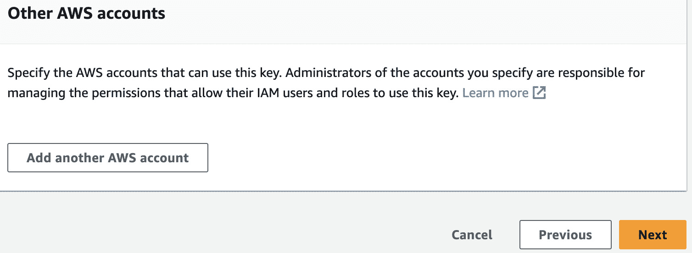
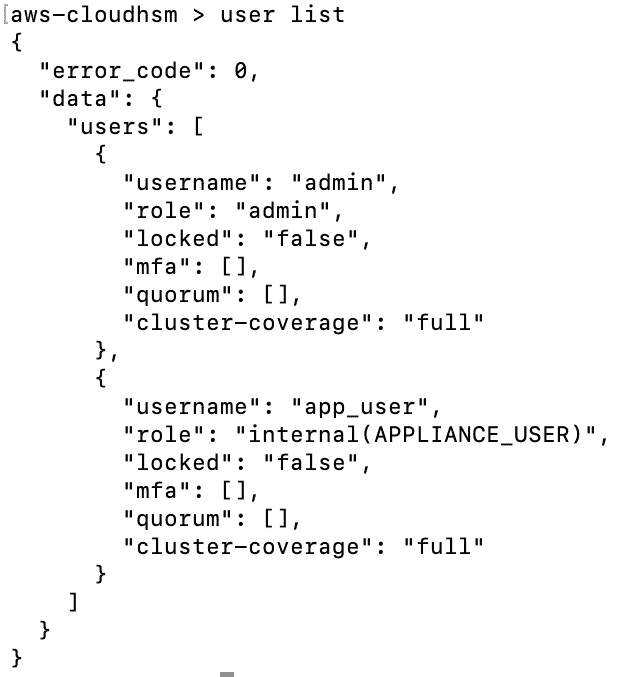

# 第三章：使用 KMS 和 CloudHSM 进行密钥管理

加密就像将我们的消息转换成秘密代码，以便只有预期的接收者能够理解。想象一下，我们有一条不希望任何其他人阅读的消息。原始形式的消息被称为**明文**。在我们对其进行编码后，它变成了**密文**，对于不知道如何解码的人来说，看起来像无意义的话语。将明文转换为密文称为**加密**，将密文转换回明文称为**解密**。为了进行加密和解密，我们使用一组称为**加密算法**的数学规则。加密算法的示例包括`Rivest-Shamir-Adleman`（**RSA**）、**高级加密标准**（**AES**）、**数据加密标准**（**DES**）、**三重数据加密标准**（**3DES**）、`Blowfish`、`Blowfish`、**椭圆曲线加密**（**ECC**）、**国际数据加密算法**（**IDEA**）和**非常好的隐私**（**PGP**）。

你可能会想，如果加密算法是公开的知识，那么有什么阻止任何人解密数据呢？答案在于使用**加密密钥** - 一组唯一的字符字符串，与算法一起使用时保护数据。有两种主要类型的加密：**对称**和**非对称**。对称加密使用相同的密钥进行加密和解密，这要求该密钥在涉及的各方之间保密。相比之下，非对称加密使用密钥对 - 一个用于加密，另一个用于解密。例如，公钥可以公开共享，用于加密，而私钥则由预期接收者严格保护，用于解密。因此，即使算法的广泛知识，由于加密密钥的机密性，加密数据的隐私仍然受到保护。

AWS **密钥管理服务**（**KMS**）是 AWS 云中的主要服务，帮助我们创建和管理加密密钥，也是本章的主要焦点。KMS 支持对称和非对称加密密钥。根据所有权，我们可以将 KMS 密钥分类为**客户管理的密钥**、**AWS 管理的密钥**和**AWS 拥有的密钥**。使用客户管理的密钥，我们创建和管理密钥。使用 AWS 管理的密钥，AWS 在我们的账户中为特定服务（如 S3、EBS 等）创建密钥，并为我们管理密钥。AWS 还有另一种称为 AWS 拥有的密钥，AWS 为服务（如 S3 的默认加密）创建和管理的密钥。使用客户管理和 AWS 管理的密钥，我们可以通过 CloudTrail 日志查看各种密钥及其使用情况。然而，对于 AWS 拥有的密钥，我们没有任何可见性。

在本章中，我们将学习如何使用 AWS `CloudHSM`。CloudHSM 是 AWS 中的另一个服务，它允许我们管理加密密钥，但使用专用的 HSM 来增强安全性。KMS 则使用共享的**硬件安全模块**（**HSMs**）。

本章中，我们将涵盖以下配方：

+   在 KMS 中创建密钥

+   使用外部密钥材料创建密钥（BYOK）

+   在 KMS 中旋转密钥

+   使用授权程序化授予权限

+   使用带条件密钥的密钥策略

+   在账户之间共享客户管理的密钥

+   创建、初始化和激活 CloudHSM 集群

# 技术要求

在深入研究本章的配方之前，我们需要确保已经具备以下要求：

+   我们需要一个有效的 AWS 账户来完成本章中的配方。可以使用属于 AWS Organizations 的账户或独立账户。我将使用我们在*第一章*中为*使用 AWS Organizations 进行多账户管理*创建的`awsseccb-sandbox-1`账户。但我不会使用 AWS Organizations 的任何功能，这意味着你也可以使用独立账户来跟随这些步骤。

+   对于管理员操作，我们需要一个具有`AdministratorAccess`权限的用户来操作我们正在使用的 AWS 账户。这个用户可以是**IAM 身份中心用户**或 IAM 用户。我将使用在*第一章*中我们为*用户管理和使用 IAM 身份中心的单点登录*创建的 IAM 身份中心用户`awsseccbadmin1`。不过，我不会使用 IAM 身份中心的任何功能，这意味着如果用户在账户中拥有`AdministratorAccess`权限，你也可以使用 IAM 用户来执行这些步骤。你可以参考*第一章*中的*设置 IAM、账户别名和账单警报*配方来创建 IAM 用户。

+   对加密的基本知识（包括对称密钥、非对称密钥和**公钥基础设施**（**PKI**））有一定了解，将帮助你理解本章中的配方。

本书的代码文件可以在[`github.com/PacktPublishing/AWS-Security-Cookbook-Second-Edition`](https://github.com/PacktPublishing/AWS-Security-Cookbook-Second-Edition) 找到。本章的代码文件可以在[`github.com/PacktPublishing/AWS-Security-Cookbook-Second-Edition/tree/main/Chapter03`](https://github.com/PacktPublishing/AWS-Security-Cookbook-Second-Edition/tree/main/Chapter03) 找到。

# 在 KMS 中创建密钥

在这个配方中，我们将创建一个自定义管理的 KMS 密钥，密钥类型设置为**对称密钥**。对称密钥是我们使用 KMS 创建的最常见的密钥。还需要注意的是，KMS 密钥，作为 KMS 中的主要资源，曾被称为**客户主密钥**（**CMKs**）。这种更名有助于避免与“客户管理密钥”这一术语混淆，后者也可以缩写为 CMKs。

## 准备就绪

我们需要以下内容来完成此操作：

+   一个有效的 AWS 账户（**awsseccb-sandbox-1**）和一个用户（**awsseccbadmin1**），如*技术* *要求*部分所述。

+   两个用户或角色。这些可以是 IAM 用户或角色，包括与 IAM 身份中心用户对应的角色。我将使用`awsseccb_admin1`用户作为**密钥管理员**。密钥管理员可以通过 KMS API 管理密钥。我将使用另一个用户`awsseccb_user1`作为**密钥用户**。密钥用户可以使用客户管理的密钥加密和解密数据。我们甚至可以使用相同的用户同时作为密钥管理员和密钥用户。我还将解释如何使用与 IAM 身份中心用户对应的角色作为密钥管理员或密钥用户。

## 如何操作...

我们可以通过控制台在 KMS 中创建一个客户管理的密钥，具体步骤如下：

1.  登录到 AWS 管理控制台并进入**密钥管理服务**。

1.  从左侧边栏点击**客户管理密钥**。

1.  点击**创建密钥**。

1.  在**配置密钥**步骤中，如下图所示，选择**对称**作为**密钥类型**，并选择**加密和解密**作为**密钥用途**：


图 3.1 – 配置密钥类型和密钥使用

1.  展开**高级选项**并验证**密钥材料来源**已设置为**KMS - 推荐**，并且**区域性**已设置为**单一区域密钥**，如图所示。然后，点击**下一步**进入**添加标签**步骤：


图 3.2 – 高级选项

1.  在**添加标签**步骤中，输入`seccb-dev-encryption`作为**别名**，并为**描述**输入**Sec CB 项目的开发加密密钥**。可选地，通过点击**添加标签**按钮添加标签。点击**下一步**进入**定义关键管理权限**步骤。

1.  在**定义关键管理权限**步骤中，选择**关键管理员**，这些是可以通过 KMS API 管理此密钥的 IAM 用户和角色。我已选择`awsseccb_admin1`。然而，正如我们所见，如果使用 IAM 身份中心用户，我们可以选择与该 IAM 身份中心用户和**权限集**组合对应的角色。


图 3.3 – 定义关键管理权限

1.  对于**密钥删除**，勾选**允许密钥管理员删除此密钥**。点击**下一步**进入**定义密钥使用权限**步骤。

1.  关于**定义密钥使用权限**步骤，选择**密钥用户**，即可以使用客户管理密钥进行数据加密和解密的 IAM 用户和角色。在同一步骤中，我们还可以选择**其他 AWS 账户**，使其能够使用该密钥。我选择了`awsseccb_user1`用户。与*步骤 7*类似，如果我们使用 IAM Identity Center 用户，我们可以选择与该 IAM Identity Center 用户和权限集组合对应的角色。点击**下一步**。

1.  审查**密钥配置**、**别名和描述**、**标签**和**密钥策略**（JSON 格式）。点击**完成**以创建密钥。我们应该看到一条消息，显示密钥已创建，并显示密钥 ID 的详细信息，如下图所示：


图 3.4 – 密钥创建成功消息

AWS 生成的密钥策略保存在代码文件中，供参考，文件名为`generated-key-policy.json`。

在本教程中，我们创建了一个 KMS 密钥。在下一节中，我们将介绍一些与 KMS 密钥相关的重要概念。

## 工作原理...

在 AWS KMS 中创建加密密钥是一个简单的过程。首先，我们需要一个具有管理权限的 IAM 用户或 IAM Identity Center 用户的有效 AWS 账户，以便创建和管理密钥。我们需要`kms:CreateKey`权限来创建新的 KMS 密钥。为了添加标签，我们还需要`kms:TagResource`权限。在本教程中，我们使用了一个具有`AdministratorAccess`权限的用户，因此拥有这两项权限。

在配置密钥时，我们选择了用于一般加密和解密目的的对称 KMS 密钥选项，如*图 3.1*所示。在**高级选项**部分，我们将**密钥材料**的来源选择为 KMS，这是推荐的选项。在加密学领域，密钥材料指的是在加密算法中使用的比特字符串，是加密和解密我们数据的核心元素。每个 AWS KMS 密钥都与一个密钥材料相关联，相关信息存储在其元数据中。默认情况下，AWS 负责使用 FIPS 验证的硬件安全模块创建密钥材料，并且该材料永远不会以未加密的形式离开 AWS KMS。唯一的例外是非对称密钥对的公钥，它可以导出供外部使用。

密钥材料的来源是 AWS KMS 中 KMS 密钥的一个特定属性，用于指示其密钥材料的来源。从*图 3.2*中我们可以看到，KMS 密钥的密钥材料来源值可以是以下之一：

+   **KMS - 推荐**是默认选项，也是最推荐的选项。如果选择此选项，AWS 会处理密钥材料的创建和管理。

+   **外部（导入密钥材料）**适用于那些希望导入自己密钥材料的用户。这样我们就需要管理和保护这些材料。

+   使用**AWS CloudHSM 密钥库**时，AWS KMS 在我们的 AWS CloudHSM 集群中创建密钥材料。

+   **外部密钥存储** 用于当密钥材料存储在 AWS 之外的外部密钥管理器中时。这是专门针对外部密钥存储中的 KMS 密钥。

如我们在 *图 3* *.3* 中看到的那样，我们可以将 IAM 用户或角色指定为密钥管理员。密钥管理员是可以通过 KMS API 管理此密钥的 IAM 用户和角色。我们还选择了允许密钥管理员删除密钥的选项。类似地，我们可以将 IAM 用户或角色指定为密钥用户。密钥用户是能够使用客户管理的密钥来加密和解密数据的 IAM 用户和角色。

KMS 密钥策略是一个 JSON 文档，指定谁可以访问该密钥以及在什么条件下访问。与密钥一起，AWS 会创建一个默认的密钥策略，并为我们选择的密钥管理员和密钥用户分配所需的权限。如果我们查看生成的密钥策略，应该能够看到 `kms:Create`* 、 `kms:Describe`* 、 `kms:Enable`* 、 `kms:List`* 、 `kms:Put`* 、 `kms:Update`* 、 `kms:Revoke`* 、 `kms:Disable`* 、 `kms:Get`* 、 `kms:Delete`* 、 `kms:TagResource` 、 `kms:UntagResource` 、 `kms:ScheduleKeyDeletion` 和 `kms:CancelKeyDeletion` 等权限，适用于密钥管理员。对于密钥用户，我们应该看到 `kms:Encrypt` 、 `kms:Decrypt` 、 `kms:ReEncrypt`* 、 `kms:GenerateDataKey`* 和 `kms:DescribeKey` 等权限。这些权限也能帮助我们了解在 KMS 中可以执行哪些操作。

## 还有更多...

在这个实例中，我们使用 KMS 提供的标准选项创建了一个密钥。我们可以根据自己的需求配置这些选项。例如，在这个实例中，我们选择了允许密钥管理员删除密钥的选项。根据我们的安全需求，我们可以取消选择该选项，禁止密钥管理员删除密钥。

提示

尝试使用 KMS 中所有可用的选项，并熟悉它们。这将帮助您在工作场景、考试或面试中遇到类似情境时，做出正确的选择。

让我们快速了解一些关于 AWS KMS 服务的重要要点：

+   我们在这个实例中创建了一个对称密钥。AWS KMS 也支持非对称密钥。AWS KMS 允许您创建和管理用于加密和签名的非对称密钥对，方便那些需要公钥基础设施（PKI）场景的应用，例如加密数据，使得只有私钥持有者才能解密，或者为数据签名以验证发送者身份。

+   AWS KMS 密钥最多可以加密 4 KB 大小的数据，因此通常用于加密其他密钥，例如 **数据密钥**。这些数据密钥然后用来加密实际的数据。这些数据密钥并不在 AWS KMS 服务中创建和管理。

+   KMS 是一个区域性服务，因此 KMS 管理的密钥是区域特定的。因此，要使用 KMS 密钥，相应的服务也应位于同一地区。例如，要使用我们为加密 S3 数据而创建的密钥，S3 存储桶需要位于相同区域。

+   KMS 支持一个叫做 **多区域密钥** 的功能，它允许数据在与加密数据时不同的区域进行解密。需要注意的是，这些密钥当前并不是全球性的。相反，存在一个主密钥，并将其复制到其他区域的副本密钥中。

+   拥有 S3 管理员权限的用户，除非是用于加密该文件的密钥的密钥用户，否则没有权限查看使用 KMS 密钥加密的文件。

+   密钥管理员没有权限使用这些密钥加密或解密数据。然而，密钥管理员可以修改密钥策略，将自己添加为密钥用户。这也是审计和日志服务变得重要的地方。

+   AWS KMS 与 AWS CloudTrail 集成，提供所有密钥使用的日志，帮助满足合规性和监管要求。这一集成功能使用户能够跟踪何时以及是谁使用了 KMS 密钥进行加密和解密，提供审计日志，这对于取证分析和合规性审计至关重要。

+   我们无法直接删除密钥。密钥管理员可以禁用密钥和/或安排删除密钥。在写这篇文章时，管理员可以在安排删除密钥时指定一个 7 到 30 天（含）的等待期。对于多区域密钥，我们需要首先删除副本密钥；只有在删除副本密钥后，才能删除主密钥。因此，删除多区域密钥的最短天数是 14 天：7 天用于删除副本密钥，7 天用于删除主密钥。

+   一旦密钥被禁用，我们将无法解密使用该密钥加密的任何数据，直到我们重新启用该密钥。

+   一旦密钥被删除，我们将无法解密任何使用该密钥加密的数据。

## 另见

+   对加密的良好理解将帮助你更好地理解 AWS KMS 服务。你可以在这里了解加密的相关知识：[`www.secdops.com/blog/getting-started-with-encryption`](https://www.secdops.com/blog/getting-started-with-encryption)。

+   AWS KMS 是一项功能丰富的服务。你可以在这里了解更多关于 KMS 及其功能的信息：[`www.cloudericks.com/blog/getting-started-with-aws-key-management-service-kms`](https://www.cloudericks.com/blog/getting-started-with-aws-key-management-service-kms)。

# 使用外部密钥材料创建密钥（BYOK）

当我们在 AWS KMS 中创建密钥时，AWS 会为该密钥创建并管理密钥材料。我们也可以使用在 AWS 外部创建的自有密钥材料来创建密钥。在这个操作中，我们将学习如何将密钥材料导入到 AWS KMS。使用外部密钥材料来创建密钥被称为 **自带密钥** (`BYOK`)，对于那些有严格合规性或政策要求，强制使用他们控制的密钥的组织来说，这非常有用。该密钥应该是一个 256 位的对称密钥。BYOK 不支持使用非对称密钥。

## 准备就绪

我们将需要以下内容来完成这个操作：

+   一个有效的 AWS 账户，`awsseccb-sandbox-1`，以及一个用户，`awsseccbadmin1`，如*技术要求*部分所述。

+   在本地机器上安装最新的 OpenSSL。如果尚未安装，请访问 OpenSSL 官方网站：[`www.openssl.org`](https://www.openssl.org)，下载最新版本的 OpenSSL 并根据说明进行安装。运行`openssl version`命令以确保安装的是最新版本的 OpenSSL。

重要提示

如果你是 macOS 用户，可能会遇到一个重要的兼容性问题：macOS 默认使用 LibreSSL 配合`openssl`命令，而不是 OpenSSL。为了确保使用正确版本的 OpenSSL，你可能需要通过 Homebrew 安装它，并在指定完整路径时直接调用它，或者甚至调整系统的`PATH`设置。如何操作的简易步骤指南可以参考以下博客文章：[`www.secdops.com/blog/using-openssl-alongside-the-default-libressl-on-macos`](https://www.secdops.com/blog/using-openssl-alongside-the-default-libressl-on-macos)。

假设我们已经设置并能正确运行`openssl version`命令，接下来我们将使用它创建外部密钥材料。

## 如何操作...

我们将通过将密钥材料来源设置为**外部**，从 AWS KMS 开始创建我们的密钥。然后，我们将从 AWS KMS 服务下载密钥导入包装器，在本地生成密钥，并使用导入包装器将其包装。最后，我们将上传我们包装好的密钥材料及导入包装器来完成密钥创建。

### 为外部密钥创建密钥配置

我们可以为外部密钥创建一个密钥配置，如下所示：

1.  登录到 AWS 管理控制台，进入**密钥管理服务**。

1.  从左侧边栏点击**客户管理密钥**，然后点击页面右上角的**创建密钥**。

1.  在**配置密钥**步骤中，对于**密钥类型**，选择**对称密钥**，对于**密钥用途**，选择**加密**和**解密**。

1.  展开**高级选项**菜单，选择**外部（导入密钥材料）**。然后，勾选复选框表示你理解使用外部密钥时的安全性和持久性影响。对于**区域性**，选择**单区域密钥**。点击**下一步**进入**添加标签**步骤。

1.  在**添加标签**步骤中，将**别名**设置为`seccb-dev-external-key`，将**描述**设置为**开发环境的外部密钥**。可选地，通过点击**添加标签**按钮来添加标签。点击**下一步**进入**定义密钥管理权限**步骤。

1.  在**定义密钥管理权限**步骤，选择**密钥管理员**，即可以通过 KMS API 管理此密钥的 IAM 用户和角色。我选择了`awsseccb_admin1`用户，如*图 3*.*3*所示。如果您使用的是 IAM 身份中心用户，您可以选择一个角色，该角色对应于该 IAM 身份中心用户与权限集的组合。

1.  对于**密钥删除**，选中**允许密钥管理员删除此密钥**。点击**下一步**进入**定义密钥使用权限**步骤。

1.  关于**定义密钥使用权限**步骤，选择**密钥用户**——即可以使用客户管理密钥进行加密和解密数据的 IAM 用户和角色。在同一步骤中，您可以选择性地添加可以使用此密钥的**其他 AWS 账户**。我选择了`awsseccb_user1`用户。如果您使用的是 IAM 身份中心用户，可以选择一个角色，该角色对应于该 IAM 身份中心用户与权限集的组合。点击**下一步**。

1.  审查**密钥配置**、**别名和描述**、**标签**以及**密钥策略**的 JSON 格式。点击**完成**以创建密钥。密钥将如*图 3*.*4*所示创建。您现在应该还会看到**下载包装公钥和导入令牌**步骤。

1.  关于**下载包装公钥和导入令牌**步骤，在**配置**部分，对于**选择包装密钥规格**，选择**RSA_4096 - 推荐**，对于**选择包装算法**，选择`RSAES_OAEP_SHA_256`。


图 3.5 – 下载包装公钥和导入令牌

1.  点击**下载包装公钥和导入令牌**将令牌下载到您的桌面。然后，点击**下一步**进入**上传您的包装密钥材料**页面。保留下载的导入参数文件，以便我们接下来的步骤使用。

在本节中，我们创建了一个密钥配置。在下一节中，我们将生成我们的密钥材料，然后返回此页面并点击**下一步**进入**上传您的包装密钥材料**步骤。如果我们查看**客户管理密钥**页面，我们应该看到**状态**现在设置为**待导入**。

### 使用 OpenSSL 生成密钥材料

假设我们已经按照*准备工作*部分设置了 OpenSSL，我们可以按照以下步骤生成密钥材料并使用 AWS KMS 在上一节中提供的包装密钥对其进行加密：

1.  由于我们使用的是对称密钥，我们可以使用以下命令生成 256 字节的随机数据并将其保存到名为`MyExternalKeyMaterial.bin`的文件中。这将作为我们的密钥材料：

    ```
    openssl rand -out ExternalKeyMaterialPlaintext.bin 32
    ```

    这将生成一个名为`ExternalKeyMaterialPlaintext.bin`的文件。

1.  在相同的文件夹中执行以下命令，并为`inkey`参数提供我们包装密钥的名称：

    ```
    openssl pkeyutl -encrypt -in ExternalKeyMaterialPlaintext.bin -out ExternalKeyMaterialEncrypted.bin -inkey WrappingPublicKey.bin -keyform DER -pubin -pkeyopt rsa_padding_mode:oaep -pkeyopt rsa_oaep_md:sha256 -pkeyopt rsa_mgf1_md:sha256
    ```

    这将生成一个名为`ExternalKeyMaterialEncrypted.bin`的文件。

通过这个，我们已经生成了密钥材料。在接下来的部分，我们将把这些密钥材料上传到 AWS。

### 从管理控制台继续创建密钥

我们可以按以下方式在 AWS 管理控制台上传我们的密钥材料：

1.  返回到控制台中**上传已包装的密钥材料**步骤的页面。这是我们在*为外部密钥创建密钥配置*部分中停止的地方。

1.  如果我们不在**上传已包装的密钥材料**步骤的页面上，我们可以通过仪表板进入**密钥管理服务**，点击左侧边栏中的**客户管理的密钥**，然后点击我们为其下载了包装密钥的密钥下的**别名**超链接。进入**密钥材料**标签并点击**导入密钥材料**。然后，点击**下一步**进入**上传已包装的密钥材料**步骤的页面。

1.  在**上传已包装的密钥材料**步骤的页面，点击**选择文件**，然后在**包装密钥材料**下选择`ExternalKeyMaterialEncrypted.bin`文件。

1.  点击**选择文件**，然后在**导入令牌**下选择我们在前一部分从 KMS 下载的导入令牌。

1.  保留**密钥材料到期 - 可选**选项未勾选，然后点击**上传密钥材料**。我们应该会看到一个消息，提示密钥已上传。

    密钥现在已经可以使用。如果我们检查**客户管理的密钥**页面，我们应该看到**状态**已从**待导入**变为**启用**。

## 它是如何工作的...

在这个食谱中，我们通过将密钥材料来源设置为**外部**创建了一个 AWS KMS 密钥。之后，我们选择了一个允许的加密方案来包装密钥并下载了密钥包装器。这个密钥包装器是用来加密并安全上传我们的密钥材料到 AWS KMS 服务的公钥。我们还下载了一个来自 AWS KMS 服务的导入令牌，连同密钥包装器一起。导入令牌用于确保上传的密钥是我们为包装令牌下载的正确密钥。

## 还有更多...

在这个食谱中，我们在上传外部密钥材料之前，使用`SHA_256`对其进行包装。我们也可以使用`SHA_1`，但它的安全性较差。如果我们使用 SHA-1，我们可以使用以下命令生成加密的外部密钥材料，`ExternalKeyMaterialEncrypted.bin`：

```
 openssl pkeyutl -encrypt –in ExternalKeyMaterialPlaintext.bin -out ExternalKeyMaterialEncrypted.bin -inkey WrappingPublicKey.bin -keyform DER -pubin -pkeyopt rsa_padding_mode:oaep -pkeyopt rsa_oaep_md:sha1
```

让我们快速浏览一些关于将密钥导入 AWS KMS 的更多细节：

+   当我们导入密钥材料时，我们需要根据安全要求生成具有随机性的密钥材料。我们还需要对密钥材料的持久性负责。

+   使用导入的密钥材料，我们可以为密钥材料设置到期日期，也可以手动删除它。我们可以通过将密钥材料导入 KMS 密钥的方式在未来重新启用该密钥。

+   我们不能删除具有 AWS 密钥材料的 KMS 密钥。然而，我们可以在 7 到 30 天的通知期内安排删除该 KMS 密钥。

+   一旦 KMS 密钥被删除，通过该密钥加密的任何数据都无法解密。这对于 AWS 密钥材料的 KMS 密钥和导入密钥材料的 KMS 密钥都适用。

+   导入到 KMS 密钥中的密钥材料将永久与该 KMS 密钥关联。

+   我们可以重新导入密钥材料。然而，我们不能再次导入不同的密钥材料到该 KMS 密钥。

+   使用具有外部密钥材料的 KMS 密钥加密的密文无法通过另一个 KMS 密钥解密，即使我们使用相同的密钥材料。

+   必须先删除带有导入密钥材料的 KMS 密钥，然后才能将密钥材料重新导入到另一个 KMS 密钥中。

+   如果密钥材料被删除，我们可以将密钥材料重新导入到现有的 KMS 密钥中。

+   在影响 KMS 密钥的区域性故障情况下，AWS 不会自动恢复任何导入的密钥材料。在这种情况下，我们需要拥有密钥材料的副本以便重新导入。

## 另见

您可以在以下博客文章中阅读更多关于外部密钥和 BYOK 的信息：[`www.cloudericks.com/blog/aws-kms-with-external-key-material-the-byok-solution`](https://www.cloudericks.com/blog/aws-kms-with-external-key-material-the-byok-solution)。

# 在 KMS 中轮换密钥

**密钥轮换**是指更改用于保护数据的加密密钥的过程。这一做法对于在密钥被泄露时最小化风险至关重要。AWS 支持客户管理密钥的自动和手动密钥轮换。

定期轮换密钥是一项最佳实践，在使用密钥时需要遵循。根据监管规则或公司政策，密钥轮换也可能是一个要求。这些规则和政策可能还会提供有关密钥轮换频率的指导。我们将在本食谱中查看密钥轮换的不同情况。

## 准备工作

为了完成这个食谱，我们需要以下内容：

+   一个有效的 AWS 账户，`awsseccb-sandbox-1`，和一个用户，`awsseccbadmin1`，如*技术要求*部分所述。

+   一个具有 AWS 密钥材料的客户管理的 KMS 密钥。我将使用我们在*创建 KMS 密钥*食谱中创建的别名为`seccb-dev-encryption`的密钥。

## 如何操作……

我们可以为具有 AWS 密钥材料的客户管理的 KMS 密钥指定每年（365 天）的自动密钥轮换，如下所示：

1.  登录到 AWS 管理控制台，并转到**密钥管理服务**。

1.  在导航窗格中点击**客户管理的密钥**，列出我们创建的所有密钥。

1.  点击我们需要进行轮换的客户管理密钥的**别名**或**密钥 ID**属性。

1.  转到**密钥轮换**选项卡并点击**编辑**。

1.  对于**密钥轮换**，选择**启用**并设置**轮换周期（天数）**，其值为`365`，如下面的图所示：


图 3.6 – 自动密钥轮换

1.  点击**保存**。我们将收到操作成功的通知。

至此，我们已经学会了如何启用自动密钥轮换。我们将在本方案的后续部分进一步学习密钥轮换。

## 工作原理...

AWS 管理的密钥每年会自动轮换一次，之前是每 3 年轮换一次。对于客户管理的密钥，AWS 支持自动和手动两种密钥轮换方式。在自动轮换模式下，只有 KMS 密钥的支持密钥会进行轮换。这意味着 KMS 密钥的 ID、ARN、区域、策略、权限和其他属性保持不变。因此，我们不需要更改使用此 KMS 密钥的应用程序或别名。

在这个方案中，我们选择了每年自动轮换 KMS 密钥的选项。AWS 现在每年轮换一次密钥，并保留旧的支持密钥的副本，用于解密使用旧支持密钥加密的数据。AWS 会保留较旧的支持密钥，直到我们删除它们。

## 还有更多内容...

让我们快速回顾一下与 AWS KMS 密钥轮换相关的一些重要点：

+   每年（365 天）自动轮换密钥仅适用于具有 AWS 密钥材料的 KMS 密钥。

+   如果我们希望密钥轮换有不同的周期，可以手动轮换带有 AWS 密钥材料的 KMS 密钥。

+   在自动密钥轮换中，只有 KMS 密钥会被轮换，而与其加密的数据密钥不会被轮换。

+   在自动密钥轮换中，新的加密操作会使用新的支持密钥。然而，使用旧支持密钥加密的数据会用该旧密钥进行解密。为此，AWS 会保留所有支持密钥，直到我们删除 KMS 密钥。

+   在自动密钥轮换中，即使我们禁用了密钥轮换，旧的支持密钥仍然可用来解密使用该密钥加密的数据。

+   使用自动密钥轮换时，如果禁用轮换并重新启用，它将继续使用旧的密钥轮换计划（如果支持密钥不到一年）。如果支持密钥已经超过 365 天，它将立即进行轮换，然后每 365 天再轮换一次。

+   在自动密钥轮换中，如果密钥处于待删除状态，则不会发生密钥轮换。如果取消删除操作，则如果支持密钥不到一年，它将继续使用旧的密钥轮换计划。如果支持密钥超过 365 天，则会立即进行轮换，并且每 365 天进行一次轮换。

+   对于由 AWS CloudHSM 集群支持的自定义密钥存储，不支持自动密钥轮换。对于这样的 KMS 密钥，`Origin` 字段的值为 `AWS_CloudHSM`。在这种情况下，我们需要手动轮换密钥，并更改任何加密数据或别名以使用新密钥。

+   对于 AWS 管理的密钥，我们无法更改轮换频率，目前为 1 年。

+   自动密钥轮换可以通过 EventBridge 中的 KMS 密钥轮换事件进行监控。

+   我们可以使用 AWS KMS API 启用和禁用自动密钥轮换。在手动密钥轮换时，使用别名来引用 KMS 密钥是一种良好的实践。我们可以更新别名，使其指向新的目标 KMS 密钥，而不是旧的密钥。

+   即使是手动轮换，AWS KMS 也能识别用于加密的正确密钥并用于解密，只要我们保留旧的 KMS 密钥。

+   我们可以使用 AWS KMS API 的 `update-alias` 子命令来更新别名。

## 另请参见

你可以阅读更多关于 AWS KMS 密钥轮换的内容，包括手动密钥轮换，访问 [`www.cloudericks.com/blog/understanding-aws-kms-key-rotation`](https://www.cloudericks.com/blog/understanding-aws-kms-key-rotation)。

# 通过授权编程方式授予权限

**KMS 授权**可用于为 AWS KMS API 操作（如加密、解密、描述密钥等）提供临时细粒度的权限。我们可以使用授权向某个账户中的用户或甚至另一个账户中的用户提供访问权限。在这个配方中，我们将授权一个用户，使其能够使用 AWS KMS 加密和解密文件。

## 准备工作

我们需要以下内容来完成这个配方：

+   一个有效的 AWS 账户，其中有两个用户：一个具有`AdministratorAccess`权限的用户和一个没有权限的用户。这些用户的 CLI 配置文件应已配置好。我将分别称这些用户及其 CLI 配置文件为`Adminuserprofile`和`testusernopermission`，按照 *第一章* 中的配方。

+   一个 KMS 密钥。我们可以通过遵循本章之前的配方来创建一个。或者，可以使用以下命令通过 AWS CLI 创建 KMS 密钥：

    ```
    aws kms create-key --profile Adminuserprofile
    ```

    这将提供类似于以下的输出：


图 3.7 – 使用 CLI 创建密钥

在继续之前，我们必须通过运行以下命令检查我们的测试用户是否拥有任何权限。确保将我的 `key-id` 替换为你的 `key-id`：

```
 aws kms encrypt --plaintext "$(echo -n 'hello heartin' | base64)" --key-id ea7136c3-7d8a-4ed4-89cc-4ca0af7d6958 --profile testusernopermission
```

我们应该会收到类似于以下截图中的错误信息：


图 3.8 – 用户权限检查的响应

在前面的命令中，我们可以仅指定密钥 ID（如我们所做的），也可以指定完整的密钥 ARN，或使用别名（如果有的话）。

接下来，我们将学习如何使用授权，以便我们可以通过编程方式授予权限。

## 如何操作...

我们可以授予 `testuser` 加密权限，然后按如下方式使用它进行加密：

1.  我们可以从 IAM 控制台获取用户的 ARN，或者根据前面的格式准备一个。我们还可以使用 `aws iam get-user` 命令从控制台获取用户的 ARN：

    ```
    aws iam get-user --user-name testuser --profile Adminuserprofile
    ```

    此命令将返回类似于以下的响应：


图 3.9 – 获取用户命令的响应

1.  使用`create-grant`子命令为`testuser`授予`Encrypt`权限，提供用户的 ARN：

    ```
    aws kms create-grant --key-id ea7136c3-7d8a-4ed4-89cc-4ca0af7d6958 --grantee-principal arn:aws:iam::201882936474:user/testuser --operations "Encrypt" --profile Adminuserprofile
    ```

    我们应该获得类似以下截图所示的响应：


图 3.10 – `create-grant`子命令的响应

1.  使用`testuser`通过`encrypt`子命令加密数据：

    ```
    aws kms encrypt --plaintext "$(echo -n 'hello heartin' | base64)" --key-id ea7136c3-7d8a-4ed4-89cc-4ca0af7d6958 --profile testusernopermission
    ```

    这一次，我们应该获得如下所示的成功响应：


图 3.11 – 获取权限后加密命令的响应

1.  使用`list-grants`子命令验证密钥的授权：

    ```
    aws kms list-grants --key-id ea7136c3-7d8a-4ed4-89cc-4ca0af7d6958 --profile Adminuserprofile
    ```

    这应该返回一个类似以下的响应：


图 3.12 – `list-grant`命令的响应

1.  使用`revoke-grant`子命令撤销授权：

    ```
    aws kms revoke-grant --key-id ea7136c3-7d8a-4ed4-89cc-4ca0af7d6958 --grant-id e6579fcfec8d84ce9a48398a5e33466de47b75e06f99b4e1edd178914c559bb5 --profile Adminuserprofile
    ```

1.  我们可以通过尝试使用`testuser`加密，并运行`list-grants`子命令来验证授权是否已被撤销。运行`encrypt`命令，类似于此示例中的*第 2 步*。我们现在应该获得一个类似以下的错误消息：


图 3.13 – 撤销权限后加密命令的响应

1.  运行`list-grant`子命令，类似于此示例中的*第 3 步*。我们现在应该获得类似以下的响应：


图 3.14 – 撤销所有授权后的`list-grant`命令响应

同样，我们可以为其他操作授予权限。

## 它是如何工作的...

在这个示例中，我们使用`aws kms` CLI 命令的`create-grant`子命令授予了用户权限。我们验证了在授权之前，用户无法执行加密操作。我们验证了授权之后，用户可以执行加密操作。

然后，我们使用`aws kms` CLI 命令的`revoke-grant`子命令撤销了授权。我们还使用了其他子命令，如`list-grants`来列出特定密钥 ID 的授权，以及`encrypt`来加密明文数据。

## 还有更多内容...

在这个示例中，我们只为一个操作授予了权限。我们可以为多个操作授予权限，如下所示：

```
 aws kms create-grant --key-id 1ab77c7a-7ca4-4387-a4c5-2fba3cb5c0f5 --grantee-principal arn:aws:iam::135301570106:user/testuser --operations "Encrypt" "Decrypt" --profile Adminuserprofile
```

让我们快速浏览一些与授权和撤销权限相关的重要概念：

+   支持的授权操作包括`Encrypt`、`Encrypt`、`Encrypt`、`Encrypt`、`Encrypt`、`Encrypt`、`Encrypt`、`RetireGrant`和`DescribeKey`。

+   我们可以使用 AWS KMS API 的`encrypt`子命令，通过密钥将明文转换为密文。

+   我们可以使用 AWS KMS API 的 `decrypt` 子命令，在加密时使用的相同密钥的帮助下，将密文转换为明文。

+   我们可以使用 AWS KMS API 的 `re-encrypt` 子命令，在服务器端使用新的 CMK 解密并重新加密数据，而无需在客户端暴露明文。此子命令还可以用来更改密文的加密上下文。

+   加密上下文是一组可选的附加键值对，作为额外的身份验证检查。用于加密的相同加密上下文需要在解密和重新加密时使用。由于加密上下文不是秘密信息，它将以明文形式出现在 AWS CloudTrail 日志中，因此对于监控和审计加密操作非常有用。

+   授权是密钥策略的替代方案。

+   在同一账户内，我们可以使用密钥 ID 或密钥 ARN 与 `create-grant` 子命令。对于其他账户的用户，需指定 ARN。

+   `create-grant` 子命令具有一个约束参数，接受加密上下文。

+   当我们创建授权时，由于 AWS 遵循最终一致性模型，权限可能不会立即反映出来。通过在后续请求中使用从 `create-grant` 子命令接收到的授权令牌，我们可以避免由于最终一致性导致的延迟。

+   `list-grants` 子命令用于列出某个密钥的所有授权，并提供附加的 `starting-token`、`page-size` 和 `max-items` 参数，用于分页结果。

+   AWS CLI 分页参数 `starting-token`、`page-size` 和 `max-items` 的功能如下：

    +   `max-items` 参数指定 API 需要返回的最大项目数量。

    +   如果 API 调用返回的结果超过了 `max-items` 所指定的数量，则响应中会提供 `NextToken`，需要将其作为 `starting-token` 传递到下一次请求中。

    +   `page-size` 参数指定单次 API 调用中要检索的最大元素数。例如，如果 `page-size` 为 `10` 且 `max-items` 为 `100`，则后台会发起 10 次 API 调用，并返回 100 个项目。

+   `revoke-grant` 子命令可以由创建该授权的账户的根用户、授权的 `RetiringPrincipal` 或被授予该授权进行 `RetireGrant` 操作的 `GranteePrincipal` 运行。

+   AWS 文档建议，在清理时，当我们不再使用授权时，通过 `retire-grant` 子命令撤销该授权。然而，当我们有意拒绝依赖该授权的操作时，应使用 `revoke-grant` 子命令撤销授权。

+   `list-retirable-grants` 子命令可以用来列出所有具有指定 `RetiringPrincipal` 的授权。

+   `list-retirable-grants`子命令提供了`limit`和`marker`参数，用于限制需要返回的可重试授权。这里，`limit`是需要返回的最大项数，而`marker`是上次请求返回的`NextMarker`的值，当需要返回的项数超过`limit`参数所指定的数目时使用。

## 另见

要了解 AWS KMS 中的授权基础，请参考这篇博客文章：[`www.cloudericks.com/blog/understanding-grants-in-aws-kms`](https://www.cloudericks.com/blog/understanding-grants-in-aws-kms)。

# 使用带条件密钥的密钥策略

在这个示例中，我们将学习如何使用**密钥策略**，特别是带条件的密钥策略。KMS 密钥的基于资源的策略被称为密钥策略。管理 KMS 资源的访问时，我们可以单独使用密钥策略，也可以将 IAM 策略和授权与密钥策略一起使用。与其他基于资源的策略（如桶策略）不同，密钥策略是强制性的，用于管理和使用密钥。当密钥被创建时，AWS 会自动创建一个默认的密钥策略，就像我们在*创建 KMS 密钥*示例中看到的那样。

## 准备中

我们需要以下内容来完成这个示例：

+   一个有效的 AWS 账户，`awsseccb-sandbox-1`，和一个用户，`awsseccbadmin1`，如*技术要求*部分所述。

+   在`us-east-1`区域创建一个 S3 桶。我将使用一个名为`awssecuritykmsbucket`的桶。

## 如何操作……

我们可以通过以下方式演示如何使用带条件密钥的密钥策略：

1.  使用控制台的默认配置创建密钥，如下所示：

    1.  转到管理控制台中的**密钥管理服务（KMS）**。

    1.  从左侧边栏选择**客户管理的密钥**并点击**创建密钥**。

    1.  在**配置密钥**面板中，选择**密钥类型**下的**对称**。然后，在**密钥使用**下选择**加密和解密**。点击**下一步**。

    1.  提供**别名**和**描述**值，保持其他选择不变，然后点击**下一步**。

    1.  在下一个屏幕上，不要添加任何**密钥管理员**。相反，直接点击**下一步**。

    1.  在**定义密钥使用权限**面板中，也不要添加任何**密钥用户**。直接点击**下一步**。

    1.  此时，我们应该看到如下图所示的策略。请审阅并点击**完成**：


图 3.15 – 密钥策略审核

1.  我们可以按照以下方式，将此 KMS 密钥添加为同一区域内 S3 桶的加密密钥：

    1.  转到我们 S3 桶的**属性**标签页。

    1.  向下滚动到**默认加密**并点击**编辑**。

    1.  在**默认加密**面板中，选择**加密类型**下的**使用 AWS 密钥管理服务（KMS）密钥的服务器端加密（SSE-KMS）**。

    1.  在**AWS KMS 密钥**下，输入我们创建的密钥的 ARN。

    1.  对于`Bucket Key`，选择**禁用**。

    1.  点击**保存更改**。


图 3.16 – 为 S3 存储桶添加加密密钥

1.  将文件上传到 S3，并验证加密和解密是否正常工作：

    1.  将文件上传到 S3 存储桶中。

    1.  点击该文件，然后点击**打开**。我们应该能查看文件的内容。


图 3.17 – 查看 S3 存储桶内容

1.  通过添加密钥策略声明来拒绝 S3 服务的密钥使用：

    1.  在管理控制台中转到 **密钥管理服务**。

    1.  点击**客户管理的密钥**。

    1.  点击我们需要修改的密钥。

    1.  点击**密钥策略**选项卡。

    1.  点击**切换到策略视图**。

    1.  点击**编辑**，添加以下密钥策略声明并确保逗号正确，然后点击**保存更改**。

    ```
     {
        "Effect": "Deny",
        "Principal": {
            "AWS": "arn:aws:iam::135301570106:root"
        },
        "Action": [
            "kms:Encrypt",
            "kms:Decrypt",
    "kms:ReEncrypt*",
            "kms:GenerateDataKey*",
            "kms:CreateGrant",
            "kms:ListGrants",
            "kms:DescribeKey"
        ],
        "Resource": "*",
        "Condition": {
            "StringEquals": {
                "kms:ViaService": "s3.us-east-1.amazonaws.com"
            }
        }
    }
    ```

1.  回到我们在*步骤 3*中打开的相同文件，点击**打开**以打开文件。现在我们将无法查看文件，并将收到以下错误。这是因为 S3 没有权限使用密钥执行解密操作：


图 3.18 – 尝试查看 S3 存储桶内容时发生的错误

如果我们直接在浏览器中运行 URL，而不从 S3 控制台点击**打开**，则无论是否有密钥条件策略，由于使用了 SSE-KMS 加密，文件将无法显示。

## 它是如何工作的...

在本食谱中，我们创建了一个具有默认权限的密钥，并尝试使用该密钥对 S3 存储桶中的文件进行加密和解密。我们成功地完成了加密和解密操作。然后，我们为 S3 服务使用 `kms:ViaService` 条件密钥添加了显式的**拒绝**，并再次尝试解密相同的文件。这一次，我们无法解密。

正如我们在本食谱的*步骤 1*中看到的，默认的密钥策略为所有者账户的根用户提供完全权限，并启用访问 KMS 密钥所需的 IAM 策略。它还允许密钥管理员管理 KMS 密钥，并允许密钥用户使用 KMS 密钥。此外，我们在使用 `ViaService` API 时，需要指定 S3 服务的区域。我使用了`us-east-1`，因为我的存储桶位于 `us-east-1`。

在我们的密钥策略 JSON 中，我们使用了以下元素：

+   `Effect` ：指定是否允许或拒绝权限。

+   `Principal` ：指定谁获得权限。允许的值包括 AWS 账户（根账户）、IAM 用户、IAM 角色和支持的 AWS 服务。

+   `Action` ：指定要允许或拒绝的操作（例如，**kms:Encrypt**）。

+   `Resource` ：指定应用策略的资源。我们使用 `*` 来表示所有资源。

+   `Condition` ：用于指定密钥策略生效的任何条件。这是一个可选元素。

我们还可以指定一个可选的 `Sid` 参数。`Sid` 代表 **语句标识符**，可以包含描述我们策略的字符串值。

## 还有更多...

让我们快速了解一些关于使用密钥策略的重要概念：

+   为了管理 KMS 资源的访问，我们可以单独使用密钥策略，也可以将 IAM 策略和授权与密钥策略一起使用。

+   为了允许访问 KMS 密钥，我们始终需要使用密钥策略，可以单独使用，或者与 IAM 策略或授权一起使用。

+   KMS 中的主要资源是 KMS 密钥。

+   KMS 密钥的 ARN 具有以下形式：`arn:aws:kms:<region>:<accountID>:key/<key ID>`。

+   一些 KMS 操作还允许使用别名作为资源。别名 ARN 具有以下形式：`arn:aws:kms:<region>:<accountID>:alias/<alias name>`。

+   任何用户，包括根用户，都可以访问 KMS 密钥，但前提是密钥策略允许。

+   从管理控制台创建 KMS 密钥时，默认的密钥策略会将完全权限授予所有者账户的根用户，并启用访问 KMS 密钥所需的 IAM 策略。它还将允许密钥管理员管理 KMS 密钥，并允许密钥用户使用 KMS 密钥。从程序方式创建 KMS 密钥时，默认的密钥策略将完全权限授予所有者账户的根用户。它还启用访问 KMS 密钥所需的 IAM 策略。

+   当我们添加密钥管理员或密钥用户时，他们会被添加到策略文档语句中，并授予所需的权限。我们在 *创建 KMS 密钥* 配方中看到了密钥管理员和密钥用户的完整权限列表。

+   AWS 在一些默认权限中添加了通配符，例如 `kms:Create*`、`kms:Describe`* 等，以便如果 AWS 创建一个新的以相同前缀开头的操作，管理员或用户将自动获得这些权限。

+   AWS 提供了全局条件密钥以及特定服务的密钥。

+   全局条件密钥包括 `aws:PrincipalTag`、`aws:PrincipalTag`、`aws:PrincipalTag`、`aws:PrincipalTag`、`aws:PrincipalTag`、`aws:PrincipalTag`、`aws:PrincipalTag`、`aws:PrincipalTag`、`aws:userid` 和 `aws:username`。

+   AWS KMS 条件密钥包括 `kms:BypassPolicyLockoutSafetyCheck`、`kms:BypassPolicyLockoutSafetyCheck`、`kms:BypassPolicyLockoutSafetyCheck`、`kms:BypassPolicyLockoutSafetyCheck`、`kms:BypassPolicyLockoutSafetyCheck`、`kms:BypassPolicyLockoutSafetyCheck`、`kms:BypassPolicyLockoutSafetyCheck`、`kms:BypassPolicyLockoutSafetyCheck`、`kms:BypassPolicyLockoutSafetyCheck`、`kms:BypassPolicyLockoutSafetyCheck`、`kms:BypassPolicyLockoutSafetyCheck`、`kms:BypassPolicyLockoutSafetyCheck`、`kms:BypassPolicyLockoutSafetyCheck`、`kms:BypassPolicyLockoutSafetyCheck`、`kms:WrappingAlgorithm` 和 `kms:WrappingKeySpec`。

## 另请参见

+   你可以在这里阅读更多关于 AWS KMS 密钥策略的内容：[`www.cloudericks.com/blog/understanding-key-policies-in-aws-kms`](https://www.cloudericks.com/blog/understanding-key-policies-in-aws-kms)。

+   你可以在这里阅读关于密钥策略和授权之间的区别：[`www.cloudericks.com/blog/understanding-aws-kms-key-policies-vs-grants`](https://www.cloudericks.com/blog/understanding-aws-kms-key-policies-vs-grants)。

+   你可以在这里阅读更多关于 AWS KMS 条件密钥的内容：[`www.cloudericks.com/blog/understanding-aws-kms-condition-keys`](https://www.cloudericks.com/blog/understanding-aws-kms-condition-keys)。

+   你可以在这里阅读更多关于 AWS 中的策略和权限的内容：[`www.cloudericks.com/blog/demystifying-aws-policies-and-permissions`](https://www.cloudericks.com/blog/demystifying-aws-policies-and-permissions)。

# 跨账户共享客户管理的密钥

在这个操作中，我们将学习如何在一个账户中使用来自另一个账户的 KMS 密钥。

## 准备工作

我们需要以下内容来完成此操作：

+   两个工作中的 AWS 账户。我将使用我们在*第一章*中创建的账户，第一个账户的账户 ID 为`135301570106`，第二个账户的账户 ID 为`380701114427`。

+   账户 2 中拥有`AdministratorAccess`权限的用户。这可以是一个 IAM 用户或一个 IAM 身份中心用户。CLI 配置文件应为该用户配置。我将称这个 CLI 配置文件为`Adminuserprofile`。

+   另一个没有管理员权限的账户 2 用户。CLI 配置文件应为该用户配置。我将称这个用户及其 CLI 配置文件为`Testuserprofile`。

## 如何操作...

首先，我们将在第一个账户中创建一个新的 KMS 密钥。然后，我们将授权第二个账户使用它。最后，我们将使用该 KMS 密钥从第二个账户测试第一个账户。

### 创建密钥并授权给另一个账户

在本节中，我们将在账户 1 中创建一个密钥，并赋予账户 2 密钥使用权限。让我们开始吧：

1.  登录到 AWS 管理控制台并进入**密钥管理服务**。

1.  从左侧边栏点击**客户管理的密钥**，然后在页面右上角点击**创建密钥**。

1.  在**配置密钥**窗格中，选择**密钥类型**为**对称**，选择**密钥使用**为**加密和解密**。然后点击**下一步**。

1.  在**添加标签**窗格中，提供**别名**和**描述**值。点击**下一步**。

1.  在**定义关键管理权限**屏幕上，如果需要，我们可以添加任何**密钥管理员**，并勾选**允许密钥管理员删除此密钥**的复选框。然后点击**下一步**。

1.  在**定义密钥使用权限**屏幕上，向下滚动到**其他 AWS 账户**部分，然后点击**添加另一个 AWS 账户**，如下面的图所示：



图 3.19 – 其他 AWS 账户部分

1.  输入第二个 AWS 账户的账户 ID，然后点击**下一步**。


图 3.20 – 添加其他 AWS 账户

1.  在**审查**页面，审查**密钥策略**详细信息并点击**完成**。已添加到密钥策略中的声明可以在代码文件中找到，文件名为`key-policy-sharing-keys.json`。

1.  一旦收到密钥创建成功的消息，点击**查看密钥**以查看密钥的详细信息。我的新创建的密钥的 ARN 如下：

    ```
    arn:aws:kms:us-east-1:201882936474:key/24ce962a-ee5e-411e-9cb6-ebbee39e253c
    ```

在本节中，我们在账户 1 中创建了一个密钥，并授予账户 2 权限。在下一节中，我们将在账户 2 中使用此密钥。

### 以来自账户 2 的管理员用户身份使用该密钥

现在，让我们尝试以来自账户 2 的管理员权限用户身份使用该密钥。

使用以下命令，通过账户 2 中的管理员用户配置文件在 CLI 中加密数据：

```
 aws kms encrypt --plaintext "$(echo -n 'hello heartin' | base64)" --key-id arn:aws:kms:us-east-1:201882936474:key/24ce962a-ee5e-411e-9cb6-ebbee39e253c --profile Adminuserprofile
```

我们应该看到以下响应：


图 3.21 – 运行加密命令后，管理员用户的响应

在下一节中，我们将以来自账户 2 的非管理员用户身份使用该密钥。

### 以来自账户 2 的非管理员用户身份使用该密钥

在继续之前，我们可以通过使用非管理员用户配置文件运行上一节中*步骤 1* 显示的命令，验证非管理员用户是否没有权限加密账户 1 中的数据。现在，按照以下步骤操作：

1.  要将 KMS 密钥作为非管理员用户使用，账户 2 的根用户或管理员用户必须将权限委托给非管理员用户。为此，他们必须执行以下步骤：

    1.  转到账户 2 的`IAM`仪表盘。

    1.  点击左侧面板中的**策略**。

    1.  点击**创建策略**。

    1.  转到`JSON`标签。

    1.  输入以下策略。确保更新`Sid`值和`Resource`参数，以反映您的资源详细信息：

    ```
     {
        "Version": "2012-10-17",
        "Statement": [
            {
                "Sid": "DelegateCMKAccessFrom201882936474",
                "Effect": "Allow",
                "Action": [
                    "kms:Encrypt",
                    "kms:Decrypt",
                    "kms:ReEncrypt*",
                    "kms:GenerateDataKey*",
                    "kms:DescribeKey"
                ],
                "Resource": "arn:aws:kms:us-east-1:201882936474:key/24ce962aee5e-411e-9cb6-ebbee39e253c"
            }
        ]
    }
    ```

    1.  点击**下一步**。

    1.  在**审查并创建**面板中，针对**策略详细信息**，为我们的策略提供**名称**和**描述**详细信息。

    1.  点击**创建策略**。

    1.  如果您使用的是 IAM 用户，请将此策略直接分配给该 IAM 用户或该用户所在的组。如果您使用的是 IAM 身份中心用户，您可以使用自定义权限集分配此策略，正如我们在*第二章*的*在 IAM 身份中心中创建客户管理的策略*示例中所看到的那样。

1.  使用以下命令，通过账户 2 的非管理员用户配置文件在 CLI 中加密数据：

    ```
    aws kms encrypt --plaintext "$(echo -n 'hello heartin' | base64)" --key-id arn:aws:kms:us-east-1:201882936474:key/24ce962a-ee5e-411e-9cb6-ebbee39e253c --profile testprofilenopermission
    ```

    我们应该看到以下响应：


图 3.22 – 运行加密命令后，非管理员用户的响应

在这个示例中，我们创建了一个新的 KMS 密钥。我们也可以编辑现有的 KMS 密钥，并添加另一个账户的详细信息。

## 它是如何工作的...

在本教程中，我们在账户 1 中创建了一个 KMS 密钥，并为账户 2 授予了权限。之后，我们成功地通过管理员用户的配置文件从 CLI 对另一个账户的数据进行了加密。要使用非管理员用户进行加密，账户 2 的管理员用户需要将权限委托给需要访问的用户或角色。我们通过 IAM 策略完成了这一步骤。

有关策略文档结构的更多详细信息，请参考*使用带条件的密钥的密钥策略*教程。

## 还有更多内容...

在本教程中，我们尝试通过 AWS CLI 对数据进行加密。尽管大多数集成服务（如 S3 和 EC2）支持跨账户委托密钥权限，但它们可能不支持在控制台中自动选择密钥。请查看每个服务的文档以获取更多详情。如果在管理控制台中存在限制，则需要通过 API 并指定密钥的 ARN 来完成此操作。

## 另请参见

本章中，我们探讨了 AWS KMS 的许多功能。KMS 在 AWS 云中有许多应用和集成，如 S3 加密、EBS 加密等。包括所有这些应用和集成需要一本专门讲解 KMS 的书。您可以在[`www.cloudericks.com/blog/applications-of-aws-kms-within-aws-cloud`](https://www.cloudericks.com/blog/applications-of-aws-kms-within-aws-cloud)上探索更多关于 KMS 在 AWS 云中的应用和集成。

# 创建、初始化和激活 CloudHSM 集群

在本教程中，我们将创建一个 AWS CloudHSM 集群。CloudHSM 是 AWS 云上的专用**硬件安全模块**（**HSM**），我们可以用它来生成和使用加密密钥。而 AWS KMS 则使用共享 HSM。CloudHSM 非常适合那些要求最高隔离和控制的场景。

## 准备工作

完成本教程，我们需要以下资源：

+   一个有效的 AWS 账户，`awsseccb-sandbox-1`，以及一个用户，`awsseccbadmin1`，如*技术要求*部分所述。

+   了解 VPC 和 EC2。如果您是 EC2 的新手或想复习相关概念，可以先练习*第五章*中的教程，然后再回来完成本教程。

重要提示

与 AWS KMS 相比，AWS CloudHSM 通常会产生更高的费用，并且不提供免费层选项。对于那些出于教育或学习目的使用 CloudHSM 的人来说，至关重要的是在完成相关教程后立即删除已创建的资源。这一主动步骤有助于防止任何意外费用的产生。

## 如何操作...

首先，我们需要创建一个集群，初始化它，然后从与集群位于同一 VPC 中的 EC2 实例激活它。

### 创建 CloudHSM 集群

在本节中，我们将使用默认 VPC 创建一个 CloudHSM 集群，具体步骤如下：

1.  进入管理控制台中的`CloudHSM`服务。

1.  点击`Create cluster`。如果我们看不到`Create cluster`选项，可以点击左侧边栏中的`Clusters`，然后点击右侧窗格中的`Create cluster`。

1.  对于`VPC`，选择我们要使用的 VPC 或选择默认 VPC。此项设置之后无法更改。

提示

您也可以创建一个带有私有和公共子网的自定义 VPC，并使用它们替代我们在本章中使用的默认 VPC，尤其是在为生产环境配置 CloudHSM 时。我们将在*第五章*中深入讨论 VPC。

1.  根据 AWS 的建议，选择至少两个可用区中的子网。我为本例选择了三个子网，分别位于`us-east-1a`、`us-east-1b`和`us-east-1c`。

1.  向下滚动，在`Cluster source`下，选择`Create a new cluster`选项。点击`Next`进入`Back-up retention`步骤。我们还有一个`Restore cluster from existingbackup`选项。

1.  在`Back-up retention`步骤中，在`Backup retention`页面的`Backup retention period (in days)`字段中，根据您的需求，输入一个 7 到 379 天之间的期限。我输入的是`7`。点击`Next`进入`Addtags`步骤。

1.  在`Add tags`步骤中，可选地为集群添加标签以进行分类。然后，点击`Next`进入`Review`步骤。

1.  在`Review`页面查看详细信息，包括`VPC`、`VPC`、`Days to expire under Back-up retention policy`和`Tags`。我们还会看到一个警告，说明在集群创建后无法更改 VPC 或子网。

1.  审核后，点击`Create cluster`。我们应该会立即看到一条消息，说明集群正在创建中，状态为`Creation in progress`。集群创建完成可能需要几分钟。如果集群创建成功，我们将看到一条成功消息，状态为`Uninitialised`。

在本节中，我们创建了一个 CloudHSM 集群。接下来，我们需要初始化并激活集群。

### 初始化集群并创建我们的第一个 HSM

我们可以通过以下步骤初始化集群并创建我们的第一个 HSM：

1.  选择我们的集群，然后从`Actions`下拉菜单中点击`Initialize`。假设我们尚未创建任何 HSM，这将引导我们进入创建第一个 HSM 的向导。

1.  在`Create HSM in the cluster`步骤中，选择创建集群时选择的一个可用区并点击`Create`。

    创建 HSM 可能需要一些时间。此过程成功后，我们应该会进入`Download certificate signing request`步骤，并看到一条成功消息，如下图所示：


图 3.23 – 下载证书签名请求

1.  点击`Cluster CSR`按钮下载**证书签名请求**（**CSR**）。可选地，如*图 3.23*所示，我们可以通过遵循本食谱中的*更多信息...*部分和*另见*部分，验证集群 HSM 的身份和真实性。

1.  点击**下一步**进入**上传证书**步骤。

1.  通过在本地机器上运行`openssl`命令生成私钥，如下所示：

    ```
    openssl genrsa -aes256 -out customerCA.key 2048
    ```

    当提示时，输入并重新输入一个长度为 4 到 1,023 个字符的密码短语。

1.  由于这是用于测试和开发目的，我们可以通过运行以下命令，使用我们的私钥创建一个自签名证书：

    ```
    openssl req -new -x509 -days 3652 -key customerCA.key -out customerCA.crt
    ```

    在提示时回答问题，并提供与以下截图中显示的值类似的答案：


图 3.24 – 生成自签名证书

1.  使用 AWS 文档中提供的 OpenSSL 命令语法签署集群 CSR。记得提到您从 AWS 管理控制台下载的`csr`文件的准确名称，并在其所在文件夹中运行它：

    ```
    openssl x509 -req -days 3652 -in cluster-2i67czpb6yy_ClusterCsr.csr -CA customerCA.crt -CAkey customerCA.key -CAcreateserial -out cluster-2i67czpb6yy_ClusterCsr.crt
    ```

    这应该会创建一个名为`cluster-2i67czpb6yy_ClusterCsr.crt`的文件。

1.  回到本节*步骤 5*的**上传证书**页面，并上传签名的集群证书和签名证书（颁发证书）：


图 3.25 – 上传证书

1.  点击**上传并初始化**。我们应该立即看到集群初始化正在进行的消息。初始化完成后，我们将看到一条消息，说明我们必须在使用集群之前设置集群密码。我们需要在与 CloudHSM 集群相同 VPC 中的 EC2 实例上执行此操作。

1.  点击左侧边栏上的**集群**，并验证我们集群的**状态**是否设置为**已初始化**。

1.  我们还需要进入集群并复制我们 HSM 的**ENI IP 地址**值。

在本节中，我们初始化了集群并创建了第一个 HSM。在下一节中，我们将启动一个 EC2 客户端实例，放入与集群相同的 VPC 中并激活集群。

### 激活集群

在本节中，我们将从 AWS 管理控制台启动一个 EC2 客户端实例以为我们的 HSM 激活集群。请按照以下步骤操作：

1.  首先，我们需要启动一个 EC2 客户端实例，并设置以下选项：

    1.  在**操作系统**下选择`Amazon Linux 2023`。

    1.  在**实例类型**下选择`t2.micro`。

    1.  使用**创建新密钥对**链接来创建新密钥对，并安全保存私钥。我将其命名为`ec2forhsm.pem`。

    1.  在**网络设置**下，选择与我们集群相同的 VPC，在我的情况下是默认 VPC。**自动分配公共 IP**选项应设置为**启用**。在**防火墙（安全组）**子部分，选择**选择现有安全组**，对于**常见安全组**，选择默认安全组和我们 HSM 的安全组。

    1.  编辑安全组，添加一个入站规则以允许 SSH（端口范围 22）从我们连接的系统的 IP 地址进行访问，选择**我的IP**选项。

1.  将自签名证书`customerCA.crt`复制到 EC2 机器上。在 Mac 或 Linux 上，我们可以使用`scp`命令来完成，命令如下。记得使用你的 EC2**公共 IPv4 DNS**值替换我的值，它是`ec2-user@ec2-54-172-128-95.compute-1.amazonaws.com`：

    ```
    scp -i ec2forhsm.pem customerCA.crt ec2-user@ec2-54-172-128-95.compute-1.amazonaws.com:/home/ec2-user
    ```

1.  SSH 进入 EC2 实例。不同操作系统的确切命令或步骤可能会有所不同。在 Mac 或 Linux 上，我们可以使用以下命令。如果遇到权限密钥权限问题，可以运行`chmod 400 ec2forhsm.pem`命令来解决：

    ```
    ssh -i "ec2forhsm.pem" ec2-user@ec2-54-172-128-95.compute-1.
    amazonaws.com
    ```

1.  运行`sudo yumupdate`命令更新操作系统。

1.  运行以下命令以获取最新的 CloudHSM 客户端 RPM：

    ```
    wget https://s3.amazonaws.com/cloudhsmv2-software/CloudHsmClient/Amzn2023/cloudhsm-cli-latest.amzn2023.x86_64.rpm
    ```

1.  运行以下命令以安装 CloudHSM 客户端：

    ```
    sudo yum install ./cloudhsm-cli-latest.amzn2023.x86_64.rpm
    ```

1.  将我们 HSM 的**ENI IP 地址**值添加到配置中。我们在前一节的*步骤 12*中提到过该值，*初始化集群并创建我们的第一个 HSM*。记得用你的 IP 替换我的 IP：

    ```
    sudo /opt/cloudhsm/bin/configure -a 172.31.33.71
    ```

1.  将自签名证书`customerCA.crt`复制到`/opt/cloudhsm/etc/`：

    ```
    sudo cp /home/ec2-user/customerCA.crt /opt/cloudhsm/etc/
    ```

1.  以交互模式运行 CloudHSM CLI：

    ```
    /opt/cloudhsm/bin/cloudhsm-cli interactive
    ```

1.  使用`cluster activate`命令设置初始管理员密码：


图 3.26 – 激活 CloudHSM 集群

1.  使用`user list`命令验证用户列表：



图 3.27 – 在集群中列出用户

1.  我们可以使用`quit`命令退出该工具。

1.  返回控制台中的集群，并验证是否没有显示一条消息，提示集群在更新密码之前无法使用。

在本节中，我们激活了我们的 HSM 集群。HSM 集群不属于免费套餐。因此，如果你创建该集群用于开发或测试目的，请记得删除 HSM 和集群，以避免产生意外费用。

## 它是如何工作的...

在这个步骤中，我们创建了一个 CloudHSM 集群，对其进行了初始化，然后在其中创建了我们的第一个 HSM。我为了方便使用了默认 VPC。对于实际应用场景，建议将 HSM 安装在自定义 VPC 中的私有子网内。我们将在*第五章*中详细讨论 VPC。

在初始化集群之前，我们需要下载 CSR 并签署它。我们在执行这些步骤时使用了自签名证书：

1.  使用 OpenSSL 创建私钥。

1.  使用私钥创建一个自签名的签名证书（发行证书）。

1.  使用自签名的签名证书（发行证书）签署我们从 AWS 管理控制台下载的 CSR。

1.  最后，将我们签名的 CSR 证书和自签发的发行证书上传到 AWS。

对于实际使用案例，应该由证书授权机构（例如 Verisign）签署它以创建一个签名证书。对于开发和测试目的，我们可以使用自签名证书并通过 OpenSSL 签署它，就像我们在本教程中看到的那样。

首先，我们以具有 PRECO 角色的用户身份登录系统，PRECO 是我们集群中第一个 HSM 上存在的临时用户角色。更改此用户的默认密码后，我们观察到其类型从 PRECO 变更为 CO。AU 类型的用户也存在。

在 CloudHSM 中，我们有四种主要的用户类型：

+   **预加密管理员**（**PRECO**）

+   **加密管理员**（**CO**）

+   **加密用户**（**CU**）

+   **设备用户**（**AU**）

PRECO 是 AWS 创建的用户角色，我们可以在更新密码之前使用它。更新密码后，用户类型会变更为 CO。我们可以创建更多 CO 角色的用户。第一个 CO 用户被称为主 PCO。CO 负责管理用户。CU 负责管理密钥，包括创建、删除、共享、导入和导出它们。CU 还负责执行加密操作，如加密、解密、签名、验证等。最后，AU 是权限有限的用户，通常由 AWS 用于克隆和同步活动。

## 还有更多内容…

我们可以使用可以从 AWS 下载的证书来验证 HSM 的身份。写本文时，可以从 CloudHSM 下载并验证六个证书：集群 CSR、HSM 证书、AWS 硬件证书、制造商硬件证书、AWS 根证书和制造商根证书。

## 另请参见

+   您可以在这里了解更多关于 CloudHSM 的内容：[`www.cloudericks.com/blog/getting-started-with-cloud-hsm`](https://www.cloudericks.com/blog/getting-started-with-cloud-hsm)。

+   您可以在这里了解更多关于 CloudHSM 与 KMS 之间的异同：[`www.cloudericks.com/blog/aws-cloudhsm-vs-aws-kms`](https://www.cloudericks.com/blog/aws-cloudhsm-vs-aws-kms)。
