# 第四章：使用策略和技术保护 S3 数据

在本章中，我们将深入探讨如何保护**Amazon 简单存储服务**（**S3**），它是 AWS 平台上的**对象存储**。与传统的**层次文件系统**不同，对象存储基于键值原理，每个对象都有一个唯一的键作为标识符。可以将 S3 看作一个地方，每个数据项都有一个特殊的名称来帮助你找到它，而不是像常规的文件系统那样将文件分类到文件夹中。

我们已经在*第二章*的*创建客户管理的 IAM 策略*食谱中讨论了 IAM 策略及其在 S3 中保护数据的使用方法。接下来，我们将扩展这些知识，重点介绍如何使用**访问控制列表**（**ACLs**）和**桶策略**来确保 S3 数据安全。我们还将探索其他重要的 S3 数据保护方法，如使用 S3 的**预签名 URL**、**加密**、**版本控制**和**复制**等功能。

本章包括以下食谱：

+   创建 S3 桶策略

+   使用 S3 ACLs

+   创建 S3 预签名 URL

+   使用 S3 版本控制和对象锁定保护文件

+   对 S3 数据进行加密

# 技术要求

在深入本章的食谱之前，我们需要确保具备以下知识和要求：

+   由于 AWS 基于云的特性，稳定的互联网连接对于访问和管理服务至关重要。

+   我们需要一个有效的 AWS 账户来完成本章的大多数食谱，某些食谱可能需要多个 AWS 账户（如各自食谱中所提及）。

+   基础的 AWS 核心概念知识，以及对**AWS 管理控制台**、`AWS CLI`，尤其是 Amazon S3 的使用熟练度，将对我们有很大帮助。如果你是 S3 服务的新手，可以参考以下网址了解如何开始使用 S3：[`www.cloudericks.com/blog/getting-started-with-amazon-s3-on-aws-cloud`](https://www.cloudericks.com/blog/getting-started-with-amazon-s3-on-aws-cloud)

+   如果我们使用 IAM Identity Center 来管理用户而不是直接使用 IAM，掌握`IAM Identity Center`的知识，尤其是*第一章*和*第二章*的内容，会非常有帮助。

+   为了执行 AWS CLI 命令，我们需要安装`AWS CLI v2`。如果我们使用 IAM Identity Center 来管理用户，则还需要根据每个食谱的需要使用 AWS IAM Identity Center 进行配置。或者，如果我们使用 IAM 用户来执行任何食谱，则需要使用其**访问密钥**和**秘密访问密钥**来配置 CLI 配置文件。

重要提示

虽然可以直接使用 IAM 来管理用户，但 AWS 现在推荐尽可能使用 IAM Identity Center（原 AWS SSO）来增强安全性和便利性。

本书的代码文件可在[`github.com/PacktPublishing/AWS-Security-Cookbook-Second-Edition`](https://github.com/PacktPublishing/AWS-Security-Cookbook-Second-Edition) 获取。本章的代码文件可在[`github.com/PacktPublishing/AWS-Security-Cookbook-Second-Edition/tree/main/Chapter04`](https://github.com/PacktPublishing/AWS-Security-Cookbook-Second-Edition/tree/main/Chapter04) 获取。

# 创建 S3 桶策略

之前，我们探讨了如何创建 IAM 策略。IAM 策略通常用于跨 AWS 服务的用户级权限，而桶策略则特定于单个 S3 桶，并提供更细粒度的桶级控制。例如，桶策略独特地支持授予匿名用户访问权限，默认强制**服务器端加密**（**SSE**），并根据源 IP 或 VPC 限制访问。

在本食谱中，我们将首先通过管理控制台使用策略生成器创建一个桶策略，允许每个人执行`ListBucket`和`GetObject`操作。然后，我们将通过 AWS CLI 创建一个桶策略，提供对特定 IAM 用户的访问权限。您可以使用管理控制台或 AWS CLI 中的任何一种策略；但是，我想展示这两种方法的实现。我还将在本食谱的*更多内容*部分提供主类型的示例。

## 准备工作

我们需要以下内容才能成功完成此操作：

+   一个有效的 AWS 账户至关重要。我将使用我们在*第一章*中创建的`awsseccb-sandbox-1`账户。不过，我将不使用 AWS Organizations 或 IAM 身份中心的任何功能。

+   具有`AdministratorAccess`权限的`awsseccb_admin1`用户也很重要。

+   我们还需要一个 S3 桶和其中的一个文件。我将使用名为`awsseccbbucketpolicy`的桶和名为`image-cloudericks.png`的文件。请将它们替换为您的桶名称和文件名。S3 桶应配置为**取消选中所有公共访问**，特别是与桶策略相关的设置。我们可以在创建桶时进行此设置，如*图 4.1*所示。对于其余设置，请保持默认值，在本书编写时，默认设置如下：

    +   已选择**禁用 ACL（推荐）**

    +   **桶版本控制**已设置为**禁用**

    +   **默认加密**已设置为**使用 Amazon S3 管理的服务器端加密密钥（SSE-S3）**

    +   **桶密钥**已设置为**启用**

    +   **对象锁定**（位于**高级设置**下）已设置为**禁用**

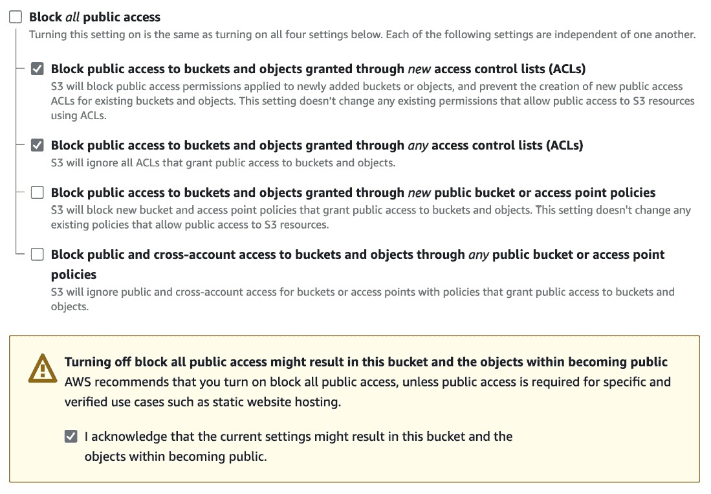

图 4.1 – 取消选中桶策略的设置

+   通过浏览器访问桶的`https://<bucket-name>.s3.amazonaws.com` 桶 URL，替换 `<bucket-name>` 为你的桶名称（例如，[`seccbbucket.s3.amazonaws.com/`](https://seccbbucket.s3.amazonaws.com/) ），验证桶不允许公开列出。

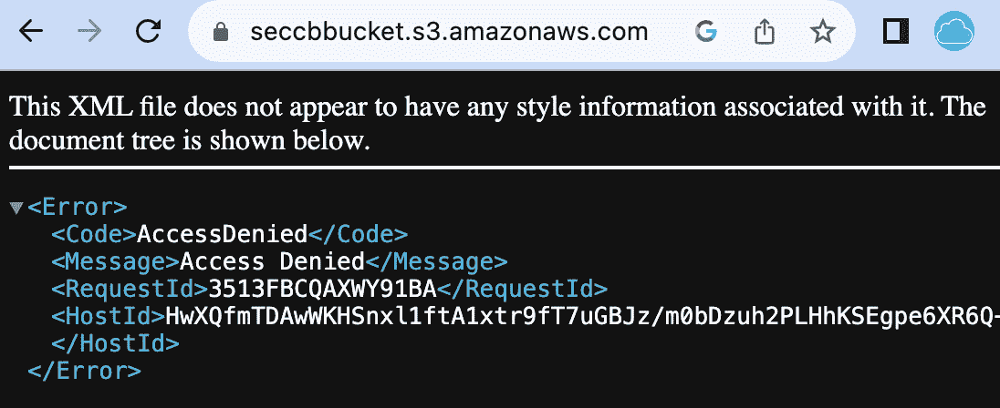

图 4.2 – 在开始操作前验证桶的访问权限

+   如在*从 CLI 授予 IAM 用户 ListBucket 访问权限*部分所述，若要使用 IAM 用户作为主体，我们需要一个没有权限的 IAM 用户，名为 `awsseccb_user1`。

+   如果我们希望执行涉及 CLI 命令的步骤，还需要为执行 CLI 命令设置一个环境，包含两个 CLI 配置文件：`AwsSecCbAdmin` 和 `AwsSecCbUser`，分别对应 `awsseccb_admin1` 和 `awsseccb_user1` 用户，具体配置请参考本章的*技术要求*部分。

接下来，我们将使用桶策略授予每个人列出我们桶内容的权限，然后重试此步骤。

## 如何操作...

我们将首先使用策略生成器从控制台生成策略，稍后将通过 CLI 执行该策略。

### 从控制台授予 ListBucket 和 GetObject 访问权限

我们可以通过以下方式授予公开访问权限以列出桶的内容：

1.  进入控制台中的`S3`服务，点击我们的桶名称，转到**权限**选项卡，然后点击**桶策略**。

1.  点击**编辑**，然后点击右上角的**策略生成器**。

1.  在**AWS 策略生成器**页面中，选择或输入以下数据：

    1.  对于**选择策略类型**，选择 **S3桶策略**。

    1.  对于**效果**，选择**允许**。

    1.  对于**主体**，输入 `*` 值。

    1.  对于**AWS 服务**，将选择 `Amazon S3`。

    1.  对于**操作**，选择 `ListBucket`。

    1.  对于**Amazon 资源名称（ARN）**，从**编辑桶策略**页面复制并粘贴桶 ARN（例如，**arn:aws:s3:::seccbbucket**）。

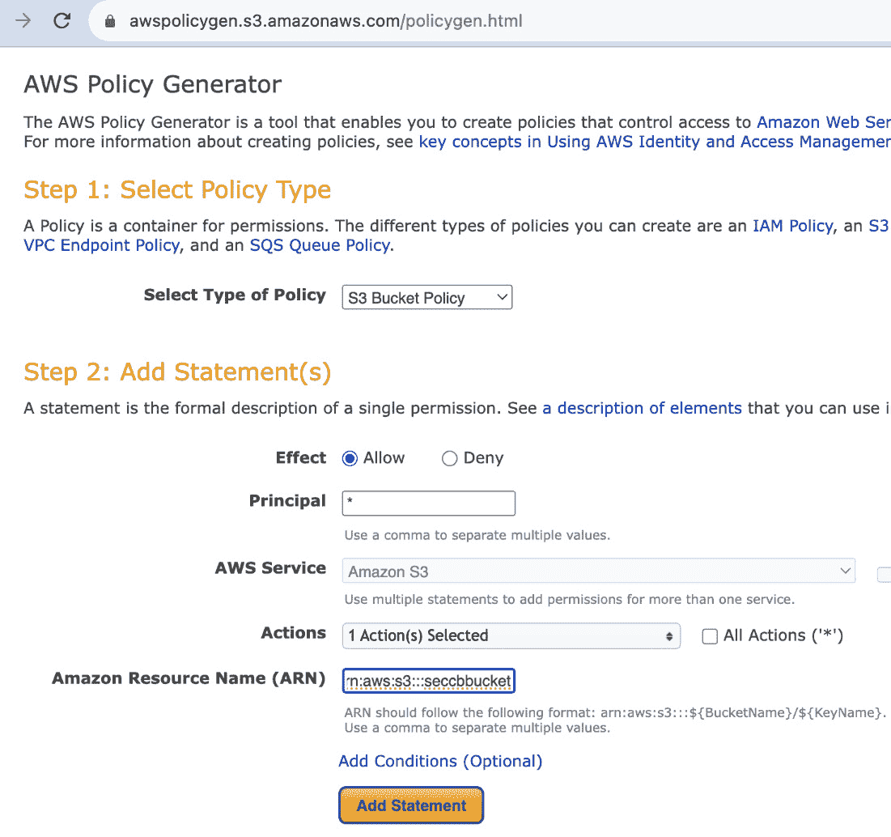

图 4.3 – AWS 策略生成器页面

1.  点击**添加声明**。

1.  点击**生成策略**。

    生成的策略应类似于以下内容。

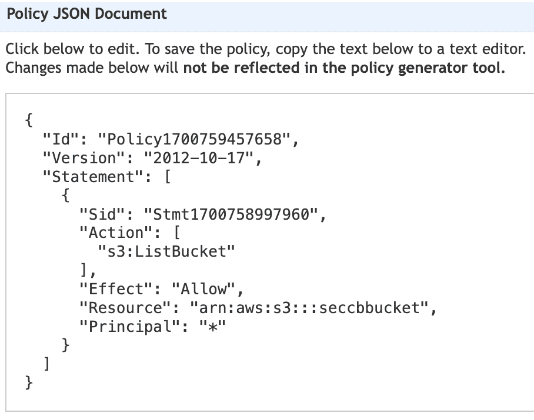

图 4.4 – 桶策略

1.  将策略复制到**桶策略**编辑器中，然后点击**保存更改**。

1.  在浏览器中，提供桶的 URL（例如，[`seccbbucket.s3.amazonaws.com`](https://seccbbucket.s3.amazonaws.com/)）。此时，桶的内容应列出：

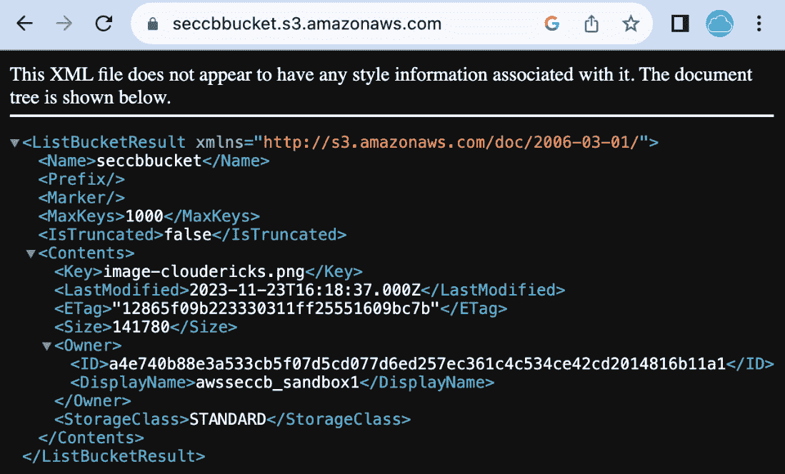

图 4.5 – 列出桶的内容

1.  在桶策略编辑器中，将 `s3:ListBucket` 改为 `s3:GetObject`，并在资源的末尾添加 **/*（例如，**"Resource": "arn:aws:s3:::seccbbucket/*"**），然后点击**保存更改**。

1.  从存储桶访问对象 URL，并将其粘贴到浏览器中。现在我们应该能够成功地检索对象了：


图 4.6 – 从存储桶访问图像

如果我们将资源更改为 `arn:aws:s3:::seccbbucket/`*，并且没有指定对象操作（如 **s3:GetObject**），我们将收到一个错误，提示该操作不适用于任何资源。这是因为，当我们在存储桶上添加任何前缀（如 `*` ）时，它被视为对象操作；否则，它被视为存储桶级别的操作。

接下来，我们将看看如何通过 CLI 为 IAM 用户授予 ListBucket 访问权限。

### 从 CLI 为 IAM 用户授予 ListBucket 访问权限

在前一节中，我们使用了一个允许所有人访问的策略，通过将 `Principal` 设置为 `*` 来实现。在本节中，我们将使用一个允许特定 IAM 用户访问的存储桶策略，以演示如何通过 CLI 创建存储桶策略。让我们开始吧：

1.  如果你在前一节中跟着操作，请删除该策略，并确保你没有访问列表存储桶的权限。

1.  创建一个存储桶策略，允许我们的 `awsseccb_user1` 用户访问该对象，并将其保存为 `bucket-policy-allow-list.json`：

    ```
     {
      "Id": "Policy1560416549842",
      "Version": "2012-10-17",
      "Statement": [
        {
          "Sid": "ListAllBuckets",
          "Action": [
            "s3:ListBucket"
          ],
          "Effect": "Allow",
          "Resource": "arn:aws:s3:::awsseccbbucketpolicy",
          "Principal": {
            "AWS": "arn:aws:iam::207849759248:user/awsseccb_user1"
          }
        }
      ]
    }
    ```

    请记得将我的 S3 存储桶名称 `awsseccbbucketpolicy` 替换为你的存储桶名称，将我的 AWS 账户 ID `207849759248` 替换为你自己的 AWS 账户 ID。

1.  将策略附加到存储桶：

    ```
    aws s3api put-bucket-policy --bucket awsseccbbucketpolicy --policy file://bucket-policy-allow-list.json --profile AwsSecCbAdmin
    ```

1.  使用为 `awsseccb_user1` 用户创建的 `AwsSecCbUser` 配置文件，列出存储桶的内容，使用如下截图所示的 `aws s3 ls bucketname` 命令：

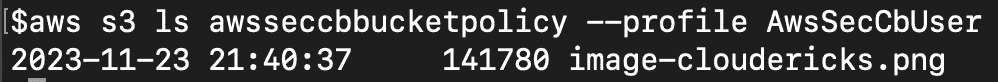

图 4.7 – 使用 CLI 列出存储桶内容

现在你已经了解了如何通过控制台和 CLI 创建策略，接下来可以使用每个可用的操作和条件练习更多场景。

## 它是如何工作的…

在本食谱中，我们创建了 S3 存储桶策略。一个存储桶策略声明可以包含以下组件：`Sid`、`Sid`、`Sid`、`Sid`、`Resource` 和 `Condition`。除了 Principal 之外，这些都与 IAM 策略相同，我们在*第二章*的《创建客户管理的 IAM 策略》一节中探讨过它们。

存储桶策略的 Principal 组件可以是帐户、用户、角色或所有人（由 `*` 表示）。它可以包含资源的 ARN（通过 ARN 元素指定）或规范 ID（通过 `CanonicalUser` 元素指定）。有关 Principal 的更多细节，请参见本食谱的 *更多信息* 部分。

对于存储桶策略，资源是存储桶或对象，并使用存储桶 ARN 表示。存储桶 ARN 应该是 `arn:aws:s3:::bucket_name` 形式。对象资源表示为 `arn:aws:s3:::bucket_name/key_name` 形式。为了表示存储桶中的所有对象，我们可以使用 `arn:aws:s3:::bucket_name/`* 。我们可以将每个存储桶中的每个资源表示为 `arn:aws:s3:::`* 。

## 还有更多内容...

存储桶策略遵循与 IAM 策略相同的 JSON 文档结构，但有一个额外的主体字段。主体是适用策略声明的用户或实体。IAM 策略没有主体，因为它是附加到 IAM 用户的。在 IAM 策略中，执行该策略的 IAM 用户就是主体。

在使用存储桶策略中的主体时，请考虑以下示例：

+   根用户可以表示如下：

    ```
     "Principal": {
        "AWS": "arn:aws:iam::1312086767378:root"
    }
    ```

+   IAM 用户可以表示如下：

    ```
     "Principal": {
        "AWS": "arn:aws:iam::312086767378:user/demouser"
    }
    ```

+   联邦用户可以表示如下：

    ```
     "Principal": {
        "AWS": "arn:aws:iam::312086767378:user/demouser"
    }
    ```

+   IAM 角色可以表示如下：

    ```
     "Principal": {
        "AWS": "arn:aws:iam::your-account-id:role/MyRole"
    }
    ```

+   角色会话可以表示如下：

    ```
     "Principal": {
        "AWS": "arn:aws:sts::767883004914:assumed-role/UserRole/MySession"
    }
    ```

+   规范用户 ID 可以表示如下：

    ```
     "Principal": {
        "CanonicalUser": "5df5b6014ae606808dcb64208aa09e4f19931b3123 456e152c4dfa52d38bf8fd"
    }
    ```

+   AWS 会话可以表示如下：

    ```
     "Principal": {
        "Service": "cloudfront.amazonaws.com"
    }
    ```

+   多个主体可以在数组中表示如下：

    ```
     "Principal": {
        "AWS": [
            "arn:aws:iam::873506153865:root",
            "arn:aws:iam::671100771477:root"
        ]
    }
    ```

+   匿名用户可以表示如下：

    ```
     "Principal" : "*"
    ```

让我们快速浏览一些与 S3 存储桶策略相关的重要细节：

+   Conditions 元素是一个可选元素，允许我们有条件地执行策略。我们在其中一个示例中使用了 Conditions。

+   目前，我们大约有 50 个存储桶策略操作，包括适用于对象的操作（例如，**s3:PutObject**），适用于存储桶的操作（例如，**s3:CreateBucket**），以及适用于存储桶子资源的操作（例如，**PutBucketAcl**）。

+   当前具有权限的存储桶子资源列表包括 `BucketPolicy`、`BucketPolicy`、`BucketPolicy`、`BucketPolicy`、`BucketPolicy`、`BucketPolicy`、`BucketPolicy`、`BucketPolicy`、`BucketPolicy`、`BucketPolicy`、`BucketPolicy`、`BucketPolicy`、`BucketPolicy`、`BucketPolicy`、`BucketPolicy`、`BucketPolicy`、`BucketPolicy`、`BucketPolicy`、`ReplicationConfiguration` 和 `AnalyticsConfiguration`。

+   我们不能在 S3 存储桶策略中指定 IAM 组作为主体。如果我们添加一个组而不是用户，则会出现错误：**策略中的无效主体**。

+   以下是一些可在策略中的条件中使用的 S3 特定条件键：`s3:x-amz-acl`，`s3:x-amz-copy-source`，`s3:x-amz-metadatadirective`，`s3:x-amz-server-side-encryption`，`s3:VersionId`，`s3:LocationConstraint`，`s3:delimiter`，`s3:max-keys`，`s3:prefix`，`s3:xamz-server-side-encryption-aws-kms-key-id`，`s3:ExistingObjectTag/`，`s3:RequestObjectTagKeys`，`s3:RequestObjectTag/`，`s3:object-lock-remainingretention-days`，`s3:object-lock-mode`，`s3:object-lock-retain-untildate`，和`s3:object-lock-legal-hold`。

## 另请参见

+   我们可以通过*第二章*中的《创建客户管理的 IAM 策略》章节了解 IAM 策略。有关 ACL、桶策略和 IAM 策略的详细比较，请参阅当前章节中《使用 S3 ACLs》食谱的*更多内容*部分。

+   我们可以在[`docs.aws.amazon.com/AmazonS3/latest/userguide/example-bucket-policies.html`](https://docs.aws.amazon.com/AmazonS3/latest/userguide/example-bucket-policies.html)找到许多桶策略示例。

# 使用 S3 ACLs

在 Amazon S3 中，ACL 用于管理对桶和对象的访问。随着我们深入了解 ACL，重要的是要认识到它们现在被视为 AWS 生态系统中的遗留工具。AWS 建议选择更现代的解决方案，如 IAM 和桶策略，这些方案提供了更强的灵活性和安全性。然而，理解 ACL 仍然有益，尤其是在处理早期开发的系统或应用程序时，这些系统或应用程序是在 IAM 和桶策略出现之前开发的。

在本食谱中，我们将学习如何通过 AWS 管理控制台使用 ACL 向公众（所有人）授予列出桶中文件的权限。我们将在食谱的*更多内容*部分列出更多用例。

## 准备开始

我们需要以下内容才能成功完成此食谱：

+   一个有效的 AWS 账户是必需的。我将使用我们在*第一章*中创建的`awsseccb-sandbox-1`账户。但是，我不会使用 AWS Organizations 或 IAM Identity Center 的任何功能。

+   一个具有`AdministratorAccess`权限的`awsseccb_admin1`用户。

+   如果我们想按照本章中 CLI 命令的步骤操作，我们需要设置一个环境，用于执行具有两个 CLI 配置文件的 CLI 命令，分别是`AwsSecCbAdmin`和`AwsSecCbUser`，用于`awsseccb_admin1`和`awsseccb_user1`用户（分别）。

+   我们还需要一个 S3 桶以及其中的一个文件。我将使用一个名为`awsseccbacldemo`的桶，其中有一个名为`image-cloudericks.png`的文件。请将其替换为你的桶名和文件名。该 S3 桶应该配置为启用 ACL。我们可以在创建桶时进行设置，如*图 4.8*所示。另请确保**阻止所有公共访问**选项未勾选，尤其是在涉及 ACL 设置时。我们可以在创建桶时进行设置，如*图 4.9*所示。对于其余设置，保持默认设置即可，在撰写本书时，默认设置如下：

    +   **桶版本控制**设置为**禁用**

    +   **默认加密**设置为**使用 Amazon S3 管理的服务器端加密密钥（SSE-S3）**

    +   **桶密钥**设置为**启用**

    +   **对象锁定**（位于**高级设置**下）设置为**禁用**

在创建 S3 桶时，我们可以根据此配方启用所需的 ACL 设置，具体设置如下：

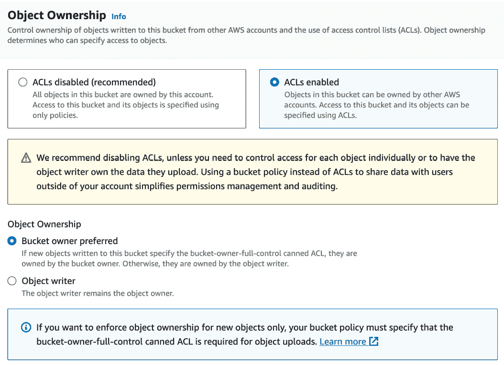

图 4.8 – 启用 Amazon S3 对象所有权的 ACL

此外，我们可以根据此配方的要求取消勾选**阻止所有公共访问**选项，如下图所示：

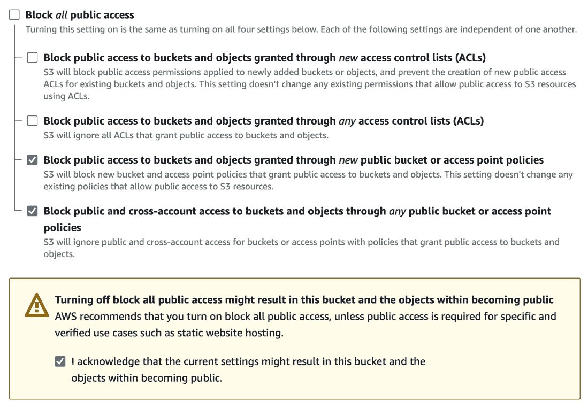

图 4.9 – 取消勾选 ACL 的“阻止所有公共访问”设置

通过浏览器访问桶的 URL（**https://<桶名>.s3.amazonaws.com**），替换**<桶名>**为我们的桶名称（例如，[`awsseccbacldemo.s3.amazonaws.com`](https://awsseccbacldemo.s3.amazonaws.com)），验证我们的桶是否不允许所有人列出内容，类似于*图 4.2*。

接下来，允许所有人列出桶的内容。

## 如何操作...

执行以下步骤以允许所有人列出桶的内容：

1.  进入控制台的`S3`服务。

1.  点击我们的桶名称（例如，**awsseccbacldemo**），进入桶的页面。

1.  进入桶的**权限**标签页，向下滚动到**访问控制列表（ACL）**标签页，并点击**编辑**。

1.  在**编辑访问控制列表（ACL）**页面下，找到**每个人（公共访问）**，勾选**对象**下的**列出**复选框，并勾选**我理解这些更改对我的对象和桶的影响**声明旁边的复选框。

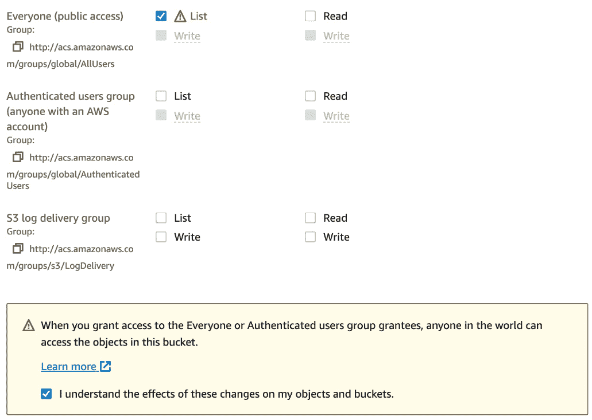

图 4.10 – 编辑 ACL 页面

1.  向下滚动并点击**保存更改**。

1.  使用**https://<桶名>.s3.amazonaws.com**链接通过浏览器访问桶，替换**<桶名>**为你的桶名称（例如，[`awsseccbacldemo.s3.amazonaws.com/`](https://awsseccbacldemo.s3.amazonaws.com/)）。你应该能够列出桶的内容。

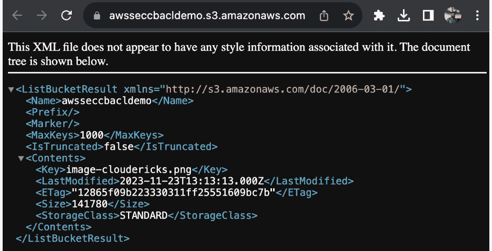

图 4.11 – 显示桶内容的 XML 文件

在本版本的书中，我们专注于涉及 ACL 的较小范围场景，与本书前一版覆盖的更广泛的使用案例不同，因为目前 ACL 被认为是一个遗留选项。

## 它是如何工作的...

本食谱提供了在 AWS 中启用 S3 桶内容公共列出的步骤。关键步骤是通过 AWS 管理控制台修改 ACL 设置。在此过程中，我们特别配置了 ACL，以允许公共访问列出桶的内容，同时确保不授予对桶对象的通用读取访问权限。

在这个食谱中，我们通过管理控制台允许所有人列出桶的内容。我们也可以通过 CLI 做到这一点。ACL 提供了桶、对象及其 ACL 的基本读写权限。具体来说，它们可以授予以下权限，并且可以在使用 AWS CLI 时进行设置：

+   `READ` : 允许列出桶中的对象，并读取对象及其元数据

+   `WRITE` : 启用在桶中创建、覆盖或删除对象；此权限不适用于单个对象

+   `READ_ACP` : 授予读取桶或对象的 ACL 的权限

+   `WRITE_ACP` : 允许为桶或对象写入 ACL

+   `FULL_CONTROL` : 包括所有先前的权限，提供对桶或对象的完全控制

在实施 `READ` ACLs 以进行公共访问之前，我们通过启用 ACL 并确保取消勾选 **阻止所有公共访问** 设置，特别是针对与 ACL 相关的选项，来准备桶。需要注意的是，ACL，通常被视为一个遗留功能，相较于更现代的选项，如 IAM 和桶策略，默认是禁用的。同样，出于安全考虑，公共访问默认是被阻止的。

## 还有更多内容...

让我们深入探讨一些与 Amazon S3 中的 ACL 相关的重要概念：

+   **基本权限** : ACL 提供桶、对象及其 ACL 的基本读写权限。

+   **访问授予** : ACL 授予对 AWS 账户和预定义组的访问权限，但不能拒绝访问。Amazon S3 ACL 中的预定义组是由 AWS 设置的固定类别，表示广泛的用户集，例如 **所有用户**（面向公众），**已验证用户**（面向任何已登录的 AWS 用户）和 **日志传递**（面向将日志传递到桶中的服务）。这些组简化了权限设置，而无需指定单个用户账户。在指定受让人时，可以使用以下方法：

    +   `AmazonCustomerByEmail` : 将 `Type` 设置为 `AmazonCustomerByEmail`，并在 `EmailAddress` 字段中使用规范 ID

    +   `CanonicalUser` : 将 `Type` 设置为 `CanonicalUser`；账户的电子邮件提供在 `ID` 字段中

    +   `Group` : 当 `Type` 为 `Group` 时，使用预定义组的 URI 在 `URI` 字段中

+   **默认控制** : 默认情况下，ACL 授予资源所有者完全控制，并不给予其他任何人的权限。

+   **内部表示**：ACL 以 XML 文档的格式呈现，指定访问权限和受让人。

+   **非所有者对象访问**：ACL 允许使用像`bucket-owner-full-control`这样的预设 ACL 授予对不是桶所有者拥有的对象的访问权限。

+   **预设 ACL**：这些是简化的 ACL 权限，可以用于通过命令行提供资源的权限。目前，支持以下预设 ACL：`private`、`private`、`private`、`private`、`private`、`private`、`bucket-owner-full-control`和`log-delivery-write`。

+   **细粒度对象权限**：与桶策略相比，ACL 提供了一种更简单的方式来为多个对象分配单独的权限。

+   **阻止公共访问覆盖**：S3 的`Block Public Access`设置可以覆盖授予公共访问的 ACL。

+   **记录访问尝试**：可以使用 S3 访问日志记录成功和拒绝的访问尝试。

+   **不支持条件**：与 IAM 或桶策略不同，ACL 不支持授予访问权限的条件子句。

+   **管理挑战**：在大型环境中管理 ACL 可能会很复杂。

+   **安全最佳实践**：定期审查和审核 ACL 设置对于维护安全性至关重要。

+   **作用域和应用差异**：我们有以下区别：

    +   `ACLs`：按资源（桶或对象）指定

    +   **桶策略**：应用于整个桶，并可用于根据对象前缀定义访问权限

    +   **IAM 策略**：与桶策略的范围相似，但分配给 IAM 用户和组，允许更集中和细粒度的访问控制。

让我们快速浏览一些与预设 ACL 相关的重要概念：

+   `bucket-owner-read`和`bucket-owner-full-control`预设 ACL 仅适用于对象，若在创建桶时指定这些 ACL 则会被忽略。

+   `log-delivery-write`预设 ACL 仅适用于桶。

+   使用`aws-exec-read`预设 ACL 时，所有者获得`FULL_CONTROL`权限，Amazon EC2 获得对来自 S3 的`Amazon Machine Image`（**AMI**）的读取权限。

+   使用`log-delivery-write`预设 ACL 时，`LogDelivery`组获得对桶的`WRITE`和`READ_ACP`权限。这用于 S3 访问日志记录。

+   在发出 API 调用时，我们可以在请求中使用`x-amz-acl`请求头指定预设 ACL。

重要说明

在跨账户访问的情况下，如果账户 A 中的用户将对象上传到账户 B（由账户 B 拥有）的桶中，即使账户 B 是桶的拥有者，也无法访问该对象。然而，账户 A 可以在上传文档时使用`bucket-owner-read`或`bucket-owner-full-control`预设 ACL，授予桶所有者权限。

### 比较 ACL、桶策略和 IAM 策略

ACL 与 IAM 策略和桶策略的不同之处如下：

+   ACL 仅提供对存储桶、对象及其 ACL 的基本读/写权限。IAM 策略和存储桶策略提供比 ACL 更细粒度的权限。

+   ACL 只能授予对 AWS 账户和预定义组的访问权限。ACL 不能授予 IAM 用户权限。IAM 策略和存储桶策略可以用于授予 IAM 用户访问权限。

+   默认情况下，ACL 允许资源所有者拥有完全控制权限，其他人则没有任何权限。存储桶策略和 IAM 策略默认不附加到资源上。

+   ACL 只能授予权限。存储桶策略和 IAM 策略可以显式拒绝访问。

+   ACL 不能有条件地允许或拒绝访问。存储桶策略和 IAM 策略可以有条件地允许或拒绝访问。

+   ACL 在内部表示为 XML 文档。存储桶策略和 IAM 策略表示为 JSON 文档。

IAM 策略与 ACL 和存储桶策略的不同之处：

+   IAM 策略是基于用户的，并应用于用户。ACL 和存储桶策略是基于资源的策略，并应用于资源。

+   IAM 策略可以是内联的（直接嵌入到用户、组或角色中）或独立的（可以附加到任何 IAM 用户、组或角色）。ACL 和存储桶策略是存储桶的子资源。

+   IAM 策略只能赋予 IAM 用户访问权限。存储桶策略和 ACL 可以用于提供匿名访问权限以及对 root 用户的访问。

重要提示

我们可以混合使用 ACL、存储桶策略和 IAM 策略。如果存储桶和用户在同一账户内，所有策略将同时进行评估。

## 另请参见

+   我们可以在*第二章*的 *创建自定义管理的 IAM 策略* 章节中了解 IAM 策略。

+   我们可以在 [`www.cloudericks.com/blog/demystifying-aws-policies-and-permissions`](https://www.cloudericks.com/blog/demystifying-aws-policies-and-permissions) 上了解更多关于 IAM 策略和权限的信息。

# 创建 S3 预签名 URL

我们可以通过设置过期时间来授予访问 S3 对象的临时权限，使用预签名 URL。在本食谱中，我们将学习如何使用预签名 URL。我们可以通过管理控制台、AWS CLI 或使用 Python、Java 等编程语言的 SDK 来实现这一点。

## 准备工作

我们将需要以下内容来成功完成此食谱：

+   一个有效的 AWS 账户；我将使用我们在*第一章*中创建的`awsseccb-sandbox-1`账户。

+   一个 S3 存储桶及其中的一个文件；我将使用名为 `seccbbucket` 的存储桶，里面有一个名为 `image-cloudericks.png` 的文件。

## 如何操作...

我们将首先从控制台创建一个预签名 URL，然后通过 AWS CLI 创建。

### 从 AWS 控制台生成预签名 URL

我们可以从控制台创建一个预签名 URL 并按如下方式进行测试：

1.  登录到 AWS 管理控制台，导航到 `S3` 服务，然后进入我们的 S3 存储桶。

1.  选择我们需要为其创建预签名 URL 的对象，点击 **对象操作** 下拉菜单，并选择 **通过预签名 URL 分享**。

1.  在以下图中输入 **分钟数** 的值为 `5`，然后点击 **创建预签名 URL**。


图 4.12 – 创建预签名 URL

我们应该会收到一个类似于 **复制预签名 URL** 的通知：


图 4.13 – 复制预签名 URL 信息

1.  复制并粘贴 URL，然后在 **分钟数** 所述的时间范围内从浏览器中运行它。我们应该能够成功查看我们的文件。

    如果在指定的时间后运行 URL，我们应该会收到一个类似于 `AccessDenied` 的错误信息：

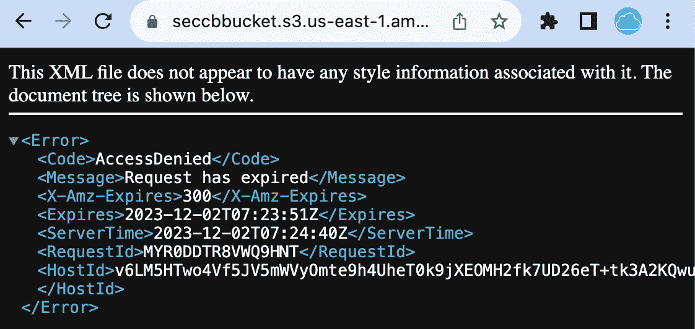

图 4.14 – 过期后访问预签名 URL

接下来，我们将了解如何使用 CLI 进行预签名。

### 从 CLI 生成预签名 URL

我们可以通过 CLI 创建一个预签名 URL 并按如下方式进行测试：

1.  使用 CLI 预签一个 URL，如下所示：

    ```
    aws s3 presign s3://seccbbucket/image-cloudericks.png --expires-in 100 – profile AwsSecCbAdmin
    ```

    该命令将输出类似于以下内容的预签名 URL。

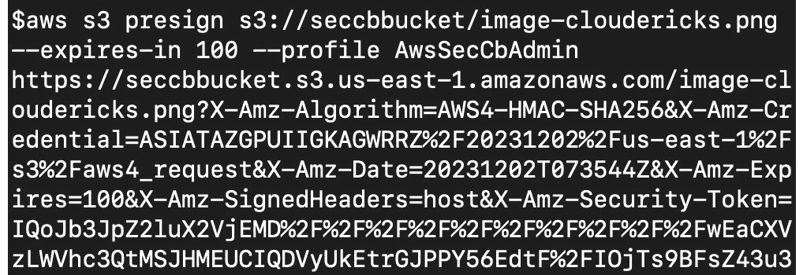

图 4.15 – 从 CLI 生成预签名 URL（部分）

1.  在 URL 过期前后，在浏览器中运行该 URL（就像我们在上一部分中所做的那样）。

接下来，我们将探索如何使用 SDK（例如 Python SDK）进行预签名。

## 它是如何工作的...

在 *从 AWS 控制台生成预签名 URL* 部分，我们从 AWS 控制台生成了一个预签名 URL。在 *从 CLI 生成预签名 URL* 部分，我们从 CLI 生成了一个预签名 URL。

与预签名相关的大多数 API 都会接受以下数据来生成预签名的定时 URL：

+   存储桶和对象

+   过期日期和时间

+   HTTP 方法

+   安全凭证

在这个实例中，我们在代码中指定了存储桶、对象和过期时间。HTTP 操作是 `GET`。对于安全凭证，我们指定了一个具有操作权限的用户配置文件，在我们的示例中是 `get_object`。任何拥有有效凭证的人都可以生成预签名 URL。然而，如果生成 URL 的用户没有执行预期操作的权限（例如 **get_object**），则该操作最终会失败。

## 还有更多...

我们还可以使用 SDK，如 Python SDK，来预签一个 URL。在 Python SDK 中，我们还使用 boto3 库。Boto 是 AWS 的 Python SDK，它可以简化通过 Python 创建、配置和管理 AWS 服务（例如 EC2 和 S3）。

## 另见

有关与预签名 URL 相关的 Python 和 Boto3 的更多用例，请参考以下链接：[`boto3.amazonaws.com/v1/documentation/api/latest/guide/s3-presigned-urls.html`](https://boto3.amazonaws.com/v1/documentation/api/latest/guide/s3-presigned-urls.html)。

# 使用 S3 版本控制和对象锁定保护文件

在这个步骤中，我们将学习如何实施**S3 对象锁定**。S3 对象锁定是一项功能，允许用户在指定的时间段内或无限期内防止 S3 中对象的删除或覆盖。这项功能对于满足法规合规要求和实施数据保护策略至关重要。通过对象锁定，您可以应用**写一次，读多次**（**WORM**）模型，确保数据在指定的保留期过后不能被修改或删除。这使得它成为保护关键业务和合规敏感数据的有效工具。

S3 版本控制是 S3 对象锁定的前提条件。因此，我们还将快速查看如何在*准备工作*部分启用版本控制。如果为桶启用了版本控制，S3 将保留该文件的每个版本的副本。版本控制通过提供恢复机制来保护数据，以防止诸如删除和覆盖等无意操作，因此也可以被视为一种与安全相关的功能。

## 准备工作

我们需要以下内容才能成功完成这个步骤：

+   一个有效的 AWS 账户；我将使用在*第一章*中创建的`awsseccb-sandbox-1`账户。

+   一个启用了**桶版本控制**的 S3 桶；我将使用一个名为`seccbbucket`的桶，桶中有一个名为`image-cloudericks.png`的文件。

    我们可以在创建 S3 桶时启用版本控制，如下所示：

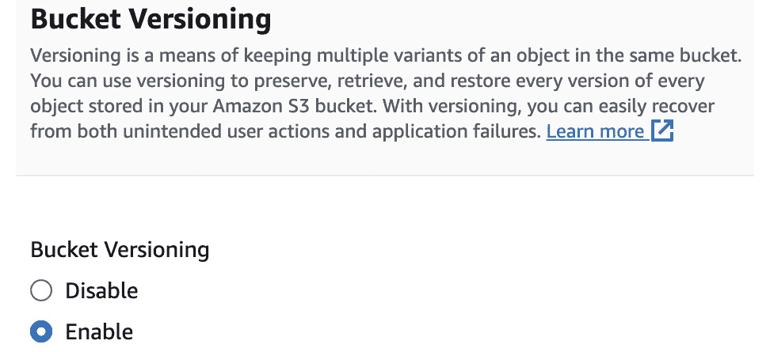

图 4.16 – 为新桶启用版本控制

我们还可以为现有桶启用 S3 版本控制，操作步骤如下：导航到 S3 桶的**属性**标签，点击**编辑**旁边的**桶版本控制**。在**桶版本控制**下，选择**启用**，然后点击**保存更改**。

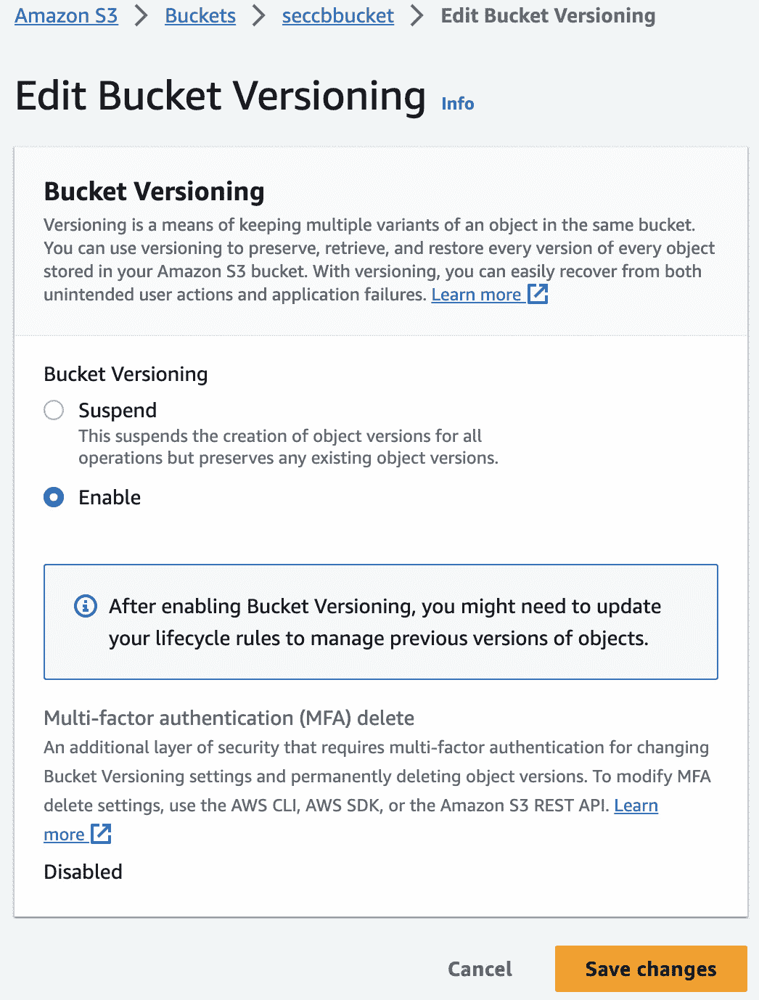

图 4.17 – 为现有桶启用版本控制

接下来，我们将为我们的桶启用对象锁定。

## 如何操作...

我们可以按如下步骤启用对象锁定：

1.  登录 AWS 管理控制台，进入`S3`服务。

1.  导航到 S3 桶，进入桶的**属性**标签，点击**编辑**旁边的**对象锁定**。

1.  在**编辑对象锁定**页面，选择**启用**，并勾选复选框确认启用对象锁定将永久允许桶中的对象被锁定。

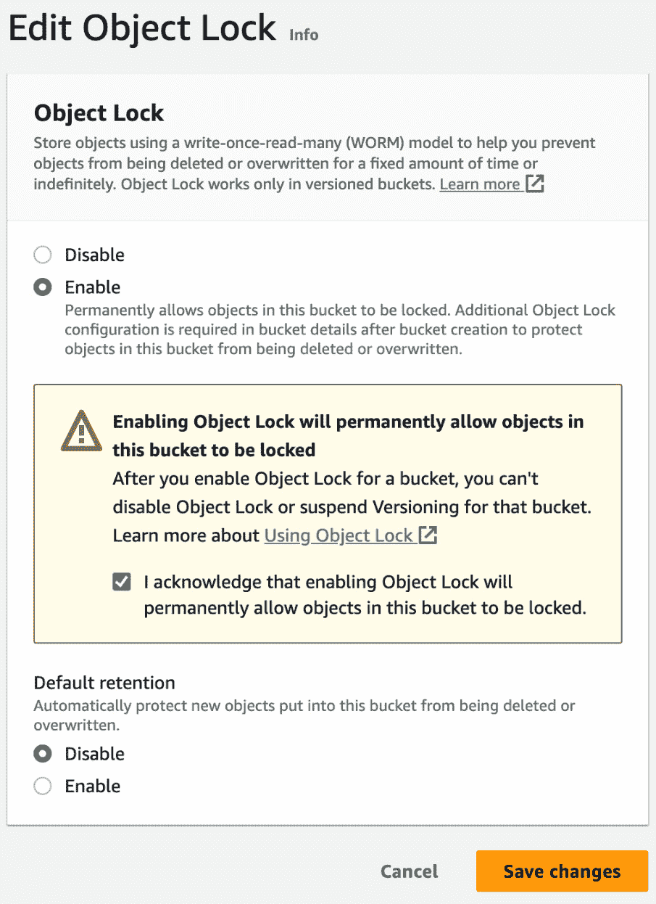

图 4.18 – 启用对象锁定

1.  通过在**默认保留期**下选择**启用**来保护放入桶中的新对象。一旦启用默认保留期，我们将获得额外的选项来配置对象锁定。

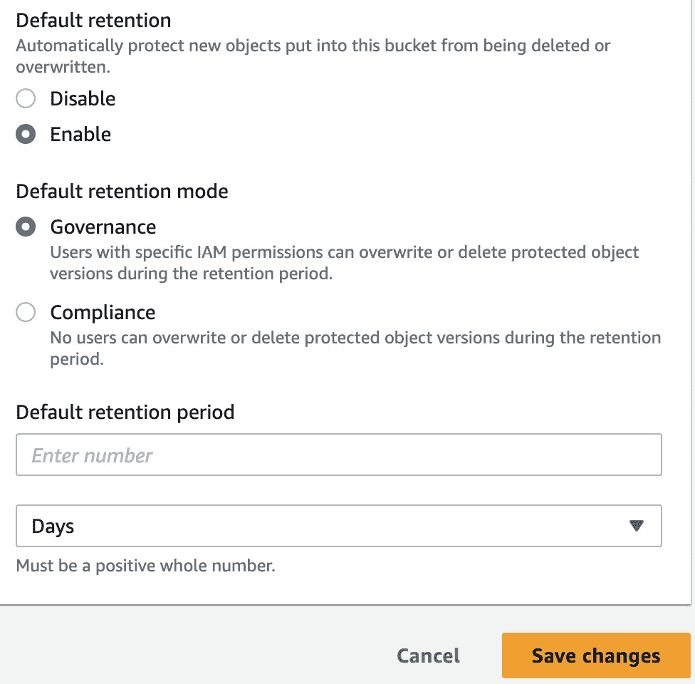

图 4.19 – 启用默认保留期

1.  在**默认保留模式**下选择**治理**，在**默认保留期限**中输入`30`，然后点击**保存更改**。

1.  上传一个新对象到我们的 S3 桶。我已上传了一个`image-heartin.png`文件。

1.  转到桶的**对象**标签，点击新对象的名称以转到该对象的**属性**标签。

1.  向下滚动并验证**对象锁保留**下的保留配置。

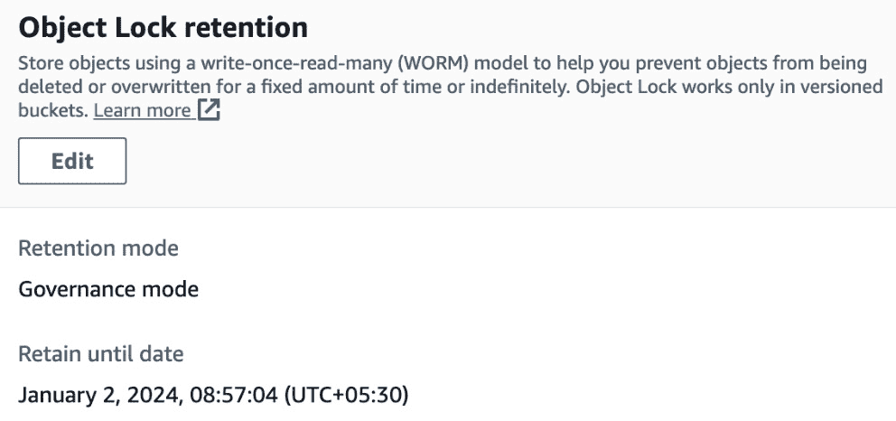

图 4.20 – 设置默认保留模式后的新对象的对象锁保留

1.  可选地，我们可以在**对象锁保留**屏幕上点击**编辑**，如*图 4.20*所示，执行以下操作之一：**禁用**保留，将**保留模式**从**治理模式**更改为**合规模式**，或者使用**保留直到**日期选项延长保留日期。

重要提示

在治理模式下，S3 对象锁中的对象在设置的保留期限结束之前无法更改。要在保留日期之前删除这些对象，必须点击**编辑**来禁用保留，如*图 4.20*所示。在合规模式下，我们无法禁用保留，且对象保持不可更改，直到保留期结束。要在保留期到期之前删除这些对象，唯一的方法是关闭关联的 AWS 账户。在这两种模式下，我们可以将保留日期延长到未来的某个日期，但无法缩短它。

1.  可选地，转到任何现有对象的**属性**标签，向下滚动到**对象锁保留**，点击**编辑**以启用该对象的对象锁。我们应该会看到一个类似于配置默认保留的屏幕，如*图 4.19*所示，在该屏幕中我们可以为此对象配置保留。

1.  可选地，转到任何新对象或现有对象的**属性**标签，向下滚动到**对象锁法律保持**，点击**编辑**以启用**法律保持**，如下图所示。

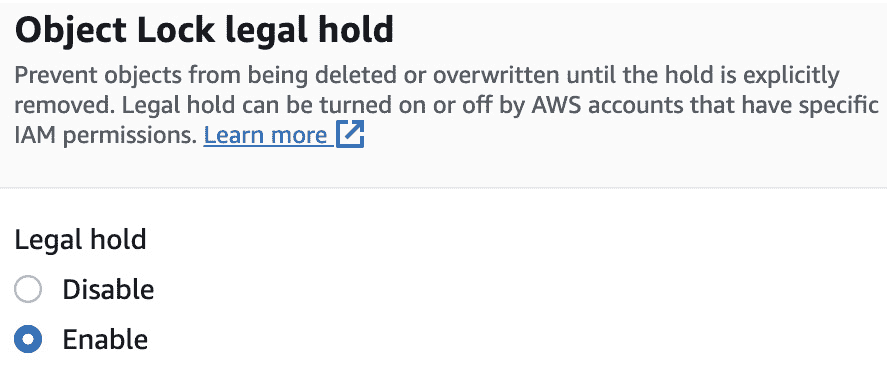

图 4.21 – 启用对象锁法律保持

可选地，等待保留日期到期后，再尝试删除我们在合规模式下添加了对象锁的对象。

## 它是如何工作的...

Amazon S3 对象锁是一个旨在保护您的 S3 对象免受删除或覆盖的功能。它在执行合规性、法律或监管要求的数据保留政策时特别有用。要使用对象锁，您必须首先在 S3 桶中启用版本控制。版本控制是 S3 在同一桶中保留多个对象版本的一种方式，允许您保存、检索并恢复存储在桶中的每个对象的每个版本。启用版本控制后，对象锁可以保护单个对象版本。

对象锁定有两种主要的保留模式：治理模式和合规模式。在治理模式下，具有特定权限的用户可以在对象保留期到期之前覆盖或删除对象版本。此模式非常适合内部数据管理，因为它在保护和灵活性之间提供了平衡。相比之下，合规模式提供了更严格的保护级别。一旦对象在合规模式下被锁定，任何人，包括 AWS 账户中的根用户，都无法在保留期结束之前覆盖或删除该对象版本。此模式适用于需要保留数据以遵守法律或监管标准的场景。

此外，对象锁定提供了一种名为法律保留的功能，增加了额外的保护层。无论对象的保留模式如何，都可以对对象应用法律保留，它会防止对象版本的删除，无时间限制。法律保留非常适用于需要出于法律原因保留对象的情况。需要注意的是，保留模式和法律保留都可以应用于单个对象或作为默认设置应用于桶级别。这些功能共同使 S3 对象锁定成为一个强大的工具，确保关键数据不会被删除或更改，从而帮助组织遵守合规要求并保护其数据免受意外丢失或删除。

## 还有更多...

在了解了 S3 对象锁定的内容后，我们迅速来看一下`Glacier Vault Lock`，这是 AWS 中的一项重要功能，尤其是在数据需要长期存储时，它有助于确保 AWS Glacier 中的数据安全。Glacier Vault Lock 的核心是 WORM 原则。这意味着数据存储后可以访问，但无法修改。通过建立并锁定策略，我们可以确保没有人，甚至是管理员或创建者，能够修改或删除这些规则或它们保护的数据。这些策略可以从基础的设置（例如设置数据保留期）到更详细的内容（如指定删除权限角色，甚至创建永久归档）不等。

设置 Glacier Vault Lock 涉及以下步骤：

1.  **启动 Glacier Vault**：通过 AWS 管理控制台开始在 Amazon Glacier 中创建一个金库。

1.  **创建 Vault Lock 策略**：制定一个政策，概述您的数据保留偏好。此策略定义了在金库中使用和修改数据的指南。

1.  **启动 Vault Lock**：将您的策略应用于金库。这将开始过程，但不会立即激活策略。

1.  **审查并最终确认**：AWS 提供了一个特定的时间框架（通常为 24 小时），让您审查并最终确认您的策略。在此期间后，不允许进行任何更改。

1.  **锁定策略**：通过确认并永久锁定您的策略来结束这段等待期。一旦锁定，策略将不可逆转，确保数据按照您已建立的规则安全。

通过遵循这些步骤，Glacier Vault Lock 可以有效地用于保护需要长期存储的关键数据，满足合规性和安全性要求。

与 S3 相关的其他重要安全功能包括：

+   **S3 加密**：Amazon S3 加密提供了保护我们静态数据的方式。主要有两种类型：SSE，即 Amazon S3 在将数据写入磁盘时进行加密，并在访问时解密；以及**客户端加密**，即我们在将数据上传到 S3 之前在本地进行加密。对于 SSE，我们可以选择**S3 管理密钥**（**SSE-S3**）、**AWS 密钥管理服务密钥**（**SSE-KMS**）和**客户提供的密钥**（**SSE-C**）。我们将在本书稍后讨论 AWS 的**密钥管理服务**（**KMS**）后，进一步讨论 S3 加密。

+   **S3 访问点**：Amazon S3 访问点通过提供具有定制访问策略的独特主机名，便于管理 S3 中大规模共享数据集的访问。例如，如果我们正在操作一个数据湖，多个部门访问同一个 S3 桶，我们可以为每个部门创建单独的访问点——如`finance-data-access`或`hr-data-access`——每个访问点具有特定的权限和网络控制。这使我们能够根据每个部门的需求定制访问，确保数据处理的安全性和高效性。因此，S3 访问点为需要明确基于角色的访问控制的场景提供了简化的解决方案，大大简化了复杂数据访问需求的管理。

+   **S3 访问日志**：Amazon S3 访问日志是增强安全性和监控我们 S3 桶活动的关键组成部分。这些日志提供了对特定 S3 桶所做所有请求的详细记录，包括请求者信息、桶名称、请求时间以及执行的操作。这些信息对于安全分析和审计跟踪至关重要，帮助我们跟踪访问模式、识别可疑活动，并确保符合安全政策。通过分析这些日志，我们可以深入了解使用趋势和潜在的安全漏洞，从而改善我们在 S3 中的整体数据保护策略。

+   **S3 复制**：Amazon S3 复制，包括 **跨区域复制**（**CRR**）和**跨账户复制**，在提高数据安全性和可用性方面起着至关重要的作用。使用 CRR，数据会自动在多个 AWS 区域之间复制，从而提供地理多样化，这对于灾难恢复和满足数据驻留要求至关重要。跨账户复制则通过在不同 AWS 账户之间复制数据，增加了额外的安全层。这对于数据完整性和隔离至关重要的场景（如审计）来说是理想的。两种复制策略都可以通过特定策略进行管理，从而精确控制哪些数据会被复制及其复制方式。

## 另见

+   请查看*第三章*中的*使用带条件密钥的密钥策略*教程，了解如何使用 AWS KMS 密钥在 S3 存储桶中进行加密。

+   本书虽然涵盖了 S3 的关键安全功能，但为每个功能提供教程超出了本书的范围。如需获取始终更新且完整的列表，可以访问博客文章 [`www.cloudericks.com/blog/a-comprehensive-list-of-s3-security-features-within-aws-cloud`](https://www.cloudericks.com/blog/a-comprehensive-list-of-s3-security-features-within-aws-cloud)。

# 在 S3 上加密数据

在本教程中，我们将学习使用 SSE 技术对 S3 上静态数据进行加密。服务器端加密可以通过三种方式完成：SSE-S3、SSE-KMS 和 SSE-C。而客户端加密是在客户端进行加密后再发送到服务器。

## 准备工作

我们需要一个配置了以下资源的有效 AWS 账户：

+   我们需要一个 S3 存储桶。我将使用名为`awssecbucket`的存储桶。请将其替换为你的存储桶名称。

+   我们需要一个具有`AdministratorAccess`权限的用户。为该用户配置 CLI 配置文件。我将在`awssecadmin` CLI 上同时调用该用户和配置文件。

+   我们需要在 KMS 中创建一个客户管理的密钥。请参考*第三章*中的*创建 KMS 密钥*教程来创建密钥。我创建了一个名为`MyS3Key`的密钥。

## 如何操作...

在本教程中，我们将学习 SSE 的各种应用场景。

### 使用 SSE-S3 的 SSE

我们可以通过控制台上传一个带有 SSE-S3 的对象，方法如下：

1.  在控制台中导航到你的 S3 存储桶。

1.  在**对象**窗格下，点击**上传** | **添加文件**，选择文件后，点击**上传**。

1.  现在转到**属性**选项卡。在我们的存储桶中，向下滚动到**默认加密**窗格并点击**编辑**。在**加密类型**下，选择**使用 Amazon S3 管理的密钥进行服务器端加密 (SSE-S3)**，然后在**存储桶密钥**下，选择**启用**。最后，点击**保存更改**。

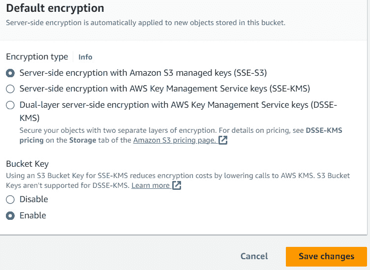

图 4.22 – 默认加密选项

重要提示

需要特别注意的是，如果我们尝试打开或下载该对象，我们仍然可以看到该对象原样显示，因为 S3 会使用相同的密钥解密该对象。

### 使用 SSE-KMS 的 SSE

我们可以通过以下方式使用控制台上传一个对象，并使用 SSE-KMS：

1.  导航至您的 S3 桶。

1.  现在转到**属性**面板。在**属性**选项卡中，向下滚动到**默认加密**面板并点击**编辑**。在**加密类型**下，选择**使用 AWS Key Management Service 密钥进行服务器端加密（SSE-KMS）**；在**AWS KMS 密钥**面板中，选择**从您的 AWS KMS 密钥中选择**并选择该密钥；在**桶密钥**下，选择**启用**，最后点击**保存更改**。

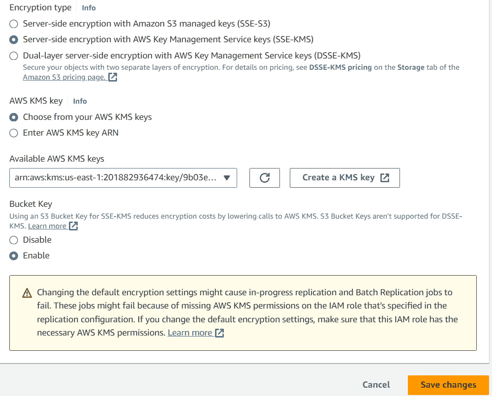

图 4.23 – 使用 KMS 更改加密选项

1.  我们可以按照以下方式更改现有对象的加密为 SSE-KMS。转到该对象的**属性**选项卡。向下滚动到**服务器端加密设置**面板并点击**编辑**。在**加密设置**下，选择**使用桶设置作为默认加密**并点击**保存更改**。

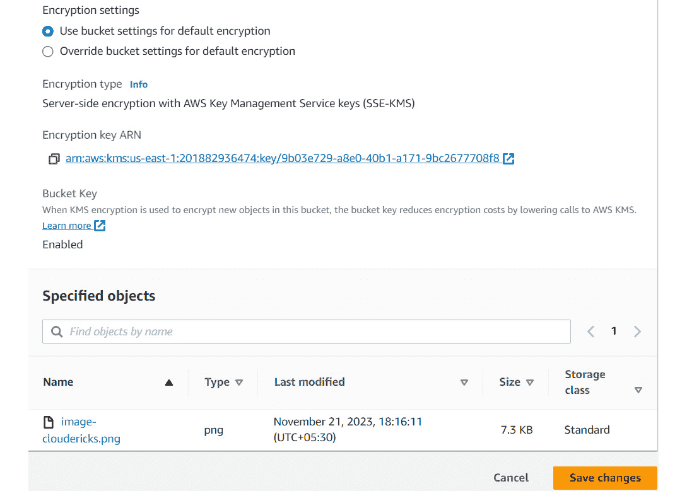

图 4.24 – 更改现有对象的加密选项

1.  我们可以通过以下命令从 CLI 上传一个对象并使用 SSE-KMS：

    ```
    aws s3 cp image-heartin-k.png s3://awsseccookbook/image-heartin-k.png \
    --sse aws:kms \
    --sse-kms-key-id cd6b3dff-cfe1-45c2-b4f8-b3555d5086df \
    --profile awssecadmin
    ```

    我们将收到以下响应：

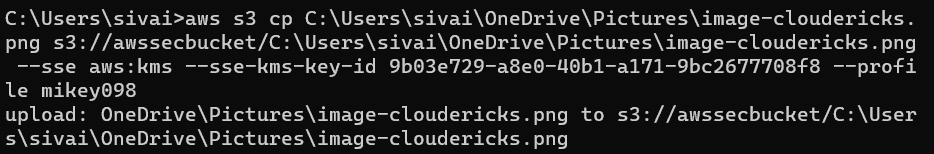

图 4.25 – 从 CLI 上传对象时使用 SSE-KMS 的响应

重要提示

`sse-kms-key-id` 是您创建的 KMS 密钥的 ID（有关详细信息，请参阅*准备工作*部分）。

### 使用 SSE-C 的 SSE

我们可以按照以下方式从 CLI 上传一个对象并使用 SSE-C：

1.  使用以下命令从 CLI 上传一个对象，并通过 SSE-C 进行加密。提供任意一组数字作为密钥。稍后检索对象时，您需要使用相同的密钥：

    ```
    aws s3 cp image-heartin-k.png s3://awsseccookbook/imageheartin-k.png \
    --sse-c AES256 \
    --sse-c-key 12345678901234567890123456789012 \
    --profile awssecadmin
    ```

    我们将收到以下响应：

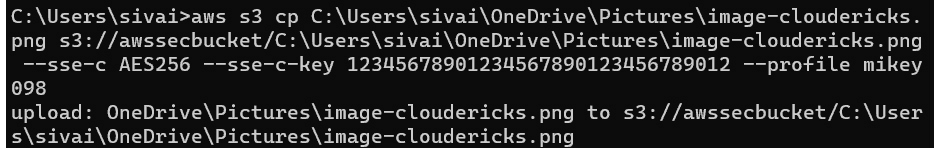

图 4.26 – 从 CLI 上传对象时使用 SSE-C 的响应

1.  按照以下方式检索使用 SSE-C 加密的对象，提供我们在上一个命令中使用的相同密钥：

    ```
    aws s3 cp s3://awsseccookbook/image-heartin-k.png imageheartin-k1.png \
    --sse-c AES256 \
    --sse-c-key 12345678901234567890123456789012 \
    --profile awssecadmin
    ```

    我们将收到以下响应：

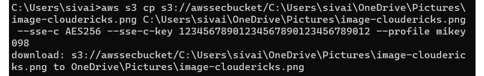

图 4.27 – 使用 SSE-C 加密的对象的检索响应

提示

如果我们在下载使用 SSE-C 加密的对象时不指定`sse-c`选项，那么在调用**HeadObject 操作：Bad Request**时，我们将收到一个**致命错误：发生错误（400）**异常。如果我们在下载使用 SSE-C 加密的对象时不指定用于加密的正确密钥（使用`sse-c-key`选项），那么在调用**HeadObject 操作：Forbidden**时，我们将收到一个**致命错误：发生错误（403）**异常。

## 工作原理...

在*SSE with SSE-S3*部分，我们使用 SSE-S3 加密从控制台上传了一个对象。我们将现有对象的加密更改为 SSE-S3 加密。我们还上传了一个使用 SSE-S3 加密的对象。在从 CLI 执行 SSE-S3 加密时，`sse`参数的值是可选的。默认值为`AES256`。

在*SSE with SSE-KMS*部分，我们使用 SSE-KMS 加密上传了一个对象。我们将现有对象的加密更改为 SSE-KMS 加密。我们还使用 SSE-KMS 加密从 CLI 上传了一个对象。在从 CLI 执行 SSE-KMS 加密时，`sse-c`参数的值是可选的。默认值为`AES256`。

在*SSE with SSE-C*部分，我们使用 SSE-C 加密从 CLI 上传了一个对象。与其他两种 SSE 技术 SSE-S3 和 SSE-KMS 不同，控制台目前没有明确的 SSE-C 选项。我们需要使用 API 来执行此操作。在这个示例中，我们使用了一个 32 位数字作为密钥。然而，在现实世界中，密钥通常是使用密钥生成工具生成的。当我们在本书后面讨论 KMS 时，我们将更多地了解密钥。

## 还有更多...

让我们快速浏览一些与 S3 加密相关的重要概念：

+   S3 上的数据可以在静态（存储在 AWS 磁盘上）或传输（移动到和从 S3）时进行加密。静态加密可以使用 SSE 或通过从客户端上传加密数据来完成。

+   S3 静态数据的 SSE 技术使用对称密钥进行加密。

+   使用 SSL/TLS（HTTPS）进行传输中的数据加密使用非对称密钥进行加密。

+   S3 默认加密（作为存储桶属性可用）提供了一种设置 S3 存储桶默认加密行为的方式，使用 SSE-S3 或 SSE-KMS。启用此属性不会影响存储桶中的现有对象，仅适用于上传的新对象。

+   使用客户端端加密时，我们需要自行管理密钥。我们也可以通过 SDK 使用 KMS 来管理密钥。然而，并非所有 SDK 目前都支持。

+   传输中的加密可以通过客户端端加密或使用 SSL/TLS（HTTPS）来实现。

+   SSE 类型 SSE-S3 和 SSE-KMS 遵循信封加密，而 SSE-C 不使用信封加密。

SSE-S3 的一些重要特点包括以下内容：

+   AWS 负责所有密钥管理。

+   它遵循信封加密。

+   它使用对称密钥加密数据。

+   每个对象都使用唯一的密钥加密。

+   它使用 AES-256 算法。

+   数据密钥使用主密钥加密，主密钥会定期自动轮换。

+   它是免费的。

SSE-KMS 的一些重要特性包括：

+   密钥由 AWS KMS 管理。

+   密钥可以被多个服务共享（包括 S3）。

+   作为客户，我们可以更好地控制密钥，例如创建主密钥和数据密钥，以及禁用和轮换主密钥。

+   它遵循信封加密方式。

+   它使用对称密钥加密数据。

+   数据密钥使用主密钥加密。

+   它使用 AES-256 算法。

+   我们可以选择在上传对象时加密特定的对象密钥。

+   我们可以使用 CloudTrail 监控 KMS API 调用，从而实现更好的审计。

+   它不是免费的。

SSE-C 的一些重要特性包括：

+   密钥由我们（客户）管理。

+   客户提供密钥和数据；S3 使用此密钥进行加密后删除该密钥。

+   解密时也必须提供密钥。

+   它不使用信封加密。

+   它使用对称密钥加密数据。

+   它使用 AES-256 算法。

+   由于你也在上传对称密钥，AWS 将强制你在上传数据时使用 HTTPS。

+   它是免费的。

+   默认情况下，S3 允许通过 HTTP 和 HTTPS 访问数据；可以通过桶策略中的以下条件元素强制使用 HTTPS：

    ```
     "Condition": {
    "Bool": {
    "aws:SecureTransport": "false"
    }
    }
    ```

    没有 HTTPS 的任何请求都会因该条件而失败。

## 另见

+   了解 Amazon S3 加密的基础知识，请访问[`www.cloudericks.com/blog/understanding-amazon-s3-encryption`](https://www.cloudericks.com/blog/understanding-amazon-s3-encryption)。

+   了解更多关于 SSE-KMS 加密的 S3 桶密钥， 请访问[`www.cloudericks.com/blog/understanding-s3-bucket-key-for-sse-kms-encryption`](https://www.cloudericks.com/blog/understanding-s3-bucket-key-for-sse-kms-encryption)。

+   阅读更多关于加密的信息，访问[`www.secdops.com/blog/getting-started-with-encryption`](https://www.secdops.com/blog/getting-started-with-encryption)。
