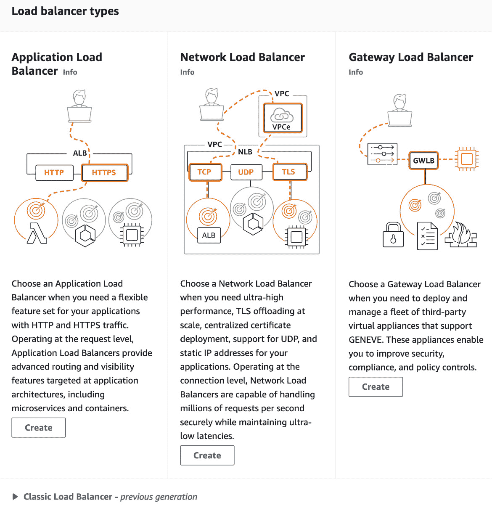
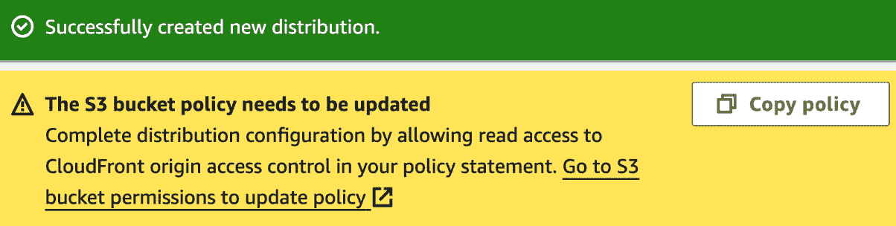

# 第六章：使用证书、CDN 和防火墙实现 Web 安全

在今天这个互联的数字环境中，Web 安全至关重要。为了保持数据的完整性和机密性，结合使用多种工具和技术是至关重要的。本章重点介绍三大关键组件——**证书**、**内容分发网络**（**CDN**）和**防火墙**。我们还将看到如何将证书与负载均衡器一起使用。证书，尤其是 X.509，在通过启用`TLS`（即**传输层安全性**）来确保客户端和服务器之间的通信安全方面发挥着至关重要的作用。这种加密有助于保护传输中的数据，对于防止数据泄露和维护隐私至关重要。

**负载均衡器**通过高效地将传入的网络流量分配到多个服务器，增强了 Web 服务的可靠性和性能。通过这样做，它们确保没有单一服务器承受过多负载，从而防止了停机并优化了资源使用。当与证书一起使用时，负载均衡器提供了管理安全措施（如 TLS 终止）的灵活性，允许集中处理证书，这简化了安全管理并提升了性能。

CDN 通过在多个地理位置缓存内容，靠近用户，从而提高网站加载速度并减少带宽成本。它们还通过防御**分布式拒绝服务**（**DDoS**）攻击，增强 Web 应用程序的可用性和性能，增加了一层安全防护。

最后，防火墙在定义和执行网络安全边界方面至关重要。它们监控和控制进出网络的流量。在 AWS 等环境中集成防火墙有助于构建强大的防御，抵御潜在威胁，为整体安全策略做出重要贡献。本章将探讨这些组件在 AWS 中的实际应用，提供构建安全、可扩展 Web 基础设施的知识。

本章将涵盖以下食谱：

+   为 EC2 实例上的 Web 服务器启用 HTTPS

+   使用 ACM 创建 SSL/TLS 证书

+   创建 ELB 目标组

+   使用带有 TLS 终止的应用负载均衡器（ELB）

+   使用带有 TLS 终止的网络负载均衡器（EC2）

+   使用 CloudFront 和 TLS 安全化 S3

+   使用 WAF

# 技术要求

在深入本章的食谱之前，我们需要确保具备以下要求和知识：

+   为了完成本章中的操作，我们需要一个有效的 AWS 账户。我们可以使用属于 AWS 组织的账户或独立账户。我将使用我们在*第一章*的*多账户管理与 AWS Organizations*食谱中创建的`awsseccb-sandbox-1`账户。 但是，我不会使用任何 AWS Organizations 功能，这意味着你也可以使用独立账户来跟随这些步骤。

+   对于管理操作，我们需要一个具有`AdministratorAccess`权限的用户来操作我们将使用的 AWS 账户。这个用户可以是 IAM 身份中心用户或 IAM 用户。我将使用我们在*第一章*的*用户管理与 IAM 身份中心 SSO*食谱中创建的`awsseccbadmin1` IAM 身份中心用户。 但是，我不会使用任何 IAM 身份中心功能，这意味着如果该用户在账户中具有`AdministratorAccess`权限，你也可以作为 IAM 用户跟随这些步骤。你可以参考*设置 IAM、账户别名和账单警报*食谱来创建一个 IAM 用户。

本书的代码文件可以在[`github.com/PacktPublishing/AWS-Security-Cookbook-Second-Edition`](https://github.com/PacktPublishing/AWS-Security-Cookbook-Second-Edition)找到。本章的代码文件可以在[`github.com/PacktPublishing/AWS-Security-Cookbook-Second-Edition/tree/main/Chapter06`](https://github.com/PacktPublishing/AWS-Security-Cookbook-Second-Edition/tree/main/Chapter06)找到。

# 为 EC2 实例上的 Web 服务器启用 HTTPS

在*第五章*的*使用用户数据启动带 Web 服务器的 EC2 实例*食谱中，我们启动了一个没有启用 HTTPS 的 EC2 实例。在这个食谱中，我们将展示如何使用自签名证书在该 Web 服务器上启用 HTTPS。这将帮助我们理解在 EC2 实例上启用 HTTPS 的基本概念。然而，实际应用中，建议使用本章其他食谱中提到的、由**证书颁发机构**（**CA**）签署的证书方法，例如**AWS 证书管理器**（**ACM**）。

## 准备工作

为了成功完成本食谱，我们需要以下内容：

+   一个有效的 AWS 账户`awsseccb-sandbox-1`，以及一个用户`awsseccbadmin1`，如*技术要求*部分所述。

+   一个名为`Cloudericks Web Server`的 EC2 实例，启动自*第五章*的*使用用户数据启动带 Web 服务器的 EC2 实例*食谱。

## 如何操作...

我们将使用自签名证书启用 HTTPS，如下所示：

1.  安装 Apache `mod_ssl`模块：

    ```
    sudo yum install -y mod_ssl
    ```

1.  生成私钥是为 Web 服务器设置 HTTPS 加密的第一步。私钥是 SSL/TLS 加密过程中的关键组成部分。使用以下命令生成私钥：

    ```
    sudo openssl genrsa -out /etc/pki/tls/private/localhost.key 2048
    ```

    这将不会返回任何内容，但会生成一个 2,048 位的 RSA 私钥，并保存在`/etc/pki/tls/private/localhost.key` 文件中。

1.  使用以下命令生成一个**证书签名请求**（**CSR**），该请求使用前一步生成的私钥：

    ```
    sudo openssl req -new -key /etc/pki/tls/private/localhost.key -out /etc/pki/tls/certs/localhost.csr
    ```

1.  在命令行中运行前一步的命令后，当提示时，输入如下图所示的值：


图 6.1 – 证书签名请求

1.  使用前一步生成的 CSR 来创建一个自签名证书：

    ```
    sudo openssl x509 -req -days 365 -in /etc/pki/tls/certs/localhost.csr -signkey /etc/pki/tls/private/localhost.key -out /etc/pki/tls/certs/localhost.crt
    ```


图 6.2 – 创建自签名证书

当我们运行此命令时，OpenSSL 会读取 CSR，使用私钥对其进行签名，并生成一个自签名证书（**localhost.crt**）。该证书随后可以被您的 Web 服务器（例如，Apache）用来启用 HTTPS 加密，并与客户端建立安全通信。证书将保存在`/etc/pki/tls/certs/localhost.crt` 位置。

1.  使用以下命令重新启动 Apache 服务器：

    ```
    sudo systemctl restart httpd
    ```

1.  使用 HTTPS 前缀访问我们的 Web 服务器 URL，如在*第五章*中的*使用 EC2 用户数据设置 Web 服务器*一节的最后一步所示。我们现在应该会收到响应，但也可能会出现**不安全**的警告，因为我们使用了自签名证书。


图 6.3 – 带有自签名证书的 HTTPS URL

在本节中，我们使用自签名证书在我们的 EC2 实例上为 Web 服务器启用了 HTTPS。在下一篇文章中，我们将探讨如何通过使用 CA 签名的证书来增强安全性。

## 它是如何工作的...

首先，我们安装了 Apache `mod_ssl` 模块。此模块为我们的 Apache 服务器添加了 TLS 支持。`mod_ssl` 模块是启用 Apache 中 SSL/TLS 支持所必需的，必须在生成自签名证书之前安装并配置该模块。该模块的当前版本还支持 SSL v3 和所有版本的 TLS。首先，使用 OpenSSL 生成私钥。然后，创建一个**证书签名请求**（**CSR**）并使用该密钥生成自签名证书。重启 Apache 以应用更改，并允许通过防火墙的 HTTPS 流量。在 Web 浏览器中测试 HTTPS 访问。

## 还有更多...

在本教程中，我们使用了自签名证书，并遇到了**不安全**的警告，如 *图 6* *.3* 所示。为了解决这个问题，我们可以通过 CA 生成证书。CA 是在验证组织或个人后发放数字证书的实体。通过从 CA 获取证书，我们可以确保 SSL/TLS 证书被大多数 Web 浏览器和用户设备信任，从而消除关于不安全连接的警告。CA 在互联网的运作及加密通信的建立中发挥着至关重要的作用。

证书颁发机构（CA）有多种类型，从大型、广泛认可的机构到发行证书给公众，到较小的私人 CA，这些 CA 可能是某个组织内部使用的。像 Verisign、Comodo 和 DigiCert 这样的公共 CA 提供广泛的验证服务，包括 **扩展验证** (`EV`) 和 **组织验证** (`OV`) 证书，这些证书提供更高的安全性和信任度。对于处理敏感交易的网站，这些证书可以提升可信度和用户信任。

像 AWS、Microsoft Azure 和 Google Cloud 这样的云服务提供商提供集成的 SSL/TLS 证书管理解决方案，简化了证书在其生态系统中的配置、管理和部署。ACM 非常适合 AWS 原生服务，自动化证书续期和管理，但它限制了证书的导出到 AWS 以外的地方。Microsoft Azure 的 Key Vault 允许集中管理证书，包括来自外部 CA 的证书，并与 Azure 服务无缝集成。Google Cloud 为其负载均衡器提供托管的 SSL 证书，支持自动续期和部署。

此外，对于需要快速、成本效益高的解决方案的开发人员和小型企业，像 Let’s Encrypt 这样的自动化 CA 提供 **域名验证** (`DV`) 证书，且无需费用。这些证书通过自动化过程颁发，旨在确保申请人控制证书中列出的域名。这种方法高效且非常适合快速保护网站。

最终，选择证书颁发机构取决于我们的具体安全需求、所需的信任级别和预算。每种类型的 CA 提供不同的功能和安全级别，因此选择与您的安全目标和客户信任相符的 CA 至关重要。

## 另见

阅读更多关于 SSL 和 TLS 的内容，访问 [`www.secdops.com/blog/ssl-tls-and-https-a-beginners-guide-to-web-security`](https://www.secdops.com/blog/ssl-tls-and-https-a-beginners-guide-to-web-security)。

# 使用 ACM 创建 SSL/TLS 证书

在本示例中，我们将使用**AWS 证书管理器**（**ACM**）为我们拥有的公共域名创建一个**X.509 证书**。ACM 公共证书用于 AWS 服务，如**弹性负载均衡**（**ELB**），`Amazon CloudFront`，`AWS Elastic Beanstalk`，`Amazon API Gateway` 和`AWS CloudFormation`。

## 准备工作

我们需要以下内容才能成功完成此示例：

+   一个有效的 AWS 帐户，`awsseccb-sandbox-1`，和一个用户，`awsseccbadmin1`，如*技术* *要求*部分所述。

+   与任何域名提供商（包括 AWS）一起，访问其控制面板的域名。我将使用一个名为`trainso.io`的域名。

## 如何实施...

我们可以按以下步骤在 ACM 中创建 TLS 证书：

1.  转到**AWS 证书管理器**仪表板。如果您是第一次使用 ACM，您应该看到**开始**选项。目前，AWS 提供选项，以便我们可以提供证书，并创建私有 CA。


图 6.4 – AWS 证书管理器仪表板

1.  在左侧边栏中，我们应该看到**导入证书**，**列出证书**，**请求证书**和**AWS 私有 CA**选项。点击**请求证书**。

1.  选择**请求公共证书**并点击**下一步**。


图 6.5 – 证书类型配置

1.  在**域名**文本框中输入完全合格的域名。为了包括所有子域，我将使用带有域名的通配符*`.trainso.io`。

1.  对于**验证方法**，选择**DNS 验证 - 推荐**。


图 6.6 – 选择验证方法

1.  对于**密钥算法**，选择`RSA 2048`。


图 6.7 – 选择关键算法

1.  在**添加标签**屏幕上，如有需要添加标签，然后点击**请求**。我们应该在**证书**页面上看到新证书。我们还可以使用左侧边栏的**列出证书**选项进入**证书**页面。我们的证书状态将是**等待验证**。

1.  在**证书**页面上，点击超链接的证书 ID 进入证书页面。

1.  向下滚动到**域名**部分，复制 CNAME 名称和 CNAME 值，并将其添加到我们的域名提供商控制面板中的 DNS 记录中。请注意，对于大多数域名提供商，你只需要复制并粘贴 CNAME 值中的第一部分（即在第一个点 `.` 之前的部分），而不需要复制完整的 CNAME（Canonical Name）。例如，如果我们的 CNAME 值是`_b262683f801a4eb13d8eb4a36cd8a2ba.trainso.io.`，我们可能只需要在域名提供商控制面板中输入`_b262683f801a4eb13d8eb4a36cd8a2ba`作为 CNAME 值，而不包括后面的`.trainso.io.`。域名提供商可以是 Amazon Route 53 或外部提供商，如 Namecheap 或 GoDaddy。DNS 配置不在本书的范围之内，但我会在此教程的*另见*部分提供一些有用的参考。

1.  一旦 CNAME 记录更新完毕，我们可以进入**证书**界面并查看状态。成功后，证书的**状态**栏的值会变为**已颁发**。DNS 更改可能需要一些时间才能传播。如果状态为**待验证**，请过一段时间再检查，或使用刷新按钮刷新页面，直到状态变为**已颁发**。

## 工作原理...

在这个教程中，我们使用 ACM 创建了一个证书。我们可以为一个或多个域名请求证书。我们需要指定一个完全限定的域名，例如`www.trainso.io`，或者一个使用通配符的域名，如*`.trainso.io`，表示`trainso.io`的所有子域名。

在颁发证书之前，我们需要验证域名的所有权。我们可以通过 DNS 验证或邮件验证来完成此操作。在本教程中，我们使用了 DNS 验证。AWS 会为每个域名提供一个 CNAME 记录用于 DNS 验证。我们需要在域名的 DNS 管理服务中更新这个 CNAME 记录。Route 53 是 Amazon 的 DNS 管理服务。

## 还有更多...

ACM 公共证书支持 AWS 服务，如 ELB、Amazon CloudFront、AWS Elastic Beanstalk、Amazon API Gateway 和 AWS CloudFormation。AWS 不允许我们使用 ACM 公共证书来为我们的 EC2 实例启用 SSL/TLS。然而，通过 ACM 私有 CA 颁发的证书可以用于 EC2 实例、容器，甚至我们自己的服务器。

AWS 不会向我们收取通过 ACM 提供的公共 TLS 证书的费用。我们只需支付我们创建的 AWS 资源费用，以便运行我们的应用程序。然而，创建 ACM 私有 CA 并非免费的。对于私有 CA，我们需要支付月费，并为我们颁发的私有证书付费。一旦我们删除了私有 CA，就不再收费；然而，如果我们恢复了私有 CA，将会按照其被删除期间的时间收费。

## 另见

+   我们可以在这里了解更多关于 DNS 的内容：[`www.secdops.com/blog/mastering-dns-resources-and-recipes`](https://www.secdops.com/blog/mastering-dns-resources-and-recipes)。

+   我们可以在这里阅读更多关于 ACM 服务集成的内容，并查看当前支持的服务列表：https://docs.aws.amazon.com/acm/latest/userguide/acm-services.html。

# 创建 ELB 目标组

在此步骤中，我们将学习如何创建**弹性负载均衡器**（**ELB**）**目标组**。应用程序负载均衡器和网络负载均衡器将流量路由到 ELB 目标组，而经典负载均衡器则将流量路由到单个 EC2 实例。

## 准备工作

为了遵循此步骤，我们需要以下内容：

+   一个有效的 AWS 账户，`awsseccb-sandbox-1`，以及一个用户`awsseccbadmin1`，如*技术要求*部分所述。

+   一个 VPC，`awsseccb-vpc`，按照*第五章*中的*通过最小化努力设置 VPC 及其资源*步骤进行。

+   在前述`awsseccb-vpc` VPC 中的两个 EC2 实例，按照*第五章*中的*使用用户数据启动 EC2 实例并配置 Web 服务器*步骤进行，但有以下例外。在创建时分别命名为`Cloudericks Web Server`和`Cloudericks Web Server 2`。

小贴士

名称通过一个键为`Name`的标签在内部表示。

+   子网应为公共子网，分别选择`us-east-1a`和`us-east-1b`可用区。对于第二个实例，将用户数据中的`Cloudericks Web Server`替换为`Cloudericks Web Server 2`，以区分两个 Web 服务器。密钥对和安全组可以在两个实例之间共享。

+   在继续之前，确保我们的实例正在运行并且可以通过浏览器直接访问。为了增强安全性，在配置并测试完 ELB 后，我们可以通过 ELB 的安全组限制访问这些实例。

## 如何操作...

我们可以按照以下步骤创建目标组：

1.  登录到 AWS 管理控制台并进入`EC2`服务。

1.  在左侧边栏的**负载均衡**下，点击**目标组**。

1.  点击**创建目标组**。

1.  在**指定组详细信息**页面的**基本配置**部分，选择**实例**作为**选择目标类型**。


图 6.8 – 选择目标类型

1.  对于**目标组名称**，输入`cloudericks-tg`，或者一个与您的使用案例相关的有意义的名称。

1.  对于**协议：端口**，选择`HTTP`；对于**端口**，输入`80`；对于**IP 地址类型**，选择`IPv4`。

1.  对于`VPC`，选择包含我们 EC2 实例的`awsseccb-vpc` VPC。

1.  在**协议版本**下，选择`HTTP1`。


图 6.9 – 选择协议版本

1.  在**健康检查**部分，对于**健康检查协议**，选择`HTTP`，对于**健康检查路径**，输入`/index.html`。保持其他值不变，然后点击**下一步**。

1.  在**注册目标**面板中，选择`Cloudericks Web Server` 和 `Cloudericks Web Server 2` EC2 实例，并点击**作为待处理目标添加下面**。实例现在应该出现在**审核目标**下。

1.  点击**创建目标组**。我们应该看到目标组已成功创建的消息。

    目标的健康状态现在为**未使用**。当它们被附加到 ELB 后，状态将发生变化。

## 它是如何工作的...

在这个食谱中，我们为 EC2 实例创建了一个使用 HTTP 协议的目标组。我们可以使用 HTTP 或 HTTPS 协议创建带有目标组的应用程序负载均衡器。网络负载均衡器需要一个使用 TCP 或 TLS 协议的目标组。我们还可以为 IP 地址和 AWS Lambda 函数创建目标组。通过选择**IP 地址**选项，我们可以选择 AWS 外部的公共 IP 地址。

对于健康检查，我们将协议设置为 HTTP，路径设置为`/index.html`。如果需要，我们可以通过在**高级健康检查设置**下选择**覆盖**端口选项，来覆盖健康检查的端口。我们可以设置等待实例响应的时间（超时），健康检查之间的时间（间隔），在声明实例不健康之前的连续失败次数（不健康阈值），在声明实例健康之前的连续成功次数（健康阈值），以及检查成功的 HTTP 响应代码（成功代码）。

当目标组实例创建时，它们的初始状态为未使用。当目标组附加到 ELB 后，状态将变为初始状态。如果健康检查通过，则状态变为**健康**。其他支持的状态包括如果健康检查失败，则为不健康，或者如果目标正在注销并且正在进行连接排空，则为排空。

## 还有更多...

在这个食谱中，我们创建了一个使用 HTTP 协议的目标组。目标组可以使用`HTTP`、`HTTP`、`HTTP`、`HTTP`、`HTTP`、`GENEVE` 和 `TCP_UDP` 协议创建。我们可以按照这个食谱中的步骤，使用其他协议创建目标组。例如，我们可以添加一个使用 HTTPS 协议并将端口设置为`443`的目标组，然后将启用了 SSL/TLS 的 EC2 实例添加到该目标组。对于通过网络负载均衡器进行 HTTPS 请求的 TCP 透传，这对于在 EC2 上进行 TLS 终止是必要的，我们应该将协议设置为 TCP，但端口设置为`443`。

## 另请参见

我们可以在 [`www.cloudericks.com/blog/understanding-load-balancing-in-aws`](https://www.cloudericks.com/blog/understanding-load-balancing-in-aws) 上阅读更多关于 AWS 负载均衡的信息。

# 使用带 TLS 终止的应用程序负载均衡器在 ELB 上

**应用负载均衡器**（**ALBs**）在请求层（OSI 模型的应用层）工作，用于 HTTP 和 HTTPS 请求。ALBs 为请求和基于路径参数的路由提供应用层的高级路由功能。架构模式，例如微服务架构，可以使用 ALBs 将请求路由到不同的 Web 服务器，同时利用请求参数。

## 准备工作

要跟随此教程，我们需要以下内容：

+   一个有效的 AWS 账户，`awsseccb-sandbox-1`，以及一个用户`awsseccbadmin1`，如*技术要求*部分所述。

+   创建一个目标组`cloudericks-tg`，包含两个 EC2 实例，按照本章的*创建 ELB 目标组*教程操作，此外，以下资源应作为准备工作的一部分创建——一个 VPC，`awsseccb-vpc`，以及一个安全组，`cloudericks-web-server`。

+   为了将 HTTPS（安全 HTTP）作为 ELB 监听协议，我们需要一个 ACM 证书。我们可以按照本章的*创建 SSL/TLS 证书与 ACM*教程来创建一个 ACM 证书。

## 操作方法...

我们可以按以下步骤创建并测试 ALB：

1.  转到控制台中的`EC2`服务。

1.  在左侧栏中，点击**负载均衡**，然后点击左侧栏中的**负载均衡器**。

1.  点击**创建负载均衡器**。

1.  我们应该看到创建三种主要类型负载均衡器的选项——即**应用负载均衡器**、**网络负载均衡器**和**网关负载均衡器**。点击**创建**下的**应用负载均衡器**。



图 6.10 – 负载均衡器类型

1.  在**基本配置**屏幕中，输入**负载均衡器名称**，例如`cloudericks-app-lb`，或根据需要输入一个有意义的名称。在**方案**中选择**面向互联网**，在**IP 地址类型**中选择`IPv4`。


图 6.11 – 基本配置

1.  在**网络映射**部分，选择我们的 VPC，`awsseccb-vpc`。

1.  在**网络映射**部分，在**映射**中选择我们实例所在的可用区和公有子网。


图 6.12 – 选择可用区和子网

1.  选择`cloudericks-web-server`安全组，该安全组允许`HTTP`和`HTTPS`从**任何地方**访问。

1.  在**监听器和路由**部分，将**协议**设置为`HTTPS`。端口会自动设置为`443`。在**默认操作**中，选择我们的目标组`cloudericks-tg`。


图 6.13 – 添加 HTTPS 监听器

1.  在**安全监听器设置**下，选择**证书来源**为**来自 ACM**，并选择我们为本教程创建的 ACM 证书作为**证书名称**。


图 6.14 – 选择 SSL/TLS 服务器证书

1.  可选地，你可以为此负载均衡器添加 AWS WAF 或创建一个 `AWS Global Accelerator`，如下图所示。我们暂时跳过这些内容。


图 6.15 – 配置 AWS WAF 和 AWS Global Accelerator

1.  查看详情并点击 **创建负载均衡器**。如果我们进入目标组 `cloudericks-tg`，实例的健康状态最初会显示为 `Initial`，经过一段时间后，状态应该会变为 `Healthy`。

1.  从 ELB 的 **描述** 标签页复制 DNS 名称，在其前面加上 `https://` 前缀，如下图所示，然后在浏览器中输入此 URL。如果出现安全警告，选择 **高级**，然后点击链接继续。这将显示其中一个 Web 服务器。通过多次刷新页面，可以观察到来自两个 Web 服务器的响应。


图 6.16 – 负载均衡器的响应，显示我们的第一个实例数据

我们会收到一个警告，因为我们的 URL（ELB DNS）与证书的域名不匹配，在我的案例中是 *`.trainso.io`。

1.  为域名创建一个 `CNAME` 记录，将 `Name`（或 **Host**）设置为 `cloudericks.trainso.io`（如果 DNS 服务提供商自动附加域名，则此值仅为 **cloudericks**），将 `Value` 设置为我们的 DNS 名称，在我的案例中是 `cloudericks-app-lb-901703641.us-east-1.elb.amazonaws.com`。记得将 `trainso.io` 替换为你为其创建证书的域名。

1.  一旦 DNS 更改被传播（可能需要一些时间），我们应该能够访问我们的子域名 URL（例如，我的案例中是 **cloudericks.trainso.io**），并且应该能收到成功的响应，如下图所示：


图 6.17 – 成功的 HTTPS 响应，带有 SSL/TLS 证书

重要提示

有多种方式可以通过 ELB 指定我们的域名，包括创建一个 Route 53 账户并更改我们域名的服务器名称，或者为子域名添加 CNAME 记录。

## 它是如何工作的...

在本例中，我们创建了一个面向互联网的负载均衡器。我们将监听协议设置为 HTTPS（安全 HTTP），并在 **配置安全设置** 页面上选择了一个 ACM 证书。我们将安全策略设置为 `ELBSecurityPolicy-2016-08`。安全策略是一种 SSL 协商配置，用于与客户端协商 SSL 连接。

我们在 ELB 层终止了 TLS。请注意，从 ELB 到实例的连接没有使用 TLS。ALB 仅支持在 ELB 层进行 TLS/SSL 终止。网络负载均衡器和经典负载均衡器可以通过使用 TCP 协议在端口`443`上，在 EC2 实例层终止 TLS/SSL。

当我们在 ELB 层终止 HTTPS 请求的 TLS 时，请求会在 ELB 解密，并通过私有网络以未加密的形式发送到 EC2 实例。若在 EC2 实例终止 HTTPS 请求的 TLS，则该请求不会在 ELB 解密，而只会在 EC2 实例上解密。

在 ELB 层进行 TLS 终止可以避免在 EC2 实例上进行 TLS 终止的开销，更加高效。然而，如果有端到端加密的合规性要求，我们应该在 EC2 实例层进行终止。

## 更多内容...

让我们快速浏览一些与 ALB 相关的重要概念：

+   ALB 只支持 HTTP 或 HTTPS 协议。对于其他协议，例如 TCP，我们需要使用网络负载均衡器或经典负载均衡器。

+   ALB 只支持在 ELB 层进行 TLS/SSL 终止。

+   我们可以在目标组层为 ALB 启用粘性会话。然而，我们不能在个别 EC2 实例上启用 ALB 的粘性会话。

+   如果启用了路径模式，我们可以通过 ALB 实现基于路径的路由。

+   我们为 SSL/TLS 协商设置了安全策略为`ELBSecurityPolicy-2016-08`，这是默认设置。以下是当前可用的策略：`ELBSecurityPolicy-2016-08`，`ELBSecurityPolicyTLS-1-2-2017-01`，`ELBSecurityPolicy-TLS-1-1-2017-01`，`ELBSecurityPolicyTLS-1-2-Ext-2018-06`，`ELBSecurityPolicy-FS-2018-06`，`ELBSecurityPolicy-2015-05`，`ELBSecurityPolicy-TLS-1-0-2015-04`，`ELBSecurityPolicy-FS-1-2-Res-2019-08`，`ELBSecurityPolicy-FS-1-1-2019-08`，以及`ELBSecurityPolicy-FS-1-2-2019-08`。

## 另见

我们可以在[`docs.aws.amazon.com/elasticloadbalancing/latest/application/create-https-listener.html`](https://docs.aws.amazon.com/elasticloadbalancing/latest/application/create-https-listener.html) 阅读更多关于为 ALB 创建监听器的信息。

# 在 EC2 上使用网络负载均衡器进行 TLS 终止

**网络负载均衡器**用于负载均衡 TCP 流量，工作在 OSI 模型的第 4 层。与其他类型的负载均衡器相比，它们提供了非常高的性能，并且能够支持每秒数百万个请求，延迟极低。

## 准备就绪

要按照此方案操作，我们需要以下内容：

+   如*技术要求*部分所述，我们需要一个有效的 AWS 账户，`awsseccb-sandbox-1`，以及用户`awsseccbadmin1`。

+   创建一个目标组`cloudericks-tg-tcp`，按照本章的*创建 ELB 目标组*的步骤，但选择 TCP 而不是 HTTP 作为协议，端口选择`443`。作为准备该步骤的一部分，应该已经创建了以下资源 - 一个 VPC，`awsseccb-vpc`，和一个安全组，`cloudericks-web-server`。对于此步骤，我们需要一个 EC2 实例，按照*第五章*中的*使用用户数据启动带有 Web 服务器的 EC2 实例*的步骤。

+   为我们的 Web 服务器启用 HTTPS，按照*在 EC2 实例上为 Web 服务器启用 HTTPS*的步骤，因为我们希望在此步骤中的 EC2 实例上使用 HTTPS。确保我们的实例可以使用`https://`前缀访问。

+   要将 HTTPS（安全 HTTP）作为 ELB 监听协议，我们需要一个 ACM 证书。我们可以按照本章的*使用 ACM 创建 SSL/TLS 证书*的步骤创建 ACM 证书。

## 如何做…

我们可以创建并测试一个在 EC2 实例上进行 TLS 终止的网络负载均衡器，如下所示：

1.  登录 AWS 管理控制台，转到`EC2`服务。

1.  从左侧边栏点击**负载均衡器**。

1.  点击**创建负载均衡器**。我们应该看到创建三种类型的负载均衡器的选项，**应用负载均衡器**，**网络负载均衡器**和**经典负载均衡器**，如*图 6* *.10*所示。

1.  在**网络负载均衡器**下，点击**创建**。

1.  在**创建网络负载均衡器**屏幕上，在**基本配置**部分，输入`cloudericks-nw-lb`作为**负载均衡器名称**；对于**方案**，选择**面向互联网**；对于**IP 地址类型**，选择`IPv4`。

1.  在**网络映射**部分，对于`VPC`，选择我们的 VPC，`awsseccb-vpc`。

1.  在**网络映射**部分，在**映射**下，选择我们的实例所在的可用区和公共子网，如*图 6* *.12*所示。

1.  在**安全组**下，选择`cloudericks-web-server`安全组。

1.  对于**协议**，选择`TCP`，并将**端口**的值设置为`443`。对于**目标组**，选择`cloudericks-tg-tcp`。

1.  可选地，您可以为此负载均衡器创建 AWS 全球加速器。暂时跳过。对于 ALB，我们还有包括 AWS WAF 的选项，正如我们在*图 6* *.15*中看到的。

1.  其他细节保持不变，点击**创建负载均衡器**。

1.  从 ELB 的**描述**选项卡中复制 DNS 名称，将`https://`前缀添加到其中，如下图所示，在浏览器中输入此 URL。如果出现安全警告，请选择**高级**，然后点击继续链接。这将显示一个 Web 服务器。通过多次刷新页面，您可以观察来自两个 Web 服务器的响应。


图 6.18 – 网络负载均衡器响应

在这里，我们在 EC2 实例上执行 TLS 终止；因此，我们不需要为负载均衡器配置证书。我们在浏览器中收到警告，因为我们使用的是自签名证书。如果我们使用由 CA 签名的证书，我们将不会收到警告。

## 工作原理...

在这个示例中，我们创建了一个**网络负载均衡器**（**NLB**），在 EC2 上进行了 TLS 终止。大部分选项与本章中*在 ELB 上使用应用负载均衡器进行 TLS 终止*示例中所见相同。在这个示例中，我们使用了 TCP 协议和端口`443`。这样做是为了让 NLB 只需将 HTTPS 请求简单地传递给 EC2 实例，而不在 ELB 层解密它。目标组也应配置为 TCP 协议，并使用端口`443`，允许 TCP 透传。如果我们选择 TLS（安全 TCP）而不是 TCP，NLB 将在 ELB 自身解密请求。

## 还有更多...

在这个示例中，我们对 HTTPS 请求进行了 TCP 透传，并在 EC2 实例上执行了 TLS 终止。在 EC2 实例上进行 TLS 终止将消耗更多的 EC2 资源，并为 EC2 实例提供额外的负载。我们还需要在所有 EC2 实例上管理证书。然而，如果由于合规性或政府政策要求需要端到端加密，这是首选方式。否则，首选方法是在 ELB 层执行 SSL/TLS 终止，就像我们在本章中*在 ELB 上使用应用负载均衡器进行 TLS 终止*示例中所见。要在 NLB 上终止 SSL/TLS，我们需要将协议设置为 TLS（安全 TCP）并选择 ACM 证书。

## 另请参阅

我们可以在这里阅读有关 AWS 负载均衡器 TLS 终止的更多信息：[`www.cloudericks.com/blog/understanding-tls-termination-with-load-balancers-in-aws`](https://www.cloudericks.com/blog/understanding-tls-termination-with-load-balancers-in-aws)。

# 使用 CloudFront 和 TLS 保护 S3

在这个示例中，我们将学习如何通过添加 CloudFront 分发层来保护 S3 存储桶。我们将在 CloudFront 分发上启用 SSL/TLS 以允许 HTTPS 流量。最初，我们将利用默认的 CloudFront 证书（***.cloudfront.net**），然后继续配置 CloudFront 分发以使用 ACM 证书的自定义域。

## 准备工作

我们需要以下内容才能成功完成这个示例。

+   一个名为`awsseccb-sandbox-1`的有效 AWS 帐户和一个名为`awsseccbadmin1`的用户，如*技术要求*部分所述。

+   我们需要一个名为`index.html`的 S3 存储桶。文件的内容应为`<h1> Cloudericks Web Server </h1>`。我们可以通过参考*第二章*的*技术要求*部分来创建一个 S3 存储桶。

+   对于本食谱中*使用自定义域名和 ACM 证书的 CloudFront 分发*部分，我们需要创建一个 ACM 证书，按照本章的*使用 ACM 创建 SSL/TLS 证书*食谱进行操作。

## 如何操作...

我们可以为 S3 桶添加一个 CloudFront 分发，无论是否使用自定义域名。我们将在本食谱中介绍这两种方法。

### 使用默认 CloudFront 域的 CloudFront 分发

我们可以按如下方式将 CloudFront 分发添加到具有默认 CloudFront 域和证书的 S3 桶：

1.  登录到 AWS 管理控制台并进入`CloudFront`服务。

1.  如果你是 CloudFront 新手，你应该会看到一个包含**创建 CloudFront 分发**按钮的页面。点击它。否则，你可以先从左侧边栏点击**分发**，然后选择**CloudFront 分发**。


图 6.19 – 创建 CloudFront 分发

1.  在**源站**面板中，对于**源站域名**，选择我们为本食谱创建的 S3 桶。保持**源站路径**为空。对于**名称**，使用自动生成的值。对于**源访问**，选择**源访问控制设置**。


图 6.20 – 设置源站详情

1.  点击**创建新 OAC**。对于名称，我们可以使用自动填充的名称。对于签名行为，选择**签名请求（推荐）**。保持默认设置，如下图所示，然后点击**创建**。


图 6.21 – 创建新 OAC

1.  在我们的**创建分发**页面上选择新的 OAC。保持**启用源盾**的值为**否**。

1.  在**默认缓存行为**下，对于**路径模式**，使用默认值；对于**自动压缩对象**，选择**是**；对于**查看器协议策略**，选择**将 HTTP 重定向到 HTTPS**；对于**允许的 HTTP 方法**，选择`GET, HEAD`；对于**限制查看器访问**，选择**否**。


图 6.22 – 配置默认缓存行为

1.  保持**缓存键和源请求**以及**功能关联**的默认设置。

1.  向下滚动到**Web 应用防火墙（WAF）**并选择**不启用安全性保护**选项。


图 6.23 – WAF 选择选项

1.  对于**价格类**，请选择**使用所有边缘位置（最佳性能）**。


图 6.24 – 选择价格类

1.  对于**自定义 SSL 证书 - 可选**，不要做任何选择；对于**支持的 HTTP 版本**，选择`HTTP/2`；对于**默认根对象 - 可选**，输入`index.html`。


图 6.25 – 选择 SSL 证书和默认根对象

1.  对于**标准日志记录**，选择**关闭**，对于`IPv6`，选择**开启**。启用标准日志记录后，会检索查看者请求的日志，并将其传递到 Amazon S3 存储桶。因此，启用此功能需要指定目标存储桶，并确定是否需要记录 cookie。启用 cookie 记录后，CloudFront 会在标准日志中包含 cookie。

1.  点击**创建分发**。我们将收到一个提示，询问是否要复制需要更新在我们的 S3 存储桶中的 S3 存储桶策略。



图 6.26 – 复制 S3 策略通知

1.  点击**复制策略**，并将此策略粘贴到我们的 S3 存储桶的**存储桶策略**部分。如果您不确定如何操作，可以参考*第四章*中的*创建 S3 存储桶策略*部分。如果您错过了这一步，您将需要独立设置它，可以参考亚马逊文档 [`docs.aws.amazon.com/AmazonCloudFront/latest/DeveloperGuide/private-content-restricting-access-to-s3.html`](https://docs.aws.amazon.com/AmazonCloudFront/latest/DeveloperGuide/private-content-restricting-access-to-s3.html) 。

1.  从我们的 CloudFront 分发中复制**分发域名**，并在浏览器中运行。我们应该会得到以下截图中的输出：


图 6.27 – 通过 CloudFront 分发的响应

在这里，我们不需要指定文件名，因为我们已经指定了一个默认对象。

1.  可选地，我们还可以直接指定我们的 S3 存储桶中的文件名，如下截图所示。这个文件在*准备就绪*部分中没有创建，所以如果您想要运行类似的 URL，您需要创建它。


图 6.28 – 直接访问 S3 中的文件

接下来，我们将学习如何使用自己的 ACM 证书和自定义域名。

### 带有自定义域名和 ACM 证书的 CloudFront 分发

我们可以按照以下步骤为 S3 存储桶添加一个带有自定义域名和 ACM 证书的 CloudFront 分发：

1.  按照本教程中*CloudFront 分发使用默认 CloudFront 域名*部分的*步骤 1 到 9*，直到设置价格类别。然而，有一个例外 - 如果在该部分创建了**源访问控制**（**OAC**），则无需创建新的，可以重用现有的 OAC。

1.  对于**备用域名（CNAME）- 可选**，输入我们拥有证书的域名的子域名，如下截图所示。请记得将`trainso.io`替换为您的域名。


图 6.29 – 设置备用域名（CNAME）

1.  对于**自定义 SSL 证书**，如*图 6* *.30*所示，选择我们为本教程创建的 ACM 证书，取消**遗留客户端支持**，对于**安全策略**，选择`TLSv1.2_2021`，这是当前推荐的版本。对于**支持的 HTTP 版本**，选择`HTTP/2`，对于**默认根对象 - 可选**，输入`index.html`。


图 6.30 – ACM 证书配置

1.  对于**标准日志记录**，选择**关闭**，对于`IPv6`，选择**开启**。

1.  点击**创建分发**。将显示复制策略消息与一个存储桶策略。确保更新我们 S3 存储桶的存储桶策略，就像我们在前一节中所做的那样。

1.  为域名创建一个`CNAME`记录，名称（或主机）设置为我们在*步骤 2*中输入的子域名，我的情况下是`cloudericksws.trainso.io`（如果 DNS 服务提供商自动附加域名，则只是**cloudericksws**），值设置为我们的 CloudFront 域名，我的情况下是`d31z3ldyzun0k3.cloudfront.net`。

1.  经过一段时间，考虑到 DNS 传播延迟，从浏览器中运行子域名，我们应该会得到一个成功的响应。


图 6.31 – 使用自定义域的响应

除了自定义子域名，我们也可以使用前一节中看到的 CloudFront 域名访问网页。


图 6.32 – 使用 CloudFront 域名的响应

在本节中，我们通过 CloudFront 使用自定义域和 ACM 证书访问了我们私有 S3 存储桶的内容。

## 工作原理...

在本教程中，我们创建了一个 CloudFront 分发层覆盖一个私有 S3 存储桶，以便通过 HTTPS 安全访问 S3 存储桶。我们配置了将所有 HTTP 请求重定向到 HTTPS 请求。如果我们选择 HTTP 和 HTTPS，则允许 HTTP 和 HTTPS 请求。如果我们只选择 HTTPS，则所有 HTTP 请求将被丢弃。

在本教程的*使用默认 CloudFront 域的 CloudFront 分发*部分中，我们使用了 CloudFront 提供的默认证书（ *`.cloudfront.com` ）进行 SSL 加密。这个证书使我们能够在不需要创建证书的情况下使用 HTTPS。在本教程的*使用自定义域和 ACM 证书的 CloudFront 分发*部分中，我们指定了一个通配符域名（ *`.trainso.io` ）作为备用域名（CNAMEs）。这将允许任何子域名作为 DNS 服务提供商端的 CNAME 记录，并转发到我们的网页。

我们选择了为自定义域创建的 ACM 证书，并在 DNS 服务提供商处输入了指向 CloudFront 域名的 CNAME 记录。添加 CNAME 记录的具体步骤可能与 DNS 服务提供商相关。您可以查看 DNS 服务提供商的文档（[`aws.amazon.com/route53/what-is-dns/`](https://aws.amazon.com/route53/what-is-dns/)）了解更多详细信息。

## 还有更多...

在这个步骤中，我们使用了自有的 ACM 证书作为 CNAME，它已在外部 DNS 提供商处配置，使我们能够使用子域访问 S3 存储桶中的网页。或者，我们可以使用 Route 53 来管理我们的域的 DNS，并将顶级域名指向我们的 CloudFront 分发。

## 另请参见

我们可以在此处了解如何使用 Route 53 将流量路由到 CloudFront 分发：[`docs.aws.amazon.com/Route53/latest/DeveloperGuide/routing-to-cloudfront-distribution.html`](https://docs.aws.amazon.com/Route53/latest/DeveloperGuide/routing-to-cloudfront-distribution.html)。

# 使用 WAF

`AWS WAF`（即**Web 应用防火墙**）是一项用于监控我们 Web 流量的防火墙服务。与仅检查端口和 IP 地址的安全组和**网络 ACLs**（**NACLs**）不同，AWS WAF 可以根据预定义的签名匹配内容，帮助检测常见的攻击方式，如 SQL 注入和跨站脚本攻击。目前，我们只能在 API Gateway、CloudFront 和 ALBs 中使用 WAF，不能直接与 EC2 或 Route 53 等服务一起使用。

AWS WAF 可以与 CloudFront 分发、ALBs 和 API Gateway 一起使用，每种服务具有独特的特性，影响 WAF 的使用。CloudFront 是全球性的，意味着 WAF 规则在所有区域统一适用，为全球应用提供一致的保护。相比之下，ALBs 和 API Gateway 是区域性的，因此 WAF 规则必须为每个区域单独配置，虽然可以根据需求定制安全策略，但也增加了管理的复杂性。使用 CloudFront 配合 WAF 更加简单，并能通过边缘位置减少延迟，而 ALBs 和 API Gateway 提供了更细粒度的控制，但可能会由于需要多次配置而导致区域性能差异和潜在的更高成本。了解这些差异有助于根据应用架构和地理分布优化安全性和性能。

## 准备工作

我们需要以下内容才能成功完成此操作：

+   一个有效的 AWS 账户，`awsseccb-sandbox-1`，以及一个用户，`awsseccbadmin1`，如*技术* *要求*部分所述。

+   要创建一个与 CloudFront 分发配合使用的 WAF，我们需要按照本章的 *使用 CloudFront 和 TLS 保护 S3* 配方，在 S3 存储桶上创建 CloudFront 分发。

## 如何操作...

我们可以按照以下步骤为 CloudFront 分发创建和配置 AWS WAF：

1.  登录 AWS 管理控制台并进入`WAF & Shield`仪表板。


图 6.33 – WAF & Shield 仪表板

我们应该在侧边栏中看到`AWS WAF`、`AWS Shield`和`AWS Firewall Manager`的菜单项。如果 AWS 决定将它们分开，请前往 AWS WAF 仪表板并继续进行此步骤。

1.  点击**创建web ACL**。

1.  在**Web ACL 详情**部分，对于**资源类型**，选择**Amazon CloudFront 分发**；对于**名称**，输入`cloudericks-webacl`；并可选地，在**描述**字段提供描述。我们将使用自动填充的**CloudWatch 指标名称**字段值。


图 6.34 – 配置 Web ACL

1.  在**关联的 AWS 资源**部分，点击**添加AWS 资源**。

1.  在**添加 AWS 资源**页面，选择我们为此步骤创建的**CloudFront 分发**，然后点击**添加**。

1.  一旦我们回到**关联的 AWS 资源**部分，选择我们的 CloudFront 分发。

1.  对于**Web 请求体检查**，选择**默认**，然后点击**下一步**。

1.  在**添加规则和规则组**页面，展开**添加规则**下拉菜单并选择**添加我的规则和规则组**。

1.  在**添加我的规则和规则组**页面，选择**规则构建器**。


图 6.35 – 选择规则类型

1.  在**规则构建器**下，进入**规则**部分，输入名称`badstring-rule`并将**类型**设置为**常规规则**。


图 6.36 – 配置规则构建器

1.  在**语句**部分，对于**检查**，选择**查询字符串**；对于**匹配类型**，选择**包含单词**；对于**匹配字符串**，输入`badstring`。对于**文本转换**，选择**无**。


图 6.37 – 设置字符串语句

1.  在**然后**部分，选择**阻止**作为动作并点击**添加规则**。


图 6.38 – 添加规则

1.  在**添加规则和规则组**页面，对于**默认 Web ACL 动作（不匹配任何规则的请求）**，选择**允许**并点击**下一步**。

1.  在**设置规则优先级**页面，选择我们的规则并点击**下一步**。

1.  在**配置指标**页面，选择我们的规则，保留自动生成的指标名称，选择**启用采样请求**作为**请求采样选项**，然后点击**下一步**。

1.  在**审核并创建 Web ACL**页面，审查更改并点击**创建 Web ACL**。如果我们前往 CloudFront 分发，它将开始部署。请等待直到部署完成。

1.  使用包含 `badstring` 的查询字符串从浏览器中运行 URL – 例如，`https://d1w6mgtt0jnmgz.cloudfront.net/?name=badstring` 。这时我们应该得到一个 `403` 错误，如下所示：


图 6.39 – 403 错误

如果我们在 URL 中没有任何地方使用 `badstring` 这个词，就不会出现错误。

1.  取消将 Web ACL 与我们的 CloudFront 发行版关联，如下所示：

    1.  点击我们的 Web ACL。

    1.  转到 **关联的 AWS 资源** 选项卡。

    1.  选择我们的 CloudFront 发行版。

    1.  点击 **删除** 。

1.  等待状态变为 **已部署** ，然后从包含 `badstring` 的查询字符串的浏览器中再次运行 URL。此时页面应该可以成功加载，没有任何错误。

    我们还可以在创建 CloudFront 发行版时启用 WAF，并可以在 CloudFront 发行版中禁用保护。

## 工作原理……

Web ACL 是 AWS WAF 中的主要组件。Web ACL 包含一个或多个规则。规则包含条件语句（例如，阻止从一组 IP 地址访问）。我们使用规则构建器添加了我们自己的规则。规则构建器有一个 `IF` 部分和一个 `THEN` 部分。`IF` 部分包含条件，而 `THEN` 部分包含当 `IF` 部分中的条件满足时需要执行的操作。在此配方中，我们添加了一个简单的规则，检查查询字符串是否包含字符串 `badstring` ，并阻止这类请求。

在 `IF` 部分，我们目前可以检查以下请求组件 – 一个头部，一个单一查询参数，所有查询参数，URI 路径，查询字符串，主体和 HTTP 方法。我们还可以检查 IP 地址是否属于 IP 集或请求是否来自特定国家。在此配方中，我们创建了一个常规规则。我们还可以创建一个基于速率的规则来为单个用户设置速率限制。例如，WAF 可以基于用户发出的 **4xx 错误** 数量来阻止用户。

我们可以从 WAF 仪表板的左侧边栏创建支持资源，例如 IP 集，Regex 模式集和规则组。我们可以使用 WAF 仪表板左侧边栏中的 AWS Marketplace 链接找到 AWS Marketplace 规则组。除了创建我们自己的规则外，我们还可以添加 AWS 管理的规则组。目前，在控制台中有三类托管规则组 – AWS 管理的规则组，Cyber Security Cloud Inc. 管理的安全组和 Fortinet 管理的规则组。

## 还有更多……

在撰写本文时，AWS WAF 和 AWS Shield 服务具有相同的服务主页，正如我们在 *如何做……* 部分看到的那样。在此配方中，我们详细介绍了 AWS WAF。在本节中，我们将简要介绍与 AWS Shield 相关的一些重要概念。

AWS Shield 是一项托管的**分布式拒绝服务**（**DDoS**）保护服务，提供始终开启的检测和自动内联缓解措施，以最小化应用程序的停机时间和延迟，无需联系 AWS 支持即可享受 DDoS 保护。

AWS Shield 有两个层级——Standard 和 Advanced。Shield Standard 防御针对我们网站或应用程序的已知基础设施攻击，包括网络（第 3 层）和传输层（第 4 层），并且与 Amazon CloudFront 和 Amazon Route 53 配合使用时效果最佳。AWS Shield Advanced 提供更高水平的保护，针对攻击我们运行在 EC2、ELB、CloudFront、AWS Global Accelerator 和 Route 53 资源上的应用程序。

## 另见

+   你可以在这里阅读更多关于 AWS WAF、AWS Shield 和 AWS Firewall Manager 的信息：[`docs.aws.amazon.com/waf/latest/developerguide/what-is-aws-waf.html`](https://docs.aws.amazon.com/waf/latest/developerguide/what-is-aws-waf.html)。

+   你可以在这里阅读更多关于 AWS Shield 的信息：[`aws.amazon.com/shield/`](https://aws.amazon.com/shield/)。
