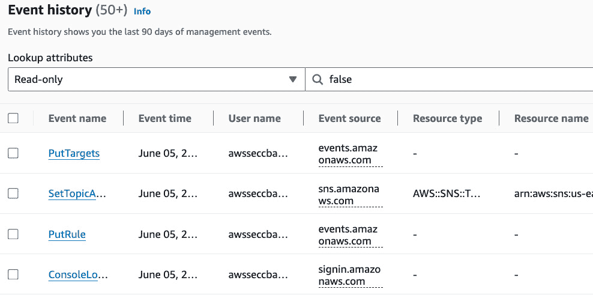
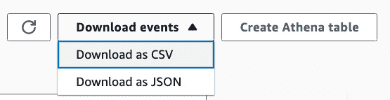
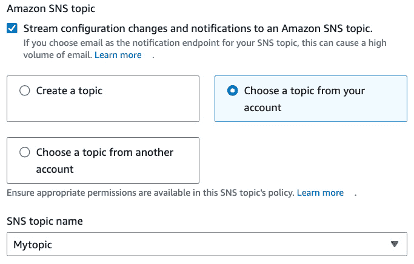

# 第七章：使用 CloudWatch、CloudTrail 和 Config 进行监控

我们已经讨论了许多关于安全的方面，例如**保密性**、**完整性**和**可用性**（**CIA**）以及**认证**、**授权**和**审计**（**AAA**）。审计可以通过**持续监控**、**警报**和定期**审计**来实现。适当的监控和警报也可以通过**自动修复**来提高可用性。在本章中，我们将研究`Amazon CloudWatch`、`AWS CloudTrail`和`AWS Config`。CloudWatch 是 AWS 中用于**日志记录**、**监控**和警报的主要服务。CloudTrail 可以记录 AWS API 调用。AWS Config 可以记录并评估配置是否符合预定义的配置规则。我们还将了解**简单通知服务**（**SNS**），它将帮助我们发送通知。

本章将涵盖以下食谱：

+   创建 SNS 主题以发送电子邮件

+   使用 CloudWatch 警报和指标

+   创建一个 CloudWatch 日志组

+   使用 EventBridge（之前是 CloudWatch Events）

+   在 CloudTrail 中读取并过滤日志

+   在 CloudTrail 中创建轨迹

+   使用 Athena 查询 S3 中的 CloudTrail 日志

+   使用 CloudFormation 模板将 CloudWatch 与 CloudTrail 集成

+   设置和使用 AWS Config

# 技术要求

在开始本章的操作之前，我们需要确保具备以下要求和知识：

+   我们需要一个有效的 AWS 账户来完成本章的所有操作。我们可以使用属于 AWS 组织的一部分的账户或独立账户。我将使用我们在*第一章*的*使用 AWS 组织进行多账户管理*食谱中创建的`awsseccb-sandbox-1`账户。不过，我不会使用任何 AWS 组织功能，这意味着你也可以使用独立账户跟随这些步骤。

+   对于管理操作，我们需要一个具有`AdministratorAccess`权限的用户来操作 AWS 账户。这可以是一个**身份与访问管理**（**IAM**）身份中心用户或 IAM 用户。我将使用我们在*第一章*的*使用 IAM Identity Center 进行用户管理和 SSO*食谱中创建的`awsseccbadmin1` IAM Identity Center 用户。不过，我不会使用任何 IAM Identity Center 功能，这意味着如果用户在账户中具有`AdministratorAccess`权限，你也可以使用 IAM 用户执行这些步骤。你可以按照*设置 IAM、账户别名和账单警报*食谱创建一个 IAM 用户。

本章的代码文件可在[`github.com/PacktPublishing/AWS-Security-Cookbook-Second-Edition/tree/main/Chapter07`](https://github.com/PacktPublishing/AWS-Security-Cookbook-Second-Edition/tree/main/Chapter07)找到。

# 创建 SNS 主题以发送电子邮件

在本示例中，我们将学习如何创建一个 SNS 主题来发送电子邮件。SNS 是一个托管的**发布/订阅消息服务**，可以与多种端点一起使用，如电子邮件、**短信（SMS）**、`Lambda`、**简单队列服务（SQS）**等。

## 准备开始

为了成功完成本示例，我们需要一个有效的 AWS 账户，一个如*技术要求*部分所述的用户，以及一个有效的电子邮件地址。

## 如何操作...

我们可以按照以下方式配置 SNS 主题来发送电子邮件：

1.  进入控制台中的**简单通知服务（SNS）**。

1.  在左侧边栏，点击**主题**。

1.  点击**创建主题**。

1.  对于**类型**，选择**标准**。

1.  对于**名称**和**显示名称（可选）**字段，输入有意义的值。我输入的名称是`MyEmailTopic`，显示名称是`My Email Topic`。

1.  保持其他选项不变，向下滚动至页面底部，点击**创建主题**。

1.  进入我们主题的**订阅**标签。

1.  点击**创建订阅**。

1.  在**创建订阅**页面，将**协议**字段设置为**电子邮件**，并提供一个我们可以访问的电子邮件地址作为**端点**字段的值。

1.  向下滚动并点击**创建订阅**。我们的订阅状态将初始为**等待确认**。

1.  登录您的电子邮件，点击**确认订阅**超链接。我们应该会收到**订阅确认**消息。如果我们返回 AWS 控制台中的订阅并刷新页面，我们的状态应该是**已确认**。

我们已经在本示例中创建了一个 SNS 主题。我们将在本章中的后续示例中使用该主题。

## 它是如何工作的...

在本示例中，我们创建了一个带电子邮件订阅的 SNS 主题。为了避免垃圾邮件，AWS 要求我们通过点击发送到指定电子邮件地址的确认链接手动确认该电子邮件地址的所有权。

## 更多内容...

在本示例中，我们选择了**电子邮件**协议。当前支持的协议有：**电子邮件**、**Amazon Kinesis 数据 Firehose**、`Amazon SQS`、`Amazon SQS`、**电子邮件-JSON**、`Amazon SQS`、`Amazon SQS`、**平台应用端点**和`SMS`。**电子邮件-JSON**与**电子邮件**协议不同。**电子邮件-JSON**协议将输出结构化为 JSON，适用于自动读取并处理电子邮件的服务。

## 参见

+   您可以在[`www.cloudericks.com/blog/getting-started-with-amazon-sns-service`](https://www.cloudericks.com/blog/getting-started-with-amazon-sns-service)上阅读更多关于 SNS 的信息。

+   我们还可以使用**简单电子邮件服务**（**SES**）来发送电子邮件通知，而不是使用 SNS。SES 是一种基于云的电子邮件服务，用于发送和接收电子邮件。它使用**简单邮件传输协议**（**SMTP**）接口，所有到 SMTP 端点的连接应使用**传输层安全性**（**TLS**）加密。SES 的默认端口是`25`，但为了避免**弹性计算云**（**EC2**）限制电子邮件流量，我们还可以使用端口`587`或`2587`。了解更多关于 SES 的信息，请访问 [`www.cloudericks.com/blog/getting-started-with-amazon-ses`](https://www.cloudericks.com/blog/getting-started-with-amazon-ses)。

# 使用 CloudWatch 警报和度量标准

在这个示例中，我们将使用已有的度量标准来创建一个**CloudWatch 警报**。作为关于 CloudWatch 的第一个示例，我们还将学习一些 CloudWatch 的重要功能。

## 准备就绪

为了成功完成这个示例，我们需要以下内容：

+   一个有效的 AWS 账户和如*技术要求*部分所述的用户。

+   根据本章中*创建 SNS 主题以发送电子邮件*示例中的步骤创建一个带有电子邮件订阅的 SNS 主题。

## 如何操作...

我们可以使用现有的度量标准创建 CloudWatch 警报，步骤如下：

1.  进入控制台中的`CloudWatch`服务。

1.  从左侧边栏展开**警报**，然后点击**处于警报状态**。

1.  点击**创建警报**。

1.  点击**选择度量标准**。这将显示我们基于所使用服务的所有可用度量标准。

图 7.1 – 选择度量标准

1.  点击**计费**。

1.  点击**按服务**。

1.  选择`Amazon EC2`并点击**选择度量标准**。这将带我们到**指定度量标准和条件**页面。

1.  在**指定度量标准和条件**页面的**度量标准**部分，使用以下屏幕截图所示的默认设置：

图 7.2 – 估计费用度量标准配置

1.  在**条件**部分，定义阈值为`1`，并使用其他字段的默认值。

图 7.3 – 度量标准的条件

1.  点击**下一步**。

1.  在**配置操作**页面，选择**警报状态触发器**中的**处于警报状态**。在**向以下 SNS 主题发送通知**下，选择**选择现有 SNS 主题**选项，并选择我们在*准备就绪*部分中为这个示例创建的 SNS 主题。保持其他选项不变，如下图所示：

图 7.4 – 度量标准的通知配置

1.  向下滚动并点击**下一步**。

1.  为我们的警报提供**名称**和**警报描述（可选）**值。我已将名称设置为`MyEC2BillingAlarm`，并将警报描述设置为`My EC2 Billing Alarm`。点击**下一步**。

1.  查看详细信息，向下滚动，并点击**创建警报**。警报现在会出现在**警报**页面上。最初，警报的**状态**字段将显示为**数据不足**。该状态应在一段时间后更改为**正常**。确保我们有一个正在运行的 EC2 实例。当警报状态更改为**报警**状态时，我们应该会收到配置 SNS 的电子邮件通知。

重要提示

我为阈值使用了一个相对较低的值，并使用了足够的 EC2 服务来触发警报。您可以根据需要使用适合您的要求的阈值值。

## 工作原理...

在创建 CloudWatch 警报时，我们指定了度量标准。我们还可以指定评估度量标准的时间段、在触发警报之前评估的此类时间段的数量，以及在评估期间内，超过阈值所需的数个数据点，才能触发警报。警报触发器还可以进一步触发其他操作，例如通过电子邮件发送通知、配置自动扩展操作以及执行 EC2 操作，例如重启失败的实例。

CloudWatch 警报有三种状态，分别是**数据不足**、**正常**和**报警**。在获取足够的数据进行分析之前，状态将为**数据不足**。当它有足够的数据点进行评估，并且结果在指定的时间段内没有超过阈值时，状态将为**正常**。如果结果在指定的时间段内超过了阈值，则触发警报，CloudWatch 警报将进入**报警**状态。

## 还有更多内容...

让我们通过一些与 CloudWatch 相关的重要概念：

+   CloudWatch 度量标准支持警报、度量标准和仪表盘。

+   CloudWatch Logs 提供日志流和日志组，以便我们可以记录来自应用程序的数据。

+   CloudWatch 事件支持使用 AWS Lambda 进行通知和自动修复。

+   AWS 提供了一些开箱即用的度量标准，并允许我们为应用程序创建自定义度量标准。

+   亚马逊 CloudWatch 可以与 AWS X-Ray 集成，以提供与应用程序性能相关的跟踪和度量。

+   CloudWatch 与 SNS、SQS、AWS Lambda、AWS Auto Scaling 等服务集成，用于通知和自动修复。

+   在左侧边栏的**警报**下，我们有一个专门的**计费**选项。

+   默认的 EC2 度量标准支持重要的操作，包括 CPU 利用率、磁盘读写操作、网络输入和输出操作，以及状态检查失败。

## 另见

+   了解 CloudWatch 自定义度量标准，请阅读：[`www.cloudericks.com/blog/getting-started-with-amazon-cloudwatch-custom-metrics`](https://www.cloudericks.com/blog/getting-started-with-amazon-cloudwatch-custom-metrics)。

+   CloudWatch 仪表板为我们提供了一个单一的地方来查看相关的指标。阅读关于在 CloudWatch 中创建仪表板的内容，请访问 [`www.cloudericks.com/blog/creating-an-amazon-cloudwatch-dashboard`](https://www.cloudericks.com/blog/creating-an-amazon-cloudwatch-dashboard)。

# 创建一个 CloudWatch 日志组

在这个配方中，我们将创建一个 **CloudWatch 日志组**，该日志组将在本书中的其他配方中使用。

## 准备工作

为了成功完成这个配方，我们需要一个有效的 AWS 账户和一个如 *技术* *要求* 部分所描述的用户。

## 如何做...

我们可以按如下方式创建 CloudWatch 日志组：

1.  在控制台中进入 `CloudWatch` 服务。

1.  从左侧边栏展开 **日志**。

1.  点击 **日志组** 并点击 **创建日志组**。

1.  给日志组起一个能描述其用途的名称，其他设置保持默认，然后点击 **创建**。

这将为我们创建一个新的日志组。

## 它是如何工作的...

创建日志组时需要提供的设置不多。我们可以在其他配方中使用这个日志组，在那里我们将日志记录到 CloudWatch。一个日志组是多个日志流的集合。一个日志流是来自同一来源的日志事件序列。日志组中的日志流共享相同的保留、监控和访问控制设置。我们可以指定每个日志组中包含哪些日志流。一个日志组中的日志流数量没有限制。

## 更多内容...

日志组可能会被其他服务和功能使用，例如我们在本书中看到的 VPC 流日志。日志组也可以用于我们自定义构建的应用程序和微服务。

## 另见

阅读更多关于 CloudWatch 日志的信息，请访问 [`www.cloudericks.com/blog/getting-started-with-amazon-cloudwatch-logs`](https://www.cloudericks.com/blog/getting-started-with-amazon-cloudwatch-logs)。

# 使用 EventBridge（以前是 CloudWatch 事件）

在这个配方中，我们将学习如何创建并使用 `EventBridge` 服务（以前称为 **CloudWatch Events**）。CloudWatch 事件为我们提供了来自各种 AWS 资源的近实时系统事件流，我们可以创建规则来根据事件数据采取行动。

## 准备工作

我们需要以下内容来成功完成这个配方：

+   一个有效的 AWS 账户和一个如 *技术* *要求* 部分所描述的用户。

+   创建一个 SNS 主题，并通过本章中的 *创建 SNS 主题以发送电子邮件* 配方订阅电子邮件。

## 如何做...

我们可以按如下方式使用 EventBridge（或 CloudWatch 事件）：

1.  在控制台中进入 `Amazon EventBridge` 服务。

1.  在左侧边栏，展开 **总线** 并点击 **规则**。点击 **创建规则**。

提示

如果你正在使用 CloudWatch 服务创建事件，你需要从控制台进入`Amazon CloudWatch`服务。在左侧边栏中，选择**事件**下的**规则**，你将被重定向到 EventBridge 控制台，以创建一个带有**CloudWatch 事件控制台已废弃**消息的规则，并使用 EventBridge 控制台创建和管理事件总线和规则。点击**创建规则**。其余步骤与创建事件相同。

1.  输入`my-sec-cb-rule-1`作为名称和一个可选的描述**我的安全 CB 规则 1**。将**事件总线**选择保持为**默认**。最后，选择**带事件模式的规则**作为规则类型。点击**下一步**。

图 7.5 – 规则详情

1.  在**事件源**下，选择**AWS 事件或 EventBridge合作伙伴事件**。

1.  在**示例事件 - 可选**下，保持**示例事件类型**为**AWS 事件**的默认选择，并且不选择任何示例事件。

重要提示

包含示例事件是可选的，但推荐这样做，因为它们可以帮助我们编写和测试事件模式或过滤条件。我们可以在创建事件模式时引用示例事件，或者使用它来测试事件模式是否匹配。

1.  在**创建方式**下，选择**使用模式表单**。

1.  在**事件模式**下，按照*图 7* *.6*所示操作：

    1.  将**事件源**设置为**AWS 服务**。

    1.  将**AWS 服务**设置为`EC2`。

    1.  将**事件类型**设置为**EC2 实例状态变更通知**。

    1.  将**事件类型规格 1**设置为**任何状态**。

    1.  将**事件类型规格 2**设置为**任何实例**。

图 7.6 – 事件模式部分

1.  点击**下一步**。

1.  在**目标 1**下，按照*图 7* *.7*的示例操作。对于**目标类型**，选择**AWS 服务**。在**选择目标**下，选择**SNS 主题**。对于**主题**，选择我们为此食谱创建的主题，如*准备*部分所提到的。

图 7.7 – 目标 1 部分

1.  点击**下一步**。

1.  在**标签**页面，可选择性地添加标签并点击**下一步**。标签是分配给 AWS 资源的标签，由一个键和一个可选的值组成。标签可用于搜索和筛选资源或跟踪 AWS 成本。

1.  在**审核和创建**页面，检查所有详细信息，并点击右下角的**创建规则**。

    我们现在应该会收到一封包含状态变更详情的通知电子邮件，每当 EC2 实例的状态发生变化时。要进行测试，请进入 EC2 控制台并创建一个新实例或更改现有实例的状态。

## 它是如何工作的...

在本教程中，我们选择了一个事件模式，并将服务名称设置为`EC2`，事件类型设置为**EC2 实例状态变化通知**，以匹配状态发生变化的 EC2 事件。除了事件模式，我们还可以选择**计划**，按计划调用我们的目标，就像使用 cron 作业一样。

我们配置为通知任何状态变化。我们也可以选择一个特定状态，比如**待处理**、**运行中**、**关机中**、**已停止**、**停止中**或**已终止**。我们还配置为将此规则应用于账户内的所有实例。我们也可以选择一个特定的 EC2 实例。我们选择了我们的 SNS 主题作为目标。当我们配置目标时，CloudWatch 事件将提供必要的权限，以便在规则触发时调用目标。

## 还有更多...

在配置事件时，我们选择了**SNS 主题**作为目标。以下是目前可供我们选择的目标类型的完整列表：`Amazon Redshift`、`Amazon Redshift`、`Amazon Redshift`、**Batch 作业队列**、**CloudWatch 日志组**、**CodeBuild 项目**、`Amazon Redshift`、**EBS 创建快照**、`Amazon Redshift`、**EC2 重启实例 API 调用**、**ECS 任务**、**Firehose 流**、**Glue 工作流**、**Incident Manager 响应计划**、**Inspector 评估模板**、**Kinesis 流**、**Lambda 函数**、**SageMaker 管道**、**SNS 主题**、**SQS 队列**、**Step Functions 状态机**、**System Manager 自动化**、`Amazon Redshift`、**System Manager 运行命令**。

## 另请参见

你可以在[`www.cloudericks.com/blog/getting-started-with-amazon-cloudwatch-events`](https://www.cloudericks.com/blog/getting-started-with-amazon-cloudwatch-events)了解更多关于 CloudWatch 事件的信息。

# 在 CloudTrail 中读取和过滤日志

在这个教程中，我们将学习如何读取和过滤**CloudTrail 日志事件**，这些事件是自动生成的，并通过 CloudTrail 仪表盘提供。

## 准备工作

我们需要一个有效的 AWS 账户。我将使用我们在*第一章*中创建的`awsseccb-sandbox-1`账户。

## 如何操作...

我们可以按以下方式检查自动填充的事件日志：

1.  登录到管理控制台，进入`CloudTrail`服务。

1.  点击左侧边栏的**事件历史**。这将带我们进入**事件历史**页面。

图 7.8 – 事件历史

1.  在**查找属性**下，从下拉菜单中选择**用户名**。在下一个字段中输入我们的用户名（或列表中的任何名称，如*图 7.8*所示），并使用**按日期和时间筛选**字段搜索该用户在 10 天内的所有活动。现在我们应该能看到筛选后的列表。

1.  点击右上角的**下载事件**图标，然后点击**下载为 CSV**，将结果下载为 CSV 文件。

图 7.9 – 下载事件

我们也可以将结果下载为 JSON 文件。

## 它是如何工作的...

AWS CloudTrail 是 Amazon 提供的一项服务，可以持续监控并记录 AWS 账户中的 API 活动。无需额外配置，CloudTrail 会将 API 活动事件记录到我们的账户中，并且事件日志可以通过 CloudTrail 控制台访问 90 天。在进入 **事件历史** 页面后，我们可以基于各种标准和时间范围进行过滤。在本教程中，我们是根据 **用户名** 参数进行过滤的。除了 **用户名** 外，我们还可以根据以下参数进行过滤：**事件名称**、**资源类型**、**资源名称**、**事件来源**、**事件 ID**、**AWS 访问密钥** 和 **只读**。

## 还有更多...

在这个教程中，我们查询了来自控制台的日志。我们也可以通过命令行界面（CLI）查询日志。以下是一些用于查询 CloudTrail 日志的重要 CLI 命令：

+   `aws cloudtrail lookup-events` 命令可用于查询过去 90 天内自动生成的事件日志。如果有更多结果，将返回分页令牌。

+   我们可以通过指定 `max-items` 选项来限制 `aws cloudtrail lookup-events` 命令返回的项数；例如，`aws cloudtrail lookup-events --max-items 10`。

+   我们可以使用 `start-time` 和 `end-time` 参数指定日期范围；例如，`aws cloudtrail lookup-events --start-time 2019-01-12 --end-time 2019-10-12`。我们也可以通过这些参数指定小时、分钟和秒；例如，`--start-time 2019-01-12T00:30:45`。

+   我们可以使用 `lookup-attributes` 参数指定任何参数的值；例如，`aws cloudtrail lookup-events --lookupattributes "AttributeKey=Username,AttributeValue=i-07d6614e1dec5e537"`。

让我们再看一些与 CloudTrail 日志相关的重要概念：

+   CloudTrail 服务通过分析事件并响应这些事件，帮助我们实现事件驱动的安全性。

+   CloudTrail 仅记录涉及 AWS API 调用的事件。因此，如果在 EC2 实例上运行的应用程序抛出错误，它将不会被捕获。CloudWatch 可以用于记录来自 EC2 上的应用程序或 Lambda 函数的日志。

+   默认情况下，CloudTrail 将在一个区域记录事件。然而，我们可以将 CloudTrail 配置为多区域的跟踪。CloudTrail 可以与其他 AWS 服务集成，以提供额外的安全性和合规性。这些集成包括：CloudWatch 用于触发警报、GuardDuty 用于分析模式、Macie 用于发现、分类和保护敏感数据等。

+   当前的 CloudTrail 定价模型如下：每个区域的第一层是免费的（**简单存储服务**（**S3**）和 Lambda 数据事件除外）。免费层之后，CloudTrail 会对管理事件和数据事件进行收费。

## 另见

您可以在[`www.cloudericks.com/blog/getting-started-with-aws-cloudtrail`](https://www.cloudericks.com/blog/getting-started-with-aws-cloudtrail) 阅读更多关于 CloudTrail 的内容。

# 在 CloudTrail 中创建轨迹

在本食谱中，我们将学习如何在`CloudTrail`中创建轨迹，并如何从关联的**S3 存储桶**中读取日志。默认情况下，**CloudTrail API 事件日志**会保存 90 天。数据事件，例如 S3 存储桶操作和 Lambda 调用，默认情况下也不会被记录。为了将日志保存超过 90 天，启用 S3 或 Lambda 的数据事件日志记录，并且在日志搜索中提供更多灵活性，我们可以创建一个轨迹，将数据记录到 S3 存储桶中。

## 准备工作

为了成功完成此食谱，我们需要一个有效的 AWS 账户，以及在*技术* *要求*部分中描述的用户。

## 如何执行...

我们可以按如下方式在 CloudTrail 中创建轨迹：

1.  登录到控制台中的`CloudTrail`服务。

1.  在左侧边栏点击**轨迹**。

1.  点击**创建轨迹**。

1.  提供一个**轨迹名称**值为`aws-sec-cb-events`。

1.  保持**为我组织中的所有账户启用**未勾选。要启用此选项，我们需要登录到我们组织的管理账户。

1.  在**存储位置**下，选择**创建一个新的S3 存储桶**。

1.  对于**轨迹日志存储桶和文件夹**，输入一个新的 S3 存储桶的唯一名称，并指定一个文件夹（前缀）来存储您的日志。我们也可以使用自动填充的值。记住——存储桶名称必须是全局唯一的。

1.  对于**日志文件 SSE-KMS 加密**，取消勾选**启用**复选框。

1.  对于**日志文件验证**，选择**启用**。

1.  不要为**SNS通知投递**选择**启用**。

1.  不要为**CloudWatch 日志**选择**启用**。

1.  可选地，添加**标签**并点击**下一步**。

1.  对于**事件类型**，选择**管理事件**。

图 7.10 – 选择事件类型

1.  在**管理事件**下，选择**读取**和**写入**用于**API 活动**，然后点击**下一步**。

图 7.11 – 配置管理事件

1.  在屏幕右下角点击**下一步**。

1.  在**审查和创建**页面上，检查所有详细信息，然后点击**创建轨迹**。我们应该会看到**轨迹成功创建**的消息。

1.  转到**轨迹**页面，点击我们轨迹的 S3 存储桶名称，进入我们轨迹的 S3 存储桶。我们也可以手动进入 S3 仪表板并访问此存储桶。我们应该会看到`CloudTrail`和`CloudTrail-Digest`文件夹。在这些文件夹中，我们应该会看到按区域划分的子文件夹。

1.  进入文件夹，直到我们看到实际的日志文件。

图 7.12 – CloudTrail 日志文件

1.  在 S3 中选择一个文件，然后在**操作**下拉菜单中点击**使用 S3 Select 查询**。

图 7.13 – 使用 S3 Select 的查询

1.  选择 `JSON` 作为格式，**行** 作为 JSON 内容类型，`GZIP` 作为压缩选项。

图 7.14 – 输入设置

1.  对于 **输出设置**，选择 `JSON` 格式。

1.  向下滚动，我们现在应该看到 **结构化查询语言**（**SQL**）查询语句。根据需要修改 SQL，并点击 **运行 SQL 查询**。

图 7.15 – 运行 SQL 查询

我们应该在另一个文本框中看到实际的结果，如下图所示：

图 7.16 – 查询结果响应（部分）

1.  点击 **下载结果** 下载结果。我们可以使用任何兼容的应用程序打开下载的文件，例如 Microsoft Word。

我们创建了一个跟踪，并在本教程中使用了它。从 **跟踪** 页面，我们可以进入跟踪的配置页面，然后可以选择 **删除** 或 **停止日志记录**（如有需要）。

## 它是如何工作的...

对于存储超过 90 天的日志，我们需要创建一个跟踪（trail），并将日志发送到 S3 桶中。在本教程中，我们创建了一个多区域的跟踪。我们配置了记录所有事件的选项，也可以选择记录特定活动。我们还在跟踪的配置页面看到可以停止日志记录的选项。停止日志记录将阻止任何新事件发送到日志，但现有日志仍然可以访问。

我们在 AWS CloudTrail 中配置了管理事件，以监控 AWS 服务 API 活动并跟踪读写操作，以及对资源和配置的更改，涵盖我们 AWS 账户中的所有活动。此设置捕获了如创建、删除、修改和描述 AWS 资源等操作，确保对审计和合规性的全面监管。

## 还有更多内容...

在这个食谱中，我们没有启用数据事件和 Insights 事件。数据事件记录诸如 S3 对象变更和 Lambda 函数调用等操作，提供详细的资源监控，但启用它们会增加日志记录成本。CloudTrail 允许记录数据事件选项，如`S3`、`S3`、`S3`、**Amazon Q 应用**、**Amazon Q 商业应用**、**Amazon Q 商业数据源**、**Amazon Q 商业索引**、`S3`、`S3`、**AWS Cloud Map 命名空间**、**AWS Cloud Map 服务**、**B2B 数据交换**、**Bedrock 代理别名**、**Bedrock 知识库**、**Cassandra 表**、`S3`、**CloudTrail 渠道**、**CloudWatch 指标**、`S3`、**CodeWhisperer 自定义**、**Cognito 身份池**、`S3`、**EBS 直接 API**、**EMR 写前日志工作区**、`S3`、**Guard Duty 检测器**、**IoT 证书**、**IoT Greengrass 组件版本**、**IoT Greengrass 部署**、**IoT SiteWise 资产**、**IoT SiteWise 时间序列**、**IoT 设备**、**IoT TwinMaker 实体**、**IoT TwinMaker 工作区**、**Kendra 排名**、**Kinesis 流**、**Kinesis 流消费者**、**Kinesis 视频流**、`S3`、**机器学习 MIModel**、**托管区块链**、**托管区块链网络**、**托管区块链查询**、**医疗影像数据存储**、**Neptune 图数据库**、**用于 Active Directory 的私有 CA 连接器**、**用于 SCEP 的私有 CA 连接器**、**RDS 数据 API - 数据库集群**、**S3 访问点**、**S3 对象 Lambda**、`S3`、**SageMaker 端点**、**SageMaker 特征存储**、**SageMaker 指标实验试验组件**、**SNS 平台端点**、**SNS 主题**、`S3`、**Step Functions 状态机**、**供应链**、**SWF 域**、**系统管理器**、**系统管理器托管节点**、**瘦客户机设备**、**瘦客户机环境**、**Timestream 数据库**、**Timestream 表**和**X-Ray 跟踪**等。这些选项提供了对我们 AWS 资源活动的额外洞察。

Insight 事件日志侧重于检测与修改或管理 AWS 资源相关的 API 调用的异常使用模式或潜在的安全威胁。Insight 事件不能单独选择，必须与管理事件配对，以确保对 AWS API 活动的全面日志记录和上下文分析，服务于安全、合规和操作目的。

在这个食谱中，我们直接从 S3 控制台查询了 S3 中的日志。为了在查询 S3 中的 CloudTrail 日志时获得更多的灵活性，我们可以使用 Amazon Athena。我们将在本章的*使用 Athena 查询 S3 中的 CloudTrail 日志*食谱中学习如何使用 Amazon Athena 查询 CloudTrail 日志。

## 另见

在 [`www.cloudericks.com/blog/deep-dive-into-aws-cloudtrail`](https://www.cloudericks.com/blog/deep-dive-into-aws-cloudtrail) 了解更多关于 CloudTrail 的内容。

# 使用 Athena 查询 S3 中的 CloudTrail 日志

在这个配方中，我们将学习如何使用`Amazon Athena`查询 CloudTrail 日志。使用 Athena 查询 CloudTrail 日志为我们提供了更大的灵活性。例如，当多个账户将日志发送到 CloudTrail 的 S3 桶时，我们无法在 CloudTrail 控制台中基于账户 ID 进行筛选。然而，我们可以使用 Athena 来基于账户 ID 查询 CloudTrail 的 S3 桶中的日志。

## 准备工作

我们需要以下内容才能成功完成这个操作：

+   一个有效的 AWS 账户和*技术* *要求*部分中描述的用户。

+   在 CloudTrail 中创建的追踪，按照本章节中的*在 CloudTrail 中创建追踪*配方操作。

+   如果我们是 Athena 新手，在运行查询之前，我们需要设置一个查询结果存储位置在 Amazon S3，步骤如下：

    1.  为查询结果创建一个桶。我将我的桶命名为`aws-sec-cb2-query-results`。为您的桶选择一个唯一的名称。

    1.  转到管理控制台中的`Athena`服务。

    1.  转到**查询编辑器标签**。如果我们是 Athena 新手，我们应该会看到一个警告，提示**在运行第一次查询之前，您需要在 Amazon S3 中设置查询结果位置**。点击**编辑设置**。

    1.  浏览 S3 并选择我们为查询结果创建的桶。

    1.  保持其他选项不变，点击**保存**。

图 7.17 – 设置查询结果位置

## 如何操作…

我们可以按照以下步骤设置 Athena 并查询 CloudTrail 日志：

1.  登录到管理控制台中的`CloudTrail`服务。

1.  点击左侧边栏中的**事件历史**。这将带我们进入**事件历史**页面。

1.  点击**创建 Athena 表**，如我们在*图 7* *9*中看到的。

1.  对于**存储位置**，选择我们追踪的 S3 桶。

图 7.18 – 创建 Athena 表

1.  向下滚动并点击**创建表**。我们应该看到一个成功消息，表已经创建。

1.  现在，转到管理控制台中的`Athena`服务。

1.  转到**查询编辑器**标签。我们应该在左侧的**表**下看到我们的表，并在右侧看到查询编辑器窗口。表在从 CloudTrail 仪表板启动创建后，可能需要一些时间才能在 Athena 仪表板上显示。我们可以使用左侧边栏中的刷新图标手动刷新表格列表。

1.  点击我们表格旁边的三个点按钮，然后点击**预览表**。将创建一个示例查询，我们可以修改它以满足我们的需求。

    我在查询中将限制设置为`2`，如下所示：`SELECT * FROM "default"."cloudtrail_logs_aws_cloudtrail_logs_370598287390_66c52071"limit 2;`。

1.  点击**运行**。

1.  点击页面右上方的**下载结果**图标，以 CSV 格式下载结果。

    如果我们访问为存储结果创建的 S3 存储桶，在我的案例中是 `aws-sec-cb2-query-results`，我们应该能在那里看到保存的查询结果。

## 它是如何工作的...

在本教程中，我们使用 Amazon Athena 查询存储在 S3 中的 CloudTrail 日志。Athena 使用基于 SQL 的查询并创建虚拟表。如果我们是 Athena 新手，在执行查询之前，应该先在 Amazon S3 中设置查询结果存储位置。我们从 CloudTrail 仪表盘创建了一个 Athena 表。然后，我们进入 Athena 并运行了一个预览查询。我们修改了查询并执行了它。最后，我们从结果页面将结果导出为 CSV 文件。

## 还有更多...

让我们快速了解与 Amazon Athena 相关的一些重要概念：

+   Athena 是 AWS 提供的一项查询服务，用于通过 SQL 在 Amazon S3 中分析数据。

+   Athena 只能查询 S3 数据，而不能直接查询 CloudTrail。

+   Amazon Athena 现在支持联合查询。我们可以跨存储在关系型、非关系型、对象存储和自定义数据源中的数据运行 SQL 查询，然后将结果存储到 Amazon S3。撰写时，该功能处于预览阶段。Athena 是无服务器的。我们无需设置任何基础设施，只需为我们运行的查询付费。

+   Athena 与 AWS Glue 集成，使我们能够爬取数据源，填充表和分区定义，甚至维护模式版本控制。

### 跨账户 CloudTrail 日志记录

通过跨账户 CloudTrail 日志记录，我们可以将日志存储在与生成日志的账户不同的账户中。通过将日志存储在单独的账户中，我们将日志与源账户隔离，从而防止任何有权限访问源账户的人篡改日志。我们可以为日志账户提供账户级别的访问权限给有限的人群。将多个账户的日志发送到单一账户也为我们提供了一个中心位置来查询日志。

要设置跨账户的 CloudTrail 日志记录，我们需要两个 AWS 账户：一个日志账户（存储日志的地方）和一个日志发送账户（发送日志的地方）。如果我们使用 AWS Organizations，可以通过在创建轨迹时选择**为我组织中的所有账户启用**，从管理账户启用跨账户的 CloudTrail。这样，组织的轨迹将在所有成员账户中创建，这意味着我们不需要修改存储桶策略。然而，启用此选项可能会导致额外费用，因为如果成员账户已经有轨迹，则每个区域内只有第一个轨迹是免费的。

在本食谱中，我们没有选择使用 AWS Organizations 启用跨账户 CloudTrail 日志记录的选项。要在不使用 AWS Organizations 的情况下设置跨账户 CloudTrail 日志记录，首先在日志账户中配置一个 CloudTrail 跟踪，并设置一个 S3 桶来存储日志。修改桶策略以允许 CloudTrail 服务和来自两个账户的特定 IAM 角色将日志写入桶中。然后，在日志账户中创建一个跟踪，并指定日志账户的 S3 桶作为存储位置。验证来自日志账户的日志是否正确存储在日志账户中指定的 S3 桶内。此设置将源账户的日志隔离，并集中存储日志，从而增强了安全性和可管理性。

## 另见

+   阅读更多关于 Amazon Athena 的信息，请访问[`www.cloudericks.com/blog/getting-started-with-amazon-athena`](https://www.cloudericks.com/blog/getting-started-with-amazon-athena)。

+   阅读更多关于跨账户 CloudTrail 日志记录的信息，请访问[`www.cloudericks.com/blog/getting-started-with-cross-account-cloudtrail-logging`](https://www.cloudericks.com/blog/getting-started-with-cross-account-cloudtrail-logging)。

# 利用 CloudFormation 模板将 CloudWatch 与 CloudTrail 集成

在本食谱中，我们将学习如何将 CloudWatch 与 CloudTrail 集成。集成后，我们可以在 CloudWatch 中基于 CloudTrail 日志创建**度量过滤器**和警报。我们还将学习如何使用 AWS 提供的 CloudFormation 模板，在 CloudWatch 中创建一组使用 CloudTrail 日志的警报。

## 准备工作

我们需要以下内容才能成功完成这个食谱：

+   一个有效的 AWS 账户和如*技术* *要求*部分所述的用户。

+   通过遵循本章节的*在 CloudTrail 中创建跟踪*食谱，创建一个跟踪。

重要提示

在创建跟踪时，你也可以通过对这些步骤做少量修改来执行本食谱中的操作。

## 如何操作...

我们可以按照以下步骤将 CloudWatch 与现有的跟踪集成：

1.  进入管理控制台中的`CloudTrail`服务。

1.  从左侧边栏点击**跟踪**。

1.  点击我们的跟踪名称，进入跟踪的配置页面。

1.  向下滚动到**CloudWatch 日志**部分，并点击**编辑**。

1.  对于`CloudWatch Logs`，选择**启用**复选框。

1.  对于**日志组**，选择**新建**并保持日志组名称不变，在我的案例中为`aws-cloudtrail-logs-370598287390-b9277b0a`。我们也可以通过**现有**选项使用现有日志组。

1.  对于**IAM 角色**，选择**新建**，提供角色名称，然后点击**保存更改**。

1.  从[`s3-us-west-2.amazonaws.com/awscloudtrail/cloudwatch-alarms-for-cloudtrail-api-activity/CloudWatch_Alarms_for_CloudTrail_API_Activity.json`](https://www.cloudericks.com/blog/getting-started-with-amazon-sns-service)下载 CloudFormation 模板并保存在本地。

1.  进入管理控制台中的`CloudFormation`服务并点击**创建堆栈**。

1.  对于**准备模板**，请选择**选择现有模板**选项。

图 7.19 – 准备模板

1.  在**指定模板**下，选择**上传模板文件**选项，使用**选择文件**选项上传我们在本节*第 8 步*下载的模板。

图 7.20 – 指定模板

1.  向下滚动并点击**下一步**。

1.  在**指定堆栈详细信息**页面，提供堆栈名称和电子邮件地址，以便在 API 活动触发警报时，我们能收到通知。

1.  保持云跟踪日志组名称不变，然后点击**下一步**。

1.  在**配置堆栈选项**页面，保持默认设置不变，然后点击**下一步**。

1.  在**审核并创建**页面，检查所有内容，然后点击**提交**。等待我们的 CloudFormation 堆栈创建完成。

1.  在 CloudFormation 堆栈成功创建后，我们将收到一封电子邮件，要求我们验证电子邮件地址。要开始接收警报激活时的电子邮件通知，请点击电子邮件中的**确认订阅**链接。

1.  如果我们进入`CloudWatch`中的**警报**页面，我们将能够查看新创建的警报。我们可以等待警报状态变为`OK`或`ALARM`，并操作这些警报，以更好地了解它们。

## 它是如何工作的...

在这个教程中，我们通过设置 CloudTrail 将 CloudWatch 与 CloudTrail 集成。CloudTrail 请求我们授权将与我们账户中的 API 活动相关的 CloudTrail 事件传递到我们的日志组中。我们从控制台允许了这一操作。授予了以下权限：

+   `CreateLogStream`，在我们指定的日志组中创建一个日志流

+   `PutLogEvents`，将 CloudTrail 事件传递到日志流

我们使用了 AWS 提供的 CloudFormation 模板来为与安全性和网络相关的 API 活动设置了一些 CloudWatch 警报。如果我们删除 CloudFormation 堆栈，所有的警报也会被删除。

AWS 使用 SNS 发送通知，并为我们创建了 SNS 主题订阅。我们需要通过验证我们的电子邮件地址来确认电子邮件订阅，因为 SNS 在我们手动确认订阅之前不会发送通知。

## 还有更多...

在这个教程中，我们将 CloudWatch 与 CloudTrail 集成，并使用 Amazon 提供的 CloudFormation 模板创建了一些与安全性和网络相关的 API 活动警报。你可以按照本章中*与 CloudWatch 警报和指标配合使用*一节的*另见*部分的参考，将这些警报添加到仪表板中。

## 另见

阅读更多关于 CloudFormation 的信息，请访问 [`www.cloudericks.com/blog/aws-cloudformation-for-absolute-beginners`](https://www.cloudericks.com/blog/aws-cloudformation-for-absolute-beginners)。

# 设置和使用 AWS Config

在本教程中，我们将学习如何设置和使用 AWS Config。我们可以使用 Config 来记录和评估 AWS 资源的配置。我们可以创建定义安全标准的规则，并查找不符合安全标准的资源。Config 还支持在检测到问题时自动修复。

## 准备工作

为了成功完成本教程，我们需要以下内容：

+   一个有效的 AWS 账户和如*技术* *要求*部分所述的用户。

+   如果您想添加 SNS 主题以接收通知，可以按照本章中的*创建一个发送电子邮件的 SNS 主题*教程创建一个带有电子邮件订阅的 SNS 主题。

+   为了测试，我们需要至少一个未启用**多因素身份验证**（**MFA**）的 IAM 用户。

## 如何操作...

首先，我们将首次设置 AWS Config，然后我们将看到如何使用 AWS Config。让我们开始吧：

1.  当我们第一次登录管理控制台中的`AWS Config`服务时，我们将看到一个**入门**页面。点击**开始使用**，我们将进入**设置**页面。

1.  在**录制方式**部分，对于**录制策略**，选择**所有资源类型，带有**可自定义的覆盖**。

图 7.21 – AWS Config 录制方式

1.  对于**录制频率**，选择**连续录制**。

图 7.22 – 录制频率

1.  在**覆盖设置**部分，点击**删除**。

图 7.23 – 覆盖设置

1.  在**数据治理**部分，选择**创建 AWS Config 服务关联角色**。或者，我们可以选择我们账户中的角色。

1.  在**交付方式**部分，选择**创建一个存储桶**并给出一个 S3 存储桶名称。

图 7.24 – 交付方式部分

1.  在**Amazon SNS 主题**部分，选择**将配置更改和通知流式传输到 Amazon SNS 主题**，然后选择**从您的账户选择主题**，最后选择我们在*准备工作*部分中创建的主题。或者，我们可以创建一个新主题，或者选择另一个账户中的主题。

图 7.25 – 选择 Amazon SNS 主题

1.  在页面底部，点击**下一步**。

1.  在**AWS 托管规则**页面，搜索并选择`iam-user-mfa-enabled`规则。点击**下一步**。如果需要，我们可以添加更多规则。完成设置过程后，我们也可以添加规则。

1.  在**审核**页面，审核更改并点击右下角的**确认**。我们将被重定向到 AWS Config 仪表板。在仪表板中，我们可以看到**按合规性评分的符合性包**、**合规状态**、**按非合规资源计数的非合规规则**、**资源清单**、**AWS Config 使用指标**和**AWS Config 成功指标**。

1.  如果我们有一个没有启用 MFA 的 IAM 用户，如在*准备工作*部分讨论的那样，我们应该看到该用户不符合我们的`iam-user-mfa-enabled`规则。

    请注意，非合规资源在仪表板中显示可能需要一些时间。我们还可以对规则执行以下操作：**管理修复**、**重新评估**、**删除结果**和**删除规则**。

## 工作原理...

在这个教程中，我们在我们的账户上设置了 AWS Config。我们选择了**记录此区域中支持的所有资源**和**包括全局资源**（例如，AWS IAM 资源），以记录所有区域的所有资源。我们也可以通过取消勾选**记录此区域中支持的所有资源**，然后在**特定类型**字段中选择我们想要记录的资源，来配置特定资源的记录。

我们启用了 SNS 通知，通过从我们的账户选择一个带有电子邮件订阅的 SNS 主题来接收电子邮件通知。我们还可以选择另一个账户的 SNS 主题，方法是选择**从另一个账户选择主题**选项。在**AWS Config 角色**部分，我们选择了**创建 AWS Config 服务链接角色**。该角色授予 Config 只读访问权限，以便我们记录配置信息。该角色还授予将信息发送到 S3 和 SNS 的权限。

在这里，我们选择了`iam-user-mfa-enabled`规则，这是一个周期性规则。周期性规则定期运行，而非周期性规则（基于配置更改的规则）会在关联的配置发生更改时立即运行。

## 还有更多内容...

让我们了解一些与 AWS Config 相关的重要概念：

+   我们可以使用 AWS Config 进行的一些检查包括：检查是否启用了 MFA，检查 S3 存储桶是否为公开的，数据库是否已加密，VPC 流日志是否启用等。

+   我们可以使用 AWS Lambda 编写自己的自定义规则。

+   AWS Config 可以为规则执行自动修复操作。例如，我们可以根据规则更改 EC2 实例的配置。然而，AWS 可能会停止并重新启动 EC2 实例，因此我们需要考虑可能的停机时间。

+   要从新的控制台配置自动修复，我们可以进入我们的规则，点击**操作**下拉菜单，选择**管理修复**。

+   我们可以在多个账户中使用相同的 Config 规则，以确保它们都遵循一组共同的规则。

+   我们可以在 AWS Config 中创建一个聚合器，查看跨所有区域的多个账户的 AWS 资源清单或 Config 规则合规性状态。在当前控制台中，我们可以通过从左侧边栏进入**聚合**视图，然后点击**添加聚合器**来创建聚合器。

+   AWS Config 的收费基于记录的规则评估次数。

创建自定义规则的步骤可以总结如下：

1.  创建一个 IAM 角色，该角色可以被 Lambda 使用，并具有所需的权限。为了向 AWS Config 报告，我们需要提供`AWSConfigRulesExecutionRole`。为了将日志发送到 CloudWatch，我们需要添加`AWSLambdaBasicExecutionRole`。最后，我们需要授予它访问它将要监控的服务的权限（例如，访问 S3 时需要**AmazonS3ReadOnlyAccess**）。

1.  通过选择我们在上一步中创建的 IAM 角色，并使用任何支持的编程语言，来创建一个 Lambda。

1.  在 Lambda 中编写一些代码，以评估我们正在监控的服务参数（例如，S3 存储桶属性），每次评估后更新一个`ResultToken`对象，并将一组`ResultToken`对象返回给 Config。`ResultToken`对象应包含以下信息：`ComplianceResourceType`（例如，**AWS::S3::Bucket**），`ComplianceResourceId`（例如，存储桶名称），`ComplianceType`（`COMPLIANT`或**NON_COMPLIANT**）和`OrderingTimestamp`。

1.  在 Config 控制台中，我们可以进入**规则**，然后选择**添加规则**，并选择**添加自定义规则**。当你执行此操作时，相关的屏幕名称可能会有所不同。

1.  将**触发类型**字段设置为**配置更改**或**周期性**。

1.  接下来，我们可以选择为我们的规则设置修复操作或通知。

1.  点击**保存**。我们的规则应与其他规则一起列在**规则**页面上。

## 另见

阅读更多关于 AWS Config 的内容，请访问 [`www.cloudericks.com/blog/getting-started-with-aws-config.vp`](https://www.cloudericks.com/blog/getting-started-with-aws-config.vp)。
