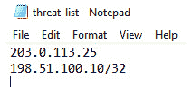
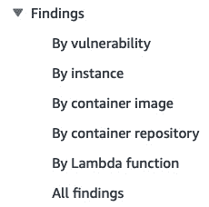

# 第八章：GuardDuty、Macie、Inspector 和 Analyzer 的合规性

定期检查账户的合规性，并在发现任何不合规时收到通知，是保持账户安全的重要步骤。在本章中，我们将了解 AWS 内的一些服务，这些服务可以帮助我们检查合规性，通过附加的智能和规则。我们将学习`Amazon GuardDuty`、`Amazon Macie`和`Amazon Inspector`，它们利用机器学习和高级算法帮助我们检查合规性。AWS Config 是另一项可以帮助合规性的服务，但我们已在*第七章*中讲解过它。

本章包括以下操作：

+   设置并使用 Amazon GuardDuty

+   聚合来自多个账户的 GuardDuty 发现结果

+   设置并使用 Amazon Macie

+   设置并使用 Amazon Inspector

+   设置并使用 AWS Security Hub

+   使用 IAM Analyzer 检查未使用的访问权限

# 技术要求

在开始本章的操作之前，我们需要确保具备以下要求和知识：

+   我们需要一个有效的 AWS 账户来完成本章中的操作。如果我们使用 AWS 组织，我们可以使用组织的管理账户，因为在本章中我们将在 AWS 组织级别配置很多内容。我将使用在*第一章*中的*多账户管理与 AWS 组织*食谱中创建的`aws-sec-cookbook-1`账户。

+   对于管理员操作，我们需要一个具有`AdministratorAccess`权限的用户，才能访问我们正在使用的 AWS 账户。

本章的代码文件可在[`github.com/PacktPublishing/AWS-Security-Cookbook-Second-Edition/tree/main/Chapter08`](https://github.com/PacktPublishing/AWS-Security-Cookbook-Second-Edition/tree/main/Chapter08) 获取。

# 设置并使用 Amazon GuardDuty

在本食谱中，我们将学习如何设置并使用 Amazon GuardDuty。GuardDuty 分析来自 CloudTrail 管理日志、VPC 流日志和 Route 53 DNS 日志等源的数据，并使用机器学习、异常检测和集成的威胁情报来发现恶意活动和未经授权的行为。请注意，如果您使用其他 DNS 解析器，如 OpenDNS 或 GoogleDNS，或设置了自己的 DNS 解析器，GuardDuty 无法访问和处理来自这些源的数据。GuardDuty 可以与 CloudWatch 和 SNS 集成，以触发警报并发送通知。GuardDuty 还可以聚合来自多个账户的数据。

## 准备工作

要成功完成这个操作，我们需要一个有效的 AWS 账户和一个用户，具体要求请参见*技术要求*部分。我们还需要一个 S3 存储桶。

## 如何操作...

如果我们第一次使用 GuardDuty，我们需要先启用 GuardDuty。让我们开始吧：

1.  在 AWS 管理控制台中转到`GuardDuty`服务。

1.  如果我们是第一次使用 GuardDuty，应该会看到如下选项。如果 GuardDuty 已经启用，请跳到*步骤 4*。

图 8.1 – 启用 GuardDuty

1.  选择**Amazon GuardDuty - 全功能**，然后点击**开始使用**。我们现在应该看到**欢迎使用 GuardDuty**屏幕；点击**启用 GuardDuty**。

1.  在`GuardDuty`仪表板的左侧边栏点击**发现**。我们可以看到这里的发现按**高**、**中**和**低**分类。由于我们刚刚启用它，初始时可能不会看到任何发现。

图 8.2 – 发现屏幕

1.  我们可以点击任何一个事件，查看该发现提供的更多信息。然后我们可以向下滚动到**操作**、**目标**和**附加信息**部分，了解更多关于该事件的信息。

接下来，我们将在 GuardDuty 中进行 IP 白名单和黑名单管理。

### 在 GuardDuty 中进行 IP 白名单和黑名单管理

我们可以按照以下方式在 GuardDuty 中进行 IP 白名单和黑名单管理：

1.  创建并上传以下两个文件，一个是信任的 IP 列表，另一个是威胁列表，并将它们上传到 S3 存储桶：

    +   `trusted-ips.txt`：这是一个文本文件，包含我们希望信任的 IP 和 CIDR 范围。每个 IP 或 CIDR 范围应该占一行。

图 8.3 – 信任的 IP 文件

+   `threat-lists.txt`：这是一个文本文件，包含我们希望添加到可疑 IP 列表中的 IP 和 CIDR 范围。每个 IP 或 CIDR 范围应该占一行。

图 8.4 – 威胁列表文件

1.  现在，返回到`GuardDuty`仪表板。在左侧边栏点击**列表**。

1.  在**信任的 IP 列表**下，点击**添加信任的 IP 列表**。

1.  在名为**添加信任的 IP 列表**的弹出屏幕中，在**列表名称**字段为我们的列表命名。对于**位置**，输入您信任的 IP 列表的 S3 URL，格式为`https://myguarddutydemo.s3.amazonaws.com/trusted-ips.txt`。对于**格式**，选择**纯文本**。然后勾选**我同意**复选框。最后，点击**添加列表**。我们现在应该可以在**信任的 IP 列表**下看到我们的列表。

1.  勾选我们列表旁边的复选框。点击**操作**下拉菜单，然后点击**激活**。我们应该看到一条成功消息，指示该列表已被激活。可能需要一些时间才能使更改生效。

1.  在**威胁 IP 列表**下，点击**添加威胁 IP 列表**。我们应该看到一个名为**添加威胁 IP 列表**的弹出屏幕。

1.  重复*步骤 3* *到* *5*，但添加我们的威胁列表，而不是信任的 IP 列表。我们应该会在**威胁 IP 列表**下看到我们的列表。

1.  为了验证信任的 IP 列表和威胁 IP 列表是否正常工作，我们可以模拟来自列表中 IP 的流量，并检查 GuardDuty 的发现结果：

    +   **白名单 IP**（**受信任的 IP**）：从我们 `trusted-ips.txt` 文件中的 IP 地址生成流量。监控 GuardDuty 发现，确保该流量未被标记为可疑或恶意。

    +   **黑名单 IP**（**威胁 IP**）：从我们威胁列表文件中的 IP 地址生成流量。检查 GuardDuty 发现，确认该流量是否被标记为可疑或恶意。

1.  审查 GuardDuty 仪表盘和发现，以确保白名单中的 IP 不会生成任何警报，并且黑名单中的 IP 已被正确标记。这样可以确认我们的列表被 GuardDuty 有效使用。

在本节中，我们通过分别将几个 IP 地址添加到受信任的 IP 列表和威胁列表中，将这些 IP 地址列入白名单和黑名单。我们将在本教程的 *工作原理…* 部分深入了解它们是如何工作的。

## 工作原理…

我们首先启用了 GuardDuty。当我们启用 GuardDuty 时，我们授予它权限以分析各种日志和数据源，如 VPC 流日志、AWS CloudTrail 管理事件日志、DNS 查询日志、AWS CloudTrail S3 数据事件日志、EKS 审计日志、Lambda 网络活动日志和 RDS 登录活动日志，以生成安全发现，正如你在执行本教程 *如何操作…* 部分的 *第 3 步* 时看到的那样。此外，GuardDuty 可以分析 **弹性块存储**（**EBS**）卷数据以检测恶意软件。当我们第一次在支持的区域启用 GuardDuty 时，我们的账户会自动加入 30 天的免费试用期，这期间可能还会默认包括一些保护计划。

默认情况下，当我们第一次启用 GuardDuty 时，所有保护计划都会激活，除了 S3 的运行时监控和恶意软件保护。这些可以通过 GuardDuty 控制台或 API 启用。GuardDuty 的恶意软件保护和运行时监控服务的使用受 Amazon GuardDuty 服务条款的约束。我们可以随时暂停或禁用 GuardDuty 或任何特定的保护计划，停止其处理和分析数据、事件和日志。然而，暂停或禁用 GuardDuty 不会影响 S3 的恶意软件保护。要停止对我们的 S3 存储桶进行恶意软件扫描，我们必须单独删除每个存储桶的恶意软件保护计划。请注意，GuardDuty 不管理或提供其分析的日志和数据的访问权限；我们可以通过各自的控制台或 API 配置这些数据源。

为了进行测试，我们从 GuardDuty 控制台生成了示例发现；GuardDuty 生成了 54 个示例事件（在我的案例中 – 这可能会有所不同，因为 GuardDuty 会在一年中增加和淘汰发现类型）。GuardDuty 事件分为三个严重性级别，从最低到最高，分别由蓝色、黄色和红色图标表示，蓝色为最轻，红色为最严重。点击发现后，我们将获得关于该发现的更多信息。

我们通过将一些 IP 地址添加到受信任 IP 和威胁列表中，分别将它们列入白名单和黑名单。GuardDuty 不会对已包含在受信任 IP 列表中的 IP 地址生成检测结果。这是为了避免误报，特别是来自公司 IP 地址的误报。然而，我们需要记住，攻击也可能来自内部。威胁列表由已知的恶意 IP 地址组成。我们提供的地址将与 AWS 基于其研究和经验所提供的地址一起使用。

我们可以将一个 IP 或 CIDR 范围添加到受信任 IP 列表和威胁列表中，格式多样，包括纯文本格式（每行一个 IP 或 CIDR），**结构化威胁信息表达式**（**STIX**）、**开放威胁交换**（**OTX**）CSV、FireEye iSIGHT 威胁情报 CSV、Proofpoint ET 情报源 CSV、AlienVault 声誉源 CSV。目前，受信任 IP 列表最多可以有 2,000 行，威胁列表最多可以有 250,000 行。

## 还有更多……

作为一项新功能，Amazon GuardDuty S3 恶意软件保护可以检测上传到我们选择的 Amazon S3 存储桶中的恶意文件。我们可以为属于我们账户的 S3 存储桶启用恶意软件保护，并使用 GuardDuty 控制台中嵌入的 Amazon CloudWatch 指标来监控恶意软件扫描状态。我们在 *图 8* *.*1* 中已经看到了这个选项。

让我们了解一些与 GuardDuty 相关的重要概念：

+   GuardDuty 通过分析 VPC 流日志来检测受损的 EC2 实例——例如，GuardDuty 可以检测实例是否被用于 **拒绝服务**（**DOS**）攻击。

+   GuardDuty 可以检测我们的实例是否被用于加密货币挖矿。它还可以检测我们的凭证是否被盗，例如通过访问恶意 IP、使用 EC2 实例配置文件访问 EC2 以外的资源，或对 AWS 资源（如 S3、EC2、RDS 等）发出异常的 API 调用。

+   GuardDuty 可以扫描并检测 EC2 实例和 EKS 基础设施中的恶意文件。它还可以帮助识别上传到 S3 存储桶中的恶意文件。

+   GuardDuty 是一项区域性服务。即使启用了多个账户并使用了多个 AWS 区域，GuardDuty 的安全检测结果仍然保留在生成底层数据的同一地区。

+   我们可以将来自不同账户的 GuardDuty 检测结果汇总到一个账户中。我们将在 *GuardDuty 中汇总多个账户的检测结果* 配方中讨论这个内容。

+   我们可以将不同账户和区域的 GuardDuty 检测结果导出到一个 Amazon S3 存储桶中，以简化所有检测结果的汇总。这是一个新功能，区别于将多个账户的检测结果汇总到一个账户中。

+   我们可以使用 CloudWatch 和 SNS 来监控 GuardDuty 的检测结果并发送通知。

+   GuardDuty 的定价是基于分析的数据量：

    +   对于 VPC 流日志和 DNS 日志分析，GuardDuty 根据分析的数据大小收费。

    +   对于 CloudTrail 事件，GuardDuty 会根据分析的事件数量收费。

+   GuardDuty 支持商家或服务提供商处理、存储和传输信用卡数据，并已通过**支付卡行业`(`PCI`) `数据安全`(`DSS`) `标准**的合规性验证。

### 设置 Amazon EventBridge 以监控来自 GuardDuty 的发现

设置 `Amazon EventBridge` 以监控来自 GuardDuty 的发现的步骤总结如下：

1.  转到管理控制台中的`EventBridge` 服务。

重要说明

EventBridge 曾被称为 Amazon CloudWatch 事件。目前，如果我们导航到 CloudWatch 并点击**事件**部分下的**规则**，我们将被重定向到 EventBridge 控制台。

1.  在左侧边栏中点击**总线**下的**规则**。

1.  点击**创建规则**以进入**创建规则**页面。

1.  在**定义规则详细信息**页面中，为我们的规则提供名称和描述。将**事件总线**的值保持为**默认**，**规则类型**为**带事件模式的规则**，然后点击**下一步**。

1.  在**构建事件模式**部分，向下滚动到**事件模式**。

1.  设置**事件源**为**AWS 事件或 EventBridge合作伙伴事件**。

1.  设置**AWS 服务**为`GuardDuty`。

1.  设置**事件类型**为**GuardDuty 发现**。

1.  点击**下一步**。在**目标**下，执行以下操作：

    1.  在**选择目标**下，从下拉菜单中选择**SNS 主题**。

    1.  选择一个主题。你可以通过参考 *第七章* 中的*创建 SNS 主题以发送电子邮件*配方来创建 SNS 主题。

1.  点击**下一步**。

1.  可选地，点击**添加新标签**，然后点击**下一步**。

1.  审核规则并点击**创建规则**。

1.  返回`GuardDuty`服务并点击左侧边栏的**设置**。

1.  向下滚动到**示例发现**并点击**生成示例发现**。稍后，检查我们为 SNS 主题配置的电子邮件地址的收件箱，应该会收到一封关于 GuardDuty 发现的邮件。

1.  要配置和修改 GuardDuty 更新 EventBridge 和 S3 的频率，我们可以转到`GuardDuty`服务，点击左侧边栏的**设置**，并在**发现导出**选项部分点击**编辑**。

1.  如果我们尚未配置导出到 S3，则会提供一个**立即配置**选项来进行配置。

## 另见

阅读更多关于 GuardDuty 的信息，请访问 [`www.cloudericks.com/blog/getting-started-with-amazon-guardduty`](https://www.cloudericks.com/blog/getting-started-with-amazon-guardduty)。

# 汇总来自多个账户的 GuardDuty 发现

在这个流程中，我们将配置 GuardDuty 以 **聚合发现结果**，将多个 AWS 账户的发现结果汇总到一个账户中。将多个账户的发现结果聚合到一个专用账户中，可以为我们提供一个查询所有账户发现结果的集中位置。我们也可以在一个地方为所有账户进行配置更改。

## 准备中

我们需要以下内容来成功完成这个流程：

+   需要两个有效的 AWS 账户。我们将它们称为聚合账户和日志账户。聚合账户将聚合来自成员账户的日志。

+   记下成员账户的 AWS 账户 ID 和电子邮件地址。如果我们使用的是 AWS Organizations 和 IAM 身份中心，正如我们在 *第一章* 中看到的，我们可以从 AWS Organizations 服务或 IAM 身份中心服务的管理账户中获取这些信息。

+   我们应该通过本章节中的 *设置和使用 Amazon GuardDuty* 流程，启用聚合账户和成员账户中的 GuardDuty。

## 如何操作...

我们可以按照以下方式配置 GuardDuty，以聚合成员账户的发现结果：

1.  进入聚合账户的管理控制台中的 `GuardDuty` 服务。

1.  从左侧边栏点击 **账户**。

1.  点击 **通过邀请添加账户**。

1.  输入成员账户的 AWS 账户 ID 和电子邮件地址，然后点击 **下一步**。

1.  我们应该能在 **账户** 页面看到我们的账户。**状态** 字段将显示 **邀请未发送**。

1.  选择我们刚刚添加的账户，点击 **操作** 下拉菜单，然后点击 **邀请**。

1.  在弹出窗口中，您可以选择性地提供消息。保持 **同时向受邀者 AWS 账户的根用户发送电子邮件通知，并在受邀者的个人健康仪表板中生成警报** 的选项未选中，然后点击 **发送邀请**。我们账户的状态应该会变为 **已邀请**。

1.  进入成员账户的管理控制台中的 `GuardDuty` 服务。

1.  如果我们现在启用 GuardDuty，启用后将跳转到 **邀请** 页面。否则，请从左侧边栏进入 **账户** 页面并点击 **接受邀请**。

1.  从左侧边栏点击 **设置**，进入 **设置** 页面并点击 **生成示例发现**。

1.  进入聚合账户中的 `GuardDuty` 仪表板，检查是否有来自我们成员账户的发现结果。

在这个流程中，我们配置了一个成员账户，将日志发送到聚合账户。聚合账户将聚合来自我们添加的成员账户以及以后添加的任何其他成员账户的日志。

## 它是如何工作的...

首先，我们登录到主账户，这个账户将聚合所有 GuardDuty 发现结果。然后，我们邀请了一个成员账户。我们已经记下了该账户的账户 ID，并且应该知道该账户的根邮箱地址。接着，我们登录到成员账户并接受邀请。之后，我们从成员账户生成了示例发现结果。最后，我们重新登录到主账户并验证，发现成员账户的发现结果已经出现在主账户中。

## 还有更多...

GuardDuty 会保留生成的发现结果 90 天。它将活动发现结果导出到 Amazon EventBridge（EventBridge）。此外，我们还可以选择将这些发现结果导出到 Amazon S3 存储桶。这使我们能够跟踪账户中潜在可疑活动的历史数据，并评估推荐的修复步骤的有效性。我们可以按照以下步骤进行：

1.  按如下方式配置 KMS 密钥：

    1.  **创建或选择一个 KMS 密钥**：选择现有的 KMS 密钥或创建一个新的密钥。

    1.  **将策略附加到 KMS 密钥**：将策略附加到 KMS 密钥，以授予 GuardDuty 访问权限。请参阅代码文件中的`guardduty_kms_policy.json`文件，了解示例策略内容。

1.  按如下方式配置 S3 存储桶：

    1.  **选择一个 S3 存储桶**：可以创建一个新的存储桶或使用现有的存储桶。

    1.  **更新存储桶策略**：更新存储桶策略以允许 GuardDuty 上传。请参阅代码文件中的`guardduty_s3_bucket_policy.json`文件，了解示例策略内容。

1.  在 GuardDuty 控制台中按如下方式配置发现导出：

    1.  进入 GuardDuty 仪表盘。

    1.  通过点击左侧边栏的**设置**选项进入**设置**。

    1.  按如下方式配置**导出选项**：

        1.  向下滚动到**发现导出选项**部分。

        1.  点击**立即配置**。

        1.  输入 S3 存储桶和 KMS 密钥的 ARN。提供将导出发现结果的 S3 存储桶 ARN。提供用于加密发现结果的 KMS 密钥 ARN。

        1.  点击**保存**以应用设置。

通过执行上述步骤，我们可以配置 AWS GuardDuty 将其发现结果导出到 S3 存储桶，确保跨账户和区域聚合并保护数据。请确保根据需要使用实际值更新示例策略文件。

## 另见

在 GuardDuty 中阅读有关导出发现功能的更多信息：[`docs.aws.amazon.com/guardduty/latest/ug/guardduty_exportfindings.html`](https://docs.aws.amazon.com/guardduty/latest/ug/guardduty_exportfindings.html)。

# 设置和使用 Amazon Macie

在本文档中，我们将学习如何设置和使用 Amazon Macie。Macie 是 AWS 中基于机器学习的服务，主要用于发现、分类和保护敏感数据。Macie 可以分析 S3 存储桶中的数据，以查找诸如凭据、财务信息、**受保护健康信息**（**PHI**）、**个人可识别信息**（**PII**）、**API 密钥**、源代码等敏感信息，并将其分类为不同的安全级别。Macie 可与 CloudWatch 配合使用来发出警报并发送通知。Macie 还可以分析来自 CloudTrail 的 API 调用以检测异常。

## 准备工作

我们需要以下内容才能成功完成此文档：

+   我们需要一个有效的 AWS 帐户和用户，如*技术要求*部分所述。

+   我们需要一个 S3 存储桶。存储桶应该位于我们配置 Macie 的同一区域中。我已在`us-east-1`区域创建了一个存储桶。

+   我们的 S3 存储桶应包含以下带有假敏感数据的文件，并提供与章节相关的代码文件：

    +   `credit-cards-data.txt`带有样本信用卡数据

    +   `custom-data-license-plates.txt`带有样本车牌

## 如何做…

我们可以按照以下步骤配置 Macie 来发现和分类 S3 存储桶中的风险：

1.  转到 AWS 管理控制台中的`Amazon Macie`服务。

重要提示

如果我们是第一次使用 Macie，应该会看到一个带有**开始**按钮的页面。单击**开始**。确保所选的区域与我们的存储桶相同，查看服务角色权限，并启用 Macie 开始 30 天的试用期。然后我们将进入**摘要**页面。自动敏感数据发现的 30 天免费试用不包括敏感数据发现作业。如果您启动并执行作业，则将根据作业分析的未压缩数据总量收取费用。

1.  在 Macie 仪表板的左侧边栏中单击**作业**。

重要提示

如果我们尚未为敏感数据发现结果配置存储库，将收到警告。我们需要在启用 Macie 后的 30 天内设置此存储库。请注意，Macie 仅存储我们的敏感数据发现结果和发现结果，有效期为 90 天。我们可以立即单击**配置**以配置现有或新的存储桶作为敏感数据发现结果的存储库，或者我们可以稍后（在 30 天内）使用**设置**左侧边栏下的**发现结果**菜单项进行配置。

1.  单击**创建作业**以启动作业创建过程。

1.  在**选择 S3 存储桶**页面，选择**选择特定的存储桶**以选择要在作业中包含的存储桶。我们将选择在本文档的*准备工作*部分创建的存储桶。

1.  滚动到底部并单击**下一步**。

1.  对于**审查 S3 存储桶**页面，请审查和验证我们的存储桶选择，然后选择**下一步**。

1.  对于**精细化范围**页面，选择**一次性作业**，为**采样深度**提供`100%`的值，然后点击**下一步**。

重要提示

不选择**一次性作业**，我们可以选择**定期作业**选项，并将**更新频率**设置为**每日**、**每周**或**每月**，但让我们为这个示例选择**一次性作业**。在**高级设置**下，我们可以指定包含或排除某些对象的标准以进行作业分析。如果没有提供标准，作业将分析存储桶中的所有对象。目前，我们应该将这些设置保持为默认设置。

1.  对于**管理的数据标识符选项**，选择**推荐**。

图 8.5 – 管理的数据标识符选项

1.  向下滚动并点击**下一步**。

1.  对于**自定义数据标识符**，不添加任何内容，然后点击**下一步**。

1.  对于**选择允许列表**，不添加任何内容，然后点击**下一步**。

1.  在**输入常规设置**窗格中，在**作业名称**下输入`AWS Sec CB Demo`。可选地，提供作业描述并根据需要添加任何标签。点击**下一步**。

1.  在**审阅和创建**页面上，仔细检查配置设置以确保其准确性，并查看作业的预估总成本。点击**提交**。

1.  如果我们转到**作业**页面，我们的作业状态将为**活动（运行中）**。等到状态变为**完成**。可能需要 10 到 15 分钟。

1.  从列表中点击超链接作业名称，然后从**显示结果**下拉菜单中，点击**显示发现**以查看发现情况。点击发现以了解更多信息。

图 8.6 – Macie 发现选项卡

在本节中，我们看到如何使用 Amazon Macie 查找包含银行账号或信用卡号等财务信息的 S3 对象。接下来，我们将看到如何使用自定义的 Macie 数据标识符。

### 添加自定义的 Macie 数据标识符

我们可以按照以下步骤配置和使用自定义的 Macie 数据标识符：

1.  导航回 AWS 管理控制台中的 Macie 服务。

1.  点击左侧边栏中的**自定义数据标识符**。

1.  点击**创建**。

1.  在**名称**下提供`UKLicensePlates`。对于**描述 - 可选**，输入**英国车牌**，并将**正则表达式**设置为以下内容：`([0-9][a-zA-Z][a-zA-Z]-?[0-9][a-zA-Z][a-zA-Z])|([a-zA-Z][a-zA-Z][a-zA-Z]-?[0-9][0-9][0-9])|([a-zA-Z][a-zA-Z]-?[0-9][0-9]-?[a-zA-Z][a-zA-Z])|([0-9][0-9][0-9]-?[a-zA-Z][a-zA-Z][a-zA-Z])|([0-9][0-9][0-9]-?[0-9][a-zA-Z][a-zA-Z])`

1.  将其他所有内容保持默认，然后点击**提交**。

1.  通过按照上一节中的步骤创建新作业；但是，在**自定义数据标识符**页面上，选择在本节中创建的`UKLicensePlates`。

图 8.7 – 选择自定义数据标识符

1.  一旦任务的状态显示为**完成**，在**任务**页面，从**显示结果**下拉菜单中，点击**显示发现**。我们应该能够看到一个新的发现，对应我们的自定义标识符任务。

## 它是如何工作的...

Macie 可以用于分析 S3 存储桶和 CloudTrail 日志。在本配方中，我们探索了 Amazon Macie，这是一项基于机器学习的 AWS 服务，帮助发现、分类和保护存储在 S3 存储桶中的敏感数据。我们设置了 Macie，启动了一个发现任务来扫描特定的 S3 存储桶，并观察它如何成功识别预定义的敏感数据类型，例如信用卡号码。接着，我们通过使用正则表达式创建了一个名为`UKLicensePlates`的自定义数据标识符，以识别存储在 S3 存储桶中的特定格式。这个自定义标识符被加入到新的发现任务中。任务完成后，我们确认 Macie 成功识别了六个车牌号码，展示了它在发现预定义和用户定义的敏感数据类型方面的能力。

## 还有更多...

让我们了解一些与 Macie 相关的重要概念：

+   Macie 可以在企业中用于多种用途。Macie 可以检测是否有敏感数据或源代码从异常的 IP 地址下载。Macie 可以检测哪些用户导致了最严重的高风险事件。Macie 可以按位置对事件进行分组，帮助我们检测来自未知位置的活动。Macie 还可以提供我们账户中 CloudTrail 事件的高层次分析。如果我们看到任何意外的调用，可以深入调查以找出根本原因。

+   Macie 和 GuardDuty 在分析 API 调用方面有功能重叠。与 GuardDuty 不同，Macie 的重点更多在于访问模式，例如上传或下载的数据量是否超过正常情况。一般来说，最好将 Macie 与 GuardDuty 结合使用，以获得更好的保护。

+   Macie 可以与 CloudWatch 一起使用，用于触发警报和发送通知。

+   Macie 可以汇总来自多个账户的数据。在设置好所需权限后，我们可以从**集成**页面的**账户**选项卡添加其他账户。

+   Macie 目前对 S3 内容分类和 CloudTrail 事件处理收费。

+   Macie 是一个区域性服务。Macie 必须在每个区域逐个启用，并帮助你查看该区域内所有账户的发现。

配置 Macie 警报通知与 Amazon EventBridge 和 SNS 的步骤可以总结如下：

1.  进入控制台中的`Amazon EventBridge`服务。

1.  从左侧边栏中点击**总线**下的**规则**。

1.  点击**创建规则**进入**创建规则**页面。

1.  在**定义规则详细信息**页面，为我们的规则提供名称和描述。将**事件总线**和**规则类型**保持为**带有事件模式的规则**，然后点击**下一步**。

1.  在**构建事件模式**部分，向下滚动到**事件模式**。

1.  设置**事件来源**为**AWS 服务**。

1.  设置**AWS 服务**为`Macie`。

1.  设置**事件类型**为**Macie 发现**。

1.  点击**下一步**。

1.  在**目标**部分，选择**选择目标**，从下拉菜单中选择**SNS 主题**。

1.  选择一个**主题**。你可以通过按照*第七章*中的*创建 SNS 主题以发送电子邮件*流程来创建 SNS 主题。

1.  点击**下一步**。

1.  可选地，点击**添加新标签**，然后点击**下一步**。

1.  审查规则并点击**创建规则**。

1.  返回到**Macie 服务**并按照上一部分中的步骤为我们的 S3 存储桶创建任务。

1.  一段时间后，检查我们为 SNS 主题配置的电子邮件收件箱，我们应该会收到关于 Macie 发现结果的电子邮件。

默认情况下，Macie 会自动将其发现结果发送到 Amazon EventBridge，进行进一步处理并与其他 AWS 服务集成。你可以根据以下步骤配置 Macie 将发现结果发送到额外的目标，并定义更新发送到每个目标的频率：

1.  进入 Macie 控制台，点击左侧边栏上的**设置**。

1.  向下滚动到**发现结果发布**，更新策略发现的频率。

## 另请参见

了解更多关于 Amazon Macie 的信息，请访问 [`www.cloudericks.com/blog/getting-started-with-amazon-macie`](https://www.cloudericks.com/blog/getting-started-with-amazon-macie)。

# 设置和使用 Amazon Inspector

在本流程中，我们将学习如何设置和使用 Amazon Inspector。Inspector 是一项执行自动化**安全评估**的服务，用于发现部署在 AWS 上的应用程序中的漏洞或偏离标准实践的情况。我们可以直接在控制台中查看 Inspector 的发现结果，或者从 Inspector 提供的详细评估报告中查看。

## 准备工作

我们需要以下内容才能成功完成这个流程：

+   我们需要一个有效的 AWS 账户和一个用户，如*技术要求*部分所述。

+   还需要在默认 VPC 中，一个位于 VPC 公共子网的 EC2 实例。对于`Amazon Machine Image (AMI)`，选择`Amazon Linux 2023 AMI`。对于**实例类型**，选择`t2.micro`。对于**密钥对（登录）**，选择一个已有的，或者创建一个新的。 在**网络设置**中，确保**自动分配公共 IP**的值为**启用**，并选择**创建安全组**，同时将**允许 SSH 流量来自**的值设置为**任何地方**。

## 如何执行...

我们可以按如下方式设置 Inspector：

1.  在控制台中进入`Amazon Inspector`服务。

1.  如果是第一次登录，我们应该看到一个**开始使用**页面。目前，对于首次使用 Inspector 的账户，提供 15 天的免费试用。点击 **开始使用**。在 **激活 Inspector** 页面上，我们应该看到一条如下的消息：**当您激活 Inspector 时，您授权 Inspector 获得权限，代表您在 AWS 中发现、分类并保护敏感数据，并生成有关潜在安全问题的发现报告。这将仅为您的账户激活 Inspector**。点击 **激活 Inspector** 并等待完全激活。在左侧边栏中，我们应该能看到如下选项：

图 8.8 – Amazon Inspector 的左侧边栏

如果我们展开 **发现**，我们可以看到选项，如 **按漏洞**、**按实例**、**按容器镜像**、**按容器仓库**、**按 Lambda 函数** 和 **所有发现**。我们还应该会看到类似以下的消息，但由于 Amazon 经常更新其用户界面和消息，具体内容可能会有所不同。

图 8.9 – 启动 Amazon Inspector 后的消息

1.  等待一段时间后，点击左侧边栏中的 **账户管理**，进入 **实例** 选项卡，验证我们的实例状态是否为 **正在积极监控**。**监控方式** 栏将显示 **无代理**，因为我们使用的是基于 EBS 的 EC2 实例。

1.  在左侧边栏中，展开 **发现**，然后点击 **所有发现**。

图 8.10 – Inspector 的发现菜单

由于我们使用的是刚刚启动的 EC2 实例，并且是 Amazon Linux，我们不会看到太多发现，但我们应该会看到一个 **严重性** 为 **中等** 的发现，内容为 **端口 22 可通过互联网网关访问 –TCP**。

我们在本节中快速探索了如何查看 Inspector 发现。接下来，我们将在本节的 *更多内容...* 部分中查看 Inspector 仪表板中提供的更多选项。

## 它是如何工作的...

Amazon Inspector 对 EC2 的扫描会从实例中提取元数据，并将其与安全建议进行比较，以生成发现，重点关注软件包漏洞和网络可达性问题。网络可达性扫描每 24 小时进行一次，而软件包漏洞扫描的频率则根据扫描方式有所不同。Amazon Inspector 根据账户的扫描模式设置，采用基于代理和无代理的扫描方式来收集软件清单并检测漏洞。

基于代理的扫描使用 SSM 代理从符合条件的实例中持续收集软件清单。这些扫描在 Linux 实例中识别操作系统和应用程序编程语言包的漏洞。要执行基于代理的扫描，实例必须具有受支持的操作系统，由 SSM 管理，并且不被特定标签排除。Amazon Inspector 使用各种 SSM 关联和插件定期收集清单数据并更新漏洞发现。此外，无代理扫描作为混合扫描模式的一部分，利用 EBS 快照从实例中收集清单数据，扫描操作系统和应用程序包漏洞。

Amazon Inspector 提供两种扫描模式：基于代理的扫描和混合扫描。基于代理的模式为 SSM 管理的实例提供持续扫描，而混合扫描结合了两种方法，对于 SSM 管理的实例使用基于代理的扫描，对于符合条件的 EBS 支持的实例使用无代理扫描。用户可以配置扫描模式，管理排除项，并确保适当设置 SSM 代理以优化漏洞检测，并保持对其 EC2 实例的有效安全监控。

## 还有更多...

我们在这个示例中探讨了 EC2 实例如何进行扫描。Amazon Inspector 还支持对以下资源进行扫描：

+   **Amazon 弹性容器注册表**（**ECR**）：Amazon Inspector 扫描存储在 Amazon ECR 中的容器映像以查找漏洞。这确保您环境中使用的容器映像是安全的且没有已知问题。

+   `AWS Lambda`：Amazon Inspector 扫描 AWS Lambda 函数以查找漏洞，检查代码和依赖项以确保无服务器应用程序保持安全。

在这个示例中，我们在左侧边栏中探索了**发现**选项以查看发现。左侧边栏还提供了其他几个选项，包括以下内容：

+   **导出 SBOMs**：**软件材料清单**（**SBOM**）提供了系统内软件组件及其关系的详细列表。Amazon Inspector 可以生成和导出 SBOMs，这有助于理解和管理软件依赖关系，确保符合安全政策，并识别潜在漏洞。这有助于组织维护其软件组件的全面清单。

+   **抑制规则**：Amazon Inspector 中的抑制规则允许用户通过抑制特定类型或来源的发现来管理发现。这有助于减少噪音并专注于关键漏洞。用户可以根据漏洞 ID、资源标签或资源类型等标准创建抑制规则，以确保安全报告中只突出显示相关的发现。

+   **按需扫描**：按需扫描允许用户根据需要手动启动扫描，以检测 EC2 实例的漏洞或网络可达性问题。这在部署新软件或进行重大基础设施变更后特别有用。在 **按需扫描** 菜单下，使用 **CIS 扫描** 选项，我们可以评估 EC2 实例是否符合 **互联网安全中心**（**CIS**）基准，CIS 基准是保护 IT 系统和数据的最佳实践。这些扫描帮助组织遵循安全标准，并通过识别和解决不符合标准的配置，提升安全防护水平。

### 关于 Inspector Classic 的说明

Inspector 仪表板当前有一个名为 **切换到 Inspector Classic** 的侧边栏链接。Inspector Classic 是 Amazon Inspector 的原始版本，旨在帮助 AWS 用户通过检查漏洞和合规性问题来自动化应用程序的安全评估。尽管 Inspector Classic 最初至关重要，但它已在很大程度上被新的 Amazon Inspector 所取代，后者提供了增强的功能，并对安全评估提供了更全面、简化的方法。

Inspector Classic 仍然可供已有依赖关系的用户使用，但建议过渡到新的 Amazon Inspector，以便获取最新功能、提高性能和增强的安全能力。AWS 继续支持 Inspector Classic 以保持向后兼容性，但新用户和评估应该使用更新版的 Amazon Inspector 以实现最佳的安全管理。对于有兴趣使用 Inspector Classic 的用户，请参阅本书的第一版或在 *另见* *部分* 提供的链接。

## 另见

+   你可以阅读更多关于 Amazon Inspector 的内容，访问 [`www.cloudericks.com/blog/a-deep-dive-into-amazon-inspector-capabilities-and-integrations`](https://www.cloudericks.com/blog/a-deep-dive-into-amazon-inspector-capabilities-and-integrations)。

+   阅读有关 Inspector Classic 的内容，请访问 [`www.cloudericks.com/blog/understanding-inspector-classic-and-transitioning-to-the-new-amazon-inspector`](https://www.cloudericks.com/blog/understanding-inspector-classic-and-transitioning-to-the-new-amazon-inspector)。

# 设置和使用 AWS Security Hub

在本教程中，我们将探讨如何设置和使用 AWS Security Hub。Security Hub 聚合了来自 Config、GuardDuty、Macie 和 Inspector 等服务的发现，提供了一个集中平台来管理安全警报和自动化合规性检查。Security Hub 可以使用 CIS AWS 基础基准进行自动化合规性检查，在启用 Security Hub 时默认启用此功能。

## 准备工作

我们需要以下内容才能成功完成本教程：

+   如 *技术* *要求* 部分所述，提供一个有效的 AWS 账户和用户。

+   按照 *设置和使用 AWS Config* 教程中的说明，设置 AWS Config 并启用记录功能，详见 *第七章*。

+   设置以下一个或多个服务：Amazon GuardDuty、Amazon Macie 和 Amazon Inspector，按照*第七章* 和 *第八章* 中的相应方法进行操作。

## 如何操作…

我们可以按照以下方式在一个区域内设置 Security Hub：

1.  进入 AWS 管理控制台中的`Security Hub`服务。

1.  如果我们是第一次使用 Security Hub，应该会看到一个**开始使用 Security Hub**的部分。点击**前往 Security Hub**。在**启用 AWS Config**部分，我们应该看到一条消息，提示需要启用 AWS Config 并进行记录，可能还会提供相应步骤。我假设你已经按照*准备工作*部分中的内容完成了这些步骤。

图 8.11 – 启用 Security Hub 时的启用 AWS Config 消息

1.  在**安全标准**部分，从可用选项中选择我们要启用的安全标准，如*图 8.12*所示。在**委托管理员**部分，我们可以添加一个委托管理员账户来管理该组织的 Security Hub。最后，点击**启用Security Hub**。

图 8.12 – 在启用 Security Hub 时设置安全标准

我们应该看到一个包含**摘要**、**安全标准**、**见解**等部分的界面。发现的更新可能需要一些时间。所以，在进行后续步骤之前，请稍等片刻。

1.  点击左侧边栏中的**安全标准**。如果我们是从*步骤 2*继续操作，针对`AWS Foundational Security Best Practices v1.0.0`和`CIS AWS Foundations Benchmark v1.2.0`标准，我们应该能看到**查看结果**和**禁用标准**选项。对于未启用的其他标准，我们应该看到**启用标准**选项。如果我们没有从*步骤 2*继续操作，我们应该使用**启用标准**选项启用`AWS Foundational Security Best Practices v1.0.0`和`CIS AWS Foundations Benchmark v1.2.0`标准，并稍等片刻，直到看到每个标准的**安全得分**。

1.  一旦`AWS Foundational Security Best Practices v1.0.0`的**安全得分**可用，点击**查看结果**。我们应该看到**安全得分**和**失败的控制项**值，如下所示，但具体细节可能因账户而异。

图 8.13 – 查看安全标准的结果

1.  点击左侧边栏中的**见解**。我们应该看到一个现有见解的列表，这些是已保存的过滤器，显示相关的发现。我们可以选择其中一个现有的见解，或通过点击**创建见解**按钮来创建一个新的见解。

图 8.14 – 见解

1.  从左侧边栏点击**发现**，进入**发现**页面。在这里，您可以查看来自各种服务集成的发现列表。您可以根据多个标准过滤此列表，例如生成发现的服务或发现的严重性。

图 8.15 – 发现

1.  从左侧边栏点击**集成**，进入**集成**页面，在这里我们可以看到当前启用的集成列表以及尚未启用的集成。对于已启用的集成，我们可以在**集成**页面禁用它们。

图 8.16 – 集成

1.  从左侧边栏点击**使用情况**，查看估算的使用情况和定价，包括**试用期间的使用情况**。

1.  从左侧边栏进入**配置**。

1.  如果未启用中央配置，我们将看到一个链接**开始中央配置**，并显示以下警告信息：**本地配置仅限于新帐户，您对组织的安全设置的访问有限。如需更多配置选项，请切换到中央配置。切换后，配置策略将替代新组织帐户的有限配置设置。我们建议使用中央配置进行**帐户管理**。

1.  在**配置**页面的**帐户**部分，我们可以添加额外的成员帐户，与此帐户共享其发现。邀请将发送给成员帐户，他们必须接受邀请。

1.  从左侧边栏点击**自定义操作**，将选定的洞察和发现发送到 Amazon EventBridge。

1.  从左侧边栏点击**自动化**，根据我们定义的标准更新安全中心发现。

1.  从左侧边栏点击**地区**，查看多个地区的发现。要开始汇总发现，点击**配置发现汇总**按钮，设置汇总地区，然后将其他地区链接到该地区，以便统一查看安全发现。

    我们还可以通过点击左侧边栏的**常规**，然后点击**禁用 AWS 安全中心**来禁用安全中心。但是，如果适用的费用不是限制因素，始终建议为所有地区启用安全中心。

## 它是如何工作的……

AWS 安全中心作为 AWS 环境中安全监控和管理的集中平台。要开始使用，请在 AWS 管理控制台中激活该服务。启用后，配置安全中心以从多个 AWS 服务（如 Amazon GuardDuty、AWS Inspector 和 Amazon Macie）收集发现，以及第三方工具和自定义集成。

该服务为安全问题提供持续监控，在统一的仪表板上收集和组织发现。它根据问题的严重性和影响优先排序，帮助用户首先解决最关键的问题。在 Security Hub 控制台中，用户可以调查这些发现，以深入了解潜在的安全威胁和漏洞。此外，Security Hub 还通过与 AWS Lambda 集成支持自动响应，允许用户对检测到的安全问题自动执行修复措施。

总结来说，AWS Security Hub 提供了一个全面的解决方案，用于管理安全态势、合规性和事件响应，从而简化了安全操作并增强了 AWS 环境中的整体保护。

## 还有更多……

让我们快速浏览一下与 Security Hub 及其相关服务相关的一些重要概念：

+   Security Hub 是一个区域性服务。如果成本不是问题，建议在所有区域启用它。

+   Security Hub 可以与第三方安全工具集成，如 Alert Logic、Armor、Atlassian Opsgenie 等。

+   我们可以从 **发现** 页面归档安全发现，以便旧的发现不会出现在页面上。

+   CIS 为不同的服务器、应用程序和云提供商提供安全标准。例如，它们为 AWS 安全提供了一套特定的安全标准。

+   AWS 的 CIS 基准可以分为四类：身份与访问管理、日志记录、监控和网络。

+   IAM 访问分析器使用基于逻辑的推理分析我们 AWS 环境中的基于资源的策略，以告知我们账户中的哪些资源与外部主体共享。

+   AWS 防火墙管理器可用于跨账户和应用程序管理防火墙规则。

学习和理解 AWS 的 CIS 安全基准控制，可以在处理 AWS 基础设施时为我们提供更强的安全感。这些控制措施还可以帮助我们在工作中做出更好的决策，甚至在考试时也能有所帮助。

## 另见

+   了解更多关于 AWS Security Hub 的信息，请访问 [`www.cloudericks.com/blog/getting-started-with-aws-security-hub`](https://www.cloudericks.com/blog/getting-started-with-aws-security-hub)。

+   你可以在 [`docs.aws.amazon.com/securityhub/latest/userguide/securityhub-standards.html`](https://docs.aws.amazon.com/securityhub/latest/userguide/securityhub-standards.html) 查找 Security Hub 支持的 CIS 安全标准列表。

# 使用 IAM 访问分析器检查未使用的访问权限

在本示例中，我们将展示如何利用 IAM 访问分析器来识别和管理环境中未使用的 IAM 资源。通过重点检测未使用的角色、访问密钥和其他关键组件，确保遵循安全最佳实践。通过配置分析器扫描未使用的资源，并解释其生成的结果，我们可以获得潜在安全风险的有价值见解。通过处理任何识别出的未使用资源，我们降低了未授权访问或滥用的风险，从而增强了 IAM 环境的整体安全性。

## 准备工作

成功完成此示例所需的条件：

+   一个有效的 AWS 账户和一个用户，如*技术要求*部分所述。

+   我们需要在 AWS 账户中有一些 IAM 用户和角色；可以通过参考*第一章* *和* *第二章*中的示例来创建这些。

## 如何操作...

我们可以按如下方式使用 IAM 分析器检查未使用的访问权限：

1.  导航到控制台中的`IAM`服务。

1.  在**访问报告**下，点击**访问分析器**。

1.  点击**创建分析器**。

1.  在**分析**部分，我们可以看到**外部访问分析**和**未使用的访问分析**选项。选择**未使用的访问分析**选项。

图 8.17 – 配置结果类型

1.  在**分析器详情**部分，保持自动生成的**名称**不变。对于**信任区**，选择**当前组织**。

1.  向下滚动并点击**创建分析器**。等待一段时间，直到结果被加载出来。

1.  在左侧边栏点击**访问分析器**，以查看包含结果摘要的**结果概览**页面。

1.  点击左侧边栏中的**未使用的访问权限**。我们应该看到与未使用访问权限相关的结果。

## 它是如何工作的...

使用 IAM 分析器检查未使用的访问权限，方法是将其作为安全扫描器来检查 IAM 资源。它分析整个环境中的角色、访问密钥和权限。通过检查这些资源最近是否被使用，它能够识别在特定期间内未被激活的元素。这可能表明不必要的访问权限或被遗忘的配置，可能会导致安全漏洞。通过这些见解，你可以加强访问控制并改善 IAM 环境的安全性。

## 还有更多内容...

尽管识别未使用的资源是一项有价值的功能，但 IAM 分析器还提供了更广泛的功能，帮助增强你的 IAM 安全性。

+   **验证权限**：IAM 分析器可以根据最佳实践验证策略，并识别可能授予无意访问权限的过度宽松设置。

+   **监控外部共享**：跟踪与 AWS 账户外部实体共享的资源。这有助于识别与无意访问权限相关的潜在安全风险，可能是外部用户或应用程序的权限。

+   **自定义策略检查**：定义你自己的安全标准，并利用 IAM 分析器根据这些自定义检查验证 IAM 策略。这使你能够在组织内强制执行特定的安全要求。

+   **自动化策略生成**：通过利用 IAM 分析器根据 CloudTrail 中的访问活动日志生成 IAM 策略，简化策略创建过程。这有助于确保策略反映实际的使用模式。

+   **持续监控**：IAM 分析器不是一次性的扫描工具；它提供对你的 IAM 环境的持续监控。这允许你在 IAM 配置变化时主动识别潜在的安全问题。

设置 Amazon EventBridge 来监控我们从 Access Analyzer 获取的结果的步骤总结如下：

1.  转到控制台中的`Amazon EventBridge`服务。

1.  在左侧边栏的**总线**下点击**规则**。

1.  点击**创建规则**进入**创建规则**页面。

1.  在**定义规则详细信息**页面，提供规则的名称和描述。保持**事件总线**为**默认**，并将**规则类型**设置为**带有事件模式的规则**，然后点击**下一步**。

1.  在**构建事件模式**部分，向下滚动至**事件模式**。

1.  将**事件源**设置为**AWS 服务**。

1.  将**AWS 服务**设置为`Access Analyzer`。

1.  将**事件类型**设置为**访问分析器查找**。

1.  将**事件类型规格 1**设置为**按 ARN 的任何资源**。

1.  点击**下一步**。在**目标**下，从**选择目标**的下拉菜单中选择**SNS 主题**。

1.  选择一个主题。你可以通过参考**第七章**中的*创建 SNS 主题以发送电子邮件*食谱来创建 SNS 主题。

1.  点击**下一步**。

1.  可选，点击**添加新标签**，然后点击**下一步**。

1.  审核规则后点击**创建规则**。

## 另见

阅读有关确保 IAM 安全的必要工具，详情请见[`www.cloudericks.com/blog/essential-tools-to-secure-iam`](https://www.cloudericks.com/blog/essential-tools-to-secure-iam)。
