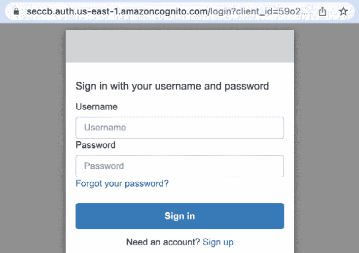
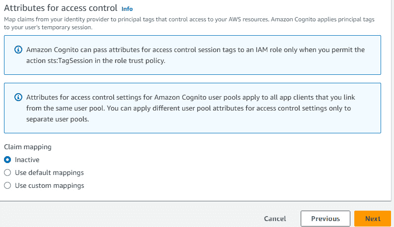
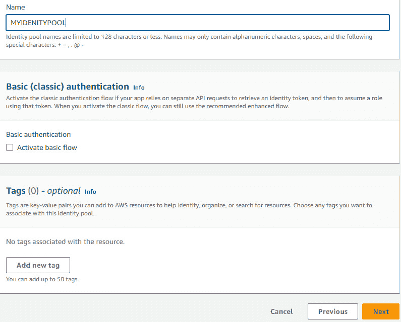
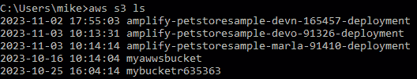
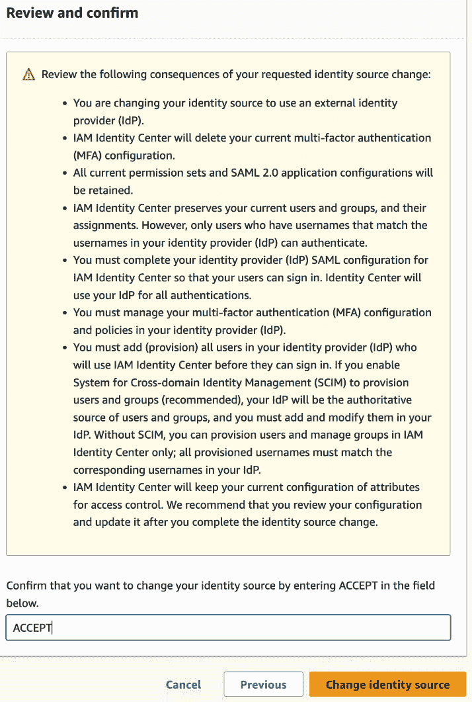

# 第九章：高级身份与目录管理

在前几章中，我们已经为**IAM 身份中心**（前称**AWS SSO**）、IAM 用户、IAM 组、IAM 角色和 IAM 策略在身份与访问管理方面打下了基础，现在我们将深入探讨用户身份和目录管理的更高级内容。

我们将首先深入探讨在 AWS 中使用`Amazon Cognito`进行无服务器身份即服务的用户管理策略。本章将重点介绍 Cognito 的两个关键功能：**用户池**和**身份池**。用户池充当强大且可扩展的目录，处理用户注册、身份验证和与我们的应用程序集成，并具备**多因素身份验证**（**MFA**）和**联合身份**登录等功能。相反，身份池为经过身份验证的用户分配临时的 AWS 凭证，允许他们使用 AWS 服务，如 Amazon S3、Amazon DynamoDB 和 AWS Lambda。

接下来，我们将深入探讨 AWS 中的**目录服务**解决方案，包括 AWS Simple AD、AWS Active Directory 和 AD Connect。我们还将研究`Microsoft Entra ID`（之前称为**Azure Active Directory**）与 IAM 身份中心的集成，这使得 Entra ID 用户能够轻松访问 AWS 资源。

重要说明

本章的教程可能需要一些额外的知识，包括熟悉 Microsoft 产品（如 Active Directory 和 Microsoft Entra ID），以及本书尚未覆盖的 AWS 服务和功能。本章的教程并非理解和实践本书后续教程的必需内容。因此，如果你在阅读本书时缺乏对所需产品或服务的了解，并且目前不需要这些解决方案，可以仅阅读教程步骤以了解内容，直到需要时再进行实践，并确保你具备所需的先决知识。你也可以通过教程中提供的链接，学习到足够的所需产品和服务知识。

本章包含以下教程：

+   使用 Amazon Cognito 用户池

+   使用身份池访问 AWS 资源

+   使用 AWS Simple AD 创建轻量级目录解决方案

+   在 AWS 中使用 Microsoft Entra ID 作为身份提供者

## 技术要求

在开始本章的教程之前，我们需要确保具备以下要求和知识：

+   我们需要一个有效的 AWS 账户来完成本章中的食谱。如果我们使用 AWS Organizations，可以使用组织的管理账户，因为本章中将会在 AWS 组织层级配置许多内容。我将使用在*第一章*的*使用 AWS Organizations 进行多账户管理*食谱中创建的`aws-sec-cookbook-1`账户。

+   对于管理操作，我们需要具有`AdministratorAccess`权限的用户，以访问我们正在使用的 AWS 账户。

本书的代码文件可在 [`github.com/PacktPublishing/AWS-Security-Cookbook-Second-Edition`](https://github.com/PacktPublishing/AWS-Security-Cookbook-Second-Edition) 获得。本章的代码文件可在 [`github.com/PacktPublishing/AWS-Security-Cookbook-Second-Edition/tree/main/Chapter09`](https://github.com/PacktPublishing/AWS-Security-Cookbook-Second-Edition/tree/main/Chapter09) 获得。

# 与 Amazon Cognito 用户池合作

Amazon Cognito 主要用于两种使用场景：通过其用户池功能为我们的应用程序提供安全的用户身份管理，以及通过其身份池功能利用临时凭证提供对 AWS 资源的安全访问。在本食谱中，我们将通过从 AWS 管理控制台创建用户池并在其中创建用户来探索 Amazon Cognito 的用户池功能。

## 准备就绪

若要完成此食谱，我们需要 Amazon `Simple Notification Service`（**SNS**）以便在我们计划使用 SMS 验证时发送 SMS。

重要提示

当我们开始使用 Amazon SNS 发送 SMS 消息时，我们的 AWS 账户会在 SMS 沙箱中操作。此沙箱作为一个安全空间，允许我们测试 Amazon SNS 功能而不会影响我们的发送者声誉。在沙箱中，我们只能向经过验证的目标电话号码发送 SMS 消息。

如果我们的 AWS 账户位于 SMS 沙箱中，并且我们希望在此食谱中使用 SMS 验证，可以按照以下步骤将电话号码添加到**沙箱目标电话号码**中：

1.  登录到 AWS 管理控制台并导航到 Amazon SNS 服务。

1.  点击左侧边栏中的**文本消息（SMS）**。

1.  在**账户信息**下确认该账户位于 SMS 沙箱中。

1.  在**沙箱目标电话号码**部分，点击**添加电话号码**。

1.  在**添加电话号码**页面，输入电话号码，并选择正确的国家代码。同时，选择验证消息的语言，即将要发送的验证消息语言。

1.  点击**添加电话号码**。这将带我们进入**验证电话号码**页面。

1.  在**验证电话号码**页面，输入收到的验证码并点击**验证电话号码**。

如果成功验证，手机号码现在应该会显示在**短信（SMS）**页面的**沙箱目标电话号码**部分，并且**验证状态**应显示为**已验证**。

我们可以通过本食谱中*另见*部分提供的链接进一步探索 Amazon SNS。假设我们已经按照本节中的讨论设置好环境，现在可以开始创建 Cognito 用户池。

## 如何操作...

我们可以通过以下方式在 AWS 管理控制台中创建一个 Cognito 用户池：

1.  登录到 AWS 账户管理控制台并导航到 Cognito 服务。我们应该看到根据业务案例开始的选项。默认选项是**将用户目录添加到您的应用程序**，这是通过用户池完成的。


图 9.1 – 创建用户池业务案例

下拉菜单还包括**授予访问 AWS 服务权限**选项，适用于使用身份池的业务案例。

1.  选择**将用户目录添加到您的应用程序**的业务案例，如*图 9.1*所示，并点击**创建用户池**。我们也可以通过点击左侧边栏的**用户池**菜单选项，进入**用户池**页面来创建用户池。

1.  在**提供商类型**下，只选择**Cognito 用户池**（这是默认选项）。在**Cognito 用户池登录选项**下，选择**用户名**、**电子邮件**和**电话号码**。保持其他选项不变，点击**下一步**。


图 9.2 – 配置身份验证提供商

1.  在**配置安全要求**页面，将**密码策略模式**设置为**Cognito 默认**（这是默认选项）。

1.  对于**多重身份验证**，选择**需要 MFA - 推荐**，然后选择**身份验证器应用程序**。


图 9.3 – 在用户池创建期间配置 MFA 设置

1.  在**用户账户恢复**部分，选择**启用自助账户恢复 - 推荐**。在**用户账户恢复消息的传递方式**下，选择**仅通过电子邮件**。然后点击**下一步**。


图 9.4 – 在用户池创建期间配置用户账户恢复设置

1.  在**配置注册体验**页面，选择**启用自助注册**，**允许 Cognito 自动发送消息以验证和确认 - 推荐**，并选择**发送电子邮件消息，验证电子邮件地址**。保持其他值不变，点击**下一步**。

重要提示

启用用户池中的用户注册功能允许来自互联网上任何地方的个人注册账户并登录到我们的应用程序。在我们准备好允许公众注册访问应用程序之前，需要避免启用该功能。我们还可以通过在注册体验页面中集成最多 50 个自定义属性来个性化注册体验。然而，重要的是要注意，一旦用户池建立，这些自定义属性的名称将无法修改。

1.  在**配置消息传递**页面，选择**使用 Cognito 发送电子邮件**。

重要提示

我们可以初步使用 Cognito 的默认电子邮件地址进行开发，该地址每天最多支持发送 50 封电子邮件。如果我们已经通过 Amazon SES 建立了一个已验证的发件人，并希望使用其功能，则应选择**使用 Amazon SES 发送电子邮件 - 推荐**选项，并输入必要的 SES 详细信息。

1.  在**短信设置**中，提供`SecCbCognitoUserPoolRole`作为**IAM 角色名称**。保持其他设置不变，然后点击**下一步**。


图 9.5 – 用户池创建期间的短信设置

重要提示

如果我们的 AWS 账户当前处于 SMS 沙盒环境中，我们必须将计划用于 SMS 验证的任何电话号码添加并验证到沙盒的已验证目标电话号码列表中，具体内容请参见本食谱中的*准备工作*部分。如果我们的账户不在沙盒中，我们需要按照 Amazon 在屏幕上提供的说明配置 SMS 消息服务，如*图 9.5*所示。请注意，设置 SMS 消息服务的详细过程超出了本书的范围。

1.  在**集成应用程序**页面，选择`SecCbUserPool`下的**用户池名称**，然后选择**使用 Cognito 托管 UI**。在**域名**部分，选择**使用 Cognito 域名**并输入一个唯一的域名前缀。

重要提示

我们还可以输入自己拥有的自定义域名，用于 Cognito 托管的注册和登录页面。要使用自定义域名，提供 DNS 记录和来自**AWS 证书管理器**（**ACM**）的证书是先决条件。对于生产工作负载，AWS 推荐使用自定义域名，以提升专业性和品牌形象。

1.  在**初始应用客户端**部分，提供`Sec Cb App`作为**应用客户端名称**。在**客户端密钥**下，选择**生成客户端密钥**，对于**允许的回调 URL**，提供一个身份验证后重定向的 URL，例如 [`www.cloudericks.com`](https://www.cloudericks.com)。点击**下一步**。

重要提示

客户端密钥作为应用程序服务器端身份验证 API 请求的一种方式，提供了一层安全性，帮助防止第三方冒充您的客户端。需要注意的是，一旦 Amazon Cognito 为您的应用客户端生成了客户端密钥，便无法修改或删除。

1.  审查所有细节并点击**创建用户池**。现在我们应该能在**用户池**页面上看到我们的新用户池。

1.  从**用户池**页面，点击我们创建的用户池的超链接名称，访问其设置页面。设置页面应包含**用户池概览**部分以及**删除用户池**按钮，如下图所示：


图 9.6 – 用户池概览页面

1.  向下滚动并导航到**用户**选项卡，这是第一个选项卡。


图 9.7 – 用户池的用户选项卡

1.  点击**创建用户**。

1.  在**创建用户**页面，选择**电子邮件**和**电话**作为**用于登录的别名属性**。


图 9.8 – 配置用于登录的别名属性

1.  选择**不发送邀请**作为**邀请信息**选项。


图 9.9 – 配置邀请信息

1.  提供**用户名**、**电子邮件地址**、**电话号码**和**临时密码**，然后点击**创建用户**。


图 9.10 – 新用户配置

新用户应该出现在**用户**选项卡中，如下图所示：


图 9.11 – 包含新用户的用户选项卡

1.  从用户池的设置页面，导航到**应用集成**标签并点击初始应用客户端的超链接**应用客户端名称**，该客户端是在本教程中创建的。现在我们应该能看到我们应用的设置页面。

1.  在应用程序设置页面的**托管 UI**部分，点击**查看托管 UI**。现在我们应该能看到默认的托管 UI 登录页面，如下所示：



图 9.12 – 托管 UI 登录页面

1.  输入我们在本教程中创建的用户的用户名和密码，然后点击**登录**。我们将进入**更改密码**屏幕。

1.  在**更改密码**屏幕中，在带有**新密码**和**再次输入新密码**标签的复选框下输入新密码，然后点击**发送**。这将会向创建用户时提供的电话号码发送一个**一次性密码**（**OTP**），并要求我们输入该密码以进行验证，如下图所示：


图 9.13 – 短信验证

一旦验证成功，我们将被重定向到配置的 URL。如果您在跟随教程并提供了[`www.cloudericks.com`](https://www.cloudericks.com) URL，您应该看到一个类似于以下的页面：


图 9.14 – 登录后页面

在本食谱中，我们创建了一个用户池，并通过 AWS 管理控制台创建了一个用户。或者，用户也可以通过托管 UI 的注册选项自行注册。对于登录和注册体验的自定义，以及配置 **用户组**、**消息传递**、**应用集成** 和 **用户池** 属性，可以通过用户池的设置页面进入相应的标签页进行操作，如 *图 9* *.7* 所示。

## 它是如何工作的...

Amazon Cognito 提供了两项主要功能：用户池和身份池。用户池作为安全目录，处理应用用户的注册和登录操作，而身份池则是向认证用户颁发 AWS 凭证的机制，允许访问 AWS 服务。在本食谱中，我们创建了一个用户池。

对于用户池的登录选项，我们选择了 **用户名**、**电子邮件** 和 **电话号码**。我们可以将电子邮件或电话号码作为用户名，并使用它们代替用户名进行登录。为了增强安全性，我们还选择了多因素认证（MFA）并指定了账户恢复机制。为了提供更好的注册体验，我们启用了自助注册，并配置了自动消息验证。

我们使用了 **Cognito 域** 选项来托管 Cognito 的注册和登录页面，以简化操作。我们也可以使用自己拥有的自定义域。要使用自定义域，必须提供 DNS 记录和来自 ACM 的证书。对于生产工作负载，AWS 推荐使用自定义域，以增强专业性和品牌形象。

在我们的过程中没有设置自定义属性。不过，可以通过引入最多 50 个自定义属性来定制注册体验。一旦用户池建立，必须记住这些自定义属性的名称会变得固定，无法更改。然而，我们可以稍后添加新的属性。

在这个过程中还创建了一个初始的应用客户端，采用了默认设置。Amazon Cognito 客户端应用通过认证用户，并与 Amazon Cognito 交换令牌来获取临时 AWS 凭证。这些临时 AWS 凭证可以用来访问 AWS 资源。

Cognito 中的客户端应用可以分为三类：

+   **公共客户端**：通常是客户端应用程序，比如移动设备上的原生应用或基于浏览器的应用。在这种情况下，应用程序会从不能被信任存储客户端密钥的设备上发起 API 请求，因为这些设备可能会暴露密钥。

+   **机密客户端**：通常是服务器端应用程序，能够安全存储客户端密钥。API 请求会通过中央服务器路由，该服务器被认为是安全的，能够保护这些敏感信息。

+   **自定义应用**：此选项允许进行更为个性化的设置。您可以根据独特的需求和安全考虑，定义特定的授权类型、身份验证流程，以及是否需要客户端密钥。

我们将在下一节中探讨更多细节，包括替代的业务案例。

## 还有更多内容...

在此方案中，我们通过选择**将用户目录添加到您的应用**业务案例创建了一个 Amazon Cognito 用户池，如*图 9.1*所示。我们也可以从下拉菜单中选择**授予访问 AWS 服务权限**业务案例来创建身份池，如下图所示：


图 9.15 – 创建身份池业务案例

在此方案中，**提供者类型**下，我们仅选择了 Cognito 用户池（这是默认选项），如*图 9.2*所示。如该图所示，**Cognito 用户池**选项默认被选中且无法取消，此外我们还可以选择一个名为**联合身份提供者**的选项。如果我们选择**联合身份提供者**选项，将获得额外的登录选项，允许我们使用来自流行社交身份提供者（如 Facebook、Google、Amazon 和 Apple）的凭证，或通过 SAML 或`Open ID Connect`（**OIDC**）协议从外部目录获取凭证，如下图所示：


图 9.16 – 用户池的联合登录选项

选择**Cognito 用户池**选项是强制性的，因为它在我们的用户池中为直接用户和联合用户维护用户档案。然而，如果我们的目标是仅提供联合登录选项，我们可以在用户池中关闭自注册功能，从而强制要求只有管理员才有权限创建用户档案。此外，如果我们希望限制通过用户池进行的登录，可以取消选择用户池作为应用客户端中的身份提供者（IdP）。

我们还可以将 Amazon Cognito 与`Amazon Verified Permissions`集成，后者是一个精细化的授权服务，旨在强制执行基于角色和属性的访问控制，适用于使用 Amazon Cognito 进行身份验证的应用程序。Verified Permissions 根据用户的身份或访问令牌，评估其属性与特定资源的访问规则，并做出授权决策——要么授权访问，要么拒绝访问。此服务允许将所有应用程序和资源的授权集中到一个**策略存储**中。策略是用`Cedar`语言编写的，Cedar 是一种专门设计用于制定访问控制协议的开源语言。

在本配方中，我们通过控制台创建了一个用户池。我们也可以使用 `aws cognito-idp create-user-pool` CLI 命令创建一个用户池，传递 `pool-name` 和 `region`。尽管我们可以直接通过命令行指定所有用户池设置并参考文档，但使用包含所有配置的输入 JSON 文件是一种更简便和安全的方法。

## 另见

+   我们可以在 [`www.cloudericks.com/blog/getting-started-with-amazon-cognito`](https://www.cloudericks.com/blog/getting-started-with-amazon-cognito) 阅读更多关于 Amazon Cognito 的内容。

+   我们可以在 [`www.cloudericks.com/blog/getting-started-with-amazon-sns-service`](https://www.cloudericks.com/blog/getting-started-with-amazon-sns-service) 阅读更多关于 Amazon SNS 服务的内容。

+   我们可以在 [`www.cloudericks.com/blog/getting-started-with-amazon-verified-permissions`](https://www.cloudericks.com/blog/getting-started-with-amazon-verified-permissions) 阅读更多关于 Amazon Verified Permissions 的内容。

+   我们可以在 [`www.cloudericks.com/blog/integrating-amazon-cognito-with-amazon-verified-permissions`](https://www.cloudericks.com/blog/integrating-amazon-cognito-with-amazon-verified-permissions) 学习如何将 Amazon Cognito 与 Amazon Verified Permissions 集成。

# 使用身份池访问 AWS 资源

正如本章前面讨论的，Amazon Cognito 有两个主要的使用场景。虽然用户池帮助我们处理应用程序的身份和访问管理，身份池则扩展了这一功能，提供临时的 AWS 凭证，使我们能够安全地访问各种 AWS 服务，而无需长期密钥。在本配方中，我们将深入探讨身份池的使用，以有效地访问 AWS 资源。让我们深入了解身份池领域，利用其能力将身份池融入到我们的应用程序中，确保安全且可扩展地访问 AWS 资源，利用临时 AWS 凭证。

## 准备工作

为了完成本配方，除了 *技术要求* 部分提到的要求外，我们还需要确保以下附加要求已经到位：

+   **一个 Amazon Cognito 用户池**：Amazon Cognito 用户池作为我们身份池的身份骨架。在本章前面的 *与 Amazon Cognito 用户池* 配方中，我们创建了一个用户池。

+   **带有 ALLOW_USER_PASSWORD_AUTH 的应用客户端**：我们需要设置一个配置了 `ALLOW_USER_PASSWORD_AUTH` 流程的应用客户端。可以通过在 AWS 管理控制台中导航到用户池设置，选择 **应用集成** 标签，并创建一个应用客户端来实现。或者，我们可以在初始应用客户端设置过程中包含身份验证流程，如 *与 Amazon Cognito 用户池* 配方中所述。

+   **Amazon S3 存储桶**：我们需要一个具有默认选项的 S3 存储桶，正如在*第二章*的*技术要求*部分中讨论的那样，用于展示用户池。我将使用一个存储桶名称`myawsbucket`，位于`us-east-1`区域。S3 存储桶名称必须是全球唯一的；选择一个可用名称，并将我的存储桶名称替换为你选择的存储桶名称。

接下来，我们将看到如何实现 Cognito 身份池。

## 如何操作...

我们可以使用身份池有效地访问 AWS 资源，如下所示：

1.  在 AWS 控制台中导航到`Amazon Cognito`服务，搜索我们创建的 Cognito 用户池。进入**用户**标签，点击**创建用户**按钮。


图 9.17 – 创建用户选项

1.  提供用户资料详情：将**用户名**设置为`testuser`，将**电子邮件地址**设置为 testuser@cloudericks.com。对于**临时密码**，选择**设置密码**选项，输入一个安全密码，最后点击**创建用户**。


图 9.18 – 创建用户的详细信息

重要说明

为了避免通过 AWS CLI 认证此用户时遇到 MFA 挑战，我们应该在创建 Cognito 用户池时，在**配置安全要求**设置中选择**无 MFA**选项。

1.  在 AWS 管理控制台中，进入`AmazonCognito` 服务。

1.  点击**身份池**，然后点击**创建身份池**。

1.  通过选择**已认证访问**和**Amazon Cognito 用户池**，配置身份池中的**已认证身份来源**。点击**下一步**进入**配置权限**页面。


图 9.19 – 配置认证提供者

1.  在**配置权限**页面，选择**创建新 IAM 角色**，并通过指定角色名称为已认证用户设置 IAM 角色。我们可以使用`MY_IDP_AUTHROLE`作为**IAM 角色名称**。点击**下一步**。


图 9.20 – 选择已认证角色

1.  输入**用户池 ID**和**应用客户端 ID**的值。


图 9.21 – 用户池详情

保留其他值为默认值并点击**下一步**。



图 9.22 – 访问控制的属性

1.  为身份池命名，并点击**下一步**完成配置。



图 9.23 – 最终配置页面

1.  在**审查并创建**页面，审查所有内容并点击**创建身份池**。

1.  我们应该看到一个提示，说明角色已成功创建；点击 **查看角色**。


图 9.24 – 成功创建角色后的身份池提示

1.  已认证用户的角色应具有访问 S3 存储桶的权限。确保授予 `AmazonS3ReadonlyAccess` 操作的访问权限。点击 **添加权限** 下拉菜单，选择 **添加策略**。搜索 `AmazonS3ReadonlyAccess` 策略，选择它并点击 **添加权限**。


图 9.25 – 权限策略

1.  要在用户池中验证用户，我们可以使用 `Amazon Cognito Identity SDK` 或直接使用 AWS CLI 的 `cognito-idp` 命令。为此，进入 AWS CloudShell，并通过提供我们要验证的用户的 `<username>`、`<username>`、`<client-id>` 和 `<region>` 运行以下命令：

    ```
    aws cognito-idp initiate-auth
    --auth-flow USER_PASSWORD_AUTH
     --auth-parameters USERNAME=<username>,PASSWORD=<password>
     --client-id <client-id> --region <region>
    ```

    我们应该得到一个挑战响应，要求我们提供一个新密码。


图 9.26 – 挑战响应，要求我们提供一个新密码

1.  我们需要通过以下命令响应挑战，给用户设置一个新密码，提供 `user-pool-id`、`user-pool-id`、`user-pool-id`、`user-pool-id`、`session` 和 `region`。其中 session 应该是我们在前一条命令中收到的：

    ```
    aws cognito-idp admin-respond-to-auth-challenge
    --user-pool-id <user-pool-id> --client-id <client-id>
     --challenge-name NEW_PASSWORD_REQUIRED --challenge-responses NEW_PASSWORD=<new-password>,USERNAME=<username>
     --session <session> --region <region>
    ```

    我们应该看到一个界面，显示 `RefreshToken` 和 `IdToken`。我们应该看到如下界面，并注意记录 `IdToken` 的值。


图 9.27 – 密码更改后的响应

1.  要获取 `IdentityId`，请运行以下命令，提供我们之前创建的身份池的 `<identity-pool-id>`、`<region>` 和 `<user-pool-id>`，以及我们从前一步获得的 `<id-token>`：

    ```
    aws cognito-identity get-id
    --identity-pool-id <identity-pool-id>
    --logins "cognito-idp.<region>.amazonaws.com/<user-pool-id>=<id-token>" --region <region>
    ```

    我们应该看到一个界面，显示出 `IdentityId`。


图 9.28 – get-id 命令的响应

1.  使用从前一步骤获得的 `IdentityId` 来获取临时 AWS 凭证：

    ```
    aws cognito-identity get-credentials-for-identity
    --identity-id <identity-id> --logins "cognito-idp.<region>.amazonaws.com/<user-pool-id>=<id-token>"
    --region <region>
    ```

    此命令将返回临时的 AWS 访问密钥和秘密密钥，以及一个会话令牌。


图 9.29 – get-credentials-for-identity 命令的响应

1.  使用前一步骤中获得的临时凭证配置 AWS CLI。

    ```
    aws configure set aws_access_key_id <access-key>
    aws configure set aws_secret_access_key <secret-key>
    aws configure set aws_session_token <session-token>
    ```

    这些命令不会返回任何响应，如下所示：


图 9.30 – 配置 AWS CLI

1.  我们现在可以使用 AWS CLI，通过 `aws s3ls` 命令列出我们的 S3 存储桶。



图 9.31 – 对 s3 ls 命令的响应

1.  导航回我们的身份池，然后点击**用户统计**。我们应该看到我们已经通过身份池成功进行了身份验证。


图 9.32 – 用户统计

在这个示例中，我们使用身份池来访问 AWS 资源。

## 工作原理...

要使用 Amazon Cognito 用户池作为 IdP 并通过 AWS CLI 列出 S3 存储桶，我们首先创建了一个用户池和其中的一个用户。然后，我们设置了一个身份池，定义了 IAM 角色，并为经过身份验证的用户配置了权限，包括列出 S3 存储桶。

接下来，我们通过 AWS CLI 的`cognito-idp`命令获取了一个 ID 令牌，启动了身份验证，并从身份池获取了一个 ID。通过获取的 ID，我们检索了临时 AWS 凭证。配置 AWS CLI 后，我们使用它来列出我们的 S3 存储桶。

该过程通过基于身份的身份验证，允许安全且受控制的访问 S3 资源，确保用户被授权在 S3 服务上执行特定操作。

## 还有更多...

让我们进一步了解一些与 Amazon Cognito 相关的概念，这将有助于我们进一步理解该服务：

+   **社交身份提供者**：Cognito 用户池和身份池都可以配置为允许用户使用社交身份提供者（如 Facebook、Google 或 Amazon）进行登录。这扩展了我们应用程序的身份验证选项，并为希望使用其现有社交媒体帐户登录的用户提供了无缝的登录体验。

+   `MFA`：我们可以在 Cognito 用户池和身份池中启用 MFA 以增强安全性。使用 MFA，用户需要提供额外的身份验证因子，例如来自移动应用或短信的一次性代码，除了他们的密码。这显著增强了用户身份验证的安全性。

+   **自定义身份验证挑战**：Cognito 用户池允许我们设置自定义身份验证挑战。这对于需要用户在身份验证过程中完成特定任务或提供额外信息的场景非常有用。我们可以根据应用程序的要求自定义挑战流程。

深入探讨 Amazon Cognito 的每个功能需要一本专著。因此，在本示例和上一示例的“参见”部分提供了额外的链接，以便您进一步探索。

## 另请参阅

+   我们可以在[Amazon Cognito 与联合身份提供者使用](https://www.cloudericks.com/blog/using-federated-identity-providers-with-amazon-cognito)了解联合身份提供者的使用方法。

+   阅读更多关于如何使用 AWS Cognito 日志进行安全事件故障排除的内容，访问 [`www.cloudericks.com/blog/troubleshooting-security-incidents-using-aws-cognito-logs`](https://www.cloudericks.com/blog/troubleshooting-security-incidents-using-aws-cognito-logs)。

# 使用 AWS Simple AD 创建轻量级目录解决方案

AWS Simple AD，由一个兼容 Samba 4 Active Directory 的服务器提供支持，是由 AWS 提供的轻量级独立托管目录服务，特别适合中小型企业，满足其对目录服务的需求，同时避免了管理本地基础设施的复杂性。该服务有两个选项，`Small` 选项适用于最多 500 个用户（或大约 2,000 个对象，包括用户、组和计算机）的环境，而 `Large` 选项适用于最多 5,000 个用户（或大约 20,000 个对象）的环境。

Simple AD 提供了基本服务，如用户帐户管理、组成员管理、组策略应用、Amazon EC2 实例的安全连接以及基于 Kerberos 的 **单点登录**（**SSO**）功能。它兼容依赖 Microsoft Active Directory 的多种应用程序和工具，方便用户访问 AWS 应用程序，如 WorkSpaces、Amazon WorkDocs 和 Amazon WorkMail。然而，Simple AD 不支持某些服务，包括 Amazon AppStream 2.0、Amazon Chime 或 Amazon RDS for SQL Server 和 Oracle。

## 准备工作

为了成功完成此操作，我们需要以下内容：

+   一个有效的 AWS 账户和用户，具体描述见 *技术* *要求* 部分。

+   配置一个至少包含两个子网并跨多个可用区的 VPC，遵循 *第五章* 中的 *Setting up VPC plus VPC resources with minimal effort* 配方。

## 如何操作...

我们将使用以下步骤：

1.  登录到 AWS 管理控制台并进入 `Directory Service`。我们应该会看到如下屏幕。


图 9.33 – 设置目录屏幕

1.  从下拉菜单中选择 `Simple AD`，如 *图 9.34* 所示，然后点击 *图 9.33* 中显示的 `Set up directory` 按钮。点击 `Next`。


图 9.34 – 设置目录的下拉菜单

1.  在 `Select directory type` 页面，确保选择了 `Simple AD`，然后点击 `Next`。

1.  在 `Enter directory information` 页面，选择 `Directory size` 下的 `Small`。对于 `Directory DNS name`，输入 `corp.cloudericks.com`，对于 `Directory NetBIOS name - optional`，输入 `CORP`。


图 9.35 – 配置 Simple AD

1.  向下滚动并为 **管理员密码** 提供一个值，并在 **确认密码** 字段中确认密码。对于 **目录描述 - 可选** ，提供 **Cloudericks 企业目录** 的描述，并点击 **下一步**。

1.  对于 `VPC` ，选择至少有两个子网的 VPC，如 *准备工作* 部分所述。在 **子网** 下选择两个公共子网并点击 **下一步**。

1.  在 **子网** 下，选择域控制器的子网。确保它们位于不同的可用区，并点击 **下一步**。

1.  在 **审核与创建** 页面，审核所有详细信息并点击 **创建目录** 。目录的状态将显示为 **创建中**，创建完成后会变为 **活动**。

## 它是如何工作的…

AWS Simple AD 提供一个托管的与 Active Directory 兼容的目录服务，为用户提供一个简单的解决方案，用于用户身份验证、组管理和域加入操作。用户可以通过 AWS 管理控制台或 CLI 轻松创建 Simple AD 目录，指定域详细信息和规模要求。

创建完成后，Simple AD 支持标准目录功能，如 LDAP 身份验证和基于 Kerberos 的单点登录（SSO），使组织能够高效地管理用户帐户和访问控制。此服务对于寻求成本效益且不想管理复杂基础设施的小型和中型企业尤其有利，它提供了一种简单、无忧的 Active Directory 解决方案。

AWS Simple AD 允许高效的用户和组管理，支持基于 Kerberos 的单点登录（SSO），实现无缝访问多个应用程序，并与各种 AWS 服务（如 Amazon EC2、RDS 和 WorkSpaces）集成。Simple AD 还支持 LDAP，使其适用于需要目录服务进行身份验证和信息检索的应用程序。

## 还有更多…

以下是我们使用 AWS Simple AD 的不同方式：

+   **用户和组管理** ：Simple AD 允许高效管理用户和组。您可以创建、修改和删除用户帐户，并将其组织到组中，便于访问控制和权限管理。

+   `SSO` ：Simple AD 支持基于 Kerberos 的单点登录（SSO），使用户可以一次登录，便能访问多个应用程序和服务，无需重新输入凭证。

+   **轻量级目录访问协议**（**LDAP**）：Simple AD 支持 LDAP，允许需要目录服务的应用程序进行身份验证并从目录中检索信息。

+   **与 AWS 服务的集成** ：Simple AD 与多种 AWS 服务无缝集成，使您能够管理 AWS 环境中资源的访问和权限。

+   `Amazon EC2` ：使用域凭证管理对 EC2 实例的访问。

+   `Amazon RDS` ：与 RDS 实例集成进行数据库身份验证。

+   `Amazon WorkSpaces` ：使用 Simple AD 管理用户对虚拟桌面的访问。

+   **具成本效益的目录服务**：Simple AD 为需要基本目录服务但不需要完整 Active Directory 设置的小到中型企业提供了一种成本效益高的解决方案。

在本食谱中，我们探讨了 Simple AD，这是一种适用于中小型企业的具有成本效益且简单的目录服务。AWS 还支持其他目录解决方案，包括**AWS 托管 Microsoft AD**，提供完全托管的 Active Directory 服务；**AD 连接器**，作为将目录请求重定向到本地 AD 的网关；**Amazon Cognito 用户池**，为 Web 和移动应用提供用户注册和登录功能；以及`Amazon Cloud Directory`，用于管理分层数据关系的可扩展目录。

## 另请参见

+   了解更多关于 Simple AD 的信息，访问[`www.cloudericks.com/blog/getting-started-with-aws-simple-ad`](https://www.cloudericks.com/blog/getting-started-with-aws-simple-ad)。

+   阅读有关 AWS 中的不同目录解决方案，如 AWS 托管 Microsoft AD、Simple AD、AD 连接器、Amazon Cognito 用户池和 Amazon Cloud Directory 的详细信息，访问[`www.cloudericks.com/blog/exploring-aws-directory-solutions`](https://www.cloudericks.com/blog/exploring-aws-directory-solutions)。

# 在 AWS 中使用 Microsoft Entra ID 作为身份提供者

在当今的技术环境中，许多组织采用多云策略，利用不同的公共云（如 AWS 和 Azure）来部署应用程序。这些组织中的一种常见做法是使用 Microsoft Entra ID 来管理用户身份。AWS IAM 身份中心提供了一种简便的方法，将我们的 AWS 账户与 Microsoft Entra ID 连接。这种集成带来了两个显著的好处：身份管理的集中化和用户体验的增强。

将身份管理集中到一个位置简化了 IT 团队的责任，并加强了安全协议。此外，它还免除了用户处理多个登录凭证的麻烦，简化了登录过程，减少了 IT 支持的需求。在本食谱中，我们将深入探讨将 Microsoft Entra ID 与 AWS IAM 身份中心集成，使用 Microsoft Entra ID 作为身份提供者（IdP）。最后，我们将通过演示如何使用 Entra ID 用户来管理 S3 桶作为 AWS 资源来完成此设置。

## 准备工作

为完成本食谱，除了*技术要求*部分中提到的内容之外，我们还需要确保以下附加要求得到满足：

+   拥有一个已设置 AWS IAM 身份中心的 AWS 账户是至关重要的。有关如何设置 IAM 身份中心的指导，请参考*第一章*的相关内容。

+   还必须拥有一个活动的 Microsoft Entra ID 租户。

+   在 Microsoft Entra ID 租户中拥有一个管理员用户是执行本食谱中的配置步骤的必要条件。

+   需要一个演示用户，包含名字、姓氏、显示名称和用户主体名称的属性数据，用于测试配置。我们将此演示用户命名为`demouser1`。

重要提示

为了通过 Azure 中的 AWS SSO 企业应用程序成功将用户集成到 AWS IAM 身份中心中，用户需要提供以下属性的值：名字、姓氏、显示名称和用户主体名称。如果缺少这些属性，配置过程可能会遇到错误，从而妨碍用户平稳、安全地过渡到 AWS 环境。

接下来，我们将展示如何在 AWS 中使用 Microsoft Entra ID 作为 IdP。

## 如何操作…

我们首先从 AWS 下载元数据文件，配置 Microsoft Azure 以通过该元数据文件进行 IAM 身份中心集成，然后继续在 AWS 中设置 AWS IAM 身份中心。之后，我们将返回 Azure 完成配置，最后在 AWS 中验证用户。

### 从 AWS 下载元数据文件

1.  登录具有管理 IAM 身份中心权限的 AWS 账户管理控制台，并进入 IAM 身份中心服务。

1.  点击左侧边栏中的**设置**。

1.  在**设置**页面，找到**身份源**部分，点击**操作**下拉菜单，选择**更改身份源**。

1.  在**更改身份源**页面，选择**外部身份提供者**，然后点击**下一步**。

重要提示

在**更改身份源**页面，目前有三个选项：**身份中心目录**、**活动目录**和**外部身份提供者**。如果选择**身份中心目录**选项，则允许在 IAM 身份中心中管理用户和组，用户通过 AWS 访问门户登录。**活动目录**选项用于管理 AWS 托管的 Microsoft AD 中的用户和组。我们还可以灵活地使用 AWS 托管的 Microsoft AD 或 AD Connector 将 IAM 身份中心连接到现有的活动目录。在这种情况下，用户也通过 AWS 访问门户登录。第三个选项**外部身份提供者**，适用于通过外部 IdP（如 Microsoft Entra ID）管理用户和组。在这里，用户首先登录到 IdP 的登录页面，正如我们在本食谱中所看到的，然后被重定向到 AWS 访问门户，在那里他们可以访问自己的 AWS 账户和云应用程序。

点击**下一步**后，我们应该看到**配置外部身份提供者**页面，页面内容大致如下：


图 9.36 – 配置外部身份提供者页面

1.  在**配置外部身份提供者**页面中，在**服务提供者元数据**部分，点击**下载元数据文件**并将其保存在计算机上。此文件将在配置外部 IdP（例如 Microsoft Entra ID）时使用。

我们从 IAM 身份中心下载的元数据文件包含 IAM 身份中心证书及其元数据详细信息，这对于我们的 IdP（本例中是 Microsoft Entra ID）与 IAM 身份中心建立信任关系是必要的。作为替代，我们也可以直接从网页上复制这些信息并手动输入到 IdP 的服务提供者配置部分。

### 配置 Microsoft Azure 以进行 IAM 身份中心集成

我们可以按照以下步骤配置 Microsoft Azure 以进行 IAM 身份中心集成：

1.  使用具有**应用管理员**角色或更高权限角色的用户登录到 Microsoft Azure 门户。

1.  导航至`Microsoft Entra ID`，并从左侧边栏点击**企业应用**。

1.  点击**新建应用**，在**浏览 Microsoft Entra Gallery**页面中，搜索**AWS IAM身份中心**。

1.  输入应用名称并点击**创建**。

1.  在应用成功创建后，打开该应用。

1.  从左侧边栏点击**单点登录**并选择`SAML`作为 SSO 方法。

1.  点击**上传元数据文件**，在**上传元数据文件**面板中，点击文件夹图标，选择我们在前一节*步骤 5*中下载的元数据文件。然后点击**添加**。

1.  在**基础 SAML配置**面板中点击**保存**。

1.  向下滚动到页面的**SAML 证书**部分并下载**联合元数据XML** 文件。

现在，我们可以返回 AWS 管理控制台的**配置外部身份提供者**页面，继续执行所需的步骤。有关 Azure 端步骤的详细操作步骤和截图，请参见本食谱中的*另见*部分。

### 继续进行 AWS IAM 身份中心设置

我们可以继续在 AWS 管理控制台中执行所需的 AWS IAM 身份中心步骤：

1.  返回到**配置外部身份提供者**页面，如我们在*从 AWS 下载元数据文件*部分所做的那样。

1.  在**身份提供者元数据**部分，点击**选择文件**，上传我们在*配置 Microsoft Azure 以进行 IAM 身份中心集成*部分下载的文件。


图 9.37 – 上传身份提供者元数据

1.  向下滚动并点击**下一步**。

1.  向下滚动，在**审查并确认**部分，输入`ACCEPT`，如以下图所示，然后点击**更改身份源**。



图 9.38 – 审查并确认身份源更改

1.  在设置页面中，我们现在应该看到启用**自动配置**的消息，并有一个**启用**按钮。点击**启用**。

1.  一旦启用了配置，我们应该看到我们的身份源的**SCIM 端点**和**访问令牌**值，如下图所示。保存这些信息。


图 9.39 – 访问令牌

现在让我们返回 Azure 门户，继续进行配置。

### 继续在 Microsoft Azure 中进行配置

现在让我们进入我们在*配置 Microsoft Azure 与 IAM 身份中心集成*部分中创建的 AWS IAM 身份中心企业应用，继续设置：

1.  在左侧边栏的**管理**部分，点击**配置**，并将**配置模式**设置为**自动**。

1.  在**管理员凭证**部分，输入我们在前一节*第 6 步*中保存的 AWS 身份中心 SCIM 端点，在**租户 URL**下输入，并在**秘密令牌**下输入**访问令牌**。

1.  点击**测试连接**，如果成功，点击**保存**，然后在**配置**下点击保存。

1.  在**配置**标签页上，点击**开始配置**。

1.  在左侧边栏的**管理**部分，点击**用户和组**，然后在右侧面板中点击**添加用户/组**。

1.  选择我们为演示创建的`demouser1`用户并点击**分配**。

一旦配置成功，我们可以返回 AWS IAM 身份中心验证用户配置。用户在 AWS 中出现可能需要一些时间，通常大约需要 30 分钟。关于在 Azure 侧完成步骤的详细步骤和截图可以在本食谱的*另见*部分找到。

### 在 AWS IAM 身份中心验证用户

我们可以通过以下方式验证在 AWS IAM 身份中心的自动用户配置：

1.  返回到 IAM 身份中心仪表板。

1.  从左侧边栏点击**用户**。我们应该能在 AWS 身份中心中看到`demouser1`用户。现在我们可以使用该用户的 Microsoft Entra ID 凭据登录 AWS 身份中心。


图 9.40 – Azure 用户在 AWS 中

1.  点击**设置**并复制 AWS 访问门户 URL。

1.  将这个 URL 粘贴到另一个浏览器中。我们应该会看到一个提示，要求使用 Microsoft Entra ID 凭据登录。输入用户的主体名称和密码。


图 9.41 – 以 Microsoft 用户身份登录

在输入用户的主体名称和密码后，我们应该会被重定向到 AWS 账户，并作为已登录用户进入。


图 9.42 – Azure 用户在 AWS 账户中的凭证

在本教程中，我们使用 Microsoft Entra ID 作为 IdP，并使用 Microsoft Entra ID 凭据登录到 AWS 账户。接下来，我们需要使用 **权限集** 为该用户提供必要的权限和访问权限。我们还可以按照本教程中所做的类似方法，使用其他受支持的 IdP，而不仅仅是 Microsoft Entra ID。

## 它是如何工作的……

AWS Identity Center 和 Azure Entra ID 之间的单点登录（SSO）使用户能够使用其 Azure AD 凭据登录 AWS Identity Center。这带来许多好处，包括提高安全性和用户便利性、减少管理开销以及改善合规性。

AWS Identity Center 和 Azure Entra ID 之间的单点登录（SSO）通过从 Azure AD 生成 SAML 断言并将其发送到 AWS Identity Center 来实现。然后，AWS Identity Center 验证 SAML 断言并为用户创建会话，使他们能够无需再次输入凭据即可访问 AWS Identity Center 应用程序。

当将用户从 Azure 配置到 AWS IAM Identity Center 时，至关重要的是将他们无缝集成到 AWS 中，就像他们是本地 AWS 用户一样。这涉及将他们分配到特定的 AWS 账户，并授予与他们在组织中各自角色相符的权限集。

## 还有更多……

让我们探索一些与将 IAM Identity Center 与 Microsoft Entra ID 集成相关的重要概念：

+   **用户预配**：这是在应用程序或系统中自动创建和管理用户帐户的过程。在 AWS IAM Identity Center 和 Microsoft Entra ID 之间的 SSO 上下文中，用户预配使我们能够为已经在 Microsoft Entra ID 中的用户自动创建 AWS Identity Center 用户帐户。这可以通过减少未经授权访问我们应用程序和资源的风险来提高安全性，还可以通过释放 IT 员工专注于其他任务来减少管理开销。

+   **组同步**：这是在两个系统之间保持用户组同步的过程。在 IAM Identity Center 和 Microsoft Entra ID 之间的 SSO 上下文中，组同步使我们能够在 Microsoft Entra ID 和 IAM Identity Center 之间保持用户组同步。这确保了用户始终在两个系统中被分配到正确的组，这可以通过确保他们始终能够访问所需的应用程序和资源来改善用户体验。

+   **属性映射**：这是在两个系统之间映射用户属性的过程。在 AWS Identity Center 和 Microsoft Entra ID 之间的 SSO 上下文中，属性映射使我们能够在 Microsoft Entra ID 和 IAM Identity Center 之间映射用户属性。这一点非常重要，因为 IAM Identity Center 使用用户属性做出授权决策，因此通过映射正确的属性，我们可以确保用户始终被授予正确的访问权限。

让我们现在查看一些额外的参考资料，帮助我们进一步探索将 IAM Identity Center 与 Microsoft Entra ID 集成，特别是关于 Azure 端的变更。

## 另见

+   我们可以通过[`www.cloudericks.com/blog/understanding-automatic-provisioning-with-aws-iam-identity-center`](https://www.cloudericks.com/blog/understanding-automatic-provisioning-with-aws-iam-identity-center)深入了解 AWS IAM Identity Center 中的自动化配置功能。

+   包含在 Azure 端需要进行的配置的详细步骤和说明超出了本书的范围。我们可以通过[`www.cloudericks.com/blog/understanding-microsoft-entra-sso-integration-with-iam-identity-center`](https://www.cloudericks.com/blog/understanding-microsoft-entra-sso-integration-with-iam-identity-center)了解更多关于 Microsoft Entra SSO 与 AWS IAM Identity Center 的集成信息。
