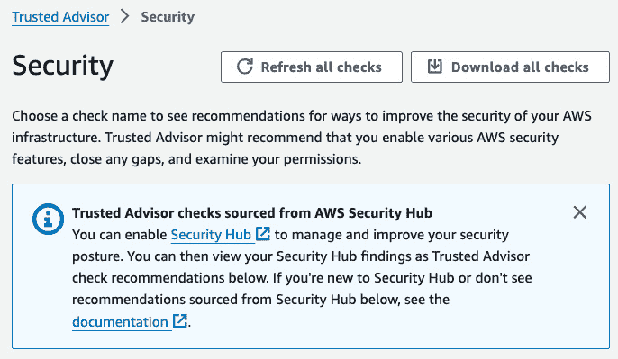

# 第十章：AWS 安全的附加服务和实践

在本书中，我们已经探讨了许多与安全相关的概念和服务。还有更多安全服务和实践可以帮助我们保护 AWS 基础设施的安全。在本章中，我们将探讨一些值得关注的额外服务和实践。与其他章节不同，我们不会对这些服务进行深入探讨。你可以参考*另见*部分提供的链接，进一步学习。我们将了解一些与安全相关的托管服务，如**AWS 资源访问管理器**（**AWS RAM**）、**AWS Systems Manager 参数存储**、`AWS Secrets Manager`、`AWS Trusted Advisor`和`AWS Artifact`。我们还将了解如何使用**Amazon 机器镜像**（**AMIs**）和来自 AWS Marketplace 的安全产品。

在本章中，我们将涵盖以下配方：

+   设置和使用 AWS RAM

+   使用 Systems Manager 参数存储存储敏感数据

+   使用 AWS Secrets Manager 管理 RDS 凭证

+   创建 AMI 而不是使用 EC2 用户数据

+   使用来自 AWS Marketplace 的安全产品

+   使用 AWS Trusted Advisor 获取建议

+   使用 AWS Artifact 进行合规性报告

# 技术要求

在深入了解本章的配方之前，我们需要确保已满足以下要求：

+   完成本章中的配方，至少需要一个有效的 AWS 账户。除非配方中特别提到，否则我将使用在*第一章*中的*多账户管理与 AWS Organizations*配方中创建的`awsseccb-sandbox-1`账户，并且不会使用任何 AWS Organizations 功能。

+   对于管理操作，我们需要一个具有`AdministratorAccess`权限的用户来访问我们正在使用的 AWS 账户。

本书的代码文件可以在[`github.com/PacktPublishing/AWS-Security-Cookbook-Second-Edition`](https://github.com/PacktPublishing/AWS-Security-Cookbook-Second-Edition)上找到。本章的代码文件可以在[`github.com/PacktPublishing/AWS-Security-Cookbook-Second-Edition/tree/main/Chapter10`](https://github.com/PacktPublishing/AWS-Security-Cookbook-Second-Edition/tree/main/Chapter10)上找到。

# 设置和使用 AWS RAM

`AWS RAM` 使我们能够与其他 AWS 账户或 AWS 组织内部的其他账户安全地共享 AWS 资源。我们可以共享的资源包括传输网关、子网、AWS License Manager 配置和 Amazon Route 53 解析器规则。在这个配方中，我们将学习如何使用 AWS RAM 来共享子网。

## 准备工作

我们需要以下内容才能成功完成配方：

+   设置为管理账户并已按照在*第一章*中的*多账户管理与 AWS Organizations*配方中讨论的方式配置的 AWS Organizations。我将使用在该配方中创建的`aws-sec-cookbook-1`账户。

+   在组织内的成员帐户以共享资源。

+   通过遵循*第五章*中的*设置 VPC 及其 VPC 资源的最小化步骤*食谱创建 VPC 和子网，然而，您可以跳过创建 NAT 网关。

## 如何操作...

我们可以按如下方式设置和使用 AWS RAM：

1.  转到 AWS 管理控制台中的**资源访问管理器**服务。如果我们是第一次使用该服务，请点击左侧边栏中的**设置**，选择**启用与 AWS Organizations 的共享**选项，点击**保存设置**，然后返回到**资源访问管理器**仪表板。


图 10.1 – 启用与 AWS Organizations 的共享

1.  点击**创建一个资源共享**。

1.  对于**资源共享名称**，提供`my-subnet-share`值。

1.  在**资源 - 可选**部分，在**选择资源类型**的下拉菜单中，选择**子网**，然后从子网列表中选择我们为本食谱创建的子网，正如在*准备*部分所讨论的那样。

1.  向下滚动并点击**下一步**。我们将进入**关联托管权限**页面。保持默认设置，向下滚动并点击**下一步**。

1.  在**授予访问权限给主体**页面的**主体**部分，选择**仅在您的组织内共享**，在**选择主体类型**下，选择**AWS 帐户**，输入另一个 AWS 帐户的帐户号，点击**添加**，向下滚动并点击**下一步**。这将跳转到**审核和创建**页面。审核详细信息，向下滚动并点击**创建资源共享**。

1.  要验证资源共享，登录到我们在*步骤 6*中指定的帐户，然后进入 AWS **资源访问管理器**仪表板。在左侧边栏中点击**共享给我的资源**下的**资源共享**。


图 10.2 – 我们成员帐户中的共享资源

我们应该能看到被共享的子网。我们需要选择与我们创建共享时相同的区域，以查看这些共享。

## 它是如何工作的...

首先，我们在我们的 AWS 组织中启用了共享。这可以通过`AWS RAM`控制台完成，正如我们在本食谱中看到的那样。如果我们没有在 AWS 组织内启用共享，我们添加的帐户将被视为外部帐户，即使它们是我们组织的一部分。我们为一个子网添加了资源共享，并将其与我们组织单元（OU）内的另一个帐户共享。

## 还有更多...

我们与 AWS RAM 共享了一个子网资源类型。目前可用的资源类型选项包括：**Aurora 数据库集群**、**容量预留**、**CodeBuild 项目**、**CodeBuild 报告组**、**专用主机**、**映像构建组件**、**映像构建镜像食谱**、**映像构建镜像**、**许可证配置**、**解析器规则**、**流量镜像目标**、**传输网关**等。

## 另见

你可以在[`www.cloudericks.com/blog/getting-started-with-aws-ram`](https://www.cloudericks.com/blog/getting-started-with-aws-ram)阅读有关 AWS RAM 的更多信息。

# 使用 AWS 系统管理器参数存储存储敏感数据

我们可以使用**系统管理器参数存储**存储数据，可以选择加密或不加密，然后从各种服务中引用它，而无需在任何地方硬编码数据。在本操作中，我们将学习如何在 AWS 系统管理器参数存储中加密存储数据，然后从 EC2 实例中检索它。

## 准备就绪

我们需要以下内容才能成功完成本操作：

+   一个有效的 AWS 账户和在*技术要求*部分描述的用户。

+   在默认 VPC 中的 EC2 实例，位于 VPC 内的公共子网中。对于**Amazon 机器映像（AMI）**，选择`Amazon Linux 2023 AMI`；对于**实例类型**，选择`t2.micro`；对于**密钥对（登录）**，选择你有权限访问的现有密钥对或创建一个新密钥对。在**网络设置**下，确保**自动分配公有 IP**的值为**启用**，并选择**创建安全组**，将**允许来自**设置为**任何地方**的 SSH 流量。我们在*第五章*中学习了 EC2。

+   你将受益于熟悉 KMS。在*第三章*中，我们学习了 KMS。

## 如何操作...

首先，我们将在 AWS 系统管理器参数存储中创建一个参数。然后，我们将附加一个角色，用于从 EC2 实例访问 AWS 系统管理器。最后，我们将从该 EC2 实例检索参数信息。

### 在 AWS 系统管理器参数存储中创建参数

我们可以按照以下方式创建一个系统管理器参数存储参数：

1.  进入 AWS 管理控制台中的**系统管理器**服务。

1.  从左侧边栏点击**参数存储**。

1.  点击**创建参数**。

1.  在**创建参数**页面，填写**名称**为`MySecureParameter`，**描述（可选）**填写`My Secure Parameter`，并选择**层级**为**标准**。

1.  对于**类型**，选择`SecureString`；对于**KMS 密钥源**，选择**我的当前账户**；对于**KMS 密钥 ID**，保持默认值`alias/aws/ssm`不变；对于**值**，输入`MySecureValue`。

1.  向下滚动并点击**创建参数**。我们应该会看到如下信息：**创建参数请求成功！**

接下来，我们将创建并将角色附加到我们的 EC2 实例，以便访问 AWS Systems Manager。

### 创建并附加角色以使用 AWS Systems Manager

要从 EC2 实例使用 AWS Systems Manager，我们需要将角色附加到 EC2 实例，如下所示：

1.  转到 AWS 管理控制台中的`IAM`仪表板。

1.  从左侧边栏点击**角色**，然后点击**创建角色**。

1.  在**受信实体类型**下，选择**AWS 服务**，然后从服务列表中选择`EC2`，作为**服务或使用案例**。

1.  向下滚动并选择**EC2 角色用于 AWS Systems Manager**。点击**下一步**。


图 10.3 – 选择受信实体

1.  在**添加权限**面板上，点击**下一步**。

1.  在**名称、审核并创建**页面中，输入**角色名称**为`MySSMManInstanceRole`，**描述**为**Amazon SSM 管理实例核心角色**。审核整个页面，然后点击**创建角色**。我们应该会看到角色创建成功的消息。

1.  如同在《第二章》的*通过 IAM 角色在 EC2 实例上进行跨服务访问*一节中看到的那样，将此角色附加到我们的 EC2 实例。

### 从 AWS Systems Manager 参数存储中检索参数

我们可以从 EC2 实例中检索参数值。SSH 进入 EC2 实例并运行以下命令：

```
 aws ssm get-parameters --names MySecureParameter --with-decryption --region us-east-1
```

我们应该会收到类似以下的响应：


图 10.4 – 获取参数

参数值将被解密。我们还有一个`get-parameter`子命令，用于`aws ssm` CLI 命令；但是，当前**AWS 提供的 AmazonEC2RoleForEC2**角色不包括它。你可以手动添加权限，然后使用`get-parameter`。

## 它是如何工作的...

在本节中，我们在 AWS Systems Manager 参数存储中创建了一个参数并检索了它。我们可以从任何服务中使用该参数，而无需硬编码其值。现在，我们可以从一个地方更新该参数的值。

为了检索和解密加密的参数值，我们使用了`get-parameters`子命令，该命令是`aws ssm` CLI 命令的一部分，并带有`--with-decryption`选项。如果未指定，则默认选项为`--no-with-decryption`，并且不会解密值。

我们还可以通过将**类型**设置为`String`而不是`Secure String`来创建不加密的参数。

## 还有更多...

在本节中，我们只使用了 AWS Systems Manager 的一个功能，即参数存储。让我们快速浏览一下 AWS Systems Manager 的其他一些重要功能：

+   AWS Systems Manager 允许我们将 EC2 实例、S3 存储桶和**关系数据库服务**（**RDS**）实例等资源进行分组。完成此操作后，我们可以执行一些操作，例如在一组资源中安装补丁。

+   我们可以在 AWS 系统管理器参数存储中使用该参数，来自不同的服务，如 EC2、Lambda 和 CloudFormation。我们也可以在系统管理器的`run`命令中使用该参数。

+   `run`命令可用于在一组 EC2 机器上自动执行管理任务和配置更改。

+   简单的系统管理器 EC2 角色允许我们从 EC2 实例上使用`run`命令。

+   我们可以手动指定 EC2 目标实例或基于附加到 EC2 实例的标签来指定目标实例。

+   当我们从控制台配置`run`命令时，AWS 会为我们提供相应的 CLI 命令，我们可以执行。

+   要使用`run`命令，需要在实例上安装 SSM 代理。

+   我们还可以使用`run`命令对本地系统执行操作。

## 另见

+   你可以在[`www.cloudericks.com/blog/getting-started-with-aws-systems-manager-ssm`](https://www.cloudericks.com/blog/getting-started-with-aws-systems-manager-ssm)上阅读更多关于 AWS 系统管理器的信息。

+   你可以在[`www.cloudericks.com/blog/using-aws-kms-with-aws-ssm-parameter-store`](https://www.cloudericks.com/blog/using-aws-kms-with-aws-ssm-parameter-store)上阅读更多关于将 KMS 与 AWS 系统管理器参数存储结合使用的信息。

# 使用 AWS Secrets Manager 管理 RDS 凭证

在本食谱中，我们将学习如何使用 AWS Secrets Manager 管理 RDS 凭证。这是一种更安全的方式来管理和轮换 RDS 凭证，而不是手动操作。

## 准备工作

我们需要以下内容才能成功完成本食谱：

+   一个有效的 AWS 账户和如*技术要求*部分所述的用户。

+   在 RDS 中创建的 RDS 数据库实例，采用默认设置，但有以下例外：

    +   对于**实例配置**，选择**无服务器 v2**以保持最低成本。

    +   对于**凭证设置**，请提供**主用户名**和**主密码**的值，如下图所示：


图 10.5 – RDS 数据库的凭证设置

重要提示

如果我们在*图 10* *5*中选择了**在 AWS Secrets Manager 中管理**选项，那么 RDS 将生成一个密码并将其存储在 Secrets Manager 中，而无需执行本食谱中列出的步骤。然而，我们希望演示如何手动存储密钥，因此选择了**自主管理**选项。

## 如何操作……

我们可以按如下方式配置 AWS Secrets Manager 来管理 RDS 数据库的凭证：

1.  进入 AWS 管理控制台中的`Secrets Manager`服务。

1.  在左侧边栏，点击`Secrets`。在`Secrets`页面，点击**存储新密钥**。

1.  对于**密钥类型**，选择**Amazon RDS 数据库的凭证**，如下图所示：


图 10.6 – 在 AWS Secrets Manager 中选择秘密类型选项

1.  将 **主用户名** 和 **主密码** 的值分别提供给 **用户名** 和 **密码** 字段。

1.  对于 **加密密钥** 选项，从下拉菜单中选择默认的加密密钥。我们也可以按照 *第三章* 中的食谱创建一个 KMS 加密密钥并使用它，但在此食谱中，我们将使用默认密钥。

1.  在 **数据库** 部分，选择我们在 *准备阶段* 创建的数据库并点击 **下一步**。

1.  提供 `prod/CloudericksApp/Postgres` 作为 **秘密名称** 字段的值，并提供 **Cloudericks 应用程序的 Postgress 生产数据库访问权限** 作为 **描述** 字段的值。可选地，添加任何标签，然后点击 **下一步**。

1.  对于 **配置自动轮换**，启用 **自动轮换**。然后，选择 **计划表达式生成器** 作为 **轮换计划**，将 **时间单位** 设置为 **天**，并将 **天数** 设置为 `30`。对于 **窗口持续时间 - 可选**，保持默认选项，并选中 **在秘密存储时立即轮换。下一次轮换将在您的计划** 上开始。


图 10.7 – 配置自动轮换

1.  在 **轮换函数** 部分，选择 **创建轮换函数**。对于 **Lambda 轮换函数**，提供 `postgres-rotation-lambda` 名称。选择 **单用户** 作为 **轮换策略**，然后点击 **下一步**。


图 10.8 – 配置轮换函数

1.  在 **审查** 页面，仔细检查所有详细信息。此外，还提供了不同语言的示例代码，包括 Java、JavaScript、C#、Python3、Ruby、Go 和 Rust，演示如何从我们的应用程序中检索秘密，如 *图 10* *.9* 所示。最后，点击 **存储**。


图 10.9 – 从 Secrets Manager 检索秘密的示例代码

1.  一旦收到成功消息，转到新秘密以验证详细信息。

1.  向下滚动并转到 **概述** 标签页，然后点击 **检索秘密值** 以查看我们的秘密。如果你想编辑它们，可以使用 **编辑** 按钮进行修改。

    如果我们想删除一个秘密，可以进入该秘密，点击 **操作** 下拉菜单，然后点击 **删除秘密**。我们必须指定一个等待期，时间为 7 到 30 天之间，才能删除该秘密。

## 它是如何工作的...

在这个食谱中，我们将我们的 RDS 数据库凭证存储在 Secrets Manager 中。对于秘密类型，我们选择了 **Amazon RDS 数据库凭证**。以下是当前在控制台中可用的其他秘密类型选项：**Redshift 集群凭证**、**DocumentDB 数据库凭证**、**其他数据库凭证** 和 **其他类型的秘密**（例如，API 密钥）。

我们启用了 30 天的自动密钥轮换。我们还可以选择 60 天或 90 天，或提供最多 365 天的自定义周期。我为此配方选择了默认加密密钥。您也可以使用您创建的 KMS 密钥。我们在*第三章*中学习了有关 KMS 密钥的知识。

配置秘密后，我们的应用程序可以通过 Secrets Manager 进行 API 调用，以编程方式检索秘密。在存储秘密时，AWS 为我们提供了用于不同语言的示例代码以检索秘密。目前，Java、JavaScript、C＃、Python3、Ruby、Go 和 Rust 均有示例代码。

我们看到警告称，此秘密存储后会立即进行第一次轮换。因此，如果我们的任何应用程序仍在使用硬编码凭据，并且未更新为使用 API 获取最新凭据，则这些应用程序将失败。

## 还有更多内容...

AWS Secrets Manager 可能看起来像 AWS Systems Manager 参数存储。让我们快速比较 Secrets Manager 和参数存储：

+   Secrets Manager 主要用于存储数据库凭据、API 密钥和 SSH 密钥。参数存储主要用于存储许可证代码、配置数据、用户定义的参数和数据库字符串，并且较少用于密码。

+   AWS Secrets Manager 按秘密每月和每次 API 调用收费。AWS Systems Manager 参数存储不收取标准参数的费用，但根据存储的高级参数数量和每次 API 交互收费高级参数。

+   Secrets Manager 具有与 RDS 数据库的内置集成。Secrets Manager 支持对 RDS 进行秘密的内置轮换。它还支持使用自定义 Lambda 函数对非 RDS 数据库进行轮换。

+   参数存储已与 AWS Systems Manager 集成。

## 另请参阅

在[`www.cloudericks.com/blog/comparing-aws-secrets-manager-and-parameter-store`](https://www.cloudericks.com/blog/comparing-aws-secrets-manager-and-parameter-store)中阅读有关 AWS Secrets Manager 和 Parameter Store 的比较。

# 创建 AMI 而不使用 EC2 用户数据

在此配方中，我们将创建一个带有 Web 服务器的 AMI，然后从该 AMI 启动实例。从 AMI 创建的实例比通过 EC2 用户数据定义相同配置的实例具有更快的启动时间。在*第五章*的*使用用户数据启动带 Web 服务器的 EC2 实例*配方中，我们使用 EC2 用户数据更新了操作系统并在启动时设置了简单的 Web 服务器。

## 准备工作

我们需要以下内容才能成功完成该配方：

+   按*技术要求*部分描述的工作 AWS 帐户和用户。

+   根据*第五章*中的*使用用户数据启动带 Web 服务器的 EC2 实例*配方启动的 EC2 实例。

## 如何做...

我们可以从 EC2 实例创建 AMI 如下：

1.  进入控制台中的`EC2` 服务。

1.  点击**实例**，选择我们的实例，点击**操作**，展开**镜像和模板**，然后点击**创建镜像**。

1.  在**创建镜像**屏幕上，提供**镜像名称**和**镜像描述 - 可选**。对于其他参数使用默认值，然后点击**创建镜像**。

1.  如果我们进入 AMI 列表，我们的 AMI 应该显示其初始状态为**待处理**。一旦状态变为**可用**，就可以从这个 AMI 创建一个新实例。在启动实例时，从**我的AMI** 标签中选择我们的 AMI。

## 它是如何工作的...

在这个食谱中，我们从一个 EC2 实例创建了一个 AMI。与启动实例相关的信息，包括任何特定于组织的配置，都可以保存到 AMI 中。我们在这个食谱中使用了 Amazon Linux 2023 作为基础 AMI，因此使用了特定于 Amazon Linux 2023 的命令。如果你使用的是 Amazon Linux 2，也可以使用相同的命令。

我们在*第五章* 中使用 EC2 用户数据做了类似的配置。来自 AMI 的实例比通过 EC2 用户数据定义的具有相同配置的实例具有更快的启动时间。这是因为我们可以在 AMI 中预安装软件包，而在启动时使用用户数据时需要安装它们。

## 还有更多...

让我们快速浏览一些与 AMI 相关的重要概念：

+   可以从一个 AMI 启动多个 EC2 实例。

+   AMI 是特定于某一地区的，但我们可以跨区域复制它们。在启动实例时，我们可以在 Amazon 提供的 AMI、我们自己的 AMI、AWS Marketplace AMI 和社区 AMI 之间进行选择。我们还可以根据其他参数筛选列表。

+   我们只应使用我们信任的公共 AMI。在使用 AMI 之前，我们可以检查其评分。

+   AMI 存储在 S3 中。因此，我们将根据 S3 定价收费，这也取决于我们的免费使用配额和使用情况。不过，我们将无法从 S3 控制台查看 AMI 或其存储桶。

+   默认情况下，AMI 对我们的账户和区域是私有的。我们可以将 AMI 设置为公共，供其他 AWS 账户使用，或通过 AWS Marketplace 销售它们。

## 另请参阅

+   你可以在 [`www.cloudericks.com/blog/getting-started-with-amis-for-ec2-instances-in-aws`](https://www.cloudericks.com/blog/getting-started-with-amis-for-ec2-instances-in-aws) 阅读更多关于 AMI 的内容。

+   阅读更多关于 AMI 加固的内容，请访问 [`www.cloudericks.com/blog/ami-hardening-for-ensuring-security-and-stability-in-our-aws-environment`](https://www.cloudericks.com/blog/ami-hardening-for-ensuring-security-and-stability-in-our-aws-environment)。

# 使用来自 AWS Marketplace 的安全产品

在这个教程中，我们将学习如何使用 AWS Marketplace 中的各种**安全产品**。许多第三方公司会在 EC2 实例上安装和配置他们的产品和解决方案，并将它们作为 AMI 在 AWS Marketplace 上提供。Marketplace AMIs 可以被视为预先配置软件的 EC2 实例。或者，我们也可以直接从这些供应商那里购买产品，并自行进行配置。

## 准备就绪...

我们需要一个可用的 AWS 账户，以及在*技术* *要求*部分中描述的用户。

## 如何做...

我们可以按照以下步骤找到并使用 AWS Marketplace 中与安全相关的 AMI：

1.  转到仪表板上的`EC2`服务。

1.  从左侧边栏点击**实例**，然后点击**启动实例**。

1.  在**应用程序和操作系统镜像（Amazon Machine Image）**下，点击**浏览更多 AMI**。


图 10.10 – 从 AWS Marketplace 浏览 AMIS

1.  转到`AWS Marketplace AMIs`选项卡，在搜索栏中搜索**安全**。截至本文撰写时，有 10719 个 AMI 可用。


图 10.11 – AWS Marketplace AMIs

我们可以根据左侧边栏的**操作系统**、**软件免费试用**、**软件定价计划**和**支持**等参数进一步筛选结果。一旦我们决定了一个产品，我们可以按照*第五章*中的步骤，完成启动实例的过程。

## 工作原理...

AWS 可能无法提供我们需要的所有安全产品。许多第三方公司开发了与 AWS 服务相辅相成的安全和合规解决方案。我们看到了如何在 AWS Marketplace 中找到这样的 AMI。一旦我们决定了一个产品，我们可以使用该 AMI 启动一个实例。关于我们选择的特定产品的更多详细信息，我们可以参考相应产品的文档。

## 还有更多...

**网络数据包检查**，也称为**深度数据包检查**（**DPI**），检查数据包头和数据包内容，以检测不符合规定的数据、病毒、垃圾邮件等，并可以采取阻止和记录等措施。它结合了传统防火墙的功能与**入侵检测系统**（**IDS**）或**入侵预防系统**（**IPS**）的功能。

**AWS Web 应用程序防火墙**（**WAF**），AWS 中的防火墙服务，可以检查已知的漏洞，如 SQL 注入，跨站脚本等。然而，AWS 无法进行完整的网络数据包检查，也缺乏 IDS 和 IPS 的功能。不过，我们可以使用 AWS Marketplace 中的解决方案。供应商包括 Alert Logic、Trend Micro、McAfee、Palo Alto Networks 和思科系统等。

## 参见

您可以在 AWS Marketplace 中阅读有关安全产品的信息，网址为[`www.cloudericks.com/blog/getting-started-with-aws-marketplace`](https://www.cloudericks.com/blog/getting-started-with-aws-marketplace)。

# 使用 AWS 可信顾问进行建议

在本教程中，我们将学习如何使用可信顾问。**可信顾问**是 AWS 中提供与成本优化、性能、安全、容错性和服务限制相关建议的在线工具。

## 准备工作

我们需要一个可用的 AWS 账户，以及*技术要求*部分所描述的用户。

## 如何操作...

我们可以按照以下方式使用可信顾问：

1.  转到 AWS 管理控制台中的**可信顾问**服务。我们应该在仪表板登陆页面上看到**建议**类别和基本建议，如下图所示：


图 10.12 – 可信顾问仪表板

1.  点击左侧边栏中的**安全**，查看与安全相关的建议。



图 10.13 – 安全建议页面

1.  点击**下载所有检查**以下载所有检查，或者点击建议的下载按钮以下载该建议的详细信息。

1.  点击**刷新所有检查**以下载所有检查，或者点击建议的刷新按钮以刷新该建议的详细信息。

1.  点击左侧边栏中的**服务限制**，查看与服务限制相关的建议，例如使用超过服务配额 80%的服务。

重要提示

截至本文撰写时，除了**安全**和**服务限制**之外，所有其他建议都需要升级才能使用。我们可以在点击左侧边栏中的**建议**或者在左侧边栏中的任何建议类别选项中除了**安全**和**服务限制**之外进行升级。

## 工作原理...

可信顾问提供与成本优化、性能、安全、容错性、服务限制和运营卓越相关的建议。有两种服务级别：基本计划和完全可信顾问。基本计划是免费的，涵盖核心检查和建议。完全可信顾问功能适用于开发者、商业和企业 AWS 支持计划。

## 还有更多...

可信顾问基本计划目前在成本优化、性能、容错性和运营卓越方面没有可用的建议。对于这些类别，只有完全可信顾问才提供建议。对于**安全**和**服务限制**类别，一些建议既适用于基本计划，也适用于完全可信顾问。

## 另请参阅

您可以在[`www.cloudericks.com/blog/understanding-aws-trusted-advisor`](https://www.cloudericks.com/blog/understanding-aws-trusted-advisor)了解更多关于 Trusted Advisor 的信息。

# 使用 AWS Artifact 进行合规性报告

在本教程中，我们将学习如何使用 AWS Artifact。AWS Artifact 是一个免费的自助门户，用于访问 AWS 的合规性报告。AWS Artifact 可用于访问 AWS 的安全和合规性报告，并选择在线协议。

## 准备工作

我们需要一个可用的 AWS 账户，以及在*技术* *要求*部分描述的用户。

## 如何操作...

我们可以按照以下方式使用 AWS Artifact：

1.  转到控制台中的`AWS Artifact`服务。

1.  在左侧边栏中点击**报告**查看可用报告。


图 10.14 – AWS Artifact 的报告

1.  在左侧边栏中点击**协议**查看**账户协议**和**组织协议**。


图 10.15 – 协议

提示

我们可以从组织的主账户中点击**组织协议**选项卡，管理主账户和组织中所有成员账户的协议。

1.  选择任何协议，然后点击**下载协议**按钮下载协议。如果出现**接受 NDA 下载报告**的消息，我们需要选择**我已阅读并同意所有 NDA 条款**复选框。


点击**接受 NDA并下载**。


图 10.16 – 接受并下载报告

## 工作原理...

我们已经学会使用 AWS Artifact 来检查合规性报告。以下是目前在 AWS Artifact 中可用的一些报告：可访问性符合性报告（VPAT）– Amazon Cognito 用户池，英文版 HDS 认证，ABS 云计算实施指南 2.0 – 工作簿，可访问性符合性报告（VPAT）– Amazon API 网关，可访问性符合性报告（VPAT）– Amazon AppFlow，可访问性符合性报告（VPAT）– Amazon AppStream 2.0，可访问性符合性报告（VPAT）– Amazon 简单队列服务，可访问性符合性报告（VPAT）– Amazon 简单通知服务（SNS），以及可访问性符合性报告（VPAT）– Amazon 简单邮件服务（SES）。

## 还有更多...

在本书中，我们看到了许多 AWS 服务，帮助我们在 AWS 上保护基础设施。然而，这并不是一个详尽的列表。AWS 还不断添加更多服务和功能。让我们快速浏览一些与安全相关的更多服务：

+   `Amazon Detective` 是一个可以通过分析和可视化安全数据来帮助找到潜在安全问题根本原因的服务。截至本文撰写时，此服务处于预览阶段。

+   **AWS 控制塔**帮助我们根据与安全和合规性相关的最佳实践建立和管理多账户 AWS 环境。最终用户可以根据公司范围内集中建立的合规性政策提供新账户，云管理员可以查看着陆区域的完整概述。着陆区域是所有需要合规的 OU、账户、用户和其他资源的容器。着陆区域应该位于组织的非成员账户中。

+   **AWS 许可证管理器**帮助我们管理来自第三方供应商（如微软、甲骨文和 SAP）的许可证，当我们将它们引入 AWS 时。我们可以控制它们的使用，甚至为不同用户组设置定制规则。

+   **AWS 个人健康仪表板**是一项提供给高级支持计划客户的服务，用于监视、管理和优化他们的 AWS 环境。

+   **AWS 良构架构工具**是基于 AWS **良构架构框架**的管理服务。我们可以根据当前 AWS 最佳实践定义工作负载，这个工具将提供如何改进我们的云架构的指导。

## 另请参阅

您可以在[`www.cloudericks.com/blog/getting-started-with-aws-artifact`](https://www.cloudericks.com/blog/getting-started-with-aws-artifact)了解关于 AWS Artifact 的信息。
