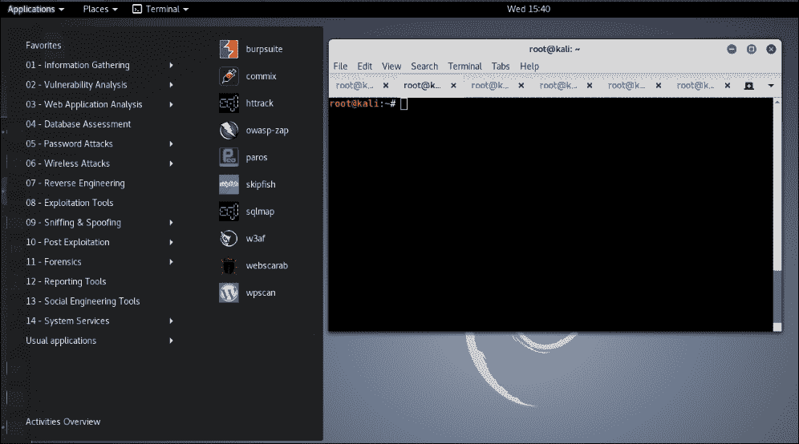
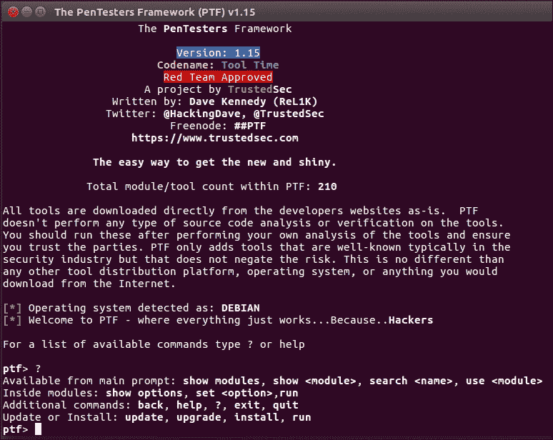
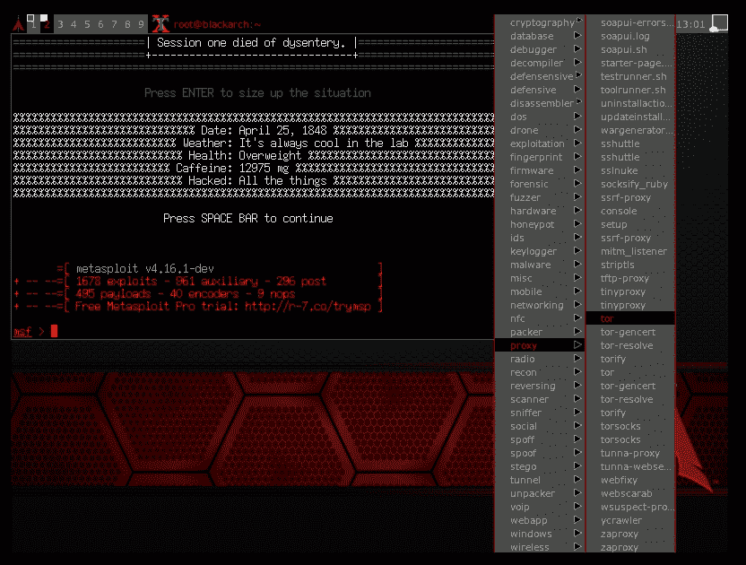
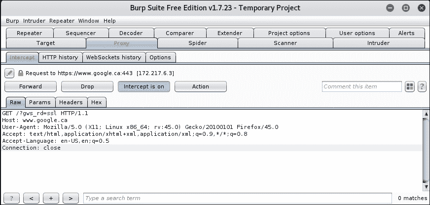
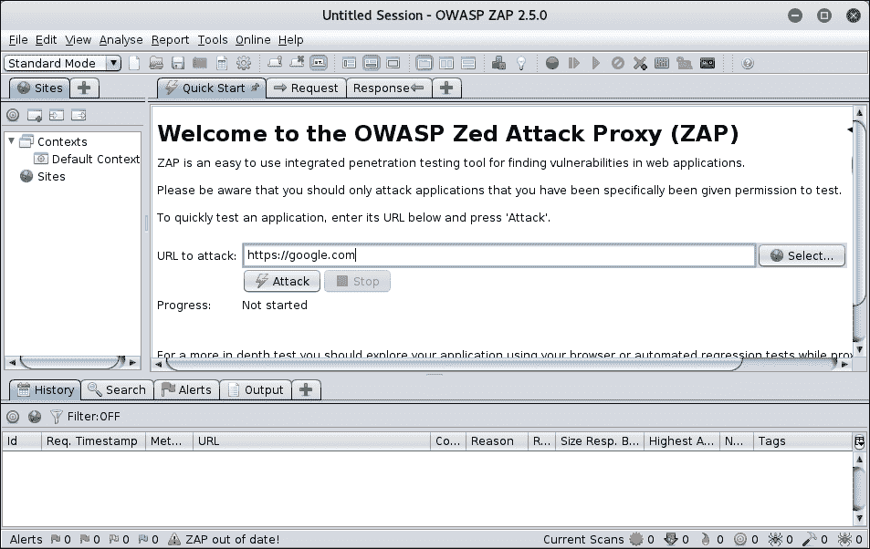
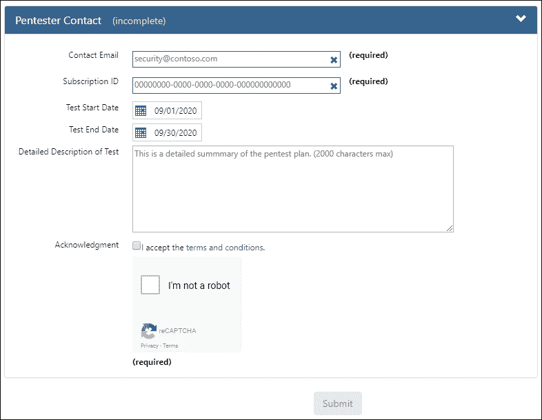

# 第一章：Web 应用程序攻击概述

Web 应用程序无处不在。它们是社会结构的一部分，我们在生活的许多方面都依赖它们。如今，它们易于开发、快速部署，并且任何拥有互联网连接的人都能访问。

用于帮助开发和部署 Web 应用程序的技术也大爆发。每天都会发布增强功能和可用性的新框架。公司已经将权力交给了开发人员，使他们更加敏捷，并能快速生产 Web 应用程序。

以下图表展示了目前在应用程序开发领域风靡一时的更流行的开发环境和框架。**Node.js** 将浏览器客户端脚本语言 **JavaScript** 带到了服务器端，并配有大量模块库，帮助快速开发应用程序。曾经仅在浏览器中使用的脚本语言 JavaScript，现在在客户端通过 **React** 和 **Angular** 得到了极大的增强，并且通过 **Electron** 和 **Chromium** 等工具，甚至可以进行跨平台开发：

图 1.1：自从 Netscape 在网上占据主导地位以来，世界发生了变化，这张图仅展示了当今主导 Web 的一些技术

GitHub 已经成为开源库、应用程序以及开发人员可能希望与世界分享的任何东西的一站式商店。任何人都可以上传他们想要的内容，其他人可以通过推动代码更改或通过分叉现有的代码库并继续本地开发来进行协作。GitHub 当然不是唯一的，还有类似的仓库供 Node.js、Python 和 PHP 模块使用。

开发人员的关注点始终是尽快推出产品，无论是营销部门使用的内部 Web 应用程序中的简单功能实现，还是最新最强大的 Web 银行界面。支持这些应用程序的基础设施也在不断发展，开发人员在将安全性集成到工作流程中时常常遇到困难。然而，影响安全应用程序开发的原因并不总是无知。更常见的是，时间限制和截止日期是罪魁祸首。

本书的目标是展示攻击者如何看待 Web 应用程序，以及他们如何利用应用程序代码和基础设施中的弱点。我们将讨论在开发过程中常见的错误，这些错误通常会被用来获取有意义的访问权限。我们将探讨实际的攻击案例，并最大限度地利用常见的应用程序漏洞。

对您的知识水平有一些假设。为了从阅读本书中获得最大价值，您应具备基本的应用程序安全知识。读者不必成为渗透测试或应用程序安全领域的专家，但应了解**跨站脚本**（**XSS**）或**SQL 注入**（**SQLi**）攻击是什么。我们不会为 XSS 的标准“Hello World”示例单独设立一章，但我们会展示利用这种漏洞的影响。读者还应熟悉 Linux 命令行和常见的控制台工具，如`curl`、`git`和`wget`。一定程度的编程知识对理解有所帮助，但并非硬性要求。

本章将涵盖以下主题：

+   进行测试时的典型参与规则

+   测试工具包

+   攻击代理

+   云如何帮助应对参与

# 参与规则

在继续进行有趣的内容之前，重要的是始终记住在进行攻击时的**参与规则**（**ROE**）。ROE 通常在参与前的**工作声明**（**SoW**）中列出，所有测试人员必须遵守。这些规则列出了对测试人员的期望，并设定了在参与过程中可以执行的某些限制。

虽然典型渗透测试的目标是模拟实际攻击并找到基础设施或应用程序中的弱点，但存在许多限制，而且这些限制有其合理性。我们不能像真正的对手那样大肆破坏，造成比实际攻击者更多的损害。目标（客户），无论是第三方还是内部团队，都应该感到舒适，允许专业的黑客对其应用程序进行攻击。

## 沟通

良好的沟通是成功参与的关键。**启动**和**结束**会议对双方都极为宝贵。客户应清楚了解是谁在执行该项目，并知道如何在紧急情况下与其或其备用人员取得联系。

启动会议是检查测试所有方面的机会，包括审查项目范围、系统的重要性、提供的凭证以及联系信息。幸运的话，所有这些信息都应该已经包含在**范围文档**中。该文档的目的是明确概述在此次参与期间需要测试的基础设施或应用程序部分。范围可以是 IP 范围、应用程序、特定域名或 URL 的组合。通常，客户会提前很久就参与编写此文档，以便在测试开始之前确认。然而，事情可能会发生变化，启动会议是最后一次核对所有内容的好时机。

启动会议中需要澄清的有用问题如下：

+   自上次文档修订以来，范围是否有变化？目标列表是否有更动？是否需要避免应用程序或网络的某些部分？

+   是否有必须遵守的测试时间窗口？

+   目标应用程序是在生产环境中还是在开发环境中？它们是面向客户的还是仅限内部使用？

+   紧急联系方式是否仍然有效？

+   如果提供了凭证，它们是否仍然有效？现在是时候再次检查这些了。

+   是否存在可能妨碍测试的应用防火墙？

目标通常是测试应用程序，而不是第三方防御措施。渗透测试人员有截止日期，而恶意行为者则没有。

### 提示

在测试应用程序漏洞时，建议要求客户将任何第三方**Web 应用防火墙**（**WAFs**）中的 IP 地址列入白名单。WAF 会检查到达受保护应用程序的流量，并丢弃与已知攻击特征或模式匹配的请求。一些客户可能会选择保持 WAF 在强制模式下，因为他们的目标可能是模拟现实中的攻击。这时，你应该提醒客户，防火墙可能会引入评估实际应用程序的延迟，因为测试人员可能需要花费额外的时间尝试规避防御。此外，由于大多数工作都有时间限制，最终报告可能无法准确反映应用程序的安全状态。

### 提示

没有经理愿意听到他们的关键应用程序在测试期间可能会下线，但这种情况偶尔确实会发生。一些应用程序无法承受简单扫描增加的工作负荷，可能会发生故障转移。某些有效负载也可能破坏设计不当的应用程序或基础设施，导致生产力骤然停滞。

### 提示

如果在测试过程中，应用程序变得无响应，最好尽快联系主要联系人，尤其是当应用程序是关键生产系统时。如果客户无法通过电话联系到，至少要发送电子邮件提醒。

结束会议或事后总结同样非常重要。一项特别成功的工作，发现了大量关键问题，可能会让测试人员感觉很棒，但客户可能会感到尴尬，因为他们必须向上级解释结果。此时，与客户会面，逐一回顾每个发现，并清晰地解释安全漏洞是如何发生的以及可以采取什么措施来修复它。时刻记住受众，用通俗的语言传达关切，而不是指责或讽刺任何相关方。

## 隐私考虑

涉及任何类型社会工程学或人际互动的工作，如**钓鱼**演练，应该谨慎处理。钓鱼攻击试图诱使用户点击电子邮件链接，访问一个凭证盗窃者，或打开恶意附件，一些员工可能会对以这种方式被利用感到不安。

在发送钓鱼邮件之前，例如，测试人员应确认客户是否愿意让他们的员工在不知情的情况下参与此次测试。这应当以书面形式记录，通常会写入《工作说明书》（SoW）中。启动会议是与客户同步期望的一个好机会。

除非获得客户的明确书面许可，否则避免以下操作：

+   不要进行可能被认为是不道德的社会工程攻击，例如，利用获取的目标家庭信息诱使他们点击链接。

+   不要外泄医疗记录或敏感的用户数据。

+   不要截取用户机器的屏幕截图。

+   不要将凭据发送到用户的个人电子邮件、社交媒体或其他帐户。

### 注意

一些网络攻击，如 SQL 注入或**XML 外部实体**（**XXE**）攻击，可能导致数据泄漏，在这种情况下，应该尽快通知客户该漏洞，并安全销毁已下载的任何内容。

尽管大多数测试都在**保密协议**（**NDA**）下进行，但应尽量避免处理敏感数据。完成测试后，保存医疗记录或信用卡信息几乎没有理由，事实上，保留这些数据可能会使客户违反法规合规要求，甚至可能是非法的。这类数据通常不会在尝试利用其他应用程序时提供任何杠杆。当在最终报告中列入证据时，必须格外小心，确保证据已清理干净，并且只包含足够的上下文来证明发现。

> “数据是一种有毒资产。我们需要开始像对待任何其他有毒源一样看待它，并以此方式处理它。否则，我们就冒着风险，威胁到我们的安全和隐私。”
> 
> - 布鲁斯·施奈尔

以上引用通常针对那些在私人用户数据处理上存在可疑做法的公司，但对测试人员同样适用。我们经常在测试中接触到敏感数据。

## 清理工作

成功的渗透测试或应用评估无疑会留下许多活动的痕迹。日志条目可能会显示入侵是如何发生的，Shell 历史文件也能提供攻击者如何横向移动的线索。然而，留下痕迹也有好处。防御方，也被称为蓝队，可以在测试期间或测试后分析这些活动，并评估其防御效果。日志条目提供了有关攻击者如何绕过系统防御、执行代码、外泄数据或其他突破网络的宝贵信息。

有许多工具可以在利用后清除日志，但除非客户明确允许这些操作，否则应避免这种做法。有些情况下，蓝队可能想测试其**安全信息与事件监控**（**SIEM**）基础设施的韧性（即集中日志收集与分析系统），因此清除日志可能在范围内，但必须在项目文档中明确允许。

尽管如此，仍有一些遗留物在项目完成后几乎应该完全从系统或应用数据库中移除。这些遗留物可能会使客户暴露于不必要的风险中，即使他们已经修补了漏洞：

+   提供操作系统（**OS**）访问的 Web Shell

+   恶意软件投放器、反向 Shell 和特权提升漏洞有效载荷

+   通过 Tomcat 部署的 Java 小程序形式的恶意软件

+   被修改或后门化的应用程序或系统组件：

    +   示例：用竞争条件 root 漏洞覆盖密码二进制文件，并且在离开系统之前没有恢复备份

+   存储的 XSS 有效载荷：这可能对生产系统中的用户造成困扰

并非所有在测试中引入的恶意软件都能被测试人员移除。清理工作需要联系客户。

### 提示

记录所有在评估中使用的恶意文件、路径和有效载荷。在项目结束时，尽可能地移除它们。如果有任何遗留，告知主要联系人，并提供详细信息，强调移除这些遗留物的重要性。

### 提示

给有效载荷标记唯一的关键字有助于在清理过程中识别虚假数据，例如：“请删除任何包含关键字：2017Q3TestXyZ123 的数据库记录。”

一封确认客户已移除任何残留恶意软件或遗留物的后续邮件，是一种提醒，并且总是受欢迎的。

# 测试人员的工具包

渗透测试工具因专业人员而异。工具和技术每天都在发展，你必须跟上进度。虽然几乎不可能列出涵盖所有场景的完整工具清单，但有一些经过验证的程序、技术和环境无疑能帮助任何攻击者实现目标。

## Kali Linux

以前被称为**BackTrack**，**Kali Linux**多年来一直是渗透测试人员的首选 Linux 发行版。很难否定它的价值，因为它几乎包含了进行应用程序和网络评估所需的所有工具。Kali Linux 团队还定期更新，不仅保持操作系统的更新，也更新攻击工具。

Kali Linux 部署非常方便，几乎可以在任何地方使用，并且有多种格式。包括 32 位和 64 位版本、便携虚拟机包，甚至有在 Android 操作系统上运行的版本：

图 1.2：Kali Linux 屏幕的全新实例

## Kali Linux 的替代品

Kali Linux 的一个替代或补充方案是 **渗透测试框架** (**PTF**)，由 TrustedSec 团队开发，使用 Python 编写。它是一个模块化框架，允许您将自己选择的 Linux 环境转变为渗透测试工具集。PTF 已经有数百个模块可以使用，并且可以快速创建新的模块。PTF 还可以在 Kali 上运行，快速将现有工具集中在一个位置。

图 1.3：PTF 交互式控制台

另一个成熟的 Kali Linux 替代品是 **BlackArch**，它是基于 **Arch Linux** 的一个发行版，包含了许多与其他渗透测试发行版捆绑的工具。BlackArch 包含了许多测试人员熟悉的工具，用于网络测试或应用评估，并且像 Kali Linux 一样，定期更新。对于 Arch Linux 爱好者来说，这是一个备受欢迎的替代 Debian 系统的 Kali 发行版。

图 1.4：BlackArch 主界面

BlackArch 可以通过 [`blackarch.org`](https://blackarch.org) 以多种格式下载。

# 攻击代理

在测试应用程序时，流量操控和记录是非常宝贵的。市场上的主要工具也是可扩展的，允许研究人员社区通过免费的附加组件来提升功能。构建良好并且得到支持的代理是攻击者武器库中的强大武器。

## Burp Suite

**Burp Suite** 无疑是攻击代理领域的王者。它可以直接拦截、修改、重放和记录流量。Burp Suite 非常可扩展，拥有强大的社区插件，可以与 **sqlmap**（事实上的 SQLi 利用工具）集成，自动测试权限提升，提供其他有用的模块：

+   **代理**：即时记录、拦截并修改请求

+   **蜘蛛**：具有强大爬取能力的内容发现工具

+   **解码器**：快速解码加密数据

+   **入侵者**：一个高度可定制的暴力破解模块

+   **重放器**：允许重放任何先前记录的请求，并可以修改请求的任何部分

+   **扫描器**（**仅限专业版**）：一个漏洞扫描器，集成了 **Burp 合作者**，用于发现隐蔽漏洞

+   **合作者**：帮助发现传统扫描器通常会忽略的隐蔽漏洞

Burp Suite 有一个免费版本，但该产品的专业版非常值得投资。虽然免费版完全可以用于快速测试，但它确实存在一些限制。特别是，入侵者模块有时间限制，使其无法用于大负载的攻击。扫描器模块也仅在专业版中提供，并且值得购买。扫描器能够快速找到易于攻击的目标，甚至自动利用 Collaborator 查找带外漏洞。免费版仍然可以拦截、检查和重放请求，并且可以警告其被动检测到的任何漏洞。

图 1.5：Burp Suite 免费版主界面

## Zed 攻击代理

OWASP 的**Zed 攻击代理**（**ZAP**）是另一个非常优秀的攻击代理。它具有可扩展性且易于使用。然而，它缺少 Burp Suite 的一些功能；例如，ZAP 没有 Burp Suite Pro 那样全面的主动漏洞扫描功能，也没有像 Collaborator 那样的自动化带外漏洞发现系统。

然而，ZAP 版本的入侵者模块没有时间限制，所有功能都可以开箱即用。ZAP 是开源的，并且由数百名志愿者积极维护。

图 1.6：ZAP 主界面

# 云基础设施

在进行评估时，攻击者通常会在攻防过程中利用**指挥与控制**（**C2**）服务器。大多数 C2 服务器的目的是向受感染环境内的恶意软件发出指令。

攻击者可以指示恶意软件窃取数据、启动键盘记录器、执行任意命令或 Shellcode，等等。在后续章节中，我们将主要使用云 C2 服务器来提取数据并发现带外漏洞。

C2 服务器由于可以从任何地方访问，因此在任何攻防活动中都非常灵活。云平台是托管 C2 基础设施的理想场所。它可以快速且可编程地部署，并且可以从全球任何地方访问。一些云服务提供商甚至支持 HTTPS，允许快速搭建 C2 服务器，而无需担心购买和管理域名或证书。

渗透测试人员的热门选择是**亚马逊网络服务**（**AWS**），它是云服务领域的领导者。其服务价格相对便宜，并且提供入门免费层选项。

其他可行的云服务提供商包括：

+   **微软 Azure**: [`portal.azure.com`](https://portal.azure.com)

+   **谷歌云平台**: [`cloud.google.com`](https://cloud.google.com)

+   **DigitalOcean**: [`www.digitalocean.com`](https://www.digitalocean.com)

+   **Linode**: [`www.linode.com`](https://www.linode.com)

微软的 Azure 提供了一项 **软件即服务**（**SaaS**）免费层功能，让你可以从 GitHub 仓库自动部署 C2。它还原生支持 HTTPS，使得隐藏 C2 数据不易被窥探，并能与正常的用户流量混合。

### 注意

在使用云提供商的基础设施进行评估之前，始终获得书面许可！即使只是简单地在临时虚拟机上托管一个恶意 JavaScript 文件，也需要事先得到授权。

云 **互联网服务提供商**（**ISPs**）应该提供一个表格，让你填写即将进行的渗透测试的详细信息，包括测试窗口和联系方式。

无论我们是使用云平台来部署一个 C2 进行渗透测试，还是攻击云平台上托管的应用程序，我们都应该始终通知客户与渗透测试相关的活动。

图 1.7：典型的渗透测试通知表格

# 资源

查阅以下资源，了解更多渗透测试工具和技术：

+   **Penetration Testers Framework**（**PTF**）：[`github.com/trustedsec/ptf`](https://github.com/trustedsec/ptf)

+   **BlackArch**: [`blackarch.org`](https://blackarch.org)

+   **Burp Suite**: [`portswigger.net/burp/`](https://portswigger.net/burp/)

+   **OWASP ZAP**: [`www.owasp.org/index.php/OWASP_Zed_Attack_Proxy_Project`](https://www.owasp.org/index.php/OWASP_Zed_Attack_Proxy_Project)

+   **Amazon Web Services**: [`aws.amazon.com`](https://aws.amazon.com)

+   **Microsoft Azure**: [`portal.azure.com`](https://portal.azure.com)

+   **Google Cloud Platform**: [`cloud.google.com`](https://cloud.google.com)

+   **DigitalOcean**: [`www.digitalocean.com`](https://www.digitalocean.com)

+   **Linode**: [`www.linode.com`](https://www.linode.com)

# 练习

完成以下练习，以更好地熟悉黑客工具集以及我们在本书中将使用的工具：

1.  下载并安装你首选的渗透测试发行版：Kali 或 BlackArch，或者使用 PTF 进行尝试。

1.  使用 Burp Suite 免费版或 ZAP 截获、检查并修改流量，访问你最喜欢的网站。

1.  在你选择的云计算提供商上创建一个免费账户，并使用其免费层启动一个 Linux 虚拟机实例。

# 概要

在本章中，我们回顾了工具、环境以及我们在进行渗透测试时必须遵循的最基本的行为准则（ROE）。我们强调了沟通的重要性，以及在测试过程中考虑客户隐私的关键性。我们不是坏人，不能为所欲为。我们还讨论了清理过程，确保我们不留下任何遗留物，除非客户另有要求。我们的遗留 Shell 不应成为未来漏洞攻击的根源。

我们还介绍了渗透测试人员的工具包；一款集成的 Linux 发行版——Kali；以及它的一些替代品。对于 Web 应用黑客来说，最重要的工具之一无疑是攻击代理，我们重点介绍了其中的两款：Burp Suite 和 ZAP。最后，我们提到了云作为 Web 应用测试者的一个新兴有用工具。

攻击者的工作永远比防御者的工作更容易。任何一位有企业世界经验的专业黑客都会证明这一点。攻击者只需要链条中的一个弱点——即使这个弱点是暂时的——就能完全控制环境。

安全性第一次做对是很难的，而随着时间的推移，要保持它接近基准线更是困难。经常会出现资源不足、知识缺乏或优先级错误的问题，包括简单的为了让组织盈利。应用程序必须是可用的——它们必须可用并提供功能增强，才能有用。似乎总是没有足够的时间来正确地测试代码，更别提测试安全漏洞了。

员工流动也可能导致经验不足的开发人员提交未经充分测试的代码。安全团队通常会忙于处理日常事件，更别提有时间处理安全代码审查了。没有万能的解决方案可以进行安全性测试，预算中也很少有足够的资金。这个难题有许多方面，许多因素会阻碍应用程序及其基础设施的完全安全。

这就是理解这些限制的专业黑客能够大显身手的地方。通过对服务器的 Shell 访问，黑客可以寻找潜在的权限提升漏洞，尝试让它工作，经过一些反复试验后，获得完全访问权限。或者，可以利用服务器间通信是系统管理员常见需求这一事实。这意味着服务器之间的连接要么没有密码，要么密码存储在某个靠近的位置。发现未受保护的私钥存放在全局可读的目录中，允许访问基础设施中的所有其他服务器并不罕见。**安全外壳协议**（**SSH**）私钥，通常用于自动化 SSH 连接，通常没有密码保护，因为为私钥设置密码会破坏使用它的自动化脚本。

在接下来的章节中，我们将利用这些关于应用开发和部署的不幸事实，转化为我们的优势。
