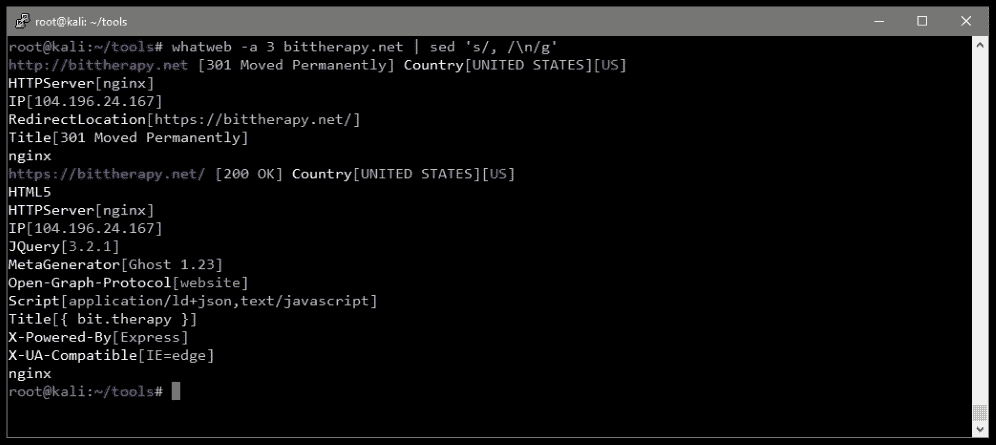

# 第二章 高效发现

内容发现和信息收集通常是攻击应用程序的第一步。目标是在最短的时间内尽可能多地了解应用程序。时间是我们没有的奢侈品，我们必须充分利用有限的资源。

效率也可以帮助我们在攻击应用程序时保持稍微安静一些。智能词汇表将减少我们向服务器发出的请求数量，并更快地返回结果。这不是万灵药，但它是一个很好的起点。

在本章中，我们将涵盖以下主题：

+   不同类型的渗透测试参与

+   使用各种网络和 Web 扫描仪进行目标映射

+   高效的暴力破解技术

+   多语言有效载荷

# 评估类型

根据与客户在参与之前的协议，你可能已经拥有所需的部分信息、大量信息，或者根本没有任何信息。**白盒**测试允许对应用程序进行彻底检查。在这种情况下，攻击者基本上拥有与开发者相同的访问权限。他们不仅有经过身份验证的访问权限，而且还可以访问源代码、任何设计文档以及他们需要的任何其他资源。

白盒测试通常由内部团队执行，且相当耗时。测试人员会获得他们评估应用程序或基础设施所需的所有信息。提供这种知识水平的好处是，测试人员可以查看应用程序的每一部分，检查是否存在漏洞。这是外部攻击者所没有的奢侈品，但它确实能在参与过程中有效利用有限的时间和资源。

**灰盒**场景更为常见，因为它们提供了足够的信息，使测试人员能够直接开始探测应用程序。客户可能会提供凭据以及一些关于基础设施或应用程序设计的信息，但不会提供更多。这里的思路是客户假设恶意行为者已经获得了某种程度的访问权限或知识，客户需要了解还能够造成多少更大的破坏。

最后，**黑盒**测试将模拟从外部人员的角度发起的攻击，攻击者对应用程序或基础设施一无所知。公开应用程序到互联网的公司通常会受到外部威胁的持续攻击。虽然重要的是要记住，并非所有恶意行为者都是外部人员，因不满的员工也可能造成同样的破坏，但恶意的黑盒类型攻击相对常见，且可能造成严重损害。

以下是三种常见的应用程序渗透测试类型的细分：

| 白盒 | 灰盒 | 黑盒 |
| --- | --- | --- |
| 攻击者可以访问所有所需信息。 | 有部分信息可用。 | 完全不了解。 |
| 以最高权限进行测试，即具有开发者知识的测试。 | 从已具备一定访问权限或知识的威胁角度进行测试。 | 从外部威胁角度进行测试。 |

| 可用的典型信息包括以下内容：

+   用户账户

+   源代码

+   基础设施设计文档

+   目录列表

| 向攻击者提供一些信息：

+   用户账户

+   高级文档

    攻击者通常无法访问源代码或其他敏感信息

| 未提前提供任何信息，攻击者必须通过**开源情报**（**OSINT**）或导致信息泄漏的漏洞收集所需的所有信息。 |
| --- |

### 注意

在本书的其余部分，我们将从更接近灰盒测试的角度接近我们的目标，模拟典型的渗透测试过程。

# 目标映射

对整个端口范围进行传统的 `nmap` 扫描并进行服务发现，总是收集目标信息的一个好方法。**Nmap** 是选择的网络扫描工具，已经使用多年。它仍然非常强大且相关。它可用于大多数平台，包括 Kali、BlackArch，甚至是 Windows。

**Metasploit Framework**（**MSF**）是渗透测试框架，通常由安全专业人员使用。除了是一个易于交付的漏洞利用工具集外，它还可以帮助组织渗透测试过程。特别是在目标映射方面，你可以利用工作区功能，并将 Nmap 扫描结果整齐地存储在数据库中。

如果 Kali Linux 实例是新安装的，或者 Metasploit 最近安装过，数据库可能需要一些启动操作才能正常运行。

在 Kali 控制台提示符下，使用`service`命令启动**PostgreSQL**服务。如果成功，则不应返回任何消息：

```
**root@kali:~# service postgresql start**
**root@kali:~#**

```

然后，可以使用`msfconsole`命令启动 Metasploit，这将使我们进入一个子提示符，提示符前缀是`msf`，而不是传统的 bash 提示符：

```
root@kali:~# **msfconsole**
[...]
msf > **db_status**
[*] postgresql selected, no connection
msf >
```

上述命令序列将启动 PostgreSQL 数据库服务，Metasploit 使用它来进行存储。Metasploit 控制台会启动，我们可以使用 MSF 的`db_status`命令检查数据库状态。

我们可以使用`exit`命令返回到 bash 终端：

```
msf > **exit**
root@kali:~#
```

现在，我们可以使用 Metasploit 的`msfdb`命令来帮助我们初始化（`init`）数据库：

```
root@kali:~# **msfdb init**
Creating database user 'msf'
Enter password for new role:
Enter it again:
Creating databases 'msf' and 'msf_test'
Creating configuration file in **/usr/share/metasploit-framework/config/database.yml**
Creating initial database schema
root@kali:~#
```

`msfdb`命令会创建所有必要的配置文件，供 Metasploit 连接到数据库。我们再次可以通过在 Linux 提示符下使用`msfconsole`命令启动 Metasploit 控制台：

```
root@kali:~# **msfconsole**
[...]
msf > 
```

使用`msfdb init`命令创建的 YML 数据库配置文件，可以与`-y`开关一起传递给`db_connect` Metasploit 控制台命令：

```
msf > **db_connect -y /usr/share/metasploit-framework/config/database.yml**
[*] Rebuilding the module cache in the background...
msf > db_status
[*] postgresql connected to msf
msf > 
```

我们现在可以为目标应用程序创建一个工作区，这将帮助我们组织来自不同 MSF 模块、扫描或漏洞利用的结果：

```
msf > workspace -a **target1**
[*] Added workspace: target1
msf > workspace
  default
*** target1**

```

`workspace` 命令不带任何参数时将列出可用的工作区，并用星号标记当前活动的工作区。此时，我们可以在 MSF 内部启动 Nmap 扫描。`db_nmap` MSF 命令是 Nmap 扫描工具的一个封装。不同之处在于，扫描结果会被解析并存储在 Metasploit 数据库中，便于浏览。

MSF 的 `db_nmap` 接受与正常的 `nmap` 相同的选项。在以下示例中，我们正在扫描常见端口并查询正在运行的服务。

此次扫描的目标是一个内部主机，`10.0.5.198`。我们指示 Nmap 执行服务扫描（`-sV`），并且不对主机进行 ping 测试（`-Pn`），同时使用详细输出（`-v`）：

```
msf > **db_nmap -sV -Pn -v 10.0.5.198**
[...]
[*] Nmap: Scanning 10.0.5.198 [1000 ports]
[*] Nmap: Discovered open port 3389/tcp on 10.0.5.198
[*] Nmap: Discovered open port 5357/tcp on 10.0.5.198
[*] Nmap: Completed SYN Stealth Scan at 19:50, 12.05s elapsed (1000 total ports)
[*] Nmap: Initiating Service scan at 19:50
[...]
```

扫描完成后，结果可以通过 `services` 命令进行查询和筛选。例如，我们可以使用 `-s` 选项查找所有发现的 HTTP 服务：

```
**msf > services -s http**
**Services**
**========**
**host        port  proto  name  state  info**
**----        ----  -----  ----  -----  ----**
**10.0.5.198  5357  tcp    http  open   Microsoft HTTPAPI httpd 2.0 SSDP/UPnP**

```

### 注意

注意客户提供的范围。有些客户会特别限制应用程序测试在一个端口上，或者有时仅限于一个子域或 URL。此时应当劝告客户不要限制测试者可用的攻击面。

## Masscan

Nmap 功能全面，拥有大量的选项和能力，但存在一个问题：速度。对于大型网络段，Nmap 可能非常慢，有时甚至完全失败。在渗透测试中，客户通常会要求在有限的时间内对庞大的 IP 空间进行映射和扫描。

**masscan** 的最大亮点在于，它可以在大约六分钟内扫描整个互联网的 IP 空间。这是一个令人印象深刻的成就，毫无疑问，它是目前最快的端口扫描器之一。

在进行渗透测试时，我们可能希望优先针对 Web 应用程序进行测试，`masscan` 可以通过几个简单的选项快速返回所有开放的 Web 端口。

熟悉的 `-p` 选项可以用来指定一系列端口或端口范围进行查找。`--banners` 选项将尝试获取任何发现的开放端口的一些信息。对于较大的 IP 空间，时间至关重要时，我们可以使用 `--rate` 选项指定一个较大的每秒数据包数，如一百万或更多：


图 2.1：对 10.0.0.0/8 网络进行的 masscan 扫描

我们可以看到，之前的扫描由于 *Ctrl* + *C* 中断而提前取消，masscan 保存了其进度到 `paused.conf` 文件中，这使我们能够稍后恢复扫描。要从中断处继续，我们可以使用 `--resume` 选项，并将 `paused.conf` 文件作为参数传递：


图 2.2：恢复 masscan 会话

Masscan 的结果可以传递给 Nmap 进行进一步处理，或者传递给 Web 扫描器以进行更深入的漏洞发现。

## WhatWeb

一旦通过 masscan 或 Nmap 确定了目标环境中一个或多个 web 应用程序，我们就可以开始深入挖掘。**WhatWeb** 是一个简单但有效的工具，可以查看特定的 web 应用程序，并识别出开发和运行该应用所使用的技术。它拥有超过 1,000 个插件，能够被动识别从应用上运行的**内容管理系统**（**CMS**），到运行整个应用的 **Apache** 或 **NGINX** 版本等各种信息。

以下图示展示了对 `bittherapy.net` 进行的更为激进的（`-a 3`）WhatWeb 扫描。所示的 `sed` 命令将格式化输出，使其更易阅读：



图 2.3：运行 WhatWeb 并过滤结果

三级激进扫描将进行更多的请求，以帮助提高结果的准确性。

WhatWeb 可在 Kali Linux 和大多数其他渗透测试发行版上使用。也可以从 [`github.com/urbanadventurer/WhatWeb`](https://github.com/urbanadventurer/WhatWeb) 下载。

## Nikto

**Nikto** 在任务的初期阶段提供了很大价值。它相对不具侵入性，并且凭借其内建插件，能够快速提供关于应用程序的洞察。它还提供一些更为激进的扫描功能，这些功能可能对旧的应用程序或基础设施产生成功效果。

如果任务不要求攻击者特别隐蔽，那么也可以运行噪音较大的 Nikto 选项。Nikto 可以猜测子域名、报告不寻常的头信息，并检查 `robots.txt` 文件中的有趣信息：


图 2.4：example.com 域的标准扫描

Nikto 输出关于 HTTPS 证书、服务器横幅、可能缺失的任何安全相关 HTTP 头信息，以及其他可能有用的信息。它还注意到服务器横幅在请求之间发生了变化，表明可能配置了 WAF 来保护应用程序。

Nikto 可以从 [`github.com/sullo/nikto`](https://github.com/sullo/nikto) 下载。它也可以在大多数渗透测试专用的 Linux 发行版上找到，如 Kali 或 BlackArch。

## CMS 扫描器

当目标使用 CMS（如**Joomla**、**Drupal**或**WordPress**）时，运行自动化漏洞测试工具应成为你的下一步。

WordPress 是一个流行的 CMS，因为它提供几乎适用于任何类型站点的插件，使其非常可定制并广泛采用，但同时也很复杂，攻击面较大。它有大量易受攻击的插件，且用户通常不频繁升级这些插件。

在测试过程中，你可能会发现某个插件中存在一个可以远程利用的漏洞，提供一个 shell，但通常来说，WordPress 是一个信息宝库。用户名可以被枚举，密码往往较弱且容易暴力破解，或者目录索引可能已启用。WordPress 的内容文件夹有时也包含管理员“临时”上传的敏感文件。在后续章节中，我们将看到如何利用配置不当的 WordPress 实例攻击应用服务器，并在网络中横向渗透。

WordPress 并非唯一存在这种问题的系统。Joomla 和 Drupal 也非常流行，并且也存在许多与 WordPress 安装相同的漏洞和配置问题。

有一些免费的扫描器可供使用，旨在测试这些 CMS 中的低悬果实：

+   **WPScan** ([`wpscan.org/`](https://wpscan.org/)): 一个强大的工具，用于测试 WordPress 安装

+   **JoomScan** ([`github.com/rezasp/joomscan`](https://github.com/rezasp/joomscan)): 如其名称所示，是一个专注于 Joomla 测试的 CMS 扫描器

+   **droopescan** ([`github.com/droope/droopescan`](https://github.com/droope/droopescan)): 一个专门针对 Drupal 的扫描器，同时支持一些 Joomla

+   **CMSmap** ([`github.com/Dionach/CMSmap`](https://github.com/Dionach/CMSmap)): 一个更通用的扫描器和暴力破解工具，支持 WordPress、Joomla 和 Drupal

### 注意

在进行 WordPress 扫描之前，请确保它托管在参与范围内。一些 CMS 实现会将核心站点托管在本地，但插件或内容目录则位于独立的**内容分发网络**（**CDN**）上。这些 CDN 主机可能需要提交渗透测试通知表单，才能将其包含在测试中。

我们将在后续章节中更详细地介绍 CMS 评估工具，如 WPScan。

# 高效的暴力破解

暴力破解攻击通常涉及大量请求或猜测，以获得访问权限或揭示可能隐藏的信息。我们可能会对管理面板的登录表单进行暴力破解，寻找常用的密码或用户名。我们还可能对 Web 应用的根目录进行暴力破解，寻找常见的配置错误和错误放置的敏感文件。

许多成功的渗透测试正是通过弱凭据或应用配置错误实现的。暴力破解可以帮助揭示可能被隐藏的信息，或者因开发人员忘记更改默认凭据而获得对数据库的访问权限。

强行破解存在明显的挑战。主要是它非常耗时，并且可能非常嘈杂。例如，使用臭名昭著的`rockyou.txt`词表对一个 Web 服务进行强行破解，毫无疑问会引起你友好的邻居**安全运营中心**（**SOC**）分析员的注意，并可能会早早地终止你的活动。`rockyou.txt`列表包含超过 1400 万个条目，最终可能会成功猜测凭证，但限制流量洪流并使用更小、更高效的列表可能更好。

其中一个更好的常见关键词、凭证、目录、有效负载甚至 Webshell 集合是**SecLists**库：[`github.com/danielmiessler/SecLists`](https://github.com/danielmiessler/SecLists)。

### 注意

一个替代方案或补充方案是**FuzzDB**。它是一个类似的文件集合，包含各种有效负载，可以帮助进行强行破解，它也可以从 GitHub 库中下载：[`github.com/fuzzdb-project/fuzzdb`](https://github.com/fuzzdb-project/fuzzdb)。

使用流行的版本控制系统工具`git`获取 SecLists 的最新副本非常容易。我们可以使用`git clone`命令拉取这个库：

```
**root@kali:~/tools# git clone https://github.com/danielmiessler/SecLists**

```

SecLists 包含一个不断发展的编译词表数据库，可以用于发现扫描、强行破解攻击等多种用途：

| SecList Wordlist | 描述 |
| --- | --- |
| `Discovery` | Web 内容、DNS 和常见的 Nmap 端口 |
| `Fuzzing` | FuzzDB、Brutelogic、Polyglot 有效负载等 |
| `IOCs` | 恶意软件相关的妥协指标 |
| `Miscellaneous` | 可能有特殊用途的各种词表 |
| `Passwords` | 大量的常见密码词表，按前 N 个文件拆分 |
| `Pattern-Matching` | 用于“grep”感兴趣信息的词表 |
| `Payloads` | 常见语言的 Webshell、Windows Netcat 和 EICAR 测试文件 |
| `Usernames` | 常见名字和登录 ID 的列表 |

安全社区是 SecLists 的频繁贡献者，在开始工作之前，从 GitHub 拉取最新的更改是个好习惯。

希望目标映射已经提供了一些有助于更有效强行破解的关键信息。虽然 Nikto 和 Nmap 可能无法总是找到快速且简单的远程代码执行漏洞，但它们确实返回了在决定使用哪个词表进行发现时可能有用的数据。

有用的信息可能包括以下内容：

+   Web 服务器软件：Apache、NGINX 或 IIS

+   服务器端开发语言：ASP.NET、PHP 或 Java

+   底层操作系统：Linux、Windows 或嵌入式

+   `robots.txt`

+   有趣的响应头

+   WAF 检测：*F5*或 Akamai

你可以根据前面列表中展示的非常简单的信息对应用程序做出假设。例如，IIS web 服务器更可能运行用 ASP.NET 开发的应用程序，而非 PHP。尽管 PHP 在 Windows 上仍然可用（通过 XAMPP），但在生产环境中不常见。相比之下，尽管 Linux 系统上也有 Active Server Pages (ASP) 处理器，PHP 或 Node.js 在当今环境中要更为常见。在进行文件暴力破解时，你可以在将扩展名附加到有效负载时考虑这一点：Windows 目标使用 `.asp` 和 `.aspx`，而 Linux 目标则可以使用 `.php`，这是一个好的起点。

`robots.txt` 文件通常很有趣，因为它可以提供“隐藏”的目录或文件，是进行目录或文件暴力破解时的一个良好起点。`robots.txt` 文件本质上是为合法的爬虫机器人提供指令，告诉它们可以索引什么，应该忽略什么。这是一种方便实现此协议的方式，但它意味着该文件必须对匿名用户（包括你自己）可读。

一个示例 `robots.txt` 文件大致如下：

```
User-agent: *
Disallow: /cgi-bin/
Disallow: /test/
Disallow: /~admin/
```

谷歌的爬虫会忽略子目录，但你不能忽略。这对即将进行的扫描来说是有价值的信息。

## 内容发现

我们已经提到过两个在初步发现扫描中非常有用的工具：**OWASP ZAP** 和 **Burp Suite**。Burp 的 Intruder 模块在免费版中有速率限制，但仍然可以用于快速检查。这两个攻击代理都可以在 Kali Linux 上使用，并且可以很容易地为其他发行版下载。还有其他命令行替代工具，比如 **Gobuster**，可以用来稍微自动化这个过程。

### Burp Suite

如前所述，Burp Suite 随 Intruder 模块捆绑，允许我们轻松地进行内容发现。我们可以利用它查找隐藏的目录和文件，甚至猜测凭证。它支持有效负载处理和编码，使我们能够定制扫描，以更好地与目标应用程序进行交互。

在 Intruder 模块中，你可以利用 SecLists 提供的相同单词列表，甚至可以将多个列表组合成一个攻击。这是一个强大的模块，具有许多功能，包括但不限于以下内容：

+   集群炸弹攻击，适用于多个有效负载，例如用户名和密码，我们将在后面展示。

+   高度定制化攻击的有效负载处理

+   攻击速率限制和低速攻击的可变延迟

+   …以及更多内容！

我们将在后面的章节中介绍这些内容和其他功能。


图 2.5：Burp Suite Intruder 模块的有效负载屏幕

Burp Suite 的免费版可以在 Kali Linux 中轻松获取，但正如我们在上一章中提到的，它有些限制。Intruder 模块中存在一些限制，特别是攻击连接的时间限制。对于大量负载，可能会成为障碍。

Burp Suite 的专业版非常推荐给那些定期进行应用程序测试的人。Burp Suite 在逆向工程应用程序或协议时也非常有价值。现代应用程序或恶意软件通过 HTTP 与外部服务器进行通信是很常见的。拦截、修改和重放这些流量非常有价值。

### OWASP ZAP

Burp Suite 的免费替代工具是 ZAP，它本身就是一个强大的工具，并提供了 Burp Suite 的一些发现能力。

Burp 的 Intruder 模块的 ZAP 等效模块是**Fuzzer**模块，具有类似的功能，如下图所示：


图 2.6：OWASP ZAP 的 Fuzzer 模块配置。由于 ZAP 是开源的，因此没有使用限制。如果目标是进行快速的内容发现扫描或凭证暴力破解，它可能是 Burp Suite 免费版的更好替代方案。

### Gobuster

Gobuster 是一个高效的命令行工具，用于内容发现。Gobuster 并未预安装在 Kali Linux 中，但它可以从 GitHub 获得。顾名思义，Gobuster 是用 Go 语言编写的，并且在使用之前需要安装 golang 编译器。

在 Kali Linux 上配置 Gobuster 的步骤相当简单。我们可以通过执行以下命令开始：

```
**root@kali:~# apt-get install golang**

```

上述命令将全局安装 Go 编译器。这是构建 Gobuster 最新版本所必需的。

接下来，你需要确保`GOPATH`和`GOBIN`环境变量正确设置。我们将`GOPATH`指向我们主目录中的`go`目录，并将`GOBIN`设置为新定义的`GOPATH`值：

```
**root@kali:~# export GOPATH=~/go**
**root@kali:~# export GOBIN=$GOPATH**

```

我们现在可以通过`git clone`命令从 GitHub 拉取 Gobuster 的最新版本：

```
root@kali:~/tools# git clone https://github.com/OJ/gobuster
Cloning into 'gobuster'...
[...]
```

然后，我们可以获取依赖并编译 Gobuster 应用程序。`go get`和`go build`命令将在本地目录中生成 Gobuster 二进制文件：

```
**root@kali:~/tools/gobuster# go get && go build**

```

如果命令没有产生输出，说明工具已被编译并准备好使用：

```
**root@kali:~/tools/gobuster# ./gobuster** 
**Gobuster v1.3                OJ Reeves (@TheColonial)**
**=====================================================**
**[!] WordList (-w): Must be specified**
**[!] Url/Domain (-u): Must be specified**
**=====================================================**
**root@kali:~/tools/gobuster#** 

```

Gobuster 具有许多有用的功能，包括通过代理（例如本地 Burp Suite 实例）进行攻击、将输出保存到文件以供进一步处理，甚至对目标域进行子目录的暴力破解。

下图显示了 Gobuster 使用 SecLists 库中的常见 Web 内容文件对`http://10.0.5.181`进行发现扫描：


图 2.7：在 10.0.5.181 服务器上运行的 Gobuster 示例

在无法运行完整的**图形用户界面**（**GUI**）应用程序（例如 Burp 或 ZAP）的系统上，命令行 URL 发现工具可能会非常有用。

## 持久化内容发现

某次扫描的结果可能会揭示有趣的目录，但这些目录并不总是可以访问的，且应用程序中的目录索引越来越罕见。幸运的是，通过使用内容发现扫描，我们可以检查目录内是否存在其他配置错误的敏感信息。假设应用程序托管在`http://10.0.5.181/`，其中包含一个可能受到密码保护的特定目录。应用程序中的常见配置错误是保护父目录，却错误地认为所有子目录也会被保护。这导致开发人员将更敏感的目录放在父目录中，并忽略了它们。

之前检查`robots.txt`文件时，发现了一些有趣的目录：

```
**Disallow: /cgi-bin/**
**Disallow: /test/**
**Disallow: /~admin/**

```

`admin`目录引起了注意，但尝试访问`/~admin/`返回了 HTTP `403` Forbidden 错误：


图 2.8：访问该目录被禁止

这可能令人沮丧，但我们不能就此止步。目标目录太有吸引力，不值得放弃。通过使用 OWASP ZAP，我们可以对该目录启动新的 Fuzzer 任务，看看是否能找到任何未受保护的有价值信息。

确保光标位于最左侧面板中的 URL 末尾。点击最右侧面板中**Fuzz Locations**旁边的**添加**按钮：


图 2.9：Fuzzer 配置，添加 Fuzz Locations

在下一个屏幕上，我们可以为**Fuzzer**添加一个新的负载。我们将从 SecLists 存储库中选择`raft-small-files.txt`字典：


图 2.10：Fuzzer 配置 – 添加负载屏幕

由于我们希望将`/~admin` URI 视为目录并在其中查找文件，我们需要为选定的负载使用字符串处理器。这将是一个简单的**前缀字符串**处理器，它会在列表中的每个条目前添加一个正斜杠。


图 2.11：Fuzzer 配置 – 添加处理器屏幕

Fuzzer 任务可能需要一段时间才能完成，并且会产生大量的`403`或`404`错误。在这种情况下，我们能够找到一个隐藏的管理文件。


图 2.12：完成的 Fuzzer 扫描显示了一个可访问的隐藏文件

HTTP `200`响应表示我们能够访问此文件，即使父目录`/~admin/`不可访问。看来我们可以访问包含在引人注目的`admin`目录中的`admin.html`文件。

应用程序安全性难以正确实现，随着应用程序的老化、演变以及员工更替，保持初始的安全基准变得更加困难。访问权限被授予却未被撤销；文件被添加且权限错误；底层操作系统和框架逐渐过时，容易受到远程攻击。

在进行初步内容发现扫描时，重要的是要记住不要停留在我们看到的第一个错误信息上。访问控制漏洞非常常见，如果我们坚持下去，可能会发现各种未保护的子目录或文件。

## 有效载荷处理

Burp Suite 的 Intruder 模块是攻击者在针对 Web 应用程序时的强大盟友。早期的发现扫描已经识别出一个隐藏但诱人的 `/~admin/` 目录。随后的目录扫描揭示了一个未保护的 `admin.html` 文件。

在继续之前，我们将切换到 Burp Suite 攻击代理，并将 **目标范围** 配置为 `vuln.app.local` 域：


图 2.13：Burp Suite 目标范围配置屏幕

**目标范围** 允许我们定义要包括在攻击范围内的主机、端口或 URL。这有助于过滤掉可能与我们目标无关的流量。配置 Burp Suite 作为我们的攻击代理后，我们可以访问隐藏的 `admin.html` URL，并在代理历史中记录该流量：


图 2.14：通过浏览器访问隐藏文件成功

跟随 **服务器连接测试** 链接，我们进入了一个基本认证域 **管理员工具**，如图所示：


图 2.15：尝试访问链接时的身份验证弹窗

我们的渗透测试反应迅速，本能地输入了不幸常见的 `admin/admin` 凭据，但这次没有成功。

由于与目标的所有交互都被 Burp 代理记录，我们只需将失败的请求传递给 Intruder 模块，如下图所示。Intruder 将使我们能够轻松地攻击基本认证机制：


图 2.16：HTTP 历史记录屏幕

在 Intruder 模块中，默认设置大多是有效的——我们只需要选择 `Authorization` 头中的 Base64 编码凭据部分，并点击右侧的 **添加** 按钮。这样就会将 HTTP 请求中的这一位置标记为有效载荷位置。

以下展示了在 `Authorization` 头部中选择的有效载荷位置：


图 2.17：指定 Authorization 头中的有效载荷位置

在 **有效载荷** 标签中，我们将从下拉菜单中选择 **自定义迭代器** 有效载荷类型，如下图所示：


图 2.18：配置有效载荷类型

`Authorization`头部包含以冒号分隔的用户名和密码的 Base64 编码明文值。为了有效地暴力破解应用程序，载荷必须与此格式一致。我们需要提交一个按照`Authorization`头部要求的格式进行的载荷。每个攻击代理的暴力破解请求所使用的载荷都必须是由冒号分隔的用户名和密码，并进行 Base64 编码：`base64([user_payload]:[password_payload])`。

我们可以获取已捕获的`Authorization`头部的值，并将其传递给 Burp Suite 的 Decoder 模块。Decoder 允许我们快速处理不同编码方案之间的字符串，如 Base64、URL 编码、GZip 等。

这张图显示了我们如何利用 Decoder 将`YWRtaW46YWRtaW4=`的 Base64 值转换为**解码为...**下拉框中显示的内容。结果会在底部窗格中列出为`admin:admin`：


图 2.19：Burp Decoder 屏幕

返回到入侵者模块，对于载荷位置 1，我们将再次使用来自 SecLists `Usernames`集合的一个小型字典文件，名为`top-usernames-shortlist.txt`。我们的目标是找到容易破解的账户，同时尽量减少对应用程序的请求压力。使用一个常见的高价值用户名短列表是一个不错的第一步。

这张图显示了如何使用**载荷选项**中的**加载...**按钮将字典列表加载到位置 1 中：


图 2.20：载荷位置 1 配置屏幕

位置 1 的分隔符应为冒号（`:`）。对于位置 2 的载荷，你可以使用 SecLists 密码目录中的`500-worst-passwords.txt`列表。

下图显示了载荷位置 2 包含加载的`500-worst-passwords.txt`文件内容：


图 2.21：载荷位置 2 配置屏幕

位置 2 的分隔符应留空。

此时，发送到应用程序的每个请求将包含如下格式的`Authorization`头部：

```
Authorization: Basic admin:admin
Authorization: Basic admin:test
[...]
Authorization: Basic root:secret
Authorization: Basic root:password
```

为了完成载荷配置，我们还需要指示入侵者在发送请求前将载荷进行 Base64 编码。我们可以使用一个载荷处理器来强制对每个请求进行 Base64 编码。

在**载荷**标签下，点击**载荷处理**，选择**添加**，然后从**编码**类别中选择**Base64 编码**处理器。我们还将禁用自动 URL 编码，因为它可能会破坏`Authorization`头部。

以下 URL 显示了启用的**Base64 编码**处理器：


图 2.22：载荷处理规则 - Base64 编码

一旦载荷配置完成，我们可以通过点击**入侵者**模块右上角的**开始攻击**按钮，开始暴力破解，如下图所示：


图 2.23：开始攻击

与内容发现扫描类似，这种凭证暴力破解会生成相当数量的 HTTP `401` 错误。如果幸运的话，至少会有一次是成功的，正如接下来的图所示：


图 2.24：攻击结果界面

现在，因为每个入侵者攻击的请求都会被记录，我们可以检查每一个请求，或者通过列排序来更清晰地展示攻击结果。在前面的示例中，我们可以清楚地看到，成功的身份验证请求返回了 HTTP 状态码 `200`，而大多数其他请求返回了预期的 `401`。不过，状态码并不是唯一能够快速判断攻击是否成功的方式。响应内容长度的偏差可能是一个很好的指标，表明我们正走在正确的道路上。

现在我们有一个有效载荷，成功获取了 Admin Tools 身份验证区域的访问权限，我们可以通过解码器模块查看明文凭证。

该图展示了解码器模块揭示的猜测凭证：


图 2.25：Burp Suite 解码器

凭证暴力破解只是入侵者模块众多用途之一。您可以利用自定义有效载荷和有效载荷处理来发挥创意。

假设一个场景，`vuln.app.local` 应用程序生成包含敏感信息的 PDF 文件，并将其存储在一个名为 `/pdf/` 的未保护目录中。文件名似乎是文件生成日期的 MD5 摘要，但应用程序并不会每天都生成 PDF 文件。你可以尝试手动猜测每一天的文件名，但那并不理想。你甚至可以花点时间编写一个 Python 脚本来自动化这个任务。更好的替代方法是利用 Burp Suite，通过几次点击轻松完成这一任务。此外，这种方法还有一个好处，就是可以在一个窗口中记录攻击响应，方便检查。

我们可以再次将之前记录的请求直接发送到目标 `/pdf/` 文件夹，传递给入侵者模块。

该图显示，PDF 文件的名称（不包括扩展名）被识别为有效载荷位置，并使用**添加**按钮进行标识：


图 2.26：入侵者有效载荷位置配置界面

下图展示了在入侵者模块中可用的**日期**有效载荷类型选项：


图 2.27：入侵者的有效载荷界面

在此攻击中，您将使用**日期**有效载荷类型，并使用适当的日期格式，回溯几年的数据。有效载荷处理器将是 MD5 哈希生成器，它将生成每个日期的哈希值并返回相应的字符串。这类似于我们在上一轮攻击中使用的**Base64 编码**处理器。

再次配置好有效载荷选项后，我们可以开始攻击。

下图显示了一些带有`200` HTTP 状态码和大长度的请求，表示可以下载 PDF 文件：


图 2.28：入侵者攻击结果屏幕

入侵者将根据我们指定的日期格式生成负载列表，并计算字符串的哈希值，然后在几次点击后将其发送到应用程序。在很短的时间内，我们发现了至少三个未受适当保护、可能包含敏感信息的文档可以匿名访问。

# 多语言负载

多语言负载被定义为可以在应用程序中的多个上下文中执行的代码片段。攻击者喜欢这种类型的负载，因为它们可以快速测试应用程序的输入控件是否存在任何弱点，而且干扰很小。

在一个复杂的应用程序中，用户输入可能会经过许多检查点——从 URL 经过过滤器，进入数据库，再返回到解码器，最后显示给用户，如下图所示：


图 2.29：用户到应用程序的典型数据流

沿途的任何一步都可能改变或阻止负载，这可能会使确认应用程序中漏洞存在变得更加困难。多语言负载将尝试通过在同一流中结合多种执行代码的方法来利用注入漏洞。这试图利用应用程序负载过滤的弱点，增加代码至少有一部分被忽略并成功执行的机会。这是由于 JavaScript 是一种非常宽容的语言。浏览器一直是开发者的一个简单的入门障碍，而 JavaScript 根植于类似的哲学。

OWASP **跨站脚本**（**XSS**）绕过过滤器的秘籍包含了一些多语言负载的示例，这些负载也可以规避一些应用程序过滤器：[`www.owasp.org/index.php/XSS_Filter_Evasion_Cheat_Sheet`](https://www.owasp.org/index.php/XSS_Filter_Evasion_Cheat_Sheet)。

一个很好的强多语言负载示例可以在研究员 Ahmed Elsobky 的 GitHub 上找到：

```
jaVasCript:/*-/*'/*\'/*'/*"/**/(/* */oNcliCk=alert() )//%0D%0A%0d%0a//</stYle/</titLe/</teXtarEa/</scRipt/--!>\x3csVg/<sVg/oNloAd=alert()//>\x3e
```

乍一看，这似乎有些混乱，但每个字符都有其目的。这个负载旨在在各种上下文中执行 JavaScript，无论代码是反映在 HTML 标签内部还是直接位于另一段 JavaScript 代码中。浏览器的 HTML 和 JavaScript 解析器非常包容。它们不区分大小写，对错误友好，并且不太关心缩进、换行或空格。转义或编码的字符有时会被转换回其原始形式并注入到页面中。特别是 JavaScript 会尽其所能执行传递给它的任何代码。一个好的多语言负载将利用所有这些，并试图规避一些过滤。

敏锐的观察者首先会注意到，大多数关键字，如`textarea`、`javascript`和`onload,`，都是随机大写的：

```
**jaVasCript**:/*-/*'/*\'/*'/*"/**/(/* */**oNcliCk**=alert() )//%0D%0A%0d%0a//</stYle/</titLe/</**teXtarEa**/</scRipt/--!>\x3csVg/<sVg/**oNloAd**=alert()//>\x3e
```

这看起来像是试图逃避应用防火墙输入过滤器的徒劳尝试，但你会惊讶地发现，许多设计都很糟糕。考虑以下**正则表达式**（**regex**）输入过滤器：

```
s/onclick=[a-z]+\(.+\)//**g**

```

### 注意

正则表达式是一段定义搜索模式的文本。一些 WAF 可能会使用正则表达式来尝试查找 HTTP 请求中的潜在危险字符串。

这将有效地防止通过`onclick`事件注入 JavaScript 代码，但有一个明显的缺陷：它没有考虑大小写敏感性。正则表达式有许多修饰符，例如前面示例中的`g`，并且默认情况下，大多数引擎需要`i`修饰符来忽略大小写，否则它们不会匹配，过滤器也会容易被绕过。

下图展示了 Regex101 将前面的正则表达式应用于一个示例测试字符串的可视化效果。我们可以看到，四个测试的有效载荷中只有两个与该表达式匹配，而所有四个都将执行 JavaScript 代码：


图 2.30：正则表达式过滤器可视化

### 提示

在评估应用程序的基于正则表达式的输入过滤器时，Regex101 是一个很好的地方，可以同时测试多个有效载荷。Regex101 是一个免费的在线工具，网址是[`regex101.com`](https://regex101.com)。

许多时候，开发人员在不现实的时间压力下工作。当渗透测试报告指出特定的输入清理问题时，开发人员面临压力，需要提交一个快速编写、安全性不足、只修复部分问题的安全修复。实施一个可能会破坏应用程序的框架来处理输入过滤通常既耗时又昂贵，因此往往在安全性上采取捷径。

Elsobky 有效载荷的目标还包括通过引擎处理经过反斜杠转义的十六进制编码值。例如，JavaScript 和 Python 会将以`\x`为前缀的两个字母数字字符处理为一个字节。这可以绕过某些执行原始字符串比较检查的内联 XSS 过滤器：

```
jaVasCript:/*-/*'/*\'/*'/*"/**/(/* */oNcliCk=alert() )//%0D%0A%0d%0a//</stYle/</titLe/</teXtarEa/</scRipt/--!>\**x3c**sVg/<sVg/oNloAd=alert()//>\**x3e**

```

可能有效载荷会被剥离掉大部分其他关键字，但当过滤器遇到`\x3c`和`\x3e`时，它会将其解释为无害的四个字符字符串。应用程序可能会解析该字符串，并不经意地返回转义的十六进制字符`<`和`>`的一个字节等效值。结果是一个`<svg>`HTML 元素，通过`onload`事件执行任意 JavaScript。

### 注意

**可伸缩矢量图形**（**SVG**）是网页上的一个元素，可以在屏幕上绘制复杂的图形，而无需使用二进制数据。SVG 在 XSS 攻击中使用，主要因为它提供了`onload`属性，当元素被浏览器渲染时，会执行任意的 JavaScript 代码。

### 注意

更多关于此特定多语言代码强大功能的示例，见 Elsobky 的 GitHub 页面：[`github.com/0xSobky`](https://github.com/0xSobky)。

一个强大的多语言代码负载能够在多种注入场景下执行一些代码。Elsobky 的负载也可以在反射到服务器 HTTP 响应时发挥作用：

```
jaVasCript:/*-/*'/*\'/*'/*"/**/(/* */oNcliCk=alert() )//%0D%0A%0d%0a//</stYle/</titLe/</teXtarEa/</scRipt/--!>\x3csVg/<sVg/oNloAd=alert()//>\x3e
```

URL 编码字符`%0d`和`%0a`表示换行和回车。这些字符在 HTML 和 JavaScript 解析器中大多被忽略，但它们在 HTTP 请求或响应头中具有重要意义。

如果目标应用未正确过滤用户输入，在某些情况下，它可能会将任意值作为 HTTP 响应的一部分返回。例如，在尝试设置“记住我”Cookie 时，应用程序未过滤负载，直接在 HTTP 响应头中反射该负载，从而在用户的浏览器中造成 XSS：

```
GET /save.php?remember=username HTTP/1.1
Host: www.cb2.com
User-Agent: Mozilla/5.0 (X11; Linux x86_64; rv:45.0) Gecko/20100101 Firefox/45.0
Content-Type: application/x-www-form-urlencoded; charset=UTF-8
[...]
HTTP/1.1 200 OK
Cache-Control: private
Content-Type: text/html; charset=utf-8
Server: nginx/1.8.1
Set-Cookie: remember_me=username
Connection: close
Username saved!
```

如果我们将多语言负载作为用户名传入并记住，HTTP 响应头会被更改，正文将包含攻击者控制的数据，如下所示：

```
GET /save.php?remember=**jaVasCript%3A%2F*-%2F*%60%2F*%60%2F*'%2F*%22%2F**%2F(%2F*%20*%2FoNcliCk%3Dalert()%20)%2F%2F%0D%0A%0d%0a%2F%2F%3C%2FstYle%2F%3C%2FtitLe%2F%3C%2FteXtarEa%2F%3C%2FscRipt%2F--!%3E%3CsVg%2F%3CsVg%2FoNloAd%3Dalert()%2F%2F%3E%3E** HTTP/1.1
Host: www.cb2.com
User-Agent: Mozilla/5.0 (X11; Linux x86_64; rv:45.0) Gecko/20100101 Firefox/45.0
Content-Type: application/x-www-form-urlencoded; charset=UTF-8
```

服务器的响应如下：

```
HTTP/1.1 200 OK
Cache-Control: private
Content-Type: text/html; charset=utf-8
Server: nginx/1.8.1
Set-Cookie: remember_me=**jaVasCript**:/*-/*'/*\'/*'/*"/**/(/* */**oNcliCk=alert()** )//

**//</stYle/</titLe/</teXtarEa/</scRipt/--!>\x3csVg/<sVg/oNloAd=alert()//>\x3e**
Connection: close
Username saved!
```

响应有些被篡改，但我们确实实现了代码执行。URL 编码的回车字符`%0D%0A%0d%0a`被解释为 HTTP 响应的一部分。在 HTTP 协议中，两个回车和换行符表示头部的结束，后续的任何内容都将被浏览器渲染为页面的一部分。

## 相同负载，不同上下文

还有许多其他上下文可以使这个多语言代码成功执行代码。

如果多语言负载反射到用户名输入框的`value`属性中，浏览器对代码的解释清楚地显示了一个损坏的输入字段和一个恶意的`<svg>`元素。负载处理前的 HTML 代码如下所示：

```
<input type="text" name="username" value="[payload]">
```

该图显示了浏览器在处理负载后如何查看 HTML 代码：


图 2.31：反射型 XSS 负载

如果多语言负载反射到 HTML 注释中，它也会执行代码，如`<!-- Comment! [payload] -->`。

该负载包含注释结束指示符`-->`，这使得浏览器将其余文本解释为 HTML 代码。再次，`<svg>`元素的`onload`属性将执行我们的任意代码。

该图显示了浏览器在处理负载后如何查看 HTML 代码：


图 2.32：反射型 XSS 负载

如果多语言负载反射到设置正则表达式对象的某些代码中，它也会有用，如`var expression = /[payload]/gi`。

我们可以在浏览器控制台中通过以下示例代码测试此行为：


图 2.33：多语言代码可视化

我们可以看到，战略性地放置注释指示符，如`/*`、`*/`和`//`，将导致浏览器忽略大部分负载，从而产生有效的 JavaScript。

这是一个微妙的差别，但代码执行发生在这里：

```
(/* */oNcliCk=alert()
)
```

多行注释会被忽略，JavaScript 会执行括号之间的任何内容。在这种情况下，`oNcliCk`并不是表示鼠标事件绑定器，而是用来存储`alert()`函数的返回值，从而导致任意代码执行。

## 代码混淆

并非所有的应用防火墙都会剥离输入中的恶意字符串，允许其余的内容通过。一些内联解决方案会直接断开连接，通常表现为`403`或`500`的 HTTP 响应。在这种情况下，可能很难确定负载中的哪个部分被认为是安全的，哪个部分触发了阻止。

按照设计，内联防火墙必须非常快速，并且在处理传入数据时不能引入显著的延迟。结果通常是简单的逻辑，试图检测**SQL 注入**（**SQLi**）或 XSS 攻击。随机大写可能无法欺骗这些过滤器，但你可以放心地认为它们不会在每个请求的 HTML 页面上即时渲染，更不用说执行 JavaScript 来寻找恶意行为了。通常，内联应用防火墙会寻找特定的关键字，并将输入标记为潜在的恶意。例如，`alert()`可能会触发阻止，而单独的`alert`则会产生过多的误报。

为了增加成功的机会并降低噪声，我们可以通过似乎无限的方式来改变`alert()`函数的调用方式——这一切都要归功于 JavaScript。我们可以在浏览器控制台中测试，通过检查原生的`alert()`函数。`window`对象会保存对它的引用，我们可以通过不带括号调用该函数来确认这一点。控制台会显示它是一个内建函数，并且以`[native code]`显示其函数体。这意味着这不是一个自定义的用户定义函数，而是由浏览器核心定义的。

在 JavaScript 中，我们有多种方式访问对象的属性，包括像`alert`这样的函数引用。

这张图展示了我们如何直接访问相同的函数，或者使用数组表示法，在方括号内加入`"alert"`字符串：


图 2.34：访问`alert()`函数的不同方式

为了绕过基础的过滤器，这些过滤器可能会丢弃可疑的字符串，如`alert`(`1`)，我们可以利用一些简单的编码方式。

使用 JavaScript 的`parseInt`函数，我们可以获取任何字符串的整数表示形式，使用自定义的进制。在这种情况下，我们可以获取`"alert"`字符串的 30 进制表示形式。为了将得到的整数转换回其字符串等效形式，我们可以利用内建的`toString()`方法，同时将整数的进制作为第一个参数：


图 2.35：“alert”字符串的编码与解码

现在我们知道 `8680439..toString(30)` 等于字符串 `"alert"`，我们可以使用 `window` 对象和数组表示法来访问 `alert()` 函数的原生代码。

该图展示了我们如何使用混淆后的字符串调用 `alert()` 函数：


图 2.36：使用编码字符串执行 alert()

我们可以按照相同的过程对 `console.log()` 函数的调用进行混淆。与大多数可用的原生函数一样，`console` 也可以通过 `window` 对象访问。

下图展示了我们如何对字符串 `console` 和 `log` 进行编码，并使用相同的数组表示法访问属性和子属性，直到我们到达 `console.log()` 的原生代码：


图 2.37：对整个 console.log 命令进行编码

对于传统的强类型语言开发者来说，这种约定看起来很陌生。正如我们之前所看到的，JavaScript 引擎非常宽容，并且允许以多种方式执行代码。在之前的示例中，我们解码了函数的 base 30 整数表示，并将其作为键传递给 `window` 对象。

经过一些修改，Elsobky 载荷可以通过混淆处理变得更加隐蔽。它可能看起来像下面这样：

```
jaVasCript:/*-/*'/*\'/*'/*"/**/(/* */oNcliCk=**top[8680439..toString(30)]()** )//%0D%0A%0d%0a//</stYle/</titLe/</teXtarEa/</scRipt/--!>\x3csVg/<sVg/oNloAd=top[8680439..toString(30)]()//>\x3e
```

### 提示

`top` 关键字是 `window` 的同义词，可以用来引用你需要的任何 `window` 对象中的内容。

通过一个小小的修改，polyglot 载荷仍然有效，并且现在更有可能绕过一些简单的内联过滤器，这些过滤器可能会尝试过滤或阻止发现尝试。

Brutelogic 提供了一个很棒的 XSS 载荷列表，并且有许多其他不传统的方式来执行代码，网址为 `https` `://brutelogic.com.br/blog/cheat-sheet/`。

# 资源

请参考以下资源获取更多关于渗透测试工具和技术的信息：

+   **Metasploit**：[`www.metasploit.com/`](https://www.metasploit.com/)

+   **WPScan**：[`wpscan.org/`](https://wpscan.org/)

+   **CMSmap**：[`github.com/Dionach/CMSmap`](https://github.com/Dionach/CMSmap)

+   **Recon-NG**（**可在 Kali Linux 中使用或通过 Bitbucket 仓库访问**）：[`bitbucket.org/LaNMaSteR53/recon-ng`](https://bitbucket.org/LaNMaSteR53/recon-ng)

+   **OWASP XSS 过滤器规避备忘单**：[`www.owasp.org/index.php/XSS_Filter_Evasion_Cheat_Sheet`](https://www.owasp.org/index.php/XSS_Filter_Evasion_Cheat_Sheet)

+   **Elsobky 的 GitHub 页面**：[`github.com/0xSobky`](https://github.com/0xSobky)

+   **Brutelogic 备忘单**：[`brutelogic.com.br/blog/cheat-sheet/`](https://brutelogic.com.br/blog/cheat-sheet/)

+   **SecLists 仓库**：[`github.com/danielmiessler/SecLists`](https://github.com/danielmiessler/SecLists)

+   **FuzzDB**：[`github.com/fuzzdb-project/fuzzdb`](https://github.com/fuzzdb-project/fuzzdb)

# 练习

完成以下练习：

1.  在您的工具文件夹中创建 SecLists 和 FuzzDB 存储库的副本，并研究可用的单词列表。

1.  下载并编译 Gobuster

# 总结

在本章中，我们讨论了提高在目标上收集信息效率的方法，并介绍了几种方法。如果在一次攻击中隐秘性至关重要，高效的内容发现也可以减少蓝队注意到攻击的机会。

经过时间考验的工具，如 Nmap 和 Nikto，可以让我们提前了解情况，而 WPScan 和 CMSmap 可以攻击那些经常配置错误且很少更新的复杂 CMS。对于较大的网络，masscan 可以快速识别有趣的端口，比如与 Web 应用程序相关的端口，从而使更专业的工具，如 WhatWeb 和 WPScan，更快地完成工作。

使用来自存储库（如 SecLists 和 FuzzDB）的适当单词列表，可以改善使用 Burp 或 ZAP 进行的 Web 内容和漏洞发现扫描。这些已知和有趣的 URL、用户名、密码和模糊负载的集合可以极大地提高扫描成功率和效率。

在下一章中，我们将探讨如何利用易得的机会来攻击 Web 应用程序。
