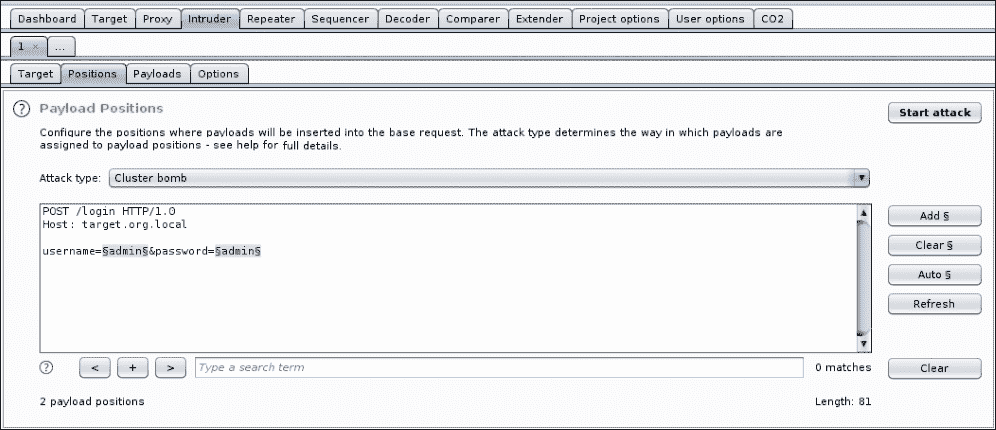

# 第四章 高级暴力破解

某些任务需要更多的隐蔽性，而这些任务中最嘈杂的部分通常是暴力破解扫描。无论我们是在特定的登录表单上寻找有效的凭证，还是扫描有趣的 URL，大量的目标连接在短时间内都可能会引起防御者的警觉，测试可能在真正开始之前就已经结束了。

大多数渗透测试任务都是“砸窗抢劫”型的操作。这类评估通常时间比较紧迫，而在暴力破解攻击中为了隐蔽性限制我们的连接速度可能会妨碍进展。对于那些可能需要更多技巧的任务，传统的暴力破解和字典攻击方法可能过于激进，并可能引发蓝队的警报。如果目标是在整个测试期间保持低调，那么使用更细腻的方式猜测密码或使用 SecLists 字典查找未保护的网页内容可能是更好的选择。

在本章中，我们将讨论以下内容：

+   **密码喷射**攻击

+   **元数据收集**和**公共网站抓取**

+   使用**Tor**规避**入侵检测系统**（**IDS**）

+   使用**Amazon Web Services**（**AWS**）规避 IDS

# 密码喷射

在暴力破解账户凭证时，一个常见的问题是后端认证系统可能会在短时间内多次输入无效信息后锁定目标账户。微软的**Active Directory**（**AD**）对所有用户设置了默认的策略，正是为了实现这一点。典型的策略足够严格，对于大多数攻击者来说，使用大密码列表攻击单一账户会非常耗时，且几乎没有投资回报的希望。与 AD 集成认证的应用将会受到这些策略的影响，传统的暴力破解攻击可能会导致账户锁定，进而触发防御方的警报，并且显然会引起被锁定用户的警觉。

一种巧妙的方式，既能绕过一些账户锁定控制，又能增加成功几率，称为反向暴力破解攻击或密码喷射攻击。其原理很简单，基于一个事实：作为攻击者，我们通常只需要一组凭据就能攻破应用程序或托管它的环境。与其将暴力破解攻击集中在一个用户上，并冒着将其锁定的风险，我们不如针对多个已知有效用户，使用较小的、更有针对性的密码列表进行攻击。只要我们将每个账户的尝试次数保持在锁定政策以下，就能避免触发警报。密码喷射不仅在试图获取对组织 VPN web 应用程序或**Outlook Web Access**（**OWA**）的访问时有用，还可以用于任何其他应用程序的登录系统。虽然几乎可以确定与 AD 集成的应用程序实施了锁定策略，但其他具有独立身份验证机制的应用程序中也可能存在类似的策略。

为了正确地进行凭据喷射攻击，我们需要一个包含大量有效用户名的列表，形式可以是邮箱地址或熟悉的`DOMAIN\ID`格式。收集有效的用户或账户名比看起来要容易。即便没有 SQL 或**轻量目录访问协议**（**LDAP**）注入转储，首先要查看的地方应该是目标公司公开的网站。通常会有很多线索，帮助我们了解公司如何构建账户名或用户 ID。在与 AD 集成的应用程序中，常见的邮箱格式为`ldap@company.com`，可以从他们的**联系我们**、**关于我们**或**团队**页面中提取。有些账户信息也可以在源代码中找到，通常是 JavaScript 库、HTML 或 CSS 文件，尤其是针对公开面向用户的 Web 应用程序。

以下是一个示例 JavaScript 库，其中包含在执行密码喷射攻击时构建账户列表时的有用信息：

```
/**
* slapit.js
*
* @requires jQuery, Slappy
*
* @updated **klibby@corp** on 12/12/2015
*/

(function(){
  var obj = $('.target');
  /* @todo **dmurphy@corp**: migrate to Slappy2 library */
  var slap = new Slappy(obj, {
    slide: false,
    speed: 300
  });
  slap.swipe();
)();
```

前面的代码不仅给我们提供了至少两个账户作为喷射攻击的目标，还暗示了用户账户名称的结构。如果我们查看**高层团队介绍**页面上的联系信息，我们可以合理推测这些员工的账户名可能是什么。

用户名的常见格式，特别是在基于 LDAP 身份验证的情况下，通常如下：

+   `FirstName.LastName`

+   `[First Initial]LastName`

+   `LastName[First Initial]`

+   `FirstNameLastName`

任何在公开网站上列出的联系邮箱，都可以添加到我们潜在用户的目标列表中进行喷射攻击。很有可能这些邮箱也对应着他们的登录凭据。例如，如果我们收集了大量格式为`david.lightman@antihacker.com`的公司邮箱，而我们一无所知，我们可以建立一个包含以下条目的用户列表：

+   `david.lightman`

+   `dlightman`

+   `lightmand`

+   `davidl`

+   `davidlightman`

一些组织已经决定将员工的账户名限制为 8 个字符或更少，作为公司范围内的一项通用政策。这简化了对于那些不支持长账户名的遗留系统的账户配置。像 John Smith 这样的常见员工姓名，在大型组织中也可能导致冲突，通常通过在账户名后添加数字来解决这个问题。

基于这些原因，我们还应该在列表中添加以下几种变体：

+   `dlightma`

+   `dlightm2`

+   `dlightm3`

我们还应考虑愿意进行多少次身份验证失败尝试。虽然我们通过密码喷射技术使用一个密码尝试 10 个不同的用户名变体，从而避免账户锁定，但如果其中一个名字有效，我们仍然会产生至少 9 次失败的身份验证尝试。如果我们针对 300 名员工，每人有 10 个变体，这将导致一个相当高的身份验证失败率，可能会触发 IDS 并提醒防御者我们的活动。

## LinkedIn 抓取

LinkedIn 也是获取员工姓名的一个重要来源，我们可以利用这些信息来构建有效的账户名称列表。一点点**Google 黑客技巧**可以列出所有公开的 LinkedIn 个人资料，这些个人资料来自那些公开表示在我们目标公司工作的人。Google 黑客技巧指的是通过使用特定的查询词，利用搜索引擎返回多年索引的有趣信息。例如，如果我们想要瞄准 Yahoo!，我们可以通过使用`site`和`inurl`查询修饰符来过滤出包含员工姓名的 Google 搜索结果：

```
**site:**linkedin.com **inurl:**"/pub/" **-inurl:**"/dir/" "at **[Target Company]**"
```

修饰符及其参数通过冒号（`:`）分隔，也可以在前面加上负号（`-`）来表示是否应包括或排除某个值。`inurl`修饰符可以指示 Google 仅返回包含特定字符串的 URL 结果。相反，`-inurl`修饰符会排除 URL 中包含该字符串的结果。我们还可以将搜索词用引号括起来，以表示我们希望结果精确匹配该字符串。

在我们的示例中，我们寻找的是包含`/pub/`的 LinkedIn 个人资料页面，并且其页面内容中包含`"at Yahoo"`。通过使用反向（`-`）`inurl`修饰符，我们还排除了包含`/dir/`的 URL，以确保结果仅包含员工资料而非目录页。该搜索还通过`site`修饰符限制在`linkedin.com`域名内。结果应该包含表明用户在“公司”工作的文字。


图 4.1：Google 黑客示例

搜索查询返回的员工姓名可以被爬取并存储在一个文本文件 `linkedin.txt` 中，按 `First[空格]Last` 格式进行处理。对于我们的密码喷洒攻击，我们需要将文本文件中的 `First Last` 条目转换为潜在的账户名。我们可以通过一些简单的 Python 代码快速实现这一点。

首先，我们需要以读取模式（`r`）打开 `linkedin.txt` 文件，并将指针存储在 `fp` 变量中，如下所示：

```
with open("**linkedin.txt**", '**r**') as **fp**:
```

我们可以使用 `for` 循环，配合 `iter` 函数，遍历 `fp` 的内容。这将允许我们遍历文本文件中的每一行，并在每次循环中将相应的值存储在 `name` 变量中：

```
  for **name** in iter(**fp**):
```

接下来，对于每一行，假设包含一个由空格分隔的名字和姓氏条目，我们可以使用以下单行代码通过空格（`' '`）来 `split()` 分隔这两个部分：

```
    *first, last* = name.strip().lower().*split(' ')*
```

变量 `first` 和 `last` 将包含你期望的值，这些值会经过 `strip()` 和 `lower()` 函数调用后被清理为小写且去除多余空格。

接下来，我们可以使用之前建立的格式化规则输出潜在的用户名。通过 `print` 语句以及 `first` 和 `last` 变量的组合，我们可以轻松地将它们显示在屏幕上：

```
    print first + "." + last **# david.lightman**
    print first + last       **# davidlightman**

```

最后，我们还将打印出名字首字母和姓氏的组合，以及每个员工姓名的八个字符以内的版本：

```
    fl = first[0] + last
    lf = last + first[0]
    print fl **# dlightman**
    print lf **# lightmand**

    print fl[:8]       **# dlightma**
    print fl[:7] + "2" **# dlightm2**
    print fl[:7] + "3" **# dlightm2**
    print lf[:8]       **# davidlig**
    print lf[:7] + "2" **# davidli2**
    print lf[:7] + "3" **# davidli3**

```

我们将把生成的脚本保存在一个名为 `name2account.py` 的文件中，文件内容如下所示：

```
with open("**linkedin.txt**", "r") as fp:

  for name in iter(fp):
    **first**, **last** = name.strip().lower().split(" ")
    print first + "." + last **# david.lightman**
    print first + last       **# davidlightman**

    fl = first[0] + last
    lf = last + first[0]
    print fl **# dlightman**
    print lf **# lightmand**

    print fl[:8]       **# dlightma**
    print fl[:7] + "2" **# dlightm2**
    print fl[:7] + "3" **# dlightm2**
    print lf[:8]       **# davidlig**
    print lf[:7] + "2" **# davidli2**
    print lf[:7] + "3" **# davidli3**

```

剩下的就是运行脚本并观察输出，如下图所示：


图 4.2：运行账户名生成器

要在攻击中使用这些输出，我们可以将其重定向到另一个文本文件中，稍后可以通过以下命令在 Burp 或 ZAP 中导入：

```
**root@kali:~/tools# python name2account.py > target**
**_accounts.txt**

```

## 元数据

通过分析我们的用户列表，也可以收集有效的用户名，方法是查看互联网上已经公开的信息。公开索引的文档是获取用户 ID 的一个好来源，因为它们通常在内容中或文件头中包含有价值的元数据。当文档是由公司员工创建时，Microsoft Office、Adobe PDF 以及许多其他类型的文档编写软件默认会将当前登录用户的姓名作为文件的作者保存在元数据中。这些文档不一定是绝密的；它们可以是传单和营销材料。它们可能是旨在与公众共享的公开数据，我们可以利用自动填充的元数据来进行密码喷洒攻击。

**指纹识别组织及收集的档案**（**FOCA**）是 **ElevenPaths** 提供的一个非常棒的工具，它可以爬取搜索引擎结果中的索引文档，例如 PDF、Excel 或 Word 文件。这些文件通常在元数据中存储有价值的信息；通常是负责编写文件的 AD ID。

这可能不总是域名用户名（它可能是电子邮件地址），但在我们构建目标账户列表时，这仍然是非常有价值的信息。

使用 FOCA，我们可以快速搜索我们目标的所有公开可用文档，并一键分析它们的元数据。

你会注意到查询与我们之前使用的 LinkedIn 数据抓取非常相似。这是因为 FOCA 在后台使用了搜索引擎黑客技术，不仅利用 Google，还利用 Bing 和其他信息目录。

在以下示例中，我们正在寻找来自 `vancouver.ca` 的公开可用文档，并分析它们的元数据。FOCA 将下载每个 PDF，解析头部，并将其找到的任何用户信息存储在元数据摘要的左侧栏中。


图 4.3：FOCA 显示公开索引的文档

这些有价值的用户名数据可以导出到文件中，用于密码喷洒攻击。我们不仅能在这些公开文档中找到有效的账户，而且它们还暗示了公司如何结构化其用户名。我们可以将这些知识与 LinkedIn 数据抓取结合，构建更好的目标账户列表，同时最小化身份验证失败的可能性。

### 注意

FOCA 可以从 ElevenPaths 官网下载：[`www.elevenpaths.com/labstools/foca/index.html`](https://www.elevenpaths.com/labstools/foca/index.html)，或者在 GitHub 上找到：[`github.com/ElevenPaths/FOCA`](https://github.com/ElevenPaths/FOCA)。

## 集群炸弹

为了进行密码喷洒攻击，我们需要一种简单的方式来将目标用户列表和一个小而具体的密码列表提供给目标。我们还希望能够在必要时限制每次尝试的速度，以避免被发现。

Burp Suite 的 Intruder 模块有多种有效载荷投递选项，其中包括集群炸弹攻击类型，允许我们指定 HTTP 请求中的多个位置，在这些位置插入有效载荷。Intruder 将针对每个可能的组合提交请求，这非常适合进行密码喷洒攻击。

密码列表会更加专注，我们不会将庞大的 `rockyou.txt` 字典一次性应用到所有用户名，而是会组合出一个较短的、使用频率更高的密码列表。

当用户忘记密码时，他们会联系技术支持并请求重置密码。通常，技术支持不会进行复杂的重置程序，而是将密码重置为一个简单易记的密码，以便员工能够快速登录并恢复工作。一个常见的密码方案是 `[当前季节][当前年份]`。像 `Fall2017` 这样的密码易于通过电话传达，并且能够满足大多数密码复杂性政策。有时，可能还会加入一些特殊字符：`Fall@2017` 或 `Fall2017!`。

如果用户在登录后立即重置密码，这其实不是问题。AD 有一个技术支持选项，要求用户在第一次成功登录后更改密码。不幸的是，旧系统和复杂的认证方案并不总是支持首次登录时重置密码，这迫使组织要求用户手动操作。虽然大多数用户会立即重置密码，但也有一些用户不会，而我们通常只需要一个用户犯错。

一个可能的密码尝试列表如下所示：

+   `Fall2017`

+   `Fall17`

+   `Fall2017!`

+   `Fall@2017`

+   `Summer2017`

+   `Summer17`

+   `Summer2017!`

+   `Summer@2017`

+   `Spring2017`

+   `Spring17`

+   `Spring2017!`

+   `Spring@2017`

我们在构建这个列表时也可以更加智能。如果我们知道应用程序的密码要求，我们可以选择排除那些不符合要求的密码。也许目标公司总部位于一个“秋季”一词使用频率高于`fall`的地区，那么我们就可以相应地进行调整。

考虑账户锁定也是很重要的。我们的入侵者攻击会根据密码列表中的密码数量为每个用户生成相同数量的身份验证请求，这意味着我们可能会锁定账户。集群炸弹入侵者攻击类型会尝试列表中的第一个密码针对每个用户名，直到到达末尾，然后重新从顶部开始。接着，它会尝试列表中的第二个密码，再是第三个，以此类推，直到密码列表用完。如果我们不限制每个用户名的请求次数，可能会导致账户被锁定，并且会引起防御者的警觉。

一旦我们有了密码和用户名列表，我们就可以通过利用入侵者模块开始密码喷洒攻击。为了这个场景，我们将攻击目标定为`target.org.local`上的应用程序，端口为`80`，如下图所示：


图 4.4：在入侵者中指定攻击目标

我们发送的请求将是一个`POST`请求，目标为`/login`页面。我们可以在入侵者的**Positions**选项卡下指定请求体和负载位置。高亮显示`username`和`password`的虚拟值后，我们可以点击右侧的**Add**按钮以表示负载位置，如下图所示：



图 4.5：定义负载位置

我们还选择了前面提到的**集群炸弹**攻击类型。

接下来，我们需要加载我们的负载，具体来说，就是之前编制的用户名和密码列表。负载集 1 将是我们的用户名列表，如下图所示：


图 4.6：将用户名加载到负载集 1 中

我们的第二组有效载荷将是每个用户名要测试的密码。再次强调，这不是我们加载 `rockyou.txt` 并让它全力攻击的地方。在密码喷洒攻击中，我们针对一大批已知的有效用户 ID，并只使用少数几个非常常见的密码。我们希望避免被锁定并触发警报。

下图展示了一个小型有效载荷集 2 的示例：


图 4.7：将密码加载到有效载荷集 2 中

上述配置将对每个用户进行四次密码猜测尝试，希望能够将攻击保持在雷达下，避免任何账户锁定。我们能对更多用户进行攻击，就越有可能找到一个忘记更改密码的用户。

Burp Suite Professional 提供了一些选项，可以执行低速攻击，这些选项可以在**选项**标签中设置。虽然 Burp Suite 的免费版不允许多线程或限速，但 OWASP ZAP 提供了类似的攻击类型，并且能够限速和增加线程数。

在加载了我们的目标用户列表并指定了几个密码后，我们可以通过点击**开始攻击**来对应用程序进行喷洒攻击。下图展示了入侵者攻击窗口及密码喷洒攻击过程中所发出的所有请求：


图 4.8：密码喷洒攻击正在进行

# 经过七个代理

现在，越来越多的成熟公司开始实施 IDS（入侵检测系统）、**IPS（入侵防御系统）**和**SIEM（安全信息与事件管理）**，并设置警报，以便在检测到某个应用程序受到滥用时进行响应。当一个未知 IP 在短时间内对受保护的应用程序进行过多操作时，IDS 或 IPS 可能会对源头采取行动。如果我们正在进行密码喷洒攻击，我们可能避免了账户锁定，但我们仍然从一个来源——我们的机器——对服务器进行大量攻击。

避免这些类型检测系统的一种有效方法是通过许多 IP 分发攻击者机器的连接请求，这通常是恶意行为者通过受损主机的网络完成的。随着云计算的兴起，计算时间变得越来越便宜，甚至在某些情况下是免费的，我们不必违反法律去建立一个僵尸网络。**Tor 网络**也是在攻击过程中改变公共 IP 的一种免费且有效的方式。

## Torify

**Tor 项目**的创建目的是为用户提供匿名浏览互联网的方式。它至今仍是匿名化流量的最佳方式，最棒的是，它是免费的。Tor 是一个由独立操作的节点组成的网络，这些节点互相连接形成一个网络，通过该网络可以路由数据包。

下图展示了一个用户 Alice 如何通过 Tor 网络连接到 Bob，并通过随机生成的路径或电路进行连接：


图 4.9：Tor 网络流量流向（来源： https://www.torproject.org/）

客户端连接从 Alice 到 Bob 的方式不是直接连接目标，而是通过 Tor 网络中随机选择的一组节点进行路由。每个数据包都会被加密，每个节点只能解密足够的信息以将数据包路由到路径中的下一个节点。出口节点是链条中的最后一个节点，它将代表客户端与目标建立连接。当数据包到达 Bob 的机器时，请求将看起来像是来自出口节点，而不是 Alice 的公共 IP。

### 注意

更多关于 Tor 的信息可以在官方网站找到：[`www.torproject.org`](https://www.torproject.org)。

虽然 Tor 对于匿名性非常重要，但我们并不特别关心保持完全的匿名性。然而，我们可以利用随机选择的出口节点在攻击应用程序时掩盖我们的公共 IP。

Tor 软件包可以在大多数 Linux 发行版上找到。在 Kali 上，可以通过包管理器安装。下面代码中显示的`apt-get`命令将安装 Tor 以及一个有用的应用程序**torsocks**：

```
**root@kali:~# apt-get install tor torsocks**

```

Torsocks 是一个很好的工具，可以“torify”应用程序，甚至提供一个交互式 Shell，自动将所有流量通过一个活动的 Tor 隧道路由。这将允许我们强制那些原生不支持通过 Tor 路由的应用程序使用匿名网络。

### 注意

Torsocks 可以在 Tor 项目的 Git 仓库中找到：[`gitweb.torproject.org/torsocks.git`](https://gitweb.torproject.org/torsocks.git)。

我们不需要更改 Tor 的默认配置；只需要从 Kali 提示符下启动它，使用`tor`二进制文件，如下代码块所示：

```
root@kali:~# **tor**
[notice] Tor 0.3.1.9
[notice] Read configuration file "/etc/tor/torrc".
[notice] Opening Socks listener on 127.0.0.1:9050
[notice] Parsing GEOIP IPv4 file /usr/share/tor/geoip.
[notice] Parsing GEOIP IPv6 file /usr/share/tor/geoip6.
[warn] You are running Tor as root. You don't need to, and you probably shouldn't.
[notice] Bootstrapped 0%: Starting
[notice] Starting with guard context "default"
[notice] Bootstrapped 80%: Connecting to the Tor network
[notice] Bootstrapped 85%: Finishing handshake with first hop
[notice] Bootstrapped 90%: Establishing a Tor circuit
**[notice] Tor has successfully opened a circuit. Looks like client functionality is working.**
[notice] Bootstrapped 100%: Done
```

一旦 Tor 客户端初始化并选择了一个隧道（电路），一个 SOCKS 代理服务器将在本地主机上启动，监听端口`9050`。为了强制将我们的攻击流量通过 Tor 网络，并掩盖我们的外部 IP，我们可以配置 Burp Suite，使用新启动的代理来处理所有的外向连接。任何不支持 SOCKS 的程序都可以使用 ProxyChains 或之前安装的 torsocks 工具进行“torify”。

### 注意

ProxyChains 在所有渗透测试发行版中都可以使用，也可以在[`proxychains.sourceforge.net/`](http://proxychains.sourceforge.net/)下载。

在 Burp Suite 中，在**项目选项**标签下，我们可以选择**覆盖用户选项**，以启用 SOCKS 配置字段。SOCKS 代理和端口的值分别为`localhost`和`9050`，并且最好通过代理进行 DNS 查询。


图 4.10：在 Burp 中配置上游 SOCKS 代理

我们可以通过使用 Repeater 模块对`ipinfo.io`执行一个测试请求，它应该会显示一个随机选择的 Tor 出口节点作为我们的外部 IP。

下图显示了我们对`ipinfo.io`进行 torify 请求的响应：


图 4.11：Repeater 响应显示 Tor 退出节点作为我们的有效 IP

尽管 Tor 客户端会定期刷新电路，但它可能不足以应对暴力破解攻击，在这种攻击中需要不断变化的 IP 以实现规避。我们不希望将连接的限制设置得过低，以至于扫描在结束前无法完成。

可以通过 **进程挂起信号** (**SIGHUP**) 强制更新 Tor 代理的当前电路。通过使用 `killall` 或 `kill` 等 Linux 命令，我们可以向 Tor 应用程序发出一个 `HUP` 信号，并强制该进程旋转我们的退出节点。

首先，我们可以进入 torsocks shell，拦截所有的 `curl` 请求，并通过 Tor 网络转发它们。可以使用 `--shell` 参数调用 `torsocks` 命令，如下所示：

```
root@kali:~# torsocks --shell
/usr/bin/torsocks: **New torified shell coming right up...**
root@kali:~#
```

后续从 torsocks shell 中启动的应用程序的网络请求应该会通过 Tor 转发。为了查看 SIGHUP 信号的作用，我们可以使用 `curl` 请求访问一个在线服务，该服务返回我们当前的公共 IP，如 `ipinfo.io`：

```
root@kali:~# **curl ipinfo.io**
{
 **"ip": "46.165.230.5",**
  "hostname": "tor-exit.dhalgren.org",
  "country": "DE"
}
root@kali:~# **killall -HUP tor**
root@kali:~# **curl ipinfo.io**
{
 **"ip": "176.10.104.240",**
  "hostname": "tor1e1.digitale-gesellschaft.ch",
  "country": "CH"
}
root@kali:~# **killall -HUP tor**
root@kali:~# **curl ipinfo.io**
{
 **"ip": "195.22.126.147",**
  "country": "PL"
}
root@kali:~# **killall -HUP tor**
root@kali:~# **curl ipinfo.io**
{
 **"ip": "104.218.63.74",**
  "hostname": "tor-exit.salyut-4.vsif.ca",
  "country": "CA"
}
root@kali:~#
```

每次请求 IP 服务时都会返回一个新的 Tor 退出节点。我们也可以通过在单独的终端中使用 `watch` 命令粗略地自动发送 HUP 信号。`-n` 选项指定了执行 `killall` 命令的频率。在这种情况下，Tor 将每 `10` 秒发出一次 SIGHUP 信号，从而有效地同时旋转我们的外部 IP：

```
**root@kali:~# watch -n10 killall -HUP tor**

```

如果我们的计划是对 `c2.spider.ml` 应用进行密码喷射攻击，例如，我们可以配置 Burp Suite 使用集群炸弹 Intruder 配置，并配合一个常见用户名和密码的列表。同时，在后台，`watch` 命令每 10 秒刷新一次 Tor 电路。我们将限制 Burp 的请求频率为每 10 秒一次，这将确保每次密码猜测尝试都来自不同的 IP，从而提高我们的隐蔽性。需要注意的是，Burp 的免费版不支持流量限制。通过使用 OWASP ZAP，同样的功能可以通过后台运行 `watch` 来循环 Tor 电路实现。

以下图示展示了 `watch` 命令每 10 秒运行一次 `killall` 命令，控制 Tor 应用程序，同时 Burp 的 Intruder 模块进行密码猜测攻击：


图 4.12：使用不断变化的退出 IP 进行密码猜测攻击

正如预期的那样，`c2.spider.ml` 应用服务器日志显示，每隔 10 秒钟就会从一个新的退出节点 IP 发起一次攻击。

以下展示了一个示例 PHP Web 服务器，列出了每个 HTTP 请求、时间和来源 IP：

```
root@spider-c2-1:/var/www# php -S 0.0.0.0:80
Listening on http://0.0.0.0:80
Press Ctrl-C to quit.
[20:21:23] **163.172.101.137:58806** [200]: /?user=root&password=123456
[20:21:33] **144.217.161.119:58910** [200]: /?user=info&password=123456
[20:21:45] **96.64.149.101:44818** [200]: /?user=guest&password=123456
[20:21:53] **216.218.222.14:16630** [200]: /?user=test&password=123456
[20:22:08] **185.220.101.29:44148** [200]: /?user=admin&password=123456
[...]
[20:24:52] **89.234.157.254:42775** [200]: /?user=test&password=123456789
[20:25:03] **87.118.122.30:42856** [200]: /?user=admin&password=123456789
```

攻击的低速特性，再加上不断变化的源 IP，使得防御者更难将我们的攻击流量与合法流量区分开。虽然设计有效规则以识别来自多个地区和多个 IP 的暴力破解攻击并非不可能，但在不产生误报的情况下做到这一点相当困难。

通过 Tor 网络发起攻击存在一些问题。其路由协议本质上比直接连接要慢。这是因为 Tor 对每次传输都添加了几层加密，而且每次传输都会通过三个 Tor 节点转发，除此之外还需要进行正常的互联网通信路由。这一过程增强了匿名性，但也显著增加了通信延迟。对于正常的网页浏览来说，这种延迟是可以忍受的，但对于大规模扫描，它可能不是理想的传输方式。

### 注意

还应注意，Tor 在隐私至关重要的地区被广泛使用。通过 Tor 进行大规模攻击是不被提倡的，因为它可能导致不必要的网络延迟，并可能影响合法用户。低速且缓慢的攻击通常不会造成任何问题。一些红队任务可能需要通过 Tor 网络进行测试，以验证相关的 IDS/IPS 规则是否按预期工作，但在通过这种有限资源的公共媒介发起攻击时，应谨慎行事。

使用 Tor 的另一个问题是出口节点是公开的。防火墙、IDS、IPS，甚至基于主机的控制可以配置为直接阻止来自已知 Tor 节点的任何连接。虽然 Tor 上有合法用户，但它也有被广泛用于非法活动的历史；因此，组织通常认为，因禁止 Tor 连接而惹恼少数潜在客户的风险是可以接受的。

### 注意

活跃的 Tor 出口节点列表可以在此找到：[`check.torproject.org/cgi-bin/TorBulkExitList.py`](https://check.torproject.org/cgi-bin/TorBulkExitList.py)。

## Proxy cannon

使用 Tor 来多样化我们的攻击 IP 的一个替代方案是直接使用云服务。市面上有无数的 **基础设施即服务**（**IaaS**）提供商，每个提供商都有大量的 IP 空间，供虚拟机实例免费使用。虚拟机通常便宜，有时甚至是免费的，所以通过它们路由我们的流量应该是相当经济有效的。

亚马逊、微软和谷歌都提供了易于使用的 API 来自动化虚拟机实例的管理。如果我们能定期生成一个新的虚拟机并分配一个新的外部 IP，我们可以通过它将流量路由到目标应用程序，并隐藏我们的真实来源。这应该会使自动化系统更难检测并警告我们的活动。

这时就需要 **ProxyCannon**，一个能够与 Amazon AWS API 通信、创建和销毁虚拟机实例、轮换外部 IP 并通过它们路由流量的强大工具。

### 注意

ProxyCannon 是由 Shellntel 开发的，可以在 GitHub 上找到：[`github.com/Shellntel/scripts/blob/master/proxyCannon.py`](https://github.com/Shellntel/scripts/blob/master/proxyCannon.py)。

ProxyCannon 需要 `boto`，这是一个提供访问 Amazon AWS API 的 Python 库。我们可以使用 Python 的 `pip` 命令来安装所需的依赖项：

```
**root@kali:~/tools# pip install -U boto**
**Collecting boto**
 **Downloading boto-2.48.0-py2.py3-none-any.whl (1.4MB)**
**[...]**
**Installing collected packages: boto**
**Successfully installed boto-2.48.0**

```

ProxyCannon 工具现在应该已经准备好使用，通过 `-h` 选项显示所有可用的选项：

```
root@kali:~/tools# **python proxyCannon.py -h**
usage: proxyCannon.py [-h] [-id [IMAGE_ID]] [-t [IMAGE_TYPE]]
                [--region [REGION]] [-r] [-v] [--name [NAME]]
                [-i [INTERFACE]] [-l]
                num_of_instances

```


默认情况下，ProxyCannon 会在 AWS 中创建 `t2.nano` 虚拟实例，新的账户在有限时间内应该是免费的。它们的资源非常有限，但通常足够用于大多数攻击。如果需要更改实例类型，可以使用 `-t` 开关。默认区域是 `us-east-1`，可以通过 `--region` 开关进行调整。

ProxyCannon 将根据 `num_of_instances` 参数创建指定数量的实例，并使用 `-r` 开关定期轮换它们。`-l` 开关对于跟踪 ProxyCannon 在执行过程中使用的公共 IP 非常有用，这对于报告来说很重要：蓝队可能需要攻击中使用的所有 IP 列表。

为了让工具能够与我们的 AWS 账户进行通信，并自动管理实例，我们必须在 AWS 控制台中创建 API 访问密钥。这个界面相当简单，可以在账户的 **安全凭证** 页面访问。

访问密钥 ID 和密钥是随机生成的，应当安全存储。一旦任务结束，应从 AWS 控制台删除这些密钥。


图 4.13：生成新的 AWS API 访问密钥

我们可以使用 `-r` 和 `-l` 开关启动 ProxyCannon，并指定同时运行 `3` 个实例。

```
root@kali:~/tools# python proxyCannon.py -r -l 3
What is the AWS Access Key Id: **d2hhdCBhcmUgeW91IGRvaW5n**
What is the AWS Secret Access Key: **dW5mb3J0dW5hdGVseSB0aGlzIGlzIG5vdCB0aGUgcmVhbCBrZXku**
[...]
```

在第一次运行时，ProxyCannon 会要求输入这些值，并将它们存储在 `~/.boto` 文件中。

```
root@kali:~/tools# **cat ~/.boto**
[default]
aws_access_key_id = d2hhdCBhcmUgeW91IGRvaW5n
aws_secret_access_key = dW5mb3J0dW5hdGVseSB0aGlzIGlzIG5vdCB0aGUgcmVhbCBrZXku
```

如你所见，这些信息以明文形式存储，因此请确保这个文件得到妥善保护。亚马逊建议这些密钥应该经常轮换。每次任务开始时，最好为每个任务创建新的密钥，并在不再需要时从 AWS 删除它们。

ProxyCannon 将连接到 Amazon EC2，设置 SSH 密钥，调整安全组，并启动虚拟机实例。这个过程可能需要几分钟才能完成。

```
[*] Connecting to Amazon's EC2...
[*] Generating ssh keypairs...
[*] Generating Amazon Security Group...
**[~] Starting 3 instances, please give about 4 minutes for them to fully boot**
[====================] 100%
```

ProxyCannon 将覆盖当前系统的 `iptables` 配置，以确保所有流量都通过所选实例进行正确路由：

```
**[*] Provisioning Hosts.....**
**[*] Saving existing iptables state**
**[*] Building new iptables...**
**[*] Done!**

**+++++++++++++++++++++++++++++++++++++++++++++++++++++++++++++++++++**
**+ Leave this terminal open and start another to run your commands.+**
**+++++++++++++++++++++++++++++++++++++++++++++++++++++++++++++++++++**

**[~] Press ctrl + c to terminate the script gracefully.**
**[...]**

```

正如承诺的那样，ProxyCannon 会定期通过 SSH 隧道和修改路由表来轮换我们的有效外部 IP。所有这些操作都是自动进行的，在后台执行，而 Burp Suite 或 ZAP 正在进行密码喷洒攻击。

以下是 ProxyCannon 的定期输出，显示正在轮换的 IP 地址：

```
[*] Rotating IPs.
[*] Replaced **107.21.177.36** with **34.207.187.254** on tun0
[*] Replaced **34.234.91.233** with **52.91.91.157** on tun1
[*] Replaced **34.202.237.230** with **34.228.167.195** on tun2
[*] Replaced **34.207.187.254** with **34.228.158.208** on tun0
[*] Replaced **52.91.91.157** with **54.198.223.114** on tun1
```

在 AWS 控制台中，我们可以看到启动的 `t2.nano` 实例及其公共 IP 地址：


图 4.14：创建的 AWS 实例，用于通过它们路由我们的流量

和之前的 Tor 示例一样，我们可以通过使用 `watch` 命令重复 `curl` 请求来测试 ProxyCannon，目标应用是我们的目标。我们不需要像 torsocks 那样进入 shell，因为 ProxyCannon 会修改本地系统路由，帮助我们更改外部 IP 地址。

```
**root@kali:~# watch -n30 curl http://c2.spider.ml**

```

在目标应用程序方面，`c2.spider.ml` 服务器日志显示来自属于 Amazon 地址空间的多个 IP 的连接尝试：

```
**52.91.91.157** - - [13:01:16] "GET / HTTP/1.1" 200 -
**52.91.91.157** - - [13:01:22] "GET / HTTP/1.1" 200 -
**34.228.158.208** - - [13:01:43] "GET / HTTP/1.1" 200 -
**34.228.158.208** - - [13:01:48] "GET / HTTP/1.1" 200 -
**54.198.223.114** - - [13:06:34] "GET / HTTP/1.1" 200 -
**54.198.223.114** - - [13:06:39] "GET / HTTP/1.1" 200 -
```

应当注意的是，我们在 Amazon 或任何云服务提供商上轮换 IP 的频率是有下限的。实例启动需要一段时间，IP 地址需要被保留、关联并变得活跃。ProxyCannon 设定了一个硬编码的时间大约为 90 秒，以确保有效 IP 确实发生变化。

# 总结

在本章中，我们探讨了在进行暴力攻击时保持低调的几种技术。低调缓慢的攻击，结合频繁更换 IP 地址，是猜测密码或寻找有趣 URL 的一种有效方式。如果我们能够将这一策略与密码喷洒攻击结合起来，我们可以在避免入侵检测、预防系统和防火墙的同时，提高成功的几率。我们还研究了从 LinkedIn 和 Google 中抓取元数据，以建立有效的用户和密码列表。

这些偏离常规暴力攻击的策略使得攻击难以防御，要求蓝队有合适的告警设置，低误报率，并且坦率地说，必须投入大量资源来监控检测系统。作为攻击者，我们知道蓝队通常会被过度分配资源，无法启用那些会产生大量误报但也能捕捉到我们攻击的规则。一般来说，除非目标组织有一个非常成熟且资金充足的安全计划，否则这些类型的攻击很容易实施并且经常成功。

在下一章中，我们将深入探讨如何利用应用程序处理来自不受信任来源的文件和文件路径中的漏洞。
