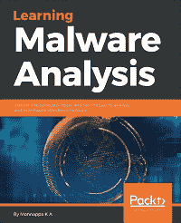
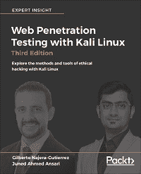
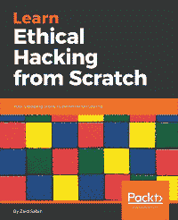

# 第十四章：你可能喜欢的其他书籍

如果你喜欢这本书，你可能对 Packt 出版社的其他书籍感兴趣：

网络安全 - 攻击与防御策略

Yuri Diogenes, Erdal Ozkaya

ISBN: 978-1-78847-529-7

+   学习建立坚实安全基础的重要性

+   了解使用网络安全“杀链”策略的攻击方法

+   学习如何通过改善安全策略、加固网络、实施主动传感器以及利用威胁情报来增强防御策略

+   学习如何进行事件调查

+   深入了解恢复过程

+   了解持续的安全监控以及如何实施漏洞管理策略

+   学习如何进行日志分析以识别可疑活动

学习恶意软件分析

Monnappa K A

ISBN: 978-1-78839-250-1

+   创建一个安全且隔离的实验室环境用于恶意软件分析

+   提取与恶意软件相关的元数据

+   确定恶意软件与系统的交互

+   使用 IDA Pro 和 x64dbg 进行代码分析

+   逆向工程各种恶意软件功能

+   逆向工程并解码常见的编码/加密算法

+   执行不同的代码注入和钩子技术

+   使用内存取证调查和追踪恶意软件

使用 Kali Linux 进行网页渗透测试

Gilberto Najera-Gutierrez, Juned Ahmed Ansari

ISBN: 978-1-78862-337-7

+   学习如何用 Kali Linux 设置实验室

+   了解网页渗透测试的核心概念

+   了解在 Kali Linux 上需要使用的工具和技术

+   识别黑客攻击网页应用与网络黑客攻击的区别

+   使用服务器端攻击暴露网页服务器及其应用中的漏洞

+   了解用于识别网页应用类型的不同技术

+   查看标准攻击，如利用跨站请求伪造和跨站脚本漏洞

+   概览客户端攻击的艺术

+   探索自动化攻击，如模糊测试网页应用

**从零开始学习道德黑客**

Zaid Sabih

ISBN: 978-1-78862-205-9

+   了解道德黑客及不同领域和类型的黑客

+   设置渗透测试实验室，练习安全合法的黑客技能

+   探索 Linux 基础、命令以及如何与终端交互

+   访问受密码保护的网络并监视已连接的客户端

+   使用服务器端和客户端攻击黑客攻击并控制远程计算机

+   远程控制被黑系统，并利用该系统攻击其他系统

+   发现、利用并防止多种网页应用漏洞，如 XSS 和 SQL 注入
