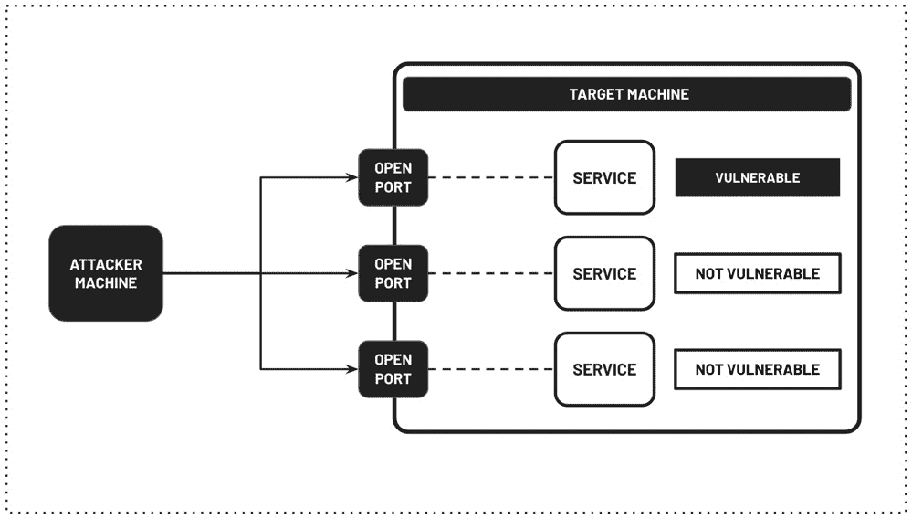
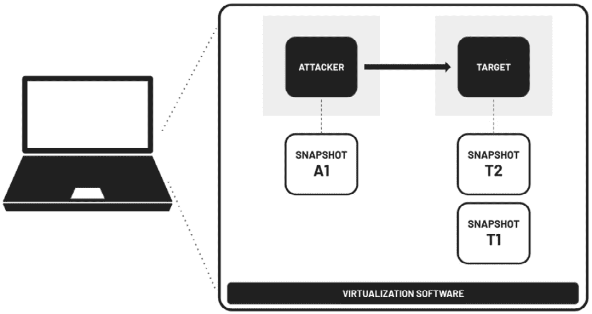
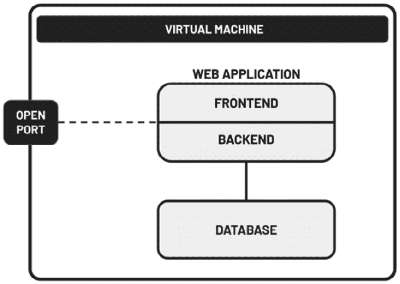
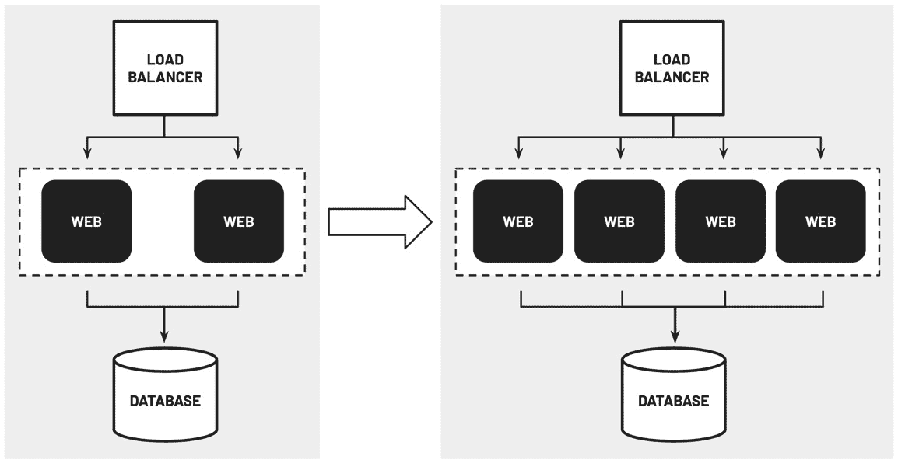
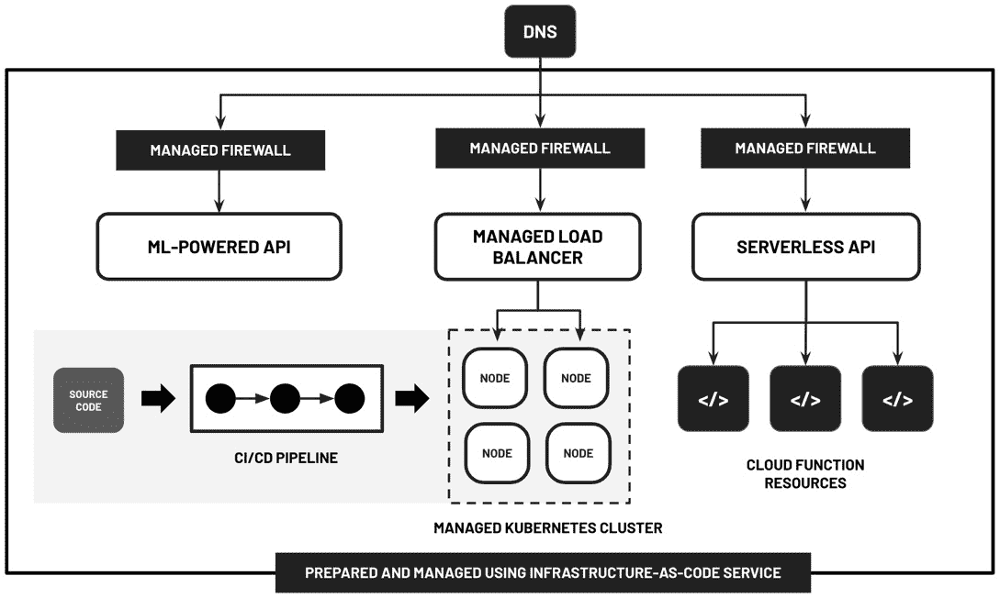
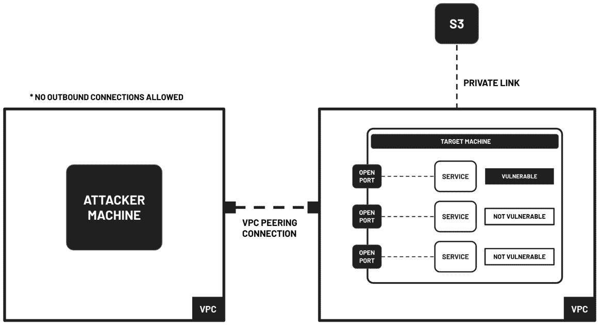

# 第一章：开始使用云中的渗透测试实验室

随着与云相关的威胁和事件每年显著增加，对云安全专业人员的需求持续增长。为了管理学习云渗透测试和道德黑客过程中涉及的风险，安全工程师若想提升职业发展，掌握如何在云中搭建渗透测试环境将大有裨益。

在本章介绍中，我们将快速了解在云中设置渗透测试实验室的好处。我们将探讨现代云应用是如何设计、开发和部署的，因为这在接下来的章节中建立渗透测试实验室时至关重要。在本章的最后部分，我们将深入探讨在设计和构建易受攻击的云基础设施时需要考虑的若干相关因素。

话虽如此，我们将涵盖以下主题：

+   为什么要在云中构建渗透测试实验室？

+   认识云计算对网络安全格局的影响

+   探索现代云应用的设计、开发和部署方式

+   在云中构建渗透测试实验室环境时需要考虑的事项

了解这些内容后，让我们开始吧！

# 为什么要在云中构建渗透测试实验室？

在职业生涯的某个阶段，安全专业人员可能会建立渗透测试实验室，在一个隔离的环境中安全地练习他们的技能。此时，你可能会问自己：*渗透测试实验室环境里* *有什么内容呢？*

图 1.1 – 渗透测试实验室示例

在*图 1.1*中，我们可以看到，**渗透测试实验室环境**只是一个受控环境，里面托管着若干个设计上存在漏洞的应用和服务。这些应用存在已知的漏洞和配置错误，利用正确的工具和技术可以加以利用。这些漏洞的设计是为了提供一个真实的环境，让渗透测试人员进行练习并模拟现实世界的攻击场景。此外，安全研究人员和渗透测试人员可以深入探索各种攻击路径，研究新的利用技术，并制定相应的对策。

在讨论在云中设置渗透测试实验室的好处之前，让我们先来讨论为什么拥有一个渗透测试实验室环境是个好主意。以下是推荐拥有渗透测试实验室环境的一些原因：

+   在专用的实验室环境中学习渗透测试可以帮助你避免法律麻烦。未经合同、同意或协议，攻击他人或公司拥有的系统是非法的。

+   鉴于渗透测试可能会破坏数据、崩溃服务器并使环境处于不稳定状态，拥有一个独立的渗透测试实验室将有助于确保生产环境不受渗透测试模拟可能产生的副作用影响。

+   我们还可以在开发自定义渗透测试工具时，利用这些实验室环境来自动化和加速渗透测试过程中的某些步骤。

+   我们还可以在这些环境中练习**防御规避**，通过设置各种防御机制，检测并阻止某些类型的攻击。

+   我们可以通过黑客实验室环境来教授渗透测试的基础知识，面向安全爱好者和初学者。

+   渗透测试实验室可以用来验证新披露的漏洞。这些隔离的环境还可以用来验证在应用了更新、配置更改或补丁之后，之前已知的漏洞是否已经得到修复。

既然我们已经讨论了*为什么*拥有渗透测试实验室环境是一个好主意，那么接下来该讨论*在哪里*托管这些黑客实验室了。过去，大多数安全从业人员主要在他们的本地机器上（例如，个人计算机或笔记本电脑）设置实验室环境。他们投资购买专用硬件，以便使用`VirtualBox`或其他虚拟化软件运行虚拟实验室环境：

图 1.2 – 在本地机器上运行渗透测试实验室环境

在*图 1.2*中，我们可以看到，在家庭实验室环境中，一种常见的做法是在执行测试之前创建**快照**（用于捕捉当前状态），因为渗透测试过程中的某些步骤可能会影响目标机器的配置和稳定性。然后，这些快照可以用来恢复设置到原始状态，从而让安全专家和研究人员能够进行一系列测试和实验，而无需担心之前测试的副作用。

注意

过去，渗透测试实验室环境中常见的目标之一是一个故意设计为脆弱的 Linux 镜像，名为`Metasploitable`。它包含了多个脆弱的运行服务，映射到若干个开放端口，等待被扫描和攻击。实践者会使用`BackTrack Linux`（现已更名为**Kali Linux**）设置攻击机，并配置多种工具，如`Nmap`和`Metasploit`，来攻击目标机器。

当然，在本地机器上设置一个设计脆弱的实验室环境也存在一系列挑战和限制。这些可能包括以下一种或多种情况：

+   在个人计算机或笔记本电脑上设置渗透测试实验室环境（这些设备很可能包含个人和工作文件）可能会带来意想不到的后果，因为如果黑客实验室环境设置不当，整个系统可能会被攻破。在最坏的情况下，当系统由于硬件退化或故障完全崩溃时，我们可能会失去所有文件。

+   用于实验室环境的虚拟机可能需要大量资源。因此，我们可能需要更昂贵的本地配置，以满足正在运行的虚拟机的需求。

+   设置易受攻击的实验室环境可能需要大量时间，并且可能需要先前了解所涉及的工具和应用程序。配置和准备实验室环境所需组件（如易受攻击的软件或网络设置）的过程可能非常复杂且要求很高。必须对工具及其依赖关系有深入了解，这对新手或经验有限的人来说可能是一个限制。

+   某些漏洞和配置错误可能很难进行测试，尤其是那些涉及云服务使用和存在的漏洞。

注意

在某些情况下，我们还可能遇到许可证问题，导致无法在黑客实验室环境中使用某些虚拟机、操作系统和应用程序。

为了解决上述挑战之一或多个，考虑在云中设置我们的渗透测试实验室是一个好主意。以下是在设置云渗透测试实验室时的一些优势：

+   托管在云中的实验室环境可能更接近实际在云中部署的生产环境的样子。

+   通过在云中运行我们的黑客实验室环境几小时，并在测试和实验结束后删除（或关闭）云资源，我们可以显著管理成本。

+   自己设置云实验室环境将帮助我们更深入地理解渗透测试实验室环境中部署的云资源的实施和安全配置。

+   在云中扩展易受攻击的实验室环境更为容易，因为资源可以立即提供，我们无需担心硬件的先决要求。

+   某些攻击在本地难以模拟，但在云环境中执行起来相对简单（例如，针对云函数及其他**无服务器**资源的攻击）。

+   在云中设置复杂的实验室环境可能会借助自动化工具、框架和服务变得更快速。

+   我们无需担心存储在本地计算机上的个人和工作文件被删除或盗取。

+   在云中部署的黑客实验室环境中，更容易让多个用户练习渗透测试。

注意

除了这些，学习渗透测试在云中可以更快。首先，下载大文件和设置易受攻击的虚拟机在云中会显著更快。除此之外，重建云环境通常更容易，因为有多种选项可以重新创建和重建这些实验环境。

到此为止，我们应该知道为什么在云中构建渗透测试实验环境是一个*很棒*的主意！在接下来的部分，我们将快速讨论云计算是如何影响并塑造现代网络安全格局的。

# 认识到云计算对网络安全格局的影响

过去，公司必须主要在自己的数据中心托管应用程序。由于管理自有数据中心的运营开销，大多数企业已经考虑将数据和工作负载迁移到云中。有些组织将所有的应用程序和数据迁移到了云中，而其他则使用*混合云架构*将应用程序托管在本地数据中心和云中。云计算使得公司能够做到以下几点：

+   **确保持续运营**：云中的高可用性确保应用程序和服务即使在发生故障或中断的情况下仍然可访问和运行。通过利用云服务提供商提供的冗余和容错架构，可以将停机时间降到最低，并保持对资源的不间断访问。

+   **节省资金**：不需要投资硬件基础设施即可开始使用，因为云资源可以在几秒钟或几分钟内创建和删除。除此之外，云平台通常采用按需付费的模型来使用云资源。

+   **轻松管理应用程序工作负载**：云中的应用程序工作负载可以远程管理。此外，资源可以根据业务需求轻松扩展或缩减。

+   **轻松管理数据**：由于云环境中提供了各种服务、功能和能力，数据管理变得更加流畅和方便。此外，云提供的几乎无限的存储容量消除了处理大文件时的顾虑。这种增强的数据管理能力有助于提高企业的效率和可扩展性。

+   **自动化相关流程**：在云中构建自动化的管道和工作流变得更容易，因为大多数云服务可以通过**应用程序编程接口**（**APIs**）和**软件开发工具包**（**SDKs**）进行管理。

随着越来越多的公司将数据存储在云中，过去几年云攻击显著增加。由于云计算的兴起，攻击面发生了变化，与此同时，攻击的类型也发生了变化。黑客可以利用易受攻击和配置错误的云资源，这可能导致存储在云中的敏感数据被窃取。

我们说的攻击面是什么意思？

**攻击面**是指系统内一组潜在的脆弱点，攻击者可以利用这些脆弱点进行攻击。它包括多个元素，包括网络接口、API、用户访问点、操作系统和已部署的云资源。理解和管理攻击面对于评估和减轻云中的安全风险至关重要，因为它可以帮助组织识别并解决可能被恶意行为者利用的弱点。

有鉴于此，以下是有关基于云的数据和应用程序的相关网络攻击的简要列表：

+   **针对易受攻击的应用服务器和配置错误的云存储资源的攻击**：针对易受攻击和配置错误的云资源（如 API、虚拟机、CI/CD 管道和存储资源）的攻击已导致全球范围内的严重数据泄露。被窃取的身份和信息常用于身份盗窃和钓鱼攻击。

+   **云中的勒索软件攻击**：存储在云中的敏感数据不断成为黑客的攻击目标。勒索软件的受害者通常被要求支付比特币或其他加密货币作为赎金。比特币和其他加密货币使用户能够保持匿名。这与其他技术一起，使得当局很难追踪勒索软件黑客。

+   **云账户劫持**：一旦黑客接管了一个组织的云账户，黑客就可以自由地创建资源、访问敏感文件，并使用账户内的资源攻击其他公司和账户。

+   **分布式拒绝服务（DDoS）和钱包拒绝服务（DoW）攻击**：在 DDoS 攻击中，攻击者试图通过生成的流量淹没和冲击已部署的云资源，使在线服务不可用。在 DoW 攻击中，使用类似的技术造成财务损失（由于巨额账单）。

多年来，随着云安全威胁的发展和蔓延，专注于云安全的工具数量和质量不断增加。随着每年披露的漏洞数量增加，更多的安全工具和实用程序也变得可用。这些工具从简单的脚本到复杂的框架和模块不等，可以根据攻击者的需求进行配置。安全专业人士也见证了工具和产品的演变。在过去，云安全产品需要由公司内部团队进行安装和设置。近年来，越来越多的托管云工具和服务变得可用，其中大多数可以在最小的配置下立即使用。以下是一些最新的云安全解决方案：

+   各种攻击性安全云工具和框架

+   无代理虚拟机漏洞评估工具

+   容器镜像漏洞评估工具

+   无服务器计算资源的漏洞评估工具和服务

+   基于机器学习的代码安全扫描工具和服务

+   云网络安全审计工具

+   托管云防火墙

+   托管的云威胁检测服务

+   基于人工智能的安全工具

到目前为止，我们应该对云计算如何塑造和影响网络安全格局有了更好的理解。在下一节中，我们将深入探讨现代应用程序如何在云中设计、开发和部署。

# 探索现代云应用程序如何设计、开发和部署

在构建渗透测试实验室时，主要目标之一是准备一个按设计漏洞构建的环境，模拟真实的云环境。也就是说，我们必须对*现代*云应用程序的架构有充分的了解，这将使我们具备构建符合需求的环境所需的知识。

多年前，大多数部署在云中的应用程序是作为**单体应用程序**设计和开发的。这意味着应用程序的前端、后端和数据库层一起构建，作为一个单一的逻辑单元。大多数时候，多个开发人员会在同一个项目的代码库中工作。此外，整个应用程序以及数据库，很可能会作为一个单元一起部署在同一服务器或虚拟机中（类似于*图 1.3*中简化的示意图）：

图 1.3 – 单体应用程序的部署（简化版）

从安全的角度来看，能够获得**root 访问权限**的攻击者，很可能能够访问并窃取存储在同一虚拟机上运行的数据库中的敏感信息。

我们所说的 root 访问权限是什么意思？

**Root 访问**是指拥有完全的管理员权限和对计算机系统或虚拟机的无限制控制。它授予用户最高级别的访问权限和操作权限，使其能够修改系统文件、安装或卸载软件，并执行通常限制其他用户执行的操作。在安全性方面，如果攻击者获得了托管应用服务器的虚拟机的 root 访问权限，这意味着他们已完全控制了该系统。这可能导致未经授权访问存储在同一机器上的数据库中的敏感数据。

当然，仍然有一些现代应用程序由于具有这种架构的好处，而仍然被设计和架构为单体应用程序。然而，正如我们很快会看到的那样，世界各地的更多团队正在选择从分布式微服务架构开始，而不是单体架构。单体架构的一个显著缺点是，当更多用户开始使用系统时，开发团队可能会面临无法扩展应用程序特定层的问题。一旦应用程序开始变慢，团队可能会选择对运行应用程序的虚拟机进行*垂直扩展*。通过**垂直扩展**，通过升级硬件或添加更强大的机器来增加单个服务器的资源，如 CPU 和 RAM。这种方法通过增强服务器的能力来使服务器处理更高的工作负载和需求。相比之下，**水平扩展**则是通过增加更多的服务器来分担负载，让每个服务器处理部分整体流量。由于垂直扩展通常比水平扩展长期成本更高，因此云架构师建议采用分布式多层架构，因为水平扩展只涉及扩展托管需要扩展的应用组件的基础设施资源。

例如，在分布式电子商务应用程序中，系统可以通过为 Web 服务器、应用服务器和数据库设计独立的层次，而不是对单个单体服务器进行垂直扩展以处理增加的用户流量。通过分离不同的层次，可以根据每一层的具体资源需求独立地扩展每一层。例如，应用服务器层可以水平扩展以处理增加的用户流量，而数据库层则可以垂直扩展以满足日益增长的数据存储需求。这样，当流量激增时，基础设施可以通过增加更多的 Web 服务器进行水平扩展，从而提供更具成本效益和可扩展的解决方案。

图 1.4 – 自动扩展设置

此外，分布式多层架构能够轻松支持资源的**自动缩放**，这得益于其固有的架构设计。这种灵活性允许系统在无需人工干预的情况下自动调整资源分配，确保最佳的性能和资源利用率。如果应用程序接收到的流量波动较大或不可预测，云架构师可能会考虑为应用程序的特定层设置自动缩放机制，以确保承载应用程序的基础设施资源不会被闲置使用。

注

安全专业人员必须考虑到，自动缩放设置的缩减操作可能会在应用程序接收到的流量下降时自动删除资源。需要注意的是，配置错误或不完整的自动缩放实施通常没有在生产环境中正确配置推荐的日志轮转设置。这将使调查变得更加困难，因为存储在受损基础设施资源或服务器中的日志可能会在自动缩减操作过程中被删除。

到目前为止，我们应该已经对初始的云应用程序设计和部署有了清晰的了解。快速跳转到现在，现代应用程序可能是这样的：

图 1.5 – 现代云架构的样子

*哇！情况发展得太快了！* 在*图 1.5*中，我们可以看到，除了前面讨论的内容之外，现代应用程序架构还可能包括以下一项或多项内容：

+   **使用基础设施即代码（IaC）解决方案来自动化云资源的配置**：在构建现代云应用程序时，组织可以利用 IaC 解决方案来简化云资源的配置。例如，他们可能会使用像 Terraform 或 AWS CloudFormation 这样的工具，在代码中定义基础设施要求，从而自动化虚拟机、存储、网络和负载均衡器等资源的配置。

+   **使用托管容器服务来简化 Kubernetes 集群的管理**：公司可能选择使用托管容器服务来简化 Kubernetes 集群的管理。例如，他们可以选择云平台提供的托管 Kubernetes 服务，该服务将处理集群的配置、扩展和监控等任务。这使得公司能够专注于应用程序的开发和部署，而无需管理底层的 Kubernetes 基础设施。

+   **持续集成和持续部署（CI/CD）流水线**：公司可以设置 CI/CD 流水线，自动化集成代码更改、运行测试以及将应用程序部署到云端的过程。开发人员将代码更改提交到版本控制系统，触发自动化构建过程，该过程编译代码、运行测试并生成工件。CI/CD 流水线随后会将应用程序部署到预生产环境进行进一步测试，并在成功验证后，自动将其推广到生产环境。

+   **函数即服务（FaaS）资源**：实施现代云应用的组织可以将 FaaS 资源作为其解决方案的一部分。例如，他们可能会设计应用程序，利用无服务器函数来处理特定任务或工作流。通过将应用程序分解为更小、更独立的函数，公司可以实现更大的可扩展性、减少操作开销并提高资源利用率。

+   **供 Web 和移动应用使用的 API**：公司可以采用微服务架构，在这种架构下，设计并暴露 API 供 Web 和移动应用使用。在这种情况下，公司会开发封装特定功能并暴露清晰定义 API 的独立微服务。这些 API 随后将被 Web 和移动应用使用。通过这种设置，前端客户端与后端服务之间的通信和交互将无缝进行。

+   **使用托管防火墙和负载均衡器**：组织可以利用云提供商提供的现有托管防火墙服务和解决方案，从而在网络层定义并执行安全策略。此外，他们还可以使用负载均衡器服务，将传入流量分配到多个应用程序实例上。这有助于确保现代云系统的可扩展性和高可用性，同时无需管理这些托管云资源的底层基础设施和操作系统。

+   **使用人工智能（AI）和机器学习（ML）服务**：实施现代云应用的公司可以通过利用预训练模型和 API，利用 AI 和 ML 驱动的服务。例如，他们可以使用 AI 服务进行情感分析，以分析客户反馈并改善用户体验。此外，他们还可以使用托管的 ML 服务进行预测分析，以增强应用程序中的决策过程。

随着更多公司将工作负载迁移到云端，全球范围内使用托管服务的趋势也在不断增长。云平台提供的托管服务逐渐取代了公司内部系统管理员团队手动维护的系统中特定的组件。例如，公司现在使用像`Google Cloud Pub/Sub`这样的托管服务，而不是自己搭建像 RabbitMQ 这样的消息传递系统。这种方式使得企业可以将宝贵的时间和资源集中用于其他重要的业务需求。

使用托管服务时，大部分维护工作由云平台处理和自动化，而不是由公司内部的团队成员负责。以下是使用托管服务的一些优势：

+   在使用托管服务时，服务器安全补丁和操作维护工作由云平台内部处理。这使得公司内部团队成员能够将宝贵的时间用于其他重要需求。一个很好的例子是`Amazon SageMaker`，数据科学家和机器学习工程师可以集中精力训练和部署机器学习模型，而无需担心手动维护任务。

+   使用托管服务时，扩展通常更为容易，因为资源启动可以通过 API 调用或用户界面轻松修改和扩展。在某些情况下，资源甚至可以轻松配置自动扩展。以`Azure Kubernetes Service`（**AKS**）为例，它可以轻松扩展资源，并调整集群中运行的 pod 数量。

+   通常，部署的云资源已经安装了可靠的监控和管理工具。此外，与同一云平台的其他服务的集成是无缝的，并且可以立即使用。同时，托管的云服务和资源通常具有内置的实用自动化功能，可以立即使用。

注意

安全专业人员需要清楚了解使用托管服务时哪些是可能的，哪些是不可能的。例如，我们无法访问某些托管服务的底层操作系统，因为这些服务是按这种方式设计和实现的。一个很好的例子是 AWS 云平台的托管`NAT Gateway`。此外，安全专业人员还需要了解使用托管服务时可能的其他机制。例如，在 Amazon Aurora（一种为云端构建的关系型数据库管理系统）中，我们还可以选择使用**无密码认证**，通过**身份和访问管理**（**IAM**）角色进行身份验证。这意味着，如果攻击者设法获取了具有正确权限集的 AWS 凭证，即使没有数据库的用户名和密码，也可以访问和修改数据库记录。

近几年，容器的使用量显著增加。如果你在疑惑什么是容器，容器实际上是轻量级的、隔离的环境，用来打包应用程序及其依赖项，以确保一致性和可移植性。另一方面，容器镜像作为自包含的可执行包，包含运行特定应用程序所需的文件和配置。企业选择容器是因为它们提供了更快的启动时间，并且可以在一台虚拟机中托管多个容器，确保在不同开发阶段中的一致性环境。最初，企业在生产环境中使用`Docker`容器进行部署时有所犹豫。然而，由于`Kubernetes`、`Docker Compose`以及其他类似容器框架的最新进展和生产就绪工具的发布，全球越来越多的公司开始使用容器来托管应用程序。

到现在，你可能会想，*使用容器的优势是什么？* 下面是一些公司选择使用容器的原因：

+   从容器镜像启动新容器通常比从镜像创建新虚拟机和服务器更快。这是因为容器利用轻量级虚拟化技术，并共享主机系统的操作系统，使得它们能够快速启动，而无需启动完整的操作系统。此外，容器仅需要与应用程序相关的必要依赖项和库，因此镜像体积较小，部署时间更短。

+   我们可以在一台虚拟机中运行多个容器。能够在虚拟机内运行多个容器，在资源利用和可扩展性方面提供了显著的优势。每个容器独立运行，可以将进程和服务隔离开，同时共享虚拟机的底层资源。这使得计算资源得到了高效的利用，因为多个容器可以在同一硬件上并行运行，从而优化了 CPU、内存和存储的使用。

+   使用容器可以在不同环境中实现无缝的一致性，例如本地开发、预发布和生产环境。通过容器化，开发人员可以打包所有必需的依赖项和配置，确保应用程序在这些环境中运行一致。这种方法促使开发人员在早期就考虑环境的一致性，从而能够在开发生命周期的早期发现并解决任何兼容性或部署问题，进而实现更顺畅的部署，减少与环境相关的错误发生的机会。

除此之外，如今越来越多的托管云服务已支持自定义容器环境的使用，这为开发者提供了所需的灵活性，同时确保维护工作最小化。通过利用这些托管云服务，开发者可以专注于应用程序开发和创新，同时减轻基础设施维护的负担，确保容器化应用程序的最佳性能、可扩展性和安全性。

注

想象一家正在开发基于微服务的应用程序的公司。通过利用容器，他们可以将每个微服务封装在自己的容器中，从而实现独立的开发、测试和部署。这种模块化的方法使团队能够独立迭代和更新特定的服务，而不影响整个应用程序堆栈。此外，容器还可以随着需求的波动实现无缝扩展。当应用程序流量增加时，容器编排平台（如 Kubernetes）会自动启动所需容器的额外实例，以确保最佳性能和资源利用率。这种可扩展性使企业能够高效地处理峰值负载，而无需过度配置基础设施。

话虽如此，鉴于容器日益普及，深入了解容器安全是至关重要的。容器带来了独特的安全挑战，必须加以解决，以保护应用程序和数据。通过实施有效的容器安全措施，组织可以减少风险（例如未经授权的访问、数据泄露和容器突破），从而确保关键系统和敏感信息的安全。

与容器类似，过去几年中，FaaS 服务的使用也显著增加。主要云平台提供的 FaaS 选项，包括 `AWS Lambda Functions`、`Azure Functions` 和 `Google Cloud Functions`，允许开发者和工程师在隔离的环境中部署和运行自定义应用程序代码，而无需担心服务器管理。以前，开发者必须处理服务器的配置和配置工作。然而，随着无服务器函数的出现，开发者可以专注于编写和部署自定义应用程序代码，而不必担心基础设施，从而实现更高效、更精简的开发过程。这一转变使得快速迭代、可扩展部署和减少运营开销成为可能，极大地简化了开发者的工作。通过结合事件驱动架构的其他构建块，开发者可以将复杂的应用程序代码分割成更小、更易于管理的组件。为了更好地理解这些服务的工作原理，下面我们快速讨论一些常见的云函数特点：

+   自动化的上下扩展

+   按需付费模式

+   每次调用函数时，运行时环境会被创建并删除

+   无需维护，因为云平台会处理维护工作

+   存在资源限制，包括最大执行时间、内存、存储和代码包大小

+   函数由事件触发

重要说明

`FaaS` 和 **无服务器计算** 这两个术语有时被专业人士交替使用。然而，它们是两个不同的概念。FaaS 主要关注的是拥有一个平台，用于加速应用代码功能的开发和部署。另一方面，无服务器计算是指云计算执行模型，通常以事件驱动架构、托管服务以及按使用量计费为特征。也就是说，完全可以在不使用 FaaS 服务的情况下实现无服务器应用（例如，使用云存储服务的静态网站托管功能托管的仅前端的**单页应用**（**SPA**））。

*这与云安全和渗透测试有何关系？* 云函数的设计和实现直接影响专业人员的攻防安全策略。开发者和工程师需要确保部署在云函数中的代码能够防范各种**注入攻击**。例如，创建一个文件并将其保存在存储桶中，而文件名中包含恶意负载，可能会在事件触发云函数时导致命令执行。除此之外，安全专家还必须找到在处理云函数时维持持久性的替代方法（即使在成功突破后），因为**运行时环境**会在几秒钟内创建和删除。

到此为止，你应该对现代云应用的样子有了很好的了解！这一部分我们还可以讨论更多内容，但目前这些足够了。通过我们迄今为止所学的内容，我们现在可以深入探讨在设计和构建云中的渗透测试实验环境时需要考虑的事项。

# 在云中构建渗透测试实验环境时需要考虑的事项

在本书接下来的章节中，我们将设计并构建多个具有设计漏洞的云实验室。每次设置完实验室环境后，我们将模拟渗透测试过程，以验证存在的漏洞是否可以被利用。在我们在云环境中执行渗透测试前，我们必须了解以下事项：

+   哪些活动是无需通知或授权即可进行的

+   攻击流量是否会经过公共互联网

+   我们是否会进行网络压力测试

+   我们的渗透测试实验环境是什么样的

+   我们将在环境中执行哪些活动

+   无论我们是在测试服务器内部应用的安全性，还是在测试云服务配置的安全性

除此之外，我们还必须了解云平台禁止的活动和操作。以下是一些在云环境中*不允许*的例子：

+   对云平台的员工进行社交工程攻击

+   攻击资源并尝试访问其他账户拥有者和用户的数据

+   以违反平台的**可接受使用政策**和**服务条款**的方式使用云服务

请注意，针对每个云平台的相关文档页面中有一长串禁止的行为和活动。你可以在接下来的页面以及本章的*进一步阅读*部分找到相关资源链接。

当需要时，我们还必须通知并联系云平台的相关支持和安全团队。这将确保我们不会违反任何规则，尤其是当我们不确定或是第一次在云中进行渗透测试时。

注意

最佳做法是提前通知云平台以获得授权和批准。在某些情况下，可能不需要批准或通知，但在进行渗透测试前向支持团队提交工单不会有什么坏处。

有时，你可能会认为你不再需要从云服务提供商那里获得授权，因为你的渗透测试会“不会*损害其他客户*”。然而，情况并非总是如此，因为可能存在仍然需要获得云服务提供商授权的操作。*图 1.6*展示了 AWS 上渗透测试实验室环境的示例：

图 1.6 – 渗透测试实验室环境设置示例

该实验室环境包含以下组件：

+   一个位于 VPC 内的*攻击者*机器，阻止所有外向连接

+   一个包含易受攻击应用和服务的*目标*机器

+   一个 VPC 对等连接，允许攻击者和目标 EC2 实例所在的 VPC 之间进行流量传输（这样攻击流量就会经过此 VPC 对等连接）

+   一个通过 Private Link 访问的 S3 存储桶，里面包含文件

在 EC2 实例中运行的应用程序进行渗透测试无需批准。另一方面，除非获得 AWS 的批准，否则在 AWS 账户中对您自己的 S3 桶进行渗透测试是被禁止的。*为什么？* 对您拥有的 S3 桶进行渗透测试与对托管在 S3 上的应用程序进行渗透测试有所不同。在对 Amazon S3 及其他未列在**渗透测试客户服务政策**中的**许可服务**下的服务进行渗透测试模拟之前，您必须填写**模拟事件表格**并提供必要的信息以获得 AWS 的授权。请确保在对 AWS 进行渗透测试之前查看以下链接：

+   *AWS 渗透测试客户支持政策、客户服务政策、其他模拟* *事件*： [`aws.amazon.com/security/penetration-testing/`](https://aws.amazon.com/security/penetration-testing/)

+   *Amazon EC2 测试* *政策*： [`aws.amazon.com/ec2/testing/`](https://aws.amazon.com/ec2/testing/)

+   *DDoS 模拟测试* *政策*： [`aws.amazon.com/security/ddos-simulation-testing/`](https://aws.amazon.com/security/ddos-simulation-testing/)

需要注意的是，不同的云平台的渗透测试政策和指南各不相同。以下是您在对 Azure 进行渗透测试之前需要查看的一些资源和链接：

+   *渗透测试参与规则*： [`www.microsoft.com/en-us/msrc/pentest-rules-of-engagement?rtc=1`](https://www.microsoft.com/en-us/msrc/pentest-rules-of-engagement?rtc=1)

+   *渗透* *测试*： [`learn.microsoft.com/en-us/azure/security/fundamentals/pen-testing`](https://learn.microsoft.com/en-us/azure/security/fundamentals/pen-testing)

+   *Azure 安全测试* *实践*： [`learn.microsoft.com/en-us/azure/architecture/framework/security/monitor-test`](https://learn.microsoft.com/en-us/azure/architecture/framework/security/monitor-test)

以下是 GCP 的相关资源和链接：

+   *云安全* *常见问题*： [`support.google.com/cloud/answer/6262505`](https://support.google.com/cloud/answer/6262505)

+   *Google Cloud Platform 可接受使用* *政策*： [`cloud.google.com/terms/aup`](https://cloud.google.com/terms/aup)

+   *Google Cloud Platform 服务条款*： [`cloud.google.com/terms/`](https://cloud.google.com/terms/)

注

请注意，这些政策和指南可能会在未来发生变化，因此在对云环境中运行的应用程序进行渗透测试之前，请务必查看相关指南。如果有任何问题或需要进一步澄清，请务必联系云平台的支持和安全团队获取指导。

除了之前讨论的内容，还有其他方面需要考虑，特别是在安全性和工程方面：

+   **选择实验室所需云基础设施资源的性能要求**：在云中建立渗透测试实验室环境时，考虑性能要求并选择适当的云基础设施资源至关重要。这涉及评估诸如网络带宽、计算能力和存储能力等因素，以确保实验室环境能够有效地模拟真实场景，并处理安全测试中资源密集的特点。

+   **搭建、运行和维护渗透实验室的整体成本**：在云中建立、运营和维护渗透测试实验室环境的成本应从安全性和工程角度来考虑。这包括与资源配置、基础设施管理以及持续监控和更新相关的费用。

+   **环境的安全性和可审计性，因为渗透测试实验室必须防止不当的外部攻击**：在云中建立渗透测试实验室环境时，确保环境的安全性和可审计性至关重要。必须通过实施强大的安全措施和控制，保护实验室免受不当的外部攻击。这包括利用云平台提供的安全功能，如网络分段、访问控制和监控，以创建一个安全且可审计的测试环境。

+   **实验室环境的可扩展性和模块化**：使实验室环境具备可扩展性和模块化，可以高效地根据不同场景和需求定制实验室，帮助渗透测试人员有效地模拟和评估各种攻击场景。

+   **实验室版本的可管理性**：利用版本控制系统和工具，渗透测试人员能够高效地管理和跟踪实验室环境配置、软件版本和自定义脚本的变更。这确保了实验室版本易于维护和重现，并且可以根据需要进行回滚或更新。

+   **使用自动化工具和服务进行快速重建和设置**：通过利用自动化，渗透测试人员可以更多地专注于实际的测试和分析，而不是花费大量时间在手动设置和维护任务上。

我们可以在此列表中添加更多内容，但这些考虑事项现在应该足够了。我们将在接下来的几章中详细讨论这些安全性和工程考虑事项，并在不同云平台上构建各种按设计脆弱的实验室环境。

# 总结

在本章中，我们首先快速讨论了在云端搭建渗透测试实验室的优势。接着，我们仔细探讨了云计算如何影响并塑造现代网络安全的格局。我们还研究了现代云应用程序的设计、开发和部署方式。本章的最后，我们深入探讨了在云端设计和构建漏洞环境时需要考虑的几个重要因素。

在下一章中，我们将继续设置我们的第一个云端漏洞实验环境。设置好渗透测试实验室后，我们将使用各种攻击性安全工具和技术验证这些漏洞是否可以被利用。

# 深入阅读

如果你想了解本章涉及的主题，欢迎查看以下资源：

+   *如何在* *AWS 上进行安全评估或渗透测试？* ([`aws.amazon.com/premiumsupport/knowledge-center/penetration-testing/`](https://aws.amazon.com/premiumsupport/knowledge-center/penetration-testing/))

+   *AWS 共享责任* *模型* ([`aws.amazon.com/compliance/shared-responsibility-model/`](https://aws.amazon.com/compliance/shared-responsibility-model/))

+   *Azure 渗透测试参与规则* ([`www.microsoft.com/en-us/msrc/pentest-rules-of-engagement?rtc=1`](https://www.microsoft.com/en-us/msrc/pentest-rules-of-engagement?rtc=1))

+   *Azure 安全测试* *实践* ([`learn.microsoft.com/en-us/azure/architecture/framework/security/monitor-test`](https://learn.microsoft.com/en-us/azure/architecture/framework/security/monitor-test))

+   *GCP 云安全* *常见问题解答* ([`support.google.com/cloud/answer/6262505?hl=en`](https://support.google.com/cloud/answer/6262505?hl=en))

+   *GCP 安全最佳* *实践* ([`cloud.google.com/security/best-practices`](https://cloud.google.com/security/best-practices))
