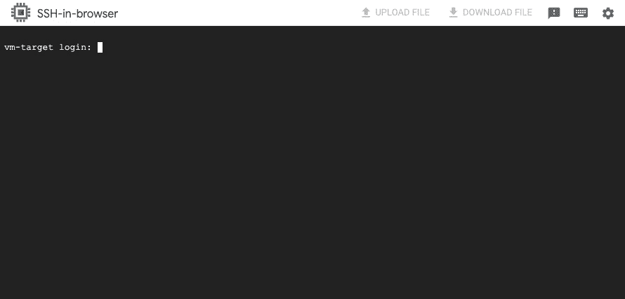

# 第四章：在 GCP 上设置隔离的渗透测试实验室环境

在设置基于云的渗透测试实验室时，我们故意创建一个易受攻击且配置错误的环境，以便练习各种安全技术。确保实验室环境中的资源免受未经授权的外部攻击，并减轻任何对实验室内授权测试活动或模拟的干扰风险是至关重要的。*想象一下，攻击者设法获得了对你的渗透测试实验室环境中易受攻击资源的未经授权的访问！* 这些攻击者可以利用云资源执行各种恶意活动——包括发起**分布式拒绝服务**（**DDoS**）攻击，攻击其他用户和组织拥有的系统，甚至在受损的云账户内传播恶意软件。*可怕吧？* 通过使用正确配置的网络环境将易受攻击的实验室资源隔离开来，我们可以保持一个安全的测试环境，最小化在云中设置渗透测试实验室所带来的风险。

在本章中，我们将准备一个`Google Cloud Platform`（**GCP**）中的隔离网络环境，并利用这个网络环境设置一个渗透测试实验室，防止未经授权的外部攻击。在整个网络环境的**虚拟私有云**（**VPC**）网络中，我们将设置一个目标**虚拟机**（**VM**）实例，托管一个故意存在漏洞的 Web 应用程序——`OWASP Juice Shop`。然后，在一个单独的 VPC 网络中，我们将启动一个攻击者虚拟机实例（运行一个名为`Kali Linux`的专注于渗透测试的 Linux 发行版），并配置其具有浏览器访问的桌面环境。接着，我们将建立 VPC 对等连接，创建目标 VPC 网络与攻击者 VPC 网络之间的连接。最后，我们将在隔离的网络环境中执行快速渗透测试模拟，以验证一切是否正常运行。

也就是说，我们将在本章中覆盖以下主题：

+   准备必要的组件和前提条件

+   定义项目结构

+   准备隔离网络

+   设置目标虚拟机实例

+   导入 Kali Linux 通用云镜像

+   手动设置攻击者虚拟机实例

+   利用 Terraform 自动设置攻击者虚拟机实例

+   在隔离网络环境中模拟渗透测试

+   清理工作

本书的前几章主要集中在使用 AWS 来设置云端渗透测试实验室环境。然而，在本章中，我们的重点将转向 GCP，我们将在新的 GCP 账户内部署各种云资源。自 2008 年推出以来，GCP 迅速发展，提供了多种基础设施和平台服务——包括虚拟机和数据库服务，以及数据工程和**机器学习**（**ML**）服务。因此，探索如何在这个成熟且多功能的云平台上构建渗透测试实验室环境是非常必要的。

有了这些准备，我们就可以开始了！

# 技术要求

在我们开始之前，以下准备工作需要完成：

+   **一个 GCP 账户**——您可以通过完成以下链接中的步骤，开始使用免费的试用账户：[`cloud.google.com/free/`](https://cloud.google.com/free/)。如果您尚未在 GCP 账户中设置账单账户，请确保您已正确设置账单信息/个人资料，以便可以不间断地访问和使用 GCP 服务。有关如何创建账单账户的更多信息，请查看以下链接：[`www.youtube.com/watch?v=NeRYUoR4u0s`](https://www.youtube.com/watch?v=NeRYUoR4u0s)。

+   任何文本编辑器（例如 Notepad++、Visual Studio Code 或 Sublime Text），我们可以在其中临时存储本章实践中使用的特定值（例如，您本地计算机的 IP 地址）。

一旦这些准备工作完成，您就可以继续进行下一步操作。

重要提示

确保*不要*使用任何现有的 GCP 账户，其中有生产（或暂存）环境资源，用于本书中的实践练习和解决方案。强烈建议为启动故意存在漏洞的资源创建一个*新的* GCP 账户。这将确保您的生产（或暂存）环境资源保持独立和安全。此外，请确保阅读可用文档和常见问题解答，以便充分了解在 GCP 中创建资源时哪些是免费的（哪些不是免费的）。有关更多信息，请参阅以下链接：[`cloud.google.com/free/docs/free-cloud-features`](https://cloud.google.com/free/docs/free-cloud-features)。

每章使用的源代码和其他文件可以在本书的 GitHub 仓库中找到：[`github.com/PacktPublishing/Building-and-Automating-Penetration-Testing-Labs-in-the-Cloud`](https://github.com/PacktPublishing/Building-and-Automating-Penetration-Testing-Labs-in-the-Cloud)。

# 准备必要的组件和前提条件

本节我们将重点准备本章所需的前提条件。我们将从获取你本地机器的 IP 地址开始。稍后在配置防火墙规则时，我们将使用这个 IP 地址来允许本地机器访问实验环境中的特定资源。此外，我们还将设置 Google Cloud 项目，在本章中将部署云资源。

最后，我们将生成 SSH 密钥（一个**公钥**和一个**私钥**）以便在本章稍后访问攻击者虚拟机实例。正如我们在*图 4.1*中所看到的，私钥将保存在你的本地机器中，而公钥将保存在攻击者虚拟机实例中。


图 4.1 – 生成 SSH 密钥以访问攻击者虚拟机实例

通过这种设置，服务器（攻击者虚拟机实例）可以使用私钥确认客户端（你的本地机器）的身份，而无需传输敏感的凭据。这样，我们就可以通过 SSH 访问攻击者虚拟机实例，并建立一个安全的连接，以便远程运行命令和管理实例。

注意

在*图 4.1*中，我们可以看到目标虚拟机实例以及渗透测试实验环境中的其他组件。我们将在本章接下来的章节中深入探讨实验环境中其他资源的配置。

话虽如此，我们将把本节分为以下三个部分：

+   *第一部分，共 3 部分 – 获取本地机器的* *IP 地址*

+   *第二部分，共 3 部分 – 设置 Google* *Cloud 项目*

+   *第三部分，共 3 部分 – 生成 SSH 密钥以访问攻击者* *虚拟机实例*

牢记这些要点后，我们将继续准备本章所需的必要组件和前提条件。

## 第一部分，共 3 部分 – 获取本地机器的 IP 地址

按照以下步骤操作：

1.  通过[`ipinfo.io/ip`](https://ipinfo.io/ip)、[`ifconfig.io/`](https://ifconfig.io/)或其他类似的网站和在线工具，记下你本地机器的 IP 地址。你也可以使用 Google 搜索来获取你本地机器的 IP 地址。

1.  将你的 IP 地址信息保存在文本编辑器中，因为稍后我们将使用它来允许本地机器访问攻击者虚拟机实例。

## 第二部分，共 3 部分 – 设置 Google Cloud 项目

现在，让我们创建 Google Cloud 项目，在本章中我们将在其中部署云资源。请按以下步骤操作：

1.  在网页浏览器中打开以下链接，进入 Google Cloud 控制台：[`console.cloud.google.com/`](https://console.cloud.google.com/)。

注意

**Google Cloud 控制台**是 GCP 提供的一个网页界面，用于管理云资源。你可以把它看作是我们在本书前几章中使用的**AWS 管理控制台**的对应工具。如果你需要快速了解如何使用 Google Cloud 控制台，可以观看以下 6 分钟的视频：[`www.youtube.com/watch?v=27Pb5g7bEAA`](https://www.youtube.com/watch?v=27Pb5g7bEAA)。

1.  在`Google Cloud`控制台中，打开导航菜单（**☰**）：

    图 4.2 – 导航到创建项目页面

    在**IAM & 管理员**下找到并点击**创建项目**，如*图 4.2*中所示。

1.  在**项目名称**字段中，指定`secure-network-environments`。保持**位置**字段的值不变（**无组织**）。

1.  然后点击**创建**按钮。

注意

在 GCP 中，**项目**用于将资源组织成逻辑组。在一个项目中，我们可以有一组用户，这些用户可以访问项目资源。一个项目包括用户、API 以及这些 API 的特定配置设置。有关更多信息，请查阅以下链接：[`cloud.google.com/storage/docs/projects`](https://cloud.google.com/storage/docs/projects)。

1.  项目成功创建后，点击*图 4.3*中高亮显示的下拉菜单：

    图 4.3 – 打开选择项目弹出窗口

    在**选择项目**弹出窗口中，选择`secure-network-environments`项目，然后点击**打开**按钮。

1.  找到并点击**激活 Cloud Shell**按钮，如*图 4.4*中所示：

    图 4.4 – 启动 Cloud Shell

    这将打开一个终端，我们可以在其中运行命令行命令。

注意

可能需要一两分钟才能使 Cloud Shell 准备就绪。

1.  点击位于 Cloud Shell 终端窗格右上角的**打开编辑器**按钮。这将打开 Cloud Shell 编辑器，类似于我们在*图 4.5*中看到的样子：

    图 4.5 – Cloud Shell 编辑器

    如果你没有看到类似*图 4.5*中的终端，可以打开 Cloud Shell 编辑器的**终端**菜单，然后从选项列表中选择**新建终端**。

注意

`Google Cloud Shell`提供了一个基于网页的交互式 shell 环境，供我们在使用云资源和应用程序时运行命令、编写脚本和管理资源。由于我们在前几章中已经使用过`AWS CloudShell`，因此我们应该能够很容易地适应本章中使用 Google Cloud Shell。需要注意的是，Google Cloud Shell 还提供了一个集成的代码编辑器，允许我们在该环境中直接编写、编辑和保存脚本和配置文件。

1.  在终端（`$`符号后面），运行以下命令以列出你在 GCP 账户中的项目：

    ```
    gcloud projects list
    ```

    如果你看到**授权 Cloud Shell**的弹窗（类似于*图 4**.6*所示），请确保点击**授权**按钮，允许`gcloud`命令行界面（**CLI**）为我们进行 API 调用：

    

    图 4.6 – 授权 Cloud Shell

    如果这是你第一次使用`gcloud` CLI，它只是一个命令行工具，帮助我们创建和管理各种 Google Cloud 资源。

    运行之前的命令后，应该会得到如下输出：

    ```
     ...PROJECT_ID: <PROJECT_ID> NAME: secure-network-environments
    PROJECT_NUMBER: ...
    ```

    请记得记下`PROJECT_ID`值，因为在接下来的步骤中配置活动项目时我们需要这个值。

1.  接下来，运行以下命令以检查当前活动项目：

    ```
    gcloud config get-value project
    ```

    如果之前的命令返回的项目 ID 与前一步骤中的`<PROJECT_ID>`值不匹配，请运行以下命令来配置一个新的活动项目—这次使用从前一步骤中获得的`<PROJECT_ID>`值：

    ```
    gcloud config set project <PROJECT_ID>
    ```

    你可以再次使用`gcloud config get-value project`命令来验证前面的命令是否成功。请注意，当 Cloud Shell 环境重新启动时，我们可能需要再次使用`gcloud config set project <PROJECT_ID>`来配置活动项目，以确保我们在正确的项目中运行命令并创建云资源。

重要提示

请确保*不要*使用项目名称（即**secure-network-environments**）作为`<PROJECT_ID>`值，特别是在使用`gcloud config set project`命令时。指定错误的`<PROJECT_ID>`值将会返回以下警告信息：**您似乎没有访问项目 [secure-network-environments] 的权限，或者该项目不存在。**

1.  使用搜索框，使用`vpc networks`搜索查询导航到**VPC 网络**页面。

1.  如果还没有启用 Compute Engine API，你将被重定向到 Compute Engine API 页面，类似于*图 4**.7*所示的内容：

    图 4.7 – 启用 Compute Engine API

    点击**启用**按钮继续。等待大约 3-5 分钟，直到 Compute Engine API 启用。请注意，这一步骤是必要的，以确保你可以在项目中访问 Compute Engine 服务和功能。

## 第三部分，共 3 部分 – 生成 SSH 密钥以访问攻击者虚拟机实例

现在，让我们为访问攻击者虚拟机实例生成 SSH 密钥（我们将在本章后面进行设置）。按照以下步骤操作：

1.  在继续上一个部分的内容时，让我们打开一个新的`Cloud Shell`终端（或重新使用现有的）。确保我们使用的是之前配置的`secure-network-environments`作为活动项目。

1.  在终端中（`$`符号后），运行以下命令以创建一个新目录（命名为**kali_keys**）并进入该目录：

    ```
    cd ~
    mkdir kali_keys && cd kali_keys
    ```

    我们将把生成的密钥存储在这个目录中。

1.  生成新的 SSH 密钥对并将生成的密钥文件保存在`kali_keys`目录中：

    ```
    ssh-keygen -t rsa -C kali -f ./kali-ssh
    ```

    当系统询问输入密码短语时，直接按*Enter*键即可，因为我们不会为密钥添加密码短语（密码确认也是如此）。这将生成两个文件——`kali-ssh`（私钥）和`kali-ssh.pub`（公钥）。

注意

*这些 SSH 密钥文件是如何工作的？* SSH 密钥文件由**私钥**（保存在客户端机器上）和相应的**公钥**（上传到远程服务器）组成。在身份验证过程中，客户端使用其私钥生成数字签名，服务器则使用相应的公钥进行验证。在这里，服务器可以通过确认客户端持有私钥来验证其身份，而不需要传输敏感的凭证。

1.  使用`cat`命令打印公钥值：

    ```
    cat kali-ssh.pub
    ```

    将此值保存在本地机器上的文本编辑器中，因为我们稍后将在本章的*手动设置攻击者虚拟机实例*部分中使用它。

1.  点击**打开编辑器**按钮（如果编辑器尚未打开）。

注意

加载**Cloud Shell 编辑器**可能需要一两分钟的时间。

1.  在编辑器的文件树中找到生成的私钥（**kali-ssh**）（类似于*图 4.8*所示）：

    图 4.8 – 下载生成的私钥文件

    右键单击文件，然后从上下文菜单中的选项中选择**下载**。你也可以对公钥（**kali-ssh.pub**）执行相同的步骤，将其下载到本地机器。

现在我们已经准备好了先决条件，可以继续进行项目结构的设置和定义！

# 定义项目结构

在本章中，我们将介绍使用 Terraform **模块**来帮助定义和组织我们的**基础设施即代码**（**IaC**）项目结构。模块使我们能够封装并重用一组资源，使得我们的 Terraform 代码更加模块化、可维护和可扩展。通过利用模块，我们将能够简化复杂基础设施部署的管理，并将常见配置抽象为可重用的组件。

在*第三章*，*成功使用基础设施即代码工具和策略*中，我们将所有的`.tf`文件存储在一个目录中。*感觉有点凌乱，对吧？* 如果你想知道模块如何改变我们组织代码和文件的方式，下面是使用 Terraform 模块后，项目结构可能的样子：


图 4.9 – 使用 Terraform 模块的示例文件和文件夹结构

在*图 4.9*中，我们展示了一个示例的文件和文件夹结构（左侧），以及模块目录如何在根模块的 `main.tf` 文件中加载（右侧）。这里，`root_module` 目录是 Terraform 配置的主要入口点。项目根目录中的 `module1` 和 `module2` 等目录将包含针对这些模块的 Terraform 文件，如 `main.tf`、`variables.tf` 和 `outputs.tf`。然后，这些模块将在根模块的 `main.tf` 文件中通过 `module` 块进行定义，就像我们在以下代码块中看到的那样：

```
 module "module1" {
  source = "./module1" ... }
module "module2" {
  source = "./module2" ... }
```

请注意，虽然通常会有一个单独的目录叫做 `modules` 来存储各个模块目录，比如 `module1`、`module2` 和 `module3`，但我们会遵循当前项目和文件夹结构，如*图 4.9*所示。

注意

值得注意的是，我们示例中使用的 `module1`、`module2` 和 `module3` 目录名称是任意的，可以根据用户的偏好进行重命名。例如，可以使用 `secure_network`、`attacker_vm` 和 `target_vm` 等替代名称，为模块提供更具描述性和意义的名称。

IaC 配置文件的组织和模块化受渗透测试实验环境整体设计的影响，同时也受到资源分组方式的影响。在这一部分，我们需要简要讨论（至少从高层次来看）我们的实验环境将是什么样子。请看以下示意图：


图 4.10 – 我们在 GCP 中渗透测试实验环境的高层次示意图

在*图 4.10*中，我们有两个 VPC 网络：`VPC 01` 和 `VPC 02`。如果你想知道什么是 VPC 网络，它们其实就是云计算环境中的隔离虚拟网络，用于安全地分离和管理资源。*话虽如此，我们计划在这些网络中放入哪些资源呢？* 在 `VPC 01` 中，我们将放置目标虚拟机实例。而在 `VPC 02` 中，我们将放置攻击者虚拟机实例。将这些资源分组的一种方式是使用以下组别：

+   **第 1 组**—`VPC 01` 和目标虚拟机实例

+   **第 2 组**—`VPC 02` 和攻击者虚拟机实例

我们应该考虑这种方法可能的局限性。将 `VPC 01` 和目标虚拟机实例放在一起，可能会限制网络环境的灵活性和可扩展性（从模块化的角度来看）。如果我们将来需要增加更多的目标虚拟机实例，就需要修改现有的分组，可能会导致第一个组拥有过多的资源。

注意

如果你不熟悉 VPC 和虚拟机实例，别担心，我们将在本章接下来的部分详细讨论这些内容。

另外一种选择是创建三个不同的模块，如下所示：

+   `secure_network` 模块—网络资源，如 `VPC 01` 和 `VPC 02`，以及其他相关资源的组合

+   `target_vm` 模块—目标虚拟机实例

+   `attacker_vm` 模块—攻击者虚拟机实例

这个替代方案似乎是一个更合适的选择，因为它倾向于准备一个可重用的网络环境模块，可以轻松地用于我们在 GCP 上的渗透测试实验室环境的多个迭代。此外，它还提供了灵活性，可以将目标虚拟机实例模块替换为一个或多个易受攻击的设计目标模块。尽管这种方法并不完美，但它目前应能满足需求，因为它在可扩展性、模块化和适应性方面提供了显著的优势，适合在 GCP 上构建动态渗透测试实验室环境。

注意

如果这一节中关于我们渗透测试实验室环境的概述感觉有些模糊，缺乏细节，不必担心——我们将在接下来的每一节中进行更全面的讨论。

现在，让我们继续设置初始的项目文件和目录：

1.  在上一节中我们已经开始了，确保我们有一个终端可以运行命令：

    图 4.11 – 打开新终端

    打开 Cloud Shell 编辑器的 `Terminal` 菜单（如 *图 4.11* 中所示）。从可用选项中选择 `New Terminal`。

1.  在终端中（`$` 符号后），运行以下命令来创建一个 `pentest_lab` 项目目录（并切换到新目录）：

    ```
    cd ~
    mkdir -p pentest_lab && cd pentest_lab
    ```

1.  在 `pentest_lab` 目录下，我们还需要创建 `secure_network`、`target_vm` 和 `attacker_vm` 目录，如下所示：

    ```
    mkdir -p secure_network
    mkdir -p target_vm
    mkdir -p attacker_vm
    ```

    我们稍后将在这些目录中存储相应的模块文件。

注意

虽然通常会有一个名为 `modules` 的独立目录来存储像 `secure_network`、`target_vm` 和 `attacker_vm` 这样的单独模块目录，但我们当前的项目和文件夹结构应该足够使用。

1.  让我们创建项目根目录中的文件：

    ```
    touch main.tf
    touch variables.tf
    touch outputs.tf
    touch terraform.tfvars
    touch versions.tf
    touch provider.tf
    ```

    注意，此时这些文件仍然是空的。我们将在后续过程中逐步添加必要的配置。以下是我们当前项目的结构：

    

    图 4.12 – 我们当前项目在文件树中的结构

    此时，我们在 `pentest_lab` 目录下有三个空目录（`attacker_vm`、`secure_network` 和 **target_vm**），以及六个空文件（`main.tf`、`outputs.tf`、`provider.tf`、`terraform.tfvars`、`variables.tf` 和 **versions.tf**）。

1.  通过在文件树（编辑器左侧）中定位文件，打开 `provider.tf` 文件并在编辑器中添加以下代码块：

    ```
     provider "google" {
      region      = "us-central1"
      zone        = "us-central1-c"
    }
    ```

    在这里，我们正在配置 Google 提供程序，将区域指定为`us-central1`，区域为`us-central1-c`。此提供程序配置确保我们通过 Terraform 部署的资源将在 GCP 中指定的区域和可用区内进行配置。考虑到这一点，在继续下一步之前，确保保存对`provider.tf`文件所做的任何修改。

重要提示

在接下来的步骤中，我们将在`~/pentest_lab`目录中的多个文件中更新并添加代码。确保保存对每个文件所做的任何更改，以便在运行`terraform`命令时不会遇到意外错误。

1.  接下来，打开`versions.tf`文件。我们将添加以下代码块来指定所使用提供程序的版本约束：

    ```
     terraform {
      required_providers {random = {
          source = "hashicorp/random"
          version = "2.3.0"
        }
        google = {
          source = "hashicorp/google"
          version = "4.61.0"
        }
      }
    }
    ```

    在这里，我们为随机和 Google Cloud 提供程序指定了源和版本。*为什么需要这样做？* 这样可以确保使用正确版本的提供程序，以保持在使用 Terraform 时的兼容性和一致性。话虽如此，确保在继续下一步之前保存对`versions.tf`文件所做的任何修改。

1.  打开`variables.tf`文件，并添加以下代码块：

    ```
     variable "my_ip" {
        type = string
    }
    variable "my_public_ssh_key" {
        type = string
    }
    ```

    在这里，我们定义了两个变量——`my_ip`和`my_public_ssh_key`。请注意，这次我们不会指定默认值，因为我们将使用`terraform.tfvars`文件来存储变量值。确保在继续下一步之前保存对`variables.tf`文件所做的任何修改。

1.  打开`terraform.tfvars`文件，并添加以下代码行：

    ```
     my_ip = "<IP ADDRESS OF YOUR LOCAL MACHINE>"
    my_public_ssh_key = "<PUBLIC SSH KEY>"
    ```

    确保将`<IP ADDRESS OF YOUR LOCAL MACHINE>`替换为你正在使用的笔记本或台式计算机的当前 IP 地址值。此外，确保将`<PUBLIC SSH KEY>`替换为公钥字符串值（在之前的步骤中运行`cat kali-ssh.pub`后获得）。请注意，`<PUBLIC SSH KEY>`的值应遵循类似`ssh-rsa ... kali`的格式。在继续下一步之前，不要忘记保存`terraform.tfvars`文件。

注意

此时，你可能会想，这个文件是用来做什么的！`terraform.tfvars`文件用于在 Terraform 项目中存储输入变量值。它提供了一种便捷的方式来管理和自定义基础设施的属性，而无需修改配置代码。除此之外，存储在`terraform.tfvars`文件中的值在使用`terraform** **apply`命令时会自动加载。

1.  打开`main.tf`文件，并添加以下代码块来定义将用于该项目的模块：

    ```
     module "secure_network" {
      source = "./secure_network"
    }
    module "attacker_vm" {
      source = "./attacker_vm"
    }
    module "target_vm" {
      source = "./target_vm"
    }
    ```

    在这里，我们在`main.tf`中添加了模块块，以从各自的源目录中包含`secure_network`、`attacker_vm`和`target_vm`模块。确保在继续下一步之前保存`main.tf`文件。

1.  在终端中（在`$`符号后面），运行`terraform init`命令以初始化 Terraform 工作目录：

    ```
    terraform init
    ```

    这将返回以下输出：

    ```
    ... Terraform has been successfully initialized! You may now begin working with Terraform. Try running "terraform plan" to see
    any changes that are required for your infrastructure. All Terraform commands
    should now work. ...
    ```

注意

确保在运行`terraform init`命令之前，已经位于`~/pentest_lab`目录中（以及接下来步骤中的其他`terraform`命令）。

1.  在运行`terraform plan`命令之前，让我们运行`terraform fmt`来格式化我们的 Terraform 代码：

    ```
    terraform fmt
    ```

    在这里，我们使用`terraform fmt`命令来确保所有 Terraform 配置文件中的编码风格一致。该命令将扫描 Terraform 配置文件，并自动调整缩进、空格和换行，以符合官方的 Terraform 风格指南。

注意

虽然这一步是可选的，但强烈建议将`terraform fmt`命令作为开发工作流的一部分，以保持干净且一致的编码风格。

1.  让我们运行`terraform plan`以预览 Terraform 将执行的更改：

    ```
    terraform plan
    ```

    这将返回以下输出：

    ```
    No changes. Your infrastructure matches the configuration. Terraform has compared your real infrastructure against your configuration and found no differences, so no changes are needed.
    ```

    该命令应无错误完成。否则，请确保在继续之前检查并修复任何问题。

1.  接下来，让我们使用`terraform apply`命令来实现这些更改：

    ```
    terraform apply -auto-approve
    ```

    这将产生以下输出：

    ```
    Terraform has compared your real infrastructure against your configuration and found no differences, so no changes are needed. Apply complete! Resources: 0 added, 0 changed, 0 destroyed.
    ```

    鉴于我们尚未在配置代码中定义和配置任何云资源，这是我们期望的结果！也就是说，如果`terraform apply`命令运行无误，我们可以继续进入下一部分。

在我们的项目结构和骨架准备好后，我们可以继续设置隔离的 VPC 网络环境。

# 准备隔离的网络

深入了解 GCP 中的计算和网络服务对于设计和实现安全的网络环境至关重要，尤其是在进行渗透测试实验室资源部署时。话虽如此，在我们深入研究安全网络设计之前，先快速浏览一下本章中我们将使用的一些资源、概念、功能和组件，如下所示：

+   `VPC`——VPC 是云计算环境中的一个虚拟网络，它使我们能够安全地分隔和管理资源。通过 VPC，我们可以设计和定制自己的网络架构，以满足特定需求，并启用 VPC 内部资源之间的安全通信。在 VPC 内部，我们可以拥有**子网**（**subnets**），它们允许进一步细分和隔离 VPC 网络中的资源。子网使我们能够根据不同的考虑和需求将资源分组。

    看一下以下图示：


图 4.13 - 简化的网络图

在*图 4.13*中，我们展示了一个包含两个 VPC 网络的*简化*网络图。每个 VPC 都有两个子网。在这些子网内，我们可以拥有各种资源，如虚拟机和其他云资源。如果这是你第一次接触这些概念，你可以把 VPC 网络想象成一个国家，而子网则是国家内的城市。就像一个国家制定自己的规则和边界一样，VPC 网络创建了一个受控的环境（在云账户内）来安全地管理资源。就像国家内的城市各具特点一样，VPC 网络中的子网作为隔离区域，将不同类型的资源分隔在更大的 VPC 网络内部。

重要提示

需要注意的是，我们没有在简化的网络图中包括项目或区域以及其他典型的网络组件，而是专注于与我们讨论相关的网络关键元素。

+   **防火墙规则**—防火墙规则是定义网络中允许或拒绝流量的安全规则。通过设置防火墙规则，我们可以定义允许（或阻止）的通信路径，并防止未授权的访问和潜在威胁到达网络内部的资源。就像交通警察维持城市街道的秩序一样，防火墙规则调控数据流，并帮助在我们云基础设施中的各种组件之间建立安全的通信。

+   **VPC 对等连接**—VPC 对等连接是一种网络功能，使得两个 VPC 网络之间能够像属于同一个网络一样进行安全和私密的通信。

    现在，看看以下图示：


图 4.14 – 简化网络图

在*图 4.14*中，我们展示了一个简化的网络图，图中有两个通过 VPC 对等连接连接的 VPC 网络。通过 VPC 对等连接，第一 VPC 网络子网中部署的资源的流量可以到达第二 VPC 网络子网中部署的资源（反之亦然），只要防火墙规则已正确配置。

注意

使用 VPC 对等连接连接 VPC 网络时，需要注意，对等的 VPC 网络中使用的 IP 地址范围不能重叠，以避免路由冲突。例如，如果 VPC A 的 IP 地址范围是 `10.0.0.0/16`，而 VPC B 的 IP 地址范围是 `192.168.0.0/16`，那么我们应该能够成功建立 VPC 对等连接，因为这些范围不重叠。然而，如果 VPC A 和 VPC B 都有 `10.0.0.0/16` 的 IP 地址范围，那么会发生重叠，从而导致路由冲突，无法建立 VPC 对等连接。此外，GCP 中的 VPC 对等连接是单向的，因为每个对等连接必须在每个 VPC 网络中单独配置。这允许流量从一个 VPC 网络流向另一个网络，但除非建立了互惠的对等连接，否则不能反向流动。最后，VPC 对等连接是非传递的——这意味着对等连接不会扩展到其他超出直接对等的 VPC 网络。如果需要多个 VPC 网络之间的连接，则需要建立单独的对等连接。

+   **虚拟机实例**—虚拟机实例是指在云环境中运行的虚拟化计算机系统，允许用户在虚拟化环境中部署和运行应用程序及服务。虚拟机实例通常包括操作系统，以及分配的计算资源，如 CPU 和内存，以及存储容量。

+   **私有 IP 地址**—私有 IP 地址是分配给 VPC 中资源的 IP 地址，用于 VPC 内部资源之间的通信。需要注意的是，资源的私有 IP 地址会落在为该资源所在子网指定的可用地址范围内。

+   **公网 IP 地址**—公网 IP 地址是分配给 VPC 中资源的 IP 地址，允许这些资源从 VPC 网络外部访问。如果资源没有公网 IP 地址，则意味着该资源仅在 VPC 的私有网络内可访问，无法从公共互联网直接访问。

+   **串行控制台**—串行控制台是一项功能（或特性），提供直接访问虚拟机实例 CLI 的能力。即使虚拟机的网络连接不可靠或不可用，它也允许我们进行故障排除和配置虚拟机操作系统。

在 GCP 中，有多种方法可以建立一个安全的网络环境设置，限制外部主机流量到达内部部署的云资源。通过配置严格的防火墙规则、实施网络分段并利用相关的 VPC 特性和配置，我们可以防止未经授权的外部访问内部网络环境。

本章将重点讨论满足以下约束和要求的解决方案之一：

+   攻击者资源（例如 Kali Linux 虚拟机实例）应该在一个专用的 VPC 网络中进行部署和分组。同样，目标资源（例如设计脆弱的应用程序和资源）应在一个单独的 VPC 网络中进行部署和分组。

+   来自攻击者资源的流量应该能够顺利到达目标资源，即使这些资源部署在不同的 VPC 中。

+   应启用串行控制台访问，以允许直接访问攻击者和目标虚拟机资源。

+   由于我们将配置攻击者虚拟机实例，以便与您的机器建立 SSH 连接和 SSH 隧道，我们将限制攻击者虚拟机实例的端口`22`，仅允许来自您的本地机器的访问。同样，考虑到我们将配置攻击者虚拟机实例以通过浏览器访问其桌面环境，我们将限制攻击者虚拟机实例的端口`8081`，仅允许来自您的本地机器的访问。

鉴于这些约束和要求，我们的网络环境应该是什么样的呢？下图为我们提供了一个概览：


图 4.15 – 我们渗透测试实验环境的高级架构图

在*图 4.15*中，我们有一个简化的网络图，其中两个 VPC 网络通过 VPC 对等连接。这里，部署在`VPC 02`中的攻击者虚拟机实例能够访问部署在`VPC 01`中的目标虚拟机实例（反之亦然）。在正确的项目配置下，我们应该能够使用串行控制台连接到攻击者和目标虚拟机实例。配置的防火墙规则应允许我们的本地机器通过端口`22`和端口`8081`访问攻击者虚拟机实例。

注释

值得一提的是，我们讨论的架构只是多种潜在解决方案中的一种。也就是说，还有多种替代方法可以满足要求和指定的约束。

除了阻止外部入站流量外，*图 4.15*中的 VPC 网络还可以配置为阻止向对等网络外部资源的出站流量。虽然这是可能的，但这会阻止 VPC 网络中的虚拟机实例和其他资源访问对等网络外部的资源。这意味着这些资源无法访问外部仓库以下载更新和包，这可能会影响设置过程。在本章中，我们将配置 VPC 网络以允许出站流量（即，对等 VPC 中的实例应该能够访问外部网络资源）。然而，在完成本章后，您可以自由探索阻止出站流量的替代方法，以便实现更受限的网络环境。

鉴于这些要点，我们将继续准备网络环境，如下所示：

1.  在 Cloud Shell 终端（`$`符号后面）中，运行以下命令（每次一行）以导航到`~/pentest_lab/secure_network`目录：

    ```
    cd ~/pentest_lab
    cd secure_network
    ```

1.  接下来，运行以下命令来创建我们在`secure_network`模块中需要的文件：

    ```
    touch main.tf
    touch variables.tf
    touch outputs.tf
    ```

注意

请确保不要混淆文件名，因为我们在不同的目录中有几个相同的文件名！尽管我们在`~/pentest_lab/secure_network`目录中有`main.tf`、`variables.tf`和`outputs.tf`文件，但在`~/pentest_lab`目录中也有相同名称的文件。

1.  使用编辑器，将以下代码块添加到`secure_network/variables.tf`文件中：

    ```
     variable "my_ip" {
        type = string
    }
    ```

    在继续之前，请确保保存`secure_network/variables.tf`文件。

1.  接下来，在编辑器中打开`secure_network/main.tf`文件。在接下来的步骤中，我们将添加一段代码来定义和配置多个网络资源。首先，添加以下代码块，允许我们以后通过串行连接从浏览器访问我们的虚拟机实例：

    ```
     resource "google_compute_project_metadata" "default" {
      metadata = {
        "serial-port-enable" = "TRUE"
      }
    }
    ```

注意

连接到运行中的虚拟机实例有多种方式。在本章中，我们将使用**串行连接**，因为它提供了一种方便的方式让我们从浏览器访问启动的虚拟机实例。欢迎查看以下链接获取更多信息：[`cloud.google.com/compute/docs/troubleshooting/troubleshooting-using-serial-console`](https://cloud.google.com/compute/docs/troubleshooting/troubleshooting-using-serial-console)。

1.  在同一个文件中（**secure_network/main.tf**），添加以下代码块来定义`google_compute_network`和`google_compute_subnetwork`资源：

    ```
     resource "google_compute_network" "vpc_01" {
      name = "vpc-01"
      auto_create_subnetworks = "false"
    }
    resource "google_compute_subnetwork" "subnet_01" {
      name          = "subnet-01"
      ip_cidr_range = "10.1.0.0/20"
      region        = "us-central1"
      network       = google_compute_network.vpc_01.name
    }
    ```

    在这里，我们定义了一个具有单个子网的 VPC 网络，使用`10.1.0.0/20`的**无类域间路由**（**CIDR**）范围。由于`auto_create_subnetworks`被设置为`false`，因此不会创建其他子网（除我们刚才定义的子网外）。

1.  在同一个文件中（**secure_network/main.tf**），定义`vpc_02`和`subnet_02`资源：

    ```
     resource "google_compute_network" "vpc_02" {
      name = "vpc-02"
      auto_create_subnetworks = "false"
    }
    resource "google_compute_subnetwork" "subnet_02" {
      name          = "subnet-02"
      ip_cidr_range = "10.2.0.0/20"
      region        = "us-central1"
      network       = google_compute_network.vpc_02.name
    }
    ```

    我们将在本章稍后在这些网络资源中启动攻击者虚拟机实例。

1.  在同一个文件中（**secure_network/main.tf**），让我们定义两个`net_01`和`net_02`本地值：

    ```
     locals {net_01 = google_compute_network.vpc_01.self_linknet_02 = google_compute_network.vpc_02.self_link
    }
    ```

    我们将在下一组步骤中定义其他网络资源时，使用这些本地值。

1.  在同一个文件中（**secure_network/main.tf**），让我们使用以下代码块定义两个`google_compute_network_peering`资源—一个从`vpc-01`到`vpc-02`，另一个从`vpc-02`到`vpc-01`：

    ```
     resource "google_compute_network_peering" "peer_01_to_02" {
      name         = "peer-01-to-02"
      network      = local.net_01
      peer_network = local.net_02
    }
    resource "google_compute_network_peering" "peer_02_to_01" {
      name         = "peer-02-to-01"
      network      = local.net_02
      peer_network = local.net_01
    }
    ```

重要提示

为了确保 VPC 网络对等互联正常工作，所涉及 VPC 的 CIDR 块不应*重叠*。在我们的案例中，设置应该没有问题，因为`VPC 01`（`10.1.0.0/20**-**10.1.0.0**-`10.1.15.255**）和`VPC 02`（`10.2.0.0/20**-**10.2.0.0**-`10.2.15.255**）的 CIDR 块没有重叠。可以使用在线子网计算器来验证这一点。

1.  在同一个文件（**secure_network/main.tf**）中，使用以下代码块定义`allow-all-from-vpc2`和`allow-all-from-vpc-1`防火墙：

    ```
     resource "google_compute_firewall" "allow-all-from-vpc2" {
      name    = "allow-all-from-vpc-2"
      network = local.net_01
      allow {
        protocol = "all"
      }
      source_ranges = ["10.2.0.0/20"]
      priority = 10000
    }
    resource "google_compute_firewall" "allow-all-from-vpc1" {
      name    = "allow-all-from-vpc-1"
      network = local.net_02
      allow {
        protocol = "all"
      }
      source_ranges = ["10.1.0.0/20"]
      priority = 20000
    }
    ```

    这些代码块将（1）允许从部署在`VPC 02`中的资源访问部署在`VPC 01`中的资源（即，从`10.2.0.0/20`到**10.1.0.0/20**）以及（2）允许从部署在`VPC 01`中的资源访问部署在`VPC 02`中的资源（即，从`10.1.0.0/20`到**10.2.0.0/20**）。

注意

GCP 防火墙规则中的优先级数字决定了规则评估的顺序。*数字越低*，规则的优先级越*高*。GCP 根据优先级数字按升序评估防火墙规则，直到找到匹配的规则，此时评估停止。也就是说，重要的是分配唯一且恰当顺序的优先级数字，以确保防火墙规则正确应用，并按预期顺序执行。

1.  在同一个文件（**secure_network/main.tf**）中，使用以下代码块定义`allow-ssh-from-my-ip`和`allow-desktop-access-from-my-ip`防火墙：

    ```
     resource "google_compute_firewall" "allow-ssh-from-my-ip" {
      name    = "allow-ssh-from-my-ip"
      network = local.net_02
      allow {
        protocol = "tcp"
        ports    = ["22"]
      }
      source_ranges = ["${var.my_ip}/32"]
      priority = 30000
    }
    resource "google_compute_firewall" "allow-desktop-access-from-my-ip" {
      name    = "allow-desktop-access-from-my-ip"
      network = local.net_02
      allow {
        protocol = "tcp"
        ports    = ["8081"]
      }
      source_ranges = ["${var.my_ip}/32"]
      priority = 40000
    }
    ```

    这些防火墙规则将允许你的本地机器访问在`VPC 02`内启动的资源（通过端口`22`和**8081**），一旦整个渗透实验环境搭建完成。

注意

在运行接下来的一组终端命令之前，确保保存`secure_network/main.tf`文件（**文件**菜单 > **保存**）。

1.  现在，让我们在编辑器中打开`secure_network/outputs.tf`文件。添加以下代码块以定义`subnet_01`和`subnet_02`输出：

    ```
     output "subnet_01" {
      value = google_compute_subnetwork.subnet_01.id
    }
    output "subnet_02" {
      value = google_compute_subnetwork.subnet_02.id
    }
    ```

    在进行下一步之前，确保也保存`secure_network/outputs.tf`文件。

1.  导航到我们的`pentest_lab`项目目录，如下所示：

    ```
    cd ~/pentest_lab
    ```

1.  让我们使用`terraform init`命令重新初始化 Terraform 工作目录：

    ```
    terraform init
    ```

1.  让我们运行`terraform plan`来预览 Terraform 将要执行的更改：

    ```
    terraform plan
    ```

    这应该会给我们带来一个**缺少必需参数 — 必需的“my_ip”参数未定义**的错误信息，因为我们在声明`secure_network`模块时没有为`my_ip`参数提供任何值。

注意

如果你在想为什么这个问题会突然出现，重要的是回忆一下我们在之前的步骤中已经在`secure_network/variables.tf`文件中定义了`my_ip`变量。

1.  为了解决在前一步中遇到的问题，我们需要在声明`secure_network`模块时为`my_ip`参数提供一个值（类似于*图 4.16*中的内容）：

    图 4.16 – 将 my_ip 变量值传递到 secure_network 模块的 my_ip 输入变量中

    以*图 4.16*为参考，我们将通过将`my_ip`变量值（根模块中的）传递给`secure_network`模块的`my_ip`输入变量来解决问题。由于我们在之前的步骤中已准备了`terraform.tfvars`文件，运行`terraform apply`命令时，`my_public_ssh_key`和`my_ip`的默认变量值将从`terraform.tfvars`文件中加载。

    现在我们对如何解决问题有了更清晰的思路，让我们在`main.tf`文件中找到以下代码块（**~/pentest_lab/main.tf**）：

    ```
     module "secure_network" {
      source = "./secure_network"
    }
    ```

    使用以下代码块更新它：

    ```
     module "secure_network" {
      source = "./secure_network"my_ip = var.my_ip }
    ```

    在这里，我们将`my_ip`变量值传递给`secure_network`模块的`my_ip`输入变量。

注意

在进行下一步之前，请确保保存`main.tf`文件（**~/pentest_lab/main.tf**）。

1.  在 Cloud Shell 终端（`$`符号之后），让我们运行以下命令预览 Terraform 将执行的更改：

    ```
    terraform plan
    ```

    这应该会输出以下结果：

    ```
    ... Plan: 11 to add, 0 to change, 0 to destroy. ...
    ```

    这一次，我们应该能够顺利进行，而不会遇到错误。

1.  接下来，让我们使用`terraform apply`命令来实现这些更改：

    ```
    terraform apply -auto-approve
    ```

    运行命令应返回以下输出：

    ```
    ... Apply complete! Resources: 11 added, 0 changed, 0 destroyed.
    ```

注意

等待几分钟，直到`terraform apply`命令完成。

1.  现在，让我们使用控制台检查 Terraform 创建的资源。通过在搜索栏中键入`vpc networks`并从搜索结果中选择`VPC networks`，进入现有 VPC 网络列表：

    图 4.17 – VPC 网络列表

    在*图 4.17*中，我们可以看到`vpc-01`和`vpc-02` VPC 网络已成功由 Terraform 创建。在这里，我们还可以看到`vpc-01`和`vpc-02`各自有一个子网（在**子网（Subnets）**列下的计数表示）。如果列表未显示我们刚创建的新 VPC，请随时点击**刷新（REFRESH）**按钮。

1.  让我们检查将托管目标虚拟机实例的 VPC 网络。从 VPC 网络列表中点击`vpc-01`，进入该 VPC 的网络详情页面：

    图 4.18 – VPC 网络详情

    我们应该能看到`vpc-01`中只有一个子网，类似于*图 4.18*中的情况。您还可以检查**防火墙（FIREWALLS）**和**VPC 网络对等（VPC NETWORK PEERING）**选项卡下的资源，以验证这些资源是否已正确创建和配置。

注意

您可以返回到 VPC 网络列表，检查`vpc-02`以及使用 Google Cloud 控制台创建的其他资源。

*这不是很简单吗？* 话不多说，让我们继续下一部分。

# 设置目标虚拟机实例

在我们的隔离网络环境准备好后，现在可以继续设置目标虚拟机实例。在本节中，我们将在`VPC 01`的子网中设置目标虚拟机实例，类似于*图 4.19*中的情况：


图 4.19 – 在 VPC 01 的子网中设置目标虚拟机实例

在目标虚拟机实例内，我们将运行一个故意设计为易受攻击的应用程序，名为`OWASP Juice Shop`。`OWASP Juice Shop`由**开放 Web 应用程序安全项目**（**OWASP**）设计、开发和准备，旨在帮助开发人员、安全工程师和渗透测试人员提升他们对安全编码实践和漏洞识别的理解，并提供各种缓解策略。为了简化在我们的虚拟机实例中安装和设置`OWASP Juice Shop`应用程序，我们将使用`bkimminich/juice-shop`容器镜像。该容器镜像将允许我们在容器中运行这一设计上就易受攻击的应用程序。

注意

如果你在想**容器**是什么，它们只是轻量级的、隔离的运行时环境，提供了一种一致且便捷的方式来在不同的计算环境中运行应用程序。另一方面，容器镜像（如`bkimminich/juice-shop`容器镜像）是包含创建和运行容器所需文件和配置的模板。它们包括应用程序代码，以及在容器化环境中执行应用程序所需的所有先决条件。

容器允许不同的易受攻击应用程序在虚拟机实例中共存而不互相干扰。也就是说，尽管我们计划在目标虚拟机实例内只运行一个容器，但值得一提的是，在同一个虚拟机实例的容器内运行多个故意设计为易受攻击的应用程序也是可能的。

本节分为以下几个子部分：

+   *第一部分/2 – 使用 Terraform 准备目标虚拟机实例*

+   *第二部分/2 – 使用串行控制台访问目标* *虚拟机实例*

事不宜迟，开始吧！

## 第一部分/2 – 使用 Terraform 准备目标虚拟机实例

按照以下步骤操作：

1.  通过在 Cloud Shell 终端运行以下命令，导航到`~/pentest_lab/target_vm`目录：

    ```
    cd ~/pentest_lab
    cd target_vm
    ```

1.  运行以下命令创建我们在`target_vm`模块中所需的文件：

    ```
    touch main.tf
    touch variables.tf
    touch outputs.tf
    ```

1.  打开一个新的浏览器标签，导航到本书的官方 GitHub 仓库：[`github.com/PacktPublishing/Building-and-Automating-Penetration-Testing-Labs-in-the-Cloud/`](https://github.com/PacktPublishing/Building-and-Automating-Penetration-Testing-Labs-in-the-Cloud/)。

1.  在`ch04/pentest_lab/target_vm`目录下找到`target_boot_script.tpl`模板文件（[`github.com/PacktPublishing/Building-and-Automating-Penetration-Testing-Labs-in-the-Cloud/tree/main/ch04/pentest_lab/target_vm/target_boot_script.tpl`](https://github.com/PacktPublishing/Building-and-Automating-Penetration-Testing-Labs-in-the-Cloud/tree/main/ch04/pentest_lab/target_vm/target_boot_script.tpl)）：

    图 4.20 – 复制链接地址选项

    右键点击 `Raw` 按钮，在上下文菜单中选择 **复制链接地址**（如 *图 4.20* 中突出显示的那样）。这将把文件的链接地址复制到本地计算机的剪贴板。

1.  使用 `wget` 命令下载 `target_boot_script.tpl` 模板文件：

    ```
     wget -O target_boot_script.tpl <DOWNLOAD LINK>
    ```

    确保将 `<DOWNLOAD LINK>` 替换为之前复制的链接（在选择上下文菜单中的 **复制链接地址** 后，它应该已经复制到剪贴板）。

注意

你也可以使用这个链接来替代 `<DOWNLOAD** **LINK>` 的值：

[`raw.githubusercontent.com/PacktPublishing/Building-Penetration-Testing-Labs-in-the-Cloud/main/ch04/pentest_lab/target_vm/target_boot_script.tpl`](https://raw.githubusercontent.com/PacktPublishing/Building-Penetration-Testing-Labs-in-the-Cloud/main/ch04/pentest_lab/target_vm/target_boot_script.tpl)

1.  让我们快速检查一下我们下载的 `target_boot_script.tpl` 文件的内容，使用 `cat` 命令：

    ```
    cat target_boot_script.tpl
    ```

    花几分钟阅读文件中的代码。你会看到，脚本分为三部分，具体如下：

    +   **设置用户**—运行脚本会在系统上创建一个新用户，为该用户设置密码，并授予该用户 `sudo` 权限（无需密码）

    +   **安装 Docker**—在这里，我们运行一些命令以在脚本运行的系统上安装 Docker

    +   **设置 OWASP Juice Shop**—这一部分的脚本主要是运行 OWASP Juice Shop 应用程序，并将其托管在 Docker 容器中，使其可以通过脚本运行的主机的 `80` 端口进行访问

1.  现在，让我们打开一个新的浏览器标签页，在 `ch04/pentest_lab/target_vm` 目录下找到 `wait_for_boot.tpl` 模板文件 ([`github.com/PacktPublishing/Building-and-Automating-Penetration-Testing-Labs-in-the-Cloud/tree/main/ch04/pentest_lab/target_vm/wait_for_boot.tpl`](https://github.com/PacktPublishing/Building-and-Automating-Penetration-Testing-Labs-in-the-Cloud/tree/main/ch04/pentest_lab/target_vm/wait_for_boot.tpl)):

    图 4.21 – 复制链接地址选项

    右键点击 `Raw` 按钮，在上下文菜单中选择 **复制链接地址**（如 *图 4.21* 中突出显示的那样）。这将把文件的链接地址复制到本地计算机的剪贴板。

1.  使用 `wget` 命令下载 `wait_for_boot.tpl` 模板文件：

    ```
     wget -O wait_for_boot.tpl <DOWNLOAD LINK>
    ```

    确保将 `<DOWNLOAD LINK>` 替换为之前复制的链接（在选择上下文菜单中的 **复制链接地址** 后，它应该已经复制到剪贴板）。

注意

你也可以使用这个链接来替代 `<DOWNLOAD** **LINK>` 的值：

[`raw.githubusercontent.com/PacktPublishing/Building-Penetration-Testing-Labs-in-the-Cloud/main/ch04/pentest_lab/target_vm/wait_for_boot.tpl`](https://raw.githubusercontent.com/PacktPublishing/Building-Penetration-Testing-Labs-in-the-Cloud/main/ch04/pentest_lab/target_vm/wait_for_boot.tpl)

1.  让我们使用`cat`命令快速检查我们下载的`wait_for_boot.tpl`文件内容：

    ```
    cat wait_for_boot.tpl
    ```

    花上一两分钟阅读文件中的代码。你会看到脚本只是等待目标引导脚本（基于`target_boot_script.tpl`模板脚本文件）完成运行。脚本会进行一定次数的重试，并检查目标引导脚本是否执行了以下代码行：

    ```
    echo "SCRIPT: COMPLETE"
    ```

重要说明

在继续之前，请确保`target_boot_script.tpl`和`wait_for_boot.tpl`模板文件位于`pentest_lab/target_vm`目录中。

1.  现在，让我们在编辑器中打开`target_vm/variables.tf`文件，并添加以下代码块：

    ```
     variable "subnet_01" {
        type = string
    }
    ```

    在这里，我们将定义一个变量，用于配置虚拟机实例将在哪个子网中启动。

备注

在继续之前，请确保保存`target_vm/variables.tf`文件。

1.  现在，让我们在编辑器中打开`target_vm/main.tf`文件。在接下来的步骤中，我们将添加几块代码。

1.  在`target_vm/main.tf`文件中，让我们定义一个名为`random_password`的资源，它会生成一个长度为`12`的随机字符串，并带有特殊字符：

    ```
     resource "random_string" "random_password" {
      length           = 12
      special          = true
      override_special = "!#$%&"
    }
    ```

    在这里，我们提供了自己的特殊字符列表，用于生成随机密码值。如果你在想我们将在哪里使用这个生成的密码，我们将在接下来的步骤中通过串行控制台访问目标虚拟机实例时使用它。

1.  在`target_vm/main.tf`文件中，让我们定义一些本地变量，用于配置我们的虚拟机实例（在定义`google_compute_instance`资源之前）：

    ```
     locals {
        vm_username = "testuser"
        vm_password = random_string.random_password.result
    }
    locals {
      script = templatefile("${path.module}/target_boot_script.tpl", {
        vm_username = local.vm_username
        vm_password = local.vm_password
      })
      subnet_01 = var.subnet_01
    }
    ```

    在这里，我们定义了`vm_username`、`vm_password`、`script`和`subnet_01`本地变量。在定义`script`本地变量时，我们使用`templatefile()`函数来渲染`target_boot_script.tpl`模板文件的内容，并传递`vm_username`和`vm_password`的值作为变量。

1.  在`target_vm/main.tf`文件中，让我们使用以下代码块定义我们的第一个`google_compute_instance`资源：

    ```
     resource "google_compute_instance" "target_vm" {
      name         = "vm-target"
      machine_type = "f1-micro"
      zone         = "us-central1-c"
      boot_disk {
        initialize_params {
          image = "debian-cloud/debian-11"
        }
      }
      metadata_startup_script = local.script
      network_interface {
        subnetwork = local.subnet_01
        access_config {}
      }
    }
    locals {
      max_retries = 20
      retry_delay = 30
    }
    ```

1.  在`target_vm/main.tf`文件中，我们还需要定义`wait_for_startup_script`和`null_resource`资源：

    ```
     resource "null_resource" "wait_for_startup_script" {
      depends_on = [google_compute_instance.target_vm]
      provisioner "local-exec" {
        interpreter = ["bash", "-c"]
        command = templatefile("${path.module}/wait_for_boot.tpl", {
            max_retries    = local.max_retries
            target_vm_name = google_compute_instance.target_vm.name
            target_vm_zone = google_compute_instance.target_vm.zone
            retry_delay    = local.retry_delay
        })
      }
      provisioner "local-exec" {
        when    = destroy
        command = "true"
      }
    }
    ```

    如果你在想这段代码是做什么的，这个代码块只是运行一个脚本（该脚本编码在`wait_for_boot.tpl`模板文件中）并在虚拟机实例中等待整个引导脚本（该脚本编码在`target_boot_script.tpl`模板文件中）完成。

重要说明

如果没有这个代码块，`terraform apply`命令将提前完成，即使目标虚拟机实例的引导过程还没有结束。这意味着在`terraform apply`命令完成时，OWASP Juice Shop 应用可能还不可用或无法访问！

1.  在`target_vm/main.tf`文件中，让我们也定义以下本地值：

    ```
     locals {
        target_vm = google_compute_instance.target_vm
        target_vm_ni = local.target_vm.network_interface.0
        target_vm_private_ip = local.target_vm_ni.network_ip
        target_vm_ac = local.target_vm_ni.access_config.0
        target_vm_public_ip = local.target_vm_ac.nat_ip
    }
    ```

备注

在继续进行下一组步骤之前，请确保保存`target_vm/main.tf`文件。

1.  现在，在编辑器中打开 `target_vm/outputs.tf` 文件。添加以下代码块以定义 `target_vm` 模块的输出：

    ```
     output "target_vm_username" {
      value = local.vm_username
    }
    output "target_vm_password" {
      value = local.vm_password
    }
    output "target_vm_private_ip" {
      value = local.target_vm_private_ip
    }
    output "target_vm_public_ip" {
      value = local.target_vm_public_ip
    }
    ```

    在继续下一步之前，确保保存 `target_vm/outputs.tf` 文件。

注意

我们将在 `~/pentest_lab/outputs.tf` 文件中使用这些输出值。

1.  在 Cloud Shell 终端（`$` 符号后面）中，导航到 `pentest_lab` 项目目录：

    ```
    cd ~/pentest_lab
    ```

1.  让我们使用 `terraform init` 命令重新初始化 Terraform 工作目录：

    ```
    terraform init
    ```

1.  让我们运行 `terraform plan` 来预览 Terraform 将执行的更改：

    ```
    terraform plan
    ```

    这应该会给我们一个 **Missing required argument — The argument “subnet_01” is required, but no definition was found** 错误消息，因为我们在声明 `target_vm` 模块时没有为 `subnet_01` 参数提供任何值。

注意

如果你在想为什么我们突然遇到这个问题，那么重要的是要回想一下，我们在早期步骤中已经在 `target_vm/variables.tf` 文件中定义了 `subnet_01` 变量。我们将在接下来的步骤中解决这个问题！

1.  为了解决上一步骤中遇到的问题，我们需要确保在声明 `target_vm` 模块时为 `subnet_01` 参数提供一个值（类似于 *图 4.22* 中所示）：

    图 4.22 – 在声明 `target_vm` 模块时为 subnet_01 参数提供一个值

    以 *图 4.22* 为参考，我们将通过将 `secure_network` 模块的 `subnet_01` 输出值传递给 `target_vm` 模块的 `subnet_01` 输入变量来解决这个问题。现在我们对如何解决这个问题有了更清晰的思路，接下来让我们在 `main.tf` 文件 (`~/pentest_lab/main.tf`) 中找到以下代码块：

    ```
     module "target_vm" {
      source = "./target_vm"
    }
    ```

    使用以下代码块更新它：

    ```
     module "target_vm" {
      source = "./target_vm"subnet_01 = module.secure_network.subnet_01 }
    ```

    在这里，我们将 `secure_network` 模块的输出值 (`module.secure_network.subnet_01`) 传递给 `target_vm` 模块的 `subnet_01` 输入变量。

注意

确保保存对 `main.tf` 文件 (`~/pentest_lab/main.tf`) 所做的更改。

1.  让我们运行 `terraform plan` 来预览 Terraform 将执行的更改：

    ```
    terraform plan
    ```

    这应该会给我们以下输出：

    ```
    ... Plan: 3 to add, 0 to change, 0 to destroy.
    ```

    这一次，我们应该能够顺利进行，而不会遇到错误。

1.  接下来，让我们使用 `terraform apply` 命令来实施更改：

    ```
    terraform apply -auto-approve
    ```

    运行该命令应该会得到以下输出：

    ```
    ... Apply complete! Resources: 3 added, 0 changed, 0 destroyed.
    ```

注意

等待一到两分钟，直到 `terraform apply` 命令完成。

1.  为了查看输出值，让我们在编辑器中打开 `outputs.tf` 文件 (`~/pentest_lab/outputs.tf`) 并添加以下代码块：

    ```
     output "target_vm_username" {
      value = module.target_vm.target_vm_username
    }
    output "target_vm_password" {
      value = module.target_vm.target_vm_password
    }
    output "target_vm_private_ip" {
      value = module.target_vm.target_vm_private_ip
    }
    output "target_vm_public_ip" {
      value = module.target_vm.target_vm_public_ip
    }
    ```

    这将利用 `target_vm` 模块的输出，在根模块的 `outputs.tf` 文件 (`~/pentest_lab/outputs.tf`) 中。

1.  让我们运行 `terraform plan` 来预览 Terraform 将执行的更改：

    ```
    terraform plan
    ```

    这应该会得到以下输出：

    ```
    Changes to Outputs:
      + target_vm_password   = "..." + target_vm_private_ip = "..." + target_vm_public_ip  = "..."   + target_vm_username   = "testuser"
    ```

1.  接下来，让我们使用 `terraform apply` 命令来实施更改：

    ```
    terraform apply -auto-approve
    ```

    这应该会给我们以下输出：

    ```
    Apply complete! Resources: 0 added, 0 changed, 0 destroyed. Outputs:
    target_vm_password = "..." target_vm_private_ip = "..." target_vm_public_ip = "..." target_vm_username = "testuser"
    ```

    在这里，我们可以看到运行`terraform apply -auto-approve`命令后的输出值，因为我们在之前的步骤中已经在根模块中定义了输出（即存储在`~/pentest_lab`中的代码）。

1.  将`target_vm_username`、`target_vm_password`和`target_vm_private_ip`的输出值保存在文本编辑器中，因为我们将在本章的后续步骤中使用这些值。

## 第二部分 2/2 – 使用串行控制台访问目标虚拟机实例

按照以下步骤进行：

1.  通过在搜索框中输入**计算引擎**并从搜索结果中选择`Compute Engine`，导航到**VM 实例**页面（类似于*图 4.23*所示）：

    图 4.23 – 导航到 VM 实例页面

    在**VM 实例**页面，我们将看到我们 GCP 账户中的虚拟机实例列表。

1.  点击**名称**列下的链接（**vm-target**），即可导航到我们的目标虚拟机实例（**vm-target**）的**实例详情**页面。

1.  是时候访问串行控制台了！如果你在想这是什么，**串行控制台**是一个故障排除工具，允许用户在 GCP 中方便地直接访问虚拟机实例的串行端口。它使用户能够与虚拟机的控制台输出进行交互，访问启动过程，并诊断问题，即使 SSH 或其他基于网络的连接不可用（或配置错误）。考虑到这一点，让我们点击**连接到串行控制台**按钮。这将打开一个类似于*图 4.24*中的弹出窗口：

    图 4.24 – 串行控制台弹出窗口

    一旦你在弹出窗口中看到空白页面，点击空白页面，然后按*Enter*键。使用`target_vm_username`（**testuser**）和`target_vm_password`（生成的密码）登录。

注意

可以随时在 Cloud Shell 终端运行`terraform show`命令，以检索`target_vm_username`和`target_vm_password`的输出值。在运行`terraform show`命令之前，确保你位于`~/pentest_lab`目录内。

1.  使用以下命令检查目标虚拟机实例中是否正在运行 OWASP Juice Shop 容器：

    ```
    sudo docker ps
    ```

    如果提示输入密码，简单使用`target_vm_password`输出值即可继续执行命令。

    `sudo docker ps`命令应返回一个正在运行的容器，使用`bkimminich/juice-shop`容器镜像：

    

    图 4.25 – 确认 OWASP Juice Shop 容器已经在运行

    访问虚拟机实例的`80`端口将允许你与运行`bkimminich/juice-shop`镜像的容器进行交互。

1.  运行以下命令向本地服务器发送示例请求，检查是否在`80`端口上运行了网站：

    ```
    curl localhost:80
    ```

    这应该会产生以下输出：

    

    图 4.26 – 使用 curl 命令后的结果

    看来我们已经确认了在虚拟机实例的**80 端口**（映射到运行中的容器内的 Web 应用程序）上运行了一个网站。

1.  现在我们对目标虚拟机实例内部运行的内容有了更好的了解，我们可以关闭串行控制台（`SSH** `浏览器内**）弹出窗口。

在这一阶段，你可能已经迫不及待地想要探索和访问 OWASP Juice Shop 应用程序了！考虑到我们故意配置了网络环境，只允许`VPC 02`中的资源访问`VPC 01`（目标虚拟机实例所在的网络），因此在访问这个具有设计缺陷的应用程序并进行渗透测试模拟之前，我们必须先在`VPC 02`中设置攻击者虚拟机实例。

# 导入 Kali Linux 通用云镜像

`Kali Linux`是一款专门为高级渗透测试和道德黑客活动设计的操作系统。凭借其广泛的安全工具，Kali Linux 使网络安全专业人员和爱好者能够执行渗透测试、数字取证调查和漏洞评估。如果你之前没有使用过 Kali Linux，可以把它想象成一个升级版的操作系统，其中预装了强大的安全工具，使其成为网络安全专业人员的专用武器库。就像将一辆普通车改造成配备高级武器的重型装甲坦克！

重要提示

Kali Linux 是一款专门为高级渗透测试和道德黑客活动设计的操作系统，如果使用不当，可能会造成损害或参与恶意活动。尽管在自己的渗透测试实验室环境中使用 Kali Linux 通常是安全的，但在进行安全评估和渗透测试时，务必确保你已获得适当的授权。这确保你在法律和道德的边界内操作，避免任何未经授权的活动，这些活动可能导致法律后果或损害系统的完整性。记住，在测试你所使用的系统或网络之前，要获得系统或网络所有者的明确许可，并遵守适用的法律、法规和指南。

考虑到 Kali Linux 在`Google Cloud Marketplace`中没有作为预配置镜像提供，我们需要按照一套特定的步骤来导入通用云镜像，才能启动 Kali Linux 虚拟机。*通用什么？？* **Kali Linux 通用云镜像**只是一个为各种云平台（包括 GCP）部署而预配置和优化的镜像。你可以把这个镜像看作是一个 DNA 模板，可以用来在不同的云平台上准备 Kali Linux 实例的克隆。它作为一个基础性蓝图，包含了渗透测试和安全评估所需的所有基本配置和软件。

现在我们对 Kali Linux 以及通用云镜像的用途有了更好的理解，让我们继续将该镜像导入到我们的 Google GCP 项目中，步骤如下：

1.  打开一个新的浏览器标签页，访问[`www.kali.org/get-kali/#kali-cloud`](https://www.kali.org/get-kali/#kali-cloud)。定位并右键点击**通用云镜像**下载框，打开上下文菜单：

    图 4.27 – 复制通用云镜像的链接地址

    从上下文菜单中选择**复制链接地址**，类似于*图 4.27*中显示的内容。这将复制以下下载链接到我们本地计算机的剪贴板：

    ```
    https://kali.download/cloud-images/kali-2023.1/kali-linux-2023.1-cloud-genericcloud-amd64.tar.xz
    ```

    请注意，随着新版本的镜像发布，此下载链接可能会发生变化。

注意

将此下载链接存储并保存到文本编辑器中，因为我们将在本章接下来的步骤中使用它。如果你无法复制链接地址，你可以在这里找到通用云镜像文件：[`kali.download/cloud-images/kali-2023.1/`](https://kali.download/cloud-images/kali-2023.1/)

1.  返回到我们的 Google Cloud 控制台浏览器标签页。在 Cloud Shell 终端（`$`符号后）运行以下命令，以创建一个名为`kali-image`的目录（并进入该目录）：

    ```
    cd ~
    mkdir kali-image && cd kali-image
    ```

1.  使用`wget`在 Cloud Shell 终端中运行以下命令，下载最新版本的**通用云镜像**：

    ```
    IMAGE_SOURCE=`https://kali.download/cloud-images/kali-2023.1/kali-linux-2023.1-cloud-genericcloud-amd64.tar.xz`
    wget -O kl_image.tar.xz $IMAGE_SOURCE
    ```

    这将把`kl_image.tar.xz`文件下载到我们的`kali-image`目录中。

注意

随意更新`IMAGE_SOURCE`变量的值，使用你在之前步骤中复制到文本编辑器的下载链接。

1.  通过运行以下命令行（每次一行）创建一个兼容的`.tar.gz`文件来存储 Kali Linux 通用云镜像：

    ```
    tar -xf kl_image.tar.xz
    rm kl_image.tar.xz
    tar --format=oldgnu -Sczf kl_image.tar.gz disk.raw
    rm disk.raw
    ```

    在这里，我们能够准备一个名为`kl_image.tar.gz`的压缩 tar 包文件，包含`disk.raw`文件的内容。

1.  使用`gsutil`命令创建一个新的`Google Cloud Storage`（**GCS**）桶：

    ```
     BUCKET_NAME=<BUCKET NAME> gsutil mb gs://$BUCKET_NAME
    ```

    确保将`<BUCKET NAME>`替换为全球唯一的桶名称（对于尚未创建的桶）。可以参考以下链接了解命名 Cloud Storage 桶时的一些注意事项：[`cloud.google.com/storage/docs/buckets`](https://cloud.google.com/storage/docs/buckets)。

注意

如果这是你第一次使用`gsutil`命令行工具，它是 GCP 提供的一个命令行工具，用于与 GCS 交互。为了授权`gsutil`命令，我们需要点击**授权**按钮，授权`Cloud Shell`弹出窗口中的权限。这样可以允许执行`gsutil`命令所需的权限。

1.  使用`gsutil`工具将`.tar.gz`文件上传到现有的 GCS 桶中：

    ```
    gsutil cp kl_image.tar.gz \
    gs://$BUCKET_NAME/kl_image.tar.gz
    ```

    您可以通过用户界面（Cloud 控制台）导航到`Cloud Storage Buckets`页面，并检查`.tar.gz`文件是否已成功上传到存储桶中。

1.  使用`gcloud compute images create`命令从上传到 GCS 存储桶中的`.tar.gz`文件创建镜像：

    ```
     IMAGE_NAME=kali-linux-2023-000 gcloud compute images create $IMAGE_NAME \
        --source-uri gs://$BUCKET_NAME/kl_image.tar.gz \
        --family kali-linux
    ```

    您可以随意将`kali-linux-2023-000`替换为不同的`IMAGE_NAME`值。

注意

`gcloud` CLI 是由 GCP 提供的统一命令行工具，允许用户从终端访问和管理各种 Google Cloud 资源。使用该命令行工具，我们可以执行任务，如配置和管理虚拟机、配置网络、部署应用、管理存储资源以及访问服务 API。另一方面，`gsutil`工具则方便进行各种任务，包括上传、下载、复制和管理 Cloud Storage 存储桶中的数据。值得注意的是，`gcloud`和`gsutil`具有不同的功能，不能将其混淆。

1.  运行以下命令来验证我们是否成功创建了镜像：

    ```
    gcloud compute images list --no-standard-images
    ```

    这应该返回以下输出：

    ```
    NAME: kali-linux-2023-000
    PROJECT: ... FAMILY: kali-linux
    DEPRECATED:
    STATUS: READY
    ```

    在这里，我们有一个过滤后的自定义镜像列表，这些镜像已经创建或导入到我们的账户中。

*现在我们已经将镜像导入到 Google Cloud，接下来该做什么？* 从这个镜像中，我们应该能够启动一个虚拟机实例，作为渗透测试实验环境中的攻击者实例。

# 手动设置攻击者虚拟机实例

在准备好我们的自定义镜像和 VPC 网络设置后，在 GCP 上设置我们的 Kali Linux 攻击机应该是直接的。然而，在继续本节的实践部分之前，让我们快速讨论一下攻击者 VM 将如何配置和部署。

首先，我们将在`VPC 02`中部署 Kali Linux 攻击机，类似于*图 4.28*所示：


图 4.28 – 在 VPC 02 的子网中设置攻击者虚拟机实例

来自攻击机的流量应该能够到达部署在`VPC 01`中的资源，因为`VPC 02`与`VPC 01`建立了对等连接，且配置的防火墙规则允许来自这两个 VPC 网络的流量到达这些网络中部署的资源。

除此之外，我们还将在攻击者虚拟机（VM）中设置以下内容：

+   `TigerVNC`—一种高性能的跨平台实现的**虚拟网络计算**（**VNC**），使用户能够远程访问并与远程机器上的图形应用程序进行交互

+   `noVNC`—一种基于 Web 的 VNC 实现，允许用户通过 Web 浏览器访问和控制远程桌面环境

这些将允许我们通过浏览器远程与攻击机的桌面环境进行交互（类似于*图 4.29*中所示的内容）：


图 4.29 – 从攻击者实例中运行的浏览器访问目标实例

重要的是要区分*图 4.29*中显示的两个浏览器。第一个浏览器将在我们的本地机器上运行，显示我们 Kali Linux 虚拟机实例的桌面环境。在这个环境中，我们将启动 Firefox 浏览器，访问运行在目标虚拟机实例中的`OWASP Juice Shop` web 应用程序。

话虽如此，我们将把这一部分分为三部分，如下所示：

+   *第一部分，共 3 部分 – 手动启动* *攻击者实例*

+   *第二部分，共 3 部分 – 启用浏览器访问我们的 Kali* *Linux 服务器*

+   *第三部分，共 3 部分 – 验证* *我们的设置*

考虑到这些要点，让我们开始吧！

## 第一部分，共 3 部分 – 手动启动攻击者实例

执行以下步骤：

1.  通过在搜索框中输入**计算引擎**并从搜索结果中选择**计算引擎**，进入**虚拟机实例**页面。

1.  注意`vm-target`的**区域**值（即**us-central1-c**），因为在创建`kali-00`虚拟机实例时，我们将使用相同的区域。

1.  点击**创建实例**按钮。在创建新实例时，请指定以下配置值：

    +   **名称**：`kali-00`

    +   **区域**：**us-central1（爱荷华）**

    +   **区域**：`us-central1-c`

    +   **机器类型**：`e2-medium`

    +   **启动磁盘**：找到并点击**更改**按钮。切换到**自定义镜像**标签页，并从下拉选项中选择`kali-linux-2023-000`镜像，类似于*图 4.30*所示。对于**大小（GB）**字段，指定一个`50`的值。之后点击**选择**按钮：

    图 4.30 – 配置启动磁盘

    +   **高级选项**（展开）> **网络**（展开）> **网络接口**：在**编辑` `网络接口**下将**默认**更改为`vpc-02`。

1.  向下滚动至页面底部，然后点击**创建**按钮。

注意

等待一两分钟，直到此步骤完成。在等待时，可以喝杯咖啡或茶！

## 第二部分，共 3 部分 – 启用浏览器访问我们的 Kali Linux 服务器

执行以下步骤：

1.  进入**虚拟机实例**页面，在那里我们可以找到正在运行的实例列表。点击**名称**栏下的链接（**kali-00**）以跳转到我们的 Kali Linux 虚拟机实例（**kali-00**）的**实例详情**页面。

1.  点击**连接到串行控制台**按钮进入串行控制台。将弹出一个窗口。

注意

串行控制台允许用户直接在 GCP 中方便地访问虚拟机实例的串行端口。如果串行控制台无响应，可以尝试重新启动虚拟机实例，这通常能解决问题并恢复故障排除和诊断功能。如果需要清除终端屏幕内容，也可以运行`clear`命令。

1.  一旦在弹出窗口中看到空白页面，点击空白页面内并按下*回车*键。你应该会看到`root@kali:~#`提示符，可以以`root`用户身份运行`bash`命令。

1.  现在，让我们运行以下命令块（在`root@kali:~#`后）来设置对`kali`用户的访问：

    ```
    NEW_USER="kali"
    if ! id -u $NEW_USER > /dev/null 2>&1; then
        adduser --disabled-password --gecos "" $NEW_USER
    fi
    mkdir -p /home/$NEW_USER/.ssh
    chown $NEW_USER:$NEW_USER /home/$NEW_USER/.ssh
    chmod 700 /home/$NEW_USER/.ssh
    ```

    在这里，我们首先检查`kali`用户是否存在，如果不存在则创建它。然后为该用户设置 SSH 目录，确保正确的所有权和权限。

1.  运行以下命令（每次一行）将`$SSH_KEY`变量的值写入位于用户主目录下`.ssh`目录中的`authorized_keys`文件。之后，使用`cat`命令显示`authorized_keys`文件的内容，检查更改是否已正确应用：

    ```
     SSH_KEY="<SSH PUBLIC KEY VALUE>"
    echo $SSH_KEY > /home/$NEW_USER/.ssh/authorized_keys
    cat /home/$NEW_USER/.ssh/authorized_keys
    ```

    确保用我们之前运行的`cat kali-ssh.pub`命令的输出替换`<SSH PUBLIC KEY VALUE>`。

注意

`$SSH_KEY`变量的值应遵循类似`ssh-rsa ...** **kali`的格式。

1.  接下来，让我们运行以下命令（每次一行）将`authorized_keys`文件的所有权更改为`$NEW_USER`用户，将文件权限设置为`600`以限制访问，然后重新启动 SSH 服务：

    ```
    chown $NEW_USER:$NEW_USER /home/$NEW_USER/.ssh/authorized_keys
    chmod 600 /home/$NEW_USER/.ssh/authorized_keys
    systemctl restart ssh
    ```

1.  运行以下命令：（1）将`$NEW_USER`用户添加到`sudo`组，（2）通过在`/etc/sudoers.d/`目录中创建配置文件授予用户无密码的 sudo 权限，（3）为配置文件设置适当的权限：

    ```
    usermod -aG sudo $NEW_USER
    echo '$NEW_USER ALL=(ALL) NOPASSWD: ALL' > /etc/sudoers.d/$NEW_USER-nopasswd
    chmod 440 /etc/sudoers.d/$NEW_USER-nopasswd
    ```

1.  现在，让我们切换到`kali`用户帐户，然后导航到主文件夹：

    ```
    su kali
    cd ~
    ```

1.  让我们更新软件包列表，然后使用以下命令安装 Kali Linux 的默认软件包集：

    ```
    sudo DEBIAN_FRONTEND=noninteractive dpkg --configure -a
    sudo apt update
    sudo apt install -y dbus-x11
    sudo DEBIAN_FRONTEND=noninteractive apt install -y kali-linux-default
    ```

注意

这一步可能需要 15-20 分钟来完成。在等待的过程中，不妨喝一杯咖啡或茶！如果你想要一个自动化执行此部分大多数工作的脚本，可以查看以下链接：[`bit.ly/kali-desktop-setup`](https://bit.ly/kali-desktop-setup)。在本章中，我们手动设置了攻击者虚拟机实例，这样可以更好地理解并欣赏在运行安装命令时，幕后发生的事情。在下一章中，我们将使用自动化脚本来设置攻击者虚拟机实例，从而加快速度。

1.  接下来，下载`xfce4.sh`脚本，使用`chmod`命令使其可执行，然后使用以下命令执行它：

    ```
    cd ~
    wget `https://gitlab.com/kalilinux/recipes/kali-scripts/-/raw/main/xfce4.sh`
    chmod +x xfce4.sh
    sudo DEBIAN_FRONTEND=noninteractive ./xfce4.sh
    ```

注意

这一步可能需要大约 10 分钟来完成。在等待的过程中，不妨喝一杯咖啡或茶！

1.  现在，让我们启用并启动`xrdp`服务：

    ```
    sudo systemctl enable xrdp --now
    ```

1.  让我们也为`kali`用户设置密码：

    ```
    echo kali:kali | sudo chpasswd
    ```

1.  接下来，让我们安装`TigerVNC`和`noVNC`：

    ```
    sudo apt install -y tigervnc-standalone-server
    VNCPASS=kali123
    printf "$VNCPASS\n$VNCPASS\n\n" | vncpasswd
    sudo DEBIAN_FRONTEND=noninteractive apt install -y novnc
    ```

注意

这一步可能需要一到两分钟来完成。完成之前的命令块后，可以随时运行`clear`命令来清除屏幕。

1.  运行以下命令检查 VNC 服务器和 noVNC 代理是否已成功安装：

    ```
    which vncserver
    /usr/share/novnc/utils/novnc_proxy --help
    ```

1.  让我们运行以下命令编辑`kali`用户的**cron 表**（**crontab**）：

    ```
    EDITOR=vim crontab -e -u kali
    ```

    在这里，我们指定希望使用`Vim`来编辑 crontab 配置。

注意

如果你在想`crontab`是用来做什么的，它其实是一个基于时间的作业调度器，通常在执行管理任务和定期（通常是重复性的）任务时被用户使用。系统中的每个用户都可以拥有自己的 crontab 文件，里面包含一系列的计划任务。用户可以使用`crontab`命令来创建、编辑和管理他们的 crontab 文件，该命令提供了查看、修改或删除条目的选项。

1.  按下*Shift* + *g*跳转到文件的最后一行。按下*o*（小写字母“o”）以在当前行下方打开一行并进入**插入模式**。

1.  将以下两条条目添加到文件的末尾：

    ```
     @reboot sleep 60 && /usr/bin/vncserver @reboot sleep 60 && /usr/share/novnc/utils/novnc_proxy --listen 0.0.0.0:8081 --vnc localhost:5901 >/dev/null 2>&1 &
    ```

    通过在这些 crontab 条目前添加`@reboot`，VNC 服务器和 noVNC 代理将在每次系统重启时自动启动。这将确保（1）保持对图形桌面环境的持久访问，并（2）通过基于 Web 的 noVNC 客户端启用远程连接。这里，你可以看到我们已经配置了`vncserver`和`novnc_proxy`，它们将在 60 秒后启动，以便等待系统进程准备就绪。

注意

请记住，系统启动时运行 VNC 服务器和 noVNC 代理有其他替代方法可用。这些方法包括使用`init`脚本、`systemd`单元或启动配置文件，具体取决于操作系统和配置偏好。

1.  按下*Esc*键切换到**正常模式**。输入`:wq!`，然后按*Enter*键。这将保存对 crontab 配置所做的更改，并退出 Vim 编辑器。你可以随时使用`crontab -l`命令来验证计划任务和命令是否已正确配置在虚拟机实例的 cron 作业调度器中。

1.  关闭串口控制台弹出窗口。

1.  在**虚拟机详情**页面，找到并点击**重置**按钮以重新启动实例。等待大约 3-5 分钟，直到实例重启完成。

注意

我们现在可以安全地关闭 Cloud Shell 编辑器，因为我们不会丢失任何文件或进度（关闭编辑器并不会删除或移除任何文件）。当我们需要编辑文件或运行终端命令时，可以稍后重新打开它。

## 第三部分，共 3 部分 – 验证我们的设置

在自动化我们当前的设置之前，我们首先需要验证我们手动设置并配置的虚拟机实例是否正常工作。为此，按照以下步骤操作：

1.  在我们的 Kali Linux 虚拟机实例（**kali-00**）的**实例详情**页面，向下滚动并找到**外部 IP 地址**值（在**网络接口**下），并将其复制到剪贴板中。

1.  打开一个新的浏览器标签页，使用以下 URL 访问基于 Web 的 noVNC 客户端：

    ```
     http://<ATTACKER VM PUBLIC IP ADDRESS>:8081/vnc.html
    ```

    确保将`<ATTACKER VM PUBLIC IP ADDRESS>`替换为在之前步骤中复制到剪贴板的**外部 IP 地址**值。

    这应该会打开一个欢迎屏幕，并显示一个**连接**按钮，类似于我们在*图 4.31*中看到的：

    

    图 4.31 – noVNC 欢迎界面

重要提示

如果你发现无法访问欢迎界面，可能是你的 IP 地址已经发生变化。只需打开 Cloud Shell 编辑器并更新`terraform.tfvars`文件。更新`terraform.tfvars`文件以包含本地机器的新 IP 地址后，再次运行`terraform apply`命令，以更新防火墙规则，允许你的新 IP 地址通过。

1.  点击**连接**按钮，然后使用密码`kali123`（或使用你在早期步骤中指定的密码）访问桌面环境，类似于我们在*图 4.32*中看到的那样：

    图 4.32 – 在浏览器中访问 Kali Linux 桌面/GUI 环境

    一旦我们能够访问桌面环境，我们就能执行各种任务，并访问 Kali Linux 中提供的各种工具和实用程序（类似于我们在本地机器上使用的方式）。

注意事项

如果你遇到**无法连接到服务器**的错误，请等待大约 2-3 分钟后，再尝试访问桌面/GUI 环境。

1.  点击桌面环境左上角的`Firefox`图标打开 Firefox 浏览器，导航至`http://<PRIVATE IP OF TARGET VM>`，以打开 OWASP Juice Shop 易受攻击的 Web 应用程序：

    图 4.33 – 从攻击者实例中的浏览器访问目标实例

    请记住使用目标虚拟机实例的私有 IP 地址，而不是公共 IP 地址，因为我们的`VPC 01`网络已经特别配置为仅允许来自`VPC 02`内资源的流量。

注意事项

现在我们已经验证了我们的设置正常工作，我们可以关闭用于访问 Kali Linux 桌面环境的浏览器标签。我们将在本章的*在隔离网络环境中模拟渗透测试*部分继续探索 OWASP Juice Shop 应用程序。

需要注意的是，我们还可以通过**SSH 隧道**从本地机器访问攻击者实例的桌面环境。*记得我们在本章早些时候生成的私钥文件吗？* 一旦我们将此密钥文件下载到本地机器上，我们只需执行以下步骤：（1）在本地机器中打开一个新的终端标签，（2）导航到包含私钥文件的目录，（3）运行以下命令，在本地机器和攻击者虚拟机实例之间创建一个 SSH 隧道：

```
ssh -L 8081:localhost:8081 -N -i <INSERT KEY NAME> <USER>@<ATTACKER VM IP>
```

一旦 SSH 隧道建立，我们就可以通过`http://localhost:8081/vnc.html`访问相同的桌面环境（而不是使用攻击者 VM 实例的公网 IP 地址）。如果你在想 SSH 隧道是什么，它其实就是一种用于访问远程服务器中运行的服务和应用的安全加密连接。SSH 隧道利用 SSH 的加密和身份验证能力来保护通过隧道传输的数据。有了 SSH 隧道，我们就可以安全地访问攻击者 VM 实例的桌面环境。

注意

我们将把这部分留给你作为练习。如果你想进一步升级我们的配置，随时可以查看[`github.com/novnc/noVNC/wiki/Advanced-usage`](https://github.com/novnc/noVNC/wiki/Advanced-usage)。

# 利用 Terraform 自动设置攻击者 VM 实例

上一部分主要集中在手动设置攻击者 VM 实例上。之所以需要这样做，是因为我们将利用这个 VM 实例（**kali-00**）作为参考来创建**黄金镜像**。通过创建黄金镜像，我们可以捕获 VM 实例的所需配置和设置，从而在未来更容易复制和部署具有相同规格的类似实例。

请注意，另一种自动化设置 VM 实例的方式是使用基础设施即代码（IaC）工具，如 Ansible，来设置*VM 实例内部的内容*（除了使用 Terraform 来设置、配置和管理云资源之外）。在准备 VM 实例时，了解每种方法的独特优势和差异非常重要。黄金镜像非常适合需要预定义和静态环境的场景，因为它们能够捕获完全配置的 VM 实例的所需配置、设置和软件。通过使用黄金镜像作为模板，可以快速创建具有完全相同规格的新实例—确保一致性并减少手动配置所需的时间和精力。另一方面，使用 IaC 工具（如 Ansible）与 Terraform 结合使用，可以进行动态配置更改，使其适用于需要频繁更新和配置更改的环境。

注意

也就是说，最合适的方法实际上取决于环境的具体需求、所需的定制程度，以及管理 VM 实例时所期望的自动化和灵活性水平。

我们将把这部分分为三部分，具体如下：

+   *第一部分，共 3 部分 – 创建一个* *黄金镜像*

+   *第二部分，共 3 部分 – 使用 Terraform 准备攻击者* *VM 实例*

+   *第三部分，共 3 部分 – 访问 Kali Linux* *桌面环境*

牢记这些要点，我们继续自动化设置攻击者 VM 实例的过程吧！

## 第一部分，共 3 部分 – 创建黄金镜像

按照以下步骤进行：

1.  通过在搜索框中输入**计算引擎**，并从搜索结果中选择**计算引擎**，导航到**虚拟机实例**页面。在这里，我们可以找到 GCP 账户中的虚拟机实例列表。

1.  点击**名称**列下的链接（**kali-00**），进入我们攻击者虚拟机实例（**kali-00**）的**实例详情**页面。

1.  通过点击**停止**来关闭实例。在弹出的**停止 kali-00**窗口中确认此操作，点击**停止**。

注意

请注意，虚拟机实例停止可能需要约 3-5 分钟。在继续下一步之前，请等待虚拟机实例停止。

1.  接下来，点击**创建` `机器映像**。

1.  在**创建机器映像**页面，指定`kali-golden-image`作为**名称**值，然后点击**创建**按钮。

1.  在**机器映像**页面，等待几分钟，直到`kali-golden-image`映像的状态变为**已准备好**。

注意

你可以点击**刷新**按钮来更新状态并检查映像是否准备好使用。

1.  导航到**机器映像详情**页面。向下滚动页面到底部，点击`REST`链接（来自**等效 REST 或命令行**）。

    定位并复制`selfLink`值，如*图 4.34*所示：

    

    图 4.34 – 定位机器映像的 selfLink 值

    将此值保存在本地机器的文本编辑器中。`selfLink`值的格式应类似于以下内容：

    ```
     projects/<PROJECT ID>/global/machineImages/kali-golden-image
    ```

    请记住，你会得到一个不同的**<项目 ID>**值（因此不要直接复制截图中的内容）。

注意

请注意，基于我们在前一组步骤中准备的映像，仍然可以进行进一步的升级。与此同时，这一过程应该足够了。

1.  返回到**虚拟机实例**页面。点击**名称**列下的链接（**kali-00**），进入我们攻击者虚拟机实例（**kali-00**）的**实例详情**页面。

1.  使用**删除**按钮在**虚拟机实例**页面删除我们手动创建的 Kali Linux 实例（命名为**kali-00**）。在弹出的**删除` **kali-00`窗口中确认删除，点击**删除**。

## 第二部分 共 3 部分 – 使用 Terraform 准备攻击者虚拟机实例

按照以下步骤操作：

1.  打开 Cloud Shell 终端。如果你在之前的步骤中关闭了它，只需点击页面右上角的**激活 Cloud Shell**按钮（如*图 4.35*所示）：

    图 4.35 – 激活 Cloud Shell

    这应该会打开一个终端，我们可以在其中运行命令行命令。

1.  点击 Cloud Shell 终端面板右上角的**打开编辑器**按钮。如果你看不到终端，请打开 Cloud Shell 编辑器的**终端**菜单，然后从选项列表中选择**新建终端**。

1.  在 Cloud Shell 终端（`$`符号后），通过运行以下命令（逐行执行）导航到`~/pentest_lab/attacker_vm`目录：

    ```
    cd ~/pentest_lab
    cd attacker_vm
    ```

1.  运行以下命令（逐行执行）以创建我们在`attacker_vm`模块中需要的文件：

    ```
    touch main.tf
    touch variables.tf
    touch outputs.tf
    ```

    在这里，我们在`~/pentest_lab/attacker_vm`目录中创建了三个空文件——（1）用于定义主配置和资源的`main.tf`文件，（2）用于声明和管理配置中使用的变量的`variables.tf`文件，以及（3）用于在应用配置后指定将公开的输出或值的`outputs.tf`文件。

1.  接下来，在编辑器中打开`attacker_vm/variables.tf`文件，并添加以下代码块来定义我们的`attacker_vm`模块的`subnet_02`、`kali_machine_image`和`my_public_ssh_key`变量：

    ```
     variable "subnet_02" {
        type = string
    }
    variable "kali_machine_image" {
        type = string
        default = "<INSERT IMAGE>"
    }
    variable "my_public_ssh_key" {
        type = string
    }
    ```

    请确保用上一节中机器映像的`selfLink`值替换`<INSERT IMAGE>`。

注意

在进入下一步之前，请不要忘记保存`attacker_vm/variables.tf`文件。

1.  在编辑器中打开`attacker_vm/main.tf`文件，并添加以下代码块以定义和配置攻击者 VM 实例：

    ```
     locals {subnet_02 = var.subnet_02
    }
    resource "google_compute_instance_from_machine_image" "kali_vm" {
      provider = google-beta
      name     = "vm-kali"
      machine_type = "e2-medium"
      zone         = "us-central1-c"
      source_machine_image = var.kali_machine_image metadata = {
        ssh-keys = "kali:${var.my_public_ssh_key}"
      }
      network_interface {
        subnetwork = local.subnet_02 access_config {}
      }
    }
    ```

    在定义攻击者 VM 资源时，我们使用`google_compute_instance_from_machine_image`而不是`google_compute_instance`，因为我们希望从预先存在的机器映像创建 VM 实例。这允许我们快速配置具有所需配置和软件设置的实例，例如使用 Kali Linux 镜像作为攻击者 VM。在键入这些代码块时，请确保`{`在`"kali_vm"`之后（同一行而不是下一行）。

注意

在进入下一步之前，请不要忘记保存`attacker_vm/main.tf`文件。

1.  在编辑器中打开`attacker_vm/outputs.tf`文件，并添加以下代码行以定义以下输出：（1）`attacker_vm_public_ip`——攻击者 VM 实例的公共 IP 地址值，（2）`attacker_vm_access`——用于从浏览器访问桌面环境的 URL：

    ```
     locals {
      kali_public_ip = google_compute_instance_from_machine_image.kali_vm.network_interface.0.access_config.0.nat_ip
    }
    output "attacker_vm_public_ip" {
      value = local.kali_public_ip
    }
    output "attacker_vm_access" {
      value = "http://${local.kali_public_ip}:8081/vnc.html"
    }
    ```

    在进入下一步之前，请确保保存`attacker_vm/outputs.tf`文件。

1.  运行以下命令以返回到`~/pentest_lab`项目文件夹：

    ```
    cd ~/pentest_lab
    ```

1.  让我们使用`terraform init`命令重新初始化 Terraform 工作目录（因为`attacker_vm`模块代码有更改）：

    ```
    terraform init
    ```

1.  让我们运行`terraform plan`以预览 Terraform 将执行的更改：

    ```
    terraform plan
    ```

    这应该会导致我们出现**Missing required argument — The argument “subnet_02” is required, but no definition was found**和**Missing required argument — The argument “my_public_ssh_key” is required, but no definition was found**错误消息，因为我们在声明`attacker_vm`模块时没有为`subnet_02`和`my_public_ssh_key`参数提供任何值。

注意

如果你想知道为什么突然出现了这个问题，重要的是要记住我们在之前的步骤中在`attacker_vm/variables.tf`文件中定义了`subnet_02`和`my_public_ssh_key`变量。

1.  为了解决上一步遇到的问题，我们需要确保在声明`attacker_vm`模块时为`subnet_02`和`my_public_ssh_key`参数提供一个值。

    使用*图 4**.36*作为参考，我们将通过将`secure_network`模块的`subnet_02`输出值传递给`attacker_vm`模块的`subnet_02`输入变量来解决问题：

    

    图 4.36 – 在声明 attacker_vm 模块时为 subnet_02 和 my_public_ssh_key 参数提供一个值

    与此同时，我们将`my_public_ssh_key`变量值传递给`attacker_vm`模块的`my_public_ssh_key`输入变量。现在我们对如何解决问题有了更好的理解，让我们在我们的`main.tf`文件（**~/pentest_lab/main.tf**）中找到以下代码块：

    ```
     module "attacker_vm" {
      source = "./attacker_vm"
    }
    ```

    让我们用以下代码块替换这段代码：

    ```
     module "attacker_vm" {
      source = "./attacker_vm"subnet_02 = module.secure_network.subnet_02 my_public_ssh_key = var.my_public_ssh_key }
    ```

    在这里，我们将`secure_network`模块（**module.secure_network.subnet_02**）的输出值传递给`attacker_vm`模块的`subnet_02`输入变量。除此之外，我们还将`my_public_ssh_key`变量值传递给`attacker_vm`模块的`my_public_ssh_key`输入变量。

1.  让我们运行`terraform plan`来预览 Terraform 将执行的更改：

    ```
    terraform plan
    ```

    这次，我们不应遇到`Missing required argument`错误消息。

1.  接下来，让我们使用`terraform apply`命令来实施更改：

    ```
    terraform apply -auto-approve
    ```

注意

等待一两分钟以完成此步骤。在等待时，可以随意喝杯咖啡或茶！

1.  由于我们希望显示攻击者 VM 实例的公共 IP 地址以及 Kali Linux 桌面环境访问 URL 作为输出，我们将在根模块`outputs.tf`文件中引用和利用`attacker_vm`模块（以及`target_vm`模块）的输出（类似于*图 4**.37*中所示）：

    图 4.37 – 利用 attacker_vm 和 target_vm 模块的输出

    使用*图 4**.37*作为参考，我们将使用以下代码块更新`outputs.tf`文件：

    ```
     output "target_vm_username" {
      value = module.target_vm.target_vm_username
    }
    output "target_vm_password" {
      value = module.target_vm.target_vm_password
    }
    output "target_vm_private_ip" {
      value = module.target_vm.target_vm_private_ip
    }
    output "target_vm_public_ip" {
      value = module.target_vm.target_vm_public_ip
    }
    output "attacker_vm_public_ip" {
      value = module.attacker_vm.attacker_vm_public_ip
    }
    output "attacker_vm_access" {
      value = module.attacker_vm.attacker_vm_access
    }
    ```

    在这里，我们定义了以下输出：(1)`target_vm_username`和`target_vm_password`—用于通过串行控制台访问目标 VM 实例的用户名和密码，(2)`target_vm_public_ip`和`target_vm_private_ip`—目标 VM 实例的公共和私有 IP 地址值，(3)`attacker_vm_public_ip`—攻击者 VM 实例的公共 IP 地址值，(4)`attacker_vm_access`—用于从浏览器访问桌面环境的 URL。

注意

确保不要重复定义`outputs.tf`文件中定义的输出块。

1.  让我们运行`terraform plan`来预览 Terraform 将执行的更改：

    ```
    terraform plan
    ```

1.  接下来，让我们使用`terraform apply`命令来实施更改：

    ```
    terraform apply -auto-approve
    ```

    等待一两分钟，直到此步骤完成。这应该产生以下输出：

    ```
    Outputs:
    attacker_vm_access = "..." attacker_vm_public_ip = "..." target_vm_password = "..." target_vm_private_ip = "..." target_vm_public_ip = "..." target_vm_username = "testuser"
    ```

    将`attacker_vm_public_ip`输出值存储并保存在文本编辑器中，因为我们将在本章的后续步骤中使用它。

## 第三部分 – 访问 Kali Linux 桌面环境

按照以下步骤进行：

1.  此时，我们应该已经设置好以下内容：

    图 4.38 – 部署并配置在 GCP 中的当前设置

    在这里，我们已经将本地机器的 IP 地址列入白名单，以通过端口`22`和`8081`访问`VPC 02`中的攻击者 VM 实例。

注意

虽然我们可以进一步升级此设置以包括其他安全机制（例如建立 VPN 连接），但目前这应该足够了。

1.  现在，让我们打开一个新的浏览器标签，并使用以下网址访问桌面环境：

    ```
     http://<ATTACKER VM PUBLIC IP ADDRESS>:8081/vnc.html
    ```

    请确保在运行`terraform apply`命令后，用**<攻击者 VM 公共 IP 地址>**替换`attacker_vm_public_ip`输出值。

    这应该打开一个带有**连接**按钮的欢迎界面，类似于我们在*图 4**.39*中看到的：


图 4.39 – noVNC 欢迎界面

重要提示

如果您发现自己无法访问欢迎界面，可能是您的 IP 地址已经更改。只需更新`terraform.tfvars`文件，然后再次运行`terraform apply`命令以更新防火墙规则以允许您的新 IP 地址。

1.  点击**连接**按钮，然后使用密码`kali123`（或使用您在早期步骤中指定的密码）访问桌面环境，类似于我们在*图 4**.40*中看到的：

    图 4.40 – 在浏览器中访问 Kali Linux 桌面/GUI 环境

    一旦我们能够访问桌面环境，我们应该能够执行各种任务，并访问 Kali Linux 中提供的广泛工具和实用程序（类似于我们在本地机器上使用的方式）。

注意

请注意，您可以使用**连接性测试**诊断工具验证网络连接。更多信息，请查看以下链接：[`cloud.google.com/network-intelligence-center/docs/connectivity-tests/how-to/running-connectivity-tests`](https://cloud.google.com/network-intelligence-center/docs/connectivity-tests/how-to/running-connectivity-tests)。

# 在隔离的网络环境中模拟渗透测试

鉴于我们在 GCP 中设置了实验环境，我们现在可以继续进行渗透测试模拟，以验证一切是否已正确配置。当然，我们将使用简化的渗透测试流程，因为我们的主要目标是评估渗透测试实验室环境是否已正确设置和配置：


图 4.41 – 渗透测试模拟

我们的模拟将从端口扫描开始，以检查目标虚拟机实例（**vm-target**）的开放端口。在确认端口`80`是开放的后，我们将使用网页浏览器浏览页面，并探索可通过该端口访问的脆弱网页应用程序（运行在容器内部）的功能。我们将在使用 SQL 注入攻击获得管理员访问权限并成功使用管理员账户登录后结束模拟。

重要提示

攻击他人或公司拥有的云资源是非道德且非法的。在继续之前，请务必阅读*《云环境中构建渗透测试实验室时的考虑事项》*部分，这部分内容位于*《云中的渗透测试实验室入门》*一书的*第一章*中（*Chapter 1*），因为我们将模拟攻击过程，以验证目标虚拟机实例中运行的应用程序和服务中的配置错误和漏洞是否可以被利用。

话虽如此，让我们开始渗透测试模拟。按以下步骤操作：

1.  在上一节的基础上，让我们通过点击 Kali Linux 桌面界面左上角的`Terminal`图标来访问终端应用程序。

1.  在终端窗口中，运行以下命令（在`$`符号后）以将目标虚拟机实例的私有 IP 地址值存储在`TARGET_IP`变量中：

    ```
     TARGET_IP=<PRIVATE IP ADDRESS OF TARGET VM>
    ```

    确保将`<PRIVATE IP ADDRESS OF TARGET VM>`替换为目标虚拟机实例（**vm-target**）的私有 IP 地址。使用私有 IP 可以确保请求保持在预定的网络环境中。此外，我们无法使用目标虚拟机实例的公共 IP 地址进行访问。因为该网络环境未配置为允许外部流量到达目标虚拟机实例所在的`VPC 01`，即便网络流量来自`VPC 01`和`VPC 02`中的其他云资源。

注意

由于目标虚拟机实例所在子网的 CIDR 范围为`10.1.0.0/20`，因此目标虚拟机实例的 IP 地址应该在`10.1.0.0`到`10.1.15.255`范围内（不包括保留 IP 地址）。更多信息，请参考以下链接：[`cloud.google.com/vpc/docs/subnets`](https://cloud.google.com/vpc/docs/subnets)。

1.  现在，让我们使用`nmap`扫描目标虚拟机实例的前`1000`个端口：

    ```
    nmap --top-ports 1000 $TARGET_IP
    ```

    这应该会提供关于目标虚拟机实例上开放端口和相应服务的信息。它可以帮助我们识别哪些端口是可访问的，且可能容易受到攻击，例如 SSH（端口**22**）和 HTTP（端口**80**），这与*图 4.42*所示相似：

    

    图 4.42 – nmap 扫描结果

    根据`nmap`扫描的结果，可以执行进一步的步骤来评估目标虚拟机实例上开放的端口和运行的服务。然而，暂时我们将跳过这些步骤，继续进行渗透测试过程中的其他环节。

重要提示

如果你在想`nmap`是什么，它是一款流行的开源网络扫描工具，旨在通过发送数据包并分析响应来发现计算机网络中的主机和服务。使用`nmap`，我们可以执行如**主机发现**（识别网络中的活动主机）、**端口扫描**（识别潜在的入口点或特定端口上运行的服务）、**操作系统检测**（收集关于目标主机操作系统的信息）以及**服务枚举**（收集关于开放端口上运行的具体服务的详细信息）等任务。除了这些，`nmap`还提供了其他高级功能和能力，如**脚本扫描**（自动化特定任务）、**版本检测**（识别目标系统上运行的特定软件版本）、**隐匿扫描**（规避检测）和**时间与性能调优**（优化扫描速度和准确性）。*强大吧？* 在将`nmap`与其他渗透测试工具结合使用时，务必小心，因为它可能会产生大量网络流量，并且如果不谨慎使用，可能触发安全警报或破坏网络操作。建议遵循道德黑客实践，获取必要的权限，并使用适当的过滤机制，以最小化执行全面安全评估时可能产生的任何意外后果。

1.  现在，您可以关闭终端窗口。

1.  现在，让我们检查一下目标虚拟机实例的`80`端口上正在运行的内容。通过选择桌面界面左上角的`Firefox`图标来启动`Firefox`浏览器。然后访问以下 URL：

    ```
     http://<PRIVATE IP ADDRESS OF TARGET VM>
    ```

    这将打开 OWASP Juice Shop——一个设计上脆弱的 Web 应用程序，类似于我们在*图 4.43*中看到的：

    

    图 4.43 – 从攻击者实例中的浏览器访问目标实例

    这里，我们有 OWASP Juice Shop——一个设计上脆弱的应用程序，包含各种挑战和漏洞，旨在帮助安全从业者和工程师理解和学习常见的安全缺陷。

重要提示

请记得使用目标虚拟机实例的私有 IP 地址（而不是公共 IP 地址），因为我们的`VPC 01`网络已专门配置为只允许来自`VPC 02`中的资源的流量。

1.  接下来的几分钟，浏览 OWASP Juice Shop 应用程序的功能和内容，浏览不同的页面和功能。随意与应用程序中的表单、按钮和链接互动，以理解它们的行为和目的。

1.  现在，让我们通过打开页面左上角的 `Account` 菜单并点击 `Login`，来导航到 `Login` 页面。这将把我们重定向到 `Login` 页面，类似于我们在 *图 4.44* 中看到的那样：

    图 4.44 – OWASP Juice Shop 登录页面

    在这里，我们有一个登录表单，允许我们指定电子邮件地址和值和密码值。通过分析登录过程并尝试各种技术，我们应该能够识别和利用登录功能中存在的任何漏洞。

1.  让我们尝试执行 SQL 注入攻击！在 `Email` 字段中输入 `' or 1=1--`。之后，在 `Password` 字段中输入 `123`（或任何字符组合）。然后点击 `Log in` 按钮。这应该会给我们一个成功的通知，类似于我们在 *图 4.45* 中看到的那样：

    图 4.45 – 使用 SQL 注入攻击成功解决挑战

    *看起来我们成功使用管理员的用户帐户登录了！* *刚才发生了什么？* 在这里，我们的 SQL 注入攻击让我们能够使用包含已注册应用用户（或帐户）的表中的第一条记录进行身份验证。幸运的是，这条记录恰好是一个管理员帐户（**admin@juice-sh.op**）！

    如果你在想 **SQL 注入攻击** 是什么，它是一种攻击者利用应用程序输入字段中的漏洞注入恶意 SQL 语句的技术。在这个特定案例中，通过在 `Email` 字段中输入 `' or 1=1--`，应用程序后台执行的更新 SQL 查询可能如下所示：

    ```
     SELECT * FROM users WHERE email = '' or 1=1--' AND password = '123';
    ```

    注入的部分使得 `WHERE` 条件始终评估为 `true`，从而绕过了有效的电子邮件地址和密码的需求。这使得我们能够在无需提供合法凭据的情况下登录。`--` 用于注释掉原始查询的其余部分，确保注入的代码不会导致任何语法错误。

重要提示

我们故意跳过了一些步骤，因为我们使用了简化的渗透测试过程来验证我们的实验室配置和设置。也就是说，真实世界中的渗透测试涉及更全面和结构化的方法，包含多种技术、工具和方法，旨在彻底评估一个应用程序或系统的安全性。

虽然我们相对简单的 SQL 注入示例展示了一个常见的攻击技术，但需要注意的是，在我们的渗透测试实验室环境中，可以执行各种其他攻击和技术。在清理本章中我们准备的实验室环境之前，欢迎进一步探索并实验 OWASP Juice Shop 应用程序。

# 清理工作

清理我们创建或部署的云资源是在处理易受攻击的云应用程序和环境时的关键步骤。如果我们不立即清理并删除已创建的资源，可能最终会为未使用的云资源付费。此外，这些云资源也可能会遭到恶意用户的攻击。*至少*，我们将支付以下资源运行时的费用：

+   1 x `e2-medium` 虚拟机实例，用于攻击者机器

+   1 x `f1-micro` 虚拟机实例，用于目标机器

请注意，我们还需要考虑其他费用——包括数据传输费用、实例使用的持久数据存储费用、账户中其他服务的潜在费用以及与使用资源相关的任何适用税费或费用。

注意

由于运行这些资源的整体成本取决于多个参数，最好参考云平台提供的定价文档页面，页面链接如下：[`cloud.google.com/compute/vm-instance-pricing`](https://cloud.google.com/compute/vm-instance-pricing)。您还可以使用 **Google Cloud 定价计算器** 来估算在 GCP 上部署资源的成本。您可以通过以下链接访问 Google Cloud 定价计算器：[`cloud.google.com/products/calculator`](https://cloud.google.com/products/calculator)。

话虽如此，让我们继续删除本章中创建的资源，如下所示：

1.  关闭我们用来访问 Kali Linux 桌面环境的浏览器标签页。

1.  在 Cloud Shell 终端中，导航到 `~/pentest_lab` 目录，然后使用 `terraform destroy` 清理我们之前创建的资源：

    ```
    cd ~/pentest_lab
    terraform destroy -auto-approve
    ```

    如果有些资源未能删除，欢迎再次运行 `terraform destroy` 命令。或者，如果其他方法无效，您也可以通过用户界面手动删除资源。

1.  使用以下命令验证资源是否已成功销毁：

    ```
    terraform show
    ```

    由于所有资源应该已经成功删除，因此此操作应该返回一个空响应。

重要提示

随时通过 Google Cloud 控制台执行全面审计。这将帮助确保所有资源已正确删除，减少未预期费用的风险，并解决任何潜在的安全问题。

就是这样！此时，我们应该对如何在 GCP 上准备渗透测试实验室环境有了较好的了解。

# 总结

在本章中，我们成功地在 GCP 中搭建了渗透测试实验室。我们首先准备了先决条件，并定义了用于自动化实验环境的 Terraform 代码项目结构。接着，我们搭建了一个隔离的网络，以保护实验室环境资源免受外部攻击。在这个隔离网络中，我们启动了一个运行 OWASP Juice Shop 应用程序（在容器中）的目标虚拟机实例。随后，我们将 Kali Linux 通用云镜像导入到我们的 Google Cloud 账户中。使用导入的镜像，我们继续在网络环境中设置攻击者虚拟机实例。完成实验环境的搭建后，我们进行了简化的渗透测试模拟，以验证我们的实验室是否（错误地）配置正确。

在接下来的章节中，我们将重点讨论如何在 Microsoft Azure 中搭建渗透测试实验室。我们将搭建一个实验环境，在其中练习容器突破技术，以便获得对主机系统（容器运行所在的系统）的授权访问。我们的实验室设置还将展示如何滥用托管身份访问云环境中的其他资源。如果你对在 Azure 中搭建渗透测试实验室感到兴奋，那么下一章将适合你！

# 进一步阅读

对于本章所涵盖主题的更多信息，你可以参考以下资源：

+   *Google Cloud – 云计费资源组织与访问* *管理* 指南 ([`cloud.google.com/billing/docs/onboarding-checklist`](https://cloud.google.com/billing/docs/onboarding-checklist))

+   *将 Azure 服务与虚拟网络集成以实现网络* *隔离* ([`learn.microsoft.com/en-us/azure/virtual-network/vnet-integration-for-azure-services`](https://learn.microsoft.com/en-us/azure/virtual-network/vnet-integration-for-azure-services))

+   *Google Cloud – VPC* *设计的最佳实践与参考架构* ([`cloud.google.com/architecture/best-practices-vpc-design`](https://cloud.google.com/architecture/best-practices-vpc-design))

+   *Kali Linux –* *云端* ([`www.kali.org/docs/cloud/`](https://www.kali.org/docs/cloud/))

+   *Kali Linux – 什么是 Kali* *Linux？* ([`www.kali.org/docs/introduction/what-is-kali-linux/`](https://www.kali.org/docs/introduction/what-is-kali-linux/))

+   *Google Cloud – 手动导入启动* *磁盘* ([`cloud.google.com/compute/docs/import/import-existing-image`](https://cloud.google.com/compute/docs/import/import-existing-image))

+   *OWASP Juice Shop：可能是最现代且最复杂的不安全 web* *应用* ([`github.com/juice-shop/juice-shop`](https://github.com/juice-shop/juice-shop))
