# 第六章：在 AWS 上设置隔离的渗透测试实验室环境

如果你曾经在云端的真实项目和系统中工作过，你可能已经意识到，实际的网络环境通常涉及的不仅仅是单一的云资源。为了确保关键资源不被暴露并且无法直接从网络环境外部的资源访问，云资源会被分组，并且会实现涉及安全组、网络访问控制列表和路由规则的适当网络配置。通过分段的网络架构，攻击者可能需要先攻破一个不太安全的系统，然后利用这个被攻破的系统作为跳板，转向内部网络中的关键资源。这种技巧被称为**跳板攻击**，它涉及使用正确的工具集并按照正确的步骤顺序执行，通过实践可以掌握。如果我们有一个实验环境，能够尝试各种跳板工具和技术该有多好！好消息来了——我们将在本章中在 AWS 上设置一个**跳板实验室**！

如果你在想什么是跳板实验室，它是一种渗透测试实验室，重点是从一个被攻破的系统跳到目标网络中的另一个系统，并利用这些被攻破的系统（作为跳板）访问其他系统和资源。设置好跳板实验室后，我们将进行渗透测试模拟，验证实验室环境是否正确配置。

也就是说，我们将覆盖以下主题：

+   利用 Terraform 自动设置实验室环境

+   验证网络连接和安全性

+   设置攻击者虚拟机实例

+   在隔离的网络环境中模拟渗透测试

+   清理

话不多说，我们开始吧！

# 技术要求

在我们开始之前，必须准备好以下内容：

+   一个`Amazon Web** **Services`账户

+   任何文本编辑器（如 Notepad++、Visual Studio Code 或 Sublime Text），我们可以暂时存储在本章中使用的特定值（例如，我们本地机器的 IP 地址）

一旦这些准备好，你就可以继续进行下一步了。

重要提示

确保你阅读了相关文档及常见问题解答，以充分了解在 AWS 中创建资源时哪些是免费的（哪些不是）。此外，确保你*不要*使用任何已有的 AWS 账户进行本书中的实际操作和解决方案，特别是用于生产（或预发布）环境的资源。强烈建议你为启动故意存在漏洞的资源专门创建一个*新的*AWS 账户。这将确保你的生产（或预发布）环境资源保持独立且安全。

每章使用的源代码和其他文件可以在本书的 GitHub 仓库中找到：[`github.com/PacktPublishing/Building-and-Automating-Penetration-Testing-Labs-in-the-Cloud/`](https://github.com/PacktPublishing/Building-and-Automating-Penetration-Testing-Labs-in-the-Cloud/)。

# 利用 Terraform 自动搭建实验室环境

在本章中，我们将在 AWS 中创建一个网络环境，模拟我们在 *第四章*，*在 GCP 上设置隔离的渗透测试实验室环境*，以及 *第五章*，*在 Azure 上设置隔离的渗透测试实验室环境* 中准备的对等网络配置。需要注意的是，尽管章节标题非常相似，但这些章节中的实验室环境设计存在显著差异。

和之前的章节一样，我们将使用 Terraform 在 AWS 账户中通过各种资源和组件来搭建实验室环境。在进入本章的实践部分之前，我们必须先熟悉一些关键的 AWS 概念和服务。一旦我们对相关的 AWS 概念和服务有了深入的理解，解释和调整 Terraform 配置代码将变得更加容易。如果你还不熟悉 AWS 特定的概念、服务和资源类型，下面是一个简要的概述，帮助你快速入门：

+   **亚马逊弹性计算云` (**Amazon EC2`): Amazon EC2 是一项计算服务，允许用户租用虚拟服务器（也称为实例或 EC2 实例），在这些服务器上运行、部署和管理各种类型的应用程序。你可以将 EC2 实例看作是在云中运行的笔记本电脑。就像你的笔记本电脑一样，EC2 实例提供了一个虚拟计算环境，你可以在其中安装和运行所需的操作系统、应用程序和软件。然而，与物理笔记本电脑不同，EC2 实例可以根据你的计算需求轻松扩展或缩减。除此之外，EC2 实例可以从任何有互联网连接的地方远程访问和管理。如果你想知道如何访问这些实例，分配的公共和私有 IP 地址用于与 EC2 实例进行通信和访问。实例的 **公共 IP 地址** 允许该实例访问互联网资源并接收外部请求。另一方面，**私有 IP 地址** 用于同一网络环境内资源之间的通信。

+   **安全组**：安全组充当网络环境中资源（如 EC2 实例）的虚拟防火墙。安全组规则用于定义资源之间的进出流量。例如，如果 EC2 实例的安全组拒绝所有出站流量，那么我们将无法从 EC2 实例内部发起外部通信。同样，如果 EC2 实例的安全组拒绝所有入站流量，那么该 EC2 实例（由安全组保护）将无法接收传入连接或接受传入通信。

+   **Amazon 虚拟私有云**（**Amazon VPC**）：Amazon VPC 是一项服务，允许用户在 AWS 云中创建和定义隔离的虚拟私有网络环境。在这个网络环境中，用户可以启动各种类型的资源（包括 EC2 实例）。VPC 可以拥有一个或多个 **子网**（子网络）。子网在 VPC 内有较小的地址范围，是 VPC 网络的一部分，属于较小的网络。根据网络的配置，子网可以是公有子网或私有子网。**公有子网**的配置允许子网中的实例直接与互联网通信。另一方面，**私有子网**中的资源（如实例）无法直接与互联网通信，且默认情况下资源没有公共 IP 地址。公有子网和私有子网的配置允许根据安全要求和对直接互联网访问的需求来分离资源：

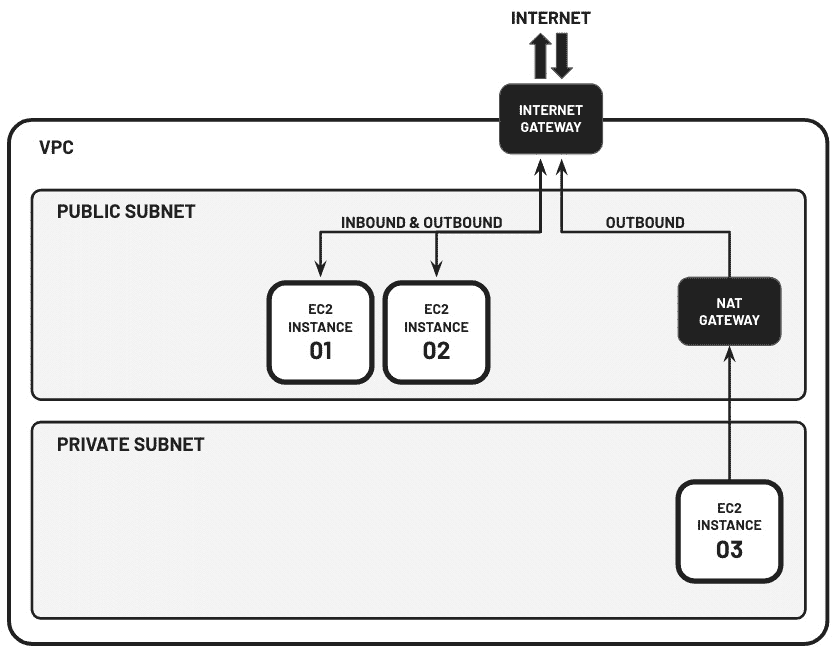

图 6.1 – 示例 VPC 设置

在*图 6.1*中，我们有一个包含公共子网和私有子网的示例 VPC。在公共子网中，我们有两个 EC2 实例，**EC2 实例 01**和**EC2 实例 02**，它们可以直接与互联网通信——入站和出站流量通过关联的**互联网网关**进行路由。在私有子网中，我们有一个 EC2 实例（**EC2 实例 03**）。私有子网中的实例默认没有公网 IP 地址，且通过公共子网中的**NAT 网关**资源路由出站互联网访问。由于 VPC 中私有子网的资源不允许直接从互联网访问，因此需要注意，**实例 03**无法从 VPC 外部的资源访问。最后，由于同一 VPC 中的实例在典型配置下可以相互通信（无论它们位于公共子网还是私有子网），因此**实例 03**应当能够从**实例 01**和**实例 02**访问。当然，这建立在正确配置必要的网络配置、安全组和路由设置以允许所需通信的前提下。如果**实例 01**和/或**实例 02**被攻击者攻陷了呢？这意味着攻击者现在可以通过在公共子网中被攻陷的实例攻击**实例 03**（因为**实例 03**可以从**实例 01**或**实例 02**访问）。

重要提示

服务器配置、网络设计和防火墙配置在渗透测试中部署 shell 和执行横向渗透技术时起着重要作用。这些技术的有效性取决于网络设计所允许的内容。例如，严格的防火墙规则和精细配置的网络分段可能会限制某些 shell 的使用（使得攻击过程更加具有挑战性）。

到此为止，我们应该对本章将要使用的相关 AWS 概念和服务有了更好的理解。接下来，让我们讨论一下我们的实验环境应该是什么样的。本章中我们将设置的实验环境将包含一个**VPC 对等连接**，类似于*图 6.2*中所示的内容：

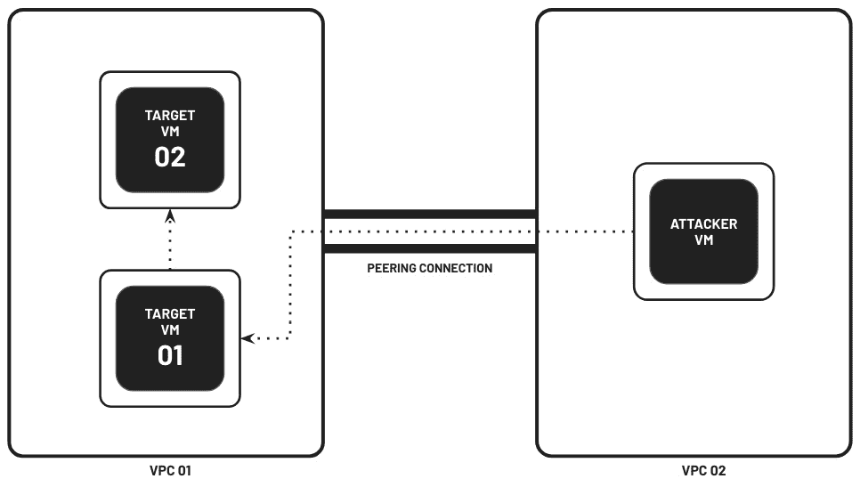

图 6.2 – 我们实验环境应该是什么样子

VPC 对等连接使得通过 VPC 内资源的私有 IP 地址，可以在对等的 VPC 之间安全地传输流量。在第一个 VPC 网络中，我们将有两个 EC2（虚拟机）实例，作为目标资源。在第二个 VPC 网络中，我们将设置并准备好攻击者实例。在这两个目标实例中，只有一个实例应该可以从攻击者实例直接访问。除此之外，外部世界的流量（即，来自对等网络环境外的流量）不应当能够访问已部署在网络环境内的资源。这将帮助确保只有授权的用户能够访问已部署在实验环境中的资源。由于目标虚拟机实例被配置为有漏洞，我们不能允许随机攻击者破坏我们的实验环境。

注意

为了简化操作，本章中我们搭建的实验环境将不会有私有子网。两个目标 EC2 实例将被部署在公共子网中——这也省去了设置 NAT 网关（或 NAT 实例）的需要，从而帮助我们降低运行实验环境的总体成本。与典型的由公共和私有子网组成的 VPC 网络设置不同，我们将只有公共子网，通过自定义安全组规则来管理网络流量和连接。完成本章后，欢迎通过引入新的公共和私有子网，以及新的对等 VPC 网络，来构建更复杂的网络架构，其中包含无法直接从攻击者虚拟机实例访问的资源。我会把这个留给你作为练习！

现在我们已经对实验环境有了更清晰的了解，接下来让我们使用 Terraform 来搭建实验环境：

1.  使用以下 URL 导航到本书的官方 GitHub 仓库：

    ```
    https://github.com/PacktPublishing/Building-and-Automating-Penetration-Testing-Labs-in-the-Cloud
    ```

    我们应该能找到多个文件夹，每个文件夹包含本书各章对应的文件和源代码：

    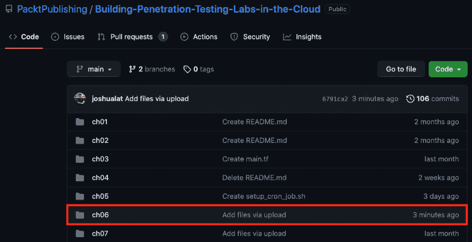

    图 6.3 – 导航到 ch06 目录

    导航到`ch06`目录，如*图 6.3*所示。在`ch06`目录中，我们应该能找到一个`pentest_lab.zip`文件。接着点击`pentest_lab.zip`文件的链接。

注意

如果你想知道`pentest_lab.zip`文件里有什么，它包含了用于搭建本章*整个*实验环境的 Terraform 代码。在这一章中，我们只需下载代码并运行`terraform apply`来搭建基础设施。这样，我们可以在构建和测试中继实验环境时，更多地关注其他方面。

1.  接下来，右键点击`Download`或`Raw`按钮，如*图 6.4*所示：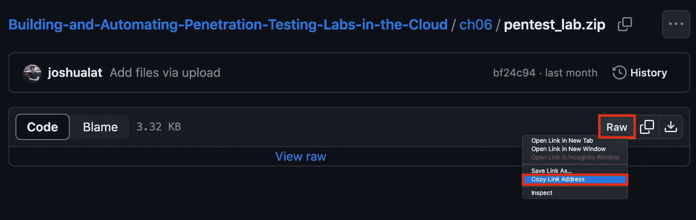

    图 6.4 – 复制 pentest_lab.zip 文件的链接地址

    从右键菜单中选择**复制链接地址**，将该字符串值保存在本地机器上的文本编辑器中。

1.  现在，让我们打开一个新的浏览器标签页，并使用以下链接访问**AWS 管理控制台**：[`aws.amazon.com/console/`](https://aws.amazon.com/console/)。在继续下一步之前，确保你已登录到 AWS 账户。

1.  在搜索框中输入`shell`，然后从搜索结果中选择`CloudShell`（如*图 6.5*所示）：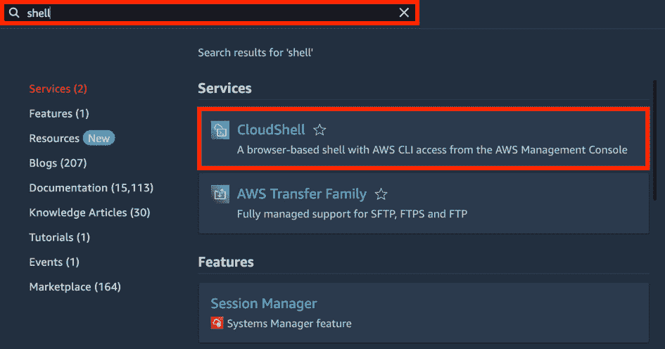

    图 6.5 – 导航到 CloudShell 控制台

    或者，你可以直接在 AWS 管理控制台的左上角找到并点击`CloudShell`按钮（位于区域选择下拉菜单旁边）。

1.  定位并点击**在新浏览器标签页中打开**按钮，如*图 6.6*所示：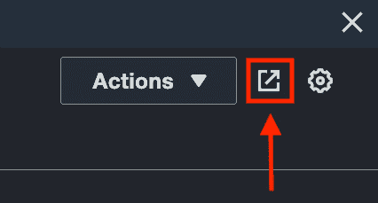

    图 6.6 – 在新浏览器标签页中打开 CloudShell

    这将会在新浏览器标签页中打开 CloudShell 环境。当你看到`Welcome to AWS CloudShell`弹出窗口时，点击**关闭**按钮。

1.  在 CloudShell 环境的终端（`$`符号后）中，运行以下命令来创建`pentest_lab`项目目录并进入该目录：

    ```
    mkdir -p pentest_lab
    cd pentest_lab
    ```

1.  接下来，使用以下命令从本书的 GitHub 存储库下载`pentest_lab.zip`文件到 CloudShell 环境中的`pentest_lab`目录：

    ```
    DOWNLOAD_URL=`https://github.com/PacktPublishing/Building-and-Automating-Penetration-Testing-Labs-in-the-Cloud/raw/main/ch06/pentest_lab.zip`
    wget -O pentest_lab.zip $DOWNLOAD_URL
    ```

    你可以自由地在本地机器的编辑器中设置`$DOWNLOAD_URL`变量值，填入你复制的下载链接。确保`$DOWNLOAD_URL`变量值正确且指向`pentest_lab.zip`文件。

1.  此时，`pentest_lab.zip`文件应已从 GitHub 存储库下载到我们的 CloudShell 环境中（位于`pentest_lab`目录内）。现在，是时候解压它了！使用`unzip`命令解压 Terraform 配置文件：

    ```
    unzip pentest_lab.zip
    ```

    这应该会解压多个`.tf`文件，用于设置本章的整个实验环境。

注意

你可以使用`cat`或`less`命令检查每个文件的内容。

1.  然后删除`pentest_lab.zip`文件：

    ```
    rm pentest_lab.zip
    ```

1.  配置文件准备好后，使用`terraform init`命令初始化 Terraform 工作目录：

    ```
    terraform init
    ```

注意

如果在运行 Terraform 时遇到`no space left on device`错误，可以运行`du -h --max-depth=1 ~`命令来查看 CloudShell 环境中哪个目录占用了较多空间。确认该目录后，可以进行必要的清理操作，再继续进行本章的下一步操作。在删除文件和目录之前，确保你已经备份了所有需要删除的文件和目录。

1.  让我们运行`terraform plan`命令，预览 Terraform 将要进行的更改：

    ```
    terraform plan
    ```

    该命令应顺利完成，无任何错误。

1.  接下来，让我们使用`terraform apply`命令来实现更改：

    ```
    terraform apply -auto-approve
    ```

    如果`terraform apply`命令运行没有任何错误，我们就可以继续进行下一部分。如果遇到问题（例如，出现`Unable to modify EC2 VPC Peering Connection Options`错误），只需再次运行`terraform apply -auto-approve`命令：

    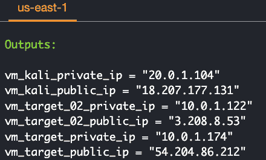

    图 6.7 – 运行 terraform apply 命令后的结果

    除了网络环境，运行`terraform apply`命令还将创建三个 EC2 实例——一个`t2.micro`目标实例标记为`target-vm-01`，一个`t2.micro`目标实例标记为`target-vm-02`，以及一个`t3.medium`攻击者实例标记为`vm-kali`。每个实例将有其对应的公共和私有 IP 地址，类似于*图 6.7*中显示的内容。确保将输出值（即`Outputs`下的公共和私有 IP 地址）复制到本地机器上的文本编辑器中。请注意，运行`terraform apply`命令后，您将获得一组不同的 IP 地址。

注意

随时查看使用`terraform show`命令部署的资源配置。请注意，如果我们要包含一个私有子网并在其中启动另一个目标虚拟机实例，那么我们需要在 Terraform 代码中定义一些额外的资源（例如公共子网中的 NAT 网关），这些资源将增加运行此实验环境的成本。

在进入下一部分之前，让我们快速检查一下目前的配置。在*图 6.8*中，我们可以看到，在运行`terraform apply`命令之后，应该会在第一个 VPC 网络（**Target VPC**）中创建两个目标实例（`target-vm-01`和**target-vm-02**），在第二个 VPC 网络（**Attacker VPC**）中创建一个攻击者实例（**vm-kali**）：

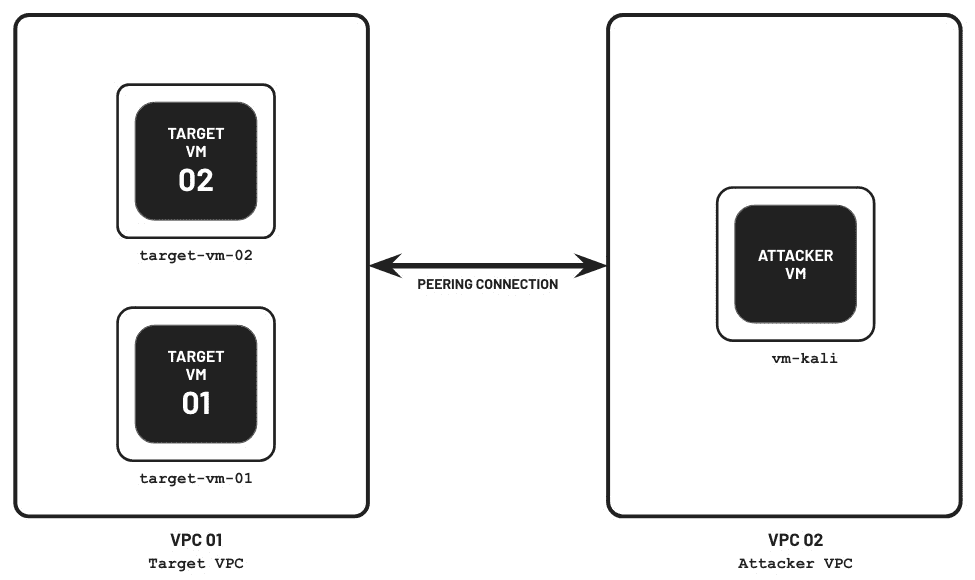

图 6.8 – 当前状态

两个 VPC 网络通过对等连接相连，这允许攻击者实例的流量到达目标实例。当然，正如我们稍后会看到的那样，额外的安全层（例如第二个目标实例使用的安全组）将阻止攻击者实例（**vm-kali**）的流量直接到达第二个目标实例（**target-vm-02**）。

注意

在 AWS 中，我们可以配置其他网络组件和资源来管理实验环境中的网络流量和连接性。这些包括**网络 ACLs**、**负载均衡器**、**路由表配置**，以及各种类型的**防火墙**和**网关**。本书中我们不会详细讨论这些内容，欢迎查阅*进一步阅读*部分以获取更多相关信息。

# 验证网络连接性和安全性

在构建转发实验室时，我们必须测试和验证环境的网络连接性。这将有助于确保网络配置、必要的路由和防火墙规则已经设置好，以促进不同网络段和系统之间的流量移动。

重要提示

即使我们使用自动化工具来构建实验室基础设施，仍然有可能遇到网络连接问题。

有多种方法可以验证网络连接性和安全性。在本节中，我们将以*手动方式*和*自动化方式*测试和验证网络连接性。具体来说，本节分为以下子部分：

+   *第一部分，共 3 部分 – 授权使用* *串行控制台*

+   *第二部分，共 3 部分 – 使用* *ping 测试*手动验证网络连接性

+   *第三部分，共 3 部分 – 使用可达性分析器验证* *网络连接性*

事不宜迟，让我们开始吧。

## 第一部分，共 3 部分 – 授权使用串行控制台

访问 EC2 实例有不同的方法。一个选项是使用**EC2 串行控制台**，它帮助我们访问 EC2 实例并排除各种问题（例如，启动和网络配置问题）。在通过 EC2 串行控制台访问 EC2 实例之前，我们需要首先启用它：

1.  通过在搜索栏中输入**ec2 实例**，然后从结果列表中选择**实例**（在**功能**下）来导航到 EC2 控制台。

1.  切换复选框*开启*（即标记复选框）以选择`vm-kali`，然后点击**连接**按钮。这将把你重定向到**连接到` `实例**页面。

1.  在最后一个标签页（**EC2 串行控制台**）中，如果你尚未在账户中授权使用 EC2 串行控制台，只需点击**管理访问权限**按钮，如*图 6.9*所示：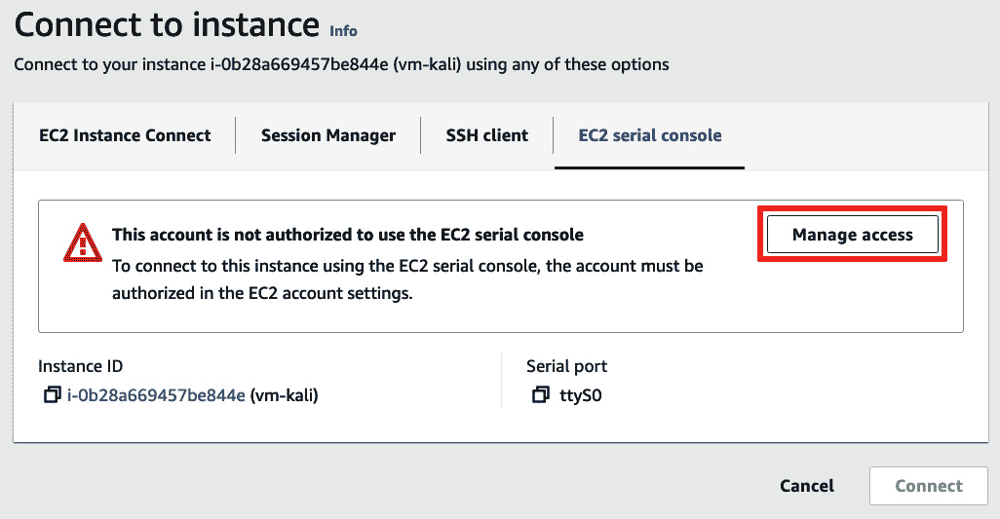

    图 6.9 – 账户尚未授权使用 EC2 串行控制台

    点击**管理访问权限**按钮后，只需切换**允许**复选框*开启*（即标记复选框），然后点击**更新**按钮，以授权在你的 AWS 账户中使用 EC2 串行控制台。

1.  返回到 EC2 实例列表（通过侧边栏）。切换复选框*开启*以选择`vm-kali`，然后点击**连接**按钮。这将把你重定向到**连接到` `实例**页面。

1.  在最后一个标签页（**EC2 串行控制台**）中，点击**连接**按钮，通过`EC2** `串行控制台**访问实例。

注意

在串行控制台中，如果看到空白的黑屏，只需按下*Enter*键，即可看到`root@kali:~#`命令提示符。如果你在访问攻击者虚拟机实例（**vm-kali**）时遇到问题，可以重新启动 EC2 实例，然后再次通过 EC2 串行控制台尝试访问。

## 第二部分，共 3 部分 – 使用 ping 测试手动验证网络连接性

使用`ping`命令，我们将快速测试我们实验室网络内已部署的不同资源之间的网络连接性：

1.  接着上一步的内容，让我们检查是否能够通过攻击者虚拟机实例`vm-kali`的私有 IP 地址 ping 通第一个目标虚拟机实例`target-vm-01`（类似于*图 6**.10*所示）：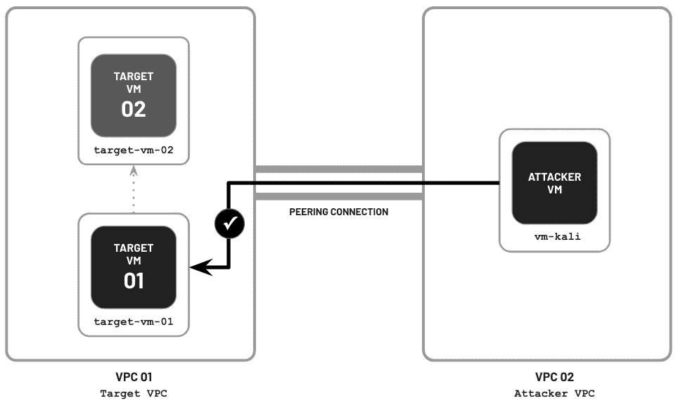

    图 6.10 – 从攻击者实例 ping 通第一个目标实例（示意图）

    在这里，我们预计第一个目标虚拟机实例`target-vm-01`将可以从攻击者虚拟机实例`vm-kali`访问。

    考虑到这一点，让我们在 EC2 串行控制台中运行以下命令：

    ```
    ping <TARGET VM 01 PRIVATE IP>
    ```

    确保将`<TARGET VM 01 PRIVATE IP>`替换为第一个目标虚拟机实例的私有 IP 地址（即运行`terraform** **apply`后得到的`vm_target_private_ip`输出值）：

    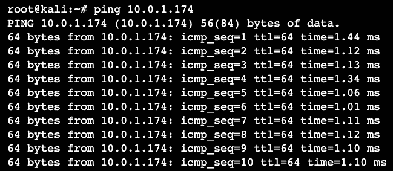

    图 6.11 – 从攻击者实例 ping 通第一个目标实例

    如*图 6**.11*所示，我们可以通过攻击者虚拟机实例`vm-kali`的私有 IP 地址 ping 通第一个目标虚拟机实例`target-vm-01`。

注意

如果需要，可以使用*Ctrl* + *C*来停止`ping`命令。

1.  现在，让我们检查是否能够通过攻击者虚拟机实例`vm-kali`的私有 IP 地址 ping 通第二个目标虚拟机实例`target-vm-02`（类似于*图 6**.12*所示）：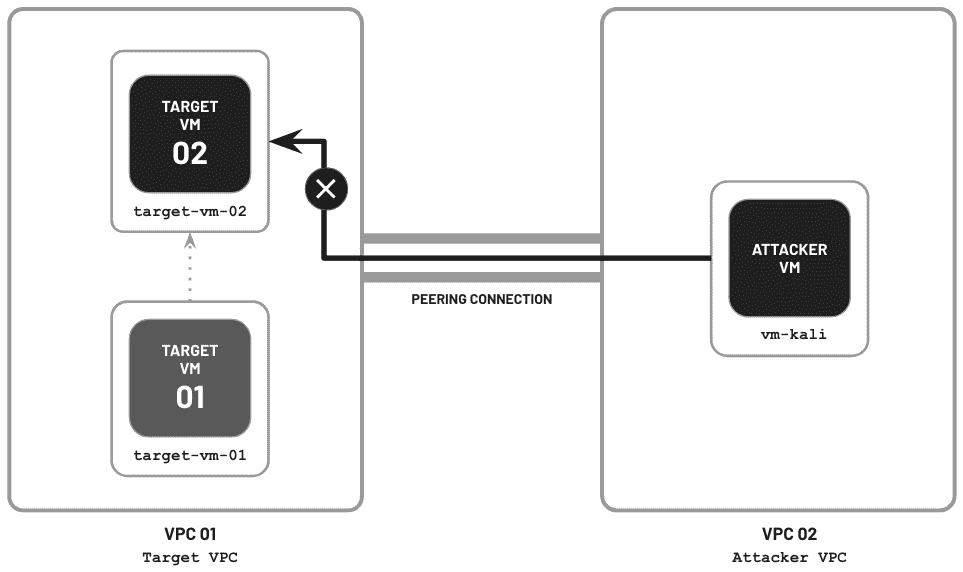

    图 6.12 – 从攻击者实例 ping 通第二个目标实例（示意图）

    在这里，我们预计第二个目标虚拟机实例`target-vm-02`将*无法*从攻击者虚拟机实例`vm-kali`访问。

    话虽如此，让我们运行以下命令：

    ```
    ping <TARGET VM 02 PRIVATE IP>
    ```

    确保将`<TARGET VM 02 PRIVATE IP>`替换为第二个目标虚拟机实例的私有 IP 地址：

    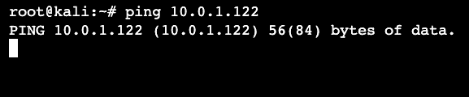

    图 6.13 – 从攻击者实例 ping 通第二个目标实例

    如*图 6**.13*所示，我们无法通过攻击者虚拟机实例`vm-kali`的私有 IP 地址 ping 通第二个目标虚拟机实例`target-vm-02`。

    注意

为什么会这样？这是因为我们配置了`target-vm-02`使用的安全组，使其仅能通过使用`target-vm-01`的安全组的资源访问。换句话说，我们只能通过第一个目标虚拟机实例（**target-vm-01**）访问第二个目标虚拟机实例（**target-vm-02**）。请注意，还有多种方法可以防止攻击者虚拟机的流量到达第二个目标虚拟机实例。另一种可能的方式是，在 VPC 01 中引入一个私有子网，然后在该私有子网中启动第二个目标虚拟机实例。除此之外，我们还可以创建一个新的 VPC，设置新 VPC 与 VPC 01 之间的 VPC 对等连接，然后在新的 VPC 中启动第二个目标虚拟机实例。

1.  返回到 EC2 实例列表。将复选框切换到 *开启* 状态，选择 `target-vm-01`，然后点击 **连接** 按钮。这将把您重定向到 **连接到实例** 页面。

1.  在第一个标签页（**EC2 实例连接**）中，找到并点击 **连接** 按钮，通过 **EC2 实例连接** 访问该实例。

1.  现在，让我们检查能否通过第一个目标 VM 实例 `target-vm-01` 的私有 IP 地址 ping 第二个目标 VM 实例 `target-vm-02`（类似于 *图 6.14* 中所示）: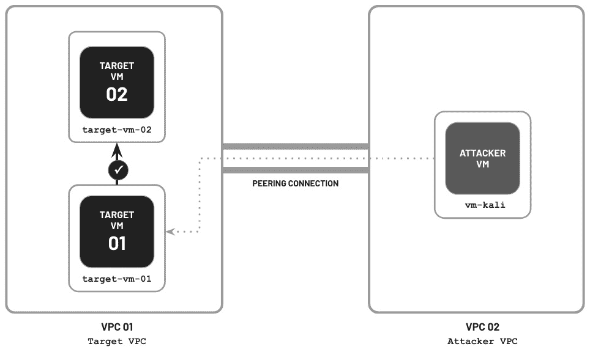

    图 6.14 – 从第一个目标实例 ping 第二个目标实例（示意图）

    在这里，我们期望第一个目标实例 `target-vm-01` 可以访问第二个目标 VM 实例 `target-vm-02`。

    话虽如此，让我们运行以下命令：

    ```
    ping <TARGET VM 02 PRIVATE IP>
    ```

    确保将 `<TARGET VM 02 PRIVATE IP>` 替换为第二个目标 VM 实例的私有 IP 地址：

    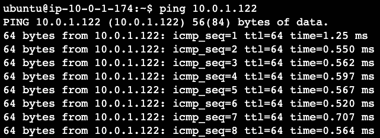

    图 6.15 — 从第一个目标实例 ping 第二个目标实例

    如 *图 6.15* 所示，我们可以通过第一个目标 VM 实例 `target-vm-01` 的私有 IP 地址 ping 第二个目标 VM 实例 `target-vm-02`。

注意

可选地，我们可以尝试通过第一个目标 VM 实例 `target-vm-01` 的公有 IP 地址 ping 第二个目标 VM 实例 `target-vm-02`。由于 VM 实例无法从外部网络环境访问，我们不应该能够通过公有 IP 地址 ping 到第二个目标 VM 实例 `target-vm-02`。

## 第三部分，共 3 部分 – 使用可达性分析器验证网络连接性

除了我们刚刚执行的初步网络连接测试外，我们还将使用 **VPC 可达性分析器** —— AWS 提供的网络诊断工具 —— 来帮助我们检测和排查可能导致连接问题的网络配置错误。正如我们在接下来的步骤中所看到的，使用该工具非常简单：

1.  通过在搜索栏中输入 `vpc reachability analyzer`，然后从结果列表中选择 `VPC Reachability Analyzer`（在 **功能** 下）来导航到 **VPC 可达性分析器** 控制台。

1.  点击 **创建并分析` `路径** 按钮。

1.  在 **可达性分析器 > 创建并分析路径** 页面，指定以下表单字段值：

    +   **路径配置** > **名称` `标签`: **attacker-to-target-01`

    +   **路径来源** > **来源` `类型`: `实例**

    +   **路径来源** > **来源**: 选择 `vm-kali`

    +   **路径目的地** > **目的地` `类型`: `实例**

    +   **路径目的地** > **目的地**: 选择 `target-vm-01`

    +   **协议`: **TCP`

重要提示

确保验证和检查参与可达性检查的资源的实例 ID。您可以打开另一个浏览器标签页，导航到 EC2 控制台，快速检查参与分析的资源的实例 ID。

1.  然后点击**创建并分析路径**按钮。

注意

等待大约 2-3 分钟，直到分析完成。等候期间可以喝杯咖啡或茶！如果用户界面没有自动更新，你可以点击刷新按钮。

1.  分析完成后，我们应该看到**可达性状态**设置为**可达**。

1.  切换*开启*我们运行的分析的复选框，以查看**分析浏览器** > **路径详情**下的图表，类似于*图 6.16*所示：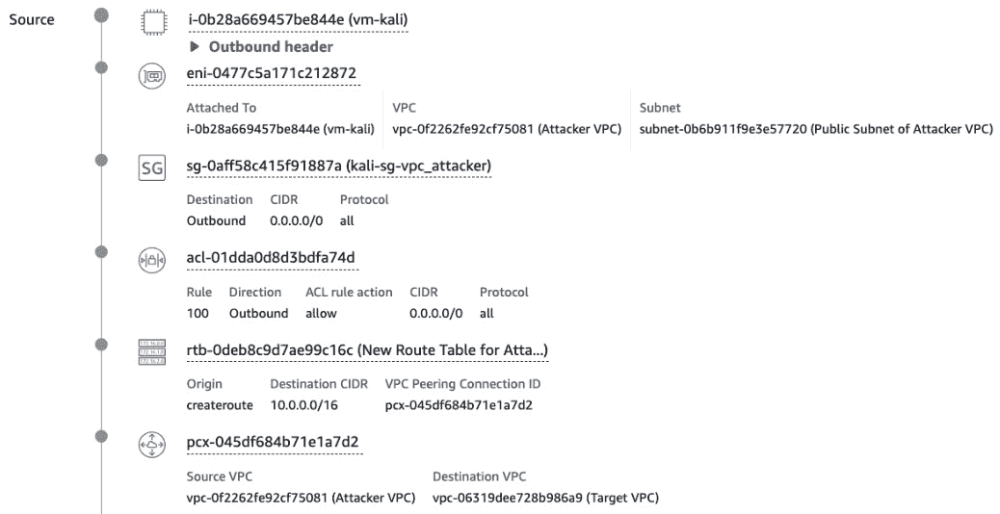

    图 6.16 – 分析浏览器 > 路径详情

    使用**分析浏览器**，我们应该能够分析并评估 AWS 中 VPC 环境内不同资源之间的网络可达性和连通性。在这里，我们可以看到第一个目标虚拟机实例，`target-vm-01`，可以从攻击者实例`vm-kali`访问，并且网络流量通过 VPC 网络对等连接传输。如果你有时间，可以使用 VPC 可达性分析器来验证我们无法从攻击者虚拟机实例（**vm-kali**）ping 第二个目标虚拟机实例（**target-vm-02**）。

除了使用本节中讨论的解决方案外，请注意还有其他几种方法可以测试实验网络环境中的网络连通性。在排查网络连通性问题时，随时可以尝试使用其他工具，如`telnet`、`nmap`和`traceroute`。

到这一步，我们应该已经对网络的设置和配置有了更清晰的了解。在下一部分，我们将继续设置和配置攻击者虚拟机实例，以为本章末的渗透测试模拟做好准备。

重要提示

如果你计划休息超过一个小时，最好先清理并删除实验环境（参见本章最后的*清理*部分），然后等你准备好继续处理本章后续部分时再重新启动实验环境。这样可以避免为几乎没有使用的云资源运行时支付费用。虽然实验环境中的资源 IP 地址可能会发生变化（在重新启动实验环境后），但实验环境的整体网络和安全配置应该大致相同。

# 设置攻击者虚拟机实例

本节中，我们将设置我们的攻击者 EC2 实例。与*第四章*（*在 GCP 上设置隔离渗透测试实验环境*）和*第五章*（*在 Azure 上设置隔离渗透测试实验环境*）相比，本章中的攻击者实例设置会简单得多，因为我们只需要使用终端。

话虽如此，让我们继续设置攻击者虚拟机实例：

1.  导航到 EC2 实例列表（使用侧边栏）。勾选 `vm-kali` 的复选框，然后点击 `Connect` 按钮。这将把你重定向到 `Connect to** **instance` 页面。

1.  在最后一个标签页（**EC2 serial console**）中，点击 `Connect` 按钮，通过 `EC2** **serial console` 访问实例。

注意

在串行控制台中，如果你看到一个空白的黑屏，只需按 *Enter* 键即可看到 `root@kali:~#` 命令提示符。如果你无法访问攻击者虚拟机实例 `vm-kali`，可以尝试重新启动 EC2 实例，并再次通过 EC2 串行控制台访问它。此外，确保没有其他打开的会话干扰串行控制台连接。

1.  由于我们稍后将使用 Metasploit，因此我们需要验证是否可以在攻击者虚拟机实例中使用 `msfconsole`。也就是说，让我们运行以下命令：

    ```
    which msfconsole
    ```

    运行此命令会返回 `msfconsole not found`。看起来我们需要先做一些必要的安装和设置工作！

1.  现在，让我们更新软件包列表，然后使用以下命令安装 Kali Linux 的默认软件包：

    ```
    sudo DEBIAN_FRONTEND=noninteractive dpkg --configure -a
    sudo apt update
    sudo DEBIAN_FRONTEND=noninteractive apt install -y kali-linux-default
    ```

    如果需要，您可以根据需要调整安装和设置命令（以防万一！）。如果这些命令运行正常，那么我们可以继续进行下一步。

注意

此步骤可能需要 20-30 分钟才能完成。在等待时，您可以查看以下链接：[`www.kali.org/docs/general-use/metapackages/`](https://www.kali.org/docs/general-use/metapackages/)。安装完成后，随时运行 `clear` 命令清除屏幕。

1.  再次运行 `which msfconsole` 命令，验证是否可以在攻击者虚拟机实例中使用 `msfconsole`：

    ```
    which msfconsole
    ```

    这应该会返回 `/usr/bin/msfconsole`。看起来我们准备好开始了！

1.  现在，让我们准备 `username.txt` 和 `passwords.txt` 文件，我们将用它们进行示例 SSH 暴力破解攻击。首先，使用 `touch` 命令创建两个空文件：

    ```
    cd /root
    touch usernames.txt
    touch passwords.txt
    ```

1.  运行以下命令以使用 Vim 打开空的 `/root/usernames.txt` 文件：

    ```
    vim usernames.txt
    ```

    随时输入 `:set nu`，然后按 *Enter* 键，以显示编辑器中的行号。

1.  接下来，按 *i* 键切换到 `insert mode`，以便我们可以编辑文件。

注意

如果你已经忘记了，Vim 中的 `insert mode` 允许我们像在普通文本编辑器中一样输入和修改内容。在此模式下，我们可以自由地添加、删除或修改字符，而不会影响周围的文本。

1.  将以下代码块输入或粘贴到我们的 `usernames.txt` 文件中：

    ```
     admin
    root
    ubuntu
    adminuser
    adminuser2
    ```

    这里我们有一个故意简化的用户名列表，以加速后续的模拟过程。在实际的渗透测试活动中，我们会使用更为广泛的用户名列表。这将包括常见的用户名、特定系统或应用程序的默认用户名，以及可能的自定义用户名。

1.  按*Esc*键切换到**正常模式**。输入`:wq!`，然后按*Enter*键。这将保存你对`usernames.txt`所做的更改，并退出 Vim。

注意

为了帮助你回忆，**正常模式**下，Vim 允许我们在文本中导航，执行命令，进行各种文件操作。在这个模式下，可以使用特定的按键（如**:wq!**）来移动光标、搜索文本、复制粘贴，以及执行删除、替换、撤销更改等编辑操作。例如，`w`表示*保存*命令（即保存文件更改），`q`表示*退出*命令（即退出编辑器）。最后，感叹号`!`是一个可选修饰符，强制命令执行，即使存在未保存的更改或其他警告。

1.  运行以下命令，使用 Vim 打开空的`/root/passwords.txt`文件：

    ```
    vim passwords.txt
    ```

    随时输入`:set nu`，然后按*Enter*键，在编辑器中显示行号。

1.  接下来，按*i*键切换到**插入模式**，以便我们可以编辑文件。

1.  将以下代码块输入或粘贴到我们的`passwords.txt`文件中：

    ```
     password
    123456
    12345678
    pass123
    ```

    这里我们有一个故意简化的密码列表，以加速后续的模拟过程。

1.  按*Esc*键切换到**正常模式**。输入`:wq!`，然后按*Enter*键。这将保存你对`passwords.txt`所做的更改，并退出 Vim。

现在一切准备就绪，我们可以开始在实验环境中进行渗透测试模拟！

# 在隔离的网络环境中模拟渗透测试

由于我们的 AWS 实验环境已成功搭建，我们现在可以进行渗透测试模拟，验证一切是否已正确配置。当然，我们将使用简化的渗透测试流程，因为我们的主要目标是评估实验环境是否已正确设置和配置。

在我们开始模拟之前，让我们快速讨论一下这个部分需要了解的相关概念、术语和工具：

+   **网络枢纽**：网络枢纽指的是使用一个已被攻陷的系统作为网关，访问网络中其他互联的系统或区域。通过使用各种网络枢纽技术和工具，攻击者可以扩展其访问范围，在内部资源中导航，甚至可能提升权限。

+   **横向渗透**：横向渗透指的是攻击者在获得初始访问权限后，在同一网络（或域）内横向移动的行为。它涉及利用漏洞、利用凭证以及使用各种技术访问和攻破同一环境中的其他系统。

+   `Meterpreter`：Meterpreter 是 Metasploit 框架中的一种高级有效载荷，提供了广泛的功能，包括交互式命令执行、权限提升和网络转移。通过 Meterpreter 会话，攻击者可以获得交互式 shell，帮助进行各种信息收集和高级后期利用任务，满足道德黑客的需求。我们可以将 Meterpreter 会话视为一种高级的 SSH shell，具有多个额外强大的功能，专门用于渗透测试和安全研究。

+   **Metasploit post/multi/manage/autoroute 模块**：`post/multi/manage/autoroute` 模块是 Metasploit 框架中的一个专业模块，用于帮助在被攻破的系统和其他目标子网之间建立网络路由。这个模块对于横向渗透和网络转移在后期利用过程中尤为重要。

随着我们在网络安全领域的深入，我们将遇到更多先进的网络转移和横向渗透方法与技术。虽然还有更多内容可以学习，但目前这些方法已经足够有效！

重要提示

攻击属于其他用户或公司拥有的云资源是不道德且非法的。在继续之前，请确保阅读 *第一章* 中的 *在云中构建渗透测试实验环境时的注意事项* 部分，*开始使用云中的渗透测试实验室*，因为我们将模拟攻击过程，以验证目标虚拟机实例中运行的应用程序和服务中的配置错误和漏洞是否可以被利用。

也就是说，本节内容分为以下几个子部分：

+   *第一部分 / 3 – 获取* *第一个标志*

+   *第二部分 / 3 – 向攻击* *其他资源* 的转移

+   *第三部分 / 3 – 使用可达性分析器验证* *网络连通性*

考虑到这些因素，我们现在可以开始渗透测试模拟。

## 第一部分 / 3 – 获取第一个标志

按照以下步骤操作：

1.  在上一节的基础上，我们继续进行操作，检查并扫描第一个目标 EC2 实例（**target-vm-01**）的开放端口：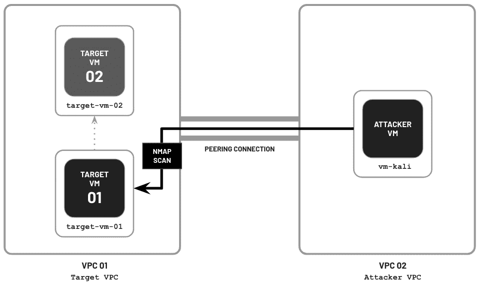

    图 6.17 – 使用 Nmap 扫描第一个目标实例

    与 *图 6.17* 中所示类似，我们将从攻击者实例（**vm-kali**）发起 Nmap 扫描，该实例部署在另一个 VPC 中。确保您能够通过 `EC2** `串行控制台** 访问并在攻击者实例中运行命令。

    一旦准备好进行扫描，运行以下命令：

    ```
    nmap --top-ports 1000 <TARGET VM 01 PRIVATE IP>
    ```

    请确保将 `<TARGET VM 01 PRIVATE IP>` 替换为第一个目标虚拟机实例的私有 IP 地址。如果您在想这个值从哪里获取，它可能已经存在于您本地计算机上的文本编辑器中（在您之前运行 `terraform apply` 命令后将输出值复制到文本编辑器中）：

    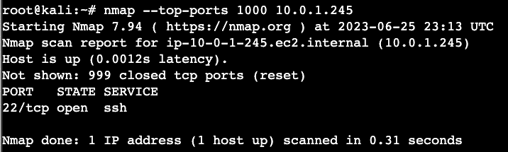

    图 6.18 – 运行 nmap 命令后的结果

    几秒钟后，我们应该看到运行此命令后的返回结果。我们应该会看到端口 `22` 已打开，类似于 *图 6.18* 中所示的情况！

注意

您可能已经注意到，我们示例中使用的第一个目标机器的私有 IP 地址（在 *图 6.18* 中）发生了变化！在幕后，本章所使用的实验环境已被销毁并重建（几次），以便管理在长时间不活动期间运行实验室的成本。也就是说，EC2 实例的私有 IP 地址应该保持不变，除非该实例被删除并重新创建。请确保您使用的是实际的 EC2 实例的私有 IP 地址，因为在运行 `terraform apply` 和 `terraform show` 命令后，您很可能会得到不同的 IP 地址值。

1.  现在，执行以下命令以启动 Metasploit 框架控制台：

    ```
    msfconsole
    ```

    这将启动 Metasploit 框架控制台，类似于我们在 *图 6.19* 中看到的内容：

    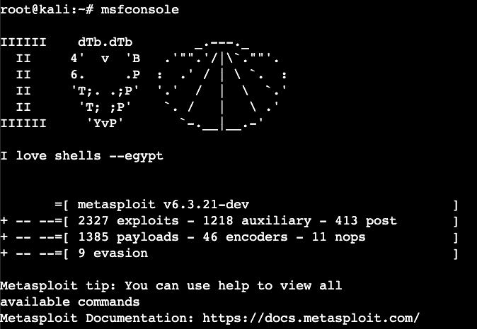

    图 6.19 – Metasploit 框架控制台

    请注意，运行 `msfconsole` 后，您可能会看到不同的加载屏幕（或加载文本）。

    注意

    `msfconsole` 可能需要一两分钟才能准备好。

1.  运行以下命令来搜索 `auxiliary/scanner/ssh/ssh_login` 模块：

    ```
    search ssh_login
    ```

    这应该会返回以下结果：

    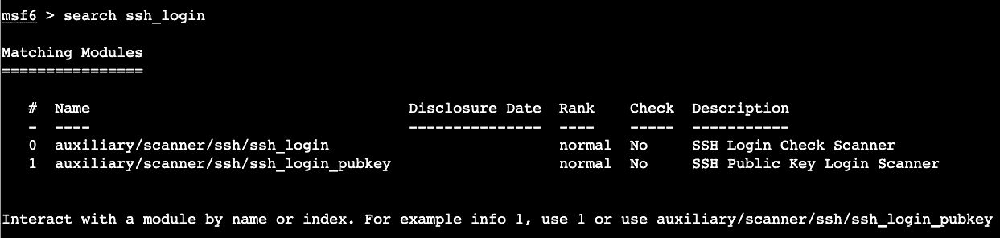

    图 6.20 – 运行 search ssh_login 后的结果

    在这里，我们有两个匹配的模块 – **SSH 登录检查扫描器**（**auxiliary/scanner/ssh/ssh_login**）和 **SSH 公钥登录` `扫描器**（**auxiliary/scanner/ssh/ssh_login_pubkey**）。

1.  现在，运行以下命令来选择并使用 `auxiliary/scanner/ssh/ssh_login` 模块：

    ```
    use auxiliary/scanner/ssh/ssh_login
    ```

    运行命令后，我们的提示符应该会更改为 `auxiliary(scanner/ssh/ssh_login) >`，表示我们已成功选择了辅助 SSH 登录扫描器模块。从这里开始，我们可以配置模块选项，并执行扫描器检查是否可以通过不同的用户名和密码组合访问目标系统。

1.  让我们使用以下命令快速检查我们拥有的设置和选项：

    ```
    show options
    ```

    这应该返回一个模块选项列表，类似于 *图 6.21* 中所示：

    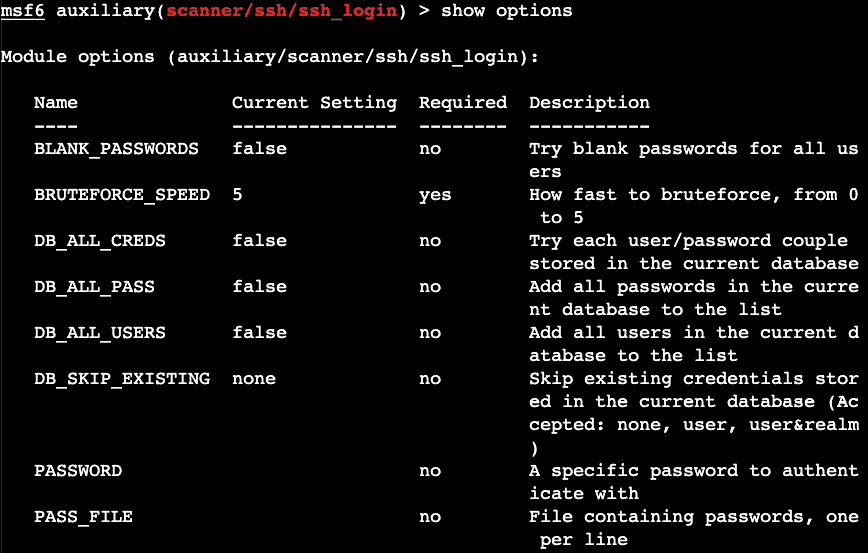

    图 6.21 – 执行 show options 命令后的输出

    在这些选项中，我们将设置以下值：`USER_FILE`（截图中未显示）作为存储用户名的文件名，`PASS_FILE`作为存储密码的文件名，`RHOSTS`（截图中未显示）作为被 SSH 登录扫描仪模块扫描的目标资源，`THREADS`（截图中未显示）作为线程数，`VERBOSE`（截图中未显示）作为详细级别。

1.  运行以下命令（每次一个命令）来配置我们的扫描仪：

    ```
    set USER_FILE /root/usernames.txt
    set PASS_FILE /root/passwords.txt
    set RHOSTS <TARGET VM 01 PRIVATE IP>
    set THREADS 1
    set VERBOSE true
    ```

    确保将`<TARGET VM 01 PRIVATE IP>`替换为第一个目标 EC2 实例（**target-vm-01**）的私有 IP 地址。

重要提示

小心指定`RHOSTS`配置值，因为我们不希望意外攻击到实验环境以外的随机资源。

1.  一切准备就绪后，让我们继续运行 SSH 登录扫描仪：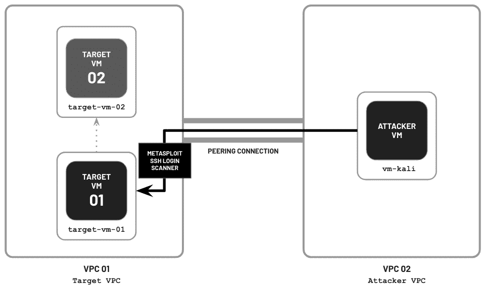

    图 6.22 - 使用 SSH 登录扫描仪扫描第一个目标实例

    像我们之前执行的 Nmap 扫描一样，我们将使用攻击者实例（**vm-kali**）上的 SSH 登录扫描仪扫描第一个目标 EC2 实例（**target-vm-01**），类似于*图 6.22*所示。

    一旦准备好执行扫描，运行以下命令：

    ```
    run
    ```

    这将生成以下一组日志：

    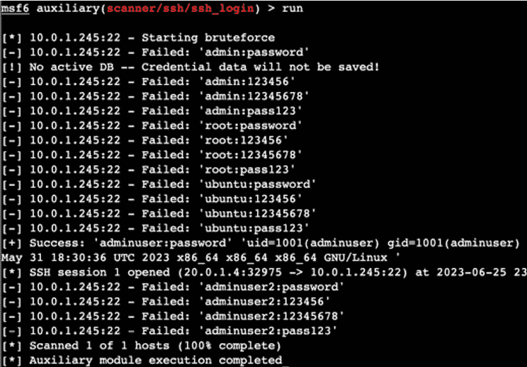

    图 6.23 - 运行 SSH 登录扫描仪后的日志

    在几次失败的尝试之后，我们看到成功使用`adminuser`作为用户名和`password`作为密码进行了认证！

注意

此步骤可能需要几分钟才能完成。等候时可以随便喝杯咖啡或茶！

1.  通过运行以下命令列出现有会话：

    ```
    sessions
    ```

    这应该返回一个活动会话，类似于*图 6.24*所示：

    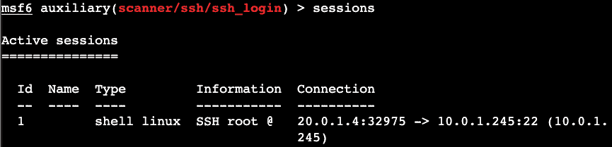

    图 6.24 - 会话列表

    在这里，我们有**连接**列，它显示了关于活动会话的一些额外信息（即攻击者实例已连接到第一个目标实例）。

1.  运行以下命令与第一个会话（ID = 1）进行交互：

    ```
    sessions -i 1
    ```

    这将允许您与会话（到第一个虚拟机实例，**vm-target-01**）进行交互，并在其中执行命令。

1.  进入会话后，运行以下命令查看当前用户的用户名：

    ```
    whoami
    ```

    这应该返回以下输出：

    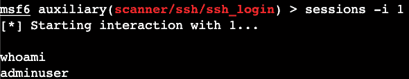

    图 6.25 - 使用 whoami 命令后的结果

    在*图 6.25*中，我们可以看到运行`whoami`命令后输出`adminuser`，这表明我们当前以`adminuser`用户身份登录。

1.  通过运行以下命令提升权限到`root`：

    ```
    sudo su
    ```

注意

这是不是有点太简单了？看起来**无密码 sudo**允许我们使用`su`（切换/替代用户）命令切换到`root`账户，而无需输入 root 用户的密码。无密码 sudo 比你想象的更常见，因为系统管理员和工程师通常利用它来简化自动化任务并确保操作便利性。

1.  运行以下命令检查当前用户的用户名：

    ```
    whoami
    ```

    这应该会给我们以下输出：

    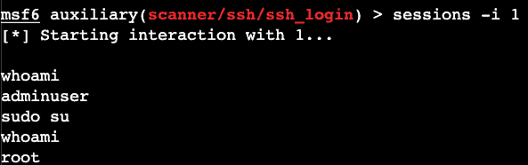

    图 6.26 – 在使用 whoami 命令之后的结果（sudo su）

    在*图 6**.26*中，我们可以看到运行`whoami`命令（在`sudo su`之后）会显示`root`，这表明我们当前是以`root`用户身份登录的。

1.  既然我们已经拥有 root 权限，让我们通过运行以下命令来找到第一个标志：

    ```
    find / -type f -name "flag*"
    ```

    这将搜索整个文件系统中以`flag`开头的文件。几分钟后，我们应该会得到一个包含`/root/flag.txt`文件的结果列表：

    ```
    ... /root/flag.txt
    ...
    ```

    看起来我们找到了标志文件！

1.  现在，让我们查看`/root/flag.txt`的内容：

    ```
    cat /root/flag.txt
    ```

    这应该会给我们`FLAG # 1!`。做得好！

1.  接下来，按*Ctrl* + *Z*以将会话置于后台模式。当系统提示`Background session 1? [y/N]`时，输入`y`以继续。

重要提示

请注意，它应该是*Ctrl* + *Z*（后台会话），而*不是* *Ctrl* + *C*（中止会话）。

## 第二部分/3 – 转向攻击其他资源

按照以下步骤操作：

1.  让我们通过运行以下命令列出现有会话：

    ```
    sessions
    ```

    运行此命令应该返回一个连接攻击者实例（**vm-kali**）和第一个目标实例（**target-vm-01**）的单一会话：

    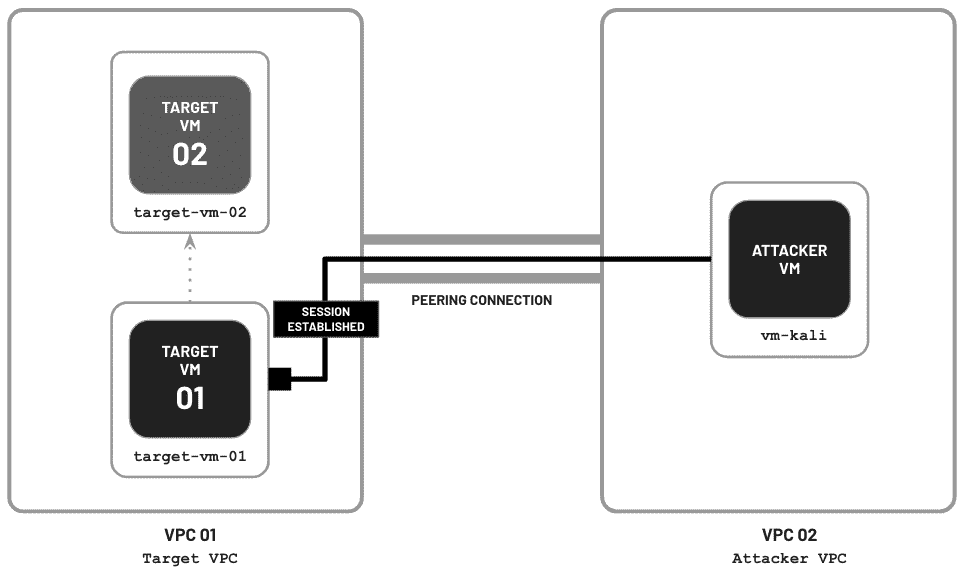

    图 6.27 – 一个会话连接攻击者实例和第一个目标实例

    此时，我们有一个会话连接了攻击者实例（**vm-kali**）和第一个目标实例（**target-vm-01**），类似于*图 6**.27*中所示。在这种情况下，**会话**指的是攻击者机器（运行 Metasploit）和被攻破的目标系统之间的一个活动且互动的连接。当成功的漏洞利用或有效载荷被传递到一个脆弱的目标时，它可以建立一个会话，给予攻击者对被攻破系统的不同层级控制和访问权限。在我们的案例中，在之前对第一个目标实例（**target-vm-01**）运行 SSH 登录扫描器后，攻击者实例（**vm-kali**）和第一个目标实例（**target-vm-01**）之间自动建立了一个会话。

1.  接下来，运行以下命令（逐个命令执行）以使用第一个会话准备一个升级的`meterpreter`会话：

    ```
    sessions -u 1
    sessions -i 2
    ```

    这应该会打开一个第二个会话，类似于我们在*图 6**.28*中看到的：

    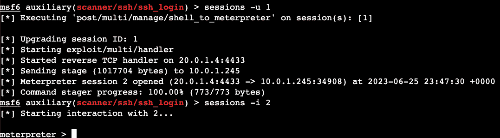

    图 6.28 – 打开一个升级的会话

    由于我们执行了`sessions -i 2`，我们将能够使用并与升级后的会话（即 Meterpreter 会话）进行交互，并在其中执行额外的命令。与“普通”shell 相比，Metasploit 的`Meterpreter`会话提供了更广泛的功能和特性，包括文件系统访问、权限提升、进程操作、横向移动等。这些相对于普通 shell 的增强功能使得高级的后渗透活动成为可能，如网络中的横向移动、在被攻陷系统上的持久化、数据泄露和全面侦察。使用 Meterpreter，渗透测试人员和道德黑客拥有一个更强大的工具集，使他们能够进行更全面的评估并模拟现实世界的攻击场景：

    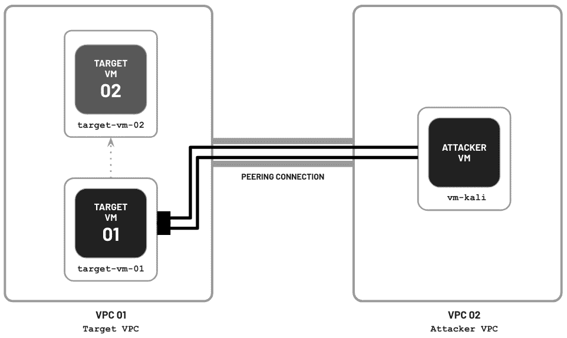

    图 6.29 - 攻击者实例和第一个目标实例之间的两条会话连接

    现在，我们有两条会话连接了攻击者实例和第一个目标实例（其中一条会话为 Meterpreter 会话）。

1.  让我们使用以下命令检查网络配置：

    ```
    ipconfig
    ```

    这应该会产生以下输出：

    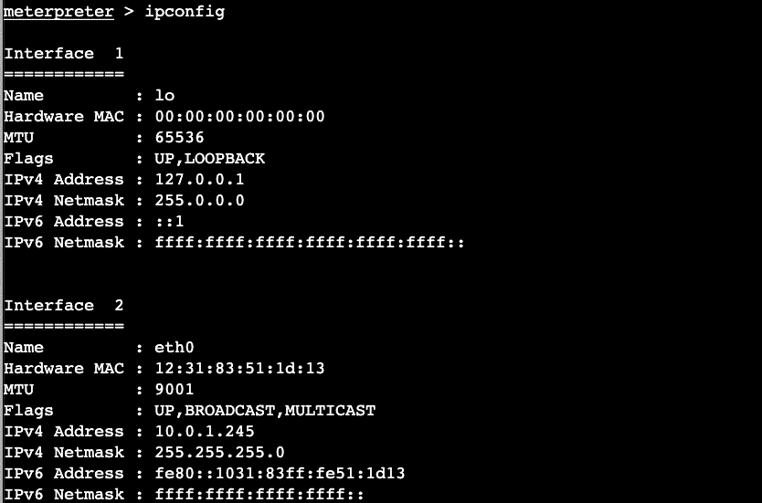

    图 6.30 - 运行 ipconfig 后的结果

    给定以下配置，我们应该能够推导出`SUBNET`值为`10.0.1.0`（稍后我们将在配置`autoroute`模块时使用该值）。

1.  接下来，按*Ctrl* + *Z*将会话设置为后台模式。当出现`Background session 2? [y/N]`提示时，输入`y`以继续。

1.  运行以下命令逐一搜索、选择并使用`autoroute`模块（每次执行一个命令）：

    ```
    search autoroute
    use post/multi/manage/autoroute
    ```

1.  让我们快速检查使用以下命令时的设置和选项：

    ```
    show options
    ```

    这应该会返回一个模块选项列表，类似于*图 6.31*所示：

    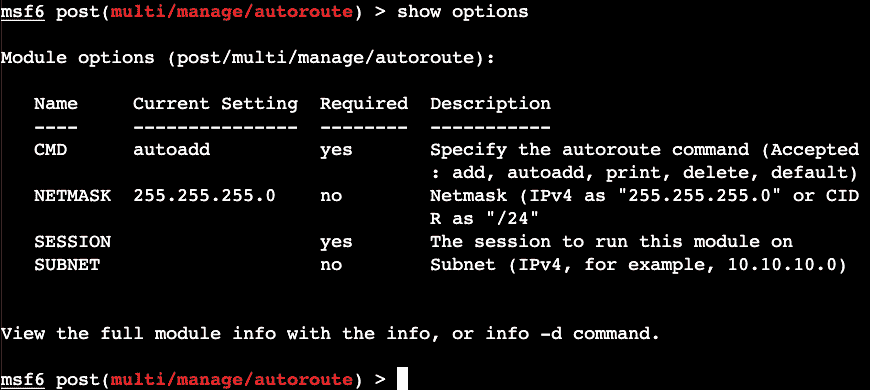

    图 6.31 - 执行 show options 命令后的输出

    我们将很快指定`SESSION`和`SUBNET`模块选项的配置值。

1.  配置`SESSION`设置并将其设置为`2`：

    ```
    set SESSION 2
    ```

1.  配置`SUBNET`设置并将其设置为`10.0.1.0/24`：

    ```
    set SUBNET 10.0.1.0/24
    ```

1.  让我们快速检查使用以下命令时的设置和选项：

    ```
    show options
    ```

    这应该会返回一个模块选项列表，类似于我们在*图 6.32*中看到的：

    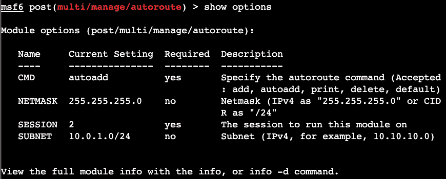

    图 6.32 - 执行 show options 命令后的输出

    看起来我们的`post/multi/manage/autoroute`模块配置已经准备就绪！

1.  现在，让我们执行`autoroute`模块：

    ```
    run
    ```

    这应该会产生以下日志集：

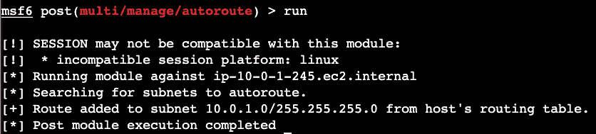

图 6.33 - 运行 autoroute 模块后的日志

现在我们已经执行了`autoroute`模块，应该能够进行横向移动，访问从第一个目标虚拟机实例（**target-vm-01**）可访问的其他资源或网络。

## 第三部分 第三章 - 获取第二个标志

请按照以下步骤操作：

1.  运行以下命令以选择并使用`auxiliary/scanner/portscan/tcp`模块：

    ```
    use auxiliary/scanner/portscan/tcp
    ```

    这一次，我们将扫描第二个目标实例的开放端口，类似于*图 6.34*中所示的内容：

    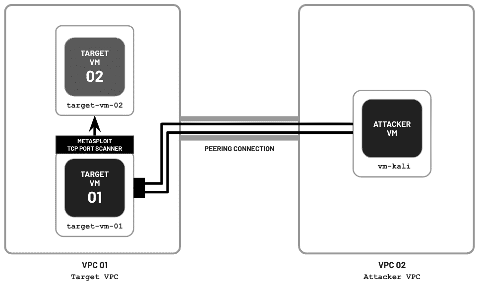

    图 6.34 – 在第二个目标实例上使用 TCP 端口扫描器

    即使攻击者实例（**vm-kali**）无法直接访问第二个目标 EC2 实例，我们仍然可以通过第一个目标 EC2 实例（**target-vm-01**）*间接*运行 TCP 端口扫描器对第二个目标 EC2 实例（**target-vm-02**）进行扫描。*太神奇了，是吧？*

注意

请记住，只有第一个目标实例（**target-vm-01**）的流量才被第二个目标实例（**target-vm-02**）的安全组允许。这意味着我们无法*直接*从攻击者实例（**vm-kali**）扫描第二个目标实例（**target-vm-02**）。

1.  配置`RHOSTS`设置，并将其设置为第二个目标虚拟机实例（**target-vm-02**）的私有 IP 地址：

    ```
    set RHOSTS <TARGET VM 02 PRIVATE IP>
    ```

    确保将`<TARGET VM 02 PRIVATE IP>`替换为第二个目标虚拟机实例的私有 IP 地址。如果你想知道在哪里可以获取此值，它*可能*就在你本地机器的文本编辑器中（在你执行`terraform apply`命令并将输出值复制到文本编辑器后）。

重要提示

在指定`RHOSTS`配置值时要小心，因为我们不希望意外攻击到实验室环境之外的随机资源。

1.  现在，让我们使用以下命令继续进行扫描：

    ```
    run
    ```

    这应该会生成一组日志，类似于我们在*图 6.35*中看到的内容：

    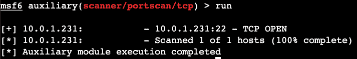

    图 6.35 – 运行扫描器后的结果

    运行扫描器后，我们可以看到第二个目标虚拟机实例（**target-vm-02**）的端口`22`是开放的。

注意

此步骤可能需要大约 3 到 5 分钟完成。

1.  使用`auxiliary/scanner/ssh/ssh_login`模块运行以下命令：

    ```
    use auxiliary/scanner/ssh/ssh_login
    ```

1.  配置`RHOSTS`设置，并将其设置为第二个目标虚拟机实例（**target-vm-02**）的私有 IP 地址：

    ```
    set RHOSTS <TARGET VM 02 PRIVATE IP>
    ```

    确保将`<TARGET VM 02 PRIVATE IP>`替换为第二个目标虚拟机实例（**target-vm-02**）的私有 IP 地址。

重要提示

在指定`RHOSTS`配置值时要小心，因为我们不希望意外攻击到实验室环境之外的随机资源。

1.  接下来，让我们验证是否设置了所有相关的选项和配置设置：

    ```
    show options
    ```

    这应该返回一个模块选项列表，类似于我们在*图 6.36*中看到的内容：

    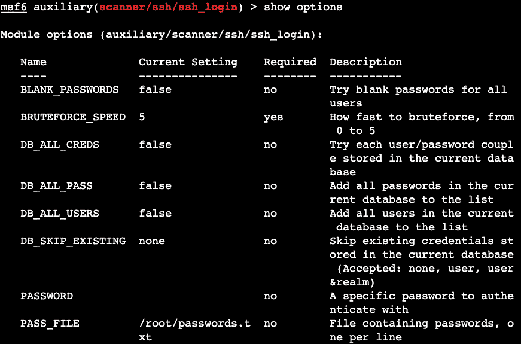

    图 6.36 – 显示选项

    由于我们刚刚将`RHOSTS`值设置为第二个虚拟机实例的私有 IP 地址，所有相关的配置设置已经完成（因为我们正在重用在第一次使用模块时设置的大部分先前配置）。

1.  现在，让我们继续在第二个目标 EC2 实例（**target-vm-02**）上运行 SSH 登录扫描器：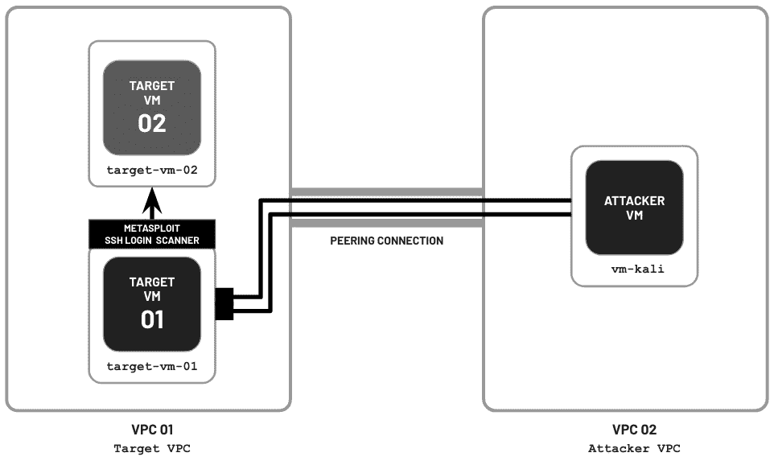

    图 6.37 – 在第二个目标实例上使用 SSH 登录扫描器

    即使攻击者实例（**vm-kali**）无法直接访问第二个目标 EC2 实例，我们也应该能够通过第一个目标 EC2 实例（**target-vm-01**）*间接*运行 SSH 登录扫描器。

    一旦准备好进行扫描，运行以下命令：

    ```
    run
    ```

    这将生成以下一组日志：

    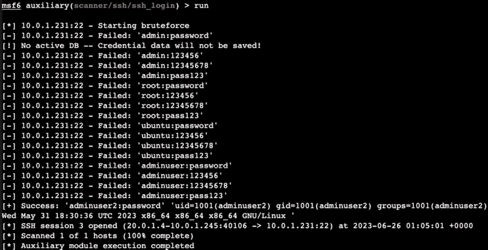

    图 6.38 – 在第二个目标实例上运行 SSH 登录扫描器后的日志

    尝试了几个用户名和密码组合后，我们看到成功使用 `adminuser2` 作为用户名，`password` 作为密码进行了身份验证！

注意

这个步骤可能需要大约 3-5 分钟才能完成。

1.  通过运行以下命令列出现有会话：

    ```
    sessions
    ```

    这应该会返回三个活跃会话，类似于 *图 6.39* 中所示：

    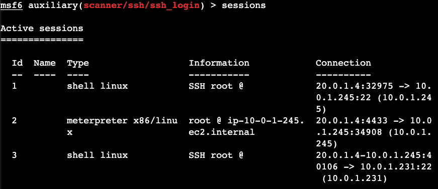

    图 6.39 – 活跃会话列表

    在这里，我们看到有第三个活跃会话，它允许我们访问（并控制）第二个目标实例（**vm-target-02**）：

    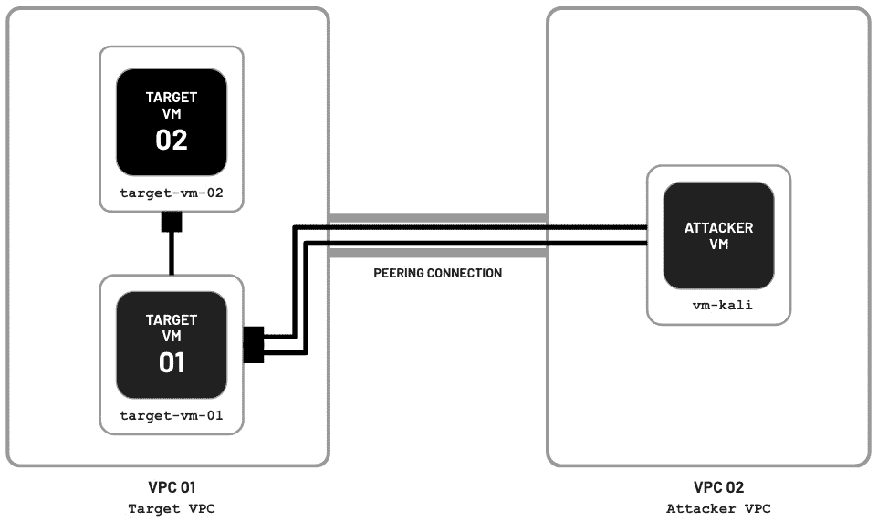

    图 6.40 – 访问第二个目标实例的新会话

    此时，我们有两个会话连接攻击者实例（**vm-kali**）和第一个目标实例（**target-vm-01**），以及一个会话连接第一个目标实例和第二个目标实例（**target-vm-02**）。

1.  现在，让我们使用以下命令访问第二个目标实例（**target-vm-02**）：

    ```
    sessions -i 3
    ```

    这将允许我们与会话互动并执行命令。

1.  运行以下命令来检查当前用户的用户名：

    ```
    whoami
    ```

    这应该会返回 `adminuser2`，表示我们当前以 `adminuser2` 用户身份登录。

1.  通过运行以下命令提升权限至 `root`：

    ```
    sudo su
    ```

注意

看起来已经为 `adminuser2` 配置了无密码 sudo！如果你想知道这是如何配置的，只需在我们的 Terraform 配置代码（在 CloudShell 中）中找到并检查 `aws_instance` 资源块的 `user_data` 属性。

1.  运行以下命令来检查当前用户的用户名：

    ```
    whoami
    ```

    这应该会给我们以下输出：

    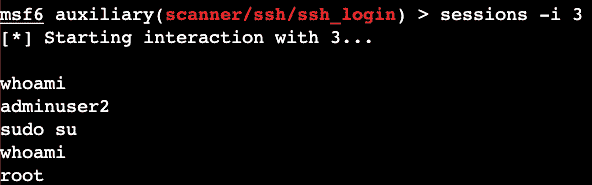

    图 6.41 – 运行 sudo su 后执行 whoami 命令的结果

    在 *图 6.41* 中，我们可以看到在运行 `sudo su` 后执行 `whoami` 命令的输出为 `root`，表示我们当前以 `root` 用户身份登录。

1.  让我们通过运行以下命令来定位第二个标志：

    ```
    find / -type f -name "flag*"
    ```

    这将搜索整个文件系统，查找以 `flag` 开头的文件。几分钟后，我们应该会得到一个结果列表，其中包括 `/****root/flag.txt` 文件：

    ```
    ... /root/flag.txt
    ...
    ```

    看起来我们找到了标志文件！

注意

这个步骤可能需要大约 2-4 分钟来完成。

1.  现在，让我们检查`/root/flag.txt`的内容：

    ```
    cat /root/flag.txt
    ```

    这应该会给我们带来`FLAG #** **2!`。

1.  接下来，按*Ctrl* + *Z*将会话切换到后台模式。当提示`Background session 3? [y/N]`时，输入`y`以继续。

1.  最后，让我们使用以下命令退出`msfconsole`：

    ```
    exit -y
    ```

    就这些！到目前为止，我们已经完成了渗透测试模拟。

现在，你可能很想尝试其他的跳板技术！由于我们已经自动化了设置过程，我们可以简单地运行以下命令来重建目标环境：

```
terraform apply -replace=<RESOURCE ADDRESS> -auto-approve
```

运行此命令将销毁并重建由`<RESOURCE ADDRESS>`标识的资源，以及与其相关或依赖的其他资源。由于渗透测试活动可能会使基础设施处于不稳定或配置错误的状态，重建基础设施将使其恢复到所需状态。

# 清理中

等一下……我们还没完成呢！清理我们创建或部署的云资源是在渗透测试实验环境中工作时的关键步骤。如果我们不立即清理和删除创建的资源，我们可能会为未使用的云资源付费。

最少情况下，我们将支付`t3.medium` EC2 实例（攻击者实例）和两个`t2.micro` EC2 实例（目标实例）运行的时间费用。请注意，我们还需要考虑其他成本，包括数据传输费用、实例使用的任何持久性数据的存储费用（如附加到 EC2 实例的 EBS 卷）、实验环境中使用的其他 AWS 服务的潜在费用（例如，监控日志）以及与 AWS 使用相关的任何适用税费或费用。

注意

由于运行这些资源的整体成本取决于多个参数，最好参考云平台提供的定价文档页面：[`aws.amazon.com/ec2/pricing/on-demand/`](https://aws.amazon.com/ec2/pricing/on-demand/)。你还可以使用**AWS 定价计算器**来帮助估算在 AWS 上运行资源的成本。你可以在这里访问 AWS 定价计算器：[`calculator.aws/`](https://calculator.aws/)。

话虽如此，让我们继续删除在本章中创建的资源：

1.  在 AWS CloudShell 终端中，导航到`~/pentest_lab`目录，然后使用`terraform destroy`来清理我们之前创建的资源：

    ```
    cd ~/pentest_lab
    terraform destroy -auto-approve
    ```

    如果某些资源删除失败（或需要一些时间删除），可以随时运行`terraform destroy`命令几次。或者，如果一切都失败，你也可以通过用户界面手动删除资源。

注意

这个步骤可能需要 10-15 分钟才能完成。等待时可以随便吃点零食！

1.  使用以下命令验证资源是否已成功销毁：

    ```
    terraform show
    ```

    由于所有资源应该已经成功删除，因此此操作应返回空响应。

重要提示

确保利用**AWS 账单仪表板**对您的 AWS 账户进行全面审计。它提供了**成本探索器**等功能，用于可视化开支模式，详细的账单报告，用于服务细分，以及带有提醒的预算工具，帮助用户主动管理费用。使用 AWS 账单仪表板的不同功能将帮助确保所有资源已正确删除，并减少意外费用的风险。

就是这样！此时，我们应该已经对如何在 AWS 上准备渗透测试实验室环境有了清晰的了解。您可以自由调整 Terraform 配置代码，并扩展当前实验室环境的设置，以便拥有更多的目标资源和子网（以及更复杂的网络配置设置）。

# 总结

在本章中，我们讨论了如何在 AWS 上设置一个跳板实验室，在这个实验室中，我们可以练习跳板技术。我们从使用 Terraform 自动构建一个简单的环境开始，该环境包括一个攻击者实例和两个目标实例。然后，我们测试了实验室的网络连接性和安全性，以验证 Terraform 代码中指定的网络配置。最后，我们进行了渗透测试模拟，以验证实验室环境是否已正确设置。

现在我们已经完成了本章内容，接下来我们将重点准备 IAM 权限提升实验室环境。如果你想知道 IAM 权限提升实验室是如何（错误地）配置的，那么下一章将会很适合你！

# 进一步阅读

如果您想了解更多本章所涉及的主题，以下资源可能会对您有所帮助：

+   *Amazon 虚拟私有云 – 什么是 VPC* *对等连接*？([`docs.aws.amazon.com/vpc/latest/peering/what-is-vpc-peering.html`](https://docs.aws.amazon.com/vpc/latest/peering/what-is-vpc-peering.html))

+   *Amazon 虚拟私有云 – 什么是网络访问* *分析器？* ([`docs.aws.amazon.com/vpc/latest/network-access-analyzer/what-is-network-access-analyzer.html`](https://docs.aws.amazon.com/vpc/latest/network-access-analyzer/what-is-network-access-analyzer.html))

+   *新增 – VPC 可达性* *分析器* ([`aws.amazon.com/blogs/aws/new-vpc-insights-analyzes-reachability-and-visibility-in-vpcs/`](https://aws.amazon.com/blogs/aws/new-vpc-insights-analyzes-reachability-and-visibility-in-vpcs/))

+   *AWS 架构博客 – 使用 Amazon VPC* *终端节点* 降低成本并提高安全性 ([`aws.amazon.com/blogs/architecture/reduce-cost-and-increase-security-with-amazon-vpc-endpoints/`](https://aws.amazon.com/blogs/architecture/reduce-cost-and-increase-security-with-amazon-vpc-endpoints/))

+   *AWS 架构博客 – 一对多：演进的 VPC* *设计* ([`aws.amazon.com/blogs/architecture/one-to-many-evolving-vpc-design/`](https://aws.amazon.com/blogs/architecture/one-to-many-evolving-vpc-design/))

+   *AWS re:Invent 2022 – 高级 VPC 设计和新的 Amazon VPC* *功能* ([`www.youtube.com/watch?v=cbUNbK8ZdA0`](https://www.youtube.com/watch?v=cbUNbK8ZdA0))

+   *将 shell 升级为* *Meterpreter* ([`docs.metasploit.com/docs/pentesting/metasploit-guide-upgrading-shells-to-meterpreter.html`](https://docs.metasploit.com/docs/pentesting/metasploit-guide-upgrading-shells-to-meterpreter.html))

+   *在* *Metasploit* *中进行枢纽转移* ([`docs.metasploit.com/docs/using-metasploit/intermediate/pivoting-in-metasploit.html`](https://docs.metasploit.com/docs/using-metasploit/intermediate/pivoting-in-metasploit.html))

+   *网络* *分割* ([`www.vmware.com/topics/glossary/content/network-segmentation.html`](https://www.vmware.com/topics/glossary/content/network-segmentation.html))

# 第三部分：探索实验室环境设计中的高级策略和最佳实践

在本部分中，您将探索在云中构建渗透测试实验室环境的各种策略和最佳实践。

本部分包含以下章节：

+   *第七章*，*建立* *IAM 特权升级实验室*

+   *第八章*，*设计和构建一个易受攻击的活动目录实验室*

+   *第九章*，*推荐策略和最佳实践*
