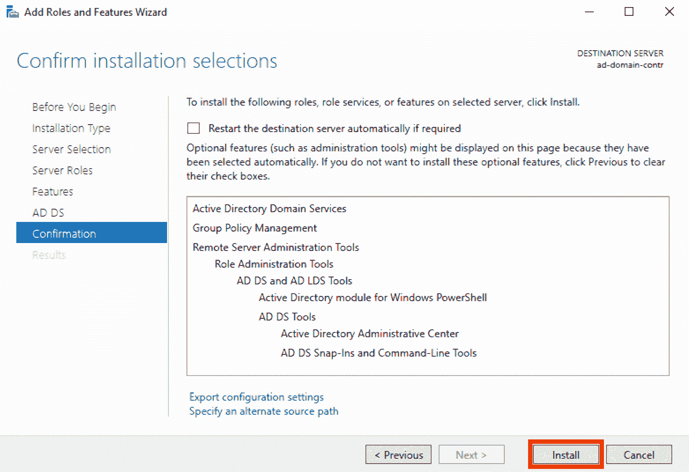
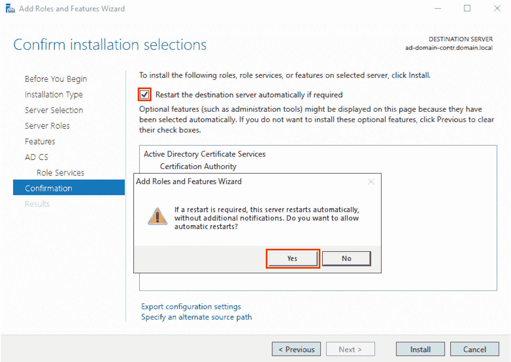
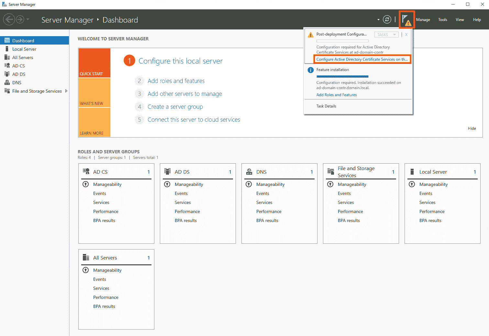
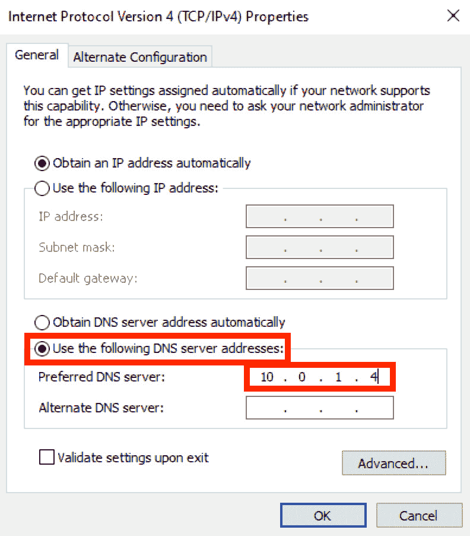
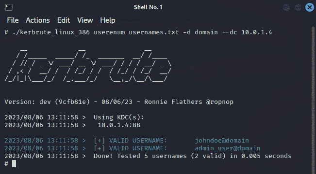

# 第八章：设计和构建一个易受攻击的 Active Directory 实验室

全球各地的组织依赖`Active Directory`来集中管理网络资源和用户帐户。它在全球范围内的广泛应用，使其成为攻击者试图突破大规模网络的常见目标。为了应对不断演变的攻击，设置模拟现实世界实施的渗透测试实验室环境，可以帮助组织模拟各种攻击类型，强化其安全措施，以保护网络资源和数据的安全。

在本章中，我们将在 Microsoft Azure 的隔离网络环境中设置和配置 Active Directory 实验室。在这个实验室设置中，我们将引入各种安全配置错误以及故意设置的弱配置，这些配置在实际的 Active Directory 实施中是常见的。一旦实验室环境准备就绪，我们将进行渗透测试模拟，以验证我们的实验室配置设置。

本章将涵盖以下主题：

+   准备必要的组件和前提条件

+   启动目标虚拟机实例

+   设置和配置 Active Directory 实验室

+   在实验室环境中模拟渗透测试

+   清理工作

牢记这些，我们开始吧！

# 技术要求

在开始之前，我们必须准备以下内容：

+   我们在*第五章*《在 Azure 上设置隔离的渗透测试实验室环境》中使用的`Microsoft Azure`帐户

+   安装在您本地计算机上的`Microsoft Remote Desktop`应用程序

+   在*第五章*《在 Azure 上设置隔离的渗透测试实验室环境》部分的*利用 Terraform 自动设置攻击者虚拟机实例*中创建的 Kali Linux 虚拟机实例的黄金镜像

+   任意文本编辑器（如 Notepad++、Visual Studio Code 或 Sublime Text），用于临时存储将用于本章动手解决方案中的特定值（例如，本地计算机的 IP 地址）

一旦这些要求准备就绪，您可以继续进行后续步骤。

重要提示

在继续之前，请确保您已完成*第五章*中的动手操作。本章假设我们已经创建了攻击者虚拟机实例的黄金虚拟机镜像。

每章的源代码和其他文件可在本书的 GitHub 仓库中找到：[`github.com/PacktPublishing/Building-and-Automating-Penetration-Testing-Labs-in-the-Cloud`](https://github.com/PacktPublishing/Building-and-Automating-Penetration-Testing-Labs-in-the-Cloud)。

# 准备必要的组件和前提条件

在本节中，我们将设置隔离的网络环境，目标资源将在此启动。这将确保只有受信任的计算机（我们的本地计算机和攻击者的计算机）能够访问易受攻击和配置错误的资源及服务：


图 8.1 — 准备先决条件

我们还将在本章稍后的部分中生成 SSH 密钥（公钥和私钥），用于访问攻击者 VM 实例。如 *图 8**.1* 所示，私钥将存储在本地机器中，而公钥将存储在攻击者 VM 实例中。通过这种设置，服务器（攻击者 VM 实例）可以使用私钥来确认客户端（本地机器）的身份。这将使我们能够通过 SSH 访问攻击者 VM 实例并远程执行命令。此外，我们还将确保攻击者 VM 实例已准备好，以便我们可以专注于在本章接下来的部分中设置和验证易受攻击的 Active Directory 实验室配置。

也就是说，我们将把这一部分分为三个部分：

+   *第一部分（共 3 部分）– 生成 SSH 密钥以访问攻击者* *VM 实例*

+   *第二部分（共 3 部分）– 使用 Terraform 设置实验室网络环境*

+   *第三部分（共 3 部分）– 访问攻击者* *VM 实例*

让我们开始吧。

## 第一部分（共 3 部分）– 生成 SSH 密钥以访问攻击者 VM 实例

让我们首先生成 SSH 密钥，以便稍后在本章中访问攻击者 VM 实例：

1.  通过点击 *图 8**.2* 中的按钮来打开 `Cloud Shell` 编辑器：

    图 8.2 – 打开 Cloud Shell

    这将打开一个终端，我们可以在其中运行 bash 命令。

重要提示

在少数情况下，如果 Cloud Shell 无法挂载 Azure 文件共享（即收到 **Failed to mount the Azure file share. Your cloud drive won’t be available** 的警告），只需重新启动 Cloud Shell（并检查是否能解决问题）。

1.  在终端（`$` 符号后）中运行以下命令，创建一个新目录（命名为 **kali_keys_ad**）并导航到该目录：

    ```
    cd ~
    mkdir kali_keys_ad && cd kali_keys_ad
    ```

    我们将在此目录中存储生成的密钥。

1.  生成一对新的 SSH 密钥并将生成的密钥文件保存在 `kali_keys_ad` 目录中：

    ```
    ssh-keygen -t rsa -C kali -f ./kali-ad-lab-ssh
    ```

    当系统要求输入密码时，直接按 *Enter* 键。这将生成两个文件 —— `kali-ad-lab-ssh`（私钥）和 `kali-ad-lab-ssh.pub`（公钥）。

注意

*这些 SSH 密钥文件是如何工作的？* SSH 密钥文件由 **私钥**（存储并保存在客户端机器上）和相应的 **公钥**（上传到远程服务器）组成。在身份验证过程中，客户端使用其私钥生成数字签名，服务器则使用相应的公钥进行验证。在此过程中，服务器可以根据客户端持有私钥的事实确认其身份，而无需传输敏感的凭证。

1.  使用 `cat` 命令打印公钥值：

    ```
    cat kali-ad-lab-ssh.pub
    ```

    将此值保存在本地机器的文本编辑器中，因为我们将在本章后续部分中使用它。

1.  点击 **上传/下载文件** 按钮，如 *图 8**.3* 中左上角所示：

    图 8.3 — 下载我们生成的私钥

    从可用选项列表中选择 `Download` 选项。当你看到 `Download a file` 弹出窗口时，在 *图 8.3* 中突出显示的输入框中输入 `/kali_keys_ad/kali-ad-lab-ssh`，然后点击 `Download`。

1.  点击 `Click here to download your file` 链接继续进行实际的下载操作。这将把 `kali-ad-lab-ssh` 密钥文件从 Cloud Shell 环境下载到你的本地机器。

## 第二部分，共 3 部分 — 使用 Terraform 设置实验室网络环境

按照以下步骤操作：

1.  在 Cloud Shell 终端（`$` 符号后面）运行以下命令，创建一个新目录（名为 **ch8_environment**）并切换到该目录：

    ```
    cd ~
    mkdir ch8_environment && cd ch8_environment
    ```

1.  下载包含本章实验环境 Terraform 配置文件的 ZIP 文件：

    ```
    DOWNLOAD_URL=`https://github.com/PacktPublishing/Building-and-Automating-Penetration-Testing-Labs-in-the-Cloud/raw/main/ch08/ad_lab_environment.zip`
    wget $DOWNLOAD_URL
    ```

    这将把 `ad_lab_environment.zip` 文件下载到 `ch8_environment` 目录。请确保指定的下载链接正确（没有空格），并指向 `ad_lab_environment.zip` 文件。

注意

你可以在本书的 GitHub 仓库中找到包含 Terraform 配置文件的 ZIP 文件，链接地址为：[`github.com/PacktPublishing/Building-and-Automating-Penetration-Testing-Labs-in-the-Cloud/tree/main/ch08`](https://github.com/PacktPublishing/Building-and-Automating-Penetration-Testing-Labs-in-the-Cloud/tree/main/ch08)。

1.  使用 `unzip` 命令解压你下载的 ZIP 文件内容：

    ```
    unzip ad_lab_environment.zip
    ```

    这应该会产生以下日志：

    ```
    Archive:  ad_lab_environment.zip
       creating: attacker_vm/
      inflating: attacker_vm/outputs.tf
      inflating: attacker_vm/variables.tf
      inflating: attacker_vm/main.tf
      inflating: main.tf
      inflating: outputs.tf
     extracting: provider.tf
       creating: secure_network/
      inflating: secure_network/outputs.tf
     extracting: secure_network/variables.tf
      inflating: secure_network/main.tf
      inflating: terraform.tfvars
      inflating: variables.tf
      inflating: versions.tf
    ```

    在这里，我们可以看到刚才从 ZIP 文件中提取出来的文件。

1.  既然我们已经从 ZIP 文件中提取了文件，现在可以删除 ZIP 文件了：

    ```
    rm ad_lab_environment.zip
    ```

1.  通过点击 *图 8.4* 中突出显示的按钮来打开编辑器：

    图 8.4 — 打开 Cloud Shell 编辑器

    这应该会打开一个文件树，和一个编辑器，在这里我们可以直接修改文件的代码。

1.  在编辑器中打开 `ch8_environment/terraform.tfvars` 文件，通过点击文件树中的该文件：

    ```
     my_ip = "<IP ADDRESS>"
    kali_image_id = "<KALI IMAGE ID>"
    my_public_ssh_key = "<PUBLIC SSH KEY>"
    ```

    确保将 `<IP ADDRESS>` 替换为你本地机器的 IP 地址，将 `<PUBLIC SSH KEY>` 替换为公共 SSH 密钥的字符串值（之前我们使用 `cat` 命令打印过）。更新 `<KALI IMAGE ID>` 为我们在 *第五章* 中创建的黄金镜像的资源 ID，*《在 Azure 上设置隔离的渗透测试实验室环境》*。如果你想知道这个值是什么样的，`"<KALI IMAGE ID>"` 占位符的值应该具有类似于以下格式：

    ```
    /subscriptions/.../resourcegroups/image-resource-group/providers/Microsoft.Compute/galleries/kali_gallery/images/golden-image/versions/1.0.0
    ```

    确保保存你对 `ch8_environment/terraform.tfvars` 文件所做的更改。

注意

如果您正在寻找`<KALI IMAGE ID>`占位符的值，请在搜索栏中输入`1.0.0`，然后从搜索结果返回的资源列表中选择`VM image version 1.0.0`。在`1.0.0 (gallery/kali_image/1.0.0) VM image version`的详细信息页面（**概述**窗格）上，单击`JSON View`链接，然后从**资源` **JSON`页面复制**资源 ID**值。

1.  让我们使用`terraform init`命令初始化 Terraform 工作目录：

    ```
    terraform init
    ```

注意

请注意，本章中的实践解决方案使用 Terraform 版本`v1.3.X`，因为这是我们云 Shell 环境中配置的版本（截至目前为止）。如果您的 Terraform 版本较高，您可以设置并使用较低版本（例如**v1.3.2**），以防在运行 Terraform 命令时遇到问题。

1.  让我们运行`terraform plan`来预览 Terraform 将执行的更改：

    ```
    terraform plan
    ```

    这应该产生以下输出：

    ```
    ... Plan: 20 to add, 0 to change, 0 to destroy. ...
    ```

注意

运行此命令可能会产生一些弃用警告。只要我们能够成功运行命令而没有错误，这应该是可以接受的。

1.  接下来，让我们使用`terraform apply`命令来实施更改：

    ```
    terraform apply -auto-approve
    ```

    这应该返回以下输出：

    ```
    ... Apply complete! Resources: 20 added, 0 changed, 0 destroyed. Outputs:
    vm_kali_private_ip = "..." vm_kali_public_ip = "..."
    ```

    如果`terraform apply`命令运行没有任何错误，我们应该有以下环境设置：

    

    图 8.5 — VNet peering 设置

    在这里，我们有一个类似于我们在*第五章*中配置的`VNet peering`设置，*在 Azure 上设置隔离的渗透测试实验室环境*。除了网络环境外，我们还应该设置好攻击者 VM 实例（**vm-kali**）。

注意

此步骤可能需要大约 10 到 15 分钟才能完成。在等待时随时喝杯咖啡或茶！请注意，在`terraform apply`命令运行完成后，攻击者 VM 实例准备就绪可能需要几分钟时间。

1.  使用以下命令验证资源是否已成功创建：

    ```
    terraform show
    ```

    这应该返回创建的资源，以及以下输出：

    ```
    Outputs:
    vm_kali_private_ip = "<VM KALI PRIVATE IP>"
    vm_kali_public_ip = "<VM KALI PUBLIC IP>"
    ```

    请注意`<VM KALI PUBLIC IP>`的值，因为我们将在接下来的步骤中使用此值。

## 第三部分 3 – 访问攻击者 VM 实例

现在，让我们从浏览器远程访问攻击者机器的桌面环境：

1.  打开一个新的浏览器选项卡，并使用`http://<VM KALI PUBLIC IP>:8081/vnc.html` URL 访问基于 Web 的`noVNC`客户端。确保将`<VM KALI PUBLIC IP>`替换为您之前复制到剪贴板的**公共 IP 地址**值：

    图 8.6 — noVNC 欢迎屏幕

    这应该打开一个带有**连接**按钮的欢迎屏幕，类似于*图 8**.6*中显示的内容。

重要提示

如果你发现无法访问欢迎屏幕，可能是你的 IP 地址已经改变。只需打开 Cloud Shell 编辑器并更新`terraform.tfvars`文件。更新本地机器的新 IP 地址后，再次运行`terraform apply`命令，以更新防火墙规则，将你的新 IP 地址列入白名单。

1.  点击**连接**按钮，然后使用`kali123`作为密码（或者使用在*第五章*中设置 Kali Linux 攻击者机器时指定的密码）来访问桌面环境：

    图 8.7 —— 在浏览器中访问 Kali Linux 桌面/GUI 环境

    本章中我们将使用桌面/GUI 环境。随时可以打开终端（在攻击者计算机的桌面环境内），并运行`ifconfig`命令，确认 Kali Linux 虚拟机实例已经在`vnet-02`（**192.168.0.0/16**）中启动。

注意

请注意，你也可以通过在本地机器上使用`ssh -i kali-ad-lab-ssh kali_admin@<VM KALI PUBLIC IP>`命令直接访问攻击者 Kali Linux 服务器（即在运行`chmod** **400 kali-ad-lab-ssh`之后）。

到这一步，我们已经在短短几步内设置好了隔离的网络环境和攻击者虚拟机实例！现在，让我们继续启动目标虚拟机实例。

# 启动目标虚拟机实例

在本节中，我们将启动两个 Windows 虚拟机实例，作为网络环境中的目标资源。第一个虚拟机实例将作为**域控制器**，第二个虚拟机实例将作为将加入域的工作站计算机：


图 8.8 —— 启动目标虚拟机实例

如果这是你第一次设置活动目录，那么我们可以将**域控制器**看作是网络的*大脑*，它负责监督用户认证、资源管理和目录服务。我们可以将工作站计算机看作是连接到身体的一只手臂，它与大脑（域控制器）互动，以访问和使用网络资源与服务。需要注意的是，我们可以有多台机器加入域，每台机器作为一个独立的“手臂”，但仍然在域控制器的控制和指导下。然而，在本章中，我们只会设置一台工作站计算机加入域。

注意

本节主要集中在启动我们 Microsoft Azure 账户中的 Windows 虚拟机实例。接下来会有专门的章节讲解（误）配置实际的活动目录设置。

我们将把这一节分为三个子部分：

+   *第一部分，共 3 部分——启动域控制器的虚拟机实例*

+   *第二部分，共 3 部分——启动工作站计算机的虚拟机实例*

+   *第三部分，共 3 部分——测试* *网络连接性*

让我们开始吧。

## 第一部分，共 3 部分——启动域控制器的虚拟机实例

让我们从启动第一个 Windows 虚拟机实例开始：

1.  在搜索栏中输入**虚拟机**并按*Enter*键：

    图 8.9 — 导航到虚拟机页面

    从可用选项中选择**虚拟机**以导航到**虚拟` `机**页面。

1.  在**虚拟机**页面，点击**创建**按钮。从下拉菜单中选择**Azure 虚拟机**。

1.  在**创建虚拟机**页面，指定**基础**选项卡下的以下配置值：

    +   **项目详情** > **订阅**：（使用现有订阅）

    +   **项目详情** > **资源` `组**：`resource-group-01`

    +   **实例详情** > **虚拟机` `名称**：`ad-domain-controller`

    +   **实例详情** > **区域**：**（美国）` `东部美国**

    +   **实例详情** > **安全` `类型**：**标准**

    +   **实例详情** > **镜像**：点击**查看所有` `镜像**链接

备注

点击**查看所有镜像**将重定向您到**选择镜像**页面。

1.  在**选择镜像**页面，输入`windows`到搜索框中，然后按*Enter*键：

    图 8.10 — 选择 Windows Server 镜像

    点击**选择**按钮选择`Windows Server`，如*图 8.10*所示。

1.  选择**Windows Server 2019 Datacenter – x64 Gen 2**（或者如果有其他更新版本，选择列表中最接近的一个）：

    图 8.11 — 为域控制器虚拟机实例选择镜像

    这应该会将您重定向回**创建虚拟` `机**页面。

重要说明

如果在选择 Windows Server 镜像时遇到问题，并且它没有出现在下拉菜单中，简单地刷新页面，然后再试一次。请注意，您可能需要重新输入其他虚拟机配置设置。

1.  在**创建虚拟机**页面继续之前的步骤，指定以下配置值：

    +   **项目详情** > **大小**：**Standard_B2ms – 2 vcpus, 8` `GiB 内存**

    +   **管理员账户** > **用户名**：`admin_user`

    +   **管理员账户** > **密码**：`Windows1234!!!`

    +   **管理员账户** > **确认` `密码**：`Windows1234!!!`

    +   **入站端口规则** > **公共入站` `端口**：**无**

    然后点击**下一步 : 磁盘 >**按钮。

    +   接受**磁盘**选项卡下的默认配置，然后点击**下一步 :` `网络 >**。

1.  在**网络**选项卡下，确保设置以下配置值：

    +   **虚拟` `网络**：`vnet-01`

    +   **子网**：`subnet-01 (10.0.1.0/24)`

    +   **NIC 网络安全` `组**：**高级**

    +   **配置网络安全` `组**：`nsg-01`

    +   **删除公共 IP 和 NIC 当虚拟机` `被删除时**：**（已勾选）**

    在这里，我们正在配置我们的 Windows 虚拟机实例，使其在前一节中使用 Terraform 自动设置的 VNet（**vnet-01**）内启动。

1.  现在，继续点击`Next`按钮，直到到达最后一个标签页。

注意

只需接受`Disks`、`Networking`、`Management`、`Monitoring`、`Advanced`、`Tags`和`Review +** **create`下的默认设置。

1.  一旦进入`Review + create`标签页，审阅配置详情后，点击`Create`按钮。

1.  等待直到看到`Your deployment is complete`消息。向下滚动并点击`Go to resource`按钮。这将把你重定向到我们刚刚创建的 VM（**ad-domain-controller**）的`Overview`页面。

1.  在左侧面板的资源菜单中找到并选择`Connect`，位于`Settings`部分。

1.  点击`Download RDP File`，如*图 8.12*所示：

    图 8.12 — 下载 RDP 文件

    这将会下载一个 RDP 文件（**ad-domain-controller.rdp**）到本地机器。如果你看到门户网站的`Connect`页面是新版，只需点击`Native RDP`下的`Select`按钮（位于`Most common`下），然后再点击`Download RDP** **File`按钮。

注意

**远程桌面协议**（**RDP**）是一种安全协议（由微软开发），允许用户通过网络访问和控制计算机的桌面界面。通过此协议，RDP 文件只是一个配置文件，其中包含访问远程机器界面所需的信息。如需更多信息，请访问[`learn.microsoft.com/en-us/azure/virtual-machines/windows/connect-rdp`](https://learn.microsoft.com/en-us/azure/virtual-machines/windows/connect-rdp)。

1.  使用`Microsoft Remote Desktop`应用打开 RDP 文件。如果已经安装了 Microsoft Remote Desktop 应用，我们可以直接双击存储在`Downloads`文件夹（或其他地方）的 RDP 文件，连接到 Windows VM 实例（**ad-domain-controller**）。

1.  当系统提示输入用户账户凭证时，直接使用`admin_user`作为用户名，`Windows1234!!!`作为密码：

    图 8.13 — 输入你的用户账户

    当看到`You are connecting to the RDP** **host...`弹窗时，点击`Continue`按钮：

重要提示

在极少数情况下，如果遇到黑屏，只需重启 VM 实例，再尝试连接。如果问题依然存在，可以删除该 VM 实例，重新创建，再进行连接。


1.  图 8.14 — 登录后打开 Server Manager

    登录到`admin_user`用户账户后，我们应该看到`Server Manager`打开。

注意

如果这是你第一次使用`Server Manager`，你可以将其视为一个集中式界面，管理员可以在其中执行各种任务并管理 Windows Server 环境的不同方面。这包括配置服务器角色和功能、监控服务器性能、设置和配置 Active Directory 等。

1.  单击搜索按钮并在搜索框中键入`cmd`，类似于 *图 8**.15* 所示:

    图 8.15 — 打开命令提示符应用程序

    单击**命令提示符**（在**最佳匹配**下）打开命令提示符应用程序。在这里，我们可以运行各种命令与操作系统交互，并执行文件和目录操作、系统配置、网络诊断等任务。

1.  在命令提示符内运行`ipconfig`以检索虚拟机实例的私有 IP 地址:

    图 8.16 — 运行 ipconfig 后的结果

    在这里，我们可以看到我们第一个 Windows 虚拟机实例的私有 IP 地址（一旦我们稍后在本章中配置它后将作为活动目录域控制器），为`1.0.1.4`。请注意，您在运行`ipconfig`后可能会获得不同的私有 IP 地址值。

注意

在本章后续的一系列步骤中，我们将假定我们域控制器机器的私有 IP 地址为`1.0.1.4`。请确保在上一步中运行`ipconfig`后获得不同的私有 IP 地址值时更新使用的 IP 地址值，在命令中使用。

此时，在我们隔离的网络环境中有一个运行的单个 Windows 虚拟机实例（除了攻击者虚拟机实例）。 **请注意，此 Windows 虚拟机实例尚未设置活动目录！** 因此，在接下来的部分中，请不要关闭此虚拟机实例（**ad-domain-controller**）的 RDP 会话，我们将在下一节中在此实例中设置和配置活动目录。暂时，您可以最小化 RDP 会话窗口，并导航回在其中打开 Azure 门户的浏览器。

## 第二部分 – 启动工作站计算机的虚拟机实例

现在，让我们为工作站计算机启动第二个 Windows 虚拟机实例:

1.  返回在其中打开 Azure 门户的浏览器。在 Microsoft Azure 门户的搜索栏中，键入**虚拟机**并按 *Enter*:

    图 8.17 — 导航至虚拟机页面

    从可用选项列表中选择**虚拟机**，跳转至**虚拟机**页面（类似于 *图 8**.17* 所示）。

1.  在**虚拟机**页面上，单击**创建**按钮。从下拉菜单中选择**Azure 虚拟机**。

1.  在**创建虚拟机**页面上，在**基本信息**选项卡下指定以下配置数值:

    +   **项目详情** > **订阅**:（使用现有订阅）

    +   **项目详情** > **资源` `组`: **resource-group-01`

    +   **实例详情** > **虚拟机` `名称`: **ad-workstation-machine`

    +   **实例详情** > **区域`: `(美国)` `东部美国**

    +   **实例详情** > **安全性` `类型`: `标准**

    +   **实例详情** > **镜像**: 点击**查看全部` `镜像**链接

注意

点击 **查看所有映像** 将重定向到 **选择映像** 页面。

1.  在 **选择映像** 页面，输入 `windows` 在搜索框中然后按下 *Enter*：

    图 8.18 — 选择 Microsoft Windows 10 映像

    通过点击 **选择** 按钮选择 `Microsoft Windows 10`，如 *图 8**.18* 中所示。

1.  选择 **Windows 10 Enterprise, version 22H2 – x64 Gen2**（或者如果有其他更新版本，则从列表中选择最接近的一个）：

    图 8.19 — 选择工作站 VM 实例的映像

    这将重定向您回到 **创建虚拟机** 页面。

注意

如果您在选择 Windows Server 映像并使其反映在下拉菜单中作为选定映像时遇到问题，只需刷新页面然后重试。请注意，您将需要再次输入 VM 配置设置。

1.  继续我们在 **创建虚拟机** 页面上停下的地方，也要指定以下配置值：

    +   **项目详细信息** > **大小**：**Standard_B2ms – 2 vcpus, 8` **GiB memory`

    +   **管理员帐户** > **用户名**：`workstation_user`

    +   **管理员帐户** > **密码**：`Workstation1234!!!`

    +   **管理员帐户** > **确认密码**：`Workstation1234!!!`

    +   **入站端口规则** > **公共入站端口**：**无**

    +   **许可** > **我确认我拥有符合条件的 Windows 10/11 许可证并具有多租户托管权限**：(已选中)

    在添加指定值后，点击 **下一步：磁盘 >** 按钮。

    在 **磁盘** 标签下接受默认配置，并点击 **下一步：网络 >**。

1.  在 **网络** 标签下，请确保设置以下配置值：

    +   **虚拟网络**：`vnet-01`

    +   **子网**：`subnet-01 (10.0.1.0/24)`

    +   **NIC 网络安全组**：**高级**

    +   **配置网络安全组**：`nsg-01`

    +   **删除公共 IP 和 NIC，当 VM 被删除时**：**(已检查)**

    在这里，我们正在配置第二个 Windows VM 实例 (`ad-workstation-machine`)，以便将其部署在与第一个 Windows VM 实例相同的 VNet（及子网）中。请注意，这些网络资源已经存在，并在前一节中使用 Terraform 自动创建。

1.  现在，继续点击 **下一步** 按钮，直到达到最后一个标签。

注意

简单地接受 **磁盘**、**网络**、**管理**、**监视**、**高级**、**标签** 和 **审核 + 创建** 下的默认设置。

1.  一旦到达 **审核 + 创建** 标签，请在审查配置细节后点击 **创建** 按钮。

1.  等待看到 **部署完成** 消息。向下滚动并点击 **转到资源** 按钮。这将重定向到我们刚创建的 VM (`ad-workstation-machine`) 的 **概述** 刀片。

1.  在左窗格资源菜单下的 **设置** 部分中找到并选择 **连接**。

1.  点击 `Download RDP File`，如 *图 8.20* 中所示：

    图 8.20 — 下载 RDP 文件

    这将下载一个 RDP 文件（**ad-workstation-machine.rdp**）到本地机器。如果你正在查看门户的新版 `Connect` 页面，只需在点击 `Download RDP File` 按钮之前，点击 `Native RDP` 下的 `Select` 按钮（在 `Most common` 下）。

1.  使用 `Microsoft Remote Desktop` 应用程序打开 RDP 文件。当提示输入凭据时，使用 `workstation_user` 作为用户名，`Workstation1234!!!` 作为密码：

    图 8.21 — 输入你的用户帐户

    当看到 `You are connecting to the RDP host...` 弹窗时，点击 `Continue` 按钮。

重要提示

在遇到黑屏的情况下，只需重启虚拟机实例，然后再次尝试连接。否则，删除虚拟机实例，重新创建它，然后再连接。

1.  在 `Choose privacy settings for your device` 屏幕上，点击 `Accept`。

1.  在搜索栏中输入 `cmd`（位于屏幕的左下角），类似于 *图 8.22* 中所示：

    图 8.22 — 打开命令提示符

    点击 `Command Prompt`（在 `Best match` 下）打开命令提示符应用程序。

1.  运行 `ipconfig` 来检查虚拟机实例的私有 IP 地址：

    图 8.23 — 在工作站虚拟机实例中运行 ipconfig 后的结果

    这应该会返回一组与 *图 8.23* 类似的配置值。请注意，你可能会看到不同的 **IPv4 地址** 值。

## 第三部分 / 共 3 部分 — 测试网络连通性

启动目标虚拟机实例后，我们需要验证是否可以从在另一个 VNet（**vnet-02**）中启动的攻击者虚拟机实例访问同一 VNet（**vnet-01**）内的目标实例，以测试我们之前使用 Terraform 自动设置的 VNet 对等连接：


图 8.24 — 测试网络连通性

话虽如此，在我们继续接下来的步骤之前，先快速检查一下是否可以从攻击者虚拟机实例（**vm-kali**）访问到两个 Windows 实例（`ad-domain-controller` 和 **ad-workstation-machine**）：

1.  返回你用来访问攻击者机器桌面/GUI 环境的浏览器标签页。如果你已经关闭了该标签页，只需在新的浏览器标签页中访问 `http://<VM KALI PUBLIC IP>:8081/vnc.html`。确保将 `<VM KALI PUBLIC IP>` 替换为 Kali Linux 虚拟机实例的 **Public IP 地址**。

注意

使用 `kali123` 作为密码（或在设置 Kali Linux 攻击机时，在 *第五章*，*在 Azure 上设置隔离渗透测试实验室环境* 中指定的密码）来访问桌面环境。

1.  在 Kali Linux 实例内打开一个终端窗口，通过点击图标 *图 8.25* 所示：

    图 8.25 — 打开终端窗口

    这应该会打开一个终端窗口，我们可以在 `$` 符号后运行命令。

1.  现在，让我们运行以下命令来扫描将作为域控制器的虚拟机实例 (`ad-domain-controller`):

    ```
    IP=10.0.1.4
    nmap --top-ports 1000 -Pn $IP
    ```

    确保你将 `IP` 变量值更新为第一个目标虚拟机实例 (`ad-domain-controller`) 的实际私有 IP 地址。运行此命令应该会给我们以下结果：

    

    图 8.26 — 域控制器虚拟机实例的初步扫描

    在这里，我们可以看到来自攻击者机器 (`vm-kali`) 的网络流量可以到达域控制器虚拟机实例 (`ad-domain-controller`)。

1.  接下来，让我们运行以下命令对第二个目标虚拟机实例 (`ad-workstation-machine`) 进行扫描。它将作为工作站，稍后将加入域控制器：

    ```
    IP=10.0.1.5
    nmap --top-ports 1000 -Pn $IP
    ```

    再次确认你将 `IP` 变量值更新为第二个目标虚拟机实例 (`ad-workstation-machine`) 的实际私有 IP 地址。这应该会给我们以下结果：

    

    图 8.27 — 工作站机器（ad-workstation-machine）的初步扫描

    在这里，我们可以看到来自攻击者机器 (`vm-kali`) 的网络流量可以到达第二个 Windows 虚拟机实例 (`ad-workstation-machine`)。

    此时，我们的 Windows 虚拟机实例已经准备好。**请注意，这些 Windows 虚拟机实例尚未设置 Active Directory！** 在下一节中，我们将完成实验环境的设置，并在这些 Windows 虚拟机实例中设置和（错误地）配置 Active Directory。

# 设置和配置 Active Directory 实验室

在本节中，我们将设置 Active Directory 域控制器以及工作站机器（该机器将加入域）。在进行本节的动手操作部分之前，我们首先来讨论一些相关的概念和术语：

+   **域**：这代表一组逻辑的网络资源。我们可以将域看作是一个拥有独特身份和基础设施的虚拟城市。就像城市将不同的社区组合在一起，域也将网络资源在逻辑上组合在一起。

+   **域控制器**：这是负责为域用户和计算机提供身份验证和授权服务的服务器。我们可以将域控制器视为城市的主要安全办公室，确保只有授权的人员可以访问城市的不同部分。

+   **林地**：这代表 Active Directory 中的最高层次结构级别，包含多个域（以及其他资源）。我们可以将林地视为一个包含多个城市的区域，每个城市（域）独立运作，但它们都属于同一个林地。

+   **组织单位**（**OU**）：这是域内的一个容器，可以用于容纳用户、计算机和其他对象。我们可以把 OU 想象成城市中的一个区。它像一个容器，用来组织和管理资源，就像区划用于分类建筑物和服务。

+   **对象**：代表活动目录网络中的单一元素或资源部分（包括用户账户、组和共享文件夹）。我们可以把对象看作是构成城市的单个元素（如房屋、商店和公园）。

注意

请注意，还有其他活动目录概念我们可以探索和讨论（这些我们在此未包括）。不过，作为介绍活动目录工作中基本概念和组件的入门部分，这些内容已经足够了。

在定义了一些关键概念之后，让我们来定义并描述一下活动目录。正如我们所见，**活动目录**只是一个*目录服务*，旨在管理网络资源和用户账户。就像一个城市的管理部门管理各个街区和资源一样，活动目录集中管理数字生态系统中的网络元素、用户身份和访问控制。

现在我们对本节的关键概念有了更好的理解，可以继续在之前启动的两台 Windows 虚拟机实例中设置并（错误）配置活动目录。由于设置活动目录实验室需要相对较长的步骤序列，我们将本节分为 12 个部分：

+   *第一部分，共 12 部分 – 安装活动目录* *域服务*

+   *第二部分，共 12 部分 – 将虚拟机实例提升为* *域控制器*

+   *第三部分，共 12 部分 – 设置活动目录* *证书服务*

+   *第四部分，共 12 部分 – 配置活动目录* *证书服务*

+   *第五部分，共 12 部分 – 更新受信主机配置并启用* *PowerShell 远程管理*

+   *第六部分，共 12 部分 – 在* *域控制器* 中设置标志

+   *第七部分，共 12 部分 – 创建 John* *Doe 用户*

+   *第八部分，共 12 部分 – 创建 Jane* *Doe 用户*

+   *第九部分，共 12 部分 – 创建服务* *账户用户*

+   *第十部分，共 12 部分 – 为* *服务账户* 设置 SPN

+   *第十一部分，共 12 部分 – 将服务账户用户添加到远程管理* *用户组*

+   *第十二部分，共 12 部分 – 配置* *工作站机器*

不再多说，让我们开始吧！

## 第一部分，共 1 部分 – 安装活动目录域服务

*还记得我们在前面部分最小化的 RDP 会话吗？* 让我们再次使用那个会话，因为我们将要在第一个虚拟机实例（**ad-domain-controller**）中安装**活动目录域服务**：

1.  在继续执行下一步之前，确保你已经打开了第一个虚拟机实例（**ad-domain-controller**）的 RDP 会话。

注意

**活动目录**和**活动目录域服务**（**AD DS**）是有时可以互换使用的术语。然而，虽然 AD DS 专门指的是活动目录的核心目录服务组件，但需要注意的是，活动目录（作为一个整体）包含的服务和组件比 AD DS 更广泛。

1.  转到**服务器管理器** > **仪表盘**，然后点击**添加角色和功能**:

    图 8.28 — 添加角色和功能

    你可以在**配置此本地服务器**下找到**添加角色和功能**链接（如*图 8.28*中所示）。

1.  在**开始之前**选项卡中，点击**下一步 >**。

1.  在**安装类型**下，确保选择了**基于角色或功能的安装**选项。点击**下一步 >**按钮继续。

1.  在**服务器选择**下，确保选择了**从服务器池中选择服务器**选项，然后点击**下一步 >**。

1.  在**服务器角色**下，切换到*开启*（勾选）**活动目录域服务**复选框:

    图 8.29 — 服务器角色

    找到在*图 8.29*中突出显示的复选框。确保点击正确的复选框（即对应**活动目录域服务**选项的复选框），因为有多个选项的名称以“活动目录”开头。

1.  前一步中勾选的复选框应该会打开**添加角色和功能向导**区域（类似于我们在*图 8.30*中看到的内容）:

    图 8.30 — 添加功能

    点击**添加功能**按钮（在*图 8.30*中突出显示），然后在**服务器角色**选项卡中点击**下一步 >**。

1.  在**功能**和`AD DS`选项卡中，点击**下一步 >**（两次）继续。

1.  在**确认**选项卡中，点击**安装**:

    图 8.31 — 确认安装选择

    安装完成后，点击**关闭**按钮。*这不是很简单吗？* **此时，我们应该已经安装好了 AD DS！** 当然，我们还没有完成，因为接下来我们将进行其他配置步骤。

注意

此步骤可能需要 10 到 15 分钟才能完成。在等待时，随时可以喝一杯咖啡或茶！

## 第二部分 / 共 12 部分 – 将虚拟机实例提升为域控制器

现在，是时候将机器（**ad-domain-controller**）提升为域控制器了：

1.  点击旗标按钮（在*图 8.32*中突出显示），然后点击**将此服务器提升为域控制器**:

    图 8.32 — 将机器提升为域控制器

    *什么是域控制器？* 一旦服务器被提升为域控制器，它将负责在网络中管理用户认证、授权和资源管理。

1.  在**部署配置**下，选择**添加一个新森林**:

    图 8.33 — 部署配置

    在 **根域名** 栏中，指定 `domain.local`（类似于 *图 8.33* 中所示）。然后点击 **下一步 >**。

1.  在 **域控制器选项** 下，使用 `Restore1234!!!` 作为密码：

    图 8.34 — 部署控制器选项

    确保在 **密码** 和 **确认密码** 字段中都指定 `Restore1234!!!`（类似于 *图 8.34* 中所示）。在点击 **下一步 >** 之前，保持其他设置不变。

1.  在 **DNS 选项** 标签页中，点击 **下一步 >**。

1.  在 **附加选项** 标签页中，确认自动填充的 **NetBIOS 域名** 字段值为 `DOMAIN`：

    图 8.35 — 附加选项

    在（如 *图 8.35* 所示）之后点击 **下一步 >** 按钮。

1.  在 **路径** 标签页中，保持现有设置，然后点击 **下一步 >** 按钮。

1.  在 **复查选项** 标签页中，点击 **下一步 >**。

1.  在 **先决条件检查** 标签页中，点击 **安装** 按钮（如 *图 8.36* 所示）：

    图 8.36 — 先决条件检查

    该步骤可能需要 5 到 10 分钟才能完成。此过程会自动重启 Windows 虚拟机实例（**ad-domain-controller**），并且在收到 **即将注销** 的通知弹窗后，您将丢失 RDP 连接。等待大约 5 分钟后再进行下一步。

注意

不用担心——我们可以在几分钟后再次通过 RDP 连接到第一个 Windows 虚拟机实例（**ad-domain-controller**）。这一次，我们应该能够使用域凭据登录（正如我们在接下来的步骤中所看到的那样）！

## 第三部分 共 12 部分 — 设置 Active Directory 证书服务

现在，我们将设置 **Active Directory 证书服务**（**AD CS**）：

1.  再次通过 RDP 连接到第一个 Windows 虚拟机实例（**ad-domain-controller**）。只需使用 `domain\admin_user` 作为用户名，`Windows1234!!!` 作为密码：

    图 8.37 — 输入您的用户账户

    当看到 **您正在连接到 RDP 主机...** 弹窗时，点击 **继续** 按钮。

注意

你可能需要等待大约 5 分钟，才能登录并继续执行下一步。

1.  点击 **添加角色` `和功能**：

    图 8.38 — 添加角色和功能

    你可以在 **配置此本地服务器** 下找到 **添加角色和功能** 链接（如 *图 8.38* 所示）。

1.  在 **开始之前** 标签页中，点击 **下一步 >**。

1.  在 **安装类型** 标签页中，确保选择了 **基于角色或功能的安装** 选项，然后点击 **下一步 >** 按钮。

1.  在 **服务器选择** 标签页中，保持现有设置，然后点击 **下一步 >**。

1.  在 **服务器角色** 标签页中，找到与 **Active Directory 证书服务** 对应的复选框：

    图 8.39 — Active Directory 证书服务

    选择并勾选**Active Directory 证书服务**，如*图 8.39*所示。

注意

AD CS 是 Active Directory 的一个特定组件，专注于提供**公钥基础设施**（**PKI**），用于颁发和管理数字证书。与 AD DS 类似，AD CS 通过启用加密、身份验证和安全通信，在网络环境中增强安全性，发挥着至关重要的作用。

1.  勾选上一步中的复选框后，应该会打开**添加角色和功能向导**区域。点击**添加功能**按钮，然后点击**下一步 >**。

1.  在**功能**选项卡中，点击**下一步 >**。

1.  在`AD CS`选项卡中，点击**下一步 >**。

1.  在**AD CS > 角色服务**选项卡中，确保**认证机构**复选框被选中（勾选）。点击**下一步 >**按钮后：

    图 8.40 — AD CS > 角色服务

    除了确保**认证机构**复选框被勾选外，其他内容可以保持不变。

1.  在**确认**选项卡中，勾选**如果需要，自动重启目标服务器**复选框：

    图 8.41 — 确认安装选择

    将出现一个类似于*图 8.41*所示的弹出窗口。选择**是**。

1.  点击**安装**按钮。安装完成后（大约 5 分钟后，**配置已完成，安装成功在 ad-domain-contr.domain.local 上**），点击**关闭**。

注意

**此时，我们应该已经安装了 AD CS**。与 AD DS 类似，我们还需要进行一些步骤来配置刚刚安装的内容。

## 第四部分，共 12 部分 – 配置 Active Directory 证书服务

现在，我们来配置 AD CS：

1.  点击带有警告标志的旗帜，然后选择**在目标服务器上配置 Active Directory 证书服务**（如*图 8.42*所示）：



图 8.42 — 在目标服务器上配置 Active Directory 证书服务

1.  在**凭据**选项卡中，点击**下一步 >**：

    图 8.43 — 凭据选项卡

    由于我们不会修改当前在此选项卡中的设置配置，所以可以保持其他内容不变。

1.  在**角色服务**选项卡中，勾选**认证机构**。点击**下一步 >**按钮后：

    图 8.44 — 选择角色服务进行配置

    除了勾选第一个复选框（如*图 8.44*所示）外，其他内容可以保持不变。

1.  在**设置类型**选项卡中，确保选择了**企业 CA**。点击**下一步 >**按钮后。

1.  在**CA 类型**选项卡中，确保选中**根 CA**，然后点击**下一步 >**。

1.  在**私钥**选项卡中，确保选中**创建一个新的私钥**，然后点击**下一步 >**。

1.  在**加密**选项卡中，保持其他内容不变，然后点击**下一步 >**。

1.  在**CA 名称**选项卡中，点击**下一步 >**。

1.  在**有效期**选项卡中，点击**下一步 >**。

1.  在**证书位置**标签中，点击**下一步 >**。

1.  在**确认**标签中，点击**配置**。

1.  在**结果**标签中，点击**关闭**。

## 第五部分，共 12 部分——更新受信任的主机配置并启用 PowerShell 远程管理

现在我们已经成功配置了 AD CS，让我们快速更新受信任的主机配置并启用 PowerShell 远程管理：

1.  我们从点击 Windows 图标开始（位于屏幕左下角）：

    图 8.45 — 打开 Windows PowerShell

    定位并选择`Windows PowerShell`，如*图 8.45*所示。

1.  运行`Enable-PsRemoting`：

    ```
    Enable-PsRemoting -force
    ```

    在这里，我们启用**PowerShell 远程管理**，这是一个允许远程访问并在计算机上执行 PowerShell 命令和脚本的功能。

1.  让我们运行以下命令来验证端口`5985`是否正在监听：

    ```
    netstat -noa | Select-String "Listen"
    ```

    这应该返回以下输出：

    ```
    ... TCP  0.0.0.0:5985    0.0.0.0    LISTENING ... ...
    ```

1.  通过运行以下命令更新受信任的主机配置：

    ```
    Set-Item WSMan:localhost\client\trustedhosts -Value *
    ```

    当询问是否要修改 WinRM 客户端的`TrustedHosts`列表时，输入`Y`。

1.  通过运行以下命令验证前一个命令是否生效：

    ```
    Get-Item WSMan:\localhost\Client\TrustedHosts
    ```

    这应该确认配置值已经成功更新为`*`。

1.  运行以下命令以修改防火墙规则，允许进入的 WinRM 流量：

    ```
    Set-NetFirewallRule -Name "WINRM-HTTP-In-TCP-PUBLIC" -RemoteAddress Any
    ```

注意

到目前为止，我们已更新受信任的主机配置，允许任何主机连接（*****）。除此之外，我们还修改了防火墙规则，以允许进入的 WinRM（**端口` `5985**）流量。

## 第六部分，共 12 部分——在域控制器中设置标志

从上一个部分继续，按照以下步骤进行：

1.  我们通过在终端中运行以下命令（一次一行）来导航至`C:\`：

    ```
    cd ..
    cd ..
    dir
    ```

1.  在`C:\`下创建一个`flag.txt`文件：

    ```
    echo "FLAG!" > flag.txt
    ```

1.  使用`Restart-Computer`重新启动虚拟机实例（**ad-domain-controller**）：

    ```
    Restart-Computer
    ```

注意

等待 3 到 5 分钟，直到虚拟机实例（**ad-domain-controller**）完成重启操作。等待时可以随意喝杯咖啡或茶！

## 第七部分，共 12 部分——创建 John Doe 用户

按照以下步骤进行：

1.  再次通过 RDP 连接到第一个虚拟机实例（**ad-domain-controller**）。只需使用`domain\admin_user`作为用户名，`Windows1234!!!`作为密码：

    图 8.46 — 输入你的用户账户

    当你看到**正在连接到 RDP` `主机...**弹窗时，点击**继续**按钮。

1.  在**服务器管理器** > **仪表盘**下，点击**工具**（窗口右上角），然后从可选项中选择**Active Directory 用户和计算机**：

    图 8.47 — Active Directory 用户和计算机

    确保从多个可选项中选择正确的选项（类似于*图 8.47*中所示）。

1.  在**Active Directory 用户和计算机**中，展开`domain.local`（在树中），然后右键点击**用户**：

    图 8.48 — 用户 > 新建 > 用户

    从上下文菜单中选择 `New** > **User`（与 *图 8.48* 中所示类似）。

1.  使用 `New Object - User` 窗口，我们来创建 `John Doe** (**johndoe`) 用户：

    图 8.49 — 创建新用户（John Doe）

    在这里，我们必须指定以下字段值：`First name` – `John`，`Last name` – `Doe`，`Full name` – `John Doe`，`User logon name` – `johndoe`。点击 `Next >` 按钮。

1.  现在，配置 `John Doe** (**johndoe`) 用户的密码设置。将 `Passw0rd` 设置为密码（用于 `Password` 和 `Confirm** **password` 字段）：

    图 8.50 — 设置密码

    取消勾选 `User must change password at next logon`，然后勾选 `Password never expires`，与 *图 8.50* 中所示类似。之后点击 `Next >` 按钮。

注意

在这里，我们已指定 `Passw0rd` 作为密码，其中的 `P` 为大写字母，`0` 代替了字母 `o`。请注意，由于其简易性和带来虚假的安全感，这类密码相对常见。不幸的是，使用常见词语或短语的小变体（例如用数字代替字母，或者使用容易猜到的模式，如 `P@ssw0rd`（用 `@` 替代 **a**））并不会显著增强安全性。

1.  点击 **完成** 后继续。

注意

到此时，我们应该已经创建了 `John Doe** (**johndoe`) 用户。如你所见，创建新用户相对简单，因为我们有用户界面来帮助我们完成创建过程。

## 第八部分，共 12 部分 — 创建 Jane Doe 用户

按照以下步骤操作：

1.  让我们创建另一个用户。右键点击 `Users`：

    图 8.51 — 新建 > 用户

    从可用的上下文菜单中选择 `New** > **User`。

1.  这次，我们将创建 `Jane Doe** (**janedoe`) 用户：

    图 8.52 — 创建 Jane Doe

    在这里，我们必须指定以下字段值：`First name` – `Jane`，`Last name` – `Doe`，`Full name` – `Jane Doe`，`User logon name` – `janedoe`。点击 `Next >` 按钮。

1.  现在，配置 `Jane Doe** (**janedoe`) 用户的密码设置。将 `Passw0rd` 设置为密码（用于 `Password` 和 `Confirm** **password` 字段）：

    图 8.53 — 配置密码设置

    让我们也取消勾选 `User must change password at next logon`。勾选 `User cannot change password`、`Password never expires` 和 `Account is disabled`（与 *图 8.53* 中所示类似）。然后点击 `Next >` 按钮。

1.  点击 **完成**。

注意

到此为止，我们应该已经创建了`Jane Doe`（**janedoe**）用户。在构建渗透测试实验室环境时，我们必须有“虚拟”资源来使实验室设置模拟真实世界环境。也就是说，我们可以创建尽可能多的用户实体。

## 第九部分，共 12 部分 — 创建服务帐户用户

现在，让我们创建**服务帐户**用户（具有管理员级权限）：

1.  点击**用户**（从树形结构中），然后从用户列表中找到`admin_user`：

    图 8.54 — 复制 admin_user

    右键点击`admin_user`，然后选择**复制...**（与*图 8.54*所示相似）。

1.  在**复制对象 - 用户**窗口中，指定以下字段值以创建**服务帐户**用户：

    图 8.55 — 创建服务帐户用户

    在这里，我们必须指定以下字段值：**名字** — `Service`，**姓氏** — `Account`，**全名** — `Service Account`，**用户登录名** — `service_account`。然后点击**下一步 >**按钮。

1.  现在，让我们为**服务帐户**（**service_account**）用户配置密码设置。将`Passw0rd`设置为密码（用于**密码**和**确认密码**字段）：

    图 8.56 — 指定服务帐户用户的密码

    我们还需要确保**用户下次登录时必须更改密码**、**用户无法更改密码**、**密码永不过期**和**帐户已禁用**都没有勾选（与*图 8.56*所示相似）。然后点击**下一步 >**按钮。

1.  点击**完成**。

注意

Active Directory 中的用户帐户是为单个用户设计的。这些帐户允许用户访问资源并在网络内执行任务。而服务帐户则由应用程序和服务使用，用于与资源交互，而不需要依赖用户凭证。

## 第十部分，共 12 部分 — 设置服务帐户的 SPN

等等，后面还有！接下来，我们将为在上一步中创建的服务帐户配置**服务主体名称**（**SPN**）。SPN 是在 Active Directory 中使用的标识符，用于将服务与服务帐户关联，并启用安全通信的身份验证。通过使用 SPN 将服务实例映射到服务登录帐户，客户端应用程序能够请求该帐户的服务身份验证，即使客户端本身没有该帐户名：

重要提示

稍后，在本章的*实验环境中的渗透测试模拟*部分，我们将看到涉及服务帐户 SPN（服务主体名称）的（误）配置如何允许攻击者滥用身份验证协议。有关 SPN 的更多信息，请随时查看 [`learn.microsoft.com/en-us/windows/win32/ad/service-principal-names`](https://learn.microsoft.com/en-us/windows/win32/ad/service-principal-names)。

1.  当准备好时，打开`Windows** **PowerShell` 窗口：

    图 8.57 — 打开 Windows PowerShell

    这将打开一个 PowerShell 窗口，在接下来的步骤中我们将为服务帐户（**service_account**）设置 SPN。

1.  让我们获取域控制器的主机名：

    ```
    hostname
    ```

    这应该返回`ad-domain-contr`。

1.  将指定的 SPN 添加到`domain\service_account`：

    ```
    setspn -S ad-domain-contr/service_account.domain.local:5000 domain\service_account
    ```

    这将产生以下输出：

    ```
    ... Updated object
    ```

注意

随时使用`setspn -T domain.local -****Q */*`来验证此操作。

1.  关闭 PowerShell 窗口。

## 第十一部分，共 12 部分 — 将服务帐户用户添加到远程管理用户组

按照以下步骤操作：

1.  返回**Active Directory 用户和计算机**窗口，找到**服务帐户**用户并位于**用户**中。

1.  双击**服务帐户**以打开**服务帐户属性**。转到**成员身份**选项卡（类似于*图 8.58*所示）。点击**添加**按钮后：

    图 8.58 — 服务帐户属性

    在这里，您可以看到**服务帐户**（**service_account**）用户是多个组的成员，包括**管理员**、**域管理员**、**域用户**和**企业管理员**组（等等）。**天哪！**

1.  输入**远程管理用户**，然后点击**检查名称**按钮：

    图 8.59 — 远程管理用户

    点击**确定**按钮后。

1.  点击**应用**，然后点击**确定**按钮。

## 第十二部分，共 12 部分 — 配置工作站计算机

我们快完成了！在最后部分，我们将配置工作站计算机并让它加入我们在前一组步骤中创建的域：

1.  让我们通过 RDP 访问第二个 Windows 虚拟机实例（**ad-workstation-machine**）。

1.  在搜索框中输入`settings`（位于屏幕左下角），然后从搜索结果列表中选择**设置**。在**Windows 设置**下的选项列表中找到并选择**网络和 Internet**。

1.  在侧边栏中，点击**以太网**：

    图 8.60 — 以太网

    点击**更改适配器选项**（在**相关设置**下）。

1.  右键点击**以太网**，然后选择**属性**：

    图 8.61 — 打开以太网属性窗口

    这将打开**以太网属性**窗口。在该窗口中，选择**Internet 协议版本 4（TCP/IPv4）**，然后点击**属性**。

1.  选择**使用以下 DNS 服务器地址：**（类似于*图 8.62*所示）：

    图 8.62 — 使用以下 DNS 服务器地址：

    为**首选 DNS 服务器**值指定`10.0.1.4`。请注意，我们正在使用域控制器的私有 IP 地址作为 DNS 服务器地址。

注意

确保在设置**首选 DNS 服务器**值时，使用实际的域控制器实例的私有 IP 地址（**ad-domain-controller**）。

1.  点击**确定**按钮，然后点击**关闭**。

注意

请注意，RDP 连接到工作站（**ad-workstation-machine**）虚拟机实例将被断开（没有任何警告或通知）。

1.  在**Azure 门户**中，导航到`ad-workstation-machine`实例的虚拟机实例详细信息页面（**概览**面板）。找到并点击**重启**按钮（如*图 8.63*所示）：

    图 8.63 — 重启工作站虚拟机实例

    当系统提示您重启`ad-workstation-machine`时，点击**是**按钮。

注意

等待 10 到 15 分钟，直到虚拟机实例重新启动。等候时，可以喝杯咖啡或茶！虚拟机成功重启后，您应看到一条通知消息。在继续下一步之前，再等待 5 分钟。

1.  再次通过 RDP 连接到工作站虚拟机实例（**ad-workstation-machine**）：

    图 8.64 — 输入您的用户帐户

    只需使用`workstation_user`作为用户名，`Workstation1234!!!`作为密码。

1.  在搜索框中输入**访问工作或学校**：

    图 8.65 — 访问工作或学校

    从搜索结果中选择**访问工作或学校**（如*图 8.65*所示）。

1.  在**访问工作或学校**下，找到并点击**连接**按钮。接着，在**其他操作**下点击**将此设备加入本地 Active Directory 域**。

1.  在**加入域**屏幕上，在**域名**字段中输入`domain.local`。然后点击**下一步**按钮：

    图 8.66 — 加入域

    当系统提示输入域帐户时，使用`admin_user`作为用户名，`Windows1234!!!`作为密码。

1.  在**添加帐户**窗口中，选择**跳过**。

1.  点击**立即重启**。

注意

连接到工作站虚拟机实例（**ad-workstation-machine**）的 RDP 连接将被断开。

1.  在域控制器（**ad-domain-controller**）的 RDP 连接中，检查工作站虚拟机实例是否出现在**计算机**下：

    图 8.67 — 工作站虚拟机实例（ad-workstation-machine）现在出现在计算机下

    这里，我们可以看到工作站虚拟机实例（**ad-workstation-machine**）现在出现在**计算机**下。

1.  关闭**域控制器虚拟机**（**ad-domain-controller**）的 RDP 连接。

1.  再次连接到工作站虚拟机实例（**ad-workstation-machine**）。这次，使用`DOMAIN\admin_user`作为用户名，`Windows1234!!!`作为密码。

1.  打开**计算机管理**：

    图 8.68 — 打开计算机管理

    要打开**计算机管理**，只需在搜索框中输入**计算机管理**，然后从结果列表中选择**计算机管理**（如*图 8.68*所示）。

1.  展开**本地用户和组**（在树形结构中）：

    图 8.69 — 本地用户和组

    点击**组**，如*图 8.69*所示。之后双击`Administrators`。

1.  在`Administrators** `属性**窗口中找到并点击**添加**按钮。

1.  在*图 8.70*中突出显示的文本框内输入`John Doe`。

    图 8.70 — 将 John Doe 添加到管理员组

    点击**检查名称**。之后点击**确定**。

1.  点击**应用**，然后点击**确定**。

1.  关闭工作站虚拟机实例（**ad-workstation-machine**）的 RDP 连接。

**此时，我们的实验室环境设置已完成！** 一切准备就绪，让我们继续进行下一部分。

# 在实验室环境中模拟渗透测试

鉴于我们的 Azure 实验室环境已成功设置，现在可以专注于进行渗透测试模拟，以验证所有配置是否正确。与前几章类似，我们将采用简化的渗透过程，因为我们的主要目标是评估渗透测试实验室环境是否已正确设置和（误）配置。

我们的模拟将从端口扫描开始，检查其中一台目标 Windows 虚拟机实例（**ad-domain-controller**）的开放端口。接着，我们将使用`ldapsearch`来检索在我们的 Active Directory 设置中使用的域名（**domain.local**）。然后，我们将使用`Kerbrute`枚举有效的用户名，并对其中一个枚举的用户账户（**johndoe**）的密码进行暴力破解。利用域（**domain.local**）及`johndoe`账户的凭据，我们将使用`Impacket`获取`service_account`账户及其哈希值。接着，我们将破解该哈希值，并使用`John the Ripper`恢复密码。凭借`service_account`账户的凭据，我们将使用`evil-winrm`远程访问目标机器（**ad-domain-controller**）。最后，我们将获取存储在目标机器中的 flag。*看起来我们将会在本节中使用多个工具！*

重要提示

攻击属于其他用户或公司拥有的云资源是非道德且非法的。在继续之前，请确保阅读*云中构建渗透测试实验室环境时的注意事项*部分，来自*第一章*，*云中渗透测试实验室入门*，因为我们将模拟攻击过程，以验证目标虚拟机实例中运行的应用和服务的配置错误和漏洞是否可被利用。

考虑到这些方面，我们现在可以开始渗透测试模拟：

1.  在 Kali Linux 桌面/GUI 环境（浏览器中），在终端运行以下命令以检查并扫描 Active Directory 域控制器实例（**ad-domain-controller**）的开放端口。在运行此命令之前，请确保设置`IP`变量的值为域控制器的私有 IP 地址：

    ```
    IP=10.0.1.4
    nmap --top-ports 1000 -Pn $IP
    ```

    在这里，我们使用了`--top-ports`选项来指定 Nmap 将扫描的最常用端口数量。这通过专注于最常用的端口来加速扫描过程。除此之外，我们还使用了`-Pn`选项来禁用主机发现，并假设主机是在线的。

    运行这个命令应该会给我们以下输出：

    

    图 8.71 — 使用 nmap 扫描端口

    在*图 8.71*中，我们可以看到与上次使用 Nmap 扫描域控制器虚拟机实例（**ad-domain-controller**）的端口相比，更多端口是开放的。

1.  这次，让我们通过运行以下命令来检查所有端口：

    ```
    nmap -p- -Pn $IP -v
    ```

    类似于我们之前运行的命令，我们使用了`-Pn`选项来禁用主机发现。现在，我们使用了`-p-`，这表示我们要扫描所有 65,535 个端口。除此之外，我们还使用了`-v`选项来提高输出的详细级别。几分钟后，我们应该得到以下结果：

    

    图 8.72 — 使用 nmap 扫描所有端口

    在*图 8.72*中，我们可以看到 WinRM 服务的端口`5985`是开放的。这意味着我们可能能够使用像`evil-winrm`这样的工具，通过正确的凭据为我们提供远程访问！

重要提示

如果端口`5985`没有开放（可能处于**过滤**状态），请确保在第一个 Windows 虚拟机实例（**ad-domain-controller**）的**管理员：Windows PowerShell**窗口中运行以下命令：`Set-NetFirewallRule -Name "WINRM-HTTP-In-TCP-PUBLIC" -RemoteAddress Any`。请注意，如果这没有解决连接问题，可能需要其他故障排除步骤。

1.  现在，让我们执行一个 LDAP 搜索操作，通过`ldapsearch`检索命名上下文。*我们说的检索命名上下文是什么意思？* 这实际上意味着我们正在获取有关 LDAP 目录的结构和组织的信息（比如其中存在的域或目录分区）。

    当你准备好时，运行以下命令：

    ```
    ldapsearch -H ldap://$IP -x -s base namingcontexts
    ```

    这应该会产生以下结果：

    

    图 8.73 — 使用 ldapsearch

    运行前述命令让我们成功检索到在实验环境的 Active Directory 设置中使用的域名（**domain.local**）。

1.  在安装 Kerbrute 之前，我们需要先安装 Golang：

    ```
    apt update
    apt install golang -y
    ```

    随时通过运行`which go`来验证我们是否成功安装了 Golang。运行`which go`应该返回`/usr/bin/go`。

注意

这一步可能需要大约 5 分钟来完成。

1.  在你的 Kali Linux 攻击者机器上，使用以下命令设置`Kerbrute`：

    ```
    git clone `https://github.com/ropnop/kerbrute.git`
    cd kerbrute
    make linux
    ```

注意

如果你在想 Kerbrute 是什么，它是一款用于评估 Kerberos 安全性的工具，通过暴力破解和枚举有效的 Active Directory 帐户。它类似于我们在*第五章*（*在 Azure 上设置隔离的渗透测试实验室环境*）中使用的**VNC 登录辅助扫描器** Metasploit 模块。不过，这次我们有一款专门为 Kerberos 身份验证机制设计的工具。你可以在这里找到 Kerbrute 的 GitHub 仓库：[`github.com/ropnop/kerbrute`](https://github.com/ropnop/kerbrute)。

1.  现在，让我们依次运行以下命令，检查`kerbrute_linux_386`和`kerbrute_linux_amd64`是否在`dist`目录中：

    ```
    cd dist
    ls
    ```

1.  接下来，让我们使用`touch`命令创建两个空文件——`usernames.txt`和`passwords.txt`：

    ```
    touch usernames.txt passwords.txt
    ```

1.  运行以下命令，通过 Vim 打开空的`usernames.txt`文件：

    ```
    vim usernames.txt
    ```

    按`i`键切换到**插入模式**，以便我们可以编辑文件。将以下用户名（每行一个用户名）输入或粘贴到我们的`usernames.txt`文件中：

    ```
    admin
    admin_user
    workstation_user
    johndoe
    janedoe
    ```

    按*Esc*键切换到**正常模式**。输入`:wq!`，然后按*Enter*键。这将保存对`usernames.txt`所做的更改，并退出 Vim。

注意

如果你已经忘记了，Vim 中的**插入模式**允许我们像在普通文本编辑器中一样输入和修改内容。在此模式下，我们可以自由地添加、删除或修改字符，而不会影响周围的文本。另一方面，**正常模式**允许我们浏览文本、执行命令并对文件进行各种操作。在此模式下，可以使用特定的按键（如**:wq!**）来移动光标、搜索文本、复制和粘贴，以及执行诸如删除、替换和撤销更改等编辑操作。例如，`w`表示*写入*命令（保存更改），`q`表示*退出*命令（退出编辑器）。那么感叹号（**!**）是什么意思呢？感叹号`!`只是一个可选的修饰符，它强制执行命令，即使有未保存的更改和其他警告。

1.  同样，让我们运行以下命令，通过 Vim 打开空的`passwords.txt`文件：

    ```
    vim passwords.txt
    ```

    接下来，按`i`键切换到**插入模式**，以便我们可以编辑文件。将以下密码（每行一个密码）输入或粘贴到我们的`passwords.txt`文件中：

    ```
    password
    admin
    Workstation1234!!! Windows1234!!! Passw0rd
    ```

    按*Esc*键切换到**正常模式**。输入`:wq!`，然后按*Enter*键。这将保存我们对`passwords.txt`所做的更改，并退出 Vim。

重要提示

我们故意使用简短的用户名和密码列表来演示如何使用 Kerbrute。实际上，为了最大化渗透测试活动或模拟中的未经授权访问的机会，需要准备一个更广泛的密码范围。

1.  一切准备就绪后，让我们使用 Kerbrute 根据之前准备的用户名列表文件（**usernames.txt**）来枚举有效的 Active Directory 用户：

    ```
    ./kerbrute_linux_386 userenum usernames.txt -d domain --dc 10.0.1.4
    ```

    这应该会生成以下输出：

    

    图 8.74 — 使用 Kerbrute 枚举有效的 Active Directory 用户名

    在这里，我们可以看到使用 Kerbrute 找到了两个有效的用户名：`johndoe@domain` 和 `admin_user@domain`。

1.  现在，让我们运行以下命令，使用之前准备的密码列表文件（**passwords.txt**）对`johndoe`密码进行暴力破解：

    ```
    ./kerbrute_linux_386 bruteuser --dc 10.0.1.4 -d DOMAIN.local passwords.txt johndoe
    ```

    这应该会生成以下输出：

    

    图 8.75 — 使用 Kerbrute 对 johndoe 用户账户的密码进行暴力破解

    在这里，我们可以看到`johndoe`用户账户的密码是`Passw0rd`！*我们能用这个密码做什么呢？* 我们将在接下来的步骤中查看这个问题！

1.  让我们运行以下命令请求`DOMAIN.local/johndoe`用户账户的 SPN：

    ```
    impacket-GetUserSPNs -dc-ip 10.0.1.4 DOMAIN.local/johndoe -request
    ```

    当提示输入密码时，请指定`Passw0rd`。这应该会生成以下输出：

    

    图 8.76 — KRB_TGS 票证

    在这里，我们可以看到`service_account`账户和密码哈希值（即**KRB_TGS 票证**）在**CCache 文件未找到。` `跳过...**下方。

注意

本书中我们不会深入讨论身份验证协议的工作原理。欢迎访问[`learn.microsoft.com/en-us/windows/win32/secauthn/microsoft-kerberos`](https://learn.microsoft.com/en-us/windows/win32/secauthn/microsoft-kerberos)了解更多详情。

1.  高亮并复制哈希值，类似于*图 8**.77*中所示的操作：

    图 8.77 — 复制哈希值

    在这里，我们右键单击高亮显示的哈希值，然后从可用选项列表中选择**复制选定内容**。

1.  现在，让我们使用`touch`命令创建一个空的*哈希*文件。让我们也使用 Vim 打开此文件：

    ```
    touch hash
    vim hash
    ```

    接下来，按*i*切换到插入模式，以便我们可以编辑文件。通过右键点击并从可用选项中选择**粘贴选定内容**来粘贴复制的字符串值。按*Esc*键切换回普通模式。输入`:wq!`，然后按*Enter*。

注意

随时运行`cat hash`命令来验证哈希值是否已正确复制到文件中。

1.  准备好*哈希*文件后，我们现在可以使用`John the Ripper`（一个广泛使用的密码破解工具，用于检测和揭示弱密码）来破解 TGS 哈希并获取破解后的密码。

    当你准备好时，直接运行以下命令：

    ```
    john --format=krb5tgs hash
    ```

    这应该会生成类似于*图 8**.78*中的日志：

    

    图 8.78 — 使用 John the Ripper 破解 TGS 哈希

    **看起来我们成功破解了密码！** 欢迎运行`john --format=krb5tgs hash --show`来显示破解后的密码（**Passw0rd**）。

注意

在幕后，John the Ripper 采用多种技术（如字典攻击和暴力破解攻击）迭代猜测潜在密码，并将其进行哈希处理，与目标哈希值进行比较。

1.  现在我们知道密码了，接下来使用`evil-winrm`来获取目标机器的远程访问权限。在这里，我们使用一个工具，通过破解的凭据与 Active Directory 域控制器实例（**ad-domain-controller**）建立远程连接。

    当你准备好时，运行以下命令：

    ```
    evil-winrm -u service_account -p 'Passw0rd' -i 10.0.1.4
    ```

    运行此命令应该会成功，并使我们能够获得类似于*图 8.79*所示的访问权限：

    

    图 8.79 — 使用 evil-winrm 获得远程访问权限

    **看起来我们成功获得了 shell 访问权限！** 现在我们有了 shell 访问权限，可以运行命令来定位标志（这正是我们接下来要做的！）

重要提示

确保第一台 Windows 虚拟机实例（**ad-domain-controller**）的**5985 端口**是**开放**的，以防你在运行`evil-winrm`命令时遇到问题。可以运行`nmap -p5985 -Pn 10.0.1.4`来验证`STATE`值是`open`而非`filtered`。

1.  导航到`C:\`目录，然后使用`dir` cmdlet 列出其中的文件：

    ```
    cd ../../..
    dir
    ```

    这应该会产生以下输出：

    

    图 8.80 — 运行 dir cmdlet 后的结果

    在这里，我们可以看到我们的`flag.txt`文件位于`C:\`中。

1.  最后，使用`cat`（**Get-Content**）命令打印`flag.txt`中的标志值：

    ```
    cat flag.txt
    ```

    这应该会返回`FLAG`作为值！**恭喜你成功获取` `标志！**

现在，你可能迫不及待想在我们的实验环境中尝试其他漏洞利用和技术了。可以随意修改目标虚拟机实例（`ad-domain-controller` 和 **ad-workstation-machine**）的配置，然后测试某些攻击或技术是否有效。

# 清理

清理我们创建或部署的云资源是处理脆弱云应用和环境时的重要步骤。如果我们不立即清理并删除我们创建的资源，我们可能会为未使用的云资源支付费用。至少，我们将为以下资源的运行时间付费：

+   1 x `Standard_DS1_v2` Azure 虚拟机实例作为攻击机

+   2 x `Standard_B2ms` Azure 虚拟机实例作为目标机器（`ad-domain-controller` 和 **ad-workstation-machine**）

请注意，还有其他费用需要考虑——包括数据传输费用、实例使用的持久数据存储费用、账户中使用的其他 Azure 服务的潜在费用，以及与 Azure 资源使用相关的任何适用税费或费用。

注意

由于运行这些资源的总体费用取决于多个参数，最好参考云平台提供的定价文档页面：[`azure.microsoft.com/en-us/pricing/details/virtual-machines/windows/`](https://azure.microsoft.com/en-us/pricing/details/virtual-machines/windows/)。你还可以使用**Azure 定价计算器**来估算在 Azure 上部署资源的费用。你可以访问 Azure 定价计算器：[`azure.microsoft.com/en-us/pricing/calculator/`](https://azure.microsoft.com/en-us/pricing/calculator/)。

话虽如此，接下来我们来删除在本章中创建的资源：

1.  关闭所有打开的 RDP 连接。

1.  手动关闭并删除 Windows 虚拟机实例（`ad-domain-controller`和**ad-workstation-machine**），以及本章中创建的与之关联的资源，通过 Azure 门户进行操作。

1.  在 Cloud Shell 终端中，导航到`~/ch8_environment`目录，然后使用`terraform destroy`来清理我们之前创建的资源：

    ```
    cd ~/ch8_environment
    terraform destroy -auto-approve
    ```

    如果某些资源删除失败（或删除需要一些时间），可以随时运行`terraform destroy`命令几次。如果一切都失败了，你可以通过 Azure 门户的用户界面手动删除资源。

注意

此步骤可能需要 10 到 15 分钟才能完成。

1.  使用以下命令验证资源是否已成功销毁：

    ```
    terraform show
    ```

    这应该返回一个空响应，因为所有资源应该已成功删除。

重要提示

随时对你的 Microsoft Azure 账户进行全面审计。这将帮助确保所有资源已正确删除，最小化意外费用的风险，并解决任何潜在的安全问题。

就是这样！到目前为止，我们应该已经对如何在 Microsoft Azure 上准备一个脆弱的 Active Directory 实验环境有了清晰的了解。

# 总结

在本章中，我们成功地在 Microsoft Azure 的隔离网络环境中设置了一个 Active Directory 实验室。我们首先使用 Terraform 设置了隔离的网络环境，以便保护实验环境资源免受外部攻击。在这个隔离的网络环境中，我们启动了两台 Windows 虚拟机实例。然后，我们准备并配置了一个 Active Directory 设置（使用我们启动的虚拟机实例），包括一个域控制器和一台工作站。完成实验环境后，我们进行了渗透测试模拟，以验证我们的实验室是否已经正确（或错误）配置。

在下一章中，我们将讨论在云中构建和自动化渗透测试实验室的最佳实践和策略。我们将解决一些具体技术，帮助我们在本书各章节中学到的内容基础上进一步构建。

# 深入阅读

关于本章中涉及的主题，你可以参考以下资源：

+   *Active Directory 域服务* *概述* ([`learn.microsoft.com/en-us/windows-server/identity/ad-ds/get-started/virtual-dc/active-directory-domain-services-overview`](https://learn.microsoft.com/en-us/windows-server/identity/ad-ds/get-started/virtual-dc/active-directory-domain-services-overview))

+   *什么是 Active Directory 证书* *服务？* ([`learn.microsoft.com/en-us/windows-server/identity/ad-cs/active-directory-certificate-services-overview`](https://learn.microsoft.com/en-us/windows-server/identity/ad-cs/active-directory-certificate-services-overview))

+   *Microsoft* *Kerberos* ([`learn.microsoft.com/en-us/windows/win32/secauthn/microsoft-kerberos`](https://learn.microsoft.com/en-us/windows/win32/secauthn/microsoft-kerberos))

+   *使用 Windows 远程* *管理* ([`learn.microsoft.com/en-us/windows/win32/winrm/using-windows-remote-management`](https://learn.microsoft.com/en-us/windows/win32/winrm/using-windows-remote-management))
