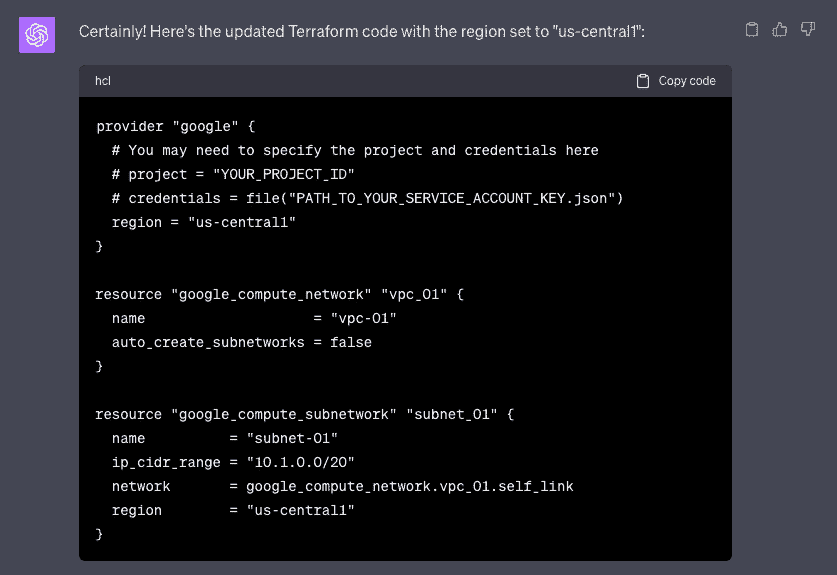

# 第九章：推荐策略和最佳实践

恭喜你已完成本书的最后一章！最后几章主要专注于提供实践经验，帮助你在云端构建更复杂的渗透测试实验室。如果你花时间理解了本书中的实践示例和解决方案，那么你应该对自己目前的知识和技能能达到的成就更有信心了。在这一章中，我们将建立在你前几章学到的基础上，探索如何将工作提升到一个新高度！

本章将涵盖以下内容：

+   提高渗透测试实验室环境的复杂性

+   利用生成性人工智能估算渗透测试实验室的成本

+   释放 AI 驱动工具的强大功能，加速自动化脚本开发

+   使用人工智能驱动的解决方案生成和解释 IaC 模板代码

+   在构建和自动化实验室环境时，识别相关考虑因素和实际策略

牢记这些，让我们开始吧！

# 技术要求

在开始之前，你必须准备好以下内容：

+   已安装并设置好的 `Visual Studio Code`（**VS Code**）本地开发环境

+   `GitHub Copilot` 已设置并配置与 VS Code – 请使用以下链接注册免费试用订阅（**个人版 Copilot**）：[`github.com/features/copilot`](https://github.com/features/copilot)。确保安装并完全配置了 **GitHub Copilot 扩展**。你可以查看以下链接了解更多信息：[`docs.github.com/en/copilot/getting-started-with-github-copilot?tool=vscode`](https://docs.github.com/en/copilot/getting-started-with-github-copilot?tool=vscode)。

+   `GitHub Copilot Labs` 已设置并配置与 VS Code – 请使用以下链接注册：[`githubnext.com/projects/copilot-labs/`](https://githubnext.com/projects/copilot-labs/)。确保安装并完全配置了 **GitHub Copilot Labs 扩展**。你可以查看以下链接了解更多信息：[`marketplace.visualstudio.com/items?itemName=GitHub.copilot-labs`](https://marketplace.visualstudio.com/items?itemName=GitHub.copilot-labs)。

+   `Amazon CodeWhisperer` 配置并与 VS Code 配合使用 – 我们将使用 `CodeWhisperer Professional` 版进行单用户使用 ([`aws.amazon.com/codewhisperer/pricing/`](https://aws.amazon.com/codewhisperer/pricing/))。在我们安装并配置 CodeWhisperer 扩展到 VS Code 之前，我们需要完成以下步骤：(1) 启用 **IAM 身份中心** 并创建 **AWS 组织**，(2) 创建 **IAM 组织用户**，(3) 为单个用户设置 CodeWhisperer，(4) 设置 `AWS Toolkit` 与 VS Code 配合使用 ([`aws.amazon.com/visualstudiocode/`](https://aws.amazon.com/visualstudiocode/))。确保安装并完全配置了 **CodeWhisperer 扩展**。你可以查看以下链接获取更多信息：[`docs.aws.amazon.com/codewhisperer/latest/userguide/whisper-setup-prof-devs.html`](https://docs.aws.amazon.com/codewhisperer/latest/userguide/whisper-setup-prof-devs.html)。

+   `Tabnine Pro` 配置并与 VS Code 配合使用 – 使用以下链接注册免费试用订阅（**Pro**）：[`www.tabnine.com/pricing`](https://www.tabnine.com/pricing)。确保安装并完全配置了 **Tabnine 扩展**。你可以查看以下链接获取更多信息：[`www.tabnine.com/install/vscode`](https://www.tabnine.com/install/vscode)。

+   `ChatGPT Plus` 账户 – 使用以下链接注册账户：[`chat.openai.com/auth/login`](https://chat.openai.com/auth/login)。由于我们将在本章中使用 **高级数据分析** 功能，因此需要升级我们的计划为 `ChatGPT Plus`，以便我们能够访问 GPT-4 以及其他仅对 ChatGPT Plus 用户提供的 beta 功能。

一旦这些准备就绪，你可以继续进行下一步。如果你不打算长期使用这些订阅，可以在完成本章中的实践示例后，随时取消订阅或降级当前的计划。

注意

为了避免与新添加的扩展产生冲突，你可以暂时禁用 VS Code 中所有已安装的扩展。*怎么做？* 点击 VS Code 窗口左侧边栏中的 **扩展** 图标。在 **扩展** 视图中，点击右上角的三个点（**···**）按钮，然后从上下文菜单中选择 **禁用所有已安装扩展**。不用担心，因为我们可以稍后轻松启用这些扩展。欲了解更多信息，可以查看以下链接：[`code.visualstudio.com/docs/editor/extension-marketplace`](https://code.visualstudio.com/docs/editor/extension-marketplace)。

本书中每章使用的源代码和其他文件可以在该书的 GitHub 仓库中找到：[`github.com/PacktPublishing/Building-and-Automating-Penetration-Testing-Labs-in-the-Cloud`](https://github.com/PacktPublishing/Building-and-Automating-Penetration-Testing-Labs-in-the-Cloud)。

# 增加渗透测试实验室环境的复杂度

如果你曾经去过一个攀岩（室内岩壁）馆，你会发现渗透测试实验室环境与充满各种难度攀岩墙的室内设施非常相似。就像室内攀岩馆为攀岩者提供了一个受控的环境，让他们锻炼和练习攀岩技巧一样，渗透测试实验室为网络安全专业人士提供了一个隔离的环境，用于练习和完善他们的黑客技术。这两种环境通过增加复杂性和难度，挑战用户，推动他们的极限。考虑到这些环境是为了模拟现实世界的挑战和障碍而建立的，我们应该预期这些环境会不断发展和增长复杂度，以便为用户提供新的挑战。

在本节中，我们将讨论如何进一步发展并增加我们在本书前几章中构建的渗透测试实验室环境的复杂性。让我们从我们在*第四章*中准备的实验室环境开始，*设置隔离的渗透测试实验室环境* *在 GCP 上*。


图 9.1 – 我们在 GCP 中的渗透测试实验室环境的高层次图示

在这个实验室设置中，我们有一个隔离的网络，用来保护实验室环境资源免受外部攻击。这个隔离的网络环境由两个 VPC 组成，并且这两个 VPC 网络通过一个 VPC 对等连接桥接在一起。我们在第一个 VPC 内部署了一个目标虚拟机实例，而攻击者虚拟机实例则位于另一个 VPC 内。在目标虚拟机实例内部，我们有一个运行着故意存在漏洞的应用程序的容器，名为`OWASP Juice Shop`。虽然我们本可以在虚拟机实例中添加更多易受攻击的服务、应用程序和容器，但为了简化设置工作，我们决定只保留一个运行的容器。除此之外，我们还可以在 VPC 内启动更多的虚拟机实例。*如果我们有更多的时间（以及更多的页面空间）来设置一个更复杂的* *实验室环境，会怎么样呢？*

让我们设想一个假想的实验室环境（类似于*图 9.2*中所示），该环境由运行在`Google Cloud Platform`（**GCP**）账户中的各种云资源组成。在这个新的实验室环境中，我们有三个虚拟机实例，它们分别运行着易受攻击的服务、应用程序和容器：(1) `vm-target`，(2) `vm-target-02`，和(3) `vm-target-03`。


图 9.2 – 渗透测试实验室环境的更复杂版本

第一个目标虚拟机实例（**vm-target**）类似于我们在*第四章*，*在 GCP 上设置隔离渗透测试实验室环境*中准备的目标虚拟机实例。为了增加一点趣味性，我们还将在这个实例（**vm-target**）内运行更多的容器，这些容器将运行存在漏洞的应用和服务。除此之外，类似于我们在*第五章*，*在 Azure 上设置隔离渗透测试实验室环境*中所做的，我们可以配置一些容器以`--privileged`标志运行。这将允许实验室用户练习容器突破技巧。第二个目标虚拟机实例（**vm-target-02**）是一个新的虚拟机实例，运行不同的操作系统。该实例将运行各种漏洞服务，不涉及容器。我们还有第三个目标虚拟机实例（**vm-target-03**），它运行一组不同的漏洞应用和服务。网络配置被设置为不允许攻击者虚拟机实例直接访问第三个目标虚拟机实例（**vm-target-03**）。这将迫使实验室用户先攻破第二个目标虚拟机实例（**vm-target-02**），并利用它访问第三个目标虚拟机实例（**vm-target-03**），这类似于我们在*第六章*，*在 AWS 上设置隔离渗透测试实验室环境*中设置的“横向渗透”实验。最后，通过第三个目标虚拟机实例（**vm-target-03**），可以通过服务账户访问一个带有旗标的云存储桶。

为了进一步增加实验环境的复杂性，我们可以将第三个目标虚拟机实例（**vm-target-03**）替换为一个设计上存在漏洞的`Kubernetes`集群环境，类似于*图 9**.3*所示：


图 9.3 – 包括一个设计上存在漏洞的集群环境

如果这是你第一次了解 Kubernetes，它是一个流行的开源容器编排系统，提供了一个框架来运行具有弹性的分布式系统。通过搭建这个设计上存在漏洞的 Kubernetes 集群，用户可以在隔离的环境中获得有关各种攻击场景的实践经验。在这个集群中，我们将涉及多种场景，包括`OWASP Kubernetes Top 10`中讨论的配置错误、风险和漏洞。这些场景可能包括过于宽松的**基于角色的访问控制**（**RBAC**）配置、破损的认证机制、不安全的工作负载配置导致的容器突破等。

注意

有关此主题的更多信息，请访问以下链接：[`owasp.org/www-project-kubernetes-top-ten/`](https://owasp.org/www-project-kubernetes-top-ten/)。

除了 Kubernetes 集群，我们还可以引入类似于*图 9**.4*所示的`Windows Active Directory`设置。


图 9.4 – 包括一个 Windows Active Directory 实验室

在这里，我们有两个 Windows 虚拟机实例，类似于我们在*第八章*中准备的内容，*设计和构建易受攻击的 Active Directory 实验室*。其中一个虚拟机实例将作为域控制器（**vm-target-03**），另一个则是作为工作站机器（**vm-target-04**），并且会加入到域中。当然，我们可以向这个设置中添加更多的机器，使实验室环境看起来更真实。为了增加一点难度，我们可以让 Windows 虚拟机实例不能直接从攻击者机器访问，并要求先让第二个目标虚拟机实例（**vm-target-02**）被攻破，再通过它来访问和攻击域控制器实例（**vm-target-03**）和工作站机器实例（**vm-target-04**）。

重要提示

在设计实验室环境时，必须考虑到所关注的渗透测试技能（或技术），因为根据我们希望实验室用户在实验室环境中执行的技术和操作，某些实验室组件是必需的。除此之外，了解谁将使用该实验室也非常重要，这有助于我们识别实验室用户的经验水平。这将帮助我们管理实验室环境中各个部分的不同难度等级。也就是说，我们可以通过添加 Web 应用防火墙来提高实验室中某些部分的复杂性和难度，让实验室用户能够练习更高级的 Web 渗透测试技术。我们还可以通过添加特定的资源，例如**入侵防御系统**（**IPS**），进一步提高难度，以便练习规避技术。

另一种可能性是拥有一个更复杂的实验室设置，包含所有这些内容！当然，这将涉及在实验室环境中运行云资源的显著更高成本。此外，我们还需要在自动化部署我们渗透测试实验室设置中的各种组件上投入更多时间。此时，您可能会想知道我们如何能显著加速复杂实验室环境的准备！好消息是，现在我们有了 AI 驱动的解决方案，可以帮助我们完成各种任务，比如估算渗透测试实验室成本、生成自动化脚本和**基础设施即代码**（**IaC**）模板，以及解释其他工程师和专业人士编写的现有代码。在本章的下一节中，我们将看到这一点的实际应用！

# 利用生成性 AI 来估算渗透测试实验室成本

我们设计渗透测试实验室环境的方式，可能会对在云中运行这些实验室的整体成本产生重大影响。某些实现方式和变化可能需要比其他方式更多的资源，这会导致成本增加。通过仔细考虑我们的实验室架构设计，我们可以找到在不影响渗透测试实验室环境的质量、性能和稳定性的情况下降低成本的机会。估算运行这些环境时的相关费用是另一个至关重要的方面，因为这可以帮助安全专业人员（和团队）规划预算，并在长期内维持可持续的实验室设置。

在*第六章*，*在 AWS 上设置隔离的渗透测试实验室环境*中，我们准备了一个实验室设置，可以在其中练习网络跳板技术。如果你已经忘记了，下面是一个简化的示意图，展示了我们的实验环境是什么样子的：


图 9.5 – 第六章中的实验环境设置

在这里，我们有一个攻击者虚拟机（VM）实例运行在一个 VPC 网络内，另外两个目标虚拟机（VM）实例运行在另一个 VPC 网络内。*你是否曾经想过运行这个实验环境的费用是多少？*虽然可以手动计算费用，但我们可以利用生成型 AI 工具、功能和插件来帮助我们自动估算和计算费用！

在*第七章*，*设置 IAM 权限提升实验室*中，我们首次探讨了如何利用生成型 AI 解决方案自动生成渗透测试模拟和活动的代码。这里还有更多内容！在本节中，我们将使用**ChatGPT 高级数据分析**帮助我们通过 Terraform 配置文件估算费用，这些文件用于生成实验环境。我们只需要输入正确的提示，让 AI 模型为我们生成费用计算和见解。很棒，对吧？

有了这些信息后，让我们继续估算运行实验环境相关的费用：

1.  前往本书的 GitHub 仓库，找到我们用来为*第六章*，*在 AWS 上设置隔离的渗透测试实验室环境*准备实验环境时使用的 ZIP 文件。你可以使用以下链接帮助你找到该 ZIP 文件：

    ```
    https://github.com/PacktPublishing/Building-and-Automating-Penetration-Testing-Labs-in-the-Cloud/blob/main/ch06/pentest_lab.zip
    ```

    找到并点击**下载原始文件**按钮（位于页面右上角的**原始**按钮附近）。这将把 GitHub 仓库中的`pentest_lab.zip`文件下载到你的本地机器上。

1.  在新的浏览器标签页中，使用以下 URL 访问你的`ChatGPT Plus`账户：[`chat.openai.com/`](https://chat.openai.com/)。确保在继续之前配置你的账户，启用**高级数据分析**功能。

    图 9.6 – 启用高级数据分析

    启用**高级数据分析**将允许我们自动化复杂的数据计算，并从上传的文件中分析有价值的信息。没错，你没听错！我们可以上传文件并利用 AI 模型的能力生成详细分析、可视化趋势，并直接从上传的数据中提取有意义的模式。

重要提示

截至写作时，**高级数据分析**处于测试版阶段。等到你阅读这本书时，它可能已经脱离测试阶段了！

1.  创建一个新的聊天会话并选择`GPT-4`（或最新版本，仅对 ChatGPT Plus 用户可用）：

    图 9.7 – 为我们的聊天会话选择 GPT-4 和高级数据分析

    确保选择了**高级数据分析**（而不是**默认**），类似于我们在*图 9.7*中看到的那样。

1.  点击`+`按钮（在*图 9.8*中突出显示）：

    图 9.8 – 上传 pentest_lab.zip 文件

    上传我们在之前步骤中下载到本地计算机的`pentest_lab.zip`文件。

    重要提示

    现在不要按*Enter*键或点击**发送消息**按钮，因为我们将在下一步中指定提示。

1.  在文本框中输入以下提示：

    ```
     Analyze what this zip file contains
    ```

    然后按*Enter*键提交上传的文件和提示。这应该会生成类似于*图 9.9*所示的响应：

    

    图 9.9 – 分析 ZIP 文件包含的内容

    当被问到类似于**你是否需要简要概述每个` `文件的内容？**的问题时，只需输入**无需**。

重要提示

请注意，即使使用相同的提示，你也可能会从 ChatGPT 获得不同的响应。话虽如此，随时可以根据需要修改和调整你的提示。

1.  打开一个新的浏览器标签页，访问 [`instances.vantage.sh/`](https://instances.vantage.sh/)。这应该会打开一个用于比较不同 EC2 实例类型的网页！[](image/B19755_09_10.jpg)

    图 9.10 – 用于比较不同 EC2 实例类型的网页

    点击*图 9.10*中突出显示的**导出**按钮。这将把**Amazon EC2 实例比较.csv**文件下载到你本地计算机的**下载**文件夹（或其他文件夹）。

1.  返回到我们打开 ChatGPT 会话的浏览器标签页。

1.  现在，让我们计算在 Terraform 配置文件中指定的每个 EC2 实例的月度成本。我们可以通过上传**Amazon EC2 实例比较.csv**文件并输入以下提示来实现：

    ```
     How many EC2 instances will be created overall (based from all files extracted from the pentest_lab.zip file)? Provide as much details as possible including cost per month. Use the uploaded Amazon EC2 Instance Comparison.csv as a reference when computing the overall cost.
    ```

    这将产生以下（最终）输出：

    

    图 9.11 – EC2 实例的月度成本分解

    在这里，我们可以看到 ChatGPT 成功地返回了我们之前上传的 ZIP 文件中 Terraform 配置文件中标识的 EC2 实例的月度成本细分。为了简化问题，我们只考虑了在本示例中运行 EC2 实例的成本。请注意，我们还必须考虑其他费用，以获取更准确的月度成本估算。这些包括数据传输费用、附加到 EC2 实例的 EBS 卷的存储成本，以及使用账户中其他服务可能产生的费用。

重要提示

通过确定实验室设置的哪些组件和资源对总成本贡献最大，我们可以将优化工作集中在这些领域，以实现最大的成本节约。

1.  由于我们不计划资源运行一个整月，让我们输入以下提示，并指定我们只会让资源运行 6 小时：

    ```
     Instead of a month, I'll be running the resources for 6 hours and then I'll destroy the resources. How much would it cost to run the resources?
    ```

    这应该产生类似于图 `9`.12 的响应：

    

    图 9.12 – 运行资源 6 小时而不是 1 个月的估算成本

    这次，我们有运行 EC2 实例 6 小时的估算成本（而不是一个月）。*很酷，对吧？*

重要提示

管理成本最简单但最有效的方法之一是确保资源在未被积极使用时关闭或删除。实验环境通常由多个虚拟机、数据库和其他资源组成，这些资源对总成本的贡献最大。通过设置自动化脚本（用于创建和删除资源），我们可以确保这些资源仅在需要时运行。

1.  让我们通过以下提示进一步生成条形图：

    ```
     Generate a bar chart comparing the costs per Terraform file
    ```

    这应该给我们以下输出：

    

    图 9.13 – 每个 Terraform 文件关联的成本的条形图比较

    在这里，我们可以看到成本的大部分来自于 `network_02.tf` 中定义的资源。再次注意，我们在生成条形图时仅考虑了运行 EC2 实例的成本。

1.  为了帮助我们确定我们的 Terraform 文件中哪些代码块对总成本有贡献，请输入以下提示：

    ```
     Identify which Terraform blocks of code have a contribution to the overall cost
    ```

    这应该给我们以下输出：

    

    图 9.14 – 确定哪些代码块对总成本有贡献

    看起来 ChatGPT 成功识别并提供了（简化的）与 EC2 实例成本相关联的资源块！

1.  最后，让我们输入以下提示：

    ```
     Update the previous answer by changing the instance type of the vm_kali EC2 instance from t3.medium to m5.large
    ```

    这应该返回以下响应：

    

    图 9.15 – 检查更新实例类型对估算成本的影响

    在图 `9`.15 中，我们可以看到与 `vm_kali` 资源相关的成本也已自动更新。

    为了适应各种工作负载，云服务商提供了性能水平和成本各不相同的实例类型。通过正确评估将要在云资源中运行的应用程序、服务和工具的性能要求，我们将能够选择合适的实例类型。这样，我们就能做出明智的决策，帮助我们有效管理和大幅减少成本。

重要说明

除了使用 Terraform 配置文件创建的初始资源外，我们还必须考虑实验室环境用户可能创建的任何额外资源（在他们使用实验室时）。如果实验室环境用户能够创建可能非常昂贵的云资源呢？如果用户生成了大量网络流量呢？在一个允许用户创建云资源的实验室环境中，至关重要的是要实施安全措施，以防止意外或故意的过度支出。

到这个阶段，我们应该已经有了一个很好的思路，如何利用生成性人工智能解决方案来估算在云中运行渗透测试实验室环境的成本。我们刚刚讨论的示例场景只是生成性人工智能的众多实际应用之一。值得注意的是，人工智能驱动的解决方案的能力*远远超出*这一示例场景！在本章的后续部分，我们将看到更多相关内容。

# 利用人工智能驱动的工具释放其潜力，加速自动化脚本开发

完全自动化创建和删除渗透测试实验室环境，将大大帮助我们降低在云中运行这些实验室环境的成本。尽管潜在的好处是不可否认的，但实际上，*完全* *自动化* 实验室环境的准备工作并不像听起来那么简单。编写自动化脚本需要时间、技能和精力，有时可能需要一个经验丰富（且昂贵）的工程师团队来确保任务的顺利完成。

或许人工智能驱动的工具能帮忙！除了 ChatGPT，还有许多其他人工智能解决方案可以帮助我们显著加快渗透测试实验室环境自动化脚本的准备过程。在这一部分，我们将深入了解`GitHub Copilot`、`Amazon CodeWhisperer` 和 `Tabnine` 等人工智能驱动的工具，看看它们如何帮助我们加速自动化脚本开发。这些前沿工具利用机器学习和自然语言处理技术加速代码编写和脚本开发过程。这些工具通过建议代码片段、自动完成代码行，甚至通过注释生成代码块来帮助开发人员。很神奇吧？

重要说明

确保你已按照本章开始部分的*技术要求*部分，完全设置好`GitHub Copilot`、`Amazon CodeWhisperer`和`Tabnine`扩展。这些扩展的设置和所有先决条件可能需要大约 15 分钟来完成。

让我们在接下来的步骤中看到这些 AI 驱动的工具是如何工作的。

## 第一部分/共 3 部分 – 利用 GitHub Copilot 加速 Shell 脚本编写

现在，让我们尝试使用 GitHub Copilot 来帮助加速准备一个示例脚本，该脚本可以在我们的 GCP 账户中创建特定的实验环境资源：

1.  让我们首先确保禁用所有 VS Code 扩展。这将帮助防止与新添加的 AI 扩展发生冲突！[](image/B19755_09_16.jpg)

    图 9.16 – 在 VS Code 中禁用所有已安装的扩展

    点击 VS Code 窗口左侧边栏的**扩展**图标。在**扩展**视图中，点击三个点（**···**）按钮，并从右键菜单中选择**禁用所有已安装的扩展**。

注意

随时查看[`code.visualstudio.com/docs/editor/extension-marketplace`](https://code.visualstudio.com/docs/editor/extension-marketplace)以了解有关此主题的更多信息。

1.  现在，让我们启用 GitHub Copilot 扩展。在**扩展：市场**视图中，我们应该能看到顶部的搜索框。在这个搜索框中输入`GitHub Copilot`来找到我们需要启用的扩展！[](image/B19755_09_17.jpg)

    图 9.17 – 启用 GitHub Copilot 扩展

    浏览扩展列表，找到`GitHub Copilot`扩展。右键点击该扩展，然后从右键菜单中选择**启用**。

注意

在继续之前，确保设置已完成。在某些情况下，VS Code 可能会提示你重新启动应用程序。如果出现提示，请重新启动 VS Code。

1.  在启用我们的 AI 扩展后，让我们继续创建一个名为`copilot.sh`的新文件。

1.  在我们脚本文件的第一行输入以下内容：

    ```
     #!/bin/bash
    ```

1.  接下来，添加以下代码行（在第二行或第三行）：

    ```
     BUCKET_NAME=<BUCKET NAME>
    ```

    确保将`<BUCKET NAME>`替换为一个全球唯一的桶名称（用于尚未创建的桶）。

1.  在第四或第五行，输入以下单行注释：

    ```
     # Create a new Google Cloud Storage bucket using the gsutil command
    ```

    此时，我们的`copilot.sh`脚本文件应类似于*图 9.18*中所示：

    

    图 9.18 – 输入单行注释

    在这里，你可以看到我们已经为`<BUCKET NAME>`占位符指定了`my-sample-bucket-abc123`。

1.  按下*Enter*键。你应该看到以下自动生成的建议代码：

    图 9.19 – Copilot 建议一行代码

    在这里，我们可以看到 GitHub Copilot 建议将`gsutil mb gs://$BUCKET_NAME`作为脚本文件中的下一行！

注意

请注意，在此示例中工作时，您可能会收到不同的建议。

1.  按*Tab*键接受建议并完成代码。

1.  现在，添加以下代码行（在我们文件中现有的代码行之后）：

    ```
     echo "FLAG!" > flag.txt
    ```

1.  接下来，输入以下单行注释（在新的一行中）：

    ```
     # Upload the flag.txt file to the Cloud Storage bucket
    ```

    按*Enter*键。你应该会看到以下建议的代码自动生成：

    

    图 9.20 – Copilot 建议一行代码

    在这里，我们可以看到 GitHub Copilot 为我们脚本文件中的下一行代码建议了`gsutil cp flag.txt gs://$BUCKET_NAME`！

重要提示

不要按*Tab*键，因为我们将首先检查其他建议！

1.  按右箭头键（*→*）几次查看其他建议，类似于我们在*图 9.21*中的内容：

    图 9.21 – 使用箭头键检查其他建议

    按*Tab*键接受建议并完成代码。此时，我们已经准备好了一个小脚本！重要的是要注意，AI 工具/扩展生成的代码可能并不总是有效。使用之前，务必仔细检查、运行和测试生成的代码。

注意

本书中我们不会讨论 GitHub Copilot 的所有功能。请随时查看以下视频（*开始使用编程的未来：GitHub Copilot*）以获取更多关于此主题的信息：[`www.youtube.com/watch?v=Fi3AJZZregI`](https://www.youtube.com/watch?v=Fi3AJZZregI)。

## 第二部分中的第三部分 – 使用 Amazon CodeWhisperer 加速 Python 编码

现在，让我们尝试使用 Amazon CodeWhisperer 在编写我们在*第七章*中准备的部分脚本时提供帮助，*设置 IAM 权限升级实验*：

1.  让我们首先确保禁用所有 VS Code 扩展，以避免与新添加的 AI 扩展发生任何冲突。点击 VS Code 窗口左侧边栏中的**扩展**图标。在**扩展**视图中，点击三个点（**···**）按钮，然后从上下文菜单中选择**禁用所有已安装的扩展**。

1.  现在，让我们启用`AWS Toolkit`扩展。在**扩展：市场**视图中，我们应该能看到顶部的搜索栏。在搜索栏中输入`CodeWhisperer`以定位我们需要启用的扩展。

    图 9.22 – 启用 AWS Toolkit 扩展

    向下滚动扩展列表，找到`AWS Toolkit`扩展。右键点击该扩展，然后从上下文菜单中选择**启用**。

注意

当提示出现**连接已过期。要继续使用 CodeWhisperer，请使用 AWS Builder ID 或 AWS IAM 身份中心进行连接。**时，点击**与 AWS 连接**按钮，并确保在继续之前完成设置。

1.  在我们的 AI 扩展已经启用的情况下，接下来创建一个名为`whisperer.py`的新文件。

1.  让我们从输入以下单行注释开始（在第一行）：

    ```
     # Function that uses boto3 to return the STS caller identity
    ```

1.  按*Enter*键。你应该会看到以下建议的代码（或类似的代码）被自动生成：

    ```
     get_caller_identity():
    ```

    请注意，在进行此示例时，你可能会得到不同的建议。

重要提示

现在不要按*Tab*键，因为我们将首先检查其他建议！

1.  按右箭头键（*→*）几次，以查看其他建议，类似于*图 9.23*中的内容：

    图 9.23 – 使用箭头键检查其他建议

    在这里，我们可以看到，接受当前建议的代码块会自动添加`import boto3`。

1.  按*Tab*键接受建议并完成代码。

1.  在新的一行中，输入`if`并在其后加一个空格（类似于*图 9.24*中的显示）。你应该会看到 Amazon Whisperer 建议几行代码，这些代码将调用我们刚定义的函数：

    图 9.24 – 来自 Amazon CodeWhisperer 的更多代码建议

    按*Tab*键接受建议并完成代码。此时，我们已准备好一个小型 Python 脚本！需要注意的是，AI 工具和扩展生成的代码可能并不总是有效。务必在实际项目中使用之前，仔细审查、运行并测试所生成的代码。

注

本书中我们不会深入探讨 Amazon CodeWhisperer 的功能。您可以查看以下视频（*Amazon CodeWhisperer 概述*）了解更多关于此主题的信息：[`www.youtube.com/watch?v=j8BoVmHKFlI`](https://www.youtube.com/watch?v=j8BoVmHKFlI)。

## 第三部分，共 3 部分 – 使用 Tabnine Pro 更快编写 PowerShell 脚本

现在，让我们尝试使用 Tabnine Pro 加速准备一个示例 PowerShell 脚本，该脚本可以帮助我们审查和管理我们 Microsoft Azure 账户中的资源：

1.  首先，确保禁用所有 VS Code 扩展，以避免与新添加的 AI 驱动扩展发生冲突。点击 VS Code 窗口左侧边栏中的**扩展**图标。在**扩展**视图中，点击三点（**···**）按钮，从上下文菜单中选择**禁用所有已安装的扩展**。

1.  现在，让我们启用`Tabnine`扩展。在**扩展：市场**视图中，我们应该看到顶部有一个搜索框。在这个搜索框中输入`Tabnine`，以找到我们需要启用的扩展。

    图 9.25 – 启用 Tabnine 扩展

    滚动浏览扩展列表，找到`Tabnine: AI Autocomplete & Chat for Javascript, Python, Typescript, PHP, Go, Java & more`扩展。右键点击该扩展，然后从上下文菜单中选择**启用**。

注

在继续之前，确保设置已经完成。在某些情况下，VS Code 可能会提示你重新启动应用程序。如果有提示，请继续并重新启动 VS Code。

1.  在我们的 AI 扩展已经启用的情况下，接下来我们将创建一个名为`tabnine.ps1`的新文件。

1.  在我们的脚本的第一行键入以下单行注释：

    ```
     # List all resource groups in the Azure account using the Azure CLI
    ```

1.  按下*Enter*。你应该会看到以下自动生成的建议代码（或类似代码）：

    ```
     az group list --output table
    ```

    很棒吧？

注意

请注意，在进行此示例时，您可能会收到不同的建议。

1.  按下*Tab*键接受建议并完成代码。

1.  现在，在新的一行中键入以下注释：

    ```
     # For each resource group, list down all resources inside
    ```

1.  按下*Enter*。你应该会看到自动生成的以下建议代码：

    图 9.26 – Tabnine 建议的代码行

    在这里，我们可以看到 Tabnine 生成的一个建议。请注意，在进行此示例时，您可能会收到不同的建议。

重要提示

还不要按*Tab*，因为我们将先检查其他建议！

1.  按下右箭头键（*→*）几次，以查看其他建议，类似于*图 9.27*中所示：

    图 9.27 – 使用箭头键检查其他建议

    按下*Tab*键接受类似于*图 9.27*中所示的建议。如果末尾有一行多余的三重反引号（`````), feel free to delete the extra line manually. At this point, we have a small PowerShell script ready for use! It is important to note that the code generated by the AI tool/extension may not always work. Make sure to review, run, and test the code generated thoroughly before using it in a real project.

Note

We won’t dive deep into the features of Tabnine in this book. Feel free to check the following video (*Become a Tabnine expert in 40 minutes!*) for more information about this topic: [`www.youtube.com/watch?v=XXERCwezdsQ`](https://www.youtube.com/watch?v=XXERCwezdsQ).

At this point, we should have a good idea of how to use AI-powered tools to accelerate the preparation of automation scripts for building our penetration testing lab environments. Given the time-consuming nature of manually coding automation scripts, these tools will allow us to build complex lab environments faster. In addition to using AI-powered tools that suggest blocks of code automatically for us, we can also utilize various tools that automatically format our code to help us manage and maintain code quality. By using these tools, we can reduce potential errors and enhance the overall readability of our code as well.

In the next section, we will take a closer look at how AI-powered solutions can automatically generate IaC templates for us. In addition to this, we’ll see how these solutions can also be used to explain existing code prepared by other engineers or developers.

# Using AI-powered solutions to generate and explain IaC template code

In the previous chapters of this book, we manually prepared the Terraform template code for setting up various penetration testing lab environments on AWS, Azure, and GCP. If you’ve actually worked on the hands-on examples and solutions in the previous chapters, you are probably aware that it takes a significant amount of time to code and prepare these IaC templates from scratch! To accelerate the preparation of IaC template code, we can use AI-powered solutions to generate code automatically using the right set of prompts. In addition to this, we can use these tools to explain existing code as well.

In this section, we will take a closer look at how AI-powered solutions such as ChatGPT and GitHub Copilot Labs can be used to generate and explain IaC template code. You’ll see how we can use these tools to significantly speed up the process of reading and writing code.

Important note

Make sure that you have a `ChatGPT Plus** account ready before proceeding. In addition to this, make sure that the **GitHub Copilot Labs` extension is set up (completely), as specified in the *Technical requirements* section at the start of this chapter.

Let’s proceed with using these AI-powered tools in the next set of steps.

## Part 1 of 2 – Using ChatGPT to generate Terraform templates

1.  In a new browser tab, access your `ChatGPT Plus** account using the following URL: [`chat.openai.com/`](https://chat.openai.com/). Ensure that you configure your account to have **Advanced Data Analysis` enabled before proceeding.
2.  Create a new chat session and select `GPT-4` (or the latest model available exclusively to ChatGPT Plus users):

    Figure 9.28 – Selecting GPT-4 and Advanced Data Analysis for our chat session

    Make sure that `Advanced Data Analysis** is selected (instead of **Default**), similar to what we have in *Figure 9`.28*.

1.  Now, type the following prompt inside the text bar:

    ```）。

    生成 Terraform 代码以在 GCP 中创建以下资源：

    - 一个名为 vpc-01 的 VPC，包含一个子网 subnet-01

    - VPC vpc-01 的自动创建子网配置应设置为 false

    - 子网 subnet-01 应具有以下 IP CIDR 范围：10.1.0.0/20

    确保生成的 Terraform 代码有效

    ```

    Press the *Enter* key afterward to submit the prompt. This should yield a response similar to what is shown in *Figure 9**.29*:

    

    Figure 9.29 – Generating Terraform template code using ChatGPT

    Here, we can see that ChatGPT was able to generate the Terraform template code using the prompt we just submitted. Amazing, right?

1.  Let’s build on top of the previous answer and enter the following prompt:

    ```

    使用“us-central1”作为区域来更新之前的答案

    ```

    This will yield the following response from ChatGPT:

    

    Figure 9.30 – Building on top of the previous answer

    We can see in *Figure 9**.30* that we were able to successfully modify the code from the previous answer using the prompt we just entered.

1.  Finally, let’s have ChatGPT draw a diagram for us using the following prompt:

    ```

    绘制一张图来帮助可视化这个网络环境的样子

    ```

    This should give us the following output:

    

    Figure 9.31 – Network environment diagram

    Here, we can see that ChatGPT is able to draw a simple diagram to help us visualize what our network environment looks like. You may click the `Show work` button to view the code used to construct the diagram.

Important note

Feel free to use Terraform to convert the generated template code into actual resources in your GCP account. Note that the `Compute Engine API** must first be enabled before using the **terraform apply` command to create the resources.

## Part 2 of 2 – Using GitHub Copilot Labs to explain existing Terraform templates

Now, let’s use GitHub Copilot Labs to explain the existing Terraform template code. Let’s start by making sure that all VS Code extensions are disabled to avoid any conflict that may arise with the newly added AI-powered extensions:

1.  Click on the `Extensions** icon in the sidebar on the left side of the VS Code window. In the **Extensions** view, click the three dots (`···`) button and select **Disable All Installed Extensions` from the list of options available in the context menu.
2.  Now, let’s enable the GitHub Copilot Labs extension. In the `EXTENSIONS: MARKETPLACE** view, we should see a search bar at the top. Type **GitHub Copilot Labs` in this search bar to locate the extension we need to enable.

    Figure 9.32 – Enabling the GitHub Copilot Labs extension

    Scroll through the list of extensions to find the `GitHub Copilot Labs** extension. Right-click on the extension and then select **Enable` from the list of options available in the context menu.

Note

Make sure that the setup is complete before proceeding. In some cases, VS Code may prompt you to restart the application. If prompted, go ahead and restart VS Code.

1.  With the extension enabled, let’s proceed by creating a new file in VS Code named `copilot_labs.tf`.
2.  Navigate to this book’s GitHub repository and locate the resource block for defining the attacker VM instance in *Chapter 4*, *Setting Up Isolated Penetration Testing Lab Environments on GCP*. Feel free to use the following link to help you locate the ZIP file:

    ```

    https://github.com/PacktPublishing/Building-and-Automating-Penetration-Testing-Labs-in-the-Cloud/blob/main/ch04/pentest_lab/attacker_vm/main.tf

    ```

1.  将代码（从浏览器中）复制并粘贴到我们在前面步骤中创建的`copilot_labs.tf`文件（在 VS Code 中）。

1.  点击 VS Code 窗口左侧边栏中的`GitHub Copilot Labs`图标。

1.  突出显示创建`vm-kali`攻击者虚拟机实例的资源块对应的代码：

    图 9.33 – 使用 GitHub Copilot Labs 解释突出显示的代码

    确保在点击`Ask Copilot`按钮之前选择了`Explain code`。点击`Ask Copilot`按钮将产生以下结果：

    

    图 9.34 – 点击 Ask Copilot 按钮后的结果

    在这里，我们可以看到我们能够使用 GitHub Copilot 来帮助我们解释和说明现有的代码块。试想一下在更长、更复杂的代码库中使用这个工具！很棒吧？阅读代码和编写代码同样重要。当你在构建复杂的渗透测试实验室环境时，与更大的团队合作，你会意识到你花更多时间阅读代码（由其他成员编写）而不是编写新的代码。

重要提示

我们在本书中不会深入探讨 GitHub Copilot Labs 扩展的功能。如果您需要更多信息，请随时查看以下链接：[`githubnext.com/projects/copilot-labs/`](https://githubnext.com/projects/copilot-labs/)。

到目前为止，我们应该已经对 AI 驱动的工具如何帮助我们更快地读取和编写 IaC 模板代码有了一个清晰的了解。在本节结束之前，重要的是要注意，尽管这些工具确实能加速代码的生成和解释，但它们的输出有时可能包含不准确、次优配置甚至安全漏洞。因此，在使用这些工具时，我们必须谨慎行事。

# 识别在构建和自动化实验室环境时需要考虑的相关事项和实际策略

本书已经进入最后一个主要章节！在本章前面的几个部分中，我们学习了如何使用各种 AI 驱动的解决方案和工具来加速和自动化构建实验室环境时的相关任务。除了我们已经讨论过的策略和解决方案外，在构建云端渗透测试实验室环境时，还有一些我们必须考虑的事项和推荐的实践。

这是设计实验室环境时我们应考虑和规划的事项的快速列表：

+   **确定实验室的目的**：在设计和构建实验室环境之前，重要的是我们要明确为何要构建实验室。我们需要了解实验室的使用目的，因为这将决定实验室环境所需的资源和配置。例如，可能我们是专门为**漏洞开发**而构建实验室环境。也许我们正在为**红队**和**蓝队**构建实验室环境，以模拟现实世界中的攻防场景。还可能我们是在构建一个实验室环境，用于测试 AI 驱动的渗透测试工具，如`PentestGPT`。考虑到构建实验室的目的多种多样，明确并理解我们要设置的实验室目的非常重要，以便设计出最符合需求的环境。

+   **确定实验室环境的用户数量**：实验室资源可能由多个实验室用户共享（或不共享），这些用户扮演攻击者的角色。如果渗透测试实验室环境是共享的，那么运行实验室环境的整体成本可能会较低。然而，这可能会影响尝试攻击并妥协相同资源集的实验室用户的体验。

+   **确定实验室环境的规模**：渗透测试实验室环境不需要与企业公司的网络环境规模相同。这是因为拥有更多资源会带来更高的成本，尤其是在云中运行实验室环境时。

+   **识别哪些攻击或技术在云环境中是不允许的**：了解哪些攻击和技术对实验室环境有害并被云服务提供商禁止是至关重要的。如在*《构建云中渗透测试实验室环境时需要考虑的因素》*章节中所讨论的内容，*《云中渗透测试实验室入门》*一书提到，云服务提供商有一些政策和指南，在进行云中运行的应用程序渗透测试之前，我们需要先进行审查。如果不遵循这些指南，你的云账户可能会被暂停甚至终止！

看到只有四个考虑因素感到惊讶吗？当然，这只是其中的一部分！除了刚才讨论的内容外，我们还需要注意以下实施考虑事项和推荐实践：

+   **创建自定义漏洞应用程序与使用现有漏洞应用程序**：通过设计我们自己的“设计即漏洞”应用程序，我们可以完全控制应用程序中的复杂性以及安全弱点、漏洞和配置错误的类型。然而，创建自定义应用程序的一个主要缺点是这需要额外的时间和精力，尤其是当我们需要从零开始准备这些应用程序时。另一方面，使用现有的漏洞容器或应用程序（例如`Metasploitable`和**OWASP WebGoat**）可以在准备实验室环境时加速一些进程。

+   **确定自动化实验室环境某些组件的最佳方式**：有各种方法和工具可以自动化实验室资源和组件的设置与配置。与其仅仅使用 Terraform 来设置云资源，可能还需要使用像`Ansible`（或其他替代工具）进行配置管理。在这里，我们可以使用不止一个工具。一些工具可以专注于基础设施提供，而其他工具则处理配置管理。通过战略性地选择和组合工具，我们可以在构建渗透测试实验室环境的不同组件时，充分利用它们的独特优势。

+   **为实验室用户提供重置实验室设置中特定组件的功能**：在使用渗透测试实验室环境时，扮演攻击者角色的实验室用户可能会遇到需要将特定组件或资源恢复到初始状态的情况。因此，一个用于将特定虚拟机实例和其他云资源恢复到初始状态的“重置”按钮（或其他替代解决方案）会很有用。如果你在想他们接下来会做什么...当然，他们会再次尝试攻击并入侵这些资源！

+   **理解云平台差异**：了解不同云平台之间的主要和次要差异至关重要，因为这将影响我们如何设计和实现渗透测试实验室环境。除此之外，我们还需要时刻关注这些云服务提供商的公告，因为他们会不断更新服务、功能、定价模型，甚至是云资源的安全默认设置。

+   **执行行为规范**：为实验室用户维护**行为规范**有助于明确期望并为其在实验室环境中进行渗透测试活动和模拟时的行为制定指导方针。本文件应概述在云账户中设置的实验室内允许和不允许的事项。你还可以设置和安装各种监控工具，以便快速识别任何潜在违规行为，并确保实验室用户遵守规范。

+   **文档化设置**：适当的文档可以帮助新成员快速上手，他们也将维护相同的实验室环境，并能更快地解决问题。除此之外，良好的文档化设置能在多个部署或迭代的实验室中促进一致性。这将有助于确保实验室的配置是（误）按照预期方式进行的。请注意，这不仅仅是准备包含图示和逐步说明每个实验室组件如何配置的详细文档。这还包括编写自文档化代码，按需准备自动化测试，并在使用版本控制系统（如**Git**）管理自动化脚本和 IaC 模板时遵循最佳实践。

这里确实还有更多内容可以添加，但这些应该足够应付当前的需求了。可以随时反复阅读这一部分（或者根据需要阅读多次！），因为这些考虑因素和实践策略将帮助你管理在云中运行渗透测试实验室时涉及的风险和挑战。

# 摘要

在本章中，我们深入探讨了如何增加前几章中设置的渗透测试实验室环境的复杂性和难度。此外，我们还学习了如何利用各种基于 AI 的解决方案，如 ChatGPT、GitHub Copilot、Amazon CodeWhisperer 和 Tabnine，显著加快在构建这些有设计缺陷的实验室时的相关任务。这些任务包括估算在云中运行这些实验室的成本、生成自动化脚本和 IaC 模板，以及解释其他专业人士编写的现有代码。我们在本章的结尾讨论了在云中构建渗透测试实验室时的相关建议、注意事项和策略。

你终于读完了这本书！恭喜你完成了所有章节以及实际操作的例子和解决方案。闭上眼睛，花点时间回顾一下你所学到的一切。我希望这本书能够激励你开启更多的冒险，去探索这个迷人的网络安全世界。
