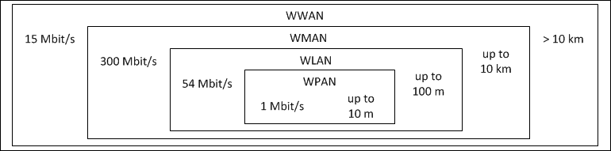
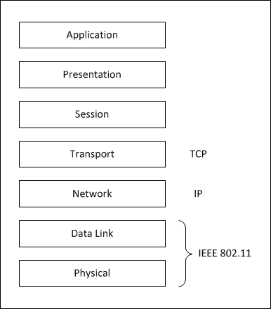
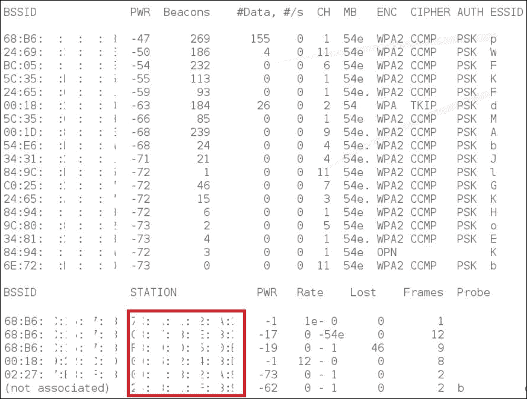
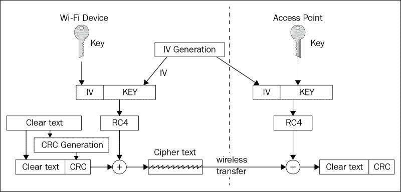
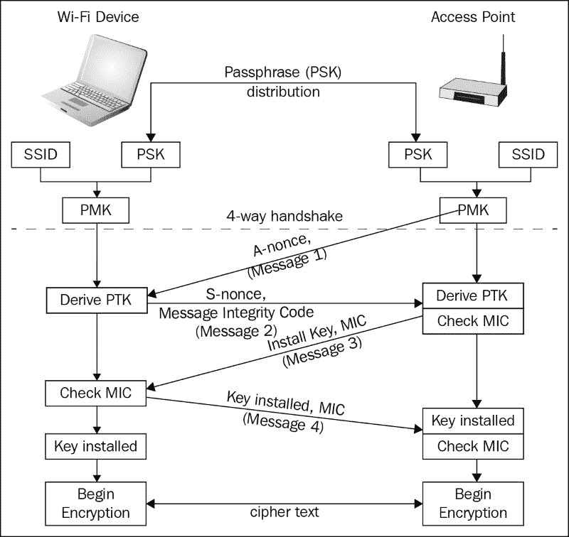
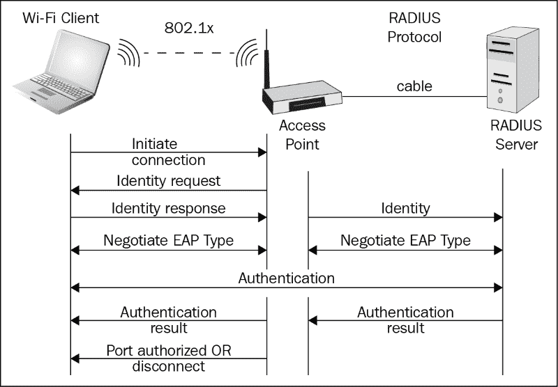

# 第一章：理解无线网络安全性和风险

在本章中，我们将回顾哪些无线技术允许数据传输，重点介绍 Wi-Fi 技术，因为它是构建我们自己的渗透测试实验室中最重要的技术。由于这是构建高安全性实验室的一个非常重要的话题，我们还将回顾常见的 Wi-Fi 安全机制及其安全风险，并概述典型的无线攻击方法。

在本章中，我们将涵盖以下主题：

+   理解无线环境和威胁

+   常见 WLAN 保护机制及其缺陷

+   熟悉 Wi-Fi 攻击流程

# 理解无线环境和威胁

作为理解无线安全性和构建高安全性无线实验室的第一步和关键步骤，应当理解无线媒介的性质及其在现代生活中的作用。在本节中，我们将回顾无线网络的主要特点和威胁。

有线网络通过电缆进行数据传输，因此被视为“受控”环境，受到物理安全级别的保护。为了访问有线网络，攻击者需要克服任何物理安全系统，进入建筑物或其他受控区域，并且还需要克服逻辑安全系统，如防火墙和**入侵检测/预防系统**（**IDPS**）。

在无线网络的情况下，环境是开放的，几乎没有控制。如今，提供相当于有线网络物理安全的安全级别并不容易。无线网络的信号可以从同一建筑的另一层、邻近建筑，甚至外部接收到——无线网络的物理边界仅由信号强度限制。因此，与有线网络中连接点已知不同，无线网络可以从任何地方访问——只要信号足够强。

## 无线技术概览

如今，各种技术被用于无线数据通信。它们在所使用的媒介、频段、带宽、编码方法、应用范围和其他特性上有所不同。让我们从定义**无线通信**这一术语开始。我们认为，它是指根据特定规则或规格，在没有通过电缆或线缆建立物理连接的情况下，两台或多台设备之间的远程通信。

为了更清晰地理解我们的定义，让我们定义可以赋予所讨论的通信方法的特征：

+   **拓扑结构**：

    +   点对点

    +   点对多点

+   **使用场景**：

    +   企业基础设施：办公和技术

    +   提供服务

    +   个人使用

+   **范围**：

    +   **无线个人区域网络**（**WPAN**）：蓝牙、红外线（IrDA）和射频识别（RFID）

    +   **无线局域网**（**WLAN**）：Wi-Fi

    +   **无线城域网**（**WMAN**）和**无线广域网**（**WWAN**）：WiMAX、GSM 和 UMTS

+   **速度**：

    +   WPAN 的 1 Mbit/s

    +   WLAN 的 54 Mbit/s

    +   WMAN 的 300 Mbit/s

    +   WWAN 的 15 Mbit/s

以下图表简洁而直观地映射了无线技术的两个最重要特性（数据传输速度和覆盖范围）：

基于覆盖范围和数据传输速度的无线通信分类

现在我们已经有了明确的定义，可以继续探讨一些无线数据传输技术及其特点。

让我们从移动蜂窝通信开始，这是现在最常见的一种无线数据传输方式。蜂窝通信是一种移动网络——基于蜂窝网络的一种移动通信。其关键特性是整个覆盖区域被划分为多个小区。小区之间部分重叠，共同形成一个网络。网络由多个基站组成，这些基站在相同频段内运行，各自覆盖自己的区域（小区）并提供无线信号和交换设备。小区具有唯一的 ID，能够确定用户的当前位置，并在用户从一个基站的覆盖区域移动到另一个基站的覆盖范围时，保持连接的连续性。

移动通信的历史始于 20 世纪中期，发展至今经历了四个主要的里程碑：

+   **1G**（**G**代表代）：模拟蜂窝通信（基于 AMPS、NAMPS 和 NMT-450 标准）

+   **2G**：数字蜂窝通信（GSM 和 CDMA）

+   **3G**：宽带数字蜂窝通信（UMTS）

+   **4G**：满足高需求的蜂窝移动通信（LTE）

目前，最具前瞻性的解决方案是 UMTS 和 LTE。这两种数据传输标准继承了 GSM，并能够传输语音或数据，提供各种服务。这些标准与旧一代相比的独特之处在于能够以更高的速度传输数据（UMTS 的入站数据速度可达 21 Mbit/s，LTE 的入站数据速度可达 300 Mbit/s）。这些速度使得在互联网上的工作变得更加舒适。

由于存在大量现有标准，并且不同国家和行业的政府要求存在差异，因此可以在不同国家和行业使用基于不同加密算法的各种频率进行数据传输和信息保护。

接下来我们要回顾的无线技术是蓝牙（WPAN 的代表）。蓝牙允许在个人设备之间交换信息，如手机、个人电脑、平板电脑、输入设备（麦克风、键盘和游戏手柄）以及输出设备（打印机和耳机）。蓝牙在免费且广泛可用的无线电频率（2.4 至 2.485 GHz 之间）上工作，用于短距离通信，典型距离为最多 10 米（但也有例外），并支持两种连接方式：点对点和点对多点。

蓝牙具有多层架构，包括主协议和一组辅助协议，这些协议实现以下功能：

+   在两个设备之间创建和管理无线连接

+   发现设备提供的服务并确定参数

+   创建虚拟串行数据流并模拟 RS-232 控制信号

+   从其他协议栈传输数据

+   管理高层服务，如音频分配

除了实现这些功能的协议外，蓝牙协议栈还包含以下协议：

+   **PPP**（**点对点协议**）

+   **TCP/IP**

+   **OBEX**（**对象交换协议**）

+   **WAE**（**无线应用环境**）

+   **WAP**（**无线应用协议**）

另一种有趣的无线数据传输方式是利用光波。描述使用红外光波作为环境进行数据传输的物理和逻辑层协议的标准组被称为**IrDA**（**红外数据协会**）。通常，这种交互的实现方式是发射器（红外发光二极管）和接收器（光二极管）位于连接的两侧。

这种技术在 1990 年代末期变得特别流行。如今，它几乎完全被更现代的通信方式，如 Wi-Fi 和蓝牙所取代。但它仍然在家电的遥控器中使用，通常这些设备具有单向连接（一个端有发射器，另一个端有接收器）。

放弃 IrDA 的主要原因如下：

+   限制连接的距离

+   直接可见性要求

+   数据传输速度较慢（在标准的后期修订版本中，速度有所提升，但即使是高速版本现在也不太流行）

另一种无线光学数据传输的例子是**自由空间光学**（**FSO**）。这种独特的技术使用红外激光作为信息载体，用于开阔空间中的远程通信。与 IrDA 类似，这个系统的缺点是直接可见性要求，这一要求高度依赖于天气状况。

通常 FSO 被使用：

+   当布线不可行或成本过高时

+   当你需要一个不受无线干扰的私人连接，并且不会造成任何干扰时（例如，在机场）

回到使用无线电信号进行无线数据传输，我们需要回顾 IEEE 802.11 标准系列，也称为 Wi-Fi（Wi-Fi 是 Wi-Fi 联盟针对基于 IEEE 802.11 标准系列的无线网络的商标）。

IEEE 802.11 系列包含几十种标准，但我们将直接查看专为数据传输设计的标准，省略辅助性标准：

+   **802.11**：这是 1997 年批准的原始标准，描述了在 2.4 GHz 频率下以 1 Mbit/s 和 2 Mbit/s 速度进行传输。

+   **802.11b**：这是对 802.11 的改进，支持更高的速度（最高 5.5 Mbit/s 和 11 Mbit/s）。它于 1999 年批准。

+   **802.11a**：这是 1999 年批准的标准，自 2001 年起开始使用。该标准允许我们在 5 GHz 频率下以 54 Mbit/s 的速度工作。

+   **802.11g**：该标准允许我们以 54 Mbit/s 的速度在 2.4 GHz 频率下传输数据。它于 2003 年批准。

+   **802.11n**：该标准于 2009 年批准。此标准将数据传输速度提高到最高 600 Mbit/s，在 2.4 至 2.5 GHz 或 5 GHz 频率范围内工作。该标准向后兼容 802.11 a/b/g。

+   **802.11ac 和 802.11ad**：这些标准于 2014 年批准。它们允许以最高 7 Gbit/s 的速度进行数据传输，并具有额外的工作频率（60 GHz）。

IEEE 802.11 用于在 100 米范围内通过无线电进行数据传输。通常，IEEE 802.11 网络由至少一个接入点和至少一个客户端组成，但也可以通过点对点（ad hoc）模式连接两个客户端。在点对点连接的情况下，不使用接入点，客户端直接相互连接。

由于 IEEE 802.11 适用于 WLAN 并为局域网提供高速数据传输，基于 IEEE 802.11 的解决方案是解决“最后一公里”问题的理想选择。IEEE 802.11 使我们能够降低部署和扩展局域网的成本，同时在难以到达的地方提供网络接入，如户外或具有历史价值的建筑内部。

## 无线威胁概述

考虑到前一部分提到的特性，下面列出最常见的无线威胁。

在无线电信号作为传输环境和有线连接的情况下，存在许多威胁，每种威胁都有其特定的特点。

我们列表中的第一个威胁是信息收集。信息收集通常从侦察开始，主要依赖于与受害者的距离，这是由于无线电波的特性——你不需要连接到另一个网络设备就能接收该设备发出的无线电波。侦察的结果可以提供关于网络对象和用户的位置、所使用的设备和技术等信息。通常，捕获的网络流量包含重要信息。通过检查网络数据包、数据包模式以及连接成员之间的会话（接入点及其客户端），可以进行流量分析。还应注意，无线网络控制数据包（服务流量）是未加密的。此外，很难区分信息收集的用户和网络中的合法参与者。无线信号覆盖范围可能超出受控区域，这为信息收集风险的实现提供了便捷的机会。

第二个威胁是网络设备设置中的问题，例如使用弱加密密钥或存在已知漏洞的认证方法。潜在的攻击者主要利用这些弱点。不正确配置的接入点可能成为突破整个公司网络的原因。此外，在企业网络的情况下，很难追踪未经授权的接入点；例如，普通员工可以带着未注册的接入点连接到公司网络。这不仅对无线网络构成严重威胁，而且对整个公司的基础设施也带来威胁。

配置错误的无线客户端比配置错误的接入点带来的威胁更大。这些设备是移动的，且通常没有专门配置来减少风险，或者仍然使用默认设置。

接着前一点，下一种威胁是破解加密。攻击者对广泛使用的加密算法的漏洞了如指掌，例如在 WEP 协议的情况下，他们可以在不到 10 分钟的时间内从客户端获取预共享密钥。

面对无线网络的第四个威胁是追踪用户行为的困难。正如前面所提到的，无线设备并不“绑定”于网络，可以更改连接网络的点。无线客户端的配置错误可能会使其自动连接到最近的无线网络。这一机制使得攻击者能够将毫无戒心的用户设备切换到攻击者的设备上，而不是合法的接入点，从而进行漏洞扫描、钓鱼攻击或中间人攻击。此外，如果用户同时连接到有线网络，这也成为了进入企业网络的一个便捷入口。

冒充用户是对任何网络的重大威胁，不仅仅是无线网络。然而，在无线通信的情况下，验证用户身份更加困难。网络标识符（SSID）和 MAC 地址过滤存在，但它们都会以明文形式广播在服务包中，容易被截获。冒充身份使攻击者能够向授权通信中插入错误帧，并对企业基础设施进行攻击。

许多笔记本电脑用户如果对有线网络服务质量（如连接弱、URL 过滤或端口过滤）不满意，倾向于切换到 WLAN，这增加了风险。在大多数情况下，当有线网络断开时，操作系统会自动进行切换。

我们想提到的最后一个威胁是 **拒绝服务** (**DoS**)。典型 DoS 攻击的目的是破坏网络服务的可用性或完全阻止授权客户端的访问。例如，可以通过从伪造的地址发送去认证或“垃圾”包来淹没网络，从而发起攻击。在这种情况下，追踪攻击源并不是一项容易的任务。此外，还存在在物理层上组织 DoS 攻击的可能性，通过在特定频率范围内运行一个强大的干扰器。

## Wi-Fi 媒体特性

尽管无线技术种类繁多，但绝大多数企业和个人网络通信基于 Wi-Fi 技术，这也是我们深入探讨这种无线技术的原因。

Wi-Fi 容易受到前面提到的所有无线技术常见的威胁—没有任何电缆或其他物理连接在客户端与网络设备之间，虽然为用户提供了极大的移动性，但也成为了大多数 Wi-Fi 安全缺陷和挑战的根源。这既是 WLAN 的主要优势，也是其主要劣势。

第一个 Wi-Fi 规范，即 802.11 标准，规范了在 2.4 GHz 中心频率下操作的设备，最大速度可达 2 Mbit/s，并于 1997 年获得批准。

802.11 系列标准规范了网络和设备的架构，并描述了 OSI 模型的前两层，以及交互协议。标准规定了物理层的基础频率、调制技术和扩频技术。

IEEE 802.11 标准严格规范了 OSI 模型的前两层：物理层和数据链路层，它们决定了局域网的具体特性。OSI 模型的上层在无线和有线局域网中是相同的：

OSI 模型层次

区分各种局域网特征的需求通过将数据链路层分为两个子层来体现：**逻辑链路控制**（**LLC**）和**媒体访问控制**（**MAC**）。MAC 层提供了正确共享整体环境的功能。在获得对环境的访问权限后，它可以使用更高层次的 LLC，LLC 实现与相邻网络层接口的功能。在 802.11 标准中，MAC 类似于以太网网络的实现。根本区别在于，802.11 使用半双工收发器，无法在通信会话中检测到碰撞。MAC 在 802.11 标准中使用一种特殊的协议——**载波监听多路访问与冲突避免**（**CSMA/CA**）或**分布式协调功能**（**DCF**）。此外，802.11 MAC 支持两种能量消耗模式：连续工作模式和节能模式。

802.11 标准在 1999 年更新为标准 802.11b 版本，工作在相同的 2.4 GHz 主频率下，最大速度可达 22 Mbit/s。

新的 802.11b 标准的基本架构、理念和特点与原始版本的 802.11 类似，只有具有更高接入速度和数据传输层的物理层发生了变化。

该标准还引入了错误修正，并且能够在强干扰和弱信号的条件下工作。为此，标准描述了基于当前信号强度和干扰的自动数据传输速率调整方法。Wi-Fi 技术的发展大大增加了全球各种无线设备的数量，并且由于微波炉、手机和蓝牙设备等设备相互影响，造成了 2.4 GHz 频段的干扰和拥堵问题。

802.11a 标准（在 5 GHz 频段上工作）旨在减轻 2.4 GHz 频段的负载。与 2.4 GHz 频段相比，新频段的干扰源较少，噪声水平也明显较低。802.11a 标准使用了围绕 5 GHz 的两个基本频率，最大数据传输速率为 54 Mbit/s。

需要提到的是，5 GHz 频段邻近部分用于卫星和微波通信的频率。为消除 Wi-Fi 设备与其他部门系统之间的干扰，**欧洲电信标准化协会**（**ETSI**）开发了两个附加协议：**动态频率选择**（**DFS**）和**传输功率控制**（**TPC**）。Wi-Fi 设备可以使用这些协议，在出现载波频率冲突时自动更换频率通道或减少传输功率。

Wi-Fi 发展的下一个步骤是 802.11g 标准，该标准在 2003 年获得批准。802.11g 是 802.11b 的改进版本，专为在 2.4 GHz 频率下运行、最大速度为 54 Mbit/s 的设备设计。

现在，802.11n 标准已成为最广泛使用的 Wi-Fi 技术。开发人员试图将之前版本中实现的所有优良特性集成到这个新版本中。802.11n 标准设计用于在 2.4 GHz 到 5 GHz 的中心频率下运行的设备，最高速度可达 600 Mbit/s。该标准于 2009 年 9 月由 IEEE 批准。该标准基于 MIMO-OFDM 技术。在 IEEE 标准中，802.11n 的最大数据传输速率是之前标准的几倍。这是通过将信道宽度从 20 MHz 扩展到 40 MHz，并采用 MIMO 技术（使用多个天线）实现的。

最后一项标准，即目前迅速流行的 802.11ac，是一种无线网络标准，采用于 2014 年 1 月。它在 5 GHz 频段上运行，并且向后兼容 IEEE 802.11n 标准。

该标准使我们能够显著扩展网络带宽，从 433 Mbit/s 提升到在 8x MU-MIMO 天线下达到 6.77 Gb/s。这是相对于 IEEE 802.11n 的最重要创新。此外，使用的能量大幅减少，这延长了移动设备的电池寿命。

技术信息的摘要如下表所示：

| 标准 | 频率，MHz | 通道 | 速度，Mbit/s | 功率，mW |
| --- | --- | --- | --- | --- |
| 802.11 | 2400-2483,5 | 20 | 1; 2 | 100 |
| 802.11b | 2400-2483,5 | 13 | 1; 2; 5,5; 11; 22 | 100 |
| 802.11a | 5150-5350 | 20 | 6; 9; 12; 18; 24; 36; 48; 54; 108 | 100 |
| 5650-6425 | 1000 |
| 802.11g | 2400-2483,5 | 13 | 1; 2; 5,5; 6; 9; 11; 12; 18; 22; 24; 33; 36; 48; 54; 108 | 250 |
| 802.11n | 2400-2483,5 | - | 150 | 250 |
| 5150-5350 | 100 |
| 5650-6425 | 1000 |
| 802.11ac | 5170-5905 | - | 433 | 500 |

# 常见的 WLAN 保护机制及其缺陷

为了能够保护无线网络，理解现有的保护机制及其安全缺陷至关重要。本话题不仅对 Wi-Fi 安全新手有帮助，也为经验丰富的安全专家提供了复习材料。理解这一主题将帮助你了解本书中的一个重要方面：你应该妥善规划无线渗透测试实验室的安全性。

## 隐藏 SSID

让我们从网络管理员常犯的一个错误开始：仅依赖“安全通过隐蔽”这种方式。在当前话题的框架下，这意味着使用隐藏的 WLAN **SSID**（即**服务集标识符**）或简单的 WLAN 名称。

隐藏 SSID 意味着 WLAN 不会在广播信标中发送其 SSID 以进行自我广告，也不会响应广播探测请求，从而使其在 Wi-Fi 启用设备的网络列表中不可用。这也意味着普通用户在其可用网络列表中看不到该 WLAN。

但是，缺少 WLAN 广播并不意味着 SSID 永远不会在空中传输——它实际上以明文的形式通过大量的数据包在接入点和连接到它们的设备之间传输，无论使用的是什么安全类型。因此，SSID 总是对所有范围内的 Wi-Fi 网络接口可用，并且对任何使用各种被动嗅探工具的攻击者可见。

## MAC 过滤

说实话，MAC 过滤甚至不能被认为是无线网络的安全或保护机制，但在各种来源中仍然被称为如此。那么，让我们澄清一下为什么我们不能将其称为安全特性。

基本上，MAC 过滤意味着只允许那些 MAC 地址在预定义列表中的设备连接到 WLAN，而不允许其他设备连接。MAC 地址在 Wi-Fi 中以未加密的方式传输，攻击者极其容易在不被察觉的情况下截获这些地址（请参见以下截图）：

一个无线流量嗅探工具轻松揭示 MAC 地址的示例

考虑到更改网络接口的物理地址（MAC 地址）极其简单，显然，MAC 过滤不应被视为一个可靠的安全机制。

### 提示

MAC 过滤可以用来支持其他安全机制，但不应仅作为 WLAN 的唯一安全措施。

## WEP

**有线等效隐私** (**WEP**) 出现于近 20 年前，与 Wi-Fi 技术同时诞生，并被集成为 IEEE 802.11 标准的安全机制。

正如新技术经常发生的那样，很快就显现出 WEP 设计中的弱点，它无法为无线网络提供可靠的安全性。安全研究人员开发了几种攻击技术，使他们能够在合理的时间内破解 WEP 密钥，并利用该密钥连接 WLAN 或者拦截 WLAN 和客户端设备之间的网络通信。

让我们简要回顾一下 WEP 加密是如何工作的，以及为什么它如此容易被破解。

WEP 使用所谓的 **初始化向量** (**IV**) 与 WLAN 的共享密钥连接，以加密传输的数据包。加密网络数据包后，IV 被直接添加到数据包中，并发送到接收端，例如接入点。这个过程在以下流程图中展示：

WEP 加密过程

攻击者只需要收集足够的 IV，这也是一个简单的任务，可以通过额外的重放攻击迫使受害者生成更多的 IV。

更糟糕的是，有一些攻击技术允许攻击者即使没有连接的客户端，也能渗透 WEP 保护的 WLAN，这使得这些 WLAN 默认情况下是脆弱的。

此外，WEP 没有密码完整性控制，这也使其容易受到对机密性的攻击。

攻击者有许多方式可以滥用 WEP 保护的 WLAN，例如：

+   使用被动嗅探和统计密码分析解密网络流量

+   使用主动攻击（例如重放攻击）解密网络流量

+   流量注入攻击

+   未经授权的 WLAN 访问

尽管 WEP 在 2003 年已被 WPA 技术正式取代，但它仍然可以在某些私人家庭网络中找到，甚至在一些企业网络中（现在大多属于小公司）。

但是这种安全技术已经变得非常罕见，并且在未来不会再被使用，主要是由于企业网络中的意识提升，以及制造商不再在新设备中默认启用 WEP。

在我们谦虚的看法中，设备制造商不应在新设备中包括 WEP 支持，以避免其使用并提高客户的安全性。

### 注意

从安全专家的角度来看，WEP 永远不应被用来保护 WLAN，但可以用于 Wi-Fi 安全培训目的。

无论使用何种安全类型，共享密钥始终会增加额外的安全风险；用户往往倾向于共享密钥，从而增加了密钥泄露的风险，并减少了对密钥隐私的责任。

此外，使用相同密钥的设备越多，攻击者在密码分析攻击中的适用流量就越大，从而提高了攻击性能和成功的机会。通过为用户和设备使用个人标识符（密钥、证书），可以最小化此风险。

## WPA/WPA2

由于 WEP 存在众多安全漏洞，下一代 Wi-Fi 安全机制于 2003 年推出：Wi-Fi 保护访问（WPA）。它被宣布为 WPA2 发布之前的中间解决方案，并且在安全性方面比 WEP 有显著提升。

这些改进包括：

+   **更强的加密**：新标准使用比 WEP 更长的加密密钥（256 位与 64 位和 128 位），并能够使用**高级加密标准**（**AES**）算法。

+   **密码完整性控制**：WPA 使用一种名为 Michael 的算法，而不是 WEP 中使用的 CRC。这是为了防止数据包在传输过程中被篡改，并防止重新发送被嗅探到的数据包。

+   **临时密钥的使用**：**临时密钥完整性协议**（**TKIP**）会自动为每个数据包更改加密密钥。这是对静态 WEP 的重大改进，后者的加密密钥可以手动输入到 AP 配置中。TKIP 也使用 RC4，但其使用方式得到了改进。

+   **客户端认证支持**：使用专用认证服务器进行用户和设备认证使得 WPA 适用于大型企业网络。

WPA 中实现了密码强度强大的 AES 算法，但并未设置为强制使用，仅作为可选。

尽管 WPA 是对 WEP 的重要改进，在 WPA2 于 2004 年发布并成为所有新型 Wi-Fi 设备的强制性解决方案之前，它仍然是一个临时解决方案。

WPA2 与 WPA 工作原理非常相似，WPA 和 WPA2 的主要区别在于用于提供安全性的算法：

+   在 WPA2 中，AES 成为了默认的加密算法，取代了 WPA 中的默认 RC4。

+   WPA 中使用的 TKIP 已被块**链消息认证码协议**（**CCMP**）取代

由于工作流程非常相似，WPA 和 WPA2 也容易受到类似的攻击，通常被称为 WPA/WPA2，有时写成一个词。WPA 和 WPA2 都可以在两种模式下工作：**预共享密钥**（**PSK**）或个人模式以及企业模式。

### 预共享密钥模式

预共享密钥或个人模式旨在用于家庭和小办公室网络，这些网络复杂度较低。我们非常确定，我们的所有读者都遇到过这种模式，并且大多数人在家中使用它连接笔记本电脑、手机、平板电脑等到家庭网络。

PSK 模式的基本思想是在接入点和客户端设备上使用相同的秘密密钥来对设备进行认证，并建立用于网络连接的加密连接。使用 PSK 的 WPA/WPA2 认证过程包括四个阶段，也称为**4 次握手**。它在以下图表中有所描述：

WPA/WPA2 4 次握手

PSK 模式下的 WPA/WPA2 主要缺陷是可以嗅探整个 4 次握手过程，并且可以在离线状态下对安全密钥进行暴力破解，无需与目标 WLAN 进行任何交互。一般来说，WLAN 的安全性主要取决于所选 PSK 的复杂性。

计算用于 4 次握手中的**PMK**（主要主密钥）是一个非常耗时的过程，与其他计算操作相比，计算数十万个 PMK 可能需要很长时间。但是，在使用短且低复杂度的 PSK 的情况下，即使在性能不强的计算机上，暴力破解也不会花费太多时间。如果密钥复杂且足够长，破解时间可能会长得多，但仍然有方法可以加速这个过程：

+   使用支持**CUDA**（简称**Compute Unified Device Architecture**）的强大计算机，使软件能够直接与 GPU 进行通信。由于 GPU 本来就是为执行数学运算而设计的，并且比 CPU 快得多，使用 CUDA 进行破解的过程比使用 CPU 快几倍。

+   使用包含各种 PSK 及其对应预计算哈希值的彩虹表。这为攻击者节省了大量时间，因为破解软件只需从拦截到的 4-way 握手中搜索一个值，如果匹配，就返回与给定 PMK 对应的密钥，而不是为每一种可能的字符组合计算 PMK。由于 WLAN SSID 在 4-way 握手中类似于加密盐，针对同一密钥的 PMK 会因不同的 SSID 而不同。这限制了彩虹表的应用范围，只能用于一些最流行的 SSID。

+   使用云计算是加速破解过程的另一种方式，但通常需要额外的费用。攻击者能够租用的计算能力越强（或通过其他方式获得的计算能力），破解过程就越快。网络上也有提供各种破解用途的在线云破解服务，包括破解 4-way 握手。

此外，像 WEP 一样，WPA/WPA2 PSK 的用户越多，泄露的风险就越大——这也是它不适用于大型复杂企业网络的原因。

### 注

WPA/WPA2 PSK 模式仅在密钥足够长且复杂，并且与独特的（或至少不常见的）WLAN SSID 一起使用时，才能为家庭和小型办公网络提供足够的安全性。

### 企业模式

如前所述，使用共享密钥存在安全风险，而在 WPA/WPA2 中，密钥长度和复杂性是高度依赖的。但在企业网络中，有几个因素需要考虑：灵活性、可管理性和可追溯性。

在大型网络中，实施这些功能的组件有很多，但在我们讨论的主题中，我们主要关注其中的两个：**AAA**（**认证、授权和计费**）服务器和无线控制器。

WPA-Enterprise 或 802.1x 模式是为企业网络设计的，这些网络需要高安全级别，并要求使用 AAA 服务器。在大多数情况下，RADIUS 服务器被用作 AAA 服务器，以下**EAP**（**可扩展认证协议**）类型与 WPA/WPA2 一起支持（以及其他若干类型，具体取决于无线设备），用于执行认证：

+   EAP-TLS

+   EAP-TTLS/MSCHAPv2

+   PEAPv0/EAP-MSCHAPv2

+   PEAPv1/EAP-GTC

+   PEAP-TLS

+   EAP-FAST

你可以在下图中找到简化的 WPA-Enterprise 认证工作流程：

WPA-Enterprise 认证

根据 EAP 类型配置，WPA-Enterprise 可以提供多种认证选项。

最流行的 EAP 类型（基于我们在多个渗透测试中的经验）是 PEAPv0/MSCHAPv2，它与现有的 Microsoft Active Directory 基础设施相对容易集成，并且管理相对简单。但这种 WPA 保护方法相对容易被恶意接入点通过窃取和暴力破解用户凭证所击败。

最安全的 EAP 类型（至少在正确配置和管理的情况下）是 EAP-TLS，它采用基于证书的身份验证，适用于用户和身份验证服务器。在这种身份验证类型下，客户端还会验证服务器的身份，只有当配置出现错误或证书管理和分发存在安全隐患时，才可能通过恶意接入点发起成功的攻击。

### 注意

建议使用 WPA-Enterprise 的 EAP-TLS 模式，并进行客户端和服务器证书的双向身份验证来保护企业 WLAN。然而，这种安全方式需要额外的工作和资源。

## WPS

**Wi-Fi 受保护设置**（**WPS**）实际上并不是一种安全机制，而是一种密钥交换机制，它在设备和接入点之间建立连接时起着重要作用。它的设计目的是简化设备与接入点之间的连接过程，但如果启用它，结果证明它是现代 WLAN 中最大的漏洞之一。

WPS 与 WPA/WPA2-PSK 一起工作，允许设备通过以下方式之一连接到 WLAN：

+   **PIN**：在设备上输入 PIN。PIN 通常打印在 Wi-Fi 接入点背面的贴纸上。

+   **按键方法**：在连接阶段，应该在接入点和客户端设备上同时按下特定按钮。设备上的按钮可以是物理的，也可以是虚拟的。

+   **NFC**：客户端应将设备靠近接入点以利用近场通信技术。

+   **USB 驱动器**：接入点和设备之间的必要连接信息交换通过 USB 驱动器完成。

由于 WPS PIN 非常短，并且其第一部分和第二部分是分开验证的，因此对 PIN 进行在线暴力破解可以在几个小时内完成，从而允许攻击者连接到 WLAN。

此外，2014 年发现了离线 PIN 破解的可能性，攻击者可以在 1 到 30 秒内破解 PIN 码，但这一攻击只对某些设备有效。

你还应该记住，虽然一个人未被允许连接到 WLAN，但如果他可以物理访问 Wi-Fi 路由器或接入点，仍然可以读取和使用 PIN 码或通过按键方法进行连接。

# 熟悉 Wi-Fi 攻击的工作流程

在我们看来（希望你同意），规划和构建一个安全的 WLAN 是不可能的，除非对各种攻击方法及其工作流程有足够的理解。在本主题中，我们将概述攻击者在攻击 WLAN 时的工作方式。

## 一般 Wi-Fi 攻击方法

在复习无线威胁和 Wi-Fi 安全机制的知识之后，让我们来看看攻击者在现实世界中使用的攻击方法。当然，像所有其他类型的网络攻击一样，无线攻击的工作流程依赖于特定的情况和目标，但在几乎所有情况下，它们仍然遵循以下一般顺序：

1.  第一步是*规划*。通常，攻击者需要规划他们将要攻击的对象，如何进行攻击，任务需要哪些工具，攻击某些目标的最佳时间和地点，以及哪些配置模板将是有用的，以便提前做好准备。白帽黑客或渗透测试人员需要制定时间表并与客户协调项目计划，选择客户方的联系人，定义项目交付物，并在需要时进行其他组织工作。与每一个渗透测试项目一样，项目规划得越好（我们也可以用“项目”这个词来描述黑帽黑客的任务），成功的概率就越大。

1.  下一步是*调查*。尽可能准确并尽可能多地获取关于目标的信息，对于成功的攻击至关重要，特别是在不常见的网络基础设施中。要攻击 WLAN 或其无线客户端，攻击者通常会收集至少访问点和客户端的 SSID 或 MAC 地址，以及正在使用的安全类型信息。了解目标访问点是否启用了 WPS 对攻击者来说也非常有帮助。所有这些数据不仅帮助攻击者为其工具设置正确的配置和选择适当的选项，还能帮助他们选择适合特定 WLAN 或 Wi-Fi 客户端的攻击类型和条件。所有收集的信息，尤其是非技术性的信息（例如公司和部门名称、品牌或员工姓名），也可以在破解阶段用来构建字典，以便进行暴力破解攻击。

1.  根据安全类型和攻击者的运气，在调查阶段收集的数据甚至可以使主动攻击阶段变得不必要，直接进入*破解*阶段。*主动攻击*阶段涉及攻击者与目标（WLAN 和 Wi-Fi 客户端）之间的主动互动。在这个阶段，攻击者必须创造选择的攻击类型所需的条件并执行攻击。它包括发送各种 Wi-Fi 管理和控制帧，以及安装伪造的访问点。如果攻击者的目标是导致目标 WLAN 的服务拒绝，那么此类攻击也会在这个阶段执行。一些主动攻击对于成功攻击 WLAN 是必不可少的，但有些攻击仅仅是为了加速攻击过程，可以省略，以避免触发各种**无线入侵检测/防御系统**（**WIDPS**），这些系统可能已经安装在目标网络中。因此，主动攻击阶段可以称为可选阶段。

1.  破解是另一个重要阶段，攻击者在该阶段破解之前阶段截获的 4 次握手、WEP 数据、NTLM 哈希等信息。有许多各种免费的和商业化的工具和服务，包括云破解服务。如果此阶段成功，攻击者将获得目标 WLAN 的秘密，并可以继续连接到 WLAN，解密截获的流量等等。

## 主动攻击阶段

让我们在接下来的章节中详细了解主动攻击阶段中最有趣的部分——WPA-PSK 和 WPA-Enterprise 攻击。

### WPA-PSK 攻击

由于 WPA 和 WPA2 都基于 4 次握手，因此攻击它们并没有区别——攻击者需要嗅探到 4 次握手的瞬间，建立一个接入点和任意无线客户端之间的连接，并强行破解匹配的 PSK。无论截获的是哪个握手都无关紧要，因为所有客户端在给定的目标 WLAN 中使用相同的 PSK。

有时，攻击者需要等待设备连接到 WLAN 以便拦截 4 次握手，当然，他们希望尽可能加速这一过程。为此，他们通过向目标接入点发送控制帧（去认证攻击）迫使已连接的设备与接入点断开连接。当设备收到此类帧时，它会从 WLAN 断开连接，并在启用“自动重新连接”功能时（大多数设备默认启用）尝试重新连接，从而进行另一次 4 次握手，攻击者可以拦截该握手。

另一种攻击 WPA-PSK 保护网络的方式是破解 WPS PIN 码（如果目标 WLAN 启用了 WPS）。

### 企业 WLAN 攻击

如果启用了 WPA-Enterprise 安全性，攻击会变得稍微复杂一些，但经过适当准备的攻击者可以通过模仿具有 RADIUS 服务器的合法接入点，并收集用户凭证进行进一步分析（破解），在几分钟内完成攻击。

为了实施此攻击，攻击者需要安装一个伪造接入点，SSID 与目标 WLAN 的 SSID 相同，并将其他参数（如 EAP 类型）设置为与目标 WLAN 相似，以增加成功的机会，并减少攻击被迅速发现的概率。

大多数用户的 Wi-Fi 设备根据信号强度选择连接到某个 WLAN 的接入点——它们会连接到信号最强的那个。因此，攻击者需要使用强大的 Wi-Fi 接口来伪造接入点，覆盖合法接入点的信号，迫使设备连接到伪造接入点。

在这种攻击过程中使用的 RADIUS 服务器应具有记录认证数据的能力，例如 NTLM 哈希。

从用户的角度来看，以这种方式遭受攻击的表现就像是由于某种未知原因无法连接到 WLAN，甚至如果用户此时没有使用设备而仅仅是经过一个恶意接入点时，也可能看不到任何异常。值得一提的是，传统的物理安全或无线 IDPS 解决方案在这种情况下并不总是有效。攻击者或渗透测试人员可以在目标 WLAN 的范围外安装一个恶意接入点，这将使黑客能够攻击用户设备，而无需进入物理控制区域（例如办公楼），从而使恶意接入点对于无线 IDPS 系统来说无法接触且不可见。这样的地点可以是公交车站、火车站、停车场或是许多目标 WLAN 用户带着 Wi-Fi 设备前往的咖啡馆。

与 WPA-PSK（仅在所有 WLAN 用户之间共享一个密钥）不同，企业模式为每个用户使用个性化的凭据，而这些凭据的复杂性取决于特定用户。因此，收集尽可能多的用户凭据和哈希值是更好的做法，从而增加成功破解的机会。

# 总结

在本章中，我们回顾了用于传输数据的无线技术，并特别强调了 Wi-Fi 技术，因为我们将使用它来为我们的渗透测试实验室提供网络访问。

在我们本章的旅程中，我们还了解了用于保护无线网络访问的安全机制，它们的典型威胁以及常见的错误配置，这些配置导致安全漏洞并使攻击者能够破坏企业和私人无线网络。

简要的攻击方法概述让我们对攻击者在无线攻击过程中通常如何行动以及如何通过利用某些安全机制中的漏洞绕过常见的安全防护措施有了一个大致的了解。

我们还看到，保护无线网络最安全且最推荐的方式是使用 WPA2-Enterprise 安全协议，并结合客户端和服务器的相互身份验证，我们将在渗透测试实验室中实现这一点。

现在，我们已经准备好继续构建一个免受前述漏洞影响的无线实验室。在下一章，我们将帮助你首先确定实验室需要为你完成的任务，然后我们将指导你完成整个实验室规划过程。指导内容的组织方式使你可以根据自己的需求决定需要实现哪些实验室组件和技术。
