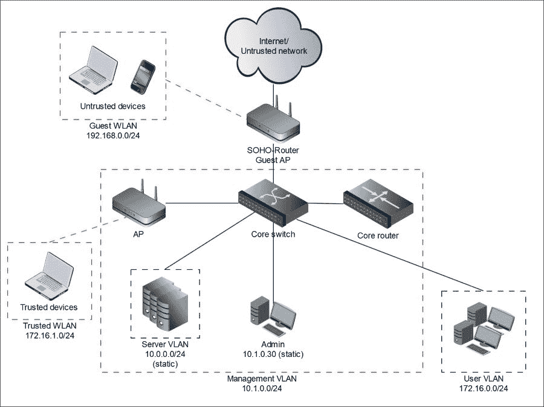
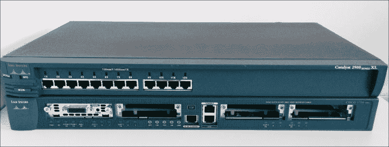
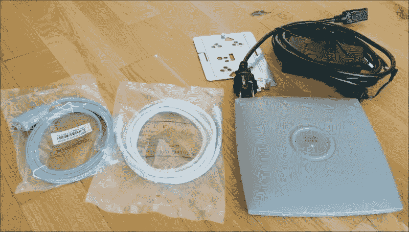

# 第二章。规划您的实验室环境

与任何建筑、软件、设备或其他类型的技术和非技术项目一样，您在开始建立实验室之前需要进行适当的规划。这个顺序是必要的，以便最大程度地从实验室环境中获得收益，同时确保免受任何类型的意外攻击。预先的规划还可以帮助避免在实施阶段出现的一些安装和配置任务的重复，尤其是在你意识到某些内容缺失或某些重要更改必须在几乎完成的实验室环境中进行时。

本章将引导您完成整个规划阶段，从理解您为何需要实验室到根据自己的需求选择实验室组件和拓扑结构。为实现这一目标，本章将涵盖以下主题：

+   理解您的实验室应该完成的任务

+   规划网络拓扑

+   选择合适的组件

+   规划实验室安全

# 理解您的实验室应该完成的任务

在这个主题下，我们将帮助您确定您的需求以及您希望通过实验室实现的目标。了解了您的需求后，您将能够为实验室设定要求——阐明实验室应包含哪些内容以及其组件如何相互作用。此步骤使您能够为下一步做准备——决定您需要在实验室中包含哪些组件以及为它们分配哪些角色。

## 实验室的目标

让我们从列出拥有实验室的典型目的开始：

+   **学习实用的渗透测试**：对初学者来说，拥有一个可以练习他们学到的渗透测试技术并巩固新学到的信息的环境是至关重要的。在这一过程中，您很可能希望拥有一个真实世界企业网络的模型，并可以在实验室中模拟它。

+   **提升和维护渗透测试技能**：有经验的专业人士也需要一个实验室，定期尝试一些新的攻击技术、研究漏洞或刷新他们的知识。渗透测试知识和黑客技能如果没有定期的实践练习，往往会被遗忘或消失，这对渗透测试人员以及所有其他职业和专长领域同样适用。

+   **评估渗透测试工具和框架**：你可以使用实验室快速部署新的渗透测试框架和攻击套件，测试它们的能力、便利性、有效性和结果质量。尤其在涉及一个或多个商业工具或框架时，它尤其有用，因为你需要了解这些工具是否值得付费，是否能满足你的预期，并对比几个工具，决定哪一个值得购买和使用。即使是黑帽黑客，也有兴趣测试各种安全解决方案，以调整他们的攻击工具，开发或修改不应该被安全解决方案检测到或击败的恶意软件，或者进行研究，以识别和利用安全解决方案中的新漏洞。

+   **评估安全工具和解决方案**：通常，几乎所有的渗透测试项目不仅包括黑客活动，还包括根据测试结果制定安全建议的阶段。为了能够提供深入且高质量的建议，安全专家必须熟悉推荐的解决方案，而其中一个途径就是亲自尝试安全解决方案。

+   **展示攻击和安全风险**：有时，客户或公司管理层（他们也是安全专家的客户，但属于内部客户）希望更好地理解与特定漏洞相关的风险，以便做出正确的风险管理决策。攻击演示在教学过程中也非常有帮助，尤其是教授安全测试课程时。各种攻击技术可以在实时环境中演示，也可以在实验室环境中录制，然后在课堂上展示。如前所述，看到实际攻击示范能显著提高教育质量。世界各地的许多公司都维持意识提升项目，教育员工了解安全性，减少与所谓“人为因素”相关的风险。许多意识提升项目面临相同的问题：非安全专业人士很难理解安全风险，因此也很难记住并遵循安全规则和建议。通过在意识提升项目中使用实验室演示给员工风险，帮助他们更好地理解和记住这些风险，因为他们已经明白了什么以及如何发生。另一个例子是，当安全专家需要为了市场营销目的演示攻击和相关风险时。

尽管有一些其他非常具体的原因需要拥有实验室，大多数情况通常适合上述列出的目的，并且可以归类为这些类型。

## 实验室任务

现在是时候决定你想在实验室中改进、测试、研究或展示什么内容了；哪些安全测试领域；哪些技能是你主要关注的点。为了简化我们的列表，我们按领域将其进行合并。

### 注意

有时，我们可能会觉得为什么在一本关于无线实验室的书中谈到 IT 基础设施黑客攻击显得有些奇怪，但我们希望澄清这一点：当我们谈论企业网络（渗透测试有意义的地方）时，我们应该记住，无线网络有其自身的底层网络基础设施，通常它们与其他具有重要企业 IT 资源的网络相连。这就是我们想要在实验室中模拟的场景——通过不同方式保护 WLAN，用于无线渗透测试练习，同时提供无线访问权限，以便对真实世界网络的模型进行其他类型的黑客攻击。

### 网络侦察

要执行成功的渗透测试，了解攻击目标至关重要，而网络侦察正是为此目的的基础。作为渗透测试中最重要的阶段之一，网络侦察基本上是收集和处理所有关于攻击目标、其特性和能力的可用信息。网络侦察可以是：

+   **主动**：涉及与目标的交互，通过发送特制数据包并分析目标对外部影响的反应。

+   **被动**：不需要任何交互，主要通过监听无线和有线网络流量来进行。

活动的目标可以包括：

+   收集未加密传输的敏感数据，例如网络帧的内容。

+   收集有关目标网络拓扑和正在使用的网络协议的信息（包括检测过时和危险的协议）。

+   获取网络服务、系统软件和应用程序的版本信息。

+   识别正在使用的硬件供应商和型号。

网络侦察的最后部分是对收集到的信息进行全面分析，建议可能存在的漏洞和错误配置，以便制定攻击计划并加以利用。

因此，你收集的信息越多，成功的机会就越大。

### Web 应用程序攻击

现在，随着越来越多的桌面软件和传统静态网站迁移到 web 应用程序，Web 应用程序攻击成为最受欢迎和需求量最大的主题之一。这就是为什么 Web 应用程序黑客攻击成为专业渗透测试人员必备技能的原因。

Web 应用程序攻击的列表包括但不限于跨站脚本攻击、注入攻击、跨站请求伪造、应用程序逻辑攻击、模糊测试参数、认证绕过、会话管理攻击等。

### 提示

如果你想了解当前最关键的网络安全漏洞，可以参考 OWASP Top 10 列表，链接地址为[`www.owasp.org/index.php/Top_10_2013-Top_10`](https://www.owasp.org/index.php/Top_10_2013-Top_10)。

### 黑客攻击和研究网络服务

网络服务（如 SMB、FTP 和 SSH）及其漏洞和配置错误通常作为操作系统的入口，不仅对合法用户如此，它们也有自己的特点，了解它们的运作方式可以使攻击者从匿名访问进入并控制整个系统。不正确配置的操作系统集成功能和权限也能达到同样的目的。

使用网络服务，你可以练习溢出漏洞利用、攻击弱加密和弱权限、特权提升、身份验证绕过、凭证猜测、网络侦察等技能。

### AD 攻击

微软 Active Directory 是控制整个企业网络的关键，和任何技术一样，它也有自己的特点和缺陷。AD 通常在复杂的企业网络中很难集成和维护，这导致了大量的配置错误，因此它总是渗透测试人员和黑客的美味目标。但其中一些缺陷和配置错误没有对其工作原理和攻击方式的详细理解，是不容易被滥用的。

本类别包括网络侦察技术、滥用组策略、窃取凭证、哈希传递和哈希破解攻击等。

### DBMS 攻击

DBMS 确实在某些方面与 Web 应用和网络服务攻击有所交集，但它是一个庞大的独立话题，涉及的内容远超仅仅与 Web 应用和监听器安全的互动。如果你想深入研究数据库攻击，有许多值得探索和实践的内容。

数据库管理系统（DBMS）攻击包括经典的漏洞利用、身份验证绕过等，但它更深入地探讨了数据库的具体情况，考虑了不同的权限级别、不同的角色以及其他 DBMS 特性。

### 网络层攻击

网络层攻击无疑是一个较不受欢迎的话题，因为网络技术的发展速度不如 Web 技术，且有一种观点认为这个话题几乎所有内容都已被研究和攻击。但对于每个渗透测试人员和大多数安全专家来说，这仍是必须掌握的领域。

本组攻击包括绕过防火墙和访问控制列表、突破 VLAN、中间人攻击、拒绝服务攻击（DoS）等。

绕过防火墙和突破 VLAN 有不同的攻击技术，但目标是相同的——绕过现有的访问控制规则和措施，以便访问通常无法到达的网络元素（如网络服务、子网、网络段等），并对其进行攻击或滥用。

### Wi-Fi 渗透测试

由于我们正在构建一个通过 Wi-Fi 访问的实验室，明智的做法是通过在其他任务中进行 Wi-Fi 渗透测试，从中获得额外的收益，尤其是在 Wi-Fi 已广泛普及并牢固地确立为最重要的企业技术之一的情况下。

在 Wi-Fi 主题中，可以练习以下技能：攻击 WPA-PSK、攻击 WPA-Enterprise、洪泛攻击、去认证攻击、攻击弱加密、WEP 破解、中间人攻击以及嗅探攻击。

#### 中间人攻击

**中间人攻击** (**MiTM**) 是网络层攻击的一种子类型，但在无线网络连接中应当单独审视。我们首先需要理解的是，MiTM 攻击使得通过物理或虚拟地将攻击机器置于网络流量的源头和目标之间，从而拦截网络流量成为可能。

在 802.11 的情况下，无线网络是一个公共网络，如果它没有加密或加密较弱，攻击者即使没有逻辑连接，也能拦截目标无线网络上的所有数据。但如果攻击者设置了一个恶意接入点，他们能够读取和修改其他客户端的网络流量，并直接攻击它们（恶意双胞胎攻击），无论 WLAN 的保护类型如何。

MiTM 攻击在无线网络中通过监控和注入无线通信流量来执行。因此，攻击者可以在 OSI 模型的第一层和第二层对 WLAN 进行攻击。MiTM 攻击通常与去认证攻击结合使用，使得参与者代表接入点从网络断开连接。去认证攻击也经常被用来执行 **拒绝服务** (**DoS**) 攻击。

在无线网络的情况下，DoS 攻击可以作为对 WLAN 的复杂攻击的一部分，结合社交工程攻击、MiTM 攻击、认证攻击等。但攻击者也可以进行纯粹的 DoS 攻击，目的是中断 WLAN 服务，例如，通过干扰信号或垃圾流量使 WLAN 发生洪泛。我们列出了最常见的实际安全领域，当然，你也可以有自己希望在实验室中执行的特定任务，但几乎所有任务都可以归属于我们列表中的一类或多类。

# 规划网络拓扑

构建网络时的一个基本步骤是开发网络拓扑。网络拓扑决定了实验室组件如何在物理和逻辑上互联，并显著影响网络内部的数据流，设置了网络协议使用的要求和限制。

网络分段是规划阶段需要考虑的另一个重要机制。网络分段允许我们实施网络管理协议，从而实践更多的网络层攻击，并且可以利用网络设备的集成功能和专用的网络防火墙提供更好的子网隔离和网络访问控制。

因此，如果你想在实验室中实现某些网络协议，这些协议与实践某些攻击类型并同时提供实验室安全性是有意义的，我们需要规划一个带有多个子网和虚拟局域网的分段实验室网络，而不是仅仅将所有实验室组件连接到一个交换机。我们不会实现之前提到的所有安全措施，但我们会实现一些网络分段来保护实验室，并且如果你需要，未来可以进一步加强实验室的安全性。

实验室环境的安全性也高度依赖于实验室中实现的网络拓扑，因此在开始规划子网和网络段之前，我们应该先确定一些基本的安全需求：

+   我们需要保持内部网络段的不安全性，以便练习各种攻击，同时我们也不希望看到任何未经授权的人进入我们的实验室，无论他们有什么意图。

+   实验室应该可以通过受保护的 WLAN 供授权用户和设备访问，但同时也应允许将测试机器直接连接到实验室 LAN，以便实践某些网络攻击。

在我们理解了实验室的安全需求后，接下来我们将定义实验室中希望拥有的子网和网络段。

在企业网络中，将服务器和用户工作空间分开并为它们分配不同的 IP 范围是常见做法。这正是我们将要实现的目标，以模拟一个真实的网络。此外，我们还将为管理服务器建立一个单独的管理 VLAN——同样，这也是在真实企业网络中常见的做法。这将使你能够实践攻击场景，比如在普通用户工作站上通过权限提升获取服务器的管理访问权限，或者通过被黑客攻陷的服务器构建一个从黑客机器到网络设备管理接口的网络隧道。

通常，大公司希望为访客提供互联网访问权限，同时保持其内部网络免受来自不受信任连接的潜在风险。这些风险可能表现为恶意行为，甚至是非故意的恶意软件通过访客设备传播。

为了最小化这些风险，公司通常会实现访客网络段。它们通常与其他企业网络和网络段在逻辑或物理上隔离，但允许访客访问互联网。随着移动设备的广泛使用，WLAN 成为了访客网络最方便且最普及的技术。

我们还希望实验室中有一个访客 WLAN，主要是因为我们不想将受信任的 WLAN 切换到比保护我们实验室更不安全的模式。我们的实验室应该主要通过 Wi-Fi 访问（记得书名吗？），但内部是脆弱的，因此，保持受信任 WLAN 的安全性是一个非常重要的点。

考虑到之前提供的所有要求，并且想要模拟一个真实的网络而不需要建设一个庞大且昂贵的基础设施，让我们设计一个流行的小型办公室网络方案，称为**Router-on-a-Stick**。在此方案中，假设整个网络是基于两个网络设备构建的：一个交换机和一个仅连接到交换机一个端口的路由器。

**Router-on-a-Stick**方案假设本地网络通过唯一的指定且逻辑隔离的交换机端口连接到外部网络（或 ISP）。请记住，所有该端口之外的环境都是不受信任的。访客 WLAN 子网也是不受信任的网络环境，因为它暴露在空中，且专门用于连接不受信任的设备。

我们认为让实验室加入不受信任的网络区域，并通过 SOHO Wi-Fi 路由器连接访客 WLAN 是一个好主意。

如果你决定增加一个带有 IPS 模块的基于网络的防火墙，安装它的一个好地方是在 SOHO 与核心路由器之间。这样，它将成为一个额外的安全层，能够保护内部实验室网络免受来自外部和访客网络的攻击。

为了更好地呈现到目前为止描述的所有想法，让我们在图表中展示结果的网络拓扑：

实验室网络拓扑图

最后一步，让我们为我们的网络定义一个地址方案。

服务器子网将具有静态 IP 地址，如同真实网络一样，用户子网可以运行一个 DHCP 服务器，为工作站提供动态 IP 地址。访客网络和受信任的 WLAN 也应分配动态 IP 地址。你可以在以下列表中找到每个子网的 IP 范围：

+   **服务器子网**：10.0.0.0/24

+   **用户子网**：172.16.0.0/24

+   **访客 WLAN**：192.168.0.0/24

+   **受信任的 WLAN**：172.16.1.0/24

+   **管理 VLAN**：10.1.0.0/24

因此，网络拓扑已经开发完成，我们可以继续选择实验室组件。

# 选择合适的组件

在本主题下，我们将决定哪些实验室组件可以完成前面主题中确定的任务。

由于在企业环境中建立渗透测试实验室并不总是容易获得足够的预算和硬件，甚至在家里做到这一点更难，因此在本书中我们将尽可能多地使用虚拟化和免费软件。这个决策显著影响后续主题，因为它为实验室设定了额外的要求。

虚拟化还有一个显著的优势——可以根据当前任务灵活地快速修改实验环境内容，只需简单地开启或关闭虚拟主机。

对于虚拟实验室，你需要一台足够强大的计算机，能够同时运行三到四个虚拟机。我们建议至少配备四核 CPU 和 8GB 内存。此外，你还需要至少 150GB 的硬盘空间。当然，如果你的硬盘更大，且是 SSD 硬盘，那么你的实验室运行效果会更好。

如果你打算在硬件网络设备上构建实验室，最好准备几台计算机（可能性能不如前面一段描述的那台）来将它们连接到不同的交换机端口，并同时在不同的 VLAN 上运行虚拟机。但你只会在有限数量的实验任务中使用它们。如果你有机会部署基于虚拟化平台的硬件，例如 ESXi 或 Xen，并且有足够的资源一次性运行五到六台虚拟机，那就更好了。

## 网络设备

作为每个网络环境的基础，我们将从选择实验室的网络设备开始。根据你准备为实验室投入的预算，可能有几种选择，我们将为其中的两种提供手册：

+   **选项 1（0 预算）**：安装和配置虚拟网络设备

+   **选项 2（预算 50-55 欧元或以上）**：购买和配置旧的思科设备

### 注意

你总是可以在本地的广告板和在线商店（如 eBay 或 Amazon）找到旧的且相对便宜的网络设备。我们建议你查看在你所在国家和城市的商店和配送选项，以评估价格并从上述选项中做出最佳选择。

例如，我们在 eBay 上购买的三台思科设备每台花费了 15 欧元。

在下一章中，我们将实现这两种选项，以便你可以选择更适合你的方案。当然，每种选项都有其优缺点。

使用硬件设备的主要优点是可以获得非常好的性能，但缺点也很明显：通常需要为它们付费，它们比较吵，而且会消耗额外的电力。

虚拟网络设备的优势是价格和灵活性，但可能会遇到性能不足的情况。

在我们的示例中，我们将使用一台旧的思科 1700 系列路由器和一台思科 2900 系列交换机作为硬件选项（见下图），并使用 GNS3 作为虚拟网络设备的免费解决方案。

思科交换机和路由器

### 提示

另外，你也可以使用 Brocade 公司提供的虚拟网络设备，但它们不是免费的，而且我们没有尝试过它们。

我们还将使用两个 Wi-Fi 接入点：一个简单且便宜的 SOHO Wi-Fi 路由器，用于访客 WLAN 和互联网连接，另一个是思科 AIR-AP521G-E-K9 接入点，用于受信 WLAN。你可以在以下图像中看到它的样子：

思科交换机和路由器

### 提示

作为简单的 SOHO Wi-Fi 路由器的替代品，你可以购买支持开源固件镜像（如 OpenWRT 或 DD-WRT）的 Wi-Fi 路由器。它将允许你扩展 Wi-Fi 安全功能，并尝试更多种类的无线攻击。例如，一些 Linksys 路由器就支持这种功能。

如果预算允许，你可以购买更新的设备和一个带有 IPS 模块的独立网络防火墙，以为我们的内部实验室网络提供更高的安全性，但我们在本书中不会涉及这些话题。

## 服务器和工作站组件

服务器和工作站实际上几乎在每种场景中都是最终攻击点，因为它们执行大部分网络通信，生成和处理数据及网络流量，并存储信息和服务器用户。换句话说，企业网络主要是因为它们而遭到攻击。

因此，我们应当充分关注规划最重要的实验室部分，因为它将决定我们在实验室环境中实际能够练习的内容。

我们的实验室将由大约十几台主机组成，但为了模拟现实世界的条件，我们需要一个集中式管理系统来管理用户账户和主机，作为最重要的实验室组件之一。通常用于此类目的的解决方案基于目录服务，通过基于**轻量级目录访问协议**（**LDAP**）的客户端-服务器连接模型提供服务。在我们的案例中，我们将实现 Microsoft Active Directory 解决方案，用于这种集中式基础设施管理的仿真。

其他实验室组件将用于特定的应用和表示层任务，我们希望在实验室构建过程中为读者提供一定的灵活性，以便根据自己的任务和需求定制实验环境。

规划此类定制化的一个非常舒适且快速的方法是创建一个自解释表格，帮助我们快速定义实验室组件与它们允许我们完成的特定任务之间的对应关系：

| 任务与攻击 | 所需实验室组件 |
| --- | --- |
| 网络侦察 | Linux 和 Windows 工作站及服务器 Windows 域，至少有一个域控制器 主机防火墙 主机入侵检测与防御系统（IDPS） 主机防病毒解决方案 配置错误的交换机和路由器 DHCP 和 DNS 服务器 |
| 黑客攻击与研究网络服务 |
| 网络层攻击与隧道技术 |
| Web 应用攻击 DBMS 攻击 | 安装有各种脆弱的 Web 应用程序和数据库管理系统的 Web 服务器 Web 应用防火墙 |
| 密码和哈希攻击 | Linux 和 Windows 工作站及服务器 Windows 域，至少有一个域控制器 FTP 服务 SSH 服务 |
| 无线攻击 | 无线接入点 RADIUS 服务器任何客户端 Wi-Fi 设备（最好是多个不同设备） |
| 特权提升技术 | 存在漏洞软件的 Windows 和 Linux 工作站及服务器 |

在接下来的章节中，我们将根据所选实验组件的预期功能，创建具有特定参数的虚拟机。

# 规划实验安全

在定义实验拓扑并选择实验组件之后，是时候仔细查看安全性了。显然，我们不希望由于故意在实验环境中留下大量漏洞而成为某个攻击者的受害者。

同时，练习安全规避技术对于渗透测试人员和安全专家来说绝对重要，特别是对于提高他们的高级技能。

根据我们的总体安全要求以及建立实验的目的，我们将配置最大程度的安全性，重点放在实验网络的入口点：网关和受信任的 WLAN。

此外，我们希望详细定义实验安全要求并按区域进行分组。

## 访问控制

访问控制是一项强有力的措施，可以在设计和配置得当时强制执行安全性。同时，它增加了网络的复杂性，使得攻击变得更加复杂，也提供了使黑客练习更有趣、更有意义（在技能获得方面）的可能性。

对于我们的实验，访问控制可以在两个主要层面上进行表示：基于网络的访问控制，实施在网络设备上；以及基于主机的访问控制，实施在网络主机上。

记住这一点，我们来定义基于网络的访问控制要求：

+   如果我们希望让实验组件访问互联网，但在另一个方向（从互联网到实验室）保持它们不可直接访问，我们应当在两个路由器上使用**网络地址转换**（**NAT**）技术。

+   工作站应当可以从服务器段访问，且不受任何限制。

+   为了保护我们的内部实验网络不受通过访客 WLAN 的未经授权入侵，内部网络应当完全不可从访客子网访问，访客 WLAN 也应当不可从内部网络访问。不受信任的访客设备应只能访问互联网。

+   为了允许所有攻击，整个网络应对经过身份验证的 WLAN 用户完全开放，不受任何限制。

如果正确实施，这些访问控制规则与所选网络拓扑结合，将显著提升实验室的安全性，并将网络攻击的实践提升到一个更高的水平。

## 集成安全机制

任何基础设施的安全性都可以通过其最薄弱的环节来衡量。因此，基础设施的保护应由多个层次组成，只有复杂的保护才能提供较高的安全性。需要理解的是，信息安全系统不仅包括强制实施的信息安全解决方案，还包括集成在基础设施组件中的内置安全机制。

为了评审和选择内置的安全机制，我们将采用从低到高、从硬件到软件的方式进行。

通常，廉价的有线网络设备只提供一套有限的基本安全机制，例如访问控制机制和基本的流量过滤（基于规则的简单防火墙能力），例如，基于 MAC 地址的访问过滤。但在大多数情况下，这些措施足以显著减少安全漏洞风险，并防止自传播的恶意软件和具备一般技能水平的潜在攻击者。

需要特别提到的是，网络设备具有管理接口，这些接口应当得到妥善保护，因为它们对整个网络基础设施存在极大的风险。通常，通过各种网络端口（Telnet、SSH 和 Web）可以访问这些接口，访问这些接口需要通过登录名和密码组合来验证。如果潜在攻击者获得这些接口的访问权限，后果可能对基础设施造成严重影响，甚至可能会拦截关键信息并中断整个公司所有网络服务。

根据我们的安全要求，我们将在网络入口点（网关和无线接入点）和内部网络设备上以不同的方式使用集成的安全机制，这些设备需要得到保护，而内部设备则需要保持一定的脆弱性用于培训目的。

我们将列出所有在内部网络设备上默认配置的内置安全功能，并将在网络入口点配置以下功能：

+   强网络基础访问控制

+   强密码策略用于认证

+   事件日志

+   尽可能加密管理通信（HTTPS 和 SSH）

网络抽象的下一级是主机（服务器和工作站）。当我们从信息安全的角度考虑所有主机时，我们会关注它们的操作系统。在安全问题的背景下，操作系统是一种系统软件，包含一组本地和网络服务，提供用户与基础设施之间的互动。不用说，现代操作系统带有一套内置的安全功能，主要目的是防止未经授权的访问。以下是一些典型的安全功能：

+   身份识别与认证（帐户管理、密码策略等）

+   授权

    +   对数据存储的访问差异化

    +   软件安装和执行的访问控制

    +   操作系统服务管理的访问控制

    +   操作系统和系统应用设置变更的访问控制

+   网络活动过滤（内置防火墙）

+   操作系统数据完整性的控制

+   事件日志记录

在我们的实验室中，我们需要根据两种角色——服务器和工作站——区分主机配置，因为它们在功能上存在差异。

为了能够分析和调查安全事件和攻击，应该在所有主机上启用事件日志记录子系统。在服务器上，事件日志记录应该比工作站更为详细，例如，记录成功或失败的登录尝试。在工作站上，更为重要的日志事件是周期性停止和启动服务，因为这很可能是恶意软件活动的表现。

我们测试基础设施中使用的信息系统通常具有最基本的安全机制。这些机制通常包括认证、访问控制和事件日志记录。每个信息系统的安全机制和可能的设置都是独特的。

现代 Windows 和 Linux 工作站默认配置的内置安全机制为我们的需求提供了足够的安全级别。因此，在大多数情况下，我们将保持其原有配置，但我们将通过额外的第三方安全解决方案来加强工作站的安全性，这些解决方案将在下一主题中讨论。

由于我们将所有服务器和工作站设置为虚拟机，因此使用快照这一便捷的虚拟化功能是明智的。快照本质上是一个保存的系统状态，可以快速恢复。我们建议至少保存两个安全状态的快照。第一个快照相对不那么安全，用于练习简单和中等复杂的攻击，第二个快照则用于练习高级攻击技术，或者在你不需要攻击该主机时，可以将其打开以为其他正在被攻击的主机提供服务。

## 安全解决方案

尽管网络访问控制和集成的安全机制提供了良好的安全保障，但增加额外的安全解决方案仍然是一个不错的选择。实践安全规避和攻破技术的意图，以及模仿真实企业网络的实验室环境，都是实施额外安全解决方案的基本要求。

首先，我们需要确保 WLAN 的访问安全，以便将授权用户连接到实验室环境。我们将配置基于相互数字证书认证的 WPA-Enterprise 作为最安全的解决方案，并使用 FreeRADIUS 软件的 RADIUS 服务器来实现这一目的。FreeRADIUS 是一个免费开源软件，提供了多种认证选项，并且相对容易配置。

对某些工作站的额外安全保护将通过安装在其上的**基于主机的入侵检测和防御系统**（**HIDPS**）和杀毒软件提供。这还将让你练习现有或开发新的安全规避攻击技术。我们将使用由 COMODO 开发的免费 HIDPS，它具备所有必要的功能，并且配置简单。

# 安全提示

在本书的过程中，有时我们会为您提供额外的安全提示，涉及构建和使用实验室或当前讨论的技术。安全提示将单独提供，因为它们通常不属于本书的主要内容，但在我们看来，它们仍然值得提及并强调。

现在，让我们呈现第一个安全提示：

+   尽管我们在实验室中应用了很多安全功能，但它仍然存在很多漏洞，而且您将测试一些有时可能不可预测的危险工具，因此我们建议您仅在真正必要时将实验室连接到外部网络或互联网。

+   与第三方设备的互操作性应尽量减少。为此，接入点应放置在受控区域。此外，我们的 WLAN 信号范围应有限制，例如，通过降低接入点的信号功率来限制。

+   如果您需要练习黑客攻击 WEP 或其他弱网络安全机制，明智的做法是保存受影响设备的安全配置，并在实践后恢复它，以免忘记将某些重要参数配置为安全值。

+   在练习 WEP 和 WPA-PSK 黑客攻击时，明智的做法是将 Wi-Fi 路由器物理断开与实验室网络的连接，这样在您练习时，实验室将处于不太安全的状态，没人能在这段时间内攻击您的实验室。

# 总结

在本章中，我们为我们的实验室开发了一个基础结构，使我们能够系统地开始构建实验室，并清晰地理解我们为何选择某些实验室组件，以及它们将为我们完成哪些任务。

我们希望在阅读完本章后，您能够在提供的清单中识别出个人需求和任务，并得出有意识的结论，了解您希望在实验室中拥有哪些内容，以及哪些内容对您来说是不必要的。

开发的网络拓扑结合了构建真实企业网络所用的原则，以及足够的复杂性，以便练习各种类型的渗透测试技术。它适用于家庭实验室，也适用于企业网络。

在下一章中，我们将根据我们的拓扑结构实际开始构建实验室网络，并向您展示如何安装和配置网络设备。
