# 第三章 配置网络实验室组件

我们已经在搭建实验室的准备工作上花费了足够的时间，现在终于是实际开始搭建的时候了。

在本章中，我们将展示如何配置硬件和虚拟网络设备，以便搭建实验室的两种选择，您可以轻松选择最适合您需求的方案。

本章包括以下主题：

+   通用实验室网络通信规则

+   配置硬件有线设备

+   配置虚拟有线网络设备

+   配置 WLAN

# 通用实验室网络通信规则

网络图是表示网络拓扑结构及其架构的一个非常方便的方式。几乎所有的**小型或家庭办公室**（**SOHO**）和企业网络都广泛使用这种表示方式。但这种表示通常缺少一个逻辑层，无法更好地理解网络组件如何交互以及网络流量的流向。在图示中展示这些内容并不容易，因此网络工程师通常使用大量文档来实现这一目的，主要是结合表格、流程图和网络图。

但由于我们有一个非常简单的网络图，并且对网络流量的流动方向有非常直观的理解，我们可以尝试将其作为一个附加层描绘在我们的网络图中，如下图所示：

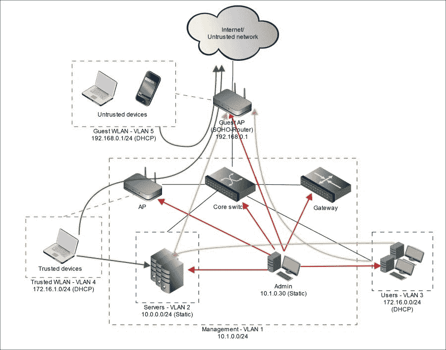

包含逻辑层的网络图

为了扩展图示并更好地解释目标访问规则，下面表格中展示了关于允许访问的附加信息：

| 来源 | 允许的目标 | 目的 |
| --- | --- | --- |
| 管理员工作站 |

+   所有网络设备

+   所有服务器

+   所有用户工作站

+   互联网（外部网络）

| 网络和系统管理 |
| --- |
| 服务器 |

+   互联网（外部网络）

| 软件安装和更新 |
| --- |
| 用户工作站 |

+   互联网（外部网络）

+   服务器

| 互联网访问，访问内部网络服务 |
| --- |
| 受信 WLAN |

+   互联网（外部网络）

+   服务器

| 互联网访问，访问内部网络服务 |
| --- |
| 客户 WLAN |

+   互联网（外部网络）

| 互联网访问 |
| --- |

我们不希望任何外部网络或客户 WLAN 访问我们的实验室网络，因此我们不允许此类访问。同时，用户子网和受信 WLAN 以及服务器子网之间也无需访问，因此我们不允许它。最后的规则是，只有管理员才能访问网络设备上的任何服务；因此，我们不允许其他实验室组件访问这些服务。

# 配置硬件有线设备

所以，理论部分已经足够了。现在让我们进行一些实践，最终配置网络设备。

我们将通过控制台端口使用一种特殊的控制台电缆来配置路由器和交换机，在我们这个例子中，电缆一端是 RJ-45 连接器，另一端是 DB-9 连接器。现代计算机上很难找到 DB-9 端口，因此我们需要一个 DB-9 到 USB 的适配器电缆，以便将其连接到 USB 端口。你可以在以下来自 Cisco 网站的图片中看到这种电缆和适配器的示例：

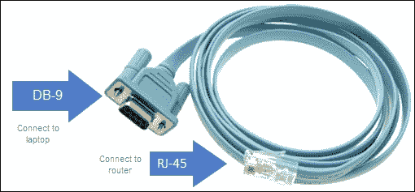

Cisco 控制台电缆

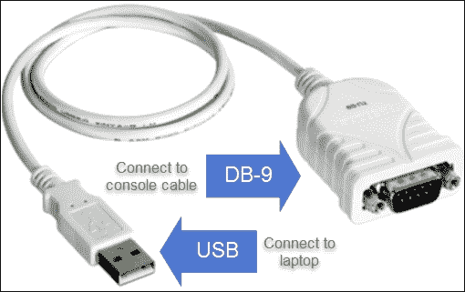

DB-9 到 USB 适配器

### 提示

你可能需要安装特殊的驱动程序来使用适配器，因此请检查适配器的用户手册。

另外，你可以购买带有 RJ-45 和 USB 接口的控制台电缆，例如在 eBay 上（[`www.ebay.com/`](http://www.ebay.com/)）：

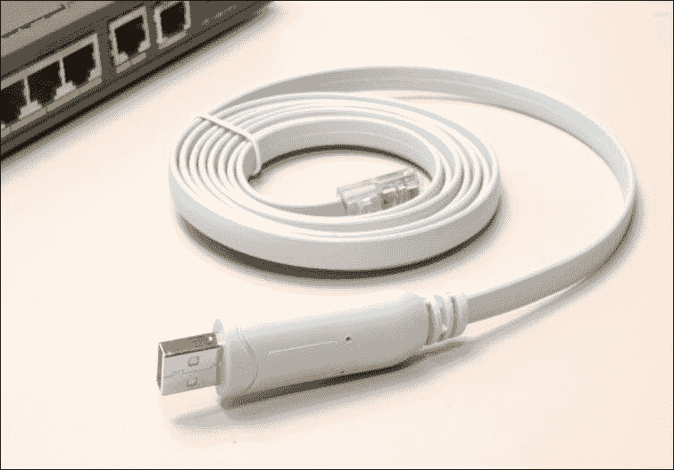

RJ-45 到 USB 控制台电缆

我们还需要一个终端软件，以便通过控制台端口与设备进行通信。在 Linux 或 MAC OS X 上，你可以通过其控制台端口与 Cisco 设备进行通信，例如使用“screen”软件。你只需要在连接电缆后，通过 `dmesg` 命令找到接口名称，并将其作为参数传递给 screen 工具：

```
**dmesg |grep tty**

```

在我们的例子中，我们可以看到以下信息，其中包含接口名称：

```
**[31043.758232] usb 1-2: pl2303 converter now attached to ttyUSB0**

```

现在，我们使用这个名称和`screen`：

```
**screen /dev/ttyUSB0**

```

我们可以与设备的控制台端口进行通信。

在 Windows 上，你可以使用免费的 PuTTY 软件。我们将展示这种连接方式，但所有进一步的设备配置步骤是相同的，无论你使用什么操作系统与设备进行通信。

### 注意

我们不会为每个配置步骤提供详细的解释，因为我们的目标不是教你网络设备管理，而是让你得到一个可用的实例来执行实验任务。你可以通过在终端中使用命令名称后加上 `?` 符号，获取任何 Cisco 命令的帮助信息，例如，`show ?`。

## 在 Windows 上准备控制台连接

准备 Windows 控制台连接的第一步是确定要与 PuTTY 软件一起使用的串口号。为此，你需要打开设备并将其控制台端口连接到计算机的 USB 端口之一。控制台端口会有相应的标记或指示。不要混淆，将控制台电缆连接到路由器的其他 RJ-45 端口——这样是无法工作的。

如果你使用的是较新的设备型号，它们可能配有 USB 控制台端口，你可以用 USB 电缆（A 型到迷你 B 型）将其连接到计算机的任何 USB 端口。为了能够通过这根电缆进行通信，你需要安装 Cisco USB 控制台驱动程序，可以在 Cisco 官方网站找到。

连接控制台电缆并打开设备后，在 Windows 中打开 **设备管理器**，在设备树中找到 COM 和 LPT 端口。在此分支下，您可以找到一个 USB 到串口设备，并从中获取一个 COM 端口号：

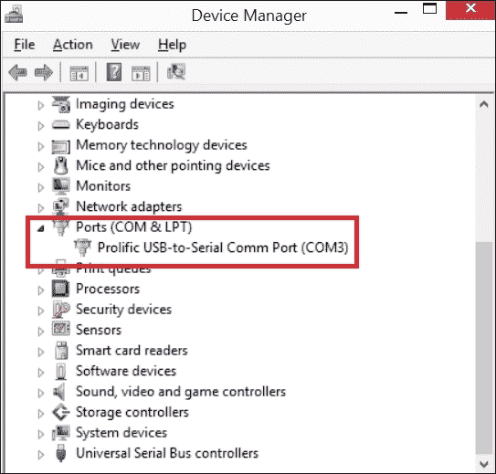

获取 COM 端口号

现在我们知道了 COM 端口号，我们可以打开 PuTTY 并将 **连接类型** 设置为 **串行**，将 **串行线** 设置为正确的 COM 端口，我们这里是 **COM3**：

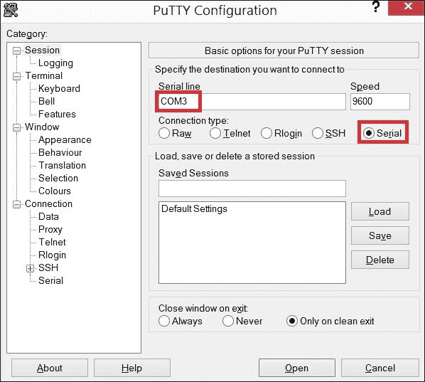

获取 COM 端口号

现在，我们已经准备好连接并与您的设备通信。

### 提示

您还可以保存此连接，这样您就不需要每次想使用设备控制台时都进行配置。

### 注意

在您的实验网络中工作期间，您可能会遇到一些配置挑战。是的，我们在本书中提供了非常详细的手册，但正如通常在异构的 IT 环境中发生的那样，仅仅按步骤手册配置某些严肃的东西是不太可能的。总会有一些事情不能正常工作或者不按您所期望的方式工作。造成这种情况的原因可能有很多，比如不同的软件版本或不同的硬件，因此您不应害怕在互联网上查找解决方案。我们建议您应该珍惜这样的学习机会，深入了解您的环境。

要解决实验安装和维护过程中的任何挑战，您需要使用两个重要的 IOS 命令：`logging buffered` 和 `debug`。

您还可以从 Cisco 网站下载并阅读官方的 *Cisco IOS 配置基础命令参考* 作为参考资料。

## 核心交换机

让我们从安装和配置交换机开始，它将作为我们网络的核心，并在实验组件之间提供基本连接。

我们的交换机有 12 个端口，我们首先需要确定端口布局。我们需要一个物理接口用于连接外部不受信任网络，一个物理接口用于路由器连接，一个物理接口用于管理工作站，三个用户接口，四个服务器接口和一个接入点接口用于建立受信任的 WLAN。让我们在以下表格中总结一下：

| 接口 | 连接 |
| --- | --- |
| `fa0/1` | 路由器 |
| `fa0/2` | 外部路由器（网络） |
| `fa0/3` | 管理工作站 |
| `fa0/4-fa0/6` | 用户子网 |
| `fa0/7-fa0/10` | 服务器子网 |
| `fa0/11` | 受信任的 WLAN |

现在您知道在哪里连接什么之后，您可以开始将路由器连接到我们的交换机并执行初始交换机配置。

### 初始配置

如果你使用的是虚拟或新的网络设备，初始配置可能仅限于设置主机名，使用命令`hostname`。但如果你使用的是旧设备（如果你用于实验室，这种情况非常可能），可能会有旧的配置被保存，而这些配置显然是不需要的。为了避免无意中启用或禁用任何不安全的功能，作为首次配置的第一步，我们将删除当前配置并将操作系统恢复到出厂设置。

### 注

设备配置可能会被之前的拥有者设置了密码，而你可能不知道这些密码。在这种情况下，你可以使用硬件开关将设备恢复到出厂设置。这样的开关通常看起来像一个带有“mode”标志的按钮。你需要按住它一段时间才能生效。有关特定设备配置手册，请参考思科官网。

为此，连接到设备控制台，首先通过输入以下命令进入特权命令模式：

```
**enable**

```

你会看到你的命令提示符以`#`符号结尾，这意味着你现在处于特权模式。现在，我们需要通过以下命令启动配置终端模式：

```
**config t**

```

现在，使用以下命令擦除旧配置并恢复为空白配置：

```
**erase startup-config**
**reload**

```

重新加载操作系统将需要一些时间。如果你有一根电缆连接到设备的以太网端口，交换机会尝试通过多播消息发送到 255.255.255.255 来从 TFTP 服务器加载配置镜像。很可能，你没有可访问的 TFTP 服务器，因此你会在控制台看到类似于以下的错误消息：

`%Error opening tftp://255.255.255.255/network-confg (Timed out)`

重新加载设备后，应该会出现启动初始配置对话框的提示。如果你不确定自己在做什么，我们不建议使用它，以避免你的配置与我们的配置有所不同。但如果你想使用它，只需回答“是”或在对话框未出现时从特权模式下运行命令`setup`。此对话框将通过简单的问题引导你完成初始配置。以下是思科官方文档中的一段话：

> 如果你在使用设置命令时出错，你可以退出并重新运行设置命令。按 Ctrl-C，并在特权 EXEC 模式提示符下输入设置命令。

为了完成我们的初步配置，请使用以下命令为核心交换机设置主机名：

```
**enable**
**config t**
**hostname sw**

```

这里，`sw`是你为设备选择的名称。当然，你可以选择任何你喜欢的名称，但我们建议使用本书中提供的名称，以避免以后可能的混淆。

### 配置接口和 VLAN

作为下一步，让我们配置交换机的接口和虚拟局域网，以便将我们的实验室子网在逻辑上彼此隔离。

首先，我们需要确定一个 VLAN 与接口的布局，并为其分配 VLAN 号码和名称，如下表所示：

| 接口 | 模式 | VLAN 号码 | VLAN 名称 |
| --- | --- | --- | --- |
| `fa0/1` | 干道 | - | - |
| `fa0/2` | 接入 | 5 | 外部 |
| `fa0/3` | 接入 | 1 | 默认 |
| `fa0/4-fa0/6` | 接入 | 3 | 用户 |
| `fa0/7-fa0/11` | 接入 | 2 | 服务器 |
| `fa0/12` | 接入 | 4 | 受信任的无线局域网 |

### 注意

在思科网络中，干道模式允许端口传输设备上任何可访问的 VLAN 的流量，而接入模式则只传输分配给该端口的单一 VLAN 的流量。

现在，让我们将其作为交换机配置来实现。

如果你还没有进入特权模式和配置模式，可以按顺序输入相应命令，然后使用以下控制台命令定义你的 VLAN 号码和名称：

```
**vlan 2**
 **name servers**
**!**
**vlan 3**
 **name users**
**!**
**vlan 4** 
 **name trusted_wlan**
**!**
**vlan 5**
 **name external_network**

```

定义 VLAN 之后，我们需要将接口设置为正确的模式，给它们添加描述，分配 VLAN 号码，并开启接口。我们可以使用以下命令实现：

```
**interface fa0/1**
 **switchport mode trunk**
 **description router trunk**
 **no shutdown**
**!**
**interface fa0/2**
 **switchport mode access**
 **switchport access vlan 5**
 **description external network**
 **no shutdown**
**!**
**interface fa0/3**
 **switchport mode access**
 **switchport access vlan 1**
 **no shutdown**
**!**
**interface fa0/4**
 **switchport mode access**
 **switchport access vlan 3**
 **no shutdown**
**!**
**interface fa0/5**
 **switchport mode access**
 **switchport access vlan 3**
 **no shutdown**
**!**
**interface fa0/6**
 **switchport mode access**
 **switchport access vlan 3**
 **no shutdown**
**!**
**interface fa0/7**
 **switchport mode access**
 **switchport access vlan 2**
 **no shutdown**
**!**
**interface fa0/8**
 **switchport mode access**
 **switchport access vlan 2**
 **no shutdown**
**!**
**interface fa0/9**
 **switchport mode access**
 **switchport access vlan 2**
 **no shutdown**
**!**
**interface fa0/10**
 **switchport mode access**
 **switchport access vlan 2**
 **no shutdown**
**!**
**interface fa0/11**
 **switchport mode access**
 **switchport access vlan 2**
 **description IDS**
 **no shutdown**
**!**
**interface fa0/12**
 **switchport mode access**
 **switchport access vlan 4**
 **description Trusted WLAN**
 **no shutdown**
**exit**

```

### 提示

如果你不小心设置了错误的接口配置，可以通过在相同命令前加上`no`来轻松删除它们。例如，考虑以下命令：

```
**switchport mode access**

```

可以通过以下命令取消配置：

```
**no switchport mode access**

```

一旦你配置了 VLAN，你可以使用命令 `show vlan` 和 `show interfaces` 来查看你的配置。要查看整个配置，使用命令 `show running-config`。

### 提示

玩转 show 命令：输入 `show ?`，并尝试从显示的列表中选择各种命令，以查看不同的配置参数。

此时，我们已经有了一个基本的工作配置，可以将其他实验室组件连接到核心交换机，但由于我们正在搭建一个安全的实验室，建议在此之前进行一些基本的加固。

加固核心交换机的主要目的是：保护我们的实验室免受外部恶意活动，并为练习高级攻击技术做准备。我们将向你展示一些基本的加固步骤，但建议你进一步参考思科官网提供的正式的 IOS 设备加固指南：

[`www.cisco.com/c/en/us/support/docs/ip/access-lists/13608-21.html`](http://www.cisco.com/c/en/us/support/docs/ip/access-lists/13608-21.html)

我们通过在配置模式（`config t`）中使用以下命令设置特权模式密码来开始加固：

```
**enable secret 0 secret_password**

```

你可以将 `secret_password` 更改为你想要的密码。

接下来，我们需要在连接到外部网络的接口（`fa0/2`）上禁用**思科发现协议**（**CDP**）：

```
**interface fa0/2**
 **no cdp enable**

```

这将限制关于我们网络设备的信息广播到外部的不受信任网络。

为了保存新的配置并防止其在重启设备后被删除，我们需要将运行配置复制到启动配置：

```
**copy running-config startup-config**

```

现在，我们已经搭建了一个功能齐全的实验室网络核心，接下来可以开始配置我们的路由器。

## 加固核心交换机

我们的网关（同时也是我们的核心路由器）应该在子网之间进行路由，使得实验室组件能够互相通信。它还应该为用户子网和受信 WLAN 提供 DHCP 服务，并为互联网（外部网络）访问执行多对一的网络地址转换（NAT）。

和所有网络设备一样，我们将从初始配置开始。这与我们为核心交换机所做的配置类似。在这种情况下，我们只需要使用以太网电缆将路由器的端口`fa0/0`与交换机的端口`fa0/1`连接，恢复路由器的配置为空白，并设置主机名`gw`：

```
**enable**
**config t**
**erase startup-config**
**reload**
**enable**
**config t**
**hostname gw**

```

### 提示

你可以使用与核心交换机相同的命令保存配置：`copy running-config startup-config`。

此时，我们已经准备好配置路由器的主要功能所需的先决条件：子接口和子网。

### 配置子接口和子网

在我们的实验室中，我们正在实现“路由器在一个接口”方案，以便所有内部子网都通过一个 FastEthernet 路由器接口提供服务。为此，我们需要为网络中的每个 VLAN 创建`fa0/0`接口的子接口，并为它们分配 IP 地址。网关将在每个子网中具有最后一个八位字节等于 1 的 IP 地址：

```
**interface fa0/0.1**
 **encapsulation dot1Q 1**
 **ip address 10.1.0.1 255.255.255.0**
**!**
**interface fa0/0.2**
 **encapsulation dot1Q 2**
 **ip address 10.0.0.1 255.255.255.0**
**!**
**interface fa0/0.3**
 **encapsulation dot1Q 3**
 **ip address 172.16.0.1 255.255.255.0**
**!**
**interface fa0/0.4**
 **encapsulation dot1Q 4**
 **ip address 172.16.1.1 255.255.255.0**

```

### 注意

当我们进入接口配置模式（输入命令`interface f...`后），我们需要首先设置封装模式，只有在此之后才设置 IP 地址和子网掩码，否则会出现错误。

完成子接口配置后，让我们激活父接口以激活所有子接口：

```
**interface fa0/0**
 **no shutdown**

```

现在，我们可以输入命令`end`退出配置模式，然后通过输入以下命令来检查我们的结果接口配置：

```
**show ip interface brief**

```

我们应该看到类似这样的列表：

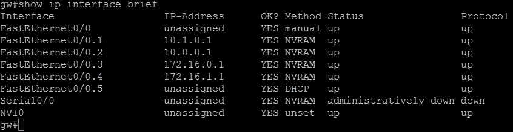

终端窗口中的接口状态

我们可以从之前的列表中看到所有子接口以及它们的新 IP 地址和状态。

### 配置辅助服务

配置完路由器的子接口后，是时候为我们的用户子网和受信 WLAN 设置 DHCP 服务器了：

```
**ip dhcp pool users**
 **network 172.16.0.0 255.255.255.0**
 **dns-server 172.16.0.1 8.8.8.8**
 **default-router 172.16.0.1**
**!**
**ip dhcp pool trusted**
 **network 172.16.1.0 255.255.255.0**
 **dns-server 172.16.1.1 8.8.8.8**
 **default-router 172.16.1.1**

```

接下来，让我们在网关上配置 NAT，以便实验室网络组件可以访问外部网络，以便下载软件更新、DNS 解析、电子邮件交换等。

首先，我们需要确定内外 NAT 接口。我们希望仅为我们的用户、管理员和服务器提供 Internet 访问，即 VLANs 1 至 4 以及路由器的子接口`fa0/0.1`、`fa0/0.2`、`fa0/0.3`和`fa0/0.4`。这些是我们的内部接口：

```
**interface fa0/0.1**
 **ip nat inside**
**!**
**interface fa0/0.2**
 **ip nat inside**
**!**
**interface fa0/0.3**
 **ip nat inside**
**!**
**interface fa0/0.4**
 **ip nat inside**

```

外部接口是连接到外部网络的接口，在我们的情况下是`fa0/0.5`。该接口通过 DHCP 从外部授权机构获取其 IP 地址：

```
**interface fa0/0.5**
 **ip address dhcp**
 **ip nat outside**
 **ip nat inside source list 102 interface Ethernet1 overload** 

 **ip classless**
 **ip route 0.0.0.0 0.0.0.0 192.168.0.1**

```

### 提示

如果你在 NAT 配置中遇到问题，可以通过命令 `debug ip nat` 激活 NAT 调试模式，以便追踪问题源并解决它。

此外，命令 `show ip nat translations` 也可以提供帮助。

接下来，让我们在网关上配置 DNS 服务。我们将启用 DNS 角色并设置 Google 的 DNS 服务器，IP 地址为 8.8.8.8，作为我们的外部名称服务器。如果你在公司网络中构建实验室，可以使用公司 DNS 服务器的 IP 地址。

DNS 角色配置可以分为两步：

1.  在配置模式下启用路由器上的角色，并允许域名查找，使用以下命令：

    ```
    **gw(config)# ip dns server**
    **gw(config)# ip domain-lookup**

    ```

1.  分配上游名称服务器，供我们的路由器获取 DNS 请求的互联网信息（插入你首选的命名服务器的 IP 地址，或使用相同命令添加其他服务器）：

    ```
    **gw(config)# ip name-server 8.8.8.8**

    ```

### 提示

如果你想为服务器或实验室网络中的其他主机分配域名，以便通过名称而非 IP 地址来访问它们，可以使用以下附加命令为每个主机配置（根据需要更改名称和 IP 地址）：`gw(config)# ip host admin 10.1.0.30`。

### 基本网关加固

路由器负责控制我们实验室与外部不可信网络之间的通信，该路由器被分配到 VLAN 5 并配置在子接口 `fa0/0.5` 上。因此，我们必须对路由器和该接口进行一些加固。作为路由器级的安全特性，我们将使用**访问控制列表**（**ACL**）（稍后我们将在第五章，*实施安全*中讨论）和特权模式的密码保护：

```
**enable secret 0 secret_password**

```

接下来，让我们通过禁用不必要的、潜在危险的服务来加固外部连接子接口 `fa0/0.5` 的安全性。进入该接口的配置模式：

```
**config tinterface fa0/0.5**

```

让我们禁用 CDP 和 HSRP，以减少设备暴露给不可信子网的攻击面和信息泄露，并输入以下命令：

```
**no cdp enable**
**no standby**
**no vrrp**

```

第一条命令显式禁用 CDP，它可能会将设备的有价值信息广播到不可信的网络。

第二条和第三条命令显式禁用 **热备份路由协议**（**HSRP**）和 **虚拟路由器冗余协议**（**VRRP**），这些协议可能被用来进行来自不可信网络的攻击。

作为路由器配置的最后一步，保存更改，以防丢失设置：

```
**copy running-config startup-config**

```

# 配置虚拟有线网络设备

现在，让我们考虑如何使用虚拟设备来实现我们的实验室网络。逻辑拓扑将与之前描述的网络拓扑完全相同（在硬件设备上实现），并且具有相同的寻址。主要资源将部署在单主机高性能计算机上的虚拟机中。对于虚拟化资源，我们将使用免费的跨平台软件 GNS3 和 VirtualBox。  

首先，我们需要一台高性能的计算机，并且操作系统正确。在我们的案例中，它将是一台配备 i7 x64 处理器、8 GB 内存，运行 Windows 8.1 操作系统的笔记本电脑。  

## 网络虚拟化平台

**图形网络模拟器**（**GNS3**）是一个用于实验、测试、演示和学习网络技术的平台。GNS3 是一个跨平台工具，支持 Windows、Linux 和 Mac OS X。它具有便捷的图形界面，本质上是 Dynamips 的图形用户界面。Dynamips 是一个思科路由器的软件模拟器，它允许我们模拟路由器的硬件，加载并与思科 IOS 的真实镜像交互。Dynamips 支持以下平台：  

+   1700（1710-1760）  

+   2600（2610-2650 XM）  

+   2691  

+   3600（3620, 3640, 3660）  

+   3725  

+   3745  

+   7200（从 NPE-100 到 NPE-G1）  

作为一个虚拟化平台，GNS 存在一些缺点。最关键的限制如下：  

+   **对 CPU 和内存的要求很高**：10 个路由器会严重加载 PC。CPU 使用率可以通过“空闲 PC”机制降低，稍后在*网络拓扑实现*部分会详细描述。  

+   **L2 支持较弱**：没有完全的网络交换机仿真，仅支持路由器。但可以设置接入/中继端口，并且可以配置具有有限 L2 功能的路由器交换模块。  

但尽管存在这些限制，仍然可以在 GNS 引擎上构建测试实验室。  

由于 GNS 是一个虚拟路由器，它需要一个思科 IOS（或其他）路由器操作系统的镜像才能运行。如果你有必要权限的 Cisco 账号，可以从 Cisco 网站获取 IOS 镜像，或者你也可以从互联网下载。另一种选择是从相关硬件设备上下载镜像，如果你有访问权限的话。  

### 软件安装  

首先，我们需要从官方网站[`www.gns3.com/`](https://www.gns3.com/)下载当前版本的 GNS3，并完成简单的注册程序。下载安装文件后（文件名应类似于`GNS3-1.4.4-all-in-one.exe`），只需运行该文件。安装过程非常简单。该过程通常包括欢迎屏幕、许可证协议窗口，以及最后将要安装的组件清单。GNS3 安装包包含了一套必要的第三方软件，如果你是全新安装，可以保留所有的默认选项。如果某些组件已经安装，你可以取消勾选那些组件：  

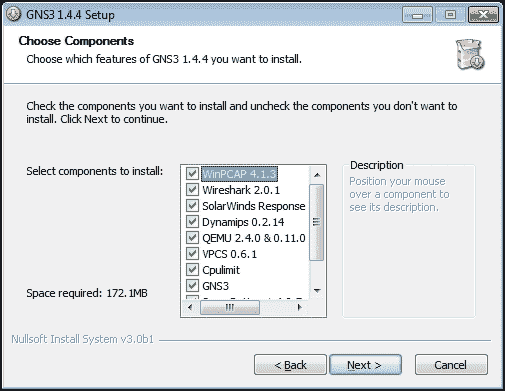  

GNS3 组件  

点击**下一步**按钮几次后，我们将拥有一个正常工作的网络虚拟化平台。

在我们的案例中，我们使用的是 Microsoft Windows 8.1 作为宿主操作系统，因此安装过程按照所述流程进行。但 GNS3 是一个跨平台软件，因此你也可以在 Linux 系统上使用它，尽管安装过程不同，但同样简单。例如，GNS3 在 Ubuntu 或 Debian 的仓库中可用，只需执行以下命令即可安装：

```
**sudo apt-get install gns3**

```

### 注意

如果你想在 Mac OS X 上安装 GNS3，可以在官方网站找到详细的安装指南：[`gns3.com/support/docs/quick-start-guide-for-mac-users`](https://gns3.com/support/docs/quick-start-guide-for-mac-users)。

### 初始配置

现在是启动和配置虚拟化平台的时候了。为此，让我们在桌面上找到 GNS3 的快捷方式并执行它。当应用程序启动时，系统会提示你保存一个新项目。

输入项目名称后，应用程序将打开我们的虚拟环境工作用户界面：

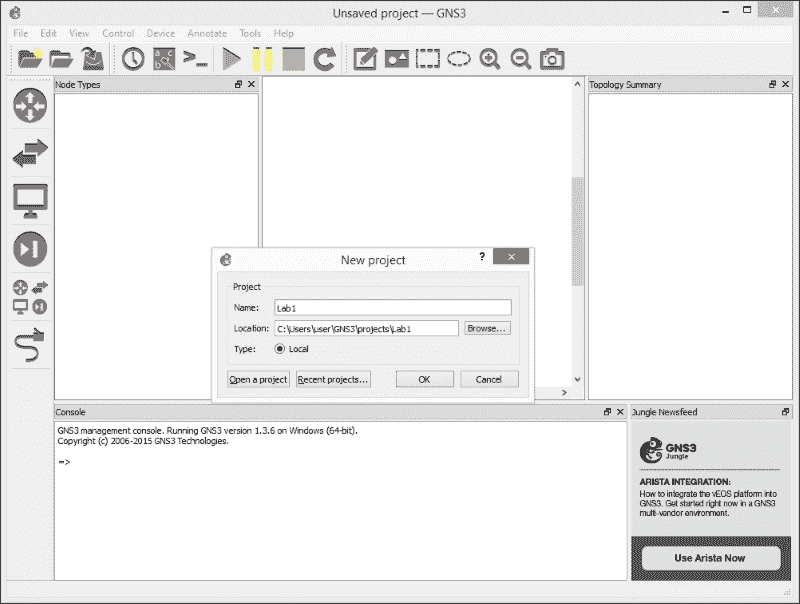

GNS3 用户界面

要设置程序，让我们进入**编辑** | **首选项**。现在，我们可以根据自己的需要配置工作环境。在**常规**标签页中，我们可以选择保存工作文件的路径、界面的样式和显示设置，最重要的是此标签页中的控制台仿真软件及其设置。但由于我们使用的是 Microsoft Windows 作为宿主操作系统，我们保持默认设置（PuTTY）。在**服务器**标签页中，我们可以更改 GNS3 的服务器组件参数，例如远程服务器的连接参数。但在这一步，我们保持默认设置。在**数据包捕获**标签页中，我们可以配置与网络流量分析器的连接。在**VPCS**标签页中，我们可以选择如何使用主机存根。主机存根可以用来验证网络架构（例如，`ping`、`tracert`等）。默认应用程序随 GNS3 一起安装。在这里，我们可以保留默认设置。在**VirtualBox**标签页中，我们应设置 VirtualBox 管理应用程序（`VBoxManage.exe`）的路径。在我们的实验中，我们不会使用**IOS on Unix**和**QEMU**标签页，因此我们也不做更改。

我们现在需要做的是将 Cisco IOS 镜像添加到已使用设备列表中（如果我们已经获取了 IOS 镜像）。这可以在**Dynamips**选项卡中完成。在这一步，我们需要创建两个虚拟设备：交换机和网关。点击**新建**按钮后，将启动虚拟设备创建向导。开始时，我们需要输入 IOS 镜像文件的路径。之后，镜像文件将被解压，接着会出现一系列关于设备的问题。平台的规格应自动识别。RAM 应保持默认值。在**网络适配器**页面中，您应选择将要使用的适配器及其插槽。

对于虚拟交换机设备，我们应该选择交换网络适配器。在 GNS3 中，它是 NM-16ESW。在我们的案例中，我们使用插槽 0。您可以选择其他插槽，但我们建议使用与之前描述的*硬件配置*一致的插槽。对于虚拟网关设备，我们应该选择带有 1 个端口的接口，例如 NM-1FE-TX，并将其放入插槽 0。

最后需要处理的是**空闲 PC**值；在这一步，保持该字段为空：

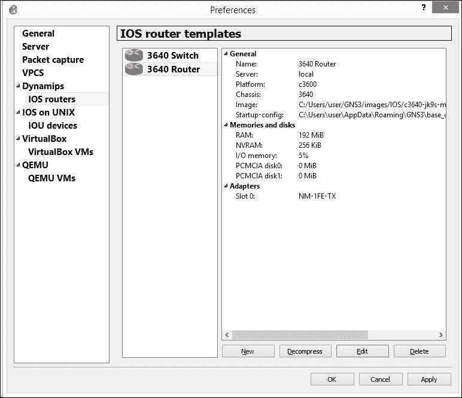

虚拟 IOS 设备

所以，经过这些操作后，我们将在可用设备列表中看到两个虚拟的 Cisco IOS 实例。

### 网络拓扑实现

接下来，让我们在 GNS3 工作区中实现我们的网络拓扑。设计网络图的过程类似于其他任何设计系统：选择设备图标并将其拖到工作区中。然后，使用**添加连接**工具将设备的网络接口相互连接。

在我们的案例中，结果类似于以下截图：

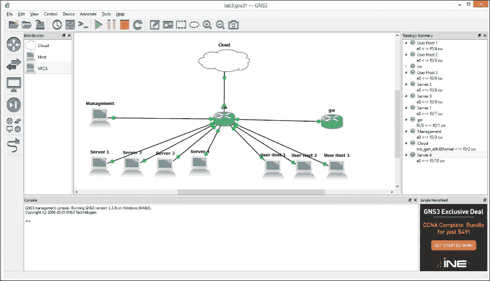

网络拓扑图

现在，我们使用存根**VPCS**作为主机。交换机和路由器是我们之前基于 Dynamips 的 IOS 镜像创建的 Cisco IOS 设备。与 SOHO 路由器和硬件 AP 的连接，我们使用一个叫做**Cloud**的工具。

为了与之前描述的*硬件配置*一致，接口之间的连接应如下所示：

| 功能组 | 连接类型 | 设备 | 接口 |
| --- | --- | --- | --- |
| 服务器 | `Ethernet0` | SW | `F0/7` 到 `F0/10` |
| 用户主机 | `Ethernet0` | SW | `F0/4` 到 `F0/6` |
| 管理 | `Ethernet0` | SW | `F0/3` |
| Cloud | `nio_gen_eth:Ethernet` | SW | `F0/2` |
| GW | `FastEthernet0/0` | SW | `F0/1` |

在将所有组件放入项目工作区后，我们需要填写 IOS 设备的 **Idle PC** 字段。**Idle PC** 参数可以显著降低 CPU 使用率，但只有在设备运行时才能更改。因此，我们需要通过点击主窗口工具栏上的 **Start devices** 按钮，或通过点击设备上下文菜单中的 **Start** 项目来启动这些网络设备。对于每个 IOS 设备，我们需要在上下文菜单中选择 **Idle PC** 项目，在弹出的对话框中选择标有星号的值。

## 交换机

与设备的交互通过控制台进行。为此，我们只需要右键点击项目工作区中的设备图标，并从上下文菜单中选择 **Console**。之后，终端仿真器将启动并建立连接。

所以，让我们为我们的核心交换机创建配置。首先，我们设置主机名：

```
**config t**
 **hostname sw**
 **exit**

```

然后我们创建 VLAN：

```
**vlan database**
 **vlan 2 name servers**
 **vlan 3 name users**
 **vlan 4 name trusted_wlan**
 **vlan 5 name external_network**
 **exit**

```

在下一步中，我们设置接口，设置一个连接到路由器的中继端口，并为网络主机设置接入端口：

```
**config t**
**!**
**interface fa0/1**
 **switchport mode trunk**
 **description router trunk**
 **no shutdown**
**!**
**interface fa0/2**
 **switchport mode access**
 **switchport access vlan 5**
 **description external network**
 **no shutdown**
**!**
**interface fa0/3**
 **switchport mode access**
 **switchport access vlan 1**
 **no shutdown**
**!**
**interface fa0/4**
 **switchport mode access**
 **switchport access vlan 3**
 **no shutdown**
**!**
**interface fa0/5**
 **switchport mode access**
 **switchport access vlan 3**
 **no shutdown**
**!**
**interface fa0/6**
 **switchport mode access**
 **switchport access vlan 3**
 **no shutdown**
**!**
**interface fa0/7**
 **switchport mode access**
 **switchport access vlan 2**
 **no shutdown**
**!**
**interface fa0/8**
 **switchport mode access**
 **switchport access vlan 2**
 **no shutdown**
**!**
**interface fa0/9**
 **switchport mode access**
 **switchport access vlan 2**
 **no shutdown**
**!**
**interface fa0/10**
 **switchport mode access**
 **switchport access vlan 2**
 **no shutdown**
**!**
**interface fa0/11**
 **switchport mode access**
 **switchport access vlan 2**
 **description IDS**
 **no shutdown**
**!**
**interface fa0/12**
 **switchport mode access**
 **switchport access vlan 4**
 **description Trusted WLAN**
 **no shutdown**
**exit**

```

如你所见，虚拟网络设备的操作与硬件配置的操作相对应；物理设备连接方式略有不同。

如果你使用虚拟网络设备，像硬件设备那样对其进行适当的加固并不是那么重要。

## 网关

配置硬件和虚拟设备没有显著差异；因此，我们采取与硬件配置相同的方式：

```
**interface fa0/0.1**
 **encapsulation dot1Q 1**
 **ip address 10.1.0.1 255.255.255.0**
**!**
**interface fa0/0.2**
 **encapsulation dot1Q 2**
 **ip address 10.0.0.1 255.255.255.0**
**!**
**interface fa0/0.3**
 **encapsulation dot1Q 3**
 **ip address 172.16.0.1 255.255.255.0**
**!**
**interface fa0/0.4**
 **encapsulation dot1Q 4**
 **ip address 172.16.1.1 255.255.255.0**

**interface fa0/0**
 **no shutdown**

**ip dhcp pool users**
 **network 172.16.0.0 255.255.255.0**
 **dns-server 172.16.0.1 8.8.8.8**
 **default-router 172.16.0.1**
**!**
**ip dhcp pool trusted**
 **network 172.16.1.0 255.255.255.0**
 **dns-server 172.16.1.1 8.8.8.8**
 **default-router 172.16.1.1**

**!interface fa0/0.1**
 **ip nat inside**
**!**
**interface fa0/0.2**
 **ip nat inside**
**!**
**interface fa0/0.3**
 **ip nat inside**
**!**
**interface fa0/0.4**
 **ip nat inside**
**!**
**interface fa0/0.5**
 **ip address dhcp**
 **ip nat outside**
 **ip nat inside source list 102 interface Ethernet1 overload** 

 **ip classless**
 **ip route 0.0.0.0 0.0.0.0 192.168.0.1**

```

## 虚拟主机仿真

现在，我们需要检查虚拟网络与主机仿真器的工作状态。我们将在下一章向你展示如何将 VirtualBox 虚拟机连接到虚拟网络，但目前仿真器的功能已足够用于测试目的。

这种仿真器已经由 GNS 提供；它们是 **VPCS** 类型的桩设备。这些虚拟设备允许我们执行基于 IP 连接的基本操作（ICMP ping 和 TCP/UDP 连接）。与这些设备的交互通过控制台进行，并通过手动输入命令来实现。在我们的案例中，要在设备控制台中设置地址，我们只需要输入一个命令：

```
**ip dhcp**

```

当然，我们可以在设备控制台输入命令时使用静态地址：

```
**ip 10.0.0.101 255.255.255.0 10.0.0.1**

```

其中：

+   10.0.0.101 是主机地址

+   255.255.255.0 是网络掩码

+   10.0.0.1 是网关地址

为了测试网络连接性和可操作性，我们可以使用基于 ICMP 的命令 `ping` 和 `tracert`：

```
**ping 10.0.0.1**
**tracert 10.0.0.1**

```

### 注意

使用 GNS，我们还可以轻松捕获网络流量，例如使用 Wireshark。

你需要做以下操作：

1) 右键点击两个设备之间的链接。

2) 从上下文菜单中选择 **Capture** 项。

3) 之后，Wireshark 将启动（或者启动在 GNS3 偏好设置的 **Packet capture** 标签中设置的其他应用程序）。

在 Wireshark 窗口中，我们将看到所有被拦截的数据包。

## 无线硬件设备

我们无法虚拟化的唯一类型的网络设备是无线接入点。因此，我们将使用物理网络设备。就像硬件配置的情况一样，它将是一个接入点和一个 SOHO 路由器。

为了与外部世界进行交互，GNS3 提供了一个工具**Cloud**，它是 GNS3 虚拟基础设施与主机计算机网络适配器之间的内置连接器。

如果你的主机计算机有两个以太网适配器，你可以使用两个云来连接每个物理设备。但如果你的主机是笔记本电脑，像我们这种情况，你可以使用一个以太网适配器连接到 SOHO 路由器，并将主机的无线适配器用作接入点，而不是硬件接入点。

如果你只有一个以太网适配器，并且仍然不想使用主机的无线适配器，你有两个选择：

+   在硬件设备之间手动切换（AP 和 SOHO 路由器）

+   准备一个额外的虚拟机，带有软件 AP 和一个通过 VirtualBox 的 USB 转发功能连接到它的 USB Wi-Fi 接口（我们简要介绍如何安装必要的软件并在第七章，*准备无线渗透测试平台*中实现这样的场景）

现在，让我们看看如何将主机计算机的网络适配器连接到我们的虚拟基础设施。

右键点击**Cloud**工具的图标，通过从上下文菜单中选择**Configure**打开**Cloud**的配置窗口。在配置窗口中，我们应该在**Ethernet NIO**字段中指定我们要使用的网络适配器，路径是**Cloud** | **Ethernet**。之后，点击**Add**按钮。

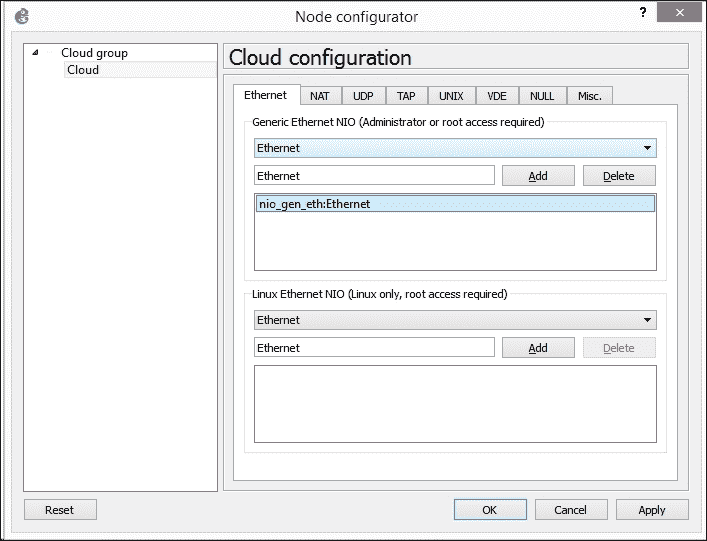

云配置窗口

现在，**Cloud**已经配置完成。相当简单，不是吗？

# 配置 WLAN

现在，让我们考虑作为测试基础设施的一部分创建一个无线网络。根据我们拥有的资源，我们可以使用三种技术来创建无线网络：

+   基于 SOHO 路由器的客户端 WLAN

+   基于硬件接入点的可信 WLAN

+   基于软件接入点的可信 WLAN

每种技术都有其特点（优点和缺点），并提供了多个选择。我们将涵盖这三种选择。

## 客户端 WLAN

由于我们的客户端 WLAN 是基于 SOHO 路由器的，接下来我们将在这里讨论有线和无线配置，以构建一个客户端 WLAN，并为整个实验室网络提供互联网访问（外部网络）。

所有现代 SOHO 路由器（如华硕、Linksys 和 D-Link）提供几乎相同的功能、配置选项和模式，无论型号如何。因此，我们不会提供关于在特定路由器型号的网页界面上点击什么和输入什么的逐步说明（特别是因为对于 IT 专家来说，这没有任何意义）。不过，我们将提供某些设置，以确保我们与读者的网络配置一致，且在后续章节中不会出现兼容性问题。

如果 LAN 网络的 DHCP 服务器角色尚未启用，请启用它，并设置以下配置：

| 设置项 | 值 |
| --- | --- |
| LAN IP 地址 | 192.168.0.2 |
| DHCP IP 池开始 | 192.168.0.3 |
| DHCP IP 池结束 | 192.168.0.20 |

现在，在 SOHO 路由器上配置 WLAN 设置，并将你的访客 WLAN 名称（SSID）设置为你喜欢的任何名称（我们将其命名为`Guest`），将保护类型设置为 WPA2，并设置一个强密码（我们假设作为安全专家，你知道什么构成强密码，因此我们在这里不讨论密码规则）。

作为 SOHO 路由器配置的最后步骤，重启路由器，连接任何客户端设备到访客 WLAN，并测试互联网连接。

## 准备硬件接入点

让我们继续安装和配置硬件接入点。现在，我们可以直接通过 COM 端口连接到接入点设备，并按照这里提供的说明操作。由于我们使用的是同一制造商的设备，并且在相同的软件平台上工作，配置过程与我们之前的任务非常相似。当然，配置接入点有其自身的细节，我们将现在简要说明。首先，进入特权模式：

```
**enable**
**conf t**

```

为我们的设备设置一个主机名：

```
**hostname TrustedWiFiAP**

```

限制设备访问（仅本地访问级别）：

```
 **line vty 0 4**
 **login local**
 **exit**
 **line console 0**
 **login local**
 **exit**

```

接下来，我们将为特权模式设置密码：

```
**enable secret 0 secret_password**

```

最后，我们应配置一个桥接网络接口，以便使受信任的 WLAN 能够与我们实验室的其他基础设施通信：

```
 **interface bv1**
 **ip address 172.16.1.2 255.255.255.0**
 **exit**
 **ip default-gateway 172.16.1.1**

```

现在，我们只需保存新配置，并暂时完成 WLAN 的设置：

```
**copy running-config startup-config**

```

我们将在第五章中进一步讨论硬件 AP 配置（以及软件 AP），*实施安全*，届时我们将已经安装了 RADIUS 服务器，以便能够为我们的受信任 WLAN 应用适当的安全性。

# 总结

在本章中，我们讨论了实验室环境中的网络通信和访问规则。你看到构建实验室网络的两种选择：基于硬件 Cisco 设备和基于虚拟设备。

现在，你可以配置你的设备，并根据你为实验室预算选择的选项之一，构建一个可用的网络。

每当你需要时，你可以进一步添加和配置更多的网络组件/设备/子网，以与我们配置的基础实验室网络相同的方式扩展你的实验室。

在下一章中，我们将向你展示如何设计应用实验室组件，以完成我们的主要实验任务：学习和实践渗透测试。
