# 第四章：设计应用实验室组件

在上一章中，我们为实验室准备了两种选择的网络“基础”：硬件和虚拟。现在，是时候为实验室网络填充应用层功能组件，如 Web 服务器和数据库服务器。这些组件对于构建一个具备大多数真实企业网络能力的实验室网络至关重要，以便渗透测试人员能够练习最常见且“必须掌握”的案例和技术。

通常，应用程序和网络服务是攻击者的主要目标，也是他们攻击的主要对象。这些组件通常用于处理和存储财务和私人数据、商业机密以及其他敏感的机密数据。它们通常用于管理其他网络组件和账户，从而控制对网络资源的访问。有些还可以提供各种客户服务，因此它们是商业公司关键的利润或声誉系统，通常被称为业务关键系统（或应用程序/服务）。

不用多说，企业非常重视保护这些系统和服务，并且通常会寻求第三方意见，委托进行渗透测试和其他信息安全咨询服务。

因此，你必须做好充分的准备，至少要了解一些常见的网络服务，我们将在本章中学习如何实现这一目标。

本章涵盖以下内容：

+   服务规划

+   创建虚拟服务器和工作站

+   安装和配置域服务

+   安装证书认证机构

+   安装远程管理服务

+   安装电子邮件服务

+   安装易受攻击的网络服务

+   安装 Web 应用程序

# 服务规划

一如既往，在你开始构建任何东西之前，应该进行规划，并确保所有前提条件都得到满足。

在当前主题中，我们将定义哪些服务器将托管哪些服务和应用程序。我们将尝试在一台服务器上托管多个应用程序和服务，因为大多数人都受到计算资源和服务器硬件的限制，记得吗？

因此，根据你的能力和预算，你可以使用相对强大的服务器来托管几个相对强大的虚拟机，或者你可以使用 SOHO 计算机来托管内存和 CPU 限制的虚拟机。

### 提示

**实验室环境灵活性**

值得提醒的是，选择哪些主机包括在你的实验室中，哪些主机不包括，取决于你的需求和偏好。我们只想展示安装实验室组件的最有用选项，但具体使用什么、使用哪些并不使用，完全由你决定。

使用虚拟机的一个好处是，你不必同时开启所有服务器。对于大多数实验室任务，你甚至不需要打开你的网络设备。在大多数情况下，只需打开一台虚拟机，保持其他虚拟机挂起即可。

正如我们在前面的章节中已经决定的那样，我们的服务器子网的 IP 范围是 10.0.0.0/24，IP 地址 10.0.0.1 已经分配给了核心路由器的子接口。工作站将通过 DHCP 从路由器获取动态 IP 地址，因此现在不需要为它们规划地址空间，除了管理员工作站，它的 IP 地址是 10.1.0.30。

牢记这一点，让我们绘制另一个表格，总结一下我们将要安装的内容以及其对应的 IP 地址：

| IP 地址 | 操作系统 | 应用与服务 | 备注 |
| --- | --- | --- | --- |
| 10.0.0.2 | Windows Server 2008 | 目录服务 | AD, 电子邮件服务器, 认证机构, SSH |
| 10.0.0.3 | Linux | Metasploitable 2 | 漏洞网络服务 |
| 10.0.0.4 | CentOS | vulnVoIP | 漏洞 VoIP 服务 |
| 10.0.0.5 | Ubuntu Server | Web 应用服务器 | Liferay Portal CE, OWASP WebGoat, DVWA |

你可以随时查看这个表格，快速刷新你对服务器子网布局的记忆。

### 提示

**备份你的实验室系统**

安装完成后，不要忘记对你的虚拟机进行快照。因为在进一步的黑客练习过程中，很有可能会无意间破坏某些东西，拥有一个可以快速恢复的备份镜像（虚拟机快照）是非常有用的。

你可能还希望为一些虚拟机创建多个快照，保存不同配置或安全级别的版本，以便根据当前的实验室任务快速切换。

# 创建虚拟服务器和工作站

现在我们已经知道了需要哪些服务和服务器，但在安装它们之前，我们先快速回顾一下如何创建虚拟机并将其连接到我们的实验室网络。我们将使用 Oracle VirtualBox 虚拟化软件来实现这一目标，因为它既免费又强大。

## VirtualBox 概述与安装

正如我们之前所说，我们将使用 Oracle VM VirtualBox 作为主机的虚拟化平台。VirtualBox 是一款强大、功能丰富、高性能的虚拟化解决方案，适用于企业和家庭使用。VirtualBox 作为开源软件，遵循 GNU **通用公共许可证**（**GPL**）第 2 版的条款免费提供。

### 提示

你可以随时参考官方的 VirtualBox 文档以获取更多信息（[`www.virtualbox.org/wiki/Documentation`](https://www.virtualbox.org/wiki/Documentation)）。

VirtualBox 可以在不同的操作系统上启动，并支持大量的来宾操作系统，包括但不限于 Windows 和 Linux。

支持硬盘镜像格式**VMDK**（**VMware**）和**VHD**（**Microsoft Virtual PC**）能够创建和使用便捷的虚拟主机。但最重要的是，VirtualBox 支持快照功能，这极大地方便了我们在测试基础设施中的工作。因此，这一特点使得 VirtualBox 成为我们目标的最佳选择。

首先，我们需要获取 VirtualBox 的安装包。我们可以从[`www.virtualbox.org/wiki/Downloads`](https://www.virtualbox.org/wiki/Downloads)网站下载。选择适合你平台的二进制包，然后点击链接下载。

下载完成后，执行获取的文件。安装过程简单，无需特殊操作。

启动 VirtualBox 应用程序后，你将看到虚拟机管理界面的窗口。这个界面非常直观，不需要进一步解释。

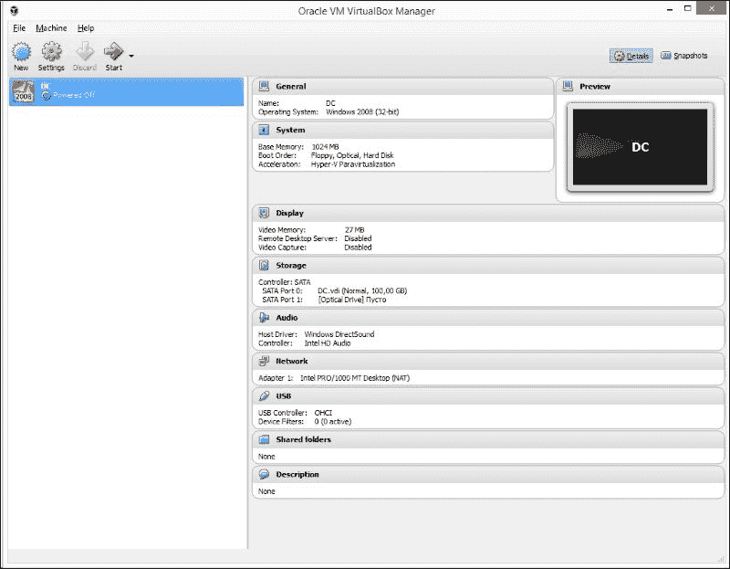

Oracle VM VirtualBox 管理界面

## 创建虚拟机

为了创建新的虚拟机，我们需要点击管理界面主工具栏上的**新建**按钮，**创建虚拟机**向导将启动。在打开的窗口中，我们需要设置新虚拟机的名称，并根据操作系统的版本选择模板。选择模板后，选择以下问题的默认答案（如虚拟机文件的位置及其特性）。向导完成后，我们应该设置操作系统的安装镜像。点击主工具栏上的**启动**按钮来启动我们的新虚拟机。

你可以在微软公司网站上获取操作系统镜像。例如，在我们的实验室中，我们使用了 Microsoft Windows Server 2008 R2 Evaluation 作为 Windows 服务器操作系统。你可以在[`www.microsoft.com/en-US/download/details.aspx?id=11093`](https://www.microsoft.com/en-US/download/details.aspx?id=11093)下载。当然，你也可以使用自己（之前购买的）操作系统安装镜像。

启动虚拟机后，会打开一个新窗口，在这里你可以看到虚拟机的屏幕以及管理虚拟机的菜单选项。在这里，我们可以像使用普通应用程序一样，通过键盘和鼠标与虚拟机进行交互。

就像普通计算机一样，虚拟机在启动时会尝试寻找可引导的介质并从中启动。如果我们设置了操作系统的安装镜像，那么新的操作系统安装过程将会开始。

安装操作系统的过程非常简单，这里不再详细描述。现在，我们需要安装两种类型的操作系统：服务器版和工作站版。在我们的案例中，我们安装了 Microsoft Windows Server 2008 R2 和 Microsoft Windows 7 专业版用于演示，但我们建议你安装几种不同版本的 Windows：最新的几个版本以及一些较老的版本（不是为了学习网络攻击的基础知识，而是为了保持最新）。

安装操作系统后，我们应该配置基本设置，如语言和区域设置、时间和时区。在虚拟机的情况下，基本设置还包括安装额外的软件包：**VirtualBox 客户附加组件**。

[VirtualBox 客户附加组件](https://www.virtualbox.org/manual/ch04.html)是安装在客户操作系统中的一组软件，扩展了其与系统和虚拟化主机系统交互的能力。例如，在安装特殊驱动程序 *虚拟视频* 后，可以在运行虚拟机的 VirtualBox 窗口大小之后任意更改客户操作系统的桌面分辨率。

安装第一个 Windows 服务器和 Windows 工作站后，我们应该关闭虚拟机并保存它们（拍摄快照）。我们将继续使用它们作为快速部署新实例的模板。

## 配置实验组件的网络设置

我们需要为虚拟机配置网络适配器的最后一个操作。我们有两种主要方法，这取决于我们网络基础设施的实现方式（基于硬件网络设备和基于虚拟网络基础设施）。

对于基于硬件设备的网络基础设施，我们需要将网络适配器设置为桥接模式，我们的虚拟机将通过主机计算机的硬件以太网端口与外界交互。为此，我们转到虚拟机设置的 **网络** 选项卡。此时，虚拟机应处于 **关机** 状态。在 **连接到** 组合框中选择 **桥接适配器** 项目。从 **名称** 组合框中选择您的网络适配器。它连接到核心交换机。在我们的情况下，看起来像以下的截图：

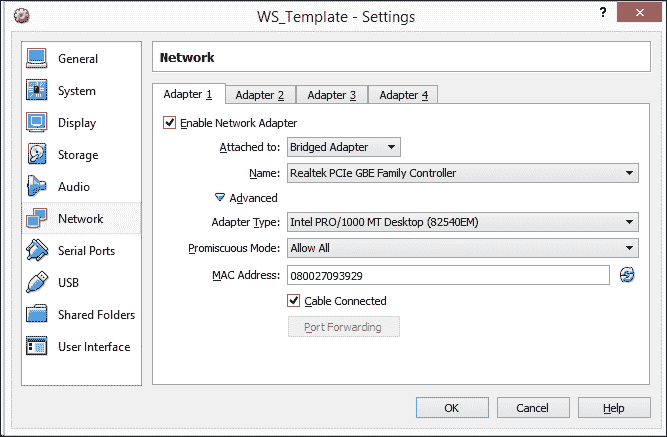

虚拟机的网络接口设置

对于基于 GNS3 的虚拟网络基础设施，我们需要为每台虚拟机执行以下步骤：

1.  启动 GNS3 并转到 **VirtualBox VMs** 设置选项卡。我们在第三章中简要描述过它，*配置网络实验室组件*，所以你应该记得。无论如何，可以通过导航到 **编辑** | **首选项** 来实现这一点。在打开的窗口中，选择 **VirtualBox VMs**。

1.  在 **VirtualBox VM 模板** 部分，我们有一个虚拟机列表（如果您首次访问此选项卡，应该是干净的）和三个管理按钮：**新建**、**编辑** 和 **删除**。

1.  通过按下 **新建** 按钮，将启动向导以添加新的虚拟机。在第一个窗口中，它会询问我们想要连接到我们虚拟网络基础设施的现有虚拟机。

1.  选择虚拟机后，GNS3 将自动创建一个新的*链接*克隆虚拟机，并使用特殊的网络参数。例如，在我们的案例中，网络设置如下：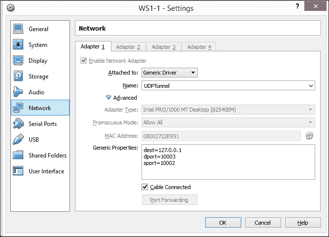

    虚拟机的网络接口设置

# 安装和配置域服务

下一步，让我们安装并配置任何基于 Windows 的企业网络的核心：域及其服务。

## 创建域

在下一步中，我们将创建一个基于 Microsoft Active Directory 的域及其服务。它将提供管理我们基础设施应用层的中央服务（管理用户和计算机、命名服务等）。

首先，我们通过在 VirtualBox 中克隆我们的 Windows 服务器模板来创建一个新的虚拟机。为此，我们只需要在 VirtualBox 管理界面的虚拟机列表中选择**克隆...**，然后在向导中，在第一个窗口勾选**重新初始化所有网络适配器的 MAC 地址**选项，并在第二个窗口选择**完全克隆**选项。

克隆后，启动新的虚拟机。此时，操作系统已安装并运行，且具有基本配置。为了创建域，我们需要在此虚拟服务器上配置域控制器。为此，我们应该执行以下步骤：

1.  在**初始配置任务**页面中，我们需要设置计算机名称。我们选择名称**DC**，简短且明确。

1.  接下来，我们应该设置服务器网络适配器的 IP 配置。我们需要使用静态 IP 地址，因为该服务器将既是域控制器又是 DNS 服务器。我们应该选择之前定义的地址空间中的 IP 地址。现在，我们的域控制器 IP 配置如下：

    | 参数 | 值 |
    | --- | --- |
    | IP 地址 | 10.0.0.2 |
    | 网络掩码 | 255.255.255.0 |
    | 网关 | 10.0.0.1 |
    | DNS | 10.0.0.2 |

1.  接下来，我们应为服务器定义**Active Directory 域控制器**角色。所以，进入**服务器管理器**，在左侧面板中选择**角色**，然后点击右侧面板中的**添加角色**链接。在弹出的**开始之前**窗口中，我们应该点击**下一步**按钮。在接下来的窗口中，勾选**Active Directory 域服务**项。

    在此页面中，你还可以勾选附加角色以添加到我们的服务器，并安装其他功能，或者你也可以稍后再进行，因为现在我们不需要它。

    应该注意的是，Active Directory 需要 DNS 服务器，但现在我们并未添加此角色。在域安装过程中，此角色将自动添加。

1.  创建域控制器的第二个主要步骤是执行`dcpromo`工具。现在，进入**开始**菜单，在**运行**文本框中输入`dcpromo`。你会在列表中找到它，点击**dcpromo**。

1.  结果，我们运行了**欢迎使用 Active Directory 域服务安装向导**。在这个场景下，我们不需要高级选项，因此只需点击**下一步**按钮。

1.  在**操作系统兼容性**页面中，向导警告我们，使用 NT 和非 Microsoft SMB 客户端的用户会遇到 Windows Server 2008 R2 中某些加密算法的问题。在我们的测试环境中没有此类问题，因此只需点击**下一步**按钮。

1.  在**选择部署配置**页面中，我们应选择**在新森林中创建新域**。我们这么做的原因很简单，因为这是一个新森林中的新域。

1.  在**命名森林根域**页面中，我们应在**森林根域的 FQDN**文本框中输入域名。在我们的例子中，我们将域命名为`lab.local`。你可以根据自己的喜好命名域名；但是如果你使用一个已经在互联网上注册的名称，可能会遇到名称冲突的问题。点击**下一步**按钮。

1.  在**设置森林功能级别**页面中，选择**Windows Server 2008 R2**选项。点击**下一步**。

1.  在**附加域控制器选项**页面中，我们只有一个选择：DNS 服务器。全局目录选项已选中，并且不能取消选择；只要它是域中唯一的 DC，它就必须是全局目录服务器。域控制器只读权限选项未勾选，因为要启用此选项，网络上必须有其他非 RODC。我们选择 DNS 服务器选项，并点击**下一步**按钮。

1.  出现一个对话框，提示无法为此 DNS 服务器创建委派，因为找不到授权的父区域或该区域没有使用 Windows DNS 服务器。原因是这是第一个 DC 网络。因此，我们只需点击**是**按钮继续。

1.  在下一页面中，我们将数据库、日志文件和 SYSVOL 的路径保持为默认值，然后点击**下一步**按钮。

1.  在**目录服务恢复模式管理员密码**页面中，我们需要在**密码**和**确认密码**文本框中输入一个强密码。

1.  现在，让我们检查**摘要**页面上的信息，并点击**下一步**按钮以安装 Active Directory。安装过程需要几分钟。安装完成后，我们应该重启服务器。

最后，在你登录后，安装完成。需要注意的是，在安装 Active Directory 时，DNS 服务已经安装，因此我们无需担心它。现在，我们已经准备好了域控制器和`lab.local`域。

## 创建用户

现在，让我们在域中创建用户账户。在 Active Directory 中，这是一个非常简单的过程。基于使用**Active Directory 用户和计算机**管理单元的用户创建方法是最便捷的，因为它采用图形用户界面和向导。该方法的缺点是，在创建用户账户时，无法设置大部分账户属性，必须通过额外编辑已创建的账户来添加它们。要创建用户账户，请按照以下步骤操作：

1.  打开**Active Directory - 用户和计算机**管理单元。你可以通过导航到**开始** | **管理工具** | **Active Directory - 用户和计算机**来完成此操作。你也可以使用快捷键*Win* + *R* 打开**运行**对话框，并输入`dsa.msc`命令执行。

1.  在树形结构中，展开你的域并进入**用户**文件夹。右键点击它，从右键菜单中选择**新建** | **用户**。这将启动向导。

1.  在**新建对象 - 用户**对话框中，输入有关创建用户的信息（名字、姓氏和登录名）。然后点击**下一步**按钮。

1.  在向导的下一页面中，你需要在**密码**字段中输入初始密码，并在**确认密码**文本框中重新输入。除此之外，你还可以设置密码策略的基本参数。

1.  在向导的最后一页，你将看到你输入的参数摘要。如果信息输入正确，点击**完成**按钮以创建用户账户并完成向导。

1.  用户账户创建完成后，你可以在右侧面板的用户账户列表中找到它。通过右键点击该用户账户中的**首选项**项，你可以配置该用户账户的所有属性。

现在，你可以创建多个用户账户。

## 将主机加入域

现在，我们需要创建多个工作站，包括管理员工作站。为此，让我们通过克隆 Windows 工作站模板，在 VirtualBox 中创建新的虚拟机。就像在 Windows 服务器模板的情况下，我们只需从 VirtualBox 管理界面的虚拟机列表的右键菜单中选择**克隆…**选项。在向导中，我们应在第一个窗口中勾选**重新初始化所有网络卡的 MAC 地址**选项，并在第二个窗口中选择**完整克隆**选项。

在克隆并启动我们的新虚拟机后，让我们将其加入域中。这样可以让我们享受域的所有优势，比如集中管理、组策略等等。

在将计算机加入域之前，让我们确保满足以下前提条件：

+   我们的虚拟工作站的网络适配器正在正常工作，并且已分配正确的 IP 地址。我们的工作站的网络适配器操作系统设置为 DHCP。

+   虚拟工作站可以“网络可见”域控制器。我们可以通过基于 ICMP 请求的 ping 工具来检查这一点。

    ```
    **ping 10.0.0.2**

    ```

+   在虚拟工作站上，您以本地管理员身份登录。

接下来，让我们执行以下步骤：

1.  通过点击**开始**，然后右键点击**计算机**，在右键菜单中点击**属性**，打开**系统属性**。

1.  在**计算机名称、域和工作组设置**部分，点击**更改设置**链接。

1.  在**计算机名称**标签页中，点击**更改**按钮。

1.  在**计算机名称**文本框中，输入我们工作站的主机名。

1.  在**成员身份**部分，勾选**域**单选按钮，并输入您想要连接的域名称。在我们的例子中，它是`lab.local`。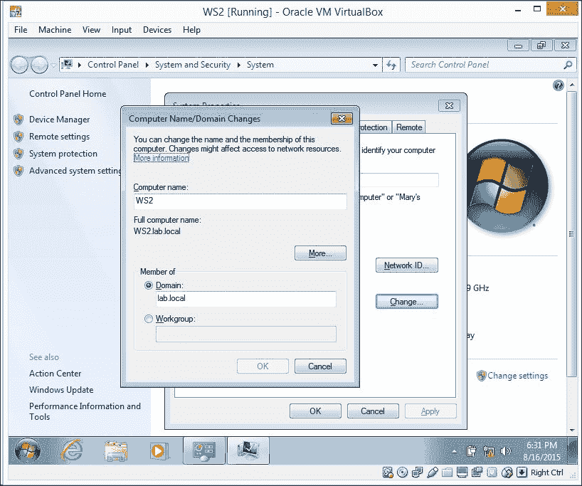

    将工作站加入域

1.  点击**确定**按钮后，系统会提示您输入域管理员的用户名和密码。

1.  在成功将计算机加入域后，系统会提示您重启。为了完成该过程，您应进行重启。

按照相同的方式安装管理员工作站，但不要忘记虚拟机的网络接口应设置为桥接模式，静态 IP 地址为 10.0.1.30，并且应连接到适当的交换机端口。不要忘记在域控制器上创建一个管理员用户账户，并在管理员工作站上登录该账户。

# 认证机构服务

在任何现代化的组织中，都有一个重要的安全子系统叫做**加密学**。这个子系统提供了信息安全的重要属性，如机密性、完整性和真实性。所有这三项属性在安全传输、管理和访问中都是必需的。加密学以及基于它的安全机制是一个庞大的话题，超出了我们书籍的范围。但我们将简要演示如何基于 OpenSSL 创建证书系统。

OpenSSL 是一个免费的软件工具。您可以从[`www.openssl.org/community/binaries.html`](https://www.openssl.org/community/binaries.html)下载 Windows 版本的二进制文件。OpenSSL 是创建您自己的私有证书机构所需的全部工具。

所以，下载此软件并在您的服务器之一的文件夹中解压。在我们的例子中，我们在域控制器（`dc.lab.local`）上的`C:\OpenSSL\`目录中使用它。

创建我们自己的证书机构的过程相当简单：

1.  创建私钥。

1.  自签名。

1.  在工作站上安装根 CA。

一旦完成这些操作，我们所使用的每个服务都可以通过以下步骤创建的证书来进行保护：

1.  创建证书。

1.  使用根 CA 密钥签署证书。

## 创建根证书

首先，我们需要生成一个根密钥，它将用于后续的根证书。可以使用以下命令来完成此操作：

```
**openssl genrsa -out rootCA.key 2048**

```

这里：

+   `2048`：这是我们的密钥长度，单位为位

+   `rootCA.key`：这是我们的根密钥文件名

之后，我们执行第二个命令来创建一个自签名的根证书：

```
**openssl req -x509 -new -key rootCA.key -days 1200 -out rootCA.crt**

```

这里：

+   `rootCA.key`：这是我们的 CA 私钥

+   `1200`：这是我们的证书有效期，以天为单位（1,200 天大约等于 3 年）

在这里，我们会被问到几个问题，你可以根据自己的喜好回答：

```
**Country Name (2 letter code) [US]: RU**
**State or Province Name (full name) [Some-State]:**
**Locality Name (eg, city) []:Moscow**
**Organization Name (eg, company) [Internet Widgits Pty Ltd]: Test Lab**
**Organizational Unit Name (eg, section) []: Lab**
**Common Name (e.g. server FQDN or YOUR name) []: lab.local**
**Email Address []: support@lab.local**

```

在这些操作之后，我们得到了两个文件：

+   `rootCA.crt`：用于安装在服务器或工作站上的公钥，也可供公开分发

+   `rootCA.key`：私钥，应保密

现在，我们可以为我们的服务创建证书，并将根证书安装到我们的工作站中。

## 创建工作证书

所以，让我们创建一个由我们的 CA 签名的证书（例如，为某个 Web 服务）。这个过程相当简单：

1.  生成密钥：

    ```
    **openssl genrsa -out web.lab.local.key 2048**

    ```

1.  创建证书签名请求：

    ```
    **openssl req -new -key web.lab.local.key -out web.lab.local.csr**

    ```

    在这里，指定服务器的名称非常重要：域名或 IP（在我们的例子中是`web.lab.local`）：

    ```
    **Common Name (eg, YOUR name) []: web.lab.local**

    ```

1.  我们应该使用我们的根证书签署证书请求：

    ```
    **openssl x509 -req -in web.lab.local.csr -CA rootCA.crt -CAkey rootCA.key -CAcreateserial -out web.lab.local.crt -days 365**

    ```

## 安装根证书

现在，我们可以在我们的服务器和工作站中安装根证书。为此，我们需要将根证书安装到受信任的主机证书存储库中。一些浏览器使用默认的操作系统存储库。例如，在 Windows 中，Internet Explorer 和 Chrome 都使用默认的证书管理。它们都会把你带到同一个地方——Windows 证书存储库。所以，我们可以打开 Internet Explorer，进入**Internet 选项** | **内容** | **证书**。现在，我们可以将根 CA 证书安装在**受信任的根证书颁发机构**标签下。然而，Windows 上的 Firefox 有自己的证书存储库，所以如果你同时使用 IE 或 Chrome 以及 Firefox，你将需要将根证书安装到 Windows 存储库和 Firefox 存储库中。

### 注意

有关基于 OpenSSL 构建 CA 的好手册，见于[`jamielinux.com/docs/openssl-certificate-authority/index.html`](https://jamielinux.com/docs/openssl-certificate-authority/index.html)。

# 安装远程管理服务

现在我们已经准备好服务器，并且具备了创建安全证书的能力，让我们来看一下为我们的服务器安装安全远程管理服务的可能性。为此，最好的解决方案是 SSH。

**SSH**（即**安全外壳**的缩写）是一个网络应用层协议，允许远程管理操作系统并进行 TCP 连接的隧道传输（例如，传输文件）。它具有类似于 telnet 或 rlogin 的功能，但与它们不同的是，它对所有流量进行加密，包括传输的密码。大多数网络操作系统都提供 SSH 客户端和 SSH 服务器。

虽然 SSH 在所有 Linux 服务器发行版中都是内置的，但 Windows 默认没有 SSH，因此我们希望安装它，以便使我们的实验环境更加复杂，这对于攻击练习来说总是好的。

市场上有多个软件解决方案，但在我们的实验室中我们使用的是 freeSSHd。顾名思义，freeSSHd 是一个免费的、简单的 SSH 服务器实现，提供了 SSH 协议的完整功能。

安装包可以在网站[`www.freesshd.com/?ctt=download`](http://www.freesshd.com/?ctt=download)找到。下载并安装 freeSSHd 后，我们可以像正常应用程序一样启动 freeSSHd，或者作为 Windows 服务启动。在管理应用程序中，我们可以设置主要参数：

+   启动或停止 SSH 服务器

+   选择将使用的加密算法

+   流量隧道参数

+   管理主机限制

+   设置将使用的接口和端口号

+   设置将使用的命令行

+   选择将使用的加密密钥（这是最重要的一项）

所有参数都很直观，因此我们不会详细讨论它们。但是，我们会将用户管理作为当前最重要的部分来考虑。

在**用户**标签页中，我们有三个按钮：**新建**、**编辑**和**删除**。点击**新建**，会弹出**用户属性**窗口。在这里，我们需要选择授权方法。我们有三个选项：

+   **NT 身份验证**（使用操作系统的功能）

+   **密码以 SHA1 哈希形式存储**（使用 freeSSHd 的内建功能）

+   **公钥（仅限 SSH）**

由于我们有一个域，并且可以使用域用户身份验证程序，因此选择**NT 身份验证**。我们需要在**域**文本框中指定域名；在我们的案例中，它是`lab.local`。在**登录**文本框中，我们应该输入现有域用户的用户名。完成这些后，选择在**用户可以使用**部分中将授予该用户的权限（命令行、文件传输和流量隧道）。

在用户账户创建并且服务启动后，我们可以尝试连接到远程服务器上的管理服务。

### 注意

Windows 服务器通常通过原生的 Windows 解决方案如远程桌面来管理，但在我们的案例中，我们希望拥有一个复杂且脆弱的实例。因此，我们添加了过多的功能和软件。

# 企业电子邮件服务

在我们的实验室中，我们模拟了一个小型组织，而任何组织信息基础设施的 IT 服务基础是用户之间信息交换的能力。通常，用户之间的互动是基于电子邮件进行的，而电子邮件已成为事实上的标准。因此，我们不能忽视电子邮件服务。为了解决电子邮件问题，我们将考虑使用免费的 hMailServer 软件。

hMailServer 是一个适用于 Windows 平台的免费电子邮件服务器。它作为 Windows 服务运行，并包括管理和备份工具。它支持 IMAP、POP3 和 SMTP 邮件协议。为了存储设置和索引，hMailServer 使用如 MySQL、MS SQL 或 PostgreSQL 的数据库，电子邮件消息以 MIME 格式存储在硬盘中。

hMailServer 支持所有基本功能，例如多域、别名和邮件列表。用户身份验证可以通过本地用户数据库或通过 Active Directory 来执行。

好了，让我们开始安装 hMailServer，但在开始之前，我们需要配置我们的 DNS 服务器。

## 配置 DNS 服务器

为了能够接收电子邮件，我们必须为我们的域设置 MX 记录。MX 记录是 DNS 服务器中的条目，它告诉网络上的其他计算机哪个计算机（主机名）正在为我们的域托管电子邮件服务。

我们可以在域控制器的 DNS 管理插件中执行此操作，域控制器作为我们的附加 DNS 服务器。因此，让我们与域控制器进行交互，通过在 **开始** 菜单的 **管理工具** 文件夹中选择 **DNS** 项来启动 **DNS** 插件。

在打开的插件的左侧面板中的 DNS 树中，展开与我们域控制器（DC）对应的 **Forward Lookup Zones** 项。现在，选择我们域（`lab.local`）的项。在右侧面板中，我们可以看到当前存在的 DNS 记录列表。现在，我们应该检查将要安装 hMailServer 的服务器的 DNS A 记录。如果不存在这样的记录，让我们添加一个。右键单击打开上下文菜单，并选择 **新建主机（A 或 AAAA）…** 来创建 DNS A 记录。在打开的窗口中，我们需要输入邮件服务器的名称及其将由名称指向的 IP 地址。然后，点击 **添加主机** 按钮。

在我们的例子中，我们将邮件服务器部署在域控制器主机上，因此我们的选项看起来是这样的：

| 名称 | FQDN | IP 地址 |
| --- | --- | --- |
| `mail** | **mail.lab.local` | 10.0.0.2 |

在创建了邮件服务器的 DNS A 记录后，或者如果 A 记录已经存在，我们应该添加 MX 记录。我们可以像添加 A 记录一样执行此操作，但选择 **新建邮件交换器（MX）…** 项，而不是 **新建主机（A 或 AAAA）…**。在打开的窗口中，我们应该将 **主机或子域** 文本框留空，并在 **邮件服务器的 FQDN** 文本框中输入我们的邮件服务器名称（在我们这个例子中是 `mail.lab.local`）。

结果会像这样：

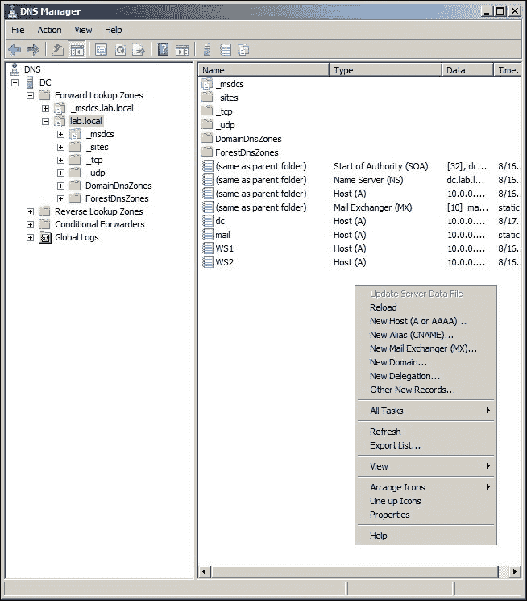

DNS 区域内容

## 安装和配置 hMailServer

现在是安装 hMailServer 的时候了。可以从网站下载最新版本（[`www.hmailserver.com/download`](https://www.hmailserver.com/download)）。安装过程简单。按照安装向导进行操作，不应该出现问题。安装结束时，现有的向导会提示输入管理员密码。

启动 hMailServer 管理员（管理控制台），并创建一个到本地主机的连接。在启动 hMailServer 管理员并与服务器建立连接后，配置我们的邮件服务器以适应我们的域（`lab.local`）。这需要一些时间，并包括以下基本步骤：

1.  在**域**选项卡中，点击**添加**按钮。在打开的页面中，在**域**文本框中输入我们的域名（`lab.local`），然后点击**保存**按钮。新的域将被添加。

1.  点击域树的**账户**子项，并在右侧面板（账户页面）上点击**添加**按钮。

1.  在打开的页面中，进入**Active Directory**选项卡，我们应检查**Active Directory 账户**选项，并输入我们为现有域用户创建邮件账户时的域名和用户名。在**常规**选项卡中，我们应在**地址**文本框中输入当前账户的邮箱地址。

1.  点击**保存**按钮。

1.  现在，在账户列表中，我们有现成的示例用户邮箱：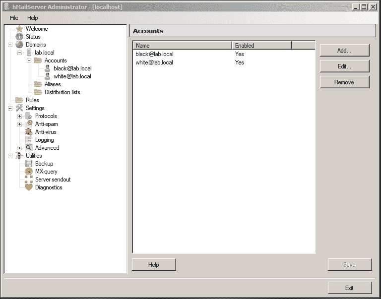

    邮件账户列表

1.  进入**设置** | **协议** | **SMTP** | **邮件投递**，在主机名设置中输入我们的服务器主机名（`mail.lab.local`）。

现在，我们有了一个工作邮件服务器，可以使用配置好的邮件客户端软件发送和接收邮件。

接下来，您应该完成邮件服务器设置以创建硬化配置。例如，您可以执行以下操作：

+   更改 SMTP、POP3 和 IMAP 协议的标准端口，并根据安全证书设置使用 SSL/TLS 的连接安全性，这些证书可以在我们的认证机构（前面已描述）上创建。

+   设置为仅使用 TLSv1.2

+   创建备份副本

+   配置内置的反垃圾邮件子系统

### 注意

有关 hMailServer 的更多信息，请访问[`www.hmailserver.com/documentation/latest/?page=overview`](https://www.hmailserver.com/documentation/latest/?page=overview)。

现在我们已经创建了一个可用的邮件服务器实例，可以进一步探索其他可能性。

# 安装易受攻击的服务

准备大多数服务器和网络服务以供渗透测试培训使用的最简单方法是下载故意留下漏洞的预配置虚拟机镜像（易受攻击的虚拟机）。这些易受攻击的虚拟机是为练习各种攻击而准备实例的最佳方式，同时节省了自行下载和安装所有内容的时间。

### 提示

**使用预安装的虚拟机镜像保持安全**

你可能知道比本章中提到的其他预安装虚拟机镜像的来源，并且你可能希望在实验室中下载并使用它们。然而，要小心，并在使用它们获取镜像之前检查这些来源是否足够可信，因为不可信的来源可能会分发含有恶意软件的潜在危险镜像。这些镜像不仅对您的实验室构成高安全风险，也可能对您的实验室连接的网络造成威胁。

让我们将最有用和最著名的其中一些纳入我们的实验室网络。

# 安装 Web 应用程序

现在，许多企业正在上线或至少需要在 Web 上存在，渗透测试人员主要处理的是 Web 应用程序，而不是基础架构渗透测试。因此，渗透测试人员掌握 Web 应用程序攻击技能并不断提升至关重要。

### 提示

**使用有限的计算资源**

如果您在创建其他虚拟服务器时遇到计算能力不足的问题，可以将所有 Web 应用程序安装在同一台服务器上。或者，您可以将其中一些安装在“攻击者机器”或用于黑客攻击的渗透测试机器上。

我们将使用基于 Ubuntu Server 14.03.4 LTS 的 **LAMP**（**Linux, Apache 和 MySQL*PHP**）服务器安装 Web 应用程序。但如果出于某种原因您更喜欢使用 Windows，则可以使用 XAMPP —— 这是一个包含 MySQL、PHP 和 Perl 的 Apache 发行版。

## 准备一个 Web 服务器

我们将在 Ubuntu Server 14.0.3.4 LTS 下的同一个 Web 服务器上安装所有实验 Web 应用程序，处于 NAT 模式，暂不连接 VM 到实验室网络。接下来，我们将根据实验室网络设置更改网络接口模式和设置。步骤如下：

1.  首先，从官方网站下载最新的 Ubuntu Server `.iso` 安装镜像。

1.  创建一个新的 64 位 Ubuntu 虚拟机，分配 1024 MB RAM 和一个动态分配的硬盘。

1.  将安装镜像插入 VM 的 CD/DVD 驱动器并启动 VM。

1.  通过回答安装对话框中的问题安装 Ubuntu 服务器。这个过程非常简单，直到要求选择要安装的服务（不要忘记安装过程中提供的帐户密码）。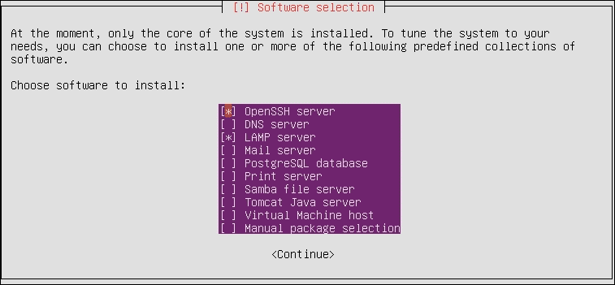

    服务安装对话框

1.  选择 OpenSSH 和 LAMP 服务器，然后继续安装。

1.  在询问时输入 MySQL root 密码，并确保不要忘记 —— 以后会用到。

1.  重新启动虚拟机，并使用安装过程中创建的帐户登录。

    现在，我们需要配置正确的网络设置，以便能够访问 Internet 进行软件安装，同时具有静态 IP 以访问 Web 应用程序。

1.  在桥接模式下设置 VM 的网络接口，并选择要将虚拟接口桥接到的物理接口。

1.  首先，我们需要将 Network Manager 服务切换到手动启动模式，这样它在每次重启后不会重置我们的网络设置。运行以下命令来完成此操作：

    ```
    **sudo stop network-manager**
    **echo "manual"|sudo tee /etc/init/network-manager.override**

    ```

1.  现在，通过编辑文件 `/etc/network/interfaces` 来设置新的网络设置。为 `eth0` 接口更改或添加以下设置：

    ```
    **auto eth0**
    **iface eth0 inet static**
     **address 10.0.0.5**
     **netmask 255.255.255.0**
     **network 10.0.0.0**
     **broadcast 10.0.0.255**
     **gateway 10.0.0.1**
     **dns-nameservers 10.0.0.2 10.0.0.1**

    ```

1.  使用以下命令重新启动网络服务，或者直接重新启动 VM 以应用更改，并使用 `ifconfig` 命令检查接口设置：

    ```
    **sudo service networking restart**
    **ifconfig eth0**

    ```

您应该能够插入网络电缆并访问 Internet。

或者，你可以使用 NAT 模式下载所有必要的软件，然后将虚拟机切换到主机专用网络模式，这样主机和其他客户机就可以访问你的当前虚拟机。在此模式下，你可以将虚拟机作为独立的 Web 服务器，用于直接的 Web 应用程序攻击，并在需要将虚拟机连接到实验室网络时执行前面列表中的四个网络配置步骤。

让我们安装必要的先决条件：

1.  我们需要 Java 6 或更高版本才能让 Web 应用程序正常工作。使用命令 `java -version` 检查是否已安装，如果没有，请使用 `apt-get` 安装它。我们正在安装 OpenJDK 7：

    ```
    **sudo apt-get install openjdk-7-jre**

    ```

1.  你还需要安装 `unzip` 工具，以便解压 Web 应用程序的档案文件，所以我们先安装它：

    ```
    **sudo apt-get install unzip**

    ```

此时，我们的 Web 服务器已准备好安装 Web 应用程序。

## WebGoat

OWASP 项目 WebGoat ([`www.owasp.org/index.php/Category:OWASP_WebGoat_Project`](https://www.owasp.org/index.php/Category:OWASP_WebGoat_Project)) 是最知名的用于学习目的的漏洞 Web 应用程序之一。WebGoat 最酷的地方在于，它不仅提供了一些漏洞供你利用，还让你参与修复过程，提供修改应用程序源代码的机会。这对那些没有太多 Web 开发背景的渗透测试人员来说，极其有助于开发出真正有效的漏洞修复建议。

WebGoat 是作为 Web 应用程序包而非虚拟机镜像分发的，你需要先准备好服务器才能运行它。

由于我们已经准备好服务器，让我们开始运行 WebGoat 应用程序：

1.  从 GitHub 下载 Web 应用程序包。你可以使用 `wget` 工具进行下载，但请确认你下载的是最新版本：

    ```
    **wget https://github.com/WebGoat/WebGoat-Legacy/releases/download/v6.0.1/WebGoat-6.0.1-war-exec.jar**

    ```

1.  运行 Web 应用程序：

    ```
    **java -jar WebGoat-6.0.1-war-exec.jar**

    ```

通过在另一台机器上打开浏览器并访问 `http://10.0.0.5:8080/WebGoat` 来检查应用程序是否正常工作（URI 是区分大小写的）。

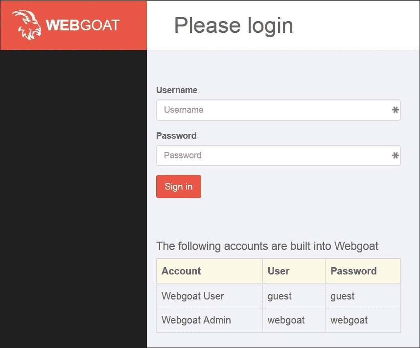

WebGoat 登录界面

## DVWA

另一个用于渗透测试训练的有用 Web 应用程序示例是 **Damn Vulnerable Web Application** ([`www.dvwa.co.uk`](http://www.dvwa.co.uk))，它是用 PHP 编写并使用 MySQL 的。它包含 OWASP Top 10 列表中的所有漏洞，并允许我们在三个安全级别下使用该 Web 应用程序，分别对应不同的渗透测试技能水平。

让我们看看如何安装和运行 DVWA：

1.  登录并将当前目录更改为 Apache 的默认目录：

    ```
    **cd /var/www/html**

    ```

1.  下载应用程序的档案并解压：

    ```
    **wget https://github.com/RandomStorm/DVWA/archive/v1.0.8.zip**
    **unzip v1.0.8.zip**

    ```

1.  现在，我们需要配置 MySQL 连接。用编辑器打开文件 `DVWA-1.0.8/config/config.inc.php` 并找到以下行：

    ```
    **$_DVWA[ 'db_password' ] = 'p@ssw0rd';**

    ```

1.  将 `p@ssw0rd` 更改为你在服务器安装过程中设置的 MySQL 根密码，并保存文件。

1.  更改 DVWA 目录的名称（考虑到便捷性）和权限：

    ```
    **mv DVWA-1.0.8 dvwa**
    **chmod -R 777 /var/www/html/dvwa**

    ```

1.  登录 MySQL 并为 DVWA 创建一个数据库：

    ```
    **mysql -u root -p**
     **create database dvwa;**
     **exit**

    ```

1.  现在，您需要从另一台机器的浏览器导航到 DVWA 设置界面（我们使用服务器的 IP 10.0.0.5，假设您已经设置了静态网络设置）`http://10.0.0.5/dvwa/setup.php`，然后单击**创建/重置数据库**按钮。

您现在可以导航到 `http://10.0.0.5/dvwa/login.php`，使用默认凭据 `admin:password` 登录，并使用该应用程序。

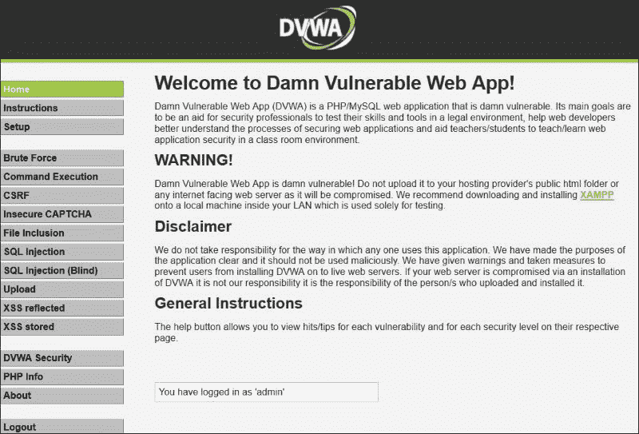

DVWA 已准备好被黑客攻击

## Liferay 门户

在渗透测试中经常遇到的 Web 应用程序之一是 Liferay 门户。它是一个基于开源、基于 Portlet 的企业**内容管理系统**（**CMS**），可以根据各种业务需求进行定制。Liferay 门户是用 Java 编写的，用于企业内部网和外部 Web 门户。

它在市场上的受欢迎程度意味着，如果您为客户进行商业渗透测试，很可能会遇到它，并且您可能希望提前了解如何在黑客环境中处理它。在我们当前的情况下，Liferay 特别酷的地方是，不仅有商业版本，还有社区版本的门户可用。

**社区版**（**CE**）是免费分发的，您可以在 Liferay 的网站[`www.liferay.com`](http://www.liferay.com)上下载，无需注册。由于我们需要用于学习和研究目的，您不会遇到任何法律或许可问题。

我们将在 Ubuntu Server 14 操作系统下的服务器上安装 Liferay 门户 CE，最好先准备好服务器，然后直接将 Liferay 下载到虚拟机中。

让我们列出您需要采取的步骤，以便获得运行 Liferay 门户的工作服务器：

1.  从官方 Liferay 网站（[`www.liferay.com/de/downloads/liferay-portal/available-releases`](http://www.liferay.com/de/downloads/liferay-portal/available-releases)）下载社区版的 zip 存档。

1.  将存档解压缩到 `/srv/` 目录。

1.  使用以下命令启动 Tomcat（放置正确的版本号）：

    ```
    **sudo /srv/liferay-{version}/tomcat-{version}/bin/startup.sh**

    ```

1.  根据虚拟机的硬件等待一两分钟。

1.  要检查应用程序是否成功启动并且可以从其他主机访问，请运行以下命令并检查应用程序是否在 0.0.0.0（所有接口）上监听：

    ```
    **netstat -antp|grep 8080**

    ```

    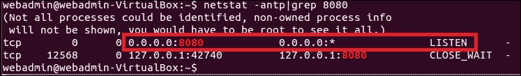

    监听 Web 服务器

1.  在另一台机器上的浏览器中打开，并导航到 `http://10.0.0.5:8080`。您应该看到基本配置对话框：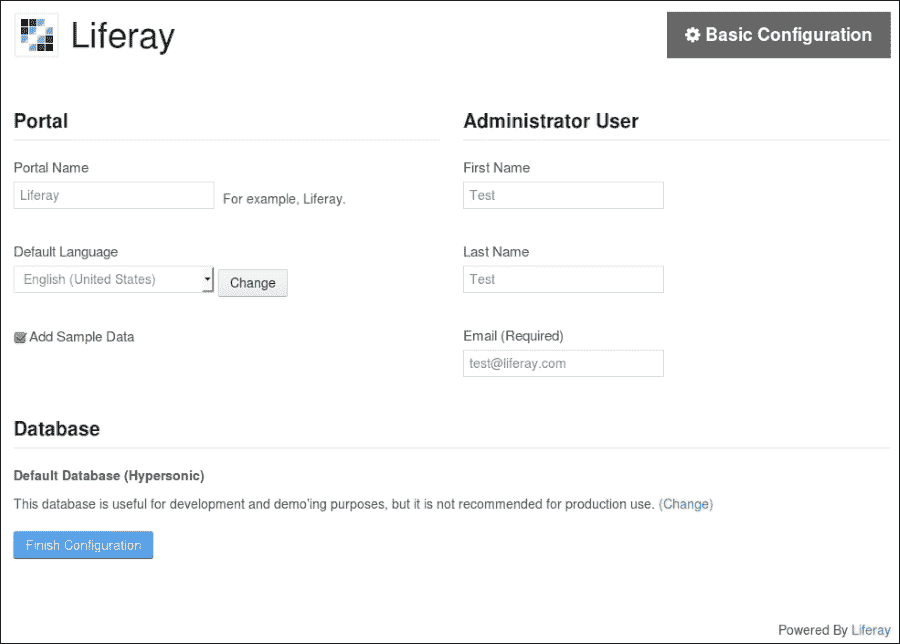

    Liferay 基本配置页面

1.  如果您愿意，可以更改值，但不要取消选中**添加示例数据**复选框，因为在研究门户时它会很有用。

1.  单击**完成配置**，等待一段时间，直到安装过程完成。

1.  然后，导航到门户并阅读并接受用户协议。

现在 Liferay Portal 已经安装并准备好在我们的实验室中使用。你可以开始探索这个门户，了解它是如何工作的，检查门户的内部结构和配置，等等。

门户已经填充了一些示例数据，但你可以进一步创建一个 Liferay Marketplace 的帐户 ([`www.liferay.com/marketplace/`](https://www.liferay.com/marketplace/))，以便下载并安装其他 Web 应用到你的门户。

## Metasploitable

大多数流行的漏洞虚拟机镜像是为练习 Web 应用渗透测试而创建的，但也有一些虚拟机更多地针对系统和网络软件层面，比如经典的黑客攻击。它们非常适合学习和练习软件与操作系统漏洞利用、模糊测试、暴力破解、隧道技术、权限提升等。

其中一台虚拟机是 Metasploitable 2（基本上是其前身 Metasploitable 的更新和扩展版本），由著名的 IT 安全公司 Rapid7 提供，我们将把它添加到我们的实验环境中。

让我们引用 Metasploitable 2 的官方描述 ([`community.rapid7.com/docs/DOC-1875`](https://community.rapid7.com/docs/DOC-1875))：

> “Metasploitable 虚拟机是一个故意脆弱的 Ubuntu Linux 版本，旨在测试安全工具并展示常见漏洞。该虚拟机的第二个版本可供下载，并且比原始镜像包含更多的漏洞。此虚拟机兼容 VMWare、VirtualBox 以及其他常见的虚拟化平台。”

据我们了解，Metasploitable 主要是为了学习流行的黑客框架 Metasploit Framework 而创建的，但它也适用于更广泛的渗透测试学习任务。

默认情况下，Metasploitable 2 包含以下预安装的网络服务：

+   FTP

+   SSH

+   Telnet

+   SMTP

+   Web 服务器

+   rlogin

+   NFS

+   MySQL

+   PostgreSQL

+   VNC

+   后门

以下攻击技术可以通过列出的服务进行练习：

+   信息收集

+   扫描

+   缓冲区和栈溢出漏洞利用

+   密码猜测 / 暴力破解

+   模糊测试

+   漏洞开发

+   SMTP 重定向

+   中间人攻击

+   权限提升

Metasploitable 2 的安装过程非常简单，像大多数预安装的故意脆弱的虚拟机镜像一样：

1.  首先，将 Metasploitable 2 `.zip` 压缩包解压到你保存实验室虚拟机的目录中。

1.  然后，创建一个 32 位的 Ubuntu Linux 虚拟机，内存为 512 MB，并在桥接模式下配置网络接口，当 VirtualBox 提示你创建虚拟磁盘时，选择 Metasploitable 2 目录中的现有虚拟磁盘（`Metasploitable.vmdk`）。

1.  启动虚拟机，并使用默认凭证`msfadmin:msfadmin`登录。

1.  将你的网络设置配置与我们在 Liferay Ubuntu 服务器上所做的类似，但请使用正确的 IP 地址 10.0.0.3。

### 注意

**直接攻击练习**

如果你想与 Metasploitable 2 进行直接攻击练习，你可以将虚拟机的网络接口切换到仅主机网络模式，然后从在同一主机上运行的虚拟机进行攻击。你可以在以下链接中找到相关教程：[`community.rapid7.com/message/4137`](https://community.rapid7.com/message/4137)。

到此为止，Metasploitable 2 已经准备好接收你的恶意数据包，祝你玩得开心！

## 漏洞 VoIP 服务器

随着 IP 网络和技术的普及，企业基于 IP 的电话网络变得非常常见，这意味着如果你从事商业项目的渗透测试工作，你将时不时遇到这些系统，可能作为基础设施渗透测试项目的一部分，或者作为一个单独的 VoIP 渗透测试项目。

反过来，这意味着你希望为这些系统做好充分准备，并尝试在实验室中进行研究和攻击。

对我们来说幸运的是，已经有一个基于 CentOS 和 Asterisk 的漏洞 VoIP 服务器镜像，名为**vulnVoIP**。

官方描述和下载链接可以在[`www.rebootuser.com`](http://www.rebootuser.com)的**HackLAB**部分找到。现在这个链接有些旧了，但仍然有助于理解该技术及其攻击方式。

vulnVoIP 以 VMware 镜像的形式分发，因此你可以安装免费的 VMware Player 软件，或者如果你在企业环境中搭建了实验室，可能已经拥有 VMware 许可证，可以直接运行镜像。

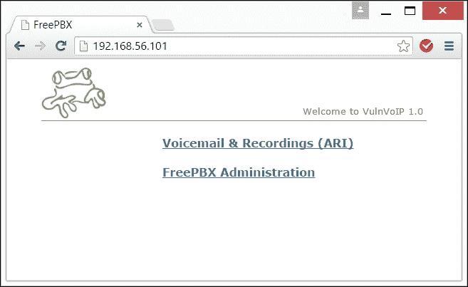

vulnVoIP 的 Web 界面

如果你更喜欢使用 VirtualBox，你可以执行以下简单步骤：

1.  解压`.7zip`格式的 vulnVoIP 压缩包。

1.  创建一个新的 32 位 Linux 虚拟机。为其命名并分配 512 MB 的内存。

1.  在询问硬盘时，选择从解压后的 vulnVoIP 目录中选择`vulnVoIP.vmdk`虚拟磁盘文件。

vulnVoIP 的开发者没有提供 root 密码，并且提供了破解系统以获取 root 访问权限的建议。因此，我们不会剥夺你一个很好的教训，按照 vulnVoIP 开发者的建议，让你获取 root 权限。

获得 root 权限后，你可以设置静态 IP 为 10.0.04，并将 vulnVoIP 连接到你的实验室网络的其余部分。

# 总结

在本章中，你了解了如何通过安装有用的组件来构建你的实验室，这些组件实际上使得搭建实验室网络的整个过程变得有意义。我们安装了在商业渗透测试项目中最有可能遇到的常见服务，以及你最有可能想要破解的那些服务。

如果你需要练习一些特定的技能，你可以并且应该通过根据你的需求安装和配置额外的特定网络服务或应用程序来扩展你的实验室。

例如，你可以在以下网站找到许多预装的虚拟机镜像：

+   [`virtualboxes.org/`](http://virtualboxes.org/)

+   [`virtualboximages.com/`](https://virtualboximages.com/)

在下一章中，我们将学习如何通过安装和配置安全解决方案来提升你的实验室水平。
