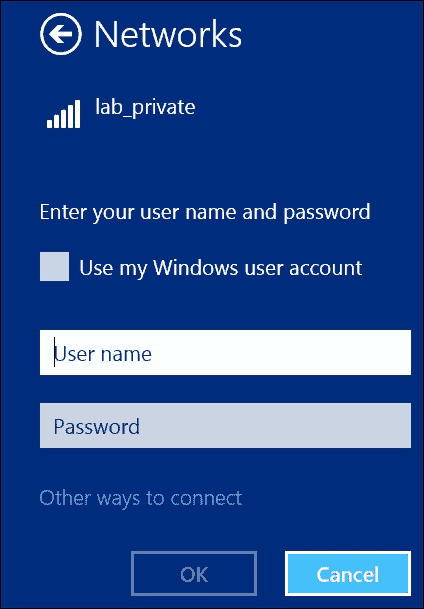
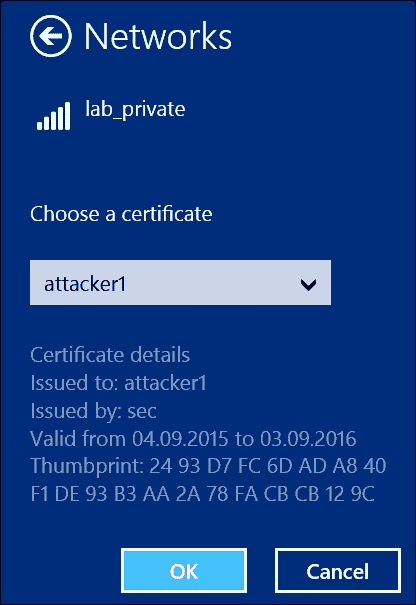
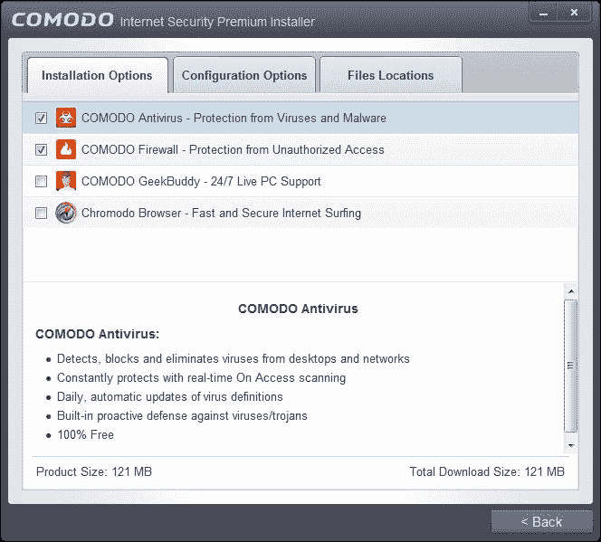
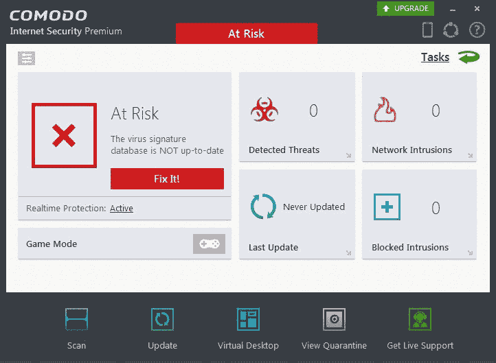
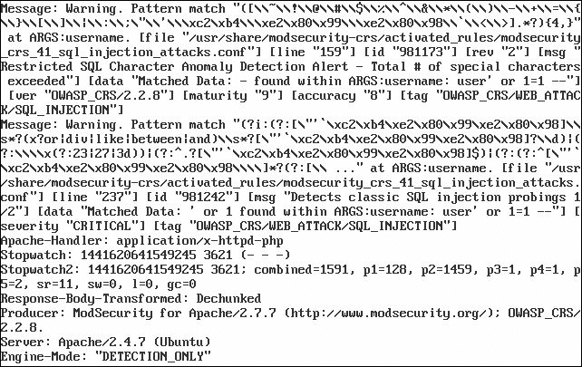
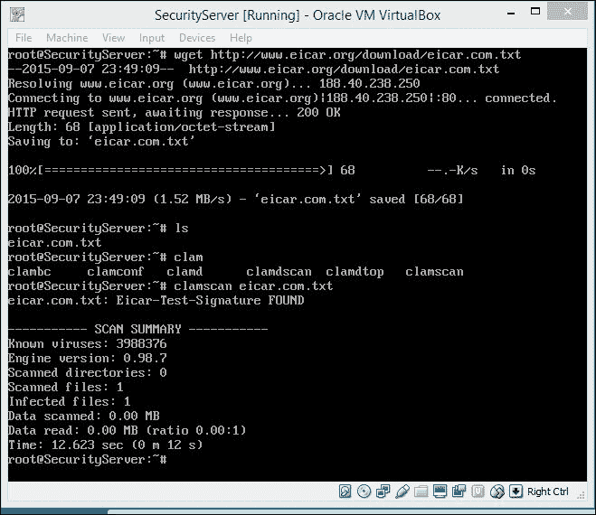
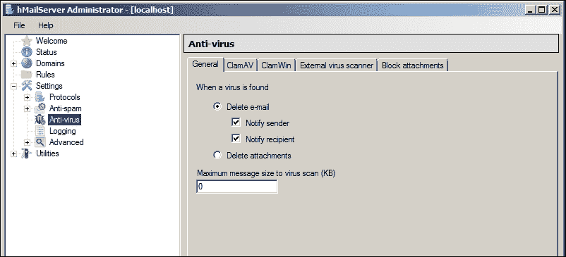
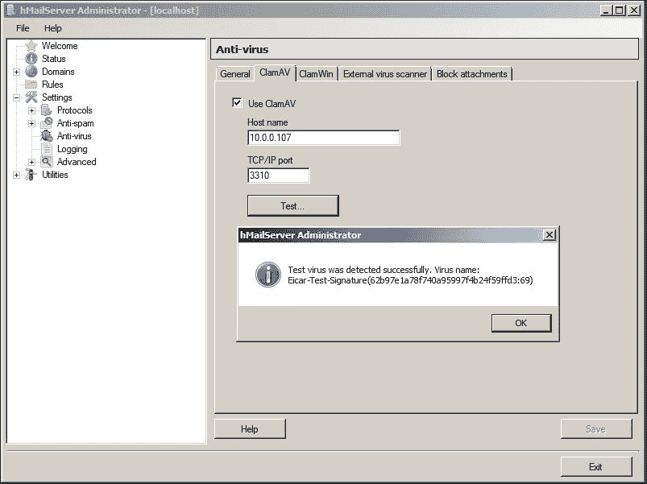

# 第五章 实施安全性

本章专注于安全解决方案及其安装和配置。它将向你展示如何保护实验环境免受外部攻击和未经授权的访问，并且如何提高实验室复杂度，从而同时练习高级渗透测试和黑客技术。我们将把安全解决方案和措施分为两大类：基于主机的（保护它们所安装的主机）和基于网络的（保护整个实验室网络）。此外，我们还希望深入了解一种安全信息和事件管理解决方案，它可以与安全机制配合使用，以识别网络攻击并持续监控网络的安全性。

本章包括以下主题：

+   基于网络的安全措施

+   基于主机的安全措施

+   安全信息和事件管理系统

# 基于网络的安全解决方案

本章我们并不打算严格遵循标准 ISO/OSI 模型的各个层次，而是区分了两大抽象的安全层次：网络层和主机层。

主机层通过基于主机的安全解决方案来保护特定主机。然而，基于网络的解决方案则旨在保护整个网络或其部分（或主机组）。我们希望从基于网络的解决方案开始本章内容。

## 配置网络访问控制

为了模拟一个真实的网络并保护我们的实验室不受外部网络的访问，我们需要在网络层面实施不同实验室 VLAN 之间的访问控制措施。我们将使用的访问控制机制被称为**访问控制列表**（**ACLs**），并可以在核心路由器上实现。

一般来说，ACL 是一个规则列表，用来决定哪些流量是允许或不允许的，且指明流量的方向。我们还将创建几个 ACL，来阻止或允许不同 VLAN 之间的网络流量。

你可能会认为，逻辑上这应该在第三章，*配置网络实验室组件*中进行网络设备配置时完成，确实如此！但我们决定将 ACL 子话题放在这一章，因为它影响的是整个实验室环境的安全，而不仅仅是设备，所以应该重点强调。

### 隔离外部和访客网络

为了保证实验室的安全，我们需要按照第三章，*配置网络实验室组件*中描述的通信规则来隔离不受信任的网络段。让我们快速回顾一下这些规则：

| 源 | 允许的目标 | 目的 |
| --- | --- | --- |
| 管理工作站 |

+   所有网络设备

+   所有服务器

+   所有用户工作站

+   互联网（外部网络）

| 网络与系统管理 |
| --- |
| 服务器 |

+   互联网（外部网络）

| 软件安装和更新 |
| --- |
| 用户工作站 |

+   互联网（外部网络）

+   服务器

| 互联网访问，访问内部网络服务 |
| --- |
| 受信任 WLAN |

+   互联网（外部网络）

+   服务器

| 互联网访问，访问内部网络服务 |
| --- |
| 客户端 WLAN |

+   互联网（外部网络）

| 互联网访问 |
| --- |

首先，我们需要阻止所有来自外部网络的入站流量，并隔离客户 WLAN。登录到路由器控制台，启动配置模式，并创建一个名为 `wan` 的 ACL，使用以下命令：

```
**ip access-list extended wan**
**remark deny access from wan**
**deny ip 192.168.0.0 0.0.255.255 any log**
**deny icmp 192.168.0.0 0.0.255.255 any**
**exit**
**ip access-list extended guest**
**remark deny access to guest wlan**
**deny ip any 192.168.0.0 0.0.255.255**
**deny icmp any 192.168.0.0 0.0.255.255**

```

让我们快速解释一下我们刚刚做了什么：

+   第一行和第六行创建了名为 `wan` 和 `guest` 的扩展命名 ACL，并进入 ACL 配置模式。

+   第二行和第七行的命令设置了新 ACL 的用户友好注释。

+   第三行和第四行拒绝来自网络 192.168.0.0/16 到任何目的地的所有 IP 和 ICMP 流量。我们使用关键字 `log` 将所有被拒绝的包写入日志，以便进一步分析（这使我们能够检测到可能的攻击）。

+   最后两条命令拒绝所有来自任何来源到 192.168.0.0/16 网络的 IP 和 ICMP 流量。

现在，我们需要将 ACL 应用到路由器子接口，该子接口负责与外部网络的通信（在我们的例子中是 `fa0/0.5`）。退出 ACL 配置模式，进入接口配置模式（如果你定义了与我们所做的不同的子接口，只需将 `fa0/0.5` 替换为与你的 SOHO 路由器连接的子接口对应的接口）：

```
**interface fa0/0.5**

```

现在，分配名为 `wan` 的 ACL 以应用于来自外部的网络流量到子接口：

```
**access-group wan-in in**

```

接下来，分配名为 `guest` 的 ACL，以应用于来自内部的网络流量到子接口：

```
**access-group guest-out out**

```

### 隔离内部 VLAN

可以以类似的方式创建并应用其他路由器子接口的 ACL。因此，我们将它们放入表格中以方便查看：

| 名称 | 子接口 | 方向 | ACL | 备注 |
| --- | --- | --- | --- | --- |
| `trusted-in** | **fa0/0.4** | **in** | **deny ip 172.16.1.0 0.0.0.255 172.16.0.0 0.0.0.255``deny ip 172.16.1.0 0.0.0.255 10.1.0.0 0.0.0.255``deny icmp 172.16.1.0 0.0.0.255 172.16.0.0 0.0.0.255``deny icmp 172.16.1.0 0.0.0.255 10.1.0.0 0.0.0.255``permit ip any any``permit icmp any any` | 来自受信任 WLAN 的访问 |
| `users-in** | **fa0/0.3** | **in** | **deny ip 172.16.0.0 0.0.0.255 172.16.1.0 0.0.0.255``deny ip 172.16.0.0 0.0.0.255 10.1.0.0 0.0.0.255``deny icmp 172.16.0.0 0.0.0.255 172.16.1.0 0.0.0.255``deny icmp 172.16.0.0 0.0.0.255 10.1.0.0 0.0.0.255``permit ip any any``permit icmp any any` |   |
| `servers-in** | **fa0/0.2** | **in** | **permit ip 10.0.0.0 0.0.0.255 172.16.0.0 0.0.255.255 established``permit icmp 10.0.0.0 0.0.0.255 172.16.0.0 0.0.255.255 established``deny ip 10.0.0.0 0.0.0.255 172.16.0.0 0.0.255.255``deny icmp 10.0.0.0 0.0.0.255 172.16.0.0 0.0.255.255``deny ip 10.0.0.0 0.0.0.255 10.1.0.0 0.0.255.255``deny icmp 10.0.0.0 0.0.0.255 10.1.0.0 0.0.255.255``permit ip any any``permit icmp any any` | 拒绝服务器发起的用户和可信 WLAN 的连接 |

## 确保无线访问安全

根据我们的实验室设计，我们希望能够实现对实验室环境的安全无线访问，即一个可信的 WLAN。

正如你在第一章中记得的那样，*理解无线网络安全与风险*，确保 WLAN 访问的最佳方式是实现基于 IEEE 802.1x 标准的 WPA-Enterprise 安全性。更准确地说，它应该基于 **EAP over LAN** (**EAPOL**) 和一个 AAA 服务器。

我们决定选择 FreeRADIUS 作为适合的 AAA 服务器解决方案。FreeRADIUS 是一个包含 RADIUS 服务器软件以及多个辅助库和模块的软件包。目前，我们只对 RADIUS 服务器感兴趣，这足以完成我们的任务。

FreeRADIUS 是一个非常流行的解决方案，具有模块化架构。它运行非常快速，并且免费为实验室分发重要服务。

在我们开始实施解决方案之前，我们想列出接下来的步骤，以便给你一个更清晰的整个过程概览：

1.  准备带有 FreeRADIUS 的虚拟机。

1.  创建证书。

1.  配置 RADIUS 服务器。

1.  配置接入点。

1.  配置 WLAN 客户端。

### 准备 RADIUS 服务器

我们将在基于 Debian 的虚拟 Linux 服务器上安装 FreeRADIUS，并将其放置在 IP 地址为 10.0.0.6 的服务器子网中。安装过程与 Ubuntu Server 安装过程非常相似：

1.  创建一个 1024 MB 内存的虚拟机。

1.  从官方网站下载 Debian Linux 8（Jessie）镜像。

1.  使用引导安装安装 Debian Linux，并且不要忘记在安装过程中为 root 用户和非 root 用户设置强密码，因为该服务器将提供实验室的安全性，我们不希望它存在漏洞。

1.  安装完成后，启动虚拟机并以 root 账户登录。

1.  确保虚拟机可以访问互联网。如果没有连接到实验室网络，请使用 NAT，或者如果已连接，请配置 IP 设置。

1.  检查 `/etc/apt/sources.list` 文件是否包含以下内容：

    ```
    **deb http://ftp.debian.org/debian jessie main**

    ```

1.  如果没有，将此行添加到文件中。

1.  更新软件包列表。

1.  使用以下命令安装 FreeRADIUS：

    ```
    **apt-get update**
    **apt-get install freeradius**

    ```

### 注意

或者，你也可以从官方 FTP 服务器下载最新版本的 FreeRADIUS 并进行编译（更改软件包版本号为当前版本，并确保安装了 `gcc` 编译器）：

```
wget ftp://ftp.freeradius.org/pub/freeradius/freeradius-server-3.0.9.tar.gz
tar zxfv freeradius-server-3.0.9.tar.gz
cd freeradius-server-3.0.9
./configure
make
make install
```

### 准备证书

我们实验室中的每个授权用户将拥有一个用于受信 WLAN 连接的个人证书，因而在开始将证书路径写入服务器配置之前，准备证书是合乎逻辑的。

你可以使用在第四章，*设计应用实验室组件*，中安装的实验室证书颁发机构（CA）来创建所有必要的证书。我们已经创建了一个 CA 证书，因此只需要创建服务器和客户端证书，并使用 CA 进行签名：

1.  创建服务器密钥和证书请求：

    ```
    **openssl genrsa -out radius.key 2048**
    **openssl req -key radius.key -new -our radius.csr**

    ```

1.  创建一个包含两位数序列号的`lab_ca.srl`文件，例如，01。

1.  使用 CA 签署服务器证书请求（如果 CA 证书和密钥文件不在当前目录中，你需要提供它们的路径），并创建服务器证书：

    ```
    **openssl x509 -req -in radius.csr -CA rootCA.crt -CAKey rootCA.key -out radius.pem**

    ```

1.  创建客户端密钥和证书请求：

    ```
    **openssl genrsa -out attacker1.key 2048**
    **openssl req -new -key attacker1.key -out attacker1.csr**

    ```

1.  在这里，你应该填写证书的**常用名称**字段，填写持有该证书的用户身份，例如`attacker1`或`alex`。

1.  使用证书颁发机构签署客户端证书：

    ```
    **openssl x509 -req -in attacker1.csr -CA rootCA.crt -CAkey rootCA.key -CAcreateserial -out attacker1.crt -days 365**

    ```

1.  将客户端证书导出为 PKCS#12 格式，以便 Windows 客户端使用：

    ```
    **openssl pkcs12 -export -in attacker1.crt -inkey attacker1.key -out attacker1.p12 -clcerts**

    ```

你可以为想要通过受信 WLAN 访问实验室的用户创建多个客户端证书。将服务器证书和 CA 证书复制到 FreeRADIUS 服务器上的`/etc/freeradius/certs/lab`目录中。

### 配置 RADIUS

现在，是时候为我们的需求配置 FreeRADIUS 了。配置文件可以在`/etc/freeradius`目录中找到。

现在我们关注以下配置文件：

+   `clients.conf`：定义认证器（在我们这个例子中是思科接入点）和认证服务器（FreeRADIUS）之间的连接设置。

+   `eap.conf`：定义**可扩展认证协议**（**EAP**）类型和设置。

#### clients.conf

我们需要向文件中添加以下行，以设置认证器的连接参数：

```
client 172.16.1.2 {
        secret = YourSecret
        shortname = TrustedWLAN
}
```

`secret`参数包含一个密码，用于 AP 连接到 RADIUS 服务器，因此你可能需要使用强密码组合来提高实验室的安全性。

#### eap.conf

在这里，我们为 EAP-TLS 认证设置所有必要的参数：

```
default_eap_type = tls
tls {
     certdir = ${confdir}/certs/lab
     cadir = ${confdir}/certs/lab
     private_key_password = YourServerKeyPassword
     private_key_file = ${certdir}/radius.key
     certificate_file = ${certdir}/radius.pem
     CA_file = ${cadir}/rootCA.crt
     dh_file = ${certdir}/../dh
     random_file = /dev/urandom
}
```

`certdir`和`cadir`参数设置 FreeRADIUS 查找服务器和 CA 证书的目录。在我们的例子中，它们都位于`/etc/freeradius/certs/lab`。

`private_key_password`参数是你在创建服务器私钥时输入的密码。

### 配置接入点

我们已经在第三章，*配置网络实验室组件*中配置了接入点的以太网接口，但由于无线接口的配置高度依赖于我们在当前章节之前没有配置的 RADIUS 服务器，我们略过了该部分。现在是时候弥补这一空缺了：

1.  连接到 AP 的控制台端口，并使用 `enable` 命令进入特权模式，并输入您在第三章，*配置网络实验室组件*中初始 AP 配置时设置的密码（默认密码为 `Cisco`）。

1.  首先，我们需要配置认证服务器（RADIUS）设置：

    ```
    **configure terminal**
    **aaa group server radius rad_eap**
    **server 10.0.0.6 auth-port 1812 acct-port 1813**
    **exit**
    **aaa new-model**
    **aaa authentication login eap_methods group rad_eap**
    **radius-server host 10.0.0.6 auth-port 1812 acct-port 1813 key YourSecret**
    **end**
    **write memory**

    ```

1.  将 `YourSecret` 替换为您在 FreeRADIUS 配置中设置的 `clients.conf` 中的值。

1.  现在，我们需要配置名为 `dot11radio` 的无线接口：

    ```
    **configure terminal**
    **interface dot11radio 0**
    **encryption mode ciphers aes-ccm**
    **exit**
    **write memory**

    ```

1.  `lab_private` 是我们受信 WLAN 的 SSID，您可以将其更改为您喜欢的任何名称。

1.  下一步，我们将配置 WLAN 设置：

    ```
    **configure terminal**
    **dot11 ssid lab_private**
    **authentication open eap eap-tls**
    **authentication key-management wpa version 2**
    **guest-mode**
    **end**
    **write memory**

    ```

1.  您可以省略 `guest-mode` 命令来禁用 SSID 广播，从而使您的 WLAN 稍微更加安全（但实际上并没有大幅提高安全性）。

1.  配置无线接口和 SSID 后，我们可以将 SSID 分配给该接口并启用接口：

    ```
    **configure terminal**
    **interface dot11radio 0**
    **ssid lab_private**
    **no shutdown**
    **exit**
    **copy running-config startup-config**

    ```

### 注意

如果您选择为受信 WLAN 设置软件 AP，您可以使用以下工具：

+   Linux 上的内置工具或 `hostapd` 软件（我们将在第七章，*准备无线渗透测试平台*中展示如何安装和配置它）

+   Windows 上的特殊软件（例如 Connectify 或 ARPMiner）

安装并配置所选软件后，您需要使用 GNS3 系统中的 Cloud 工具，在无线网络和虚拟实验室基础设施之间建立连接，如在第三章，*配置网络实验室组件*中所述。

### 配置 WLAN 客户端

作为最后一步，我们需要通过将客户端机器连接到新创建的 WLAN 来进行测试。我们将在 Windows 8.1 机器上执行此操作：

1.  首先，您需要将攻击者的证书（PKCS#12 格式）复制到客户端机器上并进行安装。

1.  然后，您需要点击系统托盘中的网络图标，以获取可用无线网络列表，类似于 WEP 或 WPA-PSK 保护的网络。

1.  在无线网络列表中选择 **lab_private** 选项，并点击 **其他连接方式** 链接：

1.  然后，点击**证书**，选择实验室证书，点击**确定**：

现在，你已经连接到受信 WLAN，并可以渗透我们的易受攻击服务器。到目前为止，我们已经可靠地保护了我们的受信 WLAN 和整个实验室网络，防止了未授权的网络访问。我们几乎达到了本书的主要目标：构建一个受外部攻击保护的无线接入实验室。

## 安装网络入侵检测系统

现在，让我们看看如何在我们的网络中安装该系统，以检测任何入侵。

### 激活 SPAN

思科设备有一个名为**交换端口分析器**（**SPAN**）的功能，它基本上将选定源端口的网络流量镜像到选定的目标端口。我们需要这个功能，将通过服务器 VLAN 传入的网络流量复制到我们的基于网络的 IDS 进行进一步分析。

我们将监控整个服务器的流量（端口 `fa0/7` 到 `fa0/10`），通过 `fa0/11` 端口，因此让我们使用以下命令在核心交换机上配置 SPAN：

```
**enable**
**config t**
**interface fa0/11**
**port monitor fa0/7**
**port monitor fa0/8**
**port monitor fa0/9**
**port monitor fa0/10**
**end**
**copy running-config startup-config**

```

### Snort

Snort 是一个免费的、开源的网络**入侵检测系统**（**IDS**），能够在基于 IP 的网络中执行数据包日志记录和实时流量分析。

### 注意

你可能还想探索 Snort 的其他替代品，例如，Suricata。

该 IDS 识别以下内容：

+   针对网络协议的攻击

+   扫描（端口和服务）

+   DoS 攻击

+   针对 FTP、DNS、电子邮件等服务的攻击

+   针对数据库的攻击

+   针对 Web 的攻击

+   漏洞利用和各种恶意软件

考虑到以下几点，我们拥有一个具有强大功能的安全监控系统：

+   能够编写自己的规则

+   通过使用连接模块增强功能

+   灵活的攻击警告系统（日志文件、输出设备或数据库 ID）

Snort 可以在多种操作系统上执行：Windows 和类 Unix 系统。在我们的例子中，我们使用的是 Ubuntu Server 14，并将考虑 Linux 发行版。

#### 安装 Snort

所以，在 Ubuntu Linux 上安装过程非常简单。我们只需要执行一条命令：

```
**apt-get install snort**

```

几分钟后，安装将完成，我们可以使用以下命令在系统上启动 Snort 服务：

```
**service snort start**

```

接下来，让我们更新 Snort 规则集。你可以从官方网站的[`www.snort.org/downloads`](https://www.snort.org/downloads) **规则**部分获取最新版本的规则。我们将使用**注册用户版本**，因为它是最新的。然而，这需要注册。你可以在[`www.snort.org/users/sign_up`](https://www.snort.org/users/sign_up)注册。

下载后，让我们解压下载的压缩文件并将规则目录 `so_rules` 和 `preproc_rules` 复制到 `/etc/snort`：

```
**cp -R ./rules/ /etc/snort/**
**cp -R ./so_rules/ /etc/snort/**
**cp -R ./preproc_rules/ /etc/snort/**

```

之后，我们需要重启 Snort：

```
**service snort restart**

```

完成所有这些操作后，我们有了一个工作中的 IDS Snort 系统实例。接下来，让我们更详细地配置我们的入侵检测系统。

#### 配置 Snort

Snort 的主要配置位于 `/etc/snort/` 目录下的 `snort.conf` 文件中。最初，该文件基于示例配置。它很大，但注释非常详细，因此不应让您感到困惑。配置文件包括九个部分：

+   网络变量

+   解码器的配置

+   基础检测引擎的配置

+   动态加载库的配置

+   预处理器的配置

+   输出插件的配置

+   规则集的自定义

+   预处理器和解码器规则集的自定义

+   共享对象规则集的自定义

让我们从描述我们基础设施的基本变量开始：

| 类型 | 变量 | 值 | 描述 |
| --- | --- | --- | --- |
| `ipvar** | **HOME_NET` | [10.0.0.0/24,10.1.0.0/24] | 内部网络，可能发生攻击的源。它是一个主机或一组主机，Snort 将分析这些主机的流量。 |
| `ipvar** | **EXTERNAL_NET` | [172.16.0.0/24,192.168.0.0/24,172.16.2.0/24] | 攻击可能开始的网络。 |
| `ipvar** | **DNS_SERVERS` | 10.0.0.2 | 它是 DNS 服务器的列表。 |
| `ipvar** | **HTTP_SERVERS` | 10.0.0.3,10.0.0.5 | 它是 Web 服务器的列表。 |
| `ipvar** | **SQL_SERVERS` | 10.0.0.3 | 它是 SQL 服务器的列表。 |
| `portvar** | **HTTP_PORTS` | 80,443 | 它是 Web 端口的列表。 |
| `ipvar** | **SIP_SERVERS` | 10.0.0.4 | 它是 SIP 服务器的列表。 |

我们保留该文件中其他设置的默认值。当然，您可以配置 Snort 以最适合您需求的方式工作。由于这是一个学习实验室，特定情况下的设置可能会有所不同。

为了使更改生效，我们需要重启 Snort 守护进程：

```
**service snort restart**

```

现在，我们可以尝试运行 Snort：

```
**snort -D -dev -c /etc/snort.conf**

```

启动守护进程后，我们将检查 Snort 正在监听的网络接口：

```
**ifconfig -a**

```

如果接口处于混杂模式，一切正常。

#### Snort 规则

编写您自己的规则并不难，但通常是必要的，因为每天都会发现漏洞，在测试实验室的情况下，基础设施会根据测试需求不断变化。

规则的结构遵循以下方案：

<动作> <协议> <端口> <方向> <端口>（[元数据] [包内容] [数据] [检测后的动作]）

动作分为以下几部分：

| 动作 | 描述 |
| --- | --- |
| `alert` | 使用选定的方法创建警报，并将信息传递到系统日志。 |
| `log` | 使用系统日志记录包的相关信息。 |
| `pass` | 忽略该包。 |
| `activate` | 使用另一个动态规则。 |
| `dynamic` | 在激活规则后，通过日志记录过程激活规则。 |
| `drop` | 使用防火墙丢弃数据包，并将信息传送到系统日志。此选项仅在内联模式下生效。 |
| `sdrop` | 使用软件防火墙丢弃数据包，并且不使用系统日志。此选项仅在内联模式下生效。 |
| `reject` | 使用防火墙，若协议为 TCP 则丢弃数据包，或者如果数据包是通过 UDP 传输且 ICMP 端口不可用，则在日志文件中记录消息。此选项仅在内联模式下生效。 |

接下来，遵循协议。该参数可以取以下值：TCP、UDP、IP 和 ICMP。

接下来的三个参数决定了规则应用的源和目标 IP 地址及端口号。它们可以设置为某个特定值、一个范围或任何值。IP 地址范围可以通过以`/`开头的 CIRD 块掩码来设置，例如：`/24`。端口范围可以通过用冒号分隔的起始端口和结束端口来设置，例如：`25:445`。

同时，重要的是指定规则应应用的流量方向，使用符号`->`表示从源到目标的方向，或`<>`表示双向流量。

在指定规则的所有参数后，你还可以设置若干选项，这些选项会出现在规则头部后面并用分号分隔。选项关键词应与其值通过冒号分开。

所有选项可以分为四类：

| 类别 | 描述 |
| --- | --- |
| `meta-data` | 这些选项未指定用于数据验证包。它包含关于攻击类型、材料的潜在漏洞、链接等信息。 |
| `payload` | 该类别的参数包含有关数据本身的信息，这些数据包含在数据包中。 |
| `non-payload` | 该类别包含关于数据包（头部）的官方信息。 |
| `post-detection` | 指定在发现数据包中的信息后需要执行的任务。 |

为了有效监控活动，你应学习 Snort 的语言规则。不幸的是，本书无法详细描述所有规则，但你可以在互联网上找到更多信息。

目前，我们已经有了一个正常工作的网络入侵检测系统，可以根据特定需求进行开发。

# 基于主机的安全解决方案

我们将在当前章节中介绍的第二类安全解决方案是基于主机的解决方案。此类解决方案安装在它们需要保护的同一主机上。

在实验室中，你需要拥有基于主机的安全解决方案，主要有两个目的：一是练习防火墙/IPS 规避技术，二是测试你的漏洞利用（payloads）和恶意软件的可检测性及混淆效果。但正如往常一样，可能还有其他个人原因需要采取这样的安全措施。

## 工作站安全

为了更好地模拟真实企业网络，并为测试各种规避技术创造条件，我们将为我们的实验室工作站安装免费的端点安全解决方案。

我们建议在安装任何基于主机的安全解决方案之前，先创建工作站的快照，因为这些解决方案肯定会使穿透工作站变得有些麻烦，而在你进入更高级的黑客层级之前并不需要它。使用快照可以在虚拟机的不同系统状态之间快速切换，如果你搞坏了某些东西，随时可以恢复。

### EMET

我们列表中的第一个工作站安全解决方案是来自微软的**增强型缓解体验工具包**（**EMET**）。该工具帮助保护应用程序免受利用，如果它们包含软件漏洞。该工具使用了多种保护技术，包括内存随机化和保护技术，以及证书固定功能，以抵御中间人攻击。可以从官方网站下载，网址为[`www.microsoft.com/emet`](http://www.microsoft.com/emet)。

我们将在 Windows 7 工作站上安装 EMET 5.2。通过图形界面进行安装过程并不复杂，因此我们将使用大量的截图。

1.  登录到 Windows 7 工作站，并从官方网站下载 EMET 5.2（如果已经有更高版本，则下载更高版本）：!EMET

    EMET 5.2 下载菜单

1.  启动安装向导并按照对话框中的指示进行操作：!EMET

    EMET 5.2 安装过程

1.  选择推荐的设置：!EMET

    EMET 5.2 设置选择

1.  安装完成后，你可以在任务栏找到 EMET 图标。右键点击它并打开 EMET：!EMET

    EMET 5.2 主窗口

1.  你可以点击菜单中的**应用程序**按钮，查看每个应用程序的保护设置：!EMET

    EMET 5.2 应用保护设置

现在，我们可以继续安装基于主机的入侵防御系统。

### HIPS

像 EMET 一样，我们需要一个 HIPS 和杀毒软件，主要用于规避测试和高级攻击或研究场景。你可以选择任何流行的软件，实验室中有的安全解决方案越多越好，因为它将使你能够对更多的检测和保护工具进行 payload 和规避技术的测试。这会大大增加你成功攻击的机会。

### 提示

通常情况下，不推荐安装来自不同厂商的同类型大量安全解决方案，因为它们可能会发生冲突并导致系统不稳定。在我们的示例中，我们已经测试过所推荐的解决方案，但如果你想用其他软件做同样的事情，我们建议你进行充分的测试。

出于演示目的，安装一个解决方案就足够了，最好选择免费的。我们选择了 Comodo Internet Security 2015。

Comodo **Internet Security**（**IS**）是一个结合了杀毒软件、防火墙和自动沙箱软件的解决方案，并且在 Comodo 网站上有免费的版本。步骤如下：

1.  安装过程也很简单，就像 EMET 一样。但它有一些特殊性。你不应忽视第二个安装对话框左下角的一个小链接**自定义安装**：

    访问 Comodo IS 安装自定义对话框

1.  对于我们的用途，我们不需要 GeekBuddy 组件或 Chromodo 浏览器，所以只需取消选中相应的复选框：

    选择要安装的 Comodo IS 组件

1.  我们也不希望 Comodo 更改我们的 DNS 设置，所以在下一个对话框中也取消选中相应的复选框。是否帮助 Comodo 将 Yahoo! 设置为默认搜索引擎由你决定。然而，在实验室工作站的情况下，这对 Comodo 并没有帮助，因此我们取消了该选项：

    Comodo IS 安装自定义

1.  完成安装并重启工作站。

1.  Comodo Internet Security 2015 已安装并正常工作。剩下的最后一件事是创建虚拟机状态的快照：

    Comodo IS 主窗口

## Web 应用防火墙

Web 应用防火墙是一类安全解决方案，专门通过检查 HTTP/S 请求和响应来保护 Web 应用，并根据特定的模式（规则）采取各种行动。这些行动可以是阻止、日志记录，或者采取一些更复杂的行动。

说到免费 Web 应用防火墙，首先想到的肯定是 ModSecurity。为了更好地解释它是什么，我们将引用官方 ModSecurity 网站的描述 ([`www.modsecurity.org/`](https://www.modsecurity.org/))：

> "ModSecurity 是一个开源的跨平台 Web 应用防火墙（WAF）模块。被称为 WAF 的“瑞士军刀”，它使 Web 应用防御者能够查看 HTTP(S) 流量，并提供强大的规则语言和 API 来实现高级保护。"

我们认为如果说它是世界上最受欢迎的免费 Web 应用防火墙，我们不会错，并且我们想向你展示如何在我们的 Web 服务器上为实验室使用准备它。那么，让我们开始吧。

首先，我们应该安装 ModSecurity。安装 ModSecurity 有几种方式，但在我们的情况下，最快且最简单的方式是通过 **高级包装工具**（**APT**）从 Ubuntu 软件包仓库进行安装。登录到 Web 服务器并运行以下命令：

```
**sudo apt-get update**
**sudo apt-get install libapache2-modsecurity**

```

要检查 ModSecurity 是否成功安装并加载，可以使用 `apachectl` 工具，选项为 `-M` 并使用 `grep`：

```
**sudo apachectl -M|gerp security**

```

你应该看到类似于`security2_module`（共享）的内容，这表示 ModSecurity 已成功集成到 Apache 中。

ModSecurity 将其配置文件保存在`/etc/modsecurity/`目录下，并附带一组预定义的规则和配置。默认配置文件是`modsecurity.conf-recommended`。建议你备份该文件，以便我们可以创建一个副本，作为工作配置：

```
**sudo cp /etc/modsecurity/modsecurity.conf-recommended /etc/modesecurity/modsecurity.conf**

```

之后，我们需要重启 Apache web 服务器，以使其加载新的 ModSecurity 配置：

```
**sudo service apache2 restart**

```

ModSecurity 可以作为入侵检测系统（IDS）或入侵防御系统（IPS）工作。在检测模式下，ModSecurity 只是记录被当前规则集判定为恶意的活动。在防御模式下，它可以实际阻止攻击。

模式设置（以及许多其他 ModSecurity 设置）可以在`/etc/modsecurity/modsecurity.conf`中更改。

对于初步的网络攻击训练，你可能不希望你的攻击被阻止，这时你可以将 ModSecurity 保持在 IDS 模式（检测模式），将`SecRuleEngine`选项设置为以下值：

```
**SecRuleEngine DetectionOnly**

```

这将允许你在没有 WAF 干扰的情况下进行各种攻击练习。同时，它还允许你通过查看日志来理解 WAF 如何与当前规则集一起工作。

当你想要练习高级攻击并使用 WAF 规避技巧时，可以通过将`SecRuleEngine`选项的值改为`On`，将 WAF 切换到防御模式：

```
**SecRuleEngine On**

```

另一个有趣的配置选项是针对 VM 资源有限的情况，`SecResponseBodyAccess`。此选项启用或禁用服务器响应体检查，在实验环境中除非有特定任务需求，否则并不太有意义。它还会消耗额外的处理资源，可能会稍微减慢服务器速度。我们的建议是暂时关闭响应体检查，只有在确实需要时再打开。默认情况下此功能是启用的：

```
**SecResponseBodyAccess On**

```

我们需要进行修改：

```
**SecResponseBodyAccess Off**

```

要使用 ModSecurity，它应该有规则集，依据这些规则它将检查请求（和/或响应）。ModSecurity 随附有一个预定义的规则集，称为**核心规则集**（**CRS**）。你可以在`/usr/share/modsecurity-crs/`中找到它。要激活规则集，我们需要在 Apache 的配置文件`/etc/apache2/mods-enabled/mod-security.conf`中显式包含它们的目录，并在`/usr/share/modsecurity-crs/activated_rules/`中创建指向我们希望激活的规则的符号链接：

1.  打开`/etc/apache2/mods-enabled/security2.conf`文件，在`<IfModule security2_module> </IfModule>`部分中加入以下内容：

    ```
    Include "/usr/share/modsecurity-crs/*.conf"
    Include "/usr/share/modsecurity-crs/activated_rules/*.conf"
    ```

1.  在`/usr/share/modsecurity-crs/activated_rules/`中创建符号链接。进入该目录并执行以下命令：

    ```
    **ln –s ../base_rules/modsecurity_40_generic_attacks.data**
    **ln –s ../base_rules/modsecurity_crs_40_generic_attacks.conf**
    **ln –s ../base_rules/modsecurity_crs_41_xss_attacks.conf**
    **ln –s ../base_rules/modsecurity_crs_41_sql_injeciton_attacks.conf**

    ```

1.  重新加载 Apache 服务以使更改生效：

    ```
    **sudo service apache2 reload**

    ```

现在配置阶段已经结束，我们需要检查 ModSecurity 是否正常工作并能检测到恶意请求。我们可以使用 DVWA 来进行测试。在另一台机器上打开浏览器，访问 `http://10.0.0.5/dvwa/login.php`。在用户名字段中输入明显的 SQL 注入模式，例如：

```
user' or 1=1 --
```

点击 **登录** 按钮或直接按 *Enter* 键。返回到 Web 服务器并检查 ModSecurity 日志的内容：

```
**sudo cat /var/log/apache2/modsec_audit.log**

```

日志中应该包含一条警告，表明请求匹配了 SQL 注入规则集中的模式：



ModSecurity 检测到 SQL 注入

### 注意

这只是一个示例，但我们强烈建议你超越这些示例，进行更多实验，调整 WAF 规则和其他 WAF，以提高你的渗透测试技能。

## ClamAV

通过这种方式，我们已经保护了基于 Windows 操作系统的工作站免受病毒威胁。现在，是时候保护我们的 Linux 服务器和电子邮件服务免受恶意代码的侵害了。

为了建立多层防护，我们不仅要保护 Windows 平台的主机，还需要保护 Linux 服务器，以及传输和存储文件服务。因此，我们为所有进出邮件消息创建自动病毒扫描。

在此过程中，作为一种防病毒解决方案，我们选择 ClamAV。ClamAV 是一款运行在多种操作系统上的防病毒软件，包括类 Unix 操作系统、OpenVMS、Microsoft Windows 和 Apple Mac OS X。ClamAV 根据 GNU 通用公共许可证发布，是一款自由软件。

ClamAV 的主要目标是与电子邮件服务器集成，以验证附件中的文件。该软件包包括一个可扩展的多线程守护进程 clamd，由命令行扫描器 clamscan 控制，以及一个通过互联网更新的模块签名 freshclam。

ClamAV 的一些功能如下：

+   命令行管理

+   可以与大多数电子邮件服务器一起使用，包括通过 milter 接口与 Sendmail 配合使用

+   扫描器以 C 库的形式实现

+   即时扫描文件和电子邮件

+   定义超过 85 万种病毒、蠕虫、木马和钓鱼信息

+   支持压缩文件的分析

+   支持扫描 mbox、Maildir 和原始邮件文件

+   分析文件格式，如便携式可执行文件、打包的 UPX、FSG 和 Petite

### 安装

好的，我们从安装解决方案开始。要获取 ClamAV 分发包，请访问厂商网站 [`www.clamav.net/download.html`](http://www.clamav.net/download.html)。或者，像我们这种情况，你也可以使用操作系统的内建工具。由于我们使用的是 Ubuntu Linux 14.04.3 操作系统，我们只需以 root 用户身份在控制台中运行以下命令：

```
**apt-get clamav clamav-daemon**

```

如果你更倾向于使用普通用户，可以执行以下命令：

```
**sudo apt-get clamav clamav-daemon**

```

完成这些步骤后，我们将拥有一个可用的 ClamAV 实例。要启动或停止服务，你可以使用操作系统的内建工具。

### 配置

在下一步中，我们需要重新配置 ClamAV，以便 ClamAV 守护进程使用 TCP 连接而不是本地 Unix 套接字。为此，只需执行以下命令：

```
**dpkg-reconfigure clamav-base**

```

此命令将启动配置向导。让我们将所有答案保持默认值，除了以下内容：

+   套接字类型（将其设置为 `TCP`，而不是 `Unix`）

+   TCP 端口 `clamd` 将监听（你可以为接收消息设置自己的 TCP 端口地址，但我们建议将其保留为 `3310`）

+   `clamd` 将监听的 IP 地址（在这里，我们应该设置所用网络接口的 IP 地址，但你也可以将其设置为任何）

你可以通过编辑配置文件 `/etc/clamav/clamd.conf` 来检查或确认 ClamAV 的配置。

配置重新设置完成后，我们需要重启 ClamAV 守护进程：

```
**/etc/init.d/clamav-daemon restart**

```

接下来，我们应该更新数据库。为此，我们需要执行以下命令：

```
**freshclam**

```

### 与邮件服务器的使用和集成

我们已经安装了防病毒解决方案并更新了数据库。现在，我们需要检查它是如何工作的。例如，要检查一个目录，运行以下命令：

```
**clamscan -r /**

```

此命令将检查整个文件系统，如果需要检查某个特定目录，指定该目录的名称即可。要检查可疑文件，只需输入 `clamscan FILENAME`。让我们用 **EICAR**（**欧洲计算机防病毒研究所**）测试文件来检查我们的防病毒软件。该文件是一个标准文件，用于检查防病毒软件，它本身并不是病毒。你可以在 [`www.eicar.org/download/eicar.com.txt`](http://www.eicar.org/download/eicar.com.txt) 获取此文件。

下一张截图显示了 ClamAV 的输出：



ClamAV 输出

接下来，我们需要检查开放的端口以连接第三方应用程序。执行以下命令即可：

```
**netstat -antp | grep clamd**
**tcp           0       0 0.0.0.0:3310        0.0.0.0:*        LISTEN       9917/clamd**
**tcp6          0       0 :::3310             :::0:*           LISTEN       9917/clamd**

```

确认其正常工作后，我们需要确保邮件服务器扫描所有消息以查找病毒。为此，请执行以下步骤：

1.  运行 hMailServer 管理控制台并进入 **设置** | **防病毒**。在右侧面板中，进入 **常规** 选项卡，确定对感染的消息应该采取什么措施：

    hMailServer 设置

1.  在 **ClamAV** 选项卡中，我们应该设置 ClamAV 服务器的连接选项：

    +   主机名 (`10.0.0.107`)

    +   TCP/IP 端口 (`3310`)

1.  要检查连接，请点击 **测试…** 按钮：

    hMailServer 设置

现在，所有来自 `lab.local` 电子邮件帐户的流量都在 ClamAV 服务器上进行扫描。

## OSSEC

我们已经为 Windows 主机设置了网络入侵检测系统和 HIPS。现在，让我们考虑另一种适用于 Linux 平台主机的选项。

OSSEC ([`ossec.github.io/`](http://ossec.github.io/)) 是一个主机入侵检测系统（HIDS），它是免费且开源的。它对系统日志进行分析、完整性检查、监控 Windows 注册表、根工具检测，并在特定时间和事件发生时进行警报。它为大多数操作系统提供入侵检测功能，包括 Linux、BSD 类系统、Mac OS、Solaris 和 Windows。它的跨平台架构使得管理和监控多个操作系统变得容易。

OSSEC 由主应用程序（服务器）、代理和 Web 管理界面组成。

### 安装

好的，我们通过在我们的基础设施中安装 OSSEC 来开始。首先，我们需要满足一些要求。OSSEC 需要 `gcc`、`libc` 和支持 `php5` 的 `apache`。为此，我们应该执行以下命令：

```
**apt-get install build-essential**
**apt-get install apache2 apache2-utils libapache2-mod-php5**

```

接下来，我们需要获取 OSSEC。为此，我们应该执行以下命令：

```
**git clone https://github.com/ossec/ossec-hids**
**git clone https://github.com/ossec/ossec-wui**

```

现在我们有了安装包，接下来使用以下命令安装它们：

```
**cd ossec-hids/**
**./install.sh**

```

它启动了一个向导，向我们提出一些问题，我们需要回答。最重要的问题是关于安装类型的。在这里，我们应该创建两种不同的安装类型：代理和服务器。

接下来，安装 OSSEC 的 Web 部分。将 `ossec-wui` 目录移动到可以被 Web 服务器访问的文件夹中：

```
**mv ossec-wui* /var/www/htdocs/ossec-wui**

```

然后，执行安装脚本：

```
**cd /var/www/htdocs/ossec-wui**
**./setup.sh**

```

向导将启动，我们需要回答一些问题，如登录和密码，以便访问 OSSEC 的 Web 界面。

### 配置

OSSEC 将所有文件存储在 `/var/ossec` 目录下。我们打开 `/var/ossec/ossec.conf` 文件并根据需要进行配置。在这里，我们通过选择服务器地址、邮件地址以及每小时最大可能的消息数量来设置发送警报到电子邮件。

然后，有一块规则描述了 OSSEC 将如何以及对什么做出反应。

`syscheck` 部分设置了完整性检查。它的意义在于系统计算指定目录中每个文件的哈希值并定期检查它们。在这里，我们设置了要监控的目录以及检查的时间间隔。该部分描述了在某些条件下系统可以使用的命令脚本。

最后，我们设置需要分析的日志文件，并与规则进行比较。

现在，OSSEC 服务器的粗略设置完成，我们可以启动它：

```
**service ossec-hids start**

```

如果成功，你将收到一封电子邮件，邮件中包含启动时的消息。

完成后，我们需要将 Web 服务器的用户账户（`www-data`）添加到 OSSEC 组中。用编辑器打开 `/etc/group` 文件：

```
**nano /etc/group**

```

找到 `ossec:x:1002` 这一行，并将其修改为 `ossec:x:1002:www-data`。

之后，我们需要为 OSSEC 实例的 `tmp` 目录设置权限并重启 Apache 服务。

```
**chmod 770 tmp/**
**chgrp www-data tmp/**
**apachectl restart**

```

现在我们可以使用以下链接访问 OSSEC Web 界面：`http://localhost/ossec-wui/`。

### 连接 OSSEC 代理

让我们从相同的发行版安装一个 OSSEC 代理。在向导中选择代理模式。对于问题“OSSEC HIDS 服务器的 IP 地址或主机名是什么？”我们输入 OSSEC 服务器的 IP 地址。现在，我们需要将 OSSEC 代理与我们的服务器关联。为此，我们应该去服务器并启动与代理一起工作的管理器：

```
**/var/ossec/bin/manage_agents**

```

在交互模式下，我们需要执行以下步骤：

1.  选择 *A* 添加代理（A）。

1.  写下我们代理的名称。

1.  指定我们代理的 IP 地址。

1.  选择一个代理 ID。我们可以保留 OSSEC 提示的 ID。

1.  “确认添加吗？（Y / n）”选择 *y*。

1.  然后，选择 *E* 键来移除代理。

1.  指定我们新代理的 ID。

1.  复制 base64 字符串并按 *Enter*。

1.  从管理器中选择 Q 输出，以便与代理一起工作。

重启服务器以成功添加代理：

```
**/etc/init.d/ossec restart**

```

然后，我们进入我们的代理并进入与代理一起工作的管理器：

```
**/var/ossec/bin/manage_agents**

```

在交互模式下，我们需要执行以下步骤：

1.  选择 *I* 键从服务器导入，添加我们复制的密钥。

1.  插入密钥，添加代理并退出。

然后，我们可以运行我们的代理：

```
**/etc/init.d/ossec start**

```

应该会收到邮件通知，提示有新代理已连接。去服务器检查代理是否连接：

```
**/var/ossec/bin/agent_control -l**

```

在这里，我们将看到我们代理的列表，状态为 `Active`。此外，`/var/ossec/logs/alerts.alerts.log` 中应有类似的事件。

所以 OSSEC 代理已经连接。现在，我们可以在 web 界面中看到我们的代理。

### 注意

如果你想了解更多关于 OSSEC 的信息，可以访问官方文档：[`ossec.github.io/docs/`](http://ossec.github.io/docs/)。

# SIEM

**SIEM** (**安全信息和事件管理**) 是两个术语的结合，表示 **安全信息管理** (**SIM**) 和 **安全事件管理** (**SEM**) 的应用领域。SIEM 技术提供网络设备和应用程序产生的事件（警报）、安全的实时分析。

在我们的环境中，SIEM 解决方案使我们能够跟踪安全事件，并更好地关联模拟攻击者和安全专家的行动。

SIEM 领域的知识非常广泛，需要几本书来讲解。在本书中，我们将仅触及此主题并展示如何安装流行的免费解决方案 OSSIM。

**OSSIM** (**开源安全信息管理**) 是一个管理、控制和信息安全系统。开箱即用，OSSIM 包含以下功能：

+   事件的收集、分析和关联—SIEM

+   **主机入侵检测系统** (**HIDS**)—OSSEC

+   **网络入侵** **检测系统** (**NIDS**)—Suricata

+   **无线入侵** **检测系统** (**WIDS**)—Kismet

+   监控站点网络—Nagios

+   网络异常分析—P0f、PADS、FProbe、Arpwatch 等

+   漏洞扫描器—OpenVAS

+   一个强大的用户间威胁信息交换系统 OSSIM—OTX

+   超过 200 个插件，用于解析和关联来自各种外部设备和服务的日志

OSSIM 以 CD 的分发镜像形式分发，同时仅使用软件的 64 位版本。

可以从官方网站[`www.alienvault.com/products/ossim`](https://www.alienvault.com/products/ossim)下载分发 ISO 镜像。

## 安装中

OSSIM 系统是通过安装镜像来安装的，该镜像包含一个完整的 Debian 系统以及所有必要的组件和模块。

系统要求一台具有多个处理器并至少有 3 GB RAM 的高性能机器。创建虚拟机并连接下载的 ISO 镜像后，我们可以启动虚拟机。

安装过程与安装 Debian 没有区别：只需将 OSSIM 镜像插入虚拟机的 DVD 驱动器，从中启动并按照安装指南进行操作。安装完成后，将出现一个控制台窗口。

让我们访问控制台中打印的链接并输入用户凭据。完成这些步骤后，OSSIM 的安装就完成了。

## 配置向导

所以，让我们配置 OSSIM。为此，输入前一步中指定的凭据。再次，我们将进入配置向导。

首先，我们需要配置网络接口，并设置安装了 OSSIM 的服务器的 IP 地址。

在下一个标签页，OSSIM 将自动扫描网络并提示我们指定找到的主机类型。

在下一步中，我们可以自动安装主机入侵检测系统（OSSIM 提供了 OSSEC）。让我们尝试在 Windows 主机上安装它。为此，我们需要选择主机名和凭据（例如，域管理员），然后点击**部署**。

完成这些步骤后，OSSIM 将通过一条成功安装和配置的消息来祝贺我们。

## 配置 HIDS

要配置 HIDS，进入**环境** | **检测** | **HIDS** | **代理**，你将看到两个主机。第一个主机是 OSSIM 本身，第二个是我们通过在**设置向导**中点击**部署 HIDS**部署的 Windows Server。所以，进入**HIDS 代理**菜单。

在 Windows 主机上的代理安装是自动完成的，不需要额外的输入或任何信息。Linux 主机上的设置完全符合前面在*OSSEC*部分中描述的过程。

现在 HIDS 安装完成，所以进入**环境** | **检测**，你现在可以看到 OSSEC 的日志了。

# 总结

在本章中，我们向读者展示了如何通过安装和配置基于网络和主机的安全解决方案来保护实验室网络免受未经授权的访问和外部攻击。除了保护实验室网络外，我们还为实践绕过和规避安全机制以及评估其有效性等重要渗透测试主题做好了准备。

实验环境已经准备好进行实践，在下一章中，我们将简要概述各种渗透测试和安全评估框架及工具包，并提供一些它们在实验中的使用示例。
