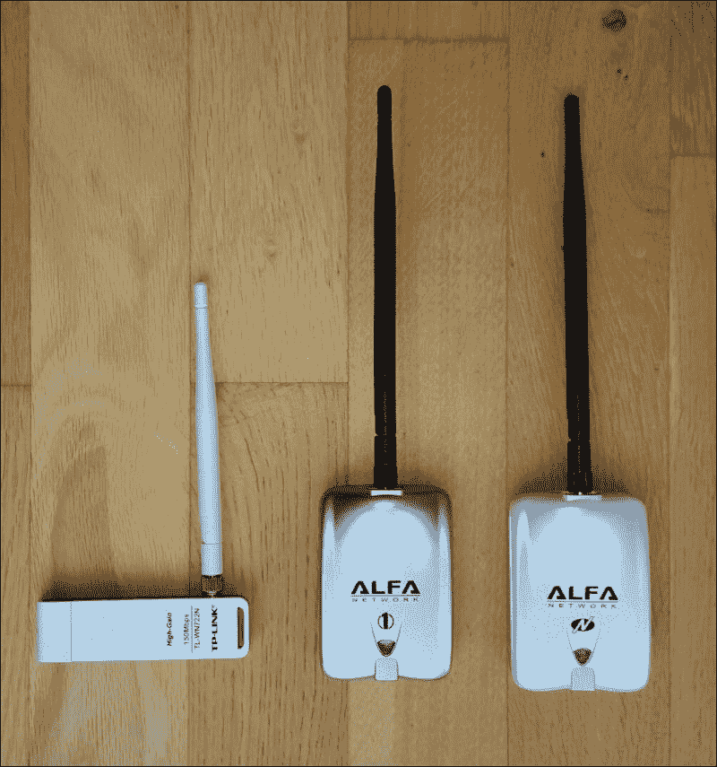
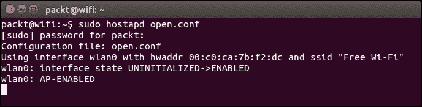
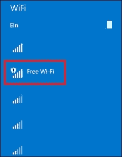
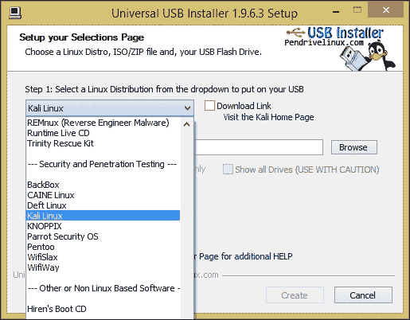
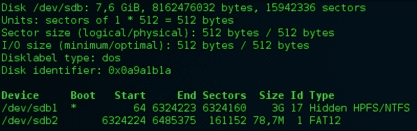
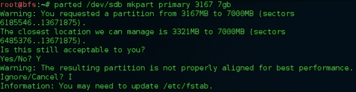

# 第七章。准备无线渗透测试平台

在进行渗透测试时，始终需要做好充分准备，安装所有工具并测试脚本，以免在下载和使所有工具运行方面浪费宝贵的项目时间。特别是当现场没有互联网访问时，这一点尤为重要。在本章中，我们将帮助您准备无线渗透测试，探讨以下主题：

+   渗透测试平台的常见变体

+   选择适合的 Wi-Fi 硬件接口

+   安装必要的 Wi-Fi 渗透测试软件

+   准备重要的配置文件和脚本

+   创建可启动的渗透测试 USB 闪存驱动器

# 渗透测试平台的常见变体

准备渗透测试平台并不是一个复杂的主题，但应该仔细考虑，以便为您的工作产生良好的结果。通常，这样的平台是基于笔记本电脑，但不一定是专门准备的笔记本电脑。我们考虑三种准备渗透测试平台的主要选项，您可以根据喜好选择：

+   在笔记本电脑的硬盘上安装 Linux 和所有必要的工具（或只是准备好的渗透测试分发）作为主操作系统或第二操作系统

+   准备一个安装了所有必要工具的虚拟机

+   准备一个可启动的 USB 闪存驱动器，带有专用的渗透测试 Linux 发行版

### 注意

当我们谈论 Wi-Fi 渗透测试设备时，默认情况下我们总是假设使用 Linux 操作系统。这并不意味着 Windows 或 Mac OS 不能用于此目的。在我们看来，Linux 是最便于进行 Wi-Fi 渗透测试的操作系统，因为它允许您在低级别上与硬件接口交互，而不需要大量额外的商业软件或硬件。

准备 Mac OS 的过程应该与 Linux 更或多少相似，而唯一对我们有问题的是 Windows。我们在 Windows 下看到的 Wi-Fi 渗透测试工具是作为共享软件分发的，或者只能与高成本的特殊设备一起使用，而在 Linux 下我们使用的所有工具都是免费且开源的。

安装 Linux 是一个已经多次描述的简单主题，因此我们在这里不会重复介绍，只会提到在物理和虚拟机上安装它的过程相似。这主要取决于您的硬件驱动程序的可用性。在本章中，我们将帮助您选择合适的软件，并为您未来的渗透测试平台提供一些自动化提示。

使用虚拟机是一个方便的选择，特别是如果您的主要系统是 Windows，并且可以通过标准 VirtualBox 的 USB 转发功能将用于测试的物理 Wi-Fi USB 接口转发到虚拟机。但正如我们的经验所示，它并不总是可靠且运行良好。这就是为什么我们只建议在必要时使用这个选项。

使用预装渗透测试分发版的 USB 盘是一个非常好的选择，尤其是当你仅将系统用于测试，而不想更改笔记本的主操作系统，或者当你没有完全控制笔记本时（例如，使用他人的笔记本电脑）。

在本章中，我们将告诉你最有可能需要哪些软件，并介绍如何安装它们。我们将为你的渗透测试平台准备一些配置和脚本，同时也会展示如何创建一个可启动的 Kali Linux 2.0 USB 盘。首先，让我们看看如何选择一个适合渗透测试的物理 Wi-Fi 接口。

# 选择接口

在我们开始准备实例之前，我们需要关注硬件 Wi-Fi 接口，因为它可能是渗透测试平台中最重要的部分。硬件 Wi-Fi 接口对渗透测试至关重要，有三个主要标准会影响我们的选择：

+   **芯片组**：Wi-Fi 接口的芯片组应能够支持数据包注入模式，这使我们能够在低层次与接口进行交互，并定制传输的数据包。

+   **功率与灵敏度**：该参数决定了你与目标之间的距离——功率和灵敏度越高，距离越远。但你需要考虑到，较高的功率会消耗更多电能并缩短笔记本的电池寿命。

+   **比例**：这个参数不会影响渗透测试的质量，但会影响工作上的便捷性。接口越大，线缆越多，现场使用时就越不方便。

让我们回顾两种典型的硬件接口选项：

+   **内建笔记本接口**：在某些情况下，您可以使用笔记本的内建 Wi-Fi 接口，尤其是当您在主机上安装操作系统和软件，而非使用虚拟机实例，或者使用可启动 USB 盘时。

    其优点是可以节省购买额外接口的费用，并且使整个平台更加紧凑、不易引人怀疑（在公共场合使用一台有奇怪线缆和设备或外部接口的笔记本电脑，往往会引来更多不必要的疑问）。虽然怀疑性对我们来说并不重要，因为我们是经过授权的道德黑客，但工作舒适性通常非常宝贵。

    缺点是，这类接口几乎总是信号强度较差，并且可能具有不支持必要模式和功能的芯片组，因此不适用于渗透测试。

+   **外部 USB 接口**：典型的外部 USB 接口形态是需要直接插入 USB 端口的加密狗，或是需要通过电缆连接到 USB 端口的设备。外部 USB 接口通常还配有外部可拆卸天线。

    其优点是，这种类型的接口通常提供更好的传输/接收能力，具有更高的信号功率和灵敏度。与内建接口相比，USB 接口更容易更换。

    外部 Wi-Fi 接口的缺点包括额外的成本、更高的电池消耗和降低的工作舒适度。

当你选择一个接口时，最重要的参数应该是芯片组。如果它不支持数据包注入模式，那么你就不需要选择它。其他两个标准我们留给你的个人喜好。

你可以很容易地在互联网上的许多网站和论坛上找到支持数据包注入模式的芯片组列表，但我们建议你首先阅读 Aircrack-ng 团队在其网站上编写的手册：

+   [`www.aircrack-ng.org/doku.php?id=compatible_cards`](http://www.aircrack-ng.org/doku.php?id=compatible_cards)

+   [`www.aircrack-ng.org/doku.php?id=compatibility_drivers`](http://www.aircrack-ng.org/doku.php?id=compatibility_drivers)

根据我们的经验，最常见的适用芯片组如下：

+   Atheros AR9271

+   Ralink RT3070

+   Ralink RT3572

+   Realtek 8187L

如果你不想花时间比较各种 Wi-Fi 接口及其参数，我们可以推荐来自 Alpha Network 公司的几款我们最喜欢的设备：

+   Alfa AWUS 036 H，采用 RTL8187 芯片组

+   Alfa AWUS 036 NHR (v.2)，采用 RTL8188RU 芯片组

TP-Link TP-WN722N 是一个非常好的 USB 接口。你可以在下图中看到这三种接口：



我们的 Wi-Fi 渗透测试“工作马”

如果你已经有了一个 Wi-Fi 接口，并且不确定它是否支持数据包注入模式，你可以通过使用以下手册，利用 Aircrack-ng 套件进行测试：

[`www.aircrack-ng.org/doku.php?id=injection_test`](http://www.aircrack-ng.org/doku.php?id=injection_test)

# 安装必要的软件

提供的信息应该足以成功选择一个接口，我们可以继续准备 Wi-Fi 黑客平台的软件部分。

假设你已经在硬盘或虚拟机上安装了基于 Debian 的 Linux 发行版，并且想要为 Wi-Fi 渗透测试准备工具。以下是我们推荐你首先安装的必要工具列表：

+   **Aircrack-ng 套件**：这是一个很棒的无线黑客工具包，我们在第六章中对其进行了评测，*探索黑客工具包*。

+   **Hostapd**：这是用于安装假冒接入点的软件。它在与 FreeRADIUS-WPE 一起使用时，对于 WPA-Enterprise 攻击非常有效。

+   **Hostapd-WPE**：这是一个用于安装假冒接入点并发起各种攻击类型的软件，包括对受 WPA-Enterprise 保护的 WLAN 进行攻击。

+   **FreeRADIUS-WPE**：这是我们用来保护 WLAN 的 FreeRADIUS 软件的一个修改版本。这个修改在 RADIUS 身份验证过程中将用户名和密码哈希保存在日志文件中。现在它已经过时，推荐使用 Hostapd-WPE 代替。

+   **Mana**：这是一个攻击无线客户端的工具包（我们在第六章中也有介绍它，*探索黑客工具包*）。

+   **SSLstrip**：这是著名人物 Moxie Marlinspike 为 SSL 连接的中间人攻击开发的工具。

+   **Wireshark 或 tcpdump**：这些是用于网络流量分析的优秀工具，是大多数渗透测试人员的标准工具。

+   **Reaver**：这是一个用于攻击 WPS 的有用工具。

+   **Nmap**：这是一个流行的网络扫描器，世界各地成千上万的渗透测试人员都非常重视的另一款著名工具（你已经可以在第六章中了解它，*探索黑客工具包*）。

+   **Wifite**：这是一个用于自动化 Wi-Fi 黑客任务的 Python 脚本。它需要安装 Aircrack-ng。

+   **WiFi Honey**：这是一个用于 Wi-Fi 黑客自动化的 bash 脚本，并且它还需要 Aircrack-ng。

+   **coWPAtty**：这是一个 WPA-PSK 破解软件，可以通过常规字典攻击以及使用预计算的 PMK 文件进行破解。

+   **Dnsmasq**：这是一个 DNS 和 DHCP 服务器软件，对于伪造接入点非常有用。

这个列表可以扩展，你可能会有自己喜爱的、有用的工具没有被包含（例如 Karmetasploit），但这里列出的工具是我们在日常工作中使用的必备工具。无需多言，你始终可以安装任何你认为需要或想尝试的工具。

我们列表中的大多数软件可以通过以下命令组合使用`apt-get`进行安装：

```
**sudo apt-get update && sudo apt-get install -y aircrack-ng wifite reaver sslstrip wifite nmap dnsmasq**

```

### 注

参数`-y`使`apt-get`假定你对所有安装提示回答`yes`，因此它不会多次打扰你。

但你需要手动下载和安装其他工具。在下面的表格中，你可以找到其他软件发行版的官方源链接：

| 工具 | 来源 |
| --- | --- |
| FreeRADIUS-WPE | [`github.com/brad-anton/freeradius-wpe`](https://github.com/brad-anton/freeradius-wpe) |
| Hostapd-WPE | [`github.com/OpenSecurityResearch/hostapd-wpe`](https://github.com/OpenSecurityResearch/hostapd-wpe) |
| Mana Toolkit | [`github.com/sensepost/mana`](https://github.com/sensepost/mana) |
| WiFi Honey | [`digi.ninja/projects/wifi_honey.php`](https://digi.ninja/projects/wifi_honey.php) |
| coWPAtty | [`www.willhackforsushi.com/?page_id=50`](http://www.willhackforsushi.com/?page_id=50) |

### 注

您可以在《*Kali Linux: Wireless Penetration Testing Beginner's Guide*》一书中找到更多关于安装和使用大量无线渗透测试工具的信息，*Vivek Ramachandran 和 Cameron Buchanan*，*Packt Publishing*（[`www.amazon.com/Kali-Linux-Wireless-Penetration-Beginners/dp/1783280417`](http://www.amazon.com/Kali-Linux-Wireless-Penetration-Beginners/dp/1783280417)）。

让我们从安装 FreeRADIUS-WPE 开始。尽管它已经过时，但我们已经使用了它很多次，并且仍然很欣赏它，因此我们希望向您展示如何安装和配置它，以防您想尝试。

由于我们使用的是基于 Debian 的 Linux 发行版，您可以下载最新的`.deb`文件`freeradius-server-wpe_2.1.12-1_i386.deb`（[`github.com/brad-anton/freeradius-wpe/raw/master/freeradius-server-wpe_2.1.12-1_i386.deb`](https://github.com/brad-anton/freeradius-wpe/raw/master/freeradius-server-wpe_2.1.12-1_i386.deb)），并使用 DPKG 包管理器进行安装：

```
**sudo dpkg --install freeradius-server-wpe_2.1.12-1_i386.deb && sudo ldconfig**

```

FreeRADIUS-WPE 现在已安装，您可以通过输入以下命令来检查它：

```
**radius -v**

```

要运行 FreeRADIUS-WPE 服务器，请输入以下命令：

```
**radiusd -x**

```

但在运行之前，您需要准备证书并根据目标 WLAN 参数更改配置文件。我们将在下一个主题中讨论这一点。现在，让我们继续安装 Hostapd-WPE。

安装 Hostapd-WPE 实际上是通过一个特殊的补丁修补 Hostapd 2.2，添加攻击功能。因此，我们首先需要安装 Hostapd 本身。它可以通过`apt-get`从仓库安装，但当前可用版本是 v.2.1，而我们需要的是 v.2.2。因此，我们需要直接从网站下载 v.2.2 并手动安装，但这需要先安装一些前置条件：

```
**sudo apt-get update && sudo apt-get install -y git libssl-dev libnl-dev**

```

然后，下载并解压必要的文件：

```
**git clone https://github.com/OpenSecurityResearch/hostapd-wpe**
**wget http://hostap.epitest.fi/releases/hostapd-2.2.tar.gz**
**tar -zxf hostapd-2.2.tar.gz**

```

现在，进入新目录并修补 Hostapd：

```
**cd hostapd-2.2**
**patch -p1 < ../hostapd-wpe/hostapd-wpe.patch**

```

接下来，进入`hostapd`目录并使用`make`命令：

```
**cd hostapd**
**make**

```

软件现在已安装。要启动它，请在`hostapd-2.2/hostapd`目录中运行以下命令：

```
**sudo ./hostapd-wpe %config_file_name%**

```

您可以在相同目录下的`hostapd-wpe.log`文件中找到身份验证尝试的结果。

### 注意

当您在基于 Debian 的 Linux 中使用 Wi-Fi 接口时，可能会遇到与网络服务干扰的问题。为避免此问题，请编辑其配置文件`/etc/NetworkManager/NetworkManager.conf`，并附加以下行：

```
[keyfile]
unmanaged-devices=mac:xx:xx:xx:xx:xx:xx
```

这里，`xx:xx:xx:xx:xx:xx`是您的 Wi-Fi 接口的硬件地址（您可以通过例如命令`ifconfig -a`的输出找到它）。

之后，您需要重启网络服务：

```
**sudo /etc/init.d/networking restart**

```

这将使您的 Wi-Fi 接口不受网络服务管理的设备影响，并消除干扰。

此外，我们建议使用`airmon-ng`功能`check`检查与其他服务和软件的干扰。如果您在命令中添加`kill`，它还会终止所有可能干扰的进程：

```
**sudo airmon-ng check kill**

```

现在轮到 Mana 了。从 GitHub 下载 Mana 压缩包并解压：

```
**unzip mana-master.zip**

```

然后，进入 Mana 目录并编辑 Ubuntu 的安装脚本：

```
**cd mana-master/**
**nano ubuntu-install.sh**

```

你需要找到以下一行：

```
echo "deb http://http.kali.org/kali kali main non-free contrib" > /etc/apt/sources.list.d/mana-kali.list
```

用以下这一行替换：

```
echo "deb http://http.kali.org/kali sana main non-free contrib" > /etc/apt/sources.list.d/mana-kali.list
```

现在，你可以更新包信息并运行安装脚本：

```
**sudo apt-get update && sudo ./ubuntu-install.sh**

```

它会显示一个警告，说明安装程序假设你使用的是 Ubuntu 14.04。

该脚本将自动安装所有必要的依赖项，你只需在安装过程中回答 `yes`，它会自动完成所有操作。现在，Mana 工具包已经安装完毕。

WiFi Honey 不需要安装，但它要求安装前提软件 Screen 和 Aircrack-ng。我们已经安装了 Aircrack-ng，你可以使用以下命令安装 Screen：

```
**sudo apt-get install screen**

```

接下来，只需下载压缩包，将其放入你喜欢的目录并解压：

```
**tar jxf wifi_honey_1.0.tar.bz2**

```

并使用以下命令使其可执行：

```
**chmod +x wifi_honey.sh**

```

WiFi Honey 已准备好使用。

我们列表中的最后一款软件是 coWPAtty。首先，我们需要安装 OpenSSL 和 libpcap，这是 coWPAtty 所必需的：

```
**sudo apt-get install openssl libpcap0.8-dev**

```

然后，你可以从官方网站下载最新版本的压缩包到你喜欢的文件夹并解压：

```
**tar zxvf cowpatty-4.6.tgz**

```

然后，进入目录并编译 coWPAtty：

```
**cd cowpatty-4.6/**
**make**

```

它应在你可以启动它的同一目录中编译 coWPAtty：

```
**./cowpatty**

```

最后，我们已经完成了软件安装，可以进入下一步。

# 准备配置文件和脚本

我们已经在我们的 Wi-Fi 渗透测试系统中安装了必要的工具，但这只是准备工作的一部分。为了能够使用其中一些工具，我们需要准备一些配置文件并开发脚本来自动化某些任务。

### 注意

你可能需要调整本章中给出的部分配置文件和脚本，以使它们适应你的硬件和软件环境。

我们希望从 Hostapd 开始。我们通常在两种情况下使用它：当我们需要安装一个虚假 AP 来攻击客户端流量时，以及在攻击 WPA-Enterprise 保护的网络时，用 FreeRADIUS-WPE 设置 AP。

## 基于 Hostapd 的独立接入点（AP）

要为客户端流量或钓鱼攻击安装一个伪造的 AP，你可以在独立模式下使用 Hostapd，而无需将其连接到 RADIUS 服务器。通常情况下，我们需要它是开放的，但有时也会遇到需要它是 WPA/WPA2 保护的情况，例如，当你需要模拟一个特定的 WPA/WPA2 保护的 AP 时。因此，我们需要为这两种情况准备两个配置文件模板：

以下是 `open.conf` 文件的内容，用于开放式接入点（AP）：

```
interface=wlan0
driver=nl80211
ssid=Free Wi-Fi
channel=8
```

以下是 `wpa.conf` 文件的内容，用于 WPA2 保护的接入点（AP）：

```
interface=wlan0
driver=nl80211
ssid=YourSSID
channel=8
wpa_passphrase=your_passphrase
wpa=2
wpa_key_mgmt=WPA-PSK
wpa_pairwise=TKIP CCMP
```

在使用这些模板之前，你需要根据具体情况修改一些值：

+   驱动程序的值应更改为与你的 Wi-Fi 接口相对应的值（就 Hostapd 而言，你可以从 Hostapd 提供的示例配置文件中获取该值）

+   接口的值应更改为你的 Wi-Fi 接口名称，如果它不是以 `wlan0` 连接的

+   我们需要 `ssid` 的值来更改 WLAN 的名称

+   通道的值可以在 1 到 11 之间任意选择

+   如果您正在设置 WPA 保护的 AP，则需要 WPA 密码

然后，您可以使用 Hostapd 和先前提到的配置之一启动一个 AP，例如 `open.conf`：

```
**sudo hostapd open.conf**

```

在您的 Linux 终端中，您应该看到以下内容：



启动一个开放式 AP

同时，您可以在另一台设备上的可用网络列表中看到您的开放 WLAN：



我们的开放式 AP 在可用 WLAN 列表中列出

### 提示

如果您在 Hostapd 上遇到任何问题，选项 `-d` 非常有帮助。它使 Hostapd 在终端中显示调试信息。选项 `-f` 将调试输出转发到文件而不是标准输出。您可能还想使用 `-t` 和 `-K` 选项在调试输出中包含一些额外信息。

让我们进一步准备一个 DHCP 服务器的配置，以便将其用于使您的 Rogue AP 更具吸引力和真实性。我们使用 Dnsmasq 软件设置 DHCP 服务器，它需要一个配置文件 `/etc/dnsmasq.conf`：

```
interface=wlan0
dhcp-range=192.168.0.2,192.168.0.255,12h
dhcp-option=3,192.168.0.1
dhcp-option=6,192.168.0.1
log-facility=/var/log/dnsmasq.log
log-queries
```

如果您的 Wi-Fi 接口不是 `wlan0`，则需要更改接口参数值。使用 DHCP 选项 3 和 6，我们设置路由器和 DNS 服务器的 IP 地址以在 DHCP 响应中分发。使用最后两行，我们配置日志输出以便在出现问题时能够调试我们的设置。

## 自动化 AP 设置

通常，在渗透测试期间，您不希望花时间更改配置文件，可能会忘记更改某些参数。因此，自动化流程是明智的选择。我们为您准备了一个 bash 脚本 `hostapd_auto.sh`，它会自动创建包含必要参数的临时配置文件，然后使用此配置启动 Hostapd：

```
#!/bin/bash
#show usage tips if no argument supplied
if [[ $# < 1 ]]
then
    echo -e "Usage: ./hostap_standalone.sh options"
    echo -e "\t-i|--interface - wlan interface to use (default wlan0)"
    echo -e "\t-s|--ssid - ssid to set (default \"Free WiFi\""
    echo -e "\t-d|--driver - driver, corresponding to hostapd (default nl80211)"
    echo -e "\t--security - security type: open, wpa, wpa2 (default \"open\")"
    exit
fi
#Let's save all command line arguments into variables
while [[ $# > 1 ]]
do
key="$1"

case $key in
    -i|--interface)
    WIFIINTERFACE="$2"
    shift # pass next argument
    ;;
    -s|--ssid)
    SSID="$2"
    shift # pass next argument
    ;;
    -d|--driver)
    DRIVER="$2"
    shift # pass next argument
    ;;
    --security)
    SECURITY="$2"
    shift # pass next argument
    ;;
    *)
            # unknown option
    ;;
esac
shift # pass next argument
done
#Check if parameters were set
if [ -z "$WIFIINTERFACE" ]
then
    echo "WIFI interface not set ( -i | --interface ), using default wlan0"
    WIFIINTERFACE="wlan0"
fi
if [ -z "$SSID" ]
then
    echo -e "SSID not set ( -s | --ssid ), using default \"Free WiFi\""
    SSID="Free WiFi"
fi
if [ -z "$DRIVER" ]
then
    echo "Driver not set ( -d | --driver ), using default nl80211"
    DRIVER="nl80211"
fi
if [ ! -z "$SECURITY" ]
then
    case $SECURITY in
    wpa|WPA)
    wpa="wpa=1"
    echo "Enter WPA passphrase:"
    read PASS
    ;;
    wpa2|WPA2)
    wpa="wpa=2"
    echo "Enter WPA passphrase:"
    read PASS
    ;;
    open|Open|OPEN)

    ;;
    *)
    echo "Unknown security type, setting an open AP"
    SECURITY="open"
    ;;
     esac
else
    echo "Security not set ( --security ), setting an open AP"
     SECURITY="open"
fi
#Creating a temporary configuration file
echo "interface=$WIFIINTERFACE" >> temp.conf
echo "driver=$DRIVER" >> temp.conf
echo "channel=8" >> temp.conf
echo "ssid=$SSID" >> temp.conf
if [ "$SECURITY" != "open" ]
then
    echo $wpa >> temp.conf
    echo "wpa_passphrase=$PASS" >> temp.conf
    echo "wpa_key_mgmt=WPA-PSK" >> temp.conf
    echo "wpa_pairwise=TKIP CCMP" >> temp.conf
fi
#Preparing the host for network traffic processing
#Stopping the networking service to exclude conflicts
/etc/init.d/networking stop
#set the IP parameters for wireless interface
ifconfig $WIFIINTERFACE 192.168.0.1 netmask 255.255.255.0
route add -net 192.168.0.0 netmask 255.255.255.0 gw 192.168.0.1
#start dhcp and dns server
service dnsmasq start
#Prepare network traffic processing rules
iptables -F
iptables -t nat -F
iptables -A FORWARD -i eth0 -d 192.168.0.0/255.255.255.0 -j ACCEPT
iptables -t nat -A POSTROUTING -o eth0 -j MASQUERADE
#You can uncomment the following line to redirect client ssl traffic to TCP port 10000
#iptables -t nat -A PREROUTING -p tcp --destination-port 443 -j REDIRECT --to-port 10000
#enable network traffic forwarding
echo 1 > /proc/sys/net/ipv4/ip_forward
#Starting AP
echo "Starting an AP with the following parameters:"
echo "SSID: $SSID"
echo "SECURITY: $SECURITY"
echo "Interface: $WIFIINTERFACE"
echo "Driver: $DRIVER"
hostapd temp.conf
wait
#Removing the temporary configuration file
rm temp.conf
#Stopping dnsmasq
service dnsmasq stop
#Starting networking service
/etc/init.d/networking start
```

您只需将脚本设为可执行（`chmod +x hostapd_auto.sh`）并在不带参数的情况下启动它，以查看可能的选项。当您停止 Hostapd 时，它将自动删除临时配置文件。不要忘记在启动脚本时使用 `sudo`，因为它需要更改需要 root 权限的系统参数。

## WPE-Enterprise 的配置

现在，让我们讨论一个带有 WPE-Enterprise 保护 WLAN 的场景。对于这种情况，我们需要使用 Hostapd 和 FreeRADIUS-WPE，或者 Hostapd-WPE。在第一种情况下，您需要配置一个 RADIUS 服务器，并为 Hostapd 创建一个额外的配置文件。

但是首先，无论你使用什么，你都需要配置 RADIUS 证书参数并在开始攻击 WPA-Enterprise 保护的 WLAN 时创建证书，这对于 FreeRADIUS-WPE 和 Hostapd-WPE 都适用。这可以通过更改`ca.cnf`文件中的`[certificate_authority]`部分和`server.cnf`文件中的`[server]`部分的参数来完成。根据你的任务，你可能还需要更改`client.cnf`文件中`[client]`部分的值。

将参数设置为与你的目标 WLAN 相应的相同参数值，可以使攻击变得不那么显眼，也不那么可疑。在更改所有必要的参数值后，只需从相同的目录执行引导脚本来生成证书：

```
**./bootstrap**

```

FreeRADIUS-WPE 的配置过程与第五章中描述的 FreeRADIUS 配置过程类似，*实现安全*。因此，我们不会在本章中描述它，但我们会向你展示一个配置文件`wpa-e.conf`，它允许 Hostapd 与 FreeRADIUS-WPE 一起工作：

```
interface=wlan0
driver=nl80211
ssid=YourSSID
ieee8021x=1
eapol_key_index_workaround=0
own_ip_addr=192.168.0.1
auth_server_addr=127.0.0.1
auth_server_port=1812
auth_server_shared_secret=YourRADIUSsecret
wpa=1
wpa_key_mgmt=WPA-EAP
channel=1
wpa_pairwise=TKIP CCMP
logger_stdout=-1
logger_stdout_level=0
dump_file=hostapd.dump
```

在本示例中，你需要更改以下内容：

+   更改`interface`和`driver`参数，并根据你的硬件 Wi-Fi 接口设置值。

+   更改`ssid`参数，它应该与目标 WLAN 的 SSID 相同。

+   更改`auth_server_shared_secret`，这是用于将 Hostapd 连接到 RADIUS 服务器的共享密钥（密码）。

最后三行配置了日志记录；你可以注释掉它们，在需要调试配置时再使用。

现在，你可以先启动 FreeRADIUS-WPE，然后再启动 Hostapd，以拥有一个 WPA-Enterprise 保护的 AP。但你也可以仅使用 Hostapd-WPE 和一个包含以下内容的配置文件来实现这一点：

```
interface=wlan0
ssid=PACKT

eap_user_file=hostapd-wpe.eap_user
ca_cert=../../hostapd-wpe/certs/ca.pem
server_cert=../../hostapd-wpe/certs/server.pem
private_key=../../hostapd-wpe/certs/server.pem
private_key_passwd=whatever
dh_file=../../hostapd-wpe/certs/dh

hw_mode=g
channel=1

eap_server=1
eap_fast_a_id=101112131415161718191a1b1c1d1e1f
eap_fast_a_id_info=hostapd-wpe
eap_fast_prov=3
ieee8021x=1
pac_key_lifetime=604800
pac_key_refresh_time=86400
pac_opaque_encr_key=000102030405060708090a0b0c0d0e0f
wpa=1
wpa_key_mgmt=WPA-EAP
wpa_pairwise=TKIP CCMP
```

但是与 Hostapd 一样，Hostapd-WPE 也随附一个名为`hostapd-wpe.conf`的示例配置文件，其中包含所有可能参数及其默认值的信息。你只需更改该文件中的`interface`和`ssid`参数并使用它。无论如何，我们建议你查看它，以了解如何创建自己的配置文件或修改现有文件。

### 提示

作为一个练习，你可以修改前一小节中的自动化脚本，使其也能与 WPA-Enterprise 配置一起使用。

# 准备 Kali USB 闪存盘

之前章节中写的内容适合那些希望拥有一个“干净”的渗透测试平台，仅包含他们选择并安装的工具的人。但在大多数情况下，这并不是必要的，我们认为这样做往往不值得花费时间。更便捷的解决方案是使用预先准备好的渗透测试发行版。我们已经在本章开头提到过它，当时谈到了虚拟机，但现在让我们回顾一下如何创建一个 **可启动的渗透测试 USB 启动盘**。

在我们的示例中，我们将展示如何在 Windows 和 Linux 系统上创建一个带有 Kali 2.0 渗透测试发行版的可启动 USB 启动盘。如果你想快速完成，而且不希望 USB 启动盘上有额外复杂性，我们建议你在 Windows 下创建它。但如果你想创建一个 **持久化加密 USB 启动盘**，你需要使用 Linux 并手动完成所有操作。我们推荐这种方法，因为我们在 Windows 下使用的镜像写入软件只会在 USB 驱动器上创建一个分区，而对于一个带有加密持久化存储的可启动 USB，你需要三个分区。

### 注意

你需要有一个至少 8 GB 容量的 USB 驱动器才能支持加密的持久化存储。

## 在 Windows 下创建 USB 启动盘

我们先从最简单的选项开始，在 Windows 下创建一个非持久化的 USB 启动盘。

### 提示

如果你想创建一个持久化的 USB 启动盘，可以直接跳到下一个子主题，查看如何在 Linux 下创建它。

我们将使用 **Universal USB Installer** (**UUI**) 软件 ([`www.pendrivelinux.com/universal-usb-installer-easy-as-1-2-3/`](http://www.pendrivelinux.com/universal-usb-installer-easy-as-1-2-3/)) 来进行镜像写入。假设你已经从官方网站下载了最新版的 Kali Linux 2.0 镜像并启动了 UUI。过程非常简单：

1.  从下拉菜单中选择所需的 Linux 发行版，正如下图所示：

    创建一个可启动的 Kali USB 启动盘

1.  选择你要写入的操作系统镜像文件。

1.  从下拉菜单中选择目标 USB 磁盘。如果下拉菜单中没有显示你的 USB 驱动器，勾选 **显示所有驱动器** 复选框，它将显示所有可用的系统驱动器。

1.  选择在写入之前格式化 USB 驱动器的选项，并点击 **创建**。你的设置应该如下所示：

    Kali USB 启动盘镜像写入的最终 UUI 设置

1.  软件会向你显示它将要执行的操作摘要，并再次询问你是否同意。

1.  同意并等待写入过程完成。

1.  享受你的可启动 Kali Linux 2.0 USB 启动盘。

### 注意

或者，你可以使用 Win32 Disk Imager 将可启动镜像写入 USB 驱动器或磁盘。你可以从[`sourceforge.net/projects/win32diskimager/`](https://sourceforge.net/projects/win32diskimager/)下载该软件。

## 在 Linux 下创建 USB 驱动器

如果你决定想要一个加密的持久 USB 驱动器，或者你通常只使用 Linux 而非 Windows，我们将展示如何在这个系统下创建 Kali USB 驱动器。如果你没有将 Linux 安装为主机系统，你还可以在 Windows 上使用带有 USB 转发功能的 Linux 虚拟机。

我们已经下载了一个名为`kali-linux-2.0-amd64.iso`的 Kali 镜像文件，如果你的文件名相同，接下来的指南可以保持原样。但如果文件名不同，请确保在你输入的命令中替换它。步骤如下：

1.  插入 USB 驱动器或将其连接到虚拟机。使用`fdisk -l`查找 USB 驱动器的设备名称（如有必要，使用`sudo`）。在我们的案例中，它是`/dev/sdb`。

1.  使用 Linux 中的`dd`克隆命令将镜像复制到 USB 驱动器：

    ```
    **dd if=kali-linux-2.0-amd64.iso of=/dev/sdb bs=512k**

    ```

1.  等待直到镜像完全复制到 USB 驱动器。根据你的软件和硬件配置，这可能需要一些时间。在我们的案例中（使用仅支持 USB 1.0 的 VirtualBox 虚拟机），大约花费了 20 分钟。

1.  当过程完成时，你将看到已复制的字节数和所用时间的总结。此时，镜像录制完成。

1.  你可以再次运行`fdisk -l`来检查 USB 驱动器上的分区。应该有两个分区：

    可启动 Kali USB 驱动器的分区信息

现在，你可以使用任何笔记本电脑从新创建的 Kali Linux 2.0 USB 驱动器启动；如果你经常旅行，这特别方便。

## 创建加密的持久分区

拥有一个可启动的 Kali USB 驱动器很方便，但它有一个大缺点：你无法在系统中保存任何内容以便在重启后保持。即使是系统设置，每次重启时也会重置为默认值。当你需要保存项目数据以便稍后在另一台计算机上处理时，这尤其尴尬，例如，在一个专用的强大破解服务器上破解哈希。在这个子话题中，我们将解决这个问题，并使我们的 USB 驱动器能够存储数据。本手册基于 Kali Linux 团队的官方手册，但我们认为一些额外的注释会对你有所帮助。

牢记伦理黑客几乎总是处理敏感的客户数据，这些数据必须小心处理，而 USB 驱动器是一个容易丢失的小物件，我们还将使用 Cryptsetup 软件对其进行加密，防止未经授权的读取。这里的思路不是对整个 USB 驱动器进行加密，而是创建一个额外的分区，用来保存你的**持久**数据并进行**加密**。

如果你使用的 USB 驱动器大于 4 GB，那么在录制 Kali 镜像之后应该会有一些未分配的空间。我们将使用这个空间来创建我们的持久化分区。步骤如下（我们将继续在 Kali Linux 虚拟机上进行操作）：

1.  插入 USB 驱动器并使用 `fdisk -l` 检查分区。

1.  获取 Kali 镜像占用的空间（以字节为单位，我们的例子中是 3,167 字节）：

    ```
    **du -bcm kali-linux-2.0-amd64.iso**

    ```

1.  在 USB 驱动器上创建第三个分区，起始位置紧接着 Kali 镜像（使用你 Kali 镜像的大小值）：

    ```
    **parted /dev/sdb mkpart primary 3167 7gb**

    ```

    如果 parted 提供给你另一个分配，选择**是**并忽略以下警告。该过程应该如下所示：

    

    分区创建过程

1.  再次使用 `fdisk -l` 检查分区，你应该能看到新分区（在我们的例子中是 `/dev/sdb3`）。

1.  准备一个强密码，然后继续使用 `cryptsetup` 软件加密新分区。屏幕上会出现如下提示，如果你尚未安装它，可以使用以下命令进行安装（`sudo apt-get install cryptsetup-bin`）：

    ```
    **cryptsetup --verbose --verify-passphrase luksFormat /dev/sdb3**

    ```

1.  打开新分区，映射名称为 `kali_stor`：

    ```
    **cryptsetup luksOpen /dev/sdb3 kali_stor**

    ```

1.  然后，在新分区上创建一个标记为 `persistence` 的文件系统。文件系统类型应为 `ext3`（此过程可能需要几分钟）：

    ```
    **mkfs.ext3 -L persistence /dev/mapper/kali_stor && e2label /dev/mapper/kali_stor persistence**

    ```

1.  然后，你需要挂载新的文件系统。然而，为了能够进行挂载，首先你需要在 `/mnt/` 下创建一个挂载点：

    ```
    **mkdir -p /mnt/kali_stor && mount /dev/mapper/kali_stor /mnt/kali_stor**

    ```

1.  现在，在 `/mnt/kali_stor` 目录中创建一个名为 `persistence.conf` 的文件，内容为 `/ union`：

    ```
    **echo "/ union" > /mnt/kali_stor/persistence.conf**

    ```

1.  最后，你可以卸载存储并进行加密（关闭）：

    ```
    **umount /dev/mapper/kali_stor && cryptsetup luksClose /dev/mapper/kali_stor**

    ```

1.  让我们检查持久化存储。将 USB 驱动器从 Linux 机器中拔出，并从 USB 启动。当你启动时，选择 **Live USB 加密持久化** 启动选项，并在提示时输入加密密码：

    Kali Linux 2.0 USB 启动菜单

1.  当 Kali 启动时，在桌面上创建一个包含随机内容的文件并重启。文件在重启后仍然存在，这意味着持久化功能正常。

# 总结

在本章中，我们学习了如何为无线渗透测试准备一台“战斗”笔记本，列出了选择 Wi-Fi 接口的标准，回顾了必要软件的清单，并开发了有用的脚本和配置文件，以加快渗透测试的主动阶段。现在，你可以加载设备并开始渗透测试。在开始项目之前，我们强烈建议你学习如何使用这些工具，并在实验室中进行实践——这就是它们的用途！

到此，你几乎准备好开始学习渗透测试并在你的实验室中进行实践，但还有一件事没有完成。我们将在最后一章讨论：下一步建议，帮助你进一步发展渗透测试技能。
