# 第一章：使用 Burp Suite 入门

本章提供了继续学习本书材料所需的设置说明。从下载 Burp 开始，详细介绍了两种主要的 Burp 版本及其区别。

使用 Burp Suite 时，渗透测试员需要一个目标应用程序。本章包含下载和安装包含在**虚拟机**（**VM**）中的 OWASP 应用程序的说明。这些应用程序将在全书中作为目标脆弱的 Web 应用程序使用。

本章包括配置 Burp Suite 代理监听器的说明。此监听器用于捕获在本地浏览器和目标网站之间流动的所有 HTTP 流量。监听器的默认设置包括**互联网协议**（**IP**）地址 **127.0.0.1** 和端口号 **8080**。

最后，本章将介绍启动 Burp Suite 的选项，包括如何通过命令行启动 Burp Suite，选择性地使用无头模式，以及使用可执行文件启动。

在本章中，我们将介绍以下内容：

+   下载 Burp Suite（社区版和专业版）

+   设置 Web 应用渗透测试实验室

+   创建 PortSwigger 账户以访问 Web 安全学院

+   通过命令行或可执行文件启动 Burp Suite

+   使用 Burp 监听 HTTP 流量

# 下载 Burp Suite（社区版和专业版）

学习本书中包含的技术的第一步是下载 Burp Suite 应用程序。下载页面在这里：[`portswigger.net/burp/`](https://portswigger.net/burp/)。你需要决定下载哪个版本的 Burp Suite，以下是可供选择的版本：

+   专业版

+   社区版

+   企业版（未涵盖）：该产品专为大型公司设计，可在成千上万的目标上运行 Burp 扫描器

+   Dastardly（未涵盖）：此版本仅提供 Burp 扫描器功能，专门设计为与 Jenkins 和其他 CI 工具集成，作为 DevOps 流水线中的作业

现在被称为**社区版**的产品曾经被称为**免费版**。你可能会在互联网上看到这两者的引用，但它们是一样的。截止目前，专业版的价格为 $449。

为了帮助你做出选择，我们将比较这两个版本。社区版提供了本书中使用的许多功能，但并非全部。例如，社区版不包括任何扫描功能。此外，使用 Burp Suite Intruder 功能时，社区版在使用线程时有一定的强制性限制。社区版没有内置的有效负载，但你可以加载自定义负载。最后，许多需要专业版的 Burp Suite 扩展显然在社区版中无法使用。

Professional 版本启用了所有功能，包括被动和主动扫描器。没有强制性的流量限制。**PortSwigger**（即编写并维护 Burp Suite 的公司名称）提供了多个内置的有效载荷用于模糊测试和暴力破解。使用扫描器相关 API 调用的 Burp Suite 扩展也能在 Professional 版本中正常工作。

在本书中，我们将使用 Professional 版本，它相比 Community 版本提供了更丰富的功能。不过，当本书中使用到仅限于 Professional 版本的功能时，会通过一个特殊的图标进行标示：


图 1.1 – Burp Suite Professional 图标

## 准备工作

为了开始我们的共同冒险，请访问 [`portswigger.net/burp`](https://portswigger.net/burp) 并下载你希望使用的 Burp Suite 版本。页面上提供了一个滑块，如下所示，突出显示了 Professional 和 Community 版本的功能，允许你进行对比：

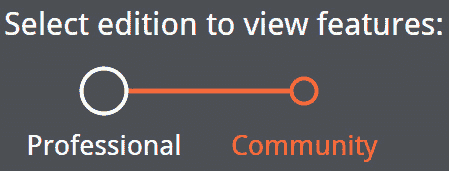

图 1.2 – Burp Suite Professional 与 Community 功能对比

在购买 Professional 版本之前，你可能希望选择 Community 版本，以便先熟悉该产品。

如果你选择购买或使用 Professional 版本的试用版，你需要填写表格或进行支付，并随后会收到邮件确认。一旦账户创建完成，你可以登录并通过我们的账户提供的链接进行下载。

### 软件工具要求

完成本配方需要以下内容：

+   Oracle Java ([`www.oracle.com/java/technologies/downloads/`](https://www.oracle.com/java/technologies/downloads/))

+   Burp Proxy Community 或 Professional ([`portswigger.net/burp/`](https://portswigger.net/burp/))

+   Mozilla Firefox 浏览器 ([`www.mozilla.org/en-US/firefox/new/`](https://www.mozilla.org/en-US/firefox/new/))

## 如何操作...

在确定所需版本后，你有两种安装选项，包括可执行文件或普通 JAR 文件。可执行文件仅适用于 Windows，并且提供 32 位和 64 位版本。普通 JAR 文件适用于 Windows、macOS 和 Linux。你可以在此处找到所有可用的下载选项：[`portswigger.net/burp/releases/professional-community-2023-4-5?requestededition=community&requestedplatform=`](https://portswigger.net/burp/releases/professional-community-2023-4-5?requestededition=community&requestedplatform=)。

Windows 可执行文件是自包含的，将在您的程序列表中创建图标。然而，普通 JAR 文件要求您的平台预先安装 Java ([`www.oracle.com/java/technologies/downloads/`](https://www.oracle.com/java/technologies/downloads/))。您可以选择当前版本的 Java（JRE 或 JDK），因此可以自由选择最新版本：

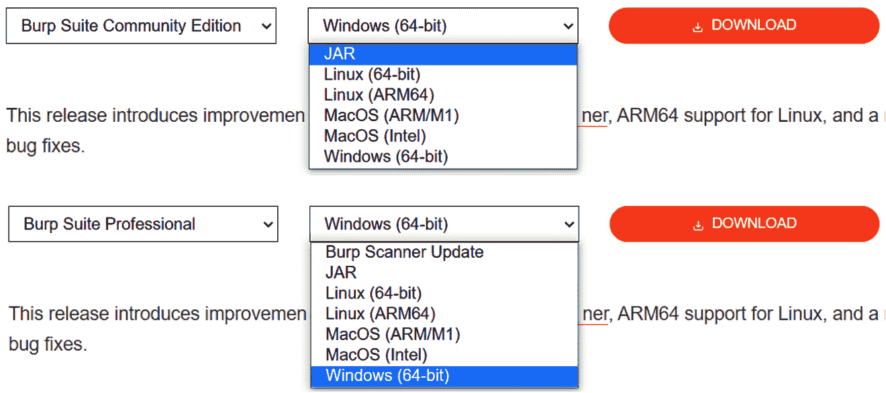

图 1.3 – PortSwigger 的下载页面

# 设置 web 应用渗透测试实验室

**破损的 Web 应用** (**BWA**) 是 OWASP 项目，提供一个完整的虚拟机，包含多种已知漏洞的应用程序。该虚拟机中的应用程序让学生可以了解 web 应用安全，实践和观察 web 攻击，并使用如 Burp Suite 等渗透工具。

为了按照本书中的教程进行操作，我们将使用 OWASP 的 BWA 虚拟机。在本书写作时，您可以从 [`sourceforge.net/projects/owaspbwa/files/`](https://sourceforge.net/projects/owaspbwa/files/) 下载 OWASP BWA 虚拟机。

## 准备工作

我们将下载 OWASP BWA 虚拟机及其辅助工具，以创建我们的 web 应用渗透测试实验室。

### 软件工具要求

为了完成此教程，您将需要以下内容：

+   Oracle VirtualBox ([`www.virtualbox.org/wiki/Downloads`](https://www.virtualbox.org/wiki/Downloads)): 选择适用于您的平台的可执行文件

+   Mozilla Firefox 浏览器 ([`www.mozilla.org/en-US/firefox/new/`](https://www.mozilla.org/en-US/firefox/new/))

+   7-Zip 文件归档工具 ([`www.7-zip.org/download.html`](https://www.7-zip.org/download.html))

+   OWASP BWA 虚拟机 ([`sourceforge.net/projects/owaspbwa/files/`](https://sourceforge.net/projects/owaspbwa/files/))

+   Burp Proxy 社区版或专业版 ([`portswigger.net/burp/`](https://portswigger.net/burp/))

+   Oracle Java ([`www.oracle.com/java/technologies/downloads/`](https://www.oracle.com/java/technologies/downloads/))

## 如何操作...

对于本教程，您需要下载 OWASP BWA 虚拟机，并通过以下步骤安装它：

1.  点击提供的 OWASP BWA 虚拟机链接后，点击 **下载最新版本** 并解压 **OWASP_Broken_Web_Apps_VM_1.2.7z** 文件。

1.  您将看到如下所示的多个文件列表：

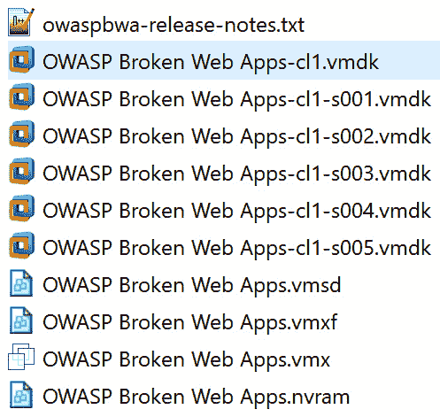

图 1.4 – 解压 OWASP_Broken_Web_Apps_VM_1.2.7z 后的文件列表

1.  所有显示的文件扩展名表明该虚拟机可以导入到 Oracle VirtualBox 或 VMware Player/Workstation 中。为了设置本书中的 web 应用渗透测试实验室，我们将使用 Oracle VirtualBox。

1.  记下 **OWASP Broken Web Apps-cl1.vmdk** 文件。打开 VirtualBox 管理器（即 Oracle VM VirtualBox 程序）。

1.  在 VirtualBox 管理器界面中，选择**机器** | **新建**从顶部菜单中输入虚拟机名称，例如**OWASP BWA**。

1.  将**类型**设置为**Linux**，**版本**设置为**Ubuntu (64-bit)**，然后点击**下一步**，如下所示：

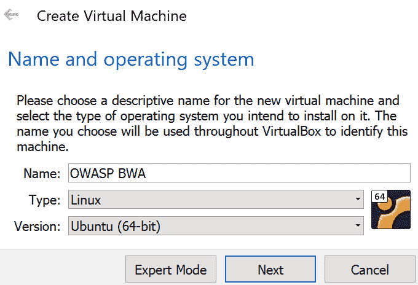

图 1.5 – 创建虚拟机

1.  下一个屏幕允许你调整内存或保持默认设置。点击**下一步**。

1.  在下一个屏幕上，选择**使用现有虚拟硬盘文件**。

1.  使用右侧的文件夹图标，从提取的文件列表中选择**OWASP Broken Web Apps-cl1.vmdk**文件并点击**创建**，如下所示：

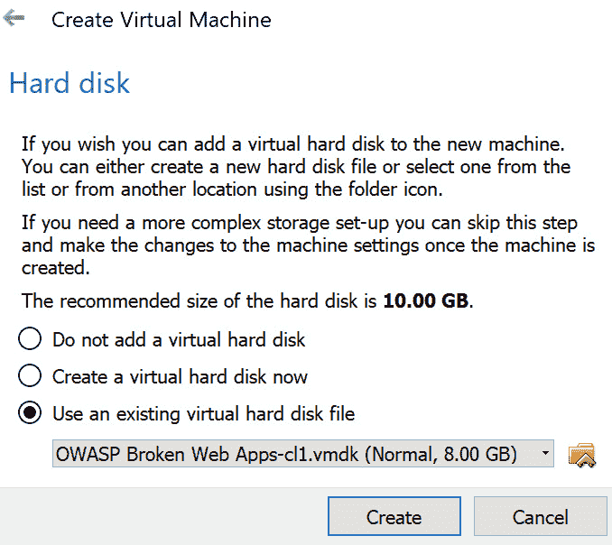

图 1.6 – 硬盘分配

1.  你的虚拟机已经加载到 VirtualBox 管理器中。让我们进行一些小的调整。高亮显示**OWASP BWA**条目并从顶部菜单选择**设置**。

1.  在左侧窗格中选择**网络**部分，并将**附加到：**更改为**仅主机适配器**。点击**确定**：

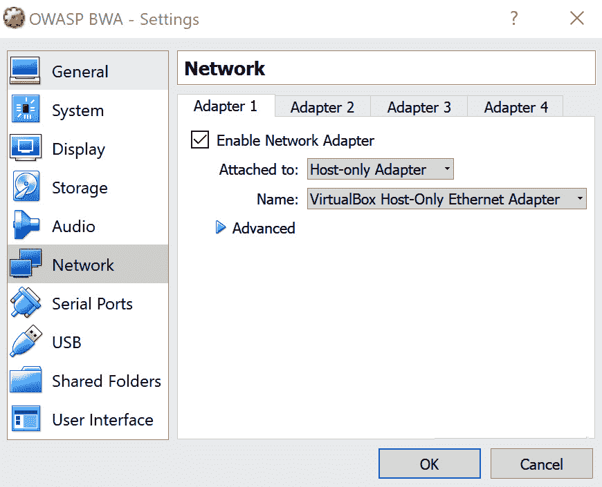

图 1.7 – 网络适配器设置

1.  现在，让我们启动虚拟机。右键点击，然后选择**启动** | **正常启动**：

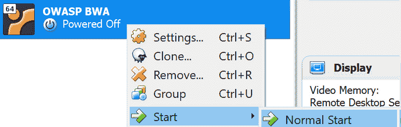

图 1.8 – 启动虚拟机

1.  等待直到 Linux 系统完全启动，这可能需要几分钟。启动过程完成后，你应该会看到以下屏幕。请注意，显示的 IP 地址与你的机器不同：

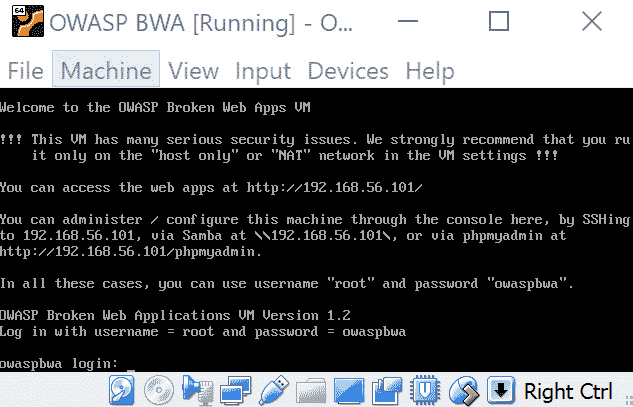

图 1.9 – 你的虚拟机分配的 IP 地址

1.  此屏幕上显示的信息指明了你可以访问虚拟机上运行的易受攻击 web 应用程序的网址。例如，在前一个屏幕截图中，网址是**http://192.168.56.101/**。你将会被提示管理虚拟机，但此时无需登录。

1.  在你的宿主系统中打开 Firefox 浏览器，而不是在虚拟机中。使用宿主机器上的 Firefox 浏览器，输入提供的网址（例如**http://192.168.56.101/**），其中 IP 地址是特定于你的机器的。

1.  在你的浏览器中，你将看到一个包含指向易受攻击的 web 应用程序的链接的索引页面。这些应用程序将在本书中作为目标进行使用：

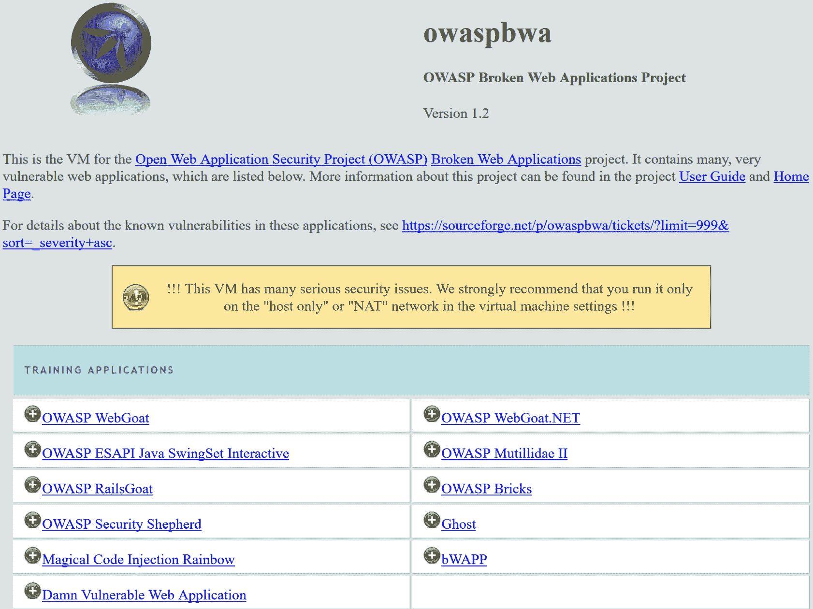

图 1.10 – 虚拟机的启动页

## 它是如何工作的…

利用 OWASP 创建的定制虚拟机，我们可以快速设置一个包含故意易受攻击应用程序的 web 应用渗透测试实验室，这些应用程序将作为我们本书中的合法测试目标。

# 创建 PortSwigger 账户以访问 Web 安全学院

在本版中，我们添加了更多与 web 安全相关的实验室，以丰富你使用 Burp Suite 的体验。为了跟进并完成这些实验室，你必须在 PortSwigger 上注册一个账户。

PortSwigger 通过 Web 安全学院 ([`portswigger.net/web-security`](https://portswigger.net/web-security)) 提供免费的在线 web 安全培训。学院包含学习材料、实操实验和练习考试。在本书中，我们将使用其中一些实验来演示黑客技术。

## 准备工作

浏览到 PortSwigger 网站 ([`portswigger.net/`](https://portswigger.net/)) 并查找**登录**按钮。点击**登录**按钮，进入登录页面，页面上有一个注册按钮：

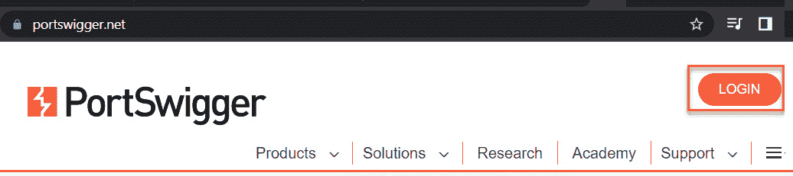

图 1.11 – PortSwigger 登录按钮

## 如何操作…

按照以下步骤操作：

1.  访问 [`portswigger.net/users`](https://portswigger.net/users)，然后选择底部的**创建账户**按钮，旁边是**登录**按钮：

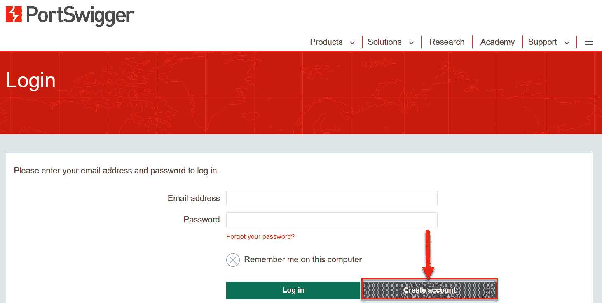

图 1.12 – 创建账户按钮

1.  您必须提供有效的电子邮件地址，以便接收登录网站的密码：

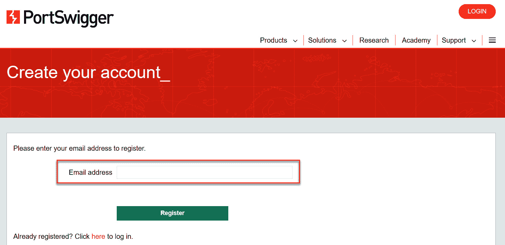

图 1.13 – PortSwigger 账户创建页面

您应该很快就能收到账户的密码。

# 通过命令行或可执行文件启动 Burp Suite

对于非 Windows 用户或选择普通 JAR 文件选项的 Windows 用户，您每次想运行 Burp 时都需要在命令行启动它。因此，您需要一个特定的 Java 命令来启动。

在某些情况下，例如自动化脚本，您可能希望在命令行中调用 Burp，作为 shell 脚本中的一行命令。此外，您还可能希望在没有**图形用户界面**（**GUI**）的情况下运行 Burp，这种模式称为**无头模式**。本方法将介绍如何执行这些任务。

## 如何操作...

我们将回顾启动 Burp Suite 产品所需的命令和操作：

+   在从下载的**.exe**文件运行安装程序后，您可以通过双击桌面上的图标或从程序列表中选择来启动 Windows 中的 Burp：

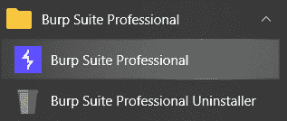

图 1.14 – 安装后 Burp Suite 菜单项

+   使用普通 JAR 文件时，**java** 可执行文件后跟**-jar**选项，再跟下载的 JAR 文件名。

在命令行（最小化）使用普通 JAR 文件启动 Burp（首先必须安装 Java）：

```
C:\Burp Jar Files>java -jar burpsuite_pro_v2023.4.3.jar
```

如果您希望更好地控制堆内存大小设置（即分配给程序的内存量），您可以修改**java**命令。

**java** 可执行文件后跟**-jar**，然后是内存分配。在这种情况下，为**读取访问内存**（**RAM**）分配了 2 GB（即**2g**），接着是 JAR 文件的名称。如果您收到无法分配这么多内存的错误，请将内存量降低至 1,024 MB（即**1024m**）之类的值。

在命令行启动 Burp（优化版）并使用纯 JAR 文件（首先需要安装 Java）：

```
C:\Burp Jar Files>java -jar -Xmx2g burpsuite_pro_v2023.4.3.jar
```

+   可以从命令行启动 Burp Suite 并以无头模式运行。无头模式意味着在没有图形用户界面的情况下运行 Burp。

注意

本书中，我们不会在无头模式下运行 Burp，因为我们是通过图形界面学习的。然而，您可能将来会需要这些信息，所以这里呈现给您。

从命令行启动 Burp Suite，以便它可以使用纯 JAR 文件在无头模式下运行（首先需要安装 Java）：

```
C:\Burp Jar Files>java -jar -Djava.awt.headless=true burpsuite_
pro_v2023.4.3.jar
```

请注意，**-Djava.awt.headless=true** 参数紧随 **-jar** 选项之后，并位于 JAR 文件名称之前。

如果成功，您应看到以下内容：

```
proxy: Proxy service started on 127.0.0.1:8080
```

按下*Ctrl* + *C* 或 *Ctrl* + *Z* 可停止进程。

可以为无头模式命令提供一个配置文件，以便您自定义代理监听器所在的端口号和 IP 地址。

注意

请查阅 PortSwigger 的支持页面，了解更多相关信息：[`support.portswigger.net/customer/portal/questions/16805563-burp-command-line`](https://support.portswigger.net/customer/portal/questions/16805563-burp-command-line)。

在每种启动场景中，您应看到一个**启动画面**：

1.  启动画面标签将与您下载的版本匹配，无论是专业版还是社区版：

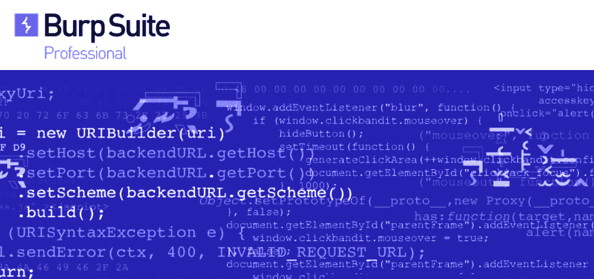

图 1.15 – Burp Suite 启动画面

1.  可能会提示您更新版本；如果愿意，可以进行更新。Burp 会不断添加新功能以帮助您发现漏洞，因此升级应用程序是一个好主意。如果适用，请选择**立即更新**。

1.  接下来，您将看到一个对话框，询问有关项目文件和配置的问题：

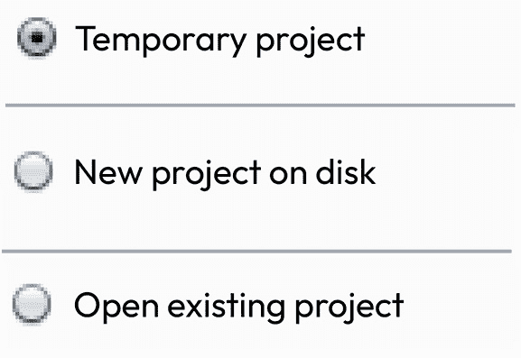

图 1.16 – 启动时的项目选项

1.  如果您使用的是社区版，您将只能创建一个临时项目。如果您使用的是专业版，请在磁盘上创建一个新项目，并将其保存在一个合适的位置，以便您能够找到它。点击**下一步**。

1.  随后的启动画面会询问您希望使用的配置选项。此时，我们还没有任何配置，所以请选择**使用 Burp 默认配置**。随着本书的进展，您可能希望保存配置设置，并在将来从此启动画面加载它们，如下所示：

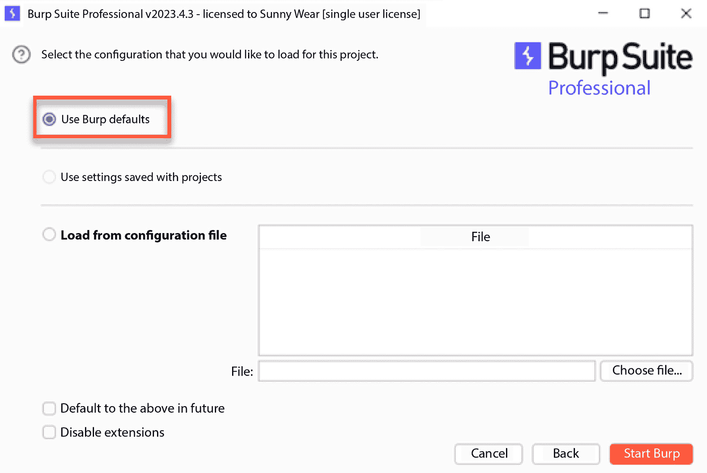

图 1.17 – 启动时的配置选项

1.  最后，我们准备点击**启动 Burp**。

## 它是如何工作的...

使用纯 JAR 文件或 Windows 可执行文件，你可以启动 Burp 来启动代理监听器，以捕获 HTTP 流量。Burp 提供临时或永久的项目文件，以便保存套件中执行的活动。

# 使用 Burp 监听 HTTP 流量

Burp 被描述为一个拦截代理。这意味着 Burp 位于用户的 web 浏览器与应用的 web 服务器之间，拦截或捕获它们之间流动的所有流量。这种行为通常被称为**代理服务**。

渗透测试人员使用拦截代理捕获浏览器与 web 应用之间的流量，以便进行分析和操控。例如，测试人员可以暂停任何 HTTP 请求，从而在请求发送到 web 服务器之前进行参数篡改。

拦截代理，如 Burp，允许测试人员拦截 HTTP 请求和 HTTP 响应。这使得测试人员能够在不同条件下观察 web 应用的行为。如我们所见，有时这些行为是意外的，偏离了原开发者的预期。

要查看 Burp Suite 的工作效果，你需要配置 Firefox 浏览器的**网络设置**，使其指向正在运行的 Burp 实例。这样，Burp 就能捕获浏览器与目标 web 应用之间所有的 HTTP 流量。

## 准备工作

我们将配置 Firefox 浏览器，允许 Burp 监听浏览器与 OWASP BWA 虚拟机之间的所有 HTTP 流量。这将使 Burp 内部的代理服务能够捕获流量以进行测试。

有关此操作的说明可以在 PortSwigger 上找到：[`support.portswigger.net/customer/portal/articles/1783066-configuring-firefox-to-work-with-burp`](https://support.portswigger.net/customer/portal/articles/1783066-configuring-firefox-to-work-with-burp)。我们将在本食谱中逐步讲解此过程。

## 如何操作...

按照以下步骤使用 Burp 启动 HTTP 流量监听：

1.  打开 Firefox 浏览器并进入**选项**。

1.  在**常规**选项卡中，向下滚动到**网络代理**部分，然后点击**设置**。

1.  在**连接设置**窗口中，选择**手动代理配置**，并输入 IP 地址**127.0.0.1**，端口设置为**8080**。选中**对所有协议使用此代理服务器**复选框。

确保**不使用代理的地址**文本框为空，如下截图所示，然后点击**确定**：

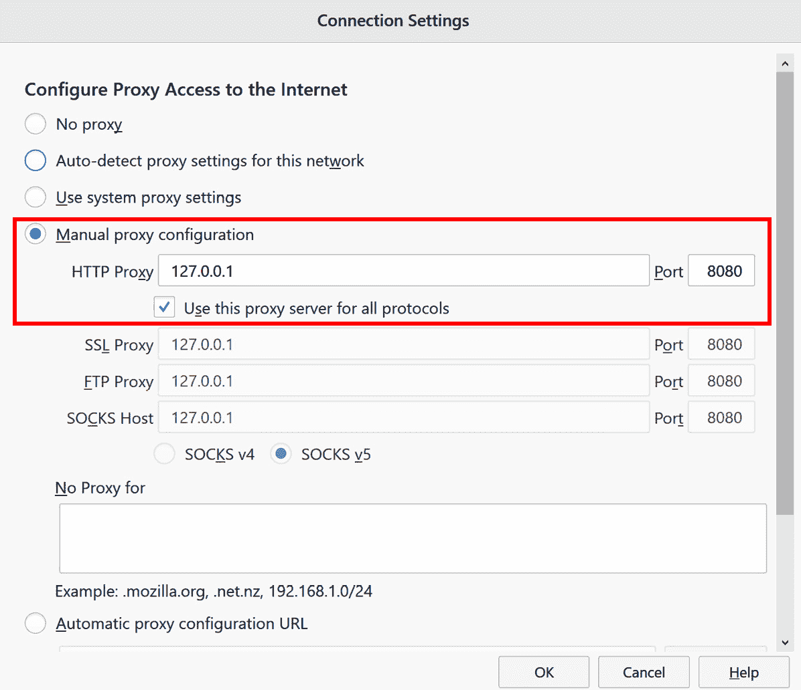

图 1.18 – 手动配置 Firefox 浏览器将 HTTP 流量发送到 Burp

1.  在后台运行 OWASP BWA 虚拟机，并使用 Firefox 浏览器访问与你的机器相关的 URL（即 VirtualBox 中 Linux 虚拟机显示的 IP 地址），点击重新加载按钮（一个圆圈中的箭头），以查看 Burp 捕获的流量。

1.  如果你没有看到任何流量，请检查 **Proxy** | **Intercept** 是否阻止了请求。如果标有 **Intercept is on** 的按钮被按下，如下图所示，那么再次点击该按钮以禁用拦截。完成后，流量应顺利流入 Burp，如下所示：

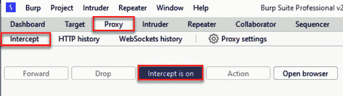

图 1.19 – 默认情况下，Intercept 是开启的

在下图中，**Proxy** | **Intercept** 按钮被禁用：

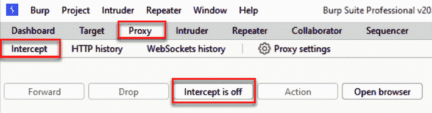

图 1.20 – 关闭 Intercept 以查看流量

1.  如果一切正常，你将在 **Target** | **Site map** 标签中看到流量，类似于下图所示。你的 IP 地址会不同，当然，你的 **Site map** 区域中可能显示更多的项目。恭喜！你现在已经让 Burp 监听了你所有的浏览器流量！

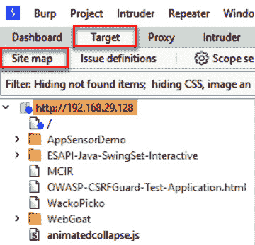

图 1.21 – 确认 HTTP 流量已流入 Burp

## 它是如何工作的……

Burp Proxy 服务正在 **127.0.0.1** 上监听，端口号为 **8080**。你可以更改这些设置，以便在其他 IP 地址或端口上进行监听。然而，为了学习目的，我们将使用默认设置。

## 还有更多……

作为一个更简单的替代方案，你可以使用 Burp 内置的浏览器。要访问它，请从顶部菜单中选择 **Proxy**，然后选择 **Intercept** 子菜单，接着点击 **Open** **browser** 按钮：

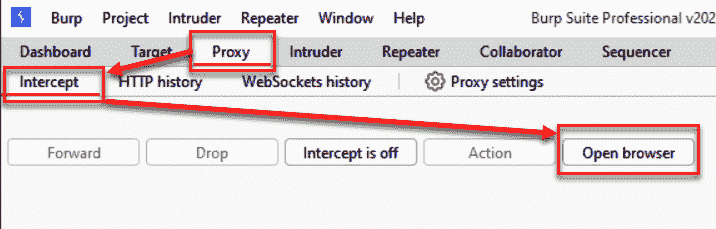

图 1.22 – 使用 Burp 内置的浏览器，而不是使用外部浏览器（例如，Firefox）
