# 第二章：了解 Burp Suite 工具集

本章概述了 Burp Suite 中最常用的工具。首先，我们将介绍如何在**目标** | **站点映射**中设置**目标**范围。然后，介绍消息编辑器。接下来，利用**OWASP Mutillidae II**进行一些实践操作，熟悉**代理**、**Repeater**、**Decoder**和**Intruder**工具。

在本章中，我们将涵盖以下内容：

+   设置目标站点映射

+   了解消息编辑器

+   使用**Repeater**进行重复请求

+   使用**Decoder**进行解码

+   使用**Intruder**进行攻击

# 技术要求

要完成本章的所有操作，你将需要以下工具：

+   Burp Proxy Community 或 Professional（[`portswigger.net/burp/`](https://portswigger.net/burp/)）

+   配置允许 Burp 代理流量的 Firefox 浏览器（[`www.mozilla.org/en-US/firefox/new/`](https://www.mozilla.org/en-US/firefox/new/)）

# 设置目标站点映射

现在，浏览器、Burp 和 OWASP **Broken Web Applications**（**BWA**）**虚拟机**（**VM**）之间的流量已经建立，我们可以开始设置我们的测试范围。对于本次操作，我们将使用 OWASP BWA VM 中的 OWASP Mutillidae II 链接（**http://<Your_VM_Assigned_IP_Address>/mutillidae/**）作为目标应用程序。

更仔细地查看**目标**选项卡，你会注意到有两个子选项卡：**站点映射**和**范围**。从浏览器、Burp 和 Web 服务器之间的初始代理设置开始，你应该已经在**目标** | **站点映射**选项卡中看到一些 URL、文件夹和文件。你可能会觉得信息量有些庞大，但为我们的项目设置范围将有助于更好地集中注意力。

## 准备工作

使用**目标** | **站点映射**和**目标** | **范围**选项卡，我们将为 Mutillidae 分配 URL（**http://<Your_VM_Assigned_IP_Address>/mutillidae/**）作为范围。

## 如何操作...

执行以下步骤以设置目标站点映射：

1.  查找**mutillidae**文件夹，然后右键单击它，从下拉菜单中选择**添加到范围**：

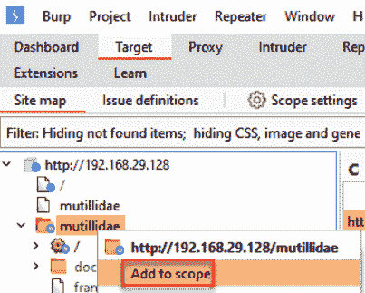

图 2.1 – 设置目标应用程序的范围

1.  当你将**mutillidae**文件夹添加到你的范围时，可能会弹出一个**代理历史记录**对话框，如下所示。你可以选择点击**是**，以避免收集超出你范围的消息，或者你可以选择继续让**代理 HTTP 历史**选项卡收集通过 Burp 的任何消息，即使这些消息超出了你已经确定的范围。出于我们的目的，我们将选择**是**：

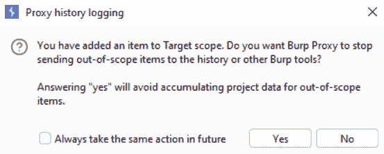

图 2.2 – 代理历史提示

1.  点击**目标** | **范围设置**选项卡，弹出菜单显示后，你应该能够看到以下内容：

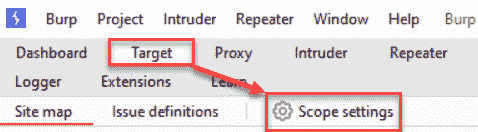

图 2.3 – 点击范围设置以显示弹出显示

OWASP Mutillidae II 的完整 URL 显示在**项目** | **范围**的**包括在范围内**表格中，如下所示：

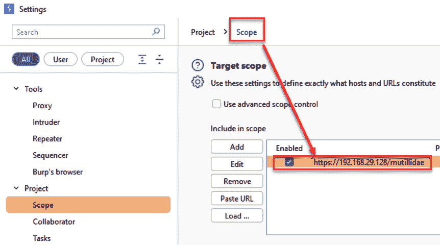

图 2.4 – 弹出显示，显示设置为目标应用的范围

## 它是如何工作的...

设置范围对于更清晰地理解从目标到 Burp 的流量流动至关重要。一旦正确设置范围，所有 HTTP 流量都可以在您的**目标** | **站点地图**和 Burp 的**代理** | **HTTP 历史记录**标签中看到。个别请求和响应的详细信息可以通过消息编辑器查看。

# 理解消息编辑器

在 Burp Suite 中几乎每个显示 HTTP 消息的工具和标签中，您都会看到一个编辑器，用于标识请求和响应。这通常被称为**消息编辑器**。消息编辑器允许查看和编辑 HTTP 请求和响应，并具有一些特性。

在消息编辑器中，有多个子标签。一个请求消息的子标签至少包括以下内容：

+   **漂亮**

+   **原始**

+   **十六进制**

响应消息的子标签包括以下内容：

+   **漂亮**：**漂亮**子标签向您提供与**原始**相同的信息，但格式更易读。请注意，**漂亮**子标签可能会被禁用。这是由于支持的格式所致。为了启用**漂亮**子标签，消息必须是以下格式之一：

    +   JSON

    +   XML（包括图像/SVG + XML 内容）

    +   HTML

    +   CSS

    +   JavaScript

+   **原始**：**原始**子标签以原始 HTTP 形式向您显示消息。

+   **十六进制**：**十六进制**子标签以十六进制格式呈现消息；本质上，它是一个十六进制编辑器。您可以在诸如**代理**和**Repeater**等工具中编辑单个字节，但这些值必须以两位十六进制形式给出，从**00**到**FF**。

+   **渲染**（有时）：最后，**渲染**子标签可能会被灰显或可见，具体取决于 HTTP 响应的内容类型。只有当返回的响应为 HTML 时，这个子标签才会被启用，给您一个与浏览器查看时相同的视图。

## 准备就绪

让我们探索在 Burp 中针对每个请求和响应所捕获的消息编辑器中的多个标签。需要注意的重要区分是——来自**目标** | **站点地图**和**代理** | **HTTP 历史记录**标签的消息在消息编辑器中是*不可编辑*的。这两个区域保存了通过 Burp 流动的流量状态。如果您希望*编辑*任何消息，您必须将单独的消息发送到 Burp 中的其他工具——如**Repeater**、**Intruder**等——在这些工具中您可以*编辑*值。

## 如何操作...

确保您的流量在浏览器、Burp 和 OWASP BWA 虚拟机之间流动。

1.  查看**目标** | **站点地图**标签时，请注意消息编辑器部分。我们先聚焦于消息的**请求**部分：

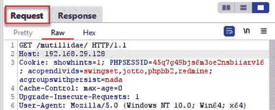

图 2.5 – 消息编辑器查看请求

1.  在查看请求时，请注意可用的子标签包括**格式化**、**原始**和**十六进制**。要查看其他值，如 cookies、属性和参数，请使用**检查器**侧标签。可以通过点击“**检查器**”上方的三条线来展开或折叠**检查器**标签。

**检查器**标签现在已折叠：

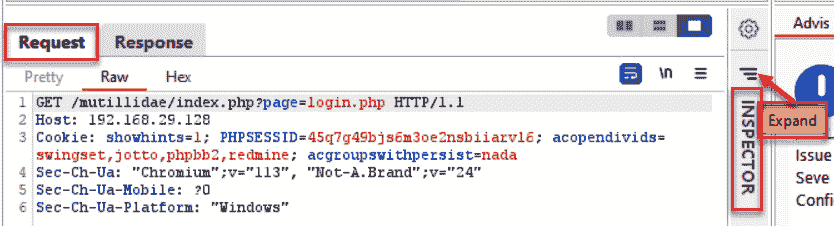

图 2.6 – 消息编辑器检查器折叠状态

**检查器**标签现在已展开：

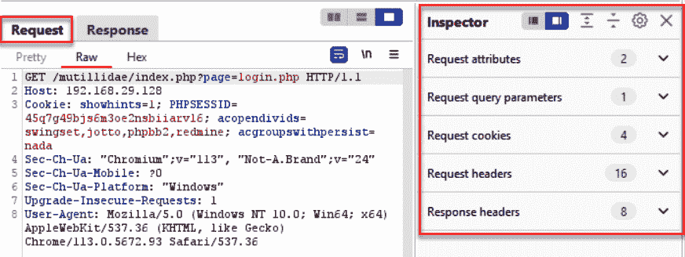

图 2.7 – 展开检查器的消息编辑器

展开后，属性、参数、cookies 和头部将被列出。每个部分可以展开为下拉菜单，显示各个部分的信息。例如，要查看此请求中使用的所有 cookies，展开显示数字 **4** 的**请求 cookies**子部分，表示该请求中使用了四个 cookies：

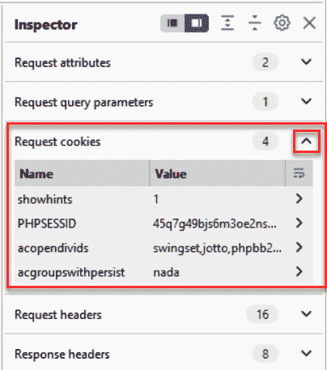

图 2.8 – 检查器视图，展开请求 cookies 子部分

1.  消息的另一部分是**响应**标签，包含**格式化**、**原始**和**十六进制**子标签，并有时还包括**渲染**。如果内容是 HTML，则**渲染**子标签提供浏览器中呈现的 HTML 显示。**检查器**侧标签也可以使用，显示与之前描述的**请求**部分相同的信息：

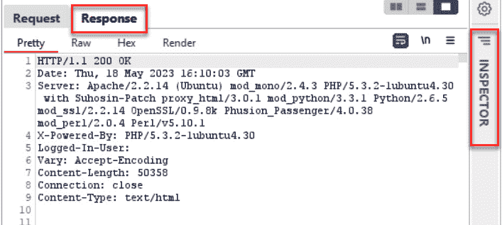

图 2.9 – 消息编辑器查看响应时检查器折叠

# 使用 Repeater 进行重复请求

**Repeater**允许对请求进行轻微的修改或调整，并显示在左侧窗口中。**发送**按钮允许重新发送请求，响应显示在右侧窗口中。

与 HTTP 请求相关的详细信息包括标准的消息编辑器详细信息，如**格式化**、**原始**和**十六进制**，以及**检查器**侧标签。

与 HTTP 响应相关的详细信息包括标准的消息编辑器详细信息，如**格式化**、**原始**和**十六进制**，以及**检查器**侧标签，有时还包括**渲染**。

每个面板的底部都有一个搜索框，允许测试人员快速查找消息中存在的值：

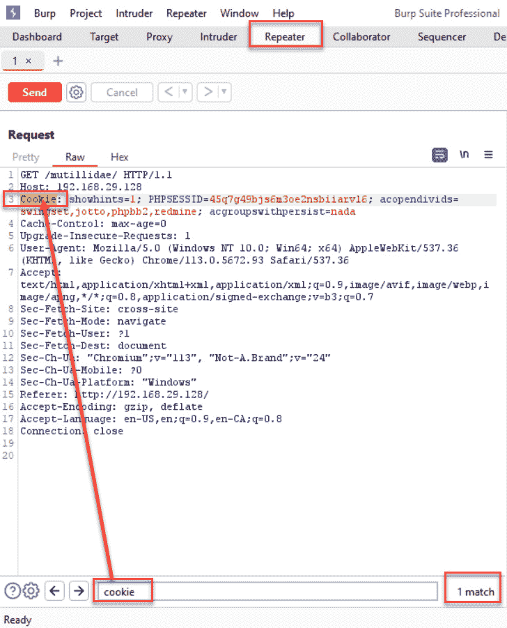

图 2.10 – Repeater 中请求底部的搜索框

当点击齿轮图标时，会有额外的搜索框设置可用，包括**区分大小写**、**正则表达式**（**Regex**）和**文本更改时自动滚动以匹配**。当进行文本搜索时，如果需要区分大小写，可以切换该选项为开启。除了搜索普通文本字符串，用户还可以使用**正则表达式**（**regex**）模式来匹配消息中的某个值。最后，勾选自动滚动功能后，系统会自动滚动到用户搜索的值所在的位置：

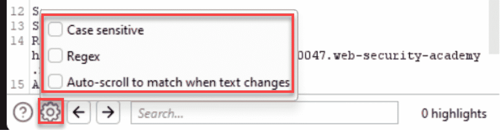

图 2.11 – 可用的额外搜索框设置

## 准备开始

**Repeater**允许你手动修改并重新发出单个 HTTP 请求，分析你收到的响应。

## 如何操作…

1.  在**Target** | **Site map**或**Proxy** | **HTTP history**标签下（如下面的截图所示），右键点击一条消息并选择**发送到 Repeater**：

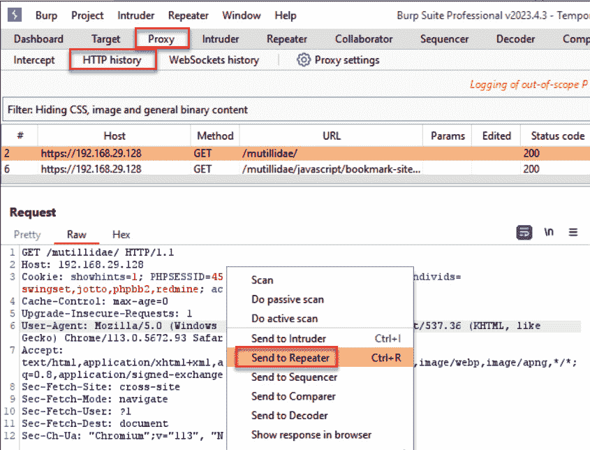

图 2.12 – 从代理 HTTP 历史记录中将请求发送到 Repeater 的上下文菜单

1.  切换到**Repeater**标签。**Request**现在在**Repeater**中，准备进行参数调整。

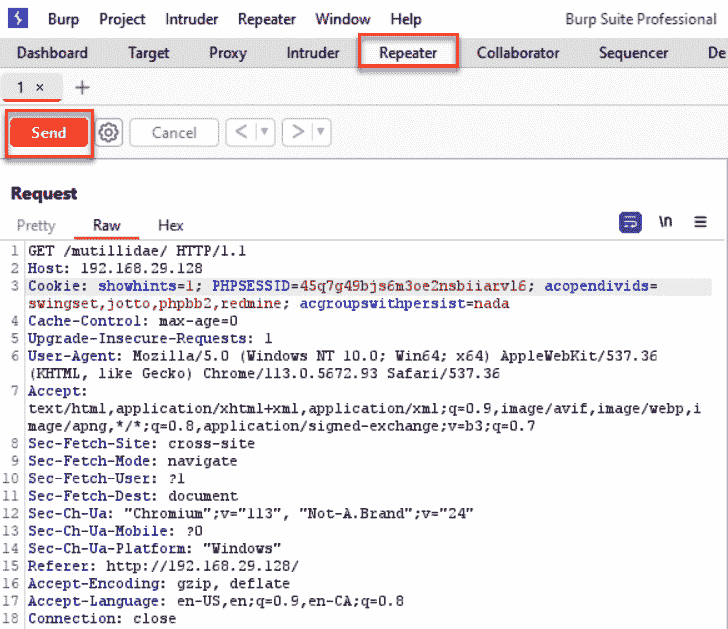

图 2.13 – Repeater 中的请求，准备进行调整

我们将在本书中频繁使用**Repeater**。本章只是对**Repeater**的介绍，帮助理解它的用途。关于用途，请注意**Repeater**和**Intruder**的主要区别在于每次发送请求的数量。如果你是在进行轻微更改以识别暴露点的实验，**Repeater**非常方便。一旦模式确定，**Intruder**就可以用来反复地暴力破解你的漏洞参数，发送大量请求。

# 使用 Decoder 解码

**Burp Decoder**是一个工具，允许测试者将原始数据转换为编码数据，或者将编码数据转换回纯文本。**Decoder**支持多种格式，包括 URL 编码、HTML 编码、Base64 编码、二进制代码、哈希数据等。**Decoder**还包括一个内置的十六进制编辑器。

## 准备开始

在 Web 渗透测试过程中，测试者可能会遇到一个编码值。Burp 通过允许测试者将编码值发送到**Decoder**并尝试各种可用的解码功能，简化了解码过程。

## 如何操作…

让我们尝试解码在 OWASP Mutillidae II 应用程序中找到的**PHPSESSID**会话令牌。当用户最初浏览到 URL（**http://<Your_VM_Assigned_IP_Address>/mutillidae/**）时，该用户将被分配一个**PHPSESSID** cookie。**PHPSESSID**的值似乎是加密的，然后用 Base64 编码进行了包装。使用**Decoder**，我们可以解开该值：

1.  浏览到**http://<Your_VM_Assigned_IP_Address>/mutillidae/**应用程序。

1.  在**Proxy** | **HTTP 历史记录**标签中找到你刚刚从浏览器生成的 HTTP 请求（如下一截图所示）。高亮显示**PHPSESSID**值本身，而不是参数名称，右键点击，然后选择**发送**到**Decoder**：

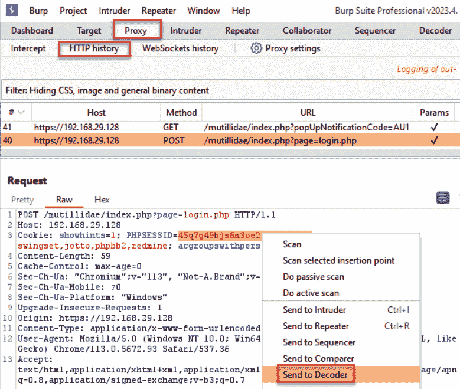

图 2.14 – 从代理 HTTP 历史记录中发送请求中的高亮值到 Decoder 的上下文菜单

1.  在**Decoder**标签中，在如下面所示的**Decode as…**下拉菜单中选择**Base64**。请注意，结果是加密的：

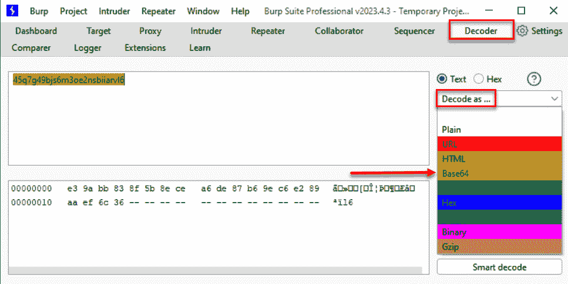

图 2.15 – 从请求中高亮的值，以及可用的编码/解码选项

在这个例子中，我们无法继续进行。我们可以确认值确实是用 Base64 进行了包装。然而，解开后的值是加密的。本教程的目的是向你展示如何使用**Decoder**来操作编码后的值。

## 还有更多...

PortSwigger 还将**Decoder**功能添加到**Inspector**侧标签中。这使得在通过消息编辑器查看请求或响应的完整上下文时，操作值更加直观。

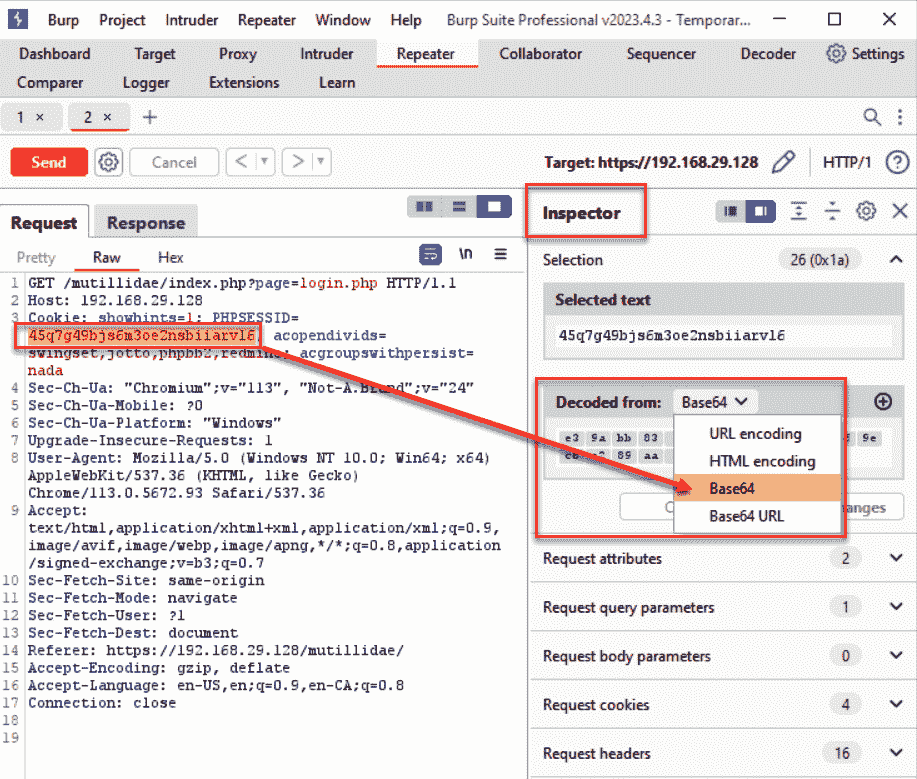

图 2.16 – 使用 Inspector 进行编码/解码操作

# 使用入侵者进行攻击

**Burp Intruder**允许测试人员使用自定义有效载荷对 HTTP 消息的特定部分进行暴力破解或模糊化。

为了正确设置**Intruder**中的自定义攻击，测试人员需要使用**Intruder**四个子标签中可用的设置：

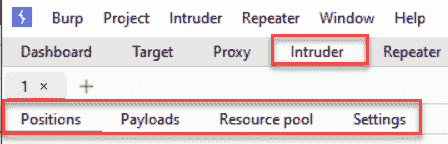

图 2.17 – 入侵者和可用子标签

## 准备工作

测试人员可能希望在消息中模糊化或暴力破解参数值。Burp **Intruder**通过提供各种入侵攻击方式、有效载荷和选项简化了这一过程。

## 如何操作...

1.  浏览到 Mutillidae 的登录页面，并尝试登录应用程序。例如，输入用户名**admin**和无效密码**adminpass**。

1.  在**代理** | **HTTP 历史**标签页中找到登录尝试。你的请求编号（即左侧的**#**符号）与下方显示的编号不同。选择捕获你登录尝试的消息。

1.  当登录尝试消息在**HTTP 历史**表中被高亮显示时，右击**请求**标签，选择**发送** **到 Intruder**：

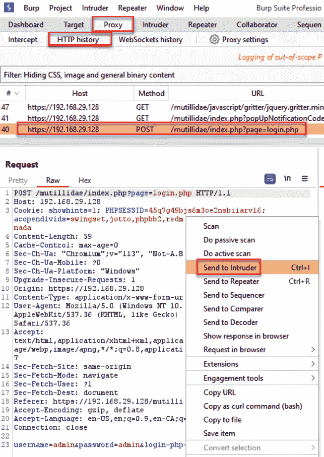

图 2.18 – 从代理 HTTP 历史发送请求到 Intruder 的上下文菜单

### 位置

**位置**子标签页确定在**负载** | **位置**部分内定义负载标记的位置。**位置**子标签页还标识攻击类型，默认设置为 Sniper，这对于我们的任务是有效的。为了我们的目的，从右侧菜单点击**清除§**按钮（即负载标记）。使用光标手动选择密码字段。现在，点击右侧菜单中的**添加§**按钮。你应该看到负载标记围绕密码字段如下所示：

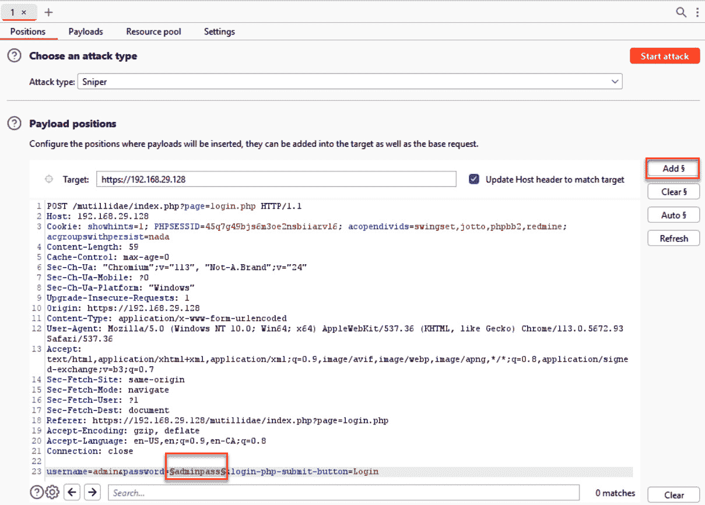

图 2.19 – 替代标记放置在请求中的密码值上

### 负载

在**位置**子标签页之后是**负载**子标签页：

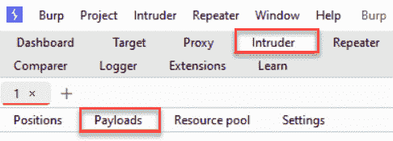

图 2.20 – Intruder 负载子标签页

**负载**子标签页识别你希望插入到前一个标签页中标识的各个位置的字典值或数字。**负载**子标签页内有多个部分，包括**负载集**、**负载选项**、**负载处理**和**负载编码**。

#### 负载集

**负载集**允许设置负载的数量及其类型。为了我们的目的，我们将使用**Sniper**的默认设置，如之前的**位置**子标签页所示。这种配置将允许我们使用一个负载，**负载类型**值为**简单列表**：

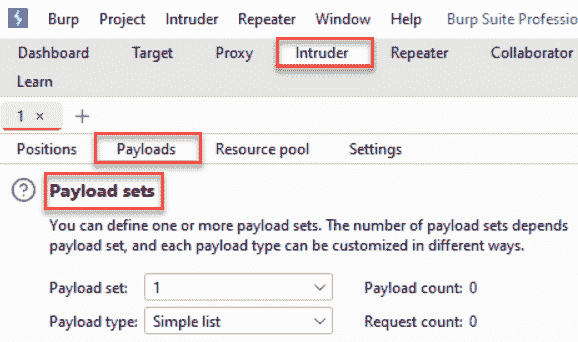

图 2.21 – 负载子标签页允许配置负载集

#### 负载选项

在**负载选项**部分，测试人员可以配置自定义负载或从文件中加载预配置的负载。

为了我们的目的，我们将向负载中添加一个值。在文本框中输入**admin**，然后点击**添加**按钮以创建我们的自定义负载：

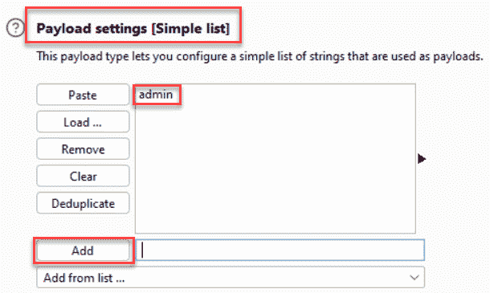

图 2.22 – 可以在此负载集的简单列表中设置值

#### 负载处理

**载荷处理**在配置特殊规则时非常有用，这些规则将在**Intruder**将载荷替换到载荷标记位置时使用。对于本配方，我们不需要任何特殊的载荷处理规则：

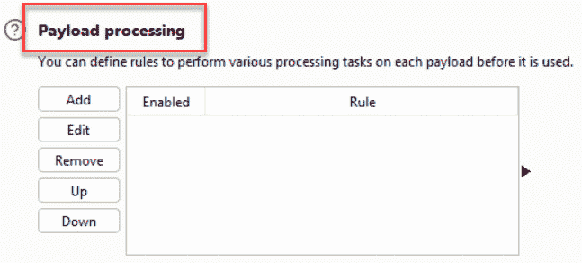

图 2.23 – 载荷处理允许在 Intruder 攻击过程中对载荷应用规则

#### 载荷编码

**载荷编码**在将请求发送到 Web 服务器之前应用于载荷值。许多 Web 服务器可能会阻止攻击性载荷（例如，**<script>** 标签），因此编码功能是一种绕过任何黑名单屏蔽的手段。

对于本配方的目的，保持默认框选中：

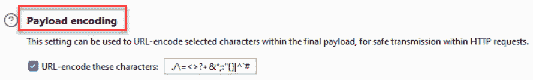

图 2.24 – 应用于每个请求中替换标记的载荷值的载荷编码

### 资源池

在**载荷**子标签后是**资源池**子标签：

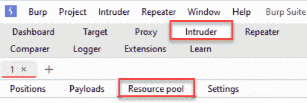

图 2.25 – Intruder 资源池子标签

**资源池**子标签用于分配在 Intruder 攻击过程中使用的线程数。默认池大小为**10**，具体取决于资源。此标签允许创建和管理不同大小的资源池，并结合固定或随机延迟进行节流：

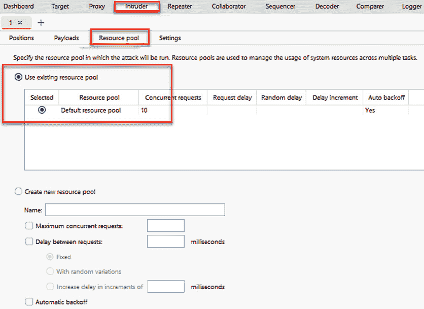

图 2.26 – Intruder 中配置的默认资源池

根据目标应用程序的抗压能力，你可能希望创建一个新的资源池，采用较少侵入性的行为和网络噪声：

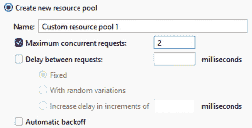

图 2.27 – 在 Intruder 中创建自定义资源池

### 设置

最后，**Intruder** | **设置**标签页提供了攻击表的自定义，特别是与捕获的响应相关，如特定的错误信息。**Intruder** | **设置**标签页中有多个部分，包括**保存攻击**、**请求头**、**错误处理**、**攻击结果**、**Grep - 匹配**、**Grep - 提取**、**Grep - 载荷**、**重定向**和**HTTP 版本**：

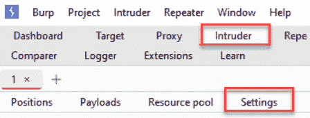

图 2.28 – Intruder 设置标签页

#### 保存攻击

**保存攻击**是一个选项，允许你将 Intruder 攻击、配置和结果保存到项目文件中。默认情况下此功能是关闭的，以节省空间，因为攻击数据的积累可能会变得非常庞大：

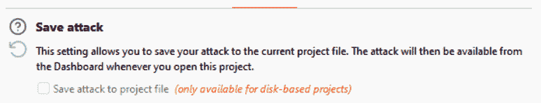

图 2.29 – 保存你的 Intruder 攻击

#### 请求头

**请求头**提供了与攻击期间**Intruder**运行时的头参数相关的配置项。对于此食谱，保持默认勾选框选中：

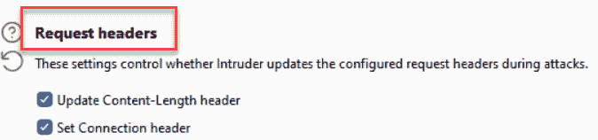

图 2.30 – 请求头配置

#### 错误处理

**错误处理**是一个配置项，告诉**Intruder**在攻击过程中如何处理网络错误。默认设置为**3**次重试，并在每次重试前暂停**2000**毫秒。

对于此食谱，保持默认设置不变：

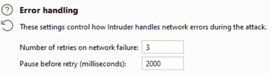

图 2.31 – 错误处理

#### 攻击结果

在启动攻击后，**Intruder**会创建一个攻击表。**攻击结果**部分提供了一些与该表中捕获内容相关的设置。

对于此食谱，保持默认设置不变：

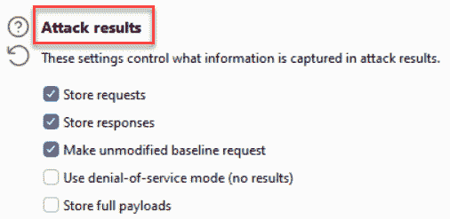

图 2.32 – 攻击结果选项

#### Grep - 匹配

**Grep - 匹配**是一个非常有用的功能，启用后会在攻击表结果中创建附加列，以便快速识别响应中的错误、异常或自定义字符串。

对于此食谱，保持默认设置不变：

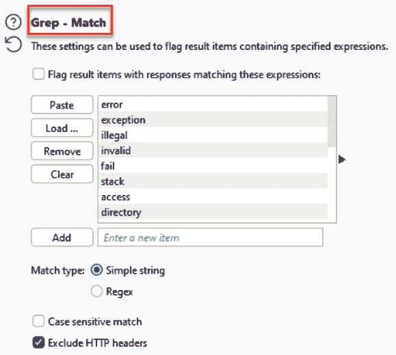

图 2.33 – Grep - 基于关键字匹配

#### Grep - 提取

**Grep - 提取**，启用后，是另一种选项，可以在攻击表中添加一列，其标签与响应中找到的字符串相关。此选项与**Grep - 匹配**不同，因为**Grep - 提取**的值来自实际的 HTTP 响应，而不是任意字符串。

对于此食谱，保持默认设置不变：

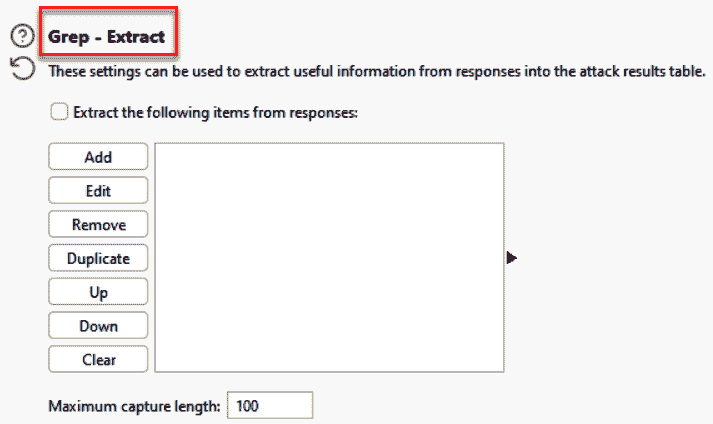

图 2.34 – Grep - 基于响应提取

#### Grep - 负载

**Grep - 负载**为您提供了向攻击表中添加列的功能，这些列包含响应中反射的负载。

对于此食谱，保持默认设置不变：

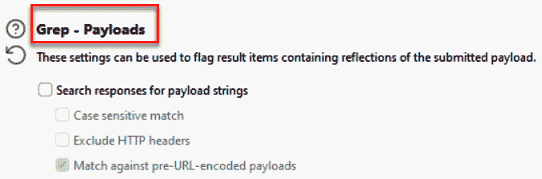

图 2.35 – Grep - 基于请求中的负载值提取响应

#### 重定向

**重定向**指示**Intruder**是否从不、根据条件或始终跟随重定向。这个功能非常有用，特别是在暴力破解登录时，因为 302 重定向通常表示登录成功。

对于此食谱，保持默认设置不变：

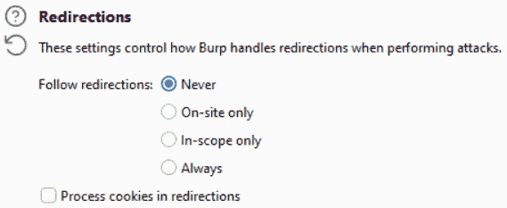

图 2.36 – 重定向行为

#### HTTP 版本

**HTTP 版本**指示**Intruder**在攻击期间使用**HTTP/2**或**HTTP/1**作为协议。默认设置将使用目标服务器当前使用的协议：

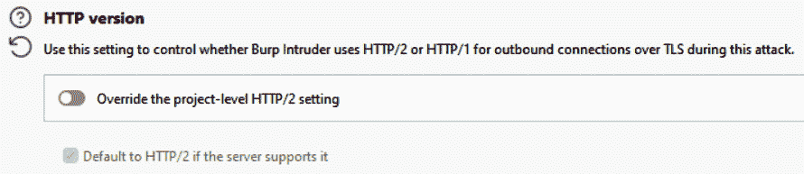

图 2.37 – HTTP 协议行为

如果你希望覆盖目标项目并使用**HTTP/1**，请启用此功能。确保取消勾选**Default to HTTP/2 if the server supports it**，以强制使用**HTTP/1**协议：

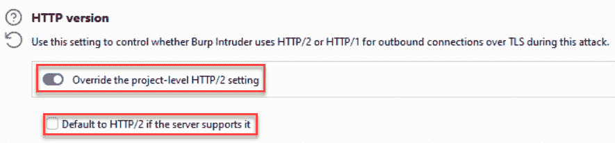

图 2.38 – HTTP/2 覆盖

#### 开始攻击按钮

最后，我们准备开始**Intruder**。在**Payloads**或**Settings**子选项卡中，点击**Start attack**按钮以开始：

图 2.39 – Intruder 的开始攻击按钮

当攻击开始时，一个攻击结果表将以弹出屏幕的形式出现。这使得测试人员可以查看所有使用负载在负载标记位置中的请求。它还允许我们查看所有响应以及显示**状态码**、**错误**、**超时**、**长度**和**评论**的列：

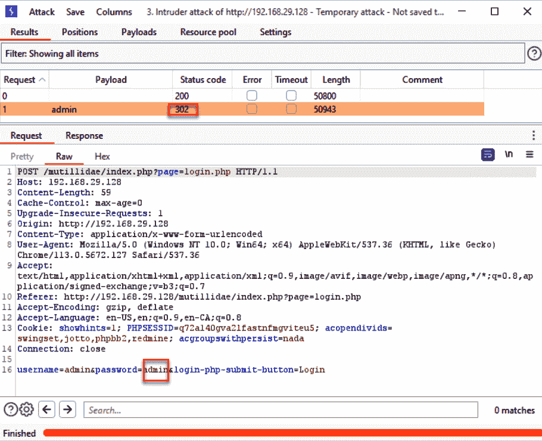

图 2.40 – 攻击结果表

对于此食谱，我们注意到**password**参数中的管理员负载产生了**302**状态码，这是一个重定向。这意味着我们成功登录到 Mutillidae 应用程序。

查看攻击表中的**Response** | **Render**，可以看到 Web 应用程序如何响应我们的负载。如你所见，我们成功以管理员身份登录：

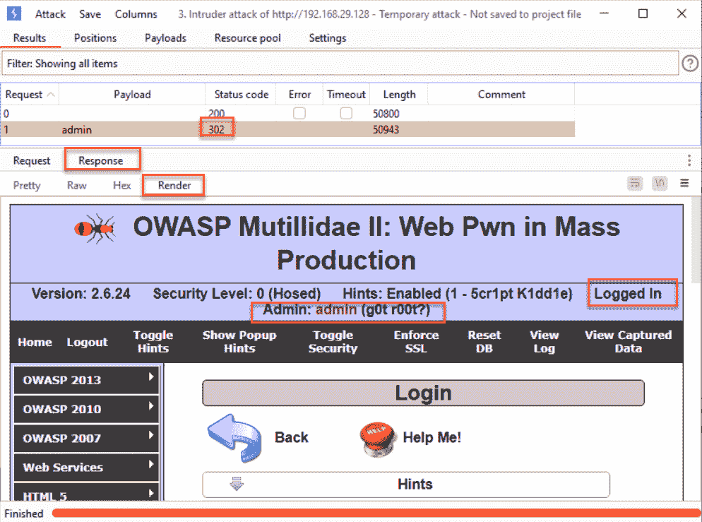

图 2.41 – Intruder 攻击的结果是已登录的会话
