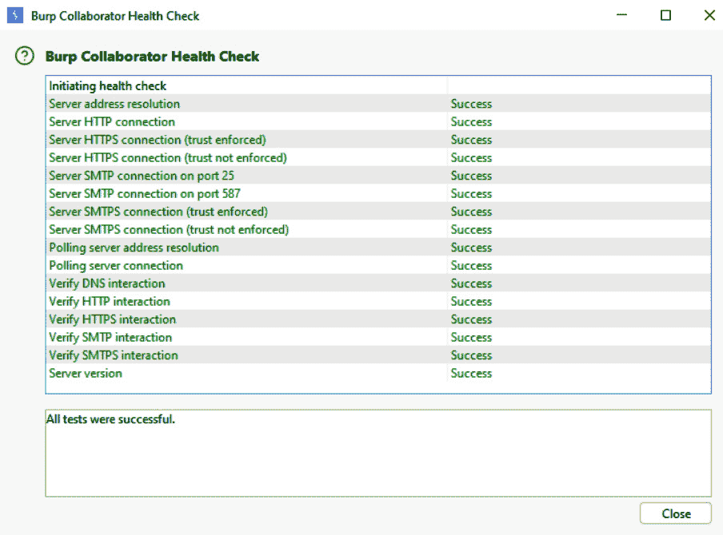
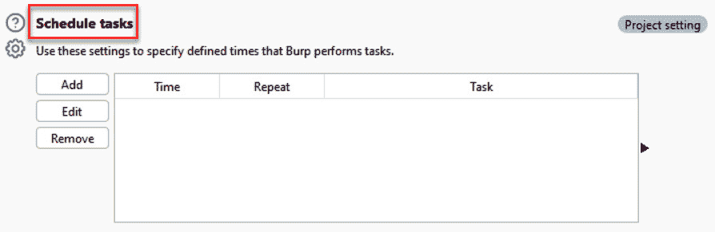
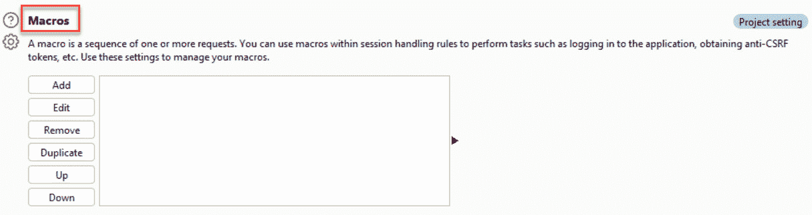
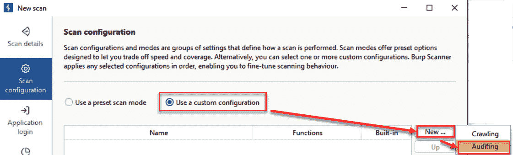

# 第三章：使用 Burp 配置、爬虫、审计和报告

本章将帮助测试人员在项目和用户级别上校准 Burp Suite 设置，以优化对目标应用程序的测试。例如，对 **爬虫** 和 **审计** 选项的调整可以帮助进行更少侵扰、噪声更小的暴力破解攻击。同样，测试人员在尝试访问目标时可能会遇到有趣的网络情况。因此，Burp Suite 包括了几个功能，用于测试运行在 **超文本传输协议安全** (**HTTPS**) 上的网站，或通过 SOCKS 代理或端口转发访问网站。许多设置在项目和用户级别都有提供。最后，Burp Suite 提供了开箱即用的功能来生成已发现问题的报告。

本章将涵盖以下方案：

+   在 HTTPS 上建立信任

+   设置项目配置

+   设置用户配置

+   爬取目标网站

+   创建自定义扫描脚本

+   报告问题

# 技术要求

要完成本章中的方案，您需要以下内容：

+   OWASP **损坏的 Web** **应用程序** (**BWA**)

+   OWASP Mutillidae 链接

+   Burp Suite 代理社区版或专业版 (`portswigger.net/burp/`)

+   Firefox 浏览器 (`www.mozilla.org/en-US/firefox/new/`)

+   配置为允许 Burp Suite 代理流量的 Firefox 浏览器的 FoxyProxy Standard 插件 (`addons.mozilla.org/en-US/firefox/addon/foxyproxy-standard/`)

+   代理配置步骤在 *第一章* 的 *使用 Burp 监听 HTTP 流量* 方案中有所涵盖。

# 在 HTTPS 上建立信任

由于大多数网站都实现了（HTTPS），了解如何启用 Burp Suite 与这些站点通信是有益的。HTTPS 是一个加密隧道，运行在 **超文本传输协议** (**HTTP**) 之上。

HTTPS 的目的是加密客户端浏览器与 Web 应用程序之间的流量，以防止窃听。然而，作为测试人员，我们希望允许 Burp Suite 进行窃听，因为这正是使用拦截代理的目的。Burp Suite 提供了一个由根 **证书授权机构** (**CA**) 签署的证书。该证书可以用来在 Burp Suite 和目标 Web 应用程序之间建立信任。

默认情况下，Burp 的代理在与运行在 HTTPS 上的目标建立加密握手时，可以生成每个目标的 CA 证书。这处理了 Burp 到 Web 应用程序部分的隧道。我们还需要处理浏览器到 Burp 部分。

为了在客户端浏览器、Burp 和目标应用程序之间建立完整的 HTTPS 隧道连接，客户端需要将 PortSwigger 证书信任为浏览器中的受信任证书机构。

## 准备工作

在需要进行渗透测试的 HTTPS 网站场景中，测试人员必须将 PortSwigger CA 证书作为受信任的权限导入到浏览器中。你可以使用像 FoxyProxy 这样的代理穿透工具，使流量更容易地通过 Burp Suite。

## 如何操作...

确保 Burp Suite 已启动。然后，执行以下步骤：

1.  下载 FoxyProxy Standard 插件并在 Firefox 浏览器中安装扩展程序。

图 3.1 – FoxyProxy Standard Firefox 插件

1.  配置 FoxyProxy Standard 作为 Burp 的通道。点击 **添加** 并填写设置，如下所示。完成后点击 **保存**：

图 3.2 – 如何配置 FoxyProxy Standard 与 Burp 一起使用

完成后，你应该看到以下输出：

图 3.3 – 配置了 Burp Suite 的 FoxyProxy Standard

1.  切换 **FoxyProxy** 按钮为 **开启**，以便开始将所有浏览器流量通过 Burp 进行转发：

图 3.4 – 启用 FoxyProxy Standard 以拦截流量并将其发送到 Burp Suite

当启用 FoxyProxy 以允许浏览器流量通过 Burp Suite 时，它的样子如下：

图 3.5 – 启用的 FoxyProxy Standard

1.  为了在 Burp 的证书与目标应用程序之间建立信任，你需要将 Burp 的证书添加到浏览器中并将其标记为受信任。为此，请打开 Firefox 浏览器并访问 `burp`。你必须准确输入该网址才能访问此页面。你应该能在浏览器中看到以下屏幕。注意右侧的链接，标注为 **CA 证书**。点击该链接以下载 PortSwigger CA 证书：

图 3.6 – 下载 PortSwigger CA 证书的 URL

1.  系统会弹出一个对话框，提示你下载 PortSwigger CA 证书。文件名为 **cacert.der**。将文件下载到你硬盘上的某个位置。

1.  在 Firefox 中，打开 Firefox 菜单。然后，点击 **选项**。

1.  在左侧点击 **隐私与安全**，然后向下滚动到 **证书** 部分。点击 **查看** **证书...** 按钮：

图 3.7 – Firefox 设置以安装 PortSwigger 证书

1.  选择 **Authorities** 标签页。点击 **导入**，选择你之前保存的 PortSwigger CA 证书文件，然后点击 **打开**：

图 3.8 – 将 PortSwigger CA 证书导入到 Firefox 浏览器中

1.  在弹出的对话框中，勾选**信任此 CA 以识别网站**框并点击**确定**。在**证书管理器**对话框中也点击**确定**：

图 3.9 – 您必须明确信任 PortSwigger CA 证书

关闭所有对话框并重启 Firefox 浏览器。如果安装成功，您现在应该能够在浏览器中访问任何 HTTPS URL，同时通过 Burp Suite 代理流量，并且不会收到任何安全警告。

## 还有更多…

作为使用 FoxyProxy 并将 Burp 的证书导入浏览器的更简单替代方案，您可以直接使用 Burp Suite 内置的浏览器。要访问此浏览器，请从顶部菜单中选择**代理**，选择**拦截**子菜单，然后点击**打开** **浏览器**按钮：

图 3.10 – Burp Suite 的浏览器是使用 FoxyProxy Standard 或外部浏览器的替代方案

这个内置浏览器处理证书信任并将所有流量代理到 Burp。Burp 的浏览器是近年来新增的最高效、最用户友好的功能之一。

这是 Burp Suite 内置浏览器的截图：

图 3.11 – Burp Suite 启动时的浏览器

# 设置项目配置

项目设置允许测试人员保存或设置特定于项目或范围目标的配置。这些设置存储在项目文件中，该文件在启动 Burp Suite 应用程序时创建。在**项目**部分下有多个子部分，包括**工具**、**项目**、**会话**和**网络**。这些选项是渗透测试人员在评估特定目标时所需的，因此我们将在此介绍它们。在逐一浏览每个区域时，我们将提供一些您在测试过程中可能会发现有用的建议。

## 如何操作…

1.  要访问所有**项目**级配置，请点击 Burp Suite 右上角的**设置**齿轮图标：

图 3.12 – 点击设置后可访问项目级设置

1.  新的弹出窗口将出现。确保在弹出窗口的左侧菜单中选择了**项目**，位于窗口顶部：

图 3.13 – 在弹出窗口中，确保**项目**被选中

1.  在 **项目** 下包含的子部分有 **工具**、**项目**、**会话** 和 **网络**：

图 3.14 – 弹出窗口中所有可用的项目配置

### 项目 | 工具选项卡

此选项卡允许您为 **代理**、**重复器**、**序列器** 和 **Burp 浏览器** Burp Suite 工具设置配置。为了增添一些色彩，我们将提供一些关于这些领域的建议，帮助您在渗透测试过程中更好地进行操作：

图 3.15 – 项目 | 工具菜单项

#### 项目 | 工具 | 代理选项卡

在 **代理** 选项卡下，测试人员可以选择以下选项：

+   **代理监听器**：

默认情况下，Burp Suite 会为本地主机配置一个默认的代理监听器，运行在端口 **8080**。可以在此区域配置其他代理监听器，用于测试一些不常见的应用程序，例如移动应用。对于大多数测试人员来说，默认配置是足够的：

图 3.16 – 默认代理监听器列表

+   **请求** **拦截规则**：

默认情况下，Burp Suite 代理被配置为监听并拦截所有 HTTP 请求，除非是图片（**^gif$**、**^jpg$**、**^png$**、**^css$**、**^js$**、**^ico$**、**^svg$**、**^eot$**、**^woff$**、**^woff2$**、**^ttf$**）。如果您希望更改默认设置，可以在这里进行调整。对于大多数测试人员来说，默认配置是足够的：

图 3.17 – 默认的请求拦截规则

+   **响应** **拦截规则**：

默认情况下，Burp Suite 代理是 *不* 配置为拦截 HTTP 响应的：

图 3.18 – 响应拦截规则，默认关闭

捕获响应的优势在于，您可以操控状态码和响应体，查看网页中的 JavaScript 是否会根据这些变化做出不同的反应。要开始在浏览器显示之前捕获每个 HTTP 响应，请进行以下更改：

图 3.19 – 推荐的响应拦截规则修改

+   **WebSocket** **拦截规则**：

当应用程序使用 WebSocket 时，此设置控制这些消息的拦截。对于大多数测试人员来说，默认配置是足够的：

图 3.20 – WebSocket 拦截规则

+   **响应** **修改规则**：

Burp Suite 允许你在将 HTML 响应转发到本地浏览器之前重写它。在本节中，你可以配置 Burp Suite 以显示隐藏的表单字段，甚至禁用响应页面上的 JavaScript：

图 3.21 – 默认响应修改规则

+   **匹配和** **替换规则**：

Burp Suite 提供了一个非常强大的 **匹配和替换规则** 表格，让你可以在拦截前自动替换请求或响应中的值。此表格的使用完全由测试人员自行决定。例如，你可能希望使用此表格将用户代理替换为使浏览器看起来像移动设备。或者，你可能希望用它来设置 cookie 值，甚至删除请求头！你甚至可以添加正则表达式规则来匹配值：

图 3.22 – 匹配和替换规则表

+   **TLS** **通行**：

你可以使用 **TLS 通行** 来识别目标设备前的其他设备。当其他设备位于目标前时，Burp Suite 将流量传递到这些设备，只寻求你的目标：

图 3.23 – TLS 通行

+   **杂项**：

Burp Suite Proxy 行为的一个通用设置区域位于 **杂项** 中。此区域允许你将使用的 HTTP 协议更改为非常旧的版本 HTTP/1.0。此区域还允许 gzip 解压控制。对于大多数测试人员，默认配置已经足够：

图 3.24 – 杂项设置

#### 项目 | 工具 | Repeater 标签

#### 在 **Repeater** 标签下，测试人员有以下选项：

+   **连接**：

该设置控制 Repeater 是否重新使用原始请求中使用的相同连接和协议，或者让 Burp Suite 创建一个新的连接并更改协议。对于大多数测试人员，默认配置已经足够：

图 3.25 – 连接

+   **消息修改**：

本节所做的任何修改仅保存到当前项目。对于大多数测试人员，默认配置已经足够：

图 3.26 – 消息修改

+   **重定向**：

使用 Burp Suite Repeater 时，每当遇到 302 重定向，你可以在此控制 Repeater 的行为。对于大多数测试人员，他们选择不自动执行重定向，因此默认设置通常已经足够：

图 3.27 – 重定向

+   **默认** **标签组**：

除非你在进行带有多个标签组的客户端不同步攻击，否则你可能不需要修改此设置。此区域允许你指定任何新的请求发送到 Repeater 时，应该发送到哪个标签组：

图 3.28 – 默认选项卡组

#### 项目 | 工具 | Sequencer 选项卡

在 **Sequencer** 选项卡下，测试人员可以选择以下选项：

+   **实时捕获**：

此设置控制在从实时请求中提取标记时，Sequencer 将使用的线程数量和行为。对于大多数测试人员，默认配置是足够的：

图 3.29 – 实时捕获

+   **标记处理**：

此设置控制每个提取的标记在分析过程中如何处理。对于大多数测试人员，默认配置是足够的：

图 3.30 – 标记处理

+   **标记分析**：

此设置控制对标记执行的测试类型。对于大多数测试人员，默认配置是足够的：

图 3.31 – 标记分析

#### 项目 | 工具 | Burp 浏览器选项卡

此设置控制 Burp 内置的 Chromium 浏览器，并允许您使用机器的**图形处理单元**（**GPU**）。您还可以指定在没有沙盒的情况下运行内置浏览器。沙盒设置是针对任何受损目标应用程序影响本地机器的保护机制。对于大多数测试人员，默认配置是足够的：

图 3.32 – Burp 浏览器的浏览器运行设置

### 项目 | 项目 | 范围选项卡

在**范围**选项卡下，测试人员可以选择以下选项：

+   **目标范围**：

*第二章*中的 *设置目标站点地图* 方案展示了如何为此区域设置目标范围。请注意，这里还有一个**排除在范围外**的部分，允许您指定不希望包括的 URL，通常是登出链接：

图 3.33 – 目标范围

+   **不在范围内** **请求处理**：

此设置开启时，将使 Burp Suite 丢弃任何不在范围内的请求，即使它们是在浏览器内请求的。对于大多数测试人员，默认配置是足够的：

图 3.34 – 不在范围内的请求处理

### 项目 | 项目 | 协作选项卡

Burp Suite Collaborator 是 Burp Suite Professional 的一个功能，提供给测试者访问外部服务器，用于捕获由内部目标服务器发出的 DNS 和/或 HTTP 请求。这是一个对攻击者非常强大的功能，因为许多漏洞可以通过 Collaborator 来证明。这样的漏洞包括 **服务器端请求伪造**（**SSRF**）、通过 **跨站脚本**（**XSS**）的数据外泄、cookie 偷窃等。大多数测试者使用 PortSwigger 提供的 Collaborator 服务器，但你也可以在此设置中配置自己的服务器并使用它。有关如何使用 **Burp** **Collaborator 服务器**的更多详细信息，请参见 *第十一章*：

图 3.35 – Burp Collaborator 服务器

本节有一个按钮用于运行健康检查。点击 **运行健康检查** 允许你检查与外部 **Collaborator** 服务器提供的所有外部服务的连接性：

图 3.36 – Burp Collaborator 健康检查

### 项目 | 项目 | 任务 标签

在 **任务** 标签下，测试者可以选择以下选项：

+   **资源池**：

资源池是可供入侵者和扫描任务使用的线程。此设置允许你创建自定义资源池，以便降低并发请求（线程）数量，并且限制请求的时机。默认设置的使用完全取决于目标应用程序处理同时多个请求的能力。如果你不确定，创建一个并发请求少于 10 的自定义资源池：

图 3.37 – 资源池

+   **新任务自动启动**：

任务是你可以在后台运行的自动扫描。此设置允许你配置是否希望在创建任务时它们自动启动。对于大多数测试者，默认配置即可：

图 3.38 – 新任务自动启动

+   **安排任务**：

如果你希望安排任务，这个设置允许你为特定任务设置开始和停止的日期、时间以及频率：

图 3.39 – 安排任务

### 项目 | 项目 | 日志记录 标签

**日志记录** 标签允许你指定哪些工具会将其请求和/或响应记录到文件中。如果选择此项，用户将被提示提供文件名和本地机器上保存日志文件的位置。对于大多数测试者，这个功能通常不会使用：

图 3.40 – 日志记录

### 项目 | 会话 标签

查看*第十章*以获取有关如何使用**会话**选项卡中的功能的更多信息。**会话**选项卡包括**会话处理规则**、**Cookie jar**和**宏**区域。

在**会话**选项卡下，测试人员有以下选项：

+   **会话处理规则**：此区域允许您在评估 Web 应用程序时配置自定义会话处理规则。默认情况下，Burp Suite 捕获并使用所有 HTTP 流量中看到的 cookie，并将它们保存在**Cookie jar**区域内：

图 3.41 – 会话处理规则

+   **Cookie jar**：**Cookie jar**区域提供了 Burp Suite Proxy（默认情况下）捕获的一组 cookie、它们各自的域和路径，以及名称/值对。**Cookie jar**区域内的 Cookie 也是可编辑的：

图 3.42 – Cookie jar

+   **宏**：**宏**部分允许测试人员脚本化以前执行的请求/响应，从而在与目标应用程序交互时自动执行活动：

图 3.43 – 宏

### 项目 | 网络选项卡

**网络**选项卡提供了对**连接**、**TLS**和**HTTP**区域的控制。

#### 项目 | 网络 | 连接选项卡

**连接**选项卡允许测试人员控制特定的交互，如身份验证和代理服务器：

+   **平台认证**允许您自动化 Burp Suite 针对目标平台的身份验证方式。此功能的默认设置在**用户设置**级别：

图 3.44 – 平台认证

如果需要**项目设置**级别，请使用左侧的滑块激活**仅为此项目覆盖选项**：

图 3.45 – 平台认证覆盖设置

单击**添加**复选框后，您将看到身份验证选项表（即**基本**、**NTLMv2**或**NTLMv1**），可用于目标平台。目标主机通常设置为通配符（*****）字符，并且必须预先知道凭据和域：

图 3.46 – 添加平台认证凭据

+   **超时**区域允许您在 Burp Suite 尝试连接到目标应用程序时指定超时阈值。对大多数测试人员来说，默认配置已经足够：

图 3.47 – 超时

+   **上游代理服务器**设置允许您识别任何上游代理服务器以访问目标应用程序。此功能的默认设置在**用户设置**级别：

图 3.48 – 上游代理服务器

如果需要**项目设置**级别，必须使用左侧的滑块来激活**仅此项目的覆盖选项**：

图 3.49 – 为项目设置级别覆盖上游代理服务器的设置

单击复选框以覆盖用户选项后，系统会显示一个表格，允许为该项目启用特定的上游代理选项。点击**添加**按钮会显示一个名为**添加上游代理规则**的弹出框。该规则特定于目标应用程序的环境。如果目标应用程序的环境前端有一个 Web 代理，并且需要与应用程序登录不同的凭据，则此功能非常有用：

图 3.50 – 添加上游代理规则的详细信息

+   **主机名解析覆盖**允许您添加类似于本地计算机上主机文件的主机条目，以覆盖**域名系统**（**DNS**）解析：

图 3.51 – 如何添加主机名解析

+   **SOCKS 代理**允许 Burp Suite 通过**SOCKS 代理**配置访问目标。此功能的默认设置位于**用户** **设置**级别：

图 3.52 – SOCKS 代理

如果需要**项目设置**级别，必须使用左侧的滑块来激活**仅此项目的覆盖选项**：

图 3.53 – 为项目设置级别覆盖 SOCK 项目设置

#### 项目 | 网络 | TLS 标签

**TLS** 标签下的选项允许您配置证书和各种 TLS 相关的设置。**TLS 协商**、**客户端 TLS 证书**和**服务器 TLS 证书**区域可以在这里找到：

+   **TLS 协商**：

当 Burp Suite 与目标应用程序通过 TLS 通信时，此选项允许您使用预配置的加密套件或指定不同的加密套件：

图 3.54 – TLS 协商

如果您希望自定义加密套件，可以点击**使用自定义协议和加密套件**单选按钮。此时会显示一个表格，允许您选择 Burp Suite 在与目标应用程序通信时可以使用的协议和加密套件：

图 3.55 – 使用自定义协议进行 TLS 协商

+   **客户端 TLS 证书**：

如果您希望对目标应用程序使用客户端证书，您可以在此部分配置这些证书。请记住，在添加客户端证书时，您必须拥有私钥。此功能的默认设置为**用户****设置**级别：

图 3.56 – 客户端 TLS 证书

如果需要**项目设置**级别，您必须使用左侧的滑块激活**仅此项目的覆盖选项**：

图 3.57 – 为项目设置级别覆盖客户端 TLS 证书

+   **服务器** **TLS 证书**：

此表格为只读，并列出了 Burp Suite 从各种 Web 服务器接收到的所有服务器端证书。您可以双击任何一行查看每个证书的详细信息：

图 3.58 – 服务器 TLS 证书

#### 项目 | 网络 | HTTP 标签

在**HTTP**标签下，测试人员有以下选项：

+   **允许的重定向类型**提供 Burp Suite 在捕获 HTTP 流量时使用的重定向类型。对于大多数测试人员，默认设置已足够：

图 3.59 – 允许的重定向类型

+   **流式响应**提供与无限期流式响应相关的配置。对于大多数测试人员，默认设置已足够：

图 3.60 – 流式响应

+   **状态 100 响应处理**提供 Burp Suite 处理 HTTP 状态码 100 响应的设置。对于大多数测试人员，默认设置已足够：

图 3.61 – 状态 100 响应处理

+   **HTTP/1** 允许您重用相同的**HTTP/1**连接，而不是创建新的连接。对于大多数测试人员，默认设置已足够：

图 3.62 – HTTP/1

+   **HTTP/2** 默认情况下，当目标 Web 服务器支持时，Burp Suite 会使用**HTTP/2**，而非**HTTP/1**，并在初始 TLS 握手期间协商。对于大多数测试人员，默认设置已足够：

图 3.63 – HTTP/2

# 设置用户配置

用户设置将应用于在您的本地计算机上运行的所有 Burp Suite 实例。这些设置允许测试者设置并保存用于所有 Burp Suite 项目的配置。在**用户**选项标签下有多个子部分，包括**工具**，**项目**，**会话**，**网络**，**用户界面**，**套件**，**扩展**和**配置库**。当我们逐个区域进行迭代时，我们将提供一些建议，这些建议可能在您的测试过程中很有帮助：

图 3.64 – 用户配置

## 如何做…

要访问所有用户级配置，请单击 Burp Suite 右上角的**设置**齿轮图标：

图 3.65 – 通过设置可用的用户级设置

将会弹出一个新窗口。确保您在弹出窗口的左侧菜单中选择了**用户**，位于顶部：

图 3.66 – 在弹出窗口内部，请确保已选择用户

### 用户 | 工具标签

注意**用户** | **工具**子部分影响的区域。我们将专注于每个区域 – 即**代理**，**入侵者**，**重复器**和**Burp 浏览器**：

图 3.67 – 用户 | 工具菜单项

### 用户 | 工具 | 代理标签

在**代理**标签下，测试者有以下选项：

+   **代理** **历史记录**：

此设置是否提示您（或不提示您）是否仍希望将超出范围的项目记录到**HTTP** **历史**标签：

图 3.68 – 代理历史记录

+   **默认代理** **拦截状态**：

默认情况下，代理拦截器将切换为开启状态（**启用拦截**）。这可以在以下截图中看到。我们建议将此功能关闭（**禁用拦截**）。这可能是您想要对所有 Burp Suite 实例进行的第一个更改之一，用于**用户设置**：

图 3.69 – 默认代理拦截状态

### 用户 | 工具 | 入侵者标签

在**入侵者**标签下，测试者有以下选项：

+   **自动** **负载放置**：

当使用**入侵者**时，使用此设置来确定负载是否将替换已识别的位置或附加值到已识别的位置。对于大多数测试者，默认设置就很好：

图 3.70 – 自动负载放置

+   **新** **标签配置**：

使用 **Intruder** 时，使用此设置来确定在攻击过程中打开新标签时数据的行为。对于大多数测试人员来说，默认设置是合适的：

图 3.71 – 新标签配置

+   **关闭时的行为** **结果窗口**：

如果您希望在关闭模态窗口之前移除提示，请使用此设置将其关闭。对于大多数测试人员来说，默认设置是合适的：

图 3.72 – 关闭结果窗口时的行为

+   **Payload** **列表位置**：

使用 **Intruder** 时，如果您希望更改 Burp Suite Professional 中可用的词表源，请使用此设置。对于大多数测试人员来说，默认设置是合适的：

图 3.73 – Payload 列表位置

### 用户 | 工具 | Repeater 标签 | 标签视图

**Repeater** 中的标签默认设置为 **包装视图**。您可以在下方的截图中看到 *包装视图* 的样子。对于大多数测试人员来说，默认设置是合适的：

图 3.74 – 使用包装视图的标签视图

以下是包装标签视图的截图：

图 3.75 – 包装标签视图

如果您希望更改 **Repeater** 标签的查看方式，请选择 **滚动视图**。您可以在这里看到 *滚动视图* 的样子：

图 3.76 – 滚动视图

### 用户 | 工具 | Burp 的浏览器 | 浏览器数据

您可以使用此设置来定制在使用 Burp 内置浏览器时存储所有捕获流量的位置。对于大多数测试人员来说，默认设置是合适的：

图 3.77 – 浏览器数据

### 用户 | 项目 标签

注意受 **用户** | **项目** 子部分影响的区域。我们将集中讨论每个区域——即 **任务** 和 **自动备份**：

图 3.78 – 用户 | 项目 菜单项

### 用户 | 项目 | 任务 标签 | 启动时的自动化任务

启动所有 Burp Suite 实例时的默认行为是暂停之前正在运行的任务。对于大多数测试人员来说，默认设置是合适的：

图 3.79 – 启动时的自动化任务

### 用户 | 项目 | 自动备份

默认情况下，Burp Suite 会实时自动保存（即备份）您的工作。然而，此设置允许您更好地控制项目备份文件保存的频率。开启此设置后，您可以配置备份之间的间隔时间。对于临时项目，此功能不可用：

图 3.80 – 自动备份

### 用户 | 网络选项卡

注意受 **用户** | **网络** 子部分影响的区域。我们将重点关注每个区域——即 **连接** 和 **TLS**：

图 3.81 – 用户 | 网络菜单项

### 用户 | 网络 | 连接选项卡

**连接** 选项卡允许测试人员控制特定的交互，如身份验证和代理服务器：

+   **平台认证**：

**平台认证** 允许您自动化 Burp Suite 如何对目标平台进行身份验证。此功能的默认设置位于 **用户** **设置** 级别：

图 3.82 – 平台认证

+   **上游** **代理服务器**：

**上游代理服务器** 设置允许您识别任何已到达目标应用程序的上游代理服务器。此功能的默认设置位于 **用户** **设置** 级别：

图 3.83 – 上游代理服务器

+   **SOCKS 代理**：

**SOCKS 代理** 允许 Burp Suite 通过 **SOCKS 代理** 配置访问目标。此功能的默认设置位于 **用户** **设置** 级别：

图 3.84 – SOCKS 代理

### 用户 | 网络 | TLS 选项卡

在 **TLS** 选项卡下，测试人员有以下选项：

+   **客户端** **TLS 证书**：

如果您希望对目标应用程序使用客户端证书，必须在此部分配置这些证书。请记住，在添加客户端证书时，您必须能够访问私钥。此功能的默认设置位于 **用户** **设置** 级别：

图 3.85 – 客户端 TLS 证书

+   **Java** **TLS 设置**：

对于使用 Java 的目标应用程序，此设置允许 TLS 握手协商使用通常由于过时而被 Java 安全策略阻止的算法。对于大多数测试人员，默认设置是可以的：

图 3.86 – Java TLS 设置

### 用户 | 用户界面选项卡

注意受 **用户** | **用户界面** 子部分影响的区域。我们将重点关注每个区域——即 **检查器和消息编辑器**、**快捷键** 和 **显示**：

图 3.87 – 用户 | 用户界面菜单项

### 用户 | 用户界面 | 检查器和消息编辑器选项卡

在 **检查器和消息编辑器** 选项卡下，测试人员有以下选项：

+   **检查器小部件**：

这个设置允许你调整 **检查器** 中小部件的显示方式。小部件包括显示请求和响应部分的多个文本区域。对于大多数测试人员来说，默认设置是合适的：

图 3.88 – 检查器小部件

+   **默认检查器** **面板布局**：

在这里，你可以改变检查器所在的侧边。默认情况下，检查器显示在右侧，紧挨着 HTTP 响应。但是，这个设置允许你根据需要将其移至左侧。对于大多数测试人员来说，默认设置是合适的：

图 3.89 – 默认检查器面板布局

+   **消息编辑器** **请求视图**：

你可以在每个请求的顶部为消息编辑器添加额外的标签。默认情况下，**漂亮模式**、**原始模式**和**十六进制模式**始终可用。这个设置允许你添加更多标签。对于大多数测试人员来说，默认设置是合适的：

图 3.90 – 消息编辑器请求视图

+   **消息编辑器** **响应视图**：

在这里，你可以在每个响应的顶部为消息编辑器添加额外的标签。默认情况下，**漂亮模式**、**原始模式**、**十六进制模式**和**渲染模式**始终可用。这个设置允许你添加更多标签。对于大多数测试人员来说，默认设置是合适的：

图 3.91 – 消息编辑器响应视图

+   **HTTP** **消息显示**：

这个设置控制消息编辑器中使用的字体和字体大小。默认情况下，Burp Suite 会在请求或响应中高亮显示搜索到的值，这是一个很有用的功能。对于大多数测试人员来说，默认设置是合适的：

图 3.92 – HTTP 消息显示

+   **字符集**：

这个设置控制原始 HTTP 消息中使用的字符方案。默认情况下，Burp Suite 会自动识别消息头中应使用的字符集。对于大多数测试人员来说，默认设置是合适的：

图 3.93 – 字符集

+   **HTML 渲染**：

当 HTTP 响应包含 HTML 内容时，**渲染模式**标签会被启用，并且点击后会以浏览器中显示的方式展示响应。默认情况下，设置允许额外的请求被发送，以便正确渲染页面。对于大多数测试人员来说，默认设置是合适的：

图 3.94 – HTML 渲染

+   **HTTP** **消息搜索**：

在每个 HTTP 消息的底部都有一个搜索框。这个设置允许你永久添加各种选项，以便查找在框中输入的搜索词。对于大多数测试人员来说，默认设置是合适的：

图 3.95 – HTTP 消息搜索

### 用户 | 用户界面 | 快捷键标签页

快捷键是按键组合，为操作提供了替代右键点击的方法。例如，代替右键点击请求并选择 **发送到重放器**，你可以使用 *Ctrl* + *R* 快捷键执行相同操作。本节中的表格允许你为 Burp Suite 中几乎任何操作配置更多快捷键：

图 3.96 – 快捷键

### 用户 | 用户界面 | 显示标签页

在 **显示** 标签页下，测试人员有以下选项：

+   **外观**：

该设置允许你控制用户界面的字体大小，并将主题从亮色（默认）更改为暗色：

图 3.97 – 外观

+   **学习** **标签页显示**：

此设置允许你阻止 **学习** 标签页出现在 Burp Suite 工具的顶部列表中：

图 3.98 – 学习标签页显示

这是 **学习** 标签页的截图。你也可以通过点击 **隐藏此** **标签页** 按钮来关闭该标签页：

图 3.99 – 学习

+   **缩放**：

Burp Suite 可以配置为自动调整高分辨率显示器的 DPI 缩放。对于大多数测试人员来说，默认设置已经足够：

图 3.100 – 缩放

### 用户 | 套件标签页

请注意 **用户** | **套件** 子部分影响的区域。我们将重点关注每个区域——即 **REST API**、**更新**、**性能反馈** 和 **临时** **文件位置**：

图 3.101 – 用户 | 套件菜单项

### 用户 | 套件 | REST API 标签页

在测试 API 时，用户可以启动一个无头实例的 Burp，然后将 Burp Suite 配置为 Postman 中的代理，以捕获所有流量。以下截图显示 Burp Suite 的 REST API 默认监听器设置为在 localhost（例如 **127.0.0.1**）和端口 **7777** 上运行。

PortSwigger 强烈建议使用 API 密钥连接到 Burp Suite 监听服务，因为不使用密钥连接是不安全的。生成 API 密钥非常简单：

图 3.102 – REST API

## 它是如何工作的…

点击 **新建** 按钮并将密钥复制到剪贴板。你需要将其粘贴到 Postman 中使用。请注意，API 密钥仅在初次生成时有效，之后不可用：

图 3.103 – 将密钥复制到剪贴板

以下截图展示了如何在 Postman 中调用 Burp Suite 的 REST API。你可以看到 REST API 正在 localhost 上运行，端口为 **7777**，并且使用了在上一步生成的 API 密钥，该密钥位于 URL 的末尾。

在 API 调用的 JSON 正文中，你可以添加目标应用程序和默认的 Burp Suite 监听器。这些设置将捕获所有来自 Postman 的 API 流量到 Burp：

图 3.104 – Postman 设置以使用 Burp Suite REST API

## 还有更多...

对于捕获来自 Postman 的流量到 Burp 的更简单替代方法，配置 Postman 的设置（通过右上角的齿轮图标），并选择 **代理** 标签。选择 **添加自定义代理配置** 并填写 Burp Suite 监听器的 IP 地址和端口。默认情况下，这些值是 **127.0.0.1** 和 **8080**：

图 3.105 – 捕获 Postman API 流量到 Burp Suite 的替代选项

### 用户 | 套件 | 更新标签

默认情况下，当 Burp Suite 产品有更新时，设置会自动下载并提示你重启产品以使更改生效。对于大多数测试人员来说，默认设置是足够的：

图 3.106 – 更新

### 用户 | 套件 | 性能反馈标签

性能和调试信息可以在此设置开启时自动发送给 PortSwigger 进行进一步的故障排除：

图 3.107 – 性能反馈

### 用户 | 套件 | 临时文件位置标签

在 PortSwigger 需要从你的系统获取额外日志以进行故障排除时，你可以从自定义位置提供这些日志：

图 3.108 – 临时文件位置

### 用户 | 扩展标签

在 **扩展** 标签下，测试人员有以下选项：

+   **启动行为**：

随着你在使用 Burp Suite 的经验增加，你无疑会开始为该产品添加扩展，以扫描特定的漏洞。一些扩展可能会对网络造成极大的干扰和噪音。此设置允许你控制扩展在 Burp 启动时的行为。该行为包括重新加载和更新这些扩展：

图 3.109 – 启动行为

+   **Java 环境**：

当使用任何用 Java 编写的扩展时，Burp Suite 要求你指定本地系统上的 JDK 位置：

图 3.110 – Java 环境

+   **Python 环境**：

在使用任何用 Python 编写的扩展时，Burp Suite 要求你指定本地系统上的 Jython（Java 到 Python 翻译器）位置：

图 3.111 – Python 环境

+   **Ruby 环境**：

使用任何用 Ruby 编写的扩展时，Burp Suite 要求您在本地系统中指定 JRuby（Java 到 Ruby 的翻译器）的位置：

图 3.112 – Ruby 环境

### 配置库选项卡

使用 Burp Suite 的扫描功能时，可以执行各种类型的扫描。默认情况下，Burp Suite 提供内置的扫描类型，但您也可以添加自定义扫描类型。**Configuration library** 是所有这些扫描脚本的集中存放位置：

图 3.113 – 配置库

# 爬行目标站点

爬虫是一种用于映射 Web 应用程序的扫描类型。此映射过程对于发现目标应用程序中的链接、文件夹和文件是必要的。在运行时，Burp Suite 会将发现的资源添加到 **Target** | **Site map** 中。

爬虫应该在扫描之前进行，因为测试人员希望在寻找漏洞之前识别出所有可能的路径和功能。**Configuration library** 中提供了特定于爬虫的 Burp Suite 内置脚本，如下所示：

图 3.114 – 配置库中可用的爬虫脚本

## 准备工作

使用在 OWASP BWA 虚拟机中找到的 OWASP Mutillidae II 应用程序，我们将配置并使用其中一个内置脚本来爬取应用程序。

## 如何操作...

1.  确保 Burp Suite 和 OWASP BWA 虚拟机正在运行，并且您要么使用 Burp 的浏览器，要么在 Firefox 浏览器中启用了 FoxyProxy。

1.  从 OWASP BWA 登陆页面，点击链接进入 **OWASP Mutillidae** **II** 应用程序：

图 3.115 – 从虚拟机启动页面链接到 Mutillidae II 应用程序

1.  在运行任何脚本之前，我们需要设置目标范围。前往 **Target** | **Site map**，选中 **mutillidae** 文件夹，右键点击并选择 **Add** **to scope**：

图 3.116 – 如何将 Mutillidae 根应用程序添加到目标范围

1.  系统会给出一个选项，停止将超出范围的项目发送给 Burp。为我们的目的，我们将点击 **Yes** 按钮：

图 3.117 – 代理历史记录日志提示

1.  可选地，您可以通过点击 **Filter: Hiding out of scope and not found items; hiding CSS, image and general binary content; hiding 4xx responses; hiding** **empty folders** 来清理 **Site map** 区域，使其仅显示在范围内的项目：

图 3.118 – 目标过滤器 | 网站地图

1.  点击**过滤器：….**后，你将看到一个下拉菜单出现。在这里，勾选**仅显示范围内的项目**框。然后，点击 Burp Suite 中的任意位置，除下拉菜单外，以使过滤器消失：

图 3.119 – 过滤器下拉菜单

1.  现在我们已设置好范围，可以开始爬取和审计的过程。前往 Burp Suite 的**目标**标签，确保你恢复所有流量，以便它进入 Burp。查找以下消息，如果显示出来，请点击**恢复**按钮。如果不点击**恢复**按钮，**网站地图**将不会显示爬取过程中发现的新资产。如果完全没有看到此消息，也不用担心这个功能：

图 3.120 – 恢复任务执行以查看流量

1.  前往 Burp Suite 的**目标**标签，右键点击**mutillidae**文件夹，点击**扫描**：

图 3.121 – 从目标 | 网站地图开始扫描配置的上下文菜单

1.  一个新的弹出菜单将出现，你可以在其中配置扫描—在本例中是爬取。选择**爬取**单选按钮。扫描的 URL 应该已经为你填好：

图 3.122 – 在扫描类型部分选择爬取

1.  在弹出的菜单中，选择左侧的**扫描配置**：

图 3.123 – 选择扫描配置

1.  点击底部的**从库中选择**按钮；然后，点击模态框内的**内置**按钮，以显示所有包含在 Burp Suite Professional 中的扫描脚本：

图 3.124 – 如何从库中选择内置脚本

1.  从提供的列表中选择一个爬取脚本。为了我们的目的，我们将选择**爬取限制 –** **10 分钟**：

图 3.125 – 从爬取脚本列表中选择爬取限制 – 10 分钟

点击**确定**，以关闭**扫描配置**弹出菜单：

图 3.126 – 点击确定按钮关闭对话框

1.  在弹出菜单中，选择左侧的**应用程序登录**。此功能允许您在遇到登录 HTML 表单时向爬虫提供凭证。点击**新建**并添加用户名**admin**和密码**admin**。完成后点击**确定**：

图 3.127 – 添加认证，滚动到应用程序登录部分并添加凭证

1.  在弹出菜单中，选择左侧的**资源池**。此功能允许您为并发请求的数量配置不同的池大小。为了我们的目的，我们将使用默认的资源池。点击**确定**以关闭弹出菜单并开始爬行：

图 3.128 – 如果资源充足，使用默认资源池

1.  转到**仪表盘**标签页查看我们爬虫脚本的进度。预计完成脚本所需的时间将显示：

图 3.129 – 脚本执行时，仪表盘标签页将显示正在运行的脚本及其预计时间

1.  返回到**目标** | **站点地图**；注意现在在**mutillidae**文件夹下会显示附加的资源。

1.  如果您希望在 10 分钟结束前停止爬虫，请点击*暂停*图标，或点击*垃圾桶*图标删除任务。在继续下一步骤前，请确保爬虫脚本未在运行：

图 3.130 – 如何暂停或删除正在运行的脚本

### 审计目标站点

注意

扫描器功能仅在 Burp Suite Professional 版本中可用。

Burp Suite 扫描器是一款自动化工具，用于查找应用程序运行时版本中的弱点。审计员根据应用程序的行为尝试发现安全漏洞。

Burp Suite 扫描器将识别可能导致安全漏洞识别的指示符。Burp Suite 扫描器非常可靠；然而，测试人员有责任在报告之前验证任何发现的内容。

Burp Suite 扫描器提供两种扫描模式：

+   **被动扫描器**：该模式分析已经通过**代理**的流量。被动扫描器对目标无侵入性。可能的漏洞推测是通过已捕获的流量进行分析得出的：

图 3.131 – 如何被动扫描目标应用程序

+   **主动扫描器**：此模式向目标发送大量包含已知攻击模式的请求。这些攻击模式旨在触发可能表明存在漏洞的行为（`portswigger.net/kb/issues`）。主动扫描器关注可能存在于客户端和服务器端的基于输入的漏洞：

图 3.132 – 如何主动扫描目标应用程序

### 实时爬虫和审计任务

扫描任务应在爬虫完成后进行，但它们也可以一起进行（例如，爬虫和审计）。此前，我们学习了 Burp Suite 在发现新内容时如何继续爬行。同样，随着新流量通过**Proxy**，被动扫描会继续识别漏洞。

当初次与目标应用程序进行交互并启用 Proxy 捕获流量时，Burp Suite 会自动运行两个任务：

1.  来自 Proxy 的实时被动爬虫

1.  来自 Proxy 的实时审计

这两个任务开始填充**目标** | **站点地图**，并识别可能的问题。你可以在**仪表板**标签下找到这两个任务：

图 3.133 – 内置的实时任务

由于实时审计正在运行，你会看到潜在问题出现，并伴随颜色编码和编号。以下截图显示已经识别出 11 个低（蓝色）和 6 个信息（灰色）问题：

图 3.134 – 已识别问题数量

我们可以点击**查看详细信息**以弹出此扫描脚本的数据部分。该区域包括**详细信息**、**审计项**、**问题活动**、**事件日志**和**日志记录器**：

+   **实时审计任务** | **详细信息**：

**详细信息**标签提供发现问题的总结和所执行扫描的类型：

图 3.135 – 实时任务详细视图中的详细信息标签

+   **实时审计任务** | **审计项**：

**审计项**标签提供所有审计项的列表，并指定**主机**、**URL**和扫描的运行进度：

图 3.136 – 实时任务详细视图中的审计项标签

+   **实时审计任务** | **问题活动**：

**问题活动**标签以表格形式显示所有扫描器发现的内容，包括被动和主动扫描器问题。

通过在表格中选择特定问题，可以查看消息详细信息，包括针对发现的建议以及请求和响应：

图 3.137 – 实时任务详细视图的事件活动标签页

+   **实时审计任务** | **事件日志**：

**事件日志**标签页显示了扫描过程中遇到的问题列表，按严重性排序：

图 3.138 – 实时任务详细视图的事件日志标签页

+   **实时审计任务** | **日志**：

**日志**标签页提供了扫描过程中发送的每个请求的视图。注意，在该标签页中新增了**时间**和**开始响应计时器**列。这些信息在你寻找基于时间的攻击时非常有用：

图 3.139 – 实时任务详细视图的日志标签页

Burp Suite 扫描器可以检测的所有问题都列在 `portswigger.net/kb/issues` 上，并且也可以在 Burp Suite 的 **目标** | **问题定义** 中查看：

图 3.140 – 问题定义

# 创建自定义扫描脚本

Burp Suite 提供了预定义的任务，用于爬取和审计。之前，我们已经了解了实时爬取和审计任务及其工作原理。然而，如果你想创建自定义扫描脚本，Burp Suite 提供了相应的机制来支持这一操作。

## 准备工作

以 OWASP BWA 虚拟机中的 OWASP Mutillidae II 应用作为目标，我们将创建一个具有自定义配置的扫描脚本，并将其应用于 Mutillidae。

## 如何进行...

1.  右键点击目标应用程序，并从菜单中选择 **扫描**：

图 3.141 – 如何为目标应用配置扫描

1.  在 **新建扫描** 弹出窗口中，确保选择了 **爬取和审计** 单选按钮，并且你的目标应用程序出现在 **要扫描的 URL** 文本区域。向下滚动到 **扫描配置** 框：

图 3.142 – 选择或使用默认的爬取和审计设置

请注意，可以选择多个预设的扫描模式。在本教程中，我们将创建一个自定义模式。请选择 **使用自定义配置** 单选按钮：

图 3.143 – 扫描配置

1.  点击 **新建...** 并选择 **审计**：

图 3.144 – 如何创建自定义审计配置

1.  在新的弹出窗口中，如果需要，可以为您的扫描脚本命名；您也可以使用默认名称。展开**审计优化**区域，并为**审计速度**选择**彻底**，因为这应该是发现漏洞的最佳设置。*不要*在更改后关闭此区域。向下滚动到**修改参数位置**并勾选所有提供的框，如下图所示。*不要*在更改后关闭此区域。如果关闭了这些区域，您的更改将会*丢失*。保持这些区域展开，并确保将您的新扫描配置脚本保存到库中（即，**保存到库**）。点击底部的**保存**。我们没有更改的区域对于大多数测试人员来说通常是合适的：

图 3.145 – 自定义配置的自定义设置

1.  可选步骤是将凭据添加到**应用程序登录**部分的**新扫描**对话框中：

图 3.146 – 向自定义扫描添加认证

1.  在保存配置并点击**确定**后，您会看到您的扫描脚本开始在**仪表盘**标签下运行。在此区域，您可以使用暂停按钮暂停扫描，使用齿轮图标更改任何配置，或完全删除扫描：

图 3.147 – 执行扫描后，仪表盘标签显示正在运行的脚本和预计完成时间

## 还有更多...

如果您不希望使用自定义扫描脚本，并希望使用 PortSwigger 推荐的主动扫描配置，只需右键点击您希望扫描的分支，然后选择**主动扫描** **此分支**：

图 3.148 – 使用内置扫描配置时的替代扫描选项

# 报告问题

注意

报告功能仅在 Burp Suite Professional 中提供。

在 Burp Suite Professional 中，当扫描器发现潜在漏洞时，发现的漏洞将被添加到**目标**标签下的一个问题列表中，位于 UI 的右侧：

图 3.149 – 问题

问题通过颜色编码来指示其严重性和信心水平。带有红色感叹号的问题表示其严重性高，并且信心水平确定。

严重性或置信度较低的项目将显示为低、信息性，并且为黄色、灰色或黑色。这些项目需要手动渗透测试来验证漏洞是否存在。例如，**HTML 未指定 charset**是扫描器识别的潜在漏洞。这可能是 XSS 的攻击载体，也可能是误报。验证此类问题需要渗透测试人员根据经验来判断：

+   **严重性等级**：可用的严重性等级包括高、中、低、信息和误报。任何标记为误报的发现将不会出现在生成的报告中。误报是一种需要渗透测试人员手动设置的问题严重性等级。

+   **置信度等级**：可用的置信度等级包括绝对确定、确定和暂定。

## 准备就绪

扫描过程完成后，我们需要验证我们的发现，适当调整严重性，并生成报告。

## 如何操作...

1.  对于此方案，在**问题**部分选择**缺少 HttpOnly 标志的 Cookie**：

图 3.150 – 需要确认的问题项

1.  查看此消息的**响应**标签以验证该发现。在此，我们可以看到**PHPSESSID** cookie 未设置**HttpOnly**标志。因此，我们可以将严重性从**低**更改为**中**，并将置信度从**确定**更改为**绝对确定**：

图 3.151 – 确认响应中缺少 HttpOnly 标志

1.  右键单击问题并通过选择**设置严重性** | **中**来将其严重性更改为**中**：

图 3.152 – 如何更改问题的严重性

1.  右键单击问题并通过选择**设置置信度** | **绝对确定**来将其置信度更改为**绝对确定**：

图 3.153 – 如何更改问题的置信度

1.  在运行审计脚本一段时间后，您应该在**问题**面板中选择多个高严重性问题：

图 3.154 – 问题面板

1.  对于此方案，选择置信度和严重性最高的问题项，并将我们的中等严重性**缺少 HttpOnly 标志的 Cookie**问题一起包含在报告中。选中（高亮 + *Shift*键）此处显示的项目后，右键单击并选择**报告** **选定的问题**：

图 3.155 – 选择的六个要包含在报告中的项目

1.  点击**报告选定的问题**后，会弹出一个对话框，提示我们选择报告的格式。这个弹出框被称为 **Burp Scanner** **报告向导**。

对于本食谱，保持 HTML 的默认设置。点击**下一步**：

图 3.156 – HTML 是 Burp Suite 报告的默认格式

1.  此屏幕提示输入报告中应包含的详细信息类型。对于本食谱，保持默认设置。点击**下一步**。

1.  此屏幕提示报告中消息的显示方式。对于本食谱，保持默认设置。点击**下一步**。

1.  此屏幕提示选择应包含哪些类型的问题。对于本食谱，保持默认设置。点击**下一步**。

1.  此屏幕提示选择保存报告的位置。对于本食谱，点击**选择文件…**，选择一个位置，并提供文件名，后缀为 **.html**；保持其他所有默认设置。点击**下一步**：

图 3.157 – 选择 Burp Suite 报告的目录和文件名

1.  此屏幕显示报告已生成。点击**关闭**，并浏览到文件保存的位置。

1.  双击文件名将报告加载到浏览器中：

图 3.158 – 生成的 Burp Suite 报告

恭喜！你已经创建了你的第一个 Burp Suite 报告！
