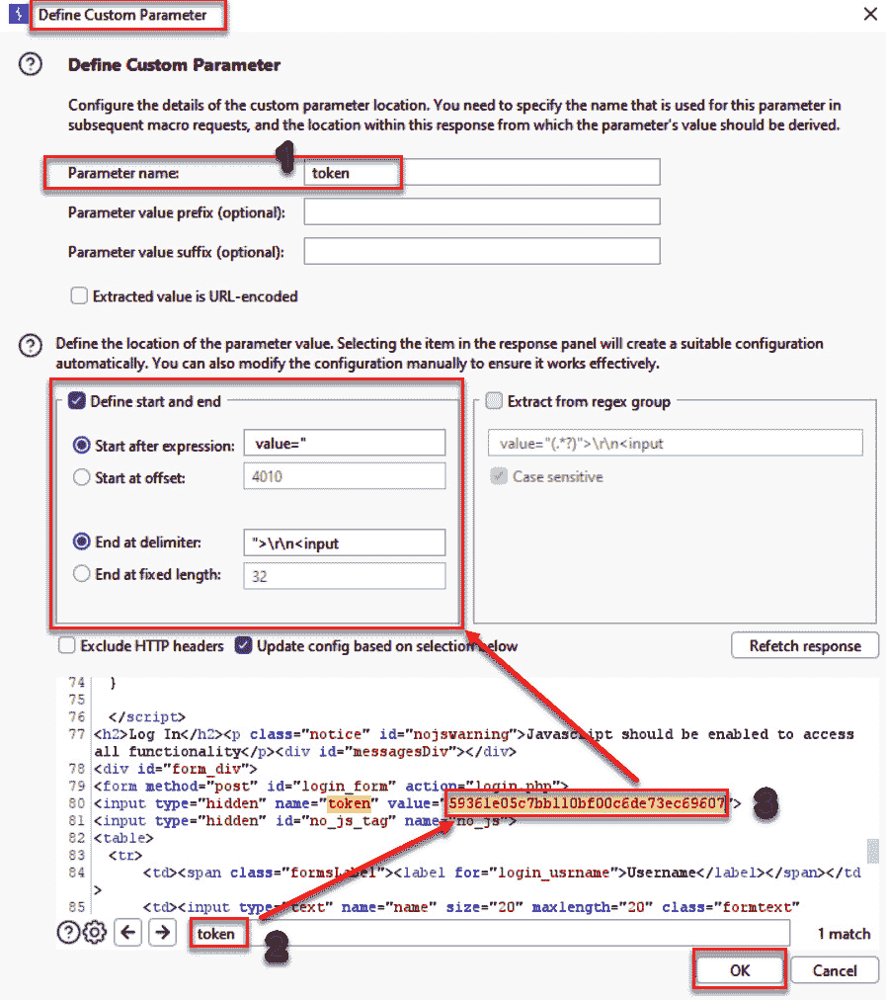
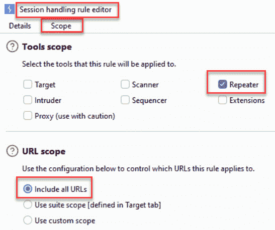
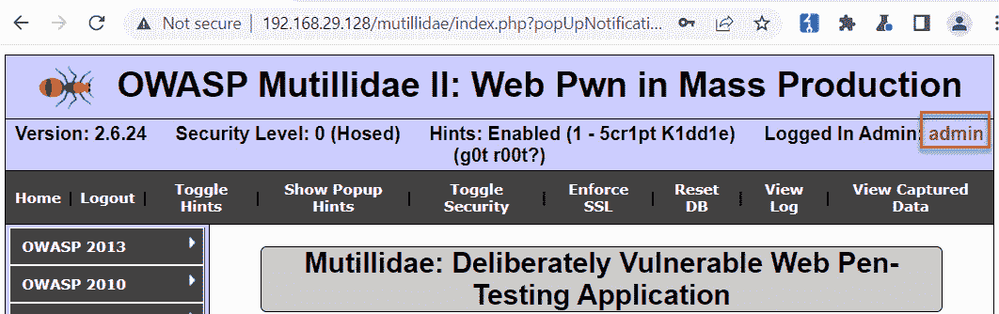

# 第四章：评估认证方案

本章涵盖了一些基本的认证渗透测试用例。背景知识：**认证**是验证个人或物体身份声明是否真实的行为。Web 渗透测试人员必须进行关键评估，以确定目标应用程序认证机制的强度。这些测试包括用户名枚举、可猜测的账户、弱锁定机制、认证绕过、浏览器缓存漏洞和账户配置遗漏，特别是与 **表现性状态转移** (**REST**) API 调用相关的内容。您将学习如何使用 Burp Suite 执行这些测试。

在本章中，我们将涵盖以下几个测试步骤：

+   测试账户枚举和可猜测的账户

+   测试弱锁定机制

+   测试绕过认证机制

+   测试浏览器缓存弱点

+   通过 REST API 测试账户配置过程

# 技术要求

要完成本章中的测试步骤，您需要以下内容：

+   OWASP **破损的网络应用程序** (**BWA**) (虚拟机)

+   一个 OWASP Mutillidae 链接

+   一个 GetBoo 链接

+   Burp Suite Proxy 社区版或专业版 (`portswigger.net/burp/`)

+   配置为允许 Burp Suite 代理流量的 Firefox 浏览器 (`www.mozilla.org/en-US/firefox/new/`)

# 测试账户枚举和可猜测的账户

通过与认证机制的交互并研究响应，测试人员可能能够收集一组有效的用户名。一旦确定了有效账户，测试人员可以尝试暴力破解密码。本步骤解释了如何使用 Burp Suite Repeater 通过用户名枚举攻击收集有效用户名列表。

## 准备工作

使用 **OWASP GetBoo** 应用程序和 Burp，我们将对目标执行用户名枚举攻击。

## 如何操作...

确保 Burp Suite 和 OWASP BWA 虚拟机正在运行，并且 Burp Suite 已在您的 Firefox 浏览器中配置，以便您可以查看 OWASP BWA 应用程序：

1.  从 OWASP BWA 主页，点击链接进入 **GetBoo** 应用程序：


图 4.1 – OWASP BWA 主页

1.  点击 **登录** 按钮，并在登录页面尝试使用 **demo** 用户名和 **aaaaaa** 密码登录：


图 4.2 – GetBoo 登录页面

1.  请注意，返回了一条消息 **密码无效**。从这些信息中，我们现在知道 **demo** 用户名有一个有效账户。让我们使用 Burp Suite **Repeater** 来查找更多账户：


图 4.3 – 使用有效用户名和无效密码进行登录失败后的过于详细的错误信息

1.  在 Burp 的**代理** | **HTTP 历史**标签页中，找到失败的登录尝试消息。查看**响应** | **原始**标签页，找到相同的冗长错误消息，**密码** **无效**：


图 4.4 – 在 Burp 中看到的失败登录尝试

1.  切换回**请求** | **原始**标签页，右键点击并将此请求发送到**Repeater**：


图 4.5 – 发送请求到 Repeater 的上下文菜单

1.  转到 Burp 的**Repeater**标签页，在其中发送请求。点击**发送**按钮。注意响应中的消息 – **安全令牌** **无效**：


图 4.6 – 带有失败登录尝试的 Repeater 标签页

1.  关于无效安全令牌的消息是由于每个请求中发送的令牌在我们在 Repeater 中反复发送相同请求时没有被刷新。因为目标应用程序期望每次 POST 请求时令牌值都会变化，我们可以在 Repeater 中构建我们的请求，绕过这个消息。让我们来学习如何让 Burp Suite 为我们更改令牌值！我们可以使用宏创建一个会话处理规则来解决这个问题：


图 4.7 – 每个 POST 请求中的令牌值必须是唯一的

1.  创建带有宏的会话处理规则的第一步是点击 Burp 右上角的**设置**齿轮图标：


图 4.8 – 设置齿轮图标

1.  在弹出窗口中，确保选中了**所有**配置，并且**会话**区域被高亮显示，如下截图所示：


图 4.9 – 所有 | 会话

1.  在高亮显示**会话**后，进入**会话处理规则**区域并点击**添加**按钮，添加一个新规则：


图 4.10 – 创建一个新的会话处理规则，并使用宏处理令牌刷新

1.  当**会话处理规则编辑器**区域出现时，输入**RefreshToken**作为新规则的名称。在**规则操作**中，选择**运行** **一个宏**：


图 4.11 – 命名我们的会话处理规则并定义操作

1.  当**会话处理编辑器**弹出窗口打开时，选择**仅更新以下参数和头信息**单选按钮并输入**token**。请*不要*跳过此步骤，否则规则将无法正常工作：


图 4.12 – 仅更新 token 参数设置

在同一个**会话处理编辑器**弹出窗口中，顶部点击**添加**按钮，位于**选择宏**下：


图 4.13 – 会话处理操作编辑器设置

1.  点击**添加**按钮后，在**选择宏**下会弹出两个新窗口。在这里显示的**宏录制器**表格中，找到历史记录中包含**demo**用户名和**aaaaaa**密码的 POST **/getboo/login.php** 请求。这是你在浏览器中执行的相同请求，也是我们最初在**Repeater**中查看的相同请求。现在，你需要在**宏录制器**表格中找到它，以便让宏*重播*该请求：


图 4.14 – 宏录制器

这是包含 **demo** 和 **aaaaaa** 的请求：


图 4.15 – 宏录制器高亮显示登录的 POST 请求

1.  在历史记录中找到 POST **/getboo/login.php** 请求后，选择发生在 POST 之前*刚好*的 GET **/getboo/login.php** 请求（如下面截图所示，距离 POST 请求两次）：


图 4.16 – 前一个 GET 请求的宏录制器

1.  这个 GET **/getboo/login.php** 请求之所以重要，是因为响应中的 token 值被分配到了两次请求后的 POST 请求的 token 值：


图 4.17 – 前一个 GET 响应为 token 分配了一个隐藏值

作为证据并便于理解，再次查看 POST **/getboo/login.php** 请求。注意，token 的值与前一个 GET 响应中的隐藏值相匹配（即**ed881be5badd9b284239be84948a103a**）：


图 4.18 – token 值将在随后的 POST 请求中使用

1.  使用这种模式，我们将创建一个宏，从 GET 响应中抓取不断变化的 token 值，并将该唯一值填充到我们在 **Repeater** 中等待的 POST 请求的 token 中。运行这个宏应该能解决我们当前遇到的问题，并去除显示**安全 token** **无效**的消息。

现在，让我们构建宏！仅选择**宏录制器**历史记录中的 GET **/getboo/login.php** 请求，并点击**确定**：


图 4.19 – 宏录制器搜索框

1.  点击**确定**后，您将返回到**宏编辑器**区域。可以随意为您的宏命名，例如**TokenFromResponseMacro**。确保表格中仅显示 GET **/getboo/login.php**请求。点击**配置项**：


图 4.20 – 宏编辑器 | 配置项

1.  一个新的弹出窗口将出现，标题为**配置宏项**。我们将在响应中选择一个自定义参数。点击**添加**：


图 4.21 – 从响应中配置宏项的自定义参数

另一个弹出窗口将出现，您可以在其中定义自定义参数：

1.  对于参数名称，输入**token**。

1.  在底部的搜索框中输入**token**以查找响应中的 token 位置。

1.  一旦找到 token 值，突出显示*值*的起始和结束。如果您正确突出显示，您应该看到**开始于表达式之后**和**结束于分隔符**的内容，如下图所示。

点击**确定**关闭**定义自定义** **参数**窗口：



图 4.22 – 定义自定义参数

1.  点击**确定**三次关闭所有弹出窗口后，您应该返回到原始的**会话处理规则编辑器**对话框。视图将默认显示**详细信息**，因此您需要选择另一个标签，**范围**。

在**工具范围**下，取消选中除**Repeater**工具之外的所有工具框。在**URL 范围**下，选择**包括所有 URL**。点击**确定**关闭**会话处理规则编辑器**对话框：



图 4.23 – 仅为 Repeater 分配范围

1.  确保您的新会话处理规则已启用，通过确保选中框被填充：


图 4.24 – 启用新的会话处理规则

1.  现在，您可以返回到**Repeater**并使用宏测试新的会话处理规则。在**Repeater**中重新发送 POST **/getboo/login.php**请求，用户名为**demo**，密码为**aaaaaa**。现在，您将看到消息是**密码无效**，而不是**安全令牌无效**。如果您没有看到新的消息，请回顾您创建会话处理规则和宏的步骤：


图 4.25 – 在 Repeater 中重新测试 POST 请求

1.  我们不再在 Repeater 中收到**安全令牌无效**的消息了。太棒了！现在，我们的会话已经通过宏正确处理，让我们在 POST 请求中修改用户名，看看是否可以枚举更多的用户账户。在用户名字段中输入无效的用户名，如 **joey**，然后点击 **发送** 按钮。注意返回的消息是 **用户不存在**：


图 4.26 – 尝试不同的用户名以获取详细响应

1.  继续尝试不同的用户并观察不同的详细消息。例如，尝试 **admin**。你得到了什么消息？有趣！现在，我们知道有一个有效的 admin 账户。

# 测试弱锁定机制

应用程序应该具备账户锁定机制，以防止暴力破解登录攻击。通常，应用程序会设定一个阈值，限制三到五次尝试。许多应用程序会在账户被锁定一段时间后，才允许再次尝试。

渗透测试人员必须测试所有登录保护机制，包括挑战问题和回答（如果存在）。

## 准备工作

确定应用程序是否具有适当的锁定机制。如果没有，请尝试暴力破解凭据，访问登录页面，以实现对应用程序的未授权访问。使用 OWASP Mutillidae II 应用程序，尝试使用有效的用户名但无效的密码登录五次。

## 如何操作...

确保 Burp Suite 和 OWASP BWA 虚拟机正在运行，并且已经在 Firefox 浏览器中配置了 Burp Suite，以便查看 OWASP BWA 应用程序：

1.  从 OWASP BWA 登陆页面，点击链接进入 OWASP Mutillidae II 应用程序。

1.  打开 Firefox 浏览器，进入 OWASP Mutillidae II 的登录界面。从顶部菜单中点击 **登录**。

1.  在登录界面，尝试使用 **admin** 用户名和错误密码 **aaaaaa** 登录五次。注意，在这五次尝试中，应用程序的反应没有任何不同。错误信息没有变化，**admin** 账户也没有被锁定。这意味着登录可能容易受到暴力破解密码攻击：


图 4.27 – 暴力破解登录尝试

继续我们的测试，暴力破解登录页面，获得对应用程序的未授权访问。

1.  转到 **代理** | **HTTP 历史** 标签，查找失败的登录尝试。找到后，右键点击并选择 **发送到 Intruder**：


图 4.28 – HTTP 历史中的登录失败尝试及发送到 Intruder

1.  进入 Burp 的**入侵者** | **位置**选项卡。如果出现建议的负载标记，请点击**清除 §**按钮将其移除。如果没有建议项，您可以忽略此步骤：


图 4.29 – 入侵者 | 位置选项卡

1.  然后，突出显示**aaaaaa**的密码值并点击**添加 §**按钮：


图 4.30 – 在入侵者 | 位置选项卡中设置替换标记

1.  继续进入**入侵者** | **负载**选项卡。许多测试人员使用字典列表在负载标记占位符内暴力破解常用密码。对于本教程，我们将输入一些常见密码，创建一个独特的负载列表。

1.  在**负载设置 [简单列表]**部分，输入**admin123**字符串并点击**添加**按钮：


图 4.31 – 自定义负载值

1.  在负载列表框中再添加一些字符串，如**adminpass**、**welcome1**和**admin**：


图 4.32 – 自定义负载值的最终列表

1.  进入**入侵者** | **设置**选项卡并向下滚动到**Grep - 提取**部分：


图 4.33 – Grep - 提取响应中的特定字符串字面量

1.  勾选**从响应中提取以下项目**复选框，然后点击**添加**按钮。弹出框将显示您用**admin**/**aaaaaa**请求进行的失败登录尝试的响应。

1.  在底部的搜索框中，搜索**未登录**。找到匹配项后，您必须突出显示**未登录**以正确分配 grep 匹配：


图 4.34 – Grep 查找字符串字面量

1.  如果没有正确突出显示单词，在点击**确定**后，您将在**Grep - 提取**框中看到**[无效]**。如果发生这种情况，请点击**移除**按钮删除该条目，然后通过点击**添加**按钮、执行搜索并突出显示单词来重新尝试。

1.  如果您正确突出显示了单词，您应该在**Grep - 提取**框中看到以下内容：


图 4.35 – 选择字符串字面量以自动填充表达式的开始和结束框

1.  如果您正确突出显示了单词，在点击**确定**关闭**定义提取 grep 项目**对话框后，您将在**Grep - 提取**文本区域看到以下表达式：


图 4.36 – 最终的 grep 规则设置

1.  现在，点击**设置**页面右上角的**开始攻击**按钮。如果攻击没有开始，并且你看到**恢复**按钮，点击它以开始攻击。如果你没有看到**恢复**按钮，可以忽略此步骤。

1.  弹出攻击结果表格出现，显示了你定义的请求和放置在有效负载标记位置的有效负载。请注意，生成的攻击表格显示了一个额外的列，名为**ReflectedXSSExecution**。这个列是我们之前设置的**Grep - Extract**规则的结果。

1.  从这个攻击表格中，通过查看我们从**Grep - Extract**添加的附加列，测试人员可以轻松识别哪些请求成功暴力破解了登录页面。在这种情况下，请求**2**和请求**4**：


图 4.37 – 攻击表格

1.  在攻击表格中选择请求**4**，并查看**响应** | **呈现**选项卡。你应该看到右上角有一条信息，内容为**已登录管理员：admin（g0t r00t？）**：


图 4.38 – 攻击结果记录在会话中

1.  点击右上角的**X**按钮关闭攻击表格。

这样，你成功地暴力破解了系统中一个有效账户的密码。攻击成功是因为该应用程序的锁定机制较弱。

# 测试绕过认证机制

应用程序可能存在缺陷，允许通过绕过认证措施进行未经授权的访问。绕过技术包括**直接页面请求**（即强制浏览），**参数修改**，**会话 ID 预测**，以及**SQL** **注入**。

对于这个配方，我们将使用参数修改。

## 准备就绪

编辑经过身份验证的请求中的参数，将低权限用户提升为管理员。我们将在登录过程中使用**代理** | **拦截**，并操控一些 cookie 值来提升权限。一旦权限被提升，我们可以访问管理员功能，而无需知道管理员的凭证。

## 如何操作...

1.  打开你的 Firefox 浏览器，或 Burp Suite 浏览器，点击左侧顶部菜单中的**主页**按钮，访问 OWASP Mutillidae II 的主页。确保你*未登录*该应用程序。如果已经登录，选择菜单中的**注销**：


图 4.39 – 确认你未登录

1.  点击**登录/注册**链接，导航到**登录**页面：


图 4.40 – 未登录会话

1.  转到 Burp Suite 的**代理**选项卡，并点击**拦截已开启**（开启切换）。在登录表单中输入**user**的用户名和**user**的密码：


图 4.41 – 代理 | 拦截开启

1.  输入凭据后，你应该会看到请求在**代理** | **拦截**中被拦截。点击**前进**：


图 4.42 – 点击“前进”按钮，将请求发送到 web 服务器

1.  继续点击**前进**，直到看到 GET **/mutillidae/index.php** 请求，如图所示。注意我们将要操作的两个 cookie – **username** 和 **uid**：


图 4.43 – 注意这两个 cookie 值，用户名和 uid

1.  编辑这两个 cookie 值，将**username**改为**admin**，将**uid**改为**1**。完成后，转发请求：


图 4.44 – 操作 cookie 值以提升权限

1.  转发请求后，选择**代理** | **拦截已关闭**（关闭切换）：


图 4.45 – 代理 | 拦截已关闭

1.  返回浏览器；注意你现在已以**管理员**身份登录。你已经将标准用户权限提升为管理员：


图 4.46 – 会话现在显示为管理员会话

## 它是如何工作的……

通过操作容易猜测的 cookie 值，我们可以将已认证的会话从普通用户提升为管理员。

# 测试浏览器缓存的弱点

浏览器缓存是为了提升性能和改善终端用户体验。然而，当用户在浏览器中输入敏感数据时，这些数据也可能被缓存到浏览器历史记录中。我们可以通过检查浏览器缓存或直接按下浏览器的*后退*按钮来查看这些缓存的数据。

## 准备工作

使用浏览器的后退按钮，判断是否缓存了登录凭据，从而允许未经授权的访问。通过检查 Burp 中的这些步骤，了解漏洞所在。

## 如何操作……

1.  以**管理员**身份并使用**admin**密码登录 Mutillidae 应用：



图 4.47 – 以管理员身份登录

1.  现在，通过点击顶部菜单中的**注销**按钮，退出应用程序。


图 4.48 – 注销

1.  通过注意到**未登录**的消息，确认你已退出登录：


图 4.49 – 验证你尚未登录

1.  在 Burp 的**代理** | **HTTP 历史**区域也可以查看这些步骤。注意，注销会执行**302**重定向，以避免在浏览器中缓存 cookie 或凭据：


图 4.50 – 在 Proxy | HTTP 历史记录中查找登出请求

1.  在 Firefox 浏览器中，点击*返回*按钮：


图 4.51 – 使用浏览器的返回按钮

注意，即使你没有登录，你现在已作为**admin**登录！这是由于浏览器中缓存的凭证以及应用程序中没有设置任何缓存控制保护所致：


图 4.52 – 浏览器缓存了会话，因此即使点击了登出按钮，我们仍然保持登录状态

1.  现在，在浏览器中刷新/重新加载页面；你会看到你已成功登出。

## 工作原理…

当你按下浏览器的返回按钮时，Burp Suite 没有捕获到请求。这是因为返回按钮的操作仅限于浏览器上下文中。没有通过 Burp Suite 向 Web 服务器发送消息来执行此操作。这是一个重要的区别要注意。由于缺乏缓存保护，我们发现了一个漏洞，即登出操作未能销毁客户端的会话。

# 通过 REST API 测试账户配置过程

账户配置是建立和维护应用程序中用户账户的过程。账户配置功能通常仅限于管理员账户。渗透测试人员必须验证账户配置功能仅对拥有适当身份验证和授权的用户开放。账户配置的常见方式是通过 REST API 调用。很多时候，开发人员可能没有对用于应用程序 UI 部分的 API 调用设置相同的授权检查。

## 准备工作

使用 OWASP Mutillidae II 应用程序中可用的 REST API 调用，确定是否存在任何未认证的 API 调用，以及这些调用是否能配置或修改用户。

## 操作方法…

确保你没有登录应用程序。如果你已登录，点击顶部菜单中的**登出**按钮。现在，按照以下步骤操作：

1.  在 Mutillidae 中，浏览到**用户查找（SQL）**页面，选择**OWASP 2013** | **A1 注入（SQL）** | **SQLi – 提取数据** | **用户** **信息（SQL）**：


图 4.53 – 用户查找页面

1.  在**姓名**和**密码**栏中输入**user**，然后点击**查看账户详情**。你应该看到以下截图中显示的结果。这是我们将通过 API 调用测试账户配置功能的账户：


图 4.54 – 用户账户的数据库结果

通过爬虫，Burp Suite 可以找到**/api**或**/rest**文件夹。这些文件夹是应用程序启用 REST API 的线索。测试者需要确定这些 API 调用可以提供哪些功能，以及这些调用是否需要身份验证。

1.  对于 Mutillidae，**/webservices/rest/**文件夹结构通过 API 调用提供账户配置功能。通过**Target** | **Site map**查找这些文件夹：


图 4.55 – API 目录结构

1.  若要直接进入 Mutillidae 中的此功能，选择**Web Services** | **REST** | **SQL Injection** | **User** **Account Management**：


图 4.56 – 跳转到用户账户管理文档页面

系统将展示一个描述支持的 API 调用及每个调用所需参数的屏幕。我们将此页面称为*用户账户管理*页面。该页面的 URL 是**/webservices/rest/ws-user-account.php**：


图 4.57 – 用户账户管理 API 文档页面

1.  在这个*用户账户管理*API 文档页面中，注意 GET 调用部分。此页面类似于 Swagger 或其他自解释 API 页面，提供了显示单个用户或所有用户账户信息所需的格式说明：


图 4.58 – 获取账户信息的 API 说明

1.  使用*用户账户管理*API 文档页面中的说明，我们将调用 GET API 来查看用户账户。首先，在**Proxy** | **HTTP history**中找到用户账户管理页面的调用。

1.  进入**Proxy** | **HTTP history**表格，选择你最近一次访问的请求，跳转到用户账户管理页面。在历史记录中查找**/mutillidae/webservices/rest/ws-user-account.php**的调用。找到后，右键点击并将此请求发送到**Repeater**：


图 4.59 – 将请求发送到用户账户管理页面的 Repeater

1.  在 Burp 的**Repeater**中，在 URL 后添加**?**，然后添加一个参数名称/值对**username=user**。新 URL 应为**/mutillidae/webservices/rest/ws-user-account.php?username=user**：


图 4.60 – 添加用户名参数

1.  点击**Send**按钮——注意，我们能够获取到账户数据：


图 4.61 – 查看请求结果

1.  现在，为了确定作为未认证用户是否可以看到这些数据，移除**PHPSESSIONID** Cookie 的值并重新发送请求。太神奇了！进行这些操作不需要认证令牌！我们刚刚发现了一个未认证的 API 调用！这是一个重大发现：


图 4.62 – 移除认证令牌；注意结果仍然返回

1.  让我们看看还能对这个未认证的 API 端点做些什么。使用在用户账户管理页面提供的 SQL 注入字符串，尝试导出整个用户表。

1.  在**username=**后追加以下值：

    ```
    user'+union+select+concat('The+password+for+',username,
    '+is+',+password),mysignature+from+accounts+--+
    ```

新的 URL 应该如下所示：

```
/mutillidae/webservices/rest/ws-user-account.php?username=user'
+union+select+concat('The+password+for+',username,'+is+',
+password),mysignature+from+accounts+--+
```

1.  在修改**用户名**参数后，点击**发送**按钮。你的请求应该如下所示：


图 4.63 – 在用户名参数中使用 SQL 注入攻击

1.  注意，我们导出了数据库中所有的账户信息，包括所有的用户名、密码和签名！我们甚至在没有任何认证令牌的情况下导出了这些数据：


图 4.64 – 用户表的完整导出

## 它是如何工作的……

发现未认证的 API 端点是一个重要的测试任务，必须执行。这是一个常见问题，因为 API 在各种应用和移动应用中广泛使用。在*第十章*中，我们将介绍一个 Burp Suite 扩展，帮助我们更轻松地找到未认证的 API 端点。
