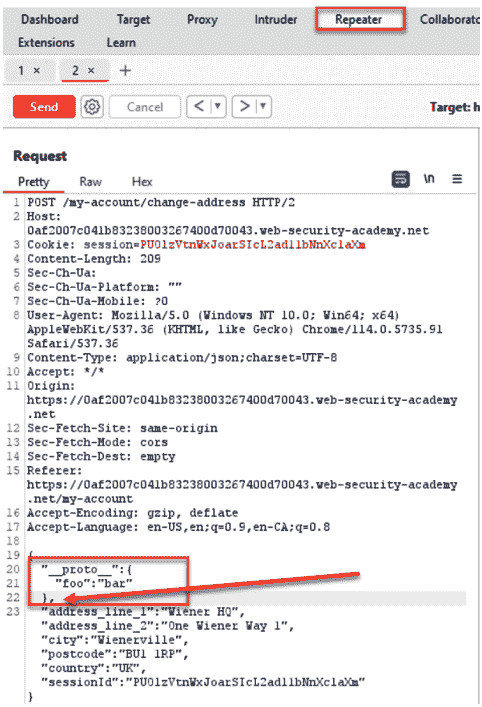
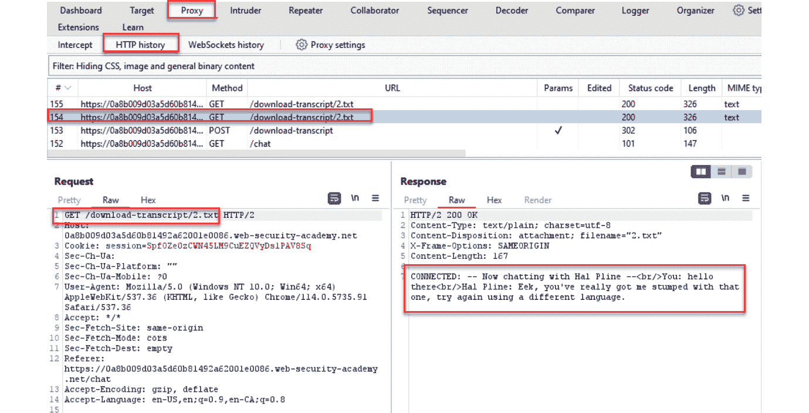

# 第五章：评估授权检查

本章介绍了授权的基础知识，包括应用程序如何使用角色来确定用户功能的解释。Web 渗透测试涉及关键评估，以确定应用程序验证分配给特定角色或个人用户的功能的效果，我们将学习如何使用 Burp Suite 来执行这些测试。

本章将涵盖以下实验：

+   测试目录遍历

+   测试 **本地文件** **包含**（**LFI**）

+   测试 **远程文件** **包含**（**RFI**）

+   测试权限提升

+   测试 **不安全的直接对象** **引用**（**IDOR**）

# 技术要求

完成本章中的实验，你将需要以下工具：

+   OWASP **破损的 Web 应用程序**（**BWA**）虚拟机：OWASP Mutillidae 应用程序

+   Burp Suite 代理社区版或专业版（https://portswigger.net/burp/）

+   使用 PortSwigger 账户访问 Web 安全学院（[`portswigger.net/web-security/all-labs`](https://portswigger.net/web-security/all-labs)）

+   配置为允许 Burp Suite 代理流量的 Firefox 浏览器（[`www.mozilla.org/en-US/firefox/new/`](https://www.mozilla.org/en-US/firefox/new/)）

+   来自 GitHub 的 **wfuzz** 字典库（[`github.com/xmendez/wfuzz`](https://github.com/xmendez/wfuzz)）

# 测试目录遍历

目录遍历攻击是尝试发现或强制浏览通常为应用程序管理员设计的未授权网页。如果应用程序没有正确配置 Web 文档根目录，并且没有在服务器端对每个访问的页面进行适当的授权检查，就可能存在目录遍历漏洞。这类弱点允许攻击者执行系统命令注入或任意代码执行。

## 准备工作

使用 OWASP Mutillidae II 作为目标应用程序，让我们来检查它是否存在任何目录遍历漏洞。

确保 Burp Suite 和 OWASP BWA 虚拟机正在运行，Burp Suite 已在 Firefox 浏览器中配置（或使用 Burp Suite 浏览器），并且你正在查看 OWASP BWA 应用程序。

## 如何执行...

1.  从 OWASP BWA 登录页面，点击链接进入 OWASP Mutillidae II 应用程序。

1.  在 Firefox 浏览器中打开 OWASP Mutillidae II 的登录界面。在顶部菜单中，点击**登录**。

1.  在 **Proxy** | **HTTP 历史** 表格中找到你刚刚执行的请求。查找对 **login.php** 页面的调用。选中该消息，将光标移到 **Request** 标签的 **Raw** 子标签中，右键点击，选择 **发送到 Intruder**：


图 5.1 – 发送到 Intruder

1.  切换到 **Intruder** | **Positions** 标签，点击右侧的 **Clear $** 按钮，清除所有 Burp 定义的有效载荷标记。

1.  高亮当前存储在 **page** 参数中的值 (**login.php**)，并使用 **添加 §** 按钮为其添加有效载荷标记：


图 5.2 – Intruder | Positions 标签页

1.  继续到 **Intruder** | **Payloads** 标签页，选择以下来自 **wfuzz** 仓库的词表：**admin-panels.txt**。来自 GitHub 仓库的词表位置如下：**wfuzz/wordlist/general/admin-panels.txt**。

1.  在 **Intruder** | **Payloads** 标签页的 **有效载荷选项 [简单列表]** 部分点击 **加载** 按钮，弹出窗口将提示你选择词表的位置。

1.  浏览到你从 GitHub 下载 **wfuzz** 仓库的位置。继续在 **wfuzz** 文件夹结构中查找 (**wfuzz/wordlist/general/**)，直到找到 **admin-panels.txt** 文件，然后选择该文件并点击 **打开**：


图 5.3 – 词表加载

1.  滚动到页面底部，取消选中（默认情况下已选中）**URL 编码这些** **字符** 选项：


图 5.4 – 取消选中有效载荷编码框

1.  现在你准备好开始攻击了。点击 **攻击开始** 按钮，该按钮位于 **Intruder** | **Positions** 页面的右上角。

1.  攻击结果表格将会显示。允许攻击完成。**admin-panels.txt** 词表中有 137 个有效载荷。按 **长度** 列从升序排序为降序，以查看哪些有效载荷命中了网页。

注意那些响应长度较大的有效载荷。这看起来很有希望！也许我们发现了包含指纹信息或未经授权访问的管理页面：


图 5.5 – 结果表格

1.  从结果列表中选择响应长度最大的页面之一（99,000+），例如 **admin.php**。在攻击结果表格中，查看 **响应** | **渲染** 标签，注意页面显示了 PHP 版本和系统信息：


图 5.6 – 在 Repeater 中重放一个成功的结果

## 它是如何工作的…

即使没有登录，我们也能强制浏览到 Web 应用程序的一个未映射区域。*未映射* 指的是该应用本身没有直接链接到这个秘密配置页面。但是，通过使用 Burp Suite Intruder 和包含常见管理文件名的词表，我们能够通过目录遍历攻击发现该页面。

# 测试 LFI

Web 服务器通过配置设置来控制对特权文件和资源的访问。特权文件包括应仅对系统管理员可访问的文件——例如，在类 Unix 平台上的**/etc/passwd**文件或 Windows 系统中的**boot.ini**文件。

**LFI**攻击是尝试通过目录遍历攻击访问特权文件。LFI 攻击包括不同的风格，诸如**点点斜杠攻击**（**../**）、**目录暴力破解**、**目录爬升**或**回溯攻击**。

## 准备开始

以 OWASP Mutillidae II 作为目标应用程序，来确定它是否包含任何 LFI 漏洞。

确保 Burp Suite 和 OWASP BWA 虚拟机正在运行，并且 Burp Suite 已经配置在用于查看 OWASP BWA 应用的 Firefox 浏览器中。

## 如何操作...

1.  从 OWASP BWA 登陆页面，点击链接进入 OWASP Mutillidae II 应用。

1.  在 Firefox 浏览器中打开 OWASP Mutillidae II 的登录界面。点击顶部菜单中的**登录**。

1.  在**代理** | **HTTP 历史记录**表格中找到你刚刚执行的请求。查找对**login.php**页面的调用。高亮该消息，将光标移至**请求**标签的**原始**选项卡，右键点击并选择**发送**至**入侵者**。

1.  切换到**入侵者** | **位置**标签，并通过点击右侧的**清除§**按钮清除所有 Burp 定义的负载标记。

1.  高亮显示当前存储在**page**参数中的值（**login.php**），并使用右侧的**添加§**按钮为其添加负载标记。

1.  继续到**入侵者** | **负载**标签。选择以下来自**wfuzz**仓库的词表：**Traversal.txt**。该词表在 GitHub 仓库中的位置遵循以下文件夹结构：**wfuzz/wordlist/injections/Traversal.txt**。

1.  点击**入侵者** | **负载**标签中**负载选项 [简单列表]**部分内的**加载**按钮。将弹出一个窗口，提示输入你的词表位置。

1.  浏览到你从 GitHub 下载的**wfuzz**仓库的位置。继续通过**wfuzz**文件夹结构搜索，直到找到**Traversal.txt**文件。选择该文件并点击**打开**：


图 5.7 – 词表加载

1.  滚动到底部并取消选中（默认已选中）**对这些字符进行 URL 编码**选项。

1.  你现在可以开始攻击了。点击**入侵者** | **位置**页面右上角的**开始攻击**按钮。

1.  攻击结果表将显示出来。等待攻击完成。按**长度**列进行排序，从升序到降序排列，查看哪些负载命中了网页。注意那些长度较大的负载；也许我们已经获得了对系统配置文件的未授权访问！


图 5.8 – 结果表格片段

1.  在列表中选择请求 **2**。从攻击结果表格中，查看 **Response** | **Render** 标签，注意页面显示了系统中主机文件的内容！或者，你也可以将请求发送到 **Repeater** 并重放攻击，以查看相同的结果。


图 5.9 – 在 Repeater 中重放一次成功的结果

## 它是如何工作的...

由于文件权限保护不当以及缺乏应用程序授权检查，攻击者可以读取包含敏感信息的系统上的特权本地文件。LFI 漏洞背后的危险在于发现秘密、API 密钥、源代码和配置文件。这些泄露可能导致远程代码执行、系统账户接管，甚至进一步渗透到网络中的其他机器。

# 测试 RFI

**RFI** 是一种尝试访问外部 URL 和远程文件的攻击。这种攻击是由于参数操作、缺乏服务器端检查以及防火墙级别缺乏出站流量白名单造成的。这些疏忽可能导致用户信息的数据外泄，将其传送到由攻击者控制的外部服务器。

## 准备工作

使用 OWASP Mutillidae II 作为我们的目标应用程序，接下来让我们确定它是否包含任何 RFI 漏洞。

确保 Burp Suite 和 OWASP BWA 虚拟机正在运行，并且 Burp Suite 已在用于查看 OWASP BWA 应用程序的 Firefox 浏览器中配置好。

## 如何执行...

1.  从 OWASP BWA 登陆页面，点击链接进入 OWASP Mutillidae II 应用程序。

1.  在 Firefox 浏览器中打开 OWASP Mutillidae II 的登录页面。点击顶部菜单中的 **Login**。

1.  在 **Proxy** | **HTTP 历史记录** 表格中找到你刚才执行的请求。寻找对 **login.php** 页面调用的记录：


图 5.10 – 查找 POST 登录请求

1.  记下 **page** 参数，该参数决定加载哪个页面：


图 5.11 – 请注意页面参数

让我们看看能否通过提供一个位于应用程序之外的 URL 来利用这个参数。为了演示，我们将使用一个我们控制的 OWASP BWA 虚拟机中的 URL。然而，在实际攻击中，这个 URL 将由攻击者控制。

1.  切换到 **Proxy** | **Intercept** 标签，并点击 **Intercept is** **on** 按钮。

1.  返回到 Firefox 或 Burp Suite 浏览器，重新加载登录页面。请求已暂停并包含在 **Proxy** | **Intercept** 标签中：


图 5.12 – 代理 | 拦截已开启

1.  现在让我们操作 **login.php** 中的 **page** 参数，将其值修改为指向应用程序外部的 URL。我们将使用 **GetBoo** 应用程序的登录页面。您的 URL 将特定于您的机器 IP 地址，因此请相应地调整。新的 URL 将是 **http://<your_IP_address>/getboo/**。

1.  重新加载您浏览器中的登录页面，通过点击 *刷新* 按钮或按 *F5* 键，使流量发送到 Burp Suite。您也可以再次点击 **Login/Register** 按钮。


图 5.13 – 点击登录/注册按钮

1.  注意请求在 **Proxy** | **Intercept** 中被暂时拦截。您可能需要多次点击 **Forward** 按钮，直到您看到 **GET /multillidae/index.php?page=login.php** 请求。现在我们可以在发送请求到 Web 服务器之前修改这些值：


图 5.14 – 在 Proxy Intercept 中捕获的登录请求

1.  让我们开始操作参数，将 **login.php** 的值替换为 **http://<your_IP_address>/getboo/** 并点击 **Forward** 按钮：


图 5.15 – 将用户重定向到 GetBoo 应用程序

1.  现在再次按下 **Intercept is on** 按钮，将其切换为关闭状态（**Intercept is off**）。

1.  返回 Firefox 浏览器，注意到加载的页面是 **GetBoo** 索引页，位于 Mutillidae 应用程序的上下文中！


图 5.16 – 成功重定向的证据

## 工作原理...

**page** 参数没有适当的数据验证机制，无法确保提供的值是经过白名单验证的，或者包含在规定的可接受值列表中。通过利用这个漏洞，我们可以给这个参数指定值，将我们的受害者重定向到我们选择的页面，或者更糟糕的是，提取数据和窃取受害者浏览器会话中的敏感信息。

# 测试权限提升

应用程序中的开发者代码必须包括对分配角色的授权检查，以确保授权用户无法提升其角色到更高的权限。作为攻击者，常见的权限提升攻击目标包括参数篡改、强制浏览和身份验证绕过。通过修改分配的角色或参数值并将其替换为其他值，这些类型的权限提升攻击可能会发生。如果攻击成功，攻击者将获得对原本仅限管理员或更高权限账户访问的资源或功能的未授权访问。

## 准备工作

让我们使用 *通过服务器端原型污染进行权限提升* 的 PortSwigger 实验，它位于 *所有实验* 的 *原型污染* 部分，作为我们的目标应用程序。我们将尝试在 Node.js 继承层次结构中寻找漏洞，以提升我们在应用中的权限。

登录到你的 PortSwigger 账户并导航到以下网址：[`portswigger.net/web-security/prototype-pollution/server-side/lab-privilege-escalation-via-server-side-prototype-pollution`](https://portswigger.net/web-security/prototype-pollution/server-side/lab-privilege-escalation-via-server-side-prototype-pollution)。确保 Burp Suite 正在运行并通过 Firefox 或 Burp Suite 浏览器发送流量。

## 如何操作…

1.  从 *实验：通过服务器端原型污染进行权限提升* 登录页面，点击名为 **访问实验** 的链接。如果你没有看到 **访问实验** 按钮，请确保你已登录 PortSwigger 账户。


图 5.17 – 启动 PortSwigger 实验实例

1.  浏览器中将打开一个新标签，并且一个独特的实验实例将仅为你启动。你的 URL 将是唯一的，因此与下图中所示的 URL 不同。


图 5.18 – 正在运行的实验实例

1.  在 Burp 中运行流量，通过点击右上角的**我的帐户**链接登录到应用实例。你将看到一个登录页面。


图 5.19 – 登录页面

1.  凭证在实验描述和解决方案中提供，用户名是**wiener**，密码是**peter**。登录应用程序。登录后，将展示个人资料页面。更新地址字段，添加一个数字或额外的字母并提交。


图 5.20 – 个人资料登录页面

1.  切换到 Burp 的 **代理** | **HTTP 历史记录** 标签页。找到你刚才在个人资料页面上进行的 **POST** 请求，更新地址：


图 5.21 – 在代理 HTTP 历史记录表中查找地址更改的 POST 请求

1.  右键单击并选择 **发送到** **重复器**：


图 5.22 – 发送到重复器

1.  在 **重复器** 中，向 JSON **POST** 正文中添加一个名为 **__proto__** 的原型属性。在新的属性中，添加一个假名称/值对。如果你将以下原型属性放在现有 JSON 正文的开头或中间，必须添加逗号；否则，将收到 JSON 解析错误：

    ```
    "__proto__": {
        "foo":"bar"
    },
    ```

如下图所示：



图 5.23 – 将原型添加到 POST 请求的 JSON 正文中

1.  发送请求。注意，响应仍然有效。另外，请注意在 JSON 响应中有一个名为**"isAdmin": false**的属性。


图 5.24 – 注意响应中的 isAdmin 参数

1.  让我们使用原型污染攻击，将此值从**false**更改为**true**。将**"isAdmin":"true"**属性添加到原本是**"foo":"bar"**的请求中，该属性位于原型**"__proto__"**对象内。


图 5.25 – 操控请求中的 isAdmin 参数

1.  发送请求并注意到响应现在反映了这一变化。我们刚刚将权限提升为管理员！返回浏览器并刷新**/my-account**页面。注意，你现在可以看到**Admin panel**链接：


图 5.26 – 现在可以访问管理员面板

1.  为了解决这个实验，点击**Admin panel**链接。在随后的页面中，删除账户**carlos**。


图 5.27 – 删除 Carlos 的账户

1.  你应该会看到幕布显示，确认你已解决实验。


图 5.28 – 实验已解决

## 运行机制...

在这个例子中，作为攻击者，我们利用了 Node.js 对象中的一个潜在弱点，称为原型污染。Node.js 中构造的每个对象都会使用一个原型，从而使对象继承其特性和行为。如果攻击能够*污染*对象层次结构的顶部，那么从这个被污染的原型构造出来的所有对象都可以被操控。通过将**"__proto__"**添加到**POST** JSON 正文中，我们发现了这个弱点并利用它将我们的权限提升为管理员。

# 测试 IDOR（不安全的直接对象引用）

允许未经授权的直接访问系统上的文件或资源，通常是基于用户提供的输入，这被称为 IDOR（不安全的直接对象引用）。这种漏洞允许我们绕过对这些文件或资源所施加的授权检查。IDOR 是由于未经检查的用户提供输入，直接访问对象而未在应用程序代码中进行授权检查所导致的。

## 准备工作

让我们使用*不安全的直接对象引用*（Insecure direct object references）PortSwigger 实验，它位于*所有实验*的*访问控制*部分，作为我们的目标应用程序。我们将尝试找到用作参数值的直接对象引用，操控它，并访问那些通常不应该看到的信息。

登录到你的 PortSwigger 账户并导航到以下网址：[`portswigger.net/web-security/access-control/lab-insecure-direct-object-references`](https://portswigger.net/web-security/access-control/lab-insecure-direct-object-references)。确保 Burp Suite 正在运行，并通过 Firefox 或 Burp Suite 浏览器发送流量。

## 如何操作...

1.  在 *Lab: Insecure direct object references* 登陆页面，点击名为 **Access the lab** 的链接。如果你没有看到 **Access the lab** 按钮，确保你已经登录到你的 PortSwigger 账户。


图 5.29 – 启动实验室实例

1.  浏览器中将打开一个新标签页，并为你启动一个独特的实验室实例。你的网址将是唯一的，因此与下面截图中显示的网址不同。


图 5.30 – 实验室的登陆页面

1.  点击应用程序中的 **实时聊天** 链接。


图 5.31 – 实时聊天链接

1.  在 **实时聊天** 页面，输入简单的消息并点击 **发送**，将其发送到 Web 服务器后端：


图 5.32 – 要发送的示例信息

1.  点击 **发送** 按钮后，点击 **查看转录** 按钮。注意，一个文件会下载到你的本地系统，其中包含了对话内容。


图 5.33 – 点击查看转录按钮

1.  查看下载的文件，看到转录文件中如预期捕捉到了对话内容。


图 5.34 – 查看下载的转录文件

1.  切换到 Burp 的 **代理** | **HTTP 历史** 标签页。找到紧接着 **POST** 请求的 **GET** 请求，来下载该文件。注意我们的文件名是一个带有 **.txt** 扩展名的数字。如果我们将这个数字的值更改为 **1**，会发生什么？



图 5.35 – 查看调用以获取转录文件

1.  右键点击并将请求发送到 **Repeater**。让我们通过操作分配给我们转录的数字值为 **1** 来执行一个 IDOR 攻击。发送请求。注意你现在可以读取不同用户的转录文件！转录文件中暴露了他们的密码！


图 5.36 – 操作文件名

1.  使用我们已经发现的密码，使用 **carlos** 作为用户名和转录文件中显示的密码进行登录。点击 **我的账户** 链接进入登录页面。输入凭证。请注意，你的密码可能与我的不同，因为每个实例可能有不同的密钥。


图 5.37 – 使用揭示的密码登录到 Carlos 的账户

1.  登录后，您应该会看到确认您已解决实验的幕布显示！


图 5.38 – 实验已解决

## 它是如何工作的……

由于**成绩单**文件名参数缺乏适当的授权检查，我们可以查看完全不同用户的成绩单。在这个案例中，成绩单包含了密码信息，我们利用这些信息进行了账户接管。防范和缓解此漏洞的措施包括在揭示敏感文件和资源之前进行访问控制和检查。当这些访问控制缺失时，可能存在 IDOR（不当对象引用）漏洞。
