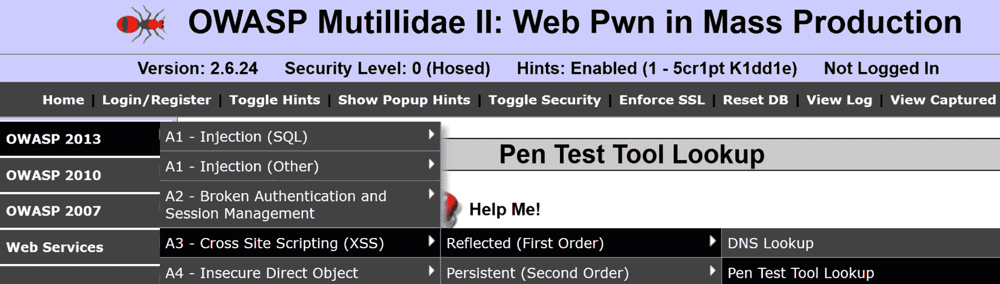
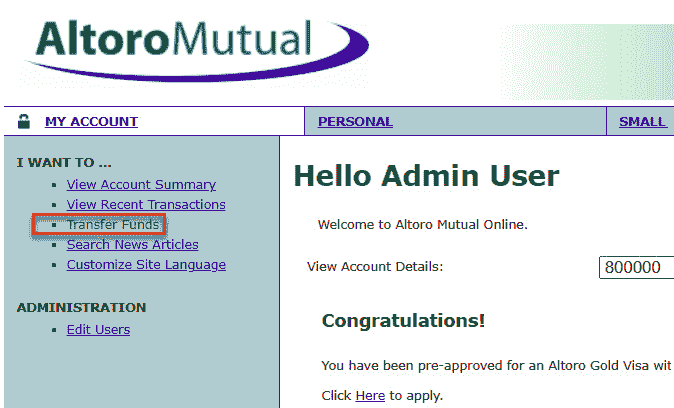
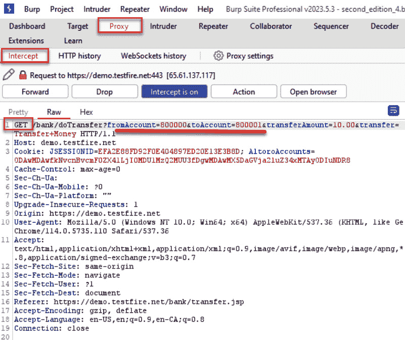
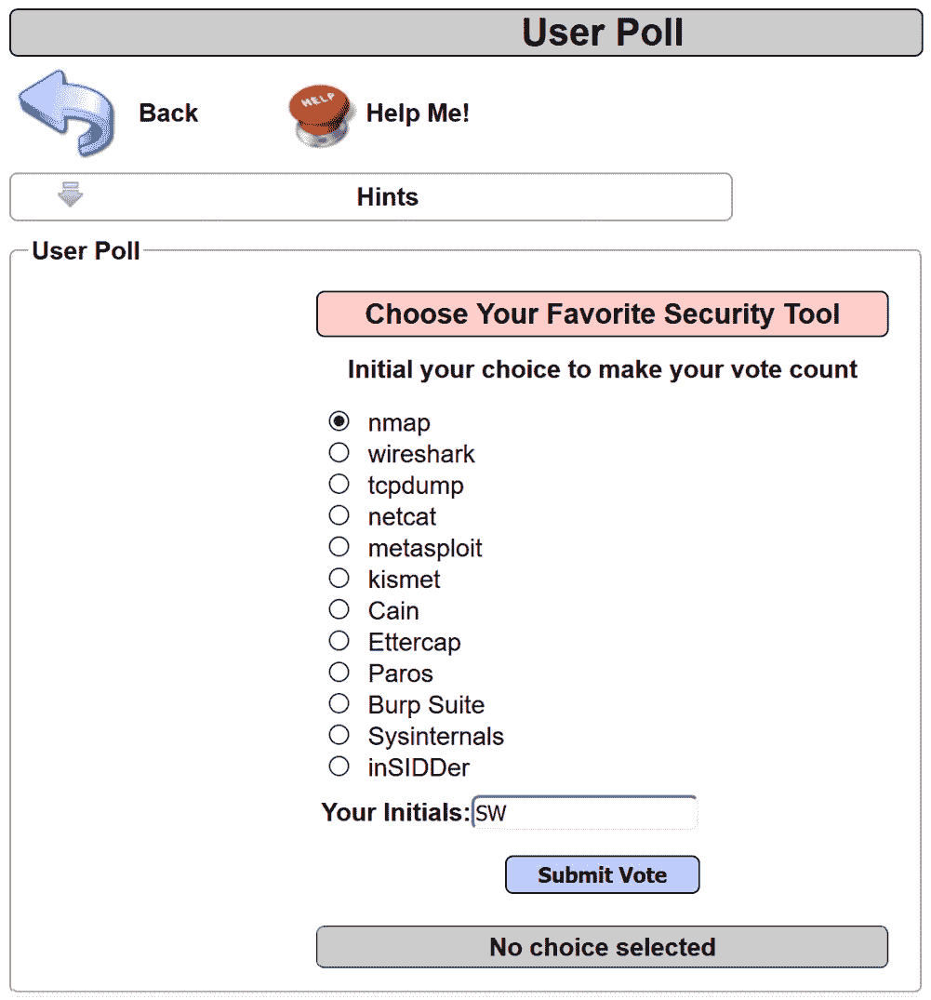

# 第八章：评估输入验证检查

未能在应用程序代码中使用来自客户端的任何输入之前进行验证，是 Web 应用程序中最常见的安全漏洞之一。这一漏洞是导致重大安全问题的根源，如 SQL 注入和**跨站脚本攻击**（**XSS**）。Web 渗透测试人员必须评估并确定应用程序是否会反射或执行任何输入。我们将学习如何使用 Burp Suite 执行此类测试。

本章我们将覆盖以下配方：

+   测试反射型跨站脚本攻击

+   测试存储型跨站脚本攻击

+   测试 HTTP 动词篡改

+   测试 HTTP 参数污染

+   测试 SQL 注入

+   测试命令注入

# 技术要求

要完成本章的配方，您将需要以下内容：

+   OWASP 破损 Web 应用程序 (VM)

+   OWASP Mutillidae 链接

+   Burp Suite Proxy 社区版或专业版（[`portswigger.net/burp/`](https://portswigger.net/burp/)）

# 测试反射型跨站脚本攻击

反射型跨站脚本攻击发生在恶意 JavaScript 被注入到输入字段、参数或头部中，返回自 Web 服务器后，在浏览器中执行。反射型 XSS 发生时，JavaScript 的执行仅反射到浏览器中，并不是网页的永久一部分。渗透测试人员需要测试所有发送到 Web 服务器的客户端值，以确定是否可能发生 XSS。

## 准备工作

使用 OWASP Mutillidae II，让我们确定该应用程序是否能够防范反射型 XSS。

## 如何操作…

1.  从 OWASP Mutillidae II 菜单中，选择 **登录**，通过导航到 **OWASP 2013** | **A3 - 跨站脚本攻击（XSS）** | **反射型（第一类）** | **渗透测试工具查找**：

图 8.1 – Multillidae 登陆页面

1.  从下拉列表中选择一个工具，并点击 **Lookup Tool** 按钮。下拉列表中的任何值都可以用于此配方：

图 8.2 – 渗透测试工具投票

1.  切换到 Burp Suite **Proxy** | **HTTP history**，并通过选择查询工具找到您刚刚创建的 HTTP 消息。请注意，请求中有一个名为 **ToolID** 的参数。在以下示例中，值为 **3**：

图 8.3 – 代理 HTTP 历史视图

1.  翻到 **Response** 标签页，并注意从请求返回的 JSON。通过在底部的搜索框中键入 **PenTest**，您可以更容易地找到响应中的 JavaScript 函数。请注意，**tool_id** 在响应参数 **toolIDRequested** 中被反射。这可能是 XSS 攻击的一个切入点：

图 8.4 – toolIDRequested 和 tool_id

1.  将请求发送到**重复器**。在**ToolID**参数中，紧跟等号后添加 XSS 负载。使用一个简单的负载，如 ****：

图 8.5 – ToolID 参数中的 XSS 负载

1.  点击**发送**，检查返回的 JSON 响应，搜索 **PenTest**。请注意，我们的负载被原样返回。看起来开发人员在使用这些输入数据之前没有进行任何清理。让我们利用这个漏洞：

图 8.6 – 负载在响应中反射

1.  由于我们正在处理 JSON 而不是 HTML，我们需要调整负载以匹配返回的 JSON 结构。我们将欺骗 JSON 认为负载是合法的。我们将原始的 **** 负载修改为 **"}} )%3balert(1)%3b//**。

1.  切换到 Burp Suite **代理** | **拦截** 标签。通过点击 **拦截器已开启** 按钮开启 **拦截器**。

1.  返回 Firefox，选择下拉列表中的另一个工具，并点击**查找工具**按钮。

1.  当**代理** | **拦截器**暂停请求时，立即在**ToolID**数字后插入新的负载 **"}} )%3balert(1)%3b//**：

图 8.7 – 为 JSON 修改的 XSS 负载

1.  点击**转发**按钮。通过切换到**拦截器已关闭**来关闭**拦截器**。

1.  返回 Firefox 浏览器，查看弹出的警告框显示。你已经成功展示了**概念验证**（**PoC**）以证明反射型 XSS 漏洞：

图 8.8 – XSS 漏洞的证据

## 它是如何工作的...

由于在使用来自客户端的数据之前没有进行充分的输入清理，在这种情况下，渗透测试工具的标识符按原样反射在响应中，允许 XSS 攻击的攻击向量。

# 测试存储型跨站脚本攻击

存储型跨站脚本攻击发生在恶意 JavaScript 被注入到输入字段、参数或头部后，返回自 web 服务器时，在浏览器中执行，并成为页面的一部分。存储型 XSS 发生在恶意 JavaScript 被存储在数据库中，并在之后用于填充网页的显示内容。渗透测试人员需要测试所有发送到 Web 服务器的客户端值，以确定 XSS 是否可能。

## 准备工作

使用 OWASP Mutillidae II，我们来确定该应用程序是否能防止存储型跨站脚本攻击。

## 如何操作...

1.  在 OWASP Mutillidae II 菜单中，选择**登录**，依次导航到 **OWASP 2013** | **A3 - 跨站脚本攻击（XSS）** | **持久型（第一阶）** | **添加到** **你的博客**：

图 8.9 – 导航到存储型 XSS 漏洞教学

1.  在文本框中输入一些文字。在点击**保存博客条目**按钮之前，让我们尝试输入一个有效载荷：

图 8.10 – 保存您的博客条目

1.  点击**保存博客条目**按钮后，您应该立即看到页面上存储的 JavaScript 弹出窗口。

图 8.11 – 存储型 XSS 漏洞证据

1.  点击**确定**按钮以关闭弹出窗口。重新加载页面，您将再次看到警告弹出窗口。这是因为您的恶意脚本已成为页面的一部分。您已成功展示了存储型 XSS 漏洞的 PoC！

## 工作原理...

存储型或持久型 XSS 漏洞的发生是因为应用程序不仅没有对输入进行清理，而且还将输入存储在数据库中。因此，当页面重新加载并填充数据库数据时，恶意脚本会与数据一起执行。

# 测试 HTTP 方法篡改

HTTP 请求可以包括除了**GET**和**POST**以外的方法。作为渗透测试员，确定 Web 服务器允许哪些其他 HTTP 方法非常重要。支持其他方法可能会泄露敏感信息（例如，**TRACE**）或允许危险地调用应用程序代码（例如，**DELETE**）。让我们看看 Burp Suite 如何帮助测试 HTTP 方法篡改。

## 准备工作

使用 Altoro Mutual ([`demo.testfire.net`](https://demo.testfire.net))，让我们确定应用程序是否有一个**POST**请求，可以将其修改为**GET**请求。如果可能，**GET**请求将会暴露查询字符串中的敏感数据。我们将先进行登录，然后映射应用程序，寻找像资金转移交易这样的有趣内容。

## 操作方法...

1.  导航至[`demo.testfire.net`](https://demo.testfire.net)，点击**登录**按钮。

图 8.12 – Altoro Mutual 登陆页面

您已进入登录表单。

图 8.13 – Altoro Mutual 登录页面

1.  登录后，使用左侧菜单导航至**转账**。

图 8.14 – 导航到转账页面

1.  在**转账**页面，选择**支票账户**并在**转账金额**字段中输入金额。此时不要进行转账。

图 8.15 – 选择转账账户并输入金额

1.  进入**代理** | **拦截**，并切换**拦截**为**开启**：

图 8.16 – 打开代理拦截

1.  返回浏览器并点击**转账** **按钮**。

图 8.17 – 点击转账按钮

1.  在**代理** | **拦截**中，你可以通过右键点击并选择**更改** **请求方法**，轻松将动词从**POST**改为**GET**：

图 8.18 – 将 POST 改为 GET

1.  请注意，现在请求是一个**GET**请求，且账户号码已在查询字符串中暴露。

图 8.19 – 在 GET 查询字符串中查看敏感数据

1.  点击**前进**按钮，并切换**代理** | **拦截** **已关闭**。

1.  请注意，转账仍然成功作为**GET**请求：

图 8.20 – 转账成功

## 它是如何工作的...

测试 HTTP 动词篡改包括使用不同的 HTTP 方法向应用程序发送请求并分析接收到的响应。在本实例中，网页开发人员允许在两个账户之间转账时使用**POST**和**GET**动词。为什么这会被发现？因为原始的**POST**请求将敏感数据放在请求的主体中，而**GET**请求则在查询字符串中暴露数据，这些数据很容易被捕获在服务器的网页日志中，并且在网络中被嗅探到。作为测试人员，你需要在登录序列和应用程序中其他涉及敏感数据的区域进行此类测试。

# 测试 HTTP 参数污染

**HTTP 参数污染**（**HPP**）是一种攻击，其中多个 HTTP 参数以相同的名称发送到 Web 服务器。其目的是确定应用程序是否以意外的方式响应，从而允许漏洞利用。例如，在**GET**请求中，可以将附加参数添加到查询字符串中，格式为：**"&name=value"**，其中**name**是应用程序代码中已经知道的重复参数名。同样，也可以通过在**POST**请求的**POST**主体数据中复制参数名来执行 HPP 攻击。

## 准备工作

使用 OWASP Mutillidae II，来判断该应用程序是否允许 HPP 攻击。

## 如何操作...

1.  从 OWASP Mutillidae II 菜单中，选择**登录**，导航到**OWASP 2013** | **A1 - 注入（其他）** | **HTTP 参数污染** | **投票问题**：

图 8.21 – 转到 HTTP 参数污染课程

1.  从单选按钮中选择一个工具，添加你的首字母，然后点击**提交** **投票**按钮：

图 8.22 – 投票选择工具

1.  切换到 Burp Suite **Proxy** | **HTTP history** 标签，找到您刚刚在 **User Poll** 页面上执行的请求。注意参数名为 **choice**。该参数的值是 **nmap**。右键单击并将该请求发送到 **Repeater**：

图 8.23 – 发送到重复器

1.  切换到 Burp Suite **Repeater**，并向查询字符串中添加另一个具有相同名称的参数。我们从 **User Poll** 列表中选择另一个工具，并将其附加到查询字符串中，例如，**&choice=tcpdump**。这将添加两个选择项，**&choice=nmap**（原始）和 **&choice=tcpdump**。点击 **Send** 发送请求。

1.  检查响应。应用程序代码接受了哪个选择？通过搜索 **Your choice was** 字符串可以轻松找到这个选择。显然，重复的选择参数值是应用程序代码接受的并计入 **User** **Poll** 投票中的那个：

图 8.24 – 验证您的更改是否被服务器接受

## 它是如何工作的...

应用程序代码在传入函数时未检查具有相同名称的多个参数。结果是，应用程序通常只会对最后一个匹配的参数进行操作。这可能导致异常行为和意外结果。

# 测试 SQL 注入

SQL 注入攻击涉及攻击者向数据库提供输入，这些输入在没有任何验证或清理的情况下被接收并使用。结果是泄露敏感数据、修改数据，甚至绕过认证机制。

## 准备工作

使用 OWASP Mutillidae II **Login** 页面，我们来确定应用程序是否易受 **SQL 注入**（**SQLi**）攻击。

## 如何操作...

1.  从 OWASP Mutillidae II 菜单中，选择 **Login**，路径为 **OWASP 2013** | **A1-Injection (SQL)** | **SQLi – 绕过认证** | **Login**：

图 8.25 – 导航到 SQL 注入认证绕过课程

1.  在 **Login** 屏幕上，在 **Username** 和 **Password** 文本框中输入无效凭据。例如，用户名为 **' or 1=1--**，没有密码。点击 **Login** 按钮。

图 8.26 – 使用 SQLi 负载登录

1.  切换到 Burp Suite **Proxy** | **HTTP history** 标签。找到包含 **' or 1=1--<space>** 的 **username** 参数的请求，并点击 **Login** 按钮。使用 **Inspector** 更轻松地查看 SQL 注入负载的内容。

图 8.27 – 使用 Inspector 查看您的 URL 编码负载

1.  返回 Firefox 浏览器，注意您现在已作为管理员登录！

图 8.28 – 验证 SQLi 有效载荷是否有效

## 工作原理...

在不知晓任何凭证的情况下，你可以使用 SQL 注入有效载荷，例如 **' or 1=1--<space>**，绕过身份验证机制。该应用程序存在 SQL 注入漏洞，因为后端应用程序中使用的 SQL 代码直接使用文本框中的值构建，而没有对用户输入进行任何清理。管理员账户是数据库中第一个创建的账户，因此当 SQL 注入有效载荷执行时，数据库默认使用该账户。

## 还有更多...

我们可以重新执行这个操作，并使用来自 **wfuzz** 的 SQL 注入字典，通过 Burp Suite **Intruder** 测试 **用户名** 字段中的多种有效载荷。检查每次攻击的响应，查看结果表中是否成功执行了 SQL 注入，并且你已经登录到应用程序。

构造 SQL 注入有效载荷需要一些关于后端数据库和所需语法的知识。一个非常有用的资源是 [`pentestmonkey.net/category/cheat-sheet/sql-injection`](https://pentestmonkey.net/category/cheat-sheet/sql-injection)。

# 测试命令注入

命令注入是指攻击者试图在 HTTP 请求中调用系统命令，通常这些命令是在终端会话中执行的。许多 web 应用程序允许通过 UI 执行系统命令，通常用于故障排除。web 渗透测试人员必须测试该网页是否允许执行本应受到限制的系统命令。

## 准备工作

对于这个教程，你需要获取适用于 Unix 命令的 SecLists 有效载荷，适用于 Unix 或 Linux 操作系统：

[`github.com/danielmiessler/SecLists/blob/master/Fuzzing/UnixAttacks.fuzzdb.txt`](https://github.com/danielmiessler/SecLists/blob/master/Fuzzing/UnixAttacks.fuzzdb.txt)

从 GitHub 下载 SecLists 有效载荷：

[`github.com/danielmiessler/SecLists`](https://github.com/danielmiessler/SecLists)

使用 OWASP Mutillidae II **DNS 查询**页面，我们来确定该应用程序是否容易受到命令注入攻击。

## 如何操作...

1.  在 OWASP Mutillidae II 菜单中，选择 **DNS 查询**，导航至 **OWASP 2013** | **A1-注入（其他）** | **命令注入** | **DNS 查询**：

图 8.29 – 导航到命令注入课程

1.  在 **DNS 查询** 页面，输入 IP 地址 **127.0.0.1**，然后点击 **查询** **DNS** 按钮：

图 8.30 – 输入一个 IP 地址

1.  切换到 Burp Suite **代理** | **HTTP 历史记录** 标签页，找到你刚才执行的请求。右键点击 **发送** **到 Intruder**。

1.  在**Intruder** | **Positions**标签中，使用**Clear $**按钮清除所有建议的 payload 标记。在**target_host**参数中，紧接在**127.0.0.1** IP 地址后放置一个管道符号（**|**）。在管道符号后放置一个**X**。选中**X**并点击**Add $**按钮，将**X**用 payload 标记包裹起来：

图 8.31 – 在参数末尾添加替代标记，并使用管道符

1.  在**Intruder** | **Payloads**标签中，点击**Load**按钮。浏览到你从 GitHub 下载的**SecLists-master**单词列表的位置。导航到**UnixAttacks.fuzzdb.txt**单词列表的位置，并使用以下路径填充**Payload 设置 [简单列表]**框：**SecLists-master/Fuzzing/UnixAttacks.fuzzdb.txt**：

图 8.32 – 加载单词列表

1.  取消勾选**Payload 编码**框，在**Payloads**标签页面底部，然后点击**Start** **Attack**按钮。

1.  允许攻击继续进行，直到达到 payload **50**。注意，通过**Render**标签看到的响应大约在 payload **45**附近。我们可以执行如**id**之类的命令，它将在网页上显示命令的结果：

图 8.33 – 命令注入漏洞的证据

1.  我们还可以右键点击结果表中的此请求，并发送到**Repeater**以再次执行攻击。

图 8.34 – 发送到 Repeater

1.  在**Repeater**中，点击**Send**，然后在响应中点击**Render**标签以查看命令注入的结果。

图 8.35 – 重复利用漏洞以查看证据

## 它是如何工作的...

如果未对用户输入进行定义和验证，并与系统命令的可接受列表进行匹配，就可能导致命令注入漏洞。在此情况下，应用程序代码没有限制通过 UI 访问的系统命令，允许查看并执行应受到限制的操作系统命令。
