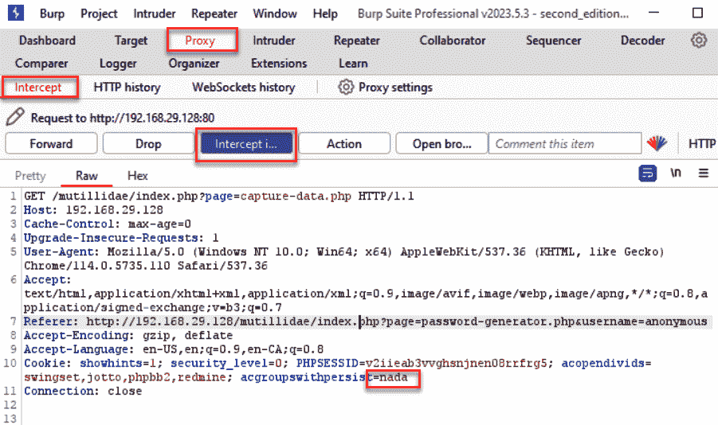
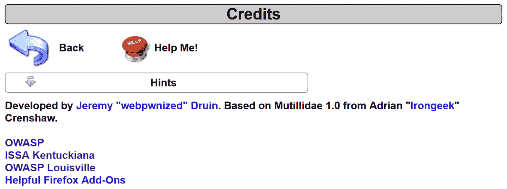

# 第九章：攻击客户端

客户端可用的代码会在浏览器中执行，因此需要进行测试，以确定是否存在敏感信息，或是否允许用户输入而没有服务器端验证。我们将学习如何使用 Burp Suite 执行这些测试。

本章将介绍以下配方：

+   测试点击劫持

+   测试基于 DOM 的跨站脚本攻击

+   利用 DOM Invader 测试 DOM XSS

+   测试 JavaScript 执行

+   测试 HTML 注入

+   测试客户端资源篡改

# 技术要求

要完成本章中的配方，您需要以下内容：

+   OWASP 异常 Web 应用程序

+   OWASP Mutillidae 链接

+   Burp Suite Proxy 社区版或专业版 ([`portswigger.net/BurpSuite/`](https://portswigger.net/BurpSuite/))

# 测试点击劫持

**点击劫持** 也称为 **UI 重定向攻击**。这是一种欺骗技术，它通过诱使用户与透明的 **iframe** 进行交互，从而可能将未经授权的命令或敏感信息发送到攻击者控制的网站。让我们看看如何使用 Burp Clickbandit 测试网站是否容易受到点击劫持攻击。

## 准备工作

我们将使用 OWASP Mutillidae II 应用程序和 Burp Clickbandit 来确定该应用程序是否能防御点击劫持攻击。

## 如何操作...

1.  导航到 OWASP Mutillidae II 的 **首页**。

1.  切换到 **Burp**，然后从顶层菜单中选择 **Burp Clickbandit**：


图 9.1 – Clickbandit 菜单项

1.  弹出框会解释该工具。点击 **复制 Clickbandit 到** **剪贴板** 按钮：


图 9.2 – 复制代码到剪贴板

1.  返回 Firefox 浏览器和 Mutillidae 的着陆页面。确保您没有登录到应用程序。按 *F12* 以打开开发者工具。从开发者工具菜单中选择 **控制台**，然后查看底部的提示：


图 9.3 – F12 开发者工具控制台提示

1.  在 **控制台** 提示框（例如 **>>**）中，粘贴您复制到剪贴板的 Clickbandit 脚本：


图 9.4 – 粘贴的 Clickbandit 代码

1.  粘贴脚本到提示框后，按下 *Enter* 键。您应该看到 Burp Clickbandit 的 **记录模式**。点击 **开始** 按钮开始：


图 9.5 – 启动 Clickbandit 记录模式

1.  在应用程序出现后开始点击。点击 Mutillidae 顶部菜单中的可用链接，点击侧边菜单中的可用链接，或浏览到 Mutillidae 内的页面。一旦您点击完毕，按下 Burp Clickbandit 菜单上的**完成**按钮。

1.  你应该注意到，Mutillidae 网页上方透明地出现了大红色方块。每个红色方块都表示可能出现恶意 **iframe** 的位置。


图 9.6 – 受害者网页框架

随意点击每个红色方块，你会看到下一个红色方块出现，依此类推，直到你看到信息 **你已经被点击劫持！**：


图 9.7 – 最终确认消息

1.  为了将结果保存到文件以便重放（提供给客户作为证据），点击 **保存** 按钮。这样会将点击劫持 **概念验证** (**PoC**) 保存在一个 HTML 文件中，你可以将其放入渗透测试报告中。

图 9.8 – 保存到文件

1.  点击 **重置** 按钮以返回到没有 Clickbandit 代码的正常应用程序：


图 9.9 – 点击重置按钮后

## 工作原理...

由于 Mutillidae 应用程序没有使用 **X-FRAME-OPTIONS** 头部设置为 **DENY**，因此有可能将恶意的 **iframe** 实例注入到 Mutillidae 网页中。这在钓鱼攻击中的登录页面尤为危险，攻击者诱使受害者将凭据输入到一个由攻击者控制的页面中。你可以增加 Clickbandit 使用的 **iframe** 实例的不透明度，以增强其可见性。你可以使用 Clickbandit 创建 PoC，展示漏洞如何被利用。通过将 **X-FRAME-OPTIONS** 头部设置为 **DENY** 或通过将 Content-Security-Policy 的 **frame-ancestors** 指令添加到白名单域中，可以保护应用程序免受点击劫持攻击。

# 测试基于 DOM 的跨站脚本

**文档对象模型** (**DOM**) 是所有 HTML 网页在浏览器中捕获的树状结构表示。开发者使用 DOM 来方便地在浏览器内存储信息。作为一名网页渗透测试员，确定是否存在基于 DOM 的 **跨站脚本** (**XSS**) 漏洞是非常重要的。

## 准备工作

我们将使用 OWASP Mutillidae II HTML5 网页存储练习来确定应用程序是否易受基于 DOM 的 XSS 攻击。

## 操作步骤...

1.  转到 **HTML 5** | **HTML5 网页存储** | **HTML5 存储**：


图 9.10 – HTML5 存储课程

1.  请注意通过 **HTML5 网页存储** 位置存储在 DOM 中的名称/值对。网页存储包括 **会话** 和 **本地** 变量。开发者使用这些存储位置方便地在用户的浏览器中存储信息：


图 9.11 – 网页存储条目

1.  切换到 Burp Suite 的 **Proxy** | **Intercept** 标签。点击**Intercept 是开启的**按钮来开启拦截：


图 9.12 – 开启拦截

1.  通过按 *F5* 或点击 *刷新* 按钮，在 Firefox 浏览器中重新加载 **HTML 5 Web Storage** 页面。

1.  切换到 Burp Suite 的 **Proxy** | **Intercept** 标签。找到刚才刷新所生成的暂停请求。注意**User-Agent** 字符串被高亮显示，如下截图所示：


图 9.13 – 注意原始的用户代理值

1.  用以下脚本替换前面高亮显示的**User-Agent**。注意有效载荷中的 XSS 注入（例如，**alert()**）：

    ```
    <script>try{var m = "";var l = window.localStorage; 
    var s = window.sessionStorage;for(i=0;i<l.length;i++)
    {var lKey = l.key(i);m += lKey + "=" + l.getItem(lKey) + 
    ";\n";};for(i=0;i<s.length;i++){var lKey = s.key(i);m += lKey 
    + "=" + s.getItem(lKey) + ";\n";};alert(m);}catch(e){alert(e.
    message);}</script>
    ```

下面是有效载荷在 **Proxy** 拦截器中被拦截时的请求内容：


图 9.14 – 将用户代理更改为有效载荷

1.  点击 **前进** 按钮。然后，通过点击切换按钮，将 **拦截** 关闭至 **拦截已关闭**。

1.  注意弹出的警告框，显示了 DOM 存储的内容：


图 9.15 – XSS 有效载荷执行的证据

## 它是如何工作的...

被注入的脚本演示了 XSS 漏洞与 DOM 中存储的敏感信息结合时，攻击者如何窃取敏感数据。将敏感数据存储在网页存储中的危险在于，如果应用程序中的任何地方都可能发生 XSS，那么敏感数据可能会被提取并通过恶意的 JavaScript 有效载荷发送给攻击者。

# 利用 DOM Invader 测试 DOM XSS

让我们使用 PortSwigger 集成浏览器和名为 DOM Invader 的插件，覆盖客户端的更多攻击面，探测潜在的 DOM XSS 和其他弱点。

## 准备工作

我们将使用相同的练习、HTML5 存储和 Burp Suite 的 DOM Invader，帮助我们判断网页上是否存在任何易受攻击的目标或源。

## 如何操作...

1.  使用 Burp Suite 浏览器，点击顶部的 *DOM Invader* 图标。


图 9.16 – Burp Suite 浏览器上的 DOM Invader 图标

1.  选择**DOM Invader**标签，确保设置了**DOM Invader 开启**。另外，注意分配的 canary 值。这个值是随机的，如果需要，你可以自定义这个值：


图 9.17 – DOM Invader 菜单

1.  在 Burp Suite 浏览器中，导航到**HTML 5 存储**页面：


图 9.18 – HTML 5 存储页面

1.  在 Burp Suite 浏览器中按 *F12* 键打开开发者工具控制台。将选项卡滚动到控制台的最末尾，并选择 **DOM Invader**。注意：DOM Invader 仅在 Burp Suite 浏览器中可用，因此如果你看不到这个标签，说明你使用的是错误的浏览器：


图 9.19 – F12 开发者工具中的 DOM Invader 标签

1.  使用 DOM Invader，点击 **Inject forms** 按钮。注意你的金丝雀值现在已填充到所有文本框和按钮标签中：


图 9.20 – DOM Invader 注入点中的金丝雀值

1.  现在，点击 **Add New** 按钮，注意现在显示的是金丝雀值而不是 **Add New**。这是网页上的唯一按钮。


图 9.21 – 注入后

1.  点击按钮后，请注意你从 DOM Invader 中获得了三个发现（漏洞），显示在顶部图标上：


图 9.22 – 带有三个发现的 DOM Invader 图标

这些信息显示在 **开发者工具** 控制台中，通过在 Burp Suite 浏览器中按 *F12* 键可以访问（你必须使用 Burp Suite 浏览器才能看到）。请寻找 **DOM** **Invader** 标签：


图 9.23 – DOM Invader 发现

DOM Invader 发现为我们提供了足够的线索，表明我们需要继续构造一个有效载荷来执行 JavaScript。DOM Invader 识别到的漏洞是 **element.innerHTML(1)**，这帮助我们了解利用 DOM XSS 漏洞的潜力非常高。

## 它是如何工作的...

该网页中 **innerHTML** 的存在是一个 DOM XSS HTML 漏洞。**innerHTML** 属性接收用户输入并立即在浏览器中呈现。使用该属性非常危险，大多数开发者通常会避免使用。

## 还有更多...

PortSwigger 在此提供了关于 DOM Invader 及其众多功能的背景信息：[`portswigger.net/burp/documentation/desktop/tools/dom-invader`](https://portswigger.net/burp/documentation/desktop/tools/dom-invader)。我们仅仅触及了 DOM Invader 在浏览器中可以执行的多种扫描功能。其他扫描功能包括 **postMessage** 攻击、DOM 覆写、原型污染等。

# 测试 JavaScript 执行

JavaScript 注入是 XSS 攻击的一个子类型，特指任意注入 JavaScript。此类漏洞可能影响浏览器中保存的敏感信息，如用户会话 cookies，或者导致页面内容的修改，使得攻击者控制的网站脚本得以执行。

## 准备开始

我们将使用 OWASP Mutillidae II **密码生成器** 练习，来确定该应用是否容易受到 JavaScript XSS 攻击。

## 如何操作...

1.  导航至 **OWASP 2013** | **A1 - 注入 (其他)** | **JavaScript 注入** | **密码生成器**：


图 9.24 – 密码生成器教程

1.  请注意，在点击 **生成密码** 按钮后，密码会显示出来。同时，还要注意，URL 中提供的用户名值会在网页上 *原样* 显示：**http://192.168.56.101/mutillidae/index.php?page=password-generator.php&username=anonymous**。这意味着该页面可能存在潜在的 XSS 漏洞：


图 9.25 – 生成新密码

1.  切换到 Burp Suite **代理** | **HTTP 历史** 标签，找到与 **密码生成器** 页面相关的 HTTP 消息。在消息编辑器中切换到 **响应** 标签，并对 **catch** 字符串进行搜索。注意，返回的 JavaScript 中包含一个 **catch** 块，错误信息会显示给用户。我们将利用这个位置进行精心设计的 JavaScript 注入攻击：


图 9.26 – 注入点的 Catch 块

1.  切换到 Burp Suite **代理** | **拦截** 标签。通过点击 **拦截已开启** 按钮开启 **拦截** 功能。

1.  在 Firefox 浏览器中通过按 *F5* 或点击 *重新加载* 按钮重新加载 **密码生成器** 页面。

1.  切换到 Burp Suite **代理** | **拦截** 标签。在请求暂停时，注意以下高亮显示的 **用户名** 参数值：


图 9.27 – 用户名参数

1.  将上述高亮的 **anonymous** 值替换为以下精心设计的 JavaScript 注入脚本：

    ```
    canary";}catch(e){}alert(1);try{a="
    ```

这是在 **代理** 拦截器中停留的请求中，负载的样子：


图 9.28 – 注入点

1.  点击 **转发** 按钮。现在，通过点击切换按钮关闭 **拦截** 功能，确保 **拦截已关闭**。

1.  注意弹出的警报。你已经成功演示了 JavaScript 注入 XSS 漏洞的存在！


图 9.29 – JavaScript 执行证据

## 工作原理...

注入到网页中的 JavaScript 代码与原始 **catch** 语句的结构匹配。通过创建一个伪造的 **canary** 名称，并以分号结束语句，创建了一个特别设计的 *新* **catch** 块，其中包含恶意的 JavaScript 负载。

# 测试 HTML 注入

HTML 注入是将任意 HTML 代码插入到易受攻击的网页中。这类漏洞可能导致敏感信息泄露或修改页面内容，用于社会工程学攻击。

## 准备工作

我们将使用 OWASP Mutillidae II 的**捕获数据页面**来确定应用程序是否易受 HTML 注入攻击。

## 如何操作...

1.  导航至**OWASP 2013** | **A1 - 注入（其他）** | **HTMLi 通过 Cookie 注入** | **捕获数据页面**：


图 9.30 – 捕获数据页面课程

1.  请注意攻击前页面的样子：


图 9.31 – 数据捕获页面

切换到 Burp Suite 的**代理** | **拦截**选项卡，并点击**拦截已开启**按钮，启用**拦截**。

1.  当请求暂停时，记下最后一个 Cookie 的值，**acgroupswitchpersist=nada**：



图 9.32 – 开启拦截

1.  当请求暂停时，将最后一个 Cookie 的值替换为此 HTML 注入脚本：

    ```
    <h1>Sorry, please login again</h1><br/>Username<input 
    type="text"><br/>Password<input type="text"><br/><input 
    type="submit" value="Submit"><h1>&nbsp;</h1>
    ```

这是在**代理**拦截器中暂停的请求中的负载样子：


图 9.33 – 更改 Cookie 值为负载

1.  点击**前进**按钮。现在，点击切换按钮关闭**拦截**，使**拦截已关闭**。

1.  请注意 HTML 现在已被包含在页面中！


图 9.34 – HTML 注入证据

## 工作原理...

由于缺乏输入验证和输出编码，可能存在 HTML 注入漏洞。利用此漏洞的结果是插入任意 HTML 代码，这可能导致 XSS 攻击或社会工程学攻击，如前面示例中所见。

# 测试客户端资源操控

如果应用程序基于客户端 URL 信息或资源路径（例如 AJAX 调用、外部 JavaScript 或**iframe**源）执行操作，结果可能会导致客户端资源操控漏洞。该漏洞涉及攻击者控制的 URL，例如 JavaScript 中的**location**属性、HTTP 响应中的位置头部，或者控制重定向的**POST**请求体参数。此漏洞的影响可能导致 XSS 攻击。

## 准备工作

我们将使用 OWASP Mutillidae II 应用程序来确定是否可以操控任何在客户端暴露的 URL 参数，以及这些值的操控是否会导致应用程序行为异常。

## 如何操作...

1.  导航至**OWASP 2013** | **A10 - 无效的重定向和转发** | **信用**：


图 9.35 – Credits 页面

1.  点击 **Credits** 页面上的 **ISSA Kentuckiana** 链接：



图 9.36 – 外部链接

1.  切换到 Burp Suite 的 **Proxy** | **HTTP history** 标签，找到你对 **Credits** 页面发出的请求。注意到有两个查询字符串参数：**page** 和 **forwardurl**。如果我们篡改用户被重定向的 URL，会发生什么情况？


图 9.37 – 调用外部链接

1.  切换到 Burp Suite 的 **Proxy** | **Intercept** 标签。点击 **Intercept** **on** 按钮以开启 **Intercept**。

1.  再次点击 **ISSA Kentuckiana** 链接。当请求暂停时，注意 **forwardurl** 参数的当前值：


图 9.38 – 更改原始值

1.  将 **forwardurl** 参数的值替换为 [`www.owasp.org`](https://www.owasp.org)，而不是原始选择的 [`www.issa-kentuckiana.org`](http://www.issa-kentuckiana.org)：


图 9.39 – 改变为攻击者控制的值

1.  点击 **Forward** 按钮。现在，通过点击切换按钮将 **Intercept** 关闭，状态变为 **Intercept is off**。注意我们被重定向到与最初点击的链接不同的站点！


图 9.40 – 重定向证据

## 它是如何工作的...

应用程序代码决策，例如重定向用户的地方，不应依赖客户端可用的值。这些值可能会被篡改，并修改为将用户重定向到攻击者控制的网站或执行攻击者控制的脚本。
