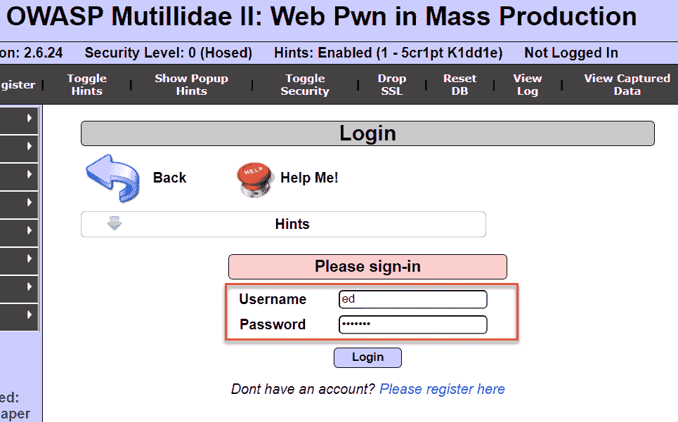
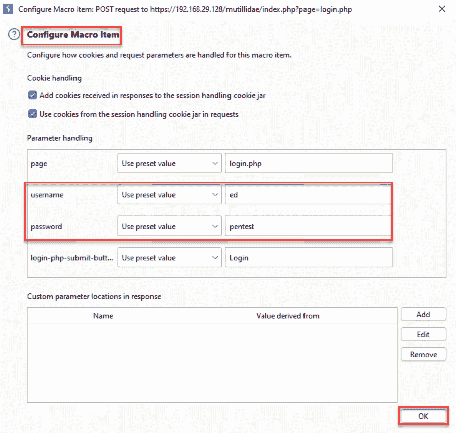
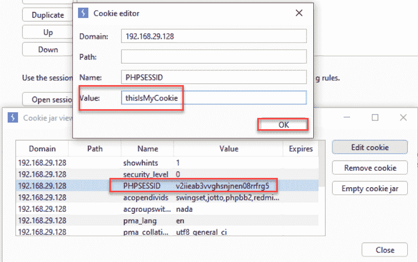
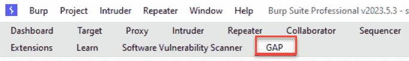
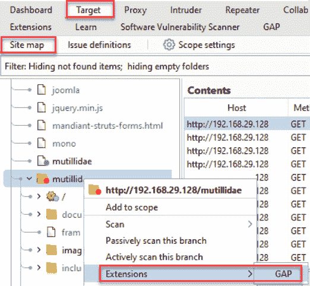

# 第十章：使用 Burp Suite 宏和扩展

本章涉及两个可以独立讨论的主题，或者也可以结合起来：宏和扩展。Burp Suite 宏使渗透测试人员能够自动化事件，例如登录或读取参数，以应对潜在的错误情况。扩展，也叫插件，扩展了 Burp 的核心功能。

在本章中，我们将讨论以下内容：

+   创建会话处理宏

+   陷入“饼干罐”问题

+   添加优秀的渗透测试插件

+   通过 **Add & Track Custom** **Issues** 扩展创建新的问题

+   使用 **Active** **Scan++** 扩展

+   使用 Burp Suite 扩展进行漏洞赏金测试

# 技术要求

为了完成本章中的操作，你需要以下内容：

+   OWASP **破损的 Web** **应用** (**BWA**)

+   OWASP Mutillidae (**http://<Your_VM_Assigned_IP_Address>/mutillidae**)

+   GetBoo (**http://<Your_VM_Assigned_IP_Address>/getboo**)

+   Burp Proxy 社区版或专业版 ([`portswigger.net/burp/`](https://portswigger.net/burp/))

# 创建会话处理宏

在 Burp Suite 中，**项目选项** 标签页允许测试人员设置会话处理规则。会话处理规则使测试人员能够指定一组与会话令牌或 **跨站请求伪造** (**CSRF**) 令牌相关的操作，而这些操作会在发送 HTTP 请求时执行。蜘蛛和扫描器有一个默认的会话处理规则。然而，在本例中，我们将创建一个新的会话处理规则，并使用宏帮助我们在使用 **Repeater** 时从未经身份验证的会话创建一个已验证的会话。

## 准备工作

使用 OWASP Mutillidae II 应用，我们将创建一个新的 Burp Suite 会话处理规则，并通过相关的宏，在使用 **Repeater** 时从未经身份验证的会话创建一个已验证的会话。

## 如何操作...

1.  进入 Mutillidae 的**登录**页面。使用用户名 **ed** 和密码 **pentest** 登录应用：

图 10.1 – 使用 ed/pentest 登录

1.  通过点击 **Logout** 按钮立即退出应用，并确保应用确认你已成功注销：

图 10.2 – 注销

1.  切换到 Burp Suite 的 **Proxy** | **HTTP history** 标签页。查找你刚才发送的注销请求，以及随后的未经身份验证的 **GET** 请求。选择未经身份验证的请求，也就是第二个 **GET** 请求。右键点击并将该请求发送到 **Repeater**，如下所示：

图 10.3 – 发送 GET 请求到 Repeater

1.  切换到 Burp Suite **重复器**，然后点击**发送**按钮。在响应的**渲染**标签页中，确保你收到**未登录**消息。我们将使用此场景构建一个会话处理规则，将未经身份验证的会话变成经过身份验证的会话，如下所示：

图 10.4 – 重复器

1.  点击 Burp Suite 右上角的**设置**齿轮图标：

图 10.5 – 全局设置齿轮图标

1.  然后，选择**会话**区域，点击**会话处理规则**部分下的**添加**按钮，如下所示：

图 10.6 – 添加新的会话处理规则

1.  点击**添加**按钮后，会出现一个弹出框。为你的新规则命名，如**LogInSessionRule**，在**规则动作**下，选择**运行宏**，如下所示：

图 10.7 – 规则名称和动作

1.  另一个弹出框出现了，这是**会话处理动作编辑器**对话框。在第一部分，点击**选择宏**下的**添加**按钮，如下所示：

图 10.8 – 添加新宏

1.  点击**添加**按钮后，宏编辑器会弹出，同时弹出另一个**宏录制器**窗口，如下所示：

图 10.9 – 宏录制器

1.  在**宏录制器**窗口中，找到你作为**ed**登录的**POST**请求，以及接下来的**GET**请求。在**宏录制器**窗口中高亮这两个请求，然后点击**确定**，如下所示：

图 10.10 – 选中的动作

1.  在之前的对话框中高亮的两个请求现在出现在**宏编辑器**窗口中。为宏提供描述，如**LogInMacro**，如下所示：

图 10.11 – 为你的宏命名

1.  点击**配置**项按钮：

图 10.12 – 配置你的宏

你需要验证**用户名**和**密码**的值是否正确。完成后，点击**确定**，如下所示：

图 10.13 – 登录参数设置

1.  点击**确定**关闭**宏编辑器**窗口。你应该能在**会话处理动作编辑器**窗口中看到新创建的宏。点击**确定**关闭此对话框，如下所示：

图 10.14 – 关闭会话处理动作编辑器窗口

1.  关闭**会话处理操作编辑器**窗口后，你将返回到**会话处理规则编辑器**窗口，此时你将看到**规则操作**部分已填充了你的宏名称。点击此窗口的**范围**标签，以定义哪个工具将使用此规则：

图 10.15 – 确定范围

1.  在**会话处理规则编辑器**窗口的**范围**标签页中，取消选中其他框，只保留**Repeater**框选中。在**URL 范围**下，点击**包含所有 URL**单选按钮。点击**确定**关闭此编辑器，如下所示：

图 10.16 – 设置范围

1.  现在你应该能够在**会话处理规则**窗口中看到新的会话处理规则，如下所示：

图 10.17 – 启用你的新规则

1.  返回到之前未登录应用程序的**Repeater**标签页。点击**发送**按钮，看到你现在已作为**ed**登录！这意味着你的会话处理规则和相关宏起作用了：

图 10.18 – 会话处理规则和相关宏的结果

## 它是如何工作的...

在这个示例中，我们看到如何通过重放登录过程将一个未经身份验证的会话转换为经过身份验证的会话。创建宏使得手动步骤可以被脚本化，并分配给 Burp Suite 中的各个工具。

Burp Suite 允许测试人员配置会话处理规则，以应对工具套件可能遇到的各种条件。规则提供了在满足这些条件时需要采取的额外操作。在这个示例中，我们通过创建一个新的会话处理规则（称为宏）来解决未经身份验证的会话问题。为了演示目的，我们将该规则的范围限制为**Repeater**。

# 被困在饼干罐里

在针对应用程序进行测试时，Burp Suite 在代理和爬行过程中会捕获所有的 cookies。Burp Suite 将这些 cookies 存储在一个名为**饼干罐**的缓存中。该饼干罐在默认的会话处理规则中使用，并且可以在 Burp Suite 的一系列工具中共享，如**Proxy**、**Intruder** 和**Repeater**。在饼干罐内部，有一个历史请求表，详细列出了每个 cookie 的域和路径。可以编辑或删除饼干罐中的 cookies。

## 准备开始

我们将打开 Burp Suite 的饼干罐并查看其中的内容。然后，使用 OWASP GetBoo 应用程序，我们将识别新添加到 Burp Suite 饼干罐中的 cookies。

## 如何操作...

1.  点击 Burp Suite 右上角的**设置**齿轮图标：

图 10.19 – 全局设置齿轮图标

然后，选择**Sessions**区域并进入**Cookie** **jar**部分：

图 10.20 – Cookie 罐

1.  在**Cookie 罐**部分，点击**打开 Cookie 罐**按钮，如下所示：

图 10.21 – 打开 Cookie 罐

1.  新的弹出框出现，显示在**Proxy**中捕获的所有 Cookie。注意，每个 Cookie 都有**Domain**、**Path**、**Name**和**Value**的详细信息：

图 10.22 – 每个 Cookie 的详细信息

1.  在列表中选择一个 Cookie，并点击**编辑 Cookie**按钮。例如，我们可以将**PHPSESSID** Cookie 的值从随机的加密字符串修改为**thisIsMyCookie**，然后点击**确定**，如下所示：

图 10.23 – 编辑 PHPSESSID Cookie 值

1.  现在值已更改，如下所示：

图 10.24 – 将 Cookie 设置为新值

1.  Burp Suite Cookie 罐的默认范围是**Proxy**。然而，您可以将范围扩展到包括其他工具。点击**Repeater**旁边的复选框，如下所示：

图 10.25 – 设置范围

1.  现在，如果您创建一个新的会话处理规则并使用默认的 Burp Suite Cookie 罐，您将看到该 Cookie 的新值在请求中被使用。我们可以通过启用我们的**LoginSessionRule**会话处理规则来观察其实际效果：

图 10.26 – 启用 LoginSessionRule

1.  现在，向**Repeater**发送未经身份验证的请求并点击**发送**。注意，您的 Cookie 值是**thisIsMyCookie**。这个技巧对于会话劫持攻击非常有用，当您窃取受害者的 Cookie 并需要确保 Cookie 值不会恢复为您的会话 Cookie 时：

图 10.27 – 规则和 Cookie 罐更改的结果

## 它是如何工作的...

Burp Suite Cookie 罐由会话处理规则用于处理 Cookie，当对目标应用程序执行自动化请求时。在这个实例中，我们研究了 Cookie 罐，了解了它的内容，甚至修改了一个捕获的 Cookie 的值。任何使用默认 Burp Suite Cookie 罐的后续会话处理规则都会在请求中看到修改后的值。

# 添加优秀的渗透测试插件

作为 Web 应用程序测试人员，你会发现一些有用的工具可以添加到你的工具库中，使得评估工作更加高效。Burp Suite 社区提供了许多出色的扩展。在本例中，我们将添加其中的几个，并解释它们如何提升评估效果。**Get All Params**（**GAP**）和 **Software Vulnerability Scanner** 是我们将添加到 Burp Suite 并与被动扫描器一起使用的两个插件。

注意

这两个插件都需要 Burp Suite 专业版。

## 准备工作

使用 OWASP Mutillidae II 应用程序，我们将添加两个有用的扩展，帮助我们在目标系统中发现更多漏洞。

## 操作步骤...

1.  第一个扩展，**GAP-Burp-Extension**，可以在以下 GitHub 仓库找到：[`github.com/xnl-h4ck3r/GAP-Burp-Extension`](https://github.com/xnl-h4ck3r/GAP-Burp-Extension)。在 Linux 上安装 Git 或在 Windows 上安装 Git（[`gitforwindows.org/`](https://gitforwindows.org/)）。然后，使用 **git clone** [`github.com/xnl-h4ck3r/GAP-Burp-Extension.git`](https://github.com/xnl-h4ck3r/GAP-Burp-Extension.git) 命令，将仓库下载到本地系统。

1.  下载完仓库后，进入 **GAP-Burp-Extension** 目录。记下 **GAP.py** 文件的位置。这个文件将加载到 Burp Suite 中以使用扩展：

图 10.28 – 运行 GAP 的 Python 脚本

1.  请注意，在使用 GAP 扩展之前，必须先安装 Jython。要安装 Jython，请前往 **扩展** | **扩展设置** 图标并点击该图标：

图 10.29 – 扩展设置

1.  前往 Jython 网站 ([`www.jython.org/`](https://www.jython.org/)) 并下载独立版 Jython JAR 文件：

图 10.30 – 下载 Jython

1.  在 **Python** **环境** 部分设置独立版 Jython JAR 文件的位置：

图 10.31 – 配置 Jython

1.  配置完成后，通过点击窗口右上角的 **X** 标志关闭 **扩展设置** 弹出窗口：

图 10.32 – 关闭设置

配置完成后，前往 **Burp Suite** | **扩展** 标签，选择 **已安装** 标签。点击 **添加** 并将 **扩展类型** 的值更改为 **Python**。浏览到本地系统中 **GAP-Burp-Extension** 目录内的 **GAP.py** 文件所在位置。你可能还需要执行一个 Python **pip** 命令，在本地系统中安装 GAP 的依赖，命令如下：**java -jar jython-standalone-2.7.3.jar -m pip install -r requirements.txt**（来源：[`github.com/xnl-h4ck3r/GAP-Burp-Extension`](https://github.com/xnl-h4ck3r/GAP-Burp-Extension)）：

图 10.33 – 安装扩展

1.  确保扩展已启用，方法是查看 Burp Suite 的**Extensions**区域中其名称旁边的复选框是否已勾选：

图 10.34 – 启用扩展

1.  扩展加载并启用后，请注意，在 Burp Suite 工具菜单的顶部有一个新的**GAP**标签：

图 10.35 – 新的 GAP 标签

1.  让我们在 Mutillidae 目标上运行 GAP。进入**Target** | **Site map**，右键单击应用程序的根目录，然后选择**Extensions** | **GAP**：

图 10.36 – 对目标调用 GAP 扩展

1.  现在，选择 Burp Suite 工具顶部的**GAP**标签。注意 GAP 找到的潜在参数列表。我们的**ToolID**标识符出现在其中，正是我们之前用于利用的标识符！另外，注意到 GAP 为您找到的所有链接。这些是您可以用来拓宽漏洞寻找范围的新攻击向量：

图 10.37 – 使用 GAP 找到的结果

1.  对于第二个扩展，切换到 Burp Suite 的**Extensions**标签。进入**BApp Store**子标签，找到**Software Vulnerability** **Scanner**插件：

图 10.38 – 软件漏洞扫描器扩展

1.  点击右侧的**Install**按钮并选择扩展名称：

图 10.39 – 安装按钮

1.  安装完两个插件后，进入**Extensions**标签，然后是**Burp Suite extensions**部分。确保两个插件都已启用，并且复选框内有勾选标记。还可以注意到**Software Vulnerability Scanner**扩展有一个新标签，如下所示：

图 10.40 – 新标签

1.  进入**Software Vulnerability Scanner**标签，注意默认扫描规则以及提供**API Token**类型以加速扫描速度的选项：

图 10.41 – 软件漏洞扫描器标签内部

1.  返回到**Target** | **Site map**，将 Mutillidae 主页作为我们的目标。通过右键点击并选择**Passively scan this branch**，进行轻量级、低侵入性的被动扫描，如下所示：

图 10.42 – 扫描目标

1.  请注意**Software Vulnerability Scanner**产生的额外发现。**Vulners**插件发现了许多漏洞软件问题：

图 10.43 – 寻找扩展发现

查看第一个发现的详细信息，注意提供的与已知漏洞相关的各种链接：

图 10.44 – 显示可用漏洞的公告

## 工作原理...

Burp Suite 的功能可以通过 PortSwigger API 扩展，创建自定义扩展，也称为插件。在这个例子中，我们安装了两个插件，帮助识别包含已知漏洞的应用程序中的旧版本软件。

# 通过添加与跟踪自定义问题扩展创建新问题

尽管 Burp Suite 提供了许多常见的 Web 应用程序安全漏洞的列表，但有时你会发现一个问题并需要创建一个自定义扫描发现。这可以通过 **添加与跟踪自定义问题** 扩展完成。

注意

此插件需要 Burp Suite Professional 版。

## 准备就绪

使用 OWASP Mutillidae II 应用程序，我们将添加 **添加与跟踪自定义问题** 扩展，创建揭示漏洞的步骤，然后使用该扩展创建一个自定义问题。

## 如何操作...

1.  切换到 Burp Suite **扩展** 标签页。进入 **BApp Store** 子标签，找到标记为 **添加与跟踪自定义问题** 的插件。点击 **安装** 按钮：

图 10.45 – 添加与跟踪自定义问题扩展

1.  确保扩展已加载并启用，在 **扩展** | **已安装** | **Burp** **扩展** 部分：

图 10.46 – 加载扩展

1.  返回 Firefox 浏览器并浏览到 Mutillidae 的主页。

1.  切换到 Burp Suite **代理** | **HTTP 历史记录** 标签页，找到你刚才浏览到主页时发出的请求。点击 **响应** 标签。注意查看冗长的 **服务器** 头信息，指出了 web 服务器类型和版本，以及使用的操作系统和编程语言。这些信息可以被攻击者用来指纹识别技术栈，并识别可被利用的漏洞：

图 10.47 – 创建问题

1.  由于这是一个漏洞，我们需要手动创建一个新问题来捕获它并用于报告。在查看 **响应** 窗口时，右键点击并选择 **扩展** | **添加与跟踪自定义问题** | **添加与跟踪自定义问题**，如以下所示：

图 10.48 – 创建自定义问题

1.  将弹出对话框。在 **New Issue** 选项卡中，我们可以创建一个名为 **Information Leakage in Server Response** 的新问题名称。将严重性更改为 **Medium**。请注意，扩展已经为我们复制了请求和响应在底部面板中。您可以继续在其他文本区域添加更多文字，比如问题详细信息、背景和修复方法。完成后，请点击底部的 **Add & Track Custom Issue** 按钮：

图 10.49 – 设置名称和严重性

1.  完成后，切换回 **Target** | **Site map**，并选择 Mutillidae 的根目录。你应该能在 **Issues** 窗口中看到新创建的扫描问题，如下所示：

图 10.50 – 查看您添加的自定义问题

1.  **Add & Track Custom Issues** 扩展提供了一个新选项卡，允许您向内部数据库添加问题。这是一个增值功能，因此不需要在此选项卡中添加问题即可使用该工具。但是，如果您希望创建自己的自定义问题列表，则可选择此选项：

图 10.51 – 问题数据库

## 工作原理...

如果 Burp Suite 核心问题列表中没有某个问题，测试人员可以使用 **Add & Track Custom Issues** 扩展自行创建。在这个示例中，我们为服务器响应中的信息泄露创建了一个问题。

## 参见

想要查看 Burp 识别的所有问题定义清单，请访问 [`portswigger.net/kb/issues`](https://portswigger.net/kb/issues)。

# 使用 Active Scan++ 扩展

一些扩展能帮助发现带有特定有效载荷（如 XML）的漏洞，或帮助找到隐藏的问题，比如缓存污染和 DNS 重绑定。在这个示例中，我们将添加一个名为 **Active Scan++** 的主动扫描器扩展，它能帮助识别这些更专业的漏洞。

注意

此插件需要 Burp Suite 专业版。

## 准备工作

使用 OWASP Mutillidae II 应用程序，我们将添加 **Active Scan++** 扩展，并对目标进行主动扫描。

## 如何操作...

1.  切换到 Burp Suite 的 **Extensions** | **BApp Store** 选项卡，并选择 **Active Scan++** 扩展。点击 **Install** 按钮安装该扩展，如下所示：

图 10.52 – Active Scan++ 扩展

1.  返回 Firefox 浏览器，并浏览至 Mutillidae 主页。

1.  切换到 Burp Suite 的 **Target** 选项卡，然后选择 **Site map** 子选项卡，在 **mutillidae** 文件夹上右键单击，并选择 **Actively scan this branch**，如下所示：

图 10.53 – 扫描目标

1.  在主动扫描器完成后，浏览到**问题**窗口。记录新安装的扩展发现的任何额外问题。你可以通过查找**此问题由 Burp 扩展生成：Active Scan++**消息来分辨哪些问题是该扩展发现的，如下所示：

图 10.54 – 扩展中的问题

## 工作原理...

Burp Suite 的功能可以通过使用扩展来扩展，超越核心功能。在本教程中，我们安装了一个插件，将主动扫描器功能扩展，以帮助识别额外的问题，例如本教程中看到的任意头部注入。

# 使用 Burp Suite 扩展进行漏洞赏金猎取

作为漏洞赏金猎人，你将找到一些便捷的工具，帮助更轻松地识别可能的漏洞。虽然有很多工具，但在本教程中，我们将重点介绍**Burp Bounty, Scan Check Builder**和**Auth Analyzer**。

注意

**Burp Bounty, Scan Check Builder**需要使用 Burp Suite 专业版。

## 准备工作

针对漏洞赏金猎取，推荐的两个扩展可以在**BApp Store**子标签中找到。我们将在 Burp Suite 实例中下载并安装它们。接着，我们将演示如何使用每个扩展来发现可能的漏洞，以便获取赏金！

## 如何操作...

1.  在 Burp Suite 的**扩展** | **BApp Store**标签中，选择**Burp Bounty, Scan Check Builder**并点击**安装**按钮。然后，选择**Auth Analyzer**并点击**安装**按钮：

图 10.55 – 本教程中涉及的两个扩展

1.  切换到**扩展** | **已安装**标签，确保两个扩展都已安装并启用，在**Burp** **扩展**部分中：

图 10.56 – 扩展已安装并启用

1.  注意，现有一个名为**Burp Bounty Free**的新工具标签。点击该标签，然后点击**配置文件**子标签。可以看到有多个配置文件可供选择，适用于不同类型的扫描器以及请求和响应。现在，我们将使用默认设置：

图 10.57 – Burp Bounty 免费标签

1.  返回**目标** | **站点地图**，右键点击，选择**主动扫描此分支**。**Burp Bounty**将使用主动扫描和被动扫描（除非你暂停了它们）来寻找潜在的漏洞：

图 10.58 – 扫描目标

1.  在**问题**面板中，查看每个扩展找到的漏洞前是否有**BurpBounty**关键词。该扩展提供了多个区域，供你深入挖掘潜在的弱点：

图 10.59 – 扫描结果

1.  现在，让我们关注 **Auth Analyzer** 扩展。**Auth Analyzer** 帮助发现未授权的 API 端点，以及水平和垂直权限提升。注意，有一个新的工具标签，标注为 **Auth Analyzer**：

图 10.60 – Auth Analyzer 标签

1.  返回 Mutillidae 登录页面，并以 **admin** 身份登录，密码为 **admin**。找到你的登录 **POST** 请求，右键点击，然后选择 **扩展** | **Auth Analyzer** | **自动设置参数** | **创建** **新会话**：

图 10.61 – 向 Auth Analyzer 发送管理员请求

1.  现在，注销 **admin** 用户。使用 **ed** 身份和密码 **pentest** 登录应用程序。右键点击第二次登录的 **POST** 请求，然后选择 **扩展** | **Auth Analyzer** | **重复** **请求 (1)**：

图 10.62 – 向 Auth Analyzer 发送常规用户请求

1.  切换到 **Auth Analyzer** 标签，启用分析器。你应该看到一个绿色圆点而不是红色圆点，并且会显示 **分析器** **运行中** 标签：

图 10.63 – 启用 Auth Analyzer

1.  启用 **Auth Analyzer** 后，注意到两个登录之间的 **差异** 被确定了。点击 **显示差异** 按钮，系统将为你高亮显示差异，以便你更容易查看：

图 10.64 – 查看请求之间的差异

1.  你可以使用此扩展先以更高权限的用户身份登录。然后，映射应用程序的功能。完成映射后，点击 **注销** 按钮。然后，再次登录，但这次以常规用户身份登录，执行映射，并使用 **Auth Analyzer** 来识别应用程序中任何常规用户可以访问的管理员功能区域。

1.  此外，**Auth Analyzer** 还可以用于移除请求中的 cookies 和访问令牌。这将使你能够更快速地测试未授权的 API 端点。向 **Auth Analyzer** 发送测试请求后，识别你希望移除的 cookie：

图 10.65 – 移除 cookie 功能

1.  然后，向网页或 API 端点发送请求，查看 **Auth Analyzer** 是否显示在移除 cookie 后有任何差异。以下是移除 **PHPSESSID** cookie 后的示例。注意，第二次请求中没有 cookie。当使用此功能时，你可以快速判断该功能是否正确使用了授权检查，或者是否存在 bug：

图 10.66 – 看出两个请求之间的差异

## 它是如何工作的…

为漏洞奖励寻找漏洞可能会耗费时间。**Burp Bounty, Scan Check Builder** 和 **Auth Analyzer** 扩展都可以帮助加速发现目标应用程序中的漏洞。
