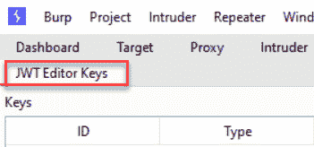
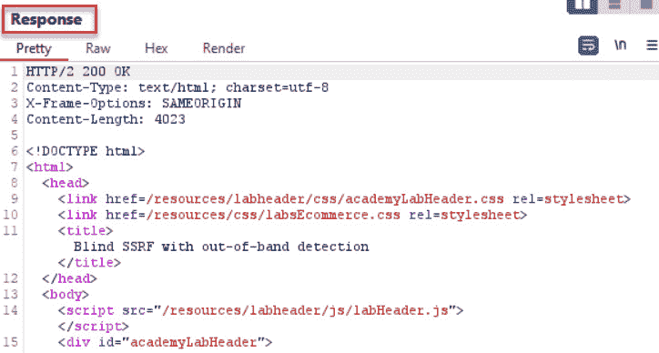
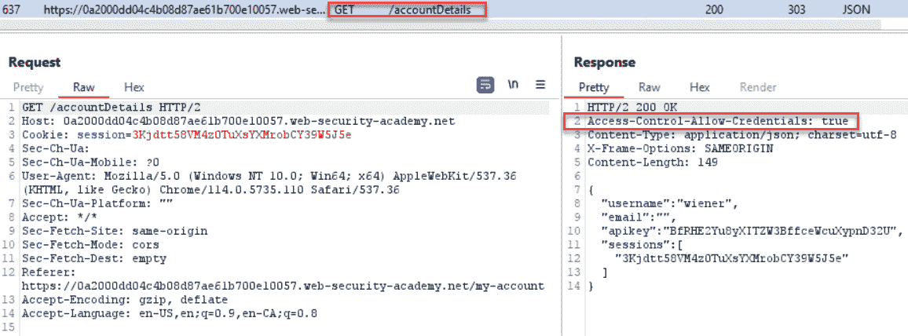
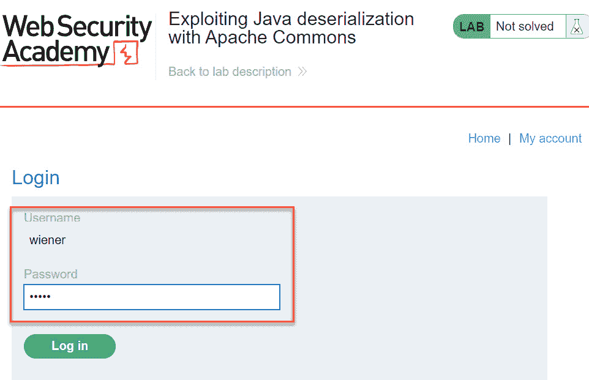

# 第十一章：实现高级话题攻击

本章涵盖了中高级话题，如 **XML 外部实体**（**XXE**）注入，**JSON Web Token**（**JWT**）攻击，**服务器端请求伪造**（**SSRF**），**跨源资源共享**（**CORS**）问题，以及 **Java 反序列化攻击**，同时还包括如何在 Burp Suite 中测试 GraphQL。我们将学习如何使用 Burp Suite 及其扩展来简化这些测试。

本章将介绍以下实验：

+   执行 XXE 攻击

+   处理 JWT

+   使用 Burp Suite Collaborator 确定 SSRF

+   测试 CORS

+   执行 Java 反序列化攻击

+   使用 Burp Suite 破解 GraphQL

# 技术要求

完成本章的实验，你需要以下内容：

+   一个 PortSwigger 账户（`portswigger.net/`）

+   PortSwigger Web Security Academy Labs (https://portswigger.net/web-security/all-labs) 访问，需要一个 PortSwigger 账户

+   Burp Suite 代理社区版或专业版（`portswigger.net/burp/`）

# 执行 XXE 攻击

XXE 是一种针对解析 XML 的应用程序的漏洞。攻击者可以通过任意命令操控 XML 输入，并将这些命令作为外部实体引用嵌入 XML 结构中。然后，XML 会被一个配置不当的解析器执行，从而让攻击者获得所请求的资源。

## 准备工作

登录到你的 PortSwigger 账户。我们将使用一个 PortSwigger 实验室 – *实验室：利用外部实体进行 XXE 攻击以检索文件*（`portswigger.net/web-security/xxe/lab-exploiting-xxe-to-retrieve-files`）– 来利用我们目标应用中的 XML 解析器漏洞。

## 如何进行...

1.  登录，进入 *实验室：利用外部实体进行 XXE 攻击以检索文件*，点击 **访问实验室** 按钮开始实例。


图 11.1 – 实验课

1.  加载实验室实例后，使用 Burp Suite 浏览器捕获你的流量。点击站点上的内容，并通过点击 **查看** **详情** 按钮查看某个产品的详情。


图 11.2 – 查看详情按钮

1.  在后续的详情页面中，点击描述下方的 **检查** **库存** 按钮。


图 11.3 – 检查库存按钮

1.  切换到 Burp Suite **代理** | **HTTP 历史** 标签，查找你刚刚提交的 **POST** 请求，右键点击并将请求发送到 **Repeater**：


图 11.4 – 发送到 Repeater

1.  在 **Repeater** 中，在 XML 声明和根元素 **stockCheck** 之间添加 **DOCTYPE** 声明：

    ```
    <!DOCTYPE test [ <!ENTITY xxe SYSTEM "file:///etc/passwd"> ]>
    ```

同时，将 **productId** 元素中的数字替换为 **&xxe;**：


图 11.5 – XXE 注入点

1.  点击 **发送** 按钮。请注意，响应会检索并显示本地 **/etc/passwd** 文件的内容：


图 11.6 – 攻击结果

## 工作原理...

在本食谱中，不安全的 XML 解析器接收到包含服务器上 **/etc/passwd** 文件的 XML 请求。由于解析器配置较弱，未对 XML 请求进行验证，因此攻击者可以自由访问该资源。

# 使用 JWT

随着越来越多的网站提供客户端 API 访问，JWT（JSON Web Token）已广泛用于身份验证。这些令牌包含与用户在目标网站上被授予访问权限的资源相关联的身份和声明信息。Web 渗透测试人员需要读取这些令牌并评估它们的安全性。幸运的是，Burp Suite 提供了一些便捷的插件，使得处理 JWT 变得更加容易。在本食谱中，我们将学习如何使用这些插件。

## 准备工作

登录到您的 PortSwigger 账户。我们将使用 *Lab: JWT 身份验证绕过通过签名验证漏洞*（[`portswigger.net/web-security/jwt/lab-jwt-authentication-bypass-via-flawed-signature-verification`](https://portswigger.net/web-security/jwt/lab-jwt-authentication-bypass-via-flawed-signature-verification)）和 **JWT Editor** 扩展来利用我们目标应用中的签名漏洞。

## 如何操作...

1.  切换到 Burp Suite **Extensions** | **BApp Store** 并安装 **JWT** **Editor** 插件：


图 11.7 – JWT Editor 扩展

1.  安装扩展后，您会看到一个新的标签页，标题为 **JWT** **Editor Keys**：



图 11.8 – 新标签

1.  进入 *Lab: JWT 身份验证绕过通过未验证的签名*，然后点击 **访问实验室** 按钮开始您的实例：


图 11.9 – 实验课程

1.  加载实验室实例后，进入 **Proxy** | **Intercept** | **Open browser** 使用 Burp Suite 浏览器来捕获您的流量。


图 11.10 – 打开 Burp Suite 浏览器

1.  使用提供的凭据登录应用程序：**wiener**/**peter**。


图 11.11 – 使用提供的凭据登录

1.  切换到 Burp Suite **Proxy** | **HTTP 历史** 标签页。找到带有 URL **/my-account** 的 **GET** 请求。右键点击并选择 **发送到** **Repeater** 选项。


图 11.12 – 发送到 Repeater

1.  切换到 **Repeater** 标签页，您会看到一个新标签，标题为 **JSON** **Web Token**：


图 11.13 – Repeater 中的扩展功能

1.  点击 **JSON Web Token** 选项卡，显示一个与 `jwt.io` 非常相似的调试工具。此插件允许你读取声明内容并操控加密算法进行各种暴力破解测试。在此攻击中，我们将移除令牌中的签名并发送 JWT，以查看应用程序是接受还是拒绝请求。

要执行此攻击，点击**攻击**按钮并选择**“none”** **签名算法**。


图 11.14 – 无算法攻击

1.  注意 **签名** 文本框现在是空白的，签名在最后一个点后丢失，头部中的 **alg** 被设置为 **none**：


图 11.15 – 签名已被移除

1.  在 **Payload** 文本框中，将 **wiener** 改为 **administrator**：


图 11.16 – 提升主题至管理员

1.  切换到 **Raw** 选项卡并点击 **发送** 按钮，将请求发送到应用程序。注意，应用程序接受请求，你已成功登录管理员账户。


图 11.17 – 攻击证据

1.  将 **GET** 请求从 **/my-account** 更改为 **/admin/delete?username=carlos** 来解决谜题：


图 11.18 – 最终攻击以解决问题

1.  发送请求并在浏览器中查看祝贺横幅：


图 11.19 – 祝贺横幅

## 它是如何工作的...

**JWT 编辑器** 扩展帮助测试人员以更方便的方式处理 JWT 令牌，通过在 Burp Suite UI 中提供调试工具。请查看 PortSwigger Web 安全学院中的其他 JWT 实验，以获得更多使用此扩展的经验。

# 使用 Burp Suite Collaborator 确定 SSRF

SSRF 是一种漏洞，允许攻击者强制应用程序代表攻击者发出未经授权的请求。这些请求可以像 DNS 查询那样简单，或者像从攻击者控制的服务器发出的命令那样疯狂。

在本教程中，我们将使用 Burp Suite Collaborator 检查可用于 SSRF 请求的开放端口，然后我们将使用 Burp Intruder 来确定应用程序是否会通过 SSRF 漏洞向公共 Burp Suite Collaborator 服务器执行 DNS 查询。

## 准备工作

登录到你的 PortSwigger 账户。使用 PortSwigger *实验：盲 SSRF 与离带检测* (`portswigger.net/web-security/ssrf/blind/lab-out-of-band-detection`)，我们将看到如何使用 Burp Suite Collaborator 来识别我们目标应用中的 SSRF 漏洞。

## 如何执行...

1.  切换到 Burp Suite 的 **Collaborator** 标签。点击 **Get** **started** 按钮：


图 11.20 – 启动 Collaborator

1.  注意，现在你可以将 **Collaborator** 有效负载复制到剪贴板，并且会出现一个表格，显示任何捕获到的调用。


图 11.21 – 协作者表格

1.  登录，进入 *Lab: Blind SSRF with out-of-band detection*，然后通过点击 **Access** **the lab** 来启动实例：


图 11.22 – 实验课程

1.  加载完实验室实例后，使用 Burp Suite 浏览器捕获你的流量。点击站点上的各个地方。

1.  切换到 **Proxy** | **HTTP history** 标签，找到你在实例中发出的任何包含 **Referer** 头的请求。右键点击并将该请求发送到 **Repeater**：


图 11.23 – 发送到 Repeater

1.  在 **Repeater** 中，突出显示 **Referer** 头的值，保留 **https://** 协议。右键点击并选择 **Insert Collaborator payload**。此操作将用协作者实例替换 **Referer** 的当前值。


图 11.24 – 插入 Collaborator 有效负载

子域名是随机生成的，因此你的协作者值会与以下截图中显示的不同。


图 11.25 – Referer 头

1.  在 **Repeater** 中，点击 **Send** 按钮。响应看起来是正常的。由于这是盲 SSRF，我们需要查看是否有后端系统向我们的 **Collaborator** 服务器实例发出了请求。



图 11.26 – 响应

1.  切换到 Burp Suite 的 **Collaborator** 客户端，点击 **Poll now** 按钮，查看是否有 SSRF 攻击成功。如果有任何请求泄露到网络外部，这些请求将出现在这个表格中，并显示使用的特定协议。如果表格中出现了任何请求，你需要将该 SSRF 漏洞作为发现报告。正如这里所显示的结果，应用程序代表攻击者提供的有效负载发出了多个 DNS 查询。这意味着显示的源 IP 地址是目标应用程序后端的服务器。


图 11.27 – 投票显示交互

1.  注意浏览器中的祝贺横幅。


图 11.28 – 祝贺横幅

## 它是如何工作的...

网络泄漏和过于宽松的应用程序参数可能允许攻击者通过各种协议代表攻击者进行未经授权的调用。在本教程中，应用程序允许 DNS 查询泄漏到本地机器外部，并连接到互联网。

## 另见

关于 SSRF 攻击的更多信息，请查看 PortSwigger 博客中的文章：`portswigger.net/blog/cracking-the-lens-targeting-https-hidden-attack-surface`。

# 测试 CORS

实现 HTML5 **跨源资源共享**（**CORS**）的应用程序意味着该应用程序将与位于不同源的其他域共享浏览器信息。根据设计，浏览器保护措施防止外部脚本访问浏览器中的信息。这种保护被称为 **同源策略**（**SOP**）。然而，CORS 是绕过 SOP 的一种宽松方式。如果应用程序想要与完全不同的域共享浏览器信息，它可以通过正确配置 CORS 头来实现。

Web 渗透测试人员必须确保处理 AJAX 调用的应用程序（例如 HTML5）没有配置错误的 CORS 头。让我们看看 Burp Suite 如何帮助我们识别这些配置错误。

## 准备工作

登录到你的 PortSwigger 账户。使用 *Lab: CORS 漏洞与基本的源反射*（`portswigger.net/web-security/cors/lab-basic-origin-reflection-attack`），我们将看到如何在目标应用程序中识别 CORS 漏洞。

## 如何操作...

1.  进入 *Lab: CORS 漏洞与基本的源反射*，点击 **访问实验** 按钮来启动你的实例。


图 11.29 – 实验课

1.  在加载完实验环境实例后，使用 Burp Suite 浏览器来捕获你的流量。使用提供的凭证登录应用程序：**wiener**/**peter**。


图 11.30 – 点击“我的账户”链接

使用提供的凭证登录应用程序。


图 11.31 – 使用提供的凭证登录

1.  切换到 Burp Suite **Proxy** | **HTTP 历史记录** 标签页，查找登录后发出的 **GET** **/accountDetails** 请求。注意响应中有一个与 CORS 相关的头部，允许共享客户端秘密。



图 11.32 – 响应中的 CORS 头

将请求发送到 **Repeater**：


图 11.33 – 发送到 Repeater

1.  通过向来自**https://example.com**位置的请求添加 **Origin** 头，来进行跨源调用：

    ```
    Origin: https://example.com
    ```

以下是截图所示：


图 11.34 – 添加 Origin 头部和站点值

1.  在**Repeater**中，点击**Send**并注意到一个新的与 CORS 相关的头部出现在**Response**中。现在**Response**中有两个 CORS 头部，并且**Origin**的值反映在**Access-Control-Allow-Origin**中，允许信息共享：


图 11.35 – 查看响应中反射的内容

1.  点击**Go to exploit** **server**按钮：


图 11.36 – 前往漏洞服务器

1.  我们需要创建一个**概念验证**（**PoC**），展示如何利用这个 CORS 漏洞来显示其影响。从 PoC 的**Body**部分移除**Hello, world!**消息：


图 11.37 – PoC 的 Body 部分在漏洞服务器中

1.  将**Body**文本区域替换为以下有效载荷，并将**<YOUR-LAB-ID>**替换为你的实验室实例的值，并在前面加上**https://**：


图 11.38 – 替换为你的实验室 ID

1.  点击**Store**，然后点击底部的**Deliver to Victim**：


图 11.39 – 存储并交付给受害者的按钮

1.  点击**Access log**以检索受害者的 API 密钥：


图 11.40 – 点击访问日志按钮

1.  浏览日志，直到找到一个不同的 IP 地址和你受害者的 API 密钥。


图 11.41 – 查看受害者 API 密钥的访问日志

1.  将窃取的 API 密钥的值放入**Submit solution**框中：


图 11.42 – 点击提交解决方案按钮

1.  请注意，你的值与此处显示的不同。


图 11.43 – 提交 API 密钥作为解决方案

1.  注意浏览器中的恭喜横幅。


图 11.44 – 恭喜横幅

## 它是如何工作的...

在 AJAX 请求中，大多数情况下需要调用一个不在同一域名中的外部 URL。为了允许外部域接收来自用户浏览器会话的 DOM 信息，必须存在 CORS 头部，包括**Access-Control-Allow-Origin: <跨域的名称>**。

## 另见

有关 CORS 头部配置错误的更多信息，请参见此 PortSwigger 博客文章：`portswigger.net/blog/exploiting-cors-misconfigurations-for-bitcoins-and-bounties`。

# 执行 Java 反序列化攻击

**序列化** 是多种编程语言提供的一种机制，它允许将对象的状态保存为二进制格式。它用于提高速度和混淆。当对象从二进制格式转换回对象时，称为反序列化。如果用户输入的数据用于对象内，并且该对象之后被序列化，则可能会创建一个攻击向量，导致任意代码注入和潜在的远程代码执行。我们将研究一个 Burp Suite 扩展，它可以帮助 Web 渗透测试人员评估应用程序中的 Java 反序列化漏洞。

## 准备就绪

登录到您的 PortSwigger 账户。使用 *实验室：利用 Apache Commons 进行 Java 反序列化*（`portswigger.net/web-security/deserialization/exploiting/lab-deserialization-exploiting-java-deserialization-with-apache-commons`）和手工制作的序列化代码片段，我们将演示如何使用 **Java 反序列化扫描器** 来协助进行 Java 反序列化攻击。

您需要使用旧版 Java，如 JDK 7，并结合第三方 JAR 文件 **ysoserial** 来完成此操作。

这是 Java SE 7 的档案下载地址：`www.oracle.com/java/technologies/javase/javase7-archive-downloads.html`：

1.  选择适合您环境的下载。例如，对于 Windows x64，您需要下载 **jdk-7u80-windows-x64.exe** 文件。

1.  下载后，双击并按照提示进行安装。

注意

完成该操作后，请从您的系统中卸载此版本的 Java，因为它是一个非常不安全的版本。

1.  记住 JDK 7 在本地系统中的位置。

这是 **ysoserial** JAR 文件下载地址： https://github.com/frohoff/ysoserial/releases/tag/v0.0.6：

1.  选择 **ysoserial-all.jar** 文件进行下载。

1.  记住 **ysoserial-all.jar** 文件在本地系统中的位置。

## 如何操作...

1.  切换到 Burp Suite **扩展** | **BApp 商店** 并安装 **Java 反序列化** **扫描器** 插件：


图 11.45 – 添加 Java 反序列化扫描器扩展

1.  转到 *实验室：利用 Apache Commons 进行 Java 反序列化*，并点击 **访问实验室** 按钮以启动您的实例：


图 11.46 – 实验室课程

1.  加载完实验室实例后，使用 Burp Suite 浏览器捕获您的流量。使用凭证 **wiener**/**peter** 登录应用程序。


图 11.47 – 点击我的账户以登录

使用提供的凭证登录应用程序。



图 11.48 – 使用提供的凭证登录

1.  切换到 Burp Suite 的**代理**|**HTTP 历史记录**标签，寻找登录后的请求。注意会话 cookie 使用的是 Java 序列化。


图 11.49 – 注意序列化的 cookie 值

1.  右键点击，选择**扩展**并将请求发送到**Java 反序列化扫描器**|**发送请求到 DS – 手动**测试**标签。


图 11.50 – 发送请求到扩展

1.  注意，一个新的标签**反序列化扫描器**已可用，且我们的请求出现在**手动测试**标签中。突出显示序列化值并点击**设置插入点**按钮。注意，序列化值周围的替换标记看起来像美元符号。


图 11.51 – 设置插入点

设置插入点后，查看底部面板，将**使用 Base64 编码**选项从左下角面板移动到右侧面板，方法是点击**添加**按钮。另外，将**使用 URL 编码**选项从左侧面板添加到右侧面板。


图 11.52 – 添加 Base64 编码和 URL 编码

1.  右键点击并选择**发送到**利用标签，将请求发送到**利用**标签：


图 11.53 – 发送请求到利用标签

1.  为了让扩展正常工作，我们需要在**配置**标签中配置 Java 和**ysoserial** JAR 文件的路径（注意，路径值会因你的本地系统而有所不同）：


图 11.54 – 配置 Java 和 ysoserial 在反序列化扫描器扩展中的设置

1.  切换到**反序列化扫描器**|**利用**标签，确保底部仍然有添加的 Base64 编码按钮以及 URL 编码按钮。这两个编码应位于右下角面板。


图 11.55 – 在利用标签中，确保两个编码都在右侧面板

1.  将**CommonsCollections4 'rm /home/carlos/morale.txt'**命令添加到**java -jar ysoserial**文本框中：


图 11.56 – 设置小工具和命令

1.  现在你已经准备好构建有效载荷。点击底部的**攻击**按钮生成有效载荷。


图 11.57 – 攻击模式和有效载荷已创建

1.  将修改后的请求发送到**Repeater**：


图 11.58 – 发送到 Repeater

点击**发送**按钮解决实验：


图 11.59 – 响应为 500，并带有异常

更仔细地查看在 500 响应中返回的堆栈跟踪。注意到有一个 Java 实例化错误。此消息是我们利用漏洞的证据。


图 11.60 – 500 响应中的实例化错误详细信息

1.  注意浏览器中的恭喜横幅：


图 11.61 – 恭喜横幅

## 如何工作...

在应用程序代码直接接收用户输入并未对这些输入进行清理的情况下，攻击者可以提供任意命令。然后，该输入被序列化并在应用程序所在的操作系统上运行，从而为远程代码执行创造了攻击向量。

# 使用 Burp Suite 进行 GraphQL 攻击

GraphQL 是一种非常常用的 API 查询语言。使用 REST API 和 GraphQL 之间的主要区别在于调用的结构。REST API 调用需要多次请求才能完成任务，而 GraphQL 通过一次请求包含整个架构结构。GraphQL 解析器确定架构中需要查找或修改的组件。在本教程中，我们将学习如何利用名为 **GraphQL Raider** 的 Burp Suite 扩展来读取、修改和攻击 GraphQL 架构。

## 准备工作

**GraphQL Raider** 扩展可以在**BApp Store**中找到。我们将在我们的 Burp Suite 实例中下载并安装此扩展。然后，我们将学习如何在 GraphQL 端点上使用此扩展。

## 如何操作...

1.  在 Burp Suite 的 **扩展** | **BApp Store** 中，选择 **GraphQL Raider** 并点击**安装**按钮。


图 11.62 – GraphQL Raider 扩展

1.  我们将使用包含在线 Spacex 数据的免费 GraphQL 端点。在**代理** | **拦截**中，点击**打开浏览器**按钮以打开 Burp Suite 浏览器。

1.  浏览到以下网址：`spacex-production.up.railway.app/`。


图 11.63 – 在线 GraphQL 应用

1.  点击 Burp Suite 浏览器中的**ExampleQuery**按钮，执行示例查询：


图 11.64 – 运行 ExampleQuery

在 Burp Suite 的 **代理** | **HTTP** **历史记录**表中查找**请求**和**响应**。


图 11.65 – 在 Burp Suite 中查看 ExampleQuery

1.  右键点击**请求**并发送到**Repeater**。


图 11.66 – 发送到 Repeater

1.  在 **Repeater** 中，查找 **GraphQL** 标签，或者在 **Pretty**、**Raw** 和 **Hex** 标签后面找到一个向下指的箭头。注意，扩展提供了更清晰的查询，配有变量和 **Injection** **Points** 标签。


图 11.67 – 在 Repeater 中使用 GraphQL 扩展

1.  在 **Repeater** | **GraphQL** 标签页中，将 **ExampleQuery** 替换为以下 **IntrospectionQuery**，以查看整个架构：

    ```
    query IntrospectionQuery {__schema{queryType{name},mutationType{name},types{kind,name,description,fields(
    includeDeprecated:true){name,description,args{name,description,type{kind,name,ofType{kind,name,ofType{
    kind,name,ofType{,kind,name,ofType{kind,name,ofType{
    kind,name,ofType{kind,name,ofType{kind,name}}}}}}}},defaultValue},type{
    kind,name,ofType{kind,name,ofType{kind,name,ofType{kind,name,ofType{
    kind,name,ofType{kind,name,ofType{kind,name,ofType{kind,name}}}}}}}},
    isDeprecated,deprecationReason},inputFields{
    name,description,type{kind,name,ofType{kind,name,ofType{kind,name,ofType{kind,name,ofType {kind,name,
    ofType{kind,name,ofType{kind,name,ofType {kind,name}}}}}}}},defaultValue},interfaces{kind,name,ofType{kind,name,ofType {
    kind,name,ofType{kind,name,ofType{kind,name,ofType{kind,name,ofType{kind,name,ofType{kind,name}}}}}}}},
    enumValues(includeDeprecated:true){name,description,isDeprecated,deprecationReason,},possibleTypes{kind,name,ofType{
    kind,name,ofType{kind,name,ofType{
    kind,name,ofType {kind,name,ofType{kind,name,ofType{kind,name,ofType{
    kind,name}}}}}}}}},directives{name,description,locations,args{name,description,type{
    kind,name,ofType{kind,name,ofType{kind,name,ofType{kind,name,ofType{kind,name,ofType{
    kind,name,ofType{kind,name,ofType {kind,name}}}}}}}},defaultValue}}}}
    ```

1.  在点击 **Send** 之前，返回到 **Repeater** 中的 **Raw** 标签页，并将 **ExampleQuery** 替换为 **IntrospectionQuery** 作为 **operationName**。请注意，如果不进行此更改，查询将不会成功。


图 11.68 – 将 operationName 更改为“IntrospectionQuery”

1.  点击 **Send**，现在你可以看到整个架构：


图 11.69 – 查看 introspection 查询和结果

## 它是如何工作的...

使用 GraphQL 扩展可以让你在 Burp Suite 中构建查询和变更，以测试针对支持 GraphQL 的目标应用程序的漏洞。与标准的 HTTP **Pretty** 或 **Raw** 请求视图相比，扩展提供了更清晰的请求视图。

## 还有更多...

GraphQL 是一个广泛的主题，有许多教程和支持文档。我们建议你从这里开始你的研究：`graphql.org/`。
