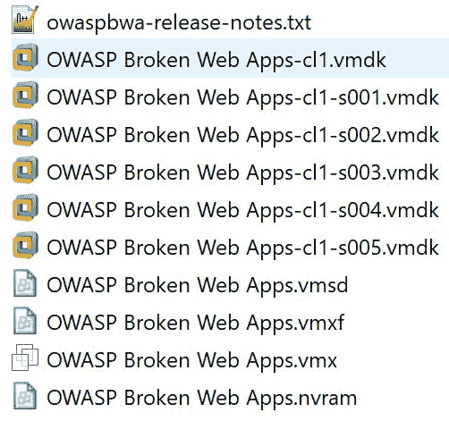
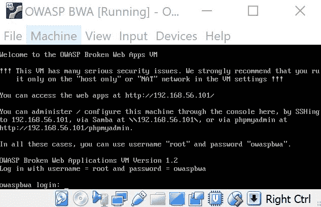
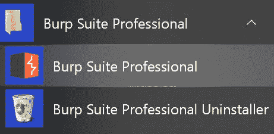
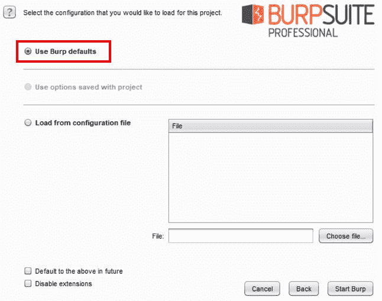
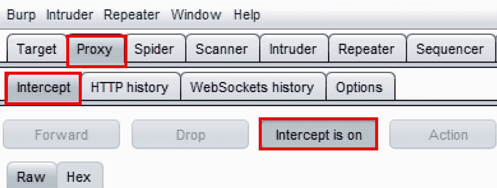

# 第一章：开始使用 Burp Suite

在本章中，我们将涵盖以下内容：

+   下载 Burp（社区，专业版）

+   设置 Web 应用程序渗透测试实验室

+   在命令行或可执行文件中启动 Burp

+   使用 Burp 监听 HTTP 流量

# 介绍

本章提供了设置说明，以便通过本书的材料进行学习。从下载 Burp 开始，详细内容包括两个主要的 Burp 版本及其特点。

要使用 Burp 套件，渗透测试人员需要一个目标应用程序。本章包括有关下载和安装**虚拟机**（**VM**）中包含的 OWASP 应用程序的说明。这些应用程序将在整本书中作为目标易受攻击的 Web 应用程序使用。

本章还包括配置 Web 浏览器以使用**Burp 代理监听器**。此监听器用于捕获 Burp 和目标 Web 应用程序之间的 HTTP 流量。监听器的默认设置包括一个**Internet Protocol**（**IP**）地址，`127.0.0.1`，和端口号`8080`。

最后，本章介绍了启动 Burp 的选项。这包括如何在命令行中启动 Burp，还有一个可选的无头模式，并使用可执行文件。

# 下载 Burp（社区，专业版）

学习本书中包含的技术的第一步是下载 Burp 套件。下载页面在这里可用（[`portswigger.net/burp/`](https://portswigger.net/burp/)）。您需要决定要从以下哪个版本的 Burp 套件中下载：

+   专业版

+   社区

+   企业版（未涵盖）

现在称为*社区*的东西曾被标记为*免费版*。您可能在互联网上看到两者的引用，但它们是一样的。在撰写本文时，专业版的价格为 399 美元。

为了帮助您做出决定，让我们来比较一下这两个版本。社区版提供了本书中使用的许多功能，但并非全部。例如，社区版不包括任何扫描功能。此外，使用入侵者功能时，社区版包含一些强制线程限制。社区版中没有内置的有效负载，但您可以加载自定义的有效负载。最后，一些需要专业版的 Burp 扩展显然在社区版中无法使用。

专业版具有包括被动和主动扫描器在内的所有功能。没有强制限制。**PortSwigger**（即编写和维护 Burp 套件的公司名称）提供了几个用于模糊测试和暴力破解的内置有效负载。专业版还可以使用与扫描器相关的 API 调用的 Burp 扩展。

在本书中，我们将使用专业版，这意味着社区版中的许多功能都可用。但是，当本书中使用专业版特有的功能时，将会有一个特殊的图标来指示。使用的图标如下：

# 准备就绪

为了开始我们的冒险，前往[`portswigger.net/burp`](https://portswigger.net/burp)并下载您希望使用的 Burp 套件版本。该页面提供了一个滑块，如下所示，突出了专业版和社区版的功能，让您可以进行比较：

许多读者可能会选择社区版以在购买之前熟悉该产品。 

如果您选择购买或试用专业版，您将需要填写表格或付款，并随后会收到确认电子邮件。创建账户后，您可以登录并从我们账户中提供的链接进行下载。

# 软件工具要求

要完成这个步骤，您将需要以下内容：

+   Oracle Java（[`www.java.com/en/download/`](https://www.java.com/en/download/)）

+   Burp Proxy Community 或 Professional（[`portswigger.net/burp/`](https://portswigger.net/burp/)）

+   Firefox 浏览器（[`www.mozilla.org/en-US/firefox/new/`](https://www.mozilla.org/en-US/firefox/new/)）

# 如何做...

在决定所需的版本后，您有两种安装选项，包括可执行文件或普通的 JAR 文件。可执行文件仅适用于 Windows，并提供 32 位或 64 位版本。普通的 JAR 文件适用于 Windows、macOS 和 Linux。

Windows 可执行文件是独立的，会在程序列表中创建图标。但是，普通的 JAR 文件需要您的平台预先安装 Java（[`www.java.com/en/download/`](https://www.java.com/en/download/)）。您可以选择当前版本的 Java（JRE 或 JDK），所以可以随意选择最新版本：

# 建立一个网络应用渗透实验室

**Broken Web Application**（**BWA**）是一个 OWASP 项目，提供了一个自包含的虚拟机，其中包含各种已知漏洞的应用程序。该虚拟机中的应用程序使学生能够学习有关网络应用程序安全性，练习和观察网络攻击，并利用诸如 Burp 之类的渗透工具。

为了按照本书中显示的示例进行操作，我们将利用 OWASP 的 BWA 虚拟机。在撰写本文时，OWASP BWA 虚拟机可以从[`sourceforge.net/projects/owaspbwa/files/`](https://sourceforge.net/projects/owaspbwa/files/)下载。

# 准备工作

我们将下载 OWASP BWA 虚拟机以及支持工具来创建我们的网络应用渗透实验室。

# 软件工具要求

要完成这个示例，您需要以下内容：

+   Oracle VirtualBox（[`www.virtualbox.org/wiki/Downloads`](https://www.virtualbox.org/wiki/Downloads)）

+   选择适合您平台的可执行文件

+   Mozilla Firefox 浏览器（[`www.mozilla.org/en-US/firefox/new/`](https://www.mozilla.org/en-US/firefox/new/)）

+   7-Zip 文件压缩软件（[`www.7-zip.org/download.html`](https://www.7-zip.org/download.html)）

+   OWASP BWA 虚拟机（[`sourceforge.net/projects/owaspbwa/files/`](https://sourceforge.net/projects/owaspbwa/files/)）

+   Burp Proxy Community 或 Professional（[`portswigger.net/burp/`](https://portswigger.net/burp/)）

+   Oracle Java（[`www.java.com/en/download/`](https://www.java.com/en/download/)）

# 如何做...

对于这个示例，您需要下载 OWASP BWA 虚拟机，并通过以下步骤进行安装：

1.  点击前面提供的 OWASP BWA VM 的最新版本下载链接，并解压文件`OWASP_Broken_Web_Apps_VM_1.2.7z`。

1.  您将看到以下几个文件的列表：

1.  所有显示的文件扩展名都表明该虚拟机可以导入到 Oracle VirtualBox 或 VMware Player/Workstation 中。为了设置本书中的网络应用渗透实验室，我们将使用 Oracle VirtualBox。

1.  记下`OWASP Broken Web Apps-cl1.vmdk`文件。打开 VirtualBox 管理器（即 Oracle VM VirtualBox 程序）。

1.  在 VirtualBox 管理器屏幕上，从顶部菜单中选择 Machine | New，然后为机器命名`OWASP BWA`。

1.  将类型设置为 Linux，版本设置为 Ubuntu（64 位），然后点击下一步，如下所示：

1.  下一个屏幕允许您调整 RAM 或按建议保持不变。点击下一步。

1.  在下一个屏幕上，选择使用现有的虚拟硬盘文件。

1.  使用右侧的文件夹图标选择从提取的列表中的`OWASP Broken Web Apps-cl1.vmdk`文件，然后点击创建，如下所示：

1.  您的虚拟机现在已加载到 VirtualBox 管理器中。让我们进行一些小的调整。突出显示**OWASP BWA**条目，然后从顶部菜单中选择设置。

1.  在左侧窗格中选择网络部分，然后更改为仅主机适配器。点击确定。

1.  现在让我们启动虚拟机。右键单击，然后选择启动|正常启动。

1.  等待 Linux 系统完全启动，这可能需要几分钟。启动过程完成后，您应该看到以下屏幕。但是，显示的 IP 地址将对您的机器有所不同：

1.  此屏幕上显示的信息标识了您可以访问运行在虚拟机上的易受攻击的 Web 应用程序的 URL。例如，在上一张屏幕截图中，URL 是`http://192.168.56.101/`。您将收到一个用于管理虚拟机的提示，但此时无需登录。

1.  在您的主机系统上打开 Firefox 浏览器，而不是在虚拟机中。使用主机机器上的 Firefox 浏览器，输入提供的 URL（例如`http://192.168.56.101/`），其中 IP 地址特定于您的机器。

1.  在浏览器中，您将看到一个包含指向易受攻击的 Web 应用程序链接的索引页面。这些应用程序将在本书中用作目标：

# 工作原理

利用 OWASP 创建的定制虚拟机，我们可以快速设置一个包含有意义地易受攻击的应用程序的 Web 应用程序渗透测试实验室，我们可以在本书中的练习中将其用作合法目标。

# 在命令行或作为可执行文件启动 Burp

对于非 Windows 用户或选择普通 JAR 文件选项的 Windows 用户，每次运行 Burp 时都需要在命令行上启动。因此，您需要一个特定的 Java 命令来执行此操作。

在某些情况下，例如自动化脚本，您可能希望在命令行中调用 Burp 作为 shell 脚本中的一项。此外，您可能希望在没有图形用户界面（GUI）的情况下运行 Burp，即所谓的无头模式。本节描述了如何执行这些任务。

# 操作步骤如下...

我们将回顾启动 Burp Suite 产品所需的命令和操作。

1.  在 Windows 中启动 Burp，从下载的`.exe`文件运行安装程序后，双击桌面上的图标或从程序列表中选择它：

使用普通的 JAR 文件时，可执行文件`java`后面跟着`-jar`选项，然后是下载的 JAR 文件的名称。

1.  在命令行上启动 Burp（最小化）并使用普通的 JAR 文件（必须先安装 Java）：

如果您希望更多地控制堆大小设置（即为程序分配的内存量），可以修改`java`命令。

1.  `java`可执行文件后面跟着`-jar`，然后是内存分配。在这种情况下，分配了 2GB（即`2g`）用于随机存取内存（RAM），然后是 JAR 文件的名称。如果出现无法分配那么多内存的错误，请将分配量降低到 1024MB（即`1024m`）。

1.  在命令行上启动 Burp（优化）并使用普通的 JAR 文件（必须先安装 Java）：

1.  可以在命令行上启动 Burp 并以无头模式运行。无头模式意味着在没有 GUI 的情况下运行 Burp。

出于本书的目的，我们不会以无头模式运行 Burp，因为我们是通过 GUI 学习的。但是，您将来可能需要这些信息，这就是为什么它在这里呈现的原因。

1.  在命令行上启动 Burp 以无头模式运行，并使用普通的 JAR 文件（必须先安装 Java）：

请注意，在`-jar`选项之后并在 JAR 文件的名称之前，立即放置参数`-Djava.awt.headless=true`。

1.  如果成功，您应该看到以下内容：

按下*Ctrl* + *C*或*Ctrl* + *Z*停止该进程。

1.  可以为无头模式命令提供一个配置文件，用于自定义代理侦听器所在的端口号和 IP 地址。

请参阅 PortSwigger 的支持页面，了解有关此主题的更多信息：[`support.portswigger.net/customer/portal/questions/16805563-burp-command-line`](https://support.portswigger.net/customer/portal/questions/16805563-burp-command-line)。

1.  在描述的每个启动场景中，您应该会看到一个**启动屏幕**。启动屏幕标签将与您决定下载的版本匹配，无论是专业版还是社区版。

1.  您可能会收到更新版本的提示；如果愿意，可以随意进行更新。不断添加新功能到 Burp 中，以帮助您发现漏洞，因此升级应用程序是一个好主意。如果适用，选择立即更新。

1.  接下来，您将看到一个对话框，询问有关项目文件和配置：

1.  如果您使用的是社区版，您只能创建一个临时项目。如果您使用的是专业版，请在适合您查找的位置创建一个新项目并将其保存在磁盘上。然后单击“下一步”。

1.  随后的启动屏幕会询问您想要使用的配置。在这一点上，我们还没有任何配置，所以选择使用 Burp 默认值。随着您阅读本书的进展，您可能希望保存配置设置，并在将来从此启动屏幕加载它们，如下所示：

1.  最后，我们准备好单击“启动 Burp”。

# 工作原理...

使用普通的 JAR 文件或 Windows 可执行文件，您可以启动 Burp 以启动代理监听器来捕获 HTTP 流量。Burp 提供临时或永久的项目文件，以保存套件中执行的活动。

# 使用 Burp 监听 HTTP 流量

Burp 被描述为一个拦截代理。这意味着 Burp 位于用户的 Web 浏览器和应用程序的 Web 服务器之间，并拦截或捕获它们之间流动的所有流量。这种行为通常被称为**代理服务**。

渗透测试人员使用拦截代理来捕获流动在 Web 浏览器和 Web 应用程序之间的流量，以进行分析和操作。例如，测试人员可以暂停任何 HTTP 请求，从而允许在将请求发送到 Web 服务器之前篡改参数。

拦截代理，如 Burp，允许测试人员拦截 HTTP 请求和 HTTP 响应。这使测试人员能够观察 Web 应用程序在不同条件下的行为。正如我们将看到的，有时行为与原始开发人员的预期不符。

为了看到 Burp 套件的实际操作，我们需要配置我们的 Firefox 浏览器的网络设置，指向我们运行的 Burp 实例。这使 Burp 能够捕获浏览器和目标 Web 应用程序之间流动的所有 HTTP 流量。

# 准备就绪

我们将配置 Firefox 浏览器，允许 Burp 监听浏览器和 OWASP BWA VM 之间流动的所有 HTTP 流量。这将允许 Burp 中的代理服务捕获用于测试目的的流量。

PortSwigger 网站上提供了有关此主题的说明（[`support.portswigger.net/customer/portal/articles/1783066-configuring-firefox-to-work-with-burp`](https://support.portswigger.net/customer/portal/articles/1783066-configuring-firefox-to-work-with-burp)），我们也将在下面的步骤中逐步介绍该过程。

# 操作步骤...

以下是您可以通过的步骤，使用 Burp 监听所有 HTTP 流量：

1.  打开 Firefox 浏览器并转到选项。

1.  在“常规”选项卡中，向下滚动到“网络代理”部分，然后单击“设置”。

1.  在“连接设置”中，选择“手动代理配置”，并输入 IP 地址`127.0.0.1`和端口`8080`。选择“为所有协议使用此代理服务器”复选框：

1.  确保“不使用代理”文本框为空，如下图所示，然后单击“确定”：

1.  在 OWASP BWA VM 在后台运行并使用 Firefox 浏览到特定于您的机器的 URL（即在 VirtualBox 中 Linux VM 上显示的 IP 地址）时，单击重新加载按钮（圆圈中的箭头）以查看在 Burp 中捕获的流量。

1.  如果您没有看到任何流量，请检查代理拦截是否阻止了请求。如果标记为“拦截”的按钮处于按下状态，如下面的屏幕截图所示，则再次单击该按钮以禁用拦截。这样做后，流量应该自由地流入 Burp，如下所示：

在下面的 Proxy | 拦截按钮被禁用：

1.  如果一切正常，您将在目标|站点地图选项卡上看到类似于以下屏幕截图所示的流量。当然，您的 IP 地址将不同，并且您的站点地图中可能会显示更多项目。恭喜！您现在已经让 Burp 监听您浏览器的所有流量了！

# 工作原理...

Burp 代理服务正在监听`127.0.0.1`端口`8080`。这些设置中的任何一个都可以更改为监听替代 IP 地址或端口号。但是，为了学习的目的，我们将使用默认设置。
