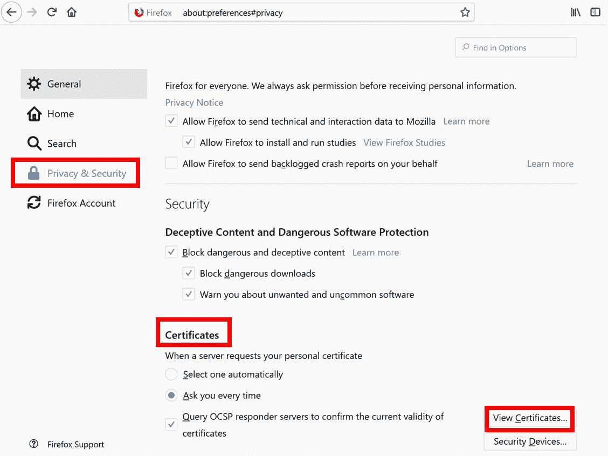
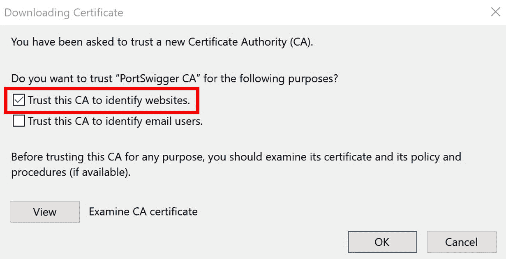
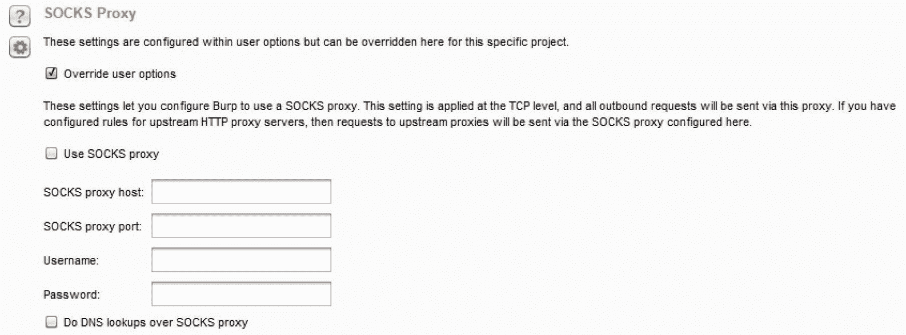
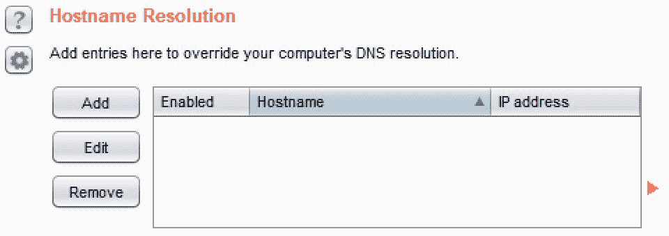
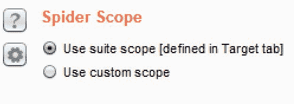
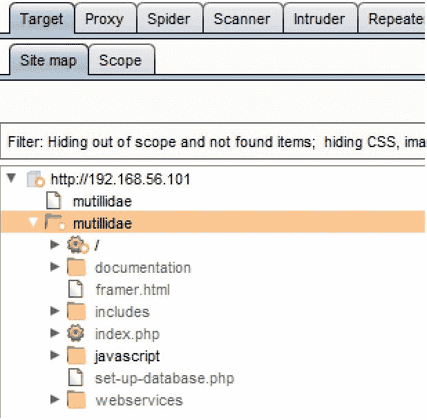
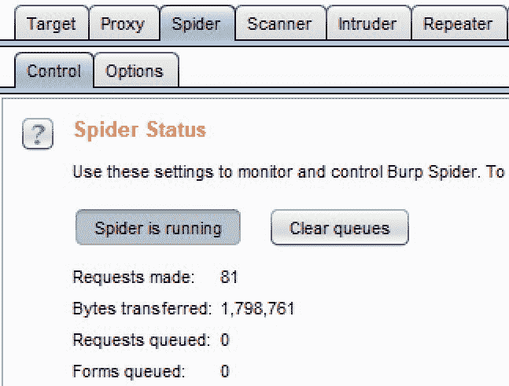
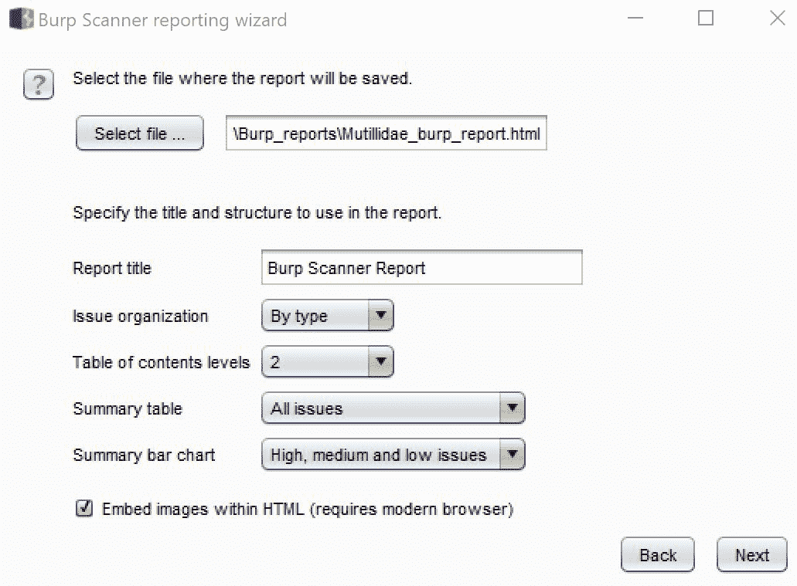

# 第三章：使用 Burp 进行配置、爬行、扫描和报告

在本章中，我们将介绍以下示例：

+   建立 HTTPS 信任

+   设置项目选项

+   设置用户选项

+   使用爬虫进行爬行

+   使用扫描器进行扫描

+   报告问题

# 介绍

本章帮助测试人员校准 Burp 设置，使其对目标应用程序的影响减少。爬虫和扫描器选项中的调整可以帮助解决此问题。同样，当测试人员试图到达目标时，可能会遇到有趣的网络情况。因此，本章还包括了针对运行在 HTTPS 上的站点或仅可通过 SOCKS 代理或端口转发访问的站点的测试的几条建议。这些设置在项目和用户选项中都可以找到。最后，Burp 提供了生成问题报告的功能。

# 软件工具要求

为了完成本章的示例，您需要以下内容：

+   OWASP 破损 Web 应用程序（VM）

+   OWASP Mutillidae 链接

+   Burp 代理社区版或专业版([`portswigger.net/burp/`](https://portswigger.net/burp/))

+   配置了允许 Burp 代理流量的 Firefox 浏览器([`www.mozilla.org/en-US/firefox/new/`](https://www.mozilla.org/en-US/firefox/new/))

+   代理配置步骤在章节中有详细介绍

# 建立 HTTPS 信任

由于大多数网站实施**超文本传输安全协议**（**HTTPS**），了解如何使 Burp 能够与这些站点通信是有益的。HTTPS 是在**超文本传输协议**（**HTTP**）上运行的加密隧道。

HTTPS 的目的是加密客户端浏览器和 Web 应用程序之间的流量，以防止窃听。但是，作为测试人员，我们希望允许 Burp 进行窃听，因为这是使用拦截代理的目的。Burp 提供了一个由**证书颁发机构**（**CA**）签名的根证书。该证书可用于在 Burp 和目标 Web 应用程序之间建立信任。

默认情况下，Burp 的代理在与运行在 HTTPS 上的目标建立加密握手时可以生成每个目标的 CA 证书。这解决了隧道的 Burp 到 Web 应用程序部分。我们还需要解决浏览器到 Burp 部分。

为了在客户端浏览器、Burp 和目标应用程序之间创建完整的 HTTPS 隧道连接，客户端需要在浏览器中信任 PortSwigger 证书作为受信任的权威。

# 准备工作

在需要对运行在 HTTPS 上的网站进行渗透测试的情况下，测试人员必须将 PortSwigger CA 证书导入其浏览器，作为受信任的权威。

# 如何做...

确保 Burp 已启动并运行，然后执行以下步骤：

1.  打开 Firefox 浏览器到[`burp`](http://burp) URL。您必须按照显示的 URL 精确输入才能到达此页面。您应该在浏览器中看到以下屏幕。请注意右侧标有 CA 证书的链接。单击该链接以下载 PortSwigger CA 证书：

1.  系统会提示您下载 PortSwigger CA 证书的对话框。该文件标记为`cacert.der`。将文件下载到硬盘上的某个位置。

1.  在 Firefox 中，打开 Firefox 菜单。单击选项。

1.  在左侧单击隐私和安全，滚动到`证书`部分。单击“查看证书...”按钮：

1.  选择权限选项卡。单击导入，选择之前保存的 Burp CA 证书文件，然后单击打开：

1.  在弹出的对话框中，选中“信任此 CA 以识别网站”复选框，然后单击确定。在证书管理器对话框上也单击确定：

关闭所有对话框并重新启动 Firefox。如果安装成功，您现在应该能够通过 Burp 代理访问浏览器中的任何 HTTPS URL，而无需任何安全警告。

# 设置项目选项

项目选项允许测试人员保存或设置特定于项目或范围目标的配置。在项目选项卡下有多个子选项卡可用，包括连接、HTTP、SSL、会话和其他。在评估特定目标时，许多这些选项对于渗透测试人员是必需的，这就是为什么它们在这里被介绍的原因。

# 如何操作...

在本书中，我们不会使用许多这些功能，但了解它们的存在并理解它们的目的仍然很重要：

# 连接选项卡

在连接选项卡下，测试人员有以下选项：

+   **平台认证**：在测试人员希望项目选项与针对目标应用程序使用的身份验证类型覆盖用户选项中的任何身份验证设置时，提供了一个覆盖按钮。

单击复写用户选项的复选框后，测试人员将看到一个表格，其中包含针对目标应用程序的身份验证选项（例如基本、NTLMv2、NTLMv1 和摘要）。目标主机通常设置为通配符`*`，以防测试人员有必要使用此选项：

+   **上游代理服务器**：在测试人员希望项目选项与针对目标应用程序使用的上游代理服务器配置覆盖用户选项中包含的任何代理设置时，提供了一个覆盖按钮。

单击复写用户选项的复选框后，测试人员将看到一个表格，其中包含针对该项目的上游代理选项。单击“添加”按钮会显示一个名为“添加上游代理规则”的弹出框。此规则特定于目标应用程序的环境。如果目标应用程序的环境是由需要与应用程序登录不同一组凭据的 Web 代理前端，则此功能非常有用：

+   **SOCKS 代理**：在测试人员希望项目选项与针对目标应用程序使用的 SOCKS 代理配置覆盖用户选项中的任何 SOCKS 代理设置时，提供了一个覆盖按钮。

单击复写用户选项的复选框后，测试人员将看到一个表单，用于配置特定于该项目的 SOCKS 代理。在某些情况下，Web 应用程序必须通过使用套接字连接和身份验证的附加协议进行访问，通常称为 SOCKS：

+   **超时**：它允许设置不同网络场景的超时设置，例如无法解析域名：

+   **主机名解析**：它允许类似于本地计算机上主机文件的条目来覆盖**域名系统**（**DNS**）解析：

+   **超出范围的请求**：它提供了关于超出范围的请求的规则给 Burp。通常情况下，最常用的是使用套件范围[在目标选项卡中定义]的默认设置：

# HTTP 选项卡

在 HTTP 选项卡下，测试人员有以下选项：

+   **重定向**：它提供了 Burp 在配置重定向时遵循的规则。通常情况下，这里使用默认设置：

+   **流式响应**：它提供了与无限流响应相关的配置。通常情况下，这里使用默认设置：

+   **状态 100 响应**：它提供了 Burp 处理 HTTP 状态码 100 响应的设置。通常情况下，这里使用默认设置：

# SSL 选项卡

在 SSL 选项卡下，测试人员有以下选项：

+   SSL 协商：当 Burp 通过 SSL 与目标应用程序通信时，此选项提供了使用预配置的 SSL 密码或指定不同密码的能力：

如果测试人员希望自定义密码，他们将单击“使用自定义协议和密码”单选按钮。出现一个表格，允许选择 Burp 在与目标应用程序通信中可以使用的协议和密码：

！

+   **客户端 SSL 证书**：它提供了一个覆盖按钮，以便测试人员必须针对目标应用程序使用客户端证书。此选项将取代用户选项中配置的任何客户端证书。

单击复写用户选项的复选框后，测试人员将看到一个表格，用于配置特定于该项目的客户端证书。您必须拥有客户端证书的私钥才能成功导入到 Burp 中：

！

+   **服务器 SSL 证书**：它提供了服务器端证书的列表。测试人员可以双击任何这些行项目以查看每个证书的详细信息：

！

# 会话选项卡

本书将涵盖第十章中会话选项卡中包含的所有功能，*使用 Burp 宏和扩展程序*。这里提供了会话选项卡中每个部分的审查，以确保完整性。

在会话选项卡下，测试人员有以下选项：

+   **会话处理规则**：它提供了在评估 Web 应用程序时配置自定义会话处理规则的能力：

！

+   **Cookie Jar**：它提供了 Burp 代理（默认情况下）捕获的 cookie、域、路径和名称/值对的列表：

！

+   **宏**：它提供了测试人员编写先前执行的任务以自动化与目标应用程序交互的能力：

！

# 杂项选项卡

在杂项选项卡下，测试人员有以下选项：

+   **计划任务**：它提供了在特定时间安排活动的能力：

！

单击“添加”按钮后，弹出窗口显示可用于调度的活动类型：

！

+   **Burp Collaborator 服务器**：它提供了使用目标应用程序外部服务的能力，以发现目标应用程序中的漏洞。本书将在第十一章中涵盖与 Burp Collaborator 相关的配方，*实施高级主题攻击*。这里提供了该部分的审查，以确保完整性：

！

+   **日志记录**：它提供了记录所有请求和响应或基于特定工具筛选日志的能力。如果选择，用户将被提示输入文件名和位置，以保存日志文件在本地机器上：

！

# 设置用户选项

用户选项允许测试人员保存或设置特定于启动时 Burp 的配置。用户选项选项卡下有多个子选项卡可用，包括连接、SSL、显示和杂项。在本书的配方中，我们不会使用任何用户选项。但是，这里提供了信息以确保完整性。

# 如何做到这一点...

使用 Burp 用户选项，让我们根据您的渗透测试需求最佳地配置 Burp UI。连接选项卡下的每个项目已经在本章的项目选项部分中涵盖，因此，我们将直接从 SSL 选项卡开始。

# SSL 选项卡

在 SSL 选项卡下，测试人员有以下选项：

+   **Java SSL 选项**：它提供了配置 Burp 用于 SSL 连接的 Java 安全库的能力。默认值最常用：

！

+   **客户端 SSL 证书**：此部分已在本章的*项目选项*部分中涵盖。

# 显示选项卡

在显示选项卡下，测试人员有以下选项：

+   用户界面：它提供了修改 Burp UI 本身的默认字体和大小的能力：

+   HTTP 消息显示：它提供了修改消息编辑器中显示的所有 HTTP 消息的默认字体和大小的能力：

+   字符集：它提供了更改 Burp 确定使用的字符集的能力，以使用特定集或显示原始字节：

+   HTML 渲染：它控制可在 HTTP 响应上的 Render 选项卡中找到的 HTML 页面的显示方式：

# 其他选项卡

在其他选项卡下，测试人员有以下选项：

+   快捷键：它允许用户为常用命令配置快捷键：

+   自动项目备份[仅磁盘项目]：它提供了确定多久备份项目文件的备份副本的能力。默认情况下，使用 Burp Professional 时，备份设置为每 30 分钟发生一次：

+   临时文件位置：它提供了在运行 Burp 时更改临时文件存储位置的能力：

+   代理拦截：它提供了在初始启动 Burp 时始终启用或始终禁用代理拦截的能力：

+   代理历史记录：它提供了在目标范围更改时自定义提示超出范围项目的能力：

+   性能反馈：它为 PortSwigger 提供了关于 Burp 性能的匿名数据：

# 使用 Spider 进行爬行

Spidering 是映射或爬行 Web 应用程序的另一个术语。这种映射练习对于发现目标应用程序中存在的链接、文件夹和文件是必要的。

除了爬行，Burp Spider 还可以以自动方式提交表单。爬行应该在扫描之前进行，因为渗透测试人员希望在寻找漏洞之前识别所有可能的路径和功能。

Burp 提供了持续的爬行能力。这意味着随着渗透测试人员发现新内容，Spider 将自动在后台运行，寻找要添加到目标|站点地图中的表单、文件和文件夹。

Burp Suite 的 Spider 模块中有两个选项卡可用。这些选项卡包括**控制**和**选项**，我们将在本食谱的*准备就绪*部分中学习。

# 准备就绪

使用在 OWASP BWA VM 中找到的 OWASP Mutillidae II 应用程序，我们将配置并使用 Burp Spider 来爬行该应用程序。

# 控制选项卡

在控制选项卡下，测试人员有以下选项：

+   Spider 状态：它提供了打开或关闭（暂停）爬虫功能的能力。它还允许我们监视排队的 Spider 请求以及传输的字节数等。该部分允许通过单击“清除队列”按钮来清除任何排队的表单：

+   Spider 范围：它提供了根据目标|站点地图选项卡或自定义范围设置 Spider 范围的能力：

如果单击“使用自定义范围”单选按钮，则会出现两个表，允许测试人员定义要包括和排除范围的 URL：

# 选项卡

在选项卡下，测试人员有以下选项：

+   爬虫设置：它提供了调节 Spider 将跟随的链接深度的能力；还可以识别要在网站上为 Spider 提供的基本 Web 内容，例如`robots.txt`文件：

+   被动爬行：在后台爬行新发现的内容，默认情况下已打开：

+   表单提交：它提供了确定 Spider 与表单交互方式的能力。有几个选项可用，包括忽略、寻求指导、使用在提供的表中找到的默认值提交，或者使用任意值（例如，`555-555-0199@example.com`）：

+   **应用登录**：它提供了确定 Spider 如何与登录表单交互的能力。有几个选项可用，包括忽略、寻求指导、提交为标准表单提交，或使用文本框中提供的凭据：

+   **Spider 引擎**：它提供了编辑使用的线程数以及由于网络故障而进行的重试尝试设置的能力。要谨慎使用线程数，因为太多的线程请求可能会使应用程序受阻并影响其性能：

+   **请求头**：它提供了修改 Burp Spider 发出的 HTTP 请求外观的能力。例如，测试人员可以修改用户代理以使 Spider 看起来像一个手机：

# 如何操作...

1.  确保 Burp 和 OWASP BWA VM 正在运行，并且 Burp 已经配置在用于查看 OWASP BWA 应用程序的 Firefox 浏览器中。

1.  从 OWASP BWA 登陆页面，点击链接到 OWASP Mutillidae II 应用程序：

1.  转到 Burp Spider 选项卡，然后转到 Options 子选项卡，向下滚动到 Application Login 部分。选择自动提交这些凭据的单选按钮。在用户名文本框中输入单词 `admin`；在密码文本框中输入单词 `admin`：

1.  返回到目标 | 网站地图，并确保通过右键单击 `mutillidae` 文件夹并选择添加到范围来添加 `mutillidae` 文件夹到范围中：

1.  可选地，你可以通过点击 `Filter: Hiding out of scope and not found items; hiding CSS, image and general binary content; hiding 4xx responses; hiding empty folders` 来清理 Site map，只显示范围内的项目：

1.  点击 `Filter: ….` 后，你会看到一个下拉菜单出现。在这个下拉菜单中，勾选“仅显示范围内项目”框。现在，点击下拉菜单之外的任何地方，让过滤器再次消失：

1.  现在你应该有一个干净的网站地图。右键单击 mutillidae 文件夹，然后选择 Spider this branch。

如果提示允许超出范围的项目，请点击是。

1.  你应该立即看到 Spider 选项卡变成橙色：

1.  转到 Spider | Control 选项卡，查看请求数量、传输的字节数以及队列中的表单：

让 Spider 完成运行。

1.  注意，Spider 使用你在选项卡中提供的凭据登录到了应用程序。在 Target | Site map 中，寻找 `/mutillidae/index.php/` 文件夹结构：

1.  搜索包含 `password=admin&login-php-submit-button=Login&username=admin` 的信封图标：

这证明了 Spider 使用了你在 Spider | Options | Application Login 部分提供的信息。

# 使用扫描器进行扫描

扫描器功能仅在 Burp 专业版中可用。

Burp Scanner 是一个自动搜索应用程序运行时内部弱点的工具。扫描器尝试根据应用程序的行为来发现安全漏洞。

扫描器将识别可能导致发现安全漏洞的指标。Burp Scanner 非常可靠，但是在报告之前，渗透测试人员有责任验证任何发现。

Burp Scanner 有两种扫描模式可用：

+   **被动扫描器**：分析通过代理监听器传递的流量。这就是为什么正确配置目标范围非常重要，这样你就不会扫描更多不必要的内容。

+   **主动扫描器**：发送许多经过修改的请求。这些请求修改旨在触发可能指示应用程序存在漏洞的行为（[`portswigger.net/kb/issues`](https://portswigger.net/kb/issues)）。主动扫描器专注于可能存在于应用程序客户端和服务器端的基于输入的错误。

扫描任务应在蜘蛛完成后进行。之前，我们学习了蜘蛛在发现新内容时继续爬行。同样，被动扫描在应用程序爬行时继续识别漏洞。

在选项选项卡下，测试人员有以下选项：问题活动、扫描队列、实时扫描、问题定义和选项：

+   **问题活动**：以表格形式显示所有扫描器发现的问题；包括被动和主动扫描器问题：

通过在表中选择问题，将显示消息详细信息，包括与发现相关的特定建议以及与请求和响应相关的消息编辑器详细信息：

+   **扫描队列**：显示正在运行的主动扫描器的状态；提供每个运行线程的完成百分比，以及发送的请求数、测试的插入点、开始时间、结束时间、目标主机和攻击的 URL。

扫描仪可以通过右键单击并选择暂停扫描仪来暂停扫描; 同样，扫描仪也可以通过右键单击并选择恢复扫描仪来恢复。等待扫描队列中的项目也可以被取消：

+   **实时主动扫描**：它允许自定义主动扫描器何时执行扫描活动：

+   **实时被动扫描**：它允许自定义被动扫描器何时执行扫描活动。默认情况下，被动扫描器始终处于开启状态并扫描所有内容：

+   **问题定义**：显示 Burp 扫描器（主动和被动）已知的所有漏洞的定义。列表可以通过扩展器进行扩展，但是，使用 Burp 核心，这是详尽的列表，包括标题、描述文本、修复措施措辞、参考和严重级别：

+   **选项**：提供了几个部分，包括攻击插入点、主动扫描引擎、攻击扫描优化和静态代码分析。

+   **攻击插入点**：它允许自定义 Burp 插入点; 插入点是请求不同位置内的有效负载的占位符。这类似于第二章中讨论的入侵者有效负载标记概念，*了解 Burp 套件工具*：

建议在进行评估时添加 URL-to-body、Body-to-URL、cookie-to-URL、URL-to-cookie、body-to-cookie 和 cookie-to-body 插入点。这允许 Burp 对任何给定请求中几乎所有可用的参数进行模糊处理。

+   +   **主动扫描引擎**：它提供了配置线程数（例如，并发请求限制）的能力，扫描器将针对目标应用程序运行。这个线程计数，加上插入点的排列组合，可能会在网络上产生噪音和可能的 DOS 攻击，这取决于目标应用程序的稳定性。请谨慎使用，并考虑降低并发请求限制。线程的限制也可以在此配置部分中找到：

+   +   **攻击扫描优化**：它提供了三种扫描速度和扫描准确性的设置。

+   可用的扫描速度设置包括正常、快速和彻底。快速会发出更少的请求并检查问题的派生。彻底会发出更多的请求并检查问题的派生。正常是另外两个选择之间的中等设置。扫描速度的建议是彻底。

+   可用的扫描准确性设置包括正常、最小化假阴性和最小化假阳性。扫描准确性与扫描器在报告问题之前需要的证据量有关。扫描准确性的建议是正常的：

+   +   **静态代码分析**：它提供对二进制代码进行静态分析的能力。默认情况下，此检查是在主动扫描中执行的：

+   **扫描问题**：它提供了设置要测试的漏洞以及要使用哪个扫描器（即被动或主动）的能力。默认情况下，所有漏洞检查都是启用的：

# 准备工作

使用 OWASP BWA VM 中的 OWASP Mutillidae II 应用程序，我们将开始我们的扫描过程，并使用扫描队列选项卡监视我们的进度。

# 操作步骤...

确保 Burp 和 OWASP BWA VM 正在运行，同时在用于查看 OWASP BWA 应用程序的 Firefox 浏览器中配置了 Burp。

从 OWASP BWA 登录页面，点击链接到 OWASP Mutillidae II 应用程序：

1.  从目标 | 站点地图选项卡中，右键单击`mutillidae`文件夹并选择被动扫描此分支。被动扫描器将寻找漏洞，这些漏洞将出现在问题窗口中：

1.  从目标 | 站点地图选项卡中，右键单击`mutillidae`文件夹并选择主动扫描此分支：

1.  在启动主动扫描器时，将弹出一个对话框，提示删除重复项、没有参数的项、具有媒体响应的项或特定文件类型的项。这个弹出框是主动扫描向导。对于本教程，请使用默认设置并点击“下一步”：

1.  验证所有显示的路径是否需要进行扫描。任何不需要的文件类型或路径都可以使用“删除”按钮进行移除。完成后，点击“确定”：

您可能会收到关于超出范围的项目的提示。如果是这样，请点击“是”以包括这些项目。扫描器将开始工作。

1.  通过查看扫描器队列选项卡来检查扫描器的状态：

1.  扫描器发现问题后，它们会显示在目标选项卡的问题面板中。由于这个面板是专业版才有的，因为它补充了扫描器的功能：

# 报告问题

报告功能仅在 Burp Professional 版中提供。

在 Burp Professional 中，当扫描器发现漏洞时，它将被添加到 UI 右侧的目标选项卡上找到的问题列表中。问题以颜色编码表示严重程度和置信水平。带有红色感叹号的问题意味着严重程度很高，置信水平是确定的。例如，这里显示的 SQL 注入问题包含这两个属性。

具有较低严重程度或置信水平的项目将是低级、信息性的，颜色为黄色、灰色或黑色。这些项目需要手动渗透测试，以验证漏洞是否存在。例如，响应中返回的输入是扫描器识别的潜在漏洞，如下面的屏幕截图所示。这可能是**跨站脚本**（**XSS**）的攻击向量，也可能是误报。这取决于渗透测试人员及其经验水平来验证此类问题：

+   **严重程度级别**：可用的严重程度级别包括高、中、低、信息和误报。任何标记为误报的发现将不会出现在生成的报告中。误报是必须由渗透测试人员手动设置的严重程度级别。

+   **置信水平**：可用的置信水平包括确定、肯定和暂定。

# 准备工作

扫描过程完成后，我们需要验证我们的发现，相应地调整严重程度，并生成报告。

# 操作步骤...

1.  对于本教程，请在“问题”标题下选择“未设置 HttpOnly 标志的 Cookie”：

1.  查看消息的响应选项卡以验证发现。我们可以清楚地看到`PHPSESSID` cookie 没有设置`HttpOnly`标志。因此，我们可以将严重程度从低改为高，将置信水平从确定改为肯定：

1.  右键单击问题，并通过选择“设置严重程度 | 高”将严重程度更改为高：

1.  右键单击问题，并通过选择设置置信度 | 确定将严重性更改为确定：

1.  对于这个示例，选择包括在报告中的具有最高置信度和严重级别的问题。在这里选择（高亮显示+ *Shift*键）所显示的项目后，右键单击并选择报告所选问题：

点击报告所选问题后，弹出框会提示我们报告的格式。这个弹出框是 Burp Scanner 报告向导。

1.  对于这个示例，允许 HTML 的默认设置。点击下一步。

1.  该屏幕提示输入报告中要包括的详细信息类型。对于这个示例，允许默认设置。点击下一步。

1.  该屏幕提示报告中消息应该如何显示。对于这个示例，允许默认设置。点击下一步。

1.  该屏幕提示应该在报告中包括哪些类型的问题。对于这个示例，允许默认设置。点击下一步。

1.  该屏幕提示输入报告保存的位置。对于这个示例，点击选择文件…，选择一个位置，并提供一个文件名，后面跟着`.html`扩展名；允许所有其他默认设置。点击下一步：

1.  该屏幕反映了报告生成的完成。点击关闭并浏览到文件的保存位置。

1.  双击文件名将报告加载到浏览器中：

恭喜！您已经创建了您的第一个 Burp 报告！
