# 第五章：评估授权检查

在本章中，我们将介绍以下配方：

+   测试目录遍历

+   测试**本地文件包含**（**LFI**）

+   测试**远程文件包含**（**RFI**）

+   测试特权升级

+   测试不安全的直接对象引用

# 介绍

本章介绍了授权的基础知识，包括应用程序如何使用角色来确定用户功能的解释。Web 渗透测试涉及关键评估，以确定应用程序验证分配给特定角色的功能的程度，我们将学习如何使用 Burp 执行这些测试。

# 软件要求

要完成本章中的配方，您将需要以下内容：

+   OWASP 破损的 Web 应用程序（VM）

+   OWASP mutillidae 链接

+   Burp Proxy Community 或 Professional（[`portswigger.net/burp/`](https://portswigger.net/burp/)）

+   Firefox 浏览器配置为允许 Burp 代理流量（[`www.mozilla.org/en-US/firefox/new/`](https://www.mozilla.org/en-US/firefox/new/)）

+   来自 GitHub 的`wfuzz`字典存储库（[`github.com/xmendez/wfuzz`](https://github.com/xmendez/wfuzz)）

# 测试目录遍历

目录遍历攻击是试图发现或强制浏览未经授权的网页，通常为应用程序的管理员设计。如果应用程序未正确配置 Web 文档根目录，并且未包括对访问的每个页面进行适当授权检查，则可能存在目录遍历漏洞。在特定情况下，这种弱点可能导致系统命令注入攻击或攻击者执行任意代码的能力。

# 准备就绪

使用 OWASP Mutillidae II 作为我们的目标应用程序，让我们确定它是否包含任何目录遍历漏洞。

# 如何做...

确保 Burp 和 OWASP BWA VM 正在运行，并且 Burp 已在用于查看 OWASP BWA 应用程序的 Firefox 浏览器中进行配置。

1.  从 OWASP BWA 登陆页面，单击链接到 OWASP Mutillidae II 应用程序。

1.  在 OWASP Mutillidae II 的登录屏幕上打开 Firefox 浏览器。从顶部菜单中，单击**登录**。

1.  找到刚刚在**Proxy** | **HTTP history**表中执行的请求。查找对`login.php`页面的调用。突出显示消息，将光标移动到**Request**选项卡的**Raw**选项卡中，右键单击，然后单击**Send to Intruder**：

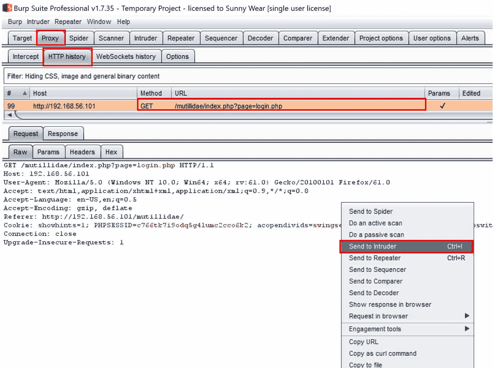

1.  切换到**Intruder** | **Positions**选项卡，并单击右侧的**Clear $**按钮清除所有 Burp 定义的有效负载标记。

1.  突出显示存储在`page`参数（`login.php`）中的值，并使用**Add §**按钮在其周围放置一个有效负载标记：

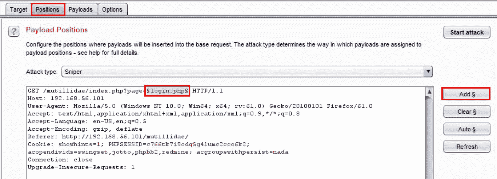

1.  继续到**Intruder** | **Payloads**选项卡，并从`wfuzz`存储库中选择以下字典：`admin-panels.txt`。从 GitHub 存储库中的位置遵循此文件夹结构：`wfuzz`/`wordlist`/`general`/`admin-panels.txt`。

1.  在**Intruder** | **Payloads**选项卡的**Payload Options [Simple list]**部分中单击**Load**按钮，将弹出一个窗口，提示您选择您的字典的位置。

1.  浏览到您从 GitHub 下载了`wfuzz`存储库的位置。继续搜索`wfuzz`文件夹结构（`wfuzz`/`wordlist`/`general`/），直到找到`admin-panels.txt`文件，然后通过单击**打开**选择文件：

1.  滚动到底部，取消选中（默认情况下，它已选中）**URL 编码这些字符**选项：

1.  现在您已经准备好开始攻击。单击**Intruder** | **Positions**页面右上角的**Start attack**按钮：

攻击结果表将出现。允许攻击完成。`admin-panels.txt`字典中有 137 个有效负载。按照**Length**列从升序到降序排序，以查看哪些有效负载命中了网页。

1.  注意响应长度较大的有效负载。看起来很有希望！也许我们已经偶然发现了一些可能包含指纹信息或未经授权访问的管理页面：

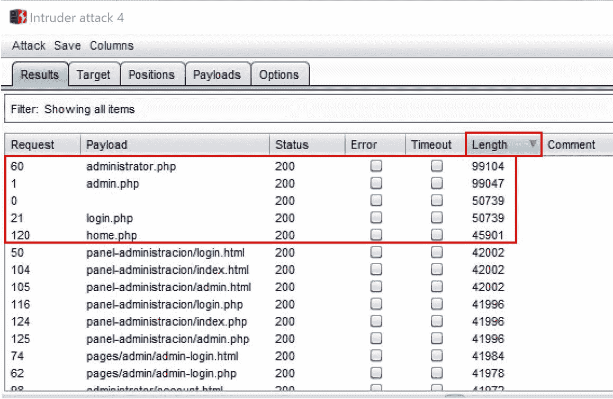

1.  选择长度最大的列表中的第一个页面**administrator.php**。从攻击结果表中，查看**Response** | **Render**选项卡，并注意页面显示了 PHP 版本和系统信息：

# 工作原理...

甚至在未登录的情况下，我们就能够强制浏览到 Web 应用程序中未映射的区域。术语*未映射*意味着应用程序本身没有直接链接到这个秘密配置页面。但是，使用 Burp Intruder 和包含常见已知管理文件名的字典，我们能够使用目录遍历攻击发现该页面。

# 测试本地文件包含（LFI）

Web 服务器通过配置设置控制对特权文件和资源的访问。特权文件包括只能由系统管理员访问的文件。例如，在类 UNIX 平台上是`/etc/passwd`文件，或者在 Windows 系统上是`boot.ini`文件。

**LFI**攻击是试图使用目录遍历攻击访问特权文件的尝试。LFI 攻击包括不同的样式，包括**点点斜杠攻击**（**../**），**目录暴力破解**，**目录攀升**或**回溯**。

# 准备工作

使用 OWASP Mutillidae II 作为我们的目标应用程序，让我们确定它是否包含任何 LFI 漏洞。

# 如何操作...

确保 Burp 和 OWASP BWA VM 正在运行，并且 Burp 已配置在用于查看 OWASP BWA 应用程序的 Firefox 浏览器中。

1.  从 OWASP BWA 登陆页面，点击链接到 OWASP Mutillidae II 应用程序。

1.  打开 Firefox 浏览器，转到 OWASP Mutillidae II 的登录界面。从顶部菜单，点击**Login**。

1.  在**Proxy** | **HTTP history**表中找到您刚刚执行的请求。查找对`login.php`页面的调用。突出显示消息，将光标移动到**Request**选项卡的**Raw**选项卡中，右键单击，然后**Send to Intruder**。

1.  切换到**Intruder** | **Positions**选项卡，并点击右侧的**Clear §**按钮清除所有 Burp 定义的有效负载标记。

1.  突出显示当前存储在`page`参数（`login.php`）中的值，并使用右侧的**Add  §**按钮在其周围放置有效负载标记。

1.  继续到**Intruder** | **Payloads**选项卡。从`wfuzz`存储库中选择以下字典：`Traversal.txt`**. **从 GitHub 存储库中的文件夹结构如下：`wfuzz`/`wordlist`/`injections`/`Traversal.txt`。

1.  点击**Intruder** | **Payloads**选项卡中**Payload Options [Simple list]**部分的**Load**按钮。将显示一个弹出窗口，提示您输入字典的位置。

1.  浏览到您从 GitHub 下载`wfuzz`存储库的位置。继续搜索`wfuzz`文件夹结构，直到找到`admin-panels.txt`文件。选择文件，然后点击**Open**：

1.  滚动到底部，取消选中（默认情况下是选中的）**URL-encode these characters**选项。

1.  您现在已经准备好开始攻击。点击**Intruder** | **Positions**页面右上角的**Start attack**按钮。

1.  攻击结果表将出现。允许攻击完成。按照**Length**列从升序到降序排序，以查看哪些有效负载命中了网页。注意长度较大的有效负载；也许我们已经未经授权地访问了系统配置文件！

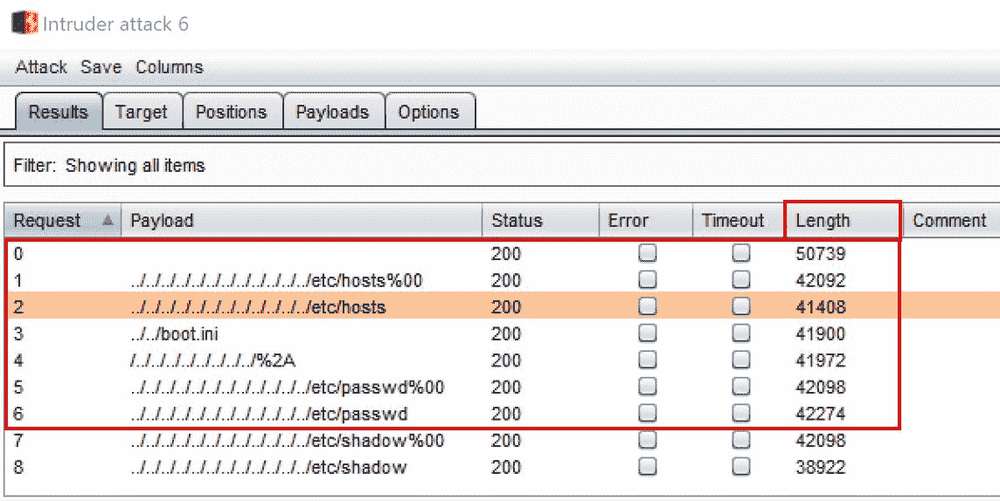

1.  在列表中选择请求＃2。从攻击结果表中，查看**响应** | **渲染**选项卡，并注意页面显示了系统中的主机文件！

1.  继续向下滚动攻击结果表中的请求列表。查看请求＃6，然后查看**响应** | **渲染**选项卡，并注意页面显示了系统中的`/etc/passwd`文件！

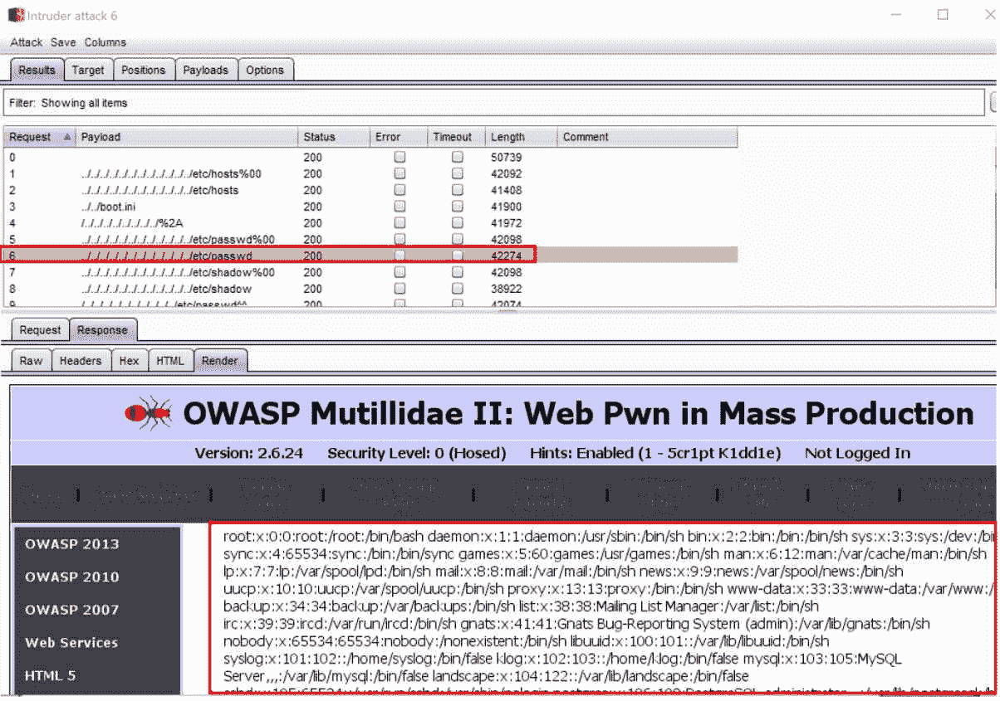

# 它是如何工作的...

由于文件权限受到不良保护和应用程序授权检查不足，攻击者能够读取系统中包含敏感信息的特权本地文件。

# 测试远程文件包含（RFI）

**远程文件包含**（**RFI**）是一种试图访问外部 URL 和远程文件的攻击。由于参数操纵和缺乏服务器端检查，攻击是可能的。这些疏忽允许参数更改将用户重定向到未列入白名单或未经适当数据验证的位置。

# 做好准备

使用 OWASP Mutillidae II 作为我们的目标应用程序，让我们确定它是否包含任何 RFI 漏洞。

# 如何做...

确保 Burp 和 OWASP BWA VM 正在运行，并且已在用于查看 OWASP BWA 应用程序的 Firefox 浏览器中配置了 Burp。

1.  从 OWASP BWA 登陆页面，点击链接到 OWASP Mutillidae II 应用程序。

1.  打开 Firefox 浏览器，转到 OWASP Mutillidae II 的登录界面。从顶部菜单中，点击**登录**。

1.  在**代理** | **HTTP 历史**表中找到您刚刚执行的请求。寻找对`login.php`页面的调用：

1.  记下确定要加载的页面的`page`参数：

让我们看看是否可以通过提供应用程序外部的 URL 来利用此参数。出于演示目的，我们将在 OWASP BWA VM 中使用我们控制的 URL。但是，在野外，这个 URL 将由攻击者控制。

1.  切换到**代理** | **拦截**选项卡，并按下**拦截已打开**按钮。

1.  返回到 Firefox 浏览器，并重新加载登录页面。请求被暂停，并包含在**代理** | **拦截**选项卡中：

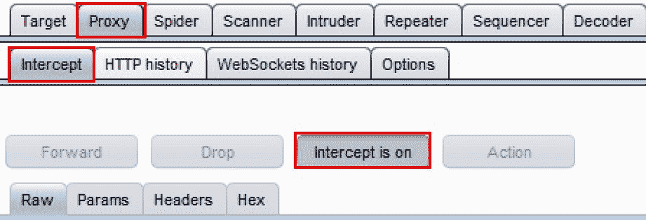

1.  现在让我们将`login.php`的`page`参数值操纵为应用程序外部的 URL。让我们使用登录页面到**GetBoo**应用程序。您的 URL 将特定于您机器的 IP 地址，因此请相应调整。新的 URL 将是`http://<your_IP_address>/getboo/`

1.  将`login.php`的值替换为`http://<your_IP_address>/getboo/`，然后点击**Forward**按钮：

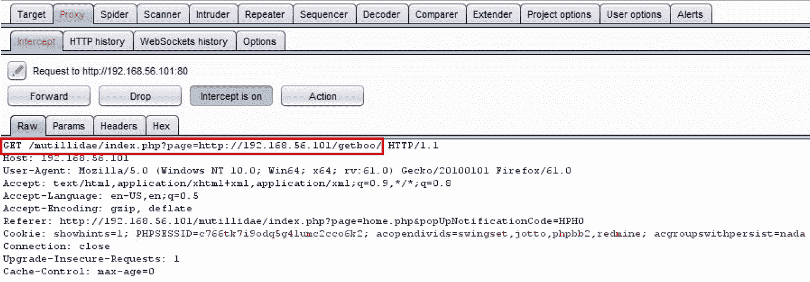

1.  现在再次按下**拦截已打开**按钮，以切换拦截按钮为**关闭（拦截已关闭）**。

1.  返回到 Firefox 浏览器，并注意加载的页面是 Mutillidae 应用程序上的**GetBoo**索引页面！

# 它是如何工作的...

`page`参数没有包括适当的数据验证，以确保提供给它的值被列入白名单或包含在可接受值的规定列表中。通过利用这种弱点，我们能够指定这个参数的值，这是不应该被允许的。

# 测试特权升级

应用程序中的开发人员代码必须包括对分配角色的授权检查，以确保授权用户无法将其角色提升到更高的特权。这种特权升级攻击是通过修改分配角色的值并用另一个值替换来发生的。如果攻击成功，用户将未经授权地访问通常限制为管理员或更强大帐户的资源或功能。

# 做好准备

使用 OWASP Mutillidae II 作为我们的目标应用程序，让我们以普通用户 John 的身份登录，并确定我们是否可以将我们的角色提升为管理员。

# 如何做...

确保 Burp 和 OWASP BWA VM 正在运行，并且已在用于查看 OWASP BWA 应用程序的 Firefox 浏览器中配置了 Burp。

1.  从 OWASP BWA 登陆页面，点击链接到 OWASP Mutillidae II 应用程序。

1.  打开 Firefox 浏览器到 OWASP Mutillidae II 的登录界面。从顶部菜单中，点击**登录**。

1.  在登录界面，使用以下凭据登录—用户名：`john`和密码：`monkey`。

1.  切换到 Burp 的**代理** | **HTTP 历史**选项卡。通过以`john`登录，找到您刚刚进行的`POST`和随后的`GET`请求：

1.  查看列表中的`GET`请求；注意**Cookie:**行上显示的 cookie 名称/值对。

最感兴趣的名称/值对包括`username=john`和`uid=3`。如果我们尝试将这些值操纵到不同的角色会发生什么？

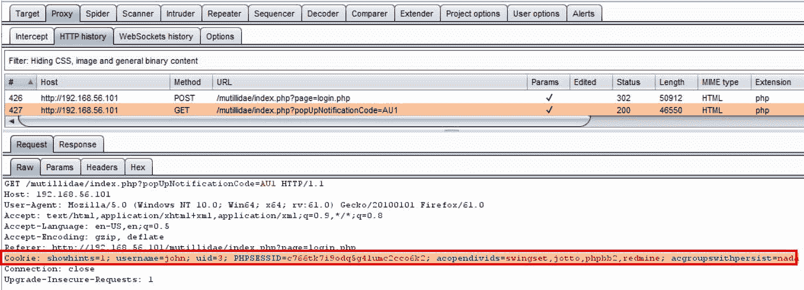

1.  让我们尝试操纵存储在 cookie 中的`username`和`uid`参数到不同的角色。我们将使用 Burp 的**代理** | **拦截**来帮助我们执行此攻击。

1.  切换到**代理** | **拦截**选项卡，然后按下**拦截已打开**按钮。返回到 Firefox 浏览器并重新加载登录页面。

1.  在**代理** | **拦截**选项卡中暂停请求。在暂停时，将分配给用户名的值从`john`更改为`admin`。同时，将分配给`uid`的值从`3`更改为`1`。

1.  点击**转发**按钮，然后再次按下**拦截已打开**以切换拦截按钮为**关闭（拦截已关闭）**。

1.  返回到 Firefox 浏览器，注意我们现在以管理员身份登录！我们能够从普通用户升级到管理员，因为开发人员没有对分配的角色执行任何授权检查：

# 它是如何工作的...

在这个示例中显示的特权升级攻击中存在几个应用程序问题。与帐户配置（即角色分配）相关的任何操作都应该只允许管理员执行。如果没有适当的检查，用户可以尝试升级他们的配置角色。在这个示例中展示的另一个问题是顺序用户 ID 号（例如，`uid=3`）。由于这个数字很容易被猜到，并且因为大多数应用程序都从管理员帐户开始，将数字从`3`更改为`1`似乎是与管理员帐户相关的一个可能的猜测。

# 测试不安全的直接对象引用（IDOR）

基于用户提供的输入允许未经授权直接访问文件或资源的系统被称为**不安全的直接对象引用**（**IDOR**）。这种漏洞允许绕过对这些文件或资源放置的授权检查。IDOR 是由于在应用程序代码中未经检查的用户提供的输入来检索对象而未执行授权检查的结果。

# 准备工作

使用 OWASP Mutillidae II 作为我们的目标应用程序，让我们操纵`phpfile`参数的值，以确定我们是否可以调用系统上的直接对象引用，例如`/etc/passwd`文件。

# 如何做到这一点...

1.  从 Mutillidae 菜单中，选择**OWASP 2013** | **A4 – 不安全的直接对象引用** | **源代码查看器**：

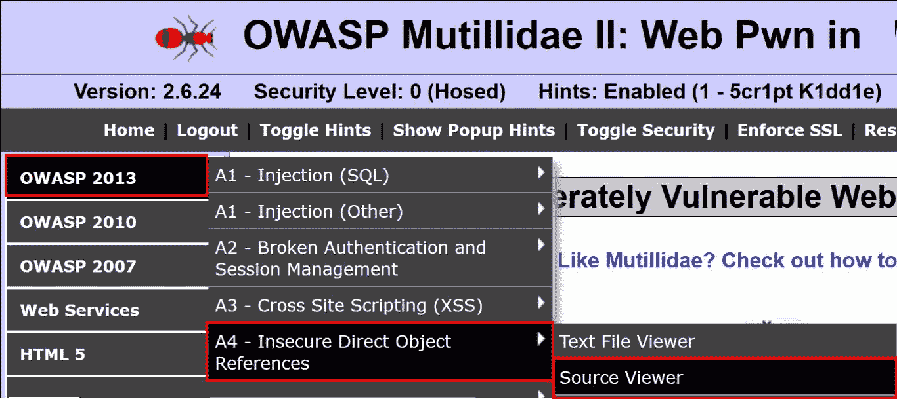

1.  从**源代码查看器**页面，使用下拉框中选择的默认文件（`upload-file.php`），点击**查看文件**按钮以查看文件内容显示在按钮下方：

1.  切换到 Burp 的**代理** | **HTTP 历史**选项卡。找到您刚刚在查看`upload-file.php`文件时所做的`POST`请求。注意带有要显示的文件值的`phpfile`参数。如果我们将此参数的值更改为其他内容会发生什么？

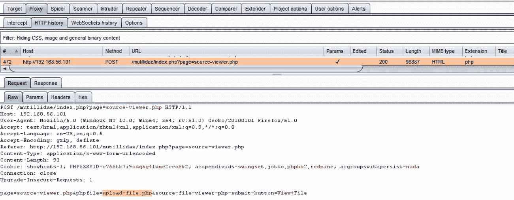

1.  让我们通过操纵提供给`phpfile`参数的值来执行 IDOR 攻击，以引用系统上的文件。例如，让我们尝试通过 Burp 的**代理** | **拦截**功能将`upload-file.php`的值更改为`../../../../etc/passwd`。

1.  要执行此攻击，请按照以下步骤进行。

1.  切换到**代理** | **拦截**选项卡，并按下**拦截已开启**按钮。

1.  返回到 Firefox 浏览器并重新加载登录页面。请求被暂停，并包含在**代理** | **拦截**选项卡中。

1.  1.  由于请求被暂停，将`phpfile`参数分配的值更改为`../../../../etc/passwd`：

1.  点击**转发**按钮。现在再次按下**拦截已开启**按钮，将拦截按钮切换为**关闭（拦截已关闭）**。

1.  返回到 Firefox 浏览器。注意我们现在可以看到`/etc/passwd`文件的内容！

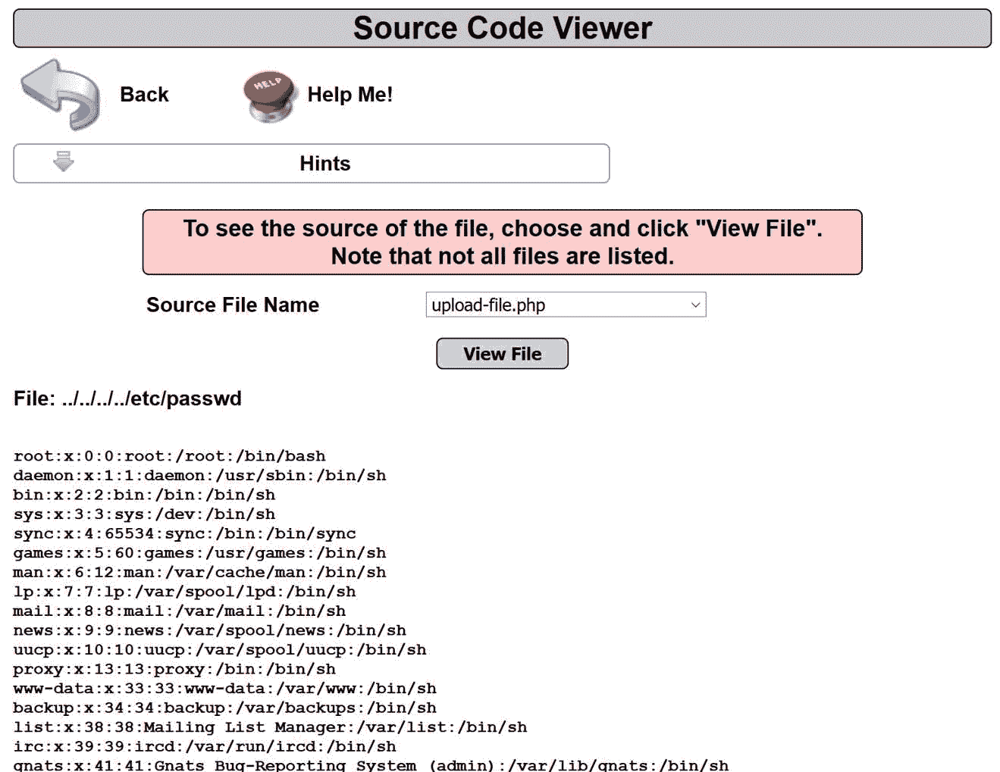

# 工作原理...

由于应用程序代码中对`phpfile`参数缺乏适当的授权检查，我们能够查看系统上的特权文件。开发人员和系统管理员在揭示敏感文件和资源之前提供访问控制和检查。当这些访问控制缺失时，可能存在 IDOR 漏洞。
