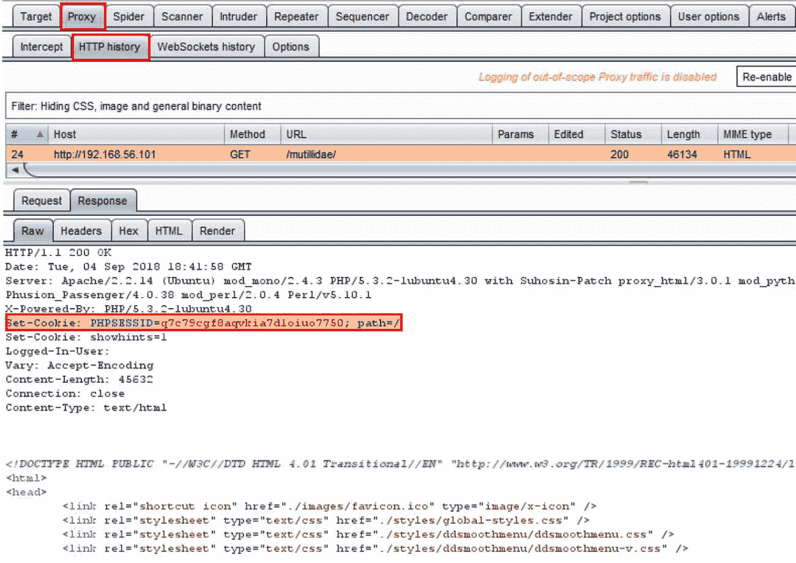
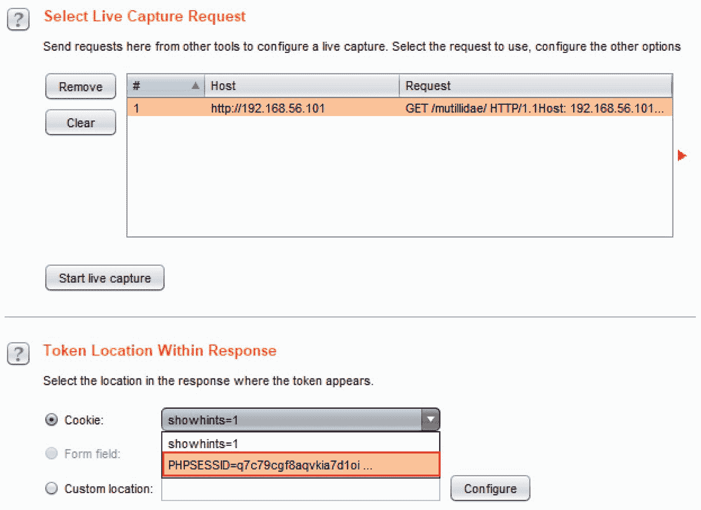
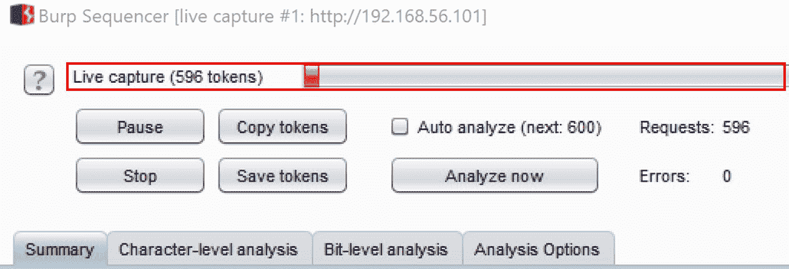
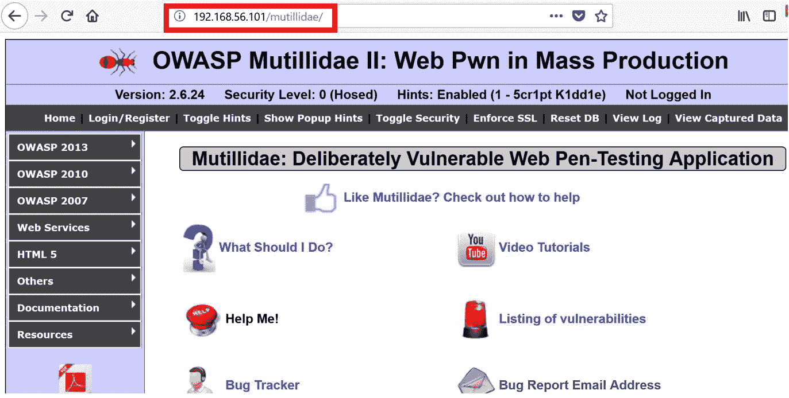
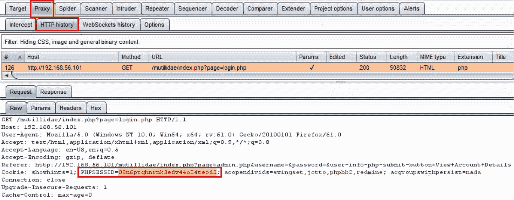
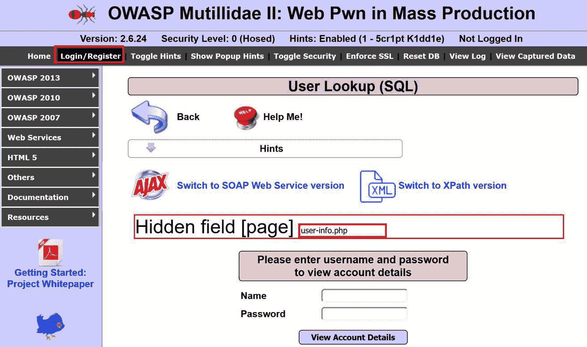
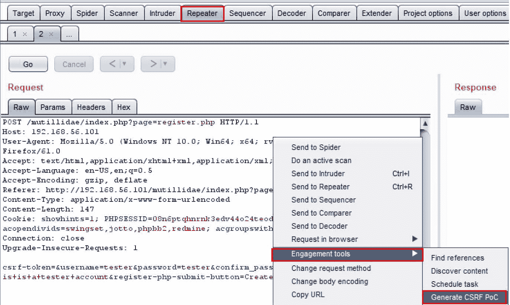
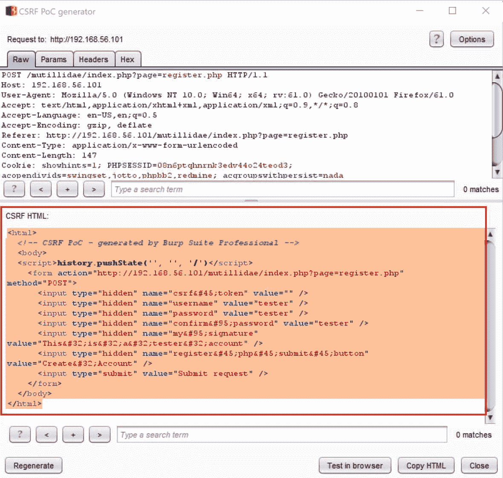
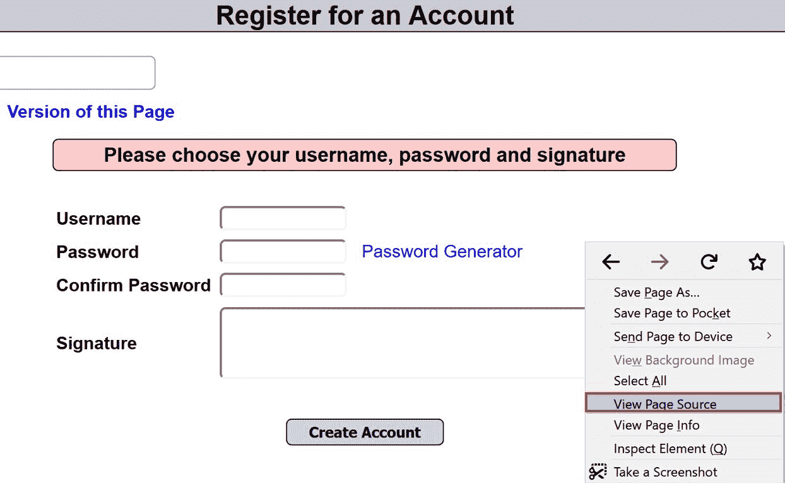

# 第六章：评估会话管理机制

在本章中，我们将涵盖以下示例：

+   使用 Sequencer 测试会话令牌强度

+   测试 cookie 属性

+   测试会话固定

+   测试暴露的会话变量

+   测试跨站请求伪造

# 介绍

本章涵盖了用于绕过和评估会话管理方案的技术。应用程序使用会话管理方案来跟踪用户活动，通常是通过会话令牌。会话管理的 Web 评估还涉及确定所使用的会话令牌的强度以及这些令牌是否得到了适当的保护。我们将学习如何使用 Burp 执行这些测试。

# 软件工具要求

要完成本章的示例，您需要以下内容：

+   OWASP Broken Web Applications（VM）

+   OWASP Mutillidae 链接

+   Burp 代理社区版或专业版（[`portswigger.net/burp/`](https://portswigger.net/burp/)）

+   配置了允许 Burp 代理流量的 Firefox 浏览器（[`www.mozilla.org/en-US/firefox/new/`](https://www.mozilla.org/en-US/firefox/new/)）

# 使用 Sequencer 测试会话令牌强度

为了跟踪应用程序内页面到页面的用户活动，开发人员为每个用户创建和分配唯一的会话令牌值。大多数会话令牌机制包括会话 ID、隐藏表单字段或 cookie。Cookie 被放置在用户的浏览器中，位于客户端。

这些会话令牌应该由渗透测试人员检查，以确保它们的唯一性、随机性和密码强度，以防止信息泄露。

如果会话令牌值很容易被猜到或在登录后保持不变，攻击者可以将预先已知的令牌值应用（或固定）到用户身上。这被称为**会话固定攻击**。一般来说，攻击的目的是收集用户帐户中的敏感数据，因为攻击者知道会话令牌。

# 准备工作

我们将检查 OWASP Mutillidae II 中使用的会话令牌，以确保它们以安全和不可预测的方式创建。能够预测和伪造弱会话令牌的攻击者可以执行会话固定攻击。

# 如何做…

确保 Burp 和 OWASP BWA VM 正在运行，并且已经在用于查看 OWASP BWA 应用程序的 Firefox 浏览器中配置了 Burp。

1.  从**OWASP BWA Landing**页面，点击链接到 OWASP Mutillidae II 应用程序。

1.  打开 Firefox 浏览器，访问 OWASP Mutillidae II 的主页（URL：`http://<your_VM_assigned_IP_address>/mutillidae/`）。确保您正在启动一个新的 Mutillidae 应用程序会话，而不是已经登录：


1.  切换到代理 | HTTP 历史记录选项卡，并选择显示您最初浏览 Mutillidae 主页的请求。

1.  查找`GET`请求和包含`Set-Cookie:`分配的相关响应。每当看到这个分配时，您可以确保您获得了一个新创建的会话 cookie。具体来说，我们对`PHPSESSID` cookie 值感兴趣：



1.  突出显示`PHPSESSID` cookie 的值，右键单击，并选择发送到 Sequencer：


Sequencer 是 Burp 中用于确定会话令牌内部创建的随机性或质量的工具。

1.  将`PHPSESSID`参数的值发送到 Sequencer 后，您将看到该值加载在“选择实时捕获请求”表中。

1.  在按下“开始实时捕获”按钮之前，向下滚动到响应中的令牌位置部分。在 Cookie 下拉列表中，选择`PHPSESSID=<捕获的会话令牌值>`：



1.  由于我们已经选择了正确的 cookie 值，我们可以开始实时捕获过程。单击开始实时捕获按钮，Burp 将发送多个请求，从每个响应中提取 PHPSESSID cookie。在每次捕获后，Sequencer 对每个令牌的随机性水平进行统计分析。

1.  允许捕获收集和分析至少 200 个令牌，但如果您愿意，可以让其运行更长时间：



1.  一旦您至少有 200 个样本，点击立即分析按钮。每当您准备停止捕获过程时，按停止按钮并确认是：


1.  分析完成后，Sequencer 的输出提供了一个总体结果。在这种情况下，PHPSESSID 会话令牌的随机性质量非常好。有效熵的数量估计为 112 位。从 Web 渗透测试人员的角度来看，这些会话令牌非常强大，因此在这里没有漏洞可报告。但是，尽管没有漏洞存在，对会话令牌进行此类检查是一个良好的做法：


# 它是如何工作的...

要更好地理解 Sequencer 背后的数学和假设，请参阅 Portswigger 关于该主题的文档：[`portswigger.net/burp/documentation/desktop/tools/sequencer/tests`](https://portswigger.net/burp/documentation/desktop/tools/sequencer/tests)。

# 测试 cookie 属性

重要的特定于用户的信息，例如会话令牌，通常存储在客户端浏览器的 cookie 中。由于它们的重要性，cookie 需要受到恶意攻击的保护。这种保护通常以两个标志的形式出现——**安全**和**HttpOnly**。

安全标志告诉浏览器，只有在协议加密时（例如 HTTPS，TLS）才将 cookie 发送到 Web 服务器。该标志保护 cookie 免受在未加密通道上的窃听。

HttpOnly 标志指示浏览器不允许通过 JavaScript 访问或操纵 cookie。该标志保护 cookie 免受跨站点脚本攻击。

# 做好准备

检查 OWASP Mutillidae II 应用程序中使用的 cookie，以确保保护标志的存在。由于 Mutillidae 应用程序在未加密的通道上运行（例如 HTTP），我们只能检查是否存在 HttpOnly 标志。因此，安全标志不在此处范围之内。

# 操作步骤...

确保 Burp 和 OWASP BWA VM 正在运行，并且 Burp 已配置在用于查看 OWASP BWA 应用程序的 Firefox 浏览器中。

1.  从**OWASP BWA 着陆**页面，点击链接到 OWASP Mutillidae II 应用程序。

1.  打开 Firefox 浏览器，访问 OWASP Mutillidae II 的主页（URL：`http://<your_VM_assigned_IP_address>/mutillidae/`）。确保您开始了一个新的会话，并且没有登录到 Mutillidae 应用程序：



1.  切换到代理| HTTP 历史选项卡，并选择显示您最初浏览 Mutillidae 主页的请求。查找`GET`请求及其相关的包含`Set-Cookie:`分配的响应。每当看到这个分配时，您可以确保您获得了一个新创建的会话 cookie。具体来说，我们对`PHPSESSID` cookie 值感兴趣。

1.  检查`Set-Cookie:`分配行的末尾。注意两行都没有 HttpOnly 标志。这意味着 PHPSESSID 和 showhints cookie 值没有受到 JavaScript 操纵的保护。这是一个安全发现，您应该在报告中包括：


# 它是如何工作的...

如果两个 cookie 都设置了 HttpOnly 标志，那么标志将出现在 Set-Cookie 分配行的末尾。当存在时，该标志将紧随着结束 cookie 的路径范围的分号，后面是字符串 HttpOnly。`Secure`标志的显示也类似：

```
Set-Cookie: PHPSESSID=<session token value>;path=/;Secure;HttpOnly;
```

# 测试会话固定

会话令牌被分配给用户以进行跟踪。这意味着在未经身份验证时浏览应用程序时，用户会被分配一个唯一的会话 ID，通常存储在 cookie 中。应用程序开发人员应该在用户登录网站后创建一个新的会话令牌。如果这个会话令牌没有改变，应用程序可能容易受到会话固定攻击的影响。确定这个令牌是否从未经身份验证状态到经过身份验证状态改变的值是 Web 渗透测试人员的责任。

当应用程序开发人员不使未经身份验证的会话令牌失效时，会话固定就存在。这使得用户可以在身份验证后继续使用相同的会话令牌。这种情况允许具有窃取会话令牌的攻击者冒充用户。

# 准备工作

使用 OWASP Mutillidae II 应用程序和 Burp 的 Proxy HTTP 历史和 Comparer，我们将检查未经身份验证的 PHPSESSID 会话令牌值。然后，我们将登录应用程序，并将未经身份验证的值与经过身份验证的值进行比较，以确定会话固定漏洞的存在。

# 操作步骤

1.  导航到登录界面（从顶部菜单中点击登录/注册），但暂时不要登录。

1.  切换到 Burp 的**Proxy** HTTP 历史选项卡，并查找显示您浏览到登录界面时的`GET`请求。记下放置在 cookie 中的`PHPSESSID`参数的值：



1.  右键单击`PHPSESSID`参数并将请求发送到 Comparer：


1.  返回登录界面（从顶部菜单中点击登录/注册），这次使用用户名`ed`和密码`pentest`登录。

1.  登录后，切换到 Burp 的**Proxy** HTTP 历史选项卡。查找显示您的登录的`POST`请求（例如，302 HTTP 状态代码），以及紧随`POST`之后的即时`GET`请求。注意登录后分配的`PHPSESSID`。右键单击并将此请求发送到 Comparer。

1.  切换到 Burp 的 Comparer。适当的请求应该已经为您突出显示。点击右下角的 Words 按钮：


弹出窗口显示了两个请求之间的差异的详细比较。注意`PHPSESSID`的值在未经身份验证的会话（左侧）和经过身份验证的会话（右侧）之间没有变化。这意味着应用程序存在会话固定漏洞：


# 工作原理…

在这个示例中，我们检查了未经身份验证用户分配的`PHPSESSID`值，即使在身份验证后仍保持不变。这是一个安全漏洞，允许进行会话固定攻击。

# 测试暴露的会话变量

诸如令牌、cookie 或隐藏表单字段之类的会话变量被应用程序开发人员用于在客户端和服务器之间发送数据。由于这些变量在客户端暴露，攻击者可以操纵它们，试图获取未经授权的数据或捕获敏感信息。

Burp 的 Proxy 选项提供了一个功能，可以增强所谓的*隐藏*表单字段的可见性。这个功能允许 Web 应用程序渗透测试人员确定这些变量中保存的数据的敏感级别。同样，渗透测试人员可以确定操纵这些值是否会导致应用程序行为不同。

# 准备工作

使用 OWASP Mutillidae II 应用程序和 Burp 的 Proxy 的 Unhide hidden form fields 功能，我们将确定隐藏表单字段值的操纵是否会导致获取未经授权的数据访问。

# 操作步骤

1.  切换到 Burp 的**Proxy**选项卡，向下滚动到响应修改部分，并选中 Unhide hidden form fields 和 Prominently highlight unhidden fields 的复选框：


1.  导航到**User Info**页面。OWASP 2013 | A1 – Injection (SQL) | SQLi – Extract Data | User Info (SQL)：


1.  注意现在页面上明显显示的隐藏表单字段：



1.  让我们尝试操纵所显示的值，将`user-info.php`更改为`admin.php`，并查看应用程序的反应。在隐藏字段[page]文本框中将`user-info.php`修改为`admin.php`：


1.  在进行更改后按下*Enter*键。现在您应该看到一个新页面加载，显示**PHP 服务器配置**信息：


# 工作原理...

正如本教程中所看到的，隐藏表单字段并没有什么隐秘。作为渗透测试人员，我们应该检查和操纵这些值，以确定是否无意中暴露了敏感信息，或者我们是否可以改变应用程序的行为，使其与我们的角色和身份验证状态所期望的不同。在本教程中，我们甚至没有登录到应用程序中。我们操纵了标记为**page**的隐藏表单字段，以访问包含指纹信息的页面。这样的信息访问应该受到未经身份验证的用户的保护。

# 测试跨站请求伪造

**跨站请求伪造**（**CSRF**）是一种利用经过身份验证的用户会话来允许攻击者强制用户代表其执行不需要的操作的攻击。这种攻击的初始诱饵可能是钓鱼邮件或通过受害者网站上发现的跨站脚本漏洞执行的恶意链接。CSRF 利用可能导致数据泄露，甚至完全妥协 Web 应用程序。

# 准备工作

使用 OWASP Mutillidae II 应用程序注册表单，确定在同一浏览器（不同标签页）中是否可能发生 CSRF 攻击，同时已经有一个经过身份验证的用户登录到应用程序中。

# 如何做...

为了对本教程进行基准测试，首先基线化账户表中当前的记录数量，并执行 SQL 注入来查看：

1.  导航到**用户信息**页面：OWASP 2013 | A1 – Injection (SQL) | SQLi – Extract Data | User Info (SQL)。

1.  在用户名提示处，输入一个 SQL 注入有效负载来转储整个账户表内容。有效负载是`' or 1=1--` <space>（单引号或 1 等于 1 破折号空格）。然后点击查看账户详情按钮。

1.  请记住在两个破折号后包括空格，因为这是一个 MySQL 数据库；否则，有效负载将无法工作：


1.  当操作正确时，会显示一个消息，指出数据库中找到了 24 条用户记录。消息后显示的数据显示了所有 24 个账户的用户名、密码和签名字符串。这里只显示了两个账户的详细信息作为示例：


我们确认数据库的账户表中目前存在 24 条记录。

1.  现在，返回到登录页面（从顶部菜单中点击登录/注册），并选择“请在此注册”链接。

1.  点击“请在此注册”链接后，会出现一个注册表格。

1.  填写表格以创建一个测试账户。将用户名输入为*tester*，密码输入为*tester*，签名输入为`This is a tester account`：


1.  点击创建账户按钮后，您应该收到一个绿色横幅，确认账户已创建：


1.  返回到**用户信息**页面：**OWASP 2013| A1 – Injection (SQL) | SQLi – Extract Data | User Info (SQL)**。

1.  再次执行 SQL 注入攻击，并验证您现在可以在账户表中看到 25 行，而不是之前的 24 行：


1.  切换到 Burp 的代理 HTTP 历史记录标签，并查看创建测试账户的`POST`请求。

1.  研究这个`POST`请求显示了`POST`操作（`register.php`）和执行操作所需的主体数据，即`用户名`、`密码`、`确认密码`和`我的签名`。还要注意没有使用 CSRF 令牌。CSRF 令牌被放置在 Web 表单中，以防止我们即将执行的攻击。让我们继续。

1.  右键单击`POST`请求，然后单击发送到 Repeater：


1.  如果您使用 Burp Professional，请右键单击选择 Engagement 工具|生成 CSRF PoC：



1.  单击此功能后，将生成一个弹出框，其中包含在注册页面上使用的相同表单，但没有任何 CSRF 令牌保护：



1.  如果您使用 Burp Community，可以通过查看注册页面的源代码轻松重新创建**CSRF PoC**表单：



1.  在查看页面源代码时，向下滚动到`<form>`标签部分。为简洁起见，下面重新创建了表单。将`attacker`作为用户名、密码和签名的值。复制以下 HTML 代码并将其保存在名为`csrf.html`的文件中：

```
<html>
  <body>
  <script>history.pushState('', '', '/')</script>
    <form action="http://192.168.56.101/mutillidae/index.php?page=register.php" method="POST">
      <input type="hidden" name="csrf-token" value="" />
      <input type="hidden" name="username" value="attacker" />
      <input type="hidden" name="password" value="attacker" />
      <input type="hidden" name="confirm_password" value="attacker" 
/>      <input type="hidden" name="my_signature" value="attacker account" />
      <input type="hidden" name="register-php-submit-button" value="Create Account" />
      <input type="submit" value="Submit request" />
    </form>
  </body>
</html>
```

1.  现在，返回到登录屏幕（从顶部菜单中单击登录/注册），并使用用户名`ed`和密码`pentest`登录应用程序。

1.  打开您的计算机上保存了`csrf.html`文件的位置。将文件拖到已经通过身份验证的 ed 的浏览器中。在您将文件拖到此浏览器后，`csrf.html`将出现为同一浏览器中的单独标签：


1.  出于演示目的，有一个提交请求按钮。但是，在实际情况中，JavaScript 函数会自动执行创建攻击者帐户的操作。单击提交请求按钮：


您应该收到一个确认消息，即攻击者帐户已创建：


1.  切换到 Burp 的 Proxy | HTTP history 选项卡，并找到恶意执行的用于在 ed 的经过身份验证的会话上创建攻击者帐户的`POST`：


1.  返回到**用户信息**页面：OWASP 2013 | A1 – Injection (SQL) | SQLi – Extract Data | User Info (SQL)，然后再次执行 SQL 注入攻击。现在，您将看到帐户表中的行数从之前的 25 行增加到 26 行：


# 它是如何工作的...

CSRF 攻击需要一个经过身份验证的用户会话，以便代表攻击者在应用程序中秘密执行操作。在这种情况下，攻击者利用 ed 的会话重新运行注册表单，为攻击者创建一个帐户。如果`ed`是管理员，这可能会允许提升帐户角色。
